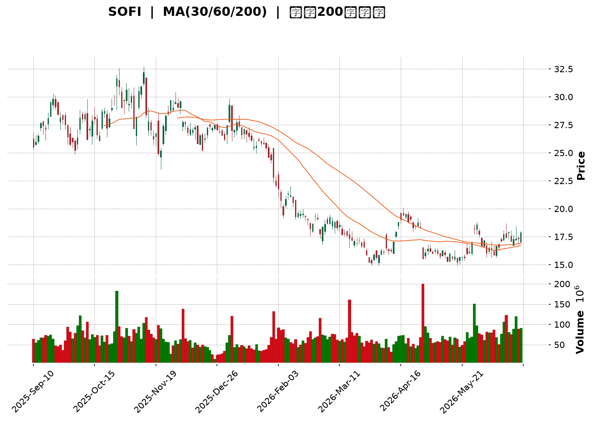
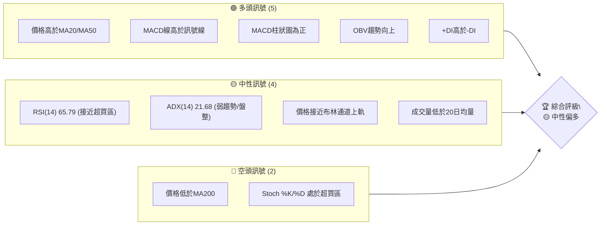
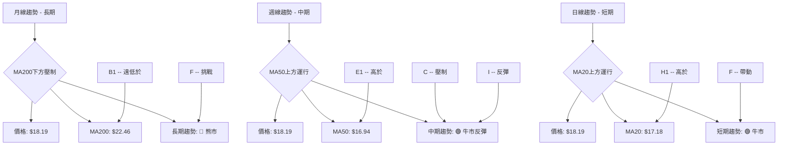
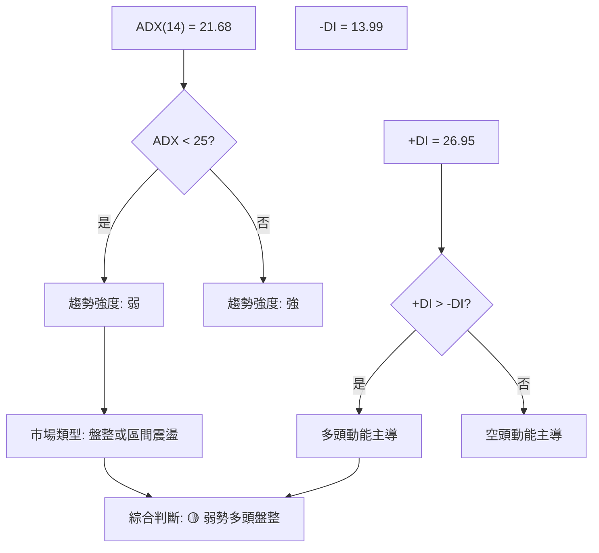
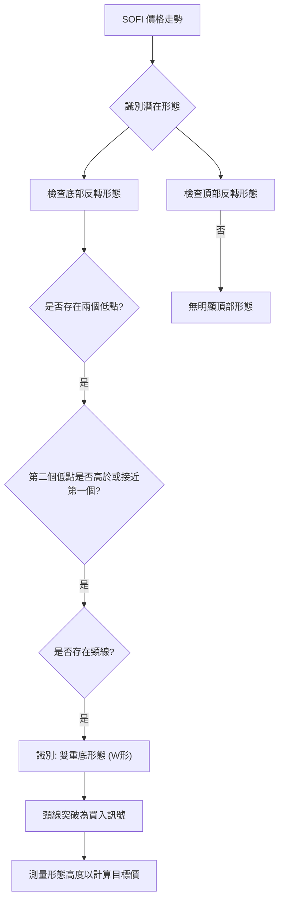
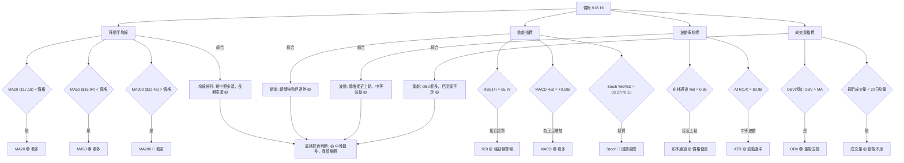
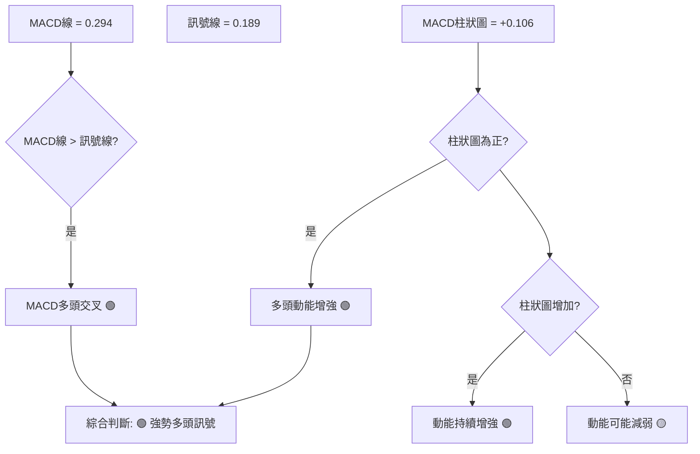
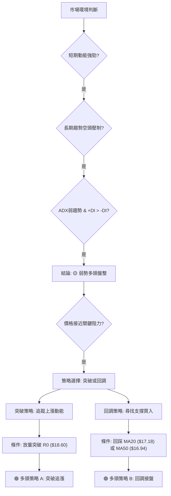
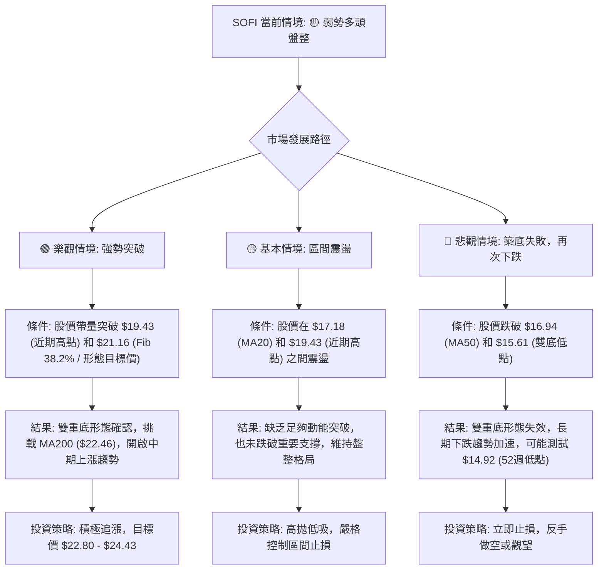

<details>
<summary>📊 靜態圖表 (點擊展開)</summary>

</details>

<html>
<head><meta charset="utf-8" /></head>
<body>
    <div style="height:500px; width:100%;">                        <script>window.PlotlyConfig = {MathJaxConfig: 'local'};</script>
        <script charset="utf-8" src="https://cdn.plot.ly/plotly-3.6.0.min.js" integrity="sha256-QaOVwtVY0T02VaHrr6pnoHLCwayMJp4O5n4YyaE3rJk=" crossorigin="anonymous"></script>                <div id="candlestick-chart" class="plotly-graph-div" style="height:100%; width:100%;"></div>            <script>                window.PLOTLYENV=window.PLOTLYENV || {};                                if (document.getElementById("candlestick-chart")) {                    Plotly.newPlot(                        "candlestick-chart",                        [{"close":{"dtype":"f8","bdata":"AAAAgML1OUAAAADAzIw6QAAAACCFqztAAAAAIIVrO0AAAAAA1yM7QAAAAAApHDxAAAAAYI+CPUAAAAAgXM89QAAAAEAKFz1AAAAA4KNwPEAAAABguB48QAAAAEDh+jtAAAAAwMyMO0AAAAAghWs6QAAAAGCPwjlAAAAA4FH4OUAAAACgcD05QAAAAAApXDpAAAAAANcjPEAAAADAHgU8QAAAAEAzczxAAAAA4KMwOkAAAAAA1yM7QAAAAGC43jtAAAAAIK4HPEAAAACgmZk6QAAAAIA9ijpAAAAAgBSuPEAAAAAAAMA8QAAAAOCjMDtAAAAA4HoUPEAAAABgjwI9QAAAAAAAAD5AAAAAwPWoP0AAAABgZuY+QAAAACCuBz1AAAAAgBSuPUAAAACgR6E+QAAAAGC4Xj1AAAAAgOsRPkAAAADA9Sg7QAAAAIDCNTxAAAAAgD2KPkAAAABAM\u002fM+QAAAAEDhGkBAAAAAANdjPEAAAACA69E7QAAAAIA9CjtAAAAAoHA9OkAAAADgUbg6QAAAAMD16DhAAAAA4KMwOUAAAABgZmY7QAAAAOB6VDxAAAAAoHB9PEAAAADgUbg9QAAAACCuBz1AAAAAYI+CPUAAAACA6xE9QAAAAKCZmT1AAAAAIK7HO0AAAAAAKZw7QAAAAOB61DpAAAAAQAoXO0AAAACA6xE7QAAAACCuRztAAAAAgOvROUAAAADgepQ6QAAAAMAeRTlAAAAAgD1KOkAAAACgcD07QAAAAKCZWTtAAAAA4KMwO0AAAABA4Xo7QAAAAIDrETtAAAAAgOvROkAAAAAgXI86QAAAAIAULjpAAAAAgMJ1O0AAAAAgrkc9QAAAAEDh+jpAAAAAAAAAO0AAAADgUbg7QAAAAGBmZjtAAAAAoJmZOkAAAAAA1yM7QAAAACCFqzpAAAAA4KNwOkAAAACgRyE6QAAAAKBwfTlAAAAAANejOUAAAABAChc6QAAAAKCZ2TlAAAAAwMzMOUAAAACAwnU5QAAAAKCZmThAAAAAAClcOEAAAAAgXM82QAAAAOB6FDZAAAAAYI\u002fCNUAAAAAAAMA0QAAAAIDCdTNAAAAAACncNEAAAACgmVk1QAAAAIAULjVAAAAAwMyMNEAAAADAzEwzQAAAAAApnDNAAAAAYI+CM0AAAACAPYozQAAAAMDMTDNAAAAAwB4FM0AAAADgUTgyQAAAAMD1qDJAAAAAgD1KM0AAAACgmRkzQAAAAGCPwjFAAAAAANdjMkAAAAAAKZwyQAAAAEAzszJAAAAAAABAM0AAAABgZuYyQAAAAIA9yjJAAAAAgD1KMkAAAAAgrocyQAAAAEAzszFAAAAAYI\u002fCMUAAAACgR6ExQAAAAGC4XjFAAAAAgBQuMUAAAADgehQxQAAAAGBm5jBAAAAAYGYmMUAAAABAM7MwQAAAACBcjzBAAAAAoHC9L0AAAACAwnUuQAAAAMDMTC5AAAAAYI\u002fCL0AAAABgj0IvQAAAAEAzsy9AAAAAwB5FMEAAAAAAKRwwQAAAAKBwfTBAAAAAwB5FMEAAAADgUTgwQAAAAMDMDDFAAAAAwPXoMUAAAACAPcoyQAAAACCuBzNAAAAAgBRuM0AAAAAAAIAzQAAAAOB61DJAAAAAIFwPM0AAAACA61EyQAAAAOCjcDJAAAAAYI\u002fCMkAAAAAAKVwyQAAAAMDMDC9AAAAAoJkZMEAAAACAFG4wQAAAAEAzMzBAAAAAwB4FMEAAAADAzEwwQAAAAAAAADBAAAAAAACAL0AAAABgj0IwQAAAAMDMzC9AAAAAYLieLkAAAADAHgUwQAAAAOBROC9AAAAAIIVrL0AAAACAwnUuQAAAAKBHYS9AAAAAwMxML0AAAACgcD0vQAAAAIDC9S9AAAAAIIUrMEAAAADgUfgwQAAAAOBRODJAAAAA4HqUMkAAAACgcL0xQAAAAIAUrjBAAAAAYGYmMUAAAAAgrgcwQAAAAAAAgDBAAAAA4FF4MEAAAACgcL0vQAAAACCFqzBAAAAA4HqUMEAAAACgRyExQAAAAIDCtTFAAAAAIIVrMUAAAADA9egxQAAAAKCZGTFAAAAAgD1KMUAAAAAgXE8xQAAAAMDMTDFAAAAAoEfhMUAAAADgozAyQA=="},"high":{"dtype":"f8","bdata":"AAAAoJmZOkAAAADgo7A6QAAAAMAexTtAAAAAoEfhO0AAAACAwnU7QAAAAEC2kzxAAAAAoEehPUAAAADAzEw+QAAAAADXIz5AAAAAIIWrPUAAAAAghas8QAAAAEDhejxAAAAAoEehPEAAAAAAKZw7QAAAAOB6VDtAAAAAoJlZOkAAAACAFC46QAAAAADXIztAAAAAQArXPEAAAACAwrU8QAAAAOCjsDxAAAAAwMzMPUAAAACAFG47QAAAAKCZWTxAAAAAQAoXPUAAAADgo3A8QAAAACCF6zpAAAAAgBTuPEAAAACA6xE9QAAAAMDMzDxAAAAA4FGYPEAAAABguN49QAAAAEAzMz5AAAAAQOH6P0AAAADgUUhAQAAAAIA96j5AAAAAACncPUAAAADgUTg\u002fQAAAAIA9yj5AAAAAYLhePkAAAABg59s+QAAAAKBwPTxAAAAA4FH4PkAAAACgcP0+QAAAAKBwXUBAAAAAAADAP0AAAACA6xE9QAAAAEAz8ztAAAAAAAAAO0AAAACgmdk6QAAAAEAzkzxAAAAAgOtxOUAAAAAAKZw7QAAAAEAzczxAAAAAAABAPUAAAAAAAMA9QAAAAEAzsz1AAAAAIIVrPkAAAACAFO49QAAAAEAzsz1AAAAAgBTuO0AAAADgetQ7QAAAAEAzcztAAAAAgBSuO0AAAAAgrkc7QAAAAAAAgDtAAAAAQOF6O0AAAACgcL06QAAAAIDC1TpAAAAAQAq3OkAAAABguF47QAAAAGC4njtAAAAAQApXO0AAAACAPYo7QAAAAMDMjDtAAAAAwPVoO0AAAAAA1yM7QAAAAGBm5jpAAAAAoEeBO0AAAAAAKdw9QAAAAMDMTD1AAAAAgBQuO0AAAACAFA48QAAAAAAAYDxAAAAAYOVQO0AAAABAMzM7QAAAAIDCFTtAAAAA4HpUO0AAAAAgrsc6QAAAAEAKVzpAAAAAwMwMOkAAAAAA12M6QAAAAKBHITpAAAAAYGZmOkAAAACAFO45QAAAAIA9yjlAAAAAYLgeOUAAAADgUXg5QAAAAAAAADdAAAAAAClcN0AAAAAA18M1QAAAAGBmZjRAAAAAwPUoNUAAAABACpc1QAAAAAAAADZAAAAAoJkZNUAAAACAPco0QAAAAGC43jNAAAAAQArXM0AAAABgjwI0QAAAAEDhejNAAAAA4KMwM0AAAACgR8EyQAAAAIDCtTJAAAAAYLieM0AAAAAgXI8zQAAAAIDCNTJAAAAAwPVoMkAAAACAPQozQAAAACCuRzNAAAAAQOF6M0AAAABguD4zQAAAAIDr8TJAAAAAYGYGM0AAAACgmdkyQAAAAMDMjDJAAAAAYGYmMkAAAACA6xEyQAAAAKBHQTJAAAAAIK4HMkAAAAAghUsxQAAAAMByaDFAAAAAwPVoMUAAAACA6xExQAAAAEAKVzFAAAAAoHB9MEAAAACgR2EvQAAAAKBHIS9AAAAAYGYGMEAAAACA61EwQAAAACCuxy9AAAAAwMxsMEAAAABA4VowQAAAAKCZ2TFAAAAA4FF4MEAAAACgcH0wQAAAACBcDzFAAAAAQDMTMkAAAACA69EyQAAAAGC4njNAAAAAoEchNEAAAADAHqUzQAAAAMAexTNAAAAAILByM0AAAABgZuYyQAAAAEAzkzJAAAAAIIUrM0AAAABguN4yQAAAAEAKlzBAAAAAYLheMEAAAAAghcswQAAAACCuxzBAAAAAIFxPMEAAAACgR4EwQAAAAIDCdTBAAAAAwMwMMEAAAACA61EwQAAAAOB6VDBAAAAAIIVrL0AAAADgoxAwQAAAAIAUri9AAAAAgOtRMEAAAAAgrkcvQAAAAOCjcC9AAAAAgOuRL0AAAAAAKdwvQAAAAEAz8zBAAAAA4KOwMEAAAADgehQxQAAAAEAKlzJAAAAAIIXLMkAAAABA4ToyQAAAAEAKdzFAAAAAQOE6MUAAAACgcP0wQAAAAMD1qDBAAAAAoJkZMUAAAADgUbgwQAAAAOCjsDBAAAAAIK7nMEAAAACAFG4xQAAAAOB6FDJAAAAAQDOzMkAAAACgcP0xQAAAACBcDzJAAAAAgBSuMUAAAACAFG4yQAAAAEAzkzFAAAAA4FH4MUAAAADAzEwyQA=="},"hovertemplate":"\u003cb\u003e%{x|%Y-%m-%d}\u003c\u002fb\u003e\u003cbr\u003e\u958b: $%{open:.2f}\u003cbr\u003e\u9ad8: $%{high:.2f}\u003cbr\u003e\u4f4e: $%{low:.2f}\u003cbr\u003e\u6536: $%{close:.2f}\u003cextra\u003e\u003c\u002fextra\u003e","low":{"dtype":"f8","bdata":"AAAAYLieOUAAAADAHsU5QAAAACBc7zpAAAAAoEehOkAAAACgRyE6QAAAAOB6FDtAAAAAoHA9PEAAAADgUfg8QAAAAKCZ2TxAAAAAoJlZPEAAAAAgXA87QAAAACBcjztAAAAAACkcO0AAAABAM7M5QAAAAADXozlAAAAAQDNzOUAAAABACtc4QAAAACBcTzlAAAAAgBSuOkAAAADAHqU7QAAAAAAAwDtAAAAAoEchOkAAAADgUXg6QAAAAAAAwDlAAAAAIFyPO0AAAAAAAEA6QAAAAGCPAjpAAAAAIFwPO0AAAABgZiY8QAAAAKBHYTpAAAAAoPEyO0AAAABAM7M8QAAAAMAeRT1AAAAAwMzMPEAAAAAA1yM+QAAAAEDh+jxAAAAAoHB9PEAAAADgelQ9QAAAAOCjsDxAAAAAYI8CPUAAAACgRyE7QAAAAMD1qDlAAAAAQArXPEAAAADgIts9QAAAAIDC9T5AAAAAYGYmPEAAAAAgroc6QAAAAMDMjDpAAAAAgMK1OUAAAAAgXI85QAAAAGC4vjhAAAAAwB6FN0AAAAAgrqc5QAAAAKBHoTpAAAAAIFxPPEAAAADgenQ8QAAAACCFqzxAAAAA4KNQPUAAAADAHgU9QAAAAEDhejxAAAAAgBTuOkAAAADAzAw7QAAAAMDMjDpAAAAAQOF6OkAAAACAFI46QAAAAEAzMzpAAAAAgD3KOUAAAADgUbg5QAAAACCFKzlAAAAAQDPzOUAAAAAgrkc6QAAAAKCZGTtAAAAAQDPTOkAAAAAgrgc7QAAAACCuBztAAAAAoHC9OkAAAACAPYo6QAAAACBcDzpAAAAAgD3KOUAAAACgmZk7QAAAACCuBzpAAAAAoHBdOkAAAACA65E6QAAAAEDhOjtAAAAAQDMzOkAAAADgUTg6QAAAACCF6zlAAAAAgMI1OkAAAABgjwI6QAAAAIDCNTlAAAAAQDPzOEAAAAAAAAA6QAAAAKCZmTlAAAAAwB7FOUAAAACAwjU5QAAAAIDrkThAAAAAwMwMOEAAAAAgXE82QAAAAAAp3DVAAAAAwB4FNUAAAACA6xE0QAAAAACqMTNAAAAAgD0KNEAAAADAzMw0QAAAAMDMDDVAAAAAANcjNEAAAACAPQozQAAAAGBmJjNAAAAAACkcM0AAAACgmTkzQAAAAOBR+DJAAAAAANeDMkAAAADgepQxQAAAAADX4zFAAAAAgBTuMkAAAADgUfgyQAAAACBcTzFAAAAAwMzMMEAAAADgo7AxQAAAAAApnDJAAAAAANejMkAAAABguB4yQAAAAMAexTFAAAAAgD0KMkAAAADgUfgxQAAAAGC4njFAAAAAIK6HMUAAAADgUXgxQAAAAEDhejBAAAAAwPUoMUAAAADgepQwQAAAACCFqzBAAAAAQArXMEAAAACgcH0wQAAAAMAehTBAAAAAACmcL0AAAADAzEwuQAAAAGC43i1AAAAAYLieLkAAAACgR+EuQAAAAAAp3C1AAAAAYI\u002fCL0AAAACA69EvQAAAAGCPQjBAAAAA4HrUL0AAAADgURgwQAAAACCF6y9AAAAAYGZmMUAAAAAghSsyQAAAAGBmpjJAAAAAANdjM0AAAABAChczQAAAAOCjsDJAAAAAwPXoMkAAAACAFO4xQAAAAIDAKjJAAAAAANdjMkAAAADAHkUyQAAAAAAAAC9AAAAA4HoUL0AAAAAAAMAvQAAAAKBHITBAAAAAoEfhL0AAAABA4fovQAAAAMD1qC9AAAAAgD0KL0AAAACAPYovQAAAAKCZGS9AAAAAgBRuLkAAAACAwnUuQAAAAGCPwi5AAAAAgBSuLkAAAABACtctQAAAACBcDy5AAAAAQDOzLkAAAADgUbguQAAAAOBRuC9AAAAAYI8CMEAAAAAA16MvQAAAAIAUrjFAAAAA4KOwMUAAAACAwnUxQAAAAOB6lDBAAAAAgMKVMEAAAAAAKVwvQAAAAMD16C9AAAAA4E9NL0AAAADA9agvQAAAACBcTy9AAAAAQOE6MEAAAABgjwIxQAAAAACsHDFAAAAAAClcMUAAAAAA10MxQAAAAIDrETFAAAAA4FG4MEAAAACAFC4xQAAAAIDr0TBAAAAAoHD9MEAAAAAAAIAxQA=="},"name":"\u50f9\u683c","open":{"dtype":"f8","bdata":"AAAAYI\u002fCOUAAAAAAAAA6QAAAAAAAQDtAAAAAgD3KO0AAAAAAAEA7QAAAAEAKlztAAAAAANdDPEAAAADAzEw9QAAAAIAUzj1AAAAAAACAPUAAAABgj8I7QAAAAGC4XjxAAAAAAClcPEAAAADgUXg7QAAAAEDhujpAAAAA4HpUOkAAAACgmRk6QAAAAMAexTlAAAAAoJkZO0AAAACgcH08QAAAAIA9CjxAAAAAwMyMPEAAAACA6xE7QAAAAGCPgjpAAAAAQDMzPEAAAACA6xE8QAAAAKCZGTpAAAAAQDMzO0AAAAAgXI88QAAAAKBwfTxAAAAA4HpUO0AAAADgUdg8QAAAAAAAAD5AAAAAoHD9PkAAAABguH4\u002fQAAAACBcbz5AAAAA4KOwPUAAAADA9ag9QAAAACCFSz1AAAAAwB6FPUAAAAAAACA+QAAAAGBmhjpAAAAAIFwPPUAAAABguD4+QAAAAIAULj9AAAAAQOG6P0AAAAAAAAA7QAAAAIDCtTtAAAAAYI+COkAAAACgmXk6QAAAAKBH4TtAAAAAoEehOEAAAADgetQ5QAAAAEDh+jpAAAAAgMK1PEAAAACAPco8QAAAAOB61DxAAAAAANdjPUAAAADAzGw9QAAAAMD1CD1AAAAAoHBdO0AAAABA4bo7QAAAAKBwPTtAAAAAYGamOkAAAABACtc6QAAAAMAeJTtAAAAAIFxvO0AAAACgcL05QAAAAADXozpAAAAAgBQuOkAAAABguJ46QAAAAOBRmDtAAAAAgOsRO0AAAAAghSs7QAAAAIA9ijtAAAAAYLjeOkAAAAAgrgc7QAAAAIAUrjpAAAAAwPWoOkAAAAAgXM87QAAAAEDhOj1AAAAAoHDdOkAAAAAAAAA7QAAAAIAUzjtAAAAAgD1KO0AAAABAM7M6QAAAAAAAADtAAAAAIFzPOkAAAACAPYo6QAAAAOCjcDlAAAAAAACAOUAAAACAFC46QAAAAAAAADpAAAAAYGbmOUAAAABgZuY5QAAAAAAAgDlAAAAAoHDdOEAAAACAFG45QAAAAGCPgjZAAAAAwMwMN0AAAACgcH01QAAAAEDhOjRAAAAAgD1KNEAAAACAPUo1QAAAAEAKFzVAAAAAoJkZNUAAAACAPco0QAAAACCuRzNAAAAAwPVoM0AAAADgUXgzQAAAAOB6VDNAAAAAgMIVM0AAAABA4boyQAAAAAAAADJAAAAAIK5HM0AAAADgozAzQAAAAMD1KDJAAAAAwB4lMUAAAAAAAAAyQAAAACBcDzNAAAAAYGamMkAAAAAAKXwyQAAAAOB6VDJAAAAAIIXrMkAAAAAA12MyQAAAAOBRODJAAAAAwMzMMUAAAAAAAAAyQAAAAOBRuDFAAAAAgBRuMUAAAAAAAMAwQAAAAIA96jBAAAAAIK4nMUAAAABguP4wQAAAAIA9CjFAAAAAYGZGMEAAAABAClcvQAAAAAAp3C5AAAAAYGbmLkAAAABgZkYwQAAAAKBHYS5AAAAAIK7HL0AAAADA9SgwQAAAAIAUrjFAAAAAANdjMEAAAADAzEwwQAAAAAAAADBAAAAAIK6HMUAAAADgUXgyQAAAAGC4njNAAAAAoJmZM0AAAABgj0IzQAAAAGCPgjNAAAAAgD1KM0AAAADAHsUyQAAAAOCjcDJAAAAAQOF6MkAAAADAHmUyQAAAAMDMjDBAAAAAgD2KL0AAAAAAKTwwQAAAAOBReDBAAAAAIIUrMEAAAABAMzMwQAAAAGCPQjBAAAAAIK4HMEAAAACgmZkvQAAAAIDrETBAAAAAIIVrL0AAAABguJ4uQAAAAGBmZi9AAAAAgML1LkAAAACAwjUvQAAAAEDhui5AAAAAoHA9L0AAAABgZmYvQAAAAEDhejBAAAAAwMwMMEAAAADAHgUwQAAAAGCPQjJAAAAAYGYmMkAAAAAgrgcyQAAAAKBHYTFAAAAAwPWoMEAAAABA4bowQAAAAIAULjBAAAAAYGZmMEAAAADgejQwQAAAAADXoy9AAAAAgOvRMEAAAAAgrkcxQAAAAEAzMzFAAAAAIFzPMUAAAABAM9MxQAAAAEAKlzFAAAAAACm8MEAAAADgUTgxQAAAAGBmZjFAAAAAAAAAMUAAAABAMzMyQA=="},"x":["2025-09-11T00:00:00-04:00","2025-09-12T00:00:00-04:00","2025-09-15T00:00:00-04:00","2025-09-16T00:00:00-04:00","2025-09-17T00:00:00-04:00","2025-09-18T00:00:00-04:00","2025-09-19T00:00:00-04:00","2025-09-22T00:00:00-04:00","2025-09-23T00:00:00-04:00","2025-09-24T00:00:00-04:00","2025-09-25T00:00:00-04:00","2025-09-26T00:00:00-04:00","2025-09-29T00:00:00-04:00","2025-09-30T00:00:00-04:00","2025-10-01T00:00:00-04:00","2025-10-02T00:00:00-04:00","2025-10-03T00:00:00-04:00","2025-10-06T00:00:00-04:00","2025-10-07T00:00:00-04:00","2025-10-08T00:00:00-04:00","2025-10-09T00:00:00-04:00","2025-10-10T00:00:00-04:00","2025-10-13T00:00:00-04:00","2025-10-14T00:00:00-04:00","2025-10-15T00:00:00-04:00","2025-10-16T00:00:00-04:00","2025-10-17T00:00:00-04:00","2025-10-20T00:00:00-04:00","2025-10-21T00:00:00-04:00","2025-10-22T00:00:00-04:00","2025-10-23T00:00:00-04:00","2025-10-24T00:00:00-04:00","2025-10-27T00:00:00-04:00","2025-10-28T00:00:00-04:00","2025-10-29T00:00:00-04:00","2025-10-30T00:00:00-04:00","2025-10-31T00:00:00-04:00","2025-11-03T00:00:00-05:00","2025-11-04T00:00:00-05:00","2025-11-05T00:00:00-05:00","2025-11-06T00:00:00-05:00","2025-11-07T00:00:00-05:00","2025-11-10T00:00:00-05:00","2025-11-11T00:00:00-05:00","2025-11-12T00:00:00-05:00","2025-11-13T00:00:00-05:00","2025-11-14T00:00:00-05:00","2025-11-17T00:00:00-05:00","2025-11-18T00:00:00-05:00","2025-11-19T00:00:00-05:00","2025-11-20T00:00:00-05:00","2025-11-21T00:00:00-05:00","2025-11-24T00:00:00-05:00","2025-11-25T00:00:00-05:00","2025-11-26T00:00:00-05:00","2025-11-28T00:00:00-05:00","2025-12-01T00:00:00-05:00","2025-12-02T00:00:00-05:00","2025-12-03T00:00:00-05:00","2025-12-04T00:00:00-05:00","2025-12-05T00:00:00-05:00","2025-12-08T00:00:00-05:00","2025-12-09T00:00:00-05:00","2025-12-10T00:00:00-05:00","2025-12-11T00:00:00-05:00","2025-12-12T00:00:00-05:00","2025-12-15T00:00:00-05:00","2025-12-16T00:00:00-05:00","2025-12-17T00:00:00-05:00","2025-12-18T00:00:00-05:00","2025-12-19T00:00:00-05:00","2025-12-22T00:00:00-05:00","2025-12-23T00:00:00-05:00","2025-12-24T00:00:00-05:00","2025-12-26T00:00:00-05:00","2025-12-29T00:00:00-05:00","2025-12-30T00:00:00-05:00","2025-12-31T00:00:00-05:00","2026-01-02T00:00:00-05:00","2026-01-05T00:00:00-05:00","2026-01-06T00:00:00-05:00","2026-01-07T00:00:00-05:00","2026-01-08T00:00:00-05:00","2026-01-09T00:00:00-05:00","2026-01-12T00:00:00-05:00","2026-01-13T00:00:00-05:00","2026-01-14T00:00:00-05:00","2026-01-15T00:00:00-05:00","2026-01-16T00:00:00-05:00","2026-01-20T00:00:00-05:00","2026-01-21T00:00:00-05:00","2026-01-22T00:00:00-05:00","2026-01-23T00:00:00-05:00","2026-01-26T00:00:00-05:00","2026-01-27T00:00:00-05:00","2026-01-28T00:00:00-05:00","2026-01-29T00:00:00-05:00","2026-01-30T00:00:00-05:00","2026-02-02T00:00:00-05:00","2026-02-03T00:00:00-05:00","2026-02-04T00:00:00-05:00","2026-02-05T00:00:00-05:00","2026-02-06T00:00:00-05:00","2026-02-09T00:00:00-05:00","2026-02-10T00:00:00-05:00","2026-02-11T00:00:00-05:00","2026-02-12T00:00:00-05:00","2026-02-13T00:00:00-05:00","2026-02-17T00:00:00-05:00","2026-02-18T00:00:00-05:00","2026-02-19T00:00:00-05:00","2026-02-20T00:00:00-05:00","2026-02-23T00:00:00-05:00","2026-02-24T00:00:00-05:00","2026-02-25T00:00:00-05:00","2026-02-26T00:00:00-05:00","2026-02-27T00:00:00-05:00","2026-03-02T00:00:00-05:00","2026-03-03T00:00:00-05:00","2026-03-04T00:00:00-05:00","2026-03-05T00:00:00-05:00","2026-03-06T00:00:00-05:00","2026-03-09T00:00:00-04:00","2026-03-10T00:00:00-04:00","2026-03-11T00:00:00-04:00","2026-03-12T00:00:00-04:00","2026-03-13T00:00:00-04:00","2026-03-16T00:00:00-04:00","2026-03-17T00:00:00-04:00","2026-03-18T00:00:00-04:00","2026-03-19T00:00:00-04:00","2026-03-20T00:00:00-04:00","2026-03-23T00:00:00-04:00","2026-03-24T00:00:00-04:00","2026-03-25T00:00:00-04:00","2026-03-26T00:00:00-04:00","2026-03-27T00:00:00-04:00","2026-03-30T00:00:00-04:00","2026-03-31T00:00:00-04:00","2026-04-01T00:00:00-04:00","2026-04-02T00:00:00-04:00","2026-04-06T00:00:00-04:00","2026-04-07T00:00:00-04:00","2026-04-08T00:00:00-04:00","2026-04-09T00:00:00-04:00","2026-04-10T00:00:00-04:00","2026-04-13T00:00:00-04:00","2026-04-14T00:00:00-04:00","2026-04-15T00:00:00-04:00","2026-04-16T00:00:00-04:00","2026-04-17T00:00:00-04:00","2026-04-20T00:00:00-04:00","2026-04-21T00:00:00-04:00","2026-04-22T00:00:00-04:00","2026-04-23T00:00:00-04:00","2026-04-24T00:00:00-04:00","2026-04-27T00:00:00-04:00","2026-04-28T00:00:00-04:00","2026-04-29T00:00:00-04:00","2026-04-30T00:00:00-04:00","2026-05-01T00:00:00-04:00","2026-05-04T00:00:00-04:00","2026-05-05T00:00:00-04:00","2026-05-06T00:00:00-04:00","2026-05-07T00:00:00-04:00","2026-05-08T00:00:00-04:00","2026-05-11T00:00:00-04:00","2026-05-12T00:00:00-04:00","2026-05-13T00:00:00-04:00","2026-05-14T00:00:00-04:00","2026-05-15T00:00:00-04:00","2026-05-18T00:00:00-04:00","2026-05-19T00:00:00-04:00","2026-05-20T00:00:00-04:00","2026-05-21T00:00:00-04:00","2026-05-22T00:00:00-04:00","2026-05-26T00:00:00-04:00","2026-05-27T00:00:00-04:00","2026-05-28T00:00:00-04:00","2026-05-29T00:00:00-04:00","2026-06-01T00:00:00-04:00","2026-06-02T00:00:00-04:00","2026-06-03T00:00:00-04:00","2026-06-04T00:00:00-04:00","2026-06-05T00:00:00-04:00","2026-06-08T00:00:00-04:00","2026-06-09T00:00:00-04:00","2026-06-10T00:00:00-04:00","2026-06-11T00:00:00-04:00","2026-06-12T00:00:00-04:00","2026-06-15T00:00:00-04:00","2026-06-16T00:00:00-04:00","2026-06-17T00:00:00-04:00","2026-06-18T00:00:00-04:00","2026-06-22T00:00:00-04:00","2026-06-23T00:00:00-04:00","2026-06-24T00:00:00-04:00","2026-06-25T00:00:00-04:00","2026-06-26T00:00:00-04:00","2026-06-29T00:00:00-04:00"],"type":"candlestick"},{"hovertemplate":"MA30: $%{y:.2f}\u003cextra\u003e\u003c\u002fextra\u003e","line":{"color":"#2196F3","dash":"dash","width":2},"mode":"lines","name":"MA30","x":["2025-09-11T00:00:00-04:00","2025-09-12T00:00:00-04:00","2025-09-15T00:00:00-04:00","2025-09-16T00:00:00-04:00","2025-09-17T00:00:00-04:00","2025-09-18T00:00:00-04:00","2025-09-19T00:00:00-04:00","2025-09-22T00:00:00-04:00","2025-09-23T00:00:00-04:00","2025-09-24T00:00:00-04:00","2025-09-25T00:00:00-04:00","2025-09-26T00:00:00-04:00","2025-09-29T00:00:00-04:00","2025-09-30T00:00:00-04:00","2025-10-01T00:00:00-04:00","2025-10-02T00:00:00-04:00","2025-10-03T00:00:00-04:00","2025-10-06T00:00:00-04:00","2025-10-07T00:00:00-04:00","2025-10-08T00:00:00-04:00","2025-10-09T00:00:00-04:00","2025-10-10T00:00:00-04:00","2025-10-13T00:00:00-04:00","2025-10-14T00:00:00-04:00","2025-10-15T00:00:00-04:00","2025-10-16T00:00:00-04:00","2025-10-17T00:00:00-04:00","2025-10-20T00:00:00-04:00","2025-10-21T00:00:00-04:00","2025-10-22T00:00:00-04:00","2025-10-23T00:00:00-04:00","2025-10-24T00:00:00-04:00","2025-10-27T00:00:00-04:00","2025-10-28T00:00:00-04:00","2025-10-29T00:00:00-04:00","2025-10-30T00:00:00-04:00","2025-10-31T00:00:00-04:00","2025-11-03T00:00:00-05:00","2025-11-04T00:00:00-05:00","2025-11-05T00:00:00-05:00","2025-11-06T00:00:00-05:00","2025-11-07T00:00:00-05:00","2025-11-10T00:00:00-05:00","2025-11-11T00:00:00-05:00","2025-11-12T00:00:00-05:00","2025-11-13T00:00:00-05:00","2025-11-14T00:00:00-05:00","2025-11-17T00:00:00-05:00","2025-11-18T00:00:00-05:00","2025-11-19T00:00:00-05:00","2025-11-20T00:00:00-05:00","2025-11-21T00:00:00-05:00","2025-11-24T00:00:00-05:00","2025-11-25T00:00:00-05:00","2025-11-26T00:00:00-05:00","2025-11-28T00:00:00-05:00","2025-12-01T00:00:00-05:00","2025-12-02T00:00:00-05:00","2025-12-03T00:00:00-05:00","2025-12-04T00:00:00-05:00","2025-12-05T00:00:00-05:00","2025-12-08T00:00:00-05:00","2025-12-09T00:00:00-05:00","2025-12-10T00:00:00-05:00","2025-12-11T00:00:00-05:00","2025-12-12T00:00:00-05:00","2025-12-15T00:00:00-05:00","2025-12-16T00:00:00-05:00","2025-12-17T00:00:00-05:00","2025-12-18T00:00:00-05:00","2025-12-19T00:00:00-05:00","2025-12-22T00:00:00-05:00","2025-12-23T00:00:00-05:00","2025-12-24T00:00:00-05:00","2025-12-26T00:00:00-05:00","2025-12-29T00:00:00-05:00","2025-12-30T00:00:00-05:00","2025-12-31T00:00:00-05:00","2026-01-02T00:00:00-05:00","2026-01-05T00:00:00-05:00","2026-01-06T00:00:00-05:00","2026-01-07T00:00:00-05:00","2026-01-08T00:00:00-05:00","2026-01-09T00:00:00-05:00","2026-01-12T00:00:00-05:00","2026-01-13T00:00:00-05:00","2026-01-14T00:00:00-05:00","2026-01-15T00:00:00-05:00","2026-01-16T00:00:00-05:00","2026-01-20T00:00:00-05:00","2026-01-21T00:00:00-05:00","2026-01-22T00:00:00-05:00","2026-01-23T00:00:00-05:00","2026-01-26T00:00:00-05:00","2026-01-27T00:00:00-05:00","2026-01-28T00:00:00-05:00","2026-01-29T00:00:00-05:00","2026-01-30T00:00:00-05:00","2026-02-02T00:00:00-05:00","2026-02-03T00:00:00-05:00","2026-02-04T00:00:00-05:00","2026-02-05T00:00:00-05:00","2026-02-06T00:00:00-05:00","2026-02-09T00:00:00-05:00","2026-02-10T00:00:00-05:00","2026-02-11T00:00:00-05:00","2026-02-12T00:00:00-05:00","2026-02-13T00:00:00-05:00","2026-02-17T00:00:00-05:00","2026-02-18T00:00:00-05:00","2026-02-19T00:00:00-05:00","2026-02-20T00:00:00-05:00","2026-02-23T00:00:00-05:00","2026-02-24T00:00:00-05:00","2026-02-25T00:00:00-05:00","2026-02-26T00:00:00-05:00","2026-02-27T00:00:00-05:00","2026-03-02T00:00:00-05:00","2026-03-03T00:00:00-05:00","2026-03-04T00:00:00-05:00","2026-03-05T00:00:00-05:00","2026-03-06T00:00:00-05:00","2026-03-09T00:00:00-04:00","2026-03-10T00:00:00-04:00","2026-03-11T00:00:00-04:00","2026-03-12T00:00:00-04:00","2026-03-13T00:00:00-04:00","2026-03-16T00:00:00-04:00","2026-03-17T00:00:00-04:00","2026-03-18T00:00:00-04:00","2026-03-19T00:00:00-04:00","2026-03-20T00:00:00-04:00","2026-03-23T00:00:00-04:00","2026-03-24T00:00:00-04:00","2026-03-25T00:00:00-04:00","2026-03-26T00:00:00-04:00","2026-03-27T00:00:00-04:00","2026-03-30T00:00:00-04:00","2026-03-31T00:00:00-04:00","2026-04-01T00:00:00-04:00","2026-04-02T00:00:00-04:00","2026-04-06T00:00:00-04:00","2026-04-07T00:00:00-04:00","2026-04-08T00:00:00-04:00","2026-04-09T00:00:00-04:00","2026-04-10T00:00:00-04:00","2026-04-13T00:00:00-04:00","2026-04-14T00:00:00-04:00","2026-04-15T00:00:00-04:00","2026-04-16T00:00:00-04:00","2026-04-17T00:00:00-04:00","2026-04-20T00:00:00-04:00","2026-04-21T00:00:00-04:00","2026-04-22T00:00:00-04:00","2026-04-23T00:00:00-04:00","2026-04-24T00:00:00-04:00","2026-04-27T00:00:00-04:00","2026-04-28T00:00:00-04:00","2026-04-29T00:00:00-04:00","2026-04-30T00:00:00-04:00","2026-05-01T00:00:00-04:00","2026-05-04T00:00:00-04:00","2026-05-05T00:00:00-04:00","2026-05-06T00:00:00-04:00","2026-05-07T00:00:00-04:00","2026-05-08T00:00:00-04:00","2026-05-11T00:00:00-04:00","2026-05-12T00:00:00-04:00","2026-05-13T00:00:00-04:00","2026-05-14T00:00:00-04:00","2026-05-15T00:00:00-04:00","2026-05-18T00:00:00-04:00","2026-05-19T00:00:00-04:00","2026-05-20T00:00:00-04:00","2026-05-21T00:00:00-04:00","2026-05-22T00:00:00-04:00","2026-05-26T00:00:00-04:00","2026-05-27T00:00:00-04:00","2026-05-28T00:00:00-04:00","2026-05-29T00:00:00-04:00","2026-06-01T00:00:00-04:00","2026-06-02T00:00:00-04:00","2026-06-03T00:00:00-04:00","2026-06-04T00:00:00-04:00","2026-06-05T00:00:00-04:00","2026-06-08T00:00:00-04:00","2026-06-09T00:00:00-04:00","2026-06-10T00:00:00-04:00","2026-06-11T00:00:00-04:00","2026-06-12T00:00:00-04:00","2026-06-15T00:00:00-04:00","2026-06-16T00:00:00-04:00","2026-06-17T00:00:00-04:00","2026-06-18T00:00:00-04:00","2026-06-22T00:00:00-04:00","2026-06-23T00:00:00-04:00","2026-06-24T00:00:00-04:00","2026-06-25T00:00:00-04:00","2026-06-26T00:00:00-04:00","2026-06-29T00:00:00-04:00"],"y":{"dtype":"f8","bdata":"AAAAAAAA+H8AAAAAAAD4fwAAAAAAAPh\u002fAAAAAAAA+H8AAAAAAAD4fwAAAAAAAPh\u002fAAAAAAAA+H8AAAAAAAD4fwAAAAAAAPh\u002fAAAAAAAA+H8AAAAAAAD4fwAAAAAAAPh\u002fAAAAAAAA+H8AAAAAAAD4fwAAAAAAAPh\u002fAAAAAAAA+H8AAAAAAAD4fwAAAAAAAPh\u002fAAAAAAAA+H8AAAAAAAD4fwAAAAAAAPh\u002fAAAAAAAA+H8AAAAAAAD4fwAAAAAAAPh\u002fAAAAAAAA+H8AAAAAAAD4fwAAAAAAAPh\u002fAAAAAAAA+H8AAAAAAAD4f1VVVaVwfTtAvLu724ePO0AAAADQhaQ7QGZmZsZnuDtAIiIiMpbcO0CrqqoKrPw7QAAAANCFBDxA7+7uLvkFPEAAAACA+Aw8QLy7uytcDzxAVVVV9UQdPEDe3d3NExU8QO\u002fu7j4KFzxAERERAY4wPEARERHxNVc8QN7d3S1AjjxAAAAAwOaiPECJiIjY6rg8QERERFS4vjxAd3d3t4GuPEAiIiLSaaM8QCIiIpI0hTxAmpmZCax8PEBEREQE5H48QGZmZubQgjxAiYiIyL2GPEBmZmaGXaE8QDMzMwOdtjxAzczMLLK9PECamZk5bcA8QDMzM\u002fP91DxAd3d3l27SPEDv7u4+fMY8QGZmZkZvqzxAVVVV9W+EPEAiIiIywWM8QDMzM0PSVDxAZmZm9uEzPECrqqqaUhE8QERERARW7jtAvLu7exTOO0Dv7u4+w847QM3MzIxsxztAzczMXNaqO0B3d3cHOo07QHd3d4ddYTtAAAAA0PdTO0DNzMxMN0k7QJqZmZngQTtAq6qquklMO0AzMzMjImI7QO\u002fu7h7McztAAAAAID6DO0DNzMws+YU7QO\u002fu7o4JfjtAq6qqyuhtO0AiIiKy5Fc7QCIiIjLBQztA3t3drY4pO0BmZmYmeBA7QHd3d7dl7TpAAAAA0CLbOkAiIiJSKs46QKuqqnrNxTpA3t3dbcu6OkBERERUDq06QHd3d8cvljpAzczMXLqJOkC8u7urjmk6QCIiIgJWTjpAIiIiEq4nOkAzMzNzTPA5QKuqqnr4rDlAIiIiYvR2OUAiIiIypUI5QLy7u0tiEDlAVVVVReHaOEDv7u6O7Zw4QM3MzCzdZDhAMzMzIwYhOECJiIjI6M03QBEREZFfjDdA3t3d\u002fUZIN0DNzMzsNfc2QKuqqhqhrDZAq6qqKkBuNkBVVVWFpCk2QERERFSc3TVAVVVV1eqYNUBVVVUlv1g1QKuqqirOHjVAAAAAAEfoNEBEREQ07Ko0QGZmZmatbjRA7+7ujpcuNEDv7u6+dPMzQHd3d3eTuDNAvLu7i0GAM0CamZmpDVQzQDMzM4PcKzNAmpmZWccEM0DNzMwcduUyQFVVVbWdzzJAZmZmFvWvMkAiIiICR4gyQGZmZnbaYDJAERER2eo4MkBERETMLxYyQO\u002fu7sYg8DFAvLu76ybRMUDNzMxkya8xQJqZmcFYkjFAIiIiSuF6MUBVVVXt32gxQFVVVX1bVjFAq6qqMpY8MUBVVVW9AiQxQAAAALjzHTFAzczMJNsZMUBERERcZBsxQJqZmUE1HjFAEREReb4fMUCamZkx3SQxQKuqqpI0JTFAERERqcYrMUAAAADo+ykxQN7d3XVMMDFAZmZm\u002ftQ4MUDNzMy0Dz8xQFVVVT1RLzFAmpmZ8RkmMUB3d3f\u002fjSAxQLy7u9OUGjFAZmZmTvAQMUBVVVV9hg0xQO\u002fu7ia\u002fCDFAIiIiArkHMUBEREQUgxAxQKuqqnrpFjFAvLu7SwwSMUC8u7tDYBUxQJqZmflTEzFAq6qqoowOMUBmZmY+CgcxQN7d3Z02ADFARERENOz6MEBERER8zfUwQBEREQms7DBAq6qq8tLdMEAAAAAYS84wQGZmZp5hxzBAvLu7wyDAMEBERET8G7EwQFVVVT3DnjBAAAAAyHaOMEC8u7sz7HowQM3MzDReajBAd3d3n9NWMEAiIiIilEEwQM3MzGxZSzBAAAAAAHJPMEC8u7sra1UwQAAAANBNYjBAiYiIKEBuMEAiIiJC\u002fXswQO\u002fu7j5ghTBA3t3dbYSSMEAAAAAwepswQImIiIhspzBAAAAAyFq9MEAAAAA4388wQA=="},"type":"scatter"},{"hovertemplate":"MA60: $%{y:.2f}\u003cextra\u003e\u003c\u002fextra\u003e","line":{"color":"#9C27B0","dash":"dash","width":2},"mode":"lines","name":"MA60","x":["2025-09-11T00:00:00-04:00","2025-09-12T00:00:00-04:00","2025-09-15T00:00:00-04:00","2025-09-16T00:00:00-04:00","2025-09-17T00:00:00-04:00","2025-09-18T00:00:00-04:00","2025-09-19T00:00:00-04:00","2025-09-22T00:00:00-04:00","2025-09-23T00:00:00-04:00","2025-09-24T00:00:00-04:00","2025-09-25T00:00:00-04:00","2025-09-26T00:00:00-04:00","2025-09-29T00:00:00-04:00","2025-09-30T00:00:00-04:00","2025-10-01T00:00:00-04:00","2025-10-02T00:00:00-04:00","2025-10-03T00:00:00-04:00","2025-10-06T00:00:00-04:00","2025-10-07T00:00:00-04:00","2025-10-08T00:00:00-04:00","2025-10-09T00:00:00-04:00","2025-10-10T00:00:00-04:00","2025-10-13T00:00:00-04:00","2025-10-14T00:00:00-04:00","2025-10-15T00:00:00-04:00","2025-10-16T00:00:00-04:00","2025-10-17T00:00:00-04:00","2025-10-20T00:00:00-04:00","2025-10-21T00:00:00-04:00","2025-10-22T00:00:00-04:00","2025-10-23T00:00:00-04:00","2025-10-24T00:00:00-04:00","2025-10-27T00:00:00-04:00","2025-10-28T00:00:00-04:00","2025-10-29T00:00:00-04:00","2025-10-30T00:00:00-04:00","2025-10-31T00:00:00-04:00","2025-11-03T00:00:00-05:00","2025-11-04T00:00:00-05:00","2025-11-05T00:00:00-05:00","2025-11-06T00:00:00-05:00","2025-11-07T00:00:00-05:00","2025-11-10T00:00:00-05:00","2025-11-11T00:00:00-05:00","2025-11-12T00:00:00-05:00","2025-11-13T00:00:00-05:00","2025-11-14T00:00:00-05:00","2025-11-17T00:00:00-05:00","2025-11-18T00:00:00-05:00","2025-11-19T00:00:00-05:00","2025-11-20T00:00:00-05:00","2025-11-21T00:00:00-05:00","2025-11-24T00:00:00-05:00","2025-11-25T00:00:00-05:00","2025-11-26T00:00:00-05:00","2025-11-28T00:00:00-05:00","2025-12-01T00:00:00-05:00","2025-12-02T00:00:00-05:00","2025-12-03T00:00:00-05:00","2025-12-04T00:00:00-05:00","2025-12-05T00:00:00-05:00","2025-12-08T00:00:00-05:00","2025-12-09T00:00:00-05:00","2025-12-10T00:00:00-05:00","2025-12-11T00:00:00-05:00","2025-12-12T00:00:00-05:00","2025-12-15T00:00:00-05:00","2025-12-16T00:00:00-05:00","2025-12-17T00:00:00-05:00","2025-12-18T00:00:00-05:00","2025-12-19T00:00:00-05:00","2025-12-22T00:00:00-05:00","2025-12-23T00:00:00-05:00","2025-12-24T00:00:00-05:00","2025-12-26T00:00:00-05:00","2025-12-29T00:00:00-05:00","2025-12-30T00:00:00-05:00","2025-12-31T00:00:00-05:00","2026-01-02T00:00:00-05:00","2026-01-05T00:00:00-05:00","2026-01-06T00:00:00-05:00","2026-01-07T00:00:00-05:00","2026-01-08T00:00:00-05:00","2026-01-09T00:00:00-05:00","2026-01-12T00:00:00-05:00","2026-01-13T00:00:00-05:00","2026-01-14T00:00:00-05:00","2026-01-15T00:00:00-05:00","2026-01-16T00:00:00-05:00","2026-01-20T00:00:00-05:00","2026-01-21T00:00:00-05:00","2026-01-22T00:00:00-05:00","2026-01-23T00:00:00-05:00","2026-01-26T00:00:00-05:00","2026-01-27T00:00:00-05:00","2026-01-28T00:00:00-05:00","2026-01-29T00:00:00-05:00","2026-01-30T00:00:00-05:00","2026-02-02T00:00:00-05:00","2026-02-03T00:00:00-05:00","2026-02-04T00:00:00-05:00","2026-02-05T00:00:00-05:00","2026-02-06T00:00:00-05:00","2026-02-09T00:00:00-05:00","2026-02-10T00:00:00-05:00","2026-02-11T00:00:00-05:00","2026-02-12T00:00:00-05:00","2026-02-13T00:00:00-05:00","2026-02-17T00:00:00-05:00","2026-02-18T00:00:00-05:00","2026-02-19T00:00:00-05:00","2026-02-20T00:00:00-05:00","2026-02-23T00:00:00-05:00","2026-02-24T00:00:00-05:00","2026-02-25T00:00:00-05:00","2026-02-26T00:00:00-05:00","2026-02-27T00:00:00-05:00","2026-03-02T00:00:00-05:00","2026-03-03T00:00:00-05:00","2026-03-04T00:00:00-05:00","2026-03-05T00:00:00-05:00","2026-03-06T00:00:00-05:00","2026-03-09T00:00:00-04:00","2026-03-10T00:00:00-04:00","2026-03-11T00:00:00-04:00","2026-03-12T00:00:00-04:00","2026-03-13T00:00:00-04:00","2026-03-16T00:00:00-04:00","2026-03-17T00:00:00-04:00","2026-03-18T00:00:00-04:00","2026-03-19T00:00:00-04:00","2026-03-20T00:00:00-04:00","2026-03-23T00:00:00-04:00","2026-03-24T00:00:00-04:00","2026-03-25T00:00:00-04:00","2026-03-26T00:00:00-04:00","2026-03-27T00:00:00-04:00","2026-03-30T00:00:00-04:00","2026-03-31T00:00:00-04:00","2026-04-01T00:00:00-04:00","2026-04-02T00:00:00-04:00","2026-04-06T00:00:00-04:00","2026-04-07T00:00:00-04:00","2026-04-08T00:00:00-04:00","2026-04-09T00:00:00-04:00","2026-04-10T00:00:00-04:00","2026-04-13T00:00:00-04:00","2026-04-14T00:00:00-04:00","2026-04-15T00:00:00-04:00","2026-04-16T00:00:00-04:00","2026-04-17T00:00:00-04:00","2026-04-20T00:00:00-04:00","2026-04-21T00:00:00-04:00","2026-04-22T00:00:00-04:00","2026-04-23T00:00:00-04:00","2026-04-24T00:00:00-04:00","2026-04-27T00:00:00-04:00","2026-04-28T00:00:00-04:00","2026-04-29T00:00:00-04:00","2026-04-30T00:00:00-04:00","2026-05-01T00:00:00-04:00","2026-05-04T00:00:00-04:00","2026-05-05T00:00:00-04:00","2026-05-06T00:00:00-04:00","2026-05-07T00:00:00-04:00","2026-05-08T00:00:00-04:00","2026-05-11T00:00:00-04:00","2026-05-12T00:00:00-04:00","2026-05-13T00:00:00-04:00","2026-05-14T00:00:00-04:00","2026-05-15T00:00:00-04:00","2026-05-18T00:00:00-04:00","2026-05-19T00:00:00-04:00","2026-05-20T00:00:00-04:00","2026-05-21T00:00:00-04:00","2026-05-22T00:00:00-04:00","2026-05-26T00:00:00-04:00","2026-05-27T00:00:00-04:00","2026-05-28T00:00:00-04:00","2026-05-29T00:00:00-04:00","2026-06-01T00:00:00-04:00","2026-06-02T00:00:00-04:00","2026-06-03T00:00:00-04:00","2026-06-04T00:00:00-04:00","2026-06-05T00:00:00-04:00","2026-06-08T00:00:00-04:00","2026-06-09T00:00:00-04:00","2026-06-10T00:00:00-04:00","2026-06-11T00:00:00-04:00","2026-06-12T00:00:00-04:00","2026-06-15T00:00:00-04:00","2026-06-16T00:00:00-04:00","2026-06-17T00:00:00-04:00","2026-06-18T00:00:00-04:00","2026-06-22T00:00:00-04:00","2026-06-23T00:00:00-04:00","2026-06-24T00:00:00-04:00","2026-06-25T00:00:00-04:00","2026-06-26T00:00:00-04:00","2026-06-29T00:00:00-04:00"],"y":{"dtype":"f8","bdata":"AAAAAAAA+H8AAAAAAAD4fwAAAAAAAPh\u002fAAAAAAAA+H8AAAAAAAD4fwAAAAAAAPh\u002fAAAAAAAA+H8AAAAAAAD4fwAAAAAAAPh\u002fAAAAAAAA+H8AAAAAAAD4fwAAAAAAAPh\u002fAAAAAAAA+H8AAAAAAAD4fwAAAAAAAPh\u002fAAAAAAAA+H8AAAAAAAD4fwAAAAAAAPh\u002fAAAAAAAA+H8AAAAAAAD4fwAAAAAAAPh\u002fAAAAAAAA+H8AAAAAAAD4fwAAAAAAAPh\u002fAAAAAAAA+H8AAAAAAAD4fwAAAAAAAPh\u002fAAAAAAAA+H8AAAAAAAD4fwAAAAAAAPh\u002fAAAAAAAA+H8AAAAAAAD4fwAAAAAAAPh\u002fAAAAAAAA+H8AAAAAAAD4fwAAAAAAAPh\u002fAAAAAAAA+H8AAAAAAAD4fwAAAAAAAPh\u002fAAAAAAAA+H8AAAAAAAD4fwAAAAAAAPh\u002fAAAAAAAA+H8AAAAAAAD4fwAAAAAAAPh\u002fAAAAAAAA+H8AAAAAAAD4fwAAAAAAAPh\u002fAAAAAAAA+H8AAAAAAAD4fwAAAAAAAPh\u002fAAAAAAAA+H8AAAAAAAD4fwAAAAAAAPh\u002fAAAAAAAA+H8AAAAAAAD4fwAAAAAAAPh\u002fAAAAAAAA+H8AAAAAAAD4f0REREw3KTxAmpmZOfswPEB3d3cHgTU8QGZmZobrMTxAvLu7E4MwPEBmZmaeNjA8QJqZmQmsLDxAq6qqku0cPEBVVVWNJQ88QAAAABjZ\u002fjtAiYiIuKz1O0BmZmaG6\u002fE7QN7d3WU77ztA7+7uLrLtO0BERET8N\u002fI7QKuqqtrO9ztAAAAASG\u002f7O0CrqqoSEQE8QO\u002fu7nZMADxAERERuWX9O0Crqqr6xQI8QImIiFiA\u002fDtAzczMFPX\u002fO0CJiIiYbgI8QKuqqjptADxAmpmZSVP6O0BEREQcofw7QKuqqhov\u002fTtAVVVVbaDzO0AAAACwcug7QFVVVdUx4TtAvLu7s8jWO0CJiIhIU8o7QImIiGCeuDtAmpmZsZ2fO0AzMzPDZ4g7QFVVVQWBdTtAmpmZKc5eO0AzMzOjcD07QDMzMwNWHjtA7+7uRuH6OkARERHZh986QLy7u4MyujpAd3d3X+WQOkDNzMyc72c6QJqZmenfODpAq6qqimwXOkDe3d1tEvM5QDMzM+Ne0zlA7+7u7qe2OUDe3d11BZg5QAAAANgVgDlA7+7ujsJlOUDNzMyMlz45QM3MzFRVFTlAq6qqehTuOEC8u7ubxMA4QDMzM8OukDhAmpmZwTxhOEDe3d2lmzQ4QBEREfEZBjhAAAAA6LThN0AzMzNDi7w3QImIiHA9mjdAZmZmfrF0N0CamZmJQVA3QHd3d59hJzdARERE9P0EN0Crqqoqzt42QKuqqkIZvTZA3t3dtTqWNkAAAABI4Wo2QAAAABhLPjZAREREvHQTNkAiIiIaduU1QBEREWGeuDVAMzMzD+aJNUCamZmtjlk1QN7d3fl+KjVAd3d3hxb5NECrqqoW2b40QFVVVSlcjzRAAAAAJJRhNEARERHtCjA0QAAAAEx+ATRAq6qqLmvVM0BVVVWh06YzQCIiIgbIfTNAERER\u002fWJZM0DNzMzAETozQCIiIraBHjNAiYiIvAIEM0Dv7u6y5OcyQImIiPzwyTJAAAAAHC+tMkB3d3dTuI4yQKuqqvZvdDJAERERRYtcMkAzMzOvjkkyQEREROCWLTJAmpmZpXAVMkAiIiIOAgMyQImIiEQZ9TFAZmZmsnLgMUC8u7u\u002f5soxQKuqqs7MtDFAmpmZ7VGgMUBERERwWZMxQM3MzCCFgzFAvLu7m5lxMUBERETUlGIxQJqZmV3WUjFAZmZm9rZEMUDe3d0V9TcxQJqZmQ1JKzFAd3d3M8EbMUDNzMwc6AwxQImIiOBPBTFAvLu7C9f7MEAiIiK61\u002fQwQAAAAHDL8jBAZmZmnu\u002fvMEDv7u6W\u002fOowQAAAAOj74TBAiYiIuB7dMEDe3d0NdNIwQFVVVVVVzTBA7+7uTtTHMEB3d3frUcAwQBEREVVVvTBAzczM+MW6MECamZmV\u002fLowQN7d3VFxvjBAd3d3O5i\u002fMEC8u7vfwcQwQO\u002fu7rIPxzBAAAAAuB7NMEAiIiKi\u002ftUwQJqZmQEr3zBA3t3dibPnMEDe3d29n\u002fIwQA=="},"type":"scatter"},{"hovertemplate":"MA200: $%{y:.2f}\u003cextra\u003e\u003c\u002fextra\u003e","line":{"color":"#FF6F00","dash":"solid","width":2},"mode":"lines","name":"MA200","x":["2025-09-11T00:00:00-04:00","2025-09-12T00:00:00-04:00","2025-09-15T00:00:00-04:00","2025-09-16T00:00:00-04:00","2025-09-17T00:00:00-04:00","2025-09-18T00:00:00-04:00","2025-09-19T00:00:00-04:00","2025-09-22T00:00:00-04:00","2025-09-23T00:00:00-04:00","2025-09-24T00:00:00-04:00","2025-09-25T00:00:00-04:00","2025-09-26T00:00:00-04:00","2025-09-29T00:00:00-04:00","2025-09-30T00:00:00-04:00","2025-10-01T00:00:00-04:00","2025-10-02T00:00:00-04:00","2025-10-03T00:00:00-04:00","2025-10-06T00:00:00-04:00","2025-10-07T00:00:00-04:00","2025-10-08T00:00:00-04:00","2025-10-09T00:00:00-04:00","2025-10-10T00:00:00-04:00","2025-10-13T00:00:00-04:00","2025-10-14T00:00:00-04:00","2025-10-15T00:00:00-04:00","2025-10-16T00:00:00-04:00","2025-10-17T00:00:00-04:00","2025-10-20T00:00:00-04:00","2025-10-21T00:00:00-04:00","2025-10-22T00:00:00-04:00","2025-10-23T00:00:00-04:00","2025-10-24T00:00:00-04:00","2025-10-27T00:00:00-04:00","2025-10-28T00:00:00-04:00","2025-10-29T00:00:00-04:00","2025-10-30T00:00:00-04:00","2025-10-31T00:00:00-04:00","2025-11-03T00:00:00-05:00","2025-11-04T00:00:00-05:00","2025-11-05T00:00:00-05:00","2025-11-06T00:00:00-05:00","2025-11-07T00:00:00-05:00","2025-11-10T00:00:00-05:00","2025-11-11T00:00:00-05:00","2025-11-12T00:00:00-05:00","2025-11-13T00:00:00-05:00","2025-11-14T00:00:00-05:00","2025-11-17T00:00:00-05:00","2025-11-18T00:00:00-05:00","2025-11-19T00:00:00-05:00","2025-11-20T00:00:00-05:00","2025-11-21T00:00:00-05:00","2025-11-24T00:00:00-05:00","2025-11-25T00:00:00-05:00","2025-11-26T00:00:00-05:00","2025-11-28T00:00:00-05:00","2025-12-01T00:00:00-05:00","2025-12-02T00:00:00-05:00","2025-12-03T00:00:00-05:00","2025-12-04T00:00:00-05:00","2025-12-05T00:00:00-05:00","2025-12-08T00:00:00-05:00","2025-12-09T00:00:00-05:00","2025-12-10T00:00:00-05:00","2025-12-11T00:00:00-05:00","2025-12-12T00:00:00-05:00","2025-12-15T00:00:00-05:00","2025-12-16T00:00:00-05:00","2025-12-17T00:00:00-05:00","2025-12-18T00:00:00-05:00","2025-12-19T00:00:00-05:00","2025-12-22T00:00:00-05:00","2025-12-23T00:00:00-05:00","2025-12-24T00:00:00-05:00","2025-12-26T00:00:00-05:00","2025-12-29T00:00:00-05:00","2025-12-30T00:00:00-05:00","2025-12-31T00:00:00-05:00","2026-01-02T00:00:00-05:00","2026-01-05T00:00:00-05:00","2026-01-06T00:00:00-05:00","2026-01-07T00:00:00-05:00","2026-01-08T00:00:00-05:00","2026-01-09T00:00:00-05:00","2026-01-12T00:00:00-05:00","2026-01-13T00:00:00-05:00","2026-01-14T00:00:00-05:00","2026-01-15T00:00:00-05:00","2026-01-16T00:00:00-05:00","2026-01-20T00:00:00-05:00","2026-01-21T00:00:00-05:00","2026-01-22T00:00:00-05:00","2026-01-23T00:00:00-05:00","2026-01-26T00:00:00-05:00","2026-01-27T00:00:00-05:00","2026-01-28T00:00:00-05:00","2026-01-29T00:00:00-05:00","2026-01-30T00:00:00-05:00","2026-02-02T00:00:00-05:00","2026-02-03T00:00:00-05:00","2026-02-04T00:00:00-05:00","2026-02-05T00:00:00-05:00","2026-02-06T00:00:00-05:00","2026-02-09T00:00:00-05:00","2026-02-10T00:00:00-05:00","2026-02-11T00:00:00-05:00","2026-02-12T00:00:00-05:00","2026-02-13T00:00:00-05:00","2026-02-17T00:00:00-05:00","2026-02-18T00:00:00-05:00","2026-02-19T00:00:00-05:00","2026-02-20T00:00:00-05:00","2026-02-23T00:00:00-05:00","2026-02-24T00:00:00-05:00","2026-02-25T00:00:00-05:00","2026-02-26T00:00:00-05:00","2026-02-27T00:00:00-05:00","2026-03-02T00:00:00-05:00","2026-03-03T00:00:00-05:00","2026-03-04T00:00:00-05:00","2026-03-05T00:00:00-05:00","2026-03-06T00:00:00-05:00","2026-03-09T00:00:00-04:00","2026-03-10T00:00:00-04:00","2026-03-11T00:00:00-04:00","2026-03-12T00:00:00-04:00","2026-03-13T00:00:00-04:00","2026-03-16T00:00:00-04:00","2026-03-17T00:00:00-04:00","2026-03-18T00:00:00-04:00","2026-03-19T00:00:00-04:00","2026-03-20T00:00:00-04:00","2026-03-23T00:00:00-04:00","2026-03-24T00:00:00-04:00","2026-03-25T00:00:00-04:00","2026-03-26T00:00:00-04:00","2026-03-27T00:00:00-04:00","2026-03-30T00:00:00-04:00","2026-03-31T00:00:00-04:00","2026-04-01T00:00:00-04:00","2026-04-02T00:00:00-04:00","2026-04-06T00:00:00-04:00","2026-04-07T00:00:00-04:00","2026-04-08T00:00:00-04:00","2026-04-09T00:00:00-04:00","2026-04-10T00:00:00-04:00","2026-04-13T00:00:00-04:00","2026-04-14T00:00:00-04:00","2026-04-15T00:00:00-04:00","2026-04-16T00:00:00-04:00","2026-04-17T00:00:00-04:00","2026-04-20T00:00:00-04:00","2026-04-21T00:00:00-04:00","2026-04-22T00:00:00-04:00","2026-04-23T00:00:00-04:00","2026-04-24T00:00:00-04:00","2026-04-27T00:00:00-04:00","2026-04-28T00:00:00-04:00","2026-04-29T00:00:00-04:00","2026-04-30T00:00:00-04:00","2026-05-01T00:00:00-04:00","2026-05-04T00:00:00-04:00","2026-05-05T00:00:00-04:00","2026-05-06T00:00:00-04:00","2026-05-07T00:00:00-04:00","2026-05-08T00:00:00-04:00","2026-05-11T00:00:00-04:00","2026-05-12T00:00:00-04:00","2026-05-13T00:00:00-04:00","2026-05-14T00:00:00-04:00","2026-05-15T00:00:00-04:00","2026-05-18T00:00:00-04:00","2026-05-19T00:00:00-04:00","2026-05-20T00:00:00-04:00","2026-05-21T00:00:00-04:00","2026-05-22T00:00:00-04:00","2026-05-26T00:00:00-04:00","2026-05-27T00:00:00-04:00","2026-05-28T00:00:00-04:00","2026-05-29T00:00:00-04:00","2026-06-01T00:00:00-04:00","2026-06-02T00:00:00-04:00","2026-06-03T00:00:00-04:00","2026-06-04T00:00:00-04:00","2026-06-05T00:00:00-04:00","2026-06-08T00:00:00-04:00","2026-06-09T00:00:00-04:00","2026-06-10T00:00:00-04:00","2026-06-11T00:00:00-04:00","2026-06-12T00:00:00-04:00","2026-06-15T00:00:00-04:00","2026-06-16T00:00:00-04:00","2026-06-17T00:00:00-04:00","2026-06-18T00:00:00-04:00","2026-06-22T00:00:00-04:00","2026-06-23T00:00:00-04:00","2026-06-24T00:00:00-04:00","2026-06-25T00:00:00-04:00","2026-06-26T00:00:00-04:00","2026-06-29T00:00:00-04:00"],"y":{"dtype":"f8","bdata":"AAAAAAAA+H8AAAAAAAD4fwAAAAAAAPh\u002fAAAAAAAA+H8AAAAAAAD4fwAAAAAAAPh\u002fAAAAAAAA+H8AAAAAAAD4fwAAAAAAAPh\u002fAAAAAAAA+H8AAAAAAAD4fwAAAAAAAPh\u002fAAAAAAAA+H8AAAAAAAD4fwAAAAAAAPh\u002fAAAAAAAA+H8AAAAAAAD4fwAAAAAAAPh\u002fAAAAAAAA+H8AAAAAAAD4fwAAAAAAAPh\u002fAAAAAAAA+H8AAAAAAAD4fwAAAAAAAPh\u002fAAAAAAAA+H8AAAAAAAD4fwAAAAAAAPh\u002fAAAAAAAA+H8AAAAAAAD4fwAAAAAAAPh\u002fAAAAAAAA+H8AAAAAAAD4fwAAAAAAAPh\u002fAAAAAAAA+H8AAAAAAAD4fwAAAAAAAPh\u002fAAAAAAAA+H8AAAAAAAD4fwAAAAAAAPh\u002fAAAAAAAA+H8AAAAAAAD4fwAAAAAAAPh\u002fAAAAAAAA+H8AAAAAAAD4fwAAAAAAAPh\u002fAAAAAAAA+H8AAAAAAAD4fwAAAAAAAPh\u002fAAAAAAAA+H8AAAAAAAD4fwAAAAAAAPh\u002fAAAAAAAA+H8AAAAAAAD4fwAAAAAAAPh\u002fAAAAAAAA+H8AAAAAAAD4fwAAAAAAAPh\u002fAAAAAAAA+H8AAAAAAAD4fwAAAAAAAPh\u002fAAAAAAAA+H8AAAAAAAD4fwAAAAAAAPh\u002fAAAAAAAA+H8AAAAAAAD4fwAAAAAAAPh\u002fAAAAAAAA+H8AAAAAAAD4fwAAAAAAAPh\u002fAAAAAAAA+H8AAAAAAAD4fwAAAAAAAPh\u002fAAAAAAAA+H8AAAAAAAD4fwAAAAAAAPh\u002fAAAAAAAA+H8AAAAAAAD4fwAAAAAAAPh\u002fAAAAAAAA+H8AAAAAAAD4fwAAAAAAAPh\u002fAAAAAAAA+H8AAAAAAAD4fwAAAAAAAPh\u002fAAAAAAAA+H8AAAAAAAD4fwAAAAAAAPh\u002fAAAAAAAA+H8AAAAAAAD4fwAAAAAAAPh\u002fAAAAAAAA+H8AAAAAAAD4fwAAAAAAAPh\u002fAAAAAAAA+H8AAAAAAAD4fwAAAAAAAPh\u002fAAAAAAAA+H8AAAAAAAD4fwAAAAAAAPh\u002fAAAAAAAA+H8AAAAAAAD4fwAAAAAAAPh\u002fAAAAAAAA+H8AAAAAAAD4fwAAAAAAAPh\u002fAAAAAAAA+H8AAAAAAAD4fwAAAAAAAPh\u002fAAAAAAAA+H8AAAAAAAD4fwAAAAAAAPh\u002fAAAAAAAA+H8AAAAAAAD4fwAAAAAAAPh\u002fAAAAAAAA+H8AAAAAAAD4fwAAAAAAAPh\u002fAAAAAAAA+H8AAAAAAAD4fwAAAAAAAPh\u002fAAAAAAAA+H8AAAAAAAD4fwAAAAAAAPh\u002fAAAAAAAA+H8AAAAAAAD4fwAAAAAAAPh\u002fAAAAAAAA+H8AAAAAAAD4fwAAAAAAAPh\u002fAAAAAAAA+H8AAAAAAAD4fwAAAAAAAPh\u002fAAAAAAAA+H8AAAAAAAD4fwAAAAAAAPh\u002fAAAAAAAA+H8AAAAAAAD4fwAAAAAAAPh\u002fAAAAAAAA+H8AAAAAAAD4fwAAAAAAAPh\u002fAAAAAAAA+H8AAAAAAAD4fwAAAAAAAPh\u002fAAAAAAAA+H8AAAAAAAD4fwAAAAAAAPh\u002fAAAAAAAA+H8AAAAAAAD4fwAAAAAAAPh\u002fAAAAAAAA+H8AAAAAAAD4fwAAAAAAAPh\u002fAAAAAAAA+H8AAAAAAAD4fwAAAAAAAPh\u002fAAAAAAAA+H8AAAAAAAD4fwAAAAAAAPh\u002fAAAAAAAA+H8AAAAAAAD4fwAAAAAAAPh\u002fAAAAAAAA+H8AAAAAAAD4fwAAAAAAAPh\u002fAAAAAAAA+H8AAAAAAAD4fwAAAAAAAPh\u002fAAAAAAAA+H8AAAAAAAD4fwAAAAAAAPh\u002fAAAAAAAA+H8AAAAAAAD4fwAAAAAAAPh\u002fAAAAAAAA+H8AAAAAAAD4fwAAAAAAAPh\u002fAAAAAAAA+H8AAAAAAAD4fwAAAAAAAPh\u002fAAAAAAAA+H8AAAAAAAD4fwAAAAAAAPh\u002fAAAAAAAA+H8AAAAAAAD4fwAAAAAAAPh\u002fAAAAAAAA+H8AAAAAAAD4fwAAAAAAAPh\u002fAAAAAAAA+H8AAAAAAAD4fwAAAAAAAPh\u002fAAAAAAAA+H8AAAAAAAD4fwAAAAAAAPh\u002fAAAAAAAA+H8AAAAAAAD4fwAAAAAAAPh\u002fAAAAAAAA+H8fhetbIHU2QA=="},"type":"scatter"}],                        {"template":{"data":{"barpolar":[{"marker":{"line":{"color":"rgb(17,17,17)","width":0.5},"pattern":{"fillmode":"overlay","size":10,"solidity":0.2}},"type":"barpolar"}],"bar":[{"error_x":{"color":"#f2f5fa"},"error_y":{"color":"#f2f5fa"},"marker":{"line":{"color":"rgb(17,17,17)","width":0.5},"pattern":{"fillmode":"overlay","size":10,"solidity":0.2}},"type":"bar"}],"carpet":[{"aaxis":{"endlinecolor":"#A2B1C6","gridcolor":"#506784","linecolor":"#506784","minorgridcolor":"#506784","startlinecolor":"#A2B1C6"},"baxis":{"endlinecolor":"#A2B1C6","gridcolor":"#506784","linecolor":"#506784","minorgridcolor":"#506784","startlinecolor":"#A2B1C6"},"type":"carpet"}],"choropleth":[{"colorbar":{"outlinewidth":0,"ticks":""},"type":"choropleth"}],"contourcarpet":[{"colorbar":{"outlinewidth":0,"ticks":""},"type":"contourcarpet"}],"contour":[{"colorbar":{"outlinewidth":0,"ticks":""},"colorscale":[[0.0,"#0d0887"],[0.1111111111111111,"#46039f"],[0.2222222222222222,"#7201a8"],[0.3333333333333333,"#9c179e"],[0.4444444444444444,"#bd3786"],[0.5555555555555556,"#d8576b"],[0.6666666666666666,"#ed7953"],[0.7777777777777778,"#fb9f3a"],[0.8888888888888888,"#fdca26"],[1.0,"#f0f921"]],"type":"contour"}],"heatmap":[{"colorbar":{"outlinewidth":0,"ticks":""},"colorscale":[[0.0,"#0d0887"],[0.1111111111111111,"#46039f"],[0.2222222222222222,"#7201a8"],[0.3333333333333333,"#9c179e"],[0.4444444444444444,"#bd3786"],[0.5555555555555556,"#d8576b"],[0.6666666666666666,"#ed7953"],[0.7777777777777778,"#fb9f3a"],[0.8888888888888888,"#fdca26"],[1.0,"#f0f921"]],"type":"heatmap"}],"histogram2dcontour":[{"colorbar":{"outlinewidth":0,"ticks":""},"colorscale":[[0.0,"#0d0887"],[0.1111111111111111,"#46039f"],[0.2222222222222222,"#7201a8"],[0.3333333333333333,"#9c179e"],[0.4444444444444444,"#bd3786"],[0.5555555555555556,"#d8576b"],[0.6666666666666666,"#ed7953"],[0.7777777777777778,"#fb9f3a"],[0.8888888888888888,"#fdca26"],[1.0,"#f0f921"]],"type":"histogram2dcontour"}],"histogram2d":[{"colorbar":{"outlinewidth":0,"ticks":""},"colorscale":[[0.0,"#0d0887"],[0.1111111111111111,"#46039f"],[0.2222222222222222,"#7201a8"],[0.3333333333333333,"#9c179e"],[0.4444444444444444,"#bd3786"],[0.5555555555555556,"#d8576b"],[0.6666666666666666,"#ed7953"],[0.7777777777777778,"#fb9f3a"],[0.8888888888888888,"#fdca26"],[1.0,"#f0f921"]],"type":"histogram2d"}],"histogram":[{"marker":{"pattern":{"fillmode":"overlay","size":10,"solidity":0.2}},"type":"histogram"}],"mesh3d":[{"colorbar":{"outlinewidth":0,"ticks":""},"type":"mesh3d"}],"parcoords":[{"line":{"colorbar":{"outlinewidth":0,"ticks":""}},"type":"parcoords"}],"pie":[{"automargin":true,"type":"pie"}],"scatter3d":[{"line":{"colorbar":{"outlinewidth":0,"ticks":""}},"marker":{"colorbar":{"outlinewidth":0,"ticks":""}},"type":"scatter3d"}],"scattercarpet":[{"marker":{"colorbar":{"outlinewidth":0,"ticks":""}},"type":"scattercarpet"}],"scattergeo":[{"marker":{"colorbar":{"outlinewidth":0,"ticks":""}},"type":"scattergeo"}],"scattergl":[{"marker":{"line":{"color":"#283442"}},"type":"scattergl"}],"scattermapbox":[{"marker":{"colorbar":{"outlinewidth":0,"ticks":""}},"type":"scattermapbox"}],"scattermap":[{"marker":{"colorbar":{"outlinewidth":0,"ticks":""}},"type":"scattermap"}],"scatterpolargl":[{"marker":{"colorbar":{"outlinewidth":0,"ticks":""}},"type":"scatterpolargl"}],"scatterpolar":[{"marker":{"colorbar":{"outlinewidth":0,"ticks":""}},"type":"scatterpolar"}],"scatter":[{"marker":{"line":{"color":"#283442"}},"type":"scatter"}],"scatterternary":[{"marker":{"colorbar":{"outlinewidth":0,"ticks":""}},"type":"scatterternary"}],"surface":[{"colorbar":{"outlinewidth":0,"ticks":""},"colorscale":[[0.0,"#0d0887"],[0.1111111111111111,"#46039f"],[0.2222222222222222,"#7201a8"],[0.3333333333333333,"#9c179e"],[0.4444444444444444,"#bd3786"],[0.5555555555555556,"#d8576b"],[0.6666666666666666,"#ed7953"],[0.7777777777777778,"#fb9f3a"],[0.8888888888888888,"#fdca26"],[1.0,"#f0f921"]],"type":"surface"}],"table":[{"cells":{"fill":{"color":"#506784"},"line":{"color":"rgb(17,17,17)"}},"header":{"fill":{"color":"#2a3f5f"},"line":{"color":"rgb(17,17,17)"}},"type":"table"}]},"layout":{"annotationdefaults":{"arrowcolor":"#f2f5fa","arrowhead":0,"arrowwidth":1},"autotypenumbers":"strict","coloraxis":{"colorbar":{"outlinewidth":0,"ticks":""}},"colorscale":{"diverging":[[0,"#8e0152"],[0.1,"#c51b7d"],[0.2,"#de77ae"],[0.3,"#f1b6da"],[0.4,"#fde0ef"],[0.5,"#f7f7f7"],[0.6,"#e6f5d0"],[0.7,"#b8e186"],[0.8,"#7fbc41"],[0.9,"#4d9221"],[1,"#276419"]],"sequential":[[0.0,"#0d0887"],[0.1111111111111111,"#46039f"],[0.2222222222222222,"#7201a8"],[0.3333333333333333,"#9c179e"],[0.4444444444444444,"#bd3786"],[0.5555555555555556,"#d8576b"],[0.6666666666666666,"#ed7953"],[0.7777777777777778,"#fb9f3a"],[0.8888888888888888,"#fdca26"],[1.0,"#f0f921"]],"sequentialminus":[[0.0,"#0d0887"],[0.1111111111111111,"#46039f"],[0.2222222222222222,"#7201a8"],[0.3333333333333333,"#9c179e"],[0.4444444444444444,"#bd3786"],[0.5555555555555556,"#d8576b"],[0.6666666666666666,"#ed7953"],[0.7777777777777778,"#fb9f3a"],[0.8888888888888888,"#fdca26"],[1.0,"#f0f921"]]},"colorway":["#636efa","#EF553B","#00cc96","#ab63fa","#FFA15A","#19d3f3","#FF6692","#B6E880","#FF97FF","#FECB52"],"font":{"color":"#f2f5fa"},"geo":{"bgcolor":"rgb(17,17,17)","lakecolor":"rgb(17,17,17)","landcolor":"rgb(17,17,17)","showlakes":true,"showland":true,"subunitcolor":"#506784"},"hoverlabel":{"align":"left"},"hovermode":"closest","mapbox":{"style":"dark"},"paper_bgcolor":"rgb(17,17,17)","plot_bgcolor":"rgb(17,17,17)","polar":{"angularaxis":{"gridcolor":"#506784","linecolor":"#506784","ticks":""},"bgcolor":"rgb(17,17,17)","radialaxis":{"gridcolor":"#506784","linecolor":"#506784","ticks":""}},"scene":{"xaxis":{"backgroundcolor":"rgb(17,17,17)","gridcolor":"#506784","gridwidth":2,"linecolor":"#506784","showbackground":true,"ticks":"","zerolinecolor":"#C8D4E3"},"yaxis":{"backgroundcolor":"rgb(17,17,17)","gridcolor":"#506784","gridwidth":2,"linecolor":"#506784","showbackground":true,"ticks":"","zerolinecolor":"#C8D4E3"},"zaxis":{"backgroundcolor":"rgb(17,17,17)","gridcolor":"#506784","gridwidth":2,"linecolor":"#506784","showbackground":true,"ticks":"","zerolinecolor":"#C8D4E3"}},"shapedefaults":{"line":{"color":"#f2f5fa"}},"sliderdefaults":{"bgcolor":"#C8D4E3","bordercolor":"rgb(17,17,17)","borderwidth":1,"tickwidth":0},"ternary":{"aaxis":{"gridcolor":"#506784","linecolor":"#506784","ticks":""},"baxis":{"gridcolor":"#506784","linecolor":"#506784","ticks":""},"bgcolor":"rgb(17,17,17)","caxis":{"gridcolor":"#506784","linecolor":"#506784","ticks":""}},"title":{"x":0.05},"updatemenudefaults":{"bgcolor":"#506784","borderwidth":0},"xaxis":{"automargin":true,"gridcolor":"#283442","linecolor":"#506784","ticks":"","title":{"standoff":15},"zerolinecolor":"#283442","zerolinewidth":2},"yaxis":{"automargin":true,"gridcolor":"#283442","linecolor":"#506784","ticks":"","title":{"standoff":15},"zerolinecolor":"#283442","zerolinewidth":2}}},"xaxis":{"rangeslider":{"visible":false},"title":{"text":"\u65e5\u671f"}},"font":{"size":11},"title":{"text":"SOFI  |  MA(30\u002f60\u002f200)  |  \u6700\u8fd1200\u4ea4\u6613\u65e5"},"yaxis":{"title":{"text":"\u80a1\u50f9 (USD)"}},"hovermode":"x unified","height":500},                        {"responsive": true}                    )                };            </script>        </div>
</body>
</html>

# SOFI 技術分析報告

> **報告日期**：2026-06-29 ｜ **語言**：繁體中文 ｜ **數據來源**：Yahoo Finance ｜ **當前價格**：$18.19

---

## 目錄

| 章節 | 內容 |
|------|------|
| [1. 技術面概覽](#1-技術面概覽) | 訊號儀表板、核心指標、評分卡 |
| [2. 趨勢分析](#2-趨勢分析) | 多時框趨勢、長中短期走勢 |
| [3. 圖表形態分析](#3-圖表形態分析) | 形態識別、K線組合、目標價 |
| [4. 支撐與阻力](#4-支撐與阻力) | 關鍵價位、斐波那契回調 |
| [5. 技術指標深度解讀](#5-技術指標深度解讀) | MA/RSI/MACD/布林/成交量 |
| [6. 動能與波動率](#6-動能與波動率) | 動能評估、ATR、Beta |
| [7. 多時框架總結](#7-多時框架總結) | 時框架評分矩陣 |
| [8. 交易策略建議](#8-交易策略建議) | 多空策略、風險報酬比 |
| [9. 風險提示與監控](#9-風險提示與監控) | 監控指標、風險場景 |

---

## 1. 技術面概覽

本章節提供 SOFI 當前技術狀態的快速總覽，透過視覺化儀表板與評分卡，幫助投資者迅速掌握市場情緒與潛在交易機會。

### 🎯 技術訊號儀表板

當前 SOFI 的技術訊號呈現多空交織的複雜局面。短期與中期動能指標偏向多頭，但長期趨勢仍受壓，且趨勢強度不足，顯示市場處於震盪整理階段。



**解讀**：
多頭訊號主要來自於短期價格動能與量能的支撐，如價格站穩短期移動平均線上方，MACD指標發出買入訊號，以及OBV顯示量能支撐。然而，RSI接近超買區，Stoch指標已處於超買狀態，暗示短期動能可能過度延伸，存在回調風險。ADX指示趨勢強度不足，市場缺乏明確方向。最關鍵的空頭訊號是價格仍遠低於長期MA200，這表明長期下行壓力尚未解除。綜合來看，SOFI目前處於一個短期反彈但長期趨勢不明朗的盤整格局。

### 📊 核心指標速覽表

| 指標類別 | 指標名稱 | 當前數值 | 訊號 | 解讀 |
|----------|----------|----------|------|------|
| **價格** | 當前價格 | $18.19 | 🟡 | 位於52W區間18.4%處，反彈但仍偏低 |
| **均線** | MA20 | $17.18 | 🟢 | 價格在MA20上方，短期看多 |
| **均線** | MA50 | $16.94 | 🟢 | 價格在MA50上方，中期看多 |
| **均線** | MA200 | $22.46 | 🔴 | 價格在MA200下方，長期看空 |
| **動能** | RSI(14) | 65.79 | 🟡 | 接近超買區(70)，動能強勁但需警惕 |
| **動能** | MACD | +0.106 | 🟢 | MACD柱狀圖為正，多頭動能持續 |
| **動能** | Stoch %K | 83.27 | 🔴 | 進入超買區(>80)，短期回調風險增高 |
| **趨勢** | ADX(14) | 21.68 | 🟡 | 趨勢強度弱，市場處於盤整 |
| **波動** | ATR(14) | $0.98 | 🟡 | 每日波動約5.37%，波動中等 |
| **量能** | OBV趨勢 | OBV > MA | 🟢 | 量能支撐價格上漲，量價配合 |

### 🏆 技術評分卡

```
╔══════════════════════════════════════════════════════════════╗
║              技術評分卡 — SOFI (2026-06-29)                    ║
╠══════════════════════════════════════════════════════════════╣
║ 趨勢強度      ████░░░░░░░░░░░░░░░░  20/100  🟡 (ADX弱趨勢)    ║
║ 動能指標      ███████████░░░░░░░░  65/100  🟢 (MACD強勁，RSI/Stoch超買) ║
║ 支撐穩定度    ██████████████░░░░░░  75/100  🟢 (MA20/MA50提供良好支撐) ║
║ 成交量配合    ████████░░░░░░░░░░░░  40/100  🟡 (OBV看多，但現量低於均量)║
║ 形態完整度    ████████████░░░░░░░░  60/100  🟡 (潛在雙底形態，待確認)  ║
║ 均線排列      ██████░░░░░░░░░░░░░░  55/100  🟡 (短期多頭，長期空頭)  ║
╠══════════════════════════════════════════════════════════════╣
║ 綜合評分      ████████░░░░░░░░░░░░  59/100  🟡 (中性偏多，謹慎樂觀)  ║
╚══════════════════════════════════════════════════════════════╝
```

**評分解讀**：
SOFI 的技術面評分顯示其整體處於中性偏多的狀態。動能指標表現強勁，短期支撐穩固，但在趨勢強度、成交量配合度以及長期均線壓制方面存在明顯弱點。潛在的雙底形態為多頭提供了一線希望，但仍需等待形態的最終確認與突破。投資者應密切關注市場能否有效突破關鍵阻力位，並伴隨健康成交量的放大。

---

## 2. 趨勢分析

本章節將透過多時框架分析，深入探討 SOFI 的長期、中期及短期價格走勢，並評估當前趨勢的強度與方向。

### 🌐 多時框趨勢分析

多時框架分析揭示 SOFI 呈現出「短期上漲、中期反彈、長期下跌」的複雜格局。



**詳細分析**：
*   **長期趨勢（月線/MA200）**：SOFI 的當前價格 $18.19 遠低於 MA200 ($22.46)，這明確指出長期趨勢仍處於空頭市場。MA200作為重要的多空分界線，其上方壓制作用顯著，股價若要扭轉長期頹勢，必須有效突破並站穩此價位。
*   **中期趨勢（週線/MA50）**：價格 $18.19 位於 MA50 ($16.94) 上方，顯示中期走勢已從低點反彈，並呈現出多頭格局。這是一個積極的訊號，表明市場對 SOFI 的中期前景有所改善，但這可能僅是長期熊市中的一次反彈。
*   **短期趨勢（日線/MA20）**：價格 $18.19 位於 MA20 ($17.18) 上方，且MA20呈上升趨勢，表明短期走勢強勁，多頭動能佔優。這是最近價格上漲的直接體現，但需留意超買指標可能帶來的短期回調壓力。

整體而言，SOFI 正處於一個短期和中期多頭反彈，但受長期空頭壓制的過渡階段。

### 📈 長期趨勢 — 12個月走勢圖（Unicode）

以下為 SOFI 過去 12 個月的月線收盤價走勢圖，標註了關鍵高低點：

```
SOFI 月線走勢圖（過去12個月）
價格軸 ($)
$30 ┤                               ● $29.72 (2025-11 高點)
$25 ┤                     ● $25.54 (2025-08)
$20 ┤          ● $22.58 (2025-07)      ● $22.81 (2026-01)
$15 ┤                                                  ● $18.19 (現在)
$10 ┤           ● $15.88 (2026-03 低點)
     └────────────────────────────────────────────────────────
      25-07 25-08 25-09 25-10 25-11 25-12 26-01 26-02 26-03 26-04 26-05 26-06
                                        (月份)
```

**走勢特徵分析表格**：

| 時間區間 | 起始價 | 結束價 | 漲跌幅 | 主要特徵 | 評估 |
|----------|--------|--------|--------|----------|------|
| 2025-07 至 2025-11 | $22.58 | $29.72 | +31.62% | 強勁上漲趨勢，創下52週高點。 | 🟢 強勢多頭 |
| 2025-11 至 2026-03 | $29.72 | $15.88 | -46.50% | 急劇下跌趨勢，回吐前期漲幅。 | 🔴 深度空頭 |
| 2026-03 至 2026-06 | $15.88 | $18.19 | +14.55% | 築底反彈，但動能相對溫和。 | 🟡 震盪築底 |

**分析**：
過去12個月的走勢圖清晰地展示了SOFI股價從2025年下半年經歷了一波強勁上漲，在2025年11月達到 $29.72 的高峰。隨後，股價進入了長達數月的急劇下跌，在2026年3月觸及 $15.88 的低點。近期（2026年3月至今），股價開始從底部反彈，但反彈力度不足以扭轉長期下跌趨勢。當前價格 $18.19 仍遠低於一年前的水平，顯示長期投資者仍承受壓力。

### 📊 中期趨勢（週線分析）

中期趨勢主要關注過去數週至數月的價格行為，以判斷當前反彈的持續性及其面臨的挑戰。

```
SOFI 中期壓力與支撐示意圖 (週線)
價格軸 ($)
$20.00 ┤              R2: $19.43 (前高阻力)
$19.00 ┤              R1: $18.60 (布林上軌)
$18.19 ╠═════════════════════════════════════════════► 現價
$18.00 ┤
$17.00 ┤              S1: $17.18 (MA20)
$16.00 ┤              S2: $16.94 (MA50)
$15.00 ┤              S3: $15.61 (近期低點強支撐)
       └───────────────────────────────────────────────
```

**分析**：
從週線角度看，SOFI 在 $15.61 (2026-05-17 低點) 附近獲得強勁支撐後，已形成一個潛在的底部結構，並開始向上反彈。目前價格 $18.19 位於 MA20 ($17.18) 和 MA50 ($16.94) 上方，這是中期看漲的訊號。然而，股價正測試布林通道上軌 $18.60 以及前高阻力 $19.43。如果能有效突破這些阻力，中期反彈有望持續。反之，若在此處受阻回落，則可能再次測試 $17.18 和 $16.94 的支撐。

### ⚡ 趨勢強度評估（ADX 解讀）

ADX 指標用於衡量趨勢的強度，而非方向。結合 +DI 和 -DI 則可判斷趨勢方向。



**ADX 強度對照表**：

| ADX 數值範圍 | 趨勢強度 | 市場類型 |
|--------------|----------|----------|
| 0-25         | 弱趨勢   | 盤整/區間震盪 |
| 25-50        | 中等趨勢 | 趨勢行情   |
| 50-75        | 強趨勢   | 強勁趨勢行情 |
| 75-100       | 極強趨勢 | 暴漲/暴跌 |

**分析**：
SOFI 的 ADX(14) 數值為 21.68，明確指示當前市場趨勢強度較弱，處於盤整或區間震盪行情。這與其長期趨勢不明朗，短期反彈面臨壓力的局面相符。儘管 ADX 顯示趨勢不強，但 +DI (26.95) 顯著高於 -DI (13.99)，這說明在當前弱勢趨勢中，多頭力量仍佔據主導地位。換言之，SOFI 雖然沒有明確的強勢趨勢，但在盤整中表現出偏向多頭的傾向。這意味著短期內可能仍有上漲空間，但突破關鍵阻力需要更強的動能和成交量配合。

---

## 3. 圖表形態分析

本章節將識別 SOFI 價格走勢中可能存在的圖表形態，分析其K線組合，並據此計算潛在的形態目標價。

### 🔍 形態識別系統

根據過去數月的價格走勢，SOFI 股價在近期低點區域形成了一個潛在的「雙重底 (Double Bottom)」形態，這是一個典型的反轉形態，預示著股價可能從下跌趨勢中反轉向上。



**形態分析**：
SOFI 在 2026-03 達到 $15.88 的低點，隨後反彈。在 2026-05 再次下探至 $15.61，形成了第二個低點，且第二個低點略低於第一個低點，但兩者非常接近，可視為雙重底的兩個底部。隨後股價再次反彈，目前價格 $18.19 已經突破了雙重底的頸線。這個頸線可以初步定義為兩個低點之間的反彈高點，即 2026-05-31 的 $18.22。目前的價格 $18.19 正在測試或略低於這個頸線，但整體趨勢是向上突破。

### 🕯️ 重要K線形態分析

分析近期的週K線形態，以判斷市場情緒和短期趨勢變化：

| 日期（週收盤） | 收盤價 | K線形態 | 解讀 | 訊號 |
|----------------|--------|---------|------|------|
| 2026-03-29     | $15.23 | 長陰線    | 股價大幅下跌，空頭力量強勁。 | 🔴 賣出 |
| 2026-04-05     | $15.85 | 長下影線  | 探底回升，下方支撐強勁，多頭開始介入。 | 🟢 買入 |
| 2026-04-19     | $19.43 | 大陽線    | 價格強勢上漲，突破阻力，多頭動能爆發。 | 🟢 強買 |
| 2026-05-03     | $16.43 | 長陰線    | 獲利回吐，價格回調，短期空頭力量顯現。 | 🔴 賣出 |
| 2026-05-17     | $15.61 | 長下影線  | 再次探底，支撐有效，形成潛在雙底。 | 🟢 買入 |
| 2026-05-31     | $18.22 | 大陽線    | 從底部強勁反彈，確認雙底頸線突破。 | 🟢 強買 |
| 2026-06-07     | $16.03 | 長陰線    | 突破後回調，可能為對頸線的回踩確認。 | 🟡 觀望 |
| 2026-07-05     | $18.19 | 小陽線    | 回踩成功後再次上漲，動能溫和。 | 🟢 買入 |

**分析**：
近期K線形態顯示，SOFI 在經歷了 2026-03-29 的長陰線下跌後，在 2026-04-05 和 2026-05-17 兩次出現長下影線，表明下方買盤承接力強。特別是 2026-05-17 的長下影線，確認了 $15.61 附近的強勁支撐。隨後 2026-05-31 的大陽線強勢上漲，突破了雙重底的潛在頸線。儘管 2026-06-07 出現回調，但隨後的 2026-07-05 小陽線顯示回踩確認成功，股價再次企穩回升。

### 📉 ASCII 走勢形態示意圖

以下為 SOFI 潛在雙重底形態的示意圖：

```
SOFI 潛在雙重底形態 (W形)
價格軸 ($)
$20.00 ┤                     ┌─────────┐
$19.00 ┤                     │ 頸線 $18.22  │
$18.00 ┤              ╱╲    └─────────┘
$17.00 ┤             ╱  ╲  ╱
$16.00 ┤            ╱    ╲╱
$15.00 ┤───●────────●─────────●────
       $15.88 (底1)  $15.61 (底2)  $18.19 (現價)
       └───────────────────────────────────
       2026-03    2026-05    2026-07
       (時間)
```

**分析**：
此圖清晰展示了 SOFI 在 $15.88 和 $15.61 附近形成的兩個底部，以及連接兩個底部之間高點 $18.22 的頸線。當前價格 $18.19 位於頸線附近，若能有效站穩並突破，將確認雙重底形態的有效性。

### 🎯 形態目標價計算

基於識別出的潛在雙重底形態，我們可以計算其理論目標價。

*   **底部1**：$15.88 (2026-03-08 週收盤低點)
*   **底部2**：$15.61 (2026-05-17 週收盤低點)
*   **形態低點**：取最低的底部，即 $15.61
*   **頸線**：兩個底部之間的反彈高點，可取 2026-05-31 週收盤價 $18.22 作為初步頸線。

**計算步驟**：
1.  **計算形態高度 (H)**：頸線價位 - 形態低點價位
    H = $18.22 - $15.61 = $2.61
2.  **計算形態目標價 (Target Price)**：頸線價位 + 形態高度
    目標價 = $18.22 + $2.61 = $20.83

**結論**：
若雙重底形態最終確認並有效突破頸線 $18.22，則 SOFI 的理論上漲目標價為 **$20.83**。此目標價與分析師平均目標價 $20.90 接近，增加了其可信度。

---

## 4. 支撐與阻力

本章節將詳細分析 SOFI 的關鍵支撐與阻力價位，這些價位對於判斷股價未來走勢至關重要。

### 🗺️ 關鍵價位分布圖（Unicode）

以下為 SOFI 當前價格附近的關鍵支撐與阻力位分布圖：

```
SOFI 價位結構分布圖
═══════════════════════════════════════════════════════════════
$29.72 ║████████████████████████████████████████████████████║ 極強阻力 R4 (52週高點, 2025-11)
$24.43 ║████████████████████████████████████████████████████║ 強阻力 R3 (斐波那契61.8%回調)
$22.80 ║████████████████████████████████████████████████████║ 關鍵阻力 R2 (MA200, 斐波那契50%回調)
$21.16 ║████████████████████████████████████████████████████║ 阻力 R1 (斐波那契38.2%回調, 形態目標價附近)
$19.43 ║████████████████████████████████████████████████████║ 近期阻力 R0 (2026-04-19 高點)
$18.60 ║▓▓▓▓▓▓▓▓▓▓▓▓▓▓▓▓▓▓▓▓▓▓▓▓▓▓▓▓▓▓▓▓▓▓▓▓▓▓▓▓▓▓▓▓▓▓▓▓▓▓▓▓║ 布林上軌 (短期阻力)
$18.19 ╠═══════════════════════════════════════════════════════╣ ◄ 現價
$17.18 ║▓▓▓▓▓▓▓▓▓▓▓▓▓▓▓▓▓▓▓▓▓▓▓▓▓▓▓▓▓▓▓▓▓▓▓▓▓▓▓▓▓▓▓▓▓▓▓▓▓▓▓▓║ 近期支撐 S0 (MA20, 布林中軌)
$16.94 ║████████████████████████████████████████████████████║ 關鍵支撐 S1 (MA50)
$15.76 ║████████████████████████████████████████████████████║ 強支撐 S2 (布林下軌)
$15.61 ║████████████████████████████████████████████████████║ 強支撐 S3 (雙底低點, 2026-05-17)
$14.92 ║████████████████████████████████████████████████████║ 極強支撐 S4 (52週低點)
═══════════════════════════════════════════════════════════════
```

### 🚧 阻力位分析表

| 阻力級別 | 價位 | 形成原因 | 突破難度 | 重要性 |
|----------|------|----------|----------|--------|
| **R0 (短期)** | $18.60 | 布林通道上軌 | 中等 | 股價目前正測試此位，突破則短期動能強勁。 |
| **R1 (近期)** | $19.43 | 2026-04-19 高點 | 中等 | 過去的反彈高點，也是雙重底形態頸線 $18.22 突破後的初步挑戰。 |
| **R2 (關鍵)** | $21.16 | 斐波那契38.2%回調位 / 形態目標價 | 較高 | 與雙重底形態目標價 $20.83 接近，具備心理和技術雙重意義。 |
| **R3 (強大)** | $22.46 | MA200 / 斐波那契50%回調位 | 高 | 長期移動平均線，也是重要心理關卡，突破意味長期趨勢可能反轉。 |
| **R4 (極強)** | $24.43 | 斐波那契61.8%回調位 | 非常高 | 突破此位將意味著從高點下跌的大部分跌幅已被收復。 |
| **R5 (歷史)** | $29.72 | 52週高點 (2025-11) | 極高 | 歷史性高點，需要極強動能才能再次挑戰。 |

### 🛡️ 支撐位分析表

| 支撐級別 | 價位 | 形成原因 | 守住機率 | 重要性 |
|----------|------|----------|----------|--------|
| **S0 (短期)** | $17.18 | MA20 / 布林通道中軌 | 較高 | 近期反彈的第一道防線，若跌破可能引發短期獲利回吐。 |
| **S1 (關鍵)** | $16.94 | MA50 | 高 | 中期趨勢的關鍵支撐，守住此位則中期多頭格局不變。 |
| **S2 (強大)** | $15.76 | 布林通道下軌 | 高 | 布林帶波動下限，提供較強的技術支撐。 |
| **S3 (極強)** | $15.61 | 雙底形態低點 (2026-05-17) | 非常高 | 雙重底形態的底部，具有極強的心理和技術支撐作用，跌破將破壞築底結構。 |
| **S4 (歷史)** | $14.92 | 52週低點 | 極高 | 過去一年的最低點，跌破則可能開啟新一輪下跌。 |

### 📐 斐波那契回調位分析

我們將使用 SOFI 從 2025-11 高點 $29.72 到 2026-03 低點 $15.88 的主要下跌波段來計算斐波那契回調位，以識別潛在的阻力區。

*   **高點 (100%)**：$29.72 (2025-11)
*   **低點 (0%)**：$15.88 (2026-03)
*   **下跌幅度**：$29.72 - $15.88 = $13.84

**斐波那契回調位計算**：
*   **23.6% 回調**：$15.88 + ($13.84 * 0.236) = $15.88 + $3.26 = **$19.14**
*   **38.2% 回調**：$15.88 + ($13.84 * 0.382) = $15.88 + $5.28 = **$21.16**
*   **50% 回調**：$15.88 + ($13.84 * 0.500) = $15.88 + $6.92 = **$22.80**
*   **61.8% 回調**：$15.88 + ($13.84 * 0.618) = $15.88 + $8.55 = **$24.43**
*   **76.4% 回調**：$15.88 + ($13.84 * 0.764) = $15.88 + $10.57 = **$26.45**

**視覺化斐波那契回調位**：

```
SOFI 斐波那契回調位示意圖
價格軸 ($)
$30.00 ┤                                  ● $29.72 (下跌波段高點)
       │
$26.45 ║████████████████████████████████████████████████████║ 76.4% 回調
$24.43 ║████████████████████████████████████████████████████║ 61.8% 回調
$22.80 ║████████████████████████████████████████████████████║ 50.0% 回調
$21.16 ║████████████████████████████████████████████████████║ 38.2% 回調
$19.14 ║████████████████████████████████████████████████████║ 23.6% 回調
$18.19 ╠═══════════════════════════════════════════════════════╣ ◄ 現價
       │
$15.88 ┤───────────────────────────────────────────● $15.88 (下跌波段低點)
       └────────────────────────────────────────────────────────
```

**分析**：
當前價格 $18.19 已經突破了 23.6% 回調位 $19.14，但尚未站穩。如果 SOFI 能持續反彈，接下來將面臨 $21.16 (38.2% 回調位) 的關鍵阻力，此價位也與雙重底形態目標價 $20.83 接近，形成強大的阻力區。再往上，50% 回調位 $22.80 與 MA200 ($22.46) 形成另一個重要的阻力區，突破此處將對長期趨勢產生重大影響。

---

## 5. 技術指標深度解讀

本章節將對 SOFI 的主要技術指標進行深入分析，包括移動平均線、RSI、MACD、布林通道和成交量，並探討它們之間的相互關係與訊號確認。

### 🎛️ 指標訊號總覽



### 📈 移動平均線排列分析

SOFI 的移動平均線系統呈現出短期與中期看多，但長期看空的複雜排列。

```mermaid
graph TD
    P["當前價格: $18.19"]

    MA5["MA5: $17.59"]
    MA10["MA10: $17.52"]
    MA20["MA20: $17.18"]
    MA50["MA50: $16.94"]
    MA60["MA60: $16.95"]
    MA120["MA120: $18.85"]
    MA240["MA240: $22.59"]

    P -->|"高於"| MA5
    P -->|"高於"| MA10
    P -->|"高於"| MA20
    P -->|"高於"| MA50
    P -->|"高於"| MA60
    P -->|"低於"| MA120
    P -->|"低於"| MA240

    MA5 -->|"高於"| MA10
    MA10 -->|"高於"| MA20
    MA20 -->|"高於"| MA50
    MA50 -->|"低於"| MA60("MA50 $16.94, MA60 $16.95, MA50略低於MA60，但非常接近")
    MA60 -->|"低於"| MA120
    MA120 -->|"低於"| MA240

    subgraph 短期趨勢 ["🟢 多頭"]
        MA5 > MA10 > MA20
    end

    subgraph 中期趨勢 ["🟢 反彈"]
        MA20 > MA50 (金叉)
        價格 > MA20, MA50
    end

    subgraph 長期趨勢 ["🔴 空頭"]
        價格 < MA120, MA240
        MA200("MA240") 遠高於價格
    end

    短期趨勢 --> 綜合判斷{"🟡 中性偏多"}
    中期趨勢 --> 綜合判斷
    長期趨勢 --> 綜合判斷
```

**分析**：
SOFI 的短期移動平均線 (MA5, MA10, MA20) 均在價格下方，且呈多頭排列，顯示短期上漲動能強勁。MA20 ($17.18) 高於 MA50 ($16.94)，形成了「黃金交叉」的看漲訊號，這對中期趨勢是積極的。然而，價格 $18.19 仍遠低於長期移動平均線 MA120 ($18.85) 和 MA240 ($22.59)，其中 MA240 (可視為MA200) 對價格形成強大壓制。這種混合排列表明 SOFI 處於一個短期反彈，中期轉強，但長期仍處於熊市的複雜局面。股價若要徹底扭轉頹勢，必須有效突破並站穩 MA120 和 MA240。

### 📉 RSI(14) 分析

相對強弱指數 (RSI) 用於衡量價格變動的速度和幅度，判斷市場是超買還是超賣。

**RSI(14) 數值進度條**：
RSI(14): 65.79 ▓▓▓▓▓▓▓▓▓▓▓▓▓▓░░░░░░ 65.79%

**超買超賣區間分析**：
*   **超買區 (RSI > 70)**：RSI 數值 65.79 接近超買區，表明短期內買方力量強勁，價格上漲動能較高。但同時也暗示短期內可能面臨回調壓力，因為價格可能已被推得過高。
*   **超賣區 (RSI < 30)**：目前 RSI 遠離超賣區，不具備超賣訊號。

**背離判斷**：
提供的數據顯示「RSI 背離: 無明顯背離」。儘管如此，我們可以回顧週線數據以更深入理解：
*   在 2026-04-19，價格達到 $19.43，RSI 高達 86.7，進入嚴重超買區。隨後價格出現回調。這本身不是背離，而是超買後的正常調整。
*   在 2026-03-29，價格 $15.23，RSI 11.8 (嚴重超賣)。
*   在 2026-05-10，價格 $15.75，RSI 24.9 (超賣區邊緣)。
儘管價格在 2026-05-10 略高於 2026-03-29，但 RSI 也隨之上升，沒有形成明顯的底背離。因此，當前沒有清晰的頂背離或底背離訊號。然而，RSI 接近超買區，結合 Stoch 指標已處於超買狀態，提示投資者應警惕短期回調風險。

### 📊 MACD(12/26/9) 訊號解讀

平滑異同移動平均線 (MACD) 是一種趨勢跟蹤動能指標，由 MACD 線、訊號線和柱狀圖組成。



**分析**：
*   **MACD 線 (0.294) 高於訊號線 (0.189)**：這是一個經典的多頭買入訊號，表明短期動能強於中期動能，股價呈上漲趨勢。
*   **MACD 柱狀圖 (+0.106) 為正**：柱狀圖為正值且數值為 +0.106，表明 MACD 線與訊號線的距離在擴大，多頭動能正在增強。這進一步確認了多頭趨勢的持續。

**背離判斷**：
從提供的數據中，MACD 柱狀圖從 2026-05-17 的 -0.108 轉為正值，並在 2026-05-31 達到 +0.273，隨後逐漸下降至 +0.106。
*   2026-05-31: 價格 $18.22, MACD Hist +0.273
*   2026-07-05: 價格 $18.19, MACD Hist +0.106
雖然價格基本持平，但 MACD 柱狀圖有所下降，這可能預示著多頭動能正在減弱，形成**潛在的 MACD 頂背離**。這是一個需要警惕的訊號，儘管 MACD 線仍高於訊號線，但動能的減弱可能導致價格上漲乏力或回調。

### 📦 布林通道分析

布林通道 (Bollinger Bands) 由中軌 (MA20)、上軌和下軌組成，用於衡量價格的波動區間。

```
SOFI 布林通道示意圖 (現價 $18.19)
價格軸 ($)
$19.00 ┤              ▲ 上軌: $18.60
$18.50 ┤              ├───────────┐
$18.19 ╠═════════════╣ 現價 $18.19 ├═════════════════════════════════════
$18.00 ┤              ├───────────┘
$17.50 ┤
$17.18 ┤              ─ 中軌(MA20): $17.18
$17.00 ┤
$16.50 ┤
$16.00 ┤
$15.76 ┤              ▼ 下軌: $15.76
       └────────────────────────────────────────────────────────
```

**分析**：
*   **價格位置**：當前價格 $18.19 位於布林通道中軌 ($17.18) 上方，且非常接近上軌 ($18.60)。BB %B 數值為 0.86，表明價格已非常接近上軌。這通常暗示價格短期內可能面臨回調壓力，或若能有效突破上軌，則可能開啟一波強勁上漲。
*   **通道寬度**：布林通道的寬度 (上軌 $18.60 - 下軌 $15.76 = $2.84) 相對於 ATR ($0.98) 較寬，表明近期波動性有所增加。這與價格從底部反彈，動能增強的局面相符。
*   **訊號**：價格觸及或突破上軌，通常被視為短期超買訊號，可能預示著短期回調。然而，在強勁趨勢中，價格可能會沿著上軌運行，形成「沿軌道上漲」的趨勢。結合 ADX 的弱趨勢判斷，目前更傾向於回調或盤整。

### 💹 成交量分析（量價配合度）

成交量是價格走勢的燃料，量價配合是判斷趨勢可信度的關鍵。

*   **最新成交量**：76,249,204 股
*   **20日均量**：84,085,870 股
*   **量比**：0.91x (最新成交量 / 20日均量)

**分析**：
*   **OBV 趨勢**：數據顯示「OBV趨勢: OBV > MA → 量能支撐上漲」。這是一個非常積極的訊號，表明在價格上漲的過程中，累積的成交量也在增加，確認了多頭趨勢的健康性。OBV 的上升趨勢通常被視為未來價格上漲的領先指標。
*   **當前成交量**：然而，最新的成交量 (76,249,204) 略低於 20 日均量 (84,085,870)，量比為 0.91x。這意味著在當前價格接近布林上軌，動能指標處於高位時，市場的活躍度略有下降。
*   **量價配合度**：雖然 OBV 顯示量能支撐上漲，但當前成交量未能放大配合價格的進一步上漲，這可能暗示買盤動能有所減弱，或市場處於觀望狀態。如果價格要有效突破阻力，需要伴隨更強勁的成交量放大。目前的量價配合呈現出「量能背景良好，但短期動能略顯不足」的矛盾。

---

## 6. 動能與波動率

本章節將評估 SOFI 的動能強度與波動率特徵，這對於風險管理和交易策略制定至關重要。

### ⚡ 動能評估四象限

我們將根據 SOFI 的動能強度和波動率，將其定位在不同的市場情境中。

| 象限 | 動能 (RSI, MACD) | 波動 (ATR) | 當前狀態 | 評估 |
|------|--------------------|------------|----------|------|
| Q1   | 強                 | 低         | -        | 最佳機會：上漲趨勢穩健，風險可控。 |
| Q2   | 弱                 | 低         | -        | 謹慎觀望：缺乏明確方向，交易價值低。 |
| Q3   | 強                 | 高         | ✓        | **高風險高收益**：趨勢強勁但波動劇烈，需嚴格止損。 |
| Q4   | 弱                 | 高         | -        | 避免進場：市場混亂，風險無法預測。 |

**分析**：
*   **動能**：RSI(14) 65.79 接近超買，MACD 柱狀圖為正 (+0.106)，+DI 高於 -DI，這些都表明 SOFI 具有較強的短期多頭動能。
*   **波動率**：ATR(14) 為 $0.98，佔價格的 5.37%。這屬於中等偏高的波動水平，顯示股價每日波動幅度較大。
綜合來看，SOFI 目前處於「強動能、高波動」的第三象限。這表示儘管股價有上漲潛力，但伴隨的風險也相對較高，價格可能出現快速的拉升或回調。這種環境適合有經驗的交易者，他們必須嚴格控制倉位和止損。

### 📊 ATR 波動率分析

平均真實波幅 (ATR) 衡量資產價格在特定時間內的波動性。

*   **ATR(14)**：$0.98
*   **ATR 佔價格比重**：$0.98 / $18.19 = 5.37%

**分析**：
SOFI 的 ATR 數值為 $0.98，意味著在過去 14 天內，SOFI 的平均每日波動範圍約為 $0.98。這個波動幅度佔當前股價的 5.37%，屬於中等偏高的水平。
*   **高波動性**：相較於許多大型藍籌股，SOFI 的每日波動率較高，這為日內交易者提供了更多的機會，但也增加了風險。
*   **止損距離建議**：ATR 是設定止損點的有效參考。一般建議將止損設定在 1 到 3 倍 ATR 之外，以避免被日常的市場噪音「洗出」。
    *   1 倍 ATR 止損距離：$0.98
    *   1.5 倍 ATR 止損距離：$0.98 * 1.5 = $1.47
    *   2 倍 ATR 止損距離：$0.98 * 2 = $1.96
    例如，若以 $18.19 進場，將止損設定在 1.5 倍 ATR，則止損價為 $18.19 - $1.47 = $16.72。這有助於在承受正常波動的同時，限制潛在損失。

### 📐 Beta 與市場相關性

Beta 值衡量股票相對於大盤指數（如標普500指數）的波動性。

**數據說明**：
提供的技術數據中未包含 SOFI 的 Beta 值。

**分析**：
由於數據中沒有提供 Beta 值，我們無法直接量化 SOFI 與大盤的相關性。然而，根據其所屬的金融服務行業（特別是信貸服務），這類公司通常對經濟週期較為敏感。在經濟擴張期，信貸需求增加，業績可能表現優異；在經濟下行期，壞帳風險上升，業績可能承壓。因此，推測 SOFI 的 Beta 值可能相對較高（通常大於 1），即其股價波動性可能大於大盤。投資者在配置 SOFI 時，應考慮其可能帶來的較高系統性風險。

---

## 7. 多時框架總結

本章節將彙整各時框架的分析結果，提供 SOFI 股價走勢的全面評估，並透過評分矩陣展示各維度訊號的一致性。

### 📋 時框架評分表

| 時框架 | 趨勢方向 | 動能 | 均線排列 | 形態 | 綜合評分 | 建議 |
|--------|----------|------|----------|------|----------|------|
| **短期** | 🟢 上漲   | 🟢 強勁 | 🟢 多頭 | 🟡 形成中 | 8/10     | 🟢 偏多 |
| **中期** | 🟢 反彈   | 🟡 減弱 | 🟢 金叉 | 🟢 雙底 | 7/10     | 🟢 偏多 |
| **長期** | 🔴 下跌   | 🔴 疲弱 | 🔴 空頭 | 🔴 築底 | 4/10     | 🟡 觀望 |

**評分解讀**：
*   **短期 (日線)**：SOFI 呈現強勁的上漲動能，價格位於短期均線上方，MACD發出多頭訊號。RSI接近超買，Stoch超買，顯示短期內動能過熱，可能面臨回調。
*   **中期 (週線)**：股價從底部反彈，MA20與MA50形成金叉，潛在的雙底形態正在形成。然而，MACD柱狀圖動能減弱，顯示中期反彈勢頭可能放緩。
*   **長期 (月線)**：價格仍遠低於MA200，且長期均線呈空頭排列，表明長期趨勢仍處於熊市。儘管近期有築底跡象，但要扭轉長期頹勢尚需時日。

### 🔲 綜合訊號矩陣

此矩陣展示了不同時框架和各技術維度訊號的一致性，以提供更全面的市場洞察。

| 指標/時框架 | 短期 (日線) | 中期 (週線) | 長期 (月線) | 結論 |
|-------------|-------------|-------------|-------------|------|
| **價格趨勢** | 🟢 上漲     | 🟢 反彈     | 🔴 下跌     | 混合  |
| **均線排列** | 🟢 多頭排列 | 🟢 金叉     | 🔴 空頭排列 | 混合  |
| **動能 (RSI)** | 🟡 接近超買 | 🟡 強勁     | 🔴 疲弱     | 混合  |
| **動能 (MACD)**| 🟢 多頭     | 🟡 潛在背離 | 🔴 弱勢     | 混合  |
| **趨勢強度 (ADX)**| 🟡 弱趨勢   | 🟡 弱趨勢   | 🟡 弱趨勢   | 弱勢盤整 |
| **成交量 (OBV)**| 🟢 支撐上漲 | 🟢 支撐上漲 | 🟡 震盪築底 | 偏多  |
| **形態**    | 🟡 形成中   | 🟢 雙底形態 | 🔴 築底中   | 偏多  |
| **綜合評級** | 🟢 偏多     | 🟡 中性偏多 | 🔴 偏空     | 🟡 中性偏多 |

**分析**：
綜合訊號矩陣清晰地揭示了 SOFI 面臨的複雜局面。短期和中期訊號大多呈現多頭傾向，尤其是在價格動能和均線排列方面。這表明股價在經歷大幅下跌後，正努力築底反彈。然而，長期趨勢的空頭壓制依然強勁，且 ADX 指示當前趨勢強度不足，市場仍處於盤整格局。MACD 中期潛在的頂背離也提示了反彈動能可能減弱的風險。整體而言，SOFI 處於一個尋求突破的關鍵階段，多頭力量在短期內佔優，但能否有效扭轉長期頹勢，仍需觀察。投資者應採取謹慎樂觀的態度，並密切關注關鍵阻力位的突破情況。

---

## 8. 交易策略建議

基於上述多時框架的技術分析，SOFI 目前處於一個短期動能強勁但長期趨勢受壓的盤整階段。以下提供兩種交易策略：一種是順勢突破策略，另一種是回調買入策略。

### 🗺️ 策略決策流程圖



### 🟢 多頭策略詳情

考慮到 SOFI 短期動能強勁且有潛在雙重底形態，多頭策略是目前較為可行的選擇。

| 策略要素 | 策略 A：突破追漲 | 策略 B：回調接盤 |
|----------|--------------------|--------------------|
| **進場條件** | 股價帶量突破布林上軌 ($18.60) 並站穩 | 股價回調至 MA20 ($17.18) 或 MA50 ($16.94) 附近，並出現止跌訊號 (如長下影線K線)。 |
| **進場價格** | **$18.65** (確認突破 $18.60) | **$17.20** (在 MA20 附近) 或 **$16.95** (在 MA50 附近) |
| **目標價 T1** | **$19.43** (近期高點阻力) | **$18.19** (當前價格，作為反彈初步目標) |
| **目標價 T2** | **$20.83 - $21.16** (雙底形態目標價 / 斐波那契38.2%回調位) | **$18.60** (布林上軌，作為反彈阻力) |
| **止損價格** | **$17.90** (略低於 MA5 和近期小支撐) | **$16.50** (略低於 MA50 和近期雙底支撐 $15.61 之下) |
| **風險報酬比** | (T1: ~$0.78 / R: ~$0.75) ≈ **1.04:1** <br> (T2: ~$2.18 / R: ~$0.75) ≈ **2.91:1** | (T1: ~$0.99 / R: ~$0.70) ≈ **1.41:1** (以$17.20進場)<br>(T2: ~$1.40 / R: ~$0.70) ≈ **2.00:1** (以$17.20進場) |
| **成功機率** | 60% (需放量確認突破) | 65% (基於MA支撐有效性) |
| **建議倉位** | 中等倉位 (5-10%) | 中等倉位 (5-10%) |

### 🔴 空頭策略詳情

鑑於 SOFI 短期內多頭動能佔優，目前不建議主動建立空頭倉位。空頭策略應作為防禦性或反轉確認後的選擇。

| 策略要素 | 策略 C：反彈受阻放空 |
|----------|--------------------|
| **進場條件** | 股價上攻 $18.60 - $19.43 阻力區失敗，並出現明顯反轉K線形態 (如看跌吞噬、射擊之星)，且伴隨成交量放大。 |
| **進場價格** | **$18.50** (確認上攻失敗，K線反轉後) |
| **目標價 T1** | **$17.18** (MA20 支撐) |
| **目標價 T2** | **$16.94** (MA50 支撐) |
| **止損價格** | **$19.50** (略高於 $19.43 阻力位) |
| **風險報酬比** | (T1: ~$1.32 / R: ~$1.00) ≈ **1.32:1** <br> (T2: ~$1.56 / R: ~$1.00) ≈ **1.56:1** |
| **成功機率** | 50% (需等待明確反轉訊號) |
| **建議倉位** | 輕倉 (不超過 5%) |

### ⭐ 整體訊號強度評星

```
做多訊號強度：★★★★☆  (4/5星) (短期動能強，有形態支撐，但RSI/Stoch過熱)
做空訊號強度：★★☆☆☆  (2/5星) (長期趨勢空頭，但短期缺乏明確做空訊號)
整體可信度：  ★★★☆☆  (3/5星) (多空交織，需謹慎操作，等待確認)
```

**總結**：
SOFI 目前的多頭訊號相對較強，尤其是在短期和中期時間框架。策略 A 適合激進型交易者追逐突破，而策略 B 則適合穩健型交易者在回調時尋找買入機會。空頭策略目前風險較高，僅應在明確的反轉訊號出現後，並嚴格控制倉位。所有策略都必須嚴格執行止損，以管理潛在風險。

---

## 9. 風險提示與監控

本章節將列出交易 SOFI 時需要特別關注的風險因素，並提供關鍵監控指標清單以及不同情境下的風險分析，以幫助投資者更好地管理風險。

### ✅ 關鍵監控指標 Checklist

以下為投資者在交易 SOFI 時應密切關注的技術指標與價位清單：

```
╔══════════════════════════════════════════════════════════════╗
║              SOFI 關鍵監控指標 Checklist                       ║
╠══════════════════════════════════════════════════════════════╣
║ ├─ 價格行為：                                                 ║
║ ║  [ ] 股價能否有效站穩 $18.22 (雙底頸線)                      ║
║ ║  [ ] 股價能否突破 $18.60 (布林上軌) 及 $19.43 (近期高點)     ║
║ ║  [ ] 股價是否跌破 $17.18 (MA20) 及 $16.94 (MA50)             ║
║ ║  [ ] 股價是否跌破 $15.61 (雙底形態低點)                      ║
║ ├─ 移動平均線：                                               ║
║ ║  [ ] MA20/MA50 多頭排列是否持續                              ║
║ ║  [ ] 價格是否能有效突破 MA120 ($18.85) 及 MA240 ($22.59)     ║
║ ├─ 動能指標：                                                 ║
║ ║  [ ] RSI 是否進入超買區 (>70) 並出現背離                     ║
║ ║  [ ] MACD 柱狀圖是否由正轉負或出現頂背離                     ║
║ ║  [ ] Stoch %K/%D 是否從超買區快速回落                        ║
║ ├─ 趨勢與波動：                                               ║
║ ║  [ ] ADX 趨勢強度是否能突破 25，確認趨勢形成                 ║
║ ║  [ ] +DI 與 -DI 的相對強弱變化                               ║
║ ├─ 成交量：                                                   ║
║ ║  [ ] 價格上漲時，成交量是否能有效放大配合                    ║
║ ║  [ ] 價格下跌時，成交量是否放大 (警惕出貨)                   ║
║ ║  [ ] OBV 趨勢是否保持向上                                    ║
╚══════════════════════════════════════════════════════════════╝
```

### ⚠️ 風險場景分析

針對 SOFI 當前的技術面，以下分析三種可能的情境：



### 🛡️ 風險管理重要提醒

1.  **嚴格止損**：無論採取何種策略，務必預設止損點並嚴格執行。SOFI 波動性較高 (ATR 5.37%)，潛在損失可能迅速擴大。建議將止損設定在重要支撐位下方或 1.5-2 倍 ATR 之外。
2.  **倉位管理**：避免重倉單一股票，尤其是在市場趨勢不明朗或波動性較高的情況下。建議將 SOFI 的倉位控制在總投資組合的合理範圍內（例如 5%-10%）。
3.  **分批建倉/出貨**：在關鍵價位（如支撐或阻力）附近，可以考慮分批建倉或分批出貨，以降低單次交易的風險，並在市場不確定性較高時提供更大的靈活性。
4.  **關注宏觀環境**：SOFI 所屬的金融服務行業對宏觀經濟環境高度敏感。利率政策、經濟增長前景、監管變化等都可能對其股價產生重大影響。在技術分析的同時，應持續關注相關的基本面新聞和宏觀經濟數據。
5.  **警惕指標背離**：當前 MACD 柱狀圖顯示潛在頂背離，RSI 接近超買區。這些訊號提示短期動能可能減弱，需警惕隨之而來的回調風險。

---

## 📋 報告總結

```
╔══════════════════════════════════════════════════════════════╗
║              SOFI 技術分析報告總結                             ║
╠══════════════════════════════════════════════════════════════╣
║ 報告日期：2026-06-29                                           ║
║ 當前價格：$18.19                                               ║
║ 分析評級：⚖️ 中性偏多 (短期動能強勁，但長期趨勢仍受壓，且趨勢強度不足)║
║                                                              ║
║ 關鍵結論：                                                     ║
║ ├─ 長期趨勢：🔴 下跌 (價格遠低於MA200，長期空頭格局未變)       ║
║ ├─ 中期趨勢：🟢 反彈 (價格位於MA50上方，MA20/MA50金叉)          ║
║ ├─ 短期趨勢：🟢 上漲 (價格位於MA20上方，MACD多頭訊號)           ║
║ ├─ 關鍵支撐：$17.18 (MA20), $16.94 (MA50), $15.61 (雙底低點)   ║
║ ├─ 關鍵阻力：$18.60 (布林上軌), $19.43 (近期高點), $21.16 (斐波那契38.2%回調/形態目標)║
║ └─ 分析師目標：$20.90 (平均目標價，與技術目標接近)             ║
║                                                              ║
║ 最優策略組合：                                                 ║
║ 1. 🥇 最佳機會：**等待回調至 $17.20 (MA20) 或 $16.95 (MA50) 附近並確認止跌後買入**。此策略風險報酬比更優，並利用了中期趨勢支撐。止損設於 $16.50，目標 $19.43 - $21.16。
║ 2. 🥈 次選機會：**若股價帶量突破 $18.60 (布林上軌)，可輕倉追漲**。此策略需嚴格止損 $17.90，目標 $19.43 - $21.16。需警惕RSI/Stoch超買和MACD潛在背離。
║ 3. 🥉 保守選擇：**觀望，等待股價有效突破 $21.16 (斐波那契38.2%回調/形態目標) 並站穩，或跌破 $15.61 (雙底低點) 時再考慮行動**。此策略旨在避免盤整區間的波動風險。
╚══════════════════════════════════════════════════════════════╝
```

---

> ⚠️ **免責聲明**：本報告為 AI 自動生成之技術分析，所有數據及估算均基於提供的歷史價格資訊。本報告**僅供研究與學術參考**，**不構成任何投資建議**。投資有風險，入市需謹慎。

---

*報告生成時間：2026-06-29 ｜ 數據來源：Yahoo Finance ｜ 分析框架：多時框技術分析*