<details>
<summary>📊 靜態圖表 (點擊展開)</summary>

</details>

<html>
<head><meta charset="utf-8" /></head>
<body>
    <div style="height:500px; width:100%;">                        <script>window.PlotlyConfig = {MathJaxConfig: 'local'};</script>
        <script charset="utf-8" src="https://cdn.plot.ly/plotly-3.6.0.min.js" integrity="sha256-QaOVwtVY0T02VaHrr6pnoHLCwayMJp4O5n4YyaE3rJk=" crossorigin="anonymous"></script>                <div id="candlestick-chart" class="plotly-graph-div" style="height:100%; width:100%;"></div>            <script>                window.PLOTLYENV=window.PLOTLYENV || {};                                if (document.getElementById("candlestick-chart")) {                    Plotly.newPlot(                        "candlestick-chart",                        [{"close":{"dtype":"f8","bdata":"AAAAwB6FOUAAAACAwvU5QAAAAMDMjDpAAAAAIIWrO0AAAAAghWs7QAAAAADXIztAAAAAACkcPEAAAABgj4I9QAAAACBczz1AAAAAQAoXPUAAAADgo3A8QAAAAGC4HjxAAAAAQOH6O0AAAADAzIw7QAAAACCFazpAAAAAYI\u002fCOUAAAADgUfg5QAAAAKBwPTlAAAAAAClcOkAAAAAA1yM8QAAAAMAeBTxAAAAAQDNzPEAAAADgozA6QAAAAADXIztAAAAAYLjeO0AAAAAgrgc8QAAAAKCZmTpAAAAAgD2KOkAAAACAFK48QAAAAAAAwDxAAAAA4KMwO0AAAADgehQ8QAAAAGCPAj1AAAAAAAAAPkAAAADA9ag\u002fQAAAAGBm5j5AAAAAIK4HPUAAAACAFK49QAAAAKBHoT5AAAAAYLhePUAAAACA6xE+QAAAAMD1KDtAAAAAgMI1PEAAAACAPYo+QAAAAEAz8z5AAAAAQOEaQEAAAAAA12M8QAAAAIDr0TtAAAAAgD0KO0AAAACgcD06QAAAAOBRuDpAAAAAwPXoOEAAAADgozA5QAAAAGBmZjtAAAAA4HpUPEAAAACgcH08QAAAAOBRuD1AAAAAIK4HPUAAAABgj4I9QAAAAIDrET1AAAAAoJmZPUAAAAAgrsc7QAAAAAApnDtAAAAA4HrUOkAAAABAChc7QAAAAIDrETtAAAAAIK5HO0AAAACA69E5QAAAAOB6lDpAAAAAwB5FOUAAAACAPUo6QAAAAKBwPTtAAAAAoJlZO0AAAADgozA7QAAAAEDhejtAAAAAgOsRO0AAAACA69E6QAAAACBcjzpAAAAAgBQuOkAAAACAwnU7QAAAACCuRz1AAAAAQOH6OkAAAAAAAAA7QAAAAOBRuDtAAAAAYGZmO0AAAACgmZk6QAAAAADXIztAAAAAIIWrOkAAAADgo3A6QAAAAKBHITpAAAAAoHB9OUAAAAAA16M5QAAAAEAKFzpAAAAAoJnZOUAAAADAzMw5QAAAAIDCdTlAAAAAoJmZOEAAAAAAKVw4QAAAACBczzZAAAAA4HoUNkAAAABgj8I1QAAAAAAAwDRAAAAAgMJ1M0AAAAAAKdw0QAAAAKCZWTVAAAAAgBQuNUAAAADAzIw0QAAAAMDMTDNAAAAAACmcM0AAAABgj4IzQAAAAIA9ijNAAAAAwMxMM0AAAADAHgUzQAAAAOBRODJAAAAAwPWoMkAAAACAPUozQAAAAKCZGTNAAAAAYI\u002fCMUAAAAAA12MyQAAAAAApnDJAAAAAQDOzMkAAAAAAAEAzQAAAAGBm5jJAAAAAgD3KMkAAAACAPUoyQAAAACCuhzJAAAAAQDOzMUAAAABgj8IxQAAAAKBHoTFAAAAAYLheMUAAAACAFC4xQAAAAOB6FDFAAAAAYGbmMEAAAABgZiYxQAAAAEAzszBAAAAAIFyPMEAAAACgcL0vQAAAAIDCdS5AAAAAwMxMLkAAAABgj8IvQAAAAGCPQi9AAAAAQDOzL0AAAADAHkUwQAAAAAApHDBAAAAAoHB9MEAAAADAHkUwQAAAAOBRODBAAAAAwMwMMUAAAADA9egxQAAAAIA9yjJAAAAAIK4HM0AAAACAFG4zQAAAAAAAgDNAAAAA4HrUMkAAAAAgXA8zQAAAAIDrUTJAAAAA4KNwMkAAAABgj8IyQAAAAAApXDJAAAAAwMwML0AAAACgmRkwQAAAAIAUbjBAAAAAQDMzMEAAAADAHgUwQAAAAMDMTDBAAAAAAAAAMEAAAAAAAIAvQAAAAGCPQjBAAAAAwMzML0AAAABguJ4uQAAAAMAeBTBAAAAA4FE4L0AAAAAghWsvQAAAAIDCdS5AAAAAoEdhL0AAAADAzEwvQAAAAKBwPS9AAAAAgML1L0AAAAAghSswQAAAAOBR+DBAAAAA4FE4MkAAAADgepQyQAAAAKBwvTFAAAAAgBSuMEAAAABgZiYxQAAAACCuBzBAAAAAAACAMEAAAADgUXgwQAAAAKBwvS9AAAAAIIWrMEAAAADgepQwQAAAAKBHITFAAAAAgMK1MUAAAAAghWsxQAAAAMD16DFAAAAAoJkZMUAAAACAPUoxQAAAACBcTzFAAAAAwMxMMUAAAACgR+ExQA=="},"high":{"dtype":"f8","bdata":"AAAAQOHaOkAAAACgmZk6QAAAAOCjsDpAAAAAwB7FO0AAAACgR+E7QAAAAIDCdTtAAAAAQLaTPEAAAACgR6E9QAAAAMDMTD5AAAAAANcjPkAAAAAghas9QAAAACCFqzxAAAAAQOF6PEAAAACgR6E8QAAAAAApnDtAAAAA4HpUO0AAAACgmVk6QAAAAIAULjpAAAAAANcjO0AAAABACtc8QAAAAIDCtTxAAAAA4KOwPEAAAADAzMw9QAAAAIAUbjtAAAAAoJlZPEAAAABAChc9QAAAAOCjcDxAAAAAIIXrOkAAAACAFO48QAAAAIDrET1AAAAAwMzMPEAAAADgUZg8QAAAAGC43j1AAAAAQDMzPkAAAABA4fo\u002fQAAAAOBRSEBAAAAAgD3qPkAAAAAAKdw9QAAAAOBROD9AAAAAgD3KPkAAAABguF4+QAAAAGDn2z5AAAAAoHA9PEAAAADgUfg+QAAAAKBw\u002fT5AAAAAoHBdQEAAAAAAAMA\u002fQAAAAIDrET1AAAAAQDPzO0AAAAAAAAA7QAAAAKCZ2TpAAAAAQDOTPEAAAACA63E5QAAAAAApnDtAAAAAQDNzPEAAAAAAAEA9QAAAAAAAwD1AAAAAQDOzPUAAAAAghWs+QAAAAIAU7j1AAAAAQDOzPUAAAACAFO47QAAAAOB61DtAAAAAQDNzO0AAAACAFK47QAAAACCuRztAAAAAAACAO0AAAABA4Xo7QAAAAKBwvTpAAAAAgMLVOkAAAABACrc6QAAAAGC4XjtAAAAAYLieO0AAAABAClc7QAAAAIA9ijtAAAAAwMyMO0AAAADA9Wg7QAAAAADXIztAAAAAYGbmOkAAAACgR4E7QAAAAAAp3D1AAAAAwMxMPUAAAACAFC47QAAAAIAUDjxAAAAAAABgPEAAAABg5VA7QAAAAEAzMztAAAAAgMIVO0AAAADgelQ7QAAAACCuxzpAAAAAQApXOkAAAADAzAw6QAAAAADXYzpAAAAAoEchOkAAAABgZmY6QAAAAIAU7jlAAAAAgD3KOUAAAABguB45QAAAAOBReDlAAAAAAAAAN0AAAAAAKVw3QAAAAADXwzVAAAAAYGZmNEAAAADA9Sg1QAAAAEAKlzVAAAAAAAAANkAAAACgmRk1QAAAAIA9yjRAAAAAYLjeM0AAAABACtczQAAAAGCPAjRAAAAAQOF6M0AAAADgozAzQAAAAKBHwTJAAAAAgMK1MkAAAABguJ4zQAAAACBcjzNAAAAAgMI1MkAAAADA9WgyQAAAAIA9CjNAAAAAIK5HM0AAAABA4XozQAAAAGC4PjNAAAAAgOvxMkAAAABgZgYzQAAAAKCZ2TJAAAAAwMyMMkAAAABgZiYyQAAAAIDrETJAAAAAoEdBMkAAAAAgrgcyQAAAACCFSzFAAAAAwHJoMUAAAADA9WgxQAAAAIDrETFAAAAAQApXMUAAAACgcH0wQAAAAKBHYS9AAAAAoEchL0AAAABgZgYwQAAAAIDrUTBAAAAAIK7HL0AAAADAzGwwQAAAAEDhWjBAAAAAoJnZMUAAAADgUXgwQAAAAKBwfTBAAAAAIFwPMUAAAABAMxMyQAAAAIDr0TJAAAAAYLieM0AAAACgRyE0QAAAAMAepTNAAAAAwB7FM0AAAAAgsHIzQAAAAGBm5jJAAAAAQDOTMkAAAAAghSszQAAAAGC43jJAAAAAQAqXMEAAAABguF4wQAAAACCFyzBAAAAAIK7HMEAAAAAgXE8wQAAAAKBHgTBAAAAAgMJ1MEAAAADAzAwwQAAAAIDrUTBAAAAA4HpUMEAAAAAghWsvQAAAAOCjEDBAAAAAgBSuL0AAAACA61EwQAAAACCuRy9AAAAA4KNwL0AAAACA65EvQAAAAAAp3C9AAAAAQDPzMEAAAADgo7AwQAAAAOB6FDFAAAAAQAqXMkAAAAAghcsyQAAAAEDhOjJAAAAAQAp3MUAAAABA4ToxQAAAAKBw\u002fTBAAAAAwPWoMEAAAACgmRkxQAAAAOBRuDBAAAAA4KOwMEAAAAAgrucwQAAAAIAUbjFAAAAA4HoUMkAAAABAM7MyQAAAAKBw\u002fTFAAAAAIFwPMkAAAACAFK4xQAAAAIAUbjJAAAAAQDOTMUAAAADgUfgxQA=="},"hovertemplate":"\u003cb\u003e%{x|%Y-%m-%d}\u003c\u002fb\u003e\u003cbr\u003e\u958b: $%{open:.2f}\u003cbr\u003e\u9ad8: $%{high:.2f}\u003cbr\u003e\u4f4e: $%{low:.2f}\u003cbr\u003e\u6536: $%{close:.2f}\u003cextra\u003e\u003c\u002fextra\u003e","low":{"dtype":"f8","bdata":"AAAAwMxMOUAAAABguJ45QAAAAMAexTlAAAAAIFzvOkAAAACgR6E6QAAAAKBHITpAAAAA4HoUO0AAAACgcD08QAAAAOBR+DxAAAAAoJnZPEAAAACgmVk8QAAAACBcDztAAAAAIFyPO0AAAAAAKRw7QAAAAEAzszlAAAAAANejOUAAAABAM3M5QAAAAEAK1zhAAAAAIFxPOUAAAACAFK46QAAAAMAepTtAAAAAAADAO0AAAACgRyE6QAAAAOBReDpAAAAAAADAOUAAAAAgXI87QAAAAAAAQDpAAAAAYI8COkAAAAAgXA87QAAAAGBmJjxAAAAAoEdhOkAAAACg8TI7QAAAAEAzszxAAAAAwB5FPUAAAADAzMw8QAAAAADXIz5AAAAAQOH6PEAAAACgcH08QAAAAOB6VD1AAAAA4KOwPEAAAABgjwI9QAAAAKBHITtAAAAAwPWoOUAAAABACtc8QAAAAOAi2z1AAAAAgML1PkAAAABgZiY8QAAAACCuhzpAAAAAwMyMOkAAAACAwrU5QAAAACBcjzlAAAAAYLi+OEAAAADAHoU3QAAAACCupzlAAAAAoEehOkAAAAAgXE88QAAAAOB6dDxAAAAAIIWrPEAAAADgo1A9QAAAAMAeBT1AAAAAQOF6PEAAAACAFO46QAAAAMDMDDtAAAAAwMyMOkAAAABA4Xo6QAAAAIAUjjpAAAAAQDMzOkAAAACAPco5QAAAAOBRuDlAAAAAIIUrOUAAAABAM\u002fM5QAAAACCuRzpAAAAAoJkZO0AAAABAM9M6QAAAACCuBztAAAAAIK4HO0AAAACgcL06QAAAAIA9ijpAAAAAIFwPOkAAAACAPco5QAAAAKCZmTtAAAAAIK4HOkAAAACgcF06QAAAAIDrkTpAAAAAQOE6O0AAAABAMzM6QAAAAOBRODpAAAAAIIXrOUAAAACAwjU6QAAAAGCPAjpAAAAAgMI1OUAAAABAM\u002fM4QAAAAAAAADpAAAAAoJmZOUAAAADAHsU5QAAAAIDCNTlAAAAAgOuROEAAAADAzAw4QAAAACBcTzZAAAAAACncNUAAAADAHgU1QAAAAIDrETRAAAAAAKoxM0AAAACAPQo0QAAAAMDMzDRAAAAAwMwMNUAAAAAA1yM0QAAAAIA9CjNAAAAAYGYmM0AAAAAAKRwzQAAAAKCZOTNAAAAA4FH4MkAAAAAA14MyQAAAAOB6lDFAAAAAANfjMUAAAACAFO4yQAAAAOBR+DJAAAAAIFxPMUAAAADAzMwwQAAAAOCjsDFAAAAAACmcMkAAAAAA16MyQAAAAGC4HjJAAAAAwB7FMUAAAACAPQoyQAAAAOBR+DFAAAAAYLieMUAAAAAgrocxQAAAAOBReDFAAAAAQOF6MEAAAADA9SgxQAAAAOB6lDBAAAAAIIWrMEAAAABACtcwQAAAAKBwfTBAAAAAwB6FMEAAAAAAKZwvQAAAAMDMTC5AAAAAYLjeLUAAAABguJ4uQAAAAKBH4S5AAAAAACncLUAAAABgj8IvQAAAAIDr0S9AAAAAYI9CMEAAAADgetQvQAAAAOBRGDBAAAAAIIXrL0AAAABgZmYxQAAAACCFKzJAAAAAYGamMkAAAAAA12MzQAAAAEAKFzNAAAAA4KOwMkAAAADA9egyQAAAAIAU7jFAAAAAgMAqMkAAAAAA12MyQAAAAMAeRTJAAAAAAAAAL0AAAADgehQvQAAAAAAAwC9AAAAAoEchMEAAAACgR+EvQAAAAEDh+i9AAAAAwPWoL0AAAACAPQovQAAAAIA9ii9AAAAAoJkZL0AAAACAFG4uQAAAAIDCdS5AAAAAYI\u002fCLkAAAACAFK4uQAAAAEAK1y1AAAAAIFwPLkAAAABAM7MuQAAAAOBRuC5AAAAA4FG4L0AAAABgjwIwQAAAAADXoy9AAAAAgBSuMUAAAADgo7AxQAAAAIDCdTFAAAAA4HqUMEAAAACAwpUwQAAAAAApXC9AAAAAwPXoL0AAAADgT00vQAAAAMD1qC9AAAAAIFxPL0AAAABA4TowQAAAAGCPAjFAAAAAAKwcMUAAAAAAKVwxQAAAAADXQzFAAAAAgOsRMUAAAADgUbgwQAAAAIAULjFAAAAAgOvRMEAAAACgcP0wQA=="},"name":"\u50f9\u683c","open":{"dtype":"f8","bdata":"AAAAgD1KOkAAAABgj8I5QAAAAAAAADpAAAAAAABAO0AAAACAPco7QAAAAAAAQDtAAAAAQAqXO0AAAAAA10M8QAAAAMDMTD1AAAAAgBTOPUAAAAAAAIA9QAAAAGCPwjtAAAAAYLhePEAAAAAAKVw8QAAAAOBReDtAAAAAQOG6OkAAAADgelQ6QAAAAKCZGTpAAAAAwB7FOUAAAACgmRk7QAAAAKBwfTxAAAAAgD0KPEAAAADAzIw8QAAAAIDrETtAAAAAYI+COkAAAABAMzM8QAAAAIDrETxAAAAAoJkZOkAAAABAMzM7QAAAACBcjzxAAAAAoHB9PEAAAADgelQ7QAAAAOBR2DxAAAAAAAAAPkAAAACgcP0+QAAAAGC4fj9AAAAAIFxvPkAAAADgo7A9QAAAAMD1qD1AAAAAIIVLPUAAAADAHoU9QAAAAAAAID5AAAAAYGaGOkAAAAAgXA89QAAAAGC4Pj5AAAAAgBQuP0AAAABA4bo\u002fQAAAAAAAADtAAAAAgMK1O0AAAABgj4I6QAAAAKCZeTpAAAAAoEfhO0AAAACgR6E4QAAAAOB61DlAAAAAQOH6OkAAAACAwrU8QAAAAIA9yjxAAAAA4HrUPEAAAAAA12M9QAAAAMDMbD1AAAAAwPUIPUAAAACgcF07QAAAAEDhujtAAAAAoHA9O0AAAABgZqY6QAAAAEAK1zpAAAAAwB4lO0AAAAAgXG87QAAAAKBwvTlAAAAAANejOkAAAACAFC46QAAAAGC4njpAAAAA4FGYO0AAAACA6xE7QAAAACCFKztAAAAAgD2KO0AAAABguN46QAAAACCuBztAAAAAgBSuOkAAAADA9ag6QAAAACBczztAAAAAQOE6PUAAAACgcN06QAAAAAAAADtAAAAAgBTOO0AAAACAPUo7QAAAAEAzszpAAAAAAAAAO0AAAAAgXM86QAAAAIA9ijpAAAAA4KNwOUAAAAAAAIA5QAAAAIAULjpAAAAAAAAAOkAAAABgZuY5QAAAAGBm5jlAAAAAAACAOUAAAACgcN04QAAAAIAUbjlAAAAAYI+CNkAAAADAzAw3QAAAAKBwfTVAAAAAQOE6NEAAAACAPUo0QAAAAIA9SjVAAAAAQAoXNUAAAACgmRk1QAAAAIA9yjRAAAAAIK5HM0AAAADA9WgzQAAAAOBReDNAAAAA4HpUM0AAAACAwhUzQAAAAEDhujJAAAAAAAAAMkAAAAAgrkczQAAAAOCjMDNAAAAAwPUoMkAAAADAHiUxQAAAAAAAADJAAAAAIFwPM0AAAABgZqYyQAAAAAApfDJAAAAA4HpUMkAAAAAghesyQAAAAADXYzJAAAAA4FE4MkAAAADAzMwxQAAAAAAAADJAAAAA4FG4MUAAAACAFG4xQAAAAAAAwDBAAAAAgD3qMEAAAAAgricxQAAAAGC4\u002fjBAAAAAgD0KMUAAAABgZkYwQAAAAEAKVy9AAAAAACncLkAAAABgZuYuQAAAAGBmRjBAAAAAoEdhLkAAAAAgrscvQAAAAMD1KDBAAAAAgBSuMUAAAAAA12MwQAAAAMDMTDBAAAAAAAAAMEAAAAAgrocxQAAAAOBReDJAAAAAYLieM0AAAACgmZkzQAAAAGCPQjNAAAAAYI+CM0AAAACAPUozQAAAAMAexTJAAAAA4KNwMkAAAABA4XoyQAAAAMAeZTJAAAAAwMyMMEAAAACAPYovQAAAAAApPDBAAAAA4FF4MEAAAAAghSswQAAAAEAzMzBAAAAAYI9CMEAAAAAgrgcwQAAAAKCZmS9AAAAAgOsRMEAAAAAghWsvQAAAAGC4ni5AAAAAYGZmL0AAAACAwvUuQAAAAIDCNS9AAAAAQOG6LkAAAACgcD0vQAAAAGBmZi9AAAAAQOF6MEAAAADAzAwwQAAAAMAeBTBAAAAAYI9CMkAAAABgZiYyQAAAACCuBzJAAAAAoEdhMUAAAADA9agwQAAAAEDhujBAAAAAgBQuMEAAAABgZmYwQAAAAOB6NDBAAAAAANejL0AAAACA69EwQAAAACCuRzFAAAAAQDMzMUAAAAAgXM8xQAAAAEAz0zFAAAAAQAqXMUAAAAAAKbwwQAAAAOBRODFAAAAAYGZmMUAAAAAAAAAxQA=="},"x":["2025-09-10T00:00:00-04:00","2025-09-11T00:00:00-04:00","2025-09-12T00:00:00-04:00","2025-09-15T00:00:00-04:00","2025-09-16T00:00:00-04:00","2025-09-17T00:00:00-04:00","2025-09-18T00:00:00-04:00","2025-09-19T00:00:00-04:00","2025-09-22T00:00:00-04:00","2025-09-23T00:00:00-04:00","2025-09-24T00:00:00-04:00","2025-09-25T00:00:00-04:00","2025-09-26T00:00:00-04:00","2025-09-29T00:00:00-04:00","2025-09-30T00:00:00-04:00","2025-10-01T00:00:00-04:00","2025-10-02T00:00:00-04:00","2025-10-03T00:00:00-04:00","2025-10-06T00:00:00-04:00","2025-10-07T00:00:00-04:00","2025-10-08T00:00:00-04:00","2025-10-09T00:00:00-04:00","2025-10-10T00:00:00-04:00","2025-10-13T00:00:00-04:00","2025-10-14T00:00:00-04:00","2025-10-15T00:00:00-04:00","2025-10-16T00:00:00-04:00","2025-10-17T00:00:00-04:00","2025-10-20T00:00:00-04:00","2025-10-21T00:00:00-04:00","2025-10-22T00:00:00-04:00","2025-10-23T00:00:00-04:00","2025-10-24T00:00:00-04:00","2025-10-27T00:00:00-04:00","2025-10-28T00:00:00-04:00","2025-10-29T00:00:00-04:00","2025-10-30T00:00:00-04:00","2025-10-31T00:00:00-04:00","2025-11-03T00:00:00-05:00","2025-11-04T00:00:00-05:00","2025-11-05T00:00:00-05:00","2025-11-06T00:00:00-05:00","2025-11-07T00:00:00-05:00","2025-11-10T00:00:00-05:00","2025-11-11T00:00:00-05:00","2025-11-12T00:00:00-05:00","2025-11-13T00:00:00-05:00","2025-11-14T00:00:00-05:00","2025-11-17T00:00:00-05:00","2025-11-18T00:00:00-05:00","2025-11-19T00:00:00-05:00","2025-11-20T00:00:00-05:00","2025-11-21T00:00:00-05:00","2025-11-24T00:00:00-05:00","2025-11-25T00:00:00-05:00","2025-11-26T00:00:00-05:00","2025-11-28T00:00:00-05:00","2025-12-01T00:00:00-05:00","2025-12-02T00:00:00-05:00","2025-12-03T00:00:00-05:00","2025-12-04T00:00:00-05:00","2025-12-05T00:00:00-05:00","2025-12-08T00:00:00-05:00","2025-12-09T00:00:00-05:00","2025-12-10T00:00:00-05:00","2025-12-11T00:00:00-05:00","2025-12-12T00:00:00-05:00","2025-12-15T00:00:00-05:00","2025-12-16T00:00:00-05:00","2025-12-17T00:00:00-05:00","2025-12-18T00:00:00-05:00","2025-12-19T00:00:00-05:00","2025-12-22T00:00:00-05:00","2025-12-23T00:00:00-05:00","2025-12-24T00:00:00-05:00","2025-12-26T00:00:00-05:00","2025-12-29T00:00:00-05:00","2025-12-30T00:00:00-05:00","2025-12-31T00:00:00-05:00","2026-01-02T00:00:00-05:00","2026-01-05T00:00:00-05:00","2026-01-06T00:00:00-05:00","2026-01-07T00:00:00-05:00","2026-01-08T00:00:00-05:00","2026-01-09T00:00:00-05:00","2026-01-12T00:00:00-05:00","2026-01-13T00:00:00-05:00","2026-01-14T00:00:00-05:00","2026-01-15T00:00:00-05:00","2026-01-16T00:00:00-05:00","2026-01-20T00:00:00-05:00","2026-01-21T00:00:00-05:00","2026-01-22T00:00:00-05:00","2026-01-23T00:00:00-05:00","2026-01-26T00:00:00-05:00","2026-01-27T00:00:00-05:00","2026-01-28T00:00:00-05:00","2026-01-29T00:00:00-05:00","2026-01-30T00:00:00-05:00","2026-02-02T00:00:00-05:00","2026-02-03T00:00:00-05:00","2026-02-04T00:00:00-05:00","2026-02-05T00:00:00-05:00","2026-02-06T00:00:00-05:00","2026-02-09T00:00:00-05:00","2026-02-10T00:00:00-05:00","2026-02-11T00:00:00-05:00","2026-02-12T00:00:00-05:00","2026-02-13T00:00:00-05:00","2026-02-17T00:00:00-05:00","2026-02-18T00:00:00-05:00","2026-02-19T00:00:00-05:00","2026-02-20T00:00:00-05:00","2026-02-23T00:00:00-05:00","2026-02-24T00:00:00-05:00","2026-02-25T00:00:00-05:00","2026-02-26T00:00:00-05:00","2026-02-27T00:00:00-05:00","2026-03-02T00:00:00-05:00","2026-03-03T00:00:00-05:00","2026-03-04T00:00:00-05:00","2026-03-05T00:00:00-05:00","2026-03-06T00:00:00-05:00","2026-03-09T00:00:00-04:00","2026-03-10T00:00:00-04:00","2026-03-11T00:00:00-04:00","2026-03-12T00:00:00-04:00","2026-03-13T00:00:00-04:00","2026-03-16T00:00:00-04:00","2026-03-17T00:00:00-04:00","2026-03-18T00:00:00-04:00","2026-03-19T00:00:00-04:00","2026-03-20T00:00:00-04:00","2026-03-23T00:00:00-04:00","2026-03-24T00:00:00-04:00","2026-03-25T00:00:00-04:00","2026-03-26T00:00:00-04:00","2026-03-27T00:00:00-04:00","2026-03-30T00:00:00-04:00","2026-03-31T00:00:00-04:00","2026-04-01T00:00:00-04:00","2026-04-02T00:00:00-04:00","2026-04-06T00:00:00-04:00","2026-04-07T00:00:00-04:00","2026-04-08T00:00:00-04:00","2026-04-09T00:00:00-04:00","2026-04-10T00:00:00-04:00","2026-04-13T00:00:00-04:00","2026-04-14T00:00:00-04:00","2026-04-15T00:00:00-04:00","2026-04-16T00:00:00-04:00","2026-04-17T00:00:00-04:00","2026-04-20T00:00:00-04:00","2026-04-21T00:00:00-04:00","2026-04-22T00:00:00-04:00","2026-04-23T00:00:00-04:00","2026-04-24T00:00:00-04:00","2026-04-27T00:00:00-04:00","2026-04-28T00:00:00-04:00","2026-04-29T00:00:00-04:00","2026-04-30T00:00:00-04:00","2026-05-01T00:00:00-04:00","2026-05-04T00:00:00-04:00","2026-05-05T00:00:00-04:00","2026-05-06T00:00:00-04:00","2026-05-07T00:00:00-04:00","2026-05-08T00:00:00-04:00","2026-05-11T00:00:00-04:00","2026-05-12T00:00:00-04:00","2026-05-13T00:00:00-04:00","2026-05-14T00:00:00-04:00","2026-05-15T00:00:00-04:00","2026-05-18T00:00:00-04:00","2026-05-19T00:00:00-04:00","2026-05-20T00:00:00-04:00","2026-05-21T00:00:00-04:00","2026-05-22T00:00:00-04:00","2026-05-26T00:00:00-04:00","2026-05-27T00:00:00-04:00","2026-05-28T00:00:00-04:00","2026-05-29T00:00:00-04:00","2026-06-01T00:00:00-04:00","2026-06-02T00:00:00-04:00","2026-06-03T00:00:00-04:00","2026-06-04T00:00:00-04:00","2026-06-05T00:00:00-04:00","2026-06-08T00:00:00-04:00","2026-06-09T00:00:00-04:00","2026-06-10T00:00:00-04:00","2026-06-11T00:00:00-04:00","2026-06-12T00:00:00-04:00","2026-06-15T00:00:00-04:00","2026-06-16T00:00:00-04:00","2026-06-17T00:00:00-04:00","2026-06-18T00:00:00-04:00","2026-06-22T00:00:00-04:00","2026-06-23T00:00:00-04:00","2026-06-24T00:00:00-04:00","2026-06-25T00:00:00-04:00","2026-06-26T00:00:00-04:00"],"type":"candlestick"},{"hovertemplate":"MA30: $%{y:.2f}\u003cextra\u003e\u003c\u002fextra\u003e","line":{"color":"#2196F3","dash":"dash","width":2},"mode":"lines","name":"MA30","x":["2025-09-10T00:00:00-04:00","2025-09-11T00:00:00-04:00","2025-09-12T00:00:00-04:00","2025-09-15T00:00:00-04:00","2025-09-16T00:00:00-04:00","2025-09-17T00:00:00-04:00","2025-09-18T00:00:00-04:00","2025-09-19T00:00:00-04:00","2025-09-22T00:00:00-04:00","2025-09-23T00:00:00-04:00","2025-09-24T00:00:00-04:00","2025-09-25T00:00:00-04:00","2025-09-26T00:00:00-04:00","2025-09-29T00:00:00-04:00","2025-09-30T00:00:00-04:00","2025-10-01T00:00:00-04:00","2025-10-02T00:00:00-04:00","2025-10-03T00:00:00-04:00","2025-10-06T00:00:00-04:00","2025-10-07T00:00:00-04:00","2025-10-08T00:00:00-04:00","2025-10-09T00:00:00-04:00","2025-10-10T00:00:00-04:00","2025-10-13T00:00:00-04:00","2025-10-14T00:00:00-04:00","2025-10-15T00:00:00-04:00","2025-10-16T00:00:00-04:00","2025-10-17T00:00:00-04:00","2025-10-20T00:00:00-04:00","2025-10-21T00:00:00-04:00","2025-10-22T00:00:00-04:00","2025-10-23T00:00:00-04:00","2025-10-24T00:00:00-04:00","2025-10-27T00:00:00-04:00","2025-10-28T00:00:00-04:00","2025-10-29T00:00:00-04:00","2025-10-30T00:00:00-04:00","2025-10-31T00:00:00-04:00","2025-11-03T00:00:00-05:00","2025-11-04T00:00:00-05:00","2025-11-05T00:00:00-05:00","2025-11-06T00:00:00-05:00","2025-11-07T00:00:00-05:00","2025-11-10T00:00:00-05:00","2025-11-11T00:00:00-05:00","2025-11-12T00:00:00-05:00","2025-11-13T00:00:00-05:00","2025-11-14T00:00:00-05:00","2025-11-17T00:00:00-05:00","2025-11-18T00:00:00-05:00","2025-11-19T00:00:00-05:00","2025-11-20T00:00:00-05:00","2025-11-21T00:00:00-05:00","2025-11-24T00:00:00-05:00","2025-11-25T00:00:00-05:00","2025-11-26T00:00:00-05:00","2025-11-28T00:00:00-05:00","2025-12-01T00:00:00-05:00","2025-12-02T00:00:00-05:00","2025-12-03T00:00:00-05:00","2025-12-04T00:00:00-05:00","2025-12-05T00:00:00-05:00","2025-12-08T00:00:00-05:00","2025-12-09T00:00:00-05:00","2025-12-10T00:00:00-05:00","2025-12-11T00:00:00-05:00","2025-12-12T00:00:00-05:00","2025-12-15T00:00:00-05:00","2025-12-16T00:00:00-05:00","2025-12-17T00:00:00-05:00","2025-12-18T00:00:00-05:00","2025-12-19T00:00:00-05:00","2025-12-22T00:00:00-05:00","2025-12-23T00:00:00-05:00","2025-12-24T00:00:00-05:00","2025-12-26T00:00:00-05:00","2025-12-29T00:00:00-05:00","2025-12-30T00:00:00-05:00","2025-12-31T00:00:00-05:00","2026-01-02T00:00:00-05:00","2026-01-05T00:00:00-05:00","2026-01-06T00:00:00-05:00","2026-01-07T00:00:00-05:00","2026-01-08T00:00:00-05:00","2026-01-09T00:00:00-05:00","2026-01-12T00:00:00-05:00","2026-01-13T00:00:00-05:00","2026-01-14T00:00:00-05:00","2026-01-15T00:00:00-05:00","2026-01-16T00:00:00-05:00","2026-01-20T00:00:00-05:00","2026-01-21T00:00:00-05:00","2026-01-22T00:00:00-05:00","2026-01-23T00:00:00-05:00","2026-01-26T00:00:00-05:00","2026-01-27T00:00:00-05:00","2026-01-28T00:00:00-05:00","2026-01-29T00:00:00-05:00","2026-01-30T00:00:00-05:00","2026-02-02T00:00:00-05:00","2026-02-03T00:00:00-05:00","2026-02-04T00:00:00-05:00","2026-02-05T00:00:00-05:00","2026-02-06T00:00:00-05:00","2026-02-09T00:00:00-05:00","2026-02-10T00:00:00-05:00","2026-02-11T00:00:00-05:00","2026-02-12T00:00:00-05:00","2026-02-13T00:00:00-05:00","2026-02-17T00:00:00-05:00","2026-02-18T00:00:00-05:00","2026-02-19T00:00:00-05:00","2026-02-20T00:00:00-05:00","2026-02-23T00:00:00-05:00","2026-02-24T00:00:00-05:00","2026-02-25T00:00:00-05:00","2026-02-26T00:00:00-05:00","2026-02-27T00:00:00-05:00","2026-03-02T00:00:00-05:00","2026-03-03T00:00:00-05:00","2026-03-04T00:00:00-05:00","2026-03-05T00:00:00-05:00","2026-03-06T00:00:00-05:00","2026-03-09T00:00:00-04:00","2026-03-10T00:00:00-04:00","2026-03-11T00:00:00-04:00","2026-03-12T00:00:00-04:00","2026-03-13T00:00:00-04:00","2026-03-16T00:00:00-04:00","2026-03-17T00:00:00-04:00","2026-03-18T00:00:00-04:00","2026-03-19T00:00:00-04:00","2026-03-20T00:00:00-04:00","2026-03-23T00:00:00-04:00","2026-03-24T00:00:00-04:00","2026-03-25T00:00:00-04:00","2026-03-26T00:00:00-04:00","2026-03-27T00:00:00-04:00","2026-03-30T00:00:00-04:00","2026-03-31T00:00:00-04:00","2026-04-01T00:00:00-04:00","2026-04-02T00:00:00-04:00","2026-04-06T00:00:00-04:00","2026-04-07T00:00:00-04:00","2026-04-08T00:00:00-04:00","2026-04-09T00:00:00-04:00","2026-04-10T00:00:00-04:00","2026-04-13T00:00:00-04:00","2026-04-14T00:00:00-04:00","2026-04-15T00:00:00-04:00","2026-04-16T00:00:00-04:00","2026-04-17T00:00:00-04:00","2026-04-20T00:00:00-04:00","2026-04-21T00:00:00-04:00","2026-04-22T00:00:00-04:00","2026-04-23T00:00:00-04:00","2026-04-24T00:00:00-04:00","2026-04-27T00:00:00-04:00","2026-04-28T00:00:00-04:00","2026-04-29T00:00:00-04:00","2026-04-30T00:00:00-04:00","2026-05-01T00:00:00-04:00","2026-05-04T00:00:00-04:00","2026-05-05T00:00:00-04:00","2026-05-06T00:00:00-04:00","2026-05-07T00:00:00-04:00","2026-05-08T00:00:00-04:00","2026-05-11T00:00:00-04:00","2026-05-12T00:00:00-04:00","2026-05-13T00:00:00-04:00","2026-05-14T00:00:00-04:00","2026-05-15T00:00:00-04:00","2026-05-18T00:00:00-04:00","2026-05-19T00:00:00-04:00","2026-05-20T00:00:00-04:00","2026-05-21T00:00:00-04:00","2026-05-22T00:00:00-04:00","2026-05-26T00:00:00-04:00","2026-05-27T00:00:00-04:00","2026-05-28T00:00:00-04:00","2026-05-29T00:00:00-04:00","2026-06-01T00:00:00-04:00","2026-06-02T00:00:00-04:00","2026-06-03T00:00:00-04:00","2026-06-04T00:00:00-04:00","2026-06-05T00:00:00-04:00","2026-06-08T00:00:00-04:00","2026-06-09T00:00:00-04:00","2026-06-10T00:00:00-04:00","2026-06-11T00:00:00-04:00","2026-06-12T00:00:00-04:00","2026-06-15T00:00:00-04:00","2026-06-16T00:00:00-04:00","2026-06-17T00:00:00-04:00","2026-06-18T00:00:00-04:00","2026-06-22T00:00:00-04:00","2026-06-23T00:00:00-04:00","2026-06-24T00:00:00-04:00","2026-06-25T00:00:00-04:00","2026-06-26T00:00:00-04:00"],"y":{"dtype":"f8","bdata":"AAAAAAAA+H8AAAAAAAD4fwAAAAAAAPh\u002fAAAAAAAA+H8AAAAAAAD4fwAAAAAAAPh\u002fAAAAAAAA+H8AAAAAAAD4fwAAAAAAAPh\u002fAAAAAAAA+H8AAAAAAAD4fwAAAAAAAPh\u002fAAAAAAAA+H8AAAAAAAD4fwAAAAAAAPh\u002fAAAAAAAA+H8AAAAAAAD4fwAAAAAAAPh\u002fAAAAAAAA+H8AAAAAAAD4fwAAAAAAAPh\u002fAAAAAAAA+H8AAAAAAAD4fwAAAAAAAPh\u002fAAAAAAAA+H8AAAAAAAD4fwAAAAAAAPh\u002fAAAAAAAA+H8AAAAAAAD4f5qZmXkwbztAVVVVpXB9O0C8u7vbh487QAAAANCFpDtAZmZmxme4O0AiIiIyltw7QKuqqgqs\u002fDtAAAAA0IUEPEDv7u4u+QU8QAAAAID4DDxAvLu7K1wPPEBVVVX1RB08QN7d3c0TFTxA7+7uPgoXPEAREREBjjA8QBEREfE1VzxA3t3dLUCOPEAAAADA5qI8QImIiNjquDxAREREVLi+PEB3d3e3ga48QCIiItJpozxAIiIikjSFPECamZkJrHw8QERERATkfjxAZmZm5tCCPECJiIjIvYY8QGZmZoZdoTxAMzMzA522PEDNzMwssr08QJqZmTltwDxAMzMz8\u002f3UPEB3d3eXbtI8QO\u002fu7j58xjxAZmZmRm+rPEBVVVX1b4Q8QCIiIjLBYzxAMzMzQ9JUPEBmZmb24TM8QKuqqppSETxAREREBFbuO0C8u7t7FM47QO\u002fu7j7DzjtAzczMjGzHO0DNzMxc1qo7QHd3dwc6jTtAd3d3h11hO0AAAADQ91M7QM3MzEw3STtAmpmZmeBBO0Crqqq6SUw7QDMzMyMiYjtA7+7uHsxzO0AAAAAgPoM7QM3MzCz5hTtA7+7ujgl+O0CrqqrK6G07QCIiIrLkVztAIiIiMsFDO0De3d2tjik7QGZmZiZ4EDtAd3d3t2XtOkAAAADQIts6QCIiIlIqzjpAq6qqes3FOkDe3d1ty7o6QERERFQOrTpAd3d3xy+WOkDNzMxcuok6QLy7u6uOaTpAIiIiAlZOOkAiIiISric6QDMzM3NM8DlAq6qqevisOUAiIiJi9HY5QCIiIjKlQjlAvLu7S2IQOUBVVVVF4do4QO\u002fu7o7tnDhAzczMLN1kOEAzMzMjBiE4QImIiMjozTdAERERkV+MN0De3d39Rkg3QM3MzOw19zZAq6qqGqGsNkCrqqoqQG42QFVVVYWkKTZAREREVJzdNUBVVVXV6pg1QFVVVSW\u002fWDVAq6qqKs4eNUAAAAAAR+g0QERERDTsqjRAZmZmZq1uNEDv7u6Oly40QO\u002fu7r508zNAd3d3d5O4M0C8u7uLQYAzQJqZmakNVDNAMzMzg9wrM0CamZlZxwQzQM3MzBx25TJAVVVVtZ3PMkBmZmYW9a8yQCIiIgJHiDJAZmZmdtpgMkARERHZ6jgyQERERMwvFjJA7+7uxiDwMUC8u7vrJtExQM3MzGTJrzFAmpmZwViSMUAiIiJK4XoxQFVVVe3faDFAVVVVfVtWMUCrqqoyljwxQFVVVb0CJDFAAAAAuPMdMUDNzMwk2xkxQERERFxkGzFAmpmZQTUeMUARERF5vh8xQJqZmTHdJDFAq6qqkjQlMUARERGpxisxQAAAAOj7KTFA3t3ddUwwMUBmZmb+1DgxQM3MzLQPPzFAVVVVPVEvMUCamZnxGSYxQHd3d\u002f+NIDFAvLu705QaMUBmZmZO8BAxQFVVVX2GDTFA7+7uJr8IMUAiIiICuQcxQERERBSDEDFAq6qqeukWMUC8u7tLDBIxQLy7u0NgFTFAmpmZ+VMTMUCrqqqijA4xQGZmZj4KBzFA3t3dnTYAMUBEREQ07PowQERERHzN9TBAERERCazsMECrqqry0t0wQAAAABhLzjBAZmZmnmHHMEC8u7vDIMAwQERERPwbsTBAVVVVPcOeMEAAAADIdo4wQLy7uzPsejBAzczMNF5qMEB3d3ef01YwQCIiIiKUQTBAzczMbFlLMEAAAAAAck8wQLy7uytrVTBAAAAA0E1iMECJiIgoQG4wQCIiIkL9ezBA7+7uPmCFMEDe3d1thJIwQAAAADB6mzBAiYiIiGynMEAAAADIWr0wQA=="},"type":"scatter"},{"hovertemplate":"MA60: $%{y:.2f}\u003cextra\u003e\u003c\u002fextra\u003e","line":{"color":"#9C27B0","dash":"dash","width":2},"mode":"lines","name":"MA60","x":["2025-09-10T00:00:00-04:00","2025-09-11T00:00:00-04:00","2025-09-12T00:00:00-04:00","2025-09-15T00:00:00-04:00","2025-09-16T00:00:00-04:00","2025-09-17T00:00:00-04:00","2025-09-18T00:00:00-04:00","2025-09-19T00:00:00-04:00","2025-09-22T00:00:00-04:00","2025-09-23T00:00:00-04:00","2025-09-24T00:00:00-04:00","2025-09-25T00:00:00-04:00","2025-09-26T00:00:00-04:00","2025-09-29T00:00:00-04:00","2025-09-30T00:00:00-04:00","2025-10-01T00:00:00-04:00","2025-10-02T00:00:00-04:00","2025-10-03T00:00:00-04:00","2025-10-06T00:00:00-04:00","2025-10-07T00:00:00-04:00","2025-10-08T00:00:00-04:00","2025-10-09T00:00:00-04:00","2025-10-10T00:00:00-04:00","2025-10-13T00:00:00-04:00","2025-10-14T00:00:00-04:00","2025-10-15T00:00:00-04:00","2025-10-16T00:00:00-04:00","2025-10-17T00:00:00-04:00","2025-10-20T00:00:00-04:00","2025-10-21T00:00:00-04:00","2025-10-22T00:00:00-04:00","2025-10-23T00:00:00-04:00","2025-10-24T00:00:00-04:00","2025-10-27T00:00:00-04:00","2025-10-28T00:00:00-04:00","2025-10-29T00:00:00-04:00","2025-10-30T00:00:00-04:00","2025-10-31T00:00:00-04:00","2025-11-03T00:00:00-05:00","2025-11-04T00:00:00-05:00","2025-11-05T00:00:00-05:00","2025-11-06T00:00:00-05:00","2025-11-07T00:00:00-05:00","2025-11-10T00:00:00-05:00","2025-11-11T00:00:00-05:00","2025-11-12T00:00:00-05:00","2025-11-13T00:00:00-05:00","2025-11-14T00:00:00-05:00","2025-11-17T00:00:00-05:00","2025-11-18T00:00:00-05:00","2025-11-19T00:00:00-05:00","2025-11-20T00:00:00-05:00","2025-11-21T00:00:00-05:00","2025-11-24T00:00:00-05:00","2025-11-25T00:00:00-05:00","2025-11-26T00:00:00-05:00","2025-11-28T00:00:00-05:00","2025-12-01T00:00:00-05:00","2025-12-02T00:00:00-05:00","2025-12-03T00:00:00-05:00","2025-12-04T00:00:00-05:00","2025-12-05T00:00:00-05:00","2025-12-08T00:00:00-05:00","2025-12-09T00:00:00-05:00","2025-12-10T00:00:00-05:00","2025-12-11T00:00:00-05:00","2025-12-12T00:00:00-05:00","2025-12-15T00:00:00-05:00","2025-12-16T00:00:00-05:00","2025-12-17T00:00:00-05:00","2025-12-18T00:00:00-05:00","2025-12-19T00:00:00-05:00","2025-12-22T00:00:00-05:00","2025-12-23T00:00:00-05:00","2025-12-24T00:00:00-05:00","2025-12-26T00:00:00-05:00","2025-12-29T00:00:00-05:00","2025-12-30T00:00:00-05:00","2025-12-31T00:00:00-05:00","2026-01-02T00:00:00-05:00","2026-01-05T00:00:00-05:00","2026-01-06T00:00:00-05:00","2026-01-07T00:00:00-05:00","2026-01-08T00:00:00-05:00","2026-01-09T00:00:00-05:00","2026-01-12T00:00:00-05:00","2026-01-13T00:00:00-05:00","2026-01-14T00:00:00-05:00","2026-01-15T00:00:00-05:00","2026-01-16T00:00:00-05:00","2026-01-20T00:00:00-05:00","2026-01-21T00:00:00-05:00","2026-01-22T00:00:00-05:00","2026-01-23T00:00:00-05:00","2026-01-26T00:00:00-05:00","2026-01-27T00:00:00-05:00","2026-01-28T00:00:00-05:00","2026-01-29T00:00:00-05:00","2026-01-30T00:00:00-05:00","2026-02-02T00:00:00-05:00","2026-02-03T00:00:00-05:00","2026-02-04T00:00:00-05:00","2026-02-05T00:00:00-05:00","2026-02-06T00:00:00-05:00","2026-02-09T00:00:00-05:00","2026-02-10T00:00:00-05:00","2026-02-11T00:00:00-05:00","2026-02-12T00:00:00-05:00","2026-02-13T00:00:00-05:00","2026-02-17T00:00:00-05:00","2026-02-18T00:00:00-05:00","2026-02-19T00:00:00-05:00","2026-02-20T00:00:00-05:00","2026-02-23T00:00:00-05:00","2026-02-24T00:00:00-05:00","2026-02-25T00:00:00-05:00","2026-02-26T00:00:00-05:00","2026-02-27T00:00:00-05:00","2026-03-02T00:00:00-05:00","2026-03-03T00:00:00-05:00","2026-03-04T00:00:00-05:00","2026-03-05T00:00:00-05:00","2026-03-06T00:00:00-05:00","2026-03-09T00:00:00-04:00","2026-03-10T00:00:00-04:00","2026-03-11T00:00:00-04:00","2026-03-12T00:00:00-04:00","2026-03-13T00:00:00-04:00","2026-03-16T00:00:00-04:00","2026-03-17T00:00:00-04:00","2026-03-18T00:00:00-04:00","2026-03-19T00:00:00-04:00","2026-03-20T00:00:00-04:00","2026-03-23T00:00:00-04:00","2026-03-24T00:00:00-04:00","2026-03-25T00:00:00-04:00","2026-03-26T00:00:00-04:00","2026-03-27T00:00:00-04:00","2026-03-30T00:00:00-04:00","2026-03-31T00:00:00-04:00","2026-04-01T00:00:00-04:00","2026-04-02T00:00:00-04:00","2026-04-06T00:00:00-04:00","2026-04-07T00:00:00-04:00","2026-04-08T00:00:00-04:00","2026-04-09T00:00:00-04:00","2026-04-10T00:00:00-04:00","2026-04-13T00:00:00-04:00","2026-04-14T00:00:00-04:00","2026-04-15T00:00:00-04:00","2026-04-16T00:00:00-04:00","2026-04-17T00:00:00-04:00","2026-04-20T00:00:00-04:00","2026-04-21T00:00:00-04:00","2026-04-22T00:00:00-04:00","2026-04-23T00:00:00-04:00","2026-04-24T00:00:00-04:00","2026-04-27T00:00:00-04:00","2026-04-28T00:00:00-04:00","2026-04-29T00:00:00-04:00","2026-04-30T00:00:00-04:00","2026-05-01T00:00:00-04:00","2026-05-04T00:00:00-04:00","2026-05-05T00:00:00-04:00","2026-05-06T00:00:00-04:00","2026-05-07T00:00:00-04:00","2026-05-08T00:00:00-04:00","2026-05-11T00:00:00-04:00","2026-05-12T00:00:00-04:00","2026-05-13T00:00:00-04:00","2026-05-14T00:00:00-04:00","2026-05-15T00:00:00-04:00","2026-05-18T00:00:00-04:00","2026-05-19T00:00:00-04:00","2026-05-20T00:00:00-04:00","2026-05-21T00:00:00-04:00","2026-05-22T00:00:00-04:00","2026-05-26T00:00:00-04:00","2026-05-27T00:00:00-04:00","2026-05-28T00:00:00-04:00","2026-05-29T00:00:00-04:00","2026-06-01T00:00:00-04:00","2026-06-02T00:00:00-04:00","2026-06-03T00:00:00-04:00","2026-06-04T00:00:00-04:00","2026-06-05T00:00:00-04:00","2026-06-08T00:00:00-04:00","2026-06-09T00:00:00-04:00","2026-06-10T00:00:00-04:00","2026-06-11T00:00:00-04:00","2026-06-12T00:00:00-04:00","2026-06-15T00:00:00-04:00","2026-06-16T00:00:00-04:00","2026-06-17T00:00:00-04:00","2026-06-18T00:00:00-04:00","2026-06-22T00:00:00-04:00","2026-06-23T00:00:00-04:00","2026-06-24T00:00:00-04:00","2026-06-25T00:00:00-04:00","2026-06-26T00:00:00-04:00"],"y":{"dtype":"f8","bdata":"AAAAAAAA+H8AAAAAAAD4fwAAAAAAAPh\u002fAAAAAAAA+H8AAAAAAAD4fwAAAAAAAPh\u002fAAAAAAAA+H8AAAAAAAD4fwAAAAAAAPh\u002fAAAAAAAA+H8AAAAAAAD4fwAAAAAAAPh\u002fAAAAAAAA+H8AAAAAAAD4fwAAAAAAAPh\u002fAAAAAAAA+H8AAAAAAAD4fwAAAAAAAPh\u002fAAAAAAAA+H8AAAAAAAD4fwAAAAAAAPh\u002fAAAAAAAA+H8AAAAAAAD4fwAAAAAAAPh\u002fAAAAAAAA+H8AAAAAAAD4fwAAAAAAAPh\u002fAAAAAAAA+H8AAAAAAAD4fwAAAAAAAPh\u002fAAAAAAAA+H8AAAAAAAD4fwAAAAAAAPh\u002fAAAAAAAA+H8AAAAAAAD4fwAAAAAAAPh\u002fAAAAAAAA+H8AAAAAAAD4fwAAAAAAAPh\u002fAAAAAAAA+H8AAAAAAAD4fwAAAAAAAPh\u002fAAAAAAAA+H8AAAAAAAD4fwAAAAAAAPh\u002fAAAAAAAA+H8AAAAAAAD4fwAAAAAAAPh\u002fAAAAAAAA+H8AAAAAAAD4fwAAAAAAAPh\u002fAAAAAAAA+H8AAAAAAAD4fwAAAAAAAPh\u002fAAAAAAAA+H8AAAAAAAD4fwAAAAAAAPh\u002fAAAAAAAA+H8AAAAAAAD4f5qZmdnOFzxARERETDcpPECamZk5+zA8QHd3dweBNTxAZmZmhusxPEC8u7sTgzA8QGZmZp42MDxAmpmZCawsPECrqqqS7Rw8QFVVVY0lDzxAAAAAGNn+O0CJiIi4rPU7QGZmZobr8TtA3t3dZTvvO0Dv7u4usu07QERERPw38jtAq6qq2s73O0AAAABIb\u002fs7QKuqqhIRATxA7+7udkwAPEARERG5Zf07QKuqqvrFAjxAiYiIWID8O0DNzMwU9f87QImIiJhuAjxAq6qqOm0APECamZlJU\u002fo7QERERByh\u002fDtAq6qqGi\u002f9O0BVVVVtoPM7QAAAALBy6DtAVVVV1THhO0C8u7uzyNY7QImIiEhTyjtAiYiIYJ64O0CamZmxnZ87QDMzM8NniDtAVVVVBYF1O0CamZkpzl47QDMzM6NwPTtAMzMzA1YeO0Dv7u5G4fo6QBEREdmH3zpAvLu7gzK6OkB3d3df5ZA6QM3MzJzvZzpAmpmZ6d84OkCrqqqKbBc6QN7d3W0S8zlAMzMz417TOUDv7u7up7Y5QN7d3XUFmDlAAAAA2BWAOUDv7u6OwmU5QM3MzIyXPjlAzczMVFUVOUCrqqp6FO44QLy7u5vEwDhAMzMzw66QOECamZnBPGE4QN7d3aWbNDhAERER8RkGOEAAAADotOE3QDMzM0OLvDdAiYiIcD2aN0BmZmZ+sXQ3QJqZmYlBUDdAd3d3n2EnN0BERET0\u002fQQ3QKuqqirO3jZAq6qqQhm9NkDe3d21OpY2QAAAAEjhajZAAAAAGEs+NkBERES8dBM2QCIiIhp25TVAERERYZ64NUAzMzMP5ok1QJqZma2OWTVA3t3d+X4qNUB3d3eHFvk0QKuqqhbZvjRAVVVVKVyPNEAAAAAklGE0QBEREe0KMDRAAAAATH4BNECrqqoua9UzQFVVVaHTpjNAIiIiBsh9M0ARERH9YlkzQM3MzMAROjNAIiIitoEeM0CJiIi8AgQzQO\u002fu7rLk5zJAiYiI\u002fPDJMkAAAAAcL60yQHd3d1O4jjJAq6qq9m90MkARERFFi1wyQDMzM6+OSTJARERE4JYtMkCamZmlcBUyQCIiIg4CAzJAiYiIRBn1MUBmZmaycuAxQLy7u7\u002fmyjFAq6qqzsy0MUCamZntUaAxQERERHBZkzFAzczMIIWDMUC8u7ubmXExQERERNSUYjFAmpmZXdZSMUBmZmb2tkQxQN7d3RX1NzFAmpmZDUkrMUB3d3czwRsxQM3MzBzoDDFAiYiI4E8FMUC8u7sL1\u002fswQCIiIrrX9DBAAAAAcMvyMEBmZmae7+8wQO\u002fu7pb86jBAAAAA6PvhMECJiIi4Ht0wQN7d3Q100jBAVVVVVVXNMEDv7u5O1McwQHd3d+tRwDBAERERVVW9MEDNzMz4xbowQJqZmZX8ujBA3t3dUXG+MEB3d3c7mL8wQLy7u9\u002fBxDBA7+7usg\u002fHMEAAAAC4Hs0wQCIiIqL+1TBAmpmZASvfMEDe3d2Js+cwQA=="},"type":"scatter"},{"hovertemplate":"MA200: $%{y:.2f}\u003cextra\u003e\u003c\u002fextra\u003e","line":{"color":"#FF6F00","dash":"solid","width":2},"mode":"lines","name":"MA200","x":["2025-09-10T00:00:00-04:00","2025-09-11T00:00:00-04:00","2025-09-12T00:00:00-04:00","2025-09-15T00:00:00-04:00","2025-09-16T00:00:00-04:00","2025-09-17T00:00:00-04:00","2025-09-18T00:00:00-04:00","2025-09-19T00:00:00-04:00","2025-09-22T00:00:00-04:00","2025-09-23T00:00:00-04:00","2025-09-24T00:00:00-04:00","2025-09-25T00:00:00-04:00","2025-09-26T00:00:00-04:00","2025-09-29T00:00:00-04:00","2025-09-30T00:00:00-04:00","2025-10-01T00:00:00-04:00","2025-10-02T00:00:00-04:00","2025-10-03T00:00:00-04:00","2025-10-06T00:00:00-04:00","2025-10-07T00:00:00-04:00","2025-10-08T00:00:00-04:00","2025-10-09T00:00:00-04:00","2025-10-10T00:00:00-04:00","2025-10-13T00:00:00-04:00","2025-10-14T00:00:00-04:00","2025-10-15T00:00:00-04:00","2025-10-16T00:00:00-04:00","2025-10-17T00:00:00-04:00","2025-10-20T00:00:00-04:00","2025-10-21T00:00:00-04:00","2025-10-22T00:00:00-04:00","2025-10-23T00:00:00-04:00","2025-10-24T00:00:00-04:00","2025-10-27T00:00:00-04:00","2025-10-28T00:00:00-04:00","2025-10-29T00:00:00-04:00","2025-10-30T00:00:00-04:00","2025-10-31T00:00:00-04:00","2025-11-03T00:00:00-05:00","2025-11-04T00:00:00-05:00","2025-11-05T00:00:00-05:00","2025-11-06T00:00:00-05:00","2025-11-07T00:00:00-05:00","2025-11-10T00:00:00-05:00","2025-11-11T00:00:00-05:00","2025-11-12T00:00:00-05:00","2025-11-13T00:00:00-05:00","2025-11-14T00:00:00-05:00","2025-11-17T00:00:00-05:00","2025-11-18T00:00:00-05:00","2025-11-19T00:00:00-05:00","2025-11-20T00:00:00-05:00","2025-11-21T00:00:00-05:00","2025-11-24T00:00:00-05:00","2025-11-25T00:00:00-05:00","2025-11-26T00:00:00-05:00","2025-11-28T00:00:00-05:00","2025-12-01T00:00:00-05:00","2025-12-02T00:00:00-05:00","2025-12-03T00:00:00-05:00","2025-12-04T00:00:00-05:00","2025-12-05T00:00:00-05:00","2025-12-08T00:00:00-05:00","2025-12-09T00:00:00-05:00","2025-12-10T00:00:00-05:00","2025-12-11T00:00:00-05:00","2025-12-12T00:00:00-05:00","2025-12-15T00:00:00-05:00","2025-12-16T00:00:00-05:00","2025-12-17T00:00:00-05:00","2025-12-18T00:00:00-05:00","2025-12-19T00:00:00-05:00","2025-12-22T00:00:00-05:00","2025-12-23T00:00:00-05:00","2025-12-24T00:00:00-05:00","2025-12-26T00:00:00-05:00","2025-12-29T00:00:00-05:00","2025-12-30T00:00:00-05:00","2025-12-31T00:00:00-05:00","2026-01-02T00:00:00-05:00","2026-01-05T00:00:00-05:00","2026-01-06T00:00:00-05:00","2026-01-07T00:00:00-05:00","2026-01-08T00:00:00-05:00","2026-01-09T00:00:00-05:00","2026-01-12T00:00:00-05:00","2026-01-13T00:00:00-05:00","2026-01-14T00:00:00-05:00","2026-01-15T00:00:00-05:00","2026-01-16T00:00:00-05:00","2026-01-20T00:00:00-05:00","2026-01-21T00:00:00-05:00","2026-01-22T00:00:00-05:00","2026-01-23T00:00:00-05:00","2026-01-26T00:00:00-05:00","2026-01-27T00:00:00-05:00","2026-01-28T00:00:00-05:00","2026-01-29T00:00:00-05:00","2026-01-30T00:00:00-05:00","2026-02-02T00:00:00-05:00","2026-02-03T00:00:00-05:00","2026-02-04T00:00:00-05:00","2026-02-05T00:00:00-05:00","2026-02-06T00:00:00-05:00","2026-02-09T00:00:00-05:00","2026-02-10T00:00:00-05:00","2026-02-11T00:00:00-05:00","2026-02-12T00:00:00-05:00","2026-02-13T00:00:00-05:00","2026-02-17T00:00:00-05:00","2026-02-18T00:00:00-05:00","2026-02-19T00:00:00-05:00","2026-02-20T00:00:00-05:00","2026-02-23T00:00:00-05:00","2026-02-24T00:00:00-05:00","2026-02-25T00:00:00-05:00","2026-02-26T00:00:00-05:00","2026-02-27T00:00:00-05:00","2026-03-02T00:00:00-05:00","2026-03-03T00:00:00-05:00","2026-03-04T00:00:00-05:00","2026-03-05T00:00:00-05:00","2026-03-06T00:00:00-05:00","2026-03-09T00:00:00-04:00","2026-03-10T00:00:00-04:00","2026-03-11T00:00:00-04:00","2026-03-12T00:00:00-04:00","2026-03-13T00:00:00-04:00","2026-03-16T00:00:00-04:00","2026-03-17T00:00:00-04:00","2026-03-18T00:00:00-04:00","2026-03-19T00:00:00-04:00","2026-03-20T00:00:00-04:00","2026-03-23T00:00:00-04:00","2026-03-24T00:00:00-04:00","2026-03-25T00:00:00-04:00","2026-03-26T00:00:00-04:00","2026-03-27T00:00:00-04:00","2026-03-30T00:00:00-04:00","2026-03-31T00:00:00-04:00","2026-04-01T00:00:00-04:00","2026-04-02T00:00:00-04:00","2026-04-06T00:00:00-04:00","2026-04-07T00:00:00-04:00","2026-04-08T00:00:00-04:00","2026-04-09T00:00:00-04:00","2026-04-10T00:00:00-04:00","2026-04-13T00:00:00-04:00","2026-04-14T00:00:00-04:00","2026-04-15T00:00:00-04:00","2026-04-16T00:00:00-04:00","2026-04-17T00:00:00-04:00","2026-04-20T00:00:00-04:00","2026-04-21T00:00:00-04:00","2026-04-22T00:00:00-04:00","2026-04-23T00:00:00-04:00","2026-04-24T00:00:00-04:00","2026-04-27T00:00:00-04:00","2026-04-28T00:00:00-04:00","2026-04-29T00:00:00-04:00","2026-04-30T00:00:00-04:00","2026-05-01T00:00:00-04:00","2026-05-04T00:00:00-04:00","2026-05-05T00:00:00-04:00","2026-05-06T00:00:00-04:00","2026-05-07T00:00:00-04:00","2026-05-08T00:00:00-04:00","2026-05-11T00:00:00-04:00","2026-05-12T00:00:00-04:00","2026-05-13T00:00:00-04:00","2026-05-14T00:00:00-04:00","2026-05-15T00:00:00-04:00","2026-05-18T00:00:00-04:00","2026-05-19T00:00:00-04:00","2026-05-20T00:00:00-04:00","2026-05-21T00:00:00-04:00","2026-05-22T00:00:00-04:00","2026-05-26T00:00:00-04:00","2026-05-27T00:00:00-04:00","2026-05-28T00:00:00-04:00","2026-05-29T00:00:00-04:00","2026-06-01T00:00:00-04:00","2026-06-02T00:00:00-04:00","2026-06-03T00:00:00-04:00","2026-06-04T00:00:00-04:00","2026-06-05T00:00:00-04:00","2026-06-08T00:00:00-04:00","2026-06-09T00:00:00-04:00","2026-06-10T00:00:00-04:00","2026-06-11T00:00:00-04:00","2026-06-12T00:00:00-04:00","2026-06-15T00:00:00-04:00","2026-06-16T00:00:00-04:00","2026-06-17T00:00:00-04:00","2026-06-18T00:00:00-04:00","2026-06-22T00:00:00-04:00","2026-06-23T00:00:00-04:00","2026-06-24T00:00:00-04:00","2026-06-25T00:00:00-04:00","2026-06-26T00:00:00-04:00"],"y":{"dtype":"f8","bdata":"AAAAAAAA+H8AAAAAAAD4fwAAAAAAAPh\u002fAAAAAAAA+H8AAAAAAAD4fwAAAAAAAPh\u002fAAAAAAAA+H8AAAAAAAD4fwAAAAAAAPh\u002fAAAAAAAA+H8AAAAAAAD4fwAAAAAAAPh\u002fAAAAAAAA+H8AAAAAAAD4fwAAAAAAAPh\u002fAAAAAAAA+H8AAAAAAAD4fwAAAAAAAPh\u002fAAAAAAAA+H8AAAAAAAD4fwAAAAAAAPh\u002fAAAAAAAA+H8AAAAAAAD4fwAAAAAAAPh\u002fAAAAAAAA+H8AAAAAAAD4fwAAAAAAAPh\u002fAAAAAAAA+H8AAAAAAAD4fwAAAAAAAPh\u002fAAAAAAAA+H8AAAAAAAD4fwAAAAAAAPh\u002fAAAAAAAA+H8AAAAAAAD4fwAAAAAAAPh\u002fAAAAAAAA+H8AAAAAAAD4fwAAAAAAAPh\u002fAAAAAAAA+H8AAAAAAAD4fwAAAAAAAPh\u002fAAAAAAAA+H8AAAAAAAD4fwAAAAAAAPh\u002fAAAAAAAA+H8AAAAAAAD4fwAAAAAAAPh\u002fAAAAAAAA+H8AAAAAAAD4fwAAAAAAAPh\u002fAAAAAAAA+H8AAAAAAAD4fwAAAAAAAPh\u002fAAAAAAAA+H8AAAAAAAD4fwAAAAAAAPh\u002fAAAAAAAA+H8AAAAAAAD4fwAAAAAAAPh\u002fAAAAAAAA+H8AAAAAAAD4fwAAAAAAAPh\u002fAAAAAAAA+H8AAAAAAAD4fwAAAAAAAPh\u002fAAAAAAAA+H8AAAAAAAD4fwAAAAAAAPh\u002fAAAAAAAA+H8AAAAAAAD4fwAAAAAAAPh\u002fAAAAAAAA+H8AAAAAAAD4fwAAAAAAAPh\u002fAAAAAAAA+H8AAAAAAAD4fwAAAAAAAPh\u002fAAAAAAAA+H8AAAAAAAD4fwAAAAAAAPh\u002fAAAAAAAA+H8AAAAAAAD4fwAAAAAAAPh\u002fAAAAAAAA+H8AAAAAAAD4fwAAAAAAAPh\u002fAAAAAAAA+H8AAAAAAAD4fwAAAAAAAPh\u002fAAAAAAAA+H8AAAAAAAD4fwAAAAAAAPh\u002fAAAAAAAA+H8AAAAAAAD4fwAAAAAAAPh\u002fAAAAAAAA+H8AAAAAAAD4fwAAAAAAAPh\u002fAAAAAAAA+H8AAAAAAAD4fwAAAAAAAPh\u002fAAAAAAAA+H8AAAAAAAD4fwAAAAAAAPh\u002fAAAAAAAA+H8AAAAAAAD4fwAAAAAAAPh\u002fAAAAAAAA+H8AAAAAAAD4fwAAAAAAAPh\u002fAAAAAAAA+H8AAAAAAAD4fwAAAAAAAPh\u002fAAAAAAAA+H8AAAAAAAD4fwAAAAAAAPh\u002fAAAAAAAA+H8AAAAAAAD4fwAAAAAAAPh\u002fAAAAAAAA+H8AAAAAAAD4fwAAAAAAAPh\u002fAAAAAAAA+H8AAAAAAAD4fwAAAAAAAPh\u002fAAAAAAAA+H8AAAAAAAD4fwAAAAAAAPh\u002fAAAAAAAA+H8AAAAAAAD4fwAAAAAAAPh\u002fAAAAAAAA+H8AAAAAAAD4fwAAAAAAAPh\u002fAAAAAAAA+H8AAAAAAAD4fwAAAAAAAPh\u002fAAAAAAAA+H8AAAAAAAD4fwAAAAAAAPh\u002fAAAAAAAA+H8AAAAAAAD4fwAAAAAAAPh\u002fAAAAAAAA+H8AAAAAAAD4fwAAAAAAAPh\u002fAAAAAAAA+H8AAAAAAAD4fwAAAAAAAPh\u002fAAAAAAAA+H8AAAAAAAD4fwAAAAAAAPh\u002fAAAAAAAA+H8AAAAAAAD4fwAAAAAAAPh\u002fAAAAAAAA+H8AAAAAAAD4fwAAAAAAAPh\u002fAAAAAAAA+H8AAAAAAAD4fwAAAAAAAPh\u002fAAAAAAAA+H8AAAAAAAD4fwAAAAAAAPh\u002fAAAAAAAA+H8AAAAAAAD4fwAAAAAAAPh\u002fAAAAAAAA+H8AAAAAAAD4fwAAAAAAAPh\u002fAAAAAAAA+H8AAAAAAAD4fwAAAAAAAPh\u002fAAAAAAAA+H8AAAAAAAD4fwAAAAAAAPh\u002fAAAAAAAA+H8AAAAAAAD4fwAAAAAAAPh\u002fAAAAAAAA+H8AAAAAAAD4fwAAAAAAAPh\u002fAAAAAAAA+H8AAAAAAAD4fwAAAAAAAPh\u002fAAAAAAAA+H8AAAAAAAD4fwAAAAAAAPh\u002fAAAAAAAA+H8AAAAAAAD4fwAAAAAAAPh\u002fAAAAAAAA+H8AAAAAAAD4fwAAAAAAAPh\u002fAAAAAAAA+H8AAAAAAAD4fwAAAAAAAPh\u002fAAAAAAAA+H+uR+FAgn42QA=="},"type":"scatter"}],                        {"template":{"data":{"barpolar":[{"marker":{"line":{"color":"rgb(17,17,17)","width":0.5},"pattern":{"fillmode":"overlay","size":10,"solidity":0.2}},"type":"barpolar"}],"bar":[{"error_x":{"color":"#f2f5fa"},"error_y":{"color":"#f2f5fa"},"marker":{"line":{"color":"rgb(17,17,17)","width":0.5},"pattern":{"fillmode":"overlay","size":10,"solidity":0.2}},"type":"bar"}],"carpet":[{"aaxis":{"endlinecolor":"#A2B1C6","gridcolor":"#506784","linecolor":"#506784","minorgridcolor":"#506784","startlinecolor":"#A2B1C6"},"baxis":{"endlinecolor":"#A2B1C6","gridcolor":"#506784","linecolor":"#506784","minorgridcolor":"#506784","startlinecolor":"#A2B1C6"},"type":"carpet"}],"choropleth":[{"colorbar":{"outlinewidth":0,"ticks":""},"type":"choropleth"}],"contourcarpet":[{"colorbar":{"outlinewidth":0,"ticks":""},"type":"contourcarpet"}],"contour":[{"colorbar":{"outlinewidth":0,"ticks":""},"colorscale":[[0.0,"#0d0887"],[0.1111111111111111,"#46039f"],[0.2222222222222222,"#7201a8"],[0.3333333333333333,"#9c179e"],[0.4444444444444444,"#bd3786"],[0.5555555555555556,"#d8576b"],[0.6666666666666666,"#ed7953"],[0.7777777777777778,"#fb9f3a"],[0.8888888888888888,"#fdca26"],[1.0,"#f0f921"]],"type":"contour"}],"heatmap":[{"colorbar":{"outlinewidth":0,"ticks":""},"colorscale":[[0.0,"#0d0887"],[0.1111111111111111,"#46039f"],[0.2222222222222222,"#7201a8"],[0.3333333333333333,"#9c179e"],[0.4444444444444444,"#bd3786"],[0.5555555555555556,"#d8576b"],[0.6666666666666666,"#ed7953"],[0.7777777777777778,"#fb9f3a"],[0.8888888888888888,"#fdca26"],[1.0,"#f0f921"]],"type":"heatmap"}],"histogram2dcontour":[{"colorbar":{"outlinewidth":0,"ticks":""},"colorscale":[[0.0,"#0d0887"],[0.1111111111111111,"#46039f"],[0.2222222222222222,"#7201a8"],[0.3333333333333333,"#9c179e"],[0.4444444444444444,"#bd3786"],[0.5555555555555556,"#d8576b"],[0.6666666666666666,"#ed7953"],[0.7777777777777778,"#fb9f3a"],[0.8888888888888888,"#fdca26"],[1.0,"#f0f921"]],"type":"histogram2dcontour"}],"histogram2d":[{"colorbar":{"outlinewidth":0,"ticks":""},"colorscale":[[0.0,"#0d0887"],[0.1111111111111111,"#46039f"],[0.2222222222222222,"#7201a8"],[0.3333333333333333,"#9c179e"],[0.4444444444444444,"#bd3786"],[0.5555555555555556,"#d8576b"],[0.6666666666666666,"#ed7953"],[0.7777777777777778,"#fb9f3a"],[0.8888888888888888,"#fdca26"],[1.0,"#f0f921"]],"type":"histogram2d"}],"histogram":[{"marker":{"pattern":{"fillmode":"overlay","size":10,"solidity":0.2}},"type":"histogram"}],"mesh3d":[{"colorbar":{"outlinewidth":0,"ticks":""},"type":"mesh3d"}],"parcoords":[{"line":{"colorbar":{"outlinewidth":0,"ticks":""}},"type":"parcoords"}],"pie":[{"automargin":true,"type":"pie"}],"scatter3d":[{"line":{"colorbar":{"outlinewidth":0,"ticks":""}},"marker":{"colorbar":{"outlinewidth":0,"ticks":""}},"type":"scatter3d"}],"scattercarpet":[{"marker":{"colorbar":{"outlinewidth":0,"ticks":""}},"type":"scattercarpet"}],"scattergeo":[{"marker":{"colorbar":{"outlinewidth":0,"ticks":""}},"type":"scattergeo"}],"scattergl":[{"marker":{"line":{"color":"#283442"}},"type":"scattergl"}],"scattermapbox":[{"marker":{"colorbar":{"outlinewidth":0,"ticks":""}},"type":"scattermapbox"}],"scattermap":[{"marker":{"colorbar":{"outlinewidth":0,"ticks":""}},"type":"scattermap"}],"scatterpolargl":[{"marker":{"colorbar":{"outlinewidth":0,"ticks":""}},"type":"scatterpolargl"}],"scatterpolar":[{"marker":{"colorbar":{"outlinewidth":0,"ticks":""}},"type":"scatterpolar"}],"scatter":[{"marker":{"line":{"color":"#283442"}},"type":"scatter"}],"scatterternary":[{"marker":{"colorbar":{"outlinewidth":0,"ticks":""}},"type":"scatterternary"}],"surface":[{"colorbar":{"outlinewidth":0,"ticks":""},"colorscale":[[0.0,"#0d0887"],[0.1111111111111111,"#46039f"],[0.2222222222222222,"#7201a8"],[0.3333333333333333,"#9c179e"],[0.4444444444444444,"#bd3786"],[0.5555555555555556,"#d8576b"],[0.6666666666666666,"#ed7953"],[0.7777777777777778,"#fb9f3a"],[0.8888888888888888,"#fdca26"],[1.0,"#f0f921"]],"type":"surface"}],"table":[{"cells":{"fill":{"color":"#506784"},"line":{"color":"rgb(17,17,17)"}},"header":{"fill":{"color":"#2a3f5f"},"line":{"color":"rgb(17,17,17)"}},"type":"table"}]},"layout":{"annotationdefaults":{"arrowcolor":"#f2f5fa","arrowhead":0,"arrowwidth":1},"autotypenumbers":"strict","coloraxis":{"colorbar":{"outlinewidth":0,"ticks":""}},"colorscale":{"diverging":[[0,"#8e0152"],[0.1,"#c51b7d"],[0.2,"#de77ae"],[0.3,"#f1b6da"],[0.4,"#fde0ef"],[0.5,"#f7f7f7"],[0.6,"#e6f5d0"],[0.7,"#b8e186"],[0.8,"#7fbc41"],[0.9,"#4d9221"],[1,"#276419"]],"sequential":[[0.0,"#0d0887"],[0.1111111111111111,"#46039f"],[0.2222222222222222,"#7201a8"],[0.3333333333333333,"#9c179e"],[0.4444444444444444,"#bd3786"],[0.5555555555555556,"#d8576b"],[0.6666666666666666,"#ed7953"],[0.7777777777777778,"#fb9f3a"],[0.8888888888888888,"#fdca26"],[1.0,"#f0f921"]],"sequentialminus":[[0.0,"#0d0887"],[0.1111111111111111,"#46039f"],[0.2222222222222222,"#7201a8"],[0.3333333333333333,"#9c179e"],[0.4444444444444444,"#bd3786"],[0.5555555555555556,"#d8576b"],[0.6666666666666666,"#ed7953"],[0.7777777777777778,"#fb9f3a"],[0.8888888888888888,"#fdca26"],[1.0,"#f0f921"]]},"colorway":["#636efa","#EF553B","#00cc96","#ab63fa","#FFA15A","#19d3f3","#FF6692","#B6E880","#FF97FF","#FECB52"],"font":{"color":"#f2f5fa"},"geo":{"bgcolor":"rgb(17,17,17)","lakecolor":"rgb(17,17,17)","landcolor":"rgb(17,17,17)","showlakes":true,"showland":true,"subunitcolor":"#506784"},"hoverlabel":{"align":"left"},"hovermode":"closest","mapbox":{"style":"dark"},"paper_bgcolor":"rgb(17,17,17)","plot_bgcolor":"rgb(17,17,17)","polar":{"angularaxis":{"gridcolor":"#506784","linecolor":"#506784","ticks":""},"bgcolor":"rgb(17,17,17)","radialaxis":{"gridcolor":"#506784","linecolor":"#506784","ticks":""}},"scene":{"xaxis":{"backgroundcolor":"rgb(17,17,17)","gridcolor":"#506784","gridwidth":2,"linecolor":"#506784","showbackground":true,"ticks":"","zerolinecolor":"#C8D4E3"},"yaxis":{"backgroundcolor":"rgb(17,17,17)","gridcolor":"#506784","gridwidth":2,"linecolor":"#506784","showbackground":true,"ticks":"","zerolinecolor":"#C8D4E3"},"zaxis":{"backgroundcolor":"rgb(17,17,17)","gridcolor":"#506784","gridwidth":2,"linecolor":"#506784","showbackground":true,"ticks":"","zerolinecolor":"#C8D4E3"}},"shapedefaults":{"line":{"color":"#f2f5fa"}},"sliderdefaults":{"bgcolor":"#C8D4E3","bordercolor":"rgb(17,17,17)","borderwidth":1,"tickwidth":0},"ternary":{"aaxis":{"gridcolor":"#506784","linecolor":"#506784","ticks":""},"baxis":{"gridcolor":"#506784","linecolor":"#506784","ticks":""},"bgcolor":"rgb(17,17,17)","caxis":{"gridcolor":"#506784","linecolor":"#506784","ticks":""}},"title":{"x":0.05},"updatemenudefaults":{"bgcolor":"#506784","borderwidth":0},"xaxis":{"automargin":true,"gridcolor":"#283442","linecolor":"#506784","ticks":"","title":{"standoff":15},"zerolinecolor":"#283442","zerolinewidth":2},"yaxis":{"automargin":true,"gridcolor":"#283442","linecolor":"#506784","ticks":"","title":{"standoff":15},"zerolinecolor":"#283442","zerolinewidth":2}}},"xaxis":{"rangeslider":{"visible":false},"title":{"text":"\u65e5\u671f"}},"font":{"size":11},"title":{"text":"SOFI  |  MA(30\u002f60\u002f200)  |  \u6700\u8fd1200\u4ea4\u6613\u65e5"},"yaxis":{"title":{"text":"\u80a1\u50f9 (USD)"}},"hovermode":"x unified","height":500},                        {"responsive": true}                    )                };            </script>        </div>
</body>
</html>

# SOFI 技術分析報告

> **報告日期**：2026-06-29 ｜ **語言**：繁體中文 ｜ **數據來源**：Yahoo Finance ｜ **當前價格**：$17.88

---

## 目錄

| 章節 | 內容 |
|------|------|
| [1. 技術面概覽](#1-技術面概覽) | 訊號儀表板、核心指標、評分卡 |
| [2. 趨勢分析](#2-趨勢分析) | 多時框趨勢、長中短期走勢 |
| [3. 圖表形態分析](#3-圖表形態分析) | 形態識別、K線組合、目標價 |
| [4. 支撐與阻力](#4-支撐與阻力) | 關鍵價位、斐波那契回調 |
| [5. 技術指標深度解讀](#5-技術指標深度解讀) | MA/RSI/MACD/布林/成交量 |
| [6. 動能與波動率](#6-動能與波動率) | 動能評估、ATR、Beta |
| [7. 多時框架總結](#7-多時框架總結) | 時框架評分矩陣 |
| [8. 交易策略建議](#8-交易策略建議) | 多空策略、風險報酬比 |
| [9. 風險提示與監控](#9-風險提示與監控) | 監控指標、風險場景 |

---

## 1. 技術面概覽

本章節旨在提供SOFI當前技術狀況的快速總覽，透過視覺化儀表板、核心指標速覽及專業評分卡，讓投資者對其多空力量對比有清晰的認知。

### 🎯 技術訊號儀表板

當前SOFI的技術訊號呈現出多空交織的複雜局面，短期動能偏多，但長期趨勢仍受壓，導致整體評級偏向中性。

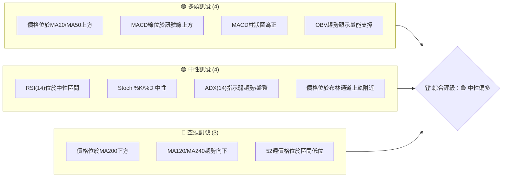

**解讀**：多頭訊號主要來自短期價格行為及動能指標，顯示近期反彈勢頭仍在；中性訊號則指出市場缺乏明確方向性趨勢，且動能指標接近強勢區間需警惕；空頭訊號則提醒投資者長期下跌趨勢的壓力依然存在，且當前價格距離52週高點甚遠。

### 📊 核心指標速覽表

下表彙整了SOFI當前關鍵技術指標的數值與初步解讀：

| 指標類別 | 指標名稱 | 當前數值 | 訊號 | 解讀 |
|----------|----------|----------|------|------|
| **價格** | 當前價格 | $17.88 | 🟡 | 位於52週區間的16.6%處，顯示價格仍處於相對低位 |
| **均線** | MA20 | $17.18 | 🟢 | 當前價格 ($17.88) 位於MA20上方，短期偏多 |
| **均線** | MA50 | $16.95 | 🟢 | 當前價格 ($17.88) 位於MA50上方，中期偏多 |
| **均線** | MA200 | $22.49 | 🔴 | 當前價格 ($17.88) 位於MA200下方，長期偏空 |
| **動能** | RSI(14) | 66.79 | 🟡 | 接近70超買區，動能強勁但需警惕回調風險 |
| **動能** | MACD | +0.239 | 🟢 | MACD線位於訊號線上方，柱狀圖為正，動能看多 |
| **波動** | ATR(14) | $0.97 | 🟡 | 佔價格5.42%，日均波動適中，適合日內交易者 |
| **趨勢** | ADX(14) | 20.91 | 🟡 | 趨勢強度較弱，市場處於盤整或弱勢反彈階段 |
| **量能** | OBV趨勢 | OBV > MA | 🟢 | 成交量支持價格上漲，量價配合良好 |

### 🏆 技術評分卡

綜合上述各項技術指標分析，SOFI的技術面評分如下：

```
╔══════════════════════════════════════════════════════════════╗
║                   技術評分卡 — SOFI (2026-06-29)               ║
╠══════════════════════════════════════════════════════════════╣
║ 趨勢強度      ████░░░░░░░░░░░░░░░░  40/100  🟡 (弱趨勢/長期偏空) ║
║ 動能指標      ███████░░░░░░░░░░░░░  70/100  🟢 (短期動能強勁)   ║
║ 支撐穩定度    ██████░░░░░░░░░░░░░░  60/100  🟡 (支撐區間尚穩固) ║
║ 成交量配合    ███████░░░░░░░░░░░░░  75/100  🟢 (量能積極配合)   ║
║ 形態完整度    ██████░░░░░░░░░░░░░░  65/100  🟡 (潛在底部形態)   ║
║ 均線排列      █████░░░░░░░░░░░░░░░  55/100  🟡 (短期多頭/長期空頭)║
╠══════════════════════════════════════════════════════════════╣
║ 綜合評分      ██████░░░░░░░░░░░░░░  60/100  🟡 (中性偏多)       ║
╚══════════════════════════════════════════════════════════════╝
```

**評分總結**：SOFI的綜合評分顯示其技術面處於中性偏多的狀態。雖然短期動能和量能表現積極，且潛在的底部形態為多頭提供了一線希望，但長期趨勢的下行壓力以及趨勢強度的不足，使得股價上行空間面臨較大阻力。投資者應密切關注關鍵阻力位的突破情況。

---

## 2. 趨勢分析

對SOFI進行多時框架趨勢分析，可以幫助我們理解不同時間尺度下股價的運動方向和力量對比。

### 🌐 多時框趨勢分析

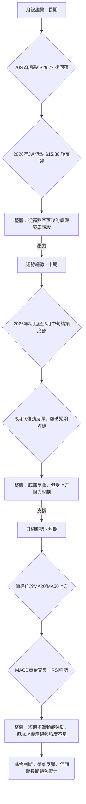

**詳細解讀**：
*   **長期趨勢 (月線)**：SOFI在2025年11月達到階段性高點$29.72後，經歷了數月的深度調整，最低觸及2026年3月的$15.88。這段時間構成了一個明顯的長期下跌趨勢。儘管近期有所反彈，但股價仍遠低於長期均線MA200 ($22.49)，表明長期空頭格局尚未改變。
*   **中期趨勢 (週線)**：從2026年3月底至5月中旬，SOFI股價在$15.23至$16.43區間內震盪整理，呈現出潛在的築底跡象。隨後在5月底出現一波強勁反彈，從$15.62迅速拉升至$18.22，顯示中期買盤力量有所增強。然而，反彈至$19.43後再度回落，表明上方阻力依然強勁。
*   **短期趨勢 (日線)**：當前價格$17.88位於MA20 ($17.18) 和MA50 ($16.95) 之上，短期均線呈現多頭排列。MACD指標完成黃金交叉，RSI處於強勢區間，表明短期動能非常活躍。然而，ADX指標仍處於弱趨勢區間，提示當前上漲可能缺乏持續的趨勢力量，更像是底部反彈後的震盪。

### 📈 長期趨勢 — 12個月走勢圖（Unicode）

以下為SOFI過去12個月的月線收盤價格走勢圖，標註了關鍵高點和低點，以視覺化方式呈現其長期走勢。

```
SOFI 月線走勢圖（過去12個月：2025-06 至 2026-06）
價格軸 ($)
$30 ┤                               ●(29.72, 2025-11 高點)
$28 ┤                           ●
$26 ┤                         ●     ●
$24 ┤                     ●
$22 ┤                 ●
$20 ┤●
$18 ┤  ●                                                 ●(17.88, 現在)
$16 ┤          ●   ●       ●   ● ●(15.88, 2026-03 低點)
     └──────────────────────────────────────────────────────────
      2025-06  07  08  09  10  11  12  2026-01  02  03  04  05  06
```

**走勢特徵分析表格**：

| 時間區間 | 主要走勢 | 價格範圍 | 漲跌幅 | 關鍵特徵 |
|----------|----------|----------|--------|----------|
| 2025-06 ~ 2025-11 | 強勁上漲 | $18.21 ~ $29.72 | +63.10% | 創下階段性高點，量價齊升，多頭主導。 |
| 2025-12 ~ 2026-03 | 深度回調 | $29.72 ~ $15.88 | -46.63% | 伴隨成交量放大，空頭力量強勁，跌破多個支撐。 |
| 2026-04 ~ 2026-06 | 底部反彈/盤整 | $15.88 ~ $18.22 | +14.73% | 價格在低位震盪，試圖構築底部，反彈動能初步顯現，但面臨上方阻力。 |

### 📊 中期趨勢（週線分析）

中期趨勢顯示SOFI正處於一個從長期下跌中尋求反轉的過程。近期價格在關鍵支撐位 $15.23 獲得有效支撐後，展開了一波反彈，並嘗試挑戰上方阻力。

```
SOFI 近期壓力與支撐示意圖 (週線)
$20.00 ┤                     R1: $19.43 (雙底頸線)
$19.00 ┤              ▲
$18.00 ┤              │      ● (現價 $17.88)
$17.00 ┤              │    ╱
$16.00 ┤              │  ╱
$15.00 ┤━━━━━━━━━━━━━S1: $15.23 (近期底部)
       └───────────────────────────────────
```

**解讀**：從週線圖來看，SOFI在$15.23附近形成了堅實的短期底部支撐。隨後股價反彈至$19.43，此價位成為當前一個重要的中期阻力（也是潛在雙底形態的頸線）。目前股價在突破此阻力之前，可能會在此區域進行盤整或小幅回調。

### ⚡ 趨勢強度評估（ADX 解讀）

ADX (Average Directional Index) 用於衡量趨勢的強度，而非方向。+DI 和 -DI 則指示趨勢的方向。

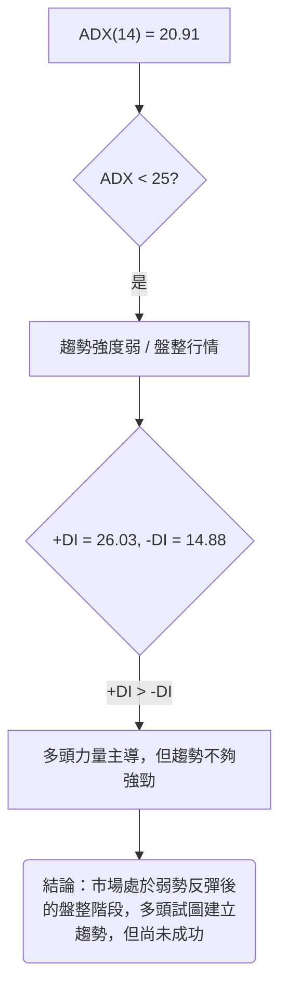

**ADX 強度對照表**：

| ADX 數值範圍 | 趨勢強度 | 市場狀態 |
|--------------|----------|----------|
| 0-25         | 弱       | 盤整/無趨勢 |
| 25-50        | 中等     | 明顯趨勢 |
| 50-75        | 強       | 強勁趨勢 |
| 75-100       | 極強     | 極端趨勢 |

**詳細解讀**：SOFI當前的ADX(14)數值為20.91，明顯低於25的門檻，這強烈表明市場目前處於**弱趨勢或盤整行情**。儘管股價近期有所反彈，但這種反彈缺乏強勁的趨勢支持。進一步觀察+DI (26.03) 和 -DI (14.88)，由於+DI明顯高於-DI，這說明在當前的弱趨勢中，多頭力量佔據主導地位，試圖推動股價上漲。然而，由於ADX整體偏低，這意味著多頭尚未能形成一個穩定且強勁的上漲趨勢，市場可能在支撐與阻力之間來回震盪。投資者應警惕假突破或反彈無力的情況。

---

## 3. 圖表形態分析

圖表形態分析能幫助我們從歷史價格走勢中識別出潛在的價格行為模式，預測未來的趨勢方向和目標價位。

### 🔍 形態識別系統

在SOFI的近期週線走勢中，我們觀察到一個潛在的底部反轉形態——**雙重底 (Double Bottom)**。此形態通常預示著下跌趨勢的結束和上漲趨勢的開始。

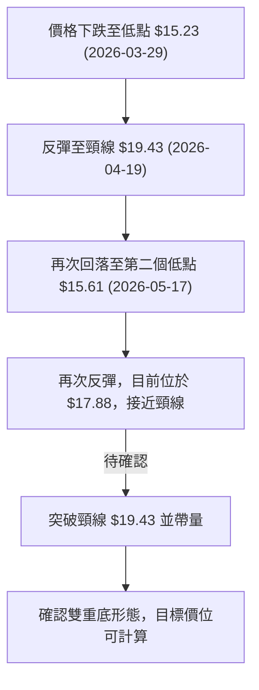

**形態解讀**：SOFI在2026年3月底和5月中旬分別在$15.23和$15.61附近形成了兩個低點，這兩個低點相對接近，中間的反彈高點為$19.43。這構成了經典的雙重底形態。目前價格正處於從第二個低點反彈的過程中，但尚未有效突破頸線$19.43。雙重底形態的確認需要股價帶量突破頸線，並在突破後站穩。

### 🕯️ 重要K線形態分析

分析近20週的週K線，識別出幾個關鍵的K線形態，它們為我們提供了市場情緒和潛在轉折點的線索。

| 日期 | 收盤價 | K線形態 | 解讀 | 訊號 |
|------|--------|---------|------|------|
| 2026-03-29 | $15.23 | 長下影線K線 | 價格創出近期新低後迅速拉回，顯示下方買盤強勁，具止跌意味。 | 🟢 |
| 2026-04-05 | $15.85 | 陽線吞噬 | 前一週下跌後，本週強勁上漲並吞噬前一週實體，看漲訊號。 | 🟢 |
| 2026-04-19 | $19.43 | 大陽線 | 伴隨巨量上漲，顯示多頭力量強大，突破近期阻力。 | 🟢 |
| 2026-05-10 | $15.75 | 長下影線K線 | 價格再次探底後反彈，再次確認下方支撐有效。 | 🟢 |
| 2026-05-31 | $18.22 | 吞噬陽線 | 經過數週盤整後，出現大陽線吞噬前幾週陰線，確認底部反彈。 | 🟢 |
| 2026-06-28 | $17.88 | 紡錘線 (待確認) | 本週收盤價接近開盤價，影線相對較長，顯示多空力量均衡，或在關鍵位置猶豫。 | 🟡 |

**詳細解讀**：在2026年3月底和5月初，SOFI多次出現長下影線K線和吞噬陽線，這些都是底部反轉的典型K線形態，表明在$15.23-$15.75區間存在強勁的買盤支撐。特別是5月31日的吞噬陽線，確認了從第二個底部開始的反彈。然而，最近的K線 (2026-06-28) 呈現紡錘線，暗示在當前價位多空力量達到平衡，市場在等待進一步的方向指引，這也可能是在挑戰上方阻力前的盤整。

### 📉 ASCII 走勢形態示意圖

以下為SOFI潛在雙重底形態的示意圖，標注了關鍵點位。

```
SOFI 潛在雙重底形態示意圖 (週線)

價格軸 ($)
$20.00 ┤                                   R: $19.43 (頸線)
$19.00 ┤                                 ▲
$18.00 ┤                                 │   ● (現價 $17.88)
$17.00 ┤                                 │ ╱
$16.00 ┤             S1:$15.23          ╱│╱          S2:$15.61
$15.00 ┤━━━━━●━━━━━━━━━━━━━━━●━━━━━━━━━━━━━━━●━━━━━
       └──────────────────────────────────────────────────────────
           2026-03-29            2026-04-19            2026-05-17
           (第一底部)            (反彈高點)            (第二底部)
```

**示意圖解讀**：圖中清晰展示了SOFI股價在$15.23和$15.61附近形成兩個低點，中間的反彈高點$19.43構成頸線。目前股價位於第二個低點反彈後，接近頸線的位置。

### 🎯 形態目標價計算

根據已識別的雙重底形態，我們可以計算出其潛在的目標價位。

**計算方法**：
雙重底形態的目標價通常是頸線價位加上頸線與最低底部之間的垂直距離。
*   頸線 (Neckline): $19.43 (2026-04-19高點)
*   最低底部 (Lowest Bottom): $15.23 (2026-03-29低點)
*   形態高度 (Pattern Height): 頸線 - 最低底部 = $19.43 - $15.23 = $4.20
*   **形態目標價 (Target Price)**: 頸線 + 形態高度 = $19.43 + $4.20 = **$23.63**

**解讀**：若SOFI股價能帶量有效突破並站穩頸線$19.43，則雙重底形態將被確認，其潛在的上漲目標價位為$23.63。此目標價位位於當前MA200 ($22.49) 和斐波那契50%回調位 ($23.98) 附近，這些價位將構成強勁的阻力區。

---

## 4. 支撐與阻力

支撐與阻力是技術分析的基石，它們代表了市場中買賣雙方力量平衡的關鍵價位。本章將詳細分析SOFI的關鍵支撐與阻力區間。

### 🗺️ 關鍵價位分布圖（Unicode）

以下圖表展示了SOFI當前的價格結構，標註了重要的支撐與阻力位。

```
SOFI 價位結構分布圖 (2026-06-29)
═══════════════════════════════════════════════════════════════
$32.73 ║███████████████████████████████████████████████████████████████║ 強阻力 R4 (52週高點)
$26.04 ║███████████████████████████████████████████████████████║ 阻力 R3 (斐波那契61.8%)
$23.98 ║███████████████████████████████████████████████████████║ 阻力 R2 (斐波那契50%)
$22.49 ║███████████████████████████████████████████████████████║ 關鍵阻力 R1 (MA200)
$19.43 ║███████████████████████████████████████████████████████║ 阻力 R0 (雙底頸線/斐波那契23.6%)
$17.88 ╠═══════════════════════════════════════════════════════════════╣ ◄ 現價
$17.18 ║▓▓▓▓▓▓▓▓▓▓▓▓▓▓▓▓▓▓▓▓▓▓▓▓▓▓▓▓▓▓▓▓▓▓▓▓▓▓▓▓▓▓▓▓▓▓▓▓▓▓▓▓▓▓▓▓▓▓▓▓▓▓▓║ 近期支撐 S0 (MA20)
$16.95 ║▓▓▓▓▓▓▓▓▓▓▓▓▓▓▓▓▓▓▓▓▓▓▓▓▓▓▓▓▓▓▓▓▓▓▓▓▓▓▓▓▓▓▓▓▓▓▓▓▓▓▓▓▓▓▓▓▓▓▓▓▓▓▓║ 近期支撐 S1 (MA50)
$15.75 ║███████████████████████████████████████████████████████║ 強支撐 S2 (布林下軌/近期多次低點)
$15.23 ║███████████████████████████████████████████████████████║ 強支撐 S3 (雙底第一底部)
$14.92 ║███████████████████████████████████████████████████████║ 強支撐 S4 (52週低點)
═══════════════════════════════════════════════════════════════
```

### 🚧 阻力位分析表

| 阻力級別 | 價位 | 形成原因 | 突破難度 | 重要性 |
|----------|------|----------|----------|--------|
| R0 (近期) | $19.43 | 雙底形態頸線、斐波那契23.6%回調位 ($19.36) | 中等偏高 | 🟢 決定雙底形態能否成立的關鍵點 |
| R1 (中期) | $22.49 | MA200長期均線 | 高 | 🟡 長期趨勢由空轉多的關鍵阻力 |
| R2 (中期) | $23.98 | 斐波那契50%回調位 | 高 | 🟡 深度反彈的心理關口，與雙底目標價接近 |
| R3 (中期) | $26.04 | 斐波那契61.8%回調位 | 高 | 🔴 趨勢反轉的強阻力區 |
| R4 (長期) | $32.73 | 52週高點 | 極高 | 🔴 歷史高點，短期內難以觸及 |

**詳細解讀**：SOFI當前最關鍵的阻力是雙底形態的頸線$19.43。此價位與斐波那契23.6%回調位$19.36非常接近，形成一個強勁的阻力區。如果能帶量突破並站穩此區間，將確認雙底形態，並為進一步上漲打開空間。再往上，MA200 ($22.49) 將是另一個強勁阻力，它代表了長期趨勢的壓制。斐波那契50%和61.8%回調位則將在更長期的反彈中扮演重要角色。

### 🛡️ 支撐位分析表

| 支撐級別 | 價位 | 形成原因 | 守住機率 | 重要性 |
|----------|------|----------|----------|--------|
| S0 (即時) | $17.18 | MA20短期均線 | 高 | 🟢 短期上漲趨勢的即時支撐 |
| S1 (即時) | $16.95 | MA50中期均線 | 高 | 🟢 中期趨勢的關鍵支撐 |
| S2 (近期) | $15.75 | 布林通道下軌、近期多次低點 (如2026-05-10) | 中等偏高 | 🟡 重要的心理關口和技術支撐 |
| S3 (強勁) | $15.23 | 雙底形態第一底部 (2026-03-29) | 極高 | 🟢 底部形態的關鍵支撐，不應被跌破 |
| S4 (極強) | $14.92 | 52週低點 | 極高 | 🟢 市場最後防線，跌破則趨勢極度惡化 |

**詳細解讀**：SOFI當前價格位於MA20和MA50上方，這兩條均線形成了即時的動態支撐，分別位於$17.18和$16.95。這表明短期和中期買盤力量仍在支撐股價。$15.75是布林通道下軌，也是近期多次測試並獲得支撐的價位，構成一個重要的短期防線。而$15.23則是雙底形態的第一個底部，是極為關鍵的支撐位，一旦跌破，雙底形態將失效。52週低點$14.92是SOFI的長期生命線，跌破此價位將意味著股價可能進入更深的下跌通道。

### 📐 斐波那契回調位分析

我們以52週高點 $32.73 (2025-11) 至近期低點 $15.23 (2026-03-29) 作為主要下跌波段，計算其回調位，以判斷反彈的潛在阻力。

*   **跌幅區間**：$32.73 (高點) - $15.23 (低點) = $17.50
*   **斐波那契回調計算**：
    *   **23.6% 回調位**：$15.23 + ($17.50 * 0.236) = $15.23 + $4.13 = **$19.36**
    *   **38.2% 回調位**：$15.23 + ($17.50 * 0.382) = $15.23 + $6.68 = **$21.91**
    *   **50.0% 回調位**：$15.23 + ($17.50 * 0.500) = $15.23 + $8.75 = **$23.98**
    *   **61.8% 回調位**：$15.23 + ($17.50 * 0.618) = $15.23 + $10.81 = **$26.04**

**視覺化與解讀**：
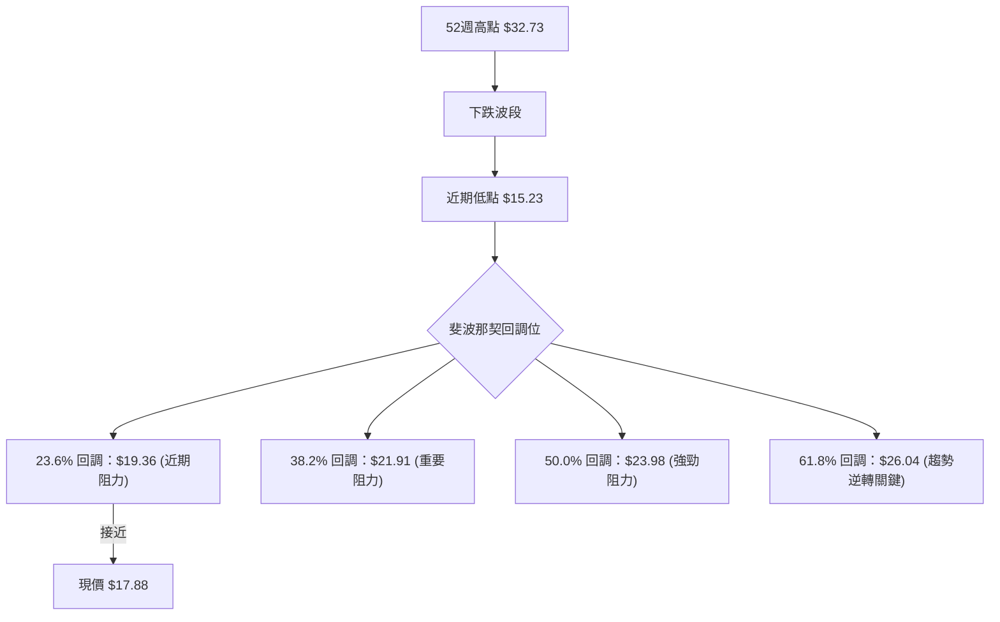
**詳細解讀**：SOFI當前價格$17.88位於23.6%回調位$19.36下方。這意味著，即使是最小幅度的反彈，也將在$19.36附近遇到阻力，此價位與雙底形態的頸線$19.43高度重合，進一步確認了該區域的阻力強度。若能成功突破，下一個重要挑戰將是38.2%回調位$21.91，然後是50%回調位$23.98，這也是雙底形態目標價$23.63的附近，形成多重阻力區。這些斐波那契回調位將是SOFI未來反彈過程中需要重點關注的潛在賣壓區。

---

## 5. 技術指標深度解讀

本章將對SOFI的各項技術指標進行深入分析，並探討它們之間的相互關係和確認訊號。

### 🎛️ 指標訊號總覽

以下Mermaid圖展示了各項技術指標當前給出的訊號及其相互作用。

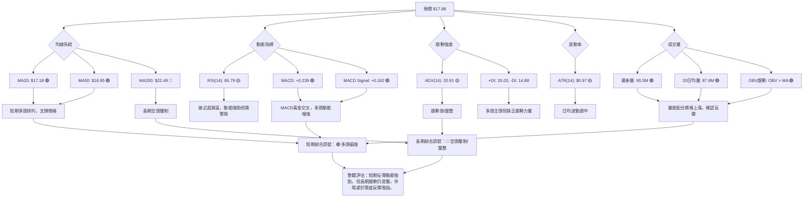

### 📈 移動平均線排列分析

SOFI的移動平均線系統呈現出短期多頭、長期空頭的混合排列狀態，這反映了其當前市場的複雜性。

**當前均線數值**：
*   MA5: $17.38
*   MA10: $17.36
*   MA20: $17.18
*   MA50: $16.95
*   MA200: $22.49

**排列分析**：
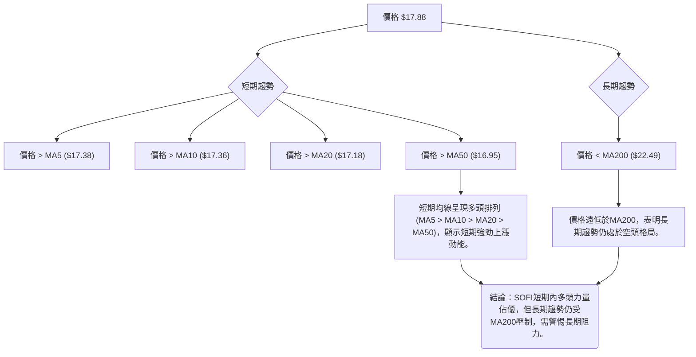

**詳細解讀**：SOFI的股價($17.88)目前位於所有短期（MA5, MA10, MA20）和中期（MA50）移動平均線之上，且短期均線之間呈現出良好的多頭排列，這是一個明確的短期看漲訊號，表明近期買盤力量活躍，股價處於反彈通道中。然而，股價卻遠低於長期均線MA200 ($22.49)，這強烈暗示了SOFI的長期下跌趨勢尚未改變，MA200將在未來構成一個重要的壓力區。這種「短期多頭，長期空頭」的混合排列，說明SOFI處於一個底部構築或反彈修正的階段，而非強勁的長期上漲趨勢。

### 📉 RSI(14) 分析

相對強弱指數 (RSI) 用於衡量價格變動的速度和變化，以識別超買或超賣狀況。

*   **RSI(14) 數值**：66.79

**RSI 強度進度條**：
RSI 強度：▓▓▓▓▓▓▓▓▓▓▓▓▓▓░░░░░░ 66.79 (接近超買) 🟡

**超買超賣區間分析**：
*   **超買區**：RSI > 70
*   **超賣區**：RSI < 30
SOFI當前的RSI為66.79，雖然尚未進入70的超買區，但已非常接近，這表明短期內買盤動能非常強勁。然而，接近超買區也意味著股價可能面臨獲利回吐的壓力，上漲空間可能受限，需要警惕隨時可能出現的回調。

**背離判斷**：
根據提供的數據，RSI在近20週週線數據中，從2026-03-29的11.8低點，隨著價格從$15.23反彈至$17.88，RSI也一路從超賣區回升至66.79。在此過程中，RSI的走勢與價格走勢基本同步，沒有觀察到明顯的頂背離或底背離現象。例如，在2026-05-17，RSI為30.2，價格為$15.61；到2026-05-31，RSI升至69.6，價格升至$18.22，這是一個健康的動能恢復過程，沒有底背離。目前RSI處於強勢區，但並未創出新高，價格也未創出短期新高，因此**無明顯背離訊號**。

### 📊 MACD(12/26/9) 訊號解讀

移動平均收斂/發散指標 (MACD) 用於識別趨勢的動能、方向和持續時間。

*   **MACD 線**：0.239
*   **MACD Signal 線**：0.162
*   **MACD 柱狀圖 (Histogram)**：+0.077

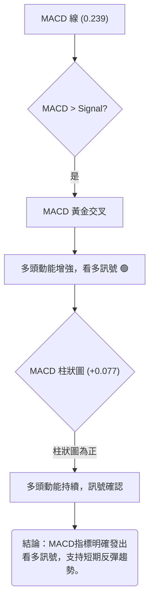

**詳細解讀**：MACD線 (0.239) 目前位於訊號線 (0.162) 之上，形成了**黃金交叉**，這是一個經典的看漲訊號。同時，MACD柱狀圖為正值 (+0.077)，且從之前的低點持續增長（雖然較前幾週的峰值有所回落），進一步確認了多頭動能的掌控。這表明SOFI的短期上漲趨勢正在形成並獲得動能支持。MACD與RSI的強勢表現相互印證，共同支持了短期內股價繼續反彈的可能性。然而，投資者仍需留意MACD柱狀圖的變化，若柱狀圖開始縮短甚至轉負，則可能預示動能減弱或反彈結束。

**背離判斷**：
根據提供的數據，MACD柱狀圖從2026-05-10的低點-0.224逐步回升至當前的+0.077，期間價格也從$15.75反彈至$17.88。這是一個正常的動能恢復過程，沒有出現底背離。近期柱狀圖值從2026-05-31的+0.273回落至+0.077，但價格($17.88)與2026-05-31的$18.22相比略有回落，這也不是頂背離，而是動能的正常調整，表明上漲勢頭有所放緩。因此，**無明顯背離訊號**。

### 📦 布林通道分析

布林通道 (Bollinger Bands) 用於衡量價格的波動範圍和相對高低。

*   **布林上軌 (BB上軌)**：$18.60
*   **布林中軌 (MA20)**：$17.18
*   **布林下軌 (BB下軌)**：$15.75
*   **當前價格**：$17.88
*   **BB %B**：0.75 (表示價格位於上軌和中軌之間，且更靠近上軌)

**ASCII 布林通道示意圖**：
```
SOFI 布林通道示意圖 (2026-06-29)

$19.00 ┤                     BB上軌: $18.60
$18.50 ┤          ╭───╮
$18.00 ┤          │   ● ($17.88 現價)
$17.50 ┤          │   │
$17.00 ┤          ╰───╯ BB中軌(MA20): $17.18
$16.50 ┤          │   │
$16.00 ┤          │   │
$15.50 ┤          ╰───╯ BB下軌: $15.75
       └───────────────────────────────────
```

**詳細解讀**：SOFI的當前價格$17.88位於布林通道中軌 ($17.18) 和上軌 ($18.60) 之間，且BB %B值為0.75，顯示價格更接近上軌。這是一個偏向看漲的訊號，表明短期內價格強勢。通常，價格觸及上軌可能預示短期超買或面臨回調壓力，但如果價格能夠沿著上軌運行，則可能預示著強勁的上漲趨勢。目前布林通道的寬度適中，ATR值也顯示波動率正常，但隨著價格接近上軌，投資者應密切關注價格是否能突破上軌並維持上漲，或是在上軌處受阻回調至中軌。

### 💹 成交量分析（量價配合度）

成交量是價格走勢的燃料，量價關係對於判斷趨勢的可靠性至關重要。

*   **最新成交量**：90,515,600
*   **20日均量**：87,808,445
*   **50日均量**：75,036,674
*   **量比 (最新量 / 20日均量)**：1.03x
*   **OBV趨勢**：OBV > MA → 量能支撐上漲

**詳細解讀**：SOFI的最新成交量為90,515,600股，高於其20日均量 (87,808,445股)，量比達到1.03x，這表明市場活躍度有所增加，且買盤力量積極。更重要的是，OBV趨勢顯示OBV線位於其移動平均線上方，這是一個明確的看漲訊號，表示買盤累積量大於賣盤累積量，成交量正在確認並支持當前的價格反彈。在價格上漲的過程中，如果成交量能夠同步放大，則說明上漲趨勢具有較高的可靠性。SOFI目前的量價配合良好，為其短期反彈提供了堅實的基礎。

---

## 6. 動能與波動率

本章將分析SOFI的動能強度和波動率特徵，以評估其交易機會與風險。

### ⚡ 動能評估四象限

我們將SOFI當前的動能和波動率進行評估，並將其定位於四個象限中。

| 象限 | 動能 (RSI, MACD) | 波動 (ATR, BB) | 當前狀態 | 評估 |
|------|--------------------|------------------|----------|------|
| Q1   | 強                 | 低               | -        | 最佳機會 (強勢且穩定) |
| Q2   | 弱                 | 低               | -        | 謹慎觀望 (缺乏方向性) |
| Q3   | 強                 | 高               | -        | 高風險高收益 (快速上漲/下跌) |
| Q4   | 弱                 | 高               | -        | 避免進場 (不穩定且無方向) |
|      | **當前SOFI**       | **中等**           | **中等**           | **✅ 位於 Q3 邊緣偏向 Q1** |

**詳細解讀**：
*   **動能評估**：SOFI的RSI為66.79，MACD柱狀圖為正且金叉，顯示其動能強勁。這使其更偏向「強動能」一側。
*   **波動率評估**：ATR(14)為$0.97，佔價格的5.42%，這是一個適中的波動率。布林通道寬度正常，價格接近上軌，但尚未出現極端擴張。這使其偏向「中等波動」一側。
*   **綜合定位**：SOFI當前處於「強動能、中等波動」的狀態，接近Q1（最佳機會）與Q3（高風險高收益）的邊界。這意味著SOFI具有較強的上漲潛力，但由於其歷史波動較大且ADX顯示趨勢強度不足，仍需謹慎對待。它不屬於穩定且低波動的強勢股，也不是完全混亂的弱勢股。

### 📊 ATR 波動率分析

平均真實範圍 (ATR) 用於衡量資產在特定時間段內的平均波動幅度。

*   **ATR(14)**：$0.97
*   **佔價格比重**：$0.97 / $17.88 = 5.42%

**ATR 進度條**：
波動率：▓▓▓▓▓▓▓▓▓▓▓▓░░░░░░░░ 54.2% (中等波動) 🟡

**詳細分析**：SOFI的ATR(14)為$0.97，這意味著在過去14個交易日中，SOFI平均每天的波動範圍約為0.97美元。相對於其當前價格$17.88，這個波動幅度約為5.42%，屬於中等偏高的波動水平。對於交易者而言：
*   **止損距離建議**：ATR可用於設定止損點。一般建議將止損設置在1-3倍ATR的距離。
    *   1倍ATR止損：$0.97
    *   2倍ATR止損：$1.94
    *   3倍ATR止損：$2.91
    因此，若在$17.88入場，合理的止損位可能在$17.88 - $0.97 = $16.91 (1倍ATR) 或 $17.88 - $1.94 = $15.94 (2倍ATR) 附近。這與我們在支撐位分析中提到的MA50 ($16.95) 和S2 ($15.75) 支撐位形成良好的印證。
*   **交易機會**：中等波動性意味著SOFI具備一定的日內交易和波段交易機會，但同時也伴隨著相應的價格風險。
*   **趨勢確認**：在趨勢形成初期，ATR的放大可能預示著趨勢的加速；而在趨勢末期，ATR的縮小可能預示著趨勢的疲軟或盤整。目前ATR穩定，顯示市場波動正常，沒有極端恐慌或狂熱。

### 📐 Beta 與市場相關性

Beta值衡量一檔股票相對於整體市場的波動性。由於數據中未提供SOFI的Beta值，我們將基於其所屬行業 (金融服務 - 信用服務) 進行推斷。

**推斷分析**：
*   **行業特性**：金融服務行業通常對宏觀經濟環境敏感，其股票的Beta值往往接近或略高於1。信用服務公司如SOFI，其業務模式與消費者借貸和經濟活動緊密相關，在經濟擴張期可能表現優於大盤，而在經濟收縮期則可能表現劣於大盤。
*   **潛在Beta範圍**：根據經驗，SOFI的Beta值可能在1.0至1.5之間。如果Beta值接近1，則其走勢與大盤高度同步；如果Beta值大於1，則其波動性較大盤更高。
*   **市場相關性影響**：
    *   **高Beta (假設 > 1)**：若SOFI的Beta值較高，則在牛市中，其上漲幅度可能超過大盤；在熊市中，其下跌幅度也可能超過大盤。這會增加其投資的風險性，但同時也提供了更高的潛在回報。
    *   **中等Beta (假設 ≈ 1)**：若Beta值接近1，則SOFI的股價走勢將與主要股指（如S&P 500或NASDAQ）保持較高的相關性。在進行投資決策時，需同時考慮大盤的整體趨勢。

**重要提示**：由於缺乏具體的Beta數據，上述分析為基於行業經驗的推斷。投資者在實際操作中應查閱實時數據以獲取準確的Beta值，並將其納入風險評估。

---

## 7. 多時框架總結

本章將對SOFI在不同時間框架下的技術訊號進行綜合評估，以形成一個全面的市場觀點。

### 📋 時框架評分表

| 時框架 | 趨勢方向 | 動能 | 均線排列 | 形態 | 綜合評分 | 建議 |
|--------|----------|------|----------|------|----------|------|
| **短期** | 🟢 反彈中 | 🟢 強勁 | 🟢 多頭 | 🟡 潛在底部 | 🟢 7/10 | 輕倉做多/觀望 |
| **中期** | 🟡 築底/震盪 | 🟡 減弱 | 🟡 混合 | 🟢 雙重底 | 🟡 6/10 | 觀望/逢低吸納 |
| **長期** | 🔴 下跌後盤整 | 🔴 弱勢 | 🔴 空頭 | 🟡 尚未反轉 | 🔴 4/10 | 長期觀望/避險 |

**詳細解讀**：
*   **短期 (日線)**：SOFI在日線圖上表現出強勁的反彈動能，價格站上短期均線，MACD和RSI均發出看多訊號。量價配合良好，顯示買盤活躍。然而，RSI接近超買區，ADX趨勢強度不足，提示短期可能面臨回調或盤整。
*   **中期 (週線)**：SOFI在中期圖表上正在構築一個潛在的雙重底形態，這是一個積極的反轉訊號。但形態尚未完全確認，股價仍需突破頸線阻力。動能從底部強勁反彈後有所減弱，均線排列呈現短期多頭與長期空頭的混合狀態。
*   **長期 (月線)**：從長期來看，SOFI仍處於從高點回落後的下跌趨勢中，股價遠低於MA200，且52週區間位於低位。儘管有中期築底跡象，但要完全逆轉長期趨勢仍需時日和更大的催化劑。

### 🔲 綜合訊號矩陣

以下矩陣分析了不同時框架下各項技術訊號的一致性，以判斷整體市場情緒。

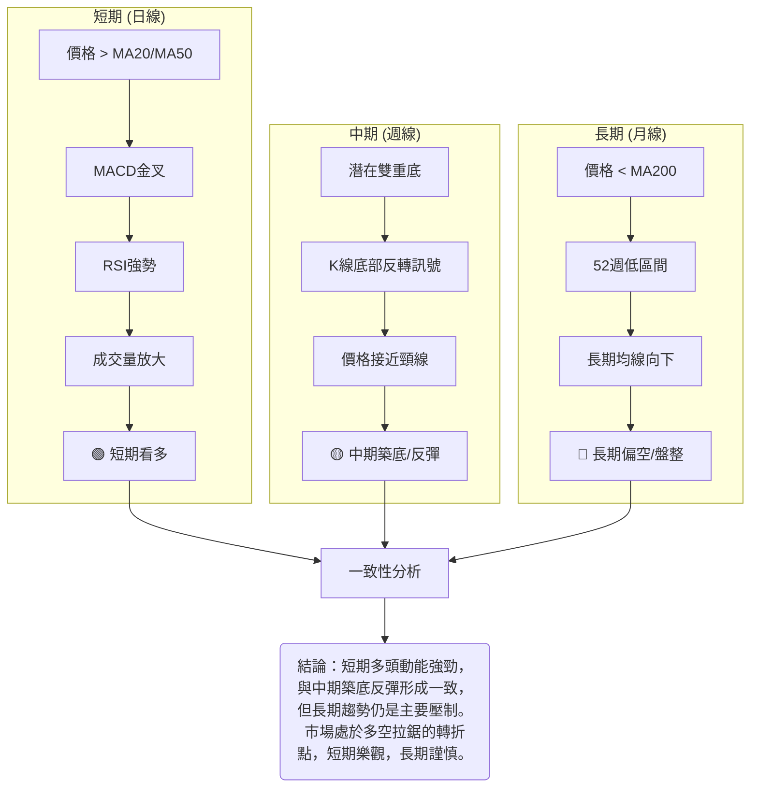

**一致性分析**：短期指標普遍發出看多訊號，顯示近期有較強的反彈動能。中期指標也呈現築底和反彈的跡象，與短期方向基本一致。然而，長期指標仍然指示空頭趨勢佔據主導地位。這種不一致性表明SOFI目前處於一個關鍵的轉折期：短期買盤正在努力扭轉中長期跌勢，但能否成功突破長期阻力仍是未知數。投資者在制定策略時，應充分考慮這種多空力量的對比。

---

## 8. 交易策略建議

基於上述多時框架的技術分析，本章將提供具體的交易策略建議，包含進場、止損、目標價及風險報酬比。

### 🗺️ 策略決策流程圖

以下流程圖展示了根據當前SOFI技術面狀況，制定交易策略的邏輯。

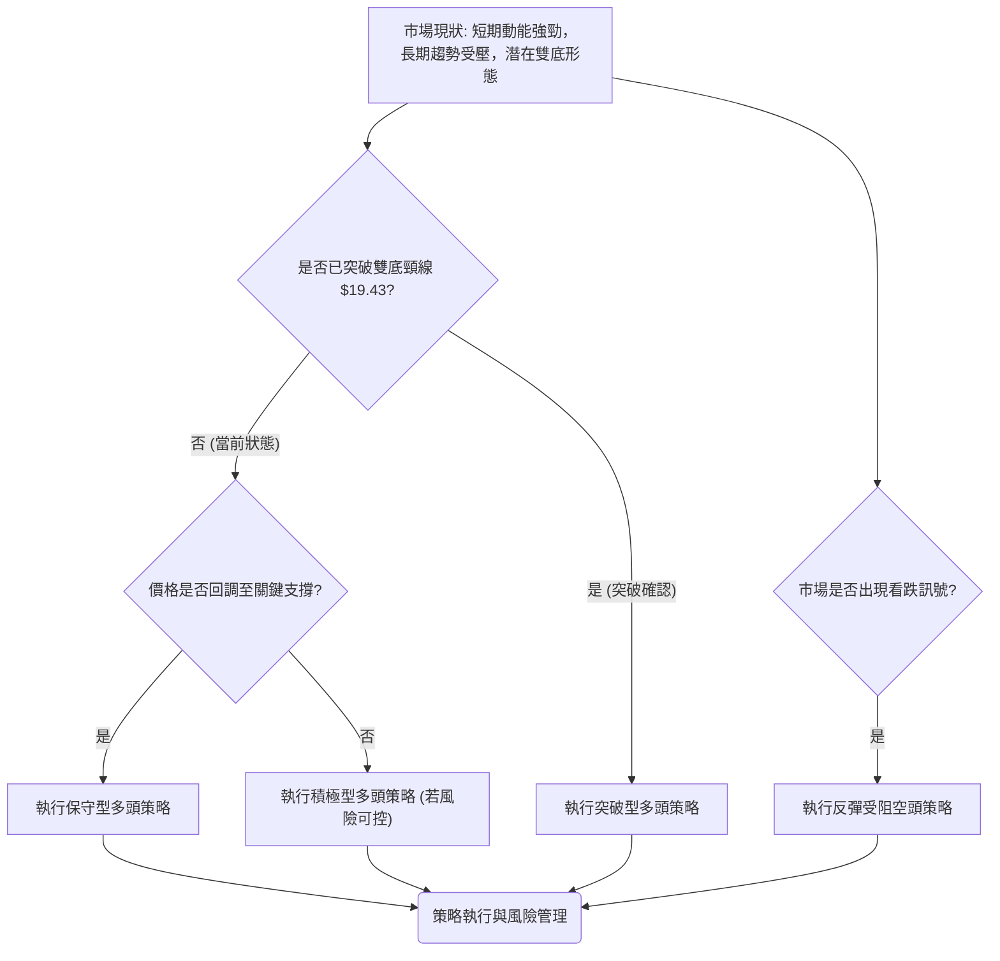

### 🟢 多頭策略詳情

考慮到SOFI當前的技術面，特別是短期動能強勁和潛在雙底形態，我們建議兩種多頭策略：

| 策略要素 | 策略 A：積極型多頭 (動能延續) | 策略 B：保守型多頭 (回調吸納) |
|----------|---------------------------------|---------------------------------|
| 進場條件 | 價格維持在短期均線上方，MACD看多，RSI強勢，等待突破頸線。 | 價格回調至關鍵支撐位S1 ($16.95) 或S2 ($15.75) 附近，並出現止跌K線形態。 |
| 進場價格 | **$17.88** (當前價格，或小幅回調後) | **$16.00** (靠近S2 $15.75，確保買入機會) |
| 目標價 T1 | **$19.43** (雙底形態頸線/斐波那契23.6%) | **$19.43** (雙底形態頸線/斐波那契23.6%) |
| 目標價 T2 | **$23.63** (雙底形態目標/斐波那契50%附近) | **$23.63** (雙底形態目標/斐波那契50%附近) |
| 止損價格 | **$15.75** (跌破強支撐S2) | **$15.20** (跌破S3 $15.23，52週低點前) |
| 風險報酬比 (至T1) | ($19.43 - $17.88) : ($17.88 - $15.75) = $1.55 : $2.13 ≈ **0.73 : 1** | ($19.43 - $16.00) : ($16.00 - $15.20) = $3.43 : $0.80 ≈ **4.29 : 1** |
| 風險報酬比 (至T2) | ($23.63 - $17.88) : ($17.88 - $15.75) = $5.75 : $2.13 ≈ **2.70 : 1** | ($23.63 - $16.00) : ($16.00 - $15.20) = $7.63 : $0.80 ≈ **9.54 : 1** |
| 成功機率 | 55% (需突破頸線確認) | 65% (等待更佳入場點，風險較低) |
| 建議倉位 | 5-10% (考慮短期動能減弱，未突破頸線) | 10-15% (風險報酬比優異) |

### 🔴 空頭策略詳情

儘管短期動能偏多，但長期趨勢仍是空頭。若SOFI反彈無力並在關鍵阻力位受阻，空頭策略可作為對沖或反轉交易的選擇。

| 策略要素 | 策略 C：反彈受阻型空頭 |
|----------|------------------------|
| 進場條件 | 價格上攻至雙底頸線 $19.43 或斐波那契23.6%回調位 $19.36 附近受阻，出現看跌K線形態，且MACD柱狀圖轉負。 |
| 進場價格 | **$19.30** (略低於阻力位，確認受阻) |
| 目標價 T1 | **$15.75** (近期強支撐S2) |
| 目標價 T2 | **$14.92** (52週低點S4) |
| 止損價格 | **$21.91** (突破斐波那契38.2%回調位) |
| 風險報酬比 (至T1) | ($19.30 - $15.75) : ($21.91 - $19.30) = $3.55 : $2.61 ≈ **1.36 : 1** |
| 風險報酬比 (至T2) | ($19.30 - $14.92) : ($21.91 - $19.30) = $4.38 : $2.61 ≈ **1.68 : 1** |
| 成功機率 | 40% (目前動能偏多，逆勢策略風險較高) |
| 建議倉位 | 5%以下 (高風險，嚴格控制倉位) |

### ⭐ 整體訊號強度評星

綜合考量SOFI當前的多空訊號和市場結構，給出以下評星：

做多訊號強度：★★★★☆ (4/5星)
*   理由：短期動能強勁，均線多頭排列，MACD金叉，OBV配合良好，潛在雙底形態提供反轉可能。但RSI接近超買，ADX趨勢強度不足，且未突破關鍵頸線，故未給滿星。

做空訊號強度：★★☆☆☆ (2/5星)
*   理由：長期趨勢雖為空頭，但短期反彈動能強勁，逆勢做空風險較大。除非價格在關鍵阻力位明確受阻並出現反轉訊號，否則不宜輕易做空。

整體可信度：  ★★★☆☆ (3/5星)
*   理由：市場處於底部構築和反彈階段，多空力量拉鋸，短期機會與中長期風險並存。交易策略應靈活調整，並嚴格執行風險管理。

---

## 9. 風險提示與監控

任何投資都伴隨著風險，SOFI作為一家金融科技公司，其股價波動性較高。本章旨在提醒投資者潛在風險並提供監控建議。

### ✅ 關鍵監控指標 Checklist

以下方框圖列出了投資SOFI時需要密切關注的關鍵技術指標和價位：

```
╔══════════════════════════════════════════════════════════════╗
║              SOFI 關鍵監控指標 Checklist                       ║
╠══════════════════════════════════════════════════════════════╣
║ [ ] 股價是否能有效突破並站穩雙底頸線 $19.43？                   ║
║ [ ] 股價是否跌破近期支撐 $15.75 (S2) 或 $15.23 (S3)？           ║
║ [ ] RSI 是否進入超買區 (>70) 並出現回調訊號？                  ║
║ [ ] MACD 柱狀圖是否由正轉負，或出現死叉？                      ║
║ [ ] ADX(14) 是否能突破25，確認趨勢強度？                       ║
║ [ ] 成交量是否持續放大配合價格上漲？                           ║
║ [ ] 布林通道是否持續收窄，預示盤整？                            ║
║ [ ] MA200 ($22.49) 是否構成強勁阻力？                          ║
║ [ ] 宏觀經濟環境及金融行業政策變化。                           ║
║ [ ] 公司基本面是否有重大變動或新聞事件。                       ║
╚══════════════════════════════════════════════════════════════╝
```

### ⚠️ 風險場景分析

以下Mermaid圖展示了SOFI未來可能出現的三種情境：

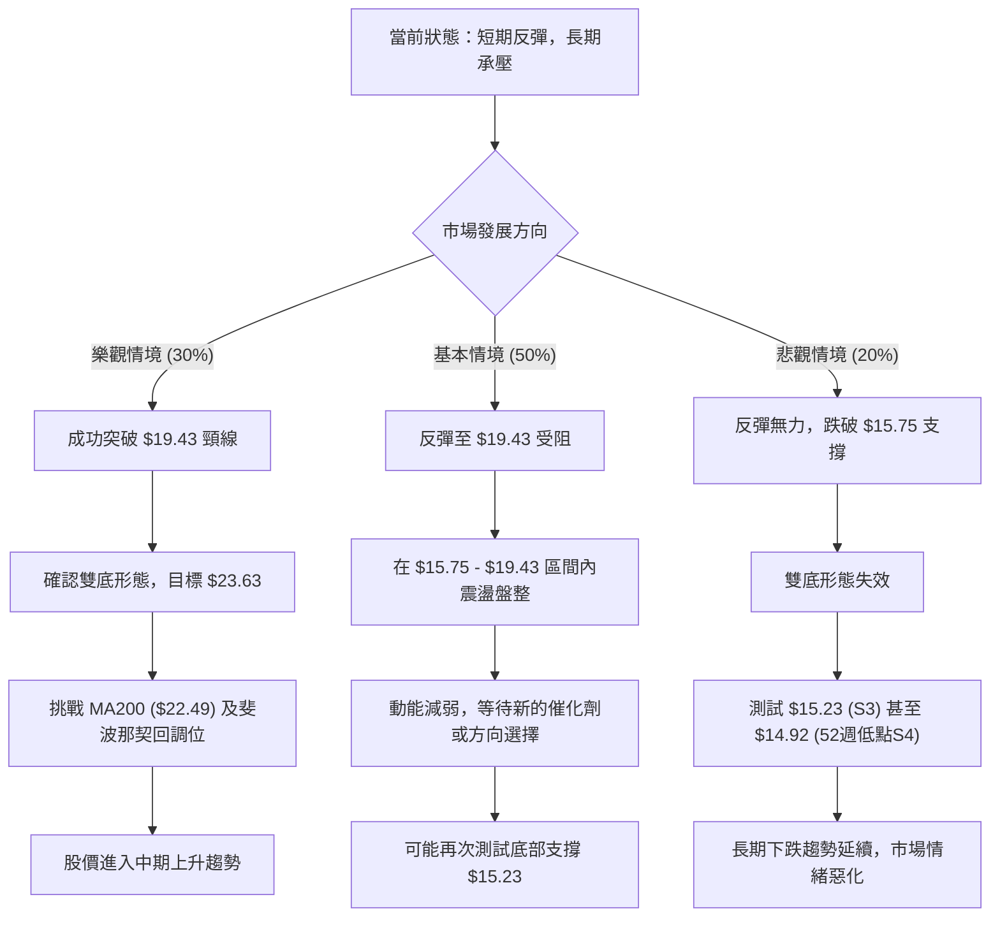

**詳細解讀**：
*   **樂觀情境**：SOFI能夠憑藉當前動能，成功帶量突破雙底形態的頸線$19.43，並站穩其上。這將確認底部形態，為股價打開上漲空間，目標直指$23.63，並有望挑戰MA200和斐波那契50%回調位。在此情境下，中期趨勢將轉為上升。
*   **基本情境**：SOFI的反彈勢頭在$19.43頸線或斐波那契23.6%回調位$19.36附近遇到強勁阻力，未能有效突破。股價可能在此區間內進行橫盤震盪，消化賣壓。動能指標可能隨之減弱，市場將在$15.75至$19.43之間徘徊，等待新的市場催化劑或更明確的方向選擇。
*   **悲觀情境**：SOFI的反彈最終失敗，股價無法突破阻力，反而跌破了近期關鍵支撐$15.75。這將導致雙底形態失效，多頭信心受挫，股價可能進一步下探至$15.23，甚至考驗52週低點$14.92。一旦跌破52週低點，長期下跌趨勢將得到確認，市場情緒將進一步惡化。

### 🛡️ 風險管理重要提醒

1.  **倉位管理**：由於SOFI的長期趨勢仍偏空，且ADX顯示趨勢強度不足，建議採用較為保守的倉位管理策略。在突破關鍵阻力前，不宜重倉。對於不同策略，嚴格遵守建議倉位。
2.  **止損執行**：無論採用何種策略，都必須設定明確的止損點並嚴格執行。一旦價格觸及止損位，應果斷離場，避免虧損擴大。
3.  **分批建倉/平倉**：考慮到市場的不確定性，可以採用分批建倉或分批平倉的方式，降低單次交易的風險，並鎖定部分利潤。
4.  **監控市場情緒**：密切關注市場整體情緒，特別是金融科技板塊的表現。若大盤出現明顯的趨勢逆轉訊號，應及時調整SOFI的交易策略。
5.  **基本面配合**：技術分析應與基本面分析相結合。關注SOFI的財報、業務發展和行業新聞，任何基本面的利空或利好都可能迅速影響技術走勢。
6.  **波動性管理**：SOFI的ATR顯示其具有中等波動性，這意味著價格可能在短時間內快速變動。投資者應做好心理準備，避免因短期波動而做出非理性決策。

---

## 📋 報告總結

```
SOFI 技術分析報告總結
════════════════════════════════════════════════════════
報告日期：2026-06-29
當前價格：$17.88
分析評級：⚖️ 中性偏多 (短期動能強勁，中期築底反彈，但長期趨勢仍受壓制)

關鍵結論：
├─ 長期趨勢：🔴 下跌後盤整，股價位於MA200下方，52週低位區間。
├─ 中期趨勢：🟡 築底反彈中，存在潛在雙重底形態，但未完全確認。
├─ 短期趨勢：🟢 強勁反彈，價格位於MA20/MA50上方，MACD金叉，RSI強勢。
├─ 關鍵支撐：$15.75 (S2), $15.23 (S3)。
├─ 關鍵阻力：$19.43 (雙底頸線/斐波那契23.6%), $22.49 (MA200)。
└─ 分析師目標：$20.90 (中位數)，顯示向上空間。

最優策略組合：
1. 🥇 最佳機會：**保守型多頭策略**。等待價格回調至 $16.00 附近（靠近S2 $15.75），止損設於 $15.20，目標價 $19.43 和 $23.63。此策略風險報酬比極佳 (4.29:1 至 9.54:1)。
2. 🥈 次選機會：**積極型多頭策略**。若無法等待回調，可在 $17.88 附近入場，止損 $15.75，目標價 $19.43 和 $23.63。但風險報酬比相對較低 (0.73:1 至 2.70:1)，需嚴格控制倉位。
3. 🥉 保守選擇：**觀望**。在價格未能明確突破 $19.43 頸線之前，市場方向仍不明確。觀望等待突破或回調確認，可有效規避不確定性風險。
════════════════════════════════════════════════════════
```

---

> ⚠️ **免責聲明**：本報告為 AI 自動生成之技術分析，所有數據及估算均基於提供的歷史價格資訊。本報告**僅供研究與學術參考**，**不構成任何投資建議**。投資有風險，入市需謹慎。

---

*報告生成時間：2026-06-29 ｜ 數據來源：Yahoo Finance ｜ 分析框架：多時框技術分析*