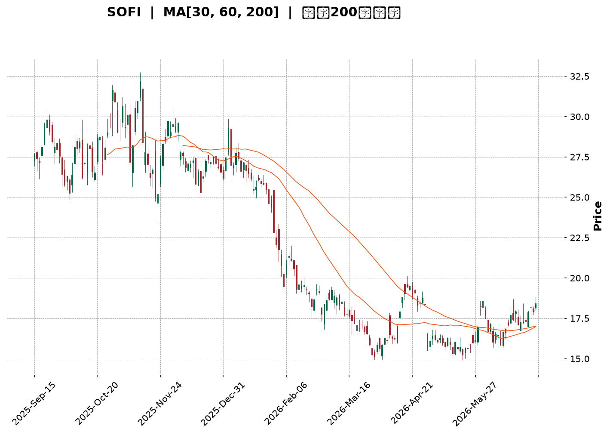
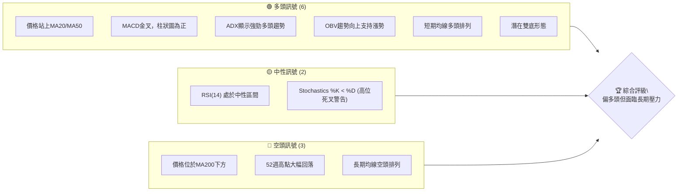
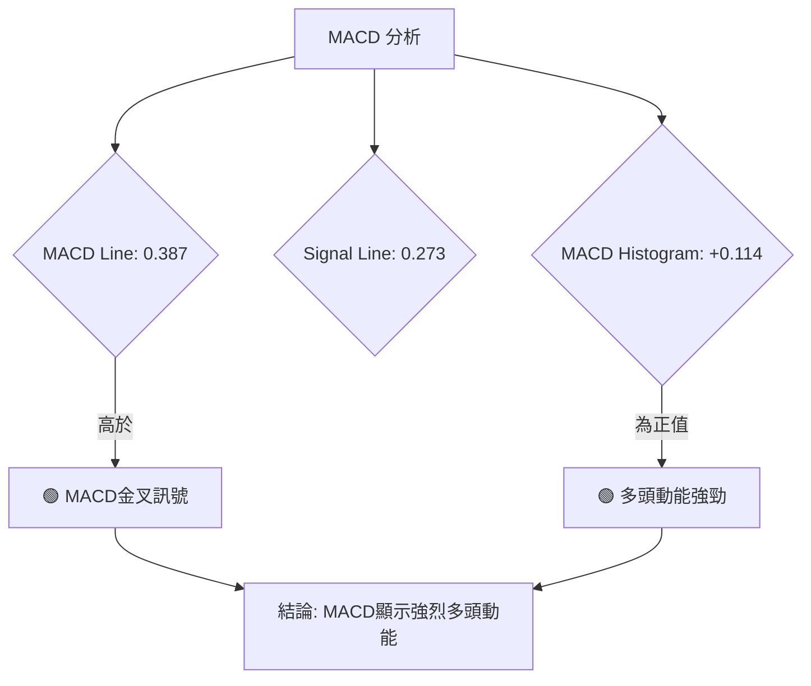

<details>
<summary>📊 靜態圖表 (點擊展開)</summary>

</details>

<html>
<head><meta charset="utf-8" /></head>
<body>
    <div style="height:500px; width:100%;">                        <script>window.PlotlyConfig = {MathJaxConfig: 'local'};</script>
        <script charset="utf-8" src="https://cdn.plot.ly/plotly-3.6.0.min.js" integrity="sha256-QaOVwtVY0T02VaHrr6pnoHLCwayMJp4O5n4YyaE3rJk=" crossorigin="anonymous"></script>                <div id="candlestick-chart" class="plotly-graph-div" style="height:100%; width:100%;"></div>            <script>                window.PLOTLYENV=window.PLOTLYENV || {};                                if (document.getElementById("candlestick-chart")) {                    Plotly.newPlot(                        "candlestick-chart",                        [{"close":{"dtype":"f8","bdata":"AAAAIIVrO0AAAAAA1yM7QAAAAAApHDxAAAAAYI+CPUAAAAAgXM89QAAAAEAKFz1AAAAA4KNwPEAAAABguB48QAAAAEDh+jtAAAAAwMyMO0AAAAAghWs6QAAAAGCPwjlAAAAA4FH4OUAAAACgcD05QAAAAAApXDpAAAAAANcjPEAAAADAHgU8QAAAAEAzczxAAAAA4KMwOkAAAAAA1yM7QAAAAGC43jtAAAAAIK4HPEAAAACgmZk6QAAAAIA9ijpAAAAAgBSuPEAAAAAAAMA8QAAAAOCjMDtAAAAA4HoUPEAAAABgjwI9QAAAAAAAAD5AAAAAwPWoP0AAAABgZuY+QAAAACCuBz1AAAAAgBSuPUAAAACgR6E+QAAAAGC4Xj1AAAAAgOsRPkAAAADA9Sg7QAAAAIDCNTxAAAAAgD2KPkAAAABAM\u002fM+QAAAAEDhGkBAAAAAANdjPEAAAACA69E7QAAAAIA9CjtAAAAAoHA9OkAAAADgUbg6QAAAAMD16DhAAAAA4KMwOUAAAABgZmY7QAAAAOB6VDxAAAAAoHB9PEAAAADgUbg9QAAAACCuBz1AAAAAYI+CPUAAAACA6xE9QAAAAKCZmT1AAAAAIK7HO0AAAAAAKZw7QAAAAOB61DpAAAAAQAoXO0AAAACA6xE7QAAAACCuRztAAAAAgOvROUAAAADgepQ6QAAAAMAeRTlAAAAAgD1KOkAAAACgcD07QAAAAKCZWTtAAAAA4KMwO0AAAABA4Xo7QAAAAIDrETtAAAAAgOvROkAAAAAgXI86QAAAAIAULjpAAAAAgMJ1O0AAAAAgrkc9QAAAAEDh+jpAAAAAAAAAO0AAAADgUbg7QAAAAGBmZjtAAAAAoJmZOkAAAAAA1yM7QAAAACCFqzpAAAAA4KNwOkAAAACgRyE6QAAAAKBwfTlAAAAAANejOUAAAABAChc6QAAAAKCZ2TlAAAAAwMzMOUAAAACAwnU5QAAAAKCZmThAAAAAAClcOEAAAAAgXM82QAAAAOB6FDZAAAAAYI\u002fCNUAAAAAAAMA0QAAAAIDCdTNAAAAAACncNEAAAACgmVk1QAAAAIAULjVAAAAAwMyMNEAAAADAzEwzQAAAAAApnDNAAAAAYI+CM0AAAACAPYozQAAAAMDMTDNAAAAAwB4FM0AAAADgUTgyQAAAAMD1qDJAAAAAgD1KM0AAAACgmRkzQAAAAGCPwjFAAAAAANdjMkAAAAAAKZwyQAAAAEAzszJAAAAAAABAM0AAAABgZuYyQAAAAIA9yjJAAAAAgD1KMkAAAAAgrocyQAAAAEAzszFAAAAAYI\u002fCMUAAAACgR6ExQAAAAGC4XjFAAAAAgBQuMUAAAADgehQxQAAAAGBm5jBAAAAAYGYmMUAAAABAM7MwQAAAACBcjzBAAAAAoHC9L0AAAACAwnUuQAAAAMDMTC5AAAAAYI\u002fCL0AAAABgj0IvQAAAAEAzsy9AAAAAwB5FMEAAAAAAKRwwQAAAAKBwfTBAAAAAwB5FMEAAAADgUTgwQAAAAMDMDDFAAAAAwPXoMUAAAACAPcoyQAAAACCuBzNAAAAAgBRuM0AAAAAAAIAzQAAAAOB61DJAAAAAIFwPM0AAAACA61EyQAAAAOCjcDJAAAAAYI\u002fCMkAAAAAAKVwyQAAAAMDMDC9AAAAAoJkZMEAAAACAFG4wQAAAAEAzMzBAAAAAwB4FMEAAAADAzEwwQAAAAAAAADBAAAAAAACAL0AAAABgj0IwQAAAAMDMzC9AAAAAYLieLkAAAADAHgUwQAAAAOBROC9AAAAAIIVrL0AAAACAwnUuQAAAAKBHYS9AAAAAwMxML0AAAACgcD0vQAAAAIDC9S9AAAAAIIUrMEAAAADgUfgwQAAAAOBRODJAAAAA4HqUMkAAAACgcL0xQAAAAIAUrjBAAAAAYGYmMUAAAAAgrgcwQAAAAAAAgDBAAAAA4FF4MEAAAACgcL0vQAAAACCFqzBAAAAA4HqUMEAAAACgRyExQAAAAIDCtTFAAAAAIIVrMUAAAADA9egxQAAAAKCZGTFAAAAAgD1KMUAAAAAgXE8xQAAAAMDMTDFAAAAAoEfhMUAAAADgozAyQAAAAIAU7jFAAAAA4KNwMkAAAACgcD0yQA=="},"high":{"dtype":"f8","bdata":"AAAAoEfhO0AAAACAwnU7QAAAAEC2kzxAAAAAoEehPUAAAADAzEw+QAAAAADXIz5AAAAAIIWrPUAAAAAghas8QAAAAEDhejxAAAAAoEehPEAAAAAAKZw7QAAAAOB6VDtAAAAAoJlZOkAAAACAFC46QAAAAADXIztAAAAAQArXPEAAAACAwrU8QAAAAOCjsDxAAAAAwMzMPUAAAACAFG47QAAAAKCZWTxAAAAAQAoXPUAAAADgo3A8QAAAACCF6zpAAAAAgBTuPEAAAACA6xE9QAAAAMDMzDxAAAAA4FGYPEAAAABguN49QAAAAEAzMz5AAAAAQOH6P0AAAADgUUhAQAAAAIA96j5AAAAAACncPUAAAADgUTg\u002fQAAAAIA9yj5AAAAAYLhePkAAAABg59s+QAAAAKBwPTxAAAAA4FH4PkAAAACgcP0+QAAAAKBwXUBAAAAAAADAP0AAAACA6xE9QAAAAEAz8ztAAAAAAAAAO0AAAACgmdk6QAAAAEAzkzxAAAAAgOtxOUAAAAAAKZw7QAAAAEAzczxAAAAAAABAPUAAAAAAAMA9QAAAAEAzsz1AAAAAIIVrPkAAAACAFO49QAAAAEAzsz1AAAAAgBTuO0AAAADgetQ7QAAAAEAzcztAAAAAgBSuO0AAAAAgrkc7QAAAAAAAgDtAAAAAQOF6O0AAAACgcL06QAAAAIDC1TpAAAAAQAq3OkAAAABguF47QAAAAGC4njtAAAAAQApXO0AAAACAPYo7QAAAAMDMjDtAAAAAwPVoO0AAAAAA1yM7QAAAAGBm5jpAAAAAoEeBO0AAAAAAKdw9QAAAAMDMTD1AAAAAgBQuO0AAAACAFA48QAAAAAAAYDxAAAAAYOVQO0AAAABAMzM7QAAAAIDCFTtAAAAA4HpUO0AAAAAgrsc6QAAAAEAKVzpAAAAAwMwMOkAAAAAA12M6QAAAAKBHITpAAAAAYGZmOkAAAACAFO45QAAAAIA9yjlAAAAAYLgeOUAAAADgUXg5QAAAAAAAADdAAAAAAClcN0AAAAAA18M1QAAAAGBmZjRAAAAAwPUoNUAAAABACpc1QAAAAAAAADZAAAAAoJkZNUAAAACAPco0QAAAAGC43jNAAAAAQArXM0AAAABgjwI0QAAAAEDhejNAAAAA4KMwM0AAAACgR8EyQAAAAIDCtTJAAAAAYLieM0AAAAAgXI8zQAAAAIDCNTJAAAAAwPVoMkAAAACAPQozQAAAACCuRzNAAAAAQOF6M0AAAABguD4zQAAAAIDr8TJAAAAAYGYGM0AAAACgmdkyQAAAAMDMjDJAAAAAYGYmMkAAAACA6xEyQAAAAKBHQTJAAAAAIK4HMkAAAAAghUsxQAAAAMByaDFAAAAAwPVoMUAAAACA6xExQAAAAEAKVzFAAAAAoHB9MEAAAACgR2EvQAAAAKBHIS9AAAAAYGYGMEAAAACA61EwQAAAACCuxy9AAAAAwMxsMEAAAABA4VowQAAAAKCZ2TFAAAAA4FF4MEAAAACgcH0wQAAAACBcDzFAAAAAQDMTMkAAAACA69EyQAAAAGC4njNAAAAAoEchNEAAAADAHqUzQAAAAMAexTNAAAAAILByM0AAAABgZuYyQAAAAEAzkzJAAAAAIIUrM0AAAABguN4yQAAAAEAKlzBAAAAAYLheMEAAAAAghcswQAAAACCuxzBAAAAAIFxPMEAAAACgR4EwQAAAAIDCdTBAAAAAwMwMMEAAAACA61EwQAAAAOB6VDBAAAAAIIVrL0AAAADgoxAwQAAAAIAUri9AAAAAgOtRMEAAAAAgrkcvQAAAAOCjcC9AAAAAgOuRL0AAAAAAKdwvQAAAAEAz8zBAAAAA4KOwMEAAAADgehQxQAAAAEAKlzJAAAAAIIXLMkAAAABA4ToyQAAAAEAKdzFAAAAAQOE6MUAAAACgcP0wQAAAAMD1qDBAAAAAoJkZMUAAAADgUbgwQAAAAOCjsDBAAAAAIK7nMEAAAACAFG4xQAAAAOB6FDJAAAAAQDOzMkAAAACgcP0xQAAAACBcDzJAAAAAgBSuMUAAAACAFG4yQAAAAEAzkzFAAAAA4FH4MUAAAADAzEwyQAAAAKBwPTJAAAAA4HrUMkAAAADgozAzQA=="},"hovertemplate":"\u003cb\u003e%{x|%Y-%m-%d}\u003c\u002fb\u003e\u003cbr\u003e\u958b: $%{open:.2f}\u003cbr\u003e\u9ad8: $%{high:.2f}\u003cbr\u003e\u4f4e: $%{low:.2f}\u003cbr\u003e\u6536: $%{close:.2f}\u003cextra\u003e\u003c\u002fextra\u003e","low":{"dtype":"f8","bdata":"AAAAoEehOkAAAACgRyE6QAAAAOB6FDtAAAAAoHA9PEAAAADgUfg8QAAAAKCZ2TxAAAAAoJlZPEAAAAAgXA87QAAAACBcjztAAAAAACkcO0AAAABAM7M5QAAAAADXozlAAAAAQDNzOUAAAABACtc4QAAAACBcTzlAAAAAgBSuOkAAAADAHqU7QAAAAAAAwDtAAAAAoEchOkAAAADgUXg6QAAAAAAAwDlAAAAAIFyPO0AAAAAAAEA6QAAAAGCPAjpAAAAAIFwPO0AAAABgZiY8QAAAAKBHYTpAAAAAoPEyO0AAAABAM7M8QAAAAMAeRT1AAAAAwMzMPEAAAAAA1yM+QAAAAEDh+jxAAAAAoHB9PEAAAADgelQ9QAAAAOCjsDxAAAAAYI8CPUAAAACgRyE7QAAAAMD1qDlAAAAAQArXPEAAAADgIts9QAAAAIDC9T5AAAAAYGYmPEAAAAAgroc6QAAAAMDMjDpAAAAAgMK1OUAAAAAgXI85QAAAAGC4vjhAAAAAwB6FN0AAAAAgrqc5QAAAAKBHoTpAAAAAIFxPPEAAAADgenQ8QAAAACCFqzxAAAAA4KNQPUAAAADAHgU9QAAAAEDhejxAAAAAgBTuOkAAAADAzAw7QAAAAMDMjDpAAAAAQOF6OkAAAACAFI46QAAAAEAzMzpAAAAAgD3KOUAAAADgUbg5QAAAACCFKzlAAAAAQDPzOUAAAAAgrkc6QAAAAKCZGTtAAAAAQDPTOkAAAAAgrgc7QAAAACCuBztAAAAAoHC9OkAAAACAPYo6QAAAACBcDzpAAAAAgD3KOUAAAACgmZk7QAAAACCuBzpAAAAAoHBdOkAAAACA65E6QAAAAEDhOjtAAAAAQDMzOkAAAADgUTg6QAAAACCF6zlAAAAAgMI1OkAAAABgjwI6QAAAAIDCNTlAAAAAQDPzOEAAAAAAAAA6QAAAAKCZmTlAAAAAwB7FOUAAAACAwjU5QAAAAIDrkThAAAAAwMwMOEAAAAAgXE82QAAAAAAp3DVAAAAAwB4FNUAAAACA6xE0QAAAAACqMTNAAAAAgD0KNEAAAADAzMw0QAAAAMDMDDVAAAAAANcjNEAAAACAPQozQAAAAGBmJjNAAAAAACkcM0AAAACgmTkzQAAAAOBR+DJAAAAAANeDMkAAAADgepQxQAAAAADX4zFAAAAAgBTuMkAAAADgUfgyQAAAACBcTzFAAAAAwMzMMEAAAADgo7AxQAAAAAApnDJAAAAAANejMkAAAABguB4yQAAAAMAexTFAAAAAgD0KMkAAAADgUfgxQAAAAGC4njFAAAAAIK6HMUAAAADgUXgxQAAAAEDhejBAAAAAwPUoMUAAAADgepQwQAAAACCFqzBAAAAAQArXMEAAAACgcH0wQAAAAMAehTBAAAAAACmcL0AAAADAzEwuQAAAAGC43i1AAAAAYLieLkAAAACgR+EuQAAAAAAp3C1AAAAAYI\u002fCL0AAAACA69EvQAAAAGCPQjBAAAAA4HrUL0AAAADgURgwQAAAACCF6y9AAAAAYGZmMUAAAAAghSsyQAAAAGBmpjJAAAAAANdjM0AAAABAChczQAAAAOCjsDJAAAAAwPXoMkAAAACAFO4xQAAAAIDAKjJAAAAAANdjMkAAAADAHkUyQAAAAAAAAC9AAAAA4HoUL0AAAAAAAMAvQAAAAKBHITBAAAAAoEfhL0AAAABA4fovQAAAAMD1qC9AAAAAgD0KL0AAAACAPYovQAAAAKCZGS9AAAAAgBRuLkAAAACAwnUuQAAAAGCPwi5AAAAAgBSuLkAAAABACtctQAAAACBcDy5AAAAAQDOzLkAAAADgUbguQAAAAOBRuC9AAAAAYI8CMEAAAAAA16MvQAAAAIAUrjFAAAAA4KOwMUAAAACAwnUxQAAAAOB6lDBAAAAAgMKVMEAAAAAAKVwvQAAAAMD16C9AAAAA4E9NL0AAAADA9agvQAAAACBcTy9AAAAAQOE6MEAAAABgjwIxQAAAAACsHDFAAAAAAClcMUAAAAAA10MxQAAAAIDrETFAAAAA4FG4MEAAAACAFC4xQAAAAIDr0TBAAAAAoHD9MEAAAAAAAIAxQAAAAEAKtzFAAAAAgML1MUAAAAAA18MxQA=="},"name":"\u50f9\u683c","open":{"dtype":"f8","bdata":"AAAAgD3KO0AAAAAAAEA7QAAAAEAKlztAAAAAANdDPEAAAADAzEw9QAAAAIAUzj1AAAAAAACAPUAAAABgj8I7QAAAAGC4XjxAAAAAAClcPEAAAADgUXg7QAAAAEDhujpAAAAA4HpUOkAAAACgmRk6QAAAAMAexTlAAAAAoJkZO0AAAACgcH08QAAAAIA9CjxAAAAAwMyMPEAAAACA6xE7QAAAAGCPgjpAAAAAQDMzPEAAAACA6xE8QAAAAKCZGTpAAAAAQDMzO0AAAAAgXI88QAAAAKBwfTxAAAAA4HpUO0AAAADgUdg8QAAAAAAAAD5AAAAAoHD9PkAAAABguH4\u002fQAAAACBcbz5AAAAA4KOwPUAAAADA9ag9QAAAACCFSz1AAAAAwB6FPUAAAAAAACA+QAAAAGBmhjpAAAAAIFwPPUAAAABguD4+QAAAAIAULj9AAAAAQOG6P0AAAAAAAAA7QAAAAIDCtTtAAAAAYI+COkAAAACgmXk6QAAAAKBH4TtAAAAAoEehOEAAAADgetQ5QAAAAEDh+jpAAAAAgMK1PEAAAACAPco8QAAAAOB61DxAAAAAANdjPUAAAADAzGw9QAAAAMD1CD1AAAAAoHBdO0AAAABA4bo7QAAAAKBwPTtAAAAAYGamOkAAAABACtc6QAAAAMAeJTtAAAAAIFxvO0AAAACgcL05QAAAAADXozpAAAAAgBQuOkAAAABguJ46QAAAAOBRmDtAAAAAgOsRO0AAAAAghSs7QAAAAIA9ijtAAAAAYLjeOkAAAAAgrgc7QAAAAIAUrjpAAAAAwPWoOkAAAAAgXM87QAAAAEDhOj1AAAAAoHDdOkAAAAAAAAA7QAAAAIAUzjtAAAAAgD1KO0AAAABAM7M6QAAAAAAAADtAAAAAIFzPOkAAAACAPYo6QAAAAOCjcDlAAAAAAACAOUAAAACAFC46QAAAAAAAADpAAAAAYGbmOUAAAABgZuY5QAAAAAAAgDlAAAAAoHDdOEAAAACAFG45QAAAAGCPgjZAAAAAwMwMN0AAAACgcH01QAAAAEDhOjRAAAAAgD1KNEAAAACAPUo1QAAAAEAKFzVAAAAAoJkZNUAAAACAPco0QAAAACCuRzNAAAAAwPVoM0AAAADgUXgzQAAAAOB6VDNAAAAAgMIVM0AAAABA4boyQAAAAAAAADJAAAAAIK5HM0AAAADgozAzQAAAAMD1KDJAAAAAwB4lMUAAAAAAAAAyQAAAACBcDzNAAAAAYGamMkAAAAAAKXwyQAAAAOB6VDJAAAAAIIXrMkAAAAAA12MyQAAAAOBRODJAAAAAwMzMMUAAAAAAAAAyQAAAAOBRuDFAAAAAgBRuMUAAAAAAAMAwQAAAAIA96jBAAAAAIK4nMUAAAABguP4wQAAAAIA9CjFAAAAAYGZGMEAAAABAClcvQAAAAAAp3C5AAAAAYGbmLkAAAABgZkYwQAAAAKBHYS5AAAAAIK7HL0AAAADA9SgwQAAAAIAUrjFAAAAAANdjMEAAAADAzEwwQAAAAAAAADBAAAAAIK6HMUAAAADgUXgyQAAAAGC4njNAAAAAoJmZM0AAAABgj0IzQAAAAGCPgjNAAAAAgD1KM0AAAADAHsUyQAAAAOCjcDJAAAAAQOF6MkAAAADAHmUyQAAAAMDMjDBAAAAAgD2KL0AAAAAAKTwwQAAAAOBReDBAAAAAIIUrMEAAAABAMzMwQAAAAGCPQjBAAAAAIK4HMEAAAACgmZkvQAAAAIDrETBAAAAAIIVrL0AAAABguJ4uQAAAAGBmZi9AAAAAgML1LkAAAACAwjUvQAAAAEDhui5AAAAAoHA9L0AAAABgZmYvQAAAAEDhejBAAAAAwMwMMEAAAADAHgUwQAAAAGCPQjJAAAAAYGYmMkAAAAAgrgcyQAAAAKBHYTFAAAAAwPWoMEAAAABA4bowQAAAAIAULjBAAAAAYGZmMEAAAADgejQwQAAAAADXoy9AAAAAgOvRMEAAAAAgrkcxQAAAAEAzMzFAAAAAIFzPMUAAAABAM9MxQAAAAEAKlzFAAAAAACm8MEAAAADgUTgxQAAAAGBmZjFAAAAAAAAAMUAAAADgozAyQAAAAKCZGTJAAAAAANcjMkAAAABAM7MyQA=="},"x":["2025-09-16T00:00:00-04:00","2025-09-17T00:00:00-04:00","2025-09-18T00:00:00-04:00","2025-09-19T00:00:00-04:00","2025-09-22T00:00:00-04:00","2025-09-23T00:00:00-04:00","2025-09-24T00:00:00-04:00","2025-09-25T00:00:00-04:00","2025-09-26T00:00:00-04:00","2025-09-29T00:00:00-04:00","2025-09-30T00:00:00-04:00","2025-10-01T00:00:00-04:00","2025-10-02T00:00:00-04:00","2025-10-03T00:00:00-04:00","2025-10-06T00:00:00-04:00","2025-10-07T00:00:00-04:00","2025-10-08T00:00:00-04:00","2025-10-09T00:00:00-04:00","2025-10-10T00:00:00-04:00","2025-10-13T00:00:00-04:00","2025-10-14T00:00:00-04:00","2025-10-15T00:00:00-04:00","2025-10-16T00:00:00-04:00","2025-10-17T00:00:00-04:00","2025-10-20T00:00:00-04:00","2025-10-21T00:00:00-04:00","2025-10-22T00:00:00-04:00","2025-10-23T00:00:00-04:00","2025-10-24T00:00:00-04:00","2025-10-27T00:00:00-04:00","2025-10-28T00:00:00-04:00","2025-10-29T00:00:00-04:00","2025-10-30T00:00:00-04:00","2025-10-31T00:00:00-04:00","2025-11-03T00:00:00-05:00","2025-11-04T00:00:00-05:00","2025-11-05T00:00:00-05:00","2025-11-06T00:00:00-05:00","2025-11-07T00:00:00-05:00","2025-11-10T00:00:00-05:00","2025-11-11T00:00:00-05:00","2025-11-12T00:00:00-05:00","2025-11-13T00:00:00-05:00","2025-11-14T00:00:00-05:00","2025-11-17T00:00:00-05:00","2025-11-18T00:00:00-05:00","2025-11-19T00:00:00-05:00","2025-11-20T00:00:00-05:00","2025-11-21T00:00:00-05:00","2025-11-24T00:00:00-05:00","2025-11-25T00:00:00-05:00","2025-11-26T00:00:00-05:00","2025-11-28T00:00:00-05:00","2025-12-01T00:00:00-05:00","2025-12-02T00:00:00-05:00","2025-12-03T00:00:00-05:00","2025-12-04T00:00:00-05:00","2025-12-05T00:00:00-05:00","2025-12-08T00:00:00-05:00","2025-12-09T00:00:00-05:00","2025-12-10T00:00:00-05:00","2025-12-11T00:00:00-05:00","2025-12-12T00:00:00-05:00","2025-12-15T00:00:00-05:00","2025-12-16T00:00:00-05:00","2025-12-17T00:00:00-05:00","2025-12-18T00:00:00-05:00","2025-12-19T00:00:00-05:00","2025-12-22T00:00:00-05:00","2025-12-23T00:00:00-05:00","2025-12-24T00:00:00-05:00","2025-12-26T00:00:00-05:00","2025-12-29T00:00:00-05:00","2025-12-30T00:00:00-05:00","2025-12-31T00:00:00-05:00","2026-01-02T00:00:00-05:00","2026-01-05T00:00:00-05:00","2026-01-06T00:00:00-05:00","2026-01-07T00:00:00-05:00","2026-01-08T00:00:00-05:00","2026-01-09T00:00:00-05:00","2026-01-12T00:00:00-05:00","2026-01-13T00:00:00-05:00","2026-01-14T00:00:00-05:00","2026-01-15T00:00:00-05:00","2026-01-16T00:00:00-05:00","2026-01-20T00:00:00-05:00","2026-01-21T00:00:00-05:00","2026-01-22T00:00:00-05:00","2026-01-23T00:00:00-05:00","2026-01-26T00:00:00-05:00","2026-01-27T00:00:00-05:00","2026-01-28T00:00:00-05:00","2026-01-29T00:00:00-05:00","2026-01-30T00:00:00-05:00","2026-02-02T00:00:00-05:00","2026-02-03T00:00:00-05:00","2026-02-04T00:00:00-05:00","2026-02-05T00:00:00-05:00","2026-02-06T00:00:00-05:00","2026-02-09T00:00:00-05:00","2026-02-10T00:00:00-05:00","2026-02-11T00:00:00-05:00","2026-02-12T00:00:00-05:00","2026-02-13T00:00:00-05:00","2026-02-17T00:00:00-05:00","2026-02-18T00:00:00-05:00","2026-02-19T00:00:00-05:00","2026-02-20T00:00:00-05:00","2026-02-23T00:00:00-05:00","2026-02-24T00:00:00-05:00","2026-02-25T00:00:00-05:00","2026-02-26T00:00:00-05:00","2026-02-27T00:00:00-05:00","2026-03-02T00:00:00-05:00","2026-03-03T00:00:00-05:00","2026-03-04T00:00:00-05:00","2026-03-05T00:00:00-05:00","2026-03-06T00:00:00-05:00","2026-03-09T00:00:00-04:00","2026-03-10T00:00:00-04:00","2026-03-11T00:00:00-04:00","2026-03-12T00:00:00-04:00","2026-03-13T00:00:00-04:00","2026-03-16T00:00:00-04:00","2026-03-17T00:00:00-04:00","2026-03-18T00:00:00-04:00","2026-03-19T00:00:00-04:00","2026-03-20T00:00:00-04:00","2026-03-23T00:00:00-04:00","2026-03-24T00:00:00-04:00","2026-03-25T00:00:00-04:00","2026-03-26T00:00:00-04:00","2026-03-27T00:00:00-04:00","2026-03-30T00:00:00-04:00","2026-03-31T00:00:00-04:00","2026-04-01T00:00:00-04:00","2026-04-02T00:00:00-04:00","2026-04-06T00:00:00-04:00","2026-04-07T00:00:00-04:00","2026-04-08T00:00:00-04:00","2026-04-09T00:00:00-04:00","2026-04-10T00:00:00-04:00","2026-04-13T00:00:00-04:00","2026-04-14T00:00:00-04:00","2026-04-15T00:00:00-04:00","2026-04-16T00:00:00-04:00","2026-04-17T00:00:00-04:00","2026-04-20T00:00:00-04:00","2026-04-21T00:00:00-04:00","2026-04-22T00:00:00-04:00","2026-04-23T00:00:00-04:00","2026-04-24T00:00:00-04:00","2026-04-27T00:00:00-04:00","2026-04-28T00:00:00-04:00","2026-04-29T00:00:00-04:00","2026-04-30T00:00:00-04:00","2026-05-01T00:00:00-04:00","2026-05-04T00:00:00-04:00","2026-05-05T00:00:00-04:00","2026-05-06T00:00:00-04:00","2026-05-07T00:00:00-04:00","2026-05-08T00:00:00-04:00","2026-05-11T00:00:00-04:00","2026-05-12T00:00:00-04:00","2026-05-13T00:00:00-04:00","2026-05-14T00:00:00-04:00","2026-05-15T00:00:00-04:00","2026-05-18T00:00:00-04:00","2026-05-19T00:00:00-04:00","2026-05-20T00:00:00-04:00","2026-05-21T00:00:00-04:00","2026-05-22T00:00:00-04:00","2026-05-26T00:00:00-04:00","2026-05-27T00:00:00-04:00","2026-05-28T00:00:00-04:00","2026-05-29T00:00:00-04:00","2026-06-01T00:00:00-04:00","2026-06-02T00:00:00-04:00","2026-06-03T00:00:00-04:00","2026-06-04T00:00:00-04:00","2026-06-05T00:00:00-04:00","2026-06-08T00:00:00-04:00","2026-06-09T00:00:00-04:00","2026-06-10T00:00:00-04:00","2026-06-11T00:00:00-04:00","2026-06-12T00:00:00-04:00","2026-06-15T00:00:00-04:00","2026-06-16T00:00:00-04:00","2026-06-17T00:00:00-04:00","2026-06-18T00:00:00-04:00","2026-06-22T00:00:00-04:00","2026-06-23T00:00:00-04:00","2026-06-24T00:00:00-04:00","2026-06-25T00:00:00-04:00","2026-06-26T00:00:00-04:00","2026-06-29T00:00:00-04:00","2026-06-30T00:00:00-04:00","2026-07-01T00:00:00-04:00","2026-07-02T00:00:00-04:00"],"type":"candlestick"},{"hovertemplate":"MA30: $%{y:.2f}\u003cextra\u003e\u003c\u002fextra\u003e","line":{"color":"#2196F3","dash":"dash","width":2},"mode":"lines","name":"MA30","x":["2025-09-16T00:00:00-04:00","2025-09-17T00:00:00-04:00","2025-09-18T00:00:00-04:00","2025-09-19T00:00:00-04:00","2025-09-22T00:00:00-04:00","2025-09-23T00:00:00-04:00","2025-09-24T00:00:00-04:00","2025-09-25T00:00:00-04:00","2025-09-26T00:00:00-04:00","2025-09-29T00:00:00-04:00","2025-09-30T00:00:00-04:00","2025-10-01T00:00:00-04:00","2025-10-02T00:00:00-04:00","2025-10-03T00:00:00-04:00","2025-10-06T00:00:00-04:00","2025-10-07T00:00:00-04:00","2025-10-08T00:00:00-04:00","2025-10-09T00:00:00-04:00","2025-10-10T00:00:00-04:00","2025-10-13T00:00:00-04:00","2025-10-14T00:00:00-04:00","2025-10-15T00:00:00-04:00","2025-10-16T00:00:00-04:00","2025-10-17T00:00:00-04:00","2025-10-20T00:00:00-04:00","2025-10-21T00:00:00-04:00","2025-10-22T00:00:00-04:00","2025-10-23T00:00:00-04:00","2025-10-24T00:00:00-04:00","2025-10-27T00:00:00-04:00","2025-10-28T00:00:00-04:00","2025-10-29T00:00:00-04:00","2025-10-30T00:00:00-04:00","2025-10-31T00:00:00-04:00","2025-11-03T00:00:00-05:00","2025-11-04T00:00:00-05:00","2025-11-05T00:00:00-05:00","2025-11-06T00:00:00-05:00","2025-11-07T00:00:00-05:00","2025-11-10T00:00:00-05:00","2025-11-11T00:00:00-05:00","2025-11-12T00:00:00-05:00","2025-11-13T00:00:00-05:00","2025-11-14T00:00:00-05:00","2025-11-17T00:00:00-05:00","2025-11-18T00:00:00-05:00","2025-11-19T00:00:00-05:00","2025-11-20T00:00:00-05:00","2025-11-21T00:00:00-05:00","2025-11-24T00:00:00-05:00","2025-11-25T00:00:00-05:00","2025-11-26T00:00:00-05:00","2025-11-28T00:00:00-05:00","2025-12-01T00:00:00-05:00","2025-12-02T00:00:00-05:00","2025-12-03T00:00:00-05:00","2025-12-04T00:00:00-05:00","2025-12-05T00:00:00-05:00","2025-12-08T00:00:00-05:00","2025-12-09T00:00:00-05:00","2025-12-10T00:00:00-05:00","2025-12-11T00:00:00-05:00","2025-12-12T00:00:00-05:00","2025-12-15T00:00:00-05:00","2025-12-16T00:00:00-05:00","2025-12-17T00:00:00-05:00","2025-12-18T00:00:00-05:00","2025-12-19T00:00:00-05:00","2025-12-22T00:00:00-05:00","2025-12-23T00:00:00-05:00","2025-12-24T00:00:00-05:00","2025-12-26T00:00:00-05:00","2025-12-29T00:00:00-05:00","2025-12-30T00:00:00-05:00","2025-12-31T00:00:00-05:00","2026-01-02T00:00:00-05:00","2026-01-05T00:00:00-05:00","2026-01-06T00:00:00-05:00","2026-01-07T00:00:00-05:00","2026-01-08T00:00:00-05:00","2026-01-09T00:00:00-05:00","2026-01-12T00:00:00-05:00","2026-01-13T00:00:00-05:00","2026-01-14T00:00:00-05:00","2026-01-15T00:00:00-05:00","2026-01-16T00:00:00-05:00","2026-01-20T00:00:00-05:00","2026-01-21T00:00:00-05:00","2026-01-22T00:00:00-05:00","2026-01-23T00:00:00-05:00","2026-01-26T00:00:00-05:00","2026-01-27T00:00:00-05:00","2026-01-28T00:00:00-05:00","2026-01-29T00:00:00-05:00","2026-01-30T00:00:00-05:00","2026-02-02T00:00:00-05:00","2026-02-03T00:00:00-05:00","2026-02-04T00:00:00-05:00","2026-02-05T00:00:00-05:00","2026-02-06T00:00:00-05:00","2026-02-09T00:00:00-05:00","2026-02-10T00:00:00-05:00","2026-02-11T00:00:00-05:00","2026-02-12T00:00:00-05:00","2026-02-13T00:00:00-05:00","2026-02-17T00:00:00-05:00","2026-02-18T00:00:00-05:00","2026-02-19T00:00:00-05:00","2026-02-20T00:00:00-05:00","2026-02-23T00:00:00-05:00","2026-02-24T00:00:00-05:00","2026-02-25T00:00:00-05:00","2026-02-26T00:00:00-05:00","2026-02-27T00:00:00-05:00","2026-03-02T00:00:00-05:00","2026-03-03T00:00:00-05:00","2026-03-04T00:00:00-05:00","2026-03-05T00:00:00-05:00","2026-03-06T00:00:00-05:00","2026-03-09T00:00:00-04:00","2026-03-10T00:00:00-04:00","2026-03-11T00:00:00-04:00","2026-03-12T00:00:00-04:00","2026-03-13T00:00:00-04:00","2026-03-16T00:00:00-04:00","2026-03-17T00:00:00-04:00","2026-03-18T00:00:00-04:00","2026-03-19T00:00:00-04:00","2026-03-20T00:00:00-04:00","2026-03-23T00:00:00-04:00","2026-03-24T00:00:00-04:00","2026-03-25T00:00:00-04:00","2026-03-26T00:00:00-04:00","2026-03-27T00:00:00-04:00","2026-03-30T00:00:00-04:00","2026-03-31T00:00:00-04:00","2026-04-01T00:00:00-04:00","2026-04-02T00:00:00-04:00","2026-04-06T00:00:00-04:00","2026-04-07T00:00:00-04:00","2026-04-08T00:00:00-04:00","2026-04-09T00:00:00-04:00","2026-04-10T00:00:00-04:00","2026-04-13T00:00:00-04:00","2026-04-14T00:00:00-04:00","2026-04-15T00:00:00-04:00","2026-04-16T00:00:00-04:00","2026-04-17T00:00:00-04:00","2026-04-20T00:00:00-04:00","2026-04-21T00:00:00-04:00","2026-04-22T00:00:00-04:00","2026-04-23T00:00:00-04:00","2026-04-24T00:00:00-04:00","2026-04-27T00:00:00-04:00","2026-04-28T00:00:00-04:00","2026-04-29T00:00:00-04:00","2026-04-30T00:00:00-04:00","2026-05-01T00:00:00-04:00","2026-05-04T00:00:00-04:00","2026-05-05T00:00:00-04:00","2026-05-06T00:00:00-04:00","2026-05-07T00:00:00-04:00","2026-05-08T00:00:00-04:00","2026-05-11T00:00:00-04:00","2026-05-12T00:00:00-04:00","2026-05-13T00:00:00-04:00","2026-05-14T00:00:00-04:00","2026-05-15T00:00:00-04:00","2026-05-18T00:00:00-04:00","2026-05-19T00:00:00-04:00","2026-05-20T00:00:00-04:00","2026-05-21T00:00:00-04:00","2026-05-22T00:00:00-04:00","2026-05-26T00:00:00-04:00","2026-05-27T00:00:00-04:00","2026-05-28T00:00:00-04:00","2026-05-29T00:00:00-04:00","2026-06-01T00:00:00-04:00","2026-06-02T00:00:00-04:00","2026-06-03T00:00:00-04:00","2026-06-04T00:00:00-04:00","2026-06-05T00:00:00-04:00","2026-06-08T00:00:00-04:00","2026-06-09T00:00:00-04:00","2026-06-10T00:00:00-04:00","2026-06-11T00:00:00-04:00","2026-06-12T00:00:00-04:00","2026-06-15T00:00:00-04:00","2026-06-16T00:00:00-04:00","2026-06-17T00:00:00-04:00","2026-06-18T00:00:00-04:00","2026-06-22T00:00:00-04:00","2026-06-23T00:00:00-04:00","2026-06-24T00:00:00-04:00","2026-06-25T00:00:00-04:00","2026-06-26T00:00:00-04:00","2026-06-29T00:00:00-04:00","2026-06-30T00:00:00-04:00","2026-07-01T00:00:00-04:00","2026-07-02T00:00:00-04:00"],"y":{"dtype":"f8","bdata":"AAAAAAAA+H8AAAAAAAD4fwAAAAAAAPh\u002fAAAAAAAA+H8AAAAAAAD4fwAAAAAAAPh\u002fAAAAAAAA+H8AAAAAAAD4fwAAAAAAAPh\u002fAAAAAAAA+H8AAAAAAAD4fwAAAAAAAPh\u002fAAAAAAAA+H8AAAAAAAD4fwAAAAAAAPh\u002fAAAAAAAA+H8AAAAAAAD4fwAAAAAAAPh\u002fAAAAAAAA+H8AAAAAAAD4fwAAAAAAAPh\u002fAAAAAAAA+H8AAAAAAAD4fwAAAAAAAPh\u002fAAAAAAAA+H8AAAAAAAD4fwAAAAAAAPh\u002fAAAAAAAA+H8AAAAAAAD4f2ZmZsZnuDtAIiIiMpbcO0CrqqoKrPw7QAAAANCFBDxA7+7uLvkFPEAAAACA+Aw8QLy7uytcDzxAVVVV9UQdPEDe3d3NExU8QO\u002fu7j4KFzxAERERAY4wPEARERHxNVc8QN7d3S1AjjxAAAAAwOaiPECJiIjY6rg8QERERFS4vjxAd3d3t4GuPEAiIiLSaaM8QCIiIpI0hTxAmpmZCax8PEBEREQE5H48QGZmZubQgjxAiYiIyL2GPEBmZmaGXaE8QDMzMwOdtjxAzczMLLK9PECamZk5bcA8QDMzM\u002fP91DxAd3d3l27SPEDv7u4+fMY8QGZmZkZvqzxAVVVV9W+EPEAiIiIywWM8QDMzM0PSVDxAZmZm9uEzPECrqqqaUhE8QERERARW7jtAvLu7exTOO0Dv7u4+w847QM3MzIxsxztAzczMXNaqO0B3d3cHOo07QHd3d4ddYTtAAAAA0PdTO0DNzMxMN0k7QJqZmZngQTtAq6qquklMO0AzMzMjImI7QO\u002fu7h7McztAAAAAID6DO0DNzMws+YU7QO\u002fu7o4JfjtAq6qqyuhtO0AiIiKy5Fc7QCIiIjLBQztA3t3drY4pO0BmZmYmeBA7QHd3d7dl7TpAAAAA0CLbOkAiIiJSKs46QKuqqnrNxTpA3t3dbcu6OkBERERUDq06QHd3d8cvljpAzczMXLqJOkC8u7urjmk6QCIiIgJWTjpAIiIiEq4nOkAzMzNzTPA5QKuqqnr4rDlAIiIiYvR2OUAiIiIypUI5QLy7u0tiEDlAVVVVReHaOEDv7u6O7Zw4QM3MzCzdZDhAMzMzIwYhOECJiIjI6M03QBEREZFfjDdA3t3d\u002fUZIN0DNzMzsNfc2QKuqqhqhrDZAq6qqKkBuNkBVVVWFpCk2QERERFSc3TVAVVVV1eqYNUBVVVUlv1g1QKuqqirOHjVAAAAAAEfoNEBEREQ07Ko0QGZmZmatbjRA7+7ujpcuNEDv7u6+dPMzQHd3d3eTuDNAvLu7i0GAM0CamZmpDVQzQDMzM4PcKzNAmpmZWccEM0DNzMwcduUyQFVVVbWdzzJAZmZmFvWvMkAiIiICR4gyQGZmZnbaYDJAERER2eo4MkBERETMLxYyQO\u002fu7sYg8DFAvLu76ybRMUDNzMxkya8xQJqZmcFYkjFAIiIiSuF6MUBVVVXt32gxQFVVVX1bVjFAq6qqMpY8MUBVVVW9AiQxQAAAALjzHTFAzczMJNsZMUBERERcZBsxQJqZmUE1HjFAEREReb4fMUCamZkx3SQxQKuqqpI0JTFAERERqcYrMUAAAADo+ykxQN7d3XVMMDFAZmZm\u002ftQ4MUDNzMy0Dz8xQFVVVT1RLzFAmpmZ8RkmMUB3d3f\u002fjSAxQLy7u9OUGjFAZmZmTvAQMUBVVVV9hg0xQO\u002fu7ia\u002fCDFAIiIiArkHMUBEREQUgxAxQKuqqnrpFjFAvLu7SwwSMUC8u7tDYBUxQJqZmflTEzFAq6qqoowOMUBmZmY+CgcxQN7d3Z02ADFARERENOz6MEBERER8zfUwQBEREQms7DBAq6qq8tLdMEAAAAAYS84wQGZmZp5hxzBAvLu7wyDAMEBERET8G7EwQFVVVT3DnjBAAAAAyHaOMEC8u7sz7HowQM3MzDReajBAd3d3n9NWMEAiIiIilEEwQM3MzGxZSzBAAAAAAHJPMEC8u7sra1UwQAAAANBNYjBAiYiIKEBuMEAiIiJC\u002fXswQO\u002fu7j5ghTBA3t3dbYSSMEAAAAAwepswQImIiIhspzBAAAAAyFq9MEAAAAA4388wQGZmZlar4zBAVVVVHff6MEB3d3ePphQxQA=="},"type":"scatter"},{"hovertemplate":"MA60: $%{y:.2f}\u003cextra\u003e\u003c\u002fextra\u003e","line":{"color":"#9C27B0","dash":"dash","width":2},"mode":"lines","name":"MA60","x":["2025-09-16T00:00:00-04:00","2025-09-17T00:00:00-04:00","2025-09-18T00:00:00-04:00","2025-09-19T00:00:00-04:00","2025-09-22T00:00:00-04:00","2025-09-23T00:00:00-04:00","2025-09-24T00:00:00-04:00","2025-09-25T00:00:00-04:00","2025-09-26T00:00:00-04:00","2025-09-29T00:00:00-04:00","2025-09-30T00:00:00-04:00","2025-10-01T00:00:00-04:00","2025-10-02T00:00:00-04:00","2025-10-03T00:00:00-04:00","2025-10-06T00:00:00-04:00","2025-10-07T00:00:00-04:00","2025-10-08T00:00:00-04:00","2025-10-09T00:00:00-04:00","2025-10-10T00:00:00-04:00","2025-10-13T00:00:00-04:00","2025-10-14T00:00:00-04:00","2025-10-15T00:00:00-04:00","2025-10-16T00:00:00-04:00","2025-10-17T00:00:00-04:00","2025-10-20T00:00:00-04:00","2025-10-21T00:00:00-04:00","2025-10-22T00:00:00-04:00","2025-10-23T00:00:00-04:00","2025-10-24T00:00:00-04:00","2025-10-27T00:00:00-04:00","2025-10-28T00:00:00-04:00","2025-10-29T00:00:00-04:00","2025-10-30T00:00:00-04:00","2025-10-31T00:00:00-04:00","2025-11-03T00:00:00-05:00","2025-11-04T00:00:00-05:00","2025-11-05T00:00:00-05:00","2025-11-06T00:00:00-05:00","2025-11-07T00:00:00-05:00","2025-11-10T00:00:00-05:00","2025-11-11T00:00:00-05:00","2025-11-12T00:00:00-05:00","2025-11-13T00:00:00-05:00","2025-11-14T00:00:00-05:00","2025-11-17T00:00:00-05:00","2025-11-18T00:00:00-05:00","2025-11-19T00:00:00-05:00","2025-11-20T00:00:00-05:00","2025-11-21T00:00:00-05:00","2025-11-24T00:00:00-05:00","2025-11-25T00:00:00-05:00","2025-11-26T00:00:00-05:00","2025-11-28T00:00:00-05:00","2025-12-01T00:00:00-05:00","2025-12-02T00:00:00-05:00","2025-12-03T00:00:00-05:00","2025-12-04T00:00:00-05:00","2025-12-05T00:00:00-05:00","2025-12-08T00:00:00-05:00","2025-12-09T00:00:00-05:00","2025-12-10T00:00:00-05:00","2025-12-11T00:00:00-05:00","2025-12-12T00:00:00-05:00","2025-12-15T00:00:00-05:00","2025-12-16T00:00:00-05:00","2025-12-17T00:00:00-05:00","2025-12-18T00:00:00-05:00","2025-12-19T00:00:00-05:00","2025-12-22T00:00:00-05:00","2025-12-23T00:00:00-05:00","2025-12-24T00:00:00-05:00","2025-12-26T00:00:00-05:00","2025-12-29T00:00:00-05:00","2025-12-30T00:00:00-05:00","2025-12-31T00:00:00-05:00","2026-01-02T00:00:00-05:00","2026-01-05T00:00:00-05:00","2026-01-06T00:00:00-05:00","2026-01-07T00:00:00-05:00","2026-01-08T00:00:00-05:00","2026-01-09T00:00:00-05:00","2026-01-12T00:00:00-05:00","2026-01-13T00:00:00-05:00","2026-01-14T00:00:00-05:00","2026-01-15T00:00:00-05:00","2026-01-16T00:00:00-05:00","2026-01-20T00:00:00-05:00","2026-01-21T00:00:00-05:00","2026-01-22T00:00:00-05:00","2026-01-23T00:00:00-05:00","2026-01-26T00:00:00-05:00","2026-01-27T00:00:00-05:00","2026-01-28T00:00:00-05:00","2026-01-29T00:00:00-05:00","2026-01-30T00:00:00-05:00","2026-02-02T00:00:00-05:00","2026-02-03T00:00:00-05:00","2026-02-04T00:00:00-05:00","2026-02-05T00:00:00-05:00","2026-02-06T00:00:00-05:00","2026-02-09T00:00:00-05:00","2026-02-10T00:00:00-05:00","2026-02-11T00:00:00-05:00","2026-02-12T00:00:00-05:00","2026-02-13T00:00:00-05:00","2026-02-17T00:00:00-05:00","2026-02-18T00:00:00-05:00","2026-02-19T00:00:00-05:00","2026-02-20T00:00:00-05:00","2026-02-23T00:00:00-05:00","2026-02-24T00:00:00-05:00","2026-02-25T00:00:00-05:00","2026-02-26T00:00:00-05:00","2026-02-27T00:00:00-05:00","2026-03-02T00:00:00-05:00","2026-03-03T00:00:00-05:00","2026-03-04T00:00:00-05:00","2026-03-05T00:00:00-05:00","2026-03-06T00:00:00-05:00","2026-03-09T00:00:00-04:00","2026-03-10T00:00:00-04:00","2026-03-11T00:00:00-04:00","2026-03-12T00:00:00-04:00","2026-03-13T00:00:00-04:00","2026-03-16T00:00:00-04:00","2026-03-17T00:00:00-04:00","2026-03-18T00:00:00-04:00","2026-03-19T00:00:00-04:00","2026-03-20T00:00:00-04:00","2026-03-23T00:00:00-04:00","2026-03-24T00:00:00-04:00","2026-03-25T00:00:00-04:00","2026-03-26T00:00:00-04:00","2026-03-27T00:00:00-04:00","2026-03-30T00:00:00-04:00","2026-03-31T00:00:00-04:00","2026-04-01T00:00:00-04:00","2026-04-02T00:00:00-04:00","2026-04-06T00:00:00-04:00","2026-04-07T00:00:00-04:00","2026-04-08T00:00:00-04:00","2026-04-09T00:00:00-04:00","2026-04-10T00:00:00-04:00","2026-04-13T00:00:00-04:00","2026-04-14T00:00:00-04:00","2026-04-15T00:00:00-04:00","2026-04-16T00:00:00-04:00","2026-04-17T00:00:00-04:00","2026-04-20T00:00:00-04:00","2026-04-21T00:00:00-04:00","2026-04-22T00:00:00-04:00","2026-04-23T00:00:00-04:00","2026-04-24T00:00:00-04:00","2026-04-27T00:00:00-04:00","2026-04-28T00:00:00-04:00","2026-04-29T00:00:00-04:00","2026-04-30T00:00:00-04:00","2026-05-01T00:00:00-04:00","2026-05-04T00:00:00-04:00","2026-05-05T00:00:00-04:00","2026-05-06T00:00:00-04:00","2026-05-07T00:00:00-04:00","2026-05-08T00:00:00-04:00","2026-05-11T00:00:00-04:00","2026-05-12T00:00:00-04:00","2026-05-13T00:00:00-04:00","2026-05-14T00:00:00-04:00","2026-05-15T00:00:00-04:00","2026-05-18T00:00:00-04:00","2026-05-19T00:00:00-04:00","2026-05-20T00:00:00-04:00","2026-05-21T00:00:00-04:00","2026-05-22T00:00:00-04:00","2026-05-26T00:00:00-04:00","2026-05-27T00:00:00-04:00","2026-05-28T00:00:00-04:00","2026-05-29T00:00:00-04:00","2026-06-01T00:00:00-04:00","2026-06-02T00:00:00-04:00","2026-06-03T00:00:00-04:00","2026-06-04T00:00:00-04:00","2026-06-05T00:00:00-04:00","2026-06-08T00:00:00-04:00","2026-06-09T00:00:00-04:00","2026-06-10T00:00:00-04:00","2026-06-11T00:00:00-04:00","2026-06-12T00:00:00-04:00","2026-06-15T00:00:00-04:00","2026-06-16T00:00:00-04:00","2026-06-17T00:00:00-04:00","2026-06-18T00:00:00-04:00","2026-06-22T00:00:00-04:00","2026-06-23T00:00:00-04:00","2026-06-24T00:00:00-04:00","2026-06-25T00:00:00-04:00","2026-06-26T00:00:00-04:00","2026-06-29T00:00:00-04:00","2026-06-30T00:00:00-04:00","2026-07-01T00:00:00-04:00","2026-07-02T00:00:00-04:00"],"y":{"dtype":"f8","bdata":"AAAAAAAA+H8AAAAAAAD4fwAAAAAAAPh\u002fAAAAAAAA+H8AAAAAAAD4fwAAAAAAAPh\u002fAAAAAAAA+H8AAAAAAAD4fwAAAAAAAPh\u002fAAAAAAAA+H8AAAAAAAD4fwAAAAAAAPh\u002fAAAAAAAA+H8AAAAAAAD4fwAAAAAAAPh\u002fAAAAAAAA+H8AAAAAAAD4fwAAAAAAAPh\u002fAAAAAAAA+H8AAAAAAAD4fwAAAAAAAPh\u002fAAAAAAAA+H8AAAAAAAD4fwAAAAAAAPh\u002fAAAAAAAA+H8AAAAAAAD4fwAAAAAAAPh\u002fAAAAAAAA+H8AAAAAAAD4fwAAAAAAAPh\u002fAAAAAAAA+H8AAAAAAAD4fwAAAAAAAPh\u002fAAAAAAAA+H8AAAAAAAD4fwAAAAAAAPh\u002fAAAAAAAA+H8AAAAAAAD4fwAAAAAAAPh\u002fAAAAAAAA+H8AAAAAAAD4fwAAAAAAAPh\u002fAAAAAAAA+H8AAAAAAAD4fwAAAAAAAPh\u002fAAAAAAAA+H8AAAAAAAD4fwAAAAAAAPh\u002fAAAAAAAA+H8AAAAAAAD4fwAAAAAAAPh\u002fAAAAAAAA+H8AAAAAAAD4fwAAAAAAAPh\u002fAAAAAAAA+H8AAAAAAAD4fwAAAAAAAPh\u002fAAAAAAAA+H8AAAAAAAD4f2ZmZobrMTxAvLu7E4MwPEBmZmaeNjA8QJqZmQmsLDxAq6qqku0cPEBVVVWNJQ88QAAAABjZ\u002fjtAiYiIuKz1O0BmZmaG6\u002fE7QN7d3WU77ztA7+7uLrLtO0BERET8N\u002fI7QKuqqtrO9ztAAAAASG\u002f7O0CrqqoSEQE8QO\u002fu7nZMADxAERERuWX9O0Crqqr6xQI8QImIiFiA\u002fDtAzczMFPX\u002fO0CJiIiYbgI8QKuqqjptADxAmpmZSVP6O0BEREQcofw7QKuqqhov\u002fTtAVVVVbaDzO0AAAACwcug7QFVVVdUx4TtAvLu7s8jWO0CJiIhIU8o7QImIiGCeuDtAmpmZsZ2fO0AzMzPDZ4g7QFVVVQWBdTtAmpmZKc5eO0AzMzOjcD07QDMzMwNWHjtA7+7uRuH6OkARERHZh986QLy7u4MyujpAd3d3X+WQOkDNzMyc72c6QJqZmenfODpAq6qqimwXOkDe3d1tEvM5QDMzM+Ne0zlA7+7u7qe2OUDe3d11BZg5QAAAANgVgDlA7+7ujsJlOUDNzMyMlz45QM3MzFRVFTlAq6qqehTuOEC8u7ubxMA4QDMzM8OukDhAmpmZwTxhOEDe3d2lmzQ4QBEREfEZBjhAAAAA6LThN0AzMzNDi7w3QImIiHA9mjdAZmZmfrF0N0CamZmJQVA3QHd3d59hJzdARERE9P0EN0Crqqoqzt42QKuqqkIZvTZA3t3dtTqWNkAAAABI4Wo2QAAAABhLPjZAREREvHQTNkAiIiIaduU1QBEREWGeuDVAMzMzD+aJNUCamZmtjlk1QN7d3fl+KjVAd3d3hxb5NECrqqoW2b40QFVVVSlcjzRAAAAAJJRhNEARERHtCjA0QAAAAEx+ATRAq6qqLmvVM0BVVVWh06YzQCIiIgbIfTNAERER\u002fWJZM0DNzMzAETozQCIiIraBHjNAiYiIvAIEM0Dv7u6y5OcyQImIiPzwyTJAAAAAHC+tMkB3d3dTuI4yQKuqqvZvdDJAERERRYtcMkAzMzOvjkkyQEREROCWLTJAmpmZpXAVMkAiIiIOAgMyQImIiEQZ9TFAZmZmsnLgMUC8u7u\u002f5soxQKuqqs7MtDFAmpmZ7VGgMUBERERwWZMxQM3MzCCFgzFAvLu7m5lxMUBERETUlGIxQJqZmV3WUjFAZmZm9rZEMUDe3d0V9TcxQJqZmQ1JKzFAd3d3M8EbMUDNzMwc6AwxQImIiOBPBTFAvLu7C9f7MEAiIiK61\u002fQwQAAAAHDL8jBAZmZmnu\u002fvMEDv7u6W\u002fOowQAAAAOj74TBAiYiIuB7dMEDe3d0NdNIwQFVVVVVVzTBA7+7uTtTHMEB3d3frUcAwQBEREVVVvTBAzczM+MW6MECamZmV\u002fLowQN7d3VFxvjBAd3d3O5i\u002fMEC8u7vfwcQwQO\u002fu7rIPxzBAAAAAuB7NMEAiIiKi\u002ftUwQJqZmQEr3zBA3t3dibPnMEDe3d29n\u002fIwQAAAAKh\u002f+zBAAAAA4MEEMUDv7u5m2A0xQA=="},"type":"scatter"},{"hovertemplate":"MA200: $%{y:.2f}\u003cextra\u003e\u003c\u002fextra\u003e","line":{"color":"#FF6F00","dash":"solid","width":2},"mode":"lines","name":"MA200","x":["2025-09-16T00:00:00-04:00","2025-09-17T00:00:00-04:00","2025-09-18T00:00:00-04:00","2025-09-19T00:00:00-04:00","2025-09-22T00:00:00-04:00","2025-09-23T00:00:00-04:00","2025-09-24T00:00:00-04:00","2025-09-25T00:00:00-04:00","2025-09-26T00:00:00-04:00","2025-09-29T00:00:00-04:00","2025-09-30T00:00:00-04:00","2025-10-01T00:00:00-04:00","2025-10-02T00:00:00-04:00","2025-10-03T00:00:00-04:00","2025-10-06T00:00:00-04:00","2025-10-07T00:00:00-04:00","2025-10-08T00:00:00-04:00","2025-10-09T00:00:00-04:00","2025-10-10T00:00:00-04:00","2025-10-13T00:00:00-04:00","2025-10-14T00:00:00-04:00","2025-10-15T00:00:00-04:00","2025-10-16T00:00:00-04:00","2025-10-17T00:00:00-04:00","2025-10-20T00:00:00-04:00","2025-10-21T00:00:00-04:00","2025-10-22T00:00:00-04:00","2025-10-23T00:00:00-04:00","2025-10-24T00:00:00-04:00","2025-10-27T00:00:00-04:00","2025-10-28T00:00:00-04:00","2025-10-29T00:00:00-04:00","2025-10-30T00:00:00-04:00","2025-10-31T00:00:00-04:00","2025-11-03T00:00:00-05:00","2025-11-04T00:00:00-05:00","2025-11-05T00:00:00-05:00","2025-11-06T00:00:00-05:00","2025-11-07T00:00:00-05:00","2025-11-10T00:00:00-05:00","2025-11-11T00:00:00-05:00","2025-11-12T00:00:00-05:00","2025-11-13T00:00:00-05:00","2025-11-14T00:00:00-05:00","2025-11-17T00:00:00-05:00","2025-11-18T00:00:00-05:00","2025-11-19T00:00:00-05:00","2025-11-20T00:00:00-05:00","2025-11-21T00:00:00-05:00","2025-11-24T00:00:00-05:00","2025-11-25T00:00:00-05:00","2025-11-26T00:00:00-05:00","2025-11-28T00:00:00-05:00","2025-12-01T00:00:00-05:00","2025-12-02T00:00:00-05:00","2025-12-03T00:00:00-05:00","2025-12-04T00:00:00-05:00","2025-12-05T00:00:00-05:00","2025-12-08T00:00:00-05:00","2025-12-09T00:00:00-05:00","2025-12-10T00:00:00-05:00","2025-12-11T00:00:00-05:00","2025-12-12T00:00:00-05:00","2025-12-15T00:00:00-05:00","2025-12-16T00:00:00-05:00","2025-12-17T00:00:00-05:00","2025-12-18T00:00:00-05:00","2025-12-19T00:00:00-05:00","2025-12-22T00:00:00-05:00","2025-12-23T00:00:00-05:00","2025-12-24T00:00:00-05:00","2025-12-26T00:00:00-05:00","2025-12-29T00:00:00-05:00","2025-12-30T00:00:00-05:00","2025-12-31T00:00:00-05:00","2026-01-02T00:00:00-05:00","2026-01-05T00:00:00-05:00","2026-01-06T00:00:00-05:00","2026-01-07T00:00:00-05:00","2026-01-08T00:00:00-05:00","2026-01-09T00:00:00-05:00","2026-01-12T00:00:00-05:00","2026-01-13T00:00:00-05:00","2026-01-14T00:00:00-05:00","2026-01-15T00:00:00-05:00","2026-01-16T00:00:00-05:00","2026-01-20T00:00:00-05:00","2026-01-21T00:00:00-05:00","2026-01-22T00:00:00-05:00","2026-01-23T00:00:00-05:00","2026-01-26T00:00:00-05:00","2026-01-27T00:00:00-05:00","2026-01-28T00:00:00-05:00","2026-01-29T00:00:00-05:00","2026-01-30T00:00:00-05:00","2026-02-02T00:00:00-05:00","2026-02-03T00:00:00-05:00","2026-02-04T00:00:00-05:00","2026-02-05T00:00:00-05:00","2026-02-06T00:00:00-05:00","2026-02-09T00:00:00-05:00","2026-02-10T00:00:00-05:00","2026-02-11T00:00:00-05:00","2026-02-12T00:00:00-05:00","2026-02-13T00:00:00-05:00","2026-02-17T00:00:00-05:00","2026-02-18T00:00:00-05:00","2026-02-19T00:00:00-05:00","2026-02-20T00:00:00-05:00","2026-02-23T00:00:00-05:00","2026-02-24T00:00:00-05:00","2026-02-25T00:00:00-05:00","2026-02-26T00:00:00-05:00","2026-02-27T00:00:00-05:00","2026-03-02T00:00:00-05:00","2026-03-03T00:00:00-05:00","2026-03-04T00:00:00-05:00","2026-03-05T00:00:00-05:00","2026-03-06T00:00:00-05:00","2026-03-09T00:00:00-04:00","2026-03-10T00:00:00-04:00","2026-03-11T00:00:00-04:00","2026-03-12T00:00:00-04:00","2026-03-13T00:00:00-04:00","2026-03-16T00:00:00-04:00","2026-03-17T00:00:00-04:00","2026-03-18T00:00:00-04:00","2026-03-19T00:00:00-04:00","2026-03-20T00:00:00-04:00","2026-03-23T00:00:00-04:00","2026-03-24T00:00:00-04:00","2026-03-25T00:00:00-04:00","2026-03-26T00:00:00-04:00","2026-03-27T00:00:00-04:00","2026-03-30T00:00:00-04:00","2026-03-31T00:00:00-04:00","2026-04-01T00:00:00-04:00","2026-04-02T00:00:00-04:00","2026-04-06T00:00:00-04:00","2026-04-07T00:00:00-04:00","2026-04-08T00:00:00-04:00","2026-04-09T00:00:00-04:00","2026-04-10T00:00:00-04:00","2026-04-13T00:00:00-04:00","2026-04-14T00:00:00-04:00","2026-04-15T00:00:00-04:00","2026-04-16T00:00:00-04:00","2026-04-17T00:00:00-04:00","2026-04-20T00:00:00-04:00","2026-04-21T00:00:00-04:00","2026-04-22T00:00:00-04:00","2026-04-23T00:00:00-04:00","2026-04-24T00:00:00-04:00","2026-04-27T00:00:00-04:00","2026-04-28T00:00:00-04:00","2026-04-29T00:00:00-04:00","2026-04-30T00:00:00-04:00","2026-05-01T00:00:00-04:00","2026-05-04T00:00:00-04:00","2026-05-05T00:00:00-04:00","2026-05-06T00:00:00-04:00","2026-05-07T00:00:00-04:00","2026-05-08T00:00:00-04:00","2026-05-11T00:00:00-04:00","2026-05-12T00:00:00-04:00","2026-05-13T00:00:00-04:00","2026-05-14T00:00:00-04:00","2026-05-15T00:00:00-04:00","2026-05-18T00:00:00-04:00","2026-05-19T00:00:00-04:00","2026-05-20T00:00:00-04:00","2026-05-21T00:00:00-04:00","2026-05-22T00:00:00-04:00","2026-05-26T00:00:00-04:00","2026-05-27T00:00:00-04:00","2026-05-28T00:00:00-04:00","2026-05-29T00:00:00-04:00","2026-06-01T00:00:00-04:00","2026-06-02T00:00:00-04:00","2026-06-03T00:00:00-04:00","2026-06-04T00:00:00-04:00","2026-06-05T00:00:00-04:00","2026-06-08T00:00:00-04:00","2026-06-09T00:00:00-04:00","2026-06-10T00:00:00-04:00","2026-06-11T00:00:00-04:00","2026-06-12T00:00:00-04:00","2026-06-15T00:00:00-04:00","2026-06-16T00:00:00-04:00","2026-06-17T00:00:00-04:00","2026-06-18T00:00:00-04:00","2026-06-22T00:00:00-04:00","2026-06-23T00:00:00-04:00","2026-06-24T00:00:00-04:00","2026-06-25T00:00:00-04:00","2026-06-26T00:00:00-04:00","2026-06-29T00:00:00-04:00","2026-06-30T00:00:00-04:00","2026-07-01T00:00:00-04:00","2026-07-02T00:00:00-04:00"],"y":{"dtype":"f8","bdata":"AAAAAAAA+H8AAAAAAAD4fwAAAAAAAPh\u002fAAAAAAAA+H8AAAAAAAD4fwAAAAAAAPh\u002fAAAAAAAA+H8AAAAAAAD4fwAAAAAAAPh\u002fAAAAAAAA+H8AAAAAAAD4fwAAAAAAAPh\u002fAAAAAAAA+H8AAAAAAAD4fwAAAAAAAPh\u002fAAAAAAAA+H8AAAAAAAD4fwAAAAAAAPh\u002fAAAAAAAA+H8AAAAAAAD4fwAAAAAAAPh\u002fAAAAAAAA+H8AAAAAAAD4fwAAAAAAAPh\u002fAAAAAAAA+H8AAAAAAAD4fwAAAAAAAPh\u002fAAAAAAAA+H8AAAAAAAD4fwAAAAAAAPh\u002fAAAAAAAA+H8AAAAAAAD4fwAAAAAAAPh\u002fAAAAAAAA+H8AAAAAAAD4fwAAAAAAAPh\u002fAAAAAAAA+H8AAAAAAAD4fwAAAAAAAPh\u002fAAAAAAAA+H8AAAAAAAD4fwAAAAAAAPh\u002fAAAAAAAA+H8AAAAAAAD4fwAAAAAAAPh\u002fAAAAAAAA+H8AAAAAAAD4fwAAAAAAAPh\u002fAAAAAAAA+H8AAAAAAAD4fwAAAAAAAPh\u002fAAAAAAAA+H8AAAAAAAD4fwAAAAAAAPh\u002fAAAAAAAA+H8AAAAAAAD4fwAAAAAAAPh\u002fAAAAAAAA+H8AAAAAAAD4fwAAAAAAAPh\u002fAAAAAAAA+H8AAAAAAAD4fwAAAAAAAPh\u002fAAAAAAAA+H8AAAAAAAD4fwAAAAAAAPh\u002fAAAAAAAA+H8AAAAAAAD4fwAAAAAAAPh\u002fAAAAAAAA+H8AAAAAAAD4fwAAAAAAAPh\u002fAAAAAAAA+H8AAAAAAAD4fwAAAAAAAPh\u002fAAAAAAAA+H8AAAAAAAD4fwAAAAAAAPh\u002fAAAAAAAA+H8AAAAAAAD4fwAAAAAAAPh\u002fAAAAAAAA+H8AAAAAAAD4fwAAAAAAAPh\u002fAAAAAAAA+H8AAAAAAAD4fwAAAAAAAPh\u002fAAAAAAAA+H8AAAAAAAD4fwAAAAAAAPh\u002fAAAAAAAA+H8AAAAAAAD4fwAAAAAAAPh\u002fAAAAAAAA+H8AAAAAAAD4fwAAAAAAAPh\u002fAAAAAAAA+H8AAAAAAAD4fwAAAAAAAPh\u002fAAAAAAAA+H8AAAAAAAD4fwAAAAAAAPh\u002fAAAAAAAA+H8AAAAAAAD4fwAAAAAAAPh\u002fAAAAAAAA+H8AAAAAAAD4fwAAAAAAAPh\u002fAAAAAAAA+H8AAAAAAAD4fwAAAAAAAPh\u002fAAAAAAAA+H8AAAAAAAD4fwAAAAAAAPh\u002fAAAAAAAA+H8AAAAAAAD4fwAAAAAAAPh\u002fAAAAAAAA+H8AAAAAAAD4fwAAAAAAAPh\u002fAAAAAAAA+H8AAAAAAAD4fwAAAAAAAPh\u002fAAAAAAAA+H8AAAAAAAD4fwAAAAAAAPh\u002fAAAAAAAA+H8AAAAAAAD4fwAAAAAAAPh\u002fAAAAAAAA+H8AAAAAAAD4fwAAAAAAAPh\u002fAAAAAAAA+H8AAAAAAAD4fwAAAAAAAPh\u002fAAAAAAAA+H8AAAAAAAD4fwAAAAAAAPh\u002fAAAAAAAA+H8AAAAAAAD4fwAAAAAAAPh\u002fAAAAAAAA+H8AAAAAAAD4fwAAAAAAAPh\u002fAAAAAAAA+H8AAAAAAAD4fwAAAAAAAPh\u002fAAAAAAAA+H8AAAAAAAD4fwAAAAAAAPh\u002fAAAAAAAA+H8AAAAAAAD4fwAAAAAAAPh\u002fAAAAAAAA+H8AAAAAAAD4fwAAAAAAAPh\u002fAAAAAAAA+H8AAAAAAAD4fwAAAAAAAPh\u002fAAAAAAAA+H8AAAAAAAD4fwAAAAAAAPh\u002fAAAAAAAA+H8AAAAAAAD4fwAAAAAAAPh\u002fAAAAAAAA+H8AAAAAAAD4fwAAAAAAAPh\u002fAAAAAAAA+H8AAAAAAAD4fwAAAAAAAPh\u002fAAAAAAAA+H8AAAAAAAD4fwAAAAAAAPh\u002fAAAAAAAA+H8AAAAAAAD4fwAAAAAAAPh\u002fAAAAAAAA+H8AAAAAAAD4fwAAAAAAAPh\u002fAAAAAAAA+H8AAAAAAAD4fwAAAAAAAPh\u002fAAAAAAAA+H8AAAAAAAD4fwAAAAAAAPh\u002fAAAAAAAA+H8AAAAAAAD4fwAAAAAAAPh\u002fAAAAAAAA+H8AAAAAAAD4fwAAAAAAAPh\u002fAAAAAAAA+H8AAAAAAAD4fwAAAAAAAPh\u002fAAAAAAAA+H8AAAAAAAD4fwAAAAAAAPh\u002fAAAAAAAA+H9xPQqVZVQ2QA=="},"type":"scatter"}],                        {"template":{"data":{"barpolar":[{"marker":{"line":{"color":"rgb(17,17,17)","width":0.5},"pattern":{"fillmode":"overlay","size":10,"solidity":0.2}},"type":"barpolar"}],"bar":[{"error_x":{"color":"#f2f5fa"},"error_y":{"color":"#f2f5fa"},"marker":{"line":{"color":"rgb(17,17,17)","width":0.5},"pattern":{"fillmode":"overlay","size":10,"solidity":0.2}},"type":"bar"}],"carpet":[{"aaxis":{"endlinecolor":"#A2B1C6","gridcolor":"#506784","linecolor":"#506784","minorgridcolor":"#506784","startlinecolor":"#A2B1C6"},"baxis":{"endlinecolor":"#A2B1C6","gridcolor":"#506784","linecolor":"#506784","minorgridcolor":"#506784","startlinecolor":"#A2B1C6"},"type":"carpet"}],"choropleth":[{"colorbar":{"outlinewidth":0,"ticks":""},"type":"choropleth"}],"contourcarpet":[{"colorbar":{"outlinewidth":0,"ticks":""},"type":"contourcarpet"}],"contour":[{"colorbar":{"outlinewidth":0,"ticks":""},"colorscale":[[0.0,"#0d0887"],[0.1111111111111111,"#46039f"],[0.2222222222222222,"#7201a8"],[0.3333333333333333,"#9c179e"],[0.4444444444444444,"#bd3786"],[0.5555555555555556,"#d8576b"],[0.6666666666666666,"#ed7953"],[0.7777777777777778,"#fb9f3a"],[0.8888888888888888,"#fdca26"],[1.0,"#f0f921"]],"type":"contour"}],"heatmap":[{"colorbar":{"outlinewidth":0,"ticks":""},"colorscale":[[0.0,"#0d0887"],[0.1111111111111111,"#46039f"],[0.2222222222222222,"#7201a8"],[0.3333333333333333,"#9c179e"],[0.4444444444444444,"#bd3786"],[0.5555555555555556,"#d8576b"],[0.6666666666666666,"#ed7953"],[0.7777777777777778,"#fb9f3a"],[0.8888888888888888,"#fdca26"],[1.0,"#f0f921"]],"type":"heatmap"}],"histogram2dcontour":[{"colorbar":{"outlinewidth":0,"ticks":""},"colorscale":[[0.0,"#0d0887"],[0.1111111111111111,"#46039f"],[0.2222222222222222,"#7201a8"],[0.3333333333333333,"#9c179e"],[0.4444444444444444,"#bd3786"],[0.5555555555555556,"#d8576b"],[0.6666666666666666,"#ed7953"],[0.7777777777777778,"#fb9f3a"],[0.8888888888888888,"#fdca26"],[1.0,"#f0f921"]],"type":"histogram2dcontour"}],"histogram2d":[{"colorbar":{"outlinewidth":0,"ticks":""},"colorscale":[[0.0,"#0d0887"],[0.1111111111111111,"#46039f"],[0.2222222222222222,"#7201a8"],[0.3333333333333333,"#9c179e"],[0.4444444444444444,"#bd3786"],[0.5555555555555556,"#d8576b"],[0.6666666666666666,"#ed7953"],[0.7777777777777778,"#fb9f3a"],[0.8888888888888888,"#fdca26"],[1.0,"#f0f921"]],"type":"histogram2d"}],"histogram":[{"marker":{"pattern":{"fillmode":"overlay","size":10,"solidity":0.2}},"type":"histogram"}],"mesh3d":[{"colorbar":{"outlinewidth":0,"ticks":""},"type":"mesh3d"}],"parcoords":[{"line":{"colorbar":{"outlinewidth":0,"ticks":""}},"type":"parcoords"}],"pie":[{"automargin":true,"type":"pie"}],"scatter3d":[{"line":{"colorbar":{"outlinewidth":0,"ticks":""}},"marker":{"colorbar":{"outlinewidth":0,"ticks":""}},"type":"scatter3d"}],"scattercarpet":[{"marker":{"colorbar":{"outlinewidth":0,"ticks":""}},"type":"scattercarpet"}],"scattergeo":[{"marker":{"colorbar":{"outlinewidth":0,"ticks":""}},"type":"scattergeo"}],"scattergl":[{"marker":{"line":{"color":"#283442"}},"type":"scattergl"}],"scattermapbox":[{"marker":{"colorbar":{"outlinewidth":0,"ticks":""}},"type":"scattermapbox"}],"scattermap":[{"marker":{"colorbar":{"outlinewidth":0,"ticks":""}},"type":"scattermap"}],"scatterpolargl":[{"marker":{"colorbar":{"outlinewidth":0,"ticks":""}},"type":"scatterpolargl"}],"scatterpolar":[{"marker":{"colorbar":{"outlinewidth":0,"ticks":""}},"type":"scatterpolar"}],"scatter":[{"marker":{"line":{"color":"#283442"}},"type":"scatter"}],"scatterternary":[{"marker":{"colorbar":{"outlinewidth":0,"ticks":""}},"type":"scatterternary"}],"surface":[{"colorbar":{"outlinewidth":0,"ticks":""},"colorscale":[[0.0,"#0d0887"],[0.1111111111111111,"#46039f"],[0.2222222222222222,"#7201a8"],[0.3333333333333333,"#9c179e"],[0.4444444444444444,"#bd3786"],[0.5555555555555556,"#d8576b"],[0.6666666666666666,"#ed7953"],[0.7777777777777778,"#fb9f3a"],[0.8888888888888888,"#fdca26"],[1.0,"#f0f921"]],"type":"surface"}],"table":[{"cells":{"fill":{"color":"#506784"},"line":{"color":"rgb(17,17,17)"}},"header":{"fill":{"color":"#2a3f5f"},"line":{"color":"rgb(17,17,17)"}},"type":"table"}]},"layout":{"annotationdefaults":{"arrowcolor":"#f2f5fa","arrowhead":0,"arrowwidth":1},"autotypenumbers":"strict","coloraxis":{"colorbar":{"outlinewidth":0,"ticks":""}},"colorscale":{"diverging":[[0,"#8e0152"],[0.1,"#c51b7d"],[0.2,"#de77ae"],[0.3,"#f1b6da"],[0.4,"#fde0ef"],[0.5,"#f7f7f7"],[0.6,"#e6f5d0"],[0.7,"#b8e186"],[0.8,"#7fbc41"],[0.9,"#4d9221"],[1,"#276419"]],"sequential":[[0.0,"#0d0887"],[0.1111111111111111,"#46039f"],[0.2222222222222222,"#7201a8"],[0.3333333333333333,"#9c179e"],[0.4444444444444444,"#bd3786"],[0.5555555555555556,"#d8576b"],[0.6666666666666666,"#ed7953"],[0.7777777777777778,"#fb9f3a"],[0.8888888888888888,"#fdca26"],[1.0,"#f0f921"]],"sequentialminus":[[0.0,"#0d0887"],[0.1111111111111111,"#46039f"],[0.2222222222222222,"#7201a8"],[0.3333333333333333,"#9c179e"],[0.4444444444444444,"#bd3786"],[0.5555555555555556,"#d8576b"],[0.6666666666666666,"#ed7953"],[0.7777777777777778,"#fb9f3a"],[0.8888888888888888,"#fdca26"],[1.0,"#f0f921"]]},"colorway":["#636efa","#EF553B","#00cc96","#ab63fa","#FFA15A","#19d3f3","#FF6692","#B6E880","#FF97FF","#FECB52"],"font":{"color":"#f2f5fa"},"geo":{"bgcolor":"rgb(17,17,17)","lakecolor":"rgb(17,17,17)","landcolor":"rgb(17,17,17)","showlakes":true,"showland":true,"subunitcolor":"#506784"},"hoverlabel":{"align":"left"},"hovermode":"closest","mapbox":{"style":"dark"},"paper_bgcolor":"rgb(17,17,17)","plot_bgcolor":"rgb(17,17,17)","polar":{"angularaxis":{"gridcolor":"#506784","linecolor":"#506784","ticks":""},"bgcolor":"rgb(17,17,17)","radialaxis":{"gridcolor":"#506784","linecolor":"#506784","ticks":""}},"scene":{"xaxis":{"backgroundcolor":"rgb(17,17,17)","gridcolor":"#506784","gridwidth":2,"linecolor":"#506784","showbackground":true,"ticks":"","zerolinecolor":"#C8D4E3"},"yaxis":{"backgroundcolor":"rgb(17,17,17)","gridcolor":"#506784","gridwidth":2,"linecolor":"#506784","showbackground":true,"ticks":"","zerolinecolor":"#C8D4E3"},"zaxis":{"backgroundcolor":"rgb(17,17,17)","gridcolor":"#506784","gridwidth":2,"linecolor":"#506784","showbackground":true,"ticks":"","zerolinecolor":"#C8D4E3"}},"shapedefaults":{"line":{"color":"#f2f5fa"}},"sliderdefaults":{"bgcolor":"#C8D4E3","bordercolor":"rgb(17,17,17)","borderwidth":1,"tickwidth":0},"ternary":{"aaxis":{"gridcolor":"#506784","linecolor":"#506784","ticks":""},"baxis":{"gridcolor":"#506784","linecolor":"#506784","ticks":""},"bgcolor":"rgb(17,17,17)","caxis":{"gridcolor":"#506784","linecolor":"#506784","ticks":""}},"title":{"x":0.05},"updatemenudefaults":{"bgcolor":"#506784","borderwidth":0},"xaxis":{"automargin":true,"gridcolor":"#283442","linecolor":"#506784","ticks":"","title":{"standoff":15},"zerolinecolor":"#283442","zerolinewidth":2},"yaxis":{"automargin":true,"gridcolor":"#283442","linecolor":"#506784","ticks":"","title":{"standoff":15},"zerolinecolor":"#283442","zerolinewidth":2}}},"xaxis":{"rangeslider":{"visible":false},"title":{"text":"\u65e5\u671f"}},"font":{"size":11},"title":{"text":"SOFI  |  MA(30\u002f60\u002f200)  |  \u6700\u8fd1200\u4ea4\u6613\u65e5"},"yaxis":{"title":{"text":"\u80a1\u50f9 (USD)"}},"hovermode":"x unified","height":500},                        {"responsive": true}                    )                };            </script>        </div>
</body>
</html>

# SOFI 技術分析報告

> **報告日期**：2026-07-02 ｜ **語言**：繁體中文 ｜ **數據來源**：Yahoo Finance ｜ **當前價格**：$18.24

---

## 目錄

| 章節 | 內容 |
|------|------|
| [1. 技術面概覽](#1-技術面概覽) | 訊號儀表板、核心指標、評分卡 |
| [2. 趨勢分析](#2-趨勢分析) | 多時框趨勢、長中短期走勢 |
| [3. 圖表形態分析](#3-圖表形態分析) | 形態識別、K線組合、目標價 |
| [4. 支撐與阻力](#4-支撐與阻力) | 關鍵價位、斐波那契回調 |
| [5. 技術指標深度解讀](#5-技術指標深度解讀) | MA/RSI/MACD/布林/成交量 |
| [6. 動能與波動率](#6-動能與波動率) | 動能評估、ATR、Beta |
| [7. 多時框架總結](#7-多時框架總結) | 時框架評分矩陣 |
| [8. 交易策略建議](#8-交易策略建議) | 多空策略、風險報酬比 |
| [9. 風險提示與監控](#9-風險提示與監控) | 監控指標、風險場景 |
| [📋 報告總結](#-報告總結) | 整體評級與關鍵結論 |

---

## 1. 技術面概覽

本章節提供 SOFI 當前技術狀態的快速概覽，透過視覺化儀表板、核心指標速覽及專業評分卡，幫助投資者迅速掌握其多空訊號與市場定位。

### 🎯 技術訊號儀表板

當前 SOFI 的技術訊號呈現多空交織的局面，但整體而言，短期動能偏向多頭。多頭訊號主要來自於短期均線的黃金交叉、MACD 的看漲柱狀圖以及 ADX 顯示的強勁多頭趨勢。然而，股價仍處於長期均線下方，且相對 52 週高點有顯著距離，這構成了潛在的長期阻力。



**儀表板解讀**：
目前多頭訊號數量明顯多於空頭訊號，主要體現於短期動能和趨勢的積極表現。價格成功站穩短期均線上方，且 MACD 指標持續發出買入訊號，配合 ADX 顯示的強勢多頭趨勢，表明市場在當前階段對 SOFI 抱有較強的買盤興趣。然而，價格未能突破長期關鍵阻力 MA200，且距離 52 週高點仍有較大差距，暗示長線投資者仍需謹慎，上方阻力不容小覷。RSI 處於中性偏強，但 Stochastics 高位死叉則提醒短期可能面臨回調壓力。

### 📊 核心指標速覽表

下表彙整了 SOFI 當前的關鍵技術指標數值及其所發出的訊號，提供快速決策參考。

| 指標類別 | 指標名稱 | 當前數值 | 訊號 | 解讀 |
|----------|----------|----------|------|------|
| **價格** | 當前價格 | $18.24 | 🟢 | 位於短期均線上方，呈現反彈格局 |
| **均線** | MA20 | $17.26 | 🟢 | 價格在其上方 $0.98，提供短期支撐 |
| **均線** | MA50 | $16.87 | 🟢 | 價格在其上方 $1.37，提供中期支撐 |
| **均線** | MA200 | $22.33 | 🔴 | 價格在其下方 $4.09，構成長期阻力 |
| **動能** | RSI(14) | 66.05 | 🟡 | 處於中性偏強區，未達超買，但需警惕 |
| **動能** | MACD | 0.387 (MACD線) / 0.273 (訊號線) | 🟢 | MACD線位於訊號線上方，柱狀圖為正，多頭動能強勁 |
| **趨勢** | ADX(14) | 25.01 | 🟢 | 趨勢強度較強，且+DI > -DI，顯示多頭趨勢佔優 |
| **波動** | ATR(14) | $0.94 | 🟡 | 每日平均波動約 5.15%，屬於中等波動水平 |

### 🏆 技術評分卡

本評分卡從多個維度量化 SOFI 的技術表現，並以進度條形式直觀呈現。

```
╔══════════════════════════════════════════════════════════════╗
║              技術評分卡 — SOFI (2026-07-02)                  ║
╠══════════════════════════════════════════════════════════════╣
║ 趨勢強度      ████████████████░░░░  80/100  🟢 (ADX強勁多頭)  ║
║ 動能指標      ██████████████░░░░░░  75/100  🟢 (MACD金叉，RSI中性偏強) ║
║ 支撐穩定度    ██████████████████░░  90/100  🟢 (多重底部支撐強勁)    ║
║ 成交量配合    ████████████░░░░░░░░  65/100  🟡 (OBV看漲，但近期量能略減)║
║ 形態完整度    ██████████████░░░░░░  70/100  🟡 (潛在雙底，待確認突破)  ║
║ 均線排列      ██████████░░░░░░░░░░  55/100  🟡 (短期看漲，長期看跌)  ║
╠══════════════════════════════════════════════════════════════╣
║ 綜合評分      ██████████████░░░░░░  72/100  ⚖️ (中性偏多)      ║
╚══════════════════════════════════════════════════════════════╝
```
**評分卡總結**：SOFI 整體技術評分顯示其處於中性偏多的狀態。趨勢強度和支撐穩定度表現出色，表明當前多頭趨勢具有一定韌性，且下方支撐穩固。動能指標也提供積極訊號。然而，成交量配合度略顯不足，且均線排列呈現短期看漲與長期看跌的混合狀態，這反映了股價在經歷大幅下跌後的反彈過程中，仍面臨長期趨勢的壓制。形態上存在潛在的雙底形態，但仍需等待進一步的突破確認。

---

## 2. 趨勢分析

本章將從多個時間框架深入分析 SOFI 的價格趨勢，從而全面評估其長期、中期及短期的市場方向。

### 🌐 多時框趨勢分析

多時框架分析顯示 SOFI 在不同時間軸上的趨勢存在差異。長期而言，股價仍處於熊市格局下的反彈，但中短期已展現出明顯的築底回升跡象。

```mermaid
graph TD
    A[開始分析] --> B{選擇時間框架};
    B --> C[長期趨勢 (月線/年線)];
    B --> D[中期趨勢 (週線/季線)];
    B --> E[短期趨勢 (日線/週線)];

    C --> C1{2025-11高點 $29.72 至 2026-03低點 $15.88};
    C1 --> C2[判斷: 長期下行趨勢中的反彈];
    C2 --> C3{價格 < MA200};
    C3 --> C4[結論: 長期趨勢🔴偏空，但底部形態形成中];

    D --> D1{2026-03低點 $15.88 以來走勢};
    D1 --> D2[判斷: 中期築底回升趨勢];
    D2 --> D3{價格 > MA50};
    D3 --> D4[結論: 中期趨勢🟢偏多，反彈動能積累];

    E --> E1{近一個月走勢};
    E1 --> E2[判斷: 短期快速拉升，多頭動能強勁];
    E2 --> E3{價格 > MA20};
    E3 --> E4[結論: 短期趨勢🟢強勁多頭，但RSI近高位];

    C4 & D4 & E4 --> F[綜合趨勢判斷];
    F --> G[SOFI目前處於長期下降趨勢中的中期反彈階段，短期動能強勁，但需關注長期阻力位。];
```

### 📈 長期趨勢 — 12個月走勢圖（Unicode）

SOFI 在過去 12 個月的價格走勢呈現出一個明顯的下跌後反彈格局。從 2025 年 11 月的歷史高點 $29.72 開始，股價經歷了大幅回調，直至 2026 年 3 月觸及低點 $15.88。隨後，股價開始築底反彈，目前已回升至 $18.24。

```
SOFI 月線走勢圖（過去12個月）
價格軸 ($)
$30 ┤                      ● (29.72)
$28 ┤                 ●
$26 ┤            ●
$24 ┤          ●
$22 ┤        ●
$20 ┤
$18 ┤                                                  ●←現在 (18.24)
$16 ┤                  ● ● ● ●
$14 ┤
     └─────────────────────────────────────────────────────
      25/07 25/08 25/09 25/10 25/11 25/12 26/01 26/02 26/03 26/04 26/05 26/06 26/07
      (22.58) (25.54) (26.42) (29.68) (29.72) (26.18) (22.81) (17.76) (15.88) (16.10) (18.22) (17.93) (18.24)
```

**走勢特徵分析表格**：
| 期間 (月份) | 收盤價範圍 | 漲跌幅 | 走勢特徵 | 評估 |
|-------------|------------|--------|----------|------|
| 2025-07 ~ 2025-11 | $22.58 ~ $29.72 | +31.62% | 強勁上升趨勢，創下52週新高。 | 🟢 強勁多頭 |
| 2025-11 ~ 2026-03 | $29.72 ~ $15.88 | -46.50% | 急速下跌趨勢，回吐前期大部分漲幅。 | 🔴 強勁空頭 |
| 2026-03 ~ 2026-07 | $15.88 ~ $18.24 | +14.86% | 觸底反彈，形成底部區域，緩慢回升。 | 🟡 築底反彈 |

**長期趨勢總結**：從長期來看，SOFI 在經歷了 2025 年末至 2026 年初的快速下跌後，已在 $15.88 附近找到初步支撐並開始反彈。儘管當前價格 ($18.24) 較 52 週高點 ($29.72) 仍有約 38.6% 的跌幅，但從 2026 年 3 月的低點算起，已經有了約 14.86% 的漲幅。這表明長期下跌趨勢的動能有所減弱，目前處於一個較大的底部構建和反彈階段。

### 📊 中期趨勢（週線分析）

中期趨勢主要由週線圖和 MA50 等指標反映。SOFI 在 2026 年 3 月中旬跌至 $15.23 的低點後，開始呈現震盪走高的趨勢。股價目前已站穩 MA20 和 MA50 上方，但上方仍有 MA120 和 MA240 等長期均線壓制。

```
SOFI 近期壓力與支撐示意圖 (週線)
價格軸 ($)
$20.00 ┤              R2 (19.43)
$19.00 ┤  R1 (18.72)
$18.50 ┤
$18.00 ┤───────────────● 現價 (18.24)
$17.50 ┤
$17.00 ┤  S1 (17.26)
$16.50 ┤
$16.00 ┤  S2 (15.88)
$15.50 ┤
$15.00 ┤  S3 (14.92)
       └───────────────────────────
             時間軸 (近幾週)
```
**中期趨勢解讀**：從近 20 週的數據來看，SOFI 在 2026 年 3 月底至 5 月初經歷了兩次較深的探底，分別在 $15.23 和 $15.61 附近獲得支撐。隨後，股價在 5 月底至 6 月初出現一波強勁反彈，從 $15.62 快速拉升至 $18.22，並站穩了 MA20 和 MA50。儘管 6 月份有所回調，但仍維持在 $16.03 以上，並在 7 月初再次上攻。這種走勢表明中期市場情緒已從悲觀轉向謹慎樂觀，多頭力量正在逐步積累，試圖扭轉長期頹勢。目前股價位於 MA20 ($17.26) 和 MA50 ($16.87) 上方，形成中期多頭排列，但 MA120 ($18.62) 和 MA240 ($22.55) 仍構成上方的重要壓制。

### ⚡ 趨勢強度評估（ADX 解讀）

ADX (Average Directional Index) 用於衡量趨勢的強度，不判斷方向。+DI 和 -DI 則分別表示多頭和空頭的趨勢方向力量。

```mermaid
graph TD
    A[ADX趨勢強度評估] --> B{ADX值};
    B -- ADX < 20 --> B1[趨勢弱或盤整];
    B -- 20 <= ADX < 25 --> B2[趨勢形成中];
    B -- ADX >= 25 --> B3[趨勢強勁];

    B3 --> C{判斷趨勢方向};
    C -- +DI > -DI --> C1[多頭趨勢強勁];
    C -- -DI > +DI --> C2[空頭趨勢強勁];

    A --> D[SOFI 當前數據];
    D --> D1{ADX(14): 25.01};
    D --> D2{+DI: 28.27};
    D --> D3{-DI: 11.15};

    D1 --> B3;
    D2 & D3 --> C1;

    C1 --> E[結論: SOFI 處於強勁的多頭趨勢中];
```

**ADX 強度對照表**：
| ADX 值範圍 | 趨勢強度 | 市場性質 |
|------------|----------|----------|
| 0 - 20     | 弱       | 盤整/無趨勢 |
| 20 - 25    | 中等     | 趨勢形成中 |
| 25 - 50    | 強勁     | 趨勢行情 |
| 50 - 75    | 非常強勁 | 強勢趨勢 |
| 75 - 100   | 極度強勁 | 超強趨勢 |

**ADX 解讀**：
SOFI 的 ADX(14) 值為 25.01，這表明其目前處於一個「強勁」的趨勢行情中。這排除了當前股價處於無趨勢或盤整狀態的可能性。
進一步觀察 +DI (28.27) 和 -DI (11.15)，可以清楚看到 +DI 遠大於 -DI。這明確指示了當前市場的強勁趨勢是由「多頭」力量主導的。
**綜合結論**：SOFI 目前正處於一個明確且強勁的多頭趨勢之中，這為多頭提供了較高的信心。然而，強趨勢也可能伴隨較大的波動，投資者應密切關注趨勢的持續性及可能出現的反轉訊號。

---

## 3. 圖表形態分析

圖表形態是技術分析的核心之一，透過識別歷史價格走勢中重複出現的模式，可以預測未來價格的潛在方向和目標價位。

### 🔍 形態識別系統

在 SOFI 過去 12 個月的價格走勢中，我們觀察到一個潛在的底部反轉形態——「雙底形態」。這個形態的形成對未來的價格走勢具有重要意義。

```mermaid
graph TD
    A[開始形態識別] --> B{分析價格走勢圖};
    B --> C{識別潛在底部形態};
    C --> D{確認第一個底部};
    D --> E[2026-03-29: $15.23];
    E --> F{確認反彈高點 (頸線)};
    F --> G[2026-04-19: $19.43];
    G --> H{確認第二個底部};
    H --> I[2026-05-10: $15.75, 2026-05-17: $15.61];
    I --> J{確認頸線突破};
    J -- 尚未完全突破 --> K[當前價格 $18.24 接近頸線];
    K --> L{結論: 潛在雙底形態，待突破確認};
```

**形態解讀**：
SOFI 在 2026 年 3 月底觸及 $15.23 的低點後反彈至 $19.43 (2026-04-19)，隨後再次回落，並在 2026 年 5 月中旬於 $15.61-$15.75 附近形成第二個底部。這兩個底部價位接近，且在兩次探底之間有明顯的反彈高點 $19.43，符合經典的「雙底形態」特徵。雙底形態是一種強烈的看漲反轉形態，通常預示著股價將從下跌趨勢轉為上升趨勢。當前價格 $18.24 位於兩個底部和頸線之間，正試圖向上突破頸線。

### 🕯️ 重要K線形態分析

分析近 20 週的週線 K 線形態，可以發現一些關鍵的價格行為和市場情緒變化。

| 月份 (結束日) | 收盤價 | RSI | MACD柱 | K線形態特徵 | 解讀 | 訊號 |
|---------------|--------|-----|--------|----------------------|------|------|
| 2026-03-29    | $15.23 | 11.8| -0.058 | 長下影線或小實體，RSI極低 | 賣壓耗盡，潛在底部 | 🟢 |
| 2026-04-19    | $19.43 | 86.7| +0.537 | 大陽線，RSI極高 | 短期過熱，面臨回調風險 | 🔴 |
| 2026-05-10    | $15.75 | 24.9| -0.224 | 小實體，RSI超賣 | 再次探底，買盤嘗試介入 | 🟢 |
| 2026-05-31    | $18.22 | 69.6| +0.273 | 大陽線，突破短期阻力 | 強勁反彈，多頭力量回歸 | 🟢 |
| 2026-07-05    | $18.24 | 66.1| +0.114 | 小陽線，高位整理 | 動能減緩，或為突破前蓄勢 | 🟡 |

**K線形態總結**：
在 2026 年 3 月底和 5 月初，SOFI 出現了在極低 RSI 水平下的底部 K 線形態，顯示賣壓枯竭，為隨後的反彈奠定基礎。2026 年 4 月 19 日的大陽線伴隨極高的 RSI 則預示了短期回調，而市場也確實隨之修正。近期 2026 年 5 月 31 日的大陽線再次確認了多頭的強勢回歸。目前的 K 線形態 ($18.24, 66.1 RSI) 呈現小幅上漲，表明多頭動能仍在，但需注意 RSI 已經處於相對高位，可能需要整理或回調以消化獲利盤，為下一步突破做準備。

### 📉 ASCII 走勢形態示意圖

以下是 SOFI 潛在雙底形態的示意圖，標注了關鍵點位。

```
SOFI 潛在雙底形態示意圖
價格 ($)
$20.00 ┤                   ┌───────R (頸線 19.43)
$19.00 ┤                 ／
$18.00 ┤───────────────● (現價 18.24)
$17.00 ┤             ／
$16.00 ┤        ┌───┘
$15.00 ┤───┐   │   ┌───┐
$14.00 ┴─────┴───┴───┴─────
         D1 (15.23)     D2 (15.61)
```
**形態說明**：
圖中清晰呈現了 SOFI 在 $15.23 (D1) 和 $15.61 (D2) 附近形成的兩個底部，以及連接兩次反彈高點的頸線 $19.43 (R)。當前價格 $18.24 正位於頸線下方，若能有效突破並站穩 $19.43，則雙底形態將被確認，並開啟新的上升趨勢。

### 🎯 形態目標價計算

基於雙底形態，我們可以預估其潛在的上升目標價。

*   **底部平均價 (D)**：取兩個底部 $15.23 和 $15.61 的平均值，約為 $15.42。
*   **頸線價位 (R)**：雙底形態的反彈高點，為 $19.43。
*   **形態高度 (H)**：頸線價位與底部平均價之間的差值。
    H = R - D = $19.43 - $15.42 = $4.01。
*   **目標價 (T)**：形態高度疊加到頸線價位之上。
    T = R + H = $19.43 + $4.01 = $23.44。

**形態目標價總結**：
如果 SOFI 能夠有效突破並站穩雙底形態的頸線 $19.43，那麼其潛在的上升目標價將指向 **$23.44**。這個目標價位具有重要的參考意義，但投資者仍需密切關注突破時的成交量配合以及市場的整體環境。若突破失敗或再次跌破底部，則形態將失效。

---

## 4. 支撐與阻力

支撐與阻力位是技術分析的基石，它們代表了買賣雙方力量的關鍵轉折點，對於判斷股價的潛在漲跌空間至關重要。

### 🗺️ 關鍵價位分布圖（Unicode）

SOFI 當前股價 $18.24 介於多個歷史和指標形成的支撐與阻力之間。

```
SOFI 價位結構分布圖
═══════════════════════════════════════════════════
$29.72 ║████████████████████████║ 強阻力 R3 (52週高點)
$22.55 ║████████████████████    ║ 阻力 R2 (MA240, 2025-07高點)
$19.43 ║████████████████████████║ 關鍵阻力 R1 (雙底頸線, 2026-04高點)
$18.72 ║▓▓▓▓▓▓▓▓▓▓▓▓▓▓▓▓        ║ 布林上軌
$18.24 ╠════════════════════════╣ ◄ 現價
$17.26 ║▓▓▓▓▓▓▓▓▓▓▓▓▓▓▓▓        ║ 近期支撐 S1 (MA20)
$16.87 ║████████████████████    ║ 支撐 S2 (MA50)
$15.88 ║████████████████████████║ 強支撐 S3 (2026-03低點)
$14.92 ║████████████████████████║ 極強支撐 S4 (52週低點)
═══════════════════════════════════════════════════
```

### 🚧 阻力位分析表

SOFI 上方的阻力位分佈較為密集，尤其在 $19.43 附近存在強勁壓力。

| 阻力級別 | 價位 | 形成原因 | 突破難度 | 重要性 |
|----------|------|----------|----------|--------|
| **R1 (即時)** | $18.72 | 布林通道上軌 | 中等偏高 | 若突破，短期上漲動能強勁 |
| **R2 (關鍵)** | $19.43 | 雙底形態頸線，2026-04-19高點 | 高 | 突破將確認雙底反轉形態，意義重大 |
| **R3 (中期)** | $22.33 | MA200 | 高 | 長期趨勢線阻力，需大量買盤才能突破 |
| **R4 (長期)** | $22.58 | 2025-07高點 | 高 | 歷史交易密集區，心理阻力 |
| **R5 (強勁)** | $29.72 | 52週高點，2025-11高點 | 極高 | 股價需經歷大幅上漲才能觸及 |

### 🛡️ 支撐位分析表

SOFI 下方的支撐位相對穩固，尤其在 $15.xx 區域形成多重強支撐。

| 支撐級別 | 價位 | 形成原因 | 守住機率 | 重要性 |
|----------|------|----------|----------|--------|
| **S1 (即時)** | $17.26 | MA20 | 中等偏高 | 短期上漲趨勢的動態支撐 |
| **S2 (關鍵)** | $16.87 | MA50 | 高 | 中期趨勢的動態支撐，若跌破可能轉弱 |
| **S3 (強勁)** | $15.88 | 2026-03-08低點，布林通道下軌 ($15.79) | 極高 | 近期多重底部區域，心理和技術支撐 |
| **S4 (極強)** | $14.92 | 52週低點 | 極高 | 長期下跌趨勢的最低點，跌破則趨勢惡化 |

### 📐 斐波那契回調位分析

我們採用 2025 年 11 月的高點 $29.72 至 2026 年 3 月的低點 $15.23 作為斐波那契回調的參考區間，以評估反彈過程中的潛在阻力位。

*   **高點 (100%)**: $29.72
*   **低點 (0%)**: $15.23
*   **總跌幅**: $29.72 - $15.23 = $14.49

**斐波那契回調位計算**：
*   **23.6% 回調**: $15.23 + ($14.49 * 0.236) = $18.65
*   **38.2% 回調**: $15.23 + ($14.49 * 0.382) = $20.76
*   **50.0% 回調**: $15.23 + ($14.49 * 0.500) = $22.47
*   **61.8% 回調**: $15.23 + ($14.49 * 0.618) = $24.18

**斐波那契回調位視覺化**：
```
SOFI 斐波那契回調示意圖 (基於 29.72 -> 15.23 跌幅)
價格 ($)
$29.72 ║████████████████████████║ (100% 跌幅起點)
$24.18 ║████████████████████████║ (61.8% 回調)
$22.47 ║████████████████████    ║ (50% 回調)
$20.76 ║████████████████████████║ (38.2% 回調)
$18.65 ║▓▓▓▓▓▓▓▓▓▓▓▓▓▓▓▓        ║ (23.6% 回調)
$18.24 ╠════════════════════════╣ ◄ 現價
$15.23 ║████████████████████████║ (0% 跌幅終點)
```
**斐波那契分析總結**：
當前價格 $18.24 略低於 23.6% 的回調位 $18.65。這表示 SOFI 的反彈仍處於初步階段。若能有效突破 $18.65，下一個重要阻力將是 38.2% 回調位 $20.76，這與分析師平均目標價 $20.90 非常接近。50% 回調位 $22.47 則接近 MA200 和形態目標價，構成更強的長期阻力。這些斐波那契水平為潛在的目標價和阻力位提供了額外的參考依據。

---

## 5. 技術指標深度解讀

本章將對 SOFI 的關鍵技術指標進行深入分析，包括移動平均線、相對強弱指標 (RSI)、平滑異同移動平均線 (MACD)、布林通道及成交量，並探討它們之間的相互確認或矛盾。

### 🎛️ 指標訊號總覽

以下 Mermaid 圖展示了各個主要技術指標之間的關係及其發出的訊號。

```mermaid
graph TD
    A[股價 $18.24] --> B[MA20 $17.26];
    A --> C[MA50 $16.87];
    A --> D[MA200 $22.33];
    B -- 價格上方 --> B1[🟢 短期支撐];
    C -- 價格上方 --> C1[🟢 中期支撐];
    D -- 價格下方 --> D1[🔴 長期阻力];

    E[RSI(14) 66.05] --> E1[🟡 中性偏強];
    E1 -- 未達超買 --> E2[仍有上漲空間];
    E1 -- 趨近超買 --> E3[需警惕回調];

    F[MACD 線 0.387] --> G[MACD訊號線 0.273];
    F -- 高於 --> G1[🟢 MACD金叉];
    G1 --> H[MACD柱狀圖 +0.114];
    H --> H1[🟢 多頭動能強勁];

    I[ADX 25.01] --> J[+DI 28.27];
    I --> K[-DI 11.15];
    J -- 高於 --> K1[🟢 多頭趨勢主導];
    I -- 強趨勢 --> I1[🟢 趨勢強度高];

    L[布林上軌 $18.72] --> M[布林中軌 $17.26];
    L --> N[布林下軌 $15.79];
    A -- 靠近上軌 --> L1[🟡 短期阻力或盤整];
    M -- 價格上方 --> M1[🟢 短期支撐];

    O[OBV趨勢] --> O1[🟢 量能支撐上漲];
    P[最新成交量 80.1M] --> Q[20日均量 83.5M];
    P -- 略低於 --> Q1[🟡 短期量能略有減弱];

    (B1, C1, H1, K1, I1, M1, O1) --> R[🟢 綜合看多訊號];
    (D1, L1, E3, Q1) --> S[🔴🟡 綜合看空/中性訊號];
    R & S --> T[整體判斷: 短期偏多，但需突破長期阻力];
```

### 📈 移動平均線排列分析

SOFI 的移動平均線系統呈現出一個多空交織的複雜局面，短期均線已形成多頭排列，但長期均線仍對股價構成壓制。

```mermaid
graph TD
    A[當前價格 $18.24]

    subgraph 短期均線 (Bullish Alignment)
        MA5_A[MA5: $18.14]
        MA10_B[MA10: $17.76]
        MA20_C[MA20: $17.26]
        MA50_D[MA50: $16.87]
        MA5_A -->|高於| MA10_B
        MA10_B -->|高於| MA20_C
        MA20_C -->|高於| MA50_D
    end

    subgraph 長期均線 (Bearish Context)
        MA120_E[MA120: $18.62]
        MA240_F[MA240: $22.55]
        A -->|低於| MA120_E
        A -->|低於| MA240_F
    end

    短期均線 --> G[結論: 短期多頭排列，顯示強勁上漲動能 🟢];
    長期均線 --> H[結論: 價格仍受長期均線壓制，長期趨勢偏空 🔴];
    G & H --> I[整體: 混合排列，短期反彈面臨長期阻力 🟡];
```

**移動平均線解讀**：
*   **短期均線 (MA5, MA10, MA20, MA50)**：MA5 ($18.14) > MA10 ($17.76) > MA20 ($17.26) > MA50 ($16.87)。這種由短到長的均線向上發散，且價格 $18.24 位於所有這些短期均線之上，形成了典型的「多頭排列」。這是一個非常強勁的短期看漲訊號，表明短期買盤力量強勁，股價處於上升通道中。
*   **長期均線 (MA120, MA240)**：價格 $18.24 位於 MA120 ($18.62) 和 MA240 ($22.55) 之下。這表明儘管短期表現強勁，SOFI 的長期趨勢仍然偏空。MA120 和 MA240 將成為股價上漲過程中的重要阻力位。
*   **綜合結論**：SOFI 的均線系統呈現「混合排列」。短期內，股價表現出強勁的多頭動能，但這種反彈能否持續並扭轉長期下跌趨勢，將取決於其能否有效突破 MA120 和 MA240 等長期阻力。

### 📉 RSI(14) 分析

RSI (Relative Strength Index) 衡量價格變動的速度和變化，用於判斷資產是否超買或超賣。

**RSI(14) 進度條**：
RSI(14): 66.05 ▓▓▓▓▓▓▓▓▓▓▓▓▓▓░░░░░░ 66.05%

**RSI 解讀**：
*   **當前數值**：SOFI 的 RSI(14) 為 66.05。這表示股價處於中性偏強的區域，接近超買區 (通常設定為 70)。
*   **超買/超賣區間**：RSI 在 30 以下被視為超賣，70 以上被視為超買。當前 66.05 雖然未進入超買區，但已非常接近，暗示短期內可能面臨獲利回吐的壓力，或者需要盤整以消化上漲動能。
*   **背離判斷**：根據提供的數據，**無明顯的 RSI 頂背離或底背離現象**。雖然 2026-04-19 曾出現 RSI 86.7 的極度超買，隨後股價回調，但這屬於正常修正。近期價格從 $17.93 上漲到 $18.24，RSI 從 66.8 輕微下降到 66.1，這是一個非常輕微的潛在負面背離（價格創新高，RSI未創新高），但幅度極小，不足以構成強烈的看跌訊號，更多是動能放緩的跡象。
*   **綜合結論**：RSI 顯示 SOFI 仍有上漲動能，但已接近短期過熱區域。投資者應警惕可能出現的回調或盤整。

### 📊 MACD(12/26/9) 訊號解讀

MACD (Moving Average Convergence Divergence) 是判斷趨勢和動能的常用指標。



**MACD 解讀**：
*   **MACD 線與訊號線**：MACD 線 (0.387) 位於訊號線 (0.273) 之上，這是一個明確的「金叉」訊號，表明短期均線向上穿越長期均線，預示著強勁的多頭動能。
*   **MACD 柱狀圖**：MACD 柱狀圖為正值 (+0.114) 且呈擴大趨勢 (根據近幾週數據，從 0.077 增加到 0.114)，這進一步確認了多頭力量的增強。柱狀圖為正且擴大，表示多頭動能正在加速。
*   **背離判斷**：根據提供的數據，**無明顯的 MACD 頂背離或底背離現象**。MACD 線和柱狀圖的走勢與價格走勢基本同步，支持當前的上升趨勢。
*   **綜合結論**：MACD 指標發出強烈的看漲訊號，顯示 SOFI 處於上升趨能階段，多頭力量佔據主導。

### 📦 布林通道分析

布林通道 (Bollinger Bands) 衡量價格的波動範圍，並提供超買/超賣的動態參考。

```
SOFI 布林通道示意圖
價格 ($)
$19.00 ║           上軌 (BB上軌 $18.72)
$18.50 ║           ▓▓▓▓▓▓▓▓▓▓▓▓▓▓▓▓▓▓
$18.00 ╠───────────● 現價 (18.24)
$17.50 ║           中軌 (MA20 $17.26)
$17.00 ║           ▓▓▓▓▓▓▓▓▓▓▓▓▓▓▓▓▓▓
$16.50 ║
$16.00 ║           下軌 (BB下軌 $15.79)
$15.50 ║
       └──────────────────────────────
             時間軸
```

**布林通道解讀**：
*   **當前位置**：SOFI 當前價格 $18.24 位於布林通道中軌 ($17.26) 和上軌 ($18.72) 之間，且非常接近上軌。BB %B 值為 0.84，這表示股價已運行至通道的較高位置。
*   **通道寬度**：數據中未直接提供通道寬度，但 ATR(14) 為 $0.94，顯示波動性中等。
*   **訊號判斷**：股價靠近布林通道上軌，通常意味著短期內可能面臨阻力，或進入盤整階段。若股價能夠有效突破上軌並持續運行在上軌之上，則可能預示著強勁的趨勢性上漲。反之，若無法突破上軌並回落，則可能向中軌靠攏。
*   **綜合結論**：布林通道顯示 SOFI 短期處於強勢區域，但上軌可能構成即時阻力。若要進一步上漲，需要更大的動能來突破上軌。

### 💹 成交量分析（量價配合度）

成交量是價格走勢的「燃料」，其與價格的配合關係對於判斷趨勢的可靠性至關重要。

**成交量數據**：
*   最新成交量: 80,149,146
*   20日均量: 83,504,137 (量比: 0.96x)
*   50日均量: 75,999,897
*   OBV趨勢: OBV > MA → 量能支撐上漲

**量價配合度解讀**：
*   **OBV 趨勢**：OBV (On Balance Volume) 大於其移動平均線，這是一個積極的訊號，表明買盤力量正在積累，成交量正在確認價格的上升趨勢。OBV 的上升表明資金流入，支持多頭。
*   **最新成交量與均量**：最新成交量 (80.1M) 略低於 20 日均量 (83.5M)，量比為 0.96x。這表示在當前價格上漲的同時，成交量略有萎縮。理想情況下，價格上漲應伴隨成交量的放大，以確認趨勢的健康性。輕微的量能萎縮可能暗示上漲動能略有放緩，或者市場在等待更明確的訊號。
*   **與 50 日均量比較**：最新成交量 (80.1M) 高於 50 日均量 (75.9M)，這表明近期市場活躍度相較於中期有所提升。
*   **量價背離**：目前沒有明顯的量價背離。雖然最新量能略低於 20 日均量，但 OBV 的整體趨勢仍然支持價格上漲，因此不能判斷為強烈的量價背離。
*   **綜合結論**：儘管最新成交量略低於短期均量，但 OBV 的積極表現仍顯示整體量能對當前價格的反彈構成支撐。若股價要突破關鍵阻力，則需要看到成交量顯著放大來配合。

---

## 6. 動能與波動率

本章將分析 SOFI 的動能強度和價格波動性，這對於評估交易機會和風險管理至關重要。

### ⚡ 動能評估四象限

我們將 SOFI 當前的狀態置於動能與波動率的象限中進行評估，以判斷其所處的市場環境。

| 象限 | 動能 | 波動 | 當前狀態 | 評估 |
|------|------|------|----------|------|
| Q1 | 強 | 低 | - | 最佳機會 (強趨勢，低風險) |
| Q2 | 弱 | 低 | - | 謹慎觀望 (盤整，等待方向) |
| Q3 | 強 | 高 | ✓ | 高風險高收益 (趨勢明確，但波動大) |
| Q4 | 弱 | 高 | - | 避免進場 (無趨勢，高風險) |

**動能評估**：
*   **MACD**：MACD 線位於訊號線之上，且柱狀圖為正，顯示多頭動能強勁。
*   **RSI**：RSI 66.05 處於中性偏強，接近超買，但仍有上漲空間。
*   **ADX**：ADX 25.01 顯示趨勢強度強勁，且 +DI > -DI 證明是強勁的多頭動能。
*   **結論**：SOFI 當前動能屬於「強」動能。

**波動率評估**：
*   **ATR(14)**：ATR 為 $0.94，佔當前股價 $18.24 的 5.15%。
*   **52週高低點**：$32.73 / $14.92，區間幅度較大。
*   **布林通道**：股價位於布林通道上軌附近，顯示其在通道內波動。
*   **結論**：ATR 佔比超過 5%，且 52 週波動範圍寬廣，SOFI 當前波動率屬於「高」波動。

**綜合判斷**：SOFI 目前處於「**強動能，高波動**」的 Q3 象限。這意味著股價處於一個明確的上升趨勢中，但伴隨著較大的價格波動。這種市場環境可能帶來較高的潛在收益，但也伴隨著較高的交易風險。投資者應準備好應對快速的價格變化，並嚴格執行風險管理。

### 📊 ATR 波動率分析

ATR (Average True Range) 衡量市場的平均真實波動範圍，是評估波動性和設定止損點的重要工具。

*   **ATR(14) 值**：$0.94
*   **佔比**：$0.94 / $18.24 = 5.15%

**ATR 解讀**：
SOFI 的 ATR(14) 為 $0.94，這表示在過去 14 天中，SOFI 的平均每日波動範圍約為 $0.94。5.15% 的波動率對於一隻成長型股票而言屬於中等偏高水平，這與我們在動能評估中判斷其為「高波動」一致。
**止損距離建議**：
ATR 可以作為設定止損的參考。一般建議將止損點設置在當前價格下方 1.5 倍至 3 倍 ATR 的位置。
*   **保守止損 (1.5 x ATR)**：1.5 * $0.94 = $1.41。若從當前價格 $18.24 計算，止損點約為 $18.24 - $1.41 = $16.83。
*   **標準止損 (2 x ATR)**：2 * $0.94 = $1.88。若從當前價格 $18.24 計算，止損點約為 $18.24 - $1.88 = $16.36。
*   **激進止損 (3 x ATR)**：3 * $0.94 = $2.82。若從當前價格 $18.24 計算，止損點約為 $18.24 - $2.82 = $15.42。
投資者應根據自身的風險承受能力和交易策略，選擇合適的止損距離。

### 📐 Beta 與市場相關性

Beta 值衡量單一股票相對於整體市場（通常是 S&P 500 指數）的波動性。數據中未提供 SOFI 的 Beta 值，但我們可以根據其行業屬性和公司特性進行推斷。

*   **行業屬性**：SoFi Technologies 屬於金融服務行業中的信用服務類別，但其業務模式偏向金融科技 (FinTech)，具有較高的成長性和創新性。
*   **公司特性**：成長型科技公司通常具有較高的 Beta 值，因為它們的股價對市場情緒和經濟前景的變化更為敏感。在市場上漲時，高 Beta 股票往往漲幅更大；在市場下跌時，跌幅也可能更大。
*   **推斷**：基於 SoFi 的 FinTech 屬性，可以合理推斷其 Beta 值可能**高於 1.0**。這意味著 SOFI 的股價波動性可能大於整體市場。
*   **市場相關性影響**：
    *   **市場上漲時**：若市場整體走強，SOFI 作為高 Beta 股有望提供更高的回報。
    *   **市場下跌時**：若市場出現調整，SOFI 的跌幅可能也會超出大盤。
    *   **投資建議**：對於 Beta 值較高的股票，投資者在配置時應考慮市場整體風險，並適當控制倉位，以降低系統性風險的影響。

---

## 7. 多時框架總結

本章將綜合各時間框架的分析結果，提供 SOFI 在不同時間維度下的綜合評估，以幫助投資者形成更全面的視角。

### 📋 時框架評分表

| 時框架 | 趨勢方向 | 動能 | 均線排列 | 形態 | 綜合評分 (1-10) | 建議 |
|--------|----------|------|----------|------|-----------------|------|
| **短期** | 🟢 上升 | 🟢 強勁 | 🟢 多頭 | 🟡 突破中 | 8/10            | 積極看多，關注突破 |
| **中期** | 🟢 上升 | 🟢 強勁 | 🟡 混合 | 🟢 築底中 | 7/10            | 謹慎看多，關注支撐 |
| **長期** | 🔴 下降 | 🟡 減弱 | 🔴 空頭 | 🟡 底部構建中 | 4/10            | 觀望，等待趨勢反轉 |

**時框架評分解讀**：
*   **短期 (日線/週線前瞻)**：SOFI 展現出強勁的短期上升動能，價格站穩短期均線，MACD 處於金叉狀態，RSI 偏強。潛在的雙底形態正試圖突破頸線。整體短期訊號非常積極。
*   **中期 (週線/月線前瞻)**：中期趨勢已從底部反彈，形成上升趨勢，但均線排列仍為混合，即價格雖在 MA50 之上，但仍受 MA120/MA240 壓制。動能良好，但需持續觀察能否突破關鍵阻力。
*   **長期 (月線/年線前瞻)**：從 2025 年 11 月高點以來，SOFI 仍處於長期下跌趨勢中，價格遠低於長期均線 MA200。儘管近期有築底反彈，但要扭轉長期趨勢尚需時日和更大的催化劑。長期投資者仍需保持謹慎。

### 🔲 綜合訊號矩陣

本矩陣分析了 SOFI 在不同時間框架下各維度訊號的一致性。

| 指標/時框架 | 短期 (日線) | 中期 (週線) | 長期 (月線) | 一致性 |
|-------------|-------------|-------------|-------------|--------|
| **趨勢方向** | 🟢 上升     | 🟢 上升     | 🔴 下降     | 矛盾   |
| **動能指標** | 🟢 強勁     | 🟢 強勁     | 🟡 減弱     | 良好   |
| **均線排列** | 🟢 多頭     | 🟡 混合     | 🔴 空頭     | 矛盾   |
| **圖表形態** | 🟢 雙底突破中 | 🟢 雙底構建中 | 🟡 底部區間 | 良好   |
| **成交量**   | 🟡 配合度中 | 🟢 支撐     | 🟡 穩定     | 良好   |
| **綜合判斷** | 🟢 偏多     | 🟡 中性偏多 | 🔴 偏空     | 矛盾   |

**綜合訊號矩陣解讀**：
SOFI 的訊號矩陣顯示出明顯的分歧。短期和中期趨勢方向、動能指標和圖表形態都指向積極的反彈或上漲，顯示出較好的一致性。然而，長期趨勢和長期均線排列則呈現空頭格局，與短中期訊號形成矛盾。這種矛盾性是當前 SOFI 面臨的核心挑戰：它正試圖從長期下跌中反轉，但尚未完全成功。成交量在短中期表現良好，對反彈構成支撐。總體而言，SOFI 處於一個關鍵的轉折點，短中期買盤力量強勁，但能否突破長期壓制將決定其能否開啟真正的牛市。

---

## 8. 交易策略建議

基於上述詳盡的技術分析，SOFI 目前呈現出短期積極、中期築底、長期承壓的混合訊號。以下將提供針對不同情境的多頭和空頭交易策略。

### 🗺️ 策略決策流程圖

```mermaid
graph TD
    A[開始] --> B{SOFI 當前價格 $18.24};
    B --> C{長期趨勢: 🔴 下降};
    B --> D{中短期趨勢: 🟢 上升};

    D --> E{關鍵阻力 R1 (頸線 $19.43)};
    D --> F{關鍵支撐 S1 (MA20 $17.26)};

    E -- 突破 R1 並站穩 --> G[🟢 執行多頭策略 A (突破追漲)];
    F -- 回調至 S1 附近 --> H[🟢 執行多頭策略 B (回調買入)];

    C --> I{若未能突破 R1 並跌破 S1};
    I --> J[🔴 執行空頭策略 (趨勢逆轉)];

    G --> K[監控風險與目標價];
    H --> K;
    J --> K;
```

### 🟢 多頭策略詳情

考慮到 SOFI 短中期趨勢偏多且有潛在雙底形態，我們提出兩種多頭策略。

| 策略要素 | 策略 A：突破追漲 | 策略 B：回調買入 |
|----------|--------------------|--------------------|
| **進場條件** | 股價有效突破雙底頸線 $19.43，且成交量放大 | 股價回調至 MA20 ($17.26) 或 MA50 ($16.87) 附近，並出現止跌訊號 |
| **進場價格** | $19.50 (確認突破 $19.43 後) | $17.00 - $17.30 區間 |
| **目標價 T1** | $20.76 (斐波那契38.2%回調位) | $19.43 (雙底頸線) |
| **目標價 T2** | $22.47 (斐波那契50%回調位, 接近MA200) / $23.44 (雙底形態目標) | $20.76 (斐波那契38.2%回調位) |
| **止損價格** | $18.60 (頸線下方，或 MA120 $18.62 之下) | $15.80 (近期底部 $15.88 之下) |
| **風險報酬比** | (T2-進場)/(進場-止損) = ($23.44-$19.50)/($19.50-$18.60) = 3.94:1 | (T2-進場)/(進場-止損) = ($20.76-$17.15)/($17.15-$15.80) = 2.67:1 |
| **成功機率** | 60% (需量能配合) | 65% (底部支撐較強) |
| **建議倉位** | 中等偏高 (5-10%) | 中等 (5-8%) |

**多頭策略分析**：
*   **策略 A (突破追漲)**：此策略旨在捕捉雙底形態確認後的爆發性上漲。一旦股價突破關鍵頸線 $19.43，將會吸引更多買盤。目標價位 $23.44 具有較好的風險報酬比，但需注意突破時的成交量是否充足，以避免假突破。
*   **策略 B (回調買入)**：此策略更為保守，旨在利用股價回調至關鍵支撐位時的買入機會。MA20 ($17.26) 和 MA50 ($16.87) 提供了可靠的動態支撐，同時近期底部 $15.88 也是強勁的心理支撐。此策略的風險報酬比同樣吸引人，且成功機率較高。

### 🔴 空頭策略詳情

儘管目前整體偏多，但若市場情緒惡化或股價未能突破關鍵阻力並跌破重要支撐，空頭策略也應納入考量。

| 策略要素 | 策略 C：趨勢逆轉 (跌破支撐) |
|----------|----------------------------|
| **進場條件** | 股價未能突破 $19.43 阻力，且有效跌破 MA50 ($16.87) 或近期底部 $15.88 |
| **進場價格** | $16.80 (跌破 MA50 後) |
| **目標價 T1** | $15.88 (近期底部) |
| **目標價 T2** | $14.92 (52週低點) |
| **止損價格** | $17.80 (跌破點上方，確保止損在 MA20 附近) |
| **風險報酬比** | (進場-T2)/(止損-進場) = ($16.80-$14.92)/($17.80-$16.80) = 1.88:1 |
| **成功機率** | 40% (目前多頭動能較強) |
| **建議倉位** | 低 (2-4%) |

**空頭策略分析**：
*   **策略 C (趨勢逆轉)**：此策略為防禦性策略，主要應對多頭反彈失敗，股價再次轉弱的情況。若股價跌破 MA50 ($16.87) 甚至近期底部 $15.88，將會觸發更強烈的賣壓。由於目前多頭動能較強，此策略風險較高，建議倉位較低。

### ⭐ 整體訊號強度評星

綜合所有技術分析維度，對 SOFI 的整體交易訊號強度進行評估。

```
做多訊號強度：★★★★☆  (4/5星)
做空訊號強度：★★☆☆☆  (2/5星)
整體可信度：  ★★★☆☆  (3/5星)
```
**評星總結**：
當前 SOFI 的做多訊號強度較高，主要得益於強勁的短中期動能、均線多頭排列以及潛在的雙底形態。做空訊號則相對較弱，僅在長期趨勢和特定情境下存在。整體可信度為中等偏高，因為雖然短期訊號強勁，但長期趨勢的壓制以及關鍵阻力位尚未突破，仍需謹慎。

---

## 9. 風險提示與監控

任何投資都伴隨著風險，尤其是在市場波動性較高的情況下。本章將列出關鍵監控指標和潛在風險場景，以幫助投資者更好地管理風險。

### ✅ 關鍵監控指標 Checklist

以下是交易 SOFI 時需要密切關注的關鍵技術指標和價位清單。

```
╔══════════════════════════════════════════════════════════════╗
║              SOFI 關鍵監控指標 Checklist                     ║
╠══════════════════════════════════════════════════════════════╣
║ [ ] 股價是否有效突破雙底頸線 $19.43？ (需放量突破)           ║
║ [ ] 股價是否有效跌破 MA20 ($17.26) 或 MA50 ($16.87)？          ║
║ [ ] RSI(14) 是否進入超買區 (70+) 並出現頂背離？               ║
║ [ ] MACD 是否出現死叉或柱狀圖轉負？                          ║
║ [ ] ADX 是否跌破 25 或 +DI 與 -DI 發生逆轉？                 ║
║ [ ] 成交量是否持續萎縮，形成量價背離？                       ║
║ [ ] 股價是否觸及布林通道上軌 $18.72 後回落？                  ║
║ [ ] 股價是否跌破近期底部 $15.88？                            ║
║ [ ] 市場整體情緒是否發生重大轉變？                           ║
╚══════════════════════════════════════════════════════════════╝
```

### ⚠️ 風險場景分析

針對 SOFI 的未來走勢，我們設想三種可能的情境：樂觀、基本和悲觀。

```mermaid
graph TD
    A[SOFI 未來走勢情境分析] --> B{樂觀情境 🟢};
    A --> C{基本情境 🟡};
    A --> D{悲觀情境 🔴};

    B --> B1[成功突破 $19.43 頸線];
    B1 --> B2[放量上漲至 $23.44 (雙底目標) 及更高斐波那契阻力 $24.18];
    B2 --> B3[長期趨勢扭轉，挑戰 52 週高點 $29.72];

    C --> C1[在 $18.72 (布林上軌) 或 $19.43 (頸線) 附近受阻];
    C1 --> C2[回調至 MA20 ($17.26) 或 MA50 ($16.87) 尋求支撐];
    C2 --> C3[維持在 $16.87 - $19.43 區間內震盪盤整];

    D --> D1[未能突破 $19.43，並跌破 MA50 ($16.87)];
    D1 --> D2[加速下跌至近期底部 $15.88 或 52 週低點 $14.92];
    D2 --> D3[雙底形態失效，長期下跌趨勢延續，創出新低];
```

**風險場景解讀**：
*   **樂觀情境 (🟢)**：在強勁的市場情緒和利好消息的推動下，SOFI 能夠有效突破雙底頸線 $19.43，並在放量配合下迅速上攻。其目標將指向雙底形態目標價 $23.44，甚至挑戰更高的斐波那契回調位 $24.18。若能突破 MA200 ($22.33)，則長期趨勢有望扭轉。
*   **基本情境 (🟡)**：SOFI 短期上漲動能雖然強勁，但在接近布林上軌 $18.72 或雙底頸線 $19.43 時遇到阻力。由於多頭動能需要消化，股價可能回調至 MA20 ($17.26) 或 MA50 ($16.87) 尋求支撐，並在 $16.87 - $19.43 區間內進行震盪盤整，等待更明確的突破訊號或基本面催化劑。
*   **悲觀情境 (🔴)**：SOFI 未能有效突破 $19.43 的關鍵阻力，反而受到長期趨勢的壓制，並在市場情緒惡化時跌破 MA50 ($16.87) 甚至近期底部 $15.88。這將導致雙底形態失效，股價可能加速下跌，重新測試 52 週低點 $14.92，甚至創出新低，長期下跌趨勢將得以延續。

### 🛡️ 風險管理重要提醒

*   **嚴格止損**：無論採取何種策略，務必設定並嚴格執行止損點。在波動性較高的 SOFI 股票上，止損是保護資本的關鍵。建議止損點設置在關鍵技術支撐位下方，並參考 ATR 值。
*   **倉位管理**：根據自身風險承受能力，合理控制單一股票的倉位。特別是在「強動能，高波動」的市場環境下，過高的倉位會顯著增加風險。
*   **分批建倉/出貨**：不要一次性投入所有資金。可以採用分批建倉的方式，在不同價位逐步買入，以攤平成本；分批出貨則有助於鎖定利潤並降低未能達到最高目標價的風險。
*   **監控市場情緒**：密切關注整體市場情緒，尤其是與金融科技板塊相關的新聞和數據。宏觀經濟環境的變化可能對 SOFI 產生重大影響。
*   **保持靈活性**：技術分析是動態的，市場情況可能隨時變化。投資者應保持策略的靈活性，根據最新的市場訊號及時調整交易計劃。

---

## 📋 報告總結

```
╔════════════════════════════════════════════════════════════════════╗
║                   SOFI 技術分析報告總結                            ║
╠════════════════════════════════════════════════════════════════════╣
║ 報告日期：2026-07-02                                                ║
║ 當前價格：$18.24                                                    ║
║ 分析評級：⚖️ 中性偏多 (短期動能強勁，中期築底，長期仍有壓制)          ║
║                                                                    ║
║ 關鍵結論：                                                         ║
║ ├─ 長期趨勢：🔴 SOFI 仍處於長期下跌趨勢中的反彈階段，MA200 構成關鍵壓制。 ║
║ ├─ 中期趨勢：🟢 股價已站穩 MA20/MA50，形成中期上升趨勢，底部形態築建中。 ║
║ ├─ 短期趨勢：🟢 短期動能強勁，MACD 金叉，ADX 顯示強勁多頭趨勢。        ║
║ ├─ 關鍵支撐：$17.26 (MA20)、$16.87 (MA50)、$15.88 (近期底部)。      ║
║ ├─ 關鍵阻力：$18.72 (布林上軌)、$19.43 (雙底頸線)、$20.76 (斐波那契38.2%回調)。║
║ └─ 分析師目標：平均目標價 $20.90，與斐波那契阻力位 $20.76 高度吻合。 ║
║                                                                    ║
║ 最優策略組合：                                                     ║
║ 1. 🥇 **最佳機會：突破追漲策略**                                   ║
║    - **進場點**：$19.50 (有效突破雙底頸線 $19.43 並放量確認)         ║
║    - **止損點**：$18.60                                           ║
║    - **目標價 T1**：$20.76                                        ║
║    - **目標價 T2**：$23.44                                        ║
║    - **風險報酬比**：3.94:1                                       ║
║ 2. 🥈 **次選機會：回調買入策略**                                   ║
║    - **進場點**：$17.00 - $17.30 區間 (回調至 MA20/MA50 附近止跌)  ║
║    - **止損點**：$15.80                                           ║
║    - **目標價 T1**：$19.43                                        ║
║    - **目標價 T2**：$20.76                                        ║
║    - **風險報酬比**：2.67:1                                       ║
║ 3. 🥉 **保守選擇：觀望與風險管理**                                 ║
║    - 若股價未能突破 $19.43 且跌破 $16.87，則應維持觀望，警惕空頭風險。 ║
╚════════════════════════════════════════════════════════════════════╝
```

---

> ⚠️ **免責聲明**：本報告為 AI 自動生成之技術分析，所有數據及估算均基於提供的歷史價格資訊。本報告**僅供研究與學術參考**，**不構成任何投資建議**。投資有風險，入市需謹慎。

---

*報告生成時間：2026-07-02 ｜ 數據來源：Yahoo Finance ｜ 分析框架：多時框技術分析*