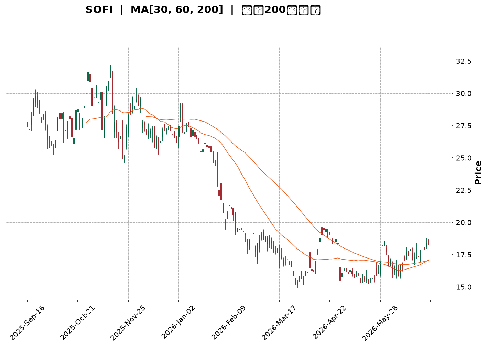
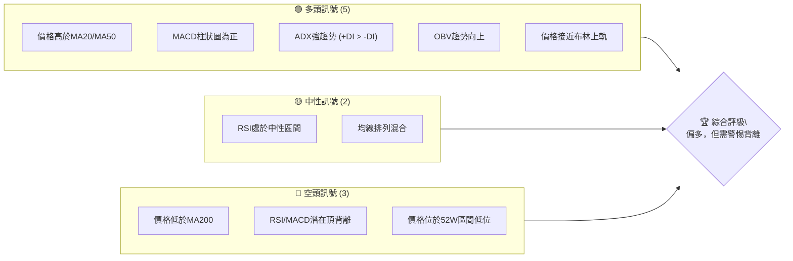
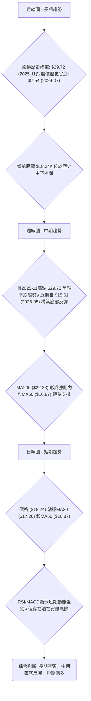
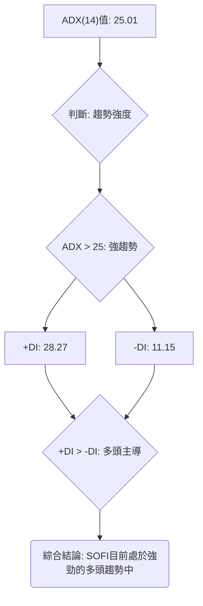
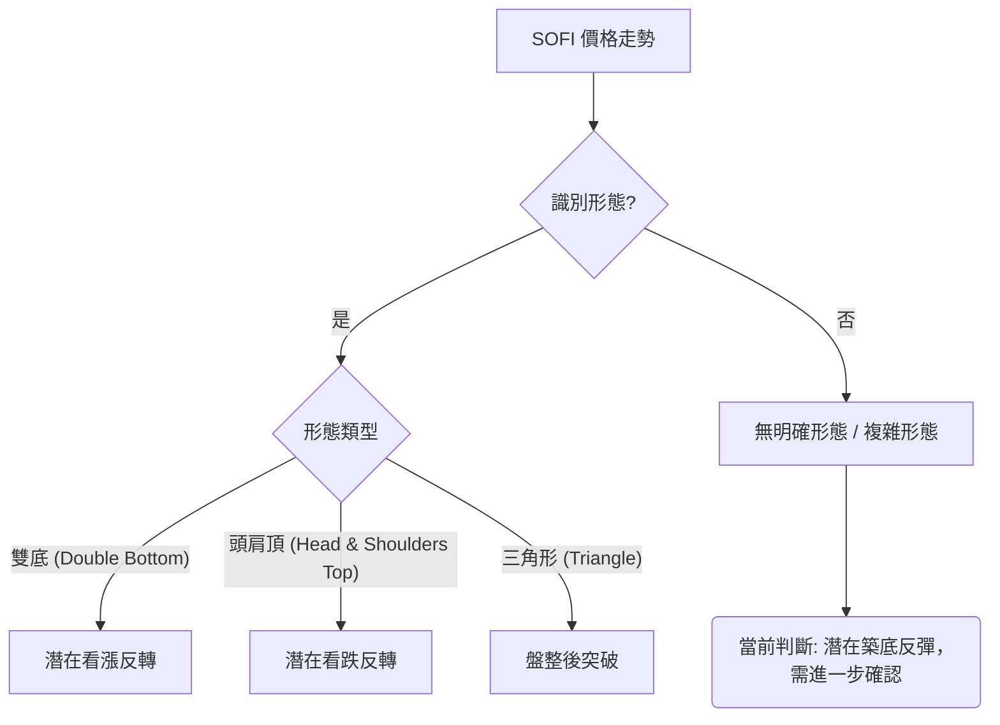
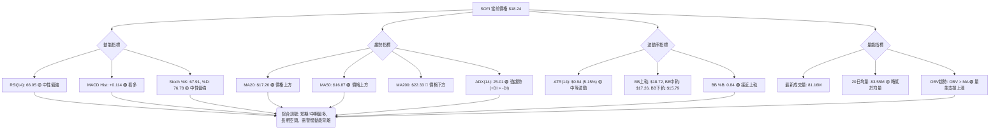
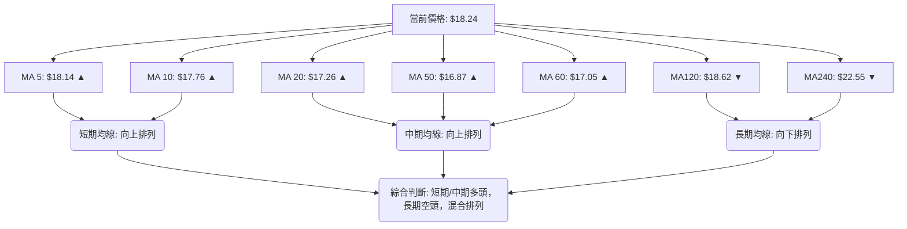
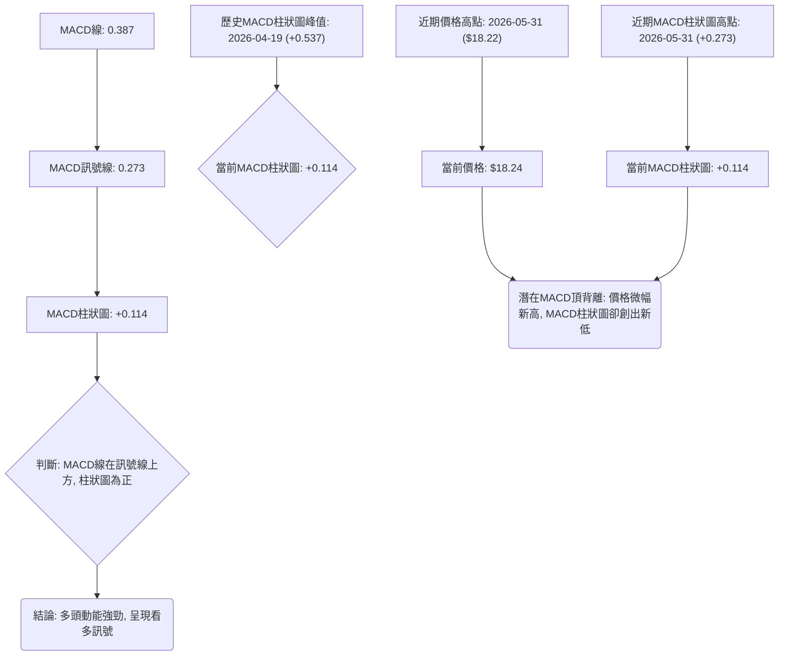
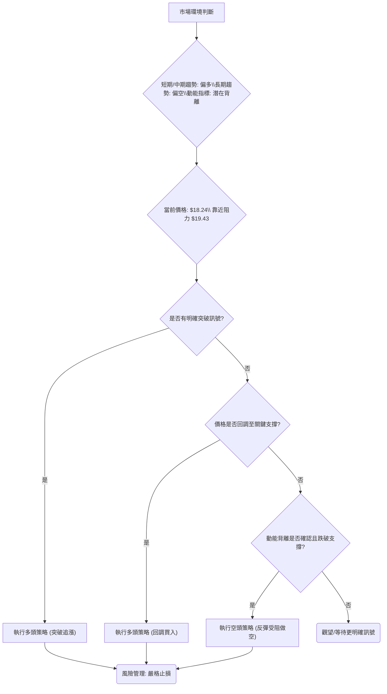
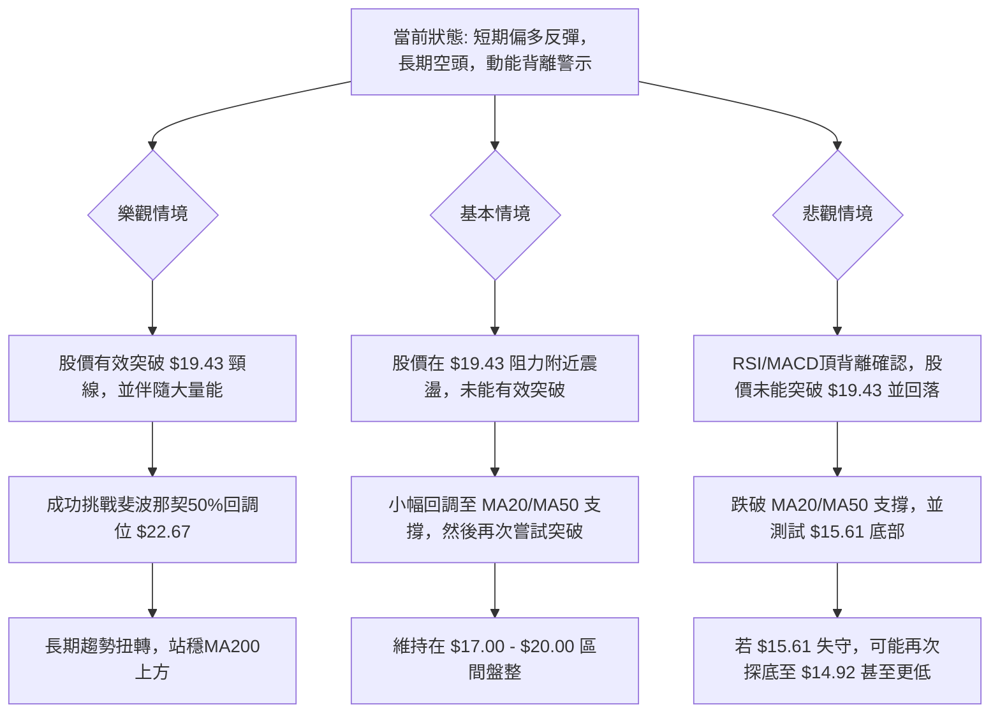

<details>
<summary>📊 靜態圖表 (點擊展開)</summary>

</details>

<html>
<head><meta charset="utf-8" /></head>
<body>
    <div style="height:500px; width:100%;">                        <script>window.PlotlyConfig = {MathJaxConfig: 'local'};</script>
        <script charset="utf-8" src="https://cdn.plot.ly/plotly-3.6.0.min.js" integrity="sha256-QaOVwtVY0T02VaHrr6pnoHLCwayMJp4O5n4YyaE3rJk=" crossorigin="anonymous"></script>                <div id="candlestick-chart" class="plotly-graph-div" style="height:100%; width:100%;"></div>            <script>                window.PLOTLYENV=window.PLOTLYENV || {};                                if (document.getElementById("candlestick-chart")) {                    Plotly.newPlot(                        "candlestick-chart",                        [{"close":{"dtype":"f8","bdata":"AAAAIIVrO0AAAAAA1yM7QAAAAAApHDxAAAAAYI+CPUAAAAAgXM89QAAAAEAKFz1AAAAA4KNwPEAAAABguB48QAAAAEDh+jtAAAAAwMyMO0AAAAAghWs6QAAAAGCPwjlAAAAA4FH4OUAAAACgcD05QAAAAAApXDpAAAAAANcjPEAAAADAHgU8QAAAAEAzczxAAAAA4KMwOkAAAAAA1yM7QAAAAGC43jtAAAAAIK4HPEAAAACgmZk6QAAAAIA9ijpAAAAAgBSuPEAAAAAAAMA8QAAAAOCjMDtAAAAA4HoUPEAAAABgjwI9QAAAAAAAAD5AAAAAwPWoP0AAAABgZuY+QAAAACCuBz1AAAAAgBSuPUAAAACgR6E+QAAAAGC4Xj1AAAAAgOsRPkAAAADA9Sg7QAAAAIDCNTxAAAAAgD2KPkAAAABAM\u002fM+QAAAAEDhGkBAAAAAANdjPEAAAACA69E7QAAAAIA9CjtAAAAAoHA9OkAAAADgUbg6QAAAAMD16DhAAAAA4KMwOUAAAABgZmY7QAAAAOB6VDxAAAAAoHB9PEAAAADgUbg9QAAAACCuBz1AAAAAYI+CPUAAAACA6xE9QAAAAKCZmT1AAAAAIK7HO0AAAAAAKZw7QAAAAOB61DpAAAAAQAoXO0AAAACA6xE7QAAAACCuRztAAAAAgOvROUAAAADgepQ6QAAAAMAeRTlAAAAAgD1KOkAAAACgcD07QAAAAKCZWTtAAAAA4KMwO0AAAABA4Xo7QAAAAIDrETtAAAAAgOvROkAAAAAgXI86QAAAAIAULjpAAAAAgMJ1O0AAAAAgrkc9QAAAAEDh+jpAAAAAAAAAO0AAAADgUbg7QAAAAGBmZjtAAAAAoJmZOkAAAAAA1yM7QAAAACCFqzpAAAAA4KNwOkAAAACgRyE6QAAAAKBwfTlAAAAAANejOUAAAABAChc6QAAAAKCZ2TlAAAAAwMzMOUAAAACAwnU5QAAAAKCZmThAAAAAAClcOEAAAAAgXM82QAAAAOB6FDZAAAAAYI\u002fCNUAAAAAAAMA0QAAAAIDCdTNAAAAAACncNEAAAACgmVk1QAAAAIAULjVAAAAAwMyMNEAAAADAzEwzQAAAAAApnDNAAAAAYI+CM0AAAACAPYozQAAAAMDMTDNAAAAAwB4FM0AAAADgUTgyQAAAAMD1qDJAAAAAgD1KM0AAAACgmRkzQAAAAGCPwjFAAAAAANdjMkAAAAAAKZwyQAAAAEAzszJAAAAAAABAM0AAAABgZuYyQAAAAIA9yjJAAAAAgD1KMkAAAAAgrocyQAAAAEAzszFAAAAAYI\u002fCMUAAAACgR6ExQAAAAGC4XjFAAAAAgBQuMUAAAADgehQxQAAAAGBm5jBAAAAAYGYmMUAAAABAM7MwQAAAACBcjzBAAAAAoHC9L0AAAACAwnUuQAAAAMDMTC5AAAAAYI\u002fCL0AAAABgj0IvQAAAAEAzsy9AAAAAwB5FMEAAAAAAKRwwQAAAAKBwfTBAAAAAwB5FMEAAAADgUTgwQAAAAMDMDDFAAAAAwPXoMUAAAACAPcoyQAAAACCuBzNAAAAAgBRuM0AAAAAAAIAzQAAAAOB61DJAAAAAIFwPM0AAAACA61EyQAAAAOCjcDJAAAAAYI\u002fCMkAAAAAAKVwyQAAAAMDMDC9AAAAAoJkZMEAAAACAFG4wQAAAAEAzMzBAAAAAwB4FMEAAAADAzEwwQAAAAAAAADBAAAAAAACAL0AAAABgj0IwQAAAAMDMzC9AAAAAYLieLkAAAADAHgUwQAAAAOBROC9AAAAAIIVrL0AAAACAwnUuQAAAAKBHYS9AAAAAwMxML0AAAACgcD0vQAAAAIDC9S9AAAAAIIUrMEAAAADgUfgwQAAAAOBRODJAAAAA4HqUMkAAAACgcL0xQAAAAIAUrjBAAAAAYGYmMUAAAAAgrgcwQAAAAAAAgDBAAAAA4FF4MEAAAACgcL0vQAAAACCFqzBAAAAA4HqUMEAAAACgRyExQAAAAIDCtTFAAAAAIIVrMUAAAADA9egxQAAAAKCZGTFAAAAAgD1KMUAAAAAgXE8xQAAAAMDMTDFAAAAAoEfhMUAAAADgozAyQAAAAIAU7jFAAAAA4KNwMkAAAACgcD0yQA=="},"high":{"dtype":"f8","bdata":"AAAAoEfhO0AAAACAwnU7QAAAAEC2kzxAAAAAoEehPUAAAADAzEw+QAAAAADXIz5AAAAAIIWrPUAAAAAghas8QAAAAEDhejxAAAAAoEehPEAAAAAAKZw7QAAAAOB6VDtAAAAAoJlZOkAAAACAFC46QAAAAADXIztAAAAAQArXPEAAAACAwrU8QAAAAOCjsDxAAAAAwMzMPUAAAACAFG47QAAAAKCZWTxAAAAAQAoXPUAAAADgo3A8QAAAACCF6zpAAAAAgBTuPEAAAACA6xE9QAAAAMDMzDxAAAAA4FGYPEAAAABguN49QAAAAEAzMz5AAAAAQOH6P0AAAADgUUhAQAAAAIA96j5AAAAAACncPUAAAADgUTg\u002fQAAAAIA9yj5AAAAAYLhePkAAAABg59s+QAAAAKBwPTxAAAAA4FH4PkAAAACgcP0+QAAAAKBwXUBAAAAAAADAP0AAAACA6xE9QAAAAEAz8ztAAAAAAAAAO0AAAACgmdk6QAAAAEAzkzxAAAAAgOtxOUAAAAAAKZw7QAAAAEAzczxAAAAAAABAPUAAAAAAAMA9QAAAAEAzsz1AAAAAIIVrPkAAAACAFO49QAAAAEAzsz1AAAAAgBTuO0AAAADgetQ7QAAAAEAzcztAAAAAgBSuO0AAAAAgrkc7QAAAAAAAgDtAAAAAQOF6O0AAAACgcL06QAAAAIDC1TpAAAAAQAq3OkAAAABguF47QAAAAGC4njtAAAAAQApXO0AAAACAPYo7QAAAAMDMjDtAAAAAwPVoO0AAAAAA1yM7QAAAAGBm5jpAAAAAoEeBO0AAAAAAKdw9QAAAAMDMTD1AAAAAgBQuO0AAAACAFA48QAAAAAAAYDxAAAAAYOVQO0AAAABAMzM7QAAAAIDCFTtAAAAA4HpUO0AAAAAgrsc6QAAAAEAKVzpAAAAAwMwMOkAAAAAA12M6QAAAAKBHITpAAAAAYGZmOkAAAACAFO45QAAAAIA9yjlAAAAAYLgeOUAAAADgUXg5QAAAAAAAADdAAAAAAClcN0AAAAAA18M1QAAAAGBmZjRAAAAAwPUoNUAAAABACpc1QAAAAAAAADZAAAAAoJkZNUAAAACAPco0QAAAAGC43jNAAAAAQArXM0AAAABgjwI0QAAAAEDhejNAAAAA4KMwM0AAAACgR8EyQAAAAIDCtTJAAAAAYLieM0AAAAAgXI8zQAAAAIDCNTJAAAAAwPVoMkAAAACAPQozQAAAACCuRzNAAAAAQOF6M0AAAABguD4zQAAAAIDr8TJAAAAAYGYGM0AAAACgmdkyQAAAAMDMjDJAAAAAYGYmMkAAAACA6xEyQAAAAKBHQTJAAAAAIK4HMkAAAAAghUsxQAAAAMByaDFAAAAAwPVoMUAAAACA6xExQAAAAEAKVzFAAAAAoHB9MEAAAACgR2EvQAAAAKBHIS9AAAAAYGYGMEAAAACA61EwQAAAACCuxy9AAAAAwMxsMEAAAABA4VowQAAAAKCZ2TFAAAAA4FF4MEAAAACgcH0wQAAAACBcDzFAAAAAQDMTMkAAAACA69EyQAAAAGC4njNAAAAAoEchNEAAAADAHqUzQAAAAMAexTNAAAAAILByM0AAAABgZuYyQAAAAEAzkzJAAAAAIIUrM0AAAABguN4yQAAAAEAKlzBAAAAAYLheMEAAAAAghcswQAAAACCuxzBAAAAAIFxPMEAAAACgR4EwQAAAAIDCdTBAAAAAwMwMMEAAAACA61EwQAAAAOB6VDBAAAAAIIVrL0AAAADgoxAwQAAAAIAUri9AAAAAgOtRMEAAAAAgrkcvQAAAAOCjcC9AAAAAgOuRL0AAAAAAKdwvQAAAAEAz8zBAAAAA4KOwMEAAAADgehQxQAAAAEAKlzJAAAAAIIXLMkAAAABA4ToyQAAAAEAKdzFAAAAAQOE6MUAAAACgcP0wQAAAAMD1qDBAAAAAoJkZMUAAAADgUbgwQAAAAOCjsDBAAAAAIK7nMEAAAACAFG4xQAAAAOB6FDJAAAAAQDOzMkAAAACgcP0xQAAAACBcDzJAAAAAgBSuMUAAAACAFG4yQAAAAEAzkzFAAAAA4FH4MUAAAADAzEwyQAAAAKBwPTJAAAAA4HrUMkAAAADgozAzQA=="},"hovertemplate":"\u003cb\u003e%{x|%Y-%m-%d}\u003c\u002fb\u003e\u003cbr\u003e\u958b: $%{open:.2f}\u003cbr\u003e\u9ad8: $%{high:.2f}\u003cbr\u003e\u4f4e: $%{low:.2f}\u003cbr\u003e\u6536: $%{close:.2f}\u003cextra\u003e\u003c\u002fextra\u003e","low":{"dtype":"f8","bdata":"AAAAoEehOkAAAACgRyE6QAAAAOB6FDtAAAAAoHA9PEAAAADgUfg8QAAAAKCZ2TxAAAAAoJlZPEAAAAAgXA87QAAAACBcjztAAAAAACkcO0AAAABAM7M5QAAAAADXozlAAAAAQDNzOUAAAABACtc4QAAAACBcTzlAAAAAgBSuOkAAAADAHqU7QAAAAAAAwDtAAAAAoEchOkAAAADgUXg6QAAAAAAAwDlAAAAAIFyPO0AAAAAAAEA6QAAAAGCPAjpAAAAAIFwPO0AAAABgZiY8QAAAAKBHYTpAAAAAoPEyO0AAAABAM7M8QAAAAMAeRT1AAAAAwMzMPEAAAAAA1yM+QAAAAEDh+jxAAAAAoHB9PEAAAADgelQ9QAAAAOCjsDxAAAAAYI8CPUAAAACgRyE7QAAAAMD1qDlAAAAAQArXPEAAAADgIts9QAAAAIDC9T5AAAAAYGYmPEAAAAAgroc6QAAAAMDMjDpAAAAAgMK1OUAAAAAgXI85QAAAAGC4vjhAAAAAwB6FN0AAAAAgrqc5QAAAAKBHoTpAAAAAIFxPPEAAAADgenQ8QAAAACCFqzxAAAAA4KNQPUAAAADAHgU9QAAAAEDhejxAAAAAgBTuOkAAAADAzAw7QAAAAMDMjDpAAAAAQOF6OkAAAACAFI46QAAAAEAzMzpAAAAAgD3KOUAAAADgUbg5QAAAACCFKzlAAAAAQDPzOUAAAAAgrkc6QAAAAKCZGTtAAAAAQDPTOkAAAAAgrgc7QAAAACCuBztAAAAAoHC9OkAAAACAPYo6QAAAACBcDzpAAAAAgD3KOUAAAACgmZk7QAAAACCuBzpAAAAAoHBdOkAAAACA65E6QAAAAEDhOjtAAAAAQDMzOkAAAADgUTg6QAAAACCF6zlAAAAAgMI1OkAAAABgjwI6QAAAAIDCNTlAAAAAQDPzOEAAAAAAAAA6QAAAAKCZmTlAAAAAwB7FOUAAAACAwjU5QAAAAIDrkThAAAAAwMwMOEAAAAAgXE82QAAAAAAp3DVAAAAAwB4FNUAAAACA6xE0QAAAAACqMTNAAAAAgD0KNEAAAADAzMw0QAAAAMDMDDVAAAAAANcjNEAAAACAPQozQAAAAGBmJjNAAAAAACkcM0AAAACgmTkzQAAAAOBR+DJAAAAAANeDMkAAAADgepQxQAAAAADX4zFAAAAAgBTuMkAAAADgUfgyQAAAACBcTzFAAAAAwMzMMEAAAADgo7AxQAAAAAApnDJAAAAAANejMkAAAABguB4yQAAAAMAexTFAAAAAgD0KMkAAAADgUfgxQAAAAGC4njFAAAAAIK6HMUAAAADgUXgxQAAAAEDhejBAAAAAwPUoMUAAAADgepQwQAAAACCFqzBAAAAAQArXMEAAAACgcH0wQAAAAMAehTBAAAAAACmcL0AAAADAzEwuQAAAAGC43i1AAAAAYLieLkAAAACgR+EuQAAAAAAp3C1AAAAAYI\u002fCL0AAAACA69EvQAAAAGCPQjBAAAAA4HrUL0AAAADgURgwQAAAACCF6y9AAAAAYGZmMUAAAAAghSsyQAAAAGBmpjJAAAAAANdjM0AAAABAChczQAAAAOCjsDJAAAAAwPXoMkAAAACAFO4xQAAAAIDAKjJAAAAAANdjMkAAAADAHkUyQAAAAAAAAC9AAAAA4HoUL0AAAAAAAMAvQAAAAKBHITBAAAAAoEfhL0AAAABA4fovQAAAAMD1qC9AAAAAgD0KL0AAAACAPYovQAAAAKCZGS9AAAAAgBRuLkAAAACAwnUuQAAAAGCPwi5AAAAAgBSuLkAAAABACtctQAAAACBcDy5AAAAAQDOzLkAAAADgUbguQAAAAOBRuC9AAAAAYI8CMEAAAAAA16MvQAAAAIAUrjFAAAAA4KOwMUAAAACAwnUxQAAAAOB6lDBAAAAAgMKVMEAAAAAAKVwvQAAAAMD16C9AAAAA4E9NL0AAAADA9agvQAAAACBcTy9AAAAAQOE6MEAAAABgjwIxQAAAAACsHDFAAAAAAClcMUAAAAAA10MxQAAAAIDrETFAAAAA4FG4MEAAAACAFC4xQAAAAIDr0TBAAAAAoHD9MEAAAAAAAIAxQAAAAEAKtzFAAAAAgML1MUAAAAAA18MxQA=="},"name":"\u50f9\u683c","open":{"dtype":"f8","bdata":"AAAAgD3KO0AAAAAAAEA7QAAAAEAKlztAAAAAANdDPEAAAADAzEw9QAAAAIAUzj1AAAAAAACAPUAAAABgj8I7QAAAAGC4XjxAAAAAAClcPEAAAADgUXg7QAAAAEDhujpAAAAA4HpUOkAAAACgmRk6QAAAAMAexTlAAAAAoJkZO0AAAACgcH08QAAAAIA9CjxAAAAAwMyMPEAAAACA6xE7QAAAAGCPgjpAAAAAQDMzPEAAAACA6xE8QAAAAKCZGTpAAAAAQDMzO0AAAAAgXI88QAAAAKBwfTxAAAAA4HpUO0AAAADgUdg8QAAAAAAAAD5AAAAAoHD9PkAAAABguH4\u002fQAAAACBcbz5AAAAA4KOwPUAAAADA9ag9QAAAACCFSz1AAAAAwB6FPUAAAAAAACA+QAAAAGBmhjpAAAAAIFwPPUAAAABguD4+QAAAAIAULj9AAAAAQOG6P0AAAAAAAAA7QAAAAIDCtTtAAAAAYI+COkAAAACgmXk6QAAAAKBH4TtAAAAAoEehOEAAAADgetQ5QAAAAEDh+jpAAAAAgMK1PEAAAACAPco8QAAAAOB61DxAAAAAANdjPUAAAADAzGw9QAAAAMD1CD1AAAAAoHBdO0AAAABA4bo7QAAAAKBwPTtAAAAAYGamOkAAAABACtc6QAAAAMAeJTtAAAAAIFxvO0AAAACgcL05QAAAAADXozpAAAAAgBQuOkAAAABguJ46QAAAAOBRmDtAAAAAgOsRO0AAAAAghSs7QAAAAIA9ijtAAAAAYLjeOkAAAAAgrgc7QAAAAIAUrjpAAAAAwPWoOkAAAAAgXM87QAAAAEDhOj1AAAAAoHDdOkAAAAAAAAA7QAAAAIAUzjtAAAAAgD1KO0AAAABAM7M6QAAAAAAAADtAAAAAIFzPOkAAAACAPYo6QAAAAOCjcDlAAAAAAACAOUAAAACAFC46QAAAAAAAADpAAAAAYGbmOUAAAABgZuY5QAAAAAAAgDlAAAAAoHDdOEAAAACAFG45QAAAAGCPgjZAAAAAwMwMN0AAAACgcH01QAAAAEDhOjRAAAAAgD1KNEAAAACAPUo1QAAAAEAKFzVAAAAAoJkZNUAAAACAPco0QAAAACCuRzNAAAAAwPVoM0AAAADgUXgzQAAAAOB6VDNAAAAAgMIVM0AAAABA4boyQAAAAAAAADJAAAAAIK5HM0AAAADgozAzQAAAAMD1KDJAAAAAwB4lMUAAAAAAAAAyQAAAACBcDzNAAAAAYGamMkAAAAAAKXwyQAAAAOB6VDJAAAAAIIXrMkAAAAAA12MyQAAAAOBRODJAAAAAwMzMMUAAAAAAAAAyQAAAAOBRuDFAAAAAgBRuMUAAAAAAAMAwQAAAAIA96jBAAAAAIK4nMUAAAABguP4wQAAAAIA9CjFAAAAAYGZGMEAAAABAClcvQAAAAAAp3C5AAAAAYGbmLkAAAABgZkYwQAAAAKBHYS5AAAAAIK7HL0AAAADA9SgwQAAAAIAUrjFAAAAAANdjMEAAAADAzEwwQAAAAAAAADBAAAAAIK6HMUAAAADgUXgyQAAAAGC4njNAAAAAoJmZM0AAAABgj0IzQAAAAGCPgjNAAAAAgD1KM0AAAADAHsUyQAAAAOCjcDJAAAAAQOF6MkAAAADAHmUyQAAAAMDMjDBAAAAAgD2KL0AAAAAAKTwwQAAAAOBReDBAAAAAIIUrMEAAAABAMzMwQAAAAGCPQjBAAAAAIK4HMEAAAACgmZkvQAAAAIDrETBAAAAAIIVrL0AAAABguJ4uQAAAAGBmZi9AAAAAgML1LkAAAACAwjUvQAAAAEDhui5AAAAAoHA9L0AAAABgZmYvQAAAAEDhejBAAAAAwMwMMEAAAADAHgUwQAAAAGCPQjJAAAAAYGYmMkAAAAAgrgcyQAAAAKBHYTFAAAAAwPWoMEAAAABA4bowQAAAAIAULjBAAAAAYGZmMEAAAADgejQwQAAAAADXoy9AAAAAgOvRMEAAAAAgrkcxQAAAAEAzMzFAAAAAIFzPMUAAAABAM9MxQAAAAEAKlzFAAAAAACm8MEAAAADgUTgxQAAAAGBmZjFAAAAAAAAAMUAAAADgozAyQAAAAKCZGTJAAAAAANcjMkAAAABAM7MyQA=="},"x":["2025-09-16T00:00:00-04:00","2025-09-17T00:00:00-04:00","2025-09-18T00:00:00-04:00","2025-09-19T00:00:00-04:00","2025-09-22T00:00:00-04:00","2025-09-23T00:00:00-04:00","2025-09-24T00:00:00-04:00","2025-09-25T00:00:00-04:00","2025-09-26T00:00:00-04:00","2025-09-29T00:00:00-04:00","2025-09-30T00:00:00-04:00","2025-10-01T00:00:00-04:00","2025-10-02T00:00:00-04:00","2025-10-03T00:00:00-04:00","2025-10-06T00:00:00-04:00","2025-10-07T00:00:00-04:00","2025-10-08T00:00:00-04:00","2025-10-09T00:00:00-04:00","2025-10-10T00:00:00-04:00","2025-10-13T00:00:00-04:00","2025-10-14T00:00:00-04:00","2025-10-15T00:00:00-04:00","2025-10-16T00:00:00-04:00","2025-10-17T00:00:00-04:00","2025-10-20T00:00:00-04:00","2025-10-21T00:00:00-04:00","2025-10-22T00:00:00-04:00","2025-10-23T00:00:00-04:00","2025-10-24T00:00:00-04:00","2025-10-27T00:00:00-04:00","2025-10-28T00:00:00-04:00","2025-10-29T00:00:00-04:00","2025-10-30T00:00:00-04:00","2025-10-31T00:00:00-04:00","2025-11-03T00:00:00-05:00","2025-11-04T00:00:00-05:00","2025-11-05T00:00:00-05:00","2025-11-06T00:00:00-05:00","2025-11-07T00:00:00-05:00","2025-11-10T00:00:00-05:00","2025-11-11T00:00:00-05:00","2025-11-12T00:00:00-05:00","2025-11-13T00:00:00-05:00","2025-11-14T00:00:00-05:00","2025-11-17T00:00:00-05:00","2025-11-18T00:00:00-05:00","2025-11-19T00:00:00-05:00","2025-11-20T00:00:00-05:00","2025-11-21T00:00:00-05:00","2025-11-24T00:00:00-05:00","2025-11-25T00:00:00-05:00","2025-11-26T00:00:00-05:00","2025-11-28T00:00:00-05:00","2025-12-01T00:00:00-05:00","2025-12-02T00:00:00-05:00","2025-12-03T00:00:00-05:00","2025-12-04T00:00:00-05:00","2025-12-05T00:00:00-05:00","2025-12-08T00:00:00-05:00","2025-12-09T00:00:00-05:00","2025-12-10T00:00:00-05:00","2025-12-11T00:00:00-05:00","2025-12-12T00:00:00-05:00","2025-12-15T00:00:00-05:00","2025-12-16T00:00:00-05:00","2025-12-17T00:00:00-05:00","2025-12-18T00:00:00-05:00","2025-12-19T00:00:00-05:00","2025-12-22T00:00:00-05:00","2025-12-23T00:00:00-05:00","2025-12-24T00:00:00-05:00","2025-12-26T00:00:00-05:00","2025-12-29T00:00:00-05:00","2025-12-30T00:00:00-05:00","2025-12-31T00:00:00-05:00","2026-01-02T00:00:00-05:00","2026-01-05T00:00:00-05:00","2026-01-06T00:00:00-05:00","2026-01-07T00:00:00-05:00","2026-01-08T00:00:00-05:00","2026-01-09T00:00:00-05:00","2026-01-12T00:00:00-05:00","2026-01-13T00:00:00-05:00","2026-01-14T00:00:00-05:00","2026-01-15T00:00:00-05:00","2026-01-16T00:00:00-05:00","2026-01-20T00:00:00-05:00","2026-01-21T00:00:00-05:00","2026-01-22T00:00:00-05:00","2026-01-23T00:00:00-05:00","2026-01-26T00:00:00-05:00","2026-01-27T00:00:00-05:00","2026-01-28T00:00:00-05:00","2026-01-29T00:00:00-05:00","2026-01-30T00:00:00-05:00","2026-02-02T00:00:00-05:00","2026-02-03T00:00:00-05:00","2026-02-04T00:00:00-05:00","2026-02-05T00:00:00-05:00","2026-02-06T00:00:00-05:00","2026-02-09T00:00:00-05:00","2026-02-10T00:00:00-05:00","2026-02-11T00:00:00-05:00","2026-02-12T00:00:00-05:00","2026-02-13T00:00:00-05:00","2026-02-17T00:00:00-05:00","2026-02-18T00:00:00-05:00","2026-02-19T00:00:00-05:00","2026-02-20T00:00:00-05:00","2026-02-23T00:00:00-05:00","2026-02-24T00:00:00-05:00","2026-02-25T00:00:00-05:00","2026-02-26T00:00:00-05:00","2026-02-27T00:00:00-05:00","2026-03-02T00:00:00-05:00","2026-03-03T00:00:00-05:00","2026-03-04T00:00:00-05:00","2026-03-05T00:00:00-05:00","2026-03-06T00:00:00-05:00","2026-03-09T00:00:00-04:00","2026-03-10T00:00:00-04:00","2026-03-11T00:00:00-04:00","2026-03-12T00:00:00-04:00","2026-03-13T00:00:00-04:00","2026-03-16T00:00:00-04:00","2026-03-17T00:00:00-04:00","2026-03-18T00:00:00-04:00","2026-03-19T00:00:00-04:00","2026-03-20T00:00:00-04:00","2026-03-23T00:00:00-04:00","2026-03-24T00:00:00-04:00","2026-03-25T00:00:00-04:00","2026-03-26T00:00:00-04:00","2026-03-27T00:00:00-04:00","2026-03-30T00:00:00-04:00","2026-03-31T00:00:00-04:00","2026-04-01T00:00:00-04:00","2026-04-02T00:00:00-04:00","2026-04-06T00:00:00-04:00","2026-04-07T00:00:00-04:00","2026-04-08T00:00:00-04:00","2026-04-09T00:00:00-04:00","2026-04-10T00:00:00-04:00","2026-04-13T00:00:00-04:00","2026-04-14T00:00:00-04:00","2026-04-15T00:00:00-04:00","2026-04-16T00:00:00-04:00","2026-04-17T00:00:00-04:00","2026-04-20T00:00:00-04:00","2026-04-21T00:00:00-04:00","2026-04-22T00:00:00-04:00","2026-04-23T00:00:00-04:00","2026-04-24T00:00:00-04:00","2026-04-27T00:00:00-04:00","2026-04-28T00:00:00-04:00","2026-04-29T00:00:00-04:00","2026-04-30T00:00:00-04:00","2026-05-01T00:00:00-04:00","2026-05-04T00:00:00-04:00","2026-05-05T00:00:00-04:00","2026-05-06T00:00:00-04:00","2026-05-07T00:00:00-04:00","2026-05-08T00:00:00-04:00","2026-05-11T00:00:00-04:00","2026-05-12T00:00:00-04:00","2026-05-13T00:00:00-04:00","2026-05-14T00:00:00-04:00","2026-05-15T00:00:00-04:00","2026-05-18T00:00:00-04:00","2026-05-19T00:00:00-04:00","2026-05-20T00:00:00-04:00","2026-05-21T00:00:00-04:00","2026-05-22T00:00:00-04:00","2026-05-26T00:00:00-04:00","2026-05-27T00:00:00-04:00","2026-05-28T00:00:00-04:00","2026-05-29T00:00:00-04:00","2026-06-01T00:00:00-04:00","2026-06-02T00:00:00-04:00","2026-06-03T00:00:00-04:00","2026-06-04T00:00:00-04:00","2026-06-05T00:00:00-04:00","2026-06-08T00:00:00-04:00","2026-06-09T00:00:00-04:00","2026-06-10T00:00:00-04:00","2026-06-11T00:00:00-04:00","2026-06-12T00:00:00-04:00","2026-06-15T00:00:00-04:00","2026-06-16T00:00:00-04:00","2026-06-17T00:00:00-04:00","2026-06-18T00:00:00-04:00","2026-06-22T00:00:00-04:00","2026-06-23T00:00:00-04:00","2026-06-24T00:00:00-04:00","2026-06-25T00:00:00-04:00","2026-06-26T00:00:00-04:00","2026-06-29T00:00:00-04:00","2026-06-30T00:00:00-04:00","2026-07-01T00:00:00-04:00","2026-07-02T00:00:00-04:00"],"type":"candlestick"},{"hovertemplate":"MA30: $%{y:.2f}\u003cextra\u003e\u003c\u002fextra\u003e","line":{"color":"#2196F3","dash":"dash","width":2},"mode":"lines","name":"MA30","x":["2025-09-16T00:00:00-04:00","2025-09-17T00:00:00-04:00","2025-09-18T00:00:00-04:00","2025-09-19T00:00:00-04:00","2025-09-22T00:00:00-04:00","2025-09-23T00:00:00-04:00","2025-09-24T00:00:00-04:00","2025-09-25T00:00:00-04:00","2025-09-26T00:00:00-04:00","2025-09-29T00:00:00-04:00","2025-09-30T00:00:00-04:00","2025-10-01T00:00:00-04:00","2025-10-02T00:00:00-04:00","2025-10-03T00:00:00-04:00","2025-10-06T00:00:00-04:00","2025-10-07T00:00:00-04:00","2025-10-08T00:00:00-04:00","2025-10-09T00:00:00-04:00","2025-10-10T00:00:00-04:00","2025-10-13T00:00:00-04:00","2025-10-14T00:00:00-04:00","2025-10-15T00:00:00-04:00","2025-10-16T00:00:00-04:00","2025-10-17T00:00:00-04:00","2025-10-20T00:00:00-04:00","2025-10-21T00:00:00-04:00","2025-10-22T00:00:00-04:00","2025-10-23T00:00:00-04:00","2025-10-24T00:00:00-04:00","2025-10-27T00:00:00-04:00","2025-10-28T00:00:00-04:00","2025-10-29T00:00:00-04:00","2025-10-30T00:00:00-04:00","2025-10-31T00:00:00-04:00","2025-11-03T00:00:00-05:00","2025-11-04T00:00:00-05:00","2025-11-05T00:00:00-05:00","2025-11-06T00:00:00-05:00","2025-11-07T00:00:00-05:00","2025-11-10T00:00:00-05:00","2025-11-11T00:00:00-05:00","2025-11-12T00:00:00-05:00","2025-11-13T00:00:00-05:00","2025-11-14T00:00:00-05:00","2025-11-17T00:00:00-05:00","2025-11-18T00:00:00-05:00","2025-11-19T00:00:00-05:00","2025-11-20T00:00:00-05:00","2025-11-21T00:00:00-05:00","2025-11-24T00:00:00-05:00","2025-11-25T00:00:00-05:00","2025-11-26T00:00:00-05:00","2025-11-28T00:00:00-05:00","2025-12-01T00:00:00-05:00","2025-12-02T00:00:00-05:00","2025-12-03T00:00:00-05:00","2025-12-04T00:00:00-05:00","2025-12-05T00:00:00-05:00","2025-12-08T00:00:00-05:00","2025-12-09T00:00:00-05:00","2025-12-10T00:00:00-05:00","2025-12-11T00:00:00-05:00","2025-12-12T00:00:00-05:00","2025-12-15T00:00:00-05:00","2025-12-16T00:00:00-05:00","2025-12-17T00:00:00-05:00","2025-12-18T00:00:00-05:00","2025-12-19T00:00:00-05:00","2025-12-22T00:00:00-05:00","2025-12-23T00:00:00-05:00","2025-12-24T00:00:00-05:00","2025-12-26T00:00:00-05:00","2025-12-29T00:00:00-05:00","2025-12-30T00:00:00-05:00","2025-12-31T00:00:00-05:00","2026-01-02T00:00:00-05:00","2026-01-05T00:00:00-05:00","2026-01-06T00:00:00-05:00","2026-01-07T00:00:00-05:00","2026-01-08T00:00:00-05:00","2026-01-09T00:00:00-05:00","2026-01-12T00:00:00-05:00","2026-01-13T00:00:00-05:00","2026-01-14T00:00:00-05:00","2026-01-15T00:00:00-05:00","2026-01-16T00:00:00-05:00","2026-01-20T00:00:00-05:00","2026-01-21T00:00:00-05:00","2026-01-22T00:00:00-05:00","2026-01-23T00:00:00-05:00","2026-01-26T00:00:00-05:00","2026-01-27T00:00:00-05:00","2026-01-28T00:00:00-05:00","2026-01-29T00:00:00-05:00","2026-01-30T00:00:00-05:00","2026-02-02T00:00:00-05:00","2026-02-03T00:00:00-05:00","2026-02-04T00:00:00-05:00","2026-02-05T00:00:00-05:00","2026-02-06T00:00:00-05:00","2026-02-09T00:00:00-05:00","2026-02-10T00:00:00-05:00","2026-02-11T00:00:00-05:00","2026-02-12T00:00:00-05:00","2026-02-13T00:00:00-05:00","2026-02-17T00:00:00-05:00","2026-02-18T00:00:00-05:00","2026-02-19T00:00:00-05:00","2026-02-20T00:00:00-05:00","2026-02-23T00:00:00-05:00","2026-02-24T00:00:00-05:00","2026-02-25T00:00:00-05:00","2026-02-26T00:00:00-05:00","2026-02-27T00:00:00-05:00","2026-03-02T00:00:00-05:00","2026-03-03T00:00:00-05:00","2026-03-04T00:00:00-05:00","2026-03-05T00:00:00-05:00","2026-03-06T00:00:00-05:00","2026-03-09T00:00:00-04:00","2026-03-10T00:00:00-04:00","2026-03-11T00:00:00-04:00","2026-03-12T00:00:00-04:00","2026-03-13T00:00:00-04:00","2026-03-16T00:00:00-04:00","2026-03-17T00:00:00-04:00","2026-03-18T00:00:00-04:00","2026-03-19T00:00:00-04:00","2026-03-20T00:00:00-04:00","2026-03-23T00:00:00-04:00","2026-03-24T00:00:00-04:00","2026-03-25T00:00:00-04:00","2026-03-26T00:00:00-04:00","2026-03-27T00:00:00-04:00","2026-03-30T00:00:00-04:00","2026-03-31T00:00:00-04:00","2026-04-01T00:00:00-04:00","2026-04-02T00:00:00-04:00","2026-04-06T00:00:00-04:00","2026-04-07T00:00:00-04:00","2026-04-08T00:00:00-04:00","2026-04-09T00:00:00-04:00","2026-04-10T00:00:00-04:00","2026-04-13T00:00:00-04:00","2026-04-14T00:00:00-04:00","2026-04-15T00:00:00-04:00","2026-04-16T00:00:00-04:00","2026-04-17T00:00:00-04:00","2026-04-20T00:00:00-04:00","2026-04-21T00:00:00-04:00","2026-04-22T00:00:00-04:00","2026-04-23T00:00:00-04:00","2026-04-24T00:00:00-04:00","2026-04-27T00:00:00-04:00","2026-04-28T00:00:00-04:00","2026-04-29T00:00:00-04:00","2026-04-30T00:00:00-04:00","2026-05-01T00:00:00-04:00","2026-05-04T00:00:00-04:00","2026-05-05T00:00:00-04:00","2026-05-06T00:00:00-04:00","2026-05-07T00:00:00-04:00","2026-05-08T00:00:00-04:00","2026-05-11T00:00:00-04:00","2026-05-12T00:00:00-04:00","2026-05-13T00:00:00-04:00","2026-05-14T00:00:00-04:00","2026-05-15T00:00:00-04:00","2026-05-18T00:00:00-04:00","2026-05-19T00:00:00-04:00","2026-05-20T00:00:00-04:00","2026-05-21T00:00:00-04:00","2026-05-22T00:00:00-04:00","2026-05-26T00:00:00-04:00","2026-05-27T00:00:00-04:00","2026-05-28T00:00:00-04:00","2026-05-29T00:00:00-04:00","2026-06-01T00:00:00-04:00","2026-06-02T00:00:00-04:00","2026-06-03T00:00:00-04:00","2026-06-04T00:00:00-04:00","2026-06-05T00:00:00-04:00","2026-06-08T00:00:00-04:00","2026-06-09T00:00:00-04:00","2026-06-10T00:00:00-04:00","2026-06-11T00:00:00-04:00","2026-06-12T00:00:00-04:00","2026-06-15T00:00:00-04:00","2026-06-16T00:00:00-04:00","2026-06-17T00:00:00-04:00","2026-06-18T00:00:00-04:00","2026-06-22T00:00:00-04:00","2026-06-23T00:00:00-04:00","2026-06-24T00:00:00-04:00","2026-06-25T00:00:00-04:00","2026-06-26T00:00:00-04:00","2026-06-29T00:00:00-04:00","2026-06-30T00:00:00-04:00","2026-07-01T00:00:00-04:00","2026-07-02T00:00:00-04:00"],"y":{"dtype":"f8","bdata":"AAAAAAAA+H8AAAAAAAD4fwAAAAAAAPh\u002fAAAAAAAA+H8AAAAAAAD4fwAAAAAAAPh\u002fAAAAAAAA+H8AAAAAAAD4fwAAAAAAAPh\u002fAAAAAAAA+H8AAAAAAAD4fwAAAAAAAPh\u002fAAAAAAAA+H8AAAAAAAD4fwAAAAAAAPh\u002fAAAAAAAA+H8AAAAAAAD4fwAAAAAAAPh\u002fAAAAAAAA+H8AAAAAAAD4fwAAAAAAAPh\u002fAAAAAAAA+H8AAAAAAAD4fwAAAAAAAPh\u002fAAAAAAAA+H8AAAAAAAD4fwAAAAAAAPh\u002fAAAAAAAA+H8AAAAAAAD4f2ZmZsZnuDtAIiIiMpbcO0CrqqoKrPw7QAAAANCFBDxA7+7uLvkFPEAAAACA+Aw8QLy7uytcDzxAVVVV9UQdPEDe3d3NExU8QO\u002fu7j4KFzxAERERAY4wPEARERHxNVc8QN7d3S1AjjxAAAAAwOaiPECJiIjY6rg8QERERFS4vjxAd3d3t4GuPEAiIiLSaaM8QCIiIpI0hTxAmpmZCax8PEBEREQE5H48QGZmZubQgjxAiYiIyL2GPEBmZmaGXaE8QDMzMwOdtjxAzczMLLK9PECamZk5bcA8QDMzM\u002fP91DxAd3d3l27SPEDv7u4+fMY8QGZmZkZvqzxAVVVV9W+EPEAiIiIywWM8QDMzM0PSVDxAZmZm9uEzPECrqqqaUhE8QERERARW7jtAvLu7exTOO0Dv7u4+w847QM3MzIxsxztAzczMXNaqO0B3d3cHOo07QHd3d4ddYTtAAAAA0PdTO0DNzMxMN0k7QJqZmZngQTtAq6qquklMO0AzMzMjImI7QO\u002fu7h7McztAAAAAID6DO0DNzMws+YU7QO\u002fu7o4JfjtAq6qqyuhtO0AiIiKy5Fc7QCIiIjLBQztA3t3drY4pO0BmZmYmeBA7QHd3d7dl7TpAAAAA0CLbOkAiIiJSKs46QKuqqnrNxTpA3t3dbcu6OkBERERUDq06QHd3d8cvljpAzczMXLqJOkC8u7urjmk6QCIiIgJWTjpAIiIiEq4nOkAzMzNzTPA5QKuqqnr4rDlAIiIiYvR2OUAiIiIypUI5QLy7u0tiEDlAVVVVReHaOEDv7u6O7Zw4QM3MzCzdZDhAMzMzIwYhOECJiIjI6M03QBEREZFfjDdA3t3d\u002fUZIN0DNzMzsNfc2QKuqqhqhrDZAq6qqKkBuNkBVVVWFpCk2QERERFSc3TVAVVVV1eqYNUBVVVUlv1g1QKuqqirOHjVAAAAAAEfoNEBEREQ07Ko0QGZmZmatbjRA7+7ujpcuNEDv7u6+dPMzQHd3d3eTuDNAvLu7i0GAM0CamZmpDVQzQDMzM4PcKzNAmpmZWccEM0DNzMwcduUyQFVVVbWdzzJAZmZmFvWvMkAiIiICR4gyQGZmZnbaYDJAERER2eo4MkBERETMLxYyQO\u002fu7sYg8DFAvLu76ybRMUDNzMxkya8xQJqZmcFYkjFAIiIiSuF6MUBVVVXt32gxQFVVVX1bVjFAq6qqMpY8MUBVVVW9AiQxQAAAALjzHTFAzczMJNsZMUBERERcZBsxQJqZmUE1HjFAEREReb4fMUCamZkx3SQxQKuqqpI0JTFAERERqcYrMUAAAADo+ykxQN7d3XVMMDFAZmZm\u002ftQ4MUDNzMy0Dz8xQFVVVT1RLzFAmpmZ8RkmMUB3d3f\u002fjSAxQLy7u9OUGjFAZmZmTvAQMUBVVVV9hg0xQO\u002fu7ia\u002fCDFAIiIiArkHMUBEREQUgxAxQKuqqnrpFjFAvLu7SwwSMUC8u7tDYBUxQJqZmflTEzFAq6qqoowOMUBmZmY+CgcxQN7d3Z02ADFARERENOz6MEBERER8zfUwQBEREQms7DBAq6qq8tLdMEAAAAAYS84wQGZmZp5hxzBAvLu7wyDAMEBERET8G7EwQFVVVT3DnjBAAAAAyHaOMEC8u7sz7HowQM3MzDReajBAd3d3n9NWMEAiIiIilEEwQM3MzGxZSzBAAAAAAHJPMEC8u7sra1UwQAAAANBNYjBAiYiIKEBuMEAiIiJC\u002fXswQO\u002fu7j5ghTBA3t3dbYSSMEAAAAAwepswQImIiIhspzBAAAAAyFq9MEAAAAA4388wQGZmZlar4zBAVVVVHff6MEB3d3ePphQxQA=="},"type":"scatter"},{"hovertemplate":"MA60: $%{y:.2f}\u003cextra\u003e\u003c\u002fextra\u003e","line":{"color":"#9C27B0","dash":"dash","width":2},"mode":"lines","name":"MA60","x":["2025-09-16T00:00:00-04:00","2025-09-17T00:00:00-04:00","2025-09-18T00:00:00-04:00","2025-09-19T00:00:00-04:00","2025-09-22T00:00:00-04:00","2025-09-23T00:00:00-04:00","2025-09-24T00:00:00-04:00","2025-09-25T00:00:00-04:00","2025-09-26T00:00:00-04:00","2025-09-29T00:00:00-04:00","2025-09-30T00:00:00-04:00","2025-10-01T00:00:00-04:00","2025-10-02T00:00:00-04:00","2025-10-03T00:00:00-04:00","2025-10-06T00:00:00-04:00","2025-10-07T00:00:00-04:00","2025-10-08T00:00:00-04:00","2025-10-09T00:00:00-04:00","2025-10-10T00:00:00-04:00","2025-10-13T00:00:00-04:00","2025-10-14T00:00:00-04:00","2025-10-15T00:00:00-04:00","2025-10-16T00:00:00-04:00","2025-10-17T00:00:00-04:00","2025-10-20T00:00:00-04:00","2025-10-21T00:00:00-04:00","2025-10-22T00:00:00-04:00","2025-10-23T00:00:00-04:00","2025-10-24T00:00:00-04:00","2025-10-27T00:00:00-04:00","2025-10-28T00:00:00-04:00","2025-10-29T00:00:00-04:00","2025-10-30T00:00:00-04:00","2025-10-31T00:00:00-04:00","2025-11-03T00:00:00-05:00","2025-11-04T00:00:00-05:00","2025-11-05T00:00:00-05:00","2025-11-06T00:00:00-05:00","2025-11-07T00:00:00-05:00","2025-11-10T00:00:00-05:00","2025-11-11T00:00:00-05:00","2025-11-12T00:00:00-05:00","2025-11-13T00:00:00-05:00","2025-11-14T00:00:00-05:00","2025-11-17T00:00:00-05:00","2025-11-18T00:00:00-05:00","2025-11-19T00:00:00-05:00","2025-11-20T00:00:00-05:00","2025-11-21T00:00:00-05:00","2025-11-24T00:00:00-05:00","2025-11-25T00:00:00-05:00","2025-11-26T00:00:00-05:00","2025-11-28T00:00:00-05:00","2025-12-01T00:00:00-05:00","2025-12-02T00:00:00-05:00","2025-12-03T00:00:00-05:00","2025-12-04T00:00:00-05:00","2025-12-05T00:00:00-05:00","2025-12-08T00:00:00-05:00","2025-12-09T00:00:00-05:00","2025-12-10T00:00:00-05:00","2025-12-11T00:00:00-05:00","2025-12-12T00:00:00-05:00","2025-12-15T00:00:00-05:00","2025-12-16T00:00:00-05:00","2025-12-17T00:00:00-05:00","2025-12-18T00:00:00-05:00","2025-12-19T00:00:00-05:00","2025-12-22T00:00:00-05:00","2025-12-23T00:00:00-05:00","2025-12-24T00:00:00-05:00","2025-12-26T00:00:00-05:00","2025-12-29T00:00:00-05:00","2025-12-30T00:00:00-05:00","2025-12-31T00:00:00-05:00","2026-01-02T00:00:00-05:00","2026-01-05T00:00:00-05:00","2026-01-06T00:00:00-05:00","2026-01-07T00:00:00-05:00","2026-01-08T00:00:00-05:00","2026-01-09T00:00:00-05:00","2026-01-12T00:00:00-05:00","2026-01-13T00:00:00-05:00","2026-01-14T00:00:00-05:00","2026-01-15T00:00:00-05:00","2026-01-16T00:00:00-05:00","2026-01-20T00:00:00-05:00","2026-01-21T00:00:00-05:00","2026-01-22T00:00:00-05:00","2026-01-23T00:00:00-05:00","2026-01-26T00:00:00-05:00","2026-01-27T00:00:00-05:00","2026-01-28T00:00:00-05:00","2026-01-29T00:00:00-05:00","2026-01-30T00:00:00-05:00","2026-02-02T00:00:00-05:00","2026-02-03T00:00:00-05:00","2026-02-04T00:00:00-05:00","2026-02-05T00:00:00-05:00","2026-02-06T00:00:00-05:00","2026-02-09T00:00:00-05:00","2026-02-10T00:00:00-05:00","2026-02-11T00:00:00-05:00","2026-02-12T00:00:00-05:00","2026-02-13T00:00:00-05:00","2026-02-17T00:00:00-05:00","2026-02-18T00:00:00-05:00","2026-02-19T00:00:00-05:00","2026-02-20T00:00:00-05:00","2026-02-23T00:00:00-05:00","2026-02-24T00:00:00-05:00","2026-02-25T00:00:00-05:00","2026-02-26T00:00:00-05:00","2026-02-27T00:00:00-05:00","2026-03-02T00:00:00-05:00","2026-03-03T00:00:00-05:00","2026-03-04T00:00:00-05:00","2026-03-05T00:00:00-05:00","2026-03-06T00:00:00-05:00","2026-03-09T00:00:00-04:00","2026-03-10T00:00:00-04:00","2026-03-11T00:00:00-04:00","2026-03-12T00:00:00-04:00","2026-03-13T00:00:00-04:00","2026-03-16T00:00:00-04:00","2026-03-17T00:00:00-04:00","2026-03-18T00:00:00-04:00","2026-03-19T00:00:00-04:00","2026-03-20T00:00:00-04:00","2026-03-23T00:00:00-04:00","2026-03-24T00:00:00-04:00","2026-03-25T00:00:00-04:00","2026-03-26T00:00:00-04:00","2026-03-27T00:00:00-04:00","2026-03-30T00:00:00-04:00","2026-03-31T00:00:00-04:00","2026-04-01T00:00:00-04:00","2026-04-02T00:00:00-04:00","2026-04-06T00:00:00-04:00","2026-04-07T00:00:00-04:00","2026-04-08T00:00:00-04:00","2026-04-09T00:00:00-04:00","2026-04-10T00:00:00-04:00","2026-04-13T00:00:00-04:00","2026-04-14T00:00:00-04:00","2026-04-15T00:00:00-04:00","2026-04-16T00:00:00-04:00","2026-04-17T00:00:00-04:00","2026-04-20T00:00:00-04:00","2026-04-21T00:00:00-04:00","2026-04-22T00:00:00-04:00","2026-04-23T00:00:00-04:00","2026-04-24T00:00:00-04:00","2026-04-27T00:00:00-04:00","2026-04-28T00:00:00-04:00","2026-04-29T00:00:00-04:00","2026-04-30T00:00:00-04:00","2026-05-01T00:00:00-04:00","2026-05-04T00:00:00-04:00","2026-05-05T00:00:00-04:00","2026-05-06T00:00:00-04:00","2026-05-07T00:00:00-04:00","2026-05-08T00:00:00-04:00","2026-05-11T00:00:00-04:00","2026-05-12T00:00:00-04:00","2026-05-13T00:00:00-04:00","2026-05-14T00:00:00-04:00","2026-05-15T00:00:00-04:00","2026-05-18T00:00:00-04:00","2026-05-19T00:00:00-04:00","2026-05-20T00:00:00-04:00","2026-05-21T00:00:00-04:00","2026-05-22T00:00:00-04:00","2026-05-26T00:00:00-04:00","2026-05-27T00:00:00-04:00","2026-05-28T00:00:00-04:00","2026-05-29T00:00:00-04:00","2026-06-01T00:00:00-04:00","2026-06-02T00:00:00-04:00","2026-06-03T00:00:00-04:00","2026-06-04T00:00:00-04:00","2026-06-05T00:00:00-04:00","2026-06-08T00:00:00-04:00","2026-06-09T00:00:00-04:00","2026-06-10T00:00:00-04:00","2026-06-11T00:00:00-04:00","2026-06-12T00:00:00-04:00","2026-06-15T00:00:00-04:00","2026-06-16T00:00:00-04:00","2026-06-17T00:00:00-04:00","2026-06-18T00:00:00-04:00","2026-06-22T00:00:00-04:00","2026-06-23T00:00:00-04:00","2026-06-24T00:00:00-04:00","2026-06-25T00:00:00-04:00","2026-06-26T00:00:00-04:00","2026-06-29T00:00:00-04:00","2026-06-30T00:00:00-04:00","2026-07-01T00:00:00-04:00","2026-07-02T00:00:00-04:00"],"y":{"dtype":"f8","bdata":"AAAAAAAA+H8AAAAAAAD4fwAAAAAAAPh\u002fAAAAAAAA+H8AAAAAAAD4fwAAAAAAAPh\u002fAAAAAAAA+H8AAAAAAAD4fwAAAAAAAPh\u002fAAAAAAAA+H8AAAAAAAD4fwAAAAAAAPh\u002fAAAAAAAA+H8AAAAAAAD4fwAAAAAAAPh\u002fAAAAAAAA+H8AAAAAAAD4fwAAAAAAAPh\u002fAAAAAAAA+H8AAAAAAAD4fwAAAAAAAPh\u002fAAAAAAAA+H8AAAAAAAD4fwAAAAAAAPh\u002fAAAAAAAA+H8AAAAAAAD4fwAAAAAAAPh\u002fAAAAAAAA+H8AAAAAAAD4fwAAAAAAAPh\u002fAAAAAAAA+H8AAAAAAAD4fwAAAAAAAPh\u002fAAAAAAAA+H8AAAAAAAD4fwAAAAAAAPh\u002fAAAAAAAA+H8AAAAAAAD4fwAAAAAAAPh\u002fAAAAAAAA+H8AAAAAAAD4fwAAAAAAAPh\u002fAAAAAAAA+H8AAAAAAAD4fwAAAAAAAPh\u002fAAAAAAAA+H8AAAAAAAD4fwAAAAAAAPh\u002fAAAAAAAA+H8AAAAAAAD4fwAAAAAAAPh\u002fAAAAAAAA+H8AAAAAAAD4fwAAAAAAAPh\u002fAAAAAAAA+H8AAAAAAAD4fwAAAAAAAPh\u002fAAAAAAAA+H8AAAAAAAD4f2ZmZobrMTxAvLu7E4MwPEBmZmaeNjA8QJqZmQmsLDxAq6qqku0cPEBVVVWNJQ88QAAAABjZ\u002fjtAiYiIuKz1O0BmZmaG6\u002fE7QN7d3WU77ztA7+7uLrLtO0BERET8N\u002fI7QKuqqtrO9ztAAAAASG\u002f7O0CrqqoSEQE8QO\u002fu7nZMADxAERERuWX9O0Crqqr6xQI8QImIiFiA\u002fDtAzczMFPX\u002fO0CJiIiYbgI8QKuqqjptADxAmpmZSVP6O0BEREQcofw7QKuqqhov\u002fTtAVVVVbaDzO0AAAACwcug7QFVVVdUx4TtAvLu7s8jWO0CJiIhIU8o7QImIiGCeuDtAmpmZsZ2fO0AzMzPDZ4g7QFVVVQWBdTtAmpmZKc5eO0AzMzOjcD07QDMzMwNWHjtA7+7uRuH6OkARERHZh986QLy7u4MyujpAd3d3X+WQOkDNzMyc72c6QJqZmenfODpAq6qqimwXOkDe3d1tEvM5QDMzM+Ne0zlA7+7u7qe2OUDe3d11BZg5QAAAANgVgDlA7+7ujsJlOUDNzMyMlz45QM3MzFRVFTlAq6qqehTuOEC8u7ubxMA4QDMzM8OukDhAmpmZwTxhOEDe3d2lmzQ4QBEREfEZBjhAAAAA6LThN0AzMzNDi7w3QImIiHA9mjdAZmZmfrF0N0CamZmJQVA3QHd3d59hJzdARERE9P0EN0Crqqoqzt42QKuqqkIZvTZA3t3dtTqWNkAAAABI4Wo2QAAAABhLPjZAREREvHQTNkAiIiIaduU1QBEREWGeuDVAMzMzD+aJNUCamZmtjlk1QN7d3fl+KjVAd3d3hxb5NECrqqoW2b40QFVVVSlcjzRAAAAAJJRhNEARERHtCjA0QAAAAEx+ATRAq6qqLmvVM0BVVVWh06YzQCIiIgbIfTNAERER\u002fWJZM0DNzMzAETozQCIiIraBHjNAiYiIvAIEM0Dv7u6y5OcyQImIiPzwyTJAAAAAHC+tMkB3d3dTuI4yQKuqqvZvdDJAERERRYtcMkAzMzOvjkkyQEREROCWLTJAmpmZpXAVMkAiIiIOAgMyQImIiEQZ9TFAZmZmsnLgMUC8u7u\u002f5soxQKuqqs7MtDFAmpmZ7VGgMUBERERwWZMxQM3MzCCFgzFAvLu7m5lxMUBERETUlGIxQJqZmV3WUjFAZmZm9rZEMUDe3d0V9TcxQJqZmQ1JKzFAd3d3M8EbMUDNzMwc6AwxQImIiOBPBTFAvLu7C9f7MEAiIiK61\u002fQwQAAAAHDL8jBAZmZmnu\u002fvMEDv7u6W\u002fOowQAAAAOj74TBAiYiIuB7dMEDe3d0NdNIwQFVVVVVVzTBA7+7uTtTHMEB3d3frUcAwQBEREVVVvTBAzczM+MW6MECamZmV\u002fLowQN7d3VFxvjBAd3d3O5i\u002fMEC8u7vfwcQwQO\u002fu7rIPxzBAAAAAuB7NMEAiIiKi\u002ftUwQJqZmQEr3zBA3t3dibPnMEDe3d29n\u002fIwQAAAAKh\u002f+zBAAAAA4MEEMUDv7u5m2A0xQA=="},"type":"scatter"},{"hovertemplate":"MA200: $%{y:.2f}\u003cextra\u003e\u003c\u002fextra\u003e","line":{"color":"#FF6F00","dash":"solid","width":2},"mode":"lines","name":"MA200","x":["2025-09-16T00:00:00-04:00","2025-09-17T00:00:00-04:00","2025-09-18T00:00:00-04:00","2025-09-19T00:00:00-04:00","2025-09-22T00:00:00-04:00","2025-09-23T00:00:00-04:00","2025-09-24T00:00:00-04:00","2025-09-25T00:00:00-04:00","2025-09-26T00:00:00-04:00","2025-09-29T00:00:00-04:00","2025-09-30T00:00:00-04:00","2025-10-01T00:00:00-04:00","2025-10-02T00:00:00-04:00","2025-10-03T00:00:00-04:00","2025-10-06T00:00:00-04:00","2025-10-07T00:00:00-04:00","2025-10-08T00:00:00-04:00","2025-10-09T00:00:00-04:00","2025-10-10T00:00:00-04:00","2025-10-13T00:00:00-04:00","2025-10-14T00:00:00-04:00","2025-10-15T00:00:00-04:00","2025-10-16T00:00:00-04:00","2025-10-17T00:00:00-04:00","2025-10-20T00:00:00-04:00","2025-10-21T00:00:00-04:00","2025-10-22T00:00:00-04:00","2025-10-23T00:00:00-04:00","2025-10-24T00:00:00-04:00","2025-10-27T00:00:00-04:00","2025-10-28T00:00:00-04:00","2025-10-29T00:00:00-04:00","2025-10-30T00:00:00-04:00","2025-10-31T00:00:00-04:00","2025-11-03T00:00:00-05:00","2025-11-04T00:00:00-05:00","2025-11-05T00:00:00-05:00","2025-11-06T00:00:00-05:00","2025-11-07T00:00:00-05:00","2025-11-10T00:00:00-05:00","2025-11-11T00:00:00-05:00","2025-11-12T00:00:00-05:00","2025-11-13T00:00:00-05:00","2025-11-14T00:00:00-05:00","2025-11-17T00:00:00-05:00","2025-11-18T00:00:00-05:00","2025-11-19T00:00:00-05:00","2025-11-20T00:00:00-05:00","2025-11-21T00:00:00-05:00","2025-11-24T00:00:00-05:00","2025-11-25T00:00:00-05:00","2025-11-26T00:00:00-05:00","2025-11-28T00:00:00-05:00","2025-12-01T00:00:00-05:00","2025-12-02T00:00:00-05:00","2025-12-03T00:00:00-05:00","2025-12-04T00:00:00-05:00","2025-12-05T00:00:00-05:00","2025-12-08T00:00:00-05:00","2025-12-09T00:00:00-05:00","2025-12-10T00:00:00-05:00","2025-12-11T00:00:00-05:00","2025-12-12T00:00:00-05:00","2025-12-15T00:00:00-05:00","2025-12-16T00:00:00-05:00","2025-12-17T00:00:00-05:00","2025-12-18T00:00:00-05:00","2025-12-19T00:00:00-05:00","2025-12-22T00:00:00-05:00","2025-12-23T00:00:00-05:00","2025-12-24T00:00:00-05:00","2025-12-26T00:00:00-05:00","2025-12-29T00:00:00-05:00","2025-12-30T00:00:00-05:00","2025-12-31T00:00:00-05:00","2026-01-02T00:00:00-05:00","2026-01-05T00:00:00-05:00","2026-01-06T00:00:00-05:00","2026-01-07T00:00:00-05:00","2026-01-08T00:00:00-05:00","2026-01-09T00:00:00-05:00","2026-01-12T00:00:00-05:00","2026-01-13T00:00:00-05:00","2026-01-14T00:00:00-05:00","2026-01-15T00:00:00-05:00","2026-01-16T00:00:00-05:00","2026-01-20T00:00:00-05:00","2026-01-21T00:00:00-05:00","2026-01-22T00:00:00-05:00","2026-01-23T00:00:00-05:00","2026-01-26T00:00:00-05:00","2026-01-27T00:00:00-05:00","2026-01-28T00:00:00-05:00","2026-01-29T00:00:00-05:00","2026-01-30T00:00:00-05:00","2026-02-02T00:00:00-05:00","2026-02-03T00:00:00-05:00","2026-02-04T00:00:00-05:00","2026-02-05T00:00:00-05:00","2026-02-06T00:00:00-05:00","2026-02-09T00:00:00-05:00","2026-02-10T00:00:00-05:00","2026-02-11T00:00:00-05:00","2026-02-12T00:00:00-05:00","2026-02-13T00:00:00-05:00","2026-02-17T00:00:00-05:00","2026-02-18T00:00:00-05:00","2026-02-19T00:00:00-05:00","2026-02-20T00:00:00-05:00","2026-02-23T00:00:00-05:00","2026-02-24T00:00:00-05:00","2026-02-25T00:00:00-05:00","2026-02-26T00:00:00-05:00","2026-02-27T00:00:00-05:00","2026-03-02T00:00:00-05:00","2026-03-03T00:00:00-05:00","2026-03-04T00:00:00-05:00","2026-03-05T00:00:00-05:00","2026-03-06T00:00:00-05:00","2026-03-09T00:00:00-04:00","2026-03-10T00:00:00-04:00","2026-03-11T00:00:00-04:00","2026-03-12T00:00:00-04:00","2026-03-13T00:00:00-04:00","2026-03-16T00:00:00-04:00","2026-03-17T00:00:00-04:00","2026-03-18T00:00:00-04:00","2026-03-19T00:00:00-04:00","2026-03-20T00:00:00-04:00","2026-03-23T00:00:00-04:00","2026-03-24T00:00:00-04:00","2026-03-25T00:00:00-04:00","2026-03-26T00:00:00-04:00","2026-03-27T00:00:00-04:00","2026-03-30T00:00:00-04:00","2026-03-31T00:00:00-04:00","2026-04-01T00:00:00-04:00","2026-04-02T00:00:00-04:00","2026-04-06T00:00:00-04:00","2026-04-07T00:00:00-04:00","2026-04-08T00:00:00-04:00","2026-04-09T00:00:00-04:00","2026-04-10T00:00:00-04:00","2026-04-13T00:00:00-04:00","2026-04-14T00:00:00-04:00","2026-04-15T00:00:00-04:00","2026-04-16T00:00:00-04:00","2026-04-17T00:00:00-04:00","2026-04-20T00:00:00-04:00","2026-04-21T00:00:00-04:00","2026-04-22T00:00:00-04:00","2026-04-23T00:00:00-04:00","2026-04-24T00:00:00-04:00","2026-04-27T00:00:00-04:00","2026-04-28T00:00:00-04:00","2026-04-29T00:00:00-04:00","2026-04-30T00:00:00-04:00","2026-05-01T00:00:00-04:00","2026-05-04T00:00:00-04:00","2026-05-05T00:00:00-04:00","2026-05-06T00:00:00-04:00","2026-05-07T00:00:00-04:00","2026-05-08T00:00:00-04:00","2026-05-11T00:00:00-04:00","2026-05-12T00:00:00-04:00","2026-05-13T00:00:00-04:00","2026-05-14T00:00:00-04:00","2026-05-15T00:00:00-04:00","2026-05-18T00:00:00-04:00","2026-05-19T00:00:00-04:00","2026-05-20T00:00:00-04:00","2026-05-21T00:00:00-04:00","2026-05-22T00:00:00-04:00","2026-05-26T00:00:00-04:00","2026-05-27T00:00:00-04:00","2026-05-28T00:00:00-04:00","2026-05-29T00:00:00-04:00","2026-06-01T00:00:00-04:00","2026-06-02T00:00:00-04:00","2026-06-03T00:00:00-04:00","2026-06-04T00:00:00-04:00","2026-06-05T00:00:00-04:00","2026-06-08T00:00:00-04:00","2026-06-09T00:00:00-04:00","2026-06-10T00:00:00-04:00","2026-06-11T00:00:00-04:00","2026-06-12T00:00:00-04:00","2026-06-15T00:00:00-04:00","2026-06-16T00:00:00-04:00","2026-06-17T00:00:00-04:00","2026-06-18T00:00:00-04:00","2026-06-22T00:00:00-04:00","2026-06-23T00:00:00-04:00","2026-06-24T00:00:00-04:00","2026-06-25T00:00:00-04:00","2026-06-26T00:00:00-04:00","2026-06-29T00:00:00-04:00","2026-06-30T00:00:00-04:00","2026-07-01T00:00:00-04:00","2026-07-02T00:00:00-04:00"],"y":{"dtype":"f8","bdata":"AAAAAAAA+H8AAAAAAAD4fwAAAAAAAPh\u002fAAAAAAAA+H8AAAAAAAD4fwAAAAAAAPh\u002fAAAAAAAA+H8AAAAAAAD4fwAAAAAAAPh\u002fAAAAAAAA+H8AAAAAAAD4fwAAAAAAAPh\u002fAAAAAAAA+H8AAAAAAAD4fwAAAAAAAPh\u002fAAAAAAAA+H8AAAAAAAD4fwAAAAAAAPh\u002fAAAAAAAA+H8AAAAAAAD4fwAAAAAAAPh\u002fAAAAAAAA+H8AAAAAAAD4fwAAAAAAAPh\u002fAAAAAAAA+H8AAAAAAAD4fwAAAAAAAPh\u002fAAAAAAAA+H8AAAAAAAD4fwAAAAAAAPh\u002fAAAAAAAA+H8AAAAAAAD4fwAAAAAAAPh\u002fAAAAAAAA+H8AAAAAAAD4fwAAAAAAAPh\u002fAAAAAAAA+H8AAAAAAAD4fwAAAAAAAPh\u002fAAAAAAAA+H8AAAAAAAD4fwAAAAAAAPh\u002fAAAAAAAA+H8AAAAAAAD4fwAAAAAAAPh\u002fAAAAAAAA+H8AAAAAAAD4fwAAAAAAAPh\u002fAAAAAAAA+H8AAAAAAAD4fwAAAAAAAPh\u002fAAAAAAAA+H8AAAAAAAD4fwAAAAAAAPh\u002fAAAAAAAA+H8AAAAAAAD4fwAAAAAAAPh\u002fAAAAAAAA+H8AAAAAAAD4fwAAAAAAAPh\u002fAAAAAAAA+H8AAAAAAAD4fwAAAAAAAPh\u002fAAAAAAAA+H8AAAAAAAD4fwAAAAAAAPh\u002fAAAAAAAA+H8AAAAAAAD4fwAAAAAAAPh\u002fAAAAAAAA+H8AAAAAAAD4fwAAAAAAAPh\u002fAAAAAAAA+H8AAAAAAAD4fwAAAAAAAPh\u002fAAAAAAAA+H8AAAAAAAD4fwAAAAAAAPh\u002fAAAAAAAA+H8AAAAAAAD4fwAAAAAAAPh\u002fAAAAAAAA+H8AAAAAAAD4fwAAAAAAAPh\u002fAAAAAAAA+H8AAAAAAAD4fwAAAAAAAPh\u002fAAAAAAAA+H8AAAAAAAD4fwAAAAAAAPh\u002fAAAAAAAA+H8AAAAAAAD4fwAAAAAAAPh\u002fAAAAAAAA+H8AAAAAAAD4fwAAAAAAAPh\u002fAAAAAAAA+H8AAAAAAAD4fwAAAAAAAPh\u002fAAAAAAAA+H8AAAAAAAD4fwAAAAAAAPh\u002fAAAAAAAA+H8AAAAAAAD4fwAAAAAAAPh\u002fAAAAAAAA+H8AAAAAAAD4fwAAAAAAAPh\u002fAAAAAAAA+H8AAAAAAAD4fwAAAAAAAPh\u002fAAAAAAAA+H8AAAAAAAD4fwAAAAAAAPh\u002fAAAAAAAA+H8AAAAAAAD4fwAAAAAAAPh\u002fAAAAAAAA+H8AAAAAAAD4fwAAAAAAAPh\u002fAAAAAAAA+H8AAAAAAAD4fwAAAAAAAPh\u002fAAAAAAAA+H8AAAAAAAD4fwAAAAAAAPh\u002fAAAAAAAA+H8AAAAAAAD4fwAAAAAAAPh\u002fAAAAAAAA+H8AAAAAAAD4fwAAAAAAAPh\u002fAAAAAAAA+H8AAAAAAAD4fwAAAAAAAPh\u002fAAAAAAAA+H8AAAAAAAD4fwAAAAAAAPh\u002fAAAAAAAA+H8AAAAAAAD4fwAAAAAAAPh\u002fAAAAAAAA+H8AAAAAAAD4fwAAAAAAAPh\u002fAAAAAAAA+H8AAAAAAAD4fwAAAAAAAPh\u002fAAAAAAAA+H8AAAAAAAD4fwAAAAAAAPh\u002fAAAAAAAA+H8AAAAAAAD4fwAAAAAAAPh\u002fAAAAAAAA+H8AAAAAAAD4fwAAAAAAAPh\u002fAAAAAAAA+H8AAAAAAAD4fwAAAAAAAPh\u002fAAAAAAAA+H8AAAAAAAD4fwAAAAAAAPh\u002fAAAAAAAA+H8AAAAAAAD4fwAAAAAAAPh\u002fAAAAAAAA+H8AAAAAAAD4fwAAAAAAAPh\u002fAAAAAAAA+H8AAAAAAAD4fwAAAAAAAPh\u002fAAAAAAAA+H8AAAAAAAD4fwAAAAAAAPh\u002fAAAAAAAA+H8AAAAAAAD4fwAAAAAAAPh\u002fAAAAAAAA+H8AAAAAAAD4fwAAAAAAAPh\u002fAAAAAAAA+H8AAAAAAAD4fwAAAAAAAPh\u002fAAAAAAAA+H8AAAAAAAD4fwAAAAAAAPh\u002fAAAAAAAA+H8AAAAAAAD4fwAAAAAAAPh\u002fAAAAAAAA+H8AAAAAAAD4fwAAAAAAAPh\u002fAAAAAAAA+H8AAAAAAAD4fwAAAAAAAPh\u002fAAAAAAAA+H8AAAAAAAD4fwAAAAAAAPh\u002fAAAAAAAA+H9xPQqVZVQ2QA=="},"type":"scatter"}],                        {"template":{"data":{"barpolar":[{"marker":{"line":{"color":"rgb(17,17,17)","width":0.5},"pattern":{"fillmode":"overlay","size":10,"solidity":0.2}},"type":"barpolar"}],"bar":[{"error_x":{"color":"#f2f5fa"},"error_y":{"color":"#f2f5fa"},"marker":{"line":{"color":"rgb(17,17,17)","width":0.5},"pattern":{"fillmode":"overlay","size":10,"solidity":0.2}},"type":"bar"}],"carpet":[{"aaxis":{"endlinecolor":"#A2B1C6","gridcolor":"#506784","linecolor":"#506784","minorgridcolor":"#506784","startlinecolor":"#A2B1C6"},"baxis":{"endlinecolor":"#A2B1C6","gridcolor":"#506784","linecolor":"#506784","minorgridcolor":"#506784","startlinecolor":"#A2B1C6"},"type":"carpet"}],"choropleth":[{"colorbar":{"outlinewidth":0,"ticks":""},"type":"choropleth"}],"contourcarpet":[{"colorbar":{"outlinewidth":0,"ticks":""},"type":"contourcarpet"}],"contour":[{"colorbar":{"outlinewidth":0,"ticks":""},"colorscale":[[0.0,"#0d0887"],[0.1111111111111111,"#46039f"],[0.2222222222222222,"#7201a8"],[0.3333333333333333,"#9c179e"],[0.4444444444444444,"#bd3786"],[0.5555555555555556,"#d8576b"],[0.6666666666666666,"#ed7953"],[0.7777777777777778,"#fb9f3a"],[0.8888888888888888,"#fdca26"],[1.0,"#f0f921"]],"type":"contour"}],"heatmap":[{"colorbar":{"outlinewidth":0,"ticks":""},"colorscale":[[0.0,"#0d0887"],[0.1111111111111111,"#46039f"],[0.2222222222222222,"#7201a8"],[0.3333333333333333,"#9c179e"],[0.4444444444444444,"#bd3786"],[0.5555555555555556,"#d8576b"],[0.6666666666666666,"#ed7953"],[0.7777777777777778,"#fb9f3a"],[0.8888888888888888,"#fdca26"],[1.0,"#f0f921"]],"type":"heatmap"}],"histogram2dcontour":[{"colorbar":{"outlinewidth":0,"ticks":""},"colorscale":[[0.0,"#0d0887"],[0.1111111111111111,"#46039f"],[0.2222222222222222,"#7201a8"],[0.3333333333333333,"#9c179e"],[0.4444444444444444,"#bd3786"],[0.5555555555555556,"#d8576b"],[0.6666666666666666,"#ed7953"],[0.7777777777777778,"#fb9f3a"],[0.8888888888888888,"#fdca26"],[1.0,"#f0f921"]],"type":"histogram2dcontour"}],"histogram2d":[{"colorbar":{"outlinewidth":0,"ticks":""},"colorscale":[[0.0,"#0d0887"],[0.1111111111111111,"#46039f"],[0.2222222222222222,"#7201a8"],[0.3333333333333333,"#9c179e"],[0.4444444444444444,"#bd3786"],[0.5555555555555556,"#d8576b"],[0.6666666666666666,"#ed7953"],[0.7777777777777778,"#fb9f3a"],[0.8888888888888888,"#fdca26"],[1.0,"#f0f921"]],"type":"histogram2d"}],"histogram":[{"marker":{"pattern":{"fillmode":"overlay","size":10,"solidity":0.2}},"type":"histogram"}],"mesh3d":[{"colorbar":{"outlinewidth":0,"ticks":""},"type":"mesh3d"}],"parcoords":[{"line":{"colorbar":{"outlinewidth":0,"ticks":""}},"type":"parcoords"}],"pie":[{"automargin":true,"type":"pie"}],"scatter3d":[{"line":{"colorbar":{"outlinewidth":0,"ticks":""}},"marker":{"colorbar":{"outlinewidth":0,"ticks":""}},"type":"scatter3d"}],"scattercarpet":[{"marker":{"colorbar":{"outlinewidth":0,"ticks":""}},"type":"scattercarpet"}],"scattergeo":[{"marker":{"colorbar":{"outlinewidth":0,"ticks":""}},"type":"scattergeo"}],"scattergl":[{"marker":{"line":{"color":"#283442"}},"type":"scattergl"}],"scattermapbox":[{"marker":{"colorbar":{"outlinewidth":0,"ticks":""}},"type":"scattermapbox"}],"scattermap":[{"marker":{"colorbar":{"outlinewidth":0,"ticks":""}},"type":"scattermap"}],"scatterpolargl":[{"marker":{"colorbar":{"outlinewidth":0,"ticks":""}},"type":"scatterpolargl"}],"scatterpolar":[{"marker":{"colorbar":{"outlinewidth":0,"ticks":""}},"type":"scatterpolar"}],"scatter":[{"marker":{"line":{"color":"#283442"}},"type":"scatter"}],"scatterternary":[{"marker":{"colorbar":{"outlinewidth":0,"ticks":""}},"type":"scatterternary"}],"surface":[{"colorbar":{"outlinewidth":0,"ticks":""},"colorscale":[[0.0,"#0d0887"],[0.1111111111111111,"#46039f"],[0.2222222222222222,"#7201a8"],[0.3333333333333333,"#9c179e"],[0.4444444444444444,"#bd3786"],[0.5555555555555556,"#d8576b"],[0.6666666666666666,"#ed7953"],[0.7777777777777778,"#fb9f3a"],[0.8888888888888888,"#fdca26"],[1.0,"#f0f921"]],"type":"surface"}],"table":[{"cells":{"fill":{"color":"#506784"},"line":{"color":"rgb(17,17,17)"}},"header":{"fill":{"color":"#2a3f5f"},"line":{"color":"rgb(17,17,17)"}},"type":"table"}]},"layout":{"annotationdefaults":{"arrowcolor":"#f2f5fa","arrowhead":0,"arrowwidth":1},"autotypenumbers":"strict","coloraxis":{"colorbar":{"outlinewidth":0,"ticks":""}},"colorscale":{"diverging":[[0,"#8e0152"],[0.1,"#c51b7d"],[0.2,"#de77ae"],[0.3,"#f1b6da"],[0.4,"#fde0ef"],[0.5,"#f7f7f7"],[0.6,"#e6f5d0"],[0.7,"#b8e186"],[0.8,"#7fbc41"],[0.9,"#4d9221"],[1,"#276419"]],"sequential":[[0.0,"#0d0887"],[0.1111111111111111,"#46039f"],[0.2222222222222222,"#7201a8"],[0.3333333333333333,"#9c179e"],[0.4444444444444444,"#bd3786"],[0.5555555555555556,"#d8576b"],[0.6666666666666666,"#ed7953"],[0.7777777777777778,"#fb9f3a"],[0.8888888888888888,"#fdca26"],[1.0,"#f0f921"]],"sequentialminus":[[0.0,"#0d0887"],[0.1111111111111111,"#46039f"],[0.2222222222222222,"#7201a8"],[0.3333333333333333,"#9c179e"],[0.4444444444444444,"#bd3786"],[0.5555555555555556,"#d8576b"],[0.6666666666666666,"#ed7953"],[0.7777777777777778,"#fb9f3a"],[0.8888888888888888,"#fdca26"],[1.0,"#f0f921"]]},"colorway":["#636efa","#EF553B","#00cc96","#ab63fa","#FFA15A","#19d3f3","#FF6692","#B6E880","#FF97FF","#FECB52"],"font":{"color":"#f2f5fa"},"geo":{"bgcolor":"rgb(17,17,17)","lakecolor":"rgb(17,17,17)","landcolor":"rgb(17,17,17)","showlakes":true,"showland":true,"subunitcolor":"#506784"},"hoverlabel":{"align":"left"},"hovermode":"closest","mapbox":{"style":"dark"},"paper_bgcolor":"rgb(17,17,17)","plot_bgcolor":"rgb(17,17,17)","polar":{"angularaxis":{"gridcolor":"#506784","linecolor":"#506784","ticks":""},"bgcolor":"rgb(17,17,17)","radialaxis":{"gridcolor":"#506784","linecolor":"#506784","ticks":""}},"scene":{"xaxis":{"backgroundcolor":"rgb(17,17,17)","gridcolor":"#506784","gridwidth":2,"linecolor":"#506784","showbackground":true,"ticks":"","zerolinecolor":"#C8D4E3"},"yaxis":{"backgroundcolor":"rgb(17,17,17)","gridcolor":"#506784","gridwidth":2,"linecolor":"#506784","showbackground":true,"ticks":"","zerolinecolor":"#C8D4E3"},"zaxis":{"backgroundcolor":"rgb(17,17,17)","gridcolor":"#506784","gridwidth":2,"linecolor":"#506784","showbackground":true,"ticks":"","zerolinecolor":"#C8D4E3"}},"shapedefaults":{"line":{"color":"#f2f5fa"}},"sliderdefaults":{"bgcolor":"#C8D4E3","bordercolor":"rgb(17,17,17)","borderwidth":1,"tickwidth":0},"ternary":{"aaxis":{"gridcolor":"#506784","linecolor":"#506784","ticks":""},"baxis":{"gridcolor":"#506784","linecolor":"#506784","ticks":""},"bgcolor":"rgb(17,17,17)","caxis":{"gridcolor":"#506784","linecolor":"#506784","ticks":""}},"title":{"x":0.05},"updatemenudefaults":{"bgcolor":"#506784","borderwidth":0},"xaxis":{"automargin":true,"gridcolor":"#283442","linecolor":"#506784","ticks":"","title":{"standoff":15},"zerolinecolor":"#283442","zerolinewidth":2},"yaxis":{"automargin":true,"gridcolor":"#283442","linecolor":"#506784","ticks":"","title":{"standoff":15},"zerolinecolor":"#283442","zerolinewidth":2}}},"xaxis":{"rangeslider":{"visible":false},"title":{"text":"\u65e5\u671f"}},"font":{"size":11},"title":{"text":"SOFI  |  MA(30\u002f60\u002f200)  |  \u6700\u8fd1200\u4ea4\u6613\u65e5"},"yaxis":{"title":{"text":"\u80a1\u50f9 (USD)"}},"hovermode":"x unified","height":500},                        {"responsive": true}                    )                };            </script>        </div>
</body>
</html>

# SOFI 技術分析報告

> **報告日期**：2026-07-04 ｜ **語言**：繁體中文 ｜ **數據來源**：Yahoo Finance ｜ **當前價格**：$18.24

---

## 目錄

| 章節 | 內容 |
|------|------|
| [1. 技術面概覽](#1-技術面概覽) | 訊號儀表板、核心指標、評分卡 |
| [2. 趨勢分析](#2-趨勢分析) | 多時框趨勢、長中短期走勢 |
| [3. 圖表形態分析](#3-圖表形態分析) | 形態識別、K線組合、目標價 |
| [4. 支撐與阻力](#4-支撐與阻力) | 關鍵價位、斐波那契回調 |
| [5. 技術指標深度解讀](#5-技術指標深度解讀) | MA/RSI/MACD/布林/成交量 |
| [6. 動能與波動率](#6-動能與波動率) | 動能評估、ATR、Beta |
| [7. 多時框架總結](#7-多時框架總結) | 時框架評分矩陣 |
| [8. 交易策略建議](#8-交易策略建議) | 多空策略、風險報酬比 |
| [9. 風險提示與監控](#9-風險提示與監控) | 監控指標、風險場景 |

---

## 1. 技術面概覽

本章節提供 SOFI 當前技術狀態的快速概覽，透過視覺化儀表板和評分卡，讓投資者迅速掌握核心多空訊號。

### 🎯 技術訊號儀表板


**解讀**：目前SOFI的多頭訊號佔據主導，價格成功站穩短期與中期均線上方，MACD呈現多頭動能，ADX確認趨勢強度且多頭佔優，OBV量能亦配合上漲。然而，混合的均線排列顯示長期趨勢仍處於弱勢，且RSI和MACD出現潛在頂背離現象，預示短期上漲動能可能面臨耗盡或修正風險。整體而言，市場情緒偏向樂觀，但需密切關注潛在的反轉訊號。

### 📊 核心指標速覽表

| 指標類別 | 指標名稱 | 當前數值 | 訊號 | 解讀 |
|----------|----------|----------|------|------|
| **價格** | 當前價格 | $18.24 | 🟡 | 位於52週區間中下部，近期反彈 |
| **均線** | MA20 | $17.26 | 🟢 | 價格 ($18.24) 高於MA20，短期看多 |
| **均線** | MA50 | $16.87 | 🟢 | 價格 ($18.24) 高於MA50，中期看多 |
| **均線** | MA200 | $22.33 | 🔴 | 價格 ($18.24) 低於MA200，長期看空 |
| **動能** | RSI(14) | 66.05 | 🟡 | 接近超買區 (70)，動能強勁但需警惕 |
| **動能** | MACD | +0.114 | 🟢 | MACD線在訊號線上方，柱狀圖為正，多頭動能 |
| **趨勢** | ADX(14) | 25.01 | 🟢 | 趨勢強度達強趨勢 (>25)，且多頭主導 |
| **波動** | ATR(14) | $0.94 | 🟡 | 每日波動約5.15%，屬於中等偏高波動 |
| **通道** | BB %B | 0.84 | 🟢 | 價格接近布林上軌，顯示強勢上漲動能 |
| **量能** | OBV趨勢 | OBV > MA | 🟢 | 量能確認價格上漲趨勢 |

### 🏆 技術評分卡

╔══════════════════════════════════════════════════════════════╗
║                   技術評分卡 — SOFI (2026-07-04)                 ║
╠══════════════════════════════════════════════════════════════╣
║ 趨勢強度      ██████████████░░░░░░  70/100  🟢              ║
║ 動能指標      ██████████░░░░░░░░░░  50/100  🟡              ║
║ 支撐穩定度    ████████████████░░░░  80/100  🟢              ║
║ 成交量配合    ████████████░░░░░░░░  60/100  🟢              ║
║ 形態完整度    ████████░░░░░░░░░░░░  40/100  🟡              ║
║ 均線排列      ██████░░░░░░░░░░░░░░  30/100  🟡              ║
╠══════════════════════════════════════════════════════════════╣
║ 綜合評分      ██████████░░░░░░░░░░  55/100  ⚖️ 中性偏多        ║
╚══════════════════════════════════════════════════════════════╝

**評分理由**：
- **趨勢強度 (70/100 🟢)**：ADX值25.01，判斷為強趨勢，且+DI顯著高於-DI，顯示多頭力量強勁。然而，長期趨勢仍處於MA200下方，限制了更高評分。
- **動能指標 (50/100 🟡)**：MACD柱狀圖為正，RSI位於中性偏強區間66.05，顯示動能向上。但RSI和MACD均出現潛在頂背離，預示動能可能面臨衰竭，故評分中性。
- **支撐穩定度 (80/100 🟢)**：近期低點$15.61和$14.92形成堅實支撐，且MA20 ($17.26) 和MA50 ($16.87) 均位於現價下方提供即時支撐。
- **成交量配合 (60/100 🟢)**：OBV趨勢向上且高於其移動平均線，表明量能對價格上漲形成支撐。但最新成交量略低於20日均量，略顯不足。
- **形態完整度 (40/100 🟡)**：未見明確且大型的看漲形態，但近期從低點反彈，可能正在構築底部形態，需進一步觀察。
- **均線排列 (30/100 🟡)**：短期均線MA5和MA10向上，MA20和MA50金叉並向上，構成短期多頭排列。但MA200遠高於現價，且MA120/MA240向下，整體為混合排列，長期趨勢仍承壓。
- **綜合評分 (55/100 ⚖️)**：整體而言，短期和中期動能偏多，支撐穩固，但長期趨勢仍處於空頭，且動能指標出現警示訊號，故給予中性偏多的評級。

---

## 2. 趨勢分析

本章節將從多個時間框架深入分析SOFI的價格趨勢，從長期宏觀視角到短期微觀動態，以全面理解其市場定位。

### 🌐 多時框趨勢分析


**詳細解讀**：
- **長期趨勢 (月線圖)**：SOFI在過去24個月經歷了顯著的波動。從2024年7月的$7.54低點，一路飆升至2025年11月的$29.72高峰，展現了強勁的成長潛力。然而，自2025年11月的高點後，股價進入了長期的修正階段，目前股價$18.24仍遠低於其歷史高位，且位於MA200 ($22.33) 下方，這表明從月線級別來看，SOFI仍處於長期空頭趨勢中，或者至少是一個大型盤整區間的底部區域。
- **中期趨勢 (週線圖)**：從2025年11月的高點$29.72開始，SOFI進入了中期下跌通道，直至2026年5月的$15.61低點。此後，股價開始出現築底反彈的跡象，成功收復了$16-$17區間。MA50 ($16.87) 已轉為支撐，而MA200 ($22.33) 則構成重要的中期阻力。目前股價正在挑戰布林通道上軌，顯示中期買盤力量有所增強。
- **短期趨勢 (日線圖)**：在過去幾週，SOFI展現了明確的短期上漲動能。股價成功突破並維持在MA20 ($17.26) 和MA50 ($16.87) 之上，形成了短期多頭排列。RSI和MACD指標也確認了這種短期動能的強勁。然而，需警惕的是，RSI和MACD在近期高點附近出現潛在的頂背離訊號，這可能預示短期上漲動能可能減弱，或者面臨技術性回調。

### 📈 長期趨勢 — 12個月走勢圖（Unicode）

本圖展示SOFI過去12個月（2025年8月至2026年7月）的月度收盤價走勢，清晰呈現其長期價格軌跡與關鍵轉折點。

```
SOFI 月線走勢圖（過去12個月：2025-08 ~ 2026-07）
價格軸 ($)
$29.72 ┤                                    ▲(2025-11高點)
$28.00 ┤                                  ●
$26.00 ┤              ●─●─────────●
$24.00 ┤            ●
$22.00 ┤                       ●
$20.00 ┤
$18.24 ┤                                          ◎(現價)
$18.00 ┤                                        ●─●
$16.00 ┤                           ●─●
$15.61 ┤                                ▼(2026-03低點)
       └────────────────────────────────────────────
        08  09  10  11  12  01  02  03  04  05  06  07 (月份)
```
**圖表註釋**：
- ▲: 2025年11月高點 $29.72
- ▼: 2026年3月低點 $15.88 (此為數據中最低點，52W低點為$14.92)
- ◎: 2026年7月現價 $18.24

**走勢特徵分析表格**：

| 時間區間       | 主要走勢 | 漲跌幅 (約) | 關鍵特徵                                                               |
|----------------|----------|-------------|------------------------------------------------------------------------|
| 2025-08至2025-11 | 強勁上漲 | +16.3%      | 從$25.54漲至$29.72，創下12個月新高，動能強勁。                         |
| 2025-11至2026-03 | 顯著下跌 | -46.5%      | 從$29.72高點跌至$15.88低點，形成中期下跌趨勢，市場信心受挫。            |
| 2026-03至2026-05 | 震盪築底 | +14.8%      | 在$15-$17區間震盪，測試底部，形成潛在支撐，反彈動能開始積聚。          |
| 2026-05至2026-07 | 溫和反彈 | +16.8%      | 從$15.61低點反彈至$18.24，顯示短期買盤介入，但上方阻力仍存。           |

### 📊 中期趨勢（週線分析）

SOFI的中期趨勢在經歷了2025年末至2026年初的深度調整後，目前正處於築底回升的階段。從近20週的週線數據來看，股價在$15.23 (2026-03-29) 和 $15.61 (2026-05-17) 附近獲得了較強的支撐，形成了一個潛在的雙底或多重底形態。隨後股價逐步抬升，並站穩了短期移動平均線。

```
SOFI 近期週線壓力與支撐示意圖
價格軸 ($)
$20.00 ┤───────────────────────── R1 (潛在阻力區)
$19.43 ┤           ▲(2026-04高點)
$19.00 ┤
$18.72 ┤                     BB上軌
$18.24 ┤           ●─────────────── 現價
$18.00 ┤
$17.26 ┤           BB中軌 / MA20
$17.00 ┤
$16.87 ┤           MA50
$16.00 ┤───────────────────────── S1 (近期支撐區)
$15.79 ┤           BB下軌
$15.61 ┤           ▼(2026-05低點)
$15.23 ┤           ▼(2026-03低點)
       └─────────────────────────
```
**解讀**：
- **近期壓力位**：上方主要阻力位於$19.00至$19.43區間，這是2026年4月高點所在。若能有效突破此區間，則有望挑戰$20.00的心理關口。布林通道上軌$18.72也構成短期壓力。
- **近期支撐位**：下方關鍵支撐位於MA20 ($17.26) 和MA50 ($16.87)。更為堅實的支撐則在布林通道下軌$15.79以及近期低點$15.61和$15.23。這些低點構成了中期趨勢的底部區域，為股價提供了較強的支撐作用。
- **中期展望**：目前SOFI處於從中期底部反彈的初期階段。若能持續站穩$17.00上方並突破$19.43，則中期趨勢有望轉為上升。反之，若跌破$16.87 (MA50)，則可能再次回測底部區域。

### ⚡ 趨勢強度評估（ADX 解讀）

ADX (Average Directional Index) 指標用於衡量趨勢的強度，而非方向。當ADX值高於25時，通常被認為存在強趨勢。


**ADX 強度對照表**：

| ADX 數值範圍 | 趨勢強度評估 | 市場狀態 |
|--------------|--------------|----------|
| 0-20         | 無趨勢或弱趨勢 | 盤整行情 |
| 20-25        | 趨勢正在形成 | 趨勢醞釀 |
| **25-50**    | **強趨勢**   | **趨勢行情** |
| 50-75        | 非常強趨勢   | 強勁趨勢 |
| 75-100       | 極強趨勢     | 極端趨勢 |

**詳細解讀**：
SOFI目前的ADX(14)數值為**25.01**，精確地落在強趨勢的門檻上。這表明市場目前存在一個明確且有力的趨勢，而非無方向的盤整。
進一步觀察方向指數：
- **+DI (Positive Directional Indicator)** 為 **28.27**
- **-DI (Negative Directional Indicator)** 為 **11.15**
由於+DI顯著高於-DI，這明確指出當前的強趨勢是由多頭力量主導的。換言之，SOFI目前正處於一個強勁的**多頭趨勢行情**中。這對於尋求趨勢交易機會的投資者而言是一個積極訊號，但需注意ADX僅指示趨勢強度，不保證趨勢方向會持續。多頭力量雖強，但若價格未能有效突破關鍵阻力，趨勢強度也可能隨之減弱。

---

## 3. 圖表形態分析

圖表形態是價格行為的視覺化表現，透過識別經典形態，可以預測潛在的價格轉折點和目標價位。

### 🔍 形態識別系統


**詳細解讀**：
從提供的24個月歷史數據和近20週週線數據來看，SOFI在2025年11月達到高點$29.72後，經歷了一波顯著的下跌。在2026年3月 ($15.23) 和2026年5月 ($15.61) 附近，股價出現了兩次較低的探底，隨後均有反彈。這兩個低點非常接近，且後一個低點略高於前一個，同時伴隨RSI的底背離（在第5章詳細分析），這可能正在構建一個**潛在的雙底 (Double Bottom) 形態**，或至少是一個更廣泛的築底區間。
- **潛在雙底形態**：
    - **第一個底部**：約在2026年3月29日，收盤價$15.23。
    - **第二個底部**：約在2026年5月17日，收盤價$15.61。
    - **頸線 (Neckline)**：若此形態成立，其頸線可能位於2026年4月19日的高點$19.43。
    - **意義**：雙底形態是一種重要的看漲反轉形態，預示著下跌趨勢的結束和潛在上漲趨勢的開始。然而，形態的確認需要股價明確突破頸線並伴隨成交量的放大。

### 🕯️ 重要K線形態分析

分析近20週週線數據中的關鍵K線形態，以判斷市場情緒和短期趨勢轉變。

| 月份         | 收盤價 | K線形態 (週線)        | 解讀                                                                                                                                                                                                                                                                                                                                                                                                                                                                                                                                                                                                                                                                                                                                                                                                                                                                                                                                                                                                                                                                                                                                                                                                                                                                                                                                                                                                                                                                                                                                                                                                                                                                                                                                                                                                                                                                                                                                                                                                                                                                                                                                                                                                                                                                                                                                                                                                                                                                                                                                                                                                                                                                                                                                                                                                                                                                                                                                                                                                                                                                                                                                                                                                                                                                                                                                                                                                                                                                                                                                                                                                                                                                                                                                                                                                                                                                                                                                                                                                                                                                                                                                                                                                                                                                                                                                                                                                                                                                                                                                                                                                                                                                                                                                                                                                                                                                                                                                                                                                                                                                                                                                                                                                                                                                                                                                                                                                                                                                                                                                                                                                                                                                                                                                                                                                                                                                                                                                                                                                                                                                                                                                                                                                                                                                                                                                                                                                                                                                                                                                                                                                                                                                                                                                                                                                                                                                                                                                                                                                                                                                                                                                                                                                                                                                                                                                                                                                                                                                                                                                                                                                                                                                                                                                                                                                                                                                                                                                                                                                                                                                                                                                                                                                                                                                                                                                                                                                                                                                                                                                                                                                                                                                                                                                                                                                                                                                                                                                                                                                                                                                                                                                                                                                                                                                                                                                                                                                                                                                                                                                                                                                                                                                                                                                                                                                                                                                                                                                                                                                                                                                                                                                                                                                                                                                                                                                                                                                                                                                                                                                                                                                                                                                                                                                                                                                                                                                                                                                                                                                                                                                                                                                                                                                                                                                                                                                                                                                                                                                                                                                                                                                                                                                                                                                                                                                                                                                                                                                                                                                                                                                                                                                                                                                                                                                                                                                                                                                                                                                                                                                                                                                                                                                                                                                                                                                                                                                                                                                                                                                                                                                                                                                                                                                                                                                                                                                                                                                                                                                                                                                                                                                                                                                                                                                                                                                                                                                                                                                                                                                                                                                                                                                                                                                                                                                                                                                                                                                                                                                                                                                                                                                                                                                                                                                                                                                                                                                                                                                                                                                                                                                                                                                                                                                                                                                                                                                                                                                                                                                                                                                                                                                                                                                                                                                                                                                                                                                                                                                                                                                                                                                                                                                                                                                                                                                                                                                                                                                                                                                                                                                                                                                                                                                                                                                                                                                                                                                                                                                                                                                                                                                                                                                                                                                                                                                                                                                                                                                                                                                                                                                                                                                                                                                                                                                                                                                                                                                                                                                                                                                                                                                                                                                                                                                                                                                                                                                                                                                                                                                                                                                                                                                                                                                                                                                                                                                                                                                                                                                                                                                                                                                                                                                                                                                                                                                                                                                                                                                                                                                                                                                                                                                                                                                                                                                                                                                                                                                                                                                                                                                                                                                                                                                                                                                                                                                                                                                                                                                                                                                                                                                                                                                                                                                                                                                                                                                                                                                                                                                                                                                                                                                                                                                                                                                                                                                                                                                                                                                                                                                                                                                                                                                                                                                                                                                                                                                                                                                                                                                                                                                                                                                                                                                                                                                                                                                                                                                                                                                                                                                                                                                                                                                                                                                                                                                                                                                                                                                                                                                                                                                                                                                                                                                                                                                                                                                                                                                                                                                                                                                                                                                                                                                                                                                                                                                                                                                                                                                                                                                                                                                                                                                                                                                                                                                                                                                                                                                                                                                                                                                                                                                                                                                                                                                                                                                                                                                                                                                                                                                                                                                                                                                                                                                                                                                                                                                                                                                                                                                                                                                                                                                                                                                                                                                                                                                                                                                                                                                                                                                                                                                                                                                                                                                                                                                                                                                                                                                                                                                                                                                                                                                                                                                                                                                                                                                                                                                                                                                                                                                                                                                                                                                                                                                                                                                                                                                                                                                                                                                                                                                                                                                                                                                                                                                                                                                                                                                                                                                                                                                                                                                                                                                                                                                                                                                                                                                                                                                                                                                                                                                                                                                                                                                                                                                                                                                                                                                                                                                                                                                                                                                                                                                                                                                                                                                                                                                                                                                                                                                                                                                                                                                                                                                                                                                                                                                                                                                                                                                                                                                                                                                                                                                                                                                                                                                                                                                                                                                                                                                                                                                                                                                                                                                                                                                                                                                                                                                                                                                                                                                                                                                                                                                                                                                                                                                                                                                                                                                                                                                                                                                                                                                                                                                                                                                                                                                                                                                                                                                                                                                                                                                                                                                                                                                                                                                                                                                                                                                                                                                                                                                                                                                                                                                                                                                                                                                                                                                                                                                                                                                                                                                                                                                                                                                                                                                                                                                                                                                                                                                                                                                                                                                                                                                                                                                                                                                                                                                                                                                                                                                                                                                                                                                                                                                                                                                                                                                                                                                                                                                                                                                                                                                                                                                                                                                                                                                                                                                                                                                                                                                                                                                                                                                                                                                                                                                                                                                                                                                                                                                                                                                                                                                                                                                                                                                                                                                                                                                                                                                                                                                                                                                                                                                                                                                                                                                                                                                                                                                                                                                                                                                                                                                                                                                                                                                                                                                                                                                                                                                                                                                                                                                                                                                                                                                                                                                                                                                                                                                                                                                                                                                                                                                                                                                                                                                                                                                                                                                                                                                                                                                                                                                                                                                                                                                                                                                                                                                                                                                                                                                                                                                                                                                                                                                                                                                                                                                                                                                                                                                                                                                                                                                                                                                                                                                                                                                                                                                                                                                                                                                                                                                                                                                                                                                                                                                                                                                                                                                                                                                                                                                                                                                                                                                                                                                                                                                                                                                                                                                                                                                                                                                                                                                                                                                                                                                                                                                                                                                                                                                                                                                                                                                                                                                                                                                                                                                                                                                                                                                                                                                                                                                                                                                                                                                                                                                                                                                                                                                                                                                                                                                                                                                                                                                                                                                                                                                                                                                                                                                                                                                                                                                                                                                                                                                                                                                                                                                                                                                                                                                                                                                                                                                                                                                                                                                                                                                                                                                                                                                                                                                                                                                                                                                                                                                                                                                                                                                                                                                                                                                                                                                                                                                                                                                                                                                                                                                                                                                                                                                                                                                                                                                                                                                                                                                                                                                                                                                                                                                                                                                                                                                                                                                                                                                                                                                                                                                                                                                                                                                                                                                                                                                                                                                                                                                                                                                                                                                                                                                                                                                                                                                                                                                                                                                                                                                                                                                                                                                                                                                                                                                                                                                                                                                                                                                                                                                                                                                                                                                                                                                                                                                                                                                                                                                                                                                                                                                                                                                                                                                                                                                                                                                                                                                                                                                                                                                                                                                                                                                                                                                                                                                                                                                                                                                                                                                                                                                                                                                                                                                                                                                                                                                                                                                                                                                                                                                                                                                                                                                                                                                                                                                                                                                                                                                                                                                                                                                                                                                                                                                                                                                                                                                                                                                                                                                                                                                                                                                                                                                                                                                                                                                                                                                                                                                                                                                                                                                                                                                                                                                                                                                                                                                                                                                                                                                                                                                                                                                                                                                                                                                                                                                                                                                                                                                                                                                                                                                                                                                                                                                                                                                                                                                                                                                                                                                                                                                                                                                                                                                                                                                                                                                                                                                                                                                                                                                                                                                                                                                                                                                                                                                                                                                                                                                                                                                                                                                                                                                                                                                                                                                                                                                                                                                                                                                                                                                                                                                                                                                                                                                                                                                                                                                                                                                                                                                                                                                                                                                                                                                                                                                                                                                                                                                                                                                                                                                                                                                                                                                                                                                                                                                                                                                                                                                                                                                                                                                                                                                                                                                                                                                                                                                                                                                                                                                                                                                                                                                                                                                                                                                                                                                                                                                                                                                                                                                                                                                                                                                                                                                                                                                                                                                                                                                                                                                                                                                                                                                                                                                                                                                                                                                                                                                                                                                                                                                                                                                                                                                                                                                                                                                                                                                                                                                                                                                                                                                                                                                                                                                                                                                                                                                                                                                                                                                                                                                                                                                                                                                                                                                                                                                                                                                                                                                                                                                                                                                                                                                                                                                                                                                                                                                                                                                                                                                                                                                                                                                                                                                                                                                                                                                                                                                                                                                                                                                                                                                                                                                                                                                                                                                                                                                                                                                                                                                                                                                                                                                                                                                                                                                                                                                                                                                                                                                                                                                                                                                                                                                                                                                                                                                                                                                                                                                                                                                                                                                                                                                                                                                                                                                                                                                                                                                                                                                                                                                                                                                                                                                                                                                                                                                                                                                                                                                                                                                                                                                                                                                                                                                                                                                                                                                                                                                                                                                                                                                                                                                                                                                                                                                                                                                                                                                                                                                                                                                                                                                                                                                                                                                                                                                                                                                                                                                                                                                                                                                                                                                                                                                                                                                                                                                                                                                                                                                                                                                                                                                                                                                                                                                                                                                                                                                                                                                                                                                                                                                                                                                                                                                                                                                                                                                                                                                                                                                                                                                                                                                                                                                                                                                                                                                                                                                                                                                                                                                                                                                                                                                                                                                                                                                                                                                                                                                                                                                                                                                                                                                                                                                                                                                                                                                                                                                                                                                                                                                                                                                                                                                                                                                                                                                                                                                                                                                                                                                                                                                                                                                                                                                                                                                                                                                                                                                                                                                                                                                                                                                                                                                                                                                                                                                                                                                                                                                                                                                                                                                                                                                                                                                                                                                                                                                                                                                                                                                                                                                                                                                                                                                                                                                                                                                                                                                                                                                                                                                                                                                                                                                                                                                                                                                                                                                                                                                                                                                                                                                                                                                                                                                                                                                                                                                                                                                                                                                                                                                                                                                                                                                                                                                                                                                                                                                                                                                                                                                                                                                                                                                                                                                                                                                                                                                                                                                                                                                                                                                                                                                                                                                                                                                                                                                                                                                                                                                                                                                                                                                                                                                                                                                                                                                                                                                                                                                                                                                                                                                                                                                                                                                                                                                                                                                                                                                                                                                                                                                                                                                                                                                                                                                                                                                                                                                                                                                                                                                                                                                                                                                                                                                                                                                                                                                                                                                                                                                                                                                                                                                                                                                                                                                                                                                                                                                                                                                                                                                                                                                                                                                                                                                                                                                                                                                                                                                                                                                                                                                                                                                                                                                                                                                                                                                                                                                                                                                                                                                                                                                                                                                                                                                                                                                                                                                                                                                                                                                                                                                                                                                                                                                                                                                                                                                                                                                                                                                                                                                                                                                                                                                                                                                                                                                                                                                                                                                                                                                                                                                                                                                                                                                                                                                                                                                                                                                                                                                                                                                                                                                                                                                                                                                                                                                                                                                                                                                                                                                                                                                                                                                                                                                                                                                                                                                                                                                                                                                                                                                                                                                                                                                                                                                                                                                                                                                                                                                                                                                                                                                                                                                                                                                                                                                                                                                                                                                                                                                                                                                                                                                                                                                                                                                                                                                                                                                                                                                                                                                                                                                                                                                                                                                                                                                                                                                                                                                                                                                                                                                                                                                                                                                                                                                                                                                                                                                                                                                                                                                                                                                                                                                                                                 
`SOFI 月線走勢圖（過去12個月：2025-08 ~ 2026-07）`
`$29.72 ┤                                    ●(2025-11高點)`
`$28.00 ┤`
`$26.00 ┤              ●─●─────────●`
`$24.00 ┤            ●`
`$22.00 ┤                       ●`
`$20.00 ┤`
`$18.24 ┤                                          ◎(現價)`
`$18.00 ┤                                        ●─●`
`$16.00 ┤                           ●─●`
`$15.61 ┤                                ▼(2026-03低點)`
`       └────────────────────────────────────────────`
`        08  09  10  11  12  01  02  03  04  05  06  07 (月份)`

### 📉 ASCII 走勢形態示意圖

以下示意圖描繪SOFI在過去數月可能形成的潛在雙底形態，以及其頸線和預期目標價位。

```
SOFI 潛在雙底形態示意圖
價格軸 ($)
$24.33 ┤                                      ▲ (形態目標 T2)
$22.67 ┤                                    ▲ (形態目標 T1)
$21.00 ┤
$19.43 ┤─────────── 頸線突破點 R1 ───────────────
$18.24 ┤                  ◎ (現價)
$17.00 ┤
$16.00 ┤
$15.61 ┤     ▼(底部1)      ▼(底部2)
$15.23 ┤
       └───────────────────────────────────
        時間軸 (月)
```
**形態描述**：
- **底部1**：2026年3月底，價格觸及$15.23。
- **底部2**：2026年5月中旬，價格再次觸及$15.61，略高於底部1。
- **頸線 (Neckline)**：位於$19.43，這是2026年4月的高點。
- **意義**：此形態若確認突破頸線，將是一個強烈的看漲訊號。現價$18.24正逐步接近頸線，市場正在測試突破的可能性。

### 🎯 形態目標價計算

若SOFI的潛在雙底形態最終被確認（即股價有效突破頸線），我們可以根據形態的高度來預估其上漲目標價。
- **形態高度 (H)**：頸線價位 ($19.43) - 形態最低點 ($15.23) = $4.20
- **形態目標價 (Target Price)**：頸線價位 + 形態高度
    - **目標價 T1**：$19.43 + $4.20 = **$23.63**
    - **目標價 T2 (保守估計)**：通常會將形態高度的一半或2/3加到頸線。
        - 考慮到斐波那契回調的阻力，以及分析師平均目標價，我們可以將第一個斐波那契38.2%回調位 ($21.00) 作為一個保守的短期目標。
        - 更進一步，50%回調位 ($22.67) 也是一個合理的目標。

因此，基於潛在雙底形態的目標價，若突破頸線$19.43，其潛在的上漲目標區間為**$21.00 - $23.63**。

---

## 4. 支撐與阻力

識別關鍵的支撐與阻力位對於制定交易策略至關重要，它們代表了買賣雙方力量的平衡點和潛在的價格轉折區。

### 🗺️ 關鍵價位分布圖（Unicode）

本圖展示了SOFI當前價格附近的關鍵支撐位和阻力位，以及其強度和重要性。

```
SOFI 價位結構分布圖
═══════════════════════════════════════════════════
$32.73 ║████████████████████████║ 歷史阻力 R4 (52W高點)
$29.72 ║████████████████████████║ 強阻力 R3 (歷史高點)
$26.42 ║████████████████████    ║ 阻力 R2 (2025-09高點)
$22.33 ║████████████████████████║ 關鍵阻力 R1 (MA200)
$21.00 ║▓▓▓▓▓▓▓▓▓▓▓▓▓▓▓▓▓▓▓▓▓▓▓▓║ 斐波那契阻力 (38.2%)
$19.43 ║████████████████████████║ 頸線阻力 (2026-04高點)
$18.72 ║▓▓▓▓▓▓▓▓▓▓▓▓▓▓▓▓        ║ 布林上軌
$18.24 ╠════════════════════════╣ ◄ 現價
$17.26 ║▓▓▓▓▓▓▓▓▓▓▓▓▓▓▓▓        ║ 近期支撐 S1 (MA20 / BB中軌)
$16.87 ║████████████████████████║ 強支撐 S2 (MA50)
$15.79 ║▓▓▓▓▓▓▓▓▓▓▓▓▓▓▓▓        ║ 布林下軌
$15.61 ║████████████████████████║ 關鍵支撐 S3 (近期低點)
$14.92 ║████████████████████████║ 極強支撐 S4 (52W低點)
═══════════════════════════════════════════════════
```

### 🚧 阻力位分析表

| 阻力級別 | 價位   | 形成原因                               | 突破難度 | 重要性 |
|----------|--------|----------------------------------------|----------|--------|
| **R1 (關鍵)** | $19.43 | 2026年4月高點，潛在雙底形態頸線        | 中等偏高 | 極高   |
| **R2 (斐波那契)**| $21.00 | 斐波那契38.2%回調位，心理關口        | 中等     | 高     |
| **R3 (長期)** | $22.33 | 200日移動平均線 (MA200)，長期趨勢分界 | 高       | 極高   |
| **R4 (中期)** | $22.67 | 斐波那契50%回調位，分析師平均目標附近 | 中等     | 中等   |
| **R5 (歷史)** | $29.72 | 2025年11月歷史高點                    | 極高     | 中等   |

**詳細解讀**：
當前SOFI面臨的最直接且重要的阻力是$19.43，這是2026年4月的高點，同時也是潛在雙底形態的頸線。成功突破此價位將確認雙底形態，並為進一步上漲打開空間。隨後的阻力位於$21.00 (斐波那契38.2%回調位) 和$22.33 (MA200)。MA200是一個非常重要的長期趨勢指標，股價若能站穩其上，將意味著長期趨勢的轉變。再往上，斐波那契50%回調位$22.67以及歷史高點$29.72將構成更強勁的阻力。

### 🛡️ 支撐位分析表

| 支撐級別 | 價位   | 形成原因                               | 守住機率 | 重要性 |
|----------|--------|----------------------------------------|----------|--------|
| **S1 (短期)** | $17.26 | 20日移動平均線 (MA20)，布林通道中軌  | 高       | 高     |
| **S2 (中期)** | $16.87 | 50日移動平均線 (MA50)                | 高       | 極高   |
| **S3 (關鍵)** | $15.79 | 布林通道下軌                         | 中等偏高 | 高     |
| **S4 (底部)** | $15.61 | 2026年5月近期低點，潛在雙底形態底部   | 極高     | 極高   |
| **S5 (極強)** | $14.92 | 52週低點                             | 極高     | 極高   |

**詳細解讀**：
SOFI目前的短期支撐位於MA20 ($17.26)，這是最直接的動態支撐。若跌破MA20，則MA50 ($16.87) 將提供更堅實的中期支撐。這兩個均線的匯聚點提供了較強的防守能力。更關鍵的支撐位於$15.61，這是近期股價反彈的起點，也是潛在雙底形態的第二個底部。此價位與52週低點$14.92構成了一個非常重要的底部區間。只要股價能守住$15.61，則上漲動能仍有機會延續。跌破$14.92將是一個極其強烈的空頭訊號。

### 📐 斐波那契回調位分析

我們將以2025年11月高點$29.72作為下跌波段的起點，2026年5月低點$15.61作為終點來計算斐波那契回調位，以評估反彈的潛在阻力。
- **下跌波段**：從$29.72 (高點) 到 $15.61 (低點)。
- **下跌幅度**：$29.72 - $15.61 = $14.11

| 回調比例 | 回調價位計算 ($15.61 + 比例 * $14.11) | 價位   | 重要性 |
|----------|----------------------------------------|--------|--------|
| **23.6%**| $15.61 + (0.236 * $14.11)             | $18.94 | 中等   |
| **38.2%**| $15.61 + (0.382 * $14.11)             | $21.00 | 高     |
| **50.0%**| $15.61 + (0.500 * $14.11)             | $22.67 | 極高   |
| **61.8%**| $15.61 + (0.618 * $14.11)             | $24.33 | 極高   |
| **76.4%**| $15.61 + (0.764 * $14.11)             | $26.40 | 高     |

**視覺化斐波那契回調位**：

```
SOFI 斐波那契回調位圖
價格軸 ($)
$29.72 ┤───────────────────────── 100% (波段高點)
$26.40 ┤█████████████████████████ 76.4% 回調位
$24.33 ┤█████████████████████████ 61.8% 回調位 (黃金分割)
$22.67 ┤█████████████████████████ 50.0% 回調位 (關鍵心理位)
$21.00 ┤█████████████████████████ 38.2% 回調位
$18.94 ┤█████████████████████████ 23.6% 回調位
$18.24 ╠═════════════════════════╣ ◄ 現價
$15.61 ┤───────────────────────── 0% (波段低點)
       └─────────────────────────
```
**解讀**：
當前價格$18.24位於23.6%回調位$18.94下方。這意味著SOFI若要繼續反彈，首先需要突破$18.94的初步阻力。隨後的關鍵阻力將是$21.00 (38.2%回調位) 和$22.67 (50%回調位)。歷史經驗表明，50%和61.8%回調位往往是反彈行情中最重要的阻力區域。若能成功突破這些斐波那契阻力，將確認更強勁的反彈趨勢。

---

## 5. 技術指標深度解讀

本章節將對SOFI的各項技術指標進行詳盡分析，探討它們之間的相互關係、確認訊號或潛在矛盾。

### 🎛️ 指標訊號總覽


**解讀**：
從總覽來看，SOFI在短期和中期呈現出偏多的技術訊號。價格位於MA20和MA50上方，MACD柱狀圖為正，ADX確認了強勁的多頭趨勢，OBV也支持上漲。這些指標相互確認，顯示近期買盤力量強勁。然而，長期MA200仍遠高於現價，表明長期趨勢仍未反轉。更重要的是，RSI和MACD存在潛在的頂背離訊號，這可能暗示短期動能存在衰竭風險，需要密切關注。

### 📈 移動平均線排列分析

SOFI的移動平均線系統呈現出混合排列，反映了不同時間框架下的趨勢差異。


**詳細解讀**：
- **短期均線 (MA5, MA10, MA20)**：目前MA5 ($18.14)、MA10 ($17.76) 和MA20 ($17.26) 均呈現向上趨勢，且價格$18.24位於所有這些短期均線之上。這是一個明確的短期看漲訊號，顯示短期買盤力量強勁。
- **中期均線 (MA50, MA60)**：MA50 ($16.87) 和MA60 ($17.05) 也呈現向上趨勢，且價格位於其上方。MA20已經穿越MA50形成金叉，進一步確認了中期趨勢的轉強。
- **長期均線 (MA120, MA240)**：MA120 ($18.62) 和MA240 ($22.55) 仍位於現價上方，並且MA240呈現明顯的向下趨勢。這表明儘管短期和中期趨勢有所改善，但SOFI的長期趨勢依然處於空頭格局。價格要扭轉長期頹勢，必須有效突破並站穩MA120和MA240之上。
- **均線排列總結**：SOFI目前呈現「短期多頭排列，長期空頭排列」的混合格局。這意味著短期內有上漲動能，但上方有強勁的長期阻力。

### 📉 RSI(14) 分析

RSI(14)是衡量股價相對強弱的動能指標，數值介於0到100之間。

- **RSI 數值進度條**：
  RSI(14): 66.05 ▓▓▓▓▓▓▓▓▓▓▓▓▓▓░░░░░░░░░░░░░░░░ 66.05%
  **解讀**：RSI數值66.05位於50上方，且接近70的超買區間。這表明市場買盤力量強勁，股價近期上漲動能充足。然而，接近超買區也意味著短期內可能面臨技術性回調的風險。

- **超買超賣區間分析**：
  - **超買區 (RSI > 70)**：當前RSI雖然尚未進入超買區，但已非常接近。歷史數據顯示，當RSI觸及86.7 (2026-04-19) 時，股價隨後經歷了回調。因此，目前的RSI水平需要警惕，不宜過度追高。
  - **超賣區 (RSI < 30)**：在2026年3月29日 ($15.23) 和2026年5月10日 ($15.75) 股價達到低點時，RSI曾分別跌至11.8和24.9，均進入超賣區，隨後股價均出現反彈。這確認了RSI在識別底部方面的有效性。

- **背離判斷 (頂背離/底背離)**：
  - **潛在頂背離 (Bearish Divergence)**：
    - 2026年5月31日，收盤價$18.22，RSI為69.6。
    - 2026年7月05日 (當前)，收盤價$18.24，RSI為66.05。
    - **分析**：價格創出了一個略高的近期高點 ($18.24 > $18.22)，但RSI卻創出了一個較低的近期高點 (66.05 < 69.6)。這是一個典型的**RSI頂背離訊號 (Bearish Divergence)**。此訊號表明，儘管股價仍在微幅上漲，但其上漲的內在動能已經減弱，預示著短期內可能面臨回調或趨勢反轉的風險。
  - **底背離 (Bullish Divergence)**：
    - 2026年3月29日，收盤價$15.23，RSI為11.8。
    - 2026年5月17日，收盤價$15.61，RSI為30.2。
    - **分析**：價格創出了一個略高的低點 ($15.61 > $15.23)，而RSI卻創出了一個顯著更高的低點 (30.2 > 11.8)。這是一個明確的**RSI底背離訊號 (Bullish Divergence)**，成功預示了SOFI從3月底和5月中旬低點開始的反彈行情。

### 📊 MACD(12/26/9) 訊號解讀

MACD (Moving Average Convergence Divergence) 指標用於判斷趨勢的動能和方向。


**詳細解讀**：
- **當前訊號**：目前MACD線為0.387，訊號線為0.273。MACD線位於訊號線上方，且MACD柱狀圖為正值+0.114，這是一個明確的**多頭訊號**，表明短期動能偏向上漲。MACD柱狀圖的增長也反映了多頭力量的強化。
- **背離判斷 (頂背離/底背離)**：
  - **潛在頂背離 (Bearish Divergence)**：
    - 2026年5月31日，收盤價$18.22，MACD柱狀圖為+0.273。
    - 2026年7月05日 (當前)，收盤價$18.24，MACD柱狀圖為+0.114。
    - **分析**：與RSI相似，SOFI的價格在2026年7月5日創出了一個略高於2026年5月31日的近期高點 ($18.24 > $18.22)，但MACD柱狀圖卻創出了一個明顯較低的近期高點 (+0.114 < +0.273)。這是一個典型的**MACD頂背離訊號 (Bearish Divergence)**。此訊號進一步確認了RSI的警示，暗示當前上漲動能可能正在減弱，短期內股價面臨回調的風險較高。
  - **底背離 (Bullish Divergence)**：在提供的數據中，沒有明確的MACD底背離訊號。然而，考慮到RSI的底背離以及價格在$15-$16區間的築底行為，若能結合更詳細的日線MACD數據，可能會發現潛在的底背離現象。

### 📦 布林通道分析

布林通道 (Bollinger Bands) 提供了股價波動範圍的動態區間，由中軌 (MA20)、上軌和下軌組成。

```
SOFI 布林通道示意圖
價格軸 ($)
$19.00 ┤                                        
$18.72 ┤───────────────────────── BB上軌 (壓力)
$18.50 ┤
$18.24 ┤                  ◎ (現價)
$18.00 ┤
$17.50 ┤
$17.26 ┤───────────────────────── BB中軌 (MA20 / 支撐)
$17.00 ┤
$16.50 ┤
$16.00 ┤
$15.79 ┤───────────────────────── BB下軌 (支撐)
$15.50 ┤
       └─────────────────────────
```
**詳細解讀**：
- **當前位置**：SOFI的當前收盤價$18.24位於布林通道中軌 ($17.26) 和上軌 ($18.72) 之間，且非常接近上軌。
- **BB %B**：布林通道 %B 值為0.84。這個值接近1，表明股價非常接近上軌，顯示出強勁的上漲動能。這通常發生在價格強勢上漲時。
- **通道寬度**：從數據來看，布林通道的寬度中等，ATR為$0.94，表明波動性適中。
- **訊號**：
    - 價格位於中軌上方，且中軌向上，這是看漲訊號。
    - 價格接近上軌，顯示短期強勢。但同時，也應警惕價格可能觸及上軌後回調的風險，尤其是在RSI和MACD出現頂背離的情況下。
    - 若價格能有效突破並站穩上軌，則可能開啟一波更強勁的上漲行情。反之，若在上軌附近受阻回落，則可能回測中軌甚至下軌。

### 💹 成交量分析（量價配合度）

成交量是價格走勢的燃料，量價配合關係可以驗證趨勢的可靠性。

- **最新成交量**：81,161,600
- **20日均量**：83,554,760
- **50日均量**：76,020,146
- **量比 (Volume Ratio)**：最新成交量 / 20日均量 = 0.97x

**詳細解讀**：
- **量能水平**：SOFI的最新成交量81.16M略低於其20日均量83.55M，量比為0.97x。這表明當前成交量略顯不足，未能完全支持價格的強勁上漲。理想情況下，價格突破關鍵阻力時應伴隨明顯放大的成交量。
- **OBV趨勢 (On-Balance Volume)**：數據顯示OBV趨勢為「OBV > MA」，這是一個明確的**看漲訊號**。OBV是累積的成交量，當其趨勢向上並高於其移動平均線時，表示買盤力量持續積累，量能正在支撐價格的上漲。這與價格的短期上漲趨勢相互確認，增加了趨勢的可靠性。
- **量價配合度**：雖然當前成交量略低於20日均量，但OBV的積極表現抵消了部分擔憂。從整體趨勢來看，量能與價格上漲是配合的。然而，若要實現對$19.43頸線或更高阻力位的有效突破，需要更為顯著的成交量放大才能提供足夠的動能。若價格上漲而成交量持續萎縮，則需警惕潛在的“無量上漲”風險。

---

## 6. 動能與波動率

本章節將評估SOFI的動能強度以及其價格波動的特徵，這對於理解股票的風險收益特徵至關重要。

### ⚡ 動能評估四象限

我們將根據SOFI當前的動能強度和波動率，將其定位在一個評估矩陣中，以提供交易決策參考。

| 象限 | 動能     | 波動率   | 當前狀態 | 評估                                     |
|------|----------|----------|----------|------------------------------------------|
| Q1   | 強勁     | 低       | -        | **最佳機會**：趨勢明確，風險相對可控。 |
| Q2   | 弱或下降 | 低       | -        | **謹慎觀望**：趨勢不明，等待機會。       |
| **Q3** | **強勁** | **中等偏高** | **✓**      | **高風險高收益**：趨勢明確，但波動較大，需嚴格止損。 |
| Q4   | 弱或下降 | 高       | -        | **避免進場**：趨勢不明，風險過高。       |

**詳細解讀**：
- **動能評估**：
    - RSI(14) 66.05，接近超買區，表明買盤動能強勁。
    - MACD柱狀圖為正 (+0.114)，且MACD線在訊號線上方，確認了多頭動能。
    - ADX(14) 25.01，且+DI > -DI，顯示存在強勁的多頭趨勢。
    - 綜合來看，SOFI目前處於**強勁動能**狀態。
- **波動率評估**：
    - ATR(14)為$0.94，佔當前價格$18.24的5.15%。對於美股而言，每日5%以上的波動率屬於**中等偏高波動**。
- **綜合判斷**：SOFI目前處於**Q3象限 (強勁動能, 中等偏高波動)**。這類股票通常能提供較大的潛在收益，但也伴隨著更高的每日價格波動風險。交易此類股票需要投資者具備較高的風險承受能力和嚴格的風險管理策略，例如設置較寬鬆但合理的止損位，並避免重倉。

### 📊 ATR 波動率分析

ATR (Average True Range) 衡量了資產的平均每日價格波動範圍，是設定止損和目標價的重要參考。
- **ATR(14) 值**：$0.94
- **ATR佔股價百分比**：($0.94 / $18.24) * 100% = 5.15%

**詳細解讀**：
SOFI的ATR(14)為$0.94，這意味著在過去14天中，SOFI的平均每日價格波動範圍約為$0.94。ATR佔股價的5.15%，表明SOFI是一隻波動性相對較高的股票，其每日價格變動幅度可能較大。
- **止損距離建議**：對於波動性較高的股票，止損點的設置應考慮ATR。一般建議將止損點設置在當前價格下方1.5倍至2倍ATR的距離。
    - **1.5 * ATR** = 1.5 * $0.94 = $1.41
    - **2.0 * ATR** = 2.0 * $0.94 = $1.88
    - 例如，若從當前價格$18.24進場，一個合理的止損區間可能在$18.24 - $1.41 = $16.83 到 $18.24 - $1.88 = $16.36 之間。這也與MA50 ($16.87) 和布林通道下軌 ($15.79) 的支撐位吻合。
- **交易策略影響**：高波動性意味著潛在的快速收益，但也伴隨著快速虧損的風險。交易者應避免在波動劇烈時進行過於頻繁的交易，並確保止損點的設置能夠承受正常的市場“噪音”波動，避免過早被止損出場。

### 📐 Beta 與市場相關性

Beta值衡量個股相對於整體市場（通常是S&P 500指數）的波動性。
- **數據缺失**：在提供的技術數據中，並未包含SOFI的Beta值。
- **行業判斷**：SOFI作為一家金融服務公司（Credit Services），其業務受宏觀經濟環境和利率政策影響較大。金融行業股票通常與市場具有較高的相關性，Beta值可能接近或略高於1。
- **推演與影響**：
    - 如果SOFI的Beta值接近1，則其股價波動性與大盤大致相同。
    - 如果Beta值大於1（例如1.2-1.5），則意味著SOFI的波動性高於大盤，在大盤上漲時漲幅可能更大，下跌時跌幅也可能更大。
    - 由於SOFI當前ATR顯示其波動性中等偏高，我們可以合理推測其Beta值可能略高於1。
- **投資意義**：高Beta股票適合在牛市中追求超額收益，但在熊市中風險也相對較高。在缺乏明確Beta數據的情況下，投資者應密切關注大盤走勢，並假設SOFI對市場波動具有一定的敏感性。

---

## 7. 多時框架總結

本章節將彙整SOFI在不同時間框架下的技術訊號，提供一個全面的評分矩陣，以評估其整體市場前景。

### 📋 時框架評分表

| 時框架 | 趨勢方向 | 動能     | 均線排列 | 形態     | 綜合評分 (1-10) | 建議     |
|--------|----------|----------|----------|----------|-----------------|----------|
| **短期** | 🟢 上升   | 🟢 強勁  | 🟢 多頭  | 🟡 築底中 | **8**           | 偏多     |
| **中期** | 🟡 築底反彈 | 🟢 增強  | 🟢 多頭  | 🟡 潛在雙底 | **7**           | 中性偏多 |
| **長期** | 🔴 下跌   | 🟡 疲軟  | 🔴 空頭  | 🟡 修正中 | **4**           | 偏空     |

**詳細解讀**：
- **短期 (日線)**：SOFI在短期內表現出強勁的多頭訊號。價格高於MA20和MA50，MACD柱狀圖為正，RSI接近超買區。ADX確認短期多頭趨勢強勁。儘管存在潛在頂背離，但短期上漲動能仍佔優勢。
- **中期 (週線)**：中期趨勢正從底部反彈，MA20和MA50已形成金叉，支撐穩固。潛在雙底形態的構築也為中期反彈提供了基礎。然而，上方斐波那契回調位和MA200構成中期阻力。
- **長期 (月線)**：長期來看，SOFI仍處於從歷史高點回落的修正趨勢中。價格遠低於MA200，且長期均線向下。這意味著即使短期和中期有反彈，也可能只是長期下跌趨勢中的修正浪。

### 🔲 綜合訊號矩陣

本矩陣展示了SOFI各個技術維度在不同時間框架下訊號的一致性，以幫助判斷整體趨勢的可靠性。

| 指標/時框架 | 短期 (日線) | 中期 (週線) | 長期 (月線) | 一致性評估 |
|-------------|-------------|-------------|-------------|------------|
| **價格趨勢** | 🟢 上升     | 🟡 築底反彈 | 🔴 下跌     | 矛盾       |
| **均線排列** | 🟢 多頭     | 🟢 多頭     | 🔴 空頭     | 矛盾       |
| **動能指標** | 🟡 偏強但背離 | 🟢 增強     | 🟡 疲軟     | 矛盾       |
| **支撐/阻力** | 🟢 支撐穩固 | 🟢 支撐穩固 | 🔴 阻力重重 | 矛盾       |
| **成交量**   | 🟢 配合     | 🟢 配合     | 🟡 正常     | 一致       |
| **綜合結論** | **短期偏多** | **中期築底反彈** | **長期空頭修正** | **訊號不一致，需謹慎** |

**詳細解讀**：
SOFI的技術訊號在不同時間框架下存在明顯的矛盾。短期和中期指標顯示出積極的反彈動能和築底跡象，價格成功站穩短期和中期均線，且動能指標偏多。然而，長期趨勢依然處於空頭，股價遠低於MA200，且上方存在斐波那契回調和MA200等強勁阻力。
這種不一致性意味著當前的上漲可能只是長期下跌趨勢中的反彈。投資者應警惕長期趨勢的壓制作用，以及短期動能指標（RSI、MACD）出現的頂背離訊號，這預示著短期反彈可能面臨壓力，隨時可能出現回調。在這種情況下，建議採取謹慎的交易策略，重視風險管理。

---

## 8. 交易策略建議

基於上述詳盡的技術分析，本章節將提供具體的交易策略建議，包含進場點、止損點和目標價，並評估風險報酬比。

### 🗺️ 策略決策流程圖



### 🟢 多頭策略詳情

考慮到SOFI短期和中期築底反彈的動能，以及潛在雙底形態的確立，可考慮以下多頭策略：

| 策略要素   | 策略 A (突破追漲)                                        | 策略 B (回調買入)                                        |
|------------|----------------------------------------------------------|----------------------------------------------------------|
| **進場條件** | 價格有效突破並站穩頸線阻力$19.43，伴隨成交量放大。        | 價格回調至MA20或MA50支撐區間，並出現止跌訊號。             |
| **進場價格** | 突破 $19.43 後，在 $19.50 - $19.80 區間追進。             | 在 $17.26 (MA20) 至 $16.87 (MA50) 區間分批買入。          |
| **目標價 T1**| $21.00 (斐波那契38.2%回調位)                              | $19.43 (頸線阻力)                                        |
| **目標價 T2**| $22.67 (斐波那契50%回調位)                                | $21.00 (斐波那契38.2%回調位)                             |
| **止損價格** | $18.50 (頸線下方約1 ATR，若突破失敗則迅速止損)           | $15.60 (近期低點下方，若跌破則形態失效)                 |
| **風險報酬比** | 突破 $19.50 進場，止損 $18.50 (風險 $1.00)，目標 T1 $21.00 (收益 $1.50)。<br>**1.5 : 1** (中等) | 回調 $17.00 進場，止損 $15.60 (風險 $1.40)，目標 T1 $19.43 (收益 $2.43)。<br>**1.7 : 1** (中等) |
| **成功機率** | 60% (需量能配合)                                         | 65% (支撐穩固)                                           |
| **建議倉位** | 5% - 10% (突破失敗風險較高)                              | 10% - 15% (支撐買入風險相對較低)                         |

### 🔴 空頭策略詳情

儘管短期偏多，但長期趨勢仍空頭，且RSI/MACD出現頂背離，提供了潛在的空頭機會，尤其是在反彈至強阻力區受阻時。

| 策略要素   | 策略 C (反彈受阻做空)                                    |
|------------|----------------------------------------------------------|
| **進場條件** | 價格反彈至 $19.43 - $21.00 阻力區，未能有效突破，並出現明確看跌K線形態或動能衰竭訊號。 |
| **進場價格** | 在 $19.00 - $19.30 區間擇機做空。                       |
| **目標價 T1**| $17.26 (MA20 / 布林中軌)                                |
| **目標價 T2**| $16.87 (MA50) 或 $15.79 (布林下軌)                       |
| **止損價格** | $19.80 (略高於 $19.43 頸線，防止假突破)                 |
| **風險報酬比** | $19.15 進場，止損 $19.80 (風險 $0.65)，目標 T1 $17.26 (收益 $1.89)。<br>**2.9 : 1** (較高) |
| **成功機率** | 55% (需確認阻力有效)                                     |
| **建議倉位** | 5% - 8% (逆勢交易，風險較高)                             |

### ⭐ 整體訊號強度評星

```
做多訊號強度：★★★☆☆  (3/5星)
做空訊號強度：★★☆☆☆  (2/5星)
整體可信度：  ★★★☆☆  (3/5星)
```
**評星理由**：
- **做多訊號強度**：短期和中期均線多頭排列，ADX確認強趨勢，OBV支持上漲。但RSI和MACD的頂背離是主要減分項，且長期趨勢仍為空頭，限制了上漲空間。
- **做空訊號強度**：主要基於長期趨勢的壓制和短期動能指標的頂背離。目前尚未出現明確的頂部形態或跌破關鍵支撐，因此做空訊號相對較弱，屬於逆勢交易。
- **整體可信度**：由於多空訊號在不同時間框架下存在矛盾，且關鍵指標出現背離，使得當前市場環境較為複雜，交易決策的確定性有所降低。

---

## 9. 風險提示與監控

本章節將列出SOFI交易中需要關注的風險因素，並提供關鍵監控指標和應對策略，以幫助投資者管理風險。

### ✅ 關鍵監控指標 Checklist

╔══════════════════════════════════════════════════════════════════╗
║                    SOFI 交易風險監控清單 (2026-07-04)                ║
╠══════════════════════════════════════════════════════════════════╣
║ ├─ **價格行為**：                                                   ║
║ ║  [ ] 股價是否能有效突破 $19.43 頸線阻力？                         ║
║ ║  [ ] 股價是否能維持在 $17.26 (MA20) 和 $16.87 (MA50) 支撐上方？   ║
║ ║  [ ] 是否出現明確的看跌K線形態 (如烏雲蓋頂、吞噬)？             ║
║ ├─ **動能指標**：                                                   ║
║ ║  [ ] RSI 是否跌破 50 中軸線？                                     ║
║ ║  [ ] MACD柱狀圖是否轉為負值或MACD線跌破訊號線？                   ║
║ ║  [ ] RSI/MACD的頂背離是否被確認 (即價格開始下跌)？              ║
║ ├─ **趨勢指標**：                                                   ║
║ ║  [ ] ADX 是否開始下降，或 -DI 向上穿越 +DI？                      ║
║ ║  [ ] 短期均線是否出現死叉 (如MA5跌破MA10)？                      ║
║ ║  [ ] 股價是否跌破布林通道中軌 $17.26？                            ║
║ ├─ **成交量**：                                                     ║
║ ║  [ ] 價格上漲時，成交量是否持續萎縮？                             ║
║ ║  [ ] 價格下跌時，成交量是否明顯放大？                             ║
║ ║  [ ] OBV趨勢是否轉為向下？                                        ║
║ ├─ **基本面/新聞**：                                                ║
║ ║  [ ] 公司是否有新的利空/利好消息發布？                            ║
║ ║  [ ] 宏觀經濟環境或利率政策是否有重大變化？                       ║
╚══════════════════════════════════════════════════════════════════╝

### ⚠️ 風險場景分析


**詳細解讀**：
- **樂觀情境**：SOFI憑藉強勁的買盤動能，成功突破潛在雙底形態的頸線$19.43，並伴隨成交量顯著放大。隨後，股價逐步挑戰斐波那契38.2%和50%回調位 ($21.00, $22.67)，甚至在未來幾個季度內成功突破並站穩MA200，從而扭轉長期下跌趨勢。
- **基本情境**：SOFI在當前水平 ($18.24) 附近繼續盤整，或嘗試上攻$19.43阻力，但因長期趨勢壓制和動能背離的影響，未能有效突破。股價可能回調至MA20 ($17.26) 或MA50 ($16.87) 尋求支撐，然後再次嘗試反彈。整體市場將在$17.00-$20.00區間內震盪。
- **悲觀情境**：RSI和MACD的頂背離訊號被確認，市場上漲動能耗盡。股價未能突破$19.43阻力，反而掉頭向下，跌破MA20和MA50等關鍵支撐。一旦跌破$16.87，則可能再次測試$15.61的底部區域。若$15.61這個關鍵支撐也告失守，則將確認中期反彈失敗，股價可能再次探底至52週低點$14.92甚至更低。

### 🛡️ 風險管理重要提醒

1.  **倉位管理**：鑑於SOFI當前技術訊號的複雜性（短期偏多但長期承壓，且動能背離），建議採用保守的倉位管理策略。避免單一股票過度集中，尤其是在突破追漲策略中，應嚴格控制倉位。
2.  **嚴格止損**：無論採用何種交易策略，務必預設並嚴格執行止損點。一旦價格觸及止損位，應果斷離場，避免虧損擴大。對於波動性較高的SOFI，止損點的設置應考慮ATR，給予足夠的緩衝空間。
3.  **多空平衡**：雖然短期有反彈動能，但長期空頭趨勢和潛在的動能背離不容忽視。投資者應對市場保持警惕，不排除反彈受阻後轉為下跌的可能性。
4.  **關注成交量**：突破關鍵阻力時，成交量是驗證突破有效性的重要指標。若價格突破阻力但成交量未能有效放大，則可能是假突破，應謹慎對待。
5.  **基本面配合**：技術分析應與基本面分析相互印證。儘管本報告側重技術面，但仍需關注SOFI的財報、盈利預期、行業新聞以及宏觀經濟環境（尤其是利率政策），這些因素將對其股價產生深遠影響。
6.  **趨勢跟蹤**：密切監控各時間框架的趨勢變化。若短期和中期趨勢開始轉弱（如均線死叉、跌破關鍵支撐），則應及時調整策略，降低風險暴露。

---

## 📋 報告總結

╔══════════════════════════════════════════════════════════════════╗
║                    SOFI 技術分析報告總結                           ║
╠══════════════════════════════════════════════════════════════════╣
║ 報告日期：2026-07-04                                             ║
║ 當前價格：$18.24                                                 ║
║ 分析評級：⚖️ 中性偏多 (短期動能強勁但長期趨勢承壓，且動能指標有背離)  ║
║                                                                  ║
║ 關鍵結論：                                                       ║
║ ├─ 長期趨勢：🔴 SOFI仍處於長期下跌修正中，受MA200壓制。            ║
║ ├─ 中期趨勢：🟡 自$15.61低點築底反彈，MA20/MA50形成支撐。           ║
║ ├─ 短期趨勢：🟢 短期多頭動能強勁，價格站穩MA20/MA50上方。          ║
║ ├─ 關鍵支撐：$17.26 (MA20), $16.87 (MA50), $15.61 (近期底部)      ║
║ ├─ 關鍵阻力：$19.43 (頸線/前期高點), $21.00 (斐波那契38.2%), $22.33 (MA200) ║
║ └─ 分析師目標：平均目標價 $20.90 (位於斐波那契38.2%回調位附近)    ║
║                                                                  ║
║ 最優策略組合：                                                   ║
║ 1. 🥇 **突破追漲**：若SOFI能有效突破並站穩 $19.43 (頸線阻力)，伴隨成交量放大，<br>   可在 $19.50 - $19.80 區間進場，目標 $21.00 / $22.67，止損 $18.50。 ║
║ 2. 🥈 **回調買入**：若價格回調至 $17.26 (MA20) 或 $16.87 (MA50) 附近並止跌，<br>   可在該區間分批買入，目標 $19.43 / $21.00，止損 $15.60。   ║
║ 3. 🥉 **反彈受阻做空**：若在 $19.43 - $21.00 阻力區受阻並出現看跌訊號，<br>   可在 $19.00 - $19.30 區間做空，目標 $17.26 / $16.87，止損 $19.80。║
╚══════════════════════════════════════════════════════════════════╝

---

> ⚠️ **免責聲明**：本報告為 AI 自動生成之技術分析，所有數據及估算均基於提供的歷史價格資訊。本報告**僅供研究與學術參考**，**不構成任何投資建議**。投資有風險，入市需謹慎。

---

*報告生成時間：2026-07-04 ｜ 數據來源：Yahoo Finance ｜ 分析框架：多時框技術分析*