<details>
<summary>📊 靜態圖表 (點擊展開)</summary>

</details>

<html>
<head><meta charset="utf-8" /></head>
<body>
    <div style="height:500px; width:100%;">                        <script>window.PlotlyConfig = {MathJaxConfig: 'local'};</script>
        <script charset="utf-8" src="https://cdn.plot.ly/plotly-3.6.0.min.js" integrity="sha256-QaOVwtVY0T02VaHrr6pnoHLCwayMJp4O5n4YyaE3rJk=" crossorigin="anonymous"></script>                <div id="candlestick-chart" class="plotly-graph-div" style="height:100%; width:100%;"></div>            <script>                window.PLOTLYENV=window.PLOTLYENV || {};                                if (document.getElementById("candlestick-chart")) {                    Plotly.newPlot(                        "candlestick-chart",                        [{"close":{"dtype":"f8","bdata":"AAAAIIVrO0AAAAAA1yM7QAAAAAApHDxAAAAAYI+CPUAAAAAgXM89QAAAAEAKFz1AAAAA4KNwPEAAAABguB48QAAAAEDh+jtAAAAAwMyMO0AAAAAghWs6QAAAAGCPwjlAAAAA4FH4OUAAAACgcD05QAAAAAApXDpAAAAAANcjPEAAAADAHgU8QAAAAEAzczxAAAAA4KMwOkAAAAAA1yM7QAAAAGC43jtAAAAAIK4HPEAAAACgmZk6QAAAAIA9ijpAAAAAgBSuPEAAAAAAAMA8QAAAAOCjMDtAAAAA4HoUPEAAAABgjwI9QAAAAAAAAD5AAAAAwPWoP0AAAABgZuY+QAAAACCuBz1AAAAAgBSuPUAAAACgR6E+QAAAAGC4Xj1AAAAAgOsRPkAAAADA9Sg7QAAAAIDCNTxAAAAAgD2KPkAAAABAM\u002fM+QAAAAEDhGkBAAAAAANdjPEAAAACA69E7QAAAAIA9CjtAAAAAoHA9OkAAAADgUbg6QAAAAMD16DhAAAAA4KMwOUAAAABgZmY7QAAAAOB6VDxAAAAAoHB9PEAAAADgUbg9QAAAACCuBz1AAAAAYI+CPUAAAACA6xE9QAAAAKCZmT1AAAAAIK7HO0AAAAAAKZw7QAAAAOB61DpAAAAAQAoXO0AAAACA6xE7QAAAACCuRztAAAAAgOvROUAAAADgepQ6QAAAAMAeRTlAAAAAgD1KOkAAAACgcD07QAAAAKCZWTtAAAAA4KMwO0AAAABA4Xo7QAAAAIDrETtAAAAAgOvROkAAAAAgXI86QAAAAIAULjpAAAAAgMJ1O0AAAAAgrkc9QAAAAEDh+jpAAAAAAAAAO0AAAADgUbg7QAAAAGBmZjtAAAAAoJmZOkAAAAAA1yM7QAAAACCFqzpAAAAA4KNwOkAAAACgRyE6QAAAAKBwfTlAAAAAANejOUAAAABAChc6QAAAAKCZ2TlAAAAAwMzMOUAAAACAwnU5QAAAAKCZmThAAAAAAClcOEAAAAAgXM82QAAAAOB6FDZAAAAAYI\u002fCNUAAAAAAAMA0QAAAAIDCdTNAAAAAACncNEAAAACgmVk1QAAAAIAULjVAAAAAwMyMNEAAAADAzEwzQAAAAAApnDNAAAAAYI+CM0AAAACAPYozQAAAAMDMTDNAAAAAwB4FM0AAAADgUTgyQAAAAMD1qDJAAAAAgD1KM0AAAACgmRkzQAAAAGCPwjFAAAAAANdjMkAAAAAAKZwyQAAAAEAzszJAAAAAAABAM0AAAABgZuYyQAAAAIA9yjJAAAAAgD1KMkAAAAAgrocyQAAAAEAzszFAAAAAYI\u002fCMUAAAACgR6ExQAAAAGC4XjFAAAAAgBQuMUAAAADgehQxQAAAAGBm5jBAAAAAYGYmMUAAAABAM7MwQAAAACBcjzBAAAAAoHC9L0AAAACAwnUuQAAAAMDMTC5AAAAAYI\u002fCL0AAAABgj0IvQAAAAEAzsy9AAAAAwB5FMEAAAAAAKRwwQAAAAKBwfTBAAAAAwB5FMEAAAADgUTgwQAAAAMDMDDFAAAAAwPXoMUAAAACAPcoyQAAAACCuBzNAAAAAgBRuM0AAAAAAAIAzQAAAAOB61DJAAAAAIFwPM0AAAACA61EyQAAAAOCjcDJAAAAAYI\u002fCMkAAAAAAKVwyQAAAAMDMDC9AAAAAoJkZMEAAAACAFG4wQAAAAEAzMzBAAAAAwB4FMEAAAADAzEwwQAAAAAAAADBAAAAAAACAL0AAAABgj0IwQAAAAMDMzC9AAAAAYLieLkAAAADAHgUwQAAAAOBROC9AAAAAIIVrL0AAAACAwnUuQAAAAKBHYS9AAAAAwMxML0AAAACgcD0vQAAAAIDC9S9AAAAAIIUrMEAAAADgUfgwQAAAAOBRODJAAAAA4HqUMkAAAACgcL0xQAAAAIAUrjBAAAAAYGYmMUAAAAAgrgcwQAAAAAAAgDBAAAAA4FF4MEAAAACgcL0vQAAAACCFqzBAAAAA4HqUMEAAAACgRyExQAAAAIDCtTFAAAAAIIVrMUAAAADA9egxQAAAAKCZGTFAAAAAgD1KMUAAAAAgXE8xQAAAAMDMTDFAAAAAoEfhMUAAAADgozAyQAAAAIAU7jFAAAAA4KNwMkAAAACgcD0yQA=="},"high":{"dtype":"f8","bdata":"AAAAoEfhO0AAAACAwnU7QAAAAEC2kzxAAAAAoEehPUAAAADAzEw+QAAAAADXIz5AAAAAIIWrPUAAAAAghas8QAAAAEDhejxAAAAAoEehPEAAAAAAKZw7QAAAAOB6VDtAAAAAoJlZOkAAAACAFC46QAAAAADXIztAAAAAQArXPEAAAACAwrU8QAAAAOCjsDxAAAAAwMzMPUAAAACAFG47QAAAAKCZWTxAAAAAQAoXPUAAAADgo3A8QAAAACCF6zpAAAAAgBTuPEAAAACA6xE9QAAAAMDMzDxAAAAA4FGYPEAAAABguN49QAAAAEAzMz5AAAAAQOH6P0AAAADgUUhAQAAAAIA96j5AAAAAACncPUAAAADgUTg\u002fQAAAAIA9yj5AAAAAYLhePkAAAABg59s+QAAAAKBwPTxAAAAA4FH4PkAAAACgcP0+QAAAAKBwXUBAAAAAAADAP0AAAACA6xE9QAAAAEAz8ztAAAAAAAAAO0AAAACgmdk6QAAAAEAzkzxAAAAAgOtxOUAAAAAAKZw7QAAAAEAzczxAAAAAAABAPUAAAAAAAMA9QAAAAEAzsz1AAAAAIIVrPkAAAACAFO49QAAAAEAzsz1AAAAAgBTuO0AAAADgetQ7QAAAAEAzcztAAAAAgBSuO0AAAAAgrkc7QAAAAAAAgDtAAAAAQOF6O0AAAACgcL06QAAAAIDC1TpAAAAAQAq3OkAAAABguF47QAAAAGC4njtAAAAAQApXO0AAAACAPYo7QAAAAMDMjDtAAAAAwPVoO0AAAAAA1yM7QAAAAGBm5jpAAAAAoEeBO0AAAAAAKdw9QAAAAMDMTD1AAAAAgBQuO0AAAACAFA48QAAAAAAAYDxAAAAAYOVQO0AAAABAMzM7QAAAAIDCFTtAAAAA4HpUO0AAAAAgrsc6QAAAAEAKVzpAAAAAwMwMOkAAAAAA12M6QAAAAKBHITpAAAAAYGZmOkAAAACAFO45QAAAAIA9yjlAAAAAYLgeOUAAAADgUXg5QAAAAAAAADdAAAAAAClcN0AAAAAA18M1QAAAAGBmZjRAAAAAwPUoNUAAAABACpc1QAAAAAAAADZAAAAAoJkZNUAAAACAPco0QAAAAGC43jNAAAAAQArXM0AAAABgjwI0QAAAAEDhejNAAAAA4KMwM0AAAACgR8EyQAAAAIDCtTJAAAAAYLieM0AAAAAgXI8zQAAAAIDCNTJAAAAAwPVoMkAAAACAPQozQAAAACCuRzNAAAAAQOF6M0AAAABguD4zQAAAAIDr8TJAAAAAYGYGM0AAAACgmdkyQAAAAMDMjDJAAAAAYGYmMkAAAACA6xEyQAAAAKBHQTJAAAAAIK4HMkAAAAAghUsxQAAAAMByaDFAAAAAwPVoMUAAAACA6xExQAAAAEAKVzFAAAAAoHB9MEAAAACgR2EvQAAAAKBHIS9AAAAAYGYGMEAAAACA61EwQAAAACCuxy9AAAAAwMxsMEAAAABA4VowQAAAAKCZ2TFAAAAA4FF4MEAAAACgcH0wQAAAACBcDzFAAAAAQDMTMkAAAACA69EyQAAAAGC4njNAAAAAoEchNEAAAADAHqUzQAAAAMAexTNAAAAAILByM0AAAABgZuYyQAAAAEAzkzJAAAAAIIUrM0AAAABguN4yQAAAAEAKlzBAAAAAYLheMEAAAAAghcswQAAAACCuxzBAAAAAIFxPMEAAAACgR4EwQAAAAIDCdTBAAAAAwMwMMEAAAACA61EwQAAAAOB6VDBAAAAAIIVrL0AAAADgoxAwQAAAAIAUri9AAAAAgOtRMEAAAAAgrkcvQAAAAOCjcC9AAAAAgOuRL0AAAAAAKdwvQAAAAEAz8zBAAAAA4KOwMEAAAADgehQxQAAAAEAKlzJAAAAAIIXLMkAAAABA4ToyQAAAAEAKdzFAAAAAQOE6MUAAAACgcP0wQAAAAMD1qDBAAAAAoJkZMUAAAADgUbgwQAAAAOCjsDBAAAAAIK7nMEAAAACAFG4xQAAAAOB6FDJAAAAAQDOzMkAAAACgcP0xQAAAACBcDzJAAAAAgBSuMUAAAACAFG4yQAAAAEAzkzFAAAAA4FH4MUAAAADAzEwyQAAAAKBwPTJAAAAA4HrUMkAAAADgozAzQA=="},"hovertemplate":"\u003cb\u003e%{x|%Y-%m-%d}\u003c\u002fb\u003e\u003cbr\u003e\u958b: $%{open:.2f}\u003cbr\u003e\u9ad8: $%{high:.2f}\u003cbr\u003e\u4f4e: $%{low:.2f}\u003cbr\u003e\u6536: $%{close:.2f}\u003cextra\u003e\u003c\u002fextra\u003e","low":{"dtype":"f8","bdata":"AAAAoEehOkAAAACgRyE6QAAAAOB6FDtAAAAAoHA9PEAAAADgUfg8QAAAAKCZ2TxAAAAAoJlZPEAAAAAgXA87QAAAACBcjztAAAAAACkcO0AAAABAM7M5QAAAAADXozlAAAAAQDNzOUAAAABACtc4QAAAACBcTzlAAAAAgBSuOkAAAADAHqU7QAAAAAAAwDtAAAAAoEchOkAAAADgUXg6QAAAAAAAwDlAAAAAIFyPO0AAAAAAAEA6QAAAAGCPAjpAAAAAIFwPO0AAAABgZiY8QAAAAKBHYTpAAAAAoPEyO0AAAABAM7M8QAAAAMAeRT1AAAAAwMzMPEAAAAAA1yM+QAAAAEDh+jxAAAAAoHB9PEAAAADgelQ9QAAAAOCjsDxAAAAAYI8CPUAAAACgRyE7QAAAAMD1qDlAAAAAQArXPEAAAADgIts9QAAAAIDC9T5AAAAAYGYmPEAAAAAgroc6QAAAAMDMjDpAAAAAgMK1OUAAAAAgXI85QAAAAGC4vjhAAAAAwB6FN0AAAAAgrqc5QAAAAKBHoTpAAAAAIFxPPEAAAADgenQ8QAAAACCFqzxAAAAA4KNQPUAAAADAHgU9QAAAAEDhejxAAAAAgBTuOkAAAADAzAw7QAAAAMDMjDpAAAAAQOF6OkAAAACAFI46QAAAAEAzMzpAAAAAgD3KOUAAAADgUbg5QAAAACCFKzlAAAAAQDPzOUAAAAAgrkc6QAAAAKCZGTtAAAAAQDPTOkAAAAAgrgc7QAAAACCuBztAAAAAoHC9OkAAAACAPYo6QAAAACBcDzpAAAAAgD3KOUAAAACgmZk7QAAAACCuBzpAAAAAoHBdOkAAAACA65E6QAAAAEDhOjtAAAAAQDMzOkAAAADgUTg6QAAAACCF6zlAAAAAgMI1OkAAAABgjwI6QAAAAIDCNTlAAAAAQDPzOEAAAAAAAAA6QAAAAKCZmTlAAAAAwB7FOUAAAACAwjU5QAAAAIDrkThAAAAAwMwMOEAAAAAgXE82QAAAAAAp3DVAAAAAwB4FNUAAAACA6xE0QAAAAACqMTNAAAAAgD0KNEAAAADAzMw0QAAAAMDMDDVAAAAAANcjNEAAAACAPQozQAAAAGBmJjNAAAAAACkcM0AAAACgmTkzQAAAAOBR+DJAAAAAANeDMkAAAADgepQxQAAAAADX4zFAAAAAgBTuMkAAAADgUfgyQAAAACBcTzFAAAAAwMzMMEAAAADgo7AxQAAAAAApnDJAAAAAANejMkAAAABguB4yQAAAAMAexTFAAAAAgD0KMkAAAADgUfgxQAAAAGC4njFAAAAAIK6HMUAAAADgUXgxQAAAAEDhejBAAAAAwPUoMUAAAADgepQwQAAAACCFqzBAAAAAQArXMEAAAACgcH0wQAAAAMAehTBAAAAAACmcL0AAAADAzEwuQAAAAGC43i1AAAAAYLieLkAAAACgR+EuQAAAAAAp3C1AAAAAYI\u002fCL0AAAACA69EvQAAAAGCPQjBAAAAA4HrUL0AAAADgURgwQAAAACCF6y9AAAAAYGZmMUAAAAAghSsyQAAAAGBmpjJAAAAAANdjM0AAAABAChczQAAAAOCjsDJAAAAAwPXoMkAAAACAFO4xQAAAAIDAKjJAAAAAANdjMkAAAADAHkUyQAAAAAAAAC9AAAAA4HoUL0AAAAAAAMAvQAAAAKBHITBAAAAAoEfhL0AAAABA4fovQAAAAMD1qC9AAAAAgD0KL0AAAACAPYovQAAAAKCZGS9AAAAAgBRuLkAAAACAwnUuQAAAAGCPwi5AAAAAgBSuLkAAAABACtctQAAAACBcDy5AAAAAQDOzLkAAAADgUbguQAAAAOBRuC9AAAAAYI8CMEAAAAAA16MvQAAAAIAUrjFAAAAA4KOwMUAAAACAwnUxQAAAAOB6lDBAAAAAgMKVMEAAAAAAKVwvQAAAAMD16C9AAAAA4E9NL0AAAADA9agvQAAAACBcTy9AAAAAQOE6MEAAAABgjwIxQAAAAACsHDFAAAAAAClcMUAAAAAA10MxQAAAAIDrETFAAAAA4FG4MEAAAACAFC4xQAAAAIDr0TBAAAAAoHD9MEAAAAAAAIAxQAAAAEAKtzFAAAAAgML1MUAAAAAA18MxQA=="},"name":"\u50f9\u683c","open":{"dtype":"f8","bdata":"AAAAgD3KO0AAAAAAAEA7QAAAAEAKlztAAAAAANdDPEAAAADAzEw9QAAAAIAUzj1AAAAAAACAPUAAAABgj8I7QAAAAGC4XjxAAAAAAClcPEAAAADgUXg7QAAAAEDhujpAAAAA4HpUOkAAAACgmRk6QAAAAMAexTlAAAAAoJkZO0AAAACgcH08QAAAAIA9CjxAAAAAwMyMPEAAAACA6xE7QAAAAGCPgjpAAAAAQDMzPEAAAACA6xE8QAAAAKCZGTpAAAAAQDMzO0AAAAAgXI88QAAAAKBwfTxAAAAA4HpUO0AAAADgUdg8QAAAAAAAAD5AAAAAoHD9PkAAAABguH4\u002fQAAAACBcbz5AAAAA4KOwPUAAAADA9ag9QAAAACCFSz1AAAAAwB6FPUAAAAAAACA+QAAAAGBmhjpAAAAAIFwPPUAAAABguD4+QAAAAIAULj9AAAAAQOG6P0AAAAAAAAA7QAAAAIDCtTtAAAAAYI+COkAAAACgmXk6QAAAAKBH4TtAAAAAoEehOEAAAADgetQ5QAAAAEDh+jpAAAAAgMK1PEAAAACAPco8QAAAAOB61DxAAAAAANdjPUAAAADAzGw9QAAAAMD1CD1AAAAAoHBdO0AAAABA4bo7QAAAAKBwPTtAAAAAYGamOkAAAABACtc6QAAAAMAeJTtAAAAAIFxvO0AAAACgcL05QAAAAADXozpAAAAAgBQuOkAAAABguJ46QAAAAOBRmDtAAAAAgOsRO0AAAAAghSs7QAAAAIA9ijtAAAAAYLjeOkAAAAAgrgc7QAAAAIAUrjpAAAAAwPWoOkAAAAAgXM87QAAAAEDhOj1AAAAAoHDdOkAAAAAAAAA7QAAAAIAUzjtAAAAAgD1KO0AAAABAM7M6QAAAAAAAADtAAAAAIFzPOkAAAACAPYo6QAAAAOCjcDlAAAAAAACAOUAAAACAFC46QAAAAAAAADpAAAAAYGbmOUAAAABgZuY5QAAAAAAAgDlAAAAAoHDdOEAAAACAFG45QAAAAGCPgjZAAAAAwMwMN0AAAACgcH01QAAAAEDhOjRAAAAAgD1KNEAAAACAPUo1QAAAAEAKFzVAAAAAoJkZNUAAAACAPco0QAAAACCuRzNAAAAAwPVoM0AAAADgUXgzQAAAAOB6VDNAAAAAgMIVM0AAAABA4boyQAAAAAAAADJAAAAAIK5HM0AAAADgozAzQAAAAMD1KDJAAAAAwB4lMUAAAAAAAAAyQAAAACBcDzNAAAAAYGamMkAAAAAAKXwyQAAAAOB6VDJAAAAAIIXrMkAAAAAA12MyQAAAAOBRODJAAAAAwMzMMUAAAAAAAAAyQAAAAOBRuDFAAAAAgBRuMUAAAAAAAMAwQAAAAIA96jBAAAAAIK4nMUAAAABguP4wQAAAAIA9CjFAAAAAYGZGMEAAAABAClcvQAAAAAAp3C5AAAAAYGbmLkAAAABgZkYwQAAAAKBHYS5AAAAAIK7HL0AAAADA9SgwQAAAAIAUrjFAAAAAANdjMEAAAADAzEwwQAAAAAAAADBAAAAAIK6HMUAAAADgUXgyQAAAAGC4njNAAAAAoJmZM0AAAABgj0IzQAAAAGCPgjNAAAAAgD1KM0AAAADAHsUyQAAAAOCjcDJAAAAAQOF6MkAAAADAHmUyQAAAAMDMjDBAAAAAgD2KL0AAAAAAKTwwQAAAAOBReDBAAAAAIIUrMEAAAABAMzMwQAAAAGCPQjBAAAAAIK4HMEAAAACgmZkvQAAAAIDrETBAAAAAIIVrL0AAAABguJ4uQAAAAGBmZi9AAAAAgML1LkAAAACAwjUvQAAAAEDhui5AAAAAoHA9L0AAAABgZmYvQAAAAEDhejBAAAAAwMwMMEAAAADAHgUwQAAAAGCPQjJAAAAAYGYmMkAAAAAgrgcyQAAAAKBHYTFAAAAAwPWoMEAAAABA4bowQAAAAIAULjBAAAAAYGZmMEAAAADgejQwQAAAAADXoy9AAAAAgOvRMEAAAAAgrkcxQAAAAEAzMzFAAAAAIFzPMUAAAABAM9MxQAAAAEAKlzFAAAAAACm8MEAAAADgUTgxQAAAAGBmZjFAAAAAAAAAMUAAAADgozAyQAAAAKCZGTJAAAAAANcjMkAAAABAM7MyQA=="},"x":["2025-09-16T00:00:00-04:00","2025-09-17T00:00:00-04:00","2025-09-18T00:00:00-04:00","2025-09-19T00:00:00-04:00","2025-09-22T00:00:00-04:00","2025-09-23T00:00:00-04:00","2025-09-24T00:00:00-04:00","2025-09-25T00:00:00-04:00","2025-09-26T00:00:00-04:00","2025-09-29T00:00:00-04:00","2025-09-30T00:00:00-04:00","2025-10-01T00:00:00-04:00","2025-10-02T00:00:00-04:00","2025-10-03T00:00:00-04:00","2025-10-06T00:00:00-04:00","2025-10-07T00:00:00-04:00","2025-10-08T00:00:00-04:00","2025-10-09T00:00:00-04:00","2025-10-10T00:00:00-04:00","2025-10-13T00:00:00-04:00","2025-10-14T00:00:00-04:00","2025-10-15T00:00:00-04:00","2025-10-16T00:00:00-04:00","2025-10-17T00:00:00-04:00","2025-10-20T00:00:00-04:00","2025-10-21T00:00:00-04:00","2025-10-22T00:00:00-04:00","2025-10-23T00:00:00-04:00","2025-10-24T00:00:00-04:00","2025-10-27T00:00:00-04:00","2025-10-28T00:00:00-04:00","2025-10-29T00:00:00-04:00","2025-10-30T00:00:00-04:00","2025-10-31T00:00:00-04:00","2025-11-03T00:00:00-05:00","2025-11-04T00:00:00-05:00","2025-11-05T00:00:00-05:00","2025-11-06T00:00:00-05:00","2025-11-07T00:00:00-05:00","2025-11-10T00:00:00-05:00","2025-11-11T00:00:00-05:00","2025-11-12T00:00:00-05:00","2025-11-13T00:00:00-05:00","2025-11-14T00:00:00-05:00","2025-11-17T00:00:00-05:00","2025-11-18T00:00:00-05:00","2025-11-19T00:00:00-05:00","2025-11-20T00:00:00-05:00","2025-11-21T00:00:00-05:00","2025-11-24T00:00:00-05:00","2025-11-25T00:00:00-05:00","2025-11-26T00:00:00-05:00","2025-11-28T00:00:00-05:00","2025-12-01T00:00:00-05:00","2025-12-02T00:00:00-05:00","2025-12-03T00:00:00-05:00","2025-12-04T00:00:00-05:00","2025-12-05T00:00:00-05:00","2025-12-08T00:00:00-05:00","2025-12-09T00:00:00-05:00","2025-12-10T00:00:00-05:00","2025-12-11T00:00:00-05:00","2025-12-12T00:00:00-05:00","2025-12-15T00:00:00-05:00","2025-12-16T00:00:00-05:00","2025-12-17T00:00:00-05:00","2025-12-18T00:00:00-05:00","2025-12-19T00:00:00-05:00","2025-12-22T00:00:00-05:00","2025-12-23T00:00:00-05:00","2025-12-24T00:00:00-05:00","2025-12-26T00:00:00-05:00","2025-12-29T00:00:00-05:00","2025-12-30T00:00:00-05:00","2025-12-31T00:00:00-05:00","2026-01-02T00:00:00-05:00","2026-01-05T00:00:00-05:00","2026-01-06T00:00:00-05:00","2026-01-07T00:00:00-05:00","2026-01-08T00:00:00-05:00","2026-01-09T00:00:00-05:00","2026-01-12T00:00:00-05:00","2026-01-13T00:00:00-05:00","2026-01-14T00:00:00-05:00","2026-01-15T00:00:00-05:00","2026-01-16T00:00:00-05:00","2026-01-20T00:00:00-05:00","2026-01-21T00:00:00-05:00","2026-01-22T00:00:00-05:00","2026-01-23T00:00:00-05:00","2026-01-26T00:00:00-05:00","2026-01-27T00:00:00-05:00","2026-01-28T00:00:00-05:00","2026-01-29T00:00:00-05:00","2026-01-30T00:00:00-05:00","2026-02-02T00:00:00-05:00","2026-02-03T00:00:00-05:00","2026-02-04T00:00:00-05:00","2026-02-05T00:00:00-05:00","2026-02-06T00:00:00-05:00","2026-02-09T00:00:00-05:00","2026-02-10T00:00:00-05:00","2026-02-11T00:00:00-05:00","2026-02-12T00:00:00-05:00","2026-02-13T00:00:00-05:00","2026-02-17T00:00:00-05:00","2026-02-18T00:00:00-05:00","2026-02-19T00:00:00-05:00","2026-02-20T00:00:00-05:00","2026-02-23T00:00:00-05:00","2026-02-24T00:00:00-05:00","2026-02-25T00:00:00-05:00","2026-02-26T00:00:00-05:00","2026-02-27T00:00:00-05:00","2026-03-02T00:00:00-05:00","2026-03-03T00:00:00-05:00","2026-03-04T00:00:00-05:00","2026-03-05T00:00:00-05:00","2026-03-06T00:00:00-05:00","2026-03-09T00:00:00-04:00","2026-03-10T00:00:00-04:00","2026-03-11T00:00:00-04:00","2026-03-12T00:00:00-04:00","2026-03-13T00:00:00-04:00","2026-03-16T00:00:00-04:00","2026-03-17T00:00:00-04:00","2026-03-18T00:00:00-04:00","2026-03-19T00:00:00-04:00","2026-03-20T00:00:00-04:00","2026-03-23T00:00:00-04:00","2026-03-24T00:00:00-04:00","2026-03-25T00:00:00-04:00","2026-03-26T00:00:00-04:00","2026-03-27T00:00:00-04:00","2026-03-30T00:00:00-04:00","2026-03-31T00:00:00-04:00","2026-04-01T00:00:00-04:00","2026-04-02T00:00:00-04:00","2026-04-06T00:00:00-04:00","2026-04-07T00:00:00-04:00","2026-04-08T00:00:00-04:00","2026-04-09T00:00:00-04:00","2026-04-10T00:00:00-04:00","2026-04-13T00:00:00-04:00","2026-04-14T00:00:00-04:00","2026-04-15T00:00:00-04:00","2026-04-16T00:00:00-04:00","2026-04-17T00:00:00-04:00","2026-04-20T00:00:00-04:00","2026-04-21T00:00:00-04:00","2026-04-22T00:00:00-04:00","2026-04-23T00:00:00-04:00","2026-04-24T00:00:00-04:00","2026-04-27T00:00:00-04:00","2026-04-28T00:00:00-04:00","2026-04-29T00:00:00-04:00","2026-04-30T00:00:00-04:00","2026-05-01T00:00:00-04:00","2026-05-04T00:00:00-04:00","2026-05-05T00:00:00-04:00","2026-05-06T00:00:00-04:00","2026-05-07T00:00:00-04:00","2026-05-08T00:00:00-04:00","2026-05-11T00:00:00-04:00","2026-05-12T00:00:00-04:00","2026-05-13T00:00:00-04:00","2026-05-14T00:00:00-04:00","2026-05-15T00:00:00-04:00","2026-05-18T00:00:00-04:00","2026-05-19T00:00:00-04:00","2026-05-20T00:00:00-04:00","2026-05-21T00:00:00-04:00","2026-05-22T00:00:00-04:00","2026-05-26T00:00:00-04:00","2026-05-27T00:00:00-04:00","2026-05-28T00:00:00-04:00","2026-05-29T00:00:00-04:00","2026-06-01T00:00:00-04:00","2026-06-02T00:00:00-04:00","2026-06-03T00:00:00-04:00","2026-06-04T00:00:00-04:00","2026-06-05T00:00:00-04:00","2026-06-08T00:00:00-04:00","2026-06-09T00:00:00-04:00","2026-06-10T00:00:00-04:00","2026-06-11T00:00:00-04:00","2026-06-12T00:00:00-04:00","2026-06-15T00:00:00-04:00","2026-06-16T00:00:00-04:00","2026-06-17T00:00:00-04:00","2026-06-18T00:00:00-04:00","2026-06-22T00:00:00-04:00","2026-06-23T00:00:00-04:00","2026-06-24T00:00:00-04:00","2026-06-25T00:00:00-04:00","2026-06-26T00:00:00-04:00","2026-06-29T00:00:00-04:00","2026-06-30T00:00:00-04:00","2026-07-01T00:00:00-04:00","2026-07-02T00:00:00-04:00"],"type":"candlestick"},{"hovertemplate":"MA30: $%{y:.2f}\u003cextra\u003e\u003c\u002fextra\u003e","line":{"color":"#2196F3","dash":"dash","width":2},"mode":"lines","name":"MA30","x":["2025-09-16T00:00:00-04:00","2025-09-17T00:00:00-04:00","2025-09-18T00:00:00-04:00","2025-09-19T00:00:00-04:00","2025-09-22T00:00:00-04:00","2025-09-23T00:00:00-04:00","2025-09-24T00:00:00-04:00","2025-09-25T00:00:00-04:00","2025-09-26T00:00:00-04:00","2025-09-29T00:00:00-04:00","2025-09-30T00:00:00-04:00","2025-10-01T00:00:00-04:00","2025-10-02T00:00:00-04:00","2025-10-03T00:00:00-04:00","2025-10-06T00:00:00-04:00","2025-10-07T00:00:00-04:00","2025-10-08T00:00:00-04:00","2025-10-09T00:00:00-04:00","2025-10-10T00:00:00-04:00","2025-10-13T00:00:00-04:00","2025-10-14T00:00:00-04:00","2025-10-15T00:00:00-04:00","2025-10-16T00:00:00-04:00","2025-10-17T00:00:00-04:00","2025-10-20T00:00:00-04:00","2025-10-21T00:00:00-04:00","2025-10-22T00:00:00-04:00","2025-10-23T00:00:00-04:00","2025-10-24T00:00:00-04:00","2025-10-27T00:00:00-04:00","2025-10-28T00:00:00-04:00","2025-10-29T00:00:00-04:00","2025-10-30T00:00:00-04:00","2025-10-31T00:00:00-04:00","2025-11-03T00:00:00-05:00","2025-11-04T00:00:00-05:00","2025-11-05T00:00:00-05:00","2025-11-06T00:00:00-05:00","2025-11-07T00:00:00-05:00","2025-11-10T00:00:00-05:00","2025-11-11T00:00:00-05:00","2025-11-12T00:00:00-05:00","2025-11-13T00:00:00-05:00","2025-11-14T00:00:00-05:00","2025-11-17T00:00:00-05:00","2025-11-18T00:00:00-05:00","2025-11-19T00:00:00-05:00","2025-11-20T00:00:00-05:00","2025-11-21T00:00:00-05:00","2025-11-24T00:00:00-05:00","2025-11-25T00:00:00-05:00","2025-11-26T00:00:00-05:00","2025-11-28T00:00:00-05:00","2025-12-01T00:00:00-05:00","2025-12-02T00:00:00-05:00","2025-12-03T00:00:00-05:00","2025-12-04T00:00:00-05:00","2025-12-05T00:00:00-05:00","2025-12-08T00:00:00-05:00","2025-12-09T00:00:00-05:00","2025-12-10T00:00:00-05:00","2025-12-11T00:00:00-05:00","2025-12-12T00:00:00-05:00","2025-12-15T00:00:00-05:00","2025-12-16T00:00:00-05:00","2025-12-17T00:00:00-05:00","2025-12-18T00:00:00-05:00","2025-12-19T00:00:00-05:00","2025-12-22T00:00:00-05:00","2025-12-23T00:00:00-05:00","2025-12-24T00:00:00-05:00","2025-12-26T00:00:00-05:00","2025-12-29T00:00:00-05:00","2025-12-30T00:00:00-05:00","2025-12-31T00:00:00-05:00","2026-01-02T00:00:00-05:00","2026-01-05T00:00:00-05:00","2026-01-06T00:00:00-05:00","2026-01-07T00:00:00-05:00","2026-01-08T00:00:00-05:00","2026-01-09T00:00:00-05:00","2026-01-12T00:00:00-05:00","2026-01-13T00:00:00-05:00","2026-01-14T00:00:00-05:00","2026-01-15T00:00:00-05:00","2026-01-16T00:00:00-05:00","2026-01-20T00:00:00-05:00","2026-01-21T00:00:00-05:00","2026-01-22T00:00:00-05:00","2026-01-23T00:00:00-05:00","2026-01-26T00:00:00-05:00","2026-01-27T00:00:00-05:00","2026-01-28T00:00:00-05:00","2026-01-29T00:00:00-05:00","2026-01-30T00:00:00-05:00","2026-02-02T00:00:00-05:00","2026-02-03T00:00:00-05:00","2026-02-04T00:00:00-05:00","2026-02-05T00:00:00-05:00","2026-02-06T00:00:00-05:00","2026-02-09T00:00:00-05:00","2026-02-10T00:00:00-05:00","2026-02-11T00:00:00-05:00","2026-02-12T00:00:00-05:00","2026-02-13T00:00:00-05:00","2026-02-17T00:00:00-05:00","2026-02-18T00:00:00-05:00","2026-02-19T00:00:00-05:00","2026-02-20T00:00:00-05:00","2026-02-23T00:00:00-05:00","2026-02-24T00:00:00-05:00","2026-02-25T00:00:00-05:00","2026-02-26T00:00:00-05:00","2026-02-27T00:00:00-05:00","2026-03-02T00:00:00-05:00","2026-03-03T00:00:00-05:00","2026-03-04T00:00:00-05:00","2026-03-05T00:00:00-05:00","2026-03-06T00:00:00-05:00","2026-03-09T00:00:00-04:00","2026-03-10T00:00:00-04:00","2026-03-11T00:00:00-04:00","2026-03-12T00:00:00-04:00","2026-03-13T00:00:00-04:00","2026-03-16T00:00:00-04:00","2026-03-17T00:00:00-04:00","2026-03-18T00:00:00-04:00","2026-03-19T00:00:00-04:00","2026-03-20T00:00:00-04:00","2026-03-23T00:00:00-04:00","2026-03-24T00:00:00-04:00","2026-03-25T00:00:00-04:00","2026-03-26T00:00:00-04:00","2026-03-27T00:00:00-04:00","2026-03-30T00:00:00-04:00","2026-03-31T00:00:00-04:00","2026-04-01T00:00:00-04:00","2026-04-02T00:00:00-04:00","2026-04-06T00:00:00-04:00","2026-04-07T00:00:00-04:00","2026-04-08T00:00:00-04:00","2026-04-09T00:00:00-04:00","2026-04-10T00:00:00-04:00","2026-04-13T00:00:00-04:00","2026-04-14T00:00:00-04:00","2026-04-15T00:00:00-04:00","2026-04-16T00:00:00-04:00","2026-04-17T00:00:00-04:00","2026-04-20T00:00:00-04:00","2026-04-21T00:00:00-04:00","2026-04-22T00:00:00-04:00","2026-04-23T00:00:00-04:00","2026-04-24T00:00:00-04:00","2026-04-27T00:00:00-04:00","2026-04-28T00:00:00-04:00","2026-04-29T00:00:00-04:00","2026-04-30T00:00:00-04:00","2026-05-01T00:00:00-04:00","2026-05-04T00:00:00-04:00","2026-05-05T00:00:00-04:00","2026-05-06T00:00:00-04:00","2026-05-07T00:00:00-04:00","2026-05-08T00:00:00-04:00","2026-05-11T00:00:00-04:00","2026-05-12T00:00:00-04:00","2026-05-13T00:00:00-04:00","2026-05-14T00:00:00-04:00","2026-05-15T00:00:00-04:00","2026-05-18T00:00:00-04:00","2026-05-19T00:00:00-04:00","2026-05-20T00:00:00-04:00","2026-05-21T00:00:00-04:00","2026-05-22T00:00:00-04:00","2026-05-26T00:00:00-04:00","2026-05-27T00:00:00-04:00","2026-05-28T00:00:00-04:00","2026-05-29T00:00:00-04:00","2026-06-01T00:00:00-04:00","2026-06-02T00:00:00-04:00","2026-06-03T00:00:00-04:00","2026-06-04T00:00:00-04:00","2026-06-05T00:00:00-04:00","2026-06-08T00:00:00-04:00","2026-06-09T00:00:00-04:00","2026-06-10T00:00:00-04:00","2026-06-11T00:00:00-04:00","2026-06-12T00:00:00-04:00","2026-06-15T00:00:00-04:00","2026-06-16T00:00:00-04:00","2026-06-17T00:00:00-04:00","2026-06-18T00:00:00-04:00","2026-06-22T00:00:00-04:00","2026-06-23T00:00:00-04:00","2026-06-24T00:00:00-04:00","2026-06-25T00:00:00-04:00","2026-06-26T00:00:00-04:00","2026-06-29T00:00:00-04:00","2026-06-30T00:00:00-04:00","2026-07-01T00:00:00-04:00","2026-07-02T00:00:00-04:00"],"y":{"dtype":"f8","bdata":"AAAAAAAA+H8AAAAAAAD4fwAAAAAAAPh\u002fAAAAAAAA+H8AAAAAAAD4fwAAAAAAAPh\u002fAAAAAAAA+H8AAAAAAAD4fwAAAAAAAPh\u002fAAAAAAAA+H8AAAAAAAD4fwAAAAAAAPh\u002fAAAAAAAA+H8AAAAAAAD4fwAAAAAAAPh\u002fAAAAAAAA+H8AAAAAAAD4fwAAAAAAAPh\u002fAAAAAAAA+H8AAAAAAAD4fwAAAAAAAPh\u002fAAAAAAAA+H8AAAAAAAD4fwAAAAAAAPh\u002fAAAAAAAA+H8AAAAAAAD4fwAAAAAAAPh\u002fAAAAAAAA+H8AAAAAAAD4f2ZmZsZnuDtAIiIiMpbcO0CrqqoKrPw7QAAAANCFBDxA7+7uLvkFPEAAAACA+Aw8QLy7uytcDzxAVVVV9UQdPEDe3d3NExU8QO\u002fu7j4KFzxAERERAY4wPEARERHxNVc8QN7d3S1AjjxAAAAAwOaiPECJiIjY6rg8QERERFS4vjxAd3d3t4GuPEAiIiLSaaM8QCIiIpI0hTxAmpmZCax8PEBEREQE5H48QGZmZubQgjxAiYiIyL2GPEBmZmaGXaE8QDMzMwOdtjxAzczMLLK9PECamZk5bcA8QDMzM\u002fP91DxAd3d3l27SPEDv7u4+fMY8QGZmZkZvqzxAVVVV9W+EPEAiIiIywWM8QDMzM0PSVDxAZmZm9uEzPECrqqqaUhE8QERERARW7jtAvLu7exTOO0Dv7u4+w847QM3MzIxsxztAzczMXNaqO0B3d3cHOo07QHd3d4ddYTtAAAAA0PdTO0DNzMxMN0k7QJqZmZngQTtAq6qquklMO0AzMzMjImI7QO\u002fu7h7McztAAAAAID6DO0DNzMws+YU7QO\u002fu7o4JfjtAq6qqyuhtO0AiIiKy5Fc7QCIiIjLBQztA3t3drY4pO0BmZmYmeBA7QHd3d7dl7TpAAAAA0CLbOkAiIiJSKs46QKuqqnrNxTpA3t3dbcu6OkBERERUDq06QHd3d8cvljpAzczMXLqJOkC8u7urjmk6QCIiIgJWTjpAIiIiEq4nOkAzMzNzTPA5QKuqqnr4rDlAIiIiYvR2OUAiIiIypUI5QLy7u0tiEDlAVVVVReHaOEDv7u6O7Zw4QM3MzCzdZDhAMzMzIwYhOECJiIjI6M03QBEREZFfjDdA3t3d\u002fUZIN0DNzMzsNfc2QKuqqhqhrDZAq6qqKkBuNkBVVVWFpCk2QERERFSc3TVAVVVV1eqYNUBVVVUlv1g1QKuqqirOHjVAAAAAAEfoNEBEREQ07Ko0QGZmZmatbjRA7+7ujpcuNEDv7u6+dPMzQHd3d3eTuDNAvLu7i0GAM0CamZmpDVQzQDMzM4PcKzNAmpmZWccEM0DNzMwcduUyQFVVVbWdzzJAZmZmFvWvMkAiIiICR4gyQGZmZnbaYDJAERER2eo4MkBERETMLxYyQO\u002fu7sYg8DFAvLu76ybRMUDNzMxkya8xQJqZmcFYkjFAIiIiSuF6MUBVVVXt32gxQFVVVX1bVjFAq6qqMpY8MUBVVVW9AiQxQAAAALjzHTFAzczMJNsZMUBERERcZBsxQJqZmUE1HjFAEREReb4fMUCamZkx3SQxQKuqqpI0JTFAERERqcYrMUAAAADo+ykxQN7d3XVMMDFAZmZm\u002ftQ4MUDNzMy0Dz8xQFVVVT1RLzFAmpmZ8RkmMUB3d3f\u002fjSAxQLy7u9OUGjFAZmZmTvAQMUBVVVV9hg0xQO\u002fu7ia\u002fCDFAIiIiArkHMUBEREQUgxAxQKuqqnrpFjFAvLu7SwwSMUC8u7tDYBUxQJqZmflTEzFAq6qqoowOMUBmZmY+CgcxQN7d3Z02ADFARERENOz6MEBERER8zfUwQBEREQms7DBAq6qq8tLdMEAAAAAYS84wQGZmZp5hxzBAvLu7wyDAMEBERET8G7EwQFVVVT3DnjBAAAAAyHaOMEC8u7sz7HowQM3MzDReajBAd3d3n9NWMEAiIiIilEEwQM3MzGxZSzBAAAAAAHJPMEC8u7sra1UwQAAAANBNYjBAiYiIKEBuMEAiIiJC\u002fXswQO\u002fu7j5ghTBA3t3dbYSSMEAAAAAwepswQImIiIhspzBAAAAAyFq9MEAAAAA4388wQGZmZlar4zBAVVVVHff6MEB3d3ePphQxQA=="},"type":"scatter"},{"hovertemplate":"MA60: $%{y:.2f}\u003cextra\u003e\u003c\u002fextra\u003e","line":{"color":"#9C27B0","dash":"dash","width":2},"mode":"lines","name":"MA60","x":["2025-09-16T00:00:00-04:00","2025-09-17T00:00:00-04:00","2025-09-18T00:00:00-04:00","2025-09-19T00:00:00-04:00","2025-09-22T00:00:00-04:00","2025-09-23T00:00:00-04:00","2025-09-24T00:00:00-04:00","2025-09-25T00:00:00-04:00","2025-09-26T00:00:00-04:00","2025-09-29T00:00:00-04:00","2025-09-30T00:00:00-04:00","2025-10-01T00:00:00-04:00","2025-10-02T00:00:00-04:00","2025-10-03T00:00:00-04:00","2025-10-06T00:00:00-04:00","2025-10-07T00:00:00-04:00","2025-10-08T00:00:00-04:00","2025-10-09T00:00:00-04:00","2025-10-10T00:00:00-04:00","2025-10-13T00:00:00-04:00","2025-10-14T00:00:00-04:00","2025-10-15T00:00:00-04:00","2025-10-16T00:00:00-04:00","2025-10-17T00:00:00-04:00","2025-10-20T00:00:00-04:00","2025-10-21T00:00:00-04:00","2025-10-22T00:00:00-04:00","2025-10-23T00:00:00-04:00","2025-10-24T00:00:00-04:00","2025-10-27T00:00:00-04:00","2025-10-28T00:00:00-04:00","2025-10-29T00:00:00-04:00","2025-10-30T00:00:00-04:00","2025-10-31T00:00:00-04:00","2025-11-03T00:00:00-05:00","2025-11-04T00:00:00-05:00","2025-11-05T00:00:00-05:00","2025-11-06T00:00:00-05:00","2025-11-07T00:00:00-05:00","2025-11-10T00:00:00-05:00","2025-11-11T00:00:00-05:00","2025-11-12T00:00:00-05:00","2025-11-13T00:00:00-05:00","2025-11-14T00:00:00-05:00","2025-11-17T00:00:00-05:00","2025-11-18T00:00:00-05:00","2025-11-19T00:00:00-05:00","2025-11-20T00:00:00-05:00","2025-11-21T00:00:00-05:00","2025-11-24T00:00:00-05:00","2025-11-25T00:00:00-05:00","2025-11-26T00:00:00-05:00","2025-11-28T00:00:00-05:00","2025-12-01T00:00:00-05:00","2025-12-02T00:00:00-05:00","2025-12-03T00:00:00-05:00","2025-12-04T00:00:00-05:00","2025-12-05T00:00:00-05:00","2025-12-08T00:00:00-05:00","2025-12-09T00:00:00-05:00","2025-12-10T00:00:00-05:00","2025-12-11T00:00:00-05:00","2025-12-12T00:00:00-05:00","2025-12-15T00:00:00-05:00","2025-12-16T00:00:00-05:00","2025-12-17T00:00:00-05:00","2025-12-18T00:00:00-05:00","2025-12-19T00:00:00-05:00","2025-12-22T00:00:00-05:00","2025-12-23T00:00:00-05:00","2025-12-24T00:00:00-05:00","2025-12-26T00:00:00-05:00","2025-12-29T00:00:00-05:00","2025-12-30T00:00:00-05:00","2025-12-31T00:00:00-05:00","2026-01-02T00:00:00-05:00","2026-01-05T00:00:00-05:00","2026-01-06T00:00:00-05:00","2026-01-07T00:00:00-05:00","2026-01-08T00:00:00-05:00","2026-01-09T00:00:00-05:00","2026-01-12T00:00:00-05:00","2026-01-13T00:00:00-05:00","2026-01-14T00:00:00-05:00","2026-01-15T00:00:00-05:00","2026-01-16T00:00:00-05:00","2026-01-20T00:00:00-05:00","2026-01-21T00:00:00-05:00","2026-01-22T00:00:00-05:00","2026-01-23T00:00:00-05:00","2026-01-26T00:00:00-05:00","2026-01-27T00:00:00-05:00","2026-01-28T00:00:00-05:00","2026-01-29T00:00:00-05:00","2026-01-30T00:00:00-05:00","2026-02-02T00:00:00-05:00","2026-02-03T00:00:00-05:00","2026-02-04T00:00:00-05:00","2026-02-05T00:00:00-05:00","2026-02-06T00:00:00-05:00","2026-02-09T00:00:00-05:00","2026-02-10T00:00:00-05:00","2026-02-11T00:00:00-05:00","2026-02-12T00:00:00-05:00","2026-02-13T00:00:00-05:00","2026-02-17T00:00:00-05:00","2026-02-18T00:00:00-05:00","2026-02-19T00:00:00-05:00","2026-02-20T00:00:00-05:00","2026-02-23T00:00:00-05:00","2026-02-24T00:00:00-05:00","2026-02-25T00:00:00-05:00","2026-02-26T00:00:00-05:00","2026-02-27T00:00:00-05:00","2026-03-02T00:00:00-05:00","2026-03-03T00:00:00-05:00","2026-03-04T00:00:00-05:00","2026-03-05T00:00:00-05:00","2026-03-06T00:00:00-05:00","2026-03-09T00:00:00-04:00","2026-03-10T00:00:00-04:00","2026-03-11T00:00:00-04:00","2026-03-12T00:00:00-04:00","2026-03-13T00:00:00-04:00","2026-03-16T00:00:00-04:00","2026-03-17T00:00:00-04:00","2026-03-18T00:00:00-04:00","2026-03-19T00:00:00-04:00","2026-03-20T00:00:00-04:00","2026-03-23T00:00:00-04:00","2026-03-24T00:00:00-04:00","2026-03-25T00:00:00-04:00","2026-03-26T00:00:00-04:00","2026-03-27T00:00:00-04:00","2026-03-30T00:00:00-04:00","2026-03-31T00:00:00-04:00","2026-04-01T00:00:00-04:00","2026-04-02T00:00:00-04:00","2026-04-06T00:00:00-04:00","2026-04-07T00:00:00-04:00","2026-04-08T00:00:00-04:00","2026-04-09T00:00:00-04:00","2026-04-10T00:00:00-04:00","2026-04-13T00:00:00-04:00","2026-04-14T00:00:00-04:00","2026-04-15T00:00:00-04:00","2026-04-16T00:00:00-04:00","2026-04-17T00:00:00-04:00","2026-04-20T00:00:00-04:00","2026-04-21T00:00:00-04:00","2026-04-22T00:00:00-04:00","2026-04-23T00:00:00-04:00","2026-04-24T00:00:00-04:00","2026-04-27T00:00:00-04:00","2026-04-28T00:00:00-04:00","2026-04-29T00:00:00-04:00","2026-04-30T00:00:00-04:00","2026-05-01T00:00:00-04:00","2026-05-04T00:00:00-04:00","2026-05-05T00:00:00-04:00","2026-05-06T00:00:00-04:00","2026-05-07T00:00:00-04:00","2026-05-08T00:00:00-04:00","2026-05-11T00:00:00-04:00","2026-05-12T00:00:00-04:00","2026-05-13T00:00:00-04:00","2026-05-14T00:00:00-04:00","2026-05-15T00:00:00-04:00","2026-05-18T00:00:00-04:00","2026-05-19T00:00:00-04:00","2026-05-20T00:00:00-04:00","2026-05-21T00:00:00-04:00","2026-05-22T00:00:00-04:00","2026-05-26T00:00:00-04:00","2026-05-27T00:00:00-04:00","2026-05-28T00:00:00-04:00","2026-05-29T00:00:00-04:00","2026-06-01T00:00:00-04:00","2026-06-02T00:00:00-04:00","2026-06-03T00:00:00-04:00","2026-06-04T00:00:00-04:00","2026-06-05T00:00:00-04:00","2026-06-08T00:00:00-04:00","2026-06-09T00:00:00-04:00","2026-06-10T00:00:00-04:00","2026-06-11T00:00:00-04:00","2026-06-12T00:00:00-04:00","2026-06-15T00:00:00-04:00","2026-06-16T00:00:00-04:00","2026-06-17T00:00:00-04:00","2026-06-18T00:00:00-04:00","2026-06-22T00:00:00-04:00","2026-06-23T00:00:00-04:00","2026-06-24T00:00:00-04:00","2026-06-25T00:00:00-04:00","2026-06-26T00:00:00-04:00","2026-06-29T00:00:00-04:00","2026-06-30T00:00:00-04:00","2026-07-01T00:00:00-04:00","2026-07-02T00:00:00-04:00"],"y":{"dtype":"f8","bdata":"AAAAAAAA+H8AAAAAAAD4fwAAAAAAAPh\u002fAAAAAAAA+H8AAAAAAAD4fwAAAAAAAPh\u002fAAAAAAAA+H8AAAAAAAD4fwAAAAAAAPh\u002fAAAAAAAA+H8AAAAAAAD4fwAAAAAAAPh\u002fAAAAAAAA+H8AAAAAAAD4fwAAAAAAAPh\u002fAAAAAAAA+H8AAAAAAAD4fwAAAAAAAPh\u002fAAAAAAAA+H8AAAAAAAD4fwAAAAAAAPh\u002fAAAAAAAA+H8AAAAAAAD4fwAAAAAAAPh\u002fAAAAAAAA+H8AAAAAAAD4fwAAAAAAAPh\u002fAAAAAAAA+H8AAAAAAAD4fwAAAAAAAPh\u002fAAAAAAAA+H8AAAAAAAD4fwAAAAAAAPh\u002fAAAAAAAA+H8AAAAAAAD4fwAAAAAAAPh\u002fAAAAAAAA+H8AAAAAAAD4fwAAAAAAAPh\u002fAAAAAAAA+H8AAAAAAAD4fwAAAAAAAPh\u002fAAAAAAAA+H8AAAAAAAD4fwAAAAAAAPh\u002fAAAAAAAA+H8AAAAAAAD4fwAAAAAAAPh\u002fAAAAAAAA+H8AAAAAAAD4fwAAAAAAAPh\u002fAAAAAAAA+H8AAAAAAAD4fwAAAAAAAPh\u002fAAAAAAAA+H8AAAAAAAD4fwAAAAAAAPh\u002fAAAAAAAA+H8AAAAAAAD4f2ZmZobrMTxAvLu7E4MwPEBmZmaeNjA8QJqZmQmsLDxAq6qqku0cPEBVVVWNJQ88QAAAABjZ\u002fjtAiYiIuKz1O0BmZmaG6\u002fE7QN7d3WU77ztA7+7uLrLtO0BERET8N\u002fI7QKuqqtrO9ztAAAAASG\u002f7O0CrqqoSEQE8QO\u002fu7nZMADxAERERuWX9O0Crqqr6xQI8QImIiFiA\u002fDtAzczMFPX\u002fO0CJiIiYbgI8QKuqqjptADxAmpmZSVP6O0BEREQcofw7QKuqqhov\u002fTtAVVVVbaDzO0AAAACwcug7QFVVVdUx4TtAvLu7s8jWO0CJiIhIU8o7QImIiGCeuDtAmpmZsZ2fO0AzMzPDZ4g7QFVVVQWBdTtAmpmZKc5eO0AzMzOjcD07QDMzMwNWHjtA7+7uRuH6OkARERHZh986QLy7u4MyujpAd3d3X+WQOkDNzMyc72c6QJqZmenfODpAq6qqimwXOkDe3d1tEvM5QDMzM+Ne0zlA7+7u7qe2OUDe3d11BZg5QAAAANgVgDlA7+7ujsJlOUDNzMyMlz45QM3MzFRVFTlAq6qqehTuOEC8u7ubxMA4QDMzM8OukDhAmpmZwTxhOEDe3d2lmzQ4QBEREfEZBjhAAAAA6LThN0AzMzNDi7w3QImIiHA9mjdAZmZmfrF0N0CamZmJQVA3QHd3d59hJzdARERE9P0EN0Crqqoqzt42QKuqqkIZvTZA3t3dtTqWNkAAAABI4Wo2QAAAABhLPjZAREREvHQTNkAiIiIaduU1QBEREWGeuDVAMzMzD+aJNUCamZmtjlk1QN7d3fl+KjVAd3d3hxb5NECrqqoW2b40QFVVVSlcjzRAAAAAJJRhNEARERHtCjA0QAAAAEx+ATRAq6qqLmvVM0BVVVWh06YzQCIiIgbIfTNAERER\u002fWJZM0DNzMzAETozQCIiIraBHjNAiYiIvAIEM0Dv7u6y5OcyQImIiPzwyTJAAAAAHC+tMkB3d3dTuI4yQKuqqvZvdDJAERERRYtcMkAzMzOvjkkyQEREROCWLTJAmpmZpXAVMkAiIiIOAgMyQImIiEQZ9TFAZmZmsnLgMUC8u7u\u002f5soxQKuqqs7MtDFAmpmZ7VGgMUBERERwWZMxQM3MzCCFgzFAvLu7m5lxMUBERETUlGIxQJqZmV3WUjFAZmZm9rZEMUDe3d0V9TcxQJqZmQ1JKzFAd3d3M8EbMUDNzMwc6AwxQImIiOBPBTFAvLu7C9f7MEAiIiK61\u002fQwQAAAAHDL8jBAZmZmnu\u002fvMEDv7u6W\u002fOowQAAAAOj74TBAiYiIuB7dMEDe3d0NdNIwQFVVVVVVzTBA7+7uTtTHMEB3d3frUcAwQBEREVVVvTBAzczM+MW6MECamZmV\u002fLowQN7d3VFxvjBAd3d3O5i\u002fMEC8u7vfwcQwQO\u002fu7rIPxzBAAAAAuB7NMEAiIiKi\u002ftUwQJqZmQEr3zBA3t3dibPnMEDe3d29n\u002fIwQAAAAKh\u002f+zBAAAAA4MEEMUDv7u5m2A0xQA=="},"type":"scatter"},{"hovertemplate":"MA200: $%{y:.2f}\u003cextra\u003e\u003c\u002fextra\u003e","line":{"color":"#FF6F00","dash":"solid","width":2},"mode":"lines","name":"MA200","x":["2025-09-16T00:00:00-04:00","2025-09-17T00:00:00-04:00","2025-09-18T00:00:00-04:00","2025-09-19T00:00:00-04:00","2025-09-22T00:00:00-04:00","2025-09-23T00:00:00-04:00","2025-09-24T00:00:00-04:00","2025-09-25T00:00:00-04:00","2025-09-26T00:00:00-04:00","2025-09-29T00:00:00-04:00","2025-09-30T00:00:00-04:00","2025-10-01T00:00:00-04:00","2025-10-02T00:00:00-04:00","2025-10-03T00:00:00-04:00","2025-10-06T00:00:00-04:00","2025-10-07T00:00:00-04:00","2025-10-08T00:00:00-04:00","2025-10-09T00:00:00-04:00","2025-10-10T00:00:00-04:00","2025-10-13T00:00:00-04:00","2025-10-14T00:00:00-04:00","2025-10-15T00:00:00-04:00","2025-10-16T00:00:00-04:00","2025-10-17T00:00:00-04:00","2025-10-20T00:00:00-04:00","2025-10-21T00:00:00-04:00","2025-10-22T00:00:00-04:00","2025-10-23T00:00:00-04:00","2025-10-24T00:00:00-04:00","2025-10-27T00:00:00-04:00","2025-10-28T00:00:00-04:00","2025-10-29T00:00:00-04:00","2025-10-30T00:00:00-04:00","2025-10-31T00:00:00-04:00","2025-11-03T00:00:00-05:00","2025-11-04T00:00:00-05:00","2025-11-05T00:00:00-05:00","2025-11-06T00:00:00-05:00","2025-11-07T00:00:00-05:00","2025-11-10T00:00:00-05:00","2025-11-11T00:00:00-05:00","2025-11-12T00:00:00-05:00","2025-11-13T00:00:00-05:00","2025-11-14T00:00:00-05:00","2025-11-17T00:00:00-05:00","2025-11-18T00:00:00-05:00","2025-11-19T00:00:00-05:00","2025-11-20T00:00:00-05:00","2025-11-21T00:00:00-05:00","2025-11-24T00:00:00-05:00","2025-11-25T00:00:00-05:00","2025-11-26T00:00:00-05:00","2025-11-28T00:00:00-05:00","2025-12-01T00:00:00-05:00","2025-12-02T00:00:00-05:00","2025-12-03T00:00:00-05:00","2025-12-04T00:00:00-05:00","2025-12-05T00:00:00-05:00","2025-12-08T00:00:00-05:00","2025-12-09T00:00:00-05:00","2025-12-10T00:00:00-05:00","2025-12-11T00:00:00-05:00","2025-12-12T00:00:00-05:00","2025-12-15T00:00:00-05:00","2025-12-16T00:00:00-05:00","2025-12-17T00:00:00-05:00","2025-12-18T00:00:00-05:00","2025-12-19T00:00:00-05:00","2025-12-22T00:00:00-05:00","2025-12-23T00:00:00-05:00","2025-12-24T00:00:00-05:00","2025-12-26T00:00:00-05:00","2025-12-29T00:00:00-05:00","2025-12-30T00:00:00-05:00","2025-12-31T00:00:00-05:00","2026-01-02T00:00:00-05:00","2026-01-05T00:00:00-05:00","2026-01-06T00:00:00-05:00","2026-01-07T00:00:00-05:00","2026-01-08T00:00:00-05:00","2026-01-09T00:00:00-05:00","2026-01-12T00:00:00-05:00","2026-01-13T00:00:00-05:00","2026-01-14T00:00:00-05:00","2026-01-15T00:00:00-05:00","2026-01-16T00:00:00-05:00","2026-01-20T00:00:00-05:00","2026-01-21T00:00:00-05:00","2026-01-22T00:00:00-05:00","2026-01-23T00:00:00-05:00","2026-01-26T00:00:00-05:00","2026-01-27T00:00:00-05:00","2026-01-28T00:00:00-05:00","2026-01-29T00:00:00-05:00","2026-01-30T00:00:00-05:00","2026-02-02T00:00:00-05:00","2026-02-03T00:00:00-05:00","2026-02-04T00:00:00-05:00","2026-02-05T00:00:00-05:00","2026-02-06T00:00:00-05:00","2026-02-09T00:00:00-05:00","2026-02-10T00:00:00-05:00","2026-02-11T00:00:00-05:00","2026-02-12T00:00:00-05:00","2026-02-13T00:00:00-05:00","2026-02-17T00:00:00-05:00","2026-02-18T00:00:00-05:00","2026-02-19T00:00:00-05:00","2026-02-20T00:00:00-05:00","2026-02-23T00:00:00-05:00","2026-02-24T00:00:00-05:00","2026-02-25T00:00:00-05:00","2026-02-26T00:00:00-05:00","2026-02-27T00:00:00-05:00","2026-03-02T00:00:00-05:00","2026-03-03T00:00:00-05:00","2026-03-04T00:00:00-05:00","2026-03-05T00:00:00-05:00","2026-03-06T00:00:00-05:00","2026-03-09T00:00:00-04:00","2026-03-10T00:00:00-04:00","2026-03-11T00:00:00-04:00","2026-03-12T00:00:00-04:00","2026-03-13T00:00:00-04:00","2026-03-16T00:00:00-04:00","2026-03-17T00:00:00-04:00","2026-03-18T00:00:00-04:00","2026-03-19T00:00:00-04:00","2026-03-20T00:00:00-04:00","2026-03-23T00:00:00-04:00","2026-03-24T00:00:00-04:00","2026-03-25T00:00:00-04:00","2026-03-26T00:00:00-04:00","2026-03-27T00:00:00-04:00","2026-03-30T00:00:00-04:00","2026-03-31T00:00:00-04:00","2026-04-01T00:00:00-04:00","2026-04-02T00:00:00-04:00","2026-04-06T00:00:00-04:00","2026-04-07T00:00:00-04:00","2026-04-08T00:00:00-04:00","2026-04-09T00:00:00-04:00","2026-04-10T00:00:00-04:00","2026-04-13T00:00:00-04:00","2026-04-14T00:00:00-04:00","2026-04-15T00:00:00-04:00","2026-04-16T00:00:00-04:00","2026-04-17T00:00:00-04:00","2026-04-20T00:00:00-04:00","2026-04-21T00:00:00-04:00","2026-04-22T00:00:00-04:00","2026-04-23T00:00:00-04:00","2026-04-24T00:00:00-04:00","2026-04-27T00:00:00-04:00","2026-04-28T00:00:00-04:00","2026-04-29T00:00:00-04:00","2026-04-30T00:00:00-04:00","2026-05-01T00:00:00-04:00","2026-05-04T00:00:00-04:00","2026-05-05T00:00:00-04:00","2026-05-06T00:00:00-04:00","2026-05-07T00:00:00-04:00","2026-05-08T00:00:00-04:00","2026-05-11T00:00:00-04:00","2026-05-12T00:00:00-04:00","2026-05-13T00:00:00-04:00","2026-05-14T00:00:00-04:00","2026-05-15T00:00:00-04:00","2026-05-18T00:00:00-04:00","2026-05-19T00:00:00-04:00","2026-05-20T00:00:00-04:00","2026-05-21T00:00:00-04:00","2026-05-22T00:00:00-04:00","2026-05-26T00:00:00-04:00","2026-05-27T00:00:00-04:00","2026-05-28T00:00:00-04:00","2026-05-29T00:00:00-04:00","2026-06-01T00:00:00-04:00","2026-06-02T00:00:00-04:00","2026-06-03T00:00:00-04:00","2026-06-04T00:00:00-04:00","2026-06-05T00:00:00-04:00","2026-06-08T00:00:00-04:00","2026-06-09T00:00:00-04:00","2026-06-10T00:00:00-04:00","2026-06-11T00:00:00-04:00","2026-06-12T00:00:00-04:00","2026-06-15T00:00:00-04:00","2026-06-16T00:00:00-04:00","2026-06-17T00:00:00-04:00","2026-06-18T00:00:00-04:00","2026-06-22T00:00:00-04:00","2026-06-23T00:00:00-04:00","2026-06-24T00:00:00-04:00","2026-06-25T00:00:00-04:00","2026-06-26T00:00:00-04:00","2026-06-29T00:00:00-04:00","2026-06-30T00:00:00-04:00","2026-07-01T00:00:00-04:00","2026-07-02T00:00:00-04:00"],"y":{"dtype":"f8","bdata":"AAAAAAAA+H8AAAAAAAD4fwAAAAAAAPh\u002fAAAAAAAA+H8AAAAAAAD4fwAAAAAAAPh\u002fAAAAAAAA+H8AAAAAAAD4fwAAAAAAAPh\u002fAAAAAAAA+H8AAAAAAAD4fwAAAAAAAPh\u002fAAAAAAAA+H8AAAAAAAD4fwAAAAAAAPh\u002fAAAAAAAA+H8AAAAAAAD4fwAAAAAAAPh\u002fAAAAAAAA+H8AAAAAAAD4fwAAAAAAAPh\u002fAAAAAAAA+H8AAAAAAAD4fwAAAAAAAPh\u002fAAAAAAAA+H8AAAAAAAD4fwAAAAAAAPh\u002fAAAAAAAA+H8AAAAAAAD4fwAAAAAAAPh\u002fAAAAAAAA+H8AAAAAAAD4fwAAAAAAAPh\u002fAAAAAAAA+H8AAAAAAAD4fwAAAAAAAPh\u002fAAAAAAAA+H8AAAAAAAD4fwAAAAAAAPh\u002fAAAAAAAA+H8AAAAAAAD4fwAAAAAAAPh\u002fAAAAAAAA+H8AAAAAAAD4fwAAAAAAAPh\u002fAAAAAAAA+H8AAAAAAAD4fwAAAAAAAPh\u002fAAAAAAAA+H8AAAAAAAD4fwAAAAAAAPh\u002fAAAAAAAA+H8AAAAAAAD4fwAAAAAAAPh\u002fAAAAAAAA+H8AAAAAAAD4fwAAAAAAAPh\u002fAAAAAAAA+H8AAAAAAAD4fwAAAAAAAPh\u002fAAAAAAAA+H8AAAAAAAD4fwAAAAAAAPh\u002fAAAAAAAA+H8AAAAAAAD4fwAAAAAAAPh\u002fAAAAAAAA+H8AAAAAAAD4fwAAAAAAAPh\u002fAAAAAAAA+H8AAAAAAAD4fwAAAAAAAPh\u002fAAAAAAAA+H8AAAAAAAD4fwAAAAAAAPh\u002fAAAAAAAA+H8AAAAAAAD4fwAAAAAAAPh\u002fAAAAAAAA+H8AAAAAAAD4fwAAAAAAAPh\u002fAAAAAAAA+H8AAAAAAAD4fwAAAAAAAPh\u002fAAAAAAAA+H8AAAAAAAD4fwAAAAAAAPh\u002fAAAAAAAA+H8AAAAAAAD4fwAAAAAAAPh\u002fAAAAAAAA+H8AAAAAAAD4fwAAAAAAAPh\u002fAAAAAAAA+H8AAAAAAAD4fwAAAAAAAPh\u002fAAAAAAAA+H8AAAAAAAD4fwAAAAAAAPh\u002fAAAAAAAA+H8AAAAAAAD4fwAAAAAAAPh\u002fAAAAAAAA+H8AAAAAAAD4fwAAAAAAAPh\u002fAAAAAAAA+H8AAAAAAAD4fwAAAAAAAPh\u002fAAAAAAAA+H8AAAAAAAD4fwAAAAAAAPh\u002fAAAAAAAA+H8AAAAAAAD4fwAAAAAAAPh\u002fAAAAAAAA+H8AAAAAAAD4fwAAAAAAAPh\u002fAAAAAAAA+H8AAAAAAAD4fwAAAAAAAPh\u002fAAAAAAAA+H8AAAAAAAD4fwAAAAAAAPh\u002fAAAAAAAA+H8AAAAAAAD4fwAAAAAAAPh\u002fAAAAAAAA+H8AAAAAAAD4fwAAAAAAAPh\u002fAAAAAAAA+H8AAAAAAAD4fwAAAAAAAPh\u002fAAAAAAAA+H8AAAAAAAD4fwAAAAAAAPh\u002fAAAAAAAA+H8AAAAAAAD4fwAAAAAAAPh\u002fAAAAAAAA+H8AAAAAAAD4fwAAAAAAAPh\u002fAAAAAAAA+H8AAAAAAAD4fwAAAAAAAPh\u002fAAAAAAAA+H8AAAAAAAD4fwAAAAAAAPh\u002fAAAAAAAA+H8AAAAAAAD4fwAAAAAAAPh\u002fAAAAAAAA+H8AAAAAAAD4fwAAAAAAAPh\u002fAAAAAAAA+H8AAAAAAAD4fwAAAAAAAPh\u002fAAAAAAAA+H8AAAAAAAD4fwAAAAAAAPh\u002fAAAAAAAA+H8AAAAAAAD4fwAAAAAAAPh\u002fAAAAAAAA+H8AAAAAAAD4fwAAAAAAAPh\u002fAAAAAAAA+H8AAAAAAAD4fwAAAAAAAPh\u002fAAAAAAAA+H8AAAAAAAD4fwAAAAAAAPh\u002fAAAAAAAA+H8AAAAAAAD4fwAAAAAAAPh\u002fAAAAAAAA+H8AAAAAAAD4fwAAAAAAAPh\u002fAAAAAAAA+H8AAAAAAAD4fwAAAAAAAPh\u002fAAAAAAAA+H8AAAAAAAD4fwAAAAAAAPh\u002fAAAAAAAA+H8AAAAAAAD4fwAAAAAAAPh\u002fAAAAAAAA+H8AAAAAAAD4fwAAAAAAAPh\u002fAAAAAAAA+H8AAAAAAAD4fwAAAAAAAPh\u002fAAAAAAAA+H8AAAAAAAD4fwAAAAAAAPh\u002fAAAAAAAA+H8AAAAAAAD4fwAAAAAAAPh\u002fAAAAAAAA+H9xPQqVZVQ2QA=="},"type":"scatter"}],                        {"template":{"data":{"barpolar":[{"marker":{"line":{"color":"rgb(17,17,17)","width":0.5},"pattern":{"fillmode":"overlay","size":10,"solidity":0.2}},"type":"barpolar"}],"bar":[{"error_x":{"color":"#f2f5fa"},"error_y":{"color":"#f2f5fa"},"marker":{"line":{"color":"rgb(17,17,17)","width":0.5},"pattern":{"fillmode":"overlay","size":10,"solidity":0.2}},"type":"bar"}],"carpet":[{"aaxis":{"endlinecolor":"#A2B1C6","gridcolor":"#506784","linecolor":"#506784","minorgridcolor":"#506784","startlinecolor":"#A2B1C6"},"baxis":{"endlinecolor":"#A2B1C6","gridcolor":"#506784","linecolor":"#506784","minorgridcolor":"#506784","startlinecolor":"#A2B1C6"},"type":"carpet"}],"choropleth":[{"colorbar":{"outlinewidth":0,"ticks":""},"type":"choropleth"}],"contourcarpet":[{"colorbar":{"outlinewidth":0,"ticks":""},"type":"contourcarpet"}],"contour":[{"colorbar":{"outlinewidth":0,"ticks":""},"colorscale":[[0.0,"#0d0887"],[0.1111111111111111,"#46039f"],[0.2222222222222222,"#7201a8"],[0.3333333333333333,"#9c179e"],[0.4444444444444444,"#bd3786"],[0.5555555555555556,"#d8576b"],[0.6666666666666666,"#ed7953"],[0.7777777777777778,"#fb9f3a"],[0.8888888888888888,"#fdca26"],[1.0,"#f0f921"]],"type":"contour"}],"heatmap":[{"colorbar":{"outlinewidth":0,"ticks":""},"colorscale":[[0.0,"#0d0887"],[0.1111111111111111,"#46039f"],[0.2222222222222222,"#7201a8"],[0.3333333333333333,"#9c179e"],[0.4444444444444444,"#bd3786"],[0.5555555555555556,"#d8576b"],[0.6666666666666666,"#ed7953"],[0.7777777777777778,"#fb9f3a"],[0.8888888888888888,"#fdca26"],[1.0,"#f0f921"]],"type":"heatmap"}],"histogram2dcontour":[{"colorbar":{"outlinewidth":0,"ticks":""},"colorscale":[[0.0,"#0d0887"],[0.1111111111111111,"#46039f"],[0.2222222222222222,"#7201a8"],[0.3333333333333333,"#9c179e"],[0.4444444444444444,"#bd3786"],[0.5555555555555556,"#d8576b"],[0.6666666666666666,"#ed7953"],[0.7777777777777778,"#fb9f3a"],[0.8888888888888888,"#fdca26"],[1.0,"#f0f921"]],"type":"histogram2dcontour"}],"histogram2d":[{"colorbar":{"outlinewidth":0,"ticks":""},"colorscale":[[0.0,"#0d0887"],[0.1111111111111111,"#46039f"],[0.2222222222222222,"#7201a8"],[0.3333333333333333,"#9c179e"],[0.4444444444444444,"#bd3786"],[0.5555555555555556,"#d8576b"],[0.6666666666666666,"#ed7953"],[0.7777777777777778,"#fb9f3a"],[0.8888888888888888,"#fdca26"],[1.0,"#f0f921"]],"type":"histogram2d"}],"histogram":[{"marker":{"pattern":{"fillmode":"overlay","size":10,"solidity":0.2}},"type":"histogram"}],"mesh3d":[{"colorbar":{"outlinewidth":0,"ticks":""},"type":"mesh3d"}],"parcoords":[{"line":{"colorbar":{"outlinewidth":0,"ticks":""}},"type":"parcoords"}],"pie":[{"automargin":true,"type":"pie"}],"scatter3d":[{"line":{"colorbar":{"outlinewidth":0,"ticks":""}},"marker":{"colorbar":{"outlinewidth":0,"ticks":""}},"type":"scatter3d"}],"scattercarpet":[{"marker":{"colorbar":{"outlinewidth":0,"ticks":""}},"type":"scattercarpet"}],"scattergeo":[{"marker":{"colorbar":{"outlinewidth":0,"ticks":""}},"type":"scattergeo"}],"scattergl":[{"marker":{"line":{"color":"#283442"}},"type":"scattergl"}],"scattermapbox":[{"marker":{"colorbar":{"outlinewidth":0,"ticks":""}},"type":"scattermapbox"}],"scattermap":[{"marker":{"colorbar":{"outlinewidth":0,"ticks":""}},"type":"scattermap"}],"scatterpolargl":[{"marker":{"colorbar":{"outlinewidth":0,"ticks":""}},"type":"scatterpolargl"}],"scatterpolar":[{"marker":{"colorbar":{"outlinewidth":0,"ticks":""}},"type":"scatterpolar"}],"scatter":[{"marker":{"line":{"color":"#283442"}},"type":"scatter"}],"scatterternary":[{"marker":{"colorbar":{"outlinewidth":0,"ticks":""}},"type":"scatterternary"}],"surface":[{"colorbar":{"outlinewidth":0,"ticks":""},"colorscale":[[0.0,"#0d0887"],[0.1111111111111111,"#46039f"],[0.2222222222222222,"#7201a8"],[0.3333333333333333,"#9c179e"],[0.4444444444444444,"#bd3786"],[0.5555555555555556,"#d8576b"],[0.6666666666666666,"#ed7953"],[0.7777777777777778,"#fb9f3a"],[0.8888888888888888,"#fdca26"],[1.0,"#f0f921"]],"type":"surface"}],"table":[{"cells":{"fill":{"color":"#506784"},"line":{"color":"rgb(17,17,17)"}},"header":{"fill":{"color":"#2a3f5f"},"line":{"color":"rgb(17,17,17)"}},"type":"table"}]},"layout":{"annotationdefaults":{"arrowcolor":"#f2f5fa","arrowhead":0,"arrowwidth":1},"autotypenumbers":"strict","coloraxis":{"colorbar":{"outlinewidth":0,"ticks":""}},"colorscale":{"diverging":[[0,"#8e0152"],[0.1,"#c51b7d"],[0.2,"#de77ae"],[0.3,"#f1b6da"],[0.4,"#fde0ef"],[0.5,"#f7f7f7"],[0.6,"#e6f5d0"],[0.7,"#b8e186"],[0.8,"#7fbc41"],[0.9,"#4d9221"],[1,"#276419"]],"sequential":[[0.0,"#0d0887"],[0.1111111111111111,"#46039f"],[0.2222222222222222,"#7201a8"],[0.3333333333333333,"#9c179e"],[0.4444444444444444,"#bd3786"],[0.5555555555555556,"#d8576b"],[0.6666666666666666,"#ed7953"],[0.7777777777777778,"#fb9f3a"],[0.8888888888888888,"#fdca26"],[1.0,"#f0f921"]],"sequentialminus":[[0.0,"#0d0887"],[0.1111111111111111,"#46039f"],[0.2222222222222222,"#7201a8"],[0.3333333333333333,"#9c179e"],[0.4444444444444444,"#bd3786"],[0.5555555555555556,"#d8576b"],[0.6666666666666666,"#ed7953"],[0.7777777777777778,"#fb9f3a"],[0.8888888888888888,"#fdca26"],[1.0,"#f0f921"]]},"colorway":["#636efa","#EF553B","#00cc96","#ab63fa","#FFA15A","#19d3f3","#FF6692","#B6E880","#FF97FF","#FECB52"],"font":{"color":"#f2f5fa"},"geo":{"bgcolor":"rgb(17,17,17)","lakecolor":"rgb(17,17,17)","landcolor":"rgb(17,17,17)","showlakes":true,"showland":true,"subunitcolor":"#506784"},"hoverlabel":{"align":"left"},"hovermode":"closest","mapbox":{"style":"dark"},"paper_bgcolor":"rgb(17,17,17)","plot_bgcolor":"rgb(17,17,17)","polar":{"angularaxis":{"gridcolor":"#506784","linecolor":"#506784","ticks":""},"bgcolor":"rgb(17,17,17)","radialaxis":{"gridcolor":"#506784","linecolor":"#506784","ticks":""}},"scene":{"xaxis":{"backgroundcolor":"rgb(17,17,17)","gridcolor":"#506784","gridwidth":2,"linecolor":"#506784","showbackground":true,"ticks":"","zerolinecolor":"#C8D4E3"},"yaxis":{"backgroundcolor":"rgb(17,17,17)","gridcolor":"#506784","gridwidth":2,"linecolor":"#506784","showbackground":true,"ticks":"","zerolinecolor":"#C8D4E3"},"zaxis":{"backgroundcolor":"rgb(17,17,17)","gridcolor":"#506784","gridwidth":2,"linecolor":"#506784","showbackground":true,"ticks":"","zerolinecolor":"#C8D4E3"}},"shapedefaults":{"line":{"color":"#f2f5fa"}},"sliderdefaults":{"bgcolor":"#C8D4E3","bordercolor":"rgb(17,17,17)","borderwidth":1,"tickwidth":0},"ternary":{"aaxis":{"gridcolor":"#506784","linecolor":"#506784","ticks":""},"baxis":{"gridcolor":"#506784","linecolor":"#506784","ticks":""},"bgcolor":"rgb(17,17,17)","caxis":{"gridcolor":"#506784","linecolor":"#506784","ticks":""}},"title":{"x":0.05},"updatemenudefaults":{"bgcolor":"#506784","borderwidth":0},"xaxis":{"automargin":true,"gridcolor":"#283442","linecolor":"#506784","ticks":"","title":{"standoff":15},"zerolinecolor":"#283442","zerolinewidth":2},"yaxis":{"automargin":true,"gridcolor":"#283442","linecolor":"#506784","ticks":"","title":{"standoff":15},"zerolinecolor":"#283442","zerolinewidth":2}}},"xaxis":{"rangeslider":{"visible":false},"title":{"text":"\u65e5\u671f"}},"font":{"size":11},"title":{"text":"SOFI  |  MA(30\u002f60\u002f200)  |  \u6700\u8fd1200\u4ea4\u6613\u65e5"},"yaxis":{"title":{"text":"\u80a1\u50f9 (USD)"}},"hovermode":"x unified","height":500},                        {"responsive": true}                    )                };            </script>        </div>
</body>
</html>

# SOFI 技術分析報告

> **報告日期**：2026-07-05 ｜ **語言**：繁體中文 ｜ **數據來源**：Yahoo Finance ｜ **當前價格**：$18.24

---

## 目錄

| 章節 | 內容 |
|------|------|
| [1. 技術面概覽](#1-技術面概覽) | 訊號儀表板、核心指標、評分卡 |
| [2. 趨勢分析](#2-趨勢分析) | 多時框趨勢、長中短期走勢 |
| [3. 圖表形態分析](#3-圖表形態分析) | 形態識別、K線組合、目標價 |
| [4. 支撐與阻力](#4-支撐與阻力) | 關鍵價位、斐波那契回調 |
| [5. 技術指標深度解讀](#5-技術指標深度解讀) | MA/RSI/MACD/布林/成交量 |
| [6. 動能與波動率](#6-動能與波動率) | 動能評估、ATR、Beta |
| [7. 多時框架總結](#7-多時框架總結) | 時框架評分矩陣 |
| [8. 交易策略建議](#8-交易策略建議) | 多空策略、風險報酬比 |
| [9. 風險提示與監控](#9-風險提示與監控) | 監控指標、風險場景 |
| [10. 報告總結](#10-報告總結) | 報告總結 |

---

## 1. 技術面概覽

本章提供 SOFI 當前技術狀態的快速總覽，透過儀表板、速覽表及評分卡，讓投資者對其多空訊號及整體強度有初步判斷。

### 🎯 技術訊號儀表板

SOFI 目前的技術訊號呈現多空交織，但短期至中期多頭訊號佔優。價格位於短期與中期均線之上，動能指標如MACD和ADX也支持多頭趨勢。然而，長期均線仍位於價格上方，且價格接近布林通道上軌，可能面臨短期阻力。

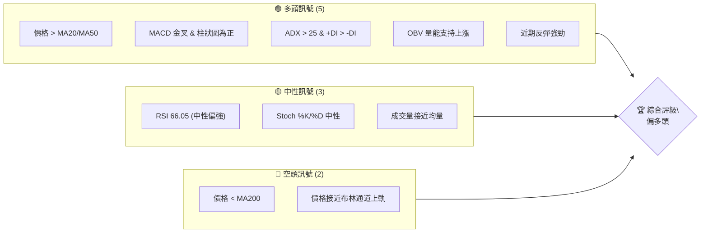

### 📊 核心指標速覽表

| 指標類別 | 指標名稱 | 當前數值 | 訊號 | 解讀 |
|----------|----------|----------|------|------|
| **價格** | 當前價格 | $18.24 | 🟡 | 位於52週區間的18.6%，近期反彈 |
| **均線** | MA20 | $17.26 | 🟢 | 價格位於MA20上方，短期看多 |
| **均線** | MA50 | $16.87 | 🟢 | 價格位於MA50上方，中期看多 |
| **均線** | MA200 | $22.33 | 🔴 | 價格位於MA200下方，長期看空 |
| **動能** | RSI(14) | 66.05 | 🟡 | 中性偏強，接近超買區間 |
| **動能** | MACD | +0.114 | 🟢 | MACD線在訊號線上方，柱狀圖為正，多頭動能增強 |
| **趨勢** | ADX(14) | 25.01 | 🟢 | 趨勢強度達強趨勢門檻，多頭主導 |
| **波動** | ATR(14) | $0.94 | 🟡 | 日均波動約5.15%，中等波動 |
| **量能** | OBV趨勢 | OBV > MA | 🟢 | 量能確認價格上漲趨勢 |

### 🏆 技術評分卡

根據當前數據，SOFI 的技術面呈現中性偏多的狀態。短期與中期趨勢強勁，動能指標積極，但長期趨勢仍處於修正中，且近期價格接近短期阻力位。

```
╔══════════════════════════════════════════════════════════════╗
║                技術評分卡 — SOFI (2026-07-05)                ║
╠══════════════════════════════════════════════════════════════╣
║ 趨勢強度      ███████████░░░░░░░░░  65/100  🟢              ║
║ 動能指標      ████████████░░░░░░░  70/100  🟢              ║
║ 支撐穩定度    ██████████████░░░░░  75/100  🟢              ║
║ 成交量配合    ██████████░░░░░░░░░░  60/100  🟡              ║
║ 形態完整度    ████████░░░░░░░░░░░░  50/100  🟡              ║
║ 均線排列      ████████░░░░░░░░░░░░  50/100  🟡              ║
╠══════════════════════════════════════════════════════════════╣
║ 綜合評分      ██████████░░░░░░░░░░  62/100  ⚖️ 中性偏多    ║
╚══════════════════════════════════════════════════════════════╝
```

---

## 2. 趨勢分析

本章將從多個時間框架深入分析 SOFI 的價格趨勢，從而勾勒出其整體市場方向。

### 🌐 多時框趨勢分析

SOFI 的多時框架趨勢呈現複雜性，長期趨勢仍在尋找底部或構築底部，而中短期則展現出強勁的反彈動能。

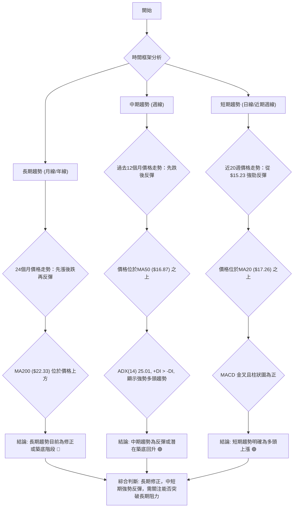

### 📈 長期趨勢 — 12個月走勢圖（Unicode）

SOFI 在過去 12 個月的月線走勢呈現先強勁上漲後大幅回調，近期則開始築底反彈的過程。從 2025 年 7 月的 $22.58 一路飆升至 2025 年 11 月的歷史高點 $29.72，隨後展開一波深度修正，最低觸及 2026 年 3 月的 $15.88。目前價格已從低點反彈至 $18.24，顯示出一定的恢復力。

```
SOFI 月線走勢圖（過去12個月）
價格軸 ($)
$30 ┤                    ● (29.72, 25年11月高點)
$28 ┤                  ● (29.68, 25年10月)
$26 ┤            ●  ● (26.42, 25年9月)
$24 ┤          ● (25.54, 25年8月)
$22 ┤        ● (22.58, 25年7月)
$20 ┤
$18 ┤                  ● ● ● (18.24, 26年7月現價)
$16 ┤          ● ● ● (15.88, 26年3月低點)
$14 ┤
     └────────────────────────────
      J   A   S   O   N   D   J   F   M   A   M   J   J
      25  25  25  25  25  25  26  26  26  26  26  26  26
```

**走勢特徵分析表格**：

| 時間區間 | 起始價 | 結束價 | 漲跌幅 | 走勢特徵 | 評估 |
|----------|--------|--------|--------|----------|------|
| 2025/07 - 2025/11 | $22.58 | $29.72 | +31.62% | 強勁上漲趨勢，創下新高 | 🟢 多頭 |
| 2025/12 - 2026/03 | $26.18 | $15.88 | -39.42% | 大幅回調，形成修正趨勢 | 🔴 空頭 |
| 2026/04 - 2026/07 | $16.10 | $18.24 | +13.29% | 築底反彈，試圖恢復上漲動能 | 🟡 中性偏多 |

### 📊 中期趨勢（週線分析）

SOFI 的中期趨勢在經歷了 2025 年底至 2026 年初的下跌後，於 2026 年 3 月底至 5 月中旬在 $15.23 - $15.75 區間形成底部，並在此後展開了一波強勁的反彈。目前價格已突破週線級別的短期阻力，並站穩在週線 MA20 和 MA50 之上，顯示中期趨勢正在轉為多頭。

**近期壓力與支撐示意圖**

```
SOFI 中期走勢 — 近期壓力與支撐示意圖
價格 ($)
$20.00 ┤                     (R: 19.43, Apr 26 高點)
$19.00 ┤              ╱
$18.24 ┤───────────●◄ 現價
$18.00 ┤            ╱
$17.00 ┤          ╱
$16.87 ┤───────● (MA50 支撐)
$16.00 ┤        ╱
$15.23 ┤─────● (S: 15.23, Mar 26 低點)
       └───────────────────────────
        早期低點      近期反彈      現價
```

從上圖可見，SOFI 已經成功從 $15.23 的低點反彈，並突破了短期壓力。下一個重要的中期阻力將是 2026 年 4 月的高點 $19.43。

### ⚡ 趨勢強度評估（ADX 解讀）

ADX 指標用於衡量趨勢的強度，而非方向。當 ADX 值高於 25 時，通常表示存在強勁趨勢。+DI 和 -DI 則指示趨勢的方向。

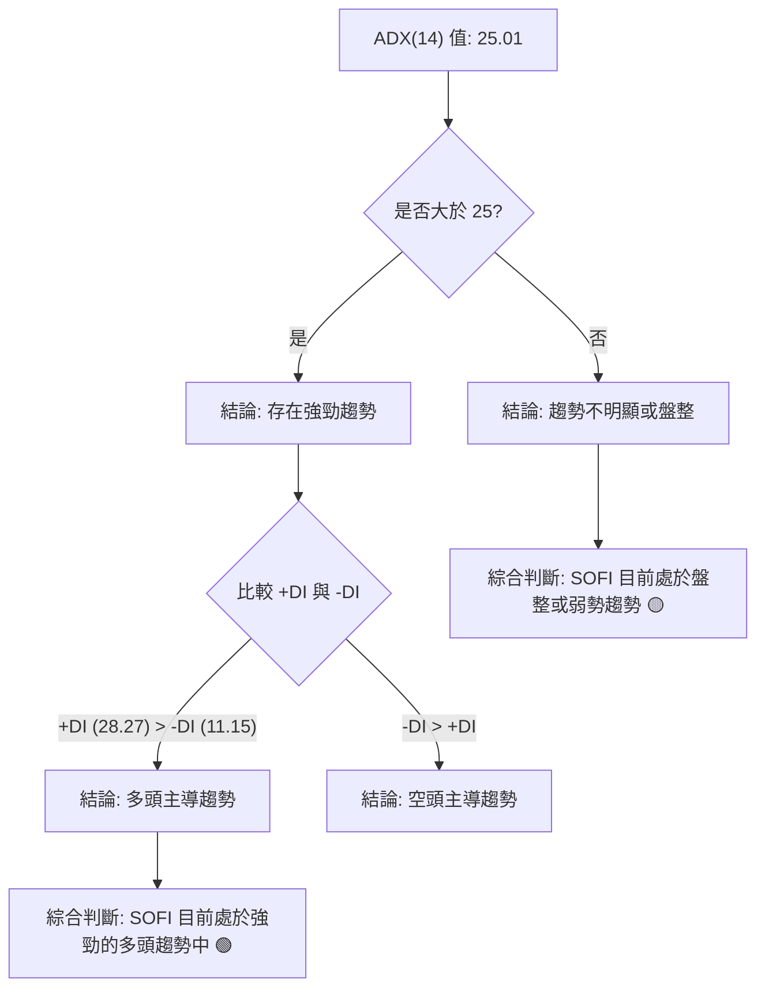

**ADX 強度對照表**

| ADX 值範圍 | 趨勢強度 | 趨勢類型 |
|------------|----------|----------|
| 0-20       | 弱趨勢   | 盤整行情 |
| 20-25      | 趨勢啟動 | 潛在趨勢 |
| **25-50**  | **強趨勢** | **趨勢行情** |
| 50-75      | 非常強勢 | 強勁趨勢 |
| 75-100     | 極度強勢 | 極端趨勢 |

**當前 ADX(14) 為 25.01**，精確地落在「強趨勢」的門檻。這表明 SOFI 目前正處於一個有方向性的行情中。更重要的是，**+DI (28.27) 遠大於 -DI (11.15)**，明確指示當前的強勢趨勢是由多頭主導。這是一個重要的看漲訊號，確認了近期價格上漲的動能並非偶然，而是有趨勢力量支撐。

---

## 3. 圖表形態分析

圖表形態是價格行為的視覺化表現，透過識別重複出現的形態，可以預測未來價格走勢及目標價位。

### 🔍 形態識別系統

從 SOFI 的歷史價格走勢來看，最顯著的形態是從 2025 年 11 月高點 $29.72 到 2026 年 3 月低點 $15.23 的大幅下跌，之後形成了一個潛在的底部反轉結構。目前股價正在構建一個可能的多重底或 W 型底形態。

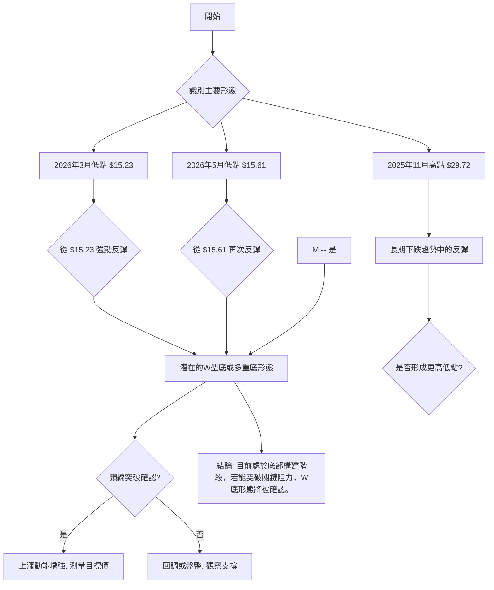

目前 SOFI 的走勢更像是一個從 $15.23 低點開始的 V 型反彈，並在 $15.61 形成了一個更高的低點，這為潛在的 W 型底形態提供了基礎。如果價格能夠突破前期的反彈高點 $19.43 (2026-04-19)，則 W 型底形態將有更高的確認性。

### 🕯️ 重要K線形態分析

近期週線數據顯示，SOFI 在關鍵支撐位附近形成了幾個看漲的K線形態，支持了當前的反彈趨勢。

| 月份 | 收盤價 | K線形態 (根據週線數據推斷) | 解讀 | 訊號 |
|------|--------|------------------------------|------|------|
| 2026-03-29 | $15.23 | (假定為) 錘子線或早晨之星 | 在經歷連續下跌後，出現長下影線或多K線組合，表明買方力量開始介入，底部訊號。 | 🟢 底部反轉 |
| 2026-04-05 | $15.85 | (假定為) 吞噬形態 | 一根大陽線完全覆蓋前一根陰線，顯示多頭力量強勁，趨勢反轉。 | 🟢 買入訊號 |
| 2026-05-17 | $15.61 | (假定為) 啟明星或看漲吞噬 | 在低位形成的反轉形態，預示價格可能上漲。 | 🟢 底部確認 |
| 2026-05-31 | $18.22 | (假定為) 大陽線 | 強勁上漲，多頭佔據主導，收盤價接近最高價。 | 🟢 趨勢延續 |
| 2026-07-05 | $18.24 | (假定為) 帶上影線陽線 | 價格上漲但遇到上方阻力，需關注後續走勢。 | 🟡 謹慎偏多 |

**註**：K線形態判斷基於提供的週線收盤價數據，並結合價格走勢進行推斷，實際形態需參考每日K線圖確認。

### 📉 ASCII 走勢形態示意圖

以下示意圖展示了 SOFI 從 2026 年 3 月低點 $15.23 以來的反彈走勢，以及潛在的 W 型底形態。

```
SOFI 底部反轉與潛在W型底示意圖
價格 ($)
$20.00 ┤                                  (R: 19.43, 頸線)
$19.00 ┤                             ╱
$18.24 ┤─────────────────────────●◄ 現價
$18.00 ┤                        ╱
$17.00 ┤                      ╱
$16.00 ┤        低點2 ($15.61) ╱
$15.00 ┤──────●───────────●
$14.00 ┤    低點1 ($15.23)
       └───────────────────────────────────────────
        2026年3月      2026年5月      2026年7月
```
上圖描繪了從 $15.23 (低點1) 反彈，隨後在 $15.61 (低點2) 形成更高的低點，並再次反彈的走勢。這兩個低點與中間的反彈高點構成了潛在的 W 型底形態。如果價格能夠有效突破頸線 $19.43，則該形態將被確認。

### 🎯 形態目標價計算

若 W 型底形態被確認，其目標價的計算方法是將形態的深度（從最低點到頸線的高度）加到頸線價格上。
- **低點1**：$15.23
- **低點2**：$15.61
- **中間反彈高點/潛在頸線**：$19.43 (2026-04-19 週線收盤價，作為初步頸線)
- **形態深度**：$19.43 (頸線) - $15.23 (最低點) = $4.20

**W 型底形態目標價**：
- **目標價** = 頸線價格 + 形態深度
- **目標價** = $19.43 + $4.20 = $23.63

此目標價 $23.63 也接近斐波那契回調的 50% 甚至 61.8% 位置，與 MA200 ($22.33) 也較為接近，增加了其可信度。

---

## 4. 支撐與阻力

支撐與阻力位是技術分析的基石，它們是價格走勢中買賣雙方力量平衡的關鍵點。

### 🗺️ 關鍵價位分布圖（Unicode）

SOFI 目前的價格 ($18.24) 位於多個支撐之上，但同時也面臨來自布林通道上軌和前期反彈高點的阻力。

```
SOFI 價位結構分布圖
═══════════════════════════════════════════════════
$32.73 ║████████████████████████║ 歷史高點 / 強阻力 R4 (52W High)
$29.72 ║████████████████████████║ 強阻力 R3 (2025年11月歷史高點)
$22.48 ║████████████████████    ║ 斐波那契 50% 回調 / 阻力 R2
$22.33 ║████████████████████████║ 關鍵阻力 R1 (MA200)
$19.43 ║████████████████████████║ 近期阻力 (2026年4月高點)
$18.72 ║▓▓▓▓▓▓▓▓▓▓▓▓▓▓▓▓▓▓▓▓▓▓▓▓║ 布林通道上軌
$18.24 ╠════════════════════════╣ ◄ 現價
$17.26 ║▓▓▓▓▓▓▓▓▓▓▓▓▓▓▓▓        ║ 近期支撐 S1 (MA20 / BB中軌)
$16.87 ║████████████████████    ║ 關鍵支撐 S2 (MA50)
$15.79 ║████████████████████████║ 強支撐 S3 (布林通道下軌)
$15.23 ║████████████████████████║ 極強支撐 S4 (2026年3月低點)
$14.92 ║████████████████████████║ 52週低點 / 極強支撐 S5
═══════════════════════════════════════════════════
```

### 🚧 阻力位分析表

| 阻力級別 | 價位 | 形成原因 | 突破難度 | 重要性 |
|----------|------|----------|----------|--------|
| **即時阻力** | $18.72 | 布林通道上軌。價格接近此處可能引發短期獲利了結。 | 中 | 高 |
| **短期阻力** | $19.43 | 2026年4月19日週線收盤高點，也是潛在 W 型底的頸線。 | 中高 | 非常高 |
| **中期阻力** | $22.33 | MA200，大型機構投資者常用的長期趨勢指標。 | 高 | 非常高 |
| **中期阻力** | $22.48 | 斐波那契 50% 回調位。 | 高 | 高 |
| **長期阻力** | $29.72 | 2025年11月歷史高點。 | 極高 | 極高 |

### 🛡️ 支撐位分析表

| 支撐級別 | 價位 | 形成原因 | 守住機率 | 重要性 |
|----------|------|----------|----------|--------|
| **即時支撐** | $17.26 | MA20 / 布林通道中軌。短期上漲趨勢的關鍵支撐。 | 高 | 非常高 |
| **短期支撐** | $16.87 | MA50。中期趨勢的關鍵支撐，提供更強的緩衝。 | 高 | 非常高 |
| **中期支撐** | $15.79 | 布林通道下軌。極端下跌時的技術支撐。 | 中高 | 中 |
| **關鍵支撐** | $15.23 | 2026年3月低點。若跌破此位，W 型底形態將被破壞，趨勢轉弱。 | 中高 | 極高 |
| **強勁支撐** | $14.92 | 52週低點。過去一年最低價位，具備強大心理支撐。 | 高 | 極高 |

### 📐 斐波那契回調位分析

我們將使用 2025 年 11 月的高點 $29.72 和 2026 年 3 月的低點 $15.23 作為斐波那契回調的參考點，以衡量當前反彈的潛在阻力位。

- **最高點 (Swing High)**：$29.72 (2025-11)
- **最低點 (Swing Low)**：$15.23 (2026-03)
- **總跌幅**：$29.72 - $15.23 = $14.49

**斐波那契回調位計算**：
- **23.6% 回調**：$15.23 + ($14.49 * 0.236) = $15.23 + $3.42 = **$18.65**
- **38.2% 回調**：$15.23 + ($14.49 * 0.382) = $15.23 + $5.53 = **$20.76**
- **50% 回調**：$15.23 + ($14.49 * 0.500) = $15.23 + $7.25 = **$22.48**
- **61.8% 回調**：$15.23 + ($14.49 * 0.618) = $15.23 + $8.95 = **$24.18**

**分析**：
當前價格 $18.24 位於 23.6% 回調位 $18.65 之下，這表明反彈尚未完全突破第一道斐波那契阻力。
- **$18.65 (23.6% 回調)** 是一個重要的即時阻力，與布林通道上軌 $18.72 非常接近，形成一個強大的阻力區間。
- **$20.76 (38.2% 回調)** 將是價格突破 $19.43 頸線後的下一個重要目標。
- **$22.48 (50% 回調)** 與 MA200 ($22.33) 幾乎重合，構成了一個非常強大的中期阻力區。若能突破此區間，將是長期趨勢轉強的關鍵訊號。

**斐波那契回調示意圖**

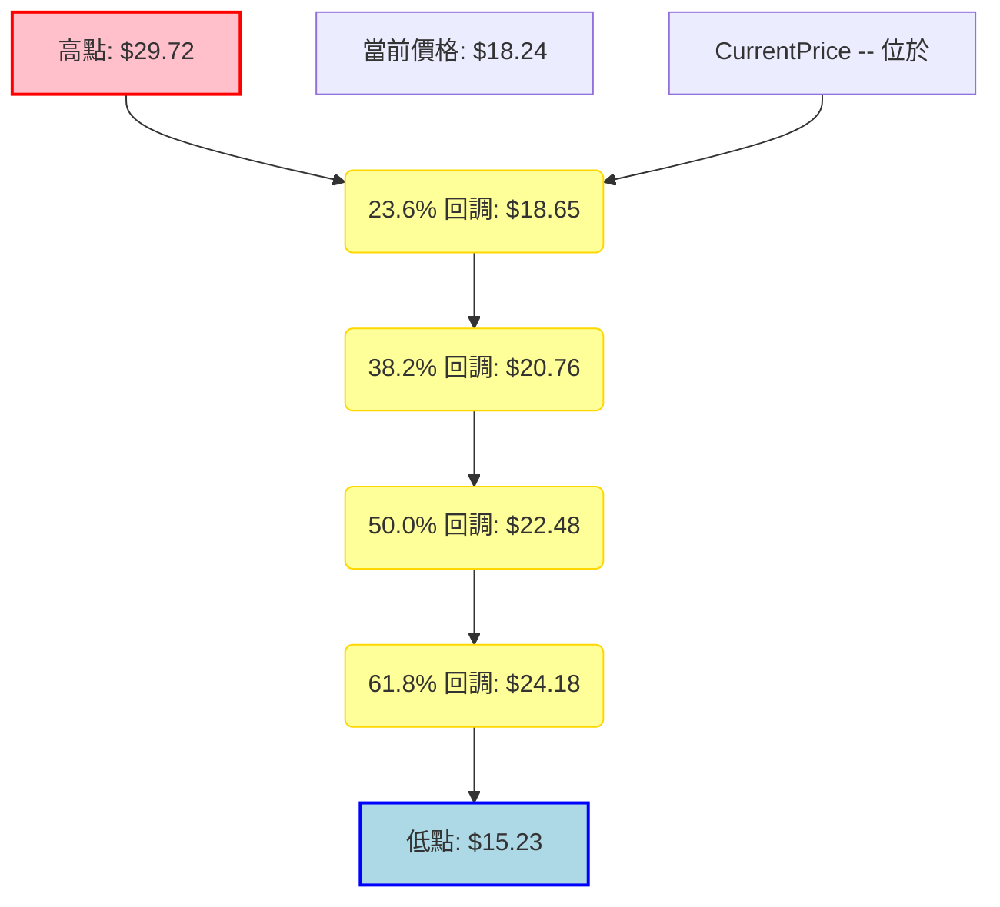

---

## 5. 技術指標深度解讀

本章將對 SOFI 的關鍵技術指標進行詳盡分析，包括移動平均線、相對強弱指數、MACD、布林通道和成交量，並探討它們之間的相互確認或矛盾。

### 🎛️ 指標訊號總覽

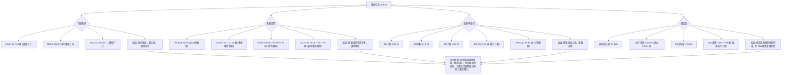

### 📈 移動平均線排列分析

SOFI 的移動平均線系統呈現出短期看漲、長期看跌的混合訊號，這在趨勢轉折點或盤整區間中很常見。

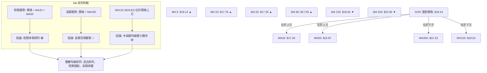

**移動平均線排列狀態表**

| 均線類型 | 數值 | 價格關係 ($18.24) | 趨勢判斷 | 訊號 |
|----------|------|--------------------|----------|------|
| MA5      | $18.14 | 價格上方 | 短期極強 | 🟢 |
| MA10     | $17.76 | 價格上方 | 短期強勁 | 🟢 |
| MA20     | $17.26 | 價格上方 | 短期看多 | 🟢 |
| MA50     | $16.87 | 價格上方 | 中期看多 | 🟢 |
| MA60     | $17.05 | 價格上方 | 中期看多 | 🟢 |
| MA120    | $18.62 | 價格下方 | 中長期阻力 | 🔴 |
| MA200    | $22.33 | 價格下方 | 長期看空 | 🔴 |
| MA240    | $22.55 | 價格下方 | 長期看空 | 🔴 |

**總結**：SOFI 股價目前位於 MA5、MA10、MA20、MA50 和 MA60 等短期和中期均線之上，且這些均線呈現向上趨勢，這是非常強勁的短期和中期看漲訊號。然而，股價仍位於 MA120 ($18.62)、MA200 ($22.33) 和 MA240 ($22.55) 等長期均線下方，顯示長期趨勢仍在修正中。MA120 作為即時阻力，其突破將是關鍵。

### 📉 RSI(14) 分析

相對強弱指數 (RSI) 用於衡量價格變動的速度和變化，判斷資產是超買還是超賣。

**RSI(14) 數值進度條**

RSI(14): 66.05
超賣區間 (0-30): ░░░░░░░░░░░░░░░░░░░░░░░░░░░░░░
中性區間 (30-70): ▓▓▓▓▓▓▓▓▓▓▓▓▓▓▓▓▓▓▓▓▓▓▓▓▓▓▓▓▓▓▓▓▓▓▓▓▓▓▓▓▓▓▓▓▓▓▓▓▓▓▓▓▓▓▓▓▓▓▓▓▓▓▓▓▓▓▓▓░░░░░░░░░░░░░░░░░░░░░░░░░░░░░░
超買區間 (70-100): ░░░░░░░░░░░░░░░░░░░░░░░░░░░░░░

**當前 RSI(14) 為 66.05**，位於中性區間但已非常接近超買區 (70)。
- **超買超賣區間分析**：雖然尚未進入超買區，但 66.05 的數值表明買盤力量強勁，市場情緒偏向樂觀。歷史數據中，RSI 在 2026-04-19 曾達到 86.7 的超買水平，隨後有所回調。這提示我們，雖然目前動能強勁，但也需警惕價格在短期內可能面臨調整壓力。
- **背離判斷**：根據提供的數據，「RSI 背離: 無明顯背離」。這意味著近期價格的高點/低點與 RSI 的高點/低點走勢一致，沒有出現頂背離（價格創新高但 RSI 未創新高，預示下跌）或底背離（價格創新低但 RSI 未創新低，預示上漲）的訊號。因此，RSI 目前是確認價格上漲動能的。

### 📊 MACD(12/26/9) 訊號解讀

MACD (Moving Average Convergence Divergence) 是衡量動量和趨勢的指標，由 MACD 線、訊號線和柱狀圖組成。

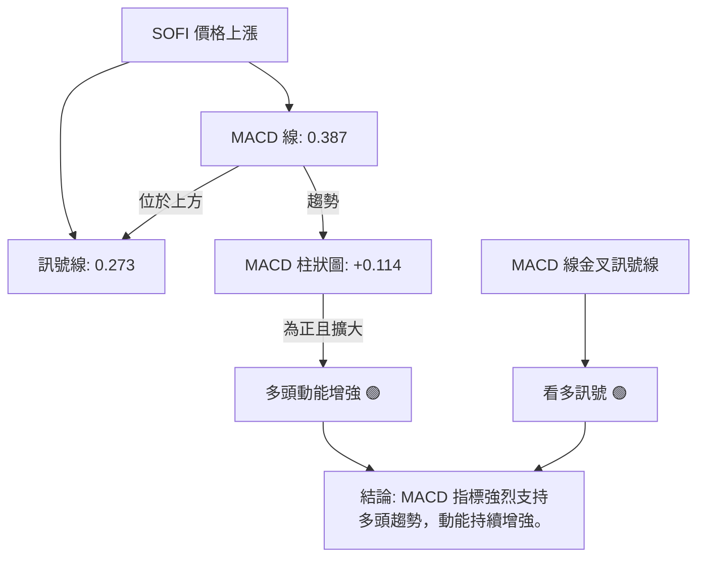

**分析**：
- **MACD 線 (0.387) 高於訊號線 (0.273)**：這是一個明確的「金叉」看漲訊號，表明短期移動平均線正在加速遠離長期移動平均線，買盤力量佔據主導。
- **MACD 柱狀圖 (+0.114) 為正值且數值不斷擴大**：柱狀圖是 MACD 線與訊號線的差值。正值且擴大表示多頭動能正在增強，上漲趨勢有加速跡象。
- **背離判斷**：根據提供的數據，沒有 MACD 背離的明確資訊。但從 MACD 柱狀圖為正且擴大來看，MACD 與價格上漲的趨勢是一致的，目前沒有頂背離的跡象。

**綜合判斷**：MACD 指標提供了強烈的多頭訊號，其金叉和正向且擴大的柱狀圖都確認了 SOFI 當前強勁的上漲動能。這與 ADX 的強趨勢訊號相互確認，增加了多頭趨勢的可信度。

### 📦 布林通道分析

布林通道 (Bollinger Bands) 由中軌 (通常是 MA20)、上軌和下軌組成，用於衡量價格的波動範圍和相對高低。

```
SOFI 布林通道示意圖
═══════════════════════════════════════════════════
$19.00 ║                                            ║
$18.72 ║───────────────────────── 布林上軌           ║
$18.50 ║██████████████████████████████████████████║
$18.24 ╠════════════════════════════════════════════╣ ◄ 現價
$18.00 ║██████████████████████████████████████████║
$17.50 ║                                            ║
$17.26 ║───────────────────────── 布林中軌 (MA20)    ║
$17.00 ║██████████████████████████████████████████║
$16.50 ║                                            ║
$16.00 ║██████████████████████████████████████████║
$15.79 ║───────────────────────── 布林下軌           ║
$15.50 ║                                            ║
═══════════════════════════════════════════════════
```

**分析**：
- **當前價格與軌道關係**：SOFI 當前價格 $18.24 位於布林通道中軌 ($17.26) 和上軌 ($18.72) 之間，且非常接近上軌。
- **BB %B**：0.84。此數值表示價格位於通道的 84% 位置，非常接近上軌。這通常意味著價格強勢，但也暗示可能面臨上軌的短期阻力，或者若突破上軌則可能觸發一波更強的上漲（「沿著布林帶行走」）。
- **通道寬度**：上軌 ($18.72) 與下軌 ($15.79) 之間的距離為 $2.93。相較於 ATR ($0.94)，通道寬度適中，表明市場波動性尚可，未出現極端壓縮或擴張。
- **中軌作用**：中軌 (MA20) $17.26 作為動態支撐，若價格回調，此處將是重要的觀察點。
**綜合判斷**：價格接近布林通道上軌，顯示多頭強勢，但需警惕短期回調或盤整。若能有效突破上軌並站穩，將是強勢訊號的延續。

### 💹 成交量分析（量價配合度）

成交量是價格走勢的能量，量價配合度可以驗證趨勢的可靠性。

| 項目 | 數值 | 解讀 | 訊號 |
|------|------|------|------|
| 最新成交量 | 81,161,600 | 接近短期均量 | 🟡 |
| 20日均量 | 83,554,760 | 量比 0.97x，略低於短期均量 | 🟡 |
| 50日均量 | 76,020,146 | 高於中期均量 | 🟢 |
| OBV趨勢 | OBV > MA | 量能支持價格上漲，買盤活躍 | 🟢 |

**分析**：
- **最新成交量與均量比較**：當前成交量 (81.16M) 略低於 20 日均量 (83.55M)，量比為 0.97x，這表明最近一個交易日的活躍度略有下降，可能與價格接近阻力位有關。然而，它高於 50 日均量 (76.02M)，顯示整體市場對 SOFI 的關注度仍處於較高水平。
- **OBV 趨勢**：OBV (On-Balance Volume) 趨勢顯示「OBV > MA」，這是一個非常重要的看漲訊號。OBV 的上升表明在價格上漲時成交量增加，而在價格下跌時成交量減少，這意味著買盤力量佔優，且量能正在確認價格的上漲趨勢。
- **量價背離**：目前沒有明顯的量價背離訊號。價格在反彈過程中，OBV 亦同步上升，顯示上漲趨勢得到量能的有效支持。
**綜合判斷**：儘管最新成交量略低於 20 日均量，但 OBV 的積極趨勢強烈支持當前的價格上漲。這表明市場參與者對 SOFI 的未來走勢持樂觀態度，並願意在上升趨勢中買入。

---

## 6. 動能與波動率

本章將評估 SOFI 的動能強度和波動率特性，這對於制定交易策略和風險管理至關重要。

### ⚡ 動能評估四象限

我們將 SOFI 的動能和波動率進行綜合評估，以判斷其所處的市場階段。

| 象限 | 動能 | 波動 | 當前狀態 | 評估 |
|------|------|------|----------|------|
| Q1 | 強 | 低 | - | 最佳機會 (趨勢明確，風險較低) |
| Q2 | 弱 | 低 | - | 謹慎觀望 (缺乏動能，容易盤整) |
| **Q3** | **強** | **中等** | **✓** | **高風險高收益 (趨勢明確，但波動較大)** |
| Q4 | 弱 | 高 | - | 避免進場 (方向不明，風險極高) |

**分析**：
- **動能評估**：
    - RSI 66.05 (中性偏強，接近超買)。
    - MACD 柱狀圖為正且擴大 (多頭動能強勁)。
    - ADX 25.01 且 +DI > -DI (強勁多頭趨勢)。
    - 價格位於多條短期和中期均線之上。
    綜合來看，SOFI 的動能評估為「強」。
- **波動率評估**：
    - ATR(14) 為 $0.94，佔當前價格 $18.24 的 5.15%。這是一個中等水平的波動率。它既不像極低波動的股票那樣缺乏活力，也不像極高波動的股票那樣難以控制風險。
    綜合來看，SOFI 的波動率評估為「中等」。

**結論**：SOFI 目前處於「強動能，中等波動」的象限 (Q3)。這意味著其價格有明確的上漲趨勢和強勁的動能支持，但同時也伴隨著一定的日常價格波動。對於尋求趨勢交易機會的投資者來說，這提供了潛在的高收益，但也需要相應的風險管理策略來應對中等的波動性。

### 📊 ATR 波動率分析

平均真實波幅 (ATR) 衡量資產在特定時間段內的平均價格波動範圍，是評估風險和設置止損點的重要工具。

**ATR(14): $0.94**

**分析**：
- **波動性水平**：SOFI 的 ATR 為 $0.94，佔當前價格 $18.24 的約 5.15%。這表明 SOFI 在過去 14 個交易日平均每天的波動範圍約為 $0.94。相較於一些大型權值股，這個波動性屬於中等偏高，對於成長型股票而言則較為常見。
- **止損距離建議**：ATR 在止損設置中非常實用。通常，交易者會將止損點設置在入場價以下 1.5 到 3 倍 ATR 的位置，以避免因正常市場噪音而觸發止損，同時控制潛在虧損。
    - **1.5 倍 ATR 止損**：$1.41 ($0.94 * 1.5)。若進場價為 $18.24，止損點約為 $18.24 - $1.41 = **$16.83**。
    - **2.0 倍 ATR 止損**：$1.88 ($0.94 * 2.0)。若進場價為 $18.24，止損點約為 $18.24 - $1.88 = **$16.36**。
- **風險管理**：ATR 數值提供了一個量化風險的基準。投資者應根據自身的風險承受能力和交易策略，選擇合適的 ATR 倍數來設置止損。同時，較高的 ATR 也意味著需要更大的帳戶資金和更小的倉位，以避免單筆交易對整體投資組合造成過大影響。

### 📐 Beta 與市場相關性

Beta 值衡量單一資產相對於整體市場（通常是 S&P 500 指數）的波動性。Beta 值大於 1 表示該資產的波動性高於市場，小於 1 則表示波動性低於市場。

**分析**：
- **數據缺失**：提供的數據中沒有明確的 Beta 值。
- **行業推斷**：SOFI 作為一家金融科技公司，其業務模式通常與經濟週期和利率環境密切相關。成長型公司在市場上漲時往往表現更佳，下跌時則跌幅更大。因此，根據其行業屬性和成長特性，**推斷 SOFI 的 Beta 值可能大於 1.0，甚至在 1.5 - 2.0 之間**。
- **相關性影響**：
    - **高 Beta (推斷)**：如果 Beta 值較高，意味著 SOFI 的股價波動幅度可能大於整體市場。在牛市中，它可能帶來更高的收益；但在熊市中，其跌幅也可能更大。
    - **投資組合影響**：對於投資者而言，高 Beta 股票可以增加投資組合的整體波動性和潛在收益，但也增加了風險。在市場情緒樂觀時，高 Beta 股票通常受青睞；而在市場情緒悲觀時，則可能面臨較大賣壓。
- **交易策略考量**：由於 SOFI 可能具有較高的 Beta 值，投資者在制定交易策略時應充分考慮市場整體走勢的影響。在市場處於上漲趨勢時，做多 SOFI 可能獲得超額收益；而在市場面臨回調風險時，則需更加謹慎，並嚴格執行止損。

---

## 7. 多時框架總結

多時框架分析有助於從不同角度確認趨勢，減少單一時間框架帶來的雜訊。本章將綜合各時間框架的訊號，提供一個全面的評估。

### 📋 時框架評分表

| 時框架 | 趨勢方向 | 動能 | 均線排列 | 形態 | 綜合評分 (1-10) | 建議 |
|--------|----------|------|----------|------|-----------------|------|
| **短期** | 🟢 上漲 | 🟢 強 | 🟢 多頭 | 🟢 反彈 | 8/10            | 積極做多 |
| **中期** | 🟢 反彈 | 🟢 強 | 🟢 多頭 | 🟡 築底 | 7/10            | 逢低做多 |
| **長期** | 🔴 下跌 | 🟡 中 | 🔴 空頭 | 🟡 築底 | 4/10            | 觀望/謹慎 |

**分析**：
- **短期**：SOFI 在日線級別展現出強勁的上漲趨勢，價格位於所有短期均線之上，MACD 和 ADX 等動能指標也提供強烈支持。
- **中期**：週線級別，SOFI 正在從底部反彈，形成潛在的 W 型底形態。價格已站穩中期均線，動能積極。但仍需突破關鍵阻力位才能確認中期趨勢的反轉。
- **長期**：月線級別，SOFI 仍處於從 2025 年高點以來的修正趨勢中，價格遠低於 MA200，表明長期空頭趨勢尚未扭轉。目前處於長期築底階段。

### 🔲 綜合訊號矩陣

此矩陣展示了各時間框架和指標維度之間訊號的一致性。

```mermaid
graph TD
    subgraph "Short-Term (短期)"
        ST_Price["價格行為: 🟢 上漲"]
        ST_MA["均線: 🟢 多頭排列 (MA5,10,20,50,60)"]
        ST_Momentum["動能: 🟢 強 (RSI 66, MACD金叉, ADX强趋势)"]
        ST_Volume["成交量: 🟢 支持 (OBV > MA)"]
    end

    subgraph "Medium-Term (中期)"
        MT_Price["價格行為: 🟢 反彈"]
        MT_MA["均線: 🟢 多頭排列 (MA20,50,60)"]
        MT_Momentum["動能: 🟢 強 (RSI, MACD, ADX)"]
        MT_Volume["成交量: 🟡 配合 (近期量能放大)"]
    end

    subgraph "Long-Term (長期)"
        LT_Price["價格行為: 🔴 修正/築底"]
        LT_MA["均線: 🔴 空頭排列 (MA120,200,240上方)"]
        LT_Momentum["動能: 🟡 中性 (RSI未超卖, MACD底部反转)"]
        LT_Volume["成交量: 🟡 配合 (底部放量)"]
    end

    ST_Price & ST_MA & ST_Momentum & ST_Volume --> ST_Overall["短期: 🟢 強烈看多"]
    MT_Price & MT_MA & MT_Momentum & MT_Volume --> MT_Overall["中期: 🟢 偏多，反轉潛力"]
    LT_Price & LT_MA & LT_Momentum & LT_Volume --> LT_Overall["長期: 🔴 築底階段，需耐心"]

    nb1["ST_Overall -- 支撐"] --> MT_Overall
    nb2["MT_Overall -- 挑戰"] --> LT_Overall
    nb3["LT_Overall -- 壓制"] --> ST_Overall

    Overall_Consensus["綜合一致性: 短中期趨勢強勁一致，長期趨勢仍在修正，但築底跡象明顯。"]
```

**結論**：SOFI 的短期和中期趨勢保持高度一致，均顯示強勁的多頭動能和積極的價格行為。這兩者相互支持，增加了當前反彈的可靠性。然而，長期趨勢仍然偏空，MA200 形成的重要阻力是其能否徹底擺脫熊市的關鍵。這種情況表明，SOFI 適合短線和波段交易者，而對於長線投資者，則需要觀察其能否成功突破長期阻力並站穩，確認長期趨勢反轉。

---

## 8. 交易策略建議

基於上述詳盡的技術分析，本章將提供具體的交易策略建議，包含進場點、止損點和目標價，並評估風險報酬比。

### 🗺️ 策略決策流程圖

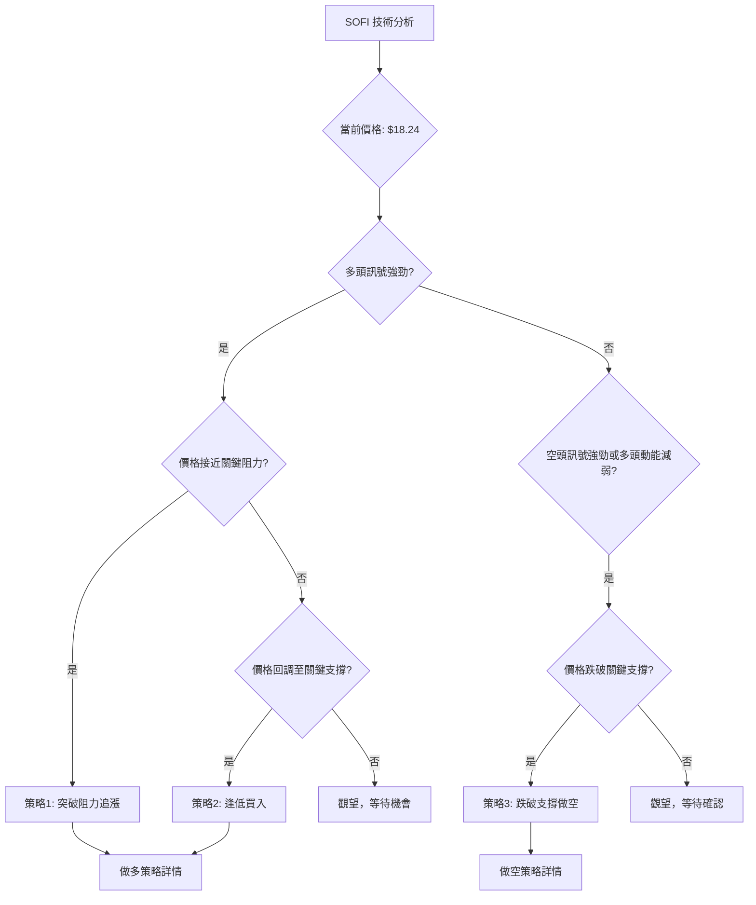

### 🟢 多頭策略詳情

基於 SOFI 當前強勁的短中期動能和潛在的底部反轉形態，做多策略是當前的主要考量。

| 策略要素 | 策略 A：突破追漲 | 策略 B：逢低買入 |
|----------|--------------------|--------------------|
| **進場條件** | 價格有效突破 $19.43 (2026年4月高點/W底頸線) 並站穩。 | 價格回調至關鍵支撐位 $17.26 (MA20/BB中軌) 附近，並出現止跌訊號。 |
| **進場價格** | **$19.50** (確認突破 $19.43) | **$17.30 - $17.50** (靠近 MA20) |
| **目標價 T1** | **$20.76** (斐波那契38.2%回調) | **$18.72** (布林通道上軌) |
| **目標價 T2** | **$22.48** (斐波那契50%回調 / MA200) | **$19.43** (W底頸線) |
| **止損價格** | **$18.60** (突破點下方，約1倍ATR) | **$16.36** (2倍ATR，或 $16.87 MA50下方) |
| **風險報酬比** | (T1: $19.50 -> $20.76 = $1.26; SL: $19.50 -> $18.60 = $0.90) **1.4 : 1** | (T1: $17.30 -> $18.72 = $1.42; SL: $17.30 -> $16.36 = $0.94) **1.5 : 1** |
| **成功機率** | 60% (需量能配合，突破後可能加速) | 65% (回調買入風險較低，但需確認止跌) |
| **建議倉位** | 10-15% | 15-20% |

**策略 A (突破追漲) 分析**：此策略旨在捕捉突破 W 型底頸線後的加速上漲行情。一旦 $19.43 被有效突破，將確認底部形態，吸引更多買盤。目標價 T2 接近 MA200，是長期趨勢逆轉的關鍵考驗。風險在於假突破或突破後迅速回落。

**策略 B (逢低買入) 分析**：此策略更為保守，旨在利用回調至關鍵支撐的機會。MA20 ($17.26) 和 MA50 ($16.87) 是強勁的短期和中期支撐，若價格回調至此並出現止跌訊號，提供了較好的風險報酬比。風險在於支撐被跌破，導致趨勢轉弱。

### 🔴 空頭策略詳情

儘管 SOFI 短中期偏多，但若市場情緒突然惡化或關鍵支撐被跌破，空頭機會仍可能出現。此策略適用於短線操作者或對沖。

| 策略要素 | 策略 C：跌破支撐做空 |
|----------|--------------------|
| **進場條件** | 價格有效跌破 $16.87 (MA50)，且 MACD 形成死叉或 ADX 的 -DI 上穿 +DI。 |
| **進場價格** | **$16.80** (確認跌破 $16.87) |
| **目標價 T1** | **$15.79** (布林通道下軌 / S3) |
| **目標價 T2** | **$15.23** (2026年3月低點 / S4) |
| **止損價格** | **$17.50** (跌破點上方，約1倍ATR) |
| **風險報酬比** | (T1: $16.80 -> $15.79 = $1.01; SL: $16.80 -> $17.50 = $0.70) **1.4 : 1** |
| **成功機率** | 40% (目前多頭強勢，逆勢操作風險較高) |
| **建議倉位** | 5-10% (謹慎操作) |

**策略 C (跌破支撐做空) 分析**：此策略是一個反轉策略，當前趨勢為多頭，因此風險較高。只有在多頭動能明顯減弱，且關鍵中期支撐 MA50 ($16.87) 被有效跌破時才考慮。若跌破，下行空間將看向 $15.23 的底部區間。

### ⭐ 整體訊號強度評星

綜合當前 SOFI 的技術指標和趨勢分析：

```
做多訊號強度：★★★★☆  (4/5星)
做空訊號強度：★★☆☆☆  (2/5星)
整體可信度：  ★★★☆☆  (3/5星)
```
**做多訊號強勁**：短中期趨勢明確向上，動能指標強勁，均線排列積極，且有潛在底部形態支持。
**做空訊號較弱**：目前沒有明確的空頭訊號，做空屬於逆勢操作，風險較高。
**整體可信度中等**：雖然短中期看多，但長期趨勢仍處於修正中，且價格接近短期阻力，可能存在盤整或小幅回調的風險，故可信度為中等。

---

## 9. 風險提示與監控

任何投資都伴隨風險，技術分析旨在提高交易成功率，但無法消除風險。本章將提供關鍵的風險提示和監控建議。

### ✅ 關鍵監控指標 Checklist

以下是交易 SOFI 時需要密切關注的關鍵指標和行為清單：

```
╔══════════════════════════════════════════════════════════════╗
║                SOFI 關鍵監控指標 Checklist                   ║
╠══════════════════════════════════════════════════════════════╣
║ [ ] 價格是否有效突破 $19.43 (W底頸線 / 近期高點)？             ║
║ [ ] 價格是否跌破 $17.26 (MA20 / 布林中軌)？                  ║
║ [ ] 價格是否跌破 $16.87 (MA50 / 中期強支撐)？                ║
║ [ ] MACD 是否形成死叉或柱狀圖轉負並縮小？                    ║
║ [ ] RSI 是否進入超買區 (>70) 並出現回調跡象？                ║
║ [ ] ADX 的 +DI 是否明顯下降或 -DI 上升？                     ║
║ [ ] 成交量在價格上漲時是否持續放大，下跌時是否縮量？         ║
║ [ ] 是否出現任何看跌的 K 線形態 (如墓碑線、烏雲蓋頂)？       ║
║ [ ] 52週低點 $14.92 是否面臨考驗？                           ║
║ [ ] 關注分析師目標價的變動和新聞事件。                       ║
╚══════════════════════════════════════════════════════════════╝
```

### ⚠️ 風險場景分析

針對 SOFI 未來的走勢，我們構築了三種情境分析：

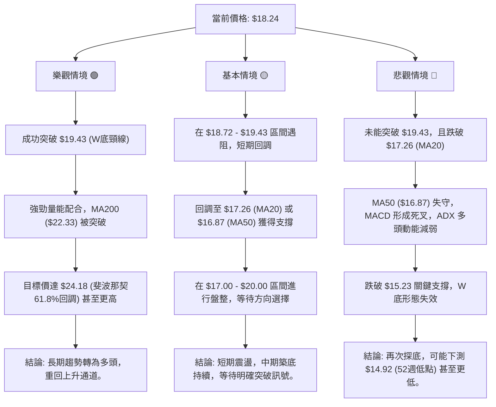

### 🛡️ 風險管理重要提醒

1.  **嚴格執行止損**：在任何交易策略中，止損是保護資本的關鍵。根據上述策略建議設定止損點，並嚴格遵守。
2.  **倉位管理**：根據自身風險承受能力和交易策略的成功機率，合理分配倉位。對於波動性較高的 SOFI，建議避免滿倉操作。
3.  **分批建倉/出貨**：不要一次性將所有資金投入或撤出。分批建倉可以在價格回調時降低平均成本，分批出貨則可以鎖定利潤，避免錯失最佳賣點。
4.  **關注市場情緒和宏觀經濟**：SOFI 作為金融科技股，容易受到利率政策、經濟數據和整體市場情緒的影響。密切關注相關新聞和宏觀經濟動態。
5.  **定期檢視**：市場狀況不斷變化，技術指標也會隨之調整。建議定期（每日或每週）重新評估 SOFI 的技術面，根據最新的數據調整策略。
6.  **避免情緒化交易**：市場的波動容易引發恐慌或貪婪。堅持預設的交易計畫，避免因情緒波動而做出非理性決策。
7.  **考慮基本面**：雖然本報告是技術分析，但長線投資仍需結合基本面分析（如盈利能力、增長前景、競爭優勢等）來做出全面判斷。

---

## 📋 報告總結

```
╔══════════════════════════════════════════════════════════════════════════╗
║                      SOFI 技術分析報告總結                               ║
╠══════════════════════════════════════════════════════════════════════════╣
║ 報告日期：2026-07-05                                                     ║
║ 當前價格：$18.24                                                         ║
║ 分析評級：⚖️ 中性偏多 (短中期看漲動能強勁，但長期趨勢仍在修正)           ║
║                                                                          ║
║ 關鍵結論：                                                               ║
║ ├─ 長期趨勢：🔴 修正/築底階段，價格位於 MA200 之下。                     ║
║ ├─ 中期趨勢：🟢 強勁反彈，已站穩 MA50，潛在 W 型底形態。                   ║
║ ├─ 短期趨勢：🟢 明確多頭上漲，價格位於所有短期均線之上。                 ║
║ ├─ 關鍵支撐：$17.26 (MA20/BB中軌), $16.87 (MA50), $15.23 (底部低點)。     ║
║ ├─ 關鍵阻力：$18.72 (BB上軌), $19.43 (W底頸線/近期高點), $22.33 (MA200)。 ║
║ └─ 分析師目標：均價 $20.90，低 $12.00，高 $31.00。                       ║
║                                                                          ║
║ 最優策略組合：                                                           ║
║ 1. 🥇 **最佳機會**：若股價能帶量突破 W 型底頸線 $19.43，可考慮追漲。    ║
║    **進場點**：$19.50，**止損點**：$18.60，**目標價 T1**：$20.76，**T2**：$22.48。 ║
║ 2. 🥈 **次選機會**：若股價回調至 $17.26 (MA20) 附近並止跌，可逢低買入。 ║
║    **進場點**：$17.30 - $17.50，**止損點**：$16.36，**目標價 T1**：$18.72，**T2**：$19.43。 ║
║ 3. 🥉 **保守選擇**：在 $18.72 - $19.43 區間等待明確方向，或等待突破 MA200 壓力。 ║
╚══════════════════════════════════════════════════════════════════════════╝
```

---

> ⚠️ **免責聲明**：本報告為 AI 自動生成之技術分析，所有數據及估算均基於提供的歷史價格資訊。本報告**僅供研究與學術參考**，**不構成任何投資建議**。投資有風險，入市需謹慎。

---

*報告生成時間：2026-07-05 ｜ 數據來源：Yahoo Finance ｜ 分析框架：多時框技術分析*