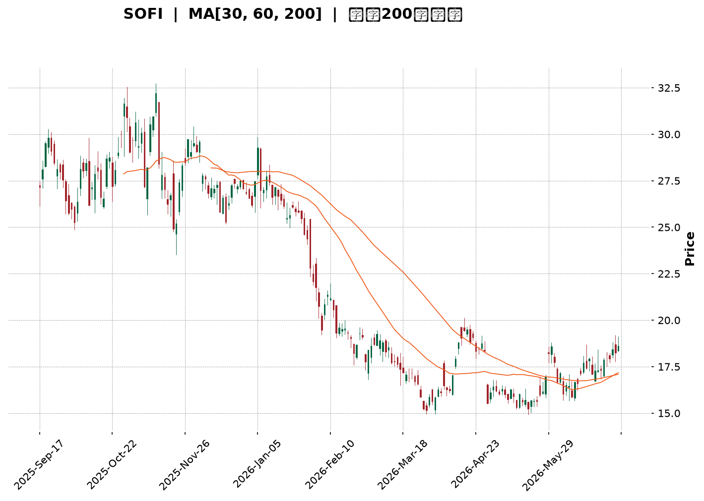
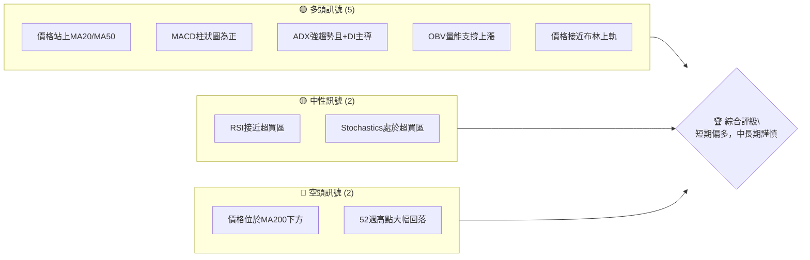
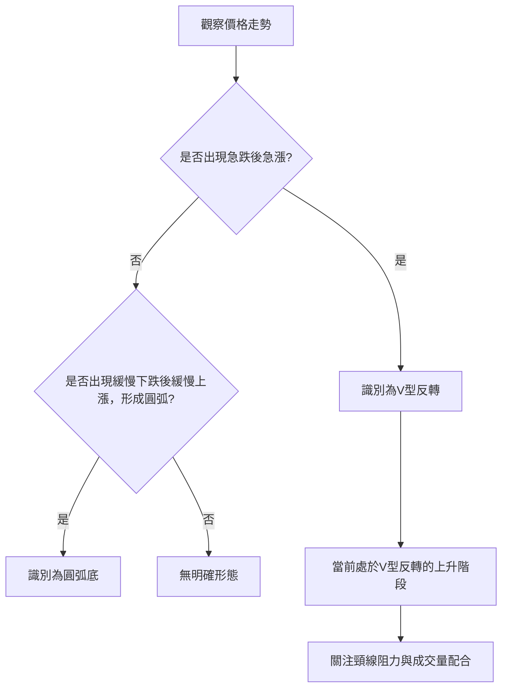
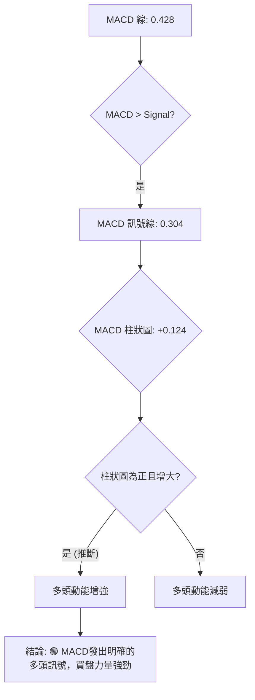

<details>
<summary>📊 靜態圖表 (點擊展開)</summary>

</details>

<html>
<head><meta charset="utf-8" /></head>
<body>
    <div style="height:500px; width:100%;">                        <script>window.PlotlyConfig = {MathJaxConfig: 'local'};</script>
        <script charset="utf-8" src="https://cdn.plot.ly/plotly-3.6.0.min.js" integrity="sha256-QaOVwtVY0T02VaHrr6pnoHLCwayMJp4O5n4YyaE3rJk=" crossorigin="anonymous"></script>                <div id="candlestick-chart" class="plotly-graph-div" style="height:100%; width:100%;"></div>            <script>                window.PLOTLYENV=window.PLOTLYENV || {};                                if (document.getElementById("candlestick-chart")) {                    Plotly.newPlot(                        "candlestick-chart",                        [{"close":{"dtype":"f8","bdata":"AAAAANcjO0AAAAAAKRw8QAAAAGCPgj1AAAAAIFzPPUAAAABAChc9QAAAAOCjcDxAAAAAYLgePEAAAABA4fo7QAAAAMDMjDtAAAAAIIVrOkAAAABgj8I5QAAAAOBR+DlAAAAAoHA9OUAAAAAAKVw6QAAAAADXIzxAAAAAwB4FPEAAAABAM3M8QAAAAOCjMDpAAAAAANcjO0AAAABguN47QAAAACCuBzxAAAAAoJmZOkAAAACAPYo6QAAAAIAUrjxAAAAAAADAPEAAAADgozA7QAAAAOB6FDxAAAAAYI8CPUAAAAAAAAA+QAAAAMD1qD9AAAAAYGbmPkAAAAAgrgc9QAAAAIAUrj1AAAAAoEehPkAAAABguF49QAAAAIDrET5AAAAAwPUoO0AAAACAwjU8QAAAAIA9ij5AAAAAQDPzPkAAAABA4RpAQAAAAADXYzxAAAAAgOvRO0AAAACAPQo7QAAAAKBwPTpAAAAA4FG4OkAAAADA9eg4QAAAAOCjMDlAAAAAYGZmO0AAAADgelQ8QAAAAKBwfTxAAAAA4FG4PUAAAAAgrgc9QAAAAGCPgj1AAAAAgOsRPUAAAACgmZk9QAAAACCuxztAAAAAACmcO0AAAADgetQ6QAAAAEAKFztAAAAAgOsRO0AAAAAgrkc7QAAAAIDr0TlAAAAA4HqUOkAAAADAHkU5QAAAAIA9SjpAAAAAoHA9O0AAAACgmVk7QAAAAOCjMDtAAAAAQOF6O0AAAACA6xE7QAAAAIDr0TpAAAAAIFyPOkAAAACAFC46QAAAAIDCdTtAAAAAIK5HPUAAAABA4fo6QAAAAAAAADtAAAAA4FG4O0AAAABgZmY7QAAAAKCZmTpAAAAAANcjO0AAAAAghas6QAAAAOCjcDpAAAAAoEchOkAAAACgcH05QAAAAADXozlAAAAAQAoXOkAAAACgmdk5QAAAAMDMzDlAAAAAgMJ1OUAAAACgmZk4QAAAAAApXDhAAAAAIFzPNkAAAADgehQ2QAAAAGCPwjVAAAAAAADANEAAAACAwnUzQAAAAAAp3DRAAAAAoJlZNUAAAACAFC41QAAAAMDMjDRAAAAAwMxMM0AAAAAAKZwzQAAAAGCPgjNAAAAAgD2KM0AAAADAzEwzQAAAAMAeBTNAAAAA4FE4MkAAAADA9agyQAAAAIA9SjNAAAAAoJkZM0AAAABgj8IxQAAAAADXYzJAAAAAACmcMkAAAABAM7MyQAAAAAAAQDNAAAAAYGbmMkAAAACAPcoyQAAAAIA9SjJAAAAAIK6HMkAAAABAM7MxQAAAAGCPwjFAAAAAoEehMUAAAABguF4xQAAAAIAULjFAAAAA4HoUMUAAAABgZuYwQAAAAGBmJjFAAAAAQDOzMEAAAAAgXI8wQAAAAKBwvS9AAAAAgMJ1LkAAAADAzEwuQAAAAGCPwi9AAAAAYI9CL0AAAABAM7MvQAAAAMAeRTBAAAAAACkcMEAAAACgcH0wQAAAAMAeRTBAAAAA4FE4MEAAAADAzAwxQAAAAMD16DFAAAAAgD3KMkAAAAAgrgczQAAAAIAUbjNAAAAAAACAM0AAAADgetQyQAAAACBcDzNAAAAAgOtRMkAAAADgo3AyQAAAAGCPwjJAAAAAAClcMkAAAADAzAwvQAAAAKCZGTBAAAAAgBRuMEAAAABAMzMwQAAAAMAeBTBAAAAAwMxMMEAAAAAAAAAwQAAAAAAAgC9AAAAAYI9CMEAAAADAzMwvQAAAAGC4ni5AAAAAwB4FMEAAAADgUTgvQAAAACCFay9AAAAAgMJ1LkAAAACgR2EvQAAAAMDMTC9AAAAAoHA9L0AAAACAwvUvQAAAACCFKzBAAAAA4FH4MEAAAADgUTgyQAAAAOB6lDJAAAAAoHC9MUAAAACAFK4wQAAAAGBmJjFAAAAAIK4HMEAAAAAAAIAwQAAAAOBReDBAAAAAoHC9L0AAAAAghaswQAAAAOB6lDBAAAAAoEchMUAAAACAwrUxQAAAACCFazFAAAAAwPXoMUAAAACgmRkxQAAAAIA9SjFAAAAAIFxPMUAAAADAzEwxQAAAAKBH4TFAAAAA4KMwMkAAAACAFO4xQAAAAOCjcDJAAAAAoHA9MkAAAAAAKZwyQA=="},"high":{"dtype":"f8","bdata":"AAAAgMJ1O0AAAABAtpM8QAAAAKBHoT1AAAAAwMxMPkAAAAAA1yM+QAAAACCFqz1AAAAAIIWrPEAAAABA4Xo8QAAAAKBHoTxAAAAAACmcO0AAAADgelQ7QAAAAKCZWTpAAAAAgBQuOkAAAAAA1yM7QAAAAEAK1zxAAAAAgMK1PEAAAADgo7A8QAAAAMDMzD1AAAAAgBRuO0AAAACgmVk8QAAAAEAKFz1AAAAA4KNwPEAAAAAghes6QAAAAIAU7jxAAAAAgOsRPUAAAADAzMw8QAAAAOBRmDxAAAAAYLjePUAAAABAMzM+QAAAAEDh+j9AAAAA4FFIQEAAAACAPeo+QAAAAAAp3D1AAAAA4FE4P0AAAACAPco+QAAAAGC4Xj5AAAAAYOfbPkAAAACgcD08QAAAAOBR+D5AAAAAoHD9PkAAAACgcF1AQAAAAAAAwD9AAAAAgOsRPUAAAABAM\u002fM7QAAAAAAAADtAAAAAoJnZOkAAAABAM5M8QAAAAIDrcTlAAAAAACmcO0AAAABAM3M8QAAAAAAAQD1AAAAAAADAPUAAAABAM7M9QAAAACCFaz5AAAAAgBTuPUAAAABAM7M9QAAAAIAU7jtAAAAA4HrUO0AAAABAM3M7QAAAAIAUrjtAAAAAIK5HO0AAAAAAAIA7QAAAAEDhejtAAAAAoHC9OkAAAACAwtU6QAAAAEAKtzpAAAAAYLheO0AAAABguJ47QAAAAEAKVztAAAAAgD2KO0AAAADAzIw7QAAAAMD1aDtAAAAAANcjO0AAAABgZuY6QAAAAKBHgTtAAAAAACncPUAAAADAzEw9QAAAAIAULjtAAAAAgBQOPEAAAAAAAGA8QAAAAGDlUDtAAAAAQDMzO0AAAACAwhU7QAAAAOB6VDtAAAAAIK7HOkAAAABAClc6QAAAAMDMDDpAAAAAANdjOkAAAACgRyE6QAAAAGBmZjpAAAAAgBTuOUAAAACAPco5QAAAAGC4HjlAAAAA4FF4OUAAAAAAAAA3QAAAAAApXDdAAAAAANfDNUAAAABgZmY0QAAAAMD1KDVAAAAAQAqXNUAAAAAAAAA2QAAAAKCZGTVAAAAAgD3KNEAAAABguN4zQAAAAEAK1zNAAAAAYI8CNEAAAABA4XozQAAAAOCjMDNAAAAAoEfBMkAAAACAwrUyQAAAAGC4njNAAAAAIFyPM0AAAACAwjUyQAAAAMD1aDJAAAAAgD0KM0AAAAAgrkczQAAAAEDhejNAAAAAYLg+M0AAAACA6\u002fEyQAAAAGBmBjNAAAAAoJnZMkAAAADAzIwyQAAAAGBmJjJAAAAAgOsRMkAAAACgR0EyQAAAACCuBzJAAAAAIIVLMUAAAADAcmgxQAAAAMD1aDFAAAAAgOsRMUAAAABAClcxQAAAAKBwfTBAAAAAoEdhL0AAAACgRyEvQAAAAGBmBjBAAAAAgOtRMEAAAAAgrscvQAAAAMDMbDBAAAAAQOFaMEAAAACgmdkxQAAAAOBReDBAAAAAoHB9MEAAAAAgXA8xQAAAAEAzEzJAAAAAgOvRMkAAAABguJ4zQAAAAKBHITRAAAAAwB6lM0AAAADAHsUzQAAAACCwcjNAAAAAYGbmMkAAAABAM5MyQAAAACCFKzNAAAAAYLjeMkAAAABACpcwQAAAAGC4XjBAAAAAIIXLMEAAAAAgrscwQAAAACBcTzBAAAAAoEeBMEAAAACAwnUwQAAAAMDMDDBAAAAAgOtRMEAAAADgelQwQAAAACCFay9AAAAA4KMQMEAAAACAFK4vQAAAAIDrUTBAAAAAIK5HL0AAAADgo3AvQAAAAIDrkS9AAAAAACncL0AAAABAM\u002fMwQAAAAOCjsDBAAAAA4HoUMUAAAABACpcyQAAAACCFyzJAAAAAQOE6MkAAAABACncxQAAAAEDhOjFAAAAAoHD9MEAAAADA9agwQAAAAKCZGTFAAAAA4FG4MEAAAADgo7AwQAAAACCu5zBAAAAAgBRuMUAAAADgehQyQAAAAEAzszJAAAAAoHD9MUAAAAAgXA8yQAAAAIAUrjFAAAAAgBRuMkAAAABAM5MxQAAAAOBR+DFAAAAAwMxMMkAAAACgcD0yQAAAAOB61DJAAAAA4KMwM0AAAABguB4zQA=="},"hovertemplate":"\u003cb\u003e%{x|%Y-%m-%d}\u003c\u002fb\u003e\u003cbr\u003e\u958b: $%{open:.2f}\u003cbr\u003e\u9ad8: $%{high:.2f}\u003cbr\u003e\u4f4e: $%{low:.2f}\u003cbr\u003e\u6536: $%{close:.2f}\u003cextra\u003e\u003c\u002fextra\u003e","low":{"dtype":"f8","bdata":"AAAAoEchOkAAAADgehQ7QAAAAKBwPTxAAAAA4FH4PEAAAACgmdk8QAAAAKCZWTxAAAAAIFwPO0AAAAAgXI87QAAAAAApHDtAAAAAQDOzOUAAAAAA16M5QAAAAEAzczlAAAAAQArXOEAAAAAgXE85QAAAAIAUrjpAAAAAwB6lO0AAAAAAAMA7QAAAAKBHITpAAAAA4FF4OkAAAAAAAMA5QAAAACBcjztAAAAAAABAOkAAAABgjwI6QAAAACBcDztAAAAAYGYmPEAAAACgR2E6QAAAAKDxMjtAAAAAQDOzPEAAAADAHkU9QAAAAMDMzDxAAAAAANcjPkAAAABA4fo8QAAAAKBwfTxAAAAA4HpUPUAAAADgo7A8QAAAAGCPAj1AAAAAoEchO0AAAADA9ag5QAAAAEAK1zxAAAAA4CLbPUAAAACAwvU+QAAAAGBmJjxAAAAAIK6HOkAAAADAzIw6QAAAAIDCtTlAAAAAIFyPOUAAAABguL44QAAAAMAehTdAAAAAIK6nOUAAAACgR6E6QAAAACBcTzxAAAAA4Hp0PEAAAAAghas8QAAAAOCjUD1AAAAAwB4FPUAAAABA4Xo8QAAAAIAU7jpAAAAAwMwMO0AAAADAzIw6QAAAAEDhejpAAAAAgBSOOkAAAABAMzM6QAAAAIA9yjlAAAAA4FG4OUAAAAAghSs5QAAAAEAz8zlAAAAAIK5HOkAAAACgmRk7QAAAAEAz0zpAAAAAIK4HO0AAAAAgrgc7QAAAAKBwvTpAAAAAgD2KOkAAAAAgXA86QAAAAIA9yjlAAAAAoJmZO0AAAAAgrgc6QAAAAKBwXTpAAAAAgOuROkAAAABA4To7QAAAAEAzMzpAAAAA4FE4OkAAAAAghes5QAAAAIDCNTpAAAAAYI8COkAAAACAwjU5QAAAAEAz8zhAAAAAAAAAOkAAAACgmZk5QAAAAMAexTlAAAAAgMI1OUAAAACA65E4QAAAAMDMDDhAAAAAIFxPNkAAAAAAKdw1QAAAAMAeBTVAAAAAgOsRNEAAAAAAqjEzQAAAAIA9CjRAAAAAwMzMNEAAAADAzAw1QAAAAADXIzRAAAAAgD0KM0AAAABgZiYzQAAAAAApHDNAAAAAoJk5M0AAAADgUfgyQAAAAADXgzJAAAAA4HqUMUAAAAAA1+MxQAAAAIAU7jJAAAAA4FH4MkAAAAAgXE8xQAAAAMDMzDBAAAAA4KOwMUAAAAAAKZwyQAAAAADXozJAAAAAYLgeMkAAAADAHsUxQAAAAIA9CjJAAAAA4FH4MUAAAABguJ4xQAAAACCuhzFAAAAA4FF4MUAAAABA4XowQAAAAMD1KDFAAAAA4HqUMEAAAAAghaswQAAAAEAK1zBAAAAAoHB9MEAAAADAHoUwQAAAAAApnC9AAAAAwMxMLkAAAABguN4tQAAAAGC4ni5AAAAAoEfhLkAAAAAAKdwtQAAAAGCPwi9AAAAAgOvRL0AAAABgj0IwQAAAAOB61C9AAAAA4FEYMEAAAAAghesvQAAAAGBmZjFAAAAAIIUrMkAAAABgZqYyQAAAAADXYzNAAAAAQAoXM0AAAADgo7AyQAAAAMD16DJAAAAAgBTuMUAAAACAwCoyQAAAAADXYzJAAAAAwB5FMkAAAAAAAAAvQAAAAOB6FC9AAAAAAADAL0AAAACgRyEwQAAAAKBH4S9AAAAAQOH6L0AAAADA9agvQAAAAIA9Ci9AAAAAgD2KL0AAAACgmRkvQAAAAIAUbi5AAAAAgMJ1LkAAAABgj8IuQAAAAIAUri5AAAAAQArXLUAAAAAgXA8uQAAAAEAzsy5AAAAA4FG4LkAAAADgUbgvQAAAAGCPAjBAAAAAANejL0AAAACAFK4xQAAAAOCjsDFAAAAAgMJ1MUAAAADgepQwQAAAAIDClTBAAAAAAClcL0AAAADA9egvQAAAAOBPTS9AAAAAwPWoL0AAAAAgXE8vQAAAAEDhOjBAAAAAYI8CMUAAAAAArBwxQAAAAAApXDFAAAAAANdDMUAAAACA6xExQAAAAOBRuDBAAAAAgBQuMUAAAACA69EwQAAAAKBw\u002fTBAAAAAAACAMUAAAABACrcxQAAAAIDC9TFAAAAAANfDMUAAAACA61EyQA=="},"name":"\u50f9\u683c","open":{"dtype":"f8","bdata":"AAAAAABAO0AAAABACpc7QAAAAADXQzxAAAAAwMxMPUAAAACAFM49QAAAAAAAgD1AAAAAYI\u002fCO0AAAABguF48QAAAAAApXDxAAAAA4FF4O0AAAABA4bo6QAAAAOB6VDpAAAAAoJkZOkAAAADAHsU5QAAAAKCZGTtAAAAAoHB9PEAAAACAPQo8QAAAAMDMjDxAAAAAgOsRO0AAAABgj4I6QAAAAEAzMzxAAAAAgOsRPEAAAACgmRk6QAAAAEAzMztAAAAAIFyPPEAAAACgcH08QAAAAOB6VDtAAAAA4FHYPEAAAAAAAAA+QAAAAKBw\u002fT5AAAAAYLh+P0AAAAAgXG8+QAAAAOCjsD1AAAAAwPWoPUAAAAAghUs9QAAAAMAehT1AAAAAAAAgPkAAAABgZoY6QAAAACBcDz1AAAAAYLg+PkAAAACAFC4\u002fQAAAAEDhuj9AAAAAAAAAO0AAAACAwrU7QAAAAGCPgjpAAAAAoJl5OkAAAACgR+E7QAAAAKBHoThAAAAA4HrUOUAAAABA4fo6QAAAAIDCtTxAAAAAgD3KPEAAAADgetQ8QAAAAADXYz1AAAAAwMxsPUAAAADA9Qg9QAAAAKBwXTtAAAAAQOG6O0AAAACgcD07QAAAAGBmpjpAAAAAQArXOkAAAADAHiU7QAAAACBcbztAAAAAoHC9OUAAAAAA16M6QAAAAIAULjpAAAAAYLieOkAAAADgUZg7QAAAAIDrETtAAAAAIIUrO0AAAACAPYo7QAAAAGC43jpAAAAAIK4HO0AAAACAFK46QAAAAMD1qDpAAAAAIFzPO0AAAABA4To9QAAAAKBw3TpAAAAAAAAAO0AAAACAFM47QAAAAIA9SjtAAAAAQDOzOkAAAAAAAAA7QAAAACBczzpAAAAAgD2KOkAAAADgo3A5QAAAAAAAgDlAAAAAgBQuOkAAAAAAAAA6QAAAAGBm5jlAAAAAYGbmOUAAAAAAAIA5QAAAAKBw3ThAAAAAgBRuOUAAAABgj4I2QAAAAMDMDDdAAAAAoHB9NUAAAABA4To0QAAAAIA9SjRAAAAAgD1KNUAAAABAChc1QAAAAKCZGTVAAAAAgD3KNEAAAAAgrkczQAAAAMD1aDNAAAAA4FF4M0AAAADgelQzQAAAAIDCFTNAAAAAQOG6MkAAAAAAAAAyQAAAACCuRzNAAAAA4KMwM0AAAADA9SgyQAAAAMAeJTFAAAAAAAAAMkAAAAAgXA8zQAAAAGBmpjJAAAAAACl8MkAAAADgelQyQAAAACCF6zJAAAAAANdjMkAAAADgUTgyQAAAAMDMzDFAAAAAAAAAMkAAAADgUbgxQAAAAIAUbjFAAAAAAADAMEAAAACAPeowQAAAACCuJzFAAAAAYLj+MEAAAACAPQoxQAAAAGBmRjBAAAAAQApXL0AAAAAAKdwuQAAAAGBm5i5AAAAAYGZGMEAAAACgR2EuQAAAACCuxy9AAAAAwPUoMEAAAACAFK4xQAAAAADXYzBAAAAAwMxMMEAAAAAAAAAwQAAAACCuhzFAAAAA4FF4MkAAAABguJ4zQAAAAKCZmTNAAAAAYI9CM0AAAABgj4IzQAAAAIA9SjNAAAAAwB7FMkAAAADgo3AyQAAAAEDhejJAAAAAwB5lMkAAAADAzIwwQAAAAIA9ii9AAAAAACk8MEAAAADgUXgwQAAAACCFKzBAAAAAQDMzMEAAAABgj0IwQAAAACCuBzBAAAAAoJmZL0AAAACA6xEwQAAAACCFay9AAAAAYLieLkAAAABgZmYvQAAAAIDC9S5AAAAAgMI1L0AAAABA4bouQAAAAKBwPS9AAAAAYGZmL0AAAABA4XowQAAAAMDMDDBAAAAAwB4FMEAAAABgj0IyQAAAAGBmJjJAAAAAIK4HMkAAAACgR2ExQAAAAMD1qDBAAAAAQOG6MEAAAACAFC4wQAAAAGBmZjBAAAAA4Ho0MEAAAAAA16MvQAAAAIDr0TBAAAAAIK5HMUAAAABAMzMxQAAAACBczzFAAAAAQDPTMUAAAABACpcxQAAAAAApvDBAAAAA4FE4MUAAAABgZmYxQAAAAAAAADFAAAAA4KMwMkAAAACgmRkyQAAAAADXIzJAAAAAQDOzMkAAAAAAKVwyQA=="},"x":["2025-09-17T00:00:00-04:00","2025-09-18T00:00:00-04:00","2025-09-19T00:00:00-04:00","2025-09-22T00:00:00-04:00","2025-09-23T00:00:00-04:00","2025-09-24T00:00:00-04:00","2025-09-25T00:00:00-04:00","2025-09-26T00:00:00-04:00","2025-09-29T00:00:00-04:00","2025-09-30T00:00:00-04:00","2025-10-01T00:00:00-04:00","2025-10-02T00:00:00-04:00","2025-10-03T00:00:00-04:00","2025-10-06T00:00:00-04:00","2025-10-07T00:00:00-04:00","2025-10-08T00:00:00-04:00","2025-10-09T00:00:00-04:00","2025-10-10T00:00:00-04:00","2025-10-13T00:00:00-04:00","2025-10-14T00:00:00-04:00","2025-10-15T00:00:00-04:00","2025-10-16T00:00:00-04:00","2025-10-17T00:00:00-04:00","2025-10-20T00:00:00-04:00","2025-10-21T00:00:00-04:00","2025-10-22T00:00:00-04:00","2025-10-23T00:00:00-04:00","2025-10-24T00:00:00-04:00","2025-10-27T00:00:00-04:00","2025-10-28T00:00:00-04:00","2025-10-29T00:00:00-04:00","2025-10-30T00:00:00-04:00","2025-10-31T00:00:00-04:00","2025-11-03T00:00:00-05:00","2025-11-04T00:00:00-05:00","2025-11-05T00:00:00-05:00","2025-11-06T00:00:00-05:00","2025-11-07T00:00:00-05:00","2025-11-10T00:00:00-05:00","2025-11-11T00:00:00-05:00","2025-11-12T00:00:00-05:00","2025-11-13T00:00:00-05:00","2025-11-14T00:00:00-05:00","2025-11-17T00:00:00-05:00","2025-11-18T00:00:00-05:00","2025-11-19T00:00:00-05:00","2025-11-20T00:00:00-05:00","2025-11-21T00:00:00-05:00","2025-11-24T00:00:00-05:00","2025-11-25T00:00:00-05:00","2025-11-26T00:00:00-05:00","2025-11-28T00:00:00-05:00","2025-12-01T00:00:00-05:00","2025-12-02T00:00:00-05:00","2025-12-03T00:00:00-05:00","2025-12-04T00:00:00-05:00","2025-12-05T00:00:00-05:00","2025-12-08T00:00:00-05:00","2025-12-09T00:00:00-05:00","2025-12-10T00:00:00-05:00","2025-12-11T00:00:00-05:00","2025-12-12T00:00:00-05:00","2025-12-15T00:00:00-05:00","2025-12-16T00:00:00-05:00","2025-12-17T00:00:00-05:00","2025-12-18T00:00:00-05:00","2025-12-19T00:00:00-05:00","2025-12-22T00:00:00-05:00","2025-12-23T00:00:00-05:00","2025-12-24T00:00:00-05:00","2025-12-26T00:00:00-05:00","2025-12-29T00:00:00-05:00","2025-12-30T00:00:00-05:00","2025-12-31T00:00:00-05:00","2026-01-02T00:00:00-05:00","2026-01-05T00:00:00-05:00","2026-01-06T00:00:00-05:00","2026-01-07T00:00:00-05:00","2026-01-08T00:00:00-05:00","2026-01-09T00:00:00-05:00","2026-01-12T00:00:00-05:00","2026-01-13T00:00:00-05:00","2026-01-14T00:00:00-05:00","2026-01-15T00:00:00-05:00","2026-01-16T00:00:00-05:00","2026-01-20T00:00:00-05:00","2026-01-21T00:00:00-05:00","2026-01-22T00:00:00-05:00","2026-01-23T00:00:00-05:00","2026-01-26T00:00:00-05:00","2026-01-27T00:00:00-05:00","2026-01-28T00:00:00-05:00","2026-01-29T00:00:00-05:00","2026-01-30T00:00:00-05:00","2026-02-02T00:00:00-05:00","2026-02-03T00:00:00-05:00","2026-02-04T00:00:00-05:00","2026-02-05T00:00:00-05:00","2026-02-06T00:00:00-05:00","2026-02-09T00:00:00-05:00","2026-02-10T00:00:00-05:00","2026-02-11T00:00:00-05:00","2026-02-12T00:00:00-05:00","2026-02-13T00:00:00-05:00","2026-02-17T00:00:00-05:00","2026-02-18T00:00:00-05:00","2026-02-19T00:00:00-05:00","2026-02-20T00:00:00-05:00","2026-02-23T00:00:00-05:00","2026-02-24T00:00:00-05:00","2026-02-25T00:00:00-05:00","2026-02-26T00:00:00-05:00","2026-02-27T00:00:00-05:00","2026-03-02T00:00:00-05:00","2026-03-03T00:00:00-05:00","2026-03-04T00:00:00-05:00","2026-03-05T00:00:00-05:00","2026-03-06T00:00:00-05:00","2026-03-09T00:00:00-04:00","2026-03-10T00:00:00-04:00","2026-03-11T00:00:00-04:00","2026-03-12T00:00:00-04:00","2026-03-13T00:00:00-04:00","2026-03-16T00:00:00-04:00","2026-03-17T00:00:00-04:00","2026-03-18T00:00:00-04:00","2026-03-19T00:00:00-04:00","2026-03-20T00:00:00-04:00","2026-03-23T00:00:00-04:00","2026-03-24T00:00:00-04:00","2026-03-25T00:00:00-04:00","2026-03-26T00:00:00-04:00","2026-03-27T00:00:00-04:00","2026-03-30T00:00:00-04:00","2026-03-31T00:00:00-04:00","2026-04-01T00:00:00-04:00","2026-04-02T00:00:00-04:00","2026-04-06T00:00:00-04:00","2026-04-07T00:00:00-04:00","2026-04-08T00:00:00-04:00","2026-04-09T00:00:00-04:00","2026-04-10T00:00:00-04:00","2026-04-13T00:00:00-04:00","2026-04-14T00:00:00-04:00","2026-04-15T00:00:00-04:00","2026-04-16T00:00:00-04:00","2026-04-17T00:00:00-04:00","2026-04-20T00:00:00-04:00","2026-04-21T00:00:00-04:00","2026-04-22T00:00:00-04:00","2026-04-23T00:00:00-04:00","2026-04-24T00:00:00-04:00","2026-04-27T00:00:00-04:00","2026-04-28T00:00:00-04:00","2026-04-29T00:00:00-04:00","2026-04-30T00:00:00-04:00","2026-05-01T00:00:00-04:00","2026-05-04T00:00:00-04:00","2026-05-05T00:00:00-04:00","2026-05-06T00:00:00-04:00","2026-05-07T00:00:00-04:00","2026-05-08T00:00:00-04:00","2026-05-11T00:00:00-04:00","2026-05-12T00:00:00-04:00","2026-05-13T00:00:00-04:00","2026-05-14T00:00:00-04:00","2026-05-15T00:00:00-04:00","2026-05-18T00:00:00-04:00","2026-05-19T00:00:00-04:00","2026-05-20T00:00:00-04:00","2026-05-21T00:00:00-04:00","2026-05-22T00:00:00-04:00","2026-05-26T00:00:00-04:00","2026-05-27T00:00:00-04:00","2026-05-28T00:00:00-04:00","2026-05-29T00:00:00-04:00","2026-06-01T00:00:00-04:00","2026-06-02T00:00:00-04:00","2026-06-03T00:00:00-04:00","2026-06-04T00:00:00-04:00","2026-06-05T00:00:00-04:00","2026-06-08T00:00:00-04:00","2026-06-09T00:00:00-04:00","2026-06-10T00:00:00-04:00","2026-06-11T00:00:00-04:00","2026-06-12T00:00:00-04:00","2026-06-15T00:00:00-04:00","2026-06-16T00:00:00-04:00","2026-06-17T00:00:00-04:00","2026-06-18T00:00:00-04:00","2026-06-22T00:00:00-04:00","2026-06-23T00:00:00-04:00","2026-06-24T00:00:00-04:00","2026-06-25T00:00:00-04:00","2026-06-26T00:00:00-04:00","2026-06-29T00:00:00-04:00","2026-06-30T00:00:00-04:00","2026-07-01T00:00:00-04:00","2026-07-02T00:00:00-04:00","2026-07-06T00:00:00-04:00"],"type":"candlestick"},{"hovertemplate":"MA30: $%{y:.2f}\u003cextra\u003e\u003c\u002fextra\u003e","line":{"color":"#2196F3","dash":"dash","width":2},"mode":"lines","name":"MA30","x":["2025-09-17T00:00:00-04:00","2025-09-18T00:00:00-04:00","2025-09-19T00:00:00-04:00","2025-09-22T00:00:00-04:00","2025-09-23T00:00:00-04:00","2025-09-24T00:00:00-04:00","2025-09-25T00:00:00-04:00","2025-09-26T00:00:00-04:00","2025-09-29T00:00:00-04:00","2025-09-30T00:00:00-04:00","2025-10-01T00:00:00-04:00","2025-10-02T00:00:00-04:00","2025-10-03T00:00:00-04:00","2025-10-06T00:00:00-04:00","2025-10-07T00:00:00-04:00","2025-10-08T00:00:00-04:00","2025-10-09T00:00:00-04:00","2025-10-10T00:00:00-04:00","2025-10-13T00:00:00-04:00","2025-10-14T00:00:00-04:00","2025-10-15T00:00:00-04:00","2025-10-16T00:00:00-04:00","2025-10-17T00:00:00-04:00","2025-10-20T00:00:00-04:00","2025-10-21T00:00:00-04:00","2025-10-22T00:00:00-04:00","2025-10-23T00:00:00-04:00","2025-10-24T00:00:00-04:00","2025-10-27T00:00:00-04:00","2025-10-28T00:00:00-04:00","2025-10-29T00:00:00-04:00","2025-10-30T00:00:00-04:00","2025-10-31T00:00:00-04:00","2025-11-03T00:00:00-05:00","2025-11-04T00:00:00-05:00","2025-11-05T00:00:00-05:00","2025-11-06T00:00:00-05:00","2025-11-07T00:00:00-05:00","2025-11-10T00:00:00-05:00","2025-11-11T00:00:00-05:00","2025-11-12T00:00:00-05:00","2025-11-13T00:00:00-05:00","2025-11-14T00:00:00-05:00","2025-11-17T00:00:00-05:00","2025-11-18T00:00:00-05:00","2025-11-19T00:00:00-05:00","2025-11-20T00:00:00-05:00","2025-11-21T00:00:00-05:00","2025-11-24T00:00:00-05:00","2025-11-25T00:00:00-05:00","2025-11-26T00:00:00-05:00","2025-11-28T00:00:00-05:00","2025-12-01T00:00:00-05:00","2025-12-02T00:00:00-05:00","2025-12-03T00:00:00-05:00","2025-12-04T00:00:00-05:00","2025-12-05T00:00:00-05:00","2025-12-08T00:00:00-05:00","2025-12-09T00:00:00-05:00","2025-12-10T00:00:00-05:00","2025-12-11T00:00:00-05:00","2025-12-12T00:00:00-05:00","2025-12-15T00:00:00-05:00","2025-12-16T00:00:00-05:00","2025-12-17T00:00:00-05:00","2025-12-18T00:00:00-05:00","2025-12-19T00:00:00-05:00","2025-12-22T00:00:00-05:00","2025-12-23T00:00:00-05:00","2025-12-24T00:00:00-05:00","2025-12-26T00:00:00-05:00","2025-12-29T00:00:00-05:00","2025-12-30T00:00:00-05:00","2025-12-31T00:00:00-05:00","2026-01-02T00:00:00-05:00","2026-01-05T00:00:00-05:00","2026-01-06T00:00:00-05:00","2026-01-07T00:00:00-05:00","2026-01-08T00:00:00-05:00","2026-01-09T00:00:00-05:00","2026-01-12T00:00:00-05:00","2026-01-13T00:00:00-05:00","2026-01-14T00:00:00-05:00","2026-01-15T00:00:00-05:00","2026-01-16T00:00:00-05:00","2026-01-20T00:00:00-05:00","2026-01-21T00:00:00-05:00","2026-01-22T00:00:00-05:00","2026-01-23T00:00:00-05:00","2026-01-26T00:00:00-05:00","2026-01-27T00:00:00-05:00","2026-01-28T00:00:00-05:00","2026-01-29T00:00:00-05:00","2026-01-30T00:00:00-05:00","2026-02-02T00:00:00-05:00","2026-02-03T00:00:00-05:00","2026-02-04T00:00:00-05:00","2026-02-05T00:00:00-05:00","2026-02-06T00:00:00-05:00","2026-02-09T00:00:00-05:00","2026-02-10T00:00:00-05:00","2026-02-11T00:00:00-05:00","2026-02-12T00:00:00-05:00","2026-02-13T00:00:00-05:00","2026-02-17T00:00:00-05:00","2026-02-18T00:00:00-05:00","2026-02-19T00:00:00-05:00","2026-02-20T00:00:00-05:00","2026-02-23T00:00:00-05:00","2026-02-24T00:00:00-05:00","2026-02-25T00:00:00-05:00","2026-02-26T00:00:00-05:00","2026-02-27T00:00:00-05:00","2026-03-02T00:00:00-05:00","2026-03-03T00:00:00-05:00","2026-03-04T00:00:00-05:00","2026-03-05T00:00:00-05:00","2026-03-06T00:00:00-05:00","2026-03-09T00:00:00-04:00","2026-03-10T00:00:00-04:00","2026-03-11T00:00:00-04:00","2026-03-12T00:00:00-04:00","2026-03-13T00:00:00-04:00","2026-03-16T00:00:00-04:00","2026-03-17T00:00:00-04:00","2026-03-18T00:00:00-04:00","2026-03-19T00:00:00-04:00","2026-03-20T00:00:00-04:00","2026-03-23T00:00:00-04:00","2026-03-24T00:00:00-04:00","2026-03-25T00:00:00-04:00","2026-03-26T00:00:00-04:00","2026-03-27T00:00:00-04:00","2026-03-30T00:00:00-04:00","2026-03-31T00:00:00-04:00","2026-04-01T00:00:00-04:00","2026-04-02T00:00:00-04:00","2026-04-06T00:00:00-04:00","2026-04-07T00:00:00-04:00","2026-04-08T00:00:00-04:00","2026-04-09T00:00:00-04:00","2026-04-10T00:00:00-04:00","2026-04-13T00:00:00-04:00","2026-04-14T00:00:00-04:00","2026-04-15T00:00:00-04:00","2026-04-16T00:00:00-04:00","2026-04-17T00:00:00-04:00","2026-04-20T00:00:00-04:00","2026-04-21T00:00:00-04:00","2026-04-22T00:00:00-04:00","2026-04-23T00:00:00-04:00","2026-04-24T00:00:00-04:00","2026-04-27T00:00:00-04:00","2026-04-28T00:00:00-04:00","2026-04-29T00:00:00-04:00","2026-04-30T00:00:00-04:00","2026-05-01T00:00:00-04:00","2026-05-04T00:00:00-04:00","2026-05-05T00:00:00-04:00","2026-05-06T00:00:00-04:00","2026-05-07T00:00:00-04:00","2026-05-08T00:00:00-04:00","2026-05-11T00:00:00-04:00","2026-05-12T00:00:00-04:00","2026-05-13T00:00:00-04:00","2026-05-14T00:00:00-04:00","2026-05-15T00:00:00-04:00","2026-05-18T00:00:00-04:00","2026-05-19T00:00:00-04:00","2026-05-20T00:00:00-04:00","2026-05-21T00:00:00-04:00","2026-05-22T00:00:00-04:00","2026-05-26T00:00:00-04:00","2026-05-27T00:00:00-04:00","2026-05-28T00:00:00-04:00","2026-05-29T00:00:00-04:00","2026-06-01T00:00:00-04:00","2026-06-02T00:00:00-04:00","2026-06-03T00:00:00-04:00","2026-06-04T00:00:00-04:00","2026-06-05T00:00:00-04:00","2026-06-08T00:00:00-04:00","2026-06-09T00:00:00-04:00","2026-06-10T00:00:00-04:00","2026-06-11T00:00:00-04:00","2026-06-12T00:00:00-04:00","2026-06-15T00:00:00-04:00","2026-06-16T00:00:00-04:00","2026-06-17T00:00:00-04:00","2026-06-18T00:00:00-04:00","2026-06-22T00:00:00-04:00","2026-06-23T00:00:00-04:00","2026-06-24T00:00:00-04:00","2026-06-25T00:00:00-04:00","2026-06-26T00:00:00-04:00","2026-06-29T00:00:00-04:00","2026-06-30T00:00:00-04:00","2026-07-01T00:00:00-04:00","2026-07-02T00:00:00-04:00","2026-07-06T00:00:00-04:00"],"y":{"dtype":"f8","bdata":"AAAAAAAA+H8AAAAAAAD4fwAAAAAAAPh\u002fAAAAAAAA+H8AAAAAAAD4fwAAAAAAAPh\u002fAAAAAAAA+H8AAAAAAAD4fwAAAAAAAPh\u002fAAAAAAAA+H8AAAAAAAD4fwAAAAAAAPh\u002fAAAAAAAA+H8AAAAAAAD4fwAAAAAAAPh\u002fAAAAAAAA+H8AAAAAAAD4fwAAAAAAAPh\u002fAAAAAAAA+H8AAAAAAAD4fwAAAAAAAPh\u002fAAAAAAAA+H8AAAAAAAD4fwAAAAAAAPh\u002fAAAAAAAA+H8AAAAAAAD4fwAAAAAAAPh\u002fAAAAAAAA+H8AAAAAAAD4fyIiIjKW3DtAq6qqCqz8O0AAAADQhQQ8QO\u002fu7i75BTxAAAAAgPgMPEC8u7srXA88QFVVVfVEHTxA3t3dzRMVPEDv7u4+Chc8QBEREQGOMDxAERER8TVXPEDe3d0tQI48QAAAAMDmojxAiYiI2Oq4PEBERERUuL48QHd3d7eBrjxAIiIi0mmjPEAiIiKSNIU8QJqZmQmsfDxAREREBOR+PEBmZmbm0II8QImIiMi9hjxAZmZmhl2hPEAzMzMDnbY8QM3MzCyyvTxAmpmZOW3APEAzMzPz\u002fdQ8QHd3d5du0jxA7+7uPnzGPEBmZmZGb6s8QFVVVfVvhDxAIiIiMsFjPEAzMzND0lQ8QGZmZvbhMzxAq6qqmlIRPEBEREQEVu47QLy7u3sUzjtA7+7uPsPOO0DNzMyMbMc7QM3MzFzWqjtAd3d3BzqNO0B3d3eHXWE7QAAAAND3UztAzczMTDdJO0CamZmZ4EE7QKuqqrpJTDtAMzMzIyJiO0Dv7u4ezHM7QAAAACA+gztAzczMLPmFO0Dv7u6OCX47QKuqqsrobTtAIiIisuRXO0AiIiIywUM7QN7d3a2OKTtAZmZmJngQO0B3d3e3Ze06QAAAANAi2zpAIiIiUirOOkCrqqp6zcU6QN7d3W3LujpAREREVA6tOkB3d3fHL5Y6QM3MzFy6iTpAvLu7q45pOkAiIiICVk46QCIiIhKuJzpAMzMzc0zwOUCrqqp6+Kw5QCIiImL0djlAIiIiMqVCOUC8u7tLYhA5QFVVVUXh2jhA7+7uju2cOEDNzMws3WQ4QDMzMyMGIThAiYiIyOjNN0ARERGRX4w3QN7d3f1GSDdAzczM7DX3NkCrqqoaoaw2QKuqqipAbjZAVVVVhaQpNkBERERUnN01QFVVVdXqmDVAVVVVJb9YNUCrqqoqzh41QAAAAABH6DRARERENOyqNEBmZmZmrW40QO\u002fu7o6XLjRA7+7uvnTzM0B3d3d3k7gzQLy7u4tBgDNAmpmZqQ1UM0AzMzOD3CszQJqZmVnHBDNAzczMHHblMkBVVVW1nc8yQGZmZhb1rzJAIiIiAkeIMkBmZmZ22mAyQBEREdnqODJAREREzC8WMkDv7u7GIPAxQLy7u+sm0TFAzczMZMmvMUCamZnBWJIxQCIiIkrhejFAVVVV7d9oMUBVVVV9W1YxQKuqqjKWPDFAVVVVvQIkMUAAAAC48x0xQM3MzCTbGTFAREREXGQbMUCamZlBNR4xQBEREXm+HzFAmpmZMd0kMUCrqqqSNCUxQBEREanGKzFAAAAA6PspMUDe3d11TDAxQGZmZv7UODFAzczMtA8\u002fMUBVVVU9US8xQJqZmfEZJjFAd3d3\u002f40gMUC8u7vTlBoxQGZmZk7wEDFAVVVVfYYNMUDv7u4mvwgxQCIiIgK5BzFAREREFIMQMUCrqqp66RYxQLy7u0sMEjFAvLu7Q2AVMUCamZn5UxMxQKuqqqKMDjFAZmZmPgoHMUDe3d2dNgAxQERERDTs+jBAREREfM31MEAREREJrOwwQKuqqvLS3TBAAAAAGEvOMEBmZmaeYccwQLy7u8MgwDBARERE\u002fBuxMEBVVVU9w54wQAAAAMh2jjBAvLu7M+x6MEDNzMw0XmowQHd3d5\u002fTVjBAIiIiIpRBMEDNzMxsWUswQAAAAAByTzBAvLu7K2tVMEAAAADQTWIwQImIiChAbjBAIiIiQv17MEDv7u4+YIUwQN7d3W2EkjBAAAAAMHqbMECJiIiIbKcwQAAAAMhavTBAAAAAON\u002fPMEBmZmZWq+MwQFVVVR33+jBAd3d3j6YUMUBmZmZmkS0xQA=="},"type":"scatter"},{"hovertemplate":"MA60: $%{y:.2f}\u003cextra\u003e\u003c\u002fextra\u003e","line":{"color":"#9C27B0","dash":"dash","width":2},"mode":"lines","name":"MA60","x":["2025-09-17T00:00:00-04:00","2025-09-18T00:00:00-04:00","2025-09-19T00:00:00-04:00","2025-09-22T00:00:00-04:00","2025-09-23T00:00:00-04:00","2025-09-24T00:00:00-04:00","2025-09-25T00:00:00-04:00","2025-09-26T00:00:00-04:00","2025-09-29T00:00:00-04:00","2025-09-30T00:00:00-04:00","2025-10-01T00:00:00-04:00","2025-10-02T00:00:00-04:00","2025-10-03T00:00:00-04:00","2025-10-06T00:00:00-04:00","2025-10-07T00:00:00-04:00","2025-10-08T00:00:00-04:00","2025-10-09T00:00:00-04:00","2025-10-10T00:00:00-04:00","2025-10-13T00:00:00-04:00","2025-10-14T00:00:00-04:00","2025-10-15T00:00:00-04:00","2025-10-16T00:00:00-04:00","2025-10-17T00:00:00-04:00","2025-10-20T00:00:00-04:00","2025-10-21T00:00:00-04:00","2025-10-22T00:00:00-04:00","2025-10-23T00:00:00-04:00","2025-10-24T00:00:00-04:00","2025-10-27T00:00:00-04:00","2025-10-28T00:00:00-04:00","2025-10-29T00:00:00-04:00","2025-10-30T00:00:00-04:00","2025-10-31T00:00:00-04:00","2025-11-03T00:00:00-05:00","2025-11-04T00:00:00-05:00","2025-11-05T00:00:00-05:00","2025-11-06T00:00:00-05:00","2025-11-07T00:00:00-05:00","2025-11-10T00:00:00-05:00","2025-11-11T00:00:00-05:00","2025-11-12T00:00:00-05:00","2025-11-13T00:00:00-05:00","2025-11-14T00:00:00-05:00","2025-11-17T00:00:00-05:00","2025-11-18T00:00:00-05:00","2025-11-19T00:00:00-05:00","2025-11-20T00:00:00-05:00","2025-11-21T00:00:00-05:00","2025-11-24T00:00:00-05:00","2025-11-25T00:00:00-05:00","2025-11-26T00:00:00-05:00","2025-11-28T00:00:00-05:00","2025-12-01T00:00:00-05:00","2025-12-02T00:00:00-05:00","2025-12-03T00:00:00-05:00","2025-12-04T00:00:00-05:00","2025-12-05T00:00:00-05:00","2025-12-08T00:00:00-05:00","2025-12-09T00:00:00-05:00","2025-12-10T00:00:00-05:00","2025-12-11T00:00:00-05:00","2025-12-12T00:00:00-05:00","2025-12-15T00:00:00-05:00","2025-12-16T00:00:00-05:00","2025-12-17T00:00:00-05:00","2025-12-18T00:00:00-05:00","2025-12-19T00:00:00-05:00","2025-12-22T00:00:00-05:00","2025-12-23T00:00:00-05:00","2025-12-24T00:00:00-05:00","2025-12-26T00:00:00-05:00","2025-12-29T00:00:00-05:00","2025-12-30T00:00:00-05:00","2025-12-31T00:00:00-05:00","2026-01-02T00:00:00-05:00","2026-01-05T00:00:00-05:00","2026-01-06T00:00:00-05:00","2026-01-07T00:00:00-05:00","2026-01-08T00:00:00-05:00","2026-01-09T00:00:00-05:00","2026-01-12T00:00:00-05:00","2026-01-13T00:00:00-05:00","2026-01-14T00:00:00-05:00","2026-01-15T00:00:00-05:00","2026-01-16T00:00:00-05:00","2026-01-20T00:00:00-05:00","2026-01-21T00:00:00-05:00","2026-01-22T00:00:00-05:00","2026-01-23T00:00:00-05:00","2026-01-26T00:00:00-05:00","2026-01-27T00:00:00-05:00","2026-01-28T00:00:00-05:00","2026-01-29T00:00:00-05:00","2026-01-30T00:00:00-05:00","2026-02-02T00:00:00-05:00","2026-02-03T00:00:00-05:00","2026-02-04T00:00:00-05:00","2026-02-05T00:00:00-05:00","2026-02-06T00:00:00-05:00","2026-02-09T00:00:00-05:00","2026-02-10T00:00:00-05:00","2026-02-11T00:00:00-05:00","2026-02-12T00:00:00-05:00","2026-02-13T00:00:00-05:00","2026-02-17T00:00:00-05:00","2026-02-18T00:00:00-05:00","2026-02-19T00:00:00-05:00","2026-02-20T00:00:00-05:00","2026-02-23T00:00:00-05:00","2026-02-24T00:00:00-05:00","2026-02-25T00:00:00-05:00","2026-02-26T00:00:00-05:00","2026-02-27T00:00:00-05:00","2026-03-02T00:00:00-05:00","2026-03-03T00:00:00-05:00","2026-03-04T00:00:00-05:00","2026-03-05T00:00:00-05:00","2026-03-06T00:00:00-05:00","2026-03-09T00:00:00-04:00","2026-03-10T00:00:00-04:00","2026-03-11T00:00:00-04:00","2026-03-12T00:00:00-04:00","2026-03-13T00:00:00-04:00","2026-03-16T00:00:00-04:00","2026-03-17T00:00:00-04:00","2026-03-18T00:00:00-04:00","2026-03-19T00:00:00-04:00","2026-03-20T00:00:00-04:00","2026-03-23T00:00:00-04:00","2026-03-24T00:00:00-04:00","2026-03-25T00:00:00-04:00","2026-03-26T00:00:00-04:00","2026-03-27T00:00:00-04:00","2026-03-30T00:00:00-04:00","2026-03-31T00:00:00-04:00","2026-04-01T00:00:00-04:00","2026-04-02T00:00:00-04:00","2026-04-06T00:00:00-04:00","2026-04-07T00:00:00-04:00","2026-04-08T00:00:00-04:00","2026-04-09T00:00:00-04:00","2026-04-10T00:00:00-04:00","2026-04-13T00:00:00-04:00","2026-04-14T00:00:00-04:00","2026-04-15T00:00:00-04:00","2026-04-16T00:00:00-04:00","2026-04-17T00:00:00-04:00","2026-04-20T00:00:00-04:00","2026-04-21T00:00:00-04:00","2026-04-22T00:00:00-04:00","2026-04-23T00:00:00-04:00","2026-04-24T00:00:00-04:00","2026-04-27T00:00:00-04:00","2026-04-28T00:00:00-04:00","2026-04-29T00:00:00-04:00","2026-04-30T00:00:00-04:00","2026-05-01T00:00:00-04:00","2026-05-04T00:00:00-04:00","2026-05-05T00:00:00-04:00","2026-05-06T00:00:00-04:00","2026-05-07T00:00:00-04:00","2026-05-08T00:00:00-04:00","2026-05-11T00:00:00-04:00","2026-05-12T00:00:00-04:00","2026-05-13T00:00:00-04:00","2026-05-14T00:00:00-04:00","2026-05-15T00:00:00-04:00","2026-05-18T00:00:00-04:00","2026-05-19T00:00:00-04:00","2026-05-20T00:00:00-04:00","2026-05-21T00:00:00-04:00","2026-05-22T00:00:00-04:00","2026-05-26T00:00:00-04:00","2026-05-27T00:00:00-04:00","2026-05-28T00:00:00-04:00","2026-05-29T00:00:00-04:00","2026-06-01T00:00:00-04:00","2026-06-02T00:00:00-04:00","2026-06-03T00:00:00-04:00","2026-06-04T00:00:00-04:00","2026-06-05T00:00:00-04:00","2026-06-08T00:00:00-04:00","2026-06-09T00:00:00-04:00","2026-06-10T00:00:00-04:00","2026-06-11T00:00:00-04:00","2026-06-12T00:00:00-04:00","2026-06-15T00:00:00-04:00","2026-06-16T00:00:00-04:00","2026-06-17T00:00:00-04:00","2026-06-18T00:00:00-04:00","2026-06-22T00:00:00-04:00","2026-06-23T00:00:00-04:00","2026-06-24T00:00:00-04:00","2026-06-25T00:00:00-04:00","2026-06-26T00:00:00-04:00","2026-06-29T00:00:00-04:00","2026-06-30T00:00:00-04:00","2026-07-01T00:00:00-04:00","2026-07-02T00:00:00-04:00","2026-07-06T00:00:00-04:00"],"y":{"dtype":"f8","bdata":"AAAAAAAA+H8AAAAAAAD4fwAAAAAAAPh\u002fAAAAAAAA+H8AAAAAAAD4fwAAAAAAAPh\u002fAAAAAAAA+H8AAAAAAAD4fwAAAAAAAPh\u002fAAAAAAAA+H8AAAAAAAD4fwAAAAAAAPh\u002fAAAAAAAA+H8AAAAAAAD4fwAAAAAAAPh\u002fAAAAAAAA+H8AAAAAAAD4fwAAAAAAAPh\u002fAAAAAAAA+H8AAAAAAAD4fwAAAAAAAPh\u002fAAAAAAAA+H8AAAAAAAD4fwAAAAAAAPh\u002fAAAAAAAA+H8AAAAAAAD4fwAAAAAAAPh\u002fAAAAAAAA+H8AAAAAAAD4fwAAAAAAAPh\u002fAAAAAAAA+H8AAAAAAAD4fwAAAAAAAPh\u002fAAAAAAAA+H8AAAAAAAD4fwAAAAAAAPh\u002fAAAAAAAA+H8AAAAAAAD4fwAAAAAAAPh\u002fAAAAAAAA+H8AAAAAAAD4fwAAAAAAAPh\u002fAAAAAAAA+H8AAAAAAAD4fwAAAAAAAPh\u002fAAAAAAAA+H8AAAAAAAD4fwAAAAAAAPh\u002fAAAAAAAA+H8AAAAAAAD4fwAAAAAAAPh\u002fAAAAAAAA+H8AAAAAAAD4fwAAAAAAAPh\u002fAAAAAAAA+H8AAAAAAAD4fwAAAAAAAPh\u002fAAAAAAAA+H8AAAAAAAD4f7y7uxODMDxAZmZmnjYwPECamZkJrCw8QKuqqpLtHDxAVVVVjSUPPEAAAAAY2f47QImIiLis9TtAZmZmhuvxO0De3d1lO+87QO\u002fu7i6y7TtARERE\u002fDfyO0Crqqrazvc7QAAAAEhv+ztAq6qqEhEBPEDv7u52TAA8QBEREbll\u002fTtAq6qq+sUCPECJiIhYgPw7QM3MzBT1\u002fztAiYiImG4CPECrqqo6bQA8QJqZmUlT+jtAREREHKH8O0CrqqoaL\u002f07QFVVVW2g8ztAAAAAsHLoO0BVVVXVMeE7QLy7u7PI1jtAiYiISFPKO0CJiIhgnrg7QJqZmbGdnztAMzMzw2eIO0BVVVUFgXU7QJqZmSnOXjtAMzMzo3A9O0AzMzMDVh47QO\u002fu7kbh+jpAERER2YffOkC8u7uDMro6QHd3d1\u002flkDpAzczMnO9nOkCamZnp3zg6QKuqqopsFzpA3t3dbRLzOUAzMzPjXtM5QO\u002fu7u6ntjlA3t3ddQWYOUAAAADYFYA5QO\u002fu7o7CZTlAzczMjJc+OUDNzMxUVRU5QKuqqnoU7jhAvLu7m8TAOEAzMzPDrpA4QJqZmcE8YThA3t3dpZs0OEARERHxGQY4QAAAAOi04TdAMzMzQ4u8N0CJiIhwPZo3QGZmZn6xdDdAmpmZiUFQN0B3d3efYSc3QERERPT9BDdAq6qqKs7eNkCrqqpCGb02QN7d3bU6ljZAAAAASOFqNkAAAAAYSz42QERERLx0EzZAIiIiGnblNUARERFhnrg1QDMzMw\u002fmiTVAmpmZrY5ZNUDe3d35fio1QHd3d4cW+TRAq6qqFtm+NEBVVVUpXI80QAAAACSUYTRAERER7QowNEAAAABMfgE0QKuqqi5r1TNAVVVVodOmM0AiIiIGyH0zQBEREf1iWTNAzczMwBE6M0AiIiK2gR4zQImIiLwCBDNA7+7usuTnMkCJiIj88MkyQAAAABwvrTJAd3d3U7iOMkCrqqr2b3QyQBEREUWLXDJAMzMzr45JMkBERETgli0yQJqZmaVwFTJAIiIiDgIDMkCJiIhEGfUxQGZmZrJy4DFAvLu7v+bKMUCrqqrOzLQxQJqZme1RoDFAREREcFmTMUDNzMwghYMxQLy7u5uZcTFARERE1JRiMUCamZld1lIxQGZmZva2RDFA3t3dFfU3MUCamZkNSSsxQHd3dzPBGzFAzczMHOgMMUCJiIjgTwUxQLy7uwvX+zBAIiIiutf0MEAAAABwy\u002fIwQGZmZp7v7zBA7+7ulvzqMEAAAADo++EwQImIiLge3TBA3t3dDXTSMEBVVVVVVc0wQO\u002fu7k7UxzBAd3d361HAMEARERFVVb0wQM3MzPjFujBAmpmZlfy6MEDe3d1Rcb4wQHd3dzuYvzBAvLu738HEMEDv7u6yD8cwQAAAALgezTBAIiIiov7VMECamZkBK98wQN7d3Ymz5zBA3t3dvZ\u002fyMEAAAACof\u002fswQAAAAODBBDFA7+7uZtgNMUAiIiIC5BYxQA=="},"type":"scatter"},{"hovertemplate":"MA200: $%{y:.2f}\u003cextra\u003e\u003c\u002fextra\u003e","line":{"color":"#FF6F00","dash":"solid","width":2},"mode":"lines","name":"MA200","x":["2025-09-17T00:00:00-04:00","2025-09-18T00:00:00-04:00","2025-09-19T00:00:00-04:00","2025-09-22T00:00:00-04:00","2025-09-23T00:00:00-04:00","2025-09-24T00:00:00-04:00","2025-09-25T00:00:00-04:00","2025-09-26T00:00:00-04:00","2025-09-29T00:00:00-04:00","2025-09-30T00:00:00-04:00","2025-10-01T00:00:00-04:00","2025-10-02T00:00:00-04:00","2025-10-03T00:00:00-04:00","2025-10-06T00:00:00-04:00","2025-10-07T00:00:00-04:00","2025-10-08T00:00:00-04:00","2025-10-09T00:00:00-04:00","2025-10-10T00:00:00-04:00","2025-10-13T00:00:00-04:00","2025-10-14T00:00:00-04:00","2025-10-15T00:00:00-04:00","2025-10-16T00:00:00-04:00","2025-10-17T00:00:00-04:00","2025-10-20T00:00:00-04:00","2025-10-21T00:00:00-04:00","2025-10-22T00:00:00-04:00","2025-10-23T00:00:00-04:00","2025-10-24T00:00:00-04:00","2025-10-27T00:00:00-04:00","2025-10-28T00:00:00-04:00","2025-10-29T00:00:00-04:00","2025-10-30T00:00:00-04:00","2025-10-31T00:00:00-04:00","2025-11-03T00:00:00-05:00","2025-11-04T00:00:00-05:00","2025-11-05T00:00:00-05:00","2025-11-06T00:00:00-05:00","2025-11-07T00:00:00-05:00","2025-11-10T00:00:00-05:00","2025-11-11T00:00:00-05:00","2025-11-12T00:00:00-05:00","2025-11-13T00:00:00-05:00","2025-11-14T00:00:00-05:00","2025-11-17T00:00:00-05:00","2025-11-18T00:00:00-05:00","2025-11-19T00:00:00-05:00","2025-11-20T00:00:00-05:00","2025-11-21T00:00:00-05:00","2025-11-24T00:00:00-05:00","2025-11-25T00:00:00-05:00","2025-11-26T00:00:00-05:00","2025-11-28T00:00:00-05:00","2025-12-01T00:00:00-05:00","2025-12-02T00:00:00-05:00","2025-12-03T00:00:00-05:00","2025-12-04T00:00:00-05:00","2025-12-05T00:00:00-05:00","2025-12-08T00:00:00-05:00","2025-12-09T00:00:00-05:00","2025-12-10T00:00:00-05:00","2025-12-11T00:00:00-05:00","2025-12-12T00:00:00-05:00","2025-12-15T00:00:00-05:00","2025-12-16T00:00:00-05:00","2025-12-17T00:00:00-05:00","2025-12-18T00:00:00-05:00","2025-12-19T00:00:00-05:00","2025-12-22T00:00:00-05:00","2025-12-23T00:00:00-05:00","2025-12-24T00:00:00-05:00","2025-12-26T00:00:00-05:00","2025-12-29T00:00:00-05:00","2025-12-30T00:00:00-05:00","2025-12-31T00:00:00-05:00","2026-01-02T00:00:00-05:00","2026-01-05T00:00:00-05:00","2026-01-06T00:00:00-05:00","2026-01-07T00:00:00-05:00","2026-01-08T00:00:00-05:00","2026-01-09T00:00:00-05:00","2026-01-12T00:00:00-05:00","2026-01-13T00:00:00-05:00","2026-01-14T00:00:00-05:00","2026-01-15T00:00:00-05:00","2026-01-16T00:00:00-05:00","2026-01-20T00:00:00-05:00","2026-01-21T00:00:00-05:00","2026-01-22T00:00:00-05:00","2026-01-23T00:00:00-05:00","2026-01-26T00:00:00-05:00","2026-01-27T00:00:00-05:00","2026-01-28T00:00:00-05:00","2026-01-29T00:00:00-05:00","2026-01-30T00:00:00-05:00","2026-02-02T00:00:00-05:00","2026-02-03T00:00:00-05:00","2026-02-04T00:00:00-05:00","2026-02-05T00:00:00-05:00","2026-02-06T00:00:00-05:00","2026-02-09T00:00:00-05:00","2026-02-10T00:00:00-05:00","2026-02-11T00:00:00-05:00","2026-02-12T00:00:00-05:00","2026-02-13T00:00:00-05:00","2026-02-17T00:00:00-05:00","2026-02-18T00:00:00-05:00","2026-02-19T00:00:00-05:00","2026-02-20T00:00:00-05:00","2026-02-23T00:00:00-05:00","2026-02-24T00:00:00-05:00","2026-02-25T00:00:00-05:00","2026-02-26T00:00:00-05:00","2026-02-27T00:00:00-05:00","2026-03-02T00:00:00-05:00","2026-03-03T00:00:00-05:00","2026-03-04T00:00:00-05:00","2026-03-05T00:00:00-05:00","2026-03-06T00:00:00-05:00","2026-03-09T00:00:00-04:00","2026-03-10T00:00:00-04:00","2026-03-11T00:00:00-04:00","2026-03-12T00:00:00-04:00","2026-03-13T00:00:00-04:00","2026-03-16T00:00:00-04:00","2026-03-17T00:00:00-04:00","2026-03-18T00:00:00-04:00","2026-03-19T00:00:00-04:00","2026-03-20T00:00:00-04:00","2026-03-23T00:00:00-04:00","2026-03-24T00:00:00-04:00","2026-03-25T00:00:00-04:00","2026-03-26T00:00:00-04:00","2026-03-27T00:00:00-04:00","2026-03-30T00:00:00-04:00","2026-03-31T00:00:00-04:00","2026-04-01T00:00:00-04:00","2026-04-02T00:00:00-04:00","2026-04-06T00:00:00-04:00","2026-04-07T00:00:00-04:00","2026-04-08T00:00:00-04:00","2026-04-09T00:00:00-04:00","2026-04-10T00:00:00-04:00","2026-04-13T00:00:00-04:00","2026-04-14T00:00:00-04:00","2026-04-15T00:00:00-04:00","2026-04-16T00:00:00-04:00","2026-04-17T00:00:00-04:00","2026-04-20T00:00:00-04:00","2026-04-21T00:00:00-04:00","2026-04-22T00:00:00-04:00","2026-04-23T00:00:00-04:00","2026-04-24T00:00:00-04:00","2026-04-27T00:00:00-04:00","2026-04-28T00:00:00-04:00","2026-04-29T00:00:00-04:00","2026-04-30T00:00:00-04:00","2026-05-01T00:00:00-04:00","2026-05-04T00:00:00-04:00","2026-05-05T00:00:00-04:00","2026-05-06T00:00:00-04:00","2026-05-07T00:00:00-04:00","2026-05-08T00:00:00-04:00","2026-05-11T00:00:00-04:00","2026-05-12T00:00:00-04:00","2026-05-13T00:00:00-04:00","2026-05-14T00:00:00-04:00","2026-05-15T00:00:00-04:00","2026-05-18T00:00:00-04:00","2026-05-19T00:00:00-04:00","2026-05-20T00:00:00-04:00","2026-05-21T00:00:00-04:00","2026-05-22T00:00:00-04:00","2026-05-26T00:00:00-04:00","2026-05-27T00:00:00-04:00","2026-05-28T00:00:00-04:00","2026-05-29T00:00:00-04:00","2026-06-01T00:00:00-04:00","2026-06-02T00:00:00-04:00","2026-06-03T00:00:00-04:00","2026-06-04T00:00:00-04:00","2026-06-05T00:00:00-04:00","2026-06-08T00:00:00-04:00","2026-06-09T00:00:00-04:00","2026-06-10T00:00:00-04:00","2026-06-11T00:00:00-04:00","2026-06-12T00:00:00-04:00","2026-06-15T00:00:00-04:00","2026-06-16T00:00:00-04:00","2026-06-17T00:00:00-04:00","2026-06-18T00:00:00-04:00","2026-06-22T00:00:00-04:00","2026-06-23T00:00:00-04:00","2026-06-24T00:00:00-04:00","2026-06-25T00:00:00-04:00","2026-06-26T00:00:00-04:00","2026-06-29T00:00:00-04:00","2026-06-30T00:00:00-04:00","2026-07-01T00:00:00-04:00","2026-07-02T00:00:00-04:00","2026-07-06T00:00:00-04:00"],"y":{"dtype":"f8","bdata":"AAAAAAAA+H8AAAAAAAD4fwAAAAAAAPh\u002fAAAAAAAA+H8AAAAAAAD4fwAAAAAAAPh\u002fAAAAAAAA+H8AAAAAAAD4fwAAAAAAAPh\u002fAAAAAAAA+H8AAAAAAAD4fwAAAAAAAPh\u002fAAAAAAAA+H8AAAAAAAD4fwAAAAAAAPh\u002fAAAAAAAA+H8AAAAAAAD4fwAAAAAAAPh\u002fAAAAAAAA+H8AAAAAAAD4fwAAAAAAAPh\u002fAAAAAAAA+H8AAAAAAAD4fwAAAAAAAPh\u002fAAAAAAAA+H8AAAAAAAD4fwAAAAAAAPh\u002fAAAAAAAA+H8AAAAAAAD4fwAAAAAAAPh\u002fAAAAAAAA+H8AAAAAAAD4fwAAAAAAAPh\u002fAAAAAAAA+H8AAAAAAAD4fwAAAAAAAPh\u002fAAAAAAAA+H8AAAAAAAD4fwAAAAAAAPh\u002fAAAAAAAA+H8AAAAAAAD4fwAAAAAAAPh\u002fAAAAAAAA+H8AAAAAAAD4fwAAAAAAAPh\u002fAAAAAAAA+H8AAAAAAAD4fwAAAAAAAPh\u002fAAAAAAAA+H8AAAAAAAD4fwAAAAAAAPh\u002fAAAAAAAA+H8AAAAAAAD4fwAAAAAAAPh\u002fAAAAAAAA+H8AAAAAAAD4fwAAAAAAAPh\u002fAAAAAAAA+H8AAAAAAAD4fwAAAAAAAPh\u002fAAAAAAAA+H8AAAAAAAD4fwAAAAAAAPh\u002fAAAAAAAA+H8AAAAAAAD4fwAAAAAAAPh\u002fAAAAAAAA+H8AAAAAAAD4fwAAAAAAAPh\u002fAAAAAAAA+H8AAAAAAAD4fwAAAAAAAPh\u002fAAAAAAAA+H8AAAAAAAD4fwAAAAAAAPh\u002fAAAAAAAA+H8AAAAAAAD4fwAAAAAAAPh\u002fAAAAAAAA+H8AAAAAAAD4fwAAAAAAAPh\u002fAAAAAAAA+H8AAAAAAAD4fwAAAAAAAPh\u002fAAAAAAAA+H8AAAAAAAD4fwAAAAAAAPh\u002fAAAAAAAA+H8AAAAAAAD4fwAAAAAAAPh\u002fAAAAAAAA+H8AAAAAAAD4fwAAAAAAAPh\u002fAAAAAAAA+H8AAAAAAAD4fwAAAAAAAPh\u002fAAAAAAAA+H8AAAAAAAD4fwAAAAAAAPh\u002fAAAAAAAA+H8AAAAAAAD4fwAAAAAAAPh\u002fAAAAAAAA+H8AAAAAAAD4fwAAAAAAAPh\u002fAAAAAAAA+H8AAAAAAAD4fwAAAAAAAPh\u002fAAAAAAAA+H8AAAAAAAD4fwAAAAAAAPh\u002fAAAAAAAA+H8AAAAAAAD4fwAAAAAAAPh\u002fAAAAAAAA+H8AAAAAAAD4fwAAAAAAAPh\u002fAAAAAAAA+H8AAAAAAAD4fwAAAAAAAPh\u002fAAAAAAAA+H8AAAAAAAD4fwAAAAAAAPh\u002fAAAAAAAA+H8AAAAAAAD4fwAAAAAAAPh\u002fAAAAAAAA+H8AAAAAAAD4fwAAAAAAAPh\u002fAAAAAAAA+H8AAAAAAAD4fwAAAAAAAPh\u002fAAAAAAAA+H8AAAAAAAD4fwAAAAAAAPh\u002fAAAAAAAA+H8AAAAAAAD4fwAAAAAAAPh\u002fAAAAAAAA+H8AAAAAAAD4fwAAAAAAAPh\u002fAAAAAAAA+H8AAAAAAAD4fwAAAAAAAPh\u002fAAAAAAAA+H8AAAAAAAD4fwAAAAAAAPh\u002fAAAAAAAA+H8AAAAAAAD4fwAAAAAAAPh\u002fAAAAAAAA+H8AAAAAAAD4fwAAAAAAAPh\u002fAAAAAAAA+H8AAAAAAAD4fwAAAAAAAPh\u002fAAAAAAAA+H8AAAAAAAD4fwAAAAAAAPh\u002fAAAAAAAA+H8AAAAAAAD4fwAAAAAAAPh\u002fAAAAAAAA+H8AAAAAAAD4fwAAAAAAAPh\u002fAAAAAAAA+H8AAAAAAAD4fwAAAAAAAPh\u002fAAAAAAAA+H8AAAAAAAD4fwAAAAAAAPh\u002fAAAAAAAA+H8AAAAAAAD4fwAAAAAAAPh\u002fAAAAAAAA+H8AAAAAAAD4fwAAAAAAAPh\u002fAAAAAAAA+H8AAAAAAAD4fwAAAAAAAPh\u002fAAAAAAAA+H8AAAAAAAD4fwAAAAAAAPh\u002fAAAAAAAA+H8AAAAAAAD4fwAAAAAAAPh\u002fAAAAAAAA+H8AAAAAAAD4fwAAAAAAAPh\u002fAAAAAAAA+H8AAAAAAAD4fwAAAAAAAPh\u002fAAAAAAAA+H8AAAAAAAD4fwAAAAAAAPh\u002fAAAAAAAA+H8AAAAAAAD4fwAAAAAAAPh\u002fAAAAAAAA+H\u002fsUbi4Hkk2QA=="},"type":"scatter"}],                        {"template":{"data":{"barpolar":[{"marker":{"line":{"color":"rgb(17,17,17)","width":0.5},"pattern":{"fillmode":"overlay","size":10,"solidity":0.2}},"type":"barpolar"}],"bar":[{"error_x":{"color":"#f2f5fa"},"error_y":{"color":"#f2f5fa"},"marker":{"line":{"color":"rgb(17,17,17)","width":0.5},"pattern":{"fillmode":"overlay","size":10,"solidity":0.2}},"type":"bar"}],"carpet":[{"aaxis":{"endlinecolor":"#A2B1C6","gridcolor":"#506784","linecolor":"#506784","minorgridcolor":"#506784","startlinecolor":"#A2B1C6"},"baxis":{"endlinecolor":"#A2B1C6","gridcolor":"#506784","linecolor":"#506784","minorgridcolor":"#506784","startlinecolor":"#A2B1C6"},"type":"carpet"}],"choropleth":[{"colorbar":{"outlinewidth":0,"ticks":""},"type":"choropleth"}],"contourcarpet":[{"colorbar":{"outlinewidth":0,"ticks":""},"type":"contourcarpet"}],"contour":[{"colorbar":{"outlinewidth":0,"ticks":""},"colorscale":[[0.0,"#0d0887"],[0.1111111111111111,"#46039f"],[0.2222222222222222,"#7201a8"],[0.3333333333333333,"#9c179e"],[0.4444444444444444,"#bd3786"],[0.5555555555555556,"#d8576b"],[0.6666666666666666,"#ed7953"],[0.7777777777777778,"#fb9f3a"],[0.8888888888888888,"#fdca26"],[1.0,"#f0f921"]],"type":"contour"}],"heatmap":[{"colorbar":{"outlinewidth":0,"ticks":""},"colorscale":[[0.0,"#0d0887"],[0.1111111111111111,"#46039f"],[0.2222222222222222,"#7201a8"],[0.3333333333333333,"#9c179e"],[0.4444444444444444,"#bd3786"],[0.5555555555555556,"#d8576b"],[0.6666666666666666,"#ed7953"],[0.7777777777777778,"#fb9f3a"],[0.8888888888888888,"#fdca26"],[1.0,"#f0f921"]],"type":"heatmap"}],"histogram2dcontour":[{"colorbar":{"outlinewidth":0,"ticks":""},"colorscale":[[0.0,"#0d0887"],[0.1111111111111111,"#46039f"],[0.2222222222222222,"#7201a8"],[0.3333333333333333,"#9c179e"],[0.4444444444444444,"#bd3786"],[0.5555555555555556,"#d8576b"],[0.6666666666666666,"#ed7953"],[0.7777777777777778,"#fb9f3a"],[0.8888888888888888,"#fdca26"],[1.0,"#f0f921"]],"type":"histogram2dcontour"}],"histogram2d":[{"colorbar":{"outlinewidth":0,"ticks":""},"colorscale":[[0.0,"#0d0887"],[0.1111111111111111,"#46039f"],[0.2222222222222222,"#7201a8"],[0.3333333333333333,"#9c179e"],[0.4444444444444444,"#bd3786"],[0.5555555555555556,"#d8576b"],[0.6666666666666666,"#ed7953"],[0.7777777777777778,"#fb9f3a"],[0.8888888888888888,"#fdca26"],[1.0,"#f0f921"]],"type":"histogram2d"}],"histogram":[{"marker":{"pattern":{"fillmode":"overlay","size":10,"solidity":0.2}},"type":"histogram"}],"mesh3d":[{"colorbar":{"outlinewidth":0,"ticks":""},"type":"mesh3d"}],"parcoords":[{"line":{"colorbar":{"outlinewidth":0,"ticks":""}},"type":"parcoords"}],"pie":[{"automargin":true,"type":"pie"}],"scatter3d":[{"line":{"colorbar":{"outlinewidth":0,"ticks":""}},"marker":{"colorbar":{"outlinewidth":0,"ticks":""}},"type":"scatter3d"}],"scattercarpet":[{"marker":{"colorbar":{"outlinewidth":0,"ticks":""}},"type":"scattercarpet"}],"scattergeo":[{"marker":{"colorbar":{"outlinewidth":0,"ticks":""}},"type":"scattergeo"}],"scattergl":[{"marker":{"line":{"color":"#283442"}},"type":"scattergl"}],"scattermapbox":[{"marker":{"colorbar":{"outlinewidth":0,"ticks":""}},"type":"scattermapbox"}],"scattermap":[{"marker":{"colorbar":{"outlinewidth":0,"ticks":""}},"type":"scattermap"}],"scatterpolargl":[{"marker":{"colorbar":{"outlinewidth":0,"ticks":""}},"type":"scatterpolargl"}],"scatterpolar":[{"marker":{"colorbar":{"outlinewidth":0,"ticks":""}},"type":"scatterpolar"}],"scatter":[{"marker":{"line":{"color":"#283442"}},"type":"scatter"}],"scatterternary":[{"marker":{"colorbar":{"outlinewidth":0,"ticks":""}},"type":"scatterternary"}],"surface":[{"colorbar":{"outlinewidth":0,"ticks":""},"colorscale":[[0.0,"#0d0887"],[0.1111111111111111,"#46039f"],[0.2222222222222222,"#7201a8"],[0.3333333333333333,"#9c179e"],[0.4444444444444444,"#bd3786"],[0.5555555555555556,"#d8576b"],[0.6666666666666666,"#ed7953"],[0.7777777777777778,"#fb9f3a"],[0.8888888888888888,"#fdca26"],[1.0,"#f0f921"]],"type":"surface"}],"table":[{"cells":{"fill":{"color":"#506784"},"line":{"color":"rgb(17,17,17)"}},"header":{"fill":{"color":"#2a3f5f"},"line":{"color":"rgb(17,17,17)"}},"type":"table"}]},"layout":{"annotationdefaults":{"arrowcolor":"#f2f5fa","arrowhead":0,"arrowwidth":1},"autotypenumbers":"strict","coloraxis":{"colorbar":{"outlinewidth":0,"ticks":""}},"colorscale":{"diverging":[[0,"#8e0152"],[0.1,"#c51b7d"],[0.2,"#de77ae"],[0.3,"#f1b6da"],[0.4,"#fde0ef"],[0.5,"#f7f7f7"],[0.6,"#e6f5d0"],[0.7,"#b8e186"],[0.8,"#7fbc41"],[0.9,"#4d9221"],[1,"#276419"]],"sequential":[[0.0,"#0d0887"],[0.1111111111111111,"#46039f"],[0.2222222222222222,"#7201a8"],[0.3333333333333333,"#9c179e"],[0.4444444444444444,"#bd3786"],[0.5555555555555556,"#d8576b"],[0.6666666666666666,"#ed7953"],[0.7777777777777778,"#fb9f3a"],[0.8888888888888888,"#fdca26"],[1.0,"#f0f921"]],"sequentialminus":[[0.0,"#0d0887"],[0.1111111111111111,"#46039f"],[0.2222222222222222,"#7201a8"],[0.3333333333333333,"#9c179e"],[0.4444444444444444,"#bd3786"],[0.5555555555555556,"#d8576b"],[0.6666666666666666,"#ed7953"],[0.7777777777777778,"#fb9f3a"],[0.8888888888888888,"#fdca26"],[1.0,"#f0f921"]]},"colorway":["#636efa","#EF553B","#00cc96","#ab63fa","#FFA15A","#19d3f3","#FF6692","#B6E880","#FF97FF","#FECB52"],"font":{"color":"#f2f5fa"},"geo":{"bgcolor":"rgb(17,17,17)","lakecolor":"rgb(17,17,17)","landcolor":"rgb(17,17,17)","showlakes":true,"showland":true,"subunitcolor":"#506784"},"hoverlabel":{"align":"left"},"hovermode":"closest","mapbox":{"style":"dark"},"paper_bgcolor":"rgb(17,17,17)","plot_bgcolor":"rgb(17,17,17)","polar":{"angularaxis":{"gridcolor":"#506784","linecolor":"#506784","ticks":""},"bgcolor":"rgb(17,17,17)","radialaxis":{"gridcolor":"#506784","linecolor":"#506784","ticks":""}},"scene":{"xaxis":{"backgroundcolor":"rgb(17,17,17)","gridcolor":"#506784","gridwidth":2,"linecolor":"#506784","showbackground":true,"ticks":"","zerolinecolor":"#C8D4E3"},"yaxis":{"backgroundcolor":"rgb(17,17,17)","gridcolor":"#506784","gridwidth":2,"linecolor":"#506784","showbackground":true,"ticks":"","zerolinecolor":"#C8D4E3"},"zaxis":{"backgroundcolor":"rgb(17,17,17)","gridcolor":"#506784","gridwidth":2,"linecolor":"#506784","showbackground":true,"ticks":"","zerolinecolor":"#C8D4E3"}},"shapedefaults":{"line":{"color":"#f2f5fa"}},"sliderdefaults":{"bgcolor":"#C8D4E3","bordercolor":"rgb(17,17,17)","borderwidth":1,"tickwidth":0},"ternary":{"aaxis":{"gridcolor":"#506784","linecolor":"#506784","ticks":""},"baxis":{"gridcolor":"#506784","linecolor":"#506784","ticks":""},"bgcolor":"rgb(17,17,17)","caxis":{"gridcolor":"#506784","linecolor":"#506784","ticks":""}},"title":{"x":0.05},"updatemenudefaults":{"bgcolor":"#506784","borderwidth":0},"xaxis":{"automargin":true,"gridcolor":"#283442","linecolor":"#506784","ticks":"","title":{"standoff":15},"zerolinecolor":"#283442","zerolinewidth":2},"yaxis":{"automargin":true,"gridcolor":"#283442","linecolor":"#506784","ticks":"","title":{"standoff":15},"zerolinecolor":"#283442","zerolinewidth":2}}},"xaxis":{"rangeslider":{"visible":false},"title":{"text":"\u65e5\u671f"}},"font":{"size":11},"title":{"text":"SOFI  |  MA(30\u002f60\u002f200)  |  \u6700\u8fd1200\u4ea4\u6613\u65e5"},"yaxis":{"title":{"text":"\u80a1\u50f9 (USD)"}},"hovermode":"x unified","height":500},                        {"responsive": true}                    )                };            </script>        </div>
</body>
</html>

# SOFI 技術分析報告

> **報告日期**：2026-07-06 ｜ **語言**：繁體中文 ｜ **數據來源**：提供數據 ｜ **當前價格**：$18.61

---

## 目錄

| 章節 | 內容 |
|------|------|
| [1. 技術面概覽](#1-技術面概覽) | 訊號儀表板、核心指標、評分卡 |
| [2. 趨勢分析](#2-趨勢分析) | 多時框趨勢、長中短期走勢 |
| [3. 圖表形態分析](#3-圖表形態分析) | 形態識別、K線組合、目標價 |
| [4. 支撐與阻力](#4-支撐與阻力) | 關鍵價位、斐波那契回調 |
| [5. 技術指標深度解讀](#5-技術指標深度解讀) | MA/RSI/MACD/布林/成交量 |
| [6. 動能與波動率](#6-動能與波動率) | 動能評估、ATR、Beta |
| [7. 多時框架總結](#7-多時框架總結) | 時框架評分矩陣 |
| [8. 交易策略建議](#8-交易策略建議) | 多空策略、風險報酬比 |
| [9. 風險提示與監控](#9-風險提示與監控) | 監控指標、風險場景 |

---

## 1. 技術面概覽

### 🎯 技術訊號儀表板

當前 SOFI 的技術訊號呈現短期偏多，但中長期仍存在壓力。以下為綜合各項指標的儀表板：



**分析說明**：
SOFI 短期走勢強勁，價格突破短期均線，且動能指標（MACD、ADX）均顯示多頭佔優，量能亦配合上漲。然而，RSI和Stochastics已進入或接近超買區，暗示短期可能面臨回調壓力。更重要的是，價格仍遠低於長期均線MA200及52週高點，這表明中長期下行趨勢尚未完全扭轉，上方仍有較大阻力。

### 📊 核心指標速覽表

以下表格匯總了 SOFI 當前的關鍵技術指標數據及其初步解讀：

| 指標類別 | 指標名稱 | 當前數值 | 訊號 | 解讀 |
|----------|----------|----------|------|------|
| **價格** | 當前價格 | $18.61 | 🟢 | 價格處於近期上升趨勢中 |
| **均線** | MA20 | $17.33 | 🟢 | 價格在短期均線MA20上方，短期強勢 |
| **均線** | MA50 | $16.87 | 🟢 | 價格在中期均線MA50上方，中期趨穩 |
| **均線** | MA200 | $22.29 | 🔴 | 價格在長期均線MA200下方，長期趨勢偏空 |
| **動能** | RSI(14) | 69.63 | 🟡 | 接近超買區70，需警惕回調 |
| **動能** | MACD | 0.428 (Hist: +0.124) | 🟢 | MACD線在訊號線上方，柱狀圖為正，多頭動能強勁 |
| **波動** | ATR(14) | $0.95 | 🟡 | 每日波動約為5.12%，處於中等波動水平 |

### 🏆 技術評分卡

根據各項技術指標的分析，為 SOFI 進行綜合評分：

```
╔══════════════════════════════════════════════════════════════╗
║                技術評分卡 — SOFI (2026-07-06)                ║
╠══════════════════════════════════════════════════════════════╣
║ 趨勢強度      ██████████████░░░░░░  70/100  🟢 強趨勢，多頭主導      ║
║ 動能指標      ██████████████░░░░░░  70/100  🟢 MACD看多，RSI偏高    ║
║ 支撐穩定度    ████████████░░░░░░░░  60/100  🟡 短期支撐穩固，長期壓力大 ║
║ 成交量配合    ██████████████░░░░░░  70/100  🟢 OBV確認上漲趨勢      ║
║ 形態完整度    ████████░░░░░░░░░░░░  40/100  🟡 處於V型反彈中，形態未確立 ║
║ 均線排列      ████████░░░░░░░░░░░░  40/100  🟡 短多長空，混合排列     ║
╠══════════════════════════════════════════════════════════════╣
║ 綜合評分      ██████████░░░░░░░░░░  57/100  ⚖️ 中性偏多             ║
╚══════════════════════════════════════════════════════════════╝
```

**評分理由**：
- **趨勢強度 (70/100)**：ADX 達 26.33 且 +DI 顯著高於 -DI，表明存在明顯且強勁的多頭趨勢。
- **動能指標 (70/100)**：MACD 柱狀圖為正，MACD 線位於訊號線上方，顯示強勁的多頭動能。RSI 接近超買區，雖強勢但需警惕。
- **支撐穩定度 (60/100)**：價格位於 MA20 和 MA50 上方，短期支撐表現良好。然而，長期 MA200 仍構成強大阻力，且距離 52 週低點不遠，長期支撐仍需考驗。
- **成交量配合 (70/100)**：OBV 趨勢向上，且高於其移動平均線，顯示量能有效配合價格上漲，買盤積極。
- **形態完整度 (40/100)**：目前處於從底部反彈的過程中，可以視為 V 型反轉的早期階段，但尚未形成明確的底部或反轉形態，故完整度不高。
- **均線排列 (40/100)**：MA20 > MA50，但 MA200 仍遠高於現價和短期均線，呈現短多長空的混合排列，未能形成典型多頭排列。

**綜合評級**：SOFI 目前處於短期強勢反彈階段，但上方長期阻力仍重。動能與量能配合良好，但指標已進入過熱區。整體評級為中性偏多，建議短期操作可偏多，但需嚴格控制風險，並密切關注長期阻力位的表現。

---

## 2. 趨勢分析

### 🌐 多時框趨勢分析

對 SOFI 進行多時框趨勢分析，從月線、週線到日線層層遞進，以描繪其整體市場結構。

```mermaid
graph TD
    A[月線趨勢 - 長期 (24個月)] -->|下行後築底反彈| B{方向: 🟡 中性偏空}
    B --> C[週線趨勢 - 中期 (20週)] -->|V型反彈，突破短期均線| D{方向: 🟢 偏多}
    D --> E[日線趨勢 - 短期 (即時)] -->|強勁上漲，接近布林上軌| F{方向: 🟢 強多}
    F --> G{綜合判斷: 短期強勢，中期築底反彈，長期趨勢仍需扭轉}
```

**詳細分析**：
- **長期趨勢 (月線)**：從 2025 年 11 月高點 $29.72 開始，SOFI 經歷了顯著的下跌，最低觸及 2026 年 3 月的 $15.88。儘管近期有所反彈，但目前 $18.61 的價格仍遠低於長期 MA200 ($22.29) 及歷史高點，顯示長期趨勢仍偏空。月線圖上，這段下跌可視為熊市回調或築底過程。
- **中期趨勢 (週線)**：從 2026 年 3 月的 $15.88 低點開始，SOFI 展現了強勁的 V 型反彈，價格已站穩在 MA20 和 MA50 之上。近期的週線收盤價持續向上，顯示中期買盤力量較強，但上方仍面臨 MA200 等長期阻力。
- **短期趨勢 (日線)**：當前價格 $18.61 位於 MA20 ($17.33) 和 MA50 ($16.87) 之上，且 MACD 指標顯示多頭動能強勁，RSI 接近超買區。布林通道方面，價格貼近上軌，表明短期處於強勢上漲通道中，但需留意過熱可能。

**綜合判斷**：SOFI 的多時框分析呈現短期與中期偏多，但長期仍處於修正後的築底階段。當前上漲動能強勁，但能否突破長期壓力區將是關鍵。

### 📈 長期趨勢 — 12個月走勢圖（Unicode）

以下為 SOFI 過去 12 個月的月線收盤價走勢圖，標示了關鍵高低點：

```
SOFI 月線走勢圖（過去12個月）
價格軸 ($)
$30 ┤                                         ●(29.72, 2025-11 高點)
$28 ┤                                    ●
$26 ┤                            ●    ●
$24 ┤                  ●    ●
$22 ┤            ●
$20 ┤
$18 ┤                                                            ●(18.61, 現在)
$16 ┤                                  ●(15.88, 2026-03 低點)
$14 ┤
     └──────────────────────────────────────────────────────────────────
      2025-07  2025-08  2025-09  2025-10  2025-11  2025-12  2026-01  2026-02  2026-03  2026-04  2026-05  2026-06  2026-07
```

**走勢特徵分析表格**：

| 期間        | 價格範圍        | 漲跌幅       | 走勢特徵                                     |
|-------------|-----------------|--------------|----------------------------------------------|
| 2025-07     | $22.58          | -            | 初期上漲趨勢的延續                           |
| 2025-08     | $25.54          | +13.11%      | 強勁上漲                                     |
| 2025-09     | $26.42          | +3.45%       | 上漲趨勢放緩，高位盤整                       |
| 2025-10     | $29.68          | +12.34%      | 突破新高，多頭力量強勁                       |
| 2025-11     | $29.72          | +0.13%       | 達到歷史高點，隨後開始盤整，漲勢幾乎停滯     |
| 2025-12     | $26.18          | -11.84%      | 首次大幅回調，空頭力量顯現                   |
| 2026-01     | $22.81          | -12.91%      | 延續跌勢，跌破關鍵支撐                       |
| 2026-02     | $17.76          | -22.14%      | 急速下跌，空頭佔據絕對優勢                   |
| 2026-03     | $15.88          | -10.69%      | 探底，創下階段性新低，但跌幅收窄               |
| 2026-04     | $16.10          | +1.39%       | 止跌企穩，小幅反彈                           |
| 2026-05     | $18.22          | +13.17%      | 強勢反彈，突破短期阻力                       |
| 2026-06     | $17.93          | -1.59%       | 短暫回調，但未跌破關鍵支撐                   |
| 2026-07 (當前) | $18.61          | +3.79%       | 延續反彈，測試近期壓力                       |

**總結**：SOFI 在 2025 年下半年經歷了強勁的牛市，於 11 月達到高峰 $29.72。隨後進入了為期數月的急劇下跌，在 2026 年 3 月探底 $15.88。近期則呈現出 V 型反彈的態勢，目前正試圖收復失地。

### 📊 中期趨勢（週線分析）

從 2026 年 3 月的低點 $15.88 開始，SOFI 的週線圖顯示出一個明確的反彈趨勢。價格已成功站上其短期和中期移動平均線。

```
SOFI 中期壓力與支撐示意圖 (週線)
價格軸 ($)
$22.80 ┤────── R2 (Fib 50%, MA200)
$21.16 ┤─── R1 (Fib 38.2%)
$18.91 ┤── 現價區附近阻力 (布林上軌)
$18.61 ╠═════════════► 現價
$17.33 ┤────── S1 (MA20)
$16.87 ┤────── S2 (MA50)
$15.88 ┤────── S3 (近期底部強支撐)
$14.92 ┤────── S4 (52週低點)
     └───────────────────────────
      時間軸 (週)
```

**分析**：
SOFI 在週線圖上表現出從 $15.88 附近底部強勁反彈的走勢。目前價格 $18.61 已成功突破 MA20 ($17.33) 和 MA50 ($16.87)，顯示中期市場情緒已轉為積極。即將面臨的壓力是布林通道上軌 $18.91，以及斐波那契回調位 $21.16 (38.2%) 和 MA200 ($22.29)。如果能有效突破這些阻力，中期趨勢將得到進一步確認。

### ⚡ 趨勢強度評估（ADX 解讀）

ADX (Average Directional Index) 用於衡量趨勢的強度，而非方向。+DI 和 -DI 則指示趨勢的方向。

```mermaid
graph TD
    A[ADX(14) 數值: 26.33] --> B{判斷: ADX > 25}
    B --> C[結果: 存在強勁趨勢]
    C --> D[比較 +DI vs -DI]
    D --> E[+DI: 26.40]
    D --> F[-DI: 10.41]
    E & F --> G{判斷: +DI > -DI 且差距顯著}
    G --> H[結論: 🟢 多頭趨勢主導，且趨勢強度強勁]
```

**ADX 強度對照表**：

| ADX 數值 | 趨勢強度 |
|----------|----------|
| 0-20     | 無趨勢或弱趨勢 |
| 20-25    | 趨勢形成中或中等趨勢 |
| 25-50    | **強趨勢**       |
| 50-75    | 非常強趨勢     |
| 75-100   | 極強趨勢       |

**分析**：
SOFI 的 ADX(14) 數值為 26.33，這明確表明當前市場存在一個「強趨勢」。進一步觀察 +DI 和 -DI，+DI 為 26.40，而 -DI 僅為 10.41。由於 +DI 顯著高於 -DI，這指示目前強勁的趨勢是由買方力量主導，即一個強勁的「多頭趨勢」。這與價格突破短期均線的表現相互印證，確認了短期內買盤的強勢。

---

## 3. 圖表形態分析

### 🔍 形態識別系統

在 SOFI 的 24 個月歷史價格數據中，我們可以觀察到從一個長期下跌後的底部反彈。這種走勢可以被視為一種「V型反轉」形態的早期階段，或是「圓弧底」的初步形成。由於提供的數據是月度收盤價，難以識別複雜的日線級別形態，但宏觀的反轉信號是存在的。



**分析說明**：
SOFI 從 2025 年 11 月的高點 $29.72 快速下跌至 2026 年 3 月的 $15.88，隨後又迅速反彈至當前的 $18.61。這種快速下跌後快速反彈的特徵符合 V 型反轉的定義。V 型反轉通常表明市場情緒發生了快速而徹底的轉變，從極度悲觀轉為極度樂觀。目前價格處於 V 型反轉的右側上升階段。

### 🕯️ 重要K線形態分析

儘管數據僅提供月度收盤價，我們仍可從近期的週收盤價走勢中推斷出一些 K 線行為特徵。

| 月份           | 收盤價 | K線形態 (推斷) | 解讀                                         | 訊號 |
|----------------|--------|----------------|----------------------------------------------|------|
| 2026-03-29     | $15.23 | 錘子線/長下影線 (推斷) | 價格跌至低點後迅速反彈，買盤介入，止跌信號 | 🟢   |
| 2026-04-05     | $15.85 | 吞噬線/啟明星 (推斷) | 在低位形成看漲反轉組合，確認底部支撐       | 🟢   |
| 2026-04-19     | $19.43 | 大陽線 (推斷)  | 強勢上漲，突破近期阻力，買盤力量強勁       | 🟢   |
| 2026-05-03     | $16.43 | 大陰線 (推斷)  | 獲利回吐，短期回調壓力顯現                   | 🔴   |
| 2026-05-31     | $18.22 | 大陽線 (推斷)  | 再次強勢上漲，確認反彈趨勢                   | 🟢   |
| 2026-06-07     | $16.03 | 大陰線 (推斷)  | 短期回調，但未破壞上升結構                   | 🟡   |
| 2026-07-05     | $18.24 | 中陽線 (推斷)  | 延續反彈，多頭動能穩健                       | 🟢   |
| 2026-07-12 (當前週) | $18.61 | 小陽線 (推斷)  | 繼續溫和上漲，嘗試突破近期壓力             | 🟢   |

**分析**：從 2026 年 3 月底至 4 月初，SOFI 出現了類似錘子線或啟明星的底部反轉 K 線形態（根據收盤價數據推斷），隨後伴隨著強勁的大陽線拉升，確認了從底部 $15.88 的反彈。儘管中間有幾次大陰線回調，但整體結構仍保持向上，顯示多頭在回調時積極承接，推動價格持續反彈。

### 📉 ASCII 走勢形態示意圖

以下示意圖展示了 SOFI 近期從底部反彈的 V 型走勢，並標註了關鍵點位：

```
SOFI 近期 V 型反轉形態示意圖
價格軸 ($)
$29.72 ┤                                ● (2025-11 高點)
$25.00 ┤                             ╱
$20.00 ┤                          ╱
$18.61 ╠═════════════════════════════════════════► 當前價格
$15.88 ┤───────────────────────● (2026-03 低點)
$10.00 ┤
     └─────────────────────────────────────────────────────
      時間軸 (從下跌到反彈)
```

**形態分析**：
SOFI 的股價從 2025 年 11 月的 $29.72 高點經歷了一波急劇的下跌，形成了 V 型反轉的左側。隨後在 2026 年 3 月觸及 $15.88 的底部後，迅速展開了反彈，形成 V 型反轉的右側。當前價格 $18.61 位於右側上升通道中。這種形態通常預示著一個強勁的趨勢逆轉，但其持續性仍需觀察。

### 🎯 形態目標價計算

對於 V 型反轉形態，其目標價通常是基於形態的最低點到頸線（或反轉前的阻力位）的高度來計算。然而，SOFI 的 V 型反轉是一個從高點下跌後反彈的過程，此時的目標價更傾向於回補之前的跌幅或測試前期的關鍵阻力。
我們將以 2025 年 11 月的 $29.72 高點和 2026 年 3 月的 $15.88 低點作為參考點來計算斐波那契回調位的目標價，這些回調位在 V 型反轉中常作為重要的壓力區。

**計算方法**：
- **下跌波段**：從高點 $29.72 (A) 至低點 $15.88 (B)。
- **回調位計算**：
    - 38.2% 回調位：$15.88 + ($29.72 - $15.88) * 0.382 = $15.88 + $13.84 * 0.382 = $15.88 + $5.28 = **$21.16**
    - 50.0% 回調位：$15.88 + ($29.72 - $15.88) * 0.500 = $15.88 + $13.84 * 0.500 = $15.88 + $6.92 = **$22.80**
    - 61.8% 回調位：$15.88 + ($29.72 - $15.88) * 0.618 = $15.88 + $13.84 * 0.618 = $15.88 + $8.55 = **$24.43**

**形態目標價**：
- **目標價 T1 (38.2% 回調)**：$21.16
- **目標價 T2 (50.0% 回調)**：$22.80 (此價位也接近長期 MA200 $22.29，形成共振阻力)
- **目標價 T3 (61.8% 回調)**：$24.43

**分析**：
目前的 V 型反轉正在向這些斐波那契回調位推進。特別是 $22.80 附近，不僅是 50% 回調位，也與長期 MA200 ($22.29) 重疊，預計將構成一個非常強勁的阻力區。能否有效突破此區，將是判斷 SOFI 反轉成功與否的關鍵。

---

## 4. 支撐與阻力

### 🗺️ 關鍵價位分布圖（Unicode）

SOFI 當前的價格結構中，存在多個關鍵的支撐與阻力位。這些價位由歷史高低點、移動平均線、斐波那契回調位及布林通道邊界共同構成。

```
SOFI 價位結構分布圖
═══════════════════════════════════════════════════
$32.73 ║████████████████████████║ 強阻力 R4 (52週高點)
$29.72 ║████████████████████████║ 強阻力 R3 (歷史高點)
$24.43 ║████████████████████    ║ 阻力 R2 (Fib 61.8%)
$22.80 ║████████████████████████║ 關鍵阻力 R1 (Fib 50%, MA200)
$18.91 ║▓▓▓▓▓▓▓▓▓▓▓▓▓▓▓▓        ║ 近期阻力 (布林上軌)
$18.61 ╠════════════════════════╣ ◄ 現價
$17.33 ║▓▓▓▓▓▓▓▓▓▓▓▓▓▓▓▓        ║ 近期支撐 S1 (MA20, 布林中軌)
$16.87 ║████████████████████    ║ 支撐 S2 (MA50)
$15.88 ║████████████████████████║ 強支撐 S3 (近期底部)
$14.92 ║████████████████████████║ 強支撐 S4 (52週低點)
═══════════════════════════════════════════════════
```

**分析**：
SOFI 目前位於 $18.61，其上方最近的阻力是布林通道上軌 $18.91。若能突破，下一個重要阻力區將是斐波那契 38.2% 回調位 $21.16，以及更強勁的關鍵阻力區 $22.29 (MA200) 和 $22.80 (斐波那契 50% 回調)。下方支撐方面，MA20 ($17.33) 和 MA50 ($16.87) 提供了良好的短期和中期支撐。近期底部 $15.88 和 52 週低點 $14.92 則構成堅實的長期支撐。

### 🚧 阻力位分析表

| 阻力級別 | 價位   | 形成原因                       | 突破難度 | 重要性 |
|----------|--------|--------------------------------|----------|--------|
| **近期阻力** | $18.91 | 布林通道上軌                   | 中等     | 🟢     |
| **R1**     | $21.16 | 斐波那契 38.2% 回調位          | 中等偏高 | 🟡     |
| **R2**     | $22.29 | MA200 (長期均線)               | 高       | 🔴     |
| **R3**     | $22.80 | 斐波那契 50% 回調位 (與MA200共振) | 高       | 🔴     |
| **R4**     | $29.72 | 2025年11月歷史高點             | 極高     | 🔴     |
| **R5**     | $32.73 | 52週高點                       | 極高     | 🔴     |

**分析**：
當前 SOFI 距離最近的阻力 $18.91 僅一步之遙。真正的考驗將在 $21.16 區域，特別是 $22.29 (MA200) 和 $22.80 (Fib 50% 回調) 形成的強大阻力區。這個區域是多頭能否扭轉長期趨勢的關鍵戰場。若能有效突破並站穩此區，將為後續向更高斐波那契回調位 $24.43 甚至 52 週高點 $32.73 挺進鋪平道路。

### 🛡️ 支撐位分析表

| 支撐級別 | 價位   | 形成原因                       | 守住機率 | 重要性 |
|----------|--------|--------------------------------|----------|--------|
| **近期支撐** | $17.33 | MA20 (短期均線), 布林通道中軌 | 高       | 🟢     |
| **S1**     | $16.87 | MA50 (中期均線)                | 高       | 🟢     |
| **S2**     | $15.88 | 2026年3月近期底部              | 極高     | 🟢     |
| **S3**     | $14.92 | 52週低點                       | 極高     | 🟢     |

**分析**：
SOFI 目前的短期支撐由 MA20 ($17.33) 提供，此點位同時也是布林通道中軌，具有較強的穩定性。若跌破此處，MA50 ($16.87) 將成為下一道防線。最關鍵的支撐位於 $15.88 (近期底部) 和 $14.92 (52 週低點)。這些底部區域在過去已經證明了其支撐力，預計將提供非常堅固的防線，短期內跌破這些水平的可能性較低。

### 📐 斐波那契回調位分析

斐波那契回調位是預測價格反彈或回調時潛在支撐和阻力區域的常用工具。我們將以上一波主要下跌趨勢的最高點 $29.72 (2025年11月) 和最低點 $15.88 (2026年3月) 作為計算基礎。

**計算詳情**：
- **高點 (A)**：$29.72
- **低點 (B)**：$15.88
- **總跌幅**：$29.72 - $15.88 = $13.84

1.  **38.2% 回調位**：$15.88 + ($13.84 * 0.382) = $15.88 + $5.28 = **$21.16**
    - **分析**：這是從底部反彈後的第一個重要阻力位。如果價格能夠突破此處，將確認反彈的強度。

2.  **50.0% 回調位**：$15.88 + ($13.84 * 0.500) = $15.88 + $6.92 = **$22.80**
    - **分析**：此回調位通常被視為一個強大的阻力區，因為它代表了下跌趨勢的一半。值得注意的是，此價位與長期 MA200 ($22.29) 極為接近，形成強烈的共振阻力，突破難度極高。

3.  **61.8% 回調位**：$15.88 + ($13.84 * 0.618) = $15.88 + $8.55 = **$24.43**
    - **分析**：黃金分割位，如果價格能夠突破 50% 回調位，則此處將是下一個主要目標。突破此位將強烈暗示長期趨勢可能正在發生逆轉。

4.  **76.4% 回調位**：$15.88 + ($13.84 * 0.764) = $15.88 + $10.57 = **$26.45**
    - **分析**：接近前高點，如果達到此位，將意味著 V 型反轉的右側已完成大部分漲幅。

**視覺化**：

```
SOFI 斐波那契回調位示意圖
價格軸 ($)
$29.72 ┤───────────────────● (高點)
       │                    ╲
$26.45 ┤─────────────────── R4 (76.4%)
       │                      ╲
$24.43 ┤─────────────────── R3 (61.8%)
       │                        ╲
$22.80 ┤─────────────────── R2 (50.0% & MA200)
       │                          ╲
$21.16 ┤─────────────────── R1 (38.2%)
       │                            ╲
$18.61 ╠═════════════════════════════► 現價
       │                              ╱
$15.88 ┤───────────────────────● (低點)
       └────────────────────────────────
        時間軸 (下跌後反彈)
```

**結論**：
SOFI 目前正處於從底部 $15.88 反彈的過程中，並向斐波那契回調位推進。當前價格 $18.61 距離第一個主要阻力 $21.16 仍有空間。最重要的阻力將是 $22.29 (MA200) 與 $22.80 (50% 回調位) 的共振區，這將是多頭能否成功扭轉長期頹勢的關鍵考驗。

---

## 5. 技術指標深度解讀

### 🎛️ 指標訊號總覽

以下 Mermaid 圖展示了 SOFI 各主要技術指標之間的訊號關係及其當前狀態：

```mermaid
graph TD
    A[當前價格: $18.61] --> B{趨勢分析}
    B --> C[移動平均線: 短期多頭排列，長線承壓]
    B --> D[ADX: 強勁多頭趨勢]

    A --> E{動能分析}
    E --> F[RSI(14): 69.63, 接近超買]
    E --> G[MACD: 0.428 > 0.304, 柱狀圖為正]
    E --> H[Stochastics: %K 76.52, %D 77.38, 處於超買區]

    A --> I{波動與量能}
    I --> J[布林通道: 價格接近上軌, BB %B 0.90]
    I --> K[成交量: 略低於20日均量, OBV趨勢向上]

    C --> L[均線排列: 短多長空]
    D --> L
    F --> M[動能過熱預警]
    G --> N[多頭動能強勁]
    H --> M
    J --> O[短期上漲勢頭強勁]
    K --> P[量價配合良好]

    L & N & O & P & M --> Q(綜合判斷: 短期強勢上漲，但需警惕動能過熱與長期阻力)
```

**分析總結**：
SOFI 的技術指標呈現短期強勢上漲的明確訊號，MACD、ADX 和 OBV 均支持多頭趨勢。價格已有效突破短期移動平均線並貼近布林通道上軌，顯示買盤積極。然而，RSI 和 Stochastics 進入超買區，提示短期可能面臨回調壓力。長期趨勢上，價格仍位於 MA200 之下，表明上方長期阻力仍需克服。

### 📈 移動平均線排列分析

SOFI 的移動平均線（MA）系統顯示了短期與長期趨勢的複雜交織。

```mermaid
graph TD
    A[當前價格: $18.61]
    B[MA5: $18.28]
    C[MA10: $17.83]
    D[MA20: $17.33]
    E[MA50: $16.87]
    F[MA200: $22.29]

    A -->|位於上方| B
    B -->|位於上方| C
    C -->|位於上方| D
    D -->|位於上方| E
    E -->|位於下方| F

    subgraph 短期趨勢 [短期均線 (MA5, MA10, MA20)]
        B -- 向上排列 --> C
        C -- 向上排列 --> D
        D -- 向上排列 --> E
        direction LR
    end

    subgraph 長期趨勢 [長期均線 (MA200)]
        F -- 位於現價上方 --> G[長期壓力]
    end

    短期趨勢 --> H[結論: 短期多頭排列，支撐強勁]
    長期趨勢 --> I[結論: 長期空頭趨勢未變，MA200構成強阻力]
    H & I --> J[綜合判斷: 短多長空，混合排列]
```

**詳細分析**：
- **短期均線 (MA5, MA10, MA20)**：MA5 ($18.28) > MA10 ($17.83) > MA20 ($17.33)。價格 $18.61 位於所有短期均線之上，且這些均線均向上傾斜並呈現多頭排列。這明確指示 SOFI 在短期內處於強勁的上升趨勢中，短期買盤力量佔優。
- **中期均線 (MA50)**：MA50 ($16.87) 位於 MA20 之下，但價格 $18.61 位於 MA50 之上，且 MA50 亦呈上升趨勢。這表明中期趨勢也已轉為偏多。
- **長期均線 (MA200)**：MA200 位於 $22.29，顯著高於當前價格 $18.61 和所有短期/中期均線。這意味著 SOFI 的長期趨勢仍然偏空。MA200 將構成一個非常強大的長期阻力。

**均線排列總結**：SOFI 的均線系統呈現「短多長空」的混合排列。短期和中期均線形成多頭排列，顯示強勁的近期上漲勢頭。然而，長期 MA200 仍然是懸在頭頂的達摩克利斯之劍，其位置高於現價，表明長期趨勢的反轉尚未確立，上方阻力重重。

### 📉 RSI(14) 分析

相對強弱指數 (RSI) 用於衡量價格變動的速度和變化，以評估資產是否處於超買或超賣狀態。

**RSI 數值進度條**：

RSI(14): 69.63  ▓▓▓▓▓▓▓▓▓▓▓▓▓▓░░░░░░  69.63%  🟡 接近超買

**超買超賣區間分析**：
- **超買區**：RSI > 70
- **超賣區**：RSI < 30
- **中性區**：30 < RSI < 70

SOFI 當前的 RSI 為 69.63。這個數值非常接近超買區的臨界點 70。
- **分析**：RSI 接近 70 表明最近的買盤力量非常強勁，價格上漲速度快。這通常是強勢市場的表現，但也暗示市場可能在短期內過熱，存在回調或盤整的風險。投資者應警惕追高風險，並關注 RSI 是否會進入超買區並隨後回落，這可能觸發短期賣壓。

**背離判斷**：
- **頂背離**：當股價創出新高，但 RSI 未能創出新高時，預示潛在的下跌。
- **底背離**：當股價創出新低，但 RSI 未能創出新低時，預示潛在的上漲。

**結論**：根據提供的數據，**無明顯 RSI 背離**。價格近期持續上漲，RSI 也同步走高，未觀察到頂背離現象。這說明當前上漲趨勢的動能與價格走勢保持一致，但高位 RSI 仍需保持警惕。

### 📊 MACD(12/26/9) 訊號解讀

移動平均線聚合散度指標 (MACD) 是一個趨勢追蹤動能指標，顯示兩條移動平均線之間的關係。



**詳細分析**：
- **MACD 線 (0.428) 與訊號線 (0.304)**：MACD 線位於訊號線上方，這是一個經典的黃金交叉，表明短期動能強於中期動能，是明確的多頭訊號。
- **MACD 柱狀圖 (+0.124)**：柱狀圖為正值，表示 MACD 線與訊號線的差距正在擴大，多頭力量正在增強。儘管數據沒有顯示柱狀圖的趨勢，但其正值且 MACD 線高於訊號線，支持多頭動能。

**背離判斷**：
- **頂背離**：價格創新高，MACD 未創新高。
- **底背離**：價格創新低，MACD 未創新低。

**結論**：根據提供的數據，**無明顯 MACD 背離**。MACD 指標與價格同步上漲，顯示當前上升趨勢的動能是健康的。MACD 的多頭訊號與均線的短期多頭排列相互確認，進一步增強了短期看多的信心。

### 📦 布林通道分析

布林通道 (Bollinger Bands) 由三條線組成：中軌（通常是 20 期簡單移動平均線）、上軌和下軌。它用於衡量價格的波動性和相對高低點。

**布林通道示意圖**：

```
SOFI 布林通道示意圖
價格軸 ($)
$18.91 ┤─────────────────── ▲ 布林上軌
$18.61 ╠═══════════════════► 現價
       │                   │
$17.33 ┤─────────────────── ─ 布林中軌 (MA20)
       │                   │
$15.74 ┤─────────────────── ▼ 布林下軌
     └────────────────────────────────
      時間軸
```

**詳細分析**：
- **布林上軌**：$18.91
- **布林中軌 (MA20)**：$17.33
- **布林下軌**：$15.74
- **當前價格**：$18.61
- **BB %B**：0.90 (0=下軌, 0.5=中軌, 1=上軌)

**解讀**：
當前價格 $18.61 位於布林通道中軌 $17.33 和上軌 $18.91 之間，並且非常接近上軌。BB %B 數值為 0.90，這明確表明價格已經運行到布林通道的極端高位區間。
- **價格接近上軌**：這是一個強勢的訊號，表明買盤力量強勁，價格正在沿著上軌運行，通常預示著趨勢的延續。
- **通道擴張或收縮**：雖然數據未直接提供通道寬度變化，但價格持續推向上軌，通常伴隨著通道的擴張，這表明波動性正在增加，趨勢可能正在加速。
- **潛在風險**：價格長時間貼近上軌或突破上軌後，有時會引發獲利回吐或回調至中軌的需求。特別是當其他動能指標（如 RSI）也處於高位時，回調風險會增加。

**結論**：布林通道分析確認 SOFI 短期內處於強勁的上漲趨勢，買盤積極。但由於價格已極其接近上軌，短期內可能面臨來自布林上軌的壓力或技術性回調。

### 💹 成交量分析（量價配合度）

成交量是價格走勢的燃料，量價配合度是判斷趨勢健康程度的重要依據。

**成交量數據**：
- **最新成交量**：80,584,654
- **20日均量**：84,515,943 (量比: 0.95x)
- **50日均量**：76,712,543
- **OBV 趨勢**：OBV > MA → 量能支撐上漲

**分析**：
1.  **最新成交量與均量比較**：當前成交量 80.58M 略低於 20 日均量 84.51M (量比 0.95x)。這表明短期內成交量略有萎縮，但仍高於 50 日均量 76.71M。
2.  **量價關係**：SOFI 近期價格持續上漲。雖然最新成交量略低於 20 日均量，但整體仍維持在一個相對較高的水平，且 OBV 指標明確指出「OBV > MA → 量能支撐上漲」。這是一個重要的多頭訊號。
    - **OBV (On-Balance Volume)**：OBV 的趨勢向上，且高於其移動平均線，表明買盤壓力持續累積。在價格上漲的同時，OBV 也同步上漲，這是一個健康的量價配合，確認了當前上升趨勢的有效性。
3.  **潛在風險**：如果價格繼續上漲，但成交量持續萎縮且 OBV 出現頂背離（OBV 未能創出新高），則可能暗示上漲動能減弱，需警惕。但目前數據未顯示此類風險。

**結論**：
SOFI 的成交量分析顯示，儘管最新單日成交量略低於 20 日均量，但從 OBV 的趨勢來看，整體量能仍然積極地配合著價格的上漲。買盤力量充足，為當前的反彈趨勢提供了堅實的基礎。這是一個強勁的量價配合訊號，支持短期內的價格上漲。

---

## 6. 動能與波動率

### ⚡ 動能評估四象限

動能評估四象限分析旨在結合股票的動能強度與波動率，以判斷其當前的市場行為和潛在的交易機會。
由於 Mermaid 的 quadrantChart 不適用於複雜的文本描述，我們將使用表格和 Mermaid 流程圖來呈現分析結果。

**動能評估結果**：

| 象限 | 動能 | 波動 | 當前狀態                                   | 評估                                     |
|------|------|------|--------------------------------------------|------------------------------------------|
| Q1   | 強   | 低   | (非 SOFI 當前狀態)                         | 最佳機會：趨勢明確，風險相對較小         |
| Q2   | 弱   | 低   | (非 SOFI 當前狀態)                         | 謹慎觀望：盤整或缺乏方向性，等待趨勢形成 |
| Q3   | 強   | 高   | **✓ SOFI 當前狀態**                        | 高風險高收益：趨勢強勁，但波動大，需嚴格止損 |
| Q4   | 弱   | 高   | (非 SOFI 當前狀態)                         | 避免進場：趨勢不明確，波動大，風險極高   |

**Mermaid 流程圖：SOFI 動能與波動率評估**

```mermaid
graph TD
    A[SOFI 動能評估] --> B{動能強度?}
    B --> C[MACD: 🟢 強勁]
    B --> D[RSI: 🟡 接近超買]
    B --> E[ADX: 🟢 強趨勢]
    F[SOFI 波動率評估] --> G{ATR(14) 數值: $0.95}
    G --> H[ ATR% of Price: 5.12%]
    H --> I{判斷: 中等偏高波動}
    C & D & E --> J[綜合動能: 強]
    I --> K[綜合波動: 高]
    J & K --> L[SOFI 處於 Q3 象限: 🟢 強動能 & 🟡 高波動]
```

**分析**：
SOFI 當前具備「強動能」和「中等偏高波動率」的特徵，這使其落入 Q3 象限。
- **強動能**：MACD 柱狀圖為正且 MACD 線位於訊號線上方，RSI 接近超買區，ADX 指示強勁的多頭趨勢。這些指標共同表明買盤力量強勁，價格上漲勢頭猛烈。
- **中等偏高波動率**：ATR(14) 為 $0.95，佔當前價格 $18.61 的 5.12%。這表明 SOFI 的日均波動幅度相對較大，屬於中等偏高波動的股票。

**結論**：SOFI 處於「強動能、高波動」的 Q3 象限。這類股票通常在趨勢行情中提供較大的潛在收益，但也伴隨著較高的風險。交易者需要精準的進場和止損管理，以應對其較大的價格波動。

### 📊 ATR 波動率分析

平均真實波幅 (ATR) 衡量資產在特定時期內的波動性。

**ATR(14) 數值**：$0.95
**ATR 佔價格比重**：$0.95 / $18.61 = 5.12%

**分析**：
SOFI 的 ATR(14) 為 $0.95，這意味著在過去 14 個交易日中，SOFI 的平均每日價格波動範圍約為 $0.95。
- **波動率水平**：5.12% 的 ATR 佔比屬於中等偏高水平。相較於大盤藍籌股，SOFI 的波動性較大，這符合成長型科技金融股的特徵。較高的波動率意味著更大的潛在收益，但也伴隨著更高的風險。
- **止損距離建議**：ATR 是設定止損點的實用工具。通常建議將止損點設置在 ATR 的 1.5 倍至 3 倍距離之外，以避免被正常市場噪音震出。
    - **保守止損** (1.5 x ATR)：1.5 * $0.95 = $1.43。若從 $18.61 進場，止損點約為 $18.61 - $1.43 = $17.18。
    - **標準止損** (2 x ATR)：2 * $0.95 = $1.90。若從 $18.61 進場，止損點約為 $18.61 - $1.90 = $16.71。
    - **激進止損** (1 x ATR)：1 * $0.95 = $0.95。若從 $18.61 進場，止損點約為 $18.61 - $0.95 = $17.66。

**結論**：SOFI 具有較高的波動性，交易者在制定策略時應充分考慮這一點。建議採用 1.5 倍至 2 倍 ATR 的止損距離，以平衡風險與避免過早止損。例如，將止損設置在 $17.18 (接近 MA20) 或 $16.71 (接近 MA50) 將是合理的選擇。

### 📐 Beta 與市場相關性

Beta 值衡量單一證券或投資組合相對於整個市場的波動性。
**數據中未提供 SOFI 的 Beta 值。**

**分析推演**：
由於 SOFI 是一家金融科技公司，通常這類成長型股票的 Beta 值會高於 1。
- **高 Beta (Beta > 1)**：如果 SOFI 的 Beta 值高於 1，這意味著它比整體市場波動更大。在市場上漲時，SOFI 可能會漲得更多；在市場下跌時，它也可能跌得更多。這符合其 ATR 分析所示的較高波動性。
- **市場相關性**：高 Beta 股票與大盤（如標普 500 指數）的相關性通常較高。這表示 SOFI 的股價表現會受到整體市場情緒和趨勢的顯著影響。
- **投資意義**：對於高 Beta 股票，投資者在進行交易時，除了關注個股基本面和技術面外，還需密切關注大盤走勢，因為大盤的波動會被 SOFI 放大。

**結論**：雖然缺乏具體 Beta 數據，但根據 SOFI 的產業性質和其 ATR 顯示的波動性，可以合理推斷其 Beta 值可能高於 1。投資者在交易 SOFI 時，應將其視為一個較高風險、高回報潛力的標的，並將大盤走勢納入風險評估。

---

## 7. 多時框架總結

綜合分析 SOFI 在不同時間框架下的技術訊號，以提供一個全面的市場視角。

### 📋 時框架評分表

| 時框架 | 趨勢方向 | 動能      | 均線排列   | 形態           | 綜合評分 | 建議 |
|--------|----------|-----------|------------|----------------|----------|------|
| **短期** | 🟢 上升   | 🟢 強勁   | 🟢 多頭排列 | 🟢 V型反轉右側 | 8/10     | **🟢 偏多** |
| **中期** | 🟢 反彈   | 🟢 積極   | 🟢 轉多    | 🟡 築底反彈    | 7/10     | **🟢 偏多** |
| **長期** | 🔴 下行   | 🟡 築底中 | 🔴 空頭排列 | 🟡 底部震盪    | 4/10     | **🔴 偏空** |

**分析**：
- **短期 (日線)**：SOFI 呈現強勁的上升趨勢，價格位於短期均線之上，MACD 和 ADX 均顯示強勁的多頭動能。RSI 接近超買區，需警惕短期回調。
- **中期 (週線)**：從 2026 年 3 月的低點 $15.88 開始，SOFI 展開了 V 型反彈，成功站穩中期均線，動能積極。但上方仍有重要阻力。
- **長期 (月線)**：儘管近期反彈，但 SOFI 仍遠低於其 2025 年 11 月的高點 $29.72 和長期 MA200 ($22.29)。長期趨勢仍處於下跌後的築底階段，尚未形成明確的多頭反轉。

### 🔲 綜合訊號矩陣

以下矩陣展示了不同時框架下各維度訊號的一致性：

```mermaid
graph TD
    subgraph 短期 (日線)
        S1[價格: 🟢 上漲] --> S2[動能: 🟢 強勁 (MACD, ADX)]
        S2 --> S3[RSI: 🟡 過熱]
        S1 --> S4[均線: 🟢 短多排列]
        S1 --> S5[布林: 🟢 貼近上軌]
    end

    subgraph 中期 (週線)
        M1[價格: 🟢 反彈] --> M2[動能: 🟢 積極]
        M1 --> M3[均線: 🟢 轉多]
        M1 --> M4[形態: 🟡 V型反轉中]
    end

    subgraph 長期 (月線)
        L1[價格: 🔴 築底/下行] --> L2[動能: 🟡 築底中]
        L1 --> L3[均線: 🔴 長空排列]
        L1 --> L4[形態: 🟡 底部震盪]
    end

    S1 & M1 & L1 --> 綜合評估{"SOFI 綜合評估\\n短期強勢，中期反彈，長期承壓"}
```

**分析**：
SOFI 的短期和中期訊號高度一致，均指向一個積極的反彈或上漲趨勢。這得益於強勁的買盤動能、有利的均線排列以及量能的配合。然而，長期訊號則明顯偏空，價格未能突破長期關鍵阻力 MA200，且仍遠低於 52 週高點。這種「短多長空」的局面意味著當前的上漲更可能被視為一個熊市中的反彈，而非趨勢的徹底反轉。交易者應在享受短期上漲的同時，對上方長期阻力保持高度警惕。

---

## 8. 交易策略建議

基於上述多時框架技術分析，SOFI 目前呈現短期強勢上漲但長期承壓的局面。因此，我們將提供兩種情境下的交易策略：突破做多和回調做多。

### 🗺️ 策略決策流程圖

```mermaid
graph TD
    A[SOFI 當前狀況: 短期強勢，RSI接近超買，遇布林上軌阻力] --> B{是否突破關鍵阻力 ($18.91 - $19.00)?}
    B -- 是 (確認突破) --> C[選擇 🟢 多頭策略 A (突破追漲)]
    B -- 否 (遇阻回調或盤整) --> D{是否回調至關鍵支撐 ($17.33 - $16.87)?}
    D -- 是 (確認支撐) --> E[選擇 🟢 多頭策略 B (回調吸納)]
    D -- 否 (跌破支撐) --> F[轉為觀望或考慮 🔴 空頭策略 (若跌破重要支撐)]
    F --> G[嚴格止損與風險管理]
```

### 🟢 多頭策略詳情

**情境分析**：SOFI 短期動能強勁，MACD、ADX 和 OBV 均支持上漲。價格位於短期均線之上，但 RSI 接近超買，並面臨布林上軌 $18.91 的壓力。

| 策略要素   | 🟢 策略 A (突破追漲)                               | 🟢 策略 B (回調吸納)                               |
|------------|----------------------------------------------------|----------------------------------------------------|
| **進場條件** | 價格有效突破布林上軌 $18.91 及心理關口 $19.00，並有成交量配合。 | 價格回調至 MA20 ($17.33) 或 MA50 ($16.87) 附近，並出現止跌信號 (如陽線反轉)。 |
| **進場價格** | $19.05 (確認突破後)                                | $17.35 (接近 MA20) 或 $16.90 (接近 MA50)           |
| **目標價 T1** | $21.16 (斐波那契 38.2% 回調位)                    | $19.00 (近期壓力，布林上軌附近)                    |
| **目標價 T2** | $22.80 (斐波那契 50% 回調位 & MA200)               | $21.16 (斐波那契 38.2% 回調位)                    |
| **止損價格** | $17.90 (跌破 MA10，確保短期趨勢不變)               | $15.80 (跌破近期底部 $15.88，確認趨勢反轉失敗)     |
| **風險報酬比** | (以進場 $19.05 為例)                             | (以進場 $17.35 為例)                             |
|            | T1: ($21.16 - $19.05) / ($19.05 - $17.90) = $2.11 / $1.15 = 1.83:1 | T1: ($19.00 - $17.35) / ($17.35 - $15.80) = $1.65 / $1.55 = 1.06:1 |
|            | T2: ($22.80 - $19.05) / ($19.05 - $17.90) = $3.75 / $1.15 = 3.26:1 | T2: ($21.16 - $17.35) / ($17.35 - $15.80) = $3.81 / $1.55 = 2.46:1 |
| **成功機率** | 60% (需量能配合突破)                               | 70% (回調至強支撐處，風險較低)                     |
| **建議倉位** | 中等 (5-10%)                                       | 中等偏高 (10-15%)                                  |

### 🔴 空頭策略詳情

**情境分析**：儘管短期偏多，但 SOFI 仍處於長期下跌趨勢後的反彈，MA200 構成強大阻力。RSI 和 Stochastics 進入超買區，存在短期回調風險。

| 策略要素   | 🔴 策略 A (反彈受阻做空)                               | 🔴 策略 B (跌破支撐做空)                               |
|------------|----------------------------------------------------|----------------------------------------------------|
| **進場條件** | 價格在 $22.29 (MA200) 或 $22.80 (Fib 50%) 附近遇阻回落，並出現明顯看跌K線形態。 | 價格跌破 MA50 ($16.87) 或近期底部 $15.88，確認短期上升趨勢失效。 |
| **進場價格** | $22.50 (確認阻力後)                                | $16.80 (跌破 MA50 後)                              |
| **目標價 T1** | $21.16 (斐波那契 38.2% 回調位)                    | $15.88 (近期底部強支撐)                            |
| **目標價 T2** | $17.33 (MA20, 布林中軌)                            | $14.92 (52週低點)                                  |
| **止損價格** | $23.50 (高於 MA200 和 Fib 50% 阻力區)              | $17.50 (回到 MA20 上方，避免假跌破)               |
| **風險報酬比** | (以進場 $22.50 為例)                             | (以進場 $16.80 為例)                             |
|            | T1: ($22.50 - $21.16) / ($23.50 - $22.50) = $1.34 / $1.00 = 1.34:1 | T1: ($16.80 - $15.88) / ($17.50 - $16.80) = $0.92 / $0.70 = 1.31:1 |
|            | T2: ($22.50 - $17.33) / ($23.50 - $22.50) = $5.17 / $1.00 = 5.17:1 | T2: ($16.80 - $14.92) / ($17.50 - $16.80) = $1.88 / $0.70 = 2.69:1 |
| **成功機率** | 55% (需關注阻力區的量價行為)                       | 65% (跌破關鍵支撐後，空頭趨勢確認)                 |
| **建議倉位** | 低 (3-7%)                                          | 中等 (5-10%)                                       |

### ⭐ 整體訊號強度評星

```
做多訊號強度：★★★★☆  (4/5星) - 短期強勢，動能充足，但面臨超買和長期阻力。
做空訊號強度：★★☆☆☆  (2/5星) - 短期無明確做空訊號，但長期壓力仍存，適合作為反彈受阻的對沖或回調策略。
整體可信度：  ★★★☆☆  (3/5星) - 短期多頭趨勢清晰，但中長期方向未明，需謹慎操作。
```

**結論**：SOFI 目前短期內偏向多頭操作。對於激進型投資者，可考慮在突破近期阻力後追漲；對於穩健型投資者，等待回調至關鍵支撐位再考慮進場更為安全。空頭策略則更適合在價格反彈至長期阻力位後，確認無法突破時進行佈局，或在跌破關鍵支撐後順勢而為。無論何種策略，嚴格的止損和倉位管理至關重要。

---

## 9. 風險提示與監控

SOFI 作為一家金融科技公司，其股價波動性較高，且目前處於長期下跌後的反彈階段，存在多重風險因素。投資者應建立完善的風險管理機制。

### ✅ 關鍵監控指標 Checklist

以下為投資者在交易 SOFI 時應密切關注的關鍵指標和事件：

```
╔══════════════════════════════════════════════════════════════╗
║               SOFI 關鍵監控指標 Checklist                    ║
╠══════════════════════════════════════════════════════════════╣
║ ├─ 價格行為：                                                 ║
║ │  ├─ 價格是否能有效突破 $18.91 (布林上軌) 和 $19.00 (心理關口)? ║
║ │  ├─ 價格是否能挑戰並突破 $22.29 (MA200) 和 $22.80 (Fib 50%)? ║
║ │  ├─ 價格是否跌破 $17.33 (MA20) 或 $16.87 (MA50)?             ║
║ ├─ 動能指標：                                                 ║
║ │  ├─ RSI 是否進入超買區 (>70) 後出現回落?                     ║
║ │  ├─ MACD 柱狀圖是否由正轉負，或 MACD 線跌破訊號線?           ║
║ │  ├─ ADX 是否開始下降，或 -DI 反超 +DI?                       ║
║ ├─ 成交量：                                                   ║
║ │  ├─ 價格上漲時是否伴隨放量，下跌時是否縮量?                 ║
║ │  ├─ OBV 趨勢是否保持向上，或出現背離?                       ║
║ ├─ 產業與宏觀：                                               ║
║ │  ├─ 金融科技行業監管政策變化?                               ║
║ │  ├─ 利率環境變化對貸款業務的影響?                           ║
║ │  ├─ 競爭格局變化及公司自身業務發展情況?                     ║
║ ├─ 分析師評級與新聞：                                         ║
║ │  ├─ 關注近期分析師評級變動，尤其是目標價調整。              ║
║ │  ├─ 任何影響公司基本面的重大新聞或公告。                    ║
╚══════════════════════════════════════════════════════════════╝
```

### ⚠️ 風險場景分析

針對 SOFI 當前的技術面和市場環境，我們分析以下三種主要情境：

```mermaid
graph TD
    A[SOFI 當前狀況: 短期上漲，長期承壓，動能過熱] --> B{市場情境發展}

    subgraph 樂觀情境 (突破長期壓力)
        B -- 成功突破 $22.80 --> C[價格穩步上漲至 $24.43 (Fib 61.8%)]
        C --> D[長期趨勢可能反轉，挑戰 $29.72 前高]
        D --> E[投資者信心增強，吸引更多買盤]
    end

    subgraph 基本情境 (短期回調，中期盤整)
        B -- 遇阻 $18.91 或 $21.16 回調 --> F[價格回落至 $17.33 (MA20) 或 $16.87 (MA50)]
        F --> G[在支撐位獲得支撐，進入 $16.87 - $21.16 區間震盪]
        G --> H[等待新的催化劑或方向性突破]
    end

    subgraph 悲觀情境 (反彈失敗，重回跌勢)
        B -- 未能突破阻力並跌破關鍵支撐 $16.87 --> I[價格加速下跌至 $15.88 (近期底部)]
        I --> J[跌破 $15.88 甚至 $14.92 (52週低點)]
        J --> K[長期空頭趨勢確認，市場情緒悲觀]
    end
```

**分析**：
- **樂觀情境**：SOFI 成功突破長期 MA200 和斐波那契 50% 回調位的強勁阻力區 ($22.29 - $22.80)，並在量能配合下站穩。這將強烈暗示長期趨勢的反轉，股價有望向更高斐波那契回調位 $24.43 甚至前高 $29.72 邁進。
- **基本情境**：SOFI 在當前高位或接近 $21.16 的阻力位處遭遇獲利回吐或賣壓，價格回調至 MA20 ($17.33) 或 MA50 ($16.87) 附近獲得支撐。隨後進入一個區間震盪的盤整階段，等待進一步的市場催化劑。
- **悲觀情境**：SOFI 未能突破任何重要阻力，反而因動能衰竭或市場利空而跌破短期均線 MA20 和 MA50，甚至跌破近期底部 $15.88。這將確認反彈失敗，股價可能重回長期下跌趨勢，並測試 52 週低點 $14.92。

### 🛡️ 風險管理重要提醒

1.  **倉位管理**：鑑於 SOFI 較高的波動性和長期趨勢的不確定性，建議採用較為保守的倉位管理策略。避免單一股票佔用過高比例的投資組合。
2.  **止損設定**：嚴格執行止損是控制風險的基石。根據 ATR 或關鍵支撐位設置合理的止損點，並嚴格遵守。例如，對於做多策略，跌破 MA20 ($17.33) 或 MA50 ($16.87) 可作為止損參考。
3.  **分批進場/出場**：不要一次性投入所有資金或一次性清倉。可以分批建倉，在價格確認突破或回調時逐步增加倉位；分批獲利了結，以鎖定收益並降低風險。
4.  **動態調整**：市場環境和技術訊號會不斷變化。交易者應持續監控 SOFI 的價格走勢、技術指標變化和相關新聞，並根據最新情況動態調整交易策略和風險管理措施。
5.  **警惕超買**：當前 RSI 和 Stochastics 均顯示超買或接近超買，提醒投資者不宜盲目追高，應等待回調或突破確認後再考慮進場。
6.  **關注長期趨勢**：儘管短期強勢，但長期趨勢仍偏空。在價格未能有效突破 MA200 ($22.29) 之前，應將當前上漲視為反彈而非反轉，並對長期阻力保持敬畏。

---

## 📋 報告總結

```
╔════════════════════════════════════════════════════════════════════╗
║                   SOFI 技術分析報告總結                            ║
╠════════════════════════════════════════════════════════════════════╣
║ 報告日期：2026-07-06                                                 ║
║ 當前價格：$18.61                                                     ║
║ 分析評級：⚖️ 中性偏多 (短期強勢反彈，但長期壓力仍存，需謹慎)          ║
║                                                                      ║
║ 關鍵結論：                                                           ║
║ ├─ 長期趨勢：🔴 偏空。價格遠低於MA200 ($22.29)及52週高點 ($32.73)，處於下跌後築底階段。 ║
║ ├─ 中期趨勢：🟢 偏多。從 $15.88 底部強勁反彈，已站穩MA50，形成V型反轉初期。           ║
║ ├─ 短期趨勢：🟢 強多。價格位於MA20上方，MACD與ADX顯示強勁多頭動能，RSI接近超買。     ║
║ ├─ 關鍵支撐：$17.33 (MA20) / $16.87 (MA50) / $15.88 (近期底部)。      ║
║ ├─ 關鍵阻力：$18.91 (布林上軌) / $21.16 (Fib 38.2%) / $22.29 (MA200) / $22.80 (Fib 50%)。 ║
║ └─ 分析師目標：$20.90 (平均值)，與斐波那契38.2%回調位 $21.16 接近。                 ║
║                                                                      ║
║ 最優策略組合：                                                       ║
║ 1. 🥇 最佳機會：**回調吸納**。等待價格回調至 $17.35 (MA20附近) 或 $16.90 (MA50附近) 尋找止跌信號進場，止損設於 $15.80，目標價 $19.00 - $21.16。此策略風險報酬比更優，成功機率較高。 ║
║ 2. 🥈 次選機會：**突破追漲**。若價格能帶量有效突破 $19.00 (布林上軌及心理關口)，可於 $19.05 進場，止損設於 $17.90，目標價 $21.16 - $22.80。此策略雖然動能強勁，但需警惕追高風險。 ║
║ 3. 🥉 保守選擇：**觀望或等待長期趨勢確認**。若不確信短期反彈能否持續，或價格未能突破MA200關鍵阻力，可選擇觀望，或等待價格有效突破 $22.80 並站穩後再考慮長期佈局。 ║
╚════════════════════════════════════════════════════════════════════╝
```

---

> ⚠️ **免責聲明**：本報告為 AI 自動生成之技術分析，所有數據及估算均基於提供的歷史價格資訊。本報告**僅供研究與學術參考**，**不構成任何投資建議**。投資有風險，入市需謹慎。

---

*報告生成時間：2026-07-06 ｜ 數據來源：提供數據 ｜ 分析框架：多時框技術分析*