<details>
<summary>📊 靜態圖表 (點擊展開)</summary>
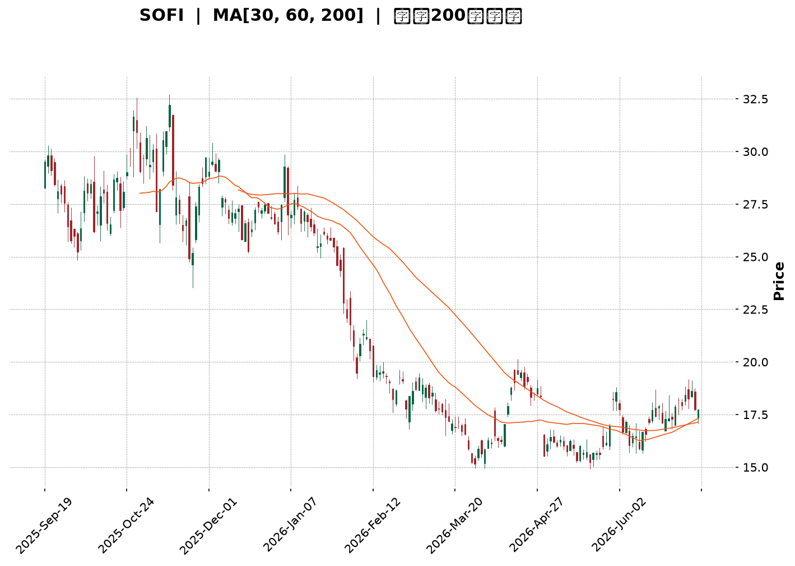
</details>

<html>
<head><meta charset="utf-8" /></head>
<body>
    <div style="height:500px; width:100%;">                        <script>window.PlotlyConfig = {MathJaxConfig: 'local'};</script>
        <script charset="utf-8" src="https://cdn.plot.ly/plotly-3.6.0.min.js" integrity="sha256-QaOVwtVY0T02VaHrr6pnoHLCwayMJp4O5n4YyaE3rJk=" crossorigin="anonymous"></script>                <div id="candlestick-chart" class="plotly-graph-div" style="height:100%; width:100%;"></div>            <script>                window.PLOTLYENV=window.PLOTLYENV || {};                                if (document.getElementById("candlestick-chart")) {                    Plotly.newPlot(                        "candlestick-chart",                        [{"close":{"dtype":"f8","bdata":"AAAAYI+CPUAAAAAgXM89QAAAAEAKFz1AAAAA4KNwPEAAAABguB48QAAAAEDh+jtAAAAAwMyMO0AAAAAghWs6QAAAAGCPwjlAAAAA4FH4OUAAAACgcD05QAAAAAApXDpAAAAAANcjPEAAAADAHgU8QAAAAEAzczxAAAAA4KMwOkAAAAAA1yM7QAAAAGC43jtAAAAAIK4HPEAAAACgmZk6QAAAAIA9ijpAAAAAgBSuPEAAAAAAAMA8QAAAAOCjMDtAAAAA4HoUPEAAAABgjwI9QAAAAAAAAD5AAAAAwPWoP0AAAABgZuY+QAAAACCuBz1AAAAAgBSuPUAAAACgR6E+QAAAAGC4Xj1AAAAAgOsRPkAAAADA9Sg7QAAAAIDCNTxAAAAAgD2KPkAAAABAM\u002fM+QAAAAEDhGkBAAAAAANdjPEAAAACA69E7QAAAAIA9CjtAAAAAoHA9OkAAAADgUbg6QAAAAMD16DhAAAAA4KMwOUAAAABgZmY7QAAAAOB6VDxAAAAAoHB9PEAAAADgUbg9QAAAACCuBz1AAAAAYI+CPUAAAACA6xE9QAAAAKCZmT1AAAAAIK7HO0AAAAAAKZw7QAAAAOB61DpAAAAAQAoXO0AAAACA6xE7QAAAACCuRztAAAAAgOvROUAAAADgepQ6QAAAAMAeRTlAAAAAgD1KOkAAAACgcD07QAAAAKCZWTtAAAAA4KMwO0AAAABA4Xo7QAAAAIDrETtAAAAAgOvROkAAAAAgXI86QAAAAIAULjpAAAAAgMJ1O0AAAAAgrkc9QAAAAEDh+jpAAAAAAAAAO0AAAADgUbg7QAAAAGBmZjtAAAAAoJmZOkAAAAAA1yM7QAAAACCFqzpAAAAA4KNwOkAAAACgRyE6QAAAAKBwfTlAAAAAANejOUAAAABAChc6QAAAAKCZ2TlAAAAAwMzMOUAAAACAwnU5QAAAAKCZmThAAAAAAClcOEAAAAAgXM82QAAAAOB6FDZAAAAAYI\u002fCNUAAAAAAAMA0QAAAAIDCdTNAAAAAACncNEAAAACgmVk1QAAAAIAULjVAAAAAwMyMNEAAAADAzEwzQAAAAAApnDNAAAAAYI+CM0AAAACAPYozQAAAAMDMTDNAAAAAwB4FM0AAAADgUTgyQAAAAMD1qDJAAAAAgD1KM0AAAACgmRkzQAAAAGCPwjFAAAAAANdjMkAAAAAAKZwyQAAAAEAzszJAAAAAAABAM0AAAABgZuYyQAAAAIA9yjJAAAAAgD1KMkAAAAAgrocyQAAAAEAzszFAAAAAYI\u002fCMUAAAACgR6ExQAAAAGC4XjFAAAAAgBQuMUAAAADgehQxQAAAAGBm5jBAAAAAYGYmMUAAAABAM7MwQAAAACBcjzBAAAAAoHC9L0AAAACAwnUuQAAAAMDMTC5AAAAAYI\u002fCL0AAAABgj0IvQAAAAEAzsy9AAAAAwB5FMEAAAAAAKRwwQAAAAKBwfTBAAAAAwB5FMEAAAADgUTgwQAAAAMDMDDFAAAAAwPXoMUAAAACAPcoyQAAAACCuBzNAAAAAgBRuM0AAAAAAAIAzQAAAAOB61DJAAAAAIFwPM0AAAACA61EyQAAAAOCjcDJAAAAAYI\u002fCMkAAAAAAKVwyQAAAAMDMDC9AAAAAoJkZMEAAAACAFG4wQAAAAEAzMzBAAAAAwB4FMEAAAADAzEwwQAAAAAAAADBAAAAAAACAL0AAAABgj0IwQAAAAMDMzC9AAAAAYLieLkAAAADAHgUwQAAAAOBROC9AAAAAIIVrL0AAAACAwnUuQAAAAKBHYS9AAAAAwMxML0AAAACgcD0vQAAAAIDC9S9AAAAAIIUrMEAAAADgUfgwQAAAAOBRODJAAAAA4HqUMkAAAACgcL0xQAAAAIAUrjBAAAAAYGYmMUAAAAAgrgcwQAAAAAAAgDBAAAAA4FF4MEAAAACgcL0vQAAAACCFqzBAAAAA4HqUMEAAAACgRyExQAAAAIDCtTFAAAAAIIVrMUAAAADA9egxQAAAAKCZGTFAAAAAgD1KMUAAAAAgXE8xQAAAAMDMTDFAAAAAoEfhMUAAAADgozAyQAAAAIAU7jFAAAAA4KNwMkAAAACgcD0yQAAAAAApnDJAAAAAAADAMUAAAABA4boxQA=="},"high":{"dtype":"f8","bdata":"AAAAoEehPUAAAADAzEw+QAAAAADXIz5AAAAAIIWrPUAAAAAghas8QAAAAEDhejxAAAAAoEehPEAAAAAAKZw7QAAAAOB6VDtAAAAAoJlZOkAAAACAFC46QAAAAADXIztAAAAAQArXPEAAAACAwrU8QAAAAOCjsDxAAAAAwMzMPUAAAACAFG47QAAAAKCZWTxAAAAAQAoXPUAAAADgo3A8QAAAACCF6zpAAAAAgBTuPEAAAACA6xE9QAAAAMDMzDxAAAAA4FGYPEAAAABguN49QAAAAEAzMz5AAAAAQOH6P0AAAADgUUhAQAAAAIA96j5AAAAAACncPUAAAADgUTg\u002fQAAAAIA9yj5AAAAAYLhePkAAAABg59s+QAAAAKBwPTxAAAAA4FH4PkAAAACgcP0+QAAAAKBwXUBAAAAAAADAP0AAAACA6xE9QAAAAEAz8ztAAAAAAAAAO0AAAACgmdk6QAAAAEAzkzxAAAAAgOtxOUAAAAAAKZw7QAAAAEAzczxAAAAAAABAPUAAAAAAAMA9QAAAAEAzsz1AAAAAIIVrPkAAAACAFO49QAAAAEAzsz1AAAAAgBTuO0AAAADgetQ7QAAAAEAzcztAAAAAgBSuO0AAAAAgrkc7QAAAAAAAgDtAAAAAQOF6O0AAAACgcL06QAAAAIDC1TpAAAAAQAq3OkAAAABguF47QAAAAGC4njtAAAAAQApXO0AAAACAPYo7QAAAAMDMjDtAAAAAwPVoO0AAAAAA1yM7QAAAAGBm5jpAAAAAoEeBO0AAAAAAKdw9QAAAAMDMTD1AAAAAgBQuO0AAAACAFA48QAAAAAAAYDxAAAAAYOVQO0AAAABAMzM7QAAAAIDCFTtAAAAA4HpUO0AAAAAgrsc6QAAAAEAKVzpAAAAAwMwMOkAAAAAA12M6QAAAAKBHITpAAAAAYGZmOkAAAACAFO45QAAAAIA9yjlAAAAAYLgeOUAAAADgUXg5QAAAAAAAADdAAAAAAClcN0AAAAAA18M1QAAAAGBmZjRAAAAAwPUoNUAAAABACpc1QAAAAAAAADZAAAAAoJkZNUAAAACAPco0QAAAAGC43jNAAAAAQArXM0AAAABgjwI0QAAAAEDhejNAAAAA4KMwM0AAAACgR8EyQAAAAIDCtTJAAAAAYLieM0AAAAAgXI8zQAAAAIDCNTJAAAAAwPVoMkAAAACAPQozQAAAACCuRzNAAAAAQOF6M0AAAABguD4zQAAAAIDr8TJAAAAAYGYGM0AAAACgmdkyQAAAAMDMjDJAAAAAYGYmMkAAAACA6xEyQAAAAKBHQTJAAAAAIK4HMkAAAAAghUsxQAAAAMByaDFAAAAAwPVoMUAAAACA6xExQAAAAEAKVzFAAAAAoHB9MEAAAACgR2EvQAAAAKBHIS9AAAAAYGYGMEAAAACA61EwQAAAACCuxy9AAAAAwMxsMEAAAABA4VowQAAAAKCZ2TFAAAAA4FF4MEAAAACgcH0wQAAAACBcDzFAAAAAQDMTMkAAAACA69EyQAAAAGC4njNAAAAAoEchNEAAAADAHqUzQAAAAMAexTNAAAAAILByM0AAAABgZuYyQAAAAEAzkzJAAAAAIIUrM0AAAABguN4yQAAAAEAKlzBAAAAAYLheMEAAAAAghcswQAAAACCuxzBAAAAAIFxPMEAAAACgR4EwQAAAAIDCdTBAAAAAwMwMMEAAAACA61EwQAAAAOB6VDBAAAAAIIVrL0AAAADgoxAwQAAAAIAUri9AAAAAgOtRMEAAAAAgrkcvQAAAAOCjcC9AAAAAgOuRL0AAAAAAKdwvQAAAAEAz8zBAAAAA4KOwMEAAAADgehQxQAAAAEAKlzJAAAAAIIXLMkAAAABA4ToyQAAAAEAKdzFAAAAAQOE6MUAAAACgcP0wQAAAAMD1qDBAAAAAoJkZMUAAAADgUbgwQAAAAOCjsDBAAAAAIK7nMEAAAACAFG4xQAAAAOB6FDJAAAAAQDOzMkAAAACgcP0xQAAAACBcDzJAAAAAgBSuMUAAAACAFG4yQAAAAEAzkzFAAAAA4FH4MUAAAADAzEwyQAAAAKBwPTJAAAAA4HrUMkAAAADgozAzQAAAAGC4HjNAAAAAAADAMkAAAAAAAMAxQA=="},"hovertemplate":"\u003cb\u003e%{x|%Y-%m-%d}\u003c\u002fb\u003e\u003cbr\u003e\u958b: $%{open:.2f}\u003cbr\u003e\u9ad8: $%{high:.2f}\u003cbr\u003e\u4f4e: $%{low:.2f}\u003cbr\u003e\u6536: $%{close:.2f}\u003cextra\u003e\u003c\u002fextra\u003e","low":{"dtype":"f8","bdata":"AAAAoHA9PEAAAADgUfg8QAAAAKCZ2TxAAAAAoJlZPEAAAAAgXA87QAAAACBcjztAAAAAACkcO0AAAABAM7M5QAAAAADXozlAAAAAQDNzOUAAAABACtc4QAAAACBcTzlAAAAAgBSuOkAAAADAHqU7QAAAAAAAwDtAAAAAoEchOkAAAADgUXg6QAAAAAAAwDlAAAAAIFyPO0AAAAAAAEA6QAAAAGCPAjpAAAAAIFwPO0AAAABgZiY8QAAAAKBHYTpAAAAAoPEyO0AAAABAM7M8QAAAAMAeRT1AAAAAwMzMPEAAAAAA1yM+QAAAAEDh+jxAAAAAoHB9PEAAAADgelQ9QAAAAOCjsDxAAAAAYI8CPUAAAACgRyE7QAAAAMD1qDlAAAAAQArXPEAAAADgIts9QAAAAIDC9T5AAAAAYGYmPEAAAAAgroc6QAAAAMDMjDpAAAAAgMK1OUAAAAAgXI85QAAAAGC4vjhAAAAAwB6FN0AAAAAgrqc5QAAAAKBHoTpAAAAAIFxPPEAAAADgenQ8QAAAACCFqzxAAAAA4KNQPUAAAADAHgU9QAAAAEDhejxAAAAAgBTuOkAAAADAzAw7QAAAAMDMjDpAAAAAQOF6OkAAAACAFI46QAAAAEAzMzpAAAAAgD3KOUAAAADgUbg5QAAAACCFKzlAAAAAQDPzOUAAAAAgrkc6QAAAAKCZGTtAAAAAQDPTOkAAAAAgrgc7QAAAACCuBztAAAAAoHC9OkAAAACAPYo6QAAAACBcDzpAAAAAgD3KOUAAAACgmZk7QAAAACCuBzpAAAAAoHBdOkAAAACA65E6QAAAAEDhOjtAAAAAQDMzOkAAAADgUTg6QAAAACCF6zlAAAAAgMI1OkAAAABgjwI6QAAAAIDCNTlAAAAAQDPzOEAAAAAAAAA6QAAAAKCZmTlAAAAAwB7FOUAAAACAwjU5QAAAAIDrkThAAAAAwMwMOEAAAAAgXE82QAAAAAAp3DVAAAAAwB4FNUAAAACA6xE0QAAAAACqMTNAAAAAgD0KNEAAAADAzMw0QAAAAMDMDDVAAAAAANcjNEAAAACAPQozQAAAAGBmJjNAAAAAACkcM0AAAACgmTkzQAAAAOBR+DJAAAAAANeDMkAAAADgepQxQAAAAADX4zFAAAAAgBTuMkAAAADgUfgyQAAAACBcTzFAAAAAwMzMMEAAAADgo7AxQAAAAAApnDJAAAAAANejMkAAAABguB4yQAAAAMAexTFAAAAAgD0KMkAAAADgUfgxQAAAAGC4njFAAAAAIK6HMUAAAADgUXgxQAAAAEDhejBAAAAAwPUoMUAAAADgepQwQAAAACCFqzBAAAAAQArXMEAAAACgcH0wQAAAAMAehTBAAAAAACmcL0AAAADAzEwuQAAAAGC43i1AAAAAYLieLkAAAACgR+EuQAAAAAAp3C1AAAAAYI\u002fCL0AAAACA69EvQAAAAGCPQjBAAAAA4HrUL0AAAADgURgwQAAAACCF6y9AAAAAYGZmMUAAAAAghSsyQAAAAGBmpjJAAAAAANdjM0AAAABAChczQAAAAOCjsDJAAAAAwPXoMkAAAACAFO4xQAAAAIDAKjJAAAAAANdjMkAAAADAHkUyQAAAAAAAAC9AAAAA4HoUL0AAAAAAAMAvQAAAAKBHITBAAAAAoEfhL0AAAABA4fovQAAAAMD1qC9AAAAAgD0KL0AAAACAPYovQAAAAKCZGS9AAAAAgBRuLkAAAACAwnUuQAAAAGCPwi5AAAAAgBSuLkAAAABACtctQAAAACBcDy5AAAAAQDOzLkAAAADgUbguQAAAAOBRuC9AAAAAYI8CMEAAAAAA16MvQAAAAIAUrjFAAAAA4KOwMUAAAACAwnUxQAAAAOB6lDBAAAAAgMKVMEAAAAAAKVwvQAAAAMD16C9AAAAA4E9NL0AAAADA9agvQAAAACBcTy9AAAAAQOE6MEAAAABgjwIxQAAAAACsHDFAAAAAAClcMUAAAAAA10MxQAAAAIDrETFAAAAA4FG4MEAAAACAFC4xQAAAAIDr0TBAAAAAoHD9MEAAAAAAAIAxQAAAAEAKtzFAAAAAgML1MUAAAAAA18MxQAAAACBcTzJAAAAAQDOzMUAAAADgehQxQA=="},"name":"\u50f9\u683c","open":{"dtype":"f8","bdata":"AAAAANdDPEAAAADAzEw9QAAAAIAUzj1AAAAAAACAPUAAAABgj8I7QAAAAGC4XjxAAAAAAClcPEAAAADgUXg7QAAAAEDhujpAAAAA4HpUOkAAAACgmRk6QAAAAMAexTlAAAAAoJkZO0AAAACgcH08QAAAAIA9CjxAAAAAwMyMPEAAAACA6xE7QAAAAGCPgjpAAAAAQDMzPEAAAACA6xE8QAAAAKCZGTpAAAAAQDMzO0AAAAAgXI88QAAAAKBwfTxAAAAA4HpUO0AAAADgUdg8QAAAAAAAAD5AAAAAoHD9PkAAAABguH4\u002fQAAAACBcbz5AAAAA4KOwPUAAAADA9ag9QAAAACCFSz1AAAAAwB6FPUAAAAAAACA+QAAAAGBmhjpAAAAAIFwPPUAAAABguD4+QAAAAIAULj9AAAAAQOG6P0AAAAAAAAA7QAAAAIDCtTtAAAAAYI+COkAAAACgmXk6QAAAAKBH4TtAAAAAoEehOEAAAADgetQ5QAAAAEDh+jpAAAAAgMK1PEAAAACAPco8QAAAAOB61DxAAAAAANdjPUAAAADAzGw9QAAAAMD1CD1AAAAAoHBdO0AAAABA4bo7QAAAAKBwPTtAAAAAYGamOkAAAABACtc6QAAAAMAeJTtAAAAAIFxvO0AAAACgcL05QAAAAADXozpAAAAAgBQuOkAAAABguJ46QAAAAOBRmDtAAAAAgOsRO0AAAAAghSs7QAAAAIA9ijtAAAAAYLjeOkAAAAAgrgc7QAAAAIAUrjpAAAAAwPWoOkAAAAAgXM87QAAAAEDhOj1AAAAAoHDdOkAAAAAAAAA7QAAAAIAUzjtAAAAAgD1KO0AAAABAM7M6QAAAAAAAADtAAAAAIFzPOkAAAACAPYo6QAAAAOCjcDlAAAAAAACAOUAAAACAFC46QAAAAAAAADpAAAAAYGbmOUAAAABgZuY5QAAAAAAAgDlAAAAAoHDdOEAAAACAFG45QAAAAGCPgjZAAAAAwMwMN0AAAACgcH01QAAAAEDhOjRAAAAAgD1KNEAAAACAPUo1QAAAAEAKFzVAAAAAoJkZNUAAAACAPco0QAAAACCuRzNAAAAAwPVoM0AAAADgUXgzQAAAAOB6VDNAAAAAgMIVM0AAAABA4boyQAAAAAAAADJAAAAAIK5HM0AAAADgozAzQAAAAMD1KDJAAAAAwB4lMUAAAAAAAAAyQAAAACBcDzNAAAAAYGamMkAAAAAAKXwyQAAAAOB6VDJAAAAAIIXrMkAAAAAA12MyQAAAAOBRODJAAAAAwMzMMUAAAAAAAAAyQAAAAOBRuDFAAAAAgBRuMUAAAAAAAMAwQAAAAIA96jBAAAAAIK4nMUAAAABguP4wQAAAAIA9CjFAAAAAYGZGMEAAAABAClcvQAAAAAAp3C5AAAAAYGbmLkAAAABgZkYwQAAAAKBHYS5AAAAAIK7HL0AAAADA9SgwQAAAAIAUrjFAAAAAANdjMEAAAADAzEwwQAAAAAAAADBAAAAAIK6HMUAAAADgUXgyQAAAAGC4njNAAAAAoJmZM0AAAABgj0IzQAAAAGCPgjNAAAAAgD1KM0AAAADAHsUyQAAAAOCjcDJAAAAAQOF6MkAAAADAHmUyQAAAAMDMjDBAAAAAgD2KL0AAAAAAKTwwQAAAAOBReDBAAAAAIIUrMEAAAABAMzMwQAAAAGCPQjBAAAAAIK4HMEAAAACgmZkvQAAAAIDrETBAAAAAIIVrL0AAAABguJ4uQAAAAGBmZi9AAAAAgML1LkAAAACAwjUvQAAAAEDhui5AAAAAoHA9L0AAAABgZmYvQAAAAEDhejBAAAAAwMwMMEAAAADAHgUwQAAAAGCPQjJAAAAAYGYmMkAAAAAgrgcyQAAAAKBHYTFAAAAAwPWoMEAAAABA4bowQAAAAIAULjBAAAAAYGZmMEAAAADgejQwQAAAAADXoy9AAAAAgOvRMEAAAAAgrkcxQAAAAEAzMzFAAAAAIFzPMUAAAABAM9MxQAAAAEAKlzFAAAAAACm8MEAAAADgUTgxQAAAAGBmZjFAAAAAAAAAMUAAAADgozAyQAAAAKCZGTJAAAAAANcjMkAAAABAM7MyQAAAAKCZWTJAAAAAoJmZMkAAAABAClcxQA=="},"x":["2025-09-19T00:00:00-04:00","2025-09-22T00:00:00-04:00","2025-09-23T00:00:00-04:00","2025-09-24T00:00:00-04:00","2025-09-25T00:00:00-04:00","2025-09-26T00:00:00-04:00","2025-09-29T00:00:00-04:00","2025-09-30T00:00:00-04:00","2025-10-01T00:00:00-04:00","2025-10-02T00:00:00-04:00","2025-10-03T00:00:00-04:00","2025-10-06T00:00:00-04:00","2025-10-07T00:00:00-04:00","2025-10-08T00:00:00-04:00","2025-10-09T00:00:00-04:00","2025-10-10T00:00:00-04:00","2025-10-13T00:00:00-04:00","2025-10-14T00:00:00-04:00","2025-10-15T00:00:00-04:00","2025-10-16T00:00:00-04:00","2025-10-17T00:00:00-04:00","2025-10-20T00:00:00-04:00","2025-10-21T00:00:00-04:00","2025-10-22T00:00:00-04:00","2025-10-23T00:00:00-04:00","2025-10-24T00:00:00-04:00","2025-10-27T00:00:00-04:00","2025-10-28T00:00:00-04:00","2025-10-29T00:00:00-04:00","2025-10-30T00:00:00-04:00","2025-10-31T00:00:00-04:00","2025-11-03T00:00:00-05:00","2025-11-04T00:00:00-05:00","2025-11-05T00:00:00-05:00","2025-11-06T00:00:00-05:00","2025-11-07T00:00:00-05:00","2025-11-10T00:00:00-05:00","2025-11-11T00:00:00-05:00","2025-11-12T00:00:00-05:00","2025-11-13T00:00:00-05:00","2025-11-14T00:00:00-05:00","2025-11-17T00:00:00-05:00","2025-11-18T00:00:00-05:00","2025-11-19T00:00:00-05:00","2025-11-20T00:00:00-05:00","2025-11-21T00:00:00-05:00","2025-11-24T00:00:00-05:00","2025-11-25T00:00:00-05:00","2025-11-26T00:00:00-05:00","2025-11-28T00:00:00-05:00","2025-12-01T00:00:00-05:00","2025-12-02T00:00:00-05:00","2025-12-03T00:00:00-05:00","2025-12-04T00:00:00-05:00","2025-12-05T00:00:00-05:00","2025-12-08T00:00:00-05:00","2025-12-09T00:00:00-05:00","2025-12-10T00:00:00-05:00","2025-12-11T00:00:00-05:00","2025-12-12T00:00:00-05:00","2025-12-15T00:00:00-05:00","2025-12-16T00:00:00-05:00","2025-12-17T00:00:00-05:00","2025-12-18T00:00:00-05:00","2025-12-19T00:00:00-05:00","2025-12-22T00:00:00-05:00","2025-12-23T00:00:00-05:00","2025-12-24T00:00:00-05:00","2025-12-26T00:00:00-05:00","2025-12-29T00:00:00-05:00","2025-12-30T00:00:00-05:00","2025-12-31T00:00:00-05:00","2026-01-02T00:00:00-05:00","2026-01-05T00:00:00-05:00","2026-01-06T00:00:00-05:00","2026-01-07T00:00:00-05:00","2026-01-08T00:00:00-05:00","2026-01-09T00:00:00-05:00","2026-01-12T00:00:00-05:00","2026-01-13T00:00:00-05:00","2026-01-14T00:00:00-05:00","2026-01-15T00:00:00-05:00","2026-01-16T00:00:00-05:00","2026-01-20T00:00:00-05:00","2026-01-21T00:00:00-05:00","2026-01-22T00:00:00-05:00","2026-01-23T00:00:00-05:00","2026-01-26T00:00:00-05:00","2026-01-27T00:00:00-05:00","2026-01-28T00:00:00-05:00","2026-01-29T00:00:00-05:00","2026-01-30T00:00:00-05:00","2026-02-02T00:00:00-05:00","2026-02-03T00:00:00-05:00","2026-02-04T00:00:00-05:00","2026-02-05T00:00:00-05:00","2026-02-06T00:00:00-05:00","2026-02-09T00:00:00-05:00","2026-02-10T00:00:00-05:00","2026-02-11T00:00:00-05:00","2026-02-12T00:00:00-05:00","2026-02-13T00:00:00-05:00","2026-02-17T00:00:00-05:00","2026-02-18T00:00:00-05:00","2026-02-19T00:00:00-05:00","2026-02-20T00:00:00-05:00","2026-02-23T00:00:00-05:00","2026-02-24T00:00:00-05:00","2026-02-25T00:00:00-05:00","2026-02-26T00:00:00-05:00","2026-02-27T00:00:00-05:00","2026-03-02T00:00:00-05:00","2026-03-03T00:00:00-05:00","2026-03-04T00:00:00-05:00","2026-03-05T00:00:00-05:00","2026-03-06T00:00:00-05:00","2026-03-09T00:00:00-04:00","2026-03-10T00:00:00-04:00","2026-03-11T00:00:00-04:00","2026-03-12T00:00:00-04:00","2026-03-13T00:00:00-04:00","2026-03-16T00:00:00-04:00","2026-03-17T00:00:00-04:00","2026-03-18T00:00:00-04:00","2026-03-19T00:00:00-04:00","2026-03-20T00:00:00-04:00","2026-03-23T00:00:00-04:00","2026-03-24T00:00:00-04:00","2026-03-25T00:00:00-04:00","2026-03-26T00:00:00-04:00","2026-03-27T00:00:00-04:00","2026-03-30T00:00:00-04:00","2026-03-31T00:00:00-04:00","2026-04-01T00:00:00-04:00","2026-04-02T00:00:00-04:00","2026-04-06T00:00:00-04:00","2026-04-07T00:00:00-04:00","2026-04-08T00:00:00-04:00","2026-04-09T00:00:00-04:00","2026-04-10T00:00:00-04:00","2026-04-13T00:00:00-04:00","2026-04-14T00:00:00-04:00","2026-04-15T00:00:00-04:00","2026-04-16T00:00:00-04:00","2026-04-17T00:00:00-04:00","2026-04-20T00:00:00-04:00","2026-04-21T00:00:00-04:00","2026-04-22T00:00:00-04:00","2026-04-23T00:00:00-04:00","2026-04-24T00:00:00-04:00","2026-04-27T00:00:00-04:00","2026-04-28T00:00:00-04:00","2026-04-29T00:00:00-04:00","2026-04-30T00:00:00-04:00","2026-05-01T00:00:00-04:00","2026-05-04T00:00:00-04:00","2026-05-05T00:00:00-04:00","2026-05-06T00:00:00-04:00","2026-05-07T00:00:00-04:00","2026-05-08T00:00:00-04:00","2026-05-11T00:00:00-04:00","2026-05-12T00:00:00-04:00","2026-05-13T00:00:00-04:00","2026-05-14T00:00:00-04:00","2026-05-15T00:00:00-04:00","2026-05-18T00:00:00-04:00","2026-05-19T00:00:00-04:00","2026-05-20T00:00:00-04:00","2026-05-21T00:00:00-04:00","2026-05-22T00:00:00-04:00","2026-05-26T00:00:00-04:00","2026-05-27T00:00:00-04:00","2026-05-28T00:00:00-04:00","2026-05-29T00:00:00-04:00","2026-06-01T00:00:00-04:00","2026-06-02T00:00:00-04:00","2026-06-03T00:00:00-04:00","2026-06-04T00:00:00-04:00","2026-06-05T00:00:00-04:00","2026-06-08T00:00:00-04:00","2026-06-09T00:00:00-04:00","2026-06-10T00:00:00-04:00","2026-06-11T00:00:00-04:00","2026-06-12T00:00:00-04:00","2026-06-15T00:00:00-04:00","2026-06-16T00:00:00-04:00","2026-06-17T00:00:00-04:00","2026-06-18T00:00:00-04:00","2026-06-22T00:00:00-04:00","2026-06-23T00:00:00-04:00","2026-06-24T00:00:00-04:00","2026-06-25T00:00:00-04:00","2026-06-26T00:00:00-04:00","2026-06-29T00:00:00-04:00","2026-06-30T00:00:00-04:00","2026-07-01T00:00:00-04:00","2026-07-02T00:00:00-04:00","2026-07-06T00:00:00-04:00","2026-07-07T00:00:00-04:00","2026-07-08T00:00:00-04:00"],"type":"candlestick"},{"hovertemplate":"MA30: $%{y:.2f}\u003cextra\u003e\u003c\u002fextra\u003e","line":{"color":"#2196F3","dash":"dash","width":2},"mode":"lines","name":"MA30","x":["2025-09-19T00:00:00-04:00","2025-09-22T00:00:00-04:00","2025-09-23T00:00:00-04:00","2025-09-24T00:00:00-04:00","2025-09-25T00:00:00-04:00","2025-09-26T00:00:00-04:00","2025-09-29T00:00:00-04:00","2025-09-30T00:00:00-04:00","2025-10-01T00:00:00-04:00","2025-10-02T00:00:00-04:00","2025-10-03T00:00:00-04:00","2025-10-06T00:00:00-04:00","2025-10-07T00:00:00-04:00","2025-10-08T00:00:00-04:00","2025-10-09T00:00:00-04:00","2025-10-10T00:00:00-04:00","2025-10-13T00:00:00-04:00","2025-10-14T00:00:00-04:00","2025-10-15T00:00:00-04:00","2025-10-16T00:00:00-04:00","2025-10-17T00:00:00-04:00","2025-10-20T00:00:00-04:00","2025-10-21T00:00:00-04:00","2025-10-22T00:00:00-04:00","2025-10-23T00:00:00-04:00","2025-10-24T00:00:00-04:00","2025-10-27T00:00:00-04:00","2025-10-28T00:00:00-04:00","2025-10-29T00:00:00-04:00","2025-10-30T00:00:00-04:00","2025-10-31T00:00:00-04:00","2025-11-03T00:00:00-05:00","2025-11-04T00:00:00-05:00","2025-11-05T00:00:00-05:00","2025-11-06T00:00:00-05:00","2025-11-07T00:00:00-05:00","2025-11-10T00:00:00-05:00","2025-11-11T00:00:00-05:00","2025-11-12T00:00:00-05:00","2025-11-13T00:00:00-05:00","2025-11-14T00:00:00-05:00","2025-11-17T00:00:00-05:00","2025-11-18T00:00:00-05:00","2025-11-19T00:00:00-05:00","2025-11-20T00:00:00-05:00","2025-11-21T00:00:00-05:00","2025-11-24T00:00:00-05:00","2025-11-25T00:00:00-05:00","2025-11-26T00:00:00-05:00","2025-11-28T00:00:00-05:00","2025-12-01T00:00:00-05:00","2025-12-02T00:00:00-05:00","2025-12-03T00:00:00-05:00","2025-12-04T00:00:00-05:00","2025-12-05T00:00:00-05:00","2025-12-08T00:00:00-05:00","2025-12-09T00:00:00-05:00","2025-12-10T00:00:00-05:00","2025-12-11T00:00:00-05:00","2025-12-12T00:00:00-05:00","2025-12-15T00:00:00-05:00","2025-12-16T00:00:00-05:00","2025-12-17T00:00:00-05:00","2025-12-18T00:00:00-05:00","2025-12-19T00:00:00-05:00","2025-12-22T00:00:00-05:00","2025-12-23T00:00:00-05:00","2025-12-24T00:00:00-05:00","2025-12-26T00:00:00-05:00","2025-12-29T00:00:00-05:00","2025-12-30T00:00:00-05:00","2025-12-31T00:00:00-05:00","2026-01-02T00:00:00-05:00","2026-01-05T00:00:00-05:00","2026-01-06T00:00:00-05:00","2026-01-07T00:00:00-05:00","2026-01-08T00:00:00-05:00","2026-01-09T00:00:00-05:00","2026-01-12T00:00:00-05:00","2026-01-13T00:00:00-05:00","2026-01-14T00:00:00-05:00","2026-01-15T00:00:00-05:00","2026-01-16T00:00:00-05:00","2026-01-20T00:00:00-05:00","2026-01-21T00:00:00-05:00","2026-01-22T00:00:00-05:00","2026-01-23T00:00:00-05:00","2026-01-26T00:00:00-05:00","2026-01-27T00:00:00-05:00","2026-01-28T00:00:00-05:00","2026-01-29T00:00:00-05:00","2026-01-30T00:00:00-05:00","2026-02-02T00:00:00-05:00","2026-02-03T00:00:00-05:00","2026-02-04T00:00:00-05:00","2026-02-05T00:00:00-05:00","2026-02-06T00:00:00-05:00","2026-02-09T00:00:00-05:00","2026-02-10T00:00:00-05:00","2026-02-11T00:00:00-05:00","2026-02-12T00:00:00-05:00","2026-02-13T00:00:00-05:00","2026-02-17T00:00:00-05:00","2026-02-18T00:00:00-05:00","2026-02-19T00:00:00-05:00","2026-02-20T00:00:00-05:00","2026-02-23T00:00:00-05:00","2026-02-24T00:00:00-05:00","2026-02-25T00:00:00-05:00","2026-02-26T00:00:00-05:00","2026-02-27T00:00:00-05:00","2026-03-02T00:00:00-05:00","2026-03-03T00:00:00-05:00","2026-03-04T00:00:00-05:00","2026-03-05T00:00:00-05:00","2026-03-06T00:00:00-05:00","2026-03-09T00:00:00-04:00","2026-03-10T00:00:00-04:00","2026-03-11T00:00:00-04:00","2026-03-12T00:00:00-04:00","2026-03-13T00:00:00-04:00","2026-03-16T00:00:00-04:00","2026-03-17T00:00:00-04:00","2026-03-18T00:00:00-04:00","2026-03-19T00:00:00-04:00","2026-03-20T00:00:00-04:00","2026-03-23T00:00:00-04:00","2026-03-24T00:00:00-04:00","2026-03-25T00:00:00-04:00","2026-03-26T00:00:00-04:00","2026-03-27T00:00:00-04:00","2026-03-30T00:00:00-04:00","2026-03-31T00:00:00-04:00","2026-04-01T00:00:00-04:00","2026-04-02T00:00:00-04:00","2026-04-06T00:00:00-04:00","2026-04-07T00:00:00-04:00","2026-04-08T00:00:00-04:00","2026-04-09T00:00:00-04:00","2026-04-10T00:00:00-04:00","2026-04-13T00:00:00-04:00","2026-04-14T00:00:00-04:00","2026-04-15T00:00:00-04:00","2026-04-16T00:00:00-04:00","2026-04-17T00:00:00-04:00","2026-04-20T00:00:00-04:00","2026-04-21T00:00:00-04:00","2026-04-22T00:00:00-04:00","2026-04-23T00:00:00-04:00","2026-04-24T00:00:00-04:00","2026-04-27T00:00:00-04:00","2026-04-28T00:00:00-04:00","2026-04-29T00:00:00-04:00","2026-04-30T00:00:00-04:00","2026-05-01T00:00:00-04:00","2026-05-04T00:00:00-04:00","2026-05-05T00:00:00-04:00","2026-05-06T00:00:00-04:00","2026-05-07T00:00:00-04:00","2026-05-08T00:00:00-04:00","2026-05-11T00:00:00-04:00","2026-05-12T00:00:00-04:00","2026-05-13T00:00:00-04:00","2026-05-14T00:00:00-04:00","2026-05-15T00:00:00-04:00","2026-05-18T00:00:00-04:00","2026-05-19T00:00:00-04:00","2026-05-20T00:00:00-04:00","2026-05-21T00:00:00-04:00","2026-05-22T00:00:00-04:00","2026-05-26T00:00:00-04:00","2026-05-27T00:00:00-04:00","2026-05-28T00:00:00-04:00","2026-05-29T00:00:00-04:00","2026-06-01T00:00:00-04:00","2026-06-02T00:00:00-04:00","2026-06-03T00:00:00-04:00","2026-06-04T00:00:00-04:00","2026-06-05T00:00:00-04:00","2026-06-08T00:00:00-04:00","2026-06-09T00:00:00-04:00","2026-06-10T00:00:00-04:00","2026-06-11T00:00:00-04:00","2026-06-12T00:00:00-04:00","2026-06-15T00:00:00-04:00","2026-06-16T00:00:00-04:00","2026-06-17T00:00:00-04:00","2026-06-18T00:00:00-04:00","2026-06-22T00:00:00-04:00","2026-06-23T00:00:00-04:00","2026-06-24T00:00:00-04:00","2026-06-25T00:00:00-04:00","2026-06-26T00:00:00-04:00","2026-06-29T00:00:00-04:00","2026-06-30T00:00:00-04:00","2026-07-01T00:00:00-04:00","2026-07-02T00:00:00-04:00","2026-07-06T00:00:00-04:00","2026-07-07T00:00:00-04:00","2026-07-08T00:00:00-04:00"],"y":{"dtype":"f8","bdata":"AAAAAAAA+H8AAAAAAAD4fwAAAAAAAPh\u002fAAAAAAAA+H8AAAAAAAD4fwAAAAAAAPh\u002fAAAAAAAA+H8AAAAAAAD4fwAAAAAAAPh\u002fAAAAAAAA+H8AAAAAAAD4fwAAAAAAAPh\u002fAAAAAAAA+H8AAAAAAAD4fwAAAAAAAPh\u002fAAAAAAAA+H8AAAAAAAD4fwAAAAAAAPh\u002fAAAAAAAA+H8AAAAAAAD4fwAAAAAAAPh\u002fAAAAAAAA+H8AAAAAAAD4fwAAAAAAAPh\u002fAAAAAAAA+H8AAAAAAAD4fwAAAAAAAPh\u002fAAAAAAAA+H8AAAAAAAD4fwAAANCFBDxA7+7uLvkFPEAAAACA+Aw8QLy7uytcDzxAVVVV9UQdPEDe3d3NExU8QO\u002fu7j4KFzxAERERAY4wPEARERHxNVc8QN7d3S1AjjxAAAAAwOaiPECJiIjY6rg8QERERFS4vjxAd3d3t4GuPEAiIiLSaaM8QCIiIpI0hTxAmpmZCax8PEBEREQE5H48QGZmZubQgjxAiYiIyL2GPEBmZmaGXaE8QDMzMwOdtjxAzczMLLK9PECamZk5bcA8QDMzM\u002fP91DxAd3d3l27SPEDv7u4+fMY8QGZmZkZvqzxAVVVV9W+EPEAiIiIywWM8QDMzM0PSVDxAZmZm9uEzPECrqqqaUhE8QERERARW7jtAvLu7exTOO0Dv7u4+w847QM3MzIxsxztAzczMXNaqO0B3d3cHOo07QHd3d4ddYTtAAAAA0PdTO0DNzMxMN0k7QJqZmZngQTtAq6qquklMO0AzMzMjImI7QO\u002fu7h7McztAAAAAID6DO0DNzMws+YU7QO\u002fu7o4JfjtAq6qqyuhtO0AiIiKy5Fc7QCIiIjLBQztA3t3drY4pO0BmZmYmeBA7QHd3d7dl7TpAAAAA0CLbOkAiIiJSKs46QKuqqnrNxTpA3t3dbcu6OkBERERUDq06QHd3d8cvljpAzczMXLqJOkC8u7urjmk6QCIiIgJWTjpAIiIiEq4nOkAzMzNzTPA5QKuqqnr4rDlAIiIiYvR2OUAiIiIypUI5QLy7u0tiEDlAVVVVReHaOEDv7u6O7Zw4QM3MzCzdZDhAMzMzIwYhOECJiIjI6M03QBEREZFfjDdA3t3d\u002fUZIN0DNzMzsNfc2QKuqqhqhrDZAq6qqKkBuNkBVVVWFpCk2QERERFSc3TVAVVVV1eqYNUBVVVUlv1g1QKuqqirOHjVAAAAAAEfoNEBEREQ07Ko0QGZmZmatbjRA7+7ujpcuNEDv7u6+dPMzQHd3d3eTuDNAvLu7i0GAM0CamZmpDVQzQDMzM4PcKzNAmpmZWccEM0DNzMwcduUyQFVVVbWdzzJAZmZmFvWvMkAiIiICR4gyQGZmZnbaYDJAERER2eo4MkBERETMLxYyQO\u002fu7sYg8DFAvLu76ybRMUDNzMxkya8xQJqZmcFYkjFAIiIiSuF6MUBVVVXt32gxQFVVVX1bVjFAq6qqMpY8MUBVVVW9AiQxQAAAALjzHTFAzczMJNsZMUBERERcZBsxQJqZmUE1HjFAEREReb4fMUCamZkx3SQxQKuqqpI0JTFAERERqcYrMUAAAADo+ykxQN7d3XVMMDFAZmZm\u002ftQ4MUDNzMy0Dz8xQFVVVT1RLzFAmpmZ8RkmMUB3d3f\u002fjSAxQLy7u9OUGjFAZmZmTvAQMUBVVVV9hg0xQO\u002fu7ia\u002fCDFAIiIiArkHMUBEREQUgxAxQKuqqnrpFjFAvLu7SwwSMUC8u7tDYBUxQJqZmflTEzFAq6qqoowOMUBmZmY+CgcxQN7d3Z02ADFARERENOz6MEBERER8zfUwQBEREQms7DBAq6qq8tLdMEAAAAAYS84wQGZmZp5hxzBAvLu7wyDAMEBERET8G7EwQFVVVT3DnjBAAAAAyHaOMEC8u7sz7HowQM3MzDReajBAd3d3n9NWMEAiIiIilEEwQM3MzGxZSzBAAAAAAHJPMEC8u7sra1UwQAAAANBNYjBAiYiIKEBuMEAiIiJC\u002fXswQO\u002fu7j5ghTBA3t3dbYSSMEAAAAAwepswQImIiIhspzBAAAAAyFq9MEAAAAA4388wQGZmZlar4zBAVVVVHff6MEB3d3ePphQxQGZmZmaRLTFAvLu763w\u002fMUARERFJflExQA=="},"type":"scatter"},{"hovertemplate":"MA60: $%{y:.2f}\u003cextra\u003e\u003c\u002fextra\u003e","line":{"color":"#9C27B0","dash":"dash","width":2},"mode":"lines","name":"MA60","x":["2025-09-19T00:00:00-04:00","2025-09-22T00:00:00-04:00","2025-09-23T00:00:00-04:00","2025-09-24T00:00:00-04:00","2025-09-25T00:00:00-04:00","2025-09-26T00:00:00-04:00","2025-09-29T00:00:00-04:00","2025-09-30T00:00:00-04:00","2025-10-01T00:00:00-04:00","2025-10-02T00:00:00-04:00","2025-10-03T00:00:00-04:00","2025-10-06T00:00:00-04:00","2025-10-07T00:00:00-04:00","2025-10-08T00:00:00-04:00","2025-10-09T00:00:00-04:00","2025-10-10T00:00:00-04:00","2025-10-13T00:00:00-04:00","2025-10-14T00:00:00-04:00","2025-10-15T00:00:00-04:00","2025-10-16T00:00:00-04:00","2025-10-17T00:00:00-04:00","2025-10-20T00:00:00-04:00","2025-10-21T00:00:00-04:00","2025-10-22T00:00:00-04:00","2025-10-23T00:00:00-04:00","2025-10-24T00:00:00-04:00","2025-10-27T00:00:00-04:00","2025-10-28T00:00:00-04:00","2025-10-29T00:00:00-04:00","2025-10-30T00:00:00-04:00","2025-10-31T00:00:00-04:00","2025-11-03T00:00:00-05:00","2025-11-04T00:00:00-05:00","2025-11-05T00:00:00-05:00","2025-11-06T00:00:00-05:00","2025-11-07T00:00:00-05:00","2025-11-10T00:00:00-05:00","2025-11-11T00:00:00-05:00","2025-11-12T00:00:00-05:00","2025-11-13T00:00:00-05:00","2025-11-14T00:00:00-05:00","2025-11-17T00:00:00-05:00","2025-11-18T00:00:00-05:00","2025-11-19T00:00:00-05:00","2025-11-20T00:00:00-05:00","2025-11-21T00:00:00-05:00","2025-11-24T00:00:00-05:00","2025-11-25T00:00:00-05:00","2025-11-26T00:00:00-05:00","2025-11-28T00:00:00-05:00","2025-12-01T00:00:00-05:00","2025-12-02T00:00:00-05:00","2025-12-03T00:00:00-05:00","2025-12-04T00:00:00-05:00","2025-12-05T00:00:00-05:00","2025-12-08T00:00:00-05:00","2025-12-09T00:00:00-05:00","2025-12-10T00:00:00-05:00","2025-12-11T00:00:00-05:00","2025-12-12T00:00:00-05:00","2025-12-15T00:00:00-05:00","2025-12-16T00:00:00-05:00","2025-12-17T00:00:00-05:00","2025-12-18T00:00:00-05:00","2025-12-19T00:00:00-05:00","2025-12-22T00:00:00-05:00","2025-12-23T00:00:00-05:00","2025-12-24T00:00:00-05:00","2025-12-26T00:00:00-05:00","2025-12-29T00:00:00-05:00","2025-12-30T00:00:00-05:00","2025-12-31T00:00:00-05:00","2026-01-02T00:00:00-05:00","2026-01-05T00:00:00-05:00","2026-01-06T00:00:00-05:00","2026-01-07T00:00:00-05:00","2026-01-08T00:00:00-05:00","2026-01-09T00:00:00-05:00","2026-01-12T00:00:00-05:00","2026-01-13T00:00:00-05:00","2026-01-14T00:00:00-05:00","2026-01-15T00:00:00-05:00","2026-01-16T00:00:00-05:00","2026-01-20T00:00:00-05:00","2026-01-21T00:00:00-05:00","2026-01-22T00:00:00-05:00","2026-01-23T00:00:00-05:00","2026-01-26T00:00:00-05:00","2026-01-27T00:00:00-05:00","2026-01-28T00:00:00-05:00","2026-01-29T00:00:00-05:00","2026-01-30T00:00:00-05:00","2026-02-02T00:00:00-05:00","2026-02-03T00:00:00-05:00","2026-02-04T00:00:00-05:00","2026-02-05T00:00:00-05:00","2026-02-06T00:00:00-05:00","2026-02-09T00:00:00-05:00","2026-02-10T00:00:00-05:00","2026-02-11T00:00:00-05:00","2026-02-12T00:00:00-05:00","2026-02-13T00:00:00-05:00","2026-02-17T00:00:00-05:00","2026-02-18T00:00:00-05:00","2026-02-19T00:00:00-05:00","2026-02-20T00:00:00-05:00","2026-02-23T00:00:00-05:00","2026-02-24T00:00:00-05:00","2026-02-25T00:00:00-05:00","2026-02-26T00:00:00-05:00","2026-02-27T00:00:00-05:00","2026-03-02T00:00:00-05:00","2026-03-03T00:00:00-05:00","2026-03-04T00:00:00-05:00","2026-03-05T00:00:00-05:00","2026-03-06T00:00:00-05:00","2026-03-09T00:00:00-04:00","2026-03-10T00:00:00-04:00","2026-03-11T00:00:00-04:00","2026-03-12T00:00:00-04:00","2026-03-13T00:00:00-04:00","2026-03-16T00:00:00-04:00","2026-03-17T00:00:00-04:00","2026-03-18T00:00:00-04:00","2026-03-19T00:00:00-04:00","2026-03-20T00:00:00-04:00","2026-03-23T00:00:00-04:00","2026-03-24T00:00:00-04:00","2026-03-25T00:00:00-04:00","2026-03-26T00:00:00-04:00","2026-03-27T00:00:00-04:00","2026-03-30T00:00:00-04:00","2026-03-31T00:00:00-04:00","2026-04-01T00:00:00-04:00","2026-04-02T00:00:00-04:00","2026-04-06T00:00:00-04:00","2026-04-07T00:00:00-04:00","2026-04-08T00:00:00-04:00","2026-04-09T00:00:00-04:00","2026-04-10T00:00:00-04:00","2026-04-13T00:00:00-04:00","2026-04-14T00:00:00-04:00","2026-04-15T00:00:00-04:00","2026-04-16T00:00:00-04:00","2026-04-17T00:00:00-04:00","2026-04-20T00:00:00-04:00","2026-04-21T00:00:00-04:00","2026-04-22T00:00:00-04:00","2026-04-23T00:00:00-04:00","2026-04-24T00:00:00-04:00","2026-04-27T00:00:00-04:00","2026-04-28T00:00:00-04:00","2026-04-29T00:00:00-04:00","2026-04-30T00:00:00-04:00","2026-05-01T00:00:00-04:00","2026-05-04T00:00:00-04:00","2026-05-05T00:00:00-04:00","2026-05-06T00:00:00-04:00","2026-05-07T00:00:00-04:00","2026-05-08T00:00:00-04:00","2026-05-11T00:00:00-04:00","2026-05-12T00:00:00-04:00","2026-05-13T00:00:00-04:00","2026-05-14T00:00:00-04:00","2026-05-15T00:00:00-04:00","2026-05-18T00:00:00-04:00","2026-05-19T00:00:00-04:00","2026-05-20T00:00:00-04:00","2026-05-21T00:00:00-04:00","2026-05-22T00:00:00-04:00","2026-05-26T00:00:00-04:00","2026-05-27T00:00:00-04:00","2026-05-28T00:00:00-04:00","2026-05-29T00:00:00-04:00","2026-06-01T00:00:00-04:00","2026-06-02T00:00:00-04:00","2026-06-03T00:00:00-04:00","2026-06-04T00:00:00-04:00","2026-06-05T00:00:00-04:00","2026-06-08T00:00:00-04:00","2026-06-09T00:00:00-04:00","2026-06-10T00:00:00-04:00","2026-06-11T00:00:00-04:00","2026-06-12T00:00:00-04:00","2026-06-15T00:00:00-04:00","2026-06-16T00:00:00-04:00","2026-06-17T00:00:00-04:00","2026-06-18T00:00:00-04:00","2026-06-22T00:00:00-04:00","2026-06-23T00:00:00-04:00","2026-06-24T00:00:00-04:00","2026-06-25T00:00:00-04:00","2026-06-26T00:00:00-04:00","2026-06-29T00:00:00-04:00","2026-06-30T00:00:00-04:00","2026-07-01T00:00:00-04:00","2026-07-02T00:00:00-04:00","2026-07-06T00:00:00-04:00","2026-07-07T00:00:00-04:00","2026-07-08T00:00:00-04:00"],"y":{"dtype":"f8","bdata":"AAAAAAAA+H8AAAAAAAD4fwAAAAAAAPh\u002fAAAAAAAA+H8AAAAAAAD4fwAAAAAAAPh\u002fAAAAAAAA+H8AAAAAAAD4fwAAAAAAAPh\u002fAAAAAAAA+H8AAAAAAAD4fwAAAAAAAPh\u002fAAAAAAAA+H8AAAAAAAD4fwAAAAAAAPh\u002fAAAAAAAA+H8AAAAAAAD4fwAAAAAAAPh\u002fAAAAAAAA+H8AAAAAAAD4fwAAAAAAAPh\u002fAAAAAAAA+H8AAAAAAAD4fwAAAAAAAPh\u002fAAAAAAAA+H8AAAAAAAD4fwAAAAAAAPh\u002fAAAAAAAA+H8AAAAAAAD4fwAAAAAAAPh\u002fAAAAAAAA+H8AAAAAAAD4fwAAAAAAAPh\u002fAAAAAAAA+H8AAAAAAAD4fwAAAAAAAPh\u002fAAAAAAAA+H8AAAAAAAD4fwAAAAAAAPh\u002fAAAAAAAA+H8AAAAAAAD4fwAAAAAAAPh\u002fAAAAAAAA+H8AAAAAAAD4fwAAAAAAAPh\u002fAAAAAAAA+H8AAAAAAAD4fwAAAAAAAPh\u002fAAAAAAAA+H8AAAAAAAD4fwAAAAAAAPh\u002fAAAAAAAA+H8AAAAAAAD4fwAAAAAAAPh\u002fAAAAAAAA+H8AAAAAAAD4fwAAAAAAAPh\u002fAAAAAAAA+H8AAAAAAAD4f5qZmQmsLDxAq6qqku0cPEBVVVWNJQ88QAAAABjZ\u002fjtAiYiIuKz1O0BmZmaG6\u002fE7QN7d3WU77ztA7+7uLrLtO0BERET8N\u002fI7QKuqqtrO9ztAAAAASG\u002f7O0CrqqoSEQE8QO\u002fu7nZMADxAERERuWX9O0Crqqr6xQI8QImIiFiA\u002fDtAzczMFPX\u002fO0CJiIiYbgI8QKuqqjptADxAmpmZSVP6O0BEREQcofw7QKuqqhov\u002fTtAVVVVbaDzO0AAAACwcug7QFVVVdUx4TtAvLu7s8jWO0CJiIhIU8o7QImIiGCeuDtAmpmZsZ2fO0AzMzPDZ4g7QFVVVQWBdTtAmpmZKc5eO0AzMzOjcD07QDMzMwNWHjtA7+7uRuH6OkARERHZh986QLy7u4MyujpAd3d3X+WQOkDNzMyc72c6QJqZmenfODpAq6qqimwXOkDe3d1tEvM5QDMzM+Ne0zlA7+7u7qe2OUDe3d11BZg5QAAAANgVgDlA7+7ujsJlOUDNzMyMlz45QM3MzFRVFTlAq6qqehTuOEC8u7ubxMA4QDMzM8OukDhAmpmZwTxhOEDe3d2lmzQ4QBEREfEZBjhAAAAA6LThN0AzMzNDi7w3QImIiHA9mjdAZmZmfrF0N0CamZmJQVA3QHd3d59hJzdARERE9P0EN0Crqqoqzt42QKuqqkIZvTZA3t3dtTqWNkAAAABI4Wo2QAAAABhLPjZAREREvHQTNkAiIiIaduU1QBEREWGeuDVAMzMzD+aJNUCamZmtjlk1QN7d3fl+KjVAd3d3hxb5NECrqqoW2b40QFVVVSlcjzRAAAAAJJRhNEARERHtCjA0QAAAAEx+ATRAq6qqLmvVM0BVVVWh06YzQCIiIgbIfTNAERER\u002fWJZM0DNzMzAETozQCIiIraBHjNAiYiIvAIEM0Dv7u6y5OcyQImIiPzwyTJAAAAAHC+tMkB3d3dTuI4yQKuqqvZvdDJAERERRYtcMkAzMzOvjkkyQEREROCWLTJAmpmZpXAVMkAiIiIOAgMyQImIiEQZ9TFAZmZmsnLgMUC8u7u\u002f5soxQKuqqs7MtDFAmpmZ7VGgMUBERERwWZMxQM3MzCCFgzFAvLu7m5lxMUBERETUlGIxQJqZmV3WUjFAZmZm9rZEMUDe3d0V9TcxQJqZmQ1JKzFAd3d3M8EbMUDNzMwc6AwxQImIiOBPBTFAvLu7C9f7MEAiIiK61\u002fQwQAAAAHDL8jBAZmZmnu\u002fvMEDv7u6W\u002fOowQAAAAOj74TBAiYiIuB7dMEDe3d0NdNIwQFVVVVVVzTBA7+7uTtTHMEB3d3frUcAwQBEREVVVvTBAzczM+MW6MECamZmV\u002fLowQN7d3VFxvjBAd3d3O5i\u002fMEC8u7vfwcQwQO\u002fu7rIPxzBAAAAAuB7NMEAiIiKi\u002ftUwQJqZmQEr3zBA3t3dibPnMEDe3d29n\u002fIwQAAAAKh\u002f+zBAAAAA4MEEMUDv7u5m2A0xQCIiIgLkFjFAAAAAkDQdMUCrqqripSMxQA=="},"type":"scatter"},{"hovertemplate":"MA200: $%{y:.2f}\u003cextra\u003e\u003c\u002fextra\u003e","line":{"color":"#FF6F00","dash":"solid","width":2},"mode":"lines","name":"MA200","x":["2025-09-19T00:00:00-04:00","2025-09-22T00:00:00-04:00","2025-09-23T00:00:00-04:00","2025-09-24T00:00:00-04:00","2025-09-25T00:00:00-04:00","2025-09-26T00:00:00-04:00","2025-09-29T00:00:00-04:00","2025-09-30T00:00:00-04:00","2025-10-01T00:00:00-04:00","2025-10-02T00:00:00-04:00","2025-10-03T00:00:00-04:00","2025-10-06T00:00:00-04:00","2025-10-07T00:00:00-04:00","2025-10-08T00:00:00-04:00","2025-10-09T00:00:00-04:00","2025-10-10T00:00:00-04:00","2025-10-13T00:00:00-04:00","2025-10-14T00:00:00-04:00","2025-10-15T00:00:00-04:00","2025-10-16T00:00:00-04:00","2025-10-17T00:00:00-04:00","2025-10-20T00:00:00-04:00","2025-10-21T00:00:00-04:00","2025-10-22T00:00:00-04:00","2025-10-23T00:00:00-04:00","2025-10-24T00:00:00-04:00","2025-10-27T00:00:00-04:00","2025-10-28T00:00:00-04:00","2025-10-29T00:00:00-04:00","2025-10-30T00:00:00-04:00","2025-10-31T00:00:00-04:00","2025-11-03T00:00:00-05:00","2025-11-04T00:00:00-05:00","2025-11-05T00:00:00-05:00","2025-11-06T00:00:00-05:00","2025-11-07T00:00:00-05:00","2025-11-10T00:00:00-05:00","2025-11-11T00:00:00-05:00","2025-11-12T00:00:00-05:00","2025-11-13T00:00:00-05:00","2025-11-14T00:00:00-05:00","2025-11-17T00:00:00-05:00","2025-11-18T00:00:00-05:00","2025-11-19T00:00:00-05:00","2025-11-20T00:00:00-05:00","2025-11-21T00:00:00-05:00","2025-11-24T00:00:00-05:00","2025-11-25T00:00:00-05:00","2025-11-26T00:00:00-05:00","2025-11-28T00:00:00-05:00","2025-12-01T00:00:00-05:00","2025-12-02T00:00:00-05:00","2025-12-03T00:00:00-05:00","2025-12-04T00:00:00-05:00","2025-12-05T00:00:00-05:00","2025-12-08T00:00:00-05:00","2025-12-09T00:00:00-05:00","2025-12-10T00:00:00-05:00","2025-12-11T00:00:00-05:00","2025-12-12T00:00:00-05:00","2025-12-15T00:00:00-05:00","2025-12-16T00:00:00-05:00","2025-12-17T00:00:00-05:00","2025-12-18T00:00:00-05:00","2025-12-19T00:00:00-05:00","2025-12-22T00:00:00-05:00","2025-12-23T00:00:00-05:00","2025-12-24T00:00:00-05:00","2025-12-26T00:00:00-05:00","2025-12-29T00:00:00-05:00","2025-12-30T00:00:00-05:00","2025-12-31T00:00:00-05:00","2026-01-02T00:00:00-05:00","2026-01-05T00:00:00-05:00","2026-01-06T00:00:00-05:00","2026-01-07T00:00:00-05:00","2026-01-08T00:00:00-05:00","2026-01-09T00:00:00-05:00","2026-01-12T00:00:00-05:00","2026-01-13T00:00:00-05:00","2026-01-14T00:00:00-05:00","2026-01-15T00:00:00-05:00","2026-01-16T00:00:00-05:00","2026-01-20T00:00:00-05:00","2026-01-21T00:00:00-05:00","2026-01-22T00:00:00-05:00","2026-01-23T00:00:00-05:00","2026-01-26T00:00:00-05:00","2026-01-27T00:00:00-05:00","2026-01-28T00:00:00-05:00","2026-01-29T00:00:00-05:00","2026-01-30T00:00:00-05:00","2026-02-02T00:00:00-05:00","2026-02-03T00:00:00-05:00","2026-02-04T00:00:00-05:00","2026-02-05T00:00:00-05:00","2026-02-06T00:00:00-05:00","2026-02-09T00:00:00-05:00","2026-02-10T00:00:00-05:00","2026-02-11T00:00:00-05:00","2026-02-12T00:00:00-05:00","2026-02-13T00:00:00-05:00","2026-02-17T00:00:00-05:00","2026-02-18T00:00:00-05:00","2026-02-19T00:00:00-05:00","2026-02-20T00:00:00-05:00","2026-02-23T00:00:00-05:00","2026-02-24T00:00:00-05:00","2026-02-25T00:00:00-05:00","2026-02-26T00:00:00-05:00","2026-02-27T00:00:00-05:00","2026-03-02T00:00:00-05:00","2026-03-03T00:00:00-05:00","2026-03-04T00:00:00-05:00","2026-03-05T00:00:00-05:00","2026-03-06T00:00:00-05:00","2026-03-09T00:00:00-04:00","2026-03-10T00:00:00-04:00","2026-03-11T00:00:00-04:00","2026-03-12T00:00:00-04:00","2026-03-13T00:00:00-04:00","2026-03-16T00:00:00-04:00","2026-03-17T00:00:00-04:00","2026-03-18T00:00:00-04:00","2026-03-19T00:00:00-04:00","2026-03-20T00:00:00-04:00","2026-03-23T00:00:00-04:00","2026-03-24T00:00:00-04:00","2026-03-25T00:00:00-04:00","2026-03-26T00:00:00-04:00","2026-03-27T00:00:00-04:00","2026-03-30T00:00:00-04:00","2026-03-31T00:00:00-04:00","2026-04-01T00:00:00-04:00","2026-04-02T00:00:00-04:00","2026-04-06T00:00:00-04:00","2026-04-07T00:00:00-04:00","2026-04-08T00:00:00-04:00","2026-04-09T00:00:00-04:00","2026-04-10T00:00:00-04:00","2026-04-13T00:00:00-04:00","2026-04-14T00:00:00-04:00","2026-04-15T00:00:00-04:00","2026-04-16T00:00:00-04:00","2026-04-17T00:00:00-04:00","2026-04-20T00:00:00-04:00","2026-04-21T00:00:00-04:00","2026-04-22T00:00:00-04:00","2026-04-23T00:00:00-04:00","2026-04-24T00:00:00-04:00","2026-04-27T00:00:00-04:00","2026-04-28T00:00:00-04:00","2026-04-29T00:00:00-04:00","2026-04-30T00:00:00-04:00","2026-05-01T00:00:00-04:00","2026-05-04T00:00:00-04:00","2026-05-05T00:00:00-04:00","2026-05-06T00:00:00-04:00","2026-05-07T00:00:00-04:00","2026-05-08T00:00:00-04:00","2026-05-11T00:00:00-04:00","2026-05-12T00:00:00-04:00","2026-05-13T00:00:00-04:00","2026-05-14T00:00:00-04:00","2026-05-15T00:00:00-04:00","2026-05-18T00:00:00-04:00","2026-05-19T00:00:00-04:00","2026-05-20T00:00:00-04:00","2026-05-21T00:00:00-04:00","2026-05-22T00:00:00-04:00","2026-05-26T00:00:00-04:00","2026-05-27T00:00:00-04:00","2026-05-28T00:00:00-04:00","2026-05-29T00:00:00-04:00","2026-06-01T00:00:00-04:00","2026-06-02T00:00:00-04:00","2026-06-03T00:00:00-04:00","2026-06-04T00:00:00-04:00","2026-06-05T00:00:00-04:00","2026-06-08T00:00:00-04:00","2026-06-09T00:00:00-04:00","2026-06-10T00:00:00-04:00","2026-06-11T00:00:00-04:00","2026-06-12T00:00:00-04:00","2026-06-15T00:00:00-04:00","2026-06-16T00:00:00-04:00","2026-06-17T00:00:00-04:00","2026-06-18T00:00:00-04:00","2026-06-22T00:00:00-04:00","2026-06-23T00:00:00-04:00","2026-06-24T00:00:00-04:00","2026-06-25T00:00:00-04:00","2026-06-26T00:00:00-04:00","2026-06-29T00:00:00-04:00","2026-06-30T00:00:00-04:00","2026-07-01T00:00:00-04:00","2026-07-02T00:00:00-04:00","2026-07-06T00:00:00-04:00","2026-07-07T00:00:00-04:00","2026-07-08T00:00:00-04:00"],"y":{"dtype":"f8","bdata":"AAAAAAAA+H8AAAAAAAD4fwAAAAAAAPh\u002fAAAAAAAA+H8AAAAAAAD4fwAAAAAAAPh\u002fAAAAAAAA+H8AAAAAAAD4fwAAAAAAAPh\u002fAAAAAAAA+H8AAAAAAAD4fwAAAAAAAPh\u002fAAAAAAAA+H8AAAAAAAD4fwAAAAAAAPh\u002fAAAAAAAA+H8AAAAAAAD4fwAAAAAAAPh\u002fAAAAAAAA+H8AAAAAAAD4fwAAAAAAAPh\u002fAAAAAAAA+H8AAAAAAAD4fwAAAAAAAPh\u002fAAAAAAAA+H8AAAAAAAD4fwAAAAAAAPh\u002fAAAAAAAA+H8AAAAAAAD4fwAAAAAAAPh\u002fAAAAAAAA+H8AAAAAAAD4fwAAAAAAAPh\u002fAAAAAAAA+H8AAAAAAAD4fwAAAAAAAPh\u002fAAAAAAAA+H8AAAAAAAD4fwAAAAAAAPh\u002fAAAAAAAA+H8AAAAAAAD4fwAAAAAAAPh\u002fAAAAAAAA+H8AAAAAAAD4fwAAAAAAAPh\u002fAAAAAAAA+H8AAAAAAAD4fwAAAAAAAPh\u002fAAAAAAAA+H8AAAAAAAD4fwAAAAAAAPh\u002fAAAAAAAA+H8AAAAAAAD4fwAAAAAAAPh\u002fAAAAAAAA+H8AAAAAAAD4fwAAAAAAAPh\u002fAAAAAAAA+H8AAAAAAAD4fwAAAAAAAPh\u002fAAAAAAAA+H8AAAAAAAD4fwAAAAAAAPh\u002fAAAAAAAA+H8AAAAAAAD4fwAAAAAAAPh\u002fAAAAAAAA+H8AAAAAAAD4fwAAAAAAAPh\u002fAAAAAAAA+H8AAAAAAAD4fwAAAAAAAPh\u002fAAAAAAAA+H8AAAAAAAD4fwAAAAAAAPh\u002fAAAAAAAA+H8AAAAAAAD4fwAAAAAAAPh\u002fAAAAAAAA+H8AAAAAAAD4fwAAAAAAAPh\u002fAAAAAAAA+H8AAAAAAAD4fwAAAAAAAPh\u002fAAAAAAAA+H8AAAAAAAD4fwAAAAAAAPh\u002fAAAAAAAA+H8AAAAAAAD4fwAAAAAAAPh\u002fAAAAAAAA+H8AAAAAAAD4fwAAAAAAAPh\u002fAAAAAAAA+H8AAAAAAAD4fwAAAAAAAPh\u002fAAAAAAAA+H8AAAAAAAD4fwAAAAAAAPh\u002fAAAAAAAA+H8AAAAAAAD4fwAAAAAAAPh\u002fAAAAAAAA+H8AAAAAAAD4fwAAAAAAAPh\u002fAAAAAAAA+H8AAAAAAAD4fwAAAAAAAPh\u002fAAAAAAAA+H8AAAAAAAD4fwAAAAAAAPh\u002fAAAAAAAA+H8AAAAAAAD4fwAAAAAAAPh\u002fAAAAAAAA+H8AAAAAAAD4fwAAAAAAAPh\u002fAAAAAAAA+H8AAAAAAAD4fwAAAAAAAPh\u002fAAAAAAAA+H8AAAAAAAD4fwAAAAAAAPh\u002fAAAAAAAA+H8AAAAAAAD4fwAAAAAAAPh\u002fAAAAAAAA+H8AAAAAAAD4fwAAAAAAAPh\u002fAAAAAAAA+H8AAAAAAAD4fwAAAAAAAPh\u002fAAAAAAAA+H8AAAAAAAD4fwAAAAAAAPh\u002fAAAAAAAA+H8AAAAAAAD4fwAAAAAAAPh\u002fAAAAAAAA+H8AAAAAAAD4fwAAAAAAAPh\u002fAAAAAAAA+H8AAAAAAAD4fwAAAAAAAPh\u002fAAAAAAAA+H8AAAAAAAD4fwAAAAAAAPh\u002fAAAAAAAA+H8AAAAAAAD4fwAAAAAAAPh\u002fAAAAAAAA+H8AAAAAAAD4fwAAAAAAAPh\u002fAAAAAAAA+H8AAAAAAAD4fwAAAAAAAPh\u002fAAAAAAAA+H8AAAAAAAD4fwAAAAAAAPh\u002fAAAAAAAA+H8AAAAAAAD4fwAAAAAAAPh\u002fAAAAAAAA+H8AAAAAAAD4fwAAAAAAAPh\u002fAAAAAAAA+H8AAAAAAAD4fwAAAAAAAPh\u002fAAAAAAAA+H8AAAAAAAD4fwAAAAAAAPh\u002fAAAAAAAA+H8AAAAAAAD4fwAAAAAAAPh\u002fAAAAAAAA+H8AAAAAAAD4fwAAAAAAAPh\u002fAAAAAAAA+H8AAAAAAAD4fwAAAAAAAPh\u002fAAAAAAAA+H8AAAAAAAD4fwAAAAAAAPh\u002fAAAAAAAA+H8AAAAAAAD4fwAAAAAAAPh\u002fAAAAAAAA+H8AAAAAAAD4fwAAAAAAAPh\u002fAAAAAAAA+H8AAAAAAAD4fwAAAAAAAPh\u002fAAAAAAAA+H8AAAAAAAD4fwAAAAAAAPh\u002fAAAAAAAA+H8AAAAAAAD4fwAAAAAAAPh\u002fAAAAAAAA+H+uR+F80C82QA=="},"type":"scatter"}],                        {"template":{"data":{"barpolar":[{"marker":{"line":{"color":"rgb(17,17,17)","width":0.5},"pattern":{"fillmode":"overlay","size":10,"solidity":0.2}},"type":"barpolar"}],"bar":[{"error_x":{"color":"#f2f5fa"},"error_y":{"color":"#f2f5fa"},"marker":{"line":{"color":"rgb(17,17,17)","width":0.5},"pattern":{"fillmode":"overlay","size":10,"solidity":0.2}},"type":"bar"}],"carpet":[{"aaxis":{"endlinecolor":"#A2B1C6","gridcolor":"#506784","linecolor":"#506784","minorgridcolor":"#506784","startlinecolor":"#A2B1C6"},"baxis":{"endlinecolor":"#A2B1C6","gridcolor":"#506784","linecolor":"#506784","minorgridcolor":"#506784","startlinecolor":"#A2B1C6"},"type":"carpet"}],"choropleth":[{"colorbar":{"outlinewidth":0,"ticks":""},"type":"choropleth"}],"contourcarpet":[{"colorbar":{"outlinewidth":0,"ticks":""},"type":"contourcarpet"}],"contour":[{"colorbar":{"outlinewidth":0,"ticks":""},"colorscale":[[0.0,"#0d0887"],[0.1111111111111111,"#46039f"],[0.2222222222222222,"#7201a8"],[0.3333333333333333,"#9c179e"],[0.4444444444444444,"#bd3786"],[0.5555555555555556,"#d8576b"],[0.6666666666666666,"#ed7953"],[0.7777777777777778,"#fb9f3a"],[0.8888888888888888,"#fdca26"],[1.0,"#f0f921"]],"type":"contour"}],"heatmap":[{"colorbar":{"outlinewidth":0,"ticks":""},"colorscale":[[0.0,"#0d0887"],[0.1111111111111111,"#46039f"],[0.2222222222222222,"#7201a8"],[0.3333333333333333,"#9c179e"],[0.4444444444444444,"#bd3786"],[0.5555555555555556,"#d8576b"],[0.6666666666666666,"#ed7953"],[0.7777777777777778,"#fb9f3a"],[0.8888888888888888,"#fdca26"],[1.0,"#f0f921"]],"type":"heatmap"}],"histogram2dcontour":[{"colorbar":{"outlinewidth":0,"ticks":""},"colorscale":[[0.0,"#0d0887"],[0.1111111111111111,"#46039f"],[0.2222222222222222,"#7201a8"],[0.3333333333333333,"#9c179e"],[0.4444444444444444,"#bd3786"],[0.5555555555555556,"#d8576b"],[0.6666666666666666,"#ed7953"],[0.7777777777777778,"#fb9f3a"],[0.8888888888888888,"#fdca26"],[1.0,"#f0f921"]],"type":"histogram2dcontour"}],"histogram2d":[{"colorbar":{"outlinewidth":0,"ticks":""},"colorscale":[[0.0,"#0d0887"],[0.1111111111111111,"#46039f"],[0.2222222222222222,"#7201a8"],[0.3333333333333333,"#9c179e"],[0.4444444444444444,"#bd3786"],[0.5555555555555556,"#d8576b"],[0.6666666666666666,"#ed7953"],[0.7777777777777778,"#fb9f3a"],[0.8888888888888888,"#fdca26"],[1.0,"#f0f921"]],"type":"histogram2d"}],"histogram":[{"marker":{"pattern":{"fillmode":"overlay","size":10,"solidity":0.2}},"type":"histogram"}],"mesh3d":[{"colorbar":{"outlinewidth":0,"ticks":""},"type":"mesh3d"}],"parcoords":[{"line":{"colorbar":{"outlinewidth":0,"ticks":""}},"type":"parcoords"}],"pie":[{"automargin":true,"type":"pie"}],"scatter3d":[{"line":{"colorbar":{"outlinewidth":0,"ticks":""}},"marker":{"colorbar":{"outlinewidth":0,"ticks":""}},"type":"scatter3d"}],"scattercarpet":[{"marker":{"colorbar":{"outlinewidth":0,"ticks":""}},"type":"scattercarpet"}],"scattergeo":[{"marker":{"colorbar":{"outlinewidth":0,"ticks":""}},"type":"scattergeo"}],"scattergl":[{"marker":{"line":{"color":"#283442"}},"type":"scattergl"}],"scattermapbox":[{"marker":{"colorbar":{"outlinewidth":0,"ticks":""}},"type":"scattermapbox"}],"scattermap":[{"marker":{"colorbar":{"outlinewidth":0,"ticks":""}},"type":"scattermap"}],"scatterpolargl":[{"marker":{"colorbar":{"outlinewidth":0,"ticks":""}},"type":"scatterpolargl"}],"scatterpolar":[{"marker":{"colorbar":{"outlinewidth":0,"ticks":""}},"type":"scatterpolar"}],"scatter":[{"marker":{"line":{"color":"#283442"}},"type":"scatter"}],"scatterternary":[{"marker":{"colorbar":{"outlinewidth":0,"ticks":""}},"type":"scatterternary"}],"surface":[{"colorbar":{"outlinewidth":0,"ticks":""},"colorscale":[[0.0,"#0d0887"],[0.1111111111111111,"#46039f"],[0.2222222222222222,"#7201a8"],[0.3333333333333333,"#9c179e"],[0.4444444444444444,"#bd3786"],[0.5555555555555556,"#d8576b"],[0.6666666666666666,"#ed7953"],[0.7777777777777778,"#fb9f3a"],[0.8888888888888888,"#fdca26"],[1.0,"#f0f921"]],"type":"surface"}],"table":[{"cells":{"fill":{"color":"#506784"},"line":{"color":"rgb(17,17,17)"}},"header":{"fill":{"color":"#2a3f5f"},"line":{"color":"rgb(17,17,17)"}},"type":"table"}]},"layout":{"annotationdefaults":{"arrowcolor":"#f2f5fa","arrowhead":0,"arrowwidth":1},"autotypenumbers":"strict","coloraxis":{"colorbar":{"outlinewidth":0,"ticks":""}},"colorscale":{"diverging":[[0,"#8e0152"],[0.1,"#c51b7d"],[0.2,"#de77ae"],[0.3,"#f1b6da"],[0.4,"#fde0ef"],[0.5,"#f7f7f7"],[0.6,"#e6f5d0"],[0.7,"#b8e186"],[0.8,"#7fbc41"],[0.9,"#4d9221"],[1,"#276419"]],"sequential":[[0.0,"#0d0887"],[0.1111111111111111,"#46039f"],[0.2222222222222222,"#7201a8"],[0.3333333333333333,"#9c179e"],[0.4444444444444444,"#bd3786"],[0.5555555555555556,"#d8576b"],[0.6666666666666666,"#ed7953"],[0.7777777777777778,"#fb9f3a"],[0.8888888888888888,"#fdca26"],[1.0,"#f0f921"]],"sequentialminus":[[0.0,"#0d0887"],[0.1111111111111111,"#46039f"],[0.2222222222222222,"#7201a8"],[0.3333333333333333,"#9c179e"],[0.4444444444444444,"#bd3786"],[0.5555555555555556,"#d8576b"],[0.6666666666666666,"#ed7953"],[0.7777777777777778,"#fb9f3a"],[0.8888888888888888,"#fdca26"],[1.0,"#f0f921"]]},"colorway":["#636efa","#EF553B","#00cc96","#ab63fa","#FFA15A","#19d3f3","#FF6692","#B6E880","#FF97FF","#FECB52"],"font":{"color":"#f2f5fa"},"geo":{"bgcolor":"rgb(17,17,17)","lakecolor":"rgb(17,17,17)","landcolor":"rgb(17,17,17)","showlakes":true,"showland":true,"subunitcolor":"#506784"},"hoverlabel":{"align":"left"},"hovermode":"closest","mapbox":{"style":"dark"},"paper_bgcolor":"rgb(17,17,17)","plot_bgcolor":"rgb(17,17,17)","polar":{"angularaxis":{"gridcolor":"#506784","linecolor":"#506784","ticks":""},"bgcolor":"rgb(17,17,17)","radialaxis":{"gridcolor":"#506784","linecolor":"#506784","ticks":""}},"scene":{"xaxis":{"backgroundcolor":"rgb(17,17,17)","gridcolor":"#506784","gridwidth":2,"linecolor":"#506784","showbackground":true,"ticks":"","zerolinecolor":"#C8D4E3"},"yaxis":{"backgroundcolor":"rgb(17,17,17)","gridcolor":"#506784","gridwidth":2,"linecolor":"#506784","showbackground":true,"ticks":"","zerolinecolor":"#C8D4E3"},"zaxis":{"backgroundcolor":"rgb(17,17,17)","gridcolor":"#506784","gridwidth":2,"linecolor":"#506784","showbackground":true,"ticks":"","zerolinecolor":"#C8D4E3"}},"shapedefaults":{"line":{"color":"#f2f5fa"}},"sliderdefaults":{"bgcolor":"#C8D4E3","bordercolor":"rgb(17,17,17)","borderwidth":1,"tickwidth":0},"ternary":{"aaxis":{"gridcolor":"#506784","linecolor":"#506784","ticks":""},"baxis":{"gridcolor":"#506784","linecolor":"#506784","ticks":""},"bgcolor":"rgb(17,17,17)","caxis":{"gridcolor":"#506784","linecolor":"#506784","ticks":""}},"title":{"x":0.05},"updatemenudefaults":{"bgcolor":"#506784","borderwidth":0},"xaxis":{"automargin":true,"gridcolor":"#283442","linecolor":"#506784","ticks":"","title":{"standoff":15},"zerolinecolor":"#283442","zerolinewidth":2},"yaxis":{"automargin":true,"gridcolor":"#283442","linecolor":"#506784","ticks":"","title":{"standoff":15},"zerolinecolor":"#283442","zerolinewidth":2}}},"xaxis":{"rangeslider":{"visible":false},"title":{"text":"\u65e5\u671f"}},"font":{"size":11},"title":{"text":"SOFI  |  MA(30\u002f60\u002f200)  |  \u6700\u8fd1200\u4ea4\u6613\u65e5"},"yaxis":{"title":{"text":"\u80a1\u50f9 (USD)"}},"hovermode":"x unified","height":500},                        {"responsive": true}                    )                };            </script>        </div>
</body>
</html>

# SOFI 技術分析報告

> **報告日期**：2026-07-08 ｜ **語言**：繁體中文 ｜ **數據來源**：Yahoo Finance ｜ **當前價格**：$17.73

---

## 目錄

| 章節 | 內容 |
|------|------|
| [1. 技術面概覽](#1-技術面概覽) | 訊號儀表板、核心指標、評分卡 |
| [2. 趨勢分析](#2-趨勢分析) | 多時框趨勢、長中短期走勢 |
| [3. 圖表形態分析](#3-圖表形態分析) | 形態識別、K線組合、目標價 |
| [4. 支撐與阻力](#4-支撐與阻力) | 關鍵價位、斐波那契回調 |
| [5. 技術指標深度解讀](#5-技術指標深度解讀) | MA/RSI/MACD/布林/成交量 |
| [6. 動能與波動率](#6-動能與波動率) | 動能評估、ATR、Beta |
| [7. 多時框架總結](#7-多時框架總結) | 時框架評分矩陣 |
| [8. 交易策略建議](#8-交易策略建議) | 多空策略、風險報酬比 |
| [9. 風險提示與監控](#9-風險提示與監控) | 監控指標、風險場景 |

---

## 1. 技術面概覽

### 🎯 技術訊號儀表板

SOFI 當前技術訊號呈現多空交織的複雜局面。儘管短期均線和成交量顯示出多頭動能，但長期均線的壓制和RSI的頂背離訊號提示了潛在的風險。ADX指標顯示趨勢強度較高，且多頭主導，但RSI背離為此趨勢的持續性敲響警鐘。

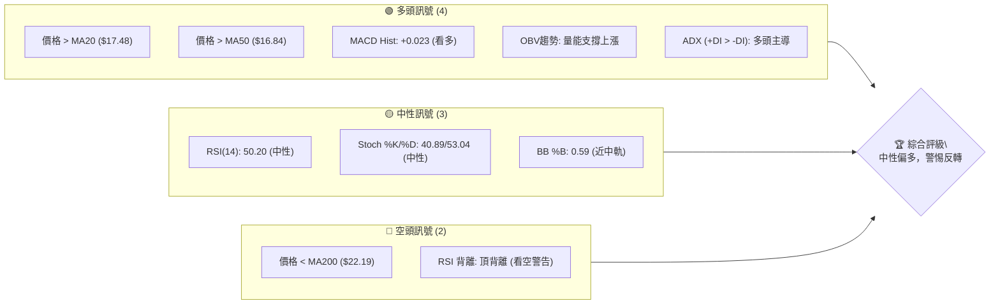

### 📊 核心指標速覽表

| 指標類別 | 指標名稱 | 當前數值 | 訊號 | 解讀 |
|----------|----------|----------|------|------|
| **價格** | 當前價格 | $17.73 | 🟡 | 位於52週區間15.8%，接近低點，但近期有所反彈 |
| **均線** | MA20 | $17.48 | 🟢 | 價格位於MA20上方，短期偏多 |
| **均線** | MA50 | $16.84 | 🟢 | 價格位於MA50上方，中期偏多 |
| **均線** | MA200 | $22.19 | 🔴 | 價格位於MA200下方，長期偏空 |
| **動能** | RSI(14) | 50.20 | 🟡 | 處於中性區間，但存在頂背離警告 |
| **動能** | MACD | 0.349 | 🟢 | MACD線位於訊號線上方，柱狀圖為正，短期動能偏多 |
| **波動** | ATR | $0.95 | 🟡 | 相對於價格而言，波動幅度適中 |
| **趨勢** | ADX(14) | 25.31 | 🟢 | 趨勢強度較強，且多頭主導 (+DI > -DI) |
| **量能** | OBV趨勢 | OBV > MA | 🟢 | 量能確認價格走勢，支撐上漲 |

### 🏆 技術評分卡

SOFI 的技術評分顯示，儘管在趨勢強度、支撐穩定性和成交量配合上表現良好，但動能指標和均線排列的複雜性，以及缺乏明確的圖表形態，使其綜合評分處於中性偏多的位置，需要謹慎對待。RSI頂背離是主要減分項。

╔════════════════════════════════════════════════════════════════════════════════╗
║                          技術評分卡 — SOFI (2026-07-08)                             ║
╠════════════════════════════════════════════════════════════════════════════════╣
║  趨勢強度      ████████░░░░░░░░░░░░  80/100  🟢 (ADX強趨勢，多頭主導)                 ║
║  動能指標      ██████░░░░░░░░░░░░░░  60/100  🟡 (MACD看多，RSI中性但有頂背離警告)   ║
║  支撐穩定度    ████████████░░░░░░░░  75/100  🟢 (接近多個關鍵支撐位，且52W低點紮實) ║
║  成交量配合    ████████░░░░░░░░░░░░  70/100  🟢 (成交量高於均值，OBV確認上漲)       ║
║  形態完整度    ████░░░░░░░░░░░░░░░░  40/100  🟡 (無明確強勢形態，區間震盪為主)      ║
║  均線排列      ██████░░░░░░░░░░░░░░  60/100  🟡 (短中期均線多頭，長期均線空頭)      ║
╠════════════════════════════════════════════════════════════════════════════════╣
║  綜合評分      ██████░░░░░░░░░░░░░░  64/100  ⚖️ 中性偏多，但需謹慎                    ║
╚════════════════════════════════════════════════════════════════════════════════╝

---

## 2. 趨勢分析

### 🌐 多時框趨勢分析

SOFI 的多時框趨勢呈現出明顯的層次性。長期趨勢受制於高位回落的壓力，而中短期則展現出一定的反彈動能和趨勢強度。ADX指標確認了目前存在一個明確的趨勢，且方向偏向多頭，但長期均線的壓制不容忽視。

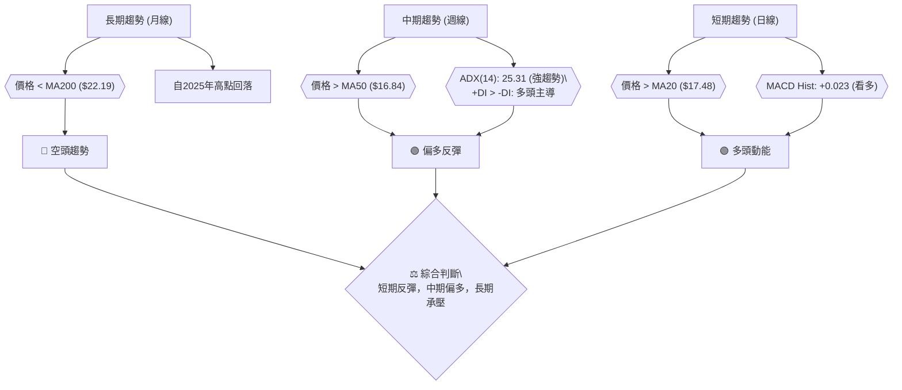

### 📈 長期趨勢 — 12個月走勢圖（Unicode）

SOFI 在過去12個月的走勢中，經歷了從2025年下半年高點的顯著回調，並在2026年初觸及低點後有所企穩。2025年11月的$29.72是過去12個月的月收盤價高點，而2026年3月的$15.88是同期月收盤價低點。當前價格$17.73位於這一區間的下半部分，顯示股價仍處於築底或盤整階段。

```
SOFI 月線走勢圖（過去12個月）
價格軸 ($)
$30 ┤                      ● (2025-11 高點 $29.72)
$25 ┤            ●    ●
$20 ┤          ●            ●  ●
$15 ┤    ●━━━━━━━━━━━━━━━━━━━━━━━━━━━━●←現在 ($17.73)
$10 ┤      ● (2026-03 低點 $15.88)
     └─────────────────────────────────────────────────────
      25-07 25-09 25-11 26-01 26-03 26-05 26-07 (月份)
```

**走勢特徵分析表格**：

| 時間段 | 起始價 | 結束價 | 漲跌幅 | 走勢特徵 | 訊號 |
|--------|--------|--------|--------|----------|------|
| 2025-07至2025-11 | $22.58 | $29.72 | +31.62% | 強勁上漲，創年內新高 | 🟢 |
| 2025-11至2026-03 | $29.72 | $15.88 | -46.50% | 深度回調，形成長期壓力 | 🔴 |
| 2026-03至2026-07 | $15.88 | $17.73 | +11.65% | 築底反彈，但動能有限 | 🟡 |

### 📊 中期趨勢（週線分析）

從中期（週線）來看，SOFI 在經歷了2026年3月底的低點$15.23後，股價出現反彈，並在2026年4月中旬觸及$19.43。隨後，股價進入了$15.XX至$19.XX的區間震盪。儘管近期價格再次回落至$17.73，但仍維持在MA50上方。週線級別的阻力位R1 $18.75和R2 $20.13是多頭需要克服的關鍵障礙。

```
SOFI 近期壓力與支撐示意圖 (週線)
              $19.43 (高點)
                 ●
                 │  ↘
    R1 $18.75 ─┼───────
                 │    ● (現價 $17.73)
                 │    │
    MA50 $16.84 ─┼────
                 │    │
    S1 $16.67 ─┼───────
                 │  ↗
              ●
              $15.23 (低點)
```

### ⚡ 趨勢強度評估（ADX 解讀）

ADX (Average Directional Index) 指標用於衡量趨勢的強度，而非方向。當前ADX(14)為25.31，高於25的閾值，這表明SOFI目前處於一個**強勢趨勢行情**中。同時，+DI (23.09) 高於 -DI (18.15)，這進一步確認了當前強勢趨勢的方向是**多頭主導**。

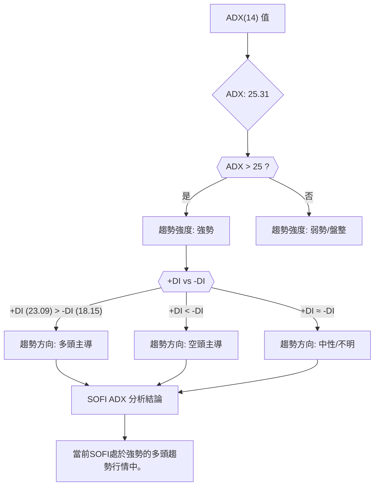

**ADX 強度對照表**：

| ADX 數值範圍 | 趨勢強度 | 市場狀態 |
|--------------|----------|----------|
| 0-20         | 弱勢     | 盤整/無趨勢 |
| 20-25        | 中等     | 趨勢形成中 |
| 25-50        | 強勢     | 明顯趨勢行情 |
| 50-75        | 非常強勢 | 趨勢加速中 |
| 75-100       | 極端強勢 | 趨勢可能過熱 |

SOFI 的ADX 25.31 落於「強勢」區間，表明當前市場存在明確的動能方向。

---

## 3. 圖表形態分析

### 🔍 形態識別系統

根據提供的數據，SOFI 目前未能識別出具備高信心度的經典圖表形態（如頭肩頂/底、雙頂/底、旗形等）。股價近期主要在一個相對較寬的區間內震盪整理，缺乏明確的突破或反轉結構。然而，RSI指標的頂背離訊號是值得關注的潛在反轉預警。

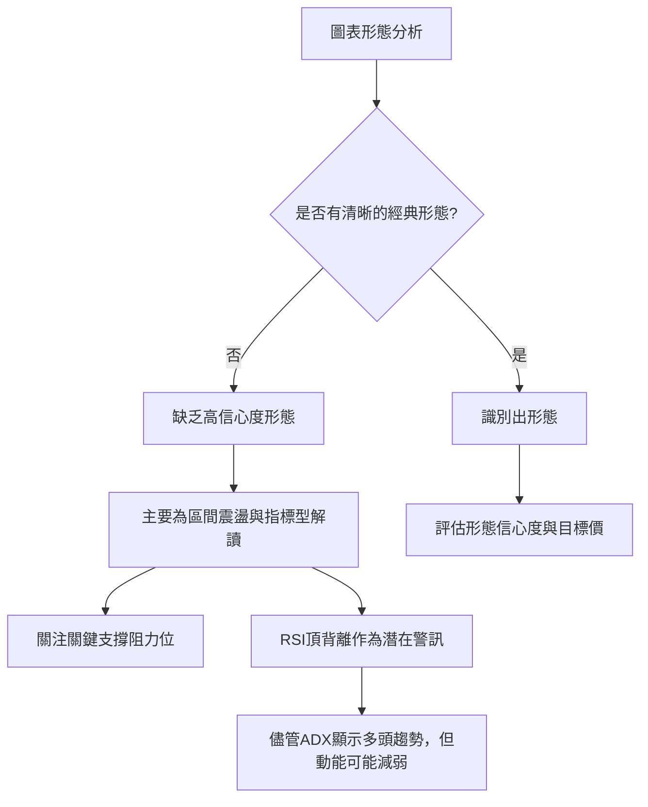

**形態信心度評估**：

| 形態 | 信心度 | 判斷依據（引用數據） | 完成度 | 目標價（附計算式） |
|------|--------|----------------------|--------|--------------------|
| 區間震盪 | 70% | 股價在$15.XX-$19.XX區間波動，近期低點$15.23，高點$19.43 | 90% | 無明確形態目標價，以區間上下沿為參考 |
| 潛在動能衰竭 (RSI頂背離) | 65% | 數據顯示存在RSI頂背離，價格上漲動能減弱，可能預示回調或盤整 | 60% | 無明確形態目標價，但預示可能向下測試支撐位S1 $16.67 |

由於數據中未明確偵測到具備高信心度的幾何形態，我們將主要依賴指標型解讀和關鍵價位分析。

### 🕯️ 重要K線形態分析

由於提供的週線數據僅包含收盤價，無法繪製完整的K線（需要開盤價、最高價、最低價），因此無法進行詳細的K線形態分析。然而，我們可以從週收盤價的變化中觀察一些趨勢：

| 日期 | 收盤價 | K線形態 (根據收盤價推斷) | 解讀 | 訊號 |
|------|--------|--------------------------|------|------|
| 2026-04-19 | $19.43 | 強勢上漲後的潛在頂部 | 股價在短時間內從$15.85迅速拉升，動能強勁 | 🟢 |
| 2026-04-26 | $18.44 | 陰線回調 | 上漲後的回調，多頭力量減弱 | 🟡 |
| 2026-05-03 | $16.43 | 帶量下跌 | 成交量放大，股價下跌，空頭力量增強 | 🔴 |
| 2026-05-17 | $15.61 | 止跌企穩 | 股價在低位區間震盪，可能形成階段性底部 | 🟢 |
| 2026-05-31 | $18.22 | 強勢反彈 | 股價從低位大幅反彈，多頭動能恢復 | 🟢 |
| 2026-07-05 | $18.24 | 再次受阻回落 | 股價再次測試高點附近，未能有效突破，隨後回落 | 🔴 |
| 2026-07-12 | $17.73 | 弱勢調整 | 股價延續上週跌勢，動能減弱 | 🟡 |

### 📉 ASCII 走勢形態示意圖

SOFI 近期走勢呈現出在 $15.XX 至 $19.XX 區間內的震盪整理，並在 $18.XX-$19.XX 附近面臨較強阻力。

```
SOFI 區間震盪示意圖
              R1 $18.75 ───────────┐
                                  ╱
$19.00 ┤              ● (近期高點 $19.43)
       ┤            ／  ╲
$18.00 ┤          ／      ● (現價 $17.73)
       ┤        ／          ╲
$17.00 ┤      ●              ╲
       ┤    ／                ╲
$16.00 ┤  ●─────────────────────── S1 $16.67
       ┤  (近期低點 $15.23)
$15.00 ┤
       └──────────────────────────────────
        時間軸
```

### 🎯 形態目標價計算

由於缺乏明確的經典圖表形態，無法進行基於形態高度的目標價計算。當前的分析將主要聚焦於關鍵支撐與阻力位。若股價能夠有效突破R1 $18.75，則有望測試更高的阻力位R2 $20.13；若跌破S1 $16.67，則可能下探S2 $15.58。

---

## 4. 支撐與阻力

### 🗺️ 關鍵價位分布圖（Unicode）

SOFI 的價格目前位於關鍵阻力位R1 $18.75和關鍵支撐位S1 $16.67之間。上方有較強的阻力區，下方則有多層支撐提供緩衝。

```
SOFI 價位結構分布圖
═══════════════════════════════════════════════════
$32.73 ║████████████████████████║ 52W 高點 (極強阻力)
$28.53 ║████████████████████    ║ 斐波那契 23.6%
$25.93 ║████████████████████████║ 斐波那契 38.2%
$23.82 ║████████████████████    ║ 斐波那契 50.0%
$22.74 ║████████████████████████║ 強阻力 R3
$21.72 ║████████████████████    ║ 斐波那契 61.8%
$20.13 ║████████████████████████║ 阻力 R2
$18.89 ║████████████████████    ║ 布林上軌
$18.75 ║████████████████████████║ 關鍵阻力 R1 (斐波那契 78.6% $18.73)
$17.73 ╠════════════════════════╣ ◄ 現價
$17.48 ║▓▓▓▓▓▓▓▓▓▓▓▓▓▓▓▓        ║ 布林中軌 (MA20)
$16.67 ║████████████████████████║ 近期支撐 S1
$16.07 ║▓▓▓▓▓▓▓▓▓▓▓▓▓▓▓▓        ║ 布林下軌
$15.58 ║████████████████████████║ 強支撐 S2
$14.93 ║████████████████████████║ 極強支撐 S3 (52W 低點 $14.92)
═══════════════════════════════════════════════════
```

### 🚧 阻力位分析表

阻力位代表股價上漲時可能面臨賣壓的價格區間。SOFI 目前面臨來自近期高點和斐波那契回調位的多重阻力。

| 阻力級別 | 價位 | 形成原因 | 突破難度 | 重要性 |
|----------|------|----------|----------|--------|
| R1 (關鍵) | $18.75 | 近期波段高點聚類，斐波那契78.6%回調位($18.73)與布林上軌($18.89)重合 | 中等偏高 | 突破此位意味著短期多頭動能轉強，有望測試更高點 |
| R2 (中期) | $20.13 | 近一年波段高點聚類，歷史交易密集區 | 較高 | 突破R2將確立中期反彈趨勢，但可能遭遇較大賣壓 |
| R3 (長期) | $22.74 | 近一年波段高點聚類，接近斐波那契61.8%回調位($21.72) | 高 | 突破此位將有效改變長期下跌趨勢，但需極大動能 |

### 🛡️ 支撐位分析表

支撐位代表股價下跌時可能獲得買盤支撐的價格區間。SOFI 目前下方擁有較為穩固的支撐體系。

| 支撐級別 | 價位 | 形成原因 | 守住機率 | 重要性 |
|----------|------|----------|----------|--------|
| S1 (近期) | $16.67 | 近期波段低點聚類，MA50 ($16.84)與布林下軌($16.07)附近 | 中等偏高 | 守住S1可維持短期多頭格局，跌破則可能轉弱 |
| S2 (中期) | $15.58 | 近一年波段低點聚類，歷史交易密集區 | 較高 | 跌破S1後的重要防線，守住可避免進一步下跌 |
| S3 (強勢) | $14.93 | 52週最低點($14.92)附近，極強心理與技術支撐 | 極高 | 若跌破此位，將引發市場恐慌，技術面將極度惡化 |

### 📐 斐波那契回調位分析

SOFI 的52週區間為 $14.92 (低點) 至 $32.73 (高點)。當前價格 $17.73 位於斐波那契回調位的78.6% ($18.73) 和100% ($14.92) 之間，更靠近100%回調位。

*   **0.0% (52W High)**: $32.73
*   **23.6%**: $28.53
*   **38.2%**: $25.93
*   **50.0%**: $23.82
*   **61.8%**: $21.72
*   **78.6%**: $18.73
*   **100.0% (52W Low)**: $14.92

當前價格 $17.73 位於 $18.73 (78.6%回調位) 之下，但高於 $14.92 (100%回調位，即52週低點)。這表明SOFI在經歷了從52週高點的大幅回調後，大部分漲幅已被回吐。股價目前處於深度回調區域，並試圖在接近歷史低點的區域尋找支撐。78.6%回調位 $18.73 與R1 $18.75高度重合，構成了一個非常關鍵的阻力區。若能有效站上此位，則有望開啟更強勁的反彈，向上測試61.8%回調位 $21.72；若持續受阻，則可能再次下探52週低點 $14.92。

---

## 5. 技術指標深度解讀

### 🎛️ 指標訊號總覽

SOFI 的技術指標呈現出多空交織的複雜訊號。短中期均線和量能指標偏多，顯示有反彈動能；然而，長期均線的壓制和RSI的頂背離則發出警示。ADX確認了當前趨勢的強度，且方向由多頭主導。

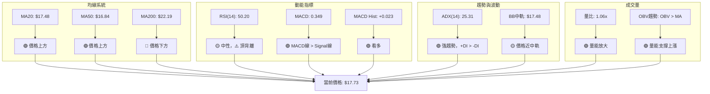

### 📈 移動平均線排列分析

SOFI 的移動平均線排列呈現出**混合訊號**，反映了短中期與長期趨勢的衝突。

*   **短期趨勢 (MA5/MA10/MA20)**：
    *   MA20 ($17.48) 位於當前價格 $17.73 之下，顯示短期有支撐。
    *   MA50 ($16.84) 也位於當前價格 $17.73 之下，且 MA20 位於 MA50 之上，形成**短期黃金交叉**，這是一個偏多的訊號。
*   **長期趨勢 (MA200)**：
    *   MA200 ($22.19) 遠高於當前價格 $17.73，這表示股價仍處於長期下跌趨勢中，或至少面臨強大的長期阻力。
    *   MA50 位於 MA200 之下，形成**長期死亡交叉**，這是一個偏空的訊號。

**均線排列總結**：
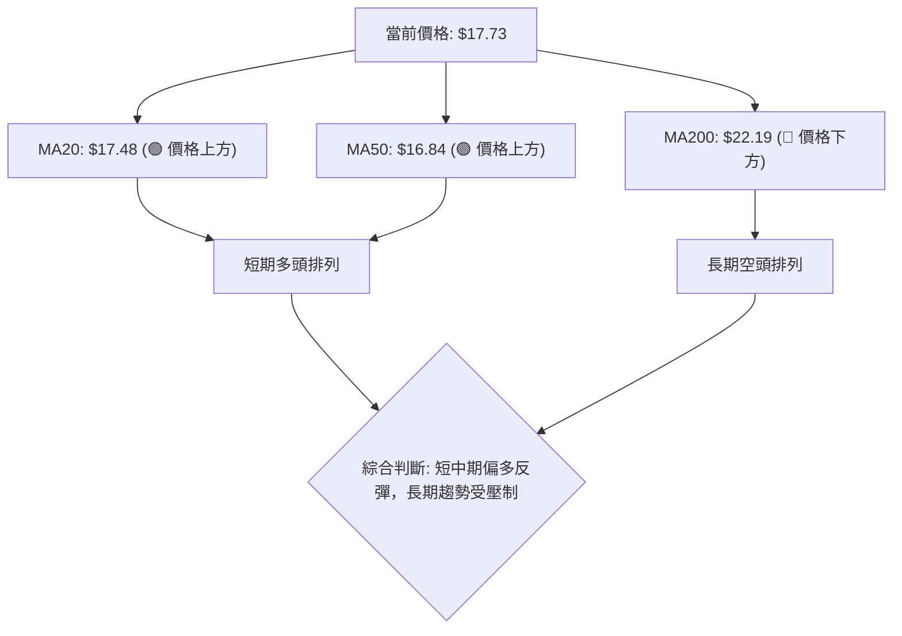
目前的均線排列顯示短中期多頭動能佔優，但長期趨勢仍受制於MA200的壓制。這暗示了股價可能在短期內繼續反彈，但一旦接近MA200或更遠的阻力位，將面臨較大的賣壓。

### 📉 RSI(14) 分析

*   **RSI 數值**：當前RSI(14)為 **50.20**。這表示SOFI的股價動能處於**中性區間** (30-70之間)，既非超買也非超賣。
    RSI 強度: ██████████░░░░░░░░░░ 50.2%
*   **超買超賣區間分析**：由於RSI處於中性區間，目前沒有立即的超買或超賣訊號。這意味著股價有足夠的空間向上或向下波動，而不會立即觸發反轉訊號。
*   **RSI 背離判斷**：數據中明確指出存在 **⚠️ 頂背離 (Bearish Divergence)**。
    頂背離發生時，通常表現為：股價創出更高的高點，但RSI指標卻未能同步創出更高的高點，反而出現下降趨勢。這是一個重要的**看空警告訊號**，表明儘管價格表面上仍在上升，但其內在的動能已經開始衰竭，未來可能面臨回調或下跌。
    **RSI頂背離的重要性**：
    1.  **動能減弱**：RSI未能跟隨價格創新高，說明買盤力量正在減弱。
    2.  **潛在反轉**：雖然不一定立即導致趨勢反轉，但通常是股價見頂或進入盤整的前兆。
    3.  **確認阻力**：當股價接近阻力位並出現RSI頂背離時，阻力作用將被強化。
    **結論**：RSI的頂背離訊號與當前價格接近R1阻力位($18.75)的情況相符，提示投資者應對潛在的回調風險保持警惕，儘管短期內價格可能仍有上漲動能。

### 📊 MACD(12/26/9) 訊號解讀

MACD指標當前顯示出**多頭動能**，與RSI的頂背離形成對比，需要綜合考量。

*   **MACD線 (0.349) 與訊號線 (0.326)**：MACD線位於訊號線上方，這是**金叉**形態，表示短期動能強於中期動能，為**看多訊號**。
*   **MACD柱狀圖 (+0.023)**：柱狀圖為正值，並在零軸上方，這也確認了當前多頭動能的存在。柱狀圖的微幅增長，顯示多頭力量仍在積蓄。
    MACD 柱狀圖強度: █████████████████░░░ 85% (正值)

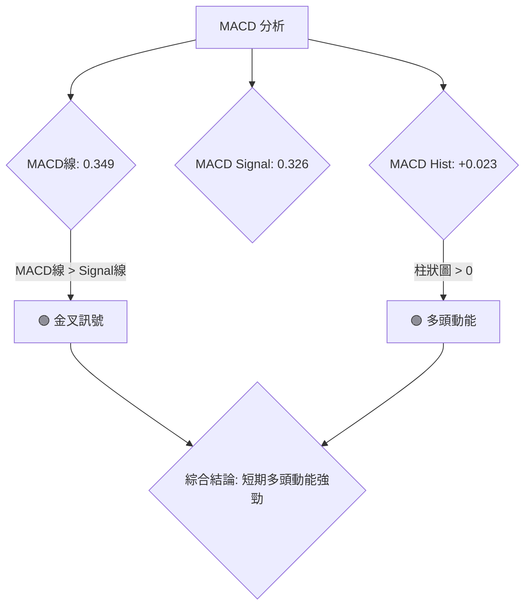
**MACD與RSI的矛盾**：MACD顯示短期多頭動能，而RSI的頂背離則預警動能衰竭。這種矛盾可能表明：
1.  **短期沖高回落**：股價可能在MACD推動下短暫衝高，但RSI背離會限制其上漲空間，隨後可能回調。
2.  **動能轉換**：MACD可能反映了最近的反彈，而RSI背離則預示了這一波反彈的疲態，提示潛在的趨勢轉換。
在這種情況下，應更加關注價格行為是否能有效突破阻力位，並留意RSI背離是否導致價格下跌。

### 📦 布林通道分析

布林通道能有效衡量股價的波動範圍和相對位置。

*   **布林上軌**: $18.89
*   **布林中軌 (MA20)**: $17.48
*   **布林下軌**: $16.07
*   **當前價格**: $17.73
*   **BB %B**: 0.59 (0=下軌, 0.5=中軌, 1=上軌)

當前價格 $17.73 位於布林中軌 $17.48 之上，且接近布林上軌 $18.89。BB %B 0.59 顯示股價略微偏向上軌，表明短期內多頭佔據優勢。

```
SOFI 布林通道示意圖
═══════════════════════════════════════════════════
$18.89 ║████████████████████████║ ← 布林上軌 (R1 $18.75 附近)
       ║                        ║
       ║                        ║
$17.73 ║        ● (現價)        ║
       ║                        ║
$17.48 ║████████████████████████║ ← 布林中軌 (MA20)
       ║                        ║
       ║                        ║
$16.07 ║████████████████████████║ ← 布林下軌 (S1 $16.67 附近)
═══════════════════════════════════════════════════
```
**解讀**：
1.  **短期偏多**：價格在中軌上方運行，顯示短期多頭動能佔優。
2.  **上行壓力**：布林上軌 $18.89 構成短期阻力，且與R1 $18.75重合，若能突破此區間，有望開啟更強勢的漲勢。
3.  **支撐作用**：布林中軌 $17.48 作為短期支撐，若價格回調，此位將提供買盤支撐。布林下軌 $16.07 則為更強的防線，與S1 $16.67接近。
4.  **布林帶寬**：數據未提供布林帶寬，但從軌道價差來看，波動性適中。若帶寬開始收窄，可能預示盤整；若擴張，則可能預示趨勢啟動。

### 💹 成交量分析（量價配合度）

成交量是確認價格走勢的重要指標。SOFI 的成交量數據呈現以下特點：

*   **最新成交量**: 89,981,092 股
*   **20日均量**: 84,864,590 股
*   **量比 (最新成交量/20日均量)**: 1.06x
*   **50日均量**: 78,213,166 股
*   **OBV趨勢**: OBV > MA → 量能支撐上漲

**解讀**：
1.  **活躍度高**：最新成交量高於20日和50日均量，量比1.06x表明近期交易活躍度有所提升。這通常是一個積極訊號，顯示市場對SOFI的關注度增加。
2.  **量價配合**：OBV (On Balance Volume) 指標的趨勢顯示 OBV > MA，這是一個**看多訊號**。OBV的上升表明在價格上漲時成交量放大，在價格下跌時成交量縮小（或上漲時累積的量能大於下跌時消耗的量能），這證明了當前的價格上漲是得到量能支撐的，而非無量空漲。
3.  **潛在動能**：健康的量價配合為股價的進一步上漲提供了基礎，顯示市場買盤力量較為積極。

**結論**：成交量和OBV指標均發出積極訊號，支持SOFI的短期上漲動能。這與MACD的看多訊號相符，但需警惕RSI頂背離可能帶來的潛在賣壓。

---

## 6. 動能與波動率

### ⚡ 動能評估四象限

SOFI目前的動能評估呈現出中等偏強的動能和較高的波動性。儘管ADX和MACD顯示多頭動能，但RSI的頂背離預示動能可能減弱，而高Beta值則確認了其市場敏感性。

| 象限 | 動能 | 波動 | 當前狀態 | 評估 |
|------|------|------|----------|------|
| Q1   | 強   | 低   | -        | 最佳機會 (目前不符合) |
| Q2   | 弱   | 低   | -        | 謹慎觀望 (目前不符合) |
| Q3   | 強   | 高   | ✓        | **高風險高收益，需謹慎管理** |
| Q4   | 弱   | 高   | -        | 避免進場 (目前不符合) |

**SOFI 動能與波動率分析流程**：
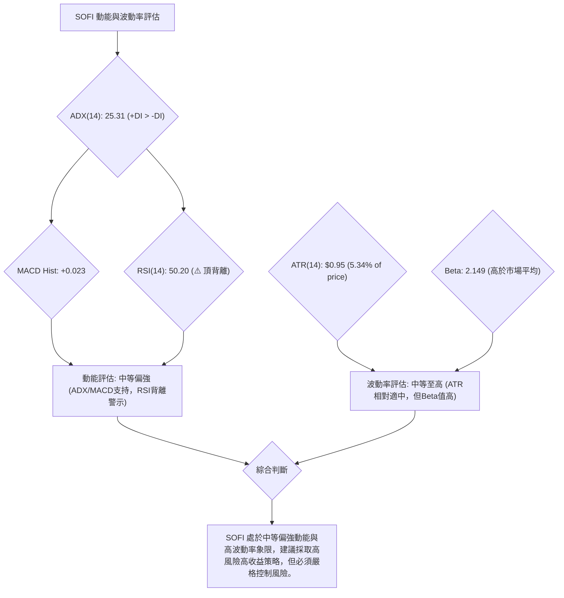
**結論**：SOFI 具備一定的上漲動能，但伴隨著較高的波動風險。投資者在追求收益的同時，必須高度重視止損和倉位管理。

### 📊 ATR 波動率分析

ATR (Average True Range) 用於衡量資產價格的波動幅度，反映市場的活躍程度。

*   **ATR(14)**: $0.95
*   **佔股價比例**: 5.34% ($0.95 / $17.73)

**解讀**：
1.  **波動性適中**：$0.95 的ATR表明SOFI在過去14天內平均每日波動範圍為$0.95。5.34%的比例屬於中等波動水平，意味著每日價格變化相對明顯，但尚未達到極端波動的程度。
2.  **止損距離建議**：ATR是設定止損點的實用工具。通常建議將止損點設置在當前價格下方1.5倍至2倍ATR的距離。
    *   1.5 x ATR = 1.5 x $0.95 = $1.425
    *   2.0 x ATR = 2.0 x $0.95 = $1.90
    因此，若以當前價格 $17.73 計算：
    *   建議止損位約為 $17.73 - $1.425 = **$16.305** (接近S1 $16.67，但略低於布林下軌 $16.07)
    *   更保守的止損位約為 $17.73 - $1.90 = **$15.83** (接近S2 $15.58)
    這些數值可作為動態止損的參考，具體應結合關鍵支撐位來確定。

### 📐 Beta 與市場相關性

Beta 值衡量單一股票相對於整個市場（通常是大盤指數如S&P 500）的波動性。

*   **Beta**: 2.149

**解讀**：
1.  **高市場敏感度**：SOFI 的Beta值高達2.149，遠高於市場平均值1。這意味著SOFI的股價波動幅度約是市場的2.149倍。當大盤上漲1%時，SOFI理論上可能上漲2.149%；當大盤下跌1%時，SOFI理論上可能下跌2.149%。
2.  **高風險高收益潛力**：高Beta股票通常伴隨著更高的風險和更高的潛在收益。對於風險承受能力較高的投資者，SOFI可能提供更大的回報機會；但對於風險厭惡型投資者，其波動性可能過高。
3.  **大盤影響**：SOFI的走勢將高度受大盤情緒的影響。在牛市中，它可能表現優於大盤；在熊市中，它也可能加速下跌。因此，投資SOFI時，必須密切關注整體市場趨勢。

---

## 7. 多時框架總結

### 📋 時框架評分表

SOFI 的多時框架分析顯示，短中期趨勢偏多，但長期趨勢仍處於壓力之下，且動能指標存在分歧。

| 時框架 | 趨勢方向 | 動能 | 均線排列 | 形態 | 綜合評分 (1-10) | 建議 |
|--------|----------|------|----------|------|-----------------|------|
| **日線** | 🟢 多頭 | 🟢 偏強 | 🟢 價格>MA20/50 | 🟡 區間震盪 | 7.0             | 謹慎看多 |
| **週線** | 🟡 偏多 | 🟡 中性 | 🟡 價格>MA50但<MA120 | 🟡 區間震盪 | 6.5             | 區間操作 |
| **月線** | 🔴 空頭 | 🔴 偏弱 | 🔴 價格<MA200 | 🟡 震盪築底 | 4.0             | 觀望/謹慎 |

### 🔲 綜合訊號矩陣

SOFI 的綜合訊號矩陣顯示，短中期訊號趨於一致，呈現中性偏多，但長期訊號仍為空頭，且部分動能指標存在矛盾。

| 指標/時框 | 短期 (日線) | 中期 (週線) | 長期 (月線) | 訊號一致性 |
|-----------|-------------|-------------|-------------|------------|
| **趨勢方向** | 🟢 上漲      | 🟡 反彈      | 🔴 下跌      | 較低       |
| **動能指標** | 🟢 MACD看多  | 🟡 RSI中性   | 🔴 RSI頂背離 | 較低       |
| **均線排列** | 🟢 多頭排列  | 🟡 混合排列  | 🔴 空頭排列  | 較低       |
| **成交量** | 🟢 積極     | 🟢 積極     | 🟢 積極     | 高         |
| **支撐阻力** | 🟡 接近阻力  | 🟡 接近阻力  | 🔴 接近低點  | 中等       |
| **ADX趨勢** | 🟢 強勢多頭  | 🟢 強勢多頭  | 🟢 強勢多頭  | 高         |

### ⚖️ 多時框收斂結論

根據「嚴格要求 14」的多時框收斂規則：
1.  **ADX(14)為25.31**，高於25，明確指示SOFI目前處於一個**強勢趨勢行情**中。
2.  **+DI (23.09) 高於 -DI (18.15)**，表明當前強勢趨勢的方向是**多頭主導**。
3.  在趨勢行情中，應**以中長期（週線/MA50、MA200）方向為主**，日線只用來尋找進場時機。
    *   **週線**：價格 $17.73 高於 MA50 $16.84 (偏多)，但低於 MA120 $18.40 (偏空)。ADX確認多頭趨勢。
    *   **月線**：價格 $17.73 遠低於 MA200 $22.19 (長期空頭)。
    *   **日線**：價格 $17.73 高於 MA20 $17.48 和 MA50 $16.84 (短期多頭)。

**最終收斂結論**：
SOFI 當前處於一個**強勢多頭趨勢行情**中（由ADX確認）。儘管長期來看（MA200）仍受壓制，且RSI出現頂背離的警示訊號，但中短期（週線MA50、日線MA20/50、MACD、OBV）均顯示多頭動能佔優。因此，**主導時框為中短期，方向性結論為「中性偏多，但需高度警惕長期阻力與動能衰竭風險」**。日線級別的策略將主要用於捕捉反彈或突破機會，並嚴格設置止損以應對潛在的回調。

---

## 8. 交易策略建議

### 🗺️ 策略決策流程圖

SOFI 的策略決策將基於其「中性偏多」的綜合評級，並充分考慮多空交織的訊號。

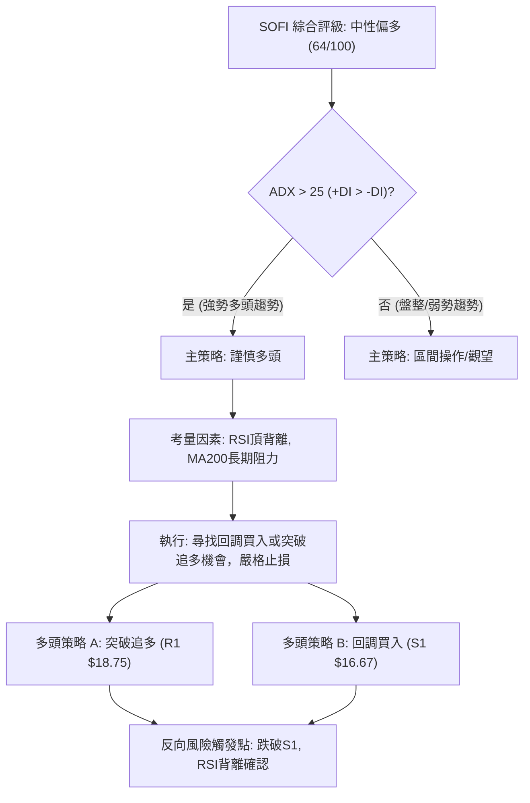

### 🧭 策略路由（依評分卡分流，不得兩頭下注）

**當前主策略方向 = 中性偏多（依評分 64/100）**

根據綜合評分卡64/100，SOFI 處於中性偏多區間。結合ADX判斷為強勢多頭趨勢，我們將**主推多頭策略**，但鑒於RSI頂背離和MA200的長期壓制，風險管理將是重中之重。空頭策略僅作為反轉風險觸發點和對沖提示。

### 🎯 價格情境階梯（Price Scenarios）

以當前價格 $17.73 為基準，建立向上與向下的情境劇本。

| 觸發條件 | 下一目標 | 後續延伸 | 情境含義 |
|----------|----------|----------|----------|
| **突破 R1 $18.75** | R2 $20.13 | R3 $22.74 | 短線轉強，多頭動能增強，有望挑戰MA200 |
| **站穩現價區間 ($16.67-$18.75)** | — | — | 股價進入盤整，等待明確方向，區間操作為主 |
| **跌破 S1 $16.67** | S2 $15.58 | S3 $14.93 | 中期轉弱，可能測試52週低點，需嚴格止損 |

### 📊 情境機率分佈

基於當前技術指標的綜合分析，我們對未來情境的機率分佈進行估計：

| 情境 | 機率 | 主要依據 |
|------|------|----------|
| 繼續上行 / 反彈 | 40% | MACD金叉、OBV上漲、ADX強趨勢且多頭主導、價格在MA20/50上方 |
| 區間震盪 | 40% | RSI中性、Stoch中性、價格位於布林中軌上方但接近R1阻力，長期MA200壓制 |
| 回落 / 再探底 | 20% | RSI頂背離警告、MA200長期空頭壓制、歷史高點回調壓力 |
*總計: 100%*

### 🟢 主策略詳情（方向依上方路由）

鑑於中性偏多的綜合判斷，我們提供兩種多頭策略，以應對不同市場情境：

| 策略要素 | 策略 A：突破追多 (突破R1) | 策略 B：回調買入 (S1支撐) |
|----------|--------------------------|--------------------------|
| 進場條件 | 股價帶量突破R1並站穩 | 股價回調至S1附近，出現止跌訊號 |
| 進場價格 | $18.80 (略高於R1 $18.75) | $16.70 (略高於S1 $16.67) |
| 目標價 T1 | $20.13 (R2) | $17.73 (現價，作為短線目標) |
| 目標價 T2 | $22.74 (R3) | $18.75 (R1) |
| 止損價格 | $17.70 (跌破現價區間/MA20) | $15.50 (跌破S2 $15.58) |
| 風險報酬比 | 策略A-T1: (20.13-18.80)/(18.80-17.70) = **1.21:1** <br> 策略A-T2: (22.74-18.80)/(18.80-17.70) = **3.58:1** | 策略B-T1: (17.73-16.70)/(16.70-15.50) = **0.86:1** <br> 策略B-T2: (18.75-16.70)/(16.70-15.50) = **1.70:1** |
| 成功機率 | 55% (需強勁買盤確認) | 60% (若S1能有效支撐) |
| 建議倉位 | 5-10% (高波動，嚴控倉位) | 5-10% (高波動，嚴控倉位) |

### 🔴 反向風險觸發點（對沖提示）

以下關鍵點位和訊號一旦觸發，將推翻當前主策略，建議考慮減倉、離場或對沖：

1.  **價格跌破S1 $16.67**：若SOFI價格收盤於S1下方，表明短期支撐失效，可能加速下跌至S2 $15.58。
2.  **RSI頂背離確認並導致價格加速下跌**：若RSI頂背離最終導致價格突破關鍵支撐，則賣壓可能迅速增加。
3.  **MACD死叉**：若MACD線下穿訊號線，柱狀圖轉負，表示短期多頭動能已經耗盡，轉為空頭。
4.  **成交量持續萎縮或放量下跌**：若上漲時成交量未能持續放大，或下跌時出現巨量，均為不利訊號。

### ⭐ 整體訊號強度評星

做多訊號強度：★★★☆☆ (3/5星)
做空訊號強度：★★☆☆☆ (2/5星)
整體可信度：  ★★★☆☆ (3/5星)

**評星理由**：做多訊號得到短中期均線、MACD、OBV及ADX趨勢的支撐，但RSI頂背離和MA200長期壓制限制了其強度。做空訊號主要來自RSI頂背離和長期趨勢，但尚未形成明確的空頭形態或指標交叉。整體可信度中等，因多空因素交織，需要密切關注市場動態和價格行為。

---

## 9. 風險提示與監控

### ✅ 關鍵監控指標 Checklist

為了有效管理SOFI的投資風險，建議密切監控以下關鍵指標：

╔════════════════════════════════════════════════════════════════════════════════════════════════╗
║                                      SOFI 關鍵監控指標 Checklist                                   ║
╠════════════════════════════════════════════════════════════════════════════════════════════════╣
║  [ ] 價格是否守穩 S1 $16.67？                                                                   ║
║  [ ] 價格是否有效突破 R1 $18.75？                                                               ║
║  [ ] RSI 頂背離是否導致價格反轉或加速下跌？                                                       ║
║  [ ] MACD 是否出現死叉訊號？                                                                    ║
║  [ ] 成交量是否持續放大以支撐上漲動能？                                                           ║
║  [ ] ADX 是否維持強勢趨勢，且 +DI 仍高於 -DI？                                                   ║
║  [ ] 價格與布林中軌 $17.48 的相對位置？                                                         ║
║  [ ] 整體市場情緒 (S&P 500 等大盤指數) 是否穩定？                                                 ║
║  [ ] 公司基本面是否有重大變動 (如財報、新聞等)？                                                  ║
╚════════════════════════════════════════════════════════════════════════════════════════════════╝

### ⚠️ 風險場景分析

SOFI 的高Beta值和當前複雜的技術訊號，使其面臨多種潛在情境。

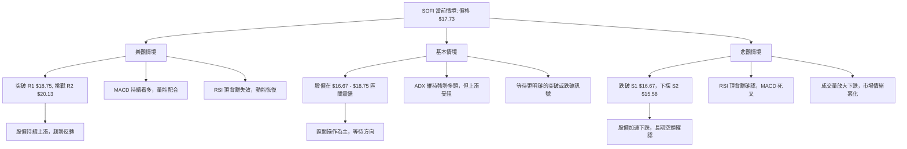

### 🛡️ 風險管理重要提醒

1.  **嚴格止損**：鑑於SOFI的高波動性和RSI頂背離的警告，必須嚴格設置並執行止損點。一旦達到預設止損位，應果斷離場，避免虧損擴大。
2.  **倉位控制**：高Beta股票不適合重倉操作。建議根據個人風險承受能力，將SOFI的倉位控制在總投資組合的較低比例（例如5-10%）。
3.  **分批建倉/減倉**：避免一次性滿倉進出。在突破阻力或回調支撐時，可分批建倉；達到目標價或出現不利訊號時，分批減倉，鎖定利潤或控制風險。
4.  **關注大盤**：SOFI與大盤高度相關。在大盤不確定或走弱時，應更加謹慎。
5.  **不盲目追高**：儘管MACD和ADX顯示多頭動能，但RSI頂背離是重要的警示。避免在股價快速拉升至阻力位時盲目追高。
6.  **定期檢視**：市場情況瞬息萬變，應定期（每日或每週）檢視SOFI的技術指標和價格行為，根據最新數據調整策略。

---

## 📋 報告總結

```
SOFI 技術分析報告總結
════════════════════════════════════════════════════════════════════════════════
報告日期：2026-07-08
當前價格：$17.73
分析評級：⚖️ 中性偏多，但需謹慎 (綜合評分 64/100)

關鍵結論：
├─ 長期趨勢：🔴 空頭 (價格 < MA200 $22.19)
├─ 中期趨勢：🟢 偏多 (ADX強趨勢多頭，價格 > MA50 $16.84)
├─ 短期趨勢：🟢 多頭 (價格 > MA20 $17.48，MACD金叉，OBV上漲)
├─ 關鍵支撐：S1 $16.67，S2 $15.58，S3 (52W低點) $14.93
├─ 關鍵阻力：R1 $18.75 (與斐波那契78.6% $18.73重合)，R2 $20.13，R3 $22.74
└─ 分析師目標：$20.90 (均值)

最優策略組合：
1. 🥇 最佳機會 (突破追多)：若SOFI能帶量突破 R1 $18.75，則可考慮在 $18.80 進場，目標價 T1 $20.13，T2 $22.74，止損 $17.70。
2. 🥈 次選機會 (回調買入)：若SOFI回調至 S1 $16.67 附近並止跌，可考慮在 $16.70 進場，目標價 T1 $17.73，T2 $18.75，止損 $15.50。
3. 🥉 保守選擇 (區間操作/觀望)：在 $16.67 至 $18.75 區間內進行高拋低吸，或等待更明確的突破/跌破訊號後再行動。
════════════════════════════════════════════════════════════════════════════════
```

---

> ⚠️ **免責聲明**：本報告為 AI 自動生成之技術分析，所有數據及估算均基於提供的歷史價格資訊。本報告**僅供研究與學術參考**，**不構成任何投資建議**。投資有風險，入市需謹慎。

---

*報告生成時間：2026-07-08 ｜ 數據來源：Yahoo Finance ｜ 分析框架：多時框技術分析*