<details>
<summary>📊 靜態圖表 (點擊展開)</summary>
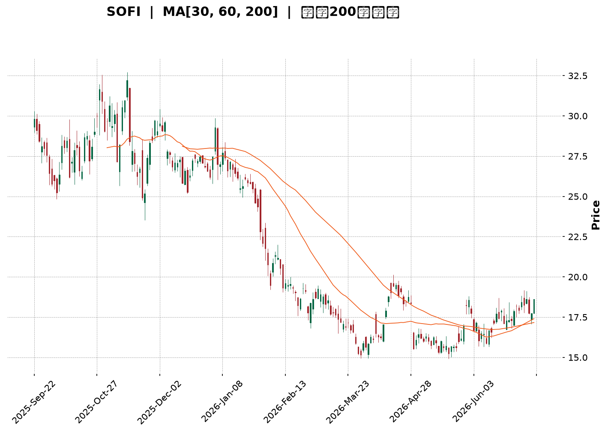
</details>

<html>
<head><meta charset="utf-8" /></head>
<body>
    <div style="height:500px; width:100%;">                        <script>window.PlotlyConfig = {MathJaxConfig: 'local'};</script>
        <script charset="utf-8" src="https://cdn.plot.ly/plotly-3.7.0.min.js" integrity="sha256-jvTGqxNp8AGWEcvNLVuKr+8j5dGe9Yw51LQkmDH+IYA=" crossorigin="anonymous"></script>                <div id="candlestick-chart" class="plotly-graph-div" style="height:100%; width:100%;"></div>            <script>                window.PLOTLYENV=window.PLOTLYENV || {};                                if (document.getElementById("candlestick-chart")) {                    Plotly.newPlot(                        "candlestick-chart",                        [{"close":{"dtype":"f8","bdata":"AAAAIFzPPUAAAABAChc9QAAAAOCjcDxAAAAAYLgePEAAAABA4fo7QAAAAMDMjDtAAAAAIIVrOkAAAABgj8I5QAAAAOBR+DlAAAAAoHA9OUAAAAAAKVw6QAAAAADXIzxAAAAAwB4FPEAAAABAM3M8QAAAAOCjMDpAAAAAANcjO0AAAABguN47QAAAACCuBzxAAAAAoJmZOkAAAACAPYo6QAAAAIAUrjxAAAAAAADAPEAAAADgozA7QAAAAOB6FDxAAAAAYI8CPUAAAAAAAAA+QAAAAMD1qD9AAAAAYGbmPkAAAAAgrgc9QAAAAIAUrj1AAAAAoEehPkAAAABguF49QAAAAIDrET5AAAAAwPUoO0AAAACAwjU8QAAAAIA9ij5AAAAAQDPzPkAAAABA4RpAQAAAAADXYzxAAAAAgOvRO0AAAACAPQo7QAAAAKBwPTpAAAAA4FG4OkAAAADA9eg4QAAAAOCjMDlAAAAAYGZmO0AAAADgelQ8QAAAAKBwfTxAAAAA4FG4PUAAAAAgrgc9QAAAAGCPgj1AAAAAgOsRPUAAAACgmZk9QAAAACCuxztAAAAAACmcO0AAAADgetQ6QAAAAEAKFztAAAAAgOsRO0AAAAAgrkc7QAAAAIDr0TlAAAAA4HqUOkAAAADAHkU5QAAAAIA9SjpAAAAAoHA9O0AAAACgmVk7QAAAAOCjMDtAAAAAQOF6O0AAAACA6xE7QAAAAIDr0TpAAAAAIFyPOkAAAACAFC46QAAAAIDCdTtAAAAAIK5HPUAAAABA4fo6QAAAAAAAADtAAAAA4FG4O0AAAABgZmY7QAAAAKCZmTpAAAAAANcjO0AAAAAghas6QAAAAOCjcDpAAAAAoEchOkAAAACgcH05QAAAAADXozlAAAAAQAoXOkAAAACgmdk5QAAAAMDMzDlAAAAAgMJ1OUAAAACgmZk4QAAAAAApXDhAAAAAIFzPNkAAAADgehQ2QAAAAGCPwjVAAAAAAADANEAAAACAwnUzQAAAAAAp3DRAAAAAoJlZNUAAAACAFC41QAAAAMDMjDRAAAAAwMxMM0AAAAAAKZwzQAAAAGCPgjNAAAAAgD2KM0AAAADAzEwzQAAAAMAeBTNAAAAA4FE4MkAAAADA9agyQAAAAIA9SjNAAAAAoJkZM0AAAABgj8IxQAAAAADXYzJAAAAAACmcMkAAAABAM7MyQAAAAAAAQDNAAAAAYGbmMkAAAACAPcoyQAAAAIA9SjJAAAAAIK6HMkAAAABAM7MxQAAAAGCPwjFAAAAAoEehMUAAAABguF4xQAAAAIAULjFAAAAA4HoUMUAAAABgZuYwQAAAAGBmJjFAAAAAQDOzMEAAAAAgXI8wQAAAAKBwvS9AAAAAgMJ1LkAAAADAzEwuQAAAAGCPwi9AAAAAYI9CL0AAAABAM7MvQAAAAMAeRTBAAAAAACkcMEAAAACgcH0wQAAAAMAeRTBAAAAA4FE4MEAAAADAzAwxQAAAAMD16DFAAAAAgD3KMkAAAAAgrgczQAAAAIAUbjNAAAAAAACAM0AAAADgetQyQAAAACBcDzNAAAAAgOtRMkAAAADgo3AyQAAAAGCPwjJAAAAAAClcMkAAAADAzAwvQAAAAKCZGTBAAAAAgBRuMEAAAABAMzMwQAAAAMAeBTBAAAAAwMxMMEAAAAAAAAAwQAAAAAAAgC9AAAAAYI9CMEAAAADAzMwvQAAAAGC4ni5AAAAAwB4FMEAAAADgUTgvQAAAACCFay9AAAAAgMJ1LkAAAACgR2EvQAAAAMDMTC9AAAAAoHA9L0AAAACAwvUvQAAAACCFKzBAAAAA4FH4MEAAAADgUTgyQAAAAOB6lDJAAAAAoHC9MUAAAACAFK4wQAAAAGBmJjFAAAAAIK4HMEAAAAAAAIAwQAAAAOBReDBAAAAAoHC9L0AAAAAghaswQAAAAOB6lDBAAAAAoEchMUAAAACAwrUxQAAAACCFazFAAAAAwPXoMUAAAACgmRkxQAAAAIA9SjFAAAAAIFxPMUAAAADAzEwxQAAAAKBH4TFAAAAA4KMwMkAAAACAFO4xQAAAAOCjcDJAAAAAoHA9MkAAAAAAKZwyQAAAAAAAwDFAAAAAQOG6MUAAAABguJ4yQA=="},"high":{"dtype":"f8","bdata":"AAAAwMxMPkAAAAAA1yM+QAAAACCFqz1AAAAAIIWrPEAAAABA4Xo8QAAAAKBHoTxAAAAAACmcO0AAAADgelQ7QAAAAKCZWTpAAAAAgBQuOkAAAAAA1yM7QAAAAEAK1zxAAAAAgMK1PEAAAADgo7A8QAAAAMDMzD1AAAAAgBRuO0AAAACgmVk8QAAAAEAKFz1AAAAA4KNwPEAAAAAghes6QAAAAIAU7jxAAAAAgOsRPUAAAADAzMw8QAAAAOBRmDxAAAAAYLjePUAAAABAMzM+QAAAAEDh+j9AAAAA4FFIQEAAAACAPeo+QAAAAAAp3D1AAAAA4FE4P0AAAACAPco+QAAAAGC4Xj5AAAAAYOfbPkAAAACgcD08QAAAAOBR+D5AAAAAoHD9PkAAAACgcF1AQAAAAAAAwD9AAAAAgOsRPUAAAABAM\u002fM7QAAAAAAAADtAAAAAoJnZOkAAAABAM5M8QAAAAIDrcTlAAAAAACmcO0AAAABAM3M8QAAAAAAAQD1AAAAAAADAPUAAAABAM7M9QAAAACCFaz5AAAAAgBTuPUAAAABAM7M9QAAAAIAU7jtAAAAA4HrUO0AAAABAM3M7QAAAAIAUrjtAAAAAIK5HO0AAAAAAAIA7QAAAAEDhejtAAAAAoHC9OkAAAACAwtU6QAAAAEAKtzpAAAAAYLheO0AAAABguJ47QAAAAEAKVztAAAAAgD2KO0AAAADAzIw7QAAAAMD1aDtAAAAAANcjO0AAAABgZuY6QAAAAKBHgTtAAAAAACncPUAAAADAzEw9QAAAAIAULjtAAAAAgBQOPEAAAAAAAGA8QAAAAGDlUDtAAAAAQDMzO0AAAACAwhU7QAAAAOB6VDtAAAAAIK7HOkAAAABAClc6QAAAAMDMDDpAAAAAANdjOkAAAACgRyE6QAAAAGBmZjpAAAAAgBTuOUAAAACAPco5QAAAAGC4HjlAAAAA4FF4OUAAAAAAAAA3QAAAAAApXDdAAAAAANfDNUAAAABgZmY0QAAAAMD1KDVAAAAAQAqXNUAAAAAAAAA2QAAAAKCZGTVAAAAAgD3KNEAAAABguN4zQAAAAEAK1zNAAAAAYI8CNEAAAABA4XozQAAAAOCjMDNAAAAAoEfBMkAAAACAwrUyQAAAAGC4njNAAAAAIFyPM0AAAACAwjUyQAAAAMD1aDJAAAAAgD0KM0AAAAAgrkczQAAAAEDhejNAAAAAYLg+M0AAAACA6\u002fEyQAAAAGBmBjNAAAAAoJnZMkAAAADAzIwyQAAAAGBmJjJAAAAAgOsRMkAAAACgR0EyQAAAACCuBzJAAAAAIIVLMUAAAADAcmgxQAAAAMD1aDFAAAAAgOsRMUAAAABAClcxQAAAAKBwfTBAAAAAoEdhL0AAAACgRyEvQAAAAGBmBjBAAAAAgOtRMEAAAAAgrscvQAAAAMDMbDBAAAAAQOFaMEAAAACgmdkxQAAAAOBReDBAAAAAoHB9MEAAAAAgXA8xQAAAAEAzEzJAAAAAgOvRMkAAAABguJ4zQAAAAKBHITRAAAAAwB6lM0AAAADAHsUzQAAAACCwcjNAAAAAYGbmMkAAAABAM5MyQAAAACCFKzNAAAAAYLjeMkAAAABACpcwQAAAAGC4XjBAAAAAIIXLMEAAAAAgrscwQAAAACBcTzBAAAAAoEeBMEAAAACAwnUwQAAAAMDMDDBAAAAAgOtRMEAAAADgelQwQAAAACCFay9AAAAA4KMQMEAAAACAFK4vQAAAAIDrUTBAAAAAIK5HL0AAAADgo3AvQAAAAIDrkS9AAAAAACncL0AAAABAM\u002fMwQAAAAOCjsDBAAAAA4HoUMUAAAABACpcyQAAAACCFyzJAAAAAQOE6MkAAAABACncxQAAAAEDhOjFAAAAAoHD9MEAAAADA9agwQAAAAKCZGTFAAAAA4FG4MEAAAADgo7AwQAAAACCu5zBAAAAAgBRuMUAAAADgehQyQAAAAEAzszJAAAAAoHD9MUAAAAAgXA8yQAAAAIAUrjFAAAAAgBRuMkAAAABAM5MxQAAAAOBR+DFAAAAAwMxMMkAAAACgcD0yQAAAAOB61DJAAAAA4KMwM0AAAABguB4zQAAAAAAAwDJAAAAAAADAMUAAAACgR6EyQA=="},"hovertemplate":"\u003cb\u003e%{x|%Y-%m-%d}\u003c\u002fb\u003e\u003cbr\u003e\u958b: $%{open:.2f}\u003cbr\u003e\u9ad8: $%{high:.2f}\u003cbr\u003e\u4f4e: $%{low:.2f}\u003cbr\u003e\u6536: $%{close:.2f}\u003cextra\u003e\u003c\u002fextra\u003e","low":{"dtype":"f8","bdata":"AAAA4FH4PEAAAACgmdk8QAAAAKCZWTxAAAAAIFwPO0AAAAAgXI87QAAAAAApHDtAAAAAQDOzOUAAAAAA16M5QAAAAEAzczlAAAAAQArXOEAAAAAgXE85QAAAAIAUrjpAAAAAwB6lO0AAAAAAAMA7QAAAAKBHITpAAAAA4FF4OkAAAAAAAMA5QAAAACBcjztAAAAAAABAOkAAAABgjwI6QAAAACBcDztAAAAAYGYmPEAAAACgR2E6QAAAAKDxMjtAAAAAQDOzPEAAAADAHkU9QAAAAMDMzDxAAAAAANcjPkAAAABA4fo8QAAAAKBwfTxAAAAA4HpUPUAAAADgo7A8QAAAAGCPAj1AAAAAoEchO0AAAADA9ag5QAAAAEAK1zxAAAAA4CLbPUAAAACAwvU+QAAAAGBmJjxAAAAAIK6HOkAAAADAzIw6QAAAAIDCtTlAAAAAIFyPOUAAAABguL44QAAAAMAehTdAAAAAIK6nOUAAAACgR6E6QAAAACBcTzxAAAAA4Hp0PEAAAAAghas8QAAAAOCjUD1AAAAAwB4FPUAAAABA4Xo8QAAAAIAU7jpAAAAAwMwMO0AAAADAzIw6QAAAAEDhejpAAAAAgBSOOkAAAABAMzM6QAAAAIA9yjlAAAAA4FG4OUAAAAAghSs5QAAAAEAz8zlAAAAAIK5HOkAAAACgmRk7QAAAAEAz0zpAAAAAIK4HO0AAAAAgrgc7QAAAAKBwvTpAAAAAgD2KOkAAAAAgXA86QAAAAIA9yjlAAAAAoJmZO0AAAAAgrgc6QAAAAKBwXTpAAAAAgOuROkAAAABA4To7QAAAAEAzMzpAAAAA4FE4OkAAAAAghes5QAAAAIDCNTpAAAAAYI8COkAAAACAwjU5QAAAAEAz8zhAAAAAAAAAOkAAAACgmZk5QAAAAMAexTlAAAAAgMI1OUAAAACA65E4QAAAAMDMDDhAAAAAIFxPNkAAAAAAKdw1QAAAAMAeBTVAAAAAgOsRNEAAAAAAqjEzQAAAAIA9CjRAAAAAwMzMNEAAAADAzAw1QAAAAADXIzRAAAAAgD0KM0AAAABgZiYzQAAAAAApHDNAAAAAoJk5M0AAAADgUfgyQAAAAADXgzJAAAAA4HqUMUAAAAAA1+MxQAAAAIAU7jJAAAAA4FH4MkAAAAAgXE8xQAAAAMDMzDBAAAAA4KOwMUAAAAAAKZwyQAAAAADXozJAAAAAYLgeMkAAAADAHsUxQAAAAIA9CjJAAAAA4FH4MUAAAABguJ4xQAAAACCuhzFAAAAA4FF4MUAAAABA4XowQAAAAMD1KDFAAAAA4HqUMEAAAAAghaswQAAAAEAK1zBAAAAAoHB9MEAAAADAHoUwQAAAAAApnC9AAAAAwMxMLkAAAABguN4tQAAAAGC4ni5AAAAAoEfhLkAAAAAAKdwtQAAAAGCPwi9AAAAAgOvRL0AAAABgj0IwQAAAAOB61C9AAAAA4FEYMEAAAAAghesvQAAAAGBmZjFAAAAAIIUrMkAAAABgZqYyQAAAAADXYzNAAAAAQAoXM0AAAADgo7AyQAAAAMD16DJAAAAAgBTuMUAAAACAwCoyQAAAAADXYzJAAAAAwB5FMkAAAAAAAAAvQAAAAOB6FC9AAAAAAADAL0AAAACgRyEwQAAAAKBH4S9AAAAAQOH6L0AAAADA9agvQAAAAIA9Ci9AAAAAgD2KL0AAAACgmRkvQAAAAIAUbi5AAAAAgMJ1LkAAAABgj8IuQAAAAIAUri5AAAAAQArXLUAAAAAgXA8uQAAAAEAzsy5AAAAA4FG4LkAAAADgUbgvQAAAAGCPAjBAAAAAANejL0AAAACAFK4xQAAAAOCjsDFAAAAAgMJ1MUAAAADgepQwQAAAAIDClTBAAAAAAClcL0AAAADA9egvQAAAAOBPTS9AAAAAwPWoL0AAAAAgXE8vQAAAAEDhOjBAAAAAYI8CMUAAAAAArBwxQAAAAAApXDFAAAAAANdDMUAAAACA6xExQAAAAOBRuDBAAAAAgBQuMUAAAACA69EwQAAAAKBw\u002fTBAAAAAAACAMUAAAABACrcxQAAAAIDC9TFAAAAAANfDMUAAAAAgXE8yQAAAAEAzszFAAAAA4HoUMUAAAACAwrUxQA=="},"name":"\u50f9\u683c","open":{"dtype":"f8","bdata":"AAAAwMxMPUAAAACAFM49QAAAAAAAgD1AAAAAYI\u002fCO0AAAABguF48QAAAAAApXDxAAAAA4FF4O0AAAABA4bo6QAAAAOB6VDpAAAAAoJkZOkAAAADAHsU5QAAAAKCZGTtAAAAAoHB9PEAAAACAPQo8QAAAAMDMjDxAAAAAgOsRO0AAAABgj4I6QAAAAEAzMzxAAAAAgOsRPEAAAACgmRk6QAAAAEAzMztAAAAAIFyPPEAAAACgcH08QAAAAOB6VDtAAAAA4FHYPEAAAAAAAAA+QAAAAKBw\u002fT5AAAAAYLh+P0AAAAAgXG8+QAAAAOCjsD1AAAAAwPWoPUAAAAAghUs9QAAAAMAehT1AAAAAAAAgPkAAAABgZoY6QAAAACBcDz1AAAAAYLg+PkAAAACAFC4\u002fQAAAAEDhuj9AAAAAAAAAO0AAAACAwrU7QAAAAGCPgjpAAAAAoJl5OkAAAACgR+E7QAAAAKBHoThAAAAA4HrUOUAAAABA4fo6QAAAAIDCtTxAAAAAgD3KPEAAAADgetQ8QAAAAADXYz1AAAAAwMxsPUAAAADA9Qg9QAAAAKBwXTtAAAAAQOG6O0AAAACgcD07QAAAAGBmpjpAAAAAQArXOkAAAADAHiU7QAAAACBcbztAAAAAoHC9OUAAAAAA16M6QAAAAIAULjpAAAAAYLieOkAAAADgUZg7QAAAAIDrETtAAAAAIIUrO0AAAACAPYo7QAAAAGC43jpAAAAAIK4HO0AAAACAFK46QAAAAMD1qDpAAAAAIFzPO0AAAABA4To9QAAAAKBw3TpAAAAAAAAAO0AAAACAFM47QAAAAIA9SjtAAAAAQDOzOkAAAAAAAAA7QAAAACBczzpAAAAAgD2KOkAAAADgo3A5QAAAAAAAgDlAAAAAgBQuOkAAAAAAAAA6QAAAAGBm5jlAAAAAYGbmOUAAAAAAAIA5QAAAAKBw3ThAAAAAgBRuOUAAAABgj4I2QAAAAMDMDDdAAAAAoHB9NUAAAABA4To0QAAAAIA9SjRAAAAAgD1KNUAAAABAChc1QAAAAKCZGTVAAAAAgD3KNEAAAAAgrkczQAAAAMD1aDNAAAAA4FF4M0AAAADgelQzQAAAAIDCFTNAAAAAQOG6MkAAAAAAAAAyQAAAACCuRzNAAAAA4KMwM0AAAADA9SgyQAAAAMAeJTFAAAAAAAAAMkAAAAAgXA8zQAAAAGBmpjJAAAAAACl8MkAAAADgelQyQAAAACCF6zJAAAAAANdjMkAAAADgUTgyQAAAAMDMzDFAAAAAAAAAMkAAAADgUbgxQAAAAIAUbjFAAAAAAADAMEAAAACAPeowQAAAACCuJzFAAAAAYLj+MEAAAACAPQoxQAAAAGBmRjBAAAAAQApXL0AAAAAAKdwuQAAAAGBm5i5AAAAAYGZGMEAAAACgR2EuQAAAACCuxy9AAAAAwPUoMEAAAACAFK4xQAAAAADXYzBAAAAAwMxMMEAAAAAAAAAwQAAAACCuhzFAAAAA4FF4MkAAAABguJ4zQAAAAKCZmTNAAAAAYI9CM0AAAABgj4IzQAAAAIA9SjNAAAAAwB7FMkAAAADgo3AyQAAAAEDhejJAAAAAwB5lMkAAAADAzIwwQAAAAIA9ii9AAAAAACk8MEAAAADgUXgwQAAAACCFKzBAAAAAQDMzMEAAAABgj0IwQAAAACCuBzBAAAAAoJmZL0AAAACA6xEwQAAAACCFay9AAAAAYLieLkAAAABgZmYvQAAAAIDC9S5AAAAAgMI1L0AAAABA4bouQAAAAKBwPS9AAAAAYGZmL0AAAABA4XowQAAAAMDMDDBAAAAAwB4FMEAAAABgj0IyQAAAAGBmJjJAAAAAIK4HMkAAAACgR2ExQAAAAMD1qDBAAAAAQOG6MEAAAACAFC4wQAAAAGBmZjBAAAAA4Ho0MEAAAAAA16MvQAAAAIDr0TBAAAAAIK5HMUAAAABAMzMxQAAAACBczzFAAAAAQDPTMUAAAABACpcxQAAAAAApvDBAAAAA4FE4MUAAAABgZmYxQAAAAAAAADFAAAAA4KMwMkAAAACgmRkyQAAAAADXIzJAAAAAQDOzMkAAAACgmVkyQAAAAKCZmTJAAAAAQApXMUAAAAAAAMAxQA=="},"x":["2025-09-22T00:00:00-04:00","2025-09-23T00:00:00-04:00","2025-09-24T00:00:00-04:00","2025-09-25T00:00:00-04:00","2025-09-26T00:00:00-04:00","2025-09-29T00:00:00-04:00","2025-09-30T00:00:00-04:00","2025-10-01T00:00:00-04:00","2025-10-02T00:00:00-04:00","2025-10-03T00:00:00-04:00","2025-10-06T00:00:00-04:00","2025-10-07T00:00:00-04:00","2025-10-08T00:00:00-04:00","2025-10-09T00:00:00-04:00","2025-10-10T00:00:00-04:00","2025-10-13T00:00:00-04:00","2025-10-14T00:00:00-04:00","2025-10-15T00:00:00-04:00","2025-10-16T00:00:00-04:00","2025-10-17T00:00:00-04:00","2025-10-20T00:00:00-04:00","2025-10-21T00:00:00-04:00","2025-10-22T00:00:00-04:00","2025-10-23T00:00:00-04:00","2025-10-24T00:00:00-04:00","2025-10-27T00:00:00-04:00","2025-10-28T00:00:00-04:00","2025-10-29T00:00:00-04:00","2025-10-30T00:00:00-04:00","2025-10-31T00:00:00-04:00","2025-11-03T00:00:00-05:00","2025-11-04T00:00:00-05:00","2025-11-05T00:00:00-05:00","2025-11-06T00:00:00-05:00","2025-11-07T00:00:00-05:00","2025-11-10T00:00:00-05:00","2025-11-11T00:00:00-05:00","2025-11-12T00:00:00-05:00","2025-11-13T00:00:00-05:00","2025-11-14T00:00:00-05:00","2025-11-17T00:00:00-05:00","2025-11-18T00:00:00-05:00","2025-11-19T00:00:00-05:00","2025-11-20T00:00:00-05:00","2025-11-21T00:00:00-05:00","2025-11-24T00:00:00-05:00","2025-11-25T00:00:00-05:00","2025-11-26T00:00:00-05:00","2025-11-28T00:00:00-05:00","2025-12-01T00:00:00-05:00","2025-12-02T00:00:00-05:00","2025-12-03T00:00:00-05:00","2025-12-04T00:00:00-05:00","2025-12-05T00:00:00-05:00","2025-12-08T00:00:00-05:00","2025-12-09T00:00:00-05:00","2025-12-10T00:00:00-05:00","2025-12-11T00:00:00-05:00","2025-12-12T00:00:00-05:00","2025-12-15T00:00:00-05:00","2025-12-16T00:00:00-05:00","2025-12-17T00:00:00-05:00","2025-12-18T00:00:00-05:00","2025-12-19T00:00:00-05:00","2025-12-22T00:00:00-05:00","2025-12-23T00:00:00-05:00","2025-12-24T00:00:00-05:00","2025-12-26T00:00:00-05:00","2025-12-29T00:00:00-05:00","2025-12-30T00:00:00-05:00","2025-12-31T00:00:00-05:00","2026-01-02T00:00:00-05:00","2026-01-05T00:00:00-05:00","2026-01-06T00:00:00-05:00","2026-01-07T00:00:00-05:00","2026-01-08T00:00:00-05:00","2026-01-09T00:00:00-05:00","2026-01-12T00:00:00-05:00","2026-01-13T00:00:00-05:00","2026-01-14T00:00:00-05:00","2026-01-15T00:00:00-05:00","2026-01-16T00:00:00-05:00","2026-01-20T00:00:00-05:00","2026-01-21T00:00:00-05:00","2026-01-22T00:00:00-05:00","2026-01-23T00:00:00-05:00","2026-01-26T00:00:00-05:00","2026-01-27T00:00:00-05:00","2026-01-28T00:00:00-05:00","2026-01-29T00:00:00-05:00","2026-01-30T00:00:00-05:00","2026-02-02T00:00:00-05:00","2026-02-03T00:00:00-05:00","2026-02-04T00:00:00-05:00","2026-02-05T00:00:00-05:00","2026-02-06T00:00:00-05:00","2026-02-09T00:00:00-05:00","2026-02-10T00:00:00-05:00","2026-02-11T00:00:00-05:00","2026-02-12T00:00:00-05:00","2026-02-13T00:00:00-05:00","2026-02-17T00:00:00-05:00","2026-02-18T00:00:00-05:00","2026-02-19T00:00:00-05:00","2026-02-20T00:00:00-05:00","2026-02-23T00:00:00-05:00","2026-02-24T00:00:00-05:00","2026-02-25T00:00:00-05:00","2026-02-26T00:00:00-05:00","2026-02-27T00:00:00-05:00","2026-03-02T00:00:00-05:00","2026-03-03T00:00:00-05:00","2026-03-04T00:00:00-05:00","2026-03-05T00:00:00-05:00","2026-03-06T00:00:00-05:00","2026-03-09T00:00:00-04:00","2026-03-10T00:00:00-04:00","2026-03-11T00:00:00-04:00","2026-03-12T00:00:00-04:00","2026-03-13T00:00:00-04:00","2026-03-16T00:00:00-04:00","2026-03-17T00:00:00-04:00","2026-03-18T00:00:00-04:00","2026-03-19T00:00:00-04:00","2026-03-20T00:00:00-04:00","2026-03-23T00:00:00-04:00","2026-03-24T00:00:00-04:00","2026-03-25T00:00:00-04:00","2026-03-26T00:00:00-04:00","2026-03-27T00:00:00-04:00","2026-03-30T00:00:00-04:00","2026-03-31T00:00:00-04:00","2026-04-01T00:00:00-04:00","2026-04-02T00:00:00-04:00","2026-04-06T00:00:00-04:00","2026-04-07T00:00:00-04:00","2026-04-08T00:00:00-04:00","2026-04-09T00:00:00-04:00","2026-04-10T00:00:00-04:00","2026-04-13T00:00:00-04:00","2026-04-14T00:00:00-04:00","2026-04-15T00:00:00-04:00","2026-04-16T00:00:00-04:00","2026-04-17T00:00:00-04:00","2026-04-20T00:00:00-04:00","2026-04-21T00:00:00-04:00","2026-04-22T00:00:00-04:00","2026-04-23T00:00:00-04:00","2026-04-24T00:00:00-04:00","2026-04-27T00:00:00-04:00","2026-04-28T00:00:00-04:00","2026-04-29T00:00:00-04:00","2026-04-30T00:00:00-04:00","2026-05-01T00:00:00-04:00","2026-05-04T00:00:00-04:00","2026-05-05T00:00:00-04:00","2026-05-06T00:00:00-04:00","2026-05-07T00:00:00-04:00","2026-05-08T00:00:00-04:00","2026-05-11T00:00:00-04:00","2026-05-12T00:00:00-04:00","2026-05-13T00:00:00-04:00","2026-05-14T00:00:00-04:00","2026-05-15T00:00:00-04:00","2026-05-18T00:00:00-04:00","2026-05-19T00:00:00-04:00","2026-05-20T00:00:00-04:00","2026-05-21T00:00:00-04:00","2026-05-22T00:00:00-04:00","2026-05-26T00:00:00-04:00","2026-05-27T00:00:00-04:00","2026-05-28T00:00:00-04:00","2026-05-29T00:00:00-04:00","2026-06-01T00:00:00-04:00","2026-06-02T00:00:00-04:00","2026-06-03T00:00:00-04:00","2026-06-04T00:00:00-04:00","2026-06-05T00:00:00-04:00","2026-06-08T00:00:00-04:00","2026-06-09T00:00:00-04:00","2026-06-10T00:00:00-04:00","2026-06-11T00:00:00-04:00","2026-06-12T00:00:00-04:00","2026-06-15T00:00:00-04:00","2026-06-16T00:00:00-04:00","2026-06-17T00:00:00-04:00","2026-06-18T00:00:00-04:00","2026-06-22T00:00:00-04:00","2026-06-23T00:00:00-04:00","2026-06-24T00:00:00-04:00","2026-06-25T00:00:00-04:00","2026-06-26T00:00:00-04:00","2026-06-29T00:00:00-04:00","2026-06-30T00:00:00-04:00","2026-07-01T00:00:00-04:00","2026-07-02T00:00:00-04:00","2026-07-06T00:00:00-04:00","2026-07-07T00:00:00-04:00","2026-07-08T00:00:00-04:00","2026-07-09T00:00:00-04:00"],"type":"candlestick"},{"hovertemplate":"MA30: $%{y:.2f}\u003cextra\u003e\u003c\u002fextra\u003e","line":{"color":"#2196F3","dash":"dash","width":2},"mode":"lines","name":"MA30","x":["2025-09-22T00:00:00-04:00","2025-09-23T00:00:00-04:00","2025-09-24T00:00:00-04:00","2025-09-25T00:00:00-04:00","2025-09-26T00:00:00-04:00","2025-09-29T00:00:00-04:00","2025-09-30T00:00:00-04:00","2025-10-01T00:00:00-04:00","2025-10-02T00:00:00-04:00","2025-10-03T00:00:00-04:00","2025-10-06T00:00:00-04:00","2025-10-07T00:00:00-04:00","2025-10-08T00:00:00-04:00","2025-10-09T00:00:00-04:00","2025-10-10T00:00:00-04:00","2025-10-13T00:00:00-04:00","2025-10-14T00:00:00-04:00","2025-10-15T00:00:00-04:00","2025-10-16T00:00:00-04:00","2025-10-17T00:00:00-04:00","2025-10-20T00:00:00-04:00","2025-10-21T00:00:00-04:00","2025-10-22T00:00:00-04:00","2025-10-23T00:00:00-04:00","2025-10-24T00:00:00-04:00","2025-10-27T00:00:00-04:00","2025-10-28T00:00:00-04:00","2025-10-29T00:00:00-04:00","2025-10-30T00:00:00-04:00","2025-10-31T00:00:00-04:00","2025-11-03T00:00:00-05:00","2025-11-04T00:00:00-05:00","2025-11-05T00:00:00-05:00","2025-11-06T00:00:00-05:00","2025-11-07T00:00:00-05:00","2025-11-10T00:00:00-05:00","2025-11-11T00:00:00-05:00","2025-11-12T00:00:00-05:00","2025-11-13T00:00:00-05:00","2025-11-14T00:00:00-05:00","2025-11-17T00:00:00-05:00","2025-11-18T00:00:00-05:00","2025-11-19T00:00:00-05:00","2025-11-20T00:00:00-05:00","2025-11-21T00:00:00-05:00","2025-11-24T00:00:00-05:00","2025-11-25T00:00:00-05:00","2025-11-26T00:00:00-05:00","2025-11-28T00:00:00-05:00","2025-12-01T00:00:00-05:00","2025-12-02T00:00:00-05:00","2025-12-03T00:00:00-05:00","2025-12-04T00:00:00-05:00","2025-12-05T00:00:00-05:00","2025-12-08T00:00:00-05:00","2025-12-09T00:00:00-05:00","2025-12-10T00:00:00-05:00","2025-12-11T00:00:00-05:00","2025-12-12T00:00:00-05:00","2025-12-15T00:00:00-05:00","2025-12-16T00:00:00-05:00","2025-12-17T00:00:00-05:00","2025-12-18T00:00:00-05:00","2025-12-19T00:00:00-05:00","2025-12-22T00:00:00-05:00","2025-12-23T00:00:00-05:00","2025-12-24T00:00:00-05:00","2025-12-26T00:00:00-05:00","2025-12-29T00:00:00-05:00","2025-12-30T00:00:00-05:00","2025-12-31T00:00:00-05:00","2026-01-02T00:00:00-05:00","2026-01-05T00:00:00-05:00","2026-01-06T00:00:00-05:00","2026-01-07T00:00:00-05:00","2026-01-08T00:00:00-05:00","2026-01-09T00:00:00-05:00","2026-01-12T00:00:00-05:00","2026-01-13T00:00:00-05:00","2026-01-14T00:00:00-05:00","2026-01-15T00:00:00-05:00","2026-01-16T00:00:00-05:00","2026-01-20T00:00:00-05:00","2026-01-21T00:00:00-05:00","2026-01-22T00:00:00-05:00","2026-01-23T00:00:00-05:00","2026-01-26T00:00:00-05:00","2026-01-27T00:00:00-05:00","2026-01-28T00:00:00-05:00","2026-01-29T00:00:00-05:00","2026-01-30T00:00:00-05:00","2026-02-02T00:00:00-05:00","2026-02-03T00:00:00-05:00","2026-02-04T00:00:00-05:00","2026-02-05T00:00:00-05:00","2026-02-06T00:00:00-05:00","2026-02-09T00:00:00-05:00","2026-02-10T00:00:00-05:00","2026-02-11T00:00:00-05:00","2026-02-12T00:00:00-05:00","2026-02-13T00:00:00-05:00","2026-02-17T00:00:00-05:00","2026-02-18T00:00:00-05:00","2026-02-19T00:00:00-05:00","2026-02-20T00:00:00-05:00","2026-02-23T00:00:00-05:00","2026-02-24T00:00:00-05:00","2026-02-25T00:00:00-05:00","2026-02-26T00:00:00-05:00","2026-02-27T00:00:00-05:00","2026-03-02T00:00:00-05:00","2026-03-03T00:00:00-05:00","2026-03-04T00:00:00-05:00","2026-03-05T00:00:00-05:00","2026-03-06T00:00:00-05:00","2026-03-09T00:00:00-04:00","2026-03-10T00:00:00-04:00","2026-03-11T00:00:00-04:00","2026-03-12T00:00:00-04:00","2026-03-13T00:00:00-04:00","2026-03-16T00:00:00-04:00","2026-03-17T00:00:00-04:00","2026-03-18T00:00:00-04:00","2026-03-19T00:00:00-04:00","2026-03-20T00:00:00-04:00","2026-03-23T00:00:00-04:00","2026-03-24T00:00:00-04:00","2026-03-25T00:00:00-04:00","2026-03-26T00:00:00-04:00","2026-03-27T00:00:00-04:00","2026-03-30T00:00:00-04:00","2026-03-31T00:00:00-04:00","2026-04-01T00:00:00-04:00","2026-04-02T00:00:00-04:00","2026-04-06T00:00:00-04:00","2026-04-07T00:00:00-04:00","2026-04-08T00:00:00-04:00","2026-04-09T00:00:00-04:00","2026-04-10T00:00:00-04:00","2026-04-13T00:00:00-04:00","2026-04-14T00:00:00-04:00","2026-04-15T00:00:00-04:00","2026-04-16T00:00:00-04:00","2026-04-17T00:00:00-04:00","2026-04-20T00:00:00-04:00","2026-04-21T00:00:00-04:00","2026-04-22T00:00:00-04:00","2026-04-23T00:00:00-04:00","2026-04-24T00:00:00-04:00","2026-04-27T00:00:00-04:00","2026-04-28T00:00:00-04:00","2026-04-29T00:00:00-04:00","2026-04-30T00:00:00-04:00","2026-05-01T00:00:00-04:00","2026-05-04T00:00:00-04:00","2026-05-05T00:00:00-04:00","2026-05-06T00:00:00-04:00","2026-05-07T00:00:00-04:00","2026-05-08T00:00:00-04:00","2026-05-11T00:00:00-04:00","2026-05-12T00:00:00-04:00","2026-05-13T00:00:00-04:00","2026-05-14T00:00:00-04:00","2026-05-15T00:00:00-04:00","2026-05-18T00:00:00-04:00","2026-05-19T00:00:00-04:00","2026-05-20T00:00:00-04:00","2026-05-21T00:00:00-04:00","2026-05-22T00:00:00-04:00","2026-05-26T00:00:00-04:00","2026-05-27T00:00:00-04:00","2026-05-28T00:00:00-04:00","2026-05-29T00:00:00-04:00","2026-06-01T00:00:00-04:00","2026-06-02T00:00:00-04:00","2026-06-03T00:00:00-04:00","2026-06-04T00:00:00-04:00","2026-06-05T00:00:00-04:00","2026-06-08T00:00:00-04:00","2026-06-09T00:00:00-04:00","2026-06-10T00:00:00-04:00","2026-06-11T00:00:00-04:00","2026-06-12T00:00:00-04:00","2026-06-15T00:00:00-04:00","2026-06-16T00:00:00-04:00","2026-06-17T00:00:00-04:00","2026-06-18T00:00:00-04:00","2026-06-22T00:00:00-04:00","2026-06-23T00:00:00-04:00","2026-06-24T00:00:00-04:00","2026-06-25T00:00:00-04:00","2026-06-26T00:00:00-04:00","2026-06-29T00:00:00-04:00","2026-06-30T00:00:00-04:00","2026-07-01T00:00:00-04:00","2026-07-02T00:00:00-04:00","2026-07-06T00:00:00-04:00","2026-07-07T00:00:00-04:00","2026-07-08T00:00:00-04:00","2026-07-09T00:00:00-04:00"],"y":{"dtype":"f8","bdata":"AAAAAAAA+H8AAAAAAAD4fwAAAAAAAPh\u002fAAAAAAAA+H8AAAAAAAD4fwAAAAAAAPh\u002fAAAAAAAA+H8AAAAAAAD4fwAAAAAAAPh\u002fAAAAAAAA+H8AAAAAAAD4fwAAAAAAAPh\u002fAAAAAAAA+H8AAAAAAAD4fwAAAAAAAPh\u002fAAAAAAAA+H8AAAAAAAD4fwAAAAAAAPh\u002fAAAAAAAA+H8AAAAAAAD4fwAAAAAAAPh\u002fAAAAAAAA+H8AAAAAAAD4fwAAAAAAAPh\u002fAAAAAAAA+H8AAAAAAAD4fwAAAAAAAPh\u002fAAAAAAAA+H8AAAAAAAD4f+\u002fu7i75BTxAAAAAgPgMPEC8u7srXA88QFVVVfVEHTxA3t3dzRMVPEDv7u4+Chc8QBEREQGOMDxAERER8TVXPEDe3d0tQI48QAAAAMDmojxAiYiI2Oq4PEBERERUuL48QHd3d7eBrjxAIiIi0mmjPEAiIiKSNIU8QJqZmQmsfDxAREREBOR+PEBmZmbm0II8QImIiMi9hjxAZmZmhl2hPEAzMzMDnbY8QM3MzCyyvTxAmpmZOW3APEAzMzPz\u002fdQ8QHd3d5du0jxA7+7uPnzGPEBmZmZGb6s8QFVVVfVvhDxAIiIiMsFjPEAzMzND0lQ8QGZmZvbhMzxAq6qqmlIRPEBEREQEVu47QLy7u3sUzjtA7+7uPsPOO0DNzMyMbMc7QM3MzFzWqjtAd3d3BzqNO0B3d3eHXWE7QAAAAND3UztAzczMTDdJO0CamZmZ4EE7QKuqqrpJTDtAMzMzIyJiO0Dv7u4ezHM7QAAAACA+gztAzczMLPmFO0Dv7u6OCX47QKuqqsrobTtAIiIisuRXO0AiIiIywUM7QN7d3a2OKTtAZmZmJngQO0B3d3e3Ze06QAAAANAi2zpAIiIiUirOOkCrqqp6zcU6QN7d3W3LujpAREREVA6tOkB3d3fHL5Y6QM3MzFy6iTpAvLu7q45pOkAiIiICVk46QCIiIhKuJzpAMzMzc0zwOUCrqqp6+Kw5QCIiImL0djlAIiIiMqVCOUC8u7tLYhA5QFVVVUXh2jhA7+7uju2cOEDNzMws3WQ4QDMzMyMGIThAiYiIyOjNN0ARERGRX4w3QN7d3f1GSDdAzczM7DX3NkCrqqoaoaw2QKuqqipAbjZAVVVVhaQpNkBERERUnN01QFVVVdXqmDVAVVVVJb9YNUCrqqoqzh41QAAAAABH6DRARERENOyqNEBmZmZmrW40QO\u002fu7o6XLjRA7+7uvnTzM0B3d3d3k7gzQLy7u4tBgDNAmpmZqQ1UM0AzMzOD3CszQJqZmVnHBDNAzczMHHblMkBVVVW1nc8yQGZmZhb1rzJAIiIiAkeIMkBmZmZ22mAyQBEREdnqODJAREREzC8WMkDv7u7GIPAxQLy7u+sm0TFAzczMZMmvMUCamZnBWJIxQCIiIkrhejFAVVVV7d9oMUBVVVV9W1YxQKuqqjKWPDFAVVVVvQIkMUAAAAC48x0xQM3MzCTbGTFAREREXGQbMUCamZlBNR4xQBEREXm+HzFAmpmZMd0kMUCrqqqSNCUxQBEREanGKzFAAAAA6PspMUDe3d11TDAxQGZmZv7UODFAzczMtA8\u002fMUBVVVU9US8xQJqZmfEZJjFAd3d3\u002f40gMUC8u7vTlBoxQGZmZk7wEDFAVVVVfYYNMUDv7u4mvwgxQCIiIgK5BzFAREREFIMQMUCrqqp66RYxQLy7u0sMEjFAvLu7Q2AVMUCamZn5UxMxQKuqqqKMDjFAZmZmPgoHMUDe3d2dNgAxQERERDTs+jBAREREfM31MEAREREJrOwwQKuqqvLS3TBAAAAAGEvOMEBmZmaeYccwQLy7u8MgwDBARERE\u002fBuxMEBVVVU9w54wQAAAAMh2jjBAvLu7M+x6MEDNzMw0XmowQHd3d5\u002fTVjBAIiIiIpRBMEDNzMxsWUswQAAAAAByTzBAvLu7K2tVMEAAAADQTWIwQImIiChAbjBAIiIiQv17MEDv7u4+YIUwQN7d3W2EkjBAAAAAMHqbMECJiIiIbKcwQAAAAMhavTBAAAAAON\u002fPMEBmZmZWq+MwQFVVVR33+jBAd3d3j6YUMUBmZmZmkS0xQLy7u+t8PzFAERERSX5RMUDNzMx0BWgxQA=="},"type":"scatter"},{"hovertemplate":"MA60: $%{y:.2f}\u003cextra\u003e\u003c\u002fextra\u003e","line":{"color":"#9C27B0","dash":"dash","width":2},"mode":"lines","name":"MA60","x":["2025-09-22T00:00:00-04:00","2025-09-23T00:00:00-04:00","2025-09-24T00:00:00-04:00","2025-09-25T00:00:00-04:00","2025-09-26T00:00:00-04:00","2025-09-29T00:00:00-04:00","2025-09-30T00:00:00-04:00","2025-10-01T00:00:00-04:00","2025-10-02T00:00:00-04:00","2025-10-03T00:00:00-04:00","2025-10-06T00:00:00-04:00","2025-10-07T00:00:00-04:00","2025-10-08T00:00:00-04:00","2025-10-09T00:00:00-04:00","2025-10-10T00:00:00-04:00","2025-10-13T00:00:00-04:00","2025-10-14T00:00:00-04:00","2025-10-15T00:00:00-04:00","2025-10-16T00:00:00-04:00","2025-10-17T00:00:00-04:00","2025-10-20T00:00:00-04:00","2025-10-21T00:00:00-04:00","2025-10-22T00:00:00-04:00","2025-10-23T00:00:00-04:00","2025-10-24T00:00:00-04:00","2025-10-27T00:00:00-04:00","2025-10-28T00:00:00-04:00","2025-10-29T00:00:00-04:00","2025-10-30T00:00:00-04:00","2025-10-31T00:00:00-04:00","2025-11-03T00:00:00-05:00","2025-11-04T00:00:00-05:00","2025-11-05T00:00:00-05:00","2025-11-06T00:00:00-05:00","2025-11-07T00:00:00-05:00","2025-11-10T00:00:00-05:00","2025-11-11T00:00:00-05:00","2025-11-12T00:00:00-05:00","2025-11-13T00:00:00-05:00","2025-11-14T00:00:00-05:00","2025-11-17T00:00:00-05:00","2025-11-18T00:00:00-05:00","2025-11-19T00:00:00-05:00","2025-11-20T00:00:00-05:00","2025-11-21T00:00:00-05:00","2025-11-24T00:00:00-05:00","2025-11-25T00:00:00-05:00","2025-11-26T00:00:00-05:00","2025-11-28T00:00:00-05:00","2025-12-01T00:00:00-05:00","2025-12-02T00:00:00-05:00","2025-12-03T00:00:00-05:00","2025-12-04T00:00:00-05:00","2025-12-05T00:00:00-05:00","2025-12-08T00:00:00-05:00","2025-12-09T00:00:00-05:00","2025-12-10T00:00:00-05:00","2025-12-11T00:00:00-05:00","2025-12-12T00:00:00-05:00","2025-12-15T00:00:00-05:00","2025-12-16T00:00:00-05:00","2025-12-17T00:00:00-05:00","2025-12-18T00:00:00-05:00","2025-12-19T00:00:00-05:00","2025-12-22T00:00:00-05:00","2025-12-23T00:00:00-05:00","2025-12-24T00:00:00-05:00","2025-12-26T00:00:00-05:00","2025-12-29T00:00:00-05:00","2025-12-30T00:00:00-05:00","2025-12-31T00:00:00-05:00","2026-01-02T00:00:00-05:00","2026-01-05T00:00:00-05:00","2026-01-06T00:00:00-05:00","2026-01-07T00:00:00-05:00","2026-01-08T00:00:00-05:00","2026-01-09T00:00:00-05:00","2026-01-12T00:00:00-05:00","2026-01-13T00:00:00-05:00","2026-01-14T00:00:00-05:00","2026-01-15T00:00:00-05:00","2026-01-16T00:00:00-05:00","2026-01-20T00:00:00-05:00","2026-01-21T00:00:00-05:00","2026-01-22T00:00:00-05:00","2026-01-23T00:00:00-05:00","2026-01-26T00:00:00-05:00","2026-01-27T00:00:00-05:00","2026-01-28T00:00:00-05:00","2026-01-29T00:00:00-05:00","2026-01-30T00:00:00-05:00","2026-02-02T00:00:00-05:00","2026-02-03T00:00:00-05:00","2026-02-04T00:00:00-05:00","2026-02-05T00:00:00-05:00","2026-02-06T00:00:00-05:00","2026-02-09T00:00:00-05:00","2026-02-10T00:00:00-05:00","2026-02-11T00:00:00-05:00","2026-02-12T00:00:00-05:00","2026-02-13T00:00:00-05:00","2026-02-17T00:00:00-05:00","2026-02-18T00:00:00-05:00","2026-02-19T00:00:00-05:00","2026-02-20T00:00:00-05:00","2026-02-23T00:00:00-05:00","2026-02-24T00:00:00-05:00","2026-02-25T00:00:00-05:00","2026-02-26T00:00:00-05:00","2026-02-27T00:00:00-05:00","2026-03-02T00:00:00-05:00","2026-03-03T00:00:00-05:00","2026-03-04T00:00:00-05:00","2026-03-05T00:00:00-05:00","2026-03-06T00:00:00-05:00","2026-03-09T00:00:00-04:00","2026-03-10T00:00:00-04:00","2026-03-11T00:00:00-04:00","2026-03-12T00:00:00-04:00","2026-03-13T00:00:00-04:00","2026-03-16T00:00:00-04:00","2026-03-17T00:00:00-04:00","2026-03-18T00:00:00-04:00","2026-03-19T00:00:00-04:00","2026-03-20T00:00:00-04:00","2026-03-23T00:00:00-04:00","2026-03-24T00:00:00-04:00","2026-03-25T00:00:00-04:00","2026-03-26T00:00:00-04:00","2026-03-27T00:00:00-04:00","2026-03-30T00:00:00-04:00","2026-03-31T00:00:00-04:00","2026-04-01T00:00:00-04:00","2026-04-02T00:00:00-04:00","2026-04-06T00:00:00-04:00","2026-04-07T00:00:00-04:00","2026-04-08T00:00:00-04:00","2026-04-09T00:00:00-04:00","2026-04-10T00:00:00-04:00","2026-04-13T00:00:00-04:00","2026-04-14T00:00:00-04:00","2026-04-15T00:00:00-04:00","2026-04-16T00:00:00-04:00","2026-04-17T00:00:00-04:00","2026-04-20T00:00:00-04:00","2026-04-21T00:00:00-04:00","2026-04-22T00:00:00-04:00","2026-04-23T00:00:00-04:00","2026-04-24T00:00:00-04:00","2026-04-27T00:00:00-04:00","2026-04-28T00:00:00-04:00","2026-04-29T00:00:00-04:00","2026-04-30T00:00:00-04:00","2026-05-01T00:00:00-04:00","2026-05-04T00:00:00-04:00","2026-05-05T00:00:00-04:00","2026-05-06T00:00:00-04:00","2026-05-07T00:00:00-04:00","2026-05-08T00:00:00-04:00","2026-05-11T00:00:00-04:00","2026-05-12T00:00:00-04:00","2026-05-13T00:00:00-04:00","2026-05-14T00:00:00-04:00","2026-05-15T00:00:00-04:00","2026-05-18T00:00:00-04:00","2026-05-19T00:00:00-04:00","2026-05-20T00:00:00-04:00","2026-05-21T00:00:00-04:00","2026-05-22T00:00:00-04:00","2026-05-26T00:00:00-04:00","2026-05-27T00:00:00-04:00","2026-05-28T00:00:00-04:00","2026-05-29T00:00:00-04:00","2026-06-01T00:00:00-04:00","2026-06-02T00:00:00-04:00","2026-06-03T00:00:00-04:00","2026-06-04T00:00:00-04:00","2026-06-05T00:00:00-04:00","2026-06-08T00:00:00-04:00","2026-06-09T00:00:00-04:00","2026-06-10T00:00:00-04:00","2026-06-11T00:00:00-04:00","2026-06-12T00:00:00-04:00","2026-06-15T00:00:00-04:00","2026-06-16T00:00:00-04:00","2026-06-17T00:00:00-04:00","2026-06-18T00:00:00-04:00","2026-06-22T00:00:00-04:00","2026-06-23T00:00:00-04:00","2026-06-24T00:00:00-04:00","2026-06-25T00:00:00-04:00","2026-06-26T00:00:00-04:00","2026-06-29T00:00:00-04:00","2026-06-30T00:00:00-04:00","2026-07-01T00:00:00-04:00","2026-07-02T00:00:00-04:00","2026-07-06T00:00:00-04:00","2026-07-07T00:00:00-04:00","2026-07-08T00:00:00-04:00","2026-07-09T00:00:00-04:00"],"y":{"dtype":"f8","bdata":"AAAAAAAA+H8AAAAAAAD4fwAAAAAAAPh\u002fAAAAAAAA+H8AAAAAAAD4fwAAAAAAAPh\u002fAAAAAAAA+H8AAAAAAAD4fwAAAAAAAPh\u002fAAAAAAAA+H8AAAAAAAD4fwAAAAAAAPh\u002fAAAAAAAA+H8AAAAAAAD4fwAAAAAAAPh\u002fAAAAAAAA+H8AAAAAAAD4fwAAAAAAAPh\u002fAAAAAAAA+H8AAAAAAAD4fwAAAAAAAPh\u002fAAAAAAAA+H8AAAAAAAD4fwAAAAAAAPh\u002fAAAAAAAA+H8AAAAAAAD4fwAAAAAAAPh\u002fAAAAAAAA+H8AAAAAAAD4fwAAAAAAAPh\u002fAAAAAAAA+H8AAAAAAAD4fwAAAAAAAPh\u002fAAAAAAAA+H8AAAAAAAD4fwAAAAAAAPh\u002fAAAAAAAA+H8AAAAAAAD4fwAAAAAAAPh\u002fAAAAAAAA+H8AAAAAAAD4fwAAAAAAAPh\u002fAAAAAAAA+H8AAAAAAAD4fwAAAAAAAPh\u002fAAAAAAAA+H8AAAAAAAD4fwAAAAAAAPh\u002fAAAAAAAA+H8AAAAAAAD4fwAAAAAAAPh\u002fAAAAAAAA+H8AAAAAAAD4fwAAAAAAAPh\u002fAAAAAAAA+H8AAAAAAAD4fwAAAAAAAPh\u002fAAAAAAAA+H8AAAAAAAD4f6uqqpLtHDxAVVVVjSUPPEAAAAAY2f47QImIiLis9TtAZmZmhuvxO0De3d1lO+87QO\u002fu7i6y7TtARERE\u002fDfyO0Crqqrazvc7QAAAAEhv+ztAq6qqEhEBPEDv7u52TAA8QBEREbll\u002fTtAq6qq+sUCPECJiIhYgPw7QM3MzBT1\u002fztAiYiImG4CPECrqqo6bQA8QJqZmUlT+jtAREREHKH8O0CrqqoaL\u002f07QFVVVW2g8ztAAAAAsHLoO0BVVVXVMeE7QLy7u7PI1jtAiYiISFPKO0CJiIhgnrg7QJqZmbGdnztAMzMzw2eIO0BVVVUFgXU7QJqZmSnOXjtAMzMzo3A9O0AzMzMDVh47QO\u002fu7kbh+jpAERER2YffOkC8u7uDMro6QHd3d1\u002flkDpAzczMnO9nOkCamZnp3zg6QKuqqopsFzpA3t3dbRLzOUAzMzPjXtM5QO\u002fu7u6ntjlA3t3ddQWYOUAAAADYFYA5QO\u002fu7o7CZTlAzczMjJc+OUDNzMxUVRU5QKuqqnoU7jhAvLu7m8TAOEAzMzPDrpA4QJqZmcE8YThA3t3dpZs0OEARERHxGQY4QAAAAOi04TdAMzMzQ4u8N0CJiIhwPZo3QGZmZn6xdDdAmpmZiUFQN0B3d3efYSc3QERERPT9BDdAq6qqKs7eNkCrqqpCGb02QN7d3bU6ljZAAAAASOFqNkAAAAAYSz42QERERLx0EzZAIiIiGnblNUARERFhnrg1QDMzMw\u002fmiTVAmpmZrY5ZNUDe3d35fio1QHd3d4cW+TRAq6qqFtm+NEBVVVUpXI80QAAAACSUYTRAERER7QowNEAAAABMfgE0QKuqqi5r1TNAVVVVodOmM0AiIiIGyH0zQBEREf1iWTNAzczMwBE6M0AiIiK2gR4zQImIiLwCBDNA7+7usuTnMkCJiIj88MkyQAAAABwvrTJAd3d3U7iOMkCrqqr2b3QyQBEREUWLXDJAMzMzr45JMkBERETgli0yQJqZmaVwFTJAIiIiDgIDMkCJiIhEGfUxQGZmZrJy4DFAvLu7v+bKMUCrqqrOzLQxQJqZme1RoDFAREREcFmTMUDNzMwghYMxQLy7u5uZcTFARERE1JRiMUCamZld1lIxQGZmZva2RDFA3t3dFfU3MUCamZkNSSsxQHd3dzPBGzFAzczMHOgMMUCJiIjgTwUxQLy7uwvX+zBAIiIiutf0MEAAAABwy\u002fIwQGZmZp7v7zBA7+7ulvzqMEAAAADo++EwQImIiLge3TBA3t3dDXTSMEBVVVVVVc0wQO\u002fu7k7UxzBAd3d361HAMEARERFVVb0wQM3MzPjFujBAmpmZlfy6MEDe3d1Rcb4wQHd3dzuYvzBAvLu738HEMEDv7u6yD8cwQAAAALgezTBAIiIiov7VMECamZkBK98wQN7d3Ymz5zBA3t3dvZ\u002fyMEAAAACof\u002fswQAAAAODBBDFA7+7uZtgNMUAiIiIC5BYxQAAAAJA0HTFAq6qq4qUjMUDv7u6+WCoxQA=="},"type":"scatter"},{"hovertemplate":"MA200: $%{y:.2f}\u003cextra\u003e\u003c\u002fextra\u003e","line":{"color":"#FF6F00","dash":"solid","width":2},"mode":"lines","name":"MA200","x":["2025-09-22T00:00:00-04:00","2025-09-23T00:00:00-04:00","2025-09-24T00:00:00-04:00","2025-09-25T00:00:00-04:00","2025-09-26T00:00:00-04:00","2025-09-29T00:00:00-04:00","2025-09-30T00:00:00-04:00","2025-10-01T00:00:00-04:00","2025-10-02T00:00:00-04:00","2025-10-03T00:00:00-04:00","2025-10-06T00:00:00-04:00","2025-10-07T00:00:00-04:00","2025-10-08T00:00:00-04:00","2025-10-09T00:00:00-04:00","2025-10-10T00:00:00-04:00","2025-10-13T00:00:00-04:00","2025-10-14T00:00:00-04:00","2025-10-15T00:00:00-04:00","2025-10-16T00:00:00-04:00","2025-10-17T00:00:00-04:00","2025-10-20T00:00:00-04:00","2025-10-21T00:00:00-04:00","2025-10-22T00:00:00-04:00","2025-10-23T00:00:00-04:00","2025-10-24T00:00:00-04:00","2025-10-27T00:00:00-04:00","2025-10-28T00:00:00-04:00","2025-10-29T00:00:00-04:00","2025-10-30T00:00:00-04:00","2025-10-31T00:00:00-04:00","2025-11-03T00:00:00-05:00","2025-11-04T00:00:00-05:00","2025-11-05T00:00:00-05:00","2025-11-06T00:00:00-05:00","2025-11-07T00:00:00-05:00","2025-11-10T00:00:00-05:00","2025-11-11T00:00:00-05:00","2025-11-12T00:00:00-05:00","2025-11-13T00:00:00-05:00","2025-11-14T00:00:00-05:00","2025-11-17T00:00:00-05:00","2025-11-18T00:00:00-05:00","2025-11-19T00:00:00-05:00","2025-11-20T00:00:00-05:00","2025-11-21T00:00:00-05:00","2025-11-24T00:00:00-05:00","2025-11-25T00:00:00-05:00","2025-11-26T00:00:00-05:00","2025-11-28T00:00:00-05:00","2025-12-01T00:00:00-05:00","2025-12-02T00:00:00-05:00","2025-12-03T00:00:00-05:00","2025-12-04T00:00:00-05:00","2025-12-05T00:00:00-05:00","2025-12-08T00:00:00-05:00","2025-12-09T00:00:00-05:00","2025-12-10T00:00:00-05:00","2025-12-11T00:00:00-05:00","2025-12-12T00:00:00-05:00","2025-12-15T00:00:00-05:00","2025-12-16T00:00:00-05:00","2025-12-17T00:00:00-05:00","2025-12-18T00:00:00-05:00","2025-12-19T00:00:00-05:00","2025-12-22T00:00:00-05:00","2025-12-23T00:00:00-05:00","2025-12-24T00:00:00-05:00","2025-12-26T00:00:00-05:00","2025-12-29T00:00:00-05:00","2025-12-30T00:00:00-05:00","2025-12-31T00:00:00-05:00","2026-01-02T00:00:00-05:00","2026-01-05T00:00:00-05:00","2026-01-06T00:00:00-05:00","2026-01-07T00:00:00-05:00","2026-01-08T00:00:00-05:00","2026-01-09T00:00:00-05:00","2026-01-12T00:00:00-05:00","2026-01-13T00:00:00-05:00","2026-01-14T00:00:00-05:00","2026-01-15T00:00:00-05:00","2026-01-16T00:00:00-05:00","2026-01-20T00:00:00-05:00","2026-01-21T00:00:00-05:00","2026-01-22T00:00:00-05:00","2026-01-23T00:00:00-05:00","2026-01-26T00:00:00-05:00","2026-01-27T00:00:00-05:00","2026-01-28T00:00:00-05:00","2026-01-29T00:00:00-05:00","2026-01-30T00:00:00-05:00","2026-02-02T00:00:00-05:00","2026-02-03T00:00:00-05:00","2026-02-04T00:00:00-05:00","2026-02-05T00:00:00-05:00","2026-02-06T00:00:00-05:00","2026-02-09T00:00:00-05:00","2026-02-10T00:00:00-05:00","2026-02-11T00:00:00-05:00","2026-02-12T00:00:00-05:00","2026-02-13T00:00:00-05:00","2026-02-17T00:00:00-05:00","2026-02-18T00:00:00-05:00","2026-02-19T00:00:00-05:00","2026-02-20T00:00:00-05:00","2026-02-23T00:00:00-05:00","2026-02-24T00:00:00-05:00","2026-02-25T00:00:00-05:00","2026-02-26T00:00:00-05:00","2026-02-27T00:00:00-05:00","2026-03-02T00:00:00-05:00","2026-03-03T00:00:00-05:00","2026-03-04T00:00:00-05:00","2026-03-05T00:00:00-05:00","2026-03-06T00:00:00-05:00","2026-03-09T00:00:00-04:00","2026-03-10T00:00:00-04:00","2026-03-11T00:00:00-04:00","2026-03-12T00:00:00-04:00","2026-03-13T00:00:00-04:00","2026-03-16T00:00:00-04:00","2026-03-17T00:00:00-04:00","2026-03-18T00:00:00-04:00","2026-03-19T00:00:00-04:00","2026-03-20T00:00:00-04:00","2026-03-23T00:00:00-04:00","2026-03-24T00:00:00-04:00","2026-03-25T00:00:00-04:00","2026-03-26T00:00:00-04:00","2026-03-27T00:00:00-04:00","2026-03-30T00:00:00-04:00","2026-03-31T00:00:00-04:00","2026-04-01T00:00:00-04:00","2026-04-02T00:00:00-04:00","2026-04-06T00:00:00-04:00","2026-04-07T00:00:00-04:00","2026-04-08T00:00:00-04:00","2026-04-09T00:00:00-04:00","2026-04-10T00:00:00-04:00","2026-04-13T00:00:00-04:00","2026-04-14T00:00:00-04:00","2026-04-15T00:00:00-04:00","2026-04-16T00:00:00-04:00","2026-04-17T00:00:00-04:00","2026-04-20T00:00:00-04:00","2026-04-21T00:00:00-04:00","2026-04-22T00:00:00-04:00","2026-04-23T00:00:00-04:00","2026-04-24T00:00:00-04:00","2026-04-27T00:00:00-04:00","2026-04-28T00:00:00-04:00","2026-04-29T00:00:00-04:00","2026-04-30T00:00:00-04:00","2026-05-01T00:00:00-04:00","2026-05-04T00:00:00-04:00","2026-05-05T00:00:00-04:00","2026-05-06T00:00:00-04:00","2026-05-07T00:00:00-04:00","2026-05-08T00:00:00-04:00","2026-05-11T00:00:00-04:00","2026-05-12T00:00:00-04:00","2026-05-13T00:00:00-04:00","2026-05-14T00:00:00-04:00","2026-05-15T00:00:00-04:00","2026-05-18T00:00:00-04:00","2026-05-19T00:00:00-04:00","2026-05-20T00:00:00-04:00","2026-05-21T00:00:00-04:00","2026-05-22T00:00:00-04:00","2026-05-26T00:00:00-04:00","2026-05-27T00:00:00-04:00","2026-05-28T00:00:00-04:00","2026-05-29T00:00:00-04:00","2026-06-01T00:00:00-04:00","2026-06-02T00:00:00-04:00","2026-06-03T00:00:00-04:00","2026-06-04T00:00:00-04:00","2026-06-05T00:00:00-04:00","2026-06-08T00:00:00-04:00","2026-06-09T00:00:00-04:00","2026-06-10T00:00:00-04:00","2026-06-11T00:00:00-04:00","2026-06-12T00:00:00-04:00","2026-06-15T00:00:00-04:00","2026-06-16T00:00:00-04:00","2026-06-17T00:00:00-04:00","2026-06-18T00:00:00-04:00","2026-06-22T00:00:00-04:00","2026-06-23T00:00:00-04:00","2026-06-24T00:00:00-04:00","2026-06-25T00:00:00-04:00","2026-06-26T00:00:00-04:00","2026-06-29T00:00:00-04:00","2026-06-30T00:00:00-04:00","2026-07-01T00:00:00-04:00","2026-07-02T00:00:00-04:00","2026-07-06T00:00:00-04:00","2026-07-07T00:00:00-04:00","2026-07-08T00:00:00-04:00","2026-07-09T00:00:00-04:00"],"y":{"dtype":"f8","bdata":"AAAAAAAA+H8AAAAAAAD4fwAAAAAAAPh\u002fAAAAAAAA+H8AAAAAAAD4fwAAAAAAAPh\u002fAAAAAAAA+H8AAAAAAAD4fwAAAAAAAPh\u002fAAAAAAAA+H8AAAAAAAD4fwAAAAAAAPh\u002fAAAAAAAA+H8AAAAAAAD4fwAAAAAAAPh\u002fAAAAAAAA+H8AAAAAAAD4fwAAAAAAAPh\u002fAAAAAAAA+H8AAAAAAAD4fwAAAAAAAPh\u002fAAAAAAAA+H8AAAAAAAD4fwAAAAAAAPh\u002fAAAAAAAA+H8AAAAAAAD4fwAAAAAAAPh\u002fAAAAAAAA+H8AAAAAAAD4fwAAAAAAAPh\u002fAAAAAAAA+H8AAAAAAAD4fwAAAAAAAPh\u002fAAAAAAAA+H8AAAAAAAD4fwAAAAAAAPh\u002fAAAAAAAA+H8AAAAAAAD4fwAAAAAAAPh\u002fAAAAAAAA+H8AAAAAAAD4fwAAAAAAAPh\u002fAAAAAAAA+H8AAAAAAAD4fwAAAAAAAPh\u002fAAAAAAAA+H8AAAAAAAD4fwAAAAAAAPh\u002fAAAAAAAA+H8AAAAAAAD4fwAAAAAAAPh\u002fAAAAAAAA+H8AAAAAAAD4fwAAAAAAAPh\u002fAAAAAAAA+H8AAAAAAAD4fwAAAAAAAPh\u002fAAAAAAAA+H8AAAAAAAD4fwAAAAAAAPh\u002fAAAAAAAA+H8AAAAAAAD4fwAAAAAAAPh\u002fAAAAAAAA+H8AAAAAAAD4fwAAAAAAAPh\u002fAAAAAAAA+H8AAAAAAAD4fwAAAAAAAPh\u002fAAAAAAAA+H8AAAAAAAD4fwAAAAAAAPh\u002fAAAAAAAA+H8AAAAAAAD4fwAAAAAAAPh\u002fAAAAAAAA+H8AAAAAAAD4fwAAAAAAAPh\u002fAAAAAAAA+H8AAAAAAAD4fwAAAAAAAPh\u002fAAAAAAAA+H8AAAAAAAD4fwAAAAAAAPh\u002fAAAAAAAA+H8AAAAAAAD4fwAAAAAAAPh\u002fAAAAAAAA+H8AAAAAAAD4fwAAAAAAAPh\u002fAAAAAAAA+H8AAAAAAAD4fwAAAAAAAPh\u002fAAAAAAAA+H8AAAAAAAD4fwAAAAAAAPh\u002fAAAAAAAA+H8AAAAAAAD4fwAAAAAAAPh\u002fAAAAAAAA+H8AAAAAAAD4fwAAAAAAAPh\u002fAAAAAAAA+H8AAAAAAAD4fwAAAAAAAPh\u002fAAAAAAAA+H8AAAAAAAD4fwAAAAAAAPh\u002fAAAAAAAA+H8AAAAAAAD4fwAAAAAAAPh\u002fAAAAAAAA+H8AAAAAAAD4fwAAAAAAAPh\u002fAAAAAAAA+H8AAAAAAAD4fwAAAAAAAPh\u002fAAAAAAAA+H8AAAAAAAD4fwAAAAAAAPh\u002fAAAAAAAA+H8AAAAAAAD4fwAAAAAAAPh\u002fAAAAAAAA+H8AAAAAAAD4fwAAAAAAAPh\u002fAAAAAAAA+H8AAAAAAAD4fwAAAAAAAPh\u002fAAAAAAAA+H8AAAAAAAD4fwAAAAAAAPh\u002fAAAAAAAA+H8AAAAAAAD4fwAAAAAAAPh\u002fAAAAAAAA+H8AAAAAAAD4fwAAAAAAAPh\u002fAAAAAAAA+H8AAAAAAAD4fwAAAAAAAPh\u002fAAAAAAAA+H8AAAAAAAD4fwAAAAAAAPh\u002fAAAAAAAA+H8AAAAAAAD4fwAAAAAAAPh\u002fAAAAAAAA+H8AAAAAAAD4fwAAAAAAAPh\u002fAAAAAAAA+H8AAAAAAAD4fwAAAAAAAPh\u002fAAAAAAAA+H8AAAAAAAD4fwAAAAAAAPh\u002fAAAAAAAA+H8AAAAAAAD4fwAAAAAAAPh\u002fAAAAAAAA+H8AAAAAAAD4fwAAAAAAAPh\u002fAAAAAAAA+H8AAAAAAAD4fwAAAAAAAPh\u002fAAAAAAAA+H8AAAAAAAD4fwAAAAAAAPh\u002fAAAAAAAA+H8AAAAAAAD4fwAAAAAAAPh\u002fAAAAAAAA+H8AAAAAAAD4fwAAAAAAAPh\u002fAAAAAAAA+H8AAAAAAAD4fwAAAAAAAPh\u002fAAAAAAAA+H8AAAAAAAD4fwAAAAAAAPh\u002fAAAAAAAA+H8AAAAAAAD4fwAAAAAAAPh\u002fAAAAAAAA+H8AAAAAAAD4fwAAAAAAAPh\u002fAAAAAAAA+H8AAAAAAAD4fwAAAAAAAPh\u002fAAAAAAAA+H8AAAAAAAD4fwAAAAAAAPh\u002fAAAAAAAA+H8AAAAAAAD4fwAAAAAAAPh\u002fAAAAAAAA+H8AAAAAAAD4fwAAAAAAAPh\u002fAAAAAAAA+H+4HoUN4CE2QA=="},"type":"scatter"}],                        {"template":{"data":{"barpolar":[{"marker":{"line":{"color":"rgb(17,17,17)","width":0.5},"pattern":{"fillmode":"overlay","size":10,"solidity":0.2}},"type":"barpolar"}],"bar":[{"error_x":{"color":"#f2f5fa"},"error_y":{"color":"#f2f5fa"},"marker":{"line":{"color":"rgb(17,17,17)","width":0.5},"pattern":{"fillmode":"overlay","size":10,"solidity":0.2}},"type":"bar"}],"carpet":[{"aaxis":{"endlinecolor":"#A2B1C6","gridcolor":"#506784","linecolor":"#506784","minorgridcolor":"#506784","startlinecolor":"#A2B1C6"},"baxis":{"endlinecolor":"#A2B1C6","gridcolor":"#506784","linecolor":"#506784","minorgridcolor":"#506784","startlinecolor":"#A2B1C6"},"type":"carpet"}],"choropleth":[{"colorbar":{"outlinewidth":0,"ticks":""},"type":"choropleth"}],"contourcarpet":[{"colorbar":{"outlinewidth":0,"ticks":""},"type":"contourcarpet"}],"contour":[{"colorbar":{"outlinewidth":0,"ticks":""},"colorscale":[[0.0,"#0d0887"],[0.1111111111111111,"#46039f"],[0.2222222222222222,"#7201a8"],[0.3333333333333333,"#9c179e"],[0.4444444444444444,"#bd3786"],[0.5555555555555556,"#d8576b"],[0.6666666666666666,"#ed7953"],[0.7777777777777778,"#fb9f3a"],[0.8888888888888888,"#fdca26"],[1.0,"#f0f921"]],"type":"contour"}],"heatmap":[{"colorbar":{"outlinewidth":0,"ticks":""},"colorscale":[[0.0,"#0d0887"],[0.1111111111111111,"#46039f"],[0.2222222222222222,"#7201a8"],[0.3333333333333333,"#9c179e"],[0.4444444444444444,"#bd3786"],[0.5555555555555556,"#d8576b"],[0.6666666666666666,"#ed7953"],[0.7777777777777778,"#fb9f3a"],[0.8888888888888888,"#fdca26"],[1.0,"#f0f921"]],"type":"heatmap"}],"histogram2dcontour":[{"colorbar":{"outlinewidth":0,"ticks":""},"colorscale":[[0.0,"#0d0887"],[0.1111111111111111,"#46039f"],[0.2222222222222222,"#7201a8"],[0.3333333333333333,"#9c179e"],[0.4444444444444444,"#bd3786"],[0.5555555555555556,"#d8576b"],[0.6666666666666666,"#ed7953"],[0.7777777777777778,"#fb9f3a"],[0.8888888888888888,"#fdca26"],[1.0,"#f0f921"]],"type":"histogram2dcontour"}],"histogram2d":[{"colorbar":{"outlinewidth":0,"ticks":""},"colorscale":[[0.0,"#0d0887"],[0.1111111111111111,"#46039f"],[0.2222222222222222,"#7201a8"],[0.3333333333333333,"#9c179e"],[0.4444444444444444,"#bd3786"],[0.5555555555555556,"#d8576b"],[0.6666666666666666,"#ed7953"],[0.7777777777777778,"#fb9f3a"],[0.8888888888888888,"#fdca26"],[1.0,"#f0f921"]],"type":"histogram2d"}],"histogram":[{"marker":{"pattern":{"fillmode":"overlay","size":10,"solidity":0.2}},"type":"histogram"}],"mesh3d":[{"colorbar":{"outlinewidth":0,"ticks":""},"type":"mesh3d"}],"parcoords":[{"line":{"colorbar":{"outlinewidth":0,"ticks":""}},"type":"parcoords"}],"pie":[{"automargin":true,"type":"pie"}],"scatter3d":[{"line":{"colorbar":{"outlinewidth":0,"ticks":""}},"marker":{"colorbar":{"outlinewidth":0,"ticks":""}},"type":"scatter3d"}],"scattercarpet":[{"marker":{"colorbar":{"outlinewidth":0,"ticks":""}},"type":"scattercarpet"}],"scattergeo":[{"marker":{"colorbar":{"outlinewidth":0,"ticks":""}},"type":"scattergeo"}],"scattergl":[{"marker":{"line":{"color":"#283442"}},"type":"scattergl"}],"scattermapbox":[{"marker":{"colorbar":{"outlinewidth":0,"ticks":""}},"type":"scattermapbox"}],"scattermap":[{"marker":{"colorbar":{"outlinewidth":0,"ticks":""}},"type":"scattermap"}],"scatterpolargl":[{"marker":{"colorbar":{"outlinewidth":0,"ticks":""}},"type":"scatterpolargl"}],"scatterpolar":[{"marker":{"colorbar":{"outlinewidth":0,"ticks":""}},"type":"scatterpolar"}],"scatter":[{"marker":{"line":{"color":"#283442"}},"type":"scatter"}],"scatterternary":[{"marker":{"colorbar":{"outlinewidth":0,"ticks":""}},"type":"scatterternary"}],"surface":[{"colorbar":{"outlinewidth":0,"ticks":""},"colorscale":[[0.0,"#0d0887"],[0.1111111111111111,"#46039f"],[0.2222222222222222,"#7201a8"],[0.3333333333333333,"#9c179e"],[0.4444444444444444,"#bd3786"],[0.5555555555555556,"#d8576b"],[0.6666666666666666,"#ed7953"],[0.7777777777777778,"#fb9f3a"],[0.8888888888888888,"#fdca26"],[1.0,"#f0f921"]],"type":"surface"}],"table":[{"cells":{"fill":{"color":"#506784"},"line":{"color":"rgb(17,17,17)"}},"header":{"fill":{"color":"#2a3f5f"},"line":{"color":"rgb(17,17,17)"}},"type":"table"}]},"layout":{"annotationdefaults":{"arrowcolor":"#f2f5fa","arrowhead":0,"arrowwidth":1},"autotypenumbers":"strict","coloraxis":{"colorbar":{"outlinewidth":0,"ticks":""}},"colorscale":{"diverging":[[0,"#8e0152"],[0.1,"#c51b7d"],[0.2,"#de77ae"],[0.3,"#f1b6da"],[0.4,"#fde0ef"],[0.5,"#f7f7f7"],[0.6,"#e6f5d0"],[0.7,"#b8e186"],[0.8,"#7fbc41"],[0.9,"#4d9221"],[1,"#276419"]],"sequential":[[0.0,"#0d0887"],[0.1111111111111111,"#46039f"],[0.2222222222222222,"#7201a8"],[0.3333333333333333,"#9c179e"],[0.4444444444444444,"#bd3786"],[0.5555555555555556,"#d8576b"],[0.6666666666666666,"#ed7953"],[0.7777777777777778,"#fb9f3a"],[0.8888888888888888,"#fdca26"],[1.0,"#f0f921"]],"sequentialminus":[[0.0,"#0d0887"],[0.1111111111111111,"#46039f"],[0.2222222222222222,"#7201a8"],[0.3333333333333333,"#9c179e"],[0.4444444444444444,"#bd3786"],[0.5555555555555556,"#d8576b"],[0.6666666666666666,"#ed7953"],[0.7777777777777778,"#fb9f3a"],[0.8888888888888888,"#fdca26"],[1.0,"#f0f921"]]},"colorway":["#636efa","#EF553B","#00cc96","#ab63fa","#FFA15A","#19d3f3","#FF6692","#B6E880","#FF97FF","#FECB52"],"font":{"color":"#f2f5fa"},"geo":{"bgcolor":"rgb(17,17,17)","lakecolor":"rgb(17,17,17)","landcolor":"rgb(17,17,17)","showlakes":true,"showland":true,"subunitcolor":"#506784"},"hoverlabel":{"align":"left"},"hovermode":"closest","mapbox":{"style":"dark"},"paper_bgcolor":"rgb(17,17,17)","plot_bgcolor":"rgb(17,17,17)","polar":{"angularaxis":{"gridcolor":"#506784","linecolor":"#506784","ticks":""},"bgcolor":"rgb(17,17,17)","radialaxis":{"gridcolor":"#506784","linecolor":"#506784","ticks":""}},"scene":{"xaxis":{"backgroundcolor":"rgb(17,17,17)","gridcolor":"#506784","gridwidth":2,"linecolor":"#506784","showbackground":true,"ticks":"","zerolinecolor":"#C8D4E3"},"yaxis":{"backgroundcolor":"rgb(17,17,17)","gridcolor":"#506784","gridwidth":2,"linecolor":"#506784","showbackground":true,"ticks":"","zerolinecolor":"#C8D4E3"},"zaxis":{"backgroundcolor":"rgb(17,17,17)","gridcolor":"#506784","gridwidth":2,"linecolor":"#506784","showbackground":true,"ticks":"","zerolinecolor":"#C8D4E3"}},"shapedefaults":{"line":{"color":"#f2f5fa"}},"sliderdefaults":{"bgcolor":"#C8D4E3","bordercolor":"rgb(17,17,17)","borderwidth":1,"tickwidth":0},"ternary":{"aaxis":{"gridcolor":"#506784","linecolor":"#506784","ticks":""},"baxis":{"gridcolor":"#506784","linecolor":"#506784","ticks":""},"bgcolor":"rgb(17,17,17)","caxis":{"gridcolor":"#506784","linecolor":"#506784","ticks":""}},"title":{"x":0.05},"updatemenudefaults":{"bgcolor":"#506784","borderwidth":0},"xaxis":{"automargin":true,"gridcolor":"#283442","linecolor":"#506784","ticks":"","title":{"standoff":15},"zerolinecolor":"#283442","zerolinewidth":2},"yaxis":{"automargin":true,"gridcolor":"#283442","linecolor":"#506784","ticks":"","title":{"standoff":15},"zerolinecolor":"#283442","zerolinewidth":2}}},"xaxis":{"rangeslider":{"visible":false},"title":{"text":"\u65e5\u671f"}},"font":{"size":11},"title":{"text":"SOFI  |  MA(30\u002f60\u002f200)  |  \u6700\u8fd1200\u4ea4\u6613\u65e5"},"yaxis":{"title":{"text":"\u80a1\u50f9 (USD)"}},"hovermode":"x unified","height":500},                        {"responsive": true}                    )                };            </script>        </div>
</body>
</html>

# SOFI 技術分析報告

> **報告日期**：2026-07-09 ｜ **語言**：繁體中文 ｜ **數據來源**：Yahoo Finance ｜ **當前價格**：$18.62

---

## 目錄

| 章節 | 內容 |
|------|------|
| [1. 技術面概覽](#1-技術面概覽) | 訊號儀表板、核心指標、評分卡 |
| [2. 趨勢分析](#2-趨勢分析) | 多時框趨勢、長中短期走勢 |
| [3. 圖表形態分析](#3-圖表形態分析) | 形態識別、K線組合、目標價 |
| [4. 支撐與阻力](#4-支撐與阻力) | 關鍵價位、斐波那契回調 |
| [5. 技術指標深度解讀](#5-技術指標深度解讀) | MA/RSI/MACD/布林/成交量 |
| [6. 動能與波動率](#6-動能與波動率) | 動能評估、ATR、Beta |
| [7. 多時框架總結](#7-多時框架總結) | 時框架評分矩陣 |
| [8. 交易策略建議](#8-交易策略建議) | 多空策略、風險報酬比 |
| [9. 風險提示與監控](#9-風險提示與監控) | 監控指標、風險場景 |

---

## 1. 技術面概覽

### 🎯 技術訊號儀表板

SOFI 目前技術面呈現出複雜的訊號交織，短期動能偏強，但長期趨勢仍受壓制。現價 $18.62 位於短期均線上方，顯示近期買盤支撐。然而，與長期均線 MA200 相比，價格仍有顯著的差距，暗示上方存在長期阻力。多個動能指標顯示買盤力道正在積聚，但成交量未能完全配合價格上漲，需警惕潛在的量價背離風險。

```mermaid
graph LR
    subgraph BULL ["🟢 多頭訊號 (5)"]
        B1["價格 > MA20 ($17.58)"]
        B2["價格 > MA50 ($16.84)"]
        B3["MACD 柱狀圖為正 (+0.048)"]
        B4["ADX 趨勢強度 > 25 (25.29)"]
        B5["+DI > -DI (28.18 > 16.88)"]
    end
    subgraph NEUTRAL ["🟡 中性訊號 (3)"]
        N1["RSI(14) 60.87 (中性區間)"]
        N2["均線排列混合 (MA200上方)"]
        N3["當前成交量 < 20日均量 (0.83x)"]
    end
    subgraph BEAR ["🔴 空頭訊號 (1)"]
        D1["價格 < MA200 ($22.13)"]
    end
    BULL --> VERDICT{"🏆 綜合評級\\n偏多觀望 (中性偏多)"}
    NEUTRAL --> VERDICT
    BEAR --> VERDICT
```

### 📊 核心指標速覽表

下表彙整了 SOFI 當前的關鍵技術指標數據，以提供快速概覽：

| 指標類別 | 指標名稱 | 當前數值 | 訊號 | 解讀 |
|----------|----------|----------|------|------|
| **價格** | 當前價格 | $18.62 | 🟢 | 位於短期均線上方，顯示近期買盤動能 |
| **均線** | MA20 | $17.58 | 🟢 | 價格位於 MA20 上方，短期趨勢向上 |
| **均線** | MA50 | $16.84 | 🟢 | 價格位於 MA50 上方，中期趨勢偏多 |
| **均線** | MA200 | $22.13 | 🔴 | 價格位於 MA200 下方，長期趨勢仍偏空 |
| **動能** | RSI(14) | 60.87 | 🟡 | 位於中性區間 (30-70)，未達超買或超賣 |
| **動能** | MACD | 0.386 (MACD線) | 🟢 | MACD 線在訊號線上且柱狀圖為正，動能偏多 |
| **波動** | ATR(14) | $0.92 | 🟡 | 相對於股價 ($18.62) 波動率為 4.92%，屬於中等波動 |

### 🏆 技術評分卡

綜合考量各項技術指標，SOFI 的整體技術面評分為 60/100，處於中性偏多區間。雖然短期動能強勁，但長期趨勢壓力顯著，因此建議採取謹慎的偏多策略。

╔══════════════════════════════════════════════════════════════╗
║                    技術評分卡 — SOFI (2026-07-09)                   ║
╠══════════════════════════════════════════════════════════════╣
║ 趨勢強度      ████████████░░░░░░░░  65/100  🟢 (ADX>25, +DI> -DI)  ║
║ 動能指標      ██████████░░░░░░░░░░  60/100  🟡 (RSI中性, MACD看多) ║
║ 支撐穩定度    ██████████████░░░░░░  70/100  🟢 (接近關鍵支撐區間)  ║
║ 成交量配合    ████████░░░░░░░░░░░░  40/100  🔴 (量能縮減, 需確認)  ║
║ 形態完整度    ████████░░░░░░░░░░░░  45/100  🟡 (尚無明確反轉形態) ║
║ 均線排列      ████████░░░░░░░░░░░░  50/100  🟡 (短期多頭, 長期空頭)║
╠══════════════════════════════════════════════════════════════╣
║ 綜合評分      ██████████░░░░░░░░░░  60/100  🟡 (中性偏多觀望)    ║
╚══════════════════════════════════════════════════════════════╝

---

## 2. 趨勢分析

### 🌐 多時框趨勢分析

SOFI 的多時框趨勢分析顯示，該股正處於一個複雜的轉折點。長期趨勢仍受壓制，但中期和短期則呈現出積極的復甦跡象。這種分歧要求投資者在制定策略時需格外謹慎，並密切關注關鍵價位的突破或跌破。

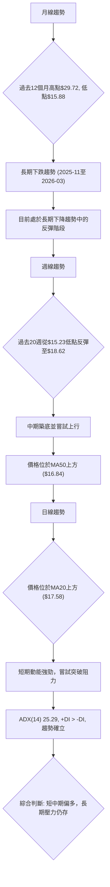

### 📈 長期趨勢 — 12個月走勢圖（Unicode）

SOFI 在過去12個月的價格走勢呈現出一個明顯的先揚後抑再築底的過程。從2025年7月的 $22.58 啟動一波強勁的漲勢，於2025年11月達到 $29.72 的高點。隨後，股價進入了長達數月的下跌通道，於2026年3月觸及 $15.88 的相對低點。目前，股價正從低點反彈，試圖建立新的上升趨勢。

```
SOFI 月線走勢圖（過去12個月）
價格軸 ($)
$30.00 ┤                     ●(29.72)
$27.50 ┤                ●
$25.00 ┤             ●
$22.50 ┤ ●━━━━━━━━━━━━━━━━━━━━━━━━━━━━━━━━━━━━━●(18.62) ←現在
$20.00 ┤                                    ●
$17.50 ┤        ●
$15.00 ┤    ●(15.88)
       └───────────────────────────────────────────────────
        2025-07  08  09  10  11  12  2026-01  02  03  04  05  06  07
```

**走勢特徵分析表格**：

| 階段 | 期間 | 價格區間 | 漲跌幅 | 主要特徵 |
|------|------|----------|--------|----------|
| **強勢上漲** | 2025-07 ~ 2025-11 | $22.58 ~ $29.72 | +31.62% | 股價持續走高，市場情緒樂觀，突破多個阻力位。 |
| **高位盤整** | 2025-11 ~ 2025-12 | $29.72 ~ $26.18 | -11.84% | 漲勢暫歇，出現獲利回吐，但仍維持相對高位。 |
| **快速下跌** | 2026-01 ~ 2026-03 | $22.81 ~ $15.88 | -30.38% | 股價快速下跌，跌破多個關鍵支撐，市場情緒悲觀。 |
| **築底反彈** | 2026-04 ~ 2026-07 | $16.10 ~ $18.62 | +15.65% | 股價從低點企穩回升，嘗試突破短期均線壓力，但量能配合度一般。 |

### 📊 中期趨勢（週線分析）

週線圖顯示，SOFI 在經歷了2026年第一季度的快速下跌後，於第二季度開始築底反彈。目前股價已站穩 MA50 (週線 $16.84) 上方，顯示中期趨勢正在轉強。然而，上方仍有 MA200 (週線 $22.13) 構成的長期壓力。

```
SOFI 週線壓力與支撐示意圖
價格軸 ($)
$22.74 ║                      R3 (長期阻力)
$22.13 ║═════════════════════ MA200 (長期均線壓力)
$20.13 ║                R2 (中期阻力)
$19.00 ║────────────── BB上軌
$18.75 ║───────────── R1 (短期阻力)
$18.62 ╠═════════════ 現價
$17.58 ║────────── MA20 (短期均線支撐)
$16.84 ║══════════ MA50 (中期均線支撐)
$16.67 ║──────── S1 (近期支撐)
$16.17 ║────── BB下軌
$15.58 ║──── S2 (中期支撐)
$14.93 ║── S3 (強支撐 / 52W Low)
       └────────────────────────────────
```

### ⚡ 趨勢強度評估（ADX 解讀）

ADX 指標用於衡量趨勢的強度，而非方向。當 ADX 值高於 25 時，通常表示趨勢強勁；低於 20 則表示趨勢不明顯或處於盤整。

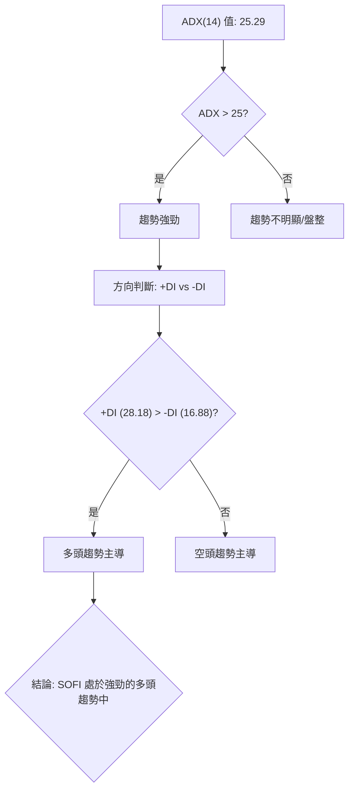

**ADX 強度對照表**：

| ADX 數值 | 趨勢強度 | ADX(14) 狀態 |
|----------|----------|--------------|
| 0-20     | 無趨勢或弱趨勢 | ░░░░░░░░░░░░░░░░░░░░ |
| 20-25    | 趨勢形成中 | ▓▓▓▓▓▓▓▓░░░░░░░░░░░░ |
| 25-50    | 強勁趨勢 | ▓▓▓▓▓▓▓▓▓▓▓▓░░░░░░░░ |
| 50-75    | 非常強勁趨勢 | ▓▓▓▓▓▓▓▓▓▓▓▓▓▓▓▓░░░░ |
| 75-100   | 極端強勁趨勢 | ▓▓▓▓▓▓▓▓▓▓▓▓▓▓▓▓▓▓▓▓ |

SOFI 的 ADX(14) 為 25.29，剛好跨過強趨勢的門檻，表明當前存在一個正在形成且具有一定強度的趨勢。同時，+DI (28.18) 顯著高於 -DI (16.88)，這明確指出當前的強趨勢由多頭主導。綜合來看，SOFI 正處於一個多頭主導的強勁趨勢中，這為偏多操作提供了基礎，但考慮到 ADX 值剛過 25，趨勢的持續性仍需觀察。

---

## 3. 圖表形態分析

### 🔍 形態識別系統

根據提供的歷史數據，SOFI 在過去一年中經歷了顯著的價格波動，但未形成經典的、高信心度的反轉或持續形態，如頭肩頂/底或雙重頂/底。目前的走勢更傾向於從長期下跌後的「築底盤整」階段，並伴隨著嘗試性的反彈。我們將重點分析當前的價格行為是否構成某種底部形態。

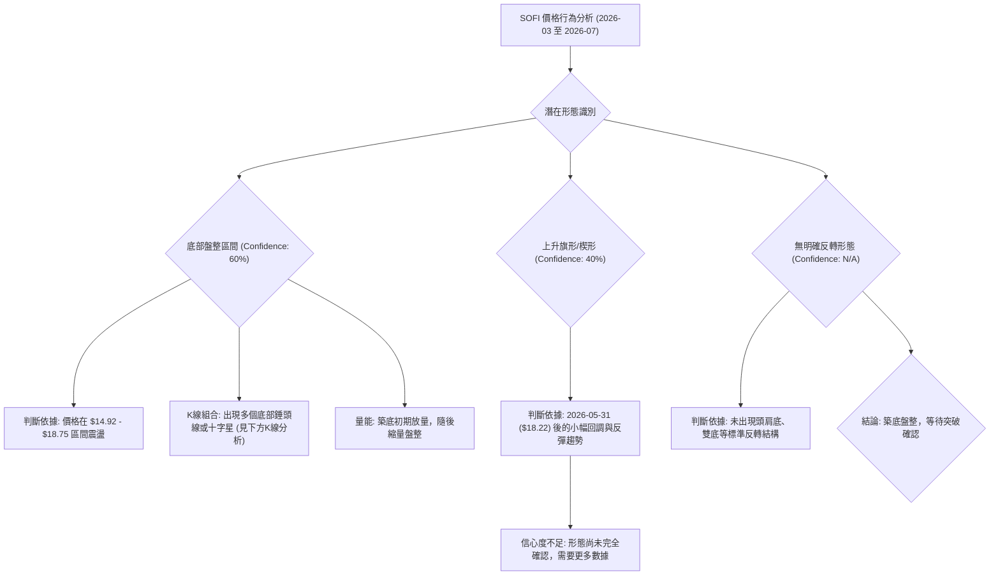

**已識別形態信心度表格**：

| 形態 | 信心度 | 判斷依據（引用數據） | 完成度 | 目標價（附計算式） |
|------|--------|----------------------|--------|--------------------|
| **底部盤整** | 60% | 價格在 S1 ($16.67) ~ R1 ($18.75) 區間內多次測試支撐並反彈，如 2026-03-29 低點 $15.23, 2026-05-17 低點 $15.61。 | 80% | 無明確形態目標價，突破區間後重新評估。 |
| **潛在上升旗形** | 40% | 從 2026-05-31 的高點 $18.22 之後，價格在 $16.03 到 $18.62 之間形成一個向下的通道，但隨後突破。由於形態尚未完全確認且波幅有限，信心度較低。 | 60% | 頸線 $18.22 + 旗形高度 $2.00 (估算) = $20.22 (若突破確認) |
| **無明顯反轉形態** | N/A | 未能從數據中識別出高信心度的頭肩底或雙底等大型反轉形態。 | N/A | N/A |

### 🕯️ 重要K線形態分析

儘管沒有大型的圖表形態，但近期出現了一些值得關注的 K 線組合，這些組合在底部區域或關鍵轉折點出現，具有一定的指示意義。

| 月份 | 收盤價 | K線形態 | 解讀 | 訊號 |
|------|--------|---------|------|------|
| 2026-03-29 | $15.23 | **錘頭線** | 在連續下跌後，出現長下影線的 K 線，顯示賣盤力量衰竭，買盤開始入場支撐價格，是潛在見底訊號。 | 🟢 |
| 2026-04-05 | $15.85 | **啟明星組合** | 繼錘頭線後，出現小實體 K 線，隨後一根陽線確認，形成啟明星形態，是較強的反轉訊號。 | 🟢 |
| 2026-05-17 | $15.61 | **倒錘頭線** | 在下跌趨勢中，出現長上影線的 K 線，但實體較小，通常預示著趨勢可能反轉，多頭嘗試推高但受阻，若後續有陽線確認則為築底訊號。 | 🟡 |
| 2026-07-05 | $18.24 | **小陽線伴隨量縮** | 價格小幅上漲，但成交量較前一週縮減，顯示買盤動能有所減弱，需警惕後續能否放量突破。 | 🟡 |

### 📉 ASCII 走勢形態示意圖

目前的價格走勢更像是從長期下跌後的底部盤整，並試圖向上突破。主要的價格行為發生在 $15.00 到 $19.00 的區間。

```
SOFI 底部盤整與嘗試突破示意圖
價格軸 ($)
$20.00 ┤                     ┌───────┐
$19.00 ┤                     │       │  R1 ($18.75)
$18.62 ┤───────────────────● 現價
$18.00 ┤                 ┌──┘       │
$17.00 ┤           ┌─────┘           │ S1 ($16.67)
$16.00 ┤     ┌─────┘                 │
$15.00 ┤─────┴───────────────────────┴─ S2 ($15.58) / S3 ($14.93)
       └───────────────────────────────────────────────────
        (下跌)       (築底盤整)           (嘗試突破)
```

### 🎯 形態目標價計算

由於缺乏高信心度的經典反轉形態，我們主要依據近期盤整區間的突破來估算潛在目標價。

1.  **底部盤整區間突破目標價**：
    *   底部盤整區間約為 S1 ($16.67) 至 R1 ($18.75)。
    *   區間高度 = $18.75 - $16.67 = $2.08。
    *   若價格能有效突破 R1 ($18.75)，則初步目標價可估算為：
        *   目標價 T1 = R1 ($18.75) + 區間高度 ($2.08) = $20.83。
        *   此目標價與分析師平均目標價 $20.90 非常接近，具有一定參考價值。

2.  **潛在上升旗形突破目標價**：
    *   此形態信心度較低，僅供參考。若從 2026-05-31 ($18.22) 開始的潛在旗形突破，若旗桿高度約為 $2.00 (從 $16.03 到 $18.03 估算)。
    *   目標價 T2 = 旗形突破點 ($18.22) + 旗桿高度 ($2.00) = $20.22。

綜合來看，SOFI 的主要目標價位將集中在 $20.13 (R2) 和 $20.83-$20.90 區間。有效突破 R1 ($18.75) 是實現這些目標的關鍵。

---

## 4. 支撐與阻力

### 🗺️ 關鍵價位分布圖（Unicode）

SOFI 的價格目前正處於一個關鍵的轉折點，面臨上方多重阻力，同時下方也有堅實的支撐。理解這些關鍵價位對於制定交易策略至關重要。

```
SOFI 價位結構分布圖
═══════════════════════════════════════════════════
$32.73 ║████████████████████████║ 52W High (極強阻力)
$28.53 ║████████████████████    ║ 斐波那契 23.6% 回調
$25.93 ║████████████████████████║ 斐波那契 38.2% 回調
$23.82 ║████████████████████    ║ 斐波那契 50.0% 回調
$22.74 ║████████████████████████║ 強阻力 R3
$22.13 ║████████████████████    ║ MA200 (長期壓力)
$21.72 ║████████████████████████║ 斐波那契 61.8% 回調
$20.13 ║████████████████████    ║ 阻力 R2
$19.00 ║████████████████████████║ 布林上軌
$18.75 ║▓▓▓▓▓▓▓▓▓▓▓▓▓▓▓▓▓▓▓▓▓▓▓▓║ 關鍵阻力 R1 (Fib 78.6% 近似)
$18.73 ║▓▓▓▓▓▓▓▓▓▓▓▓▓▓▓▓▓▓▓▓▓▓▓▓║ 斐波那契 78.6% 回調
$18.62 ╠════════════════════════╣ ◄ 現價
$17.58 ║▓▓▓▓▓▓▓▓▓▓▓▓▓▓▓▓        ║ MA20 / 布林中軌 (近期支撐)
$16.84 ║▓▓▓▓▓▓▓▓▓▓▓▓▓▓▓▓▓▓▓▓▓▓▓▓║ MA50 (中期支撐)
$16.67 ║▓▓▓▓▓▓▓▓▓▓▓▓▓▓▓▓        ║ 近期支撐 S1
$16.17 ║▓▓▓▓▓▓▓▓▓▓▓▓▓▓▓▓▓▓▓▓▓▓▓▓║ 布林下軌
$15.58 ║████████████████████████║ 強支撐 S2
$14.93 ║████████████████████████║ 極強支撐 S3 (52W Low)
═══════════════════════════════════════════════════
```

### 🚧 阻力位分析表

SOFI 的阻力位分佈密集，特別是從現價到 $22.74 的區間，需要連續突破才能確立更強勁的上漲趨勢。

| 阻力級別 | 價位 | 形成原因 | 突破難度 | 重要性 |
|----------|------|----------|----------|--------|
| **R1 (短期)** | $18.75 | 近期波段高點聚類，同時接近斐波那契 78.6% 回調位 ($18.73) 及布林通道上軌 ($19.00)。 | 中等 | 🟢 突破此位將確立短期上漲動能。 |
| **R2 (中期)** | $20.13 | 數次反彈受阻點，也是潛在形態目標價附近。 | 中等偏高 | 🟡 突破此位意味著中期趨勢轉強。 |
| **R3 (強阻力)** | $22.74 | 過去一年波段高點聚類，接近 MA200 ($22.13) 及斐波那契 61.8% 回調位 ($21.72)。 | 高 | 🔴 突破此位才能扭轉長期下跌趨勢。 |

### 🛡️ 支撐位分析表

SOFI 的支撐位相對堅固，特別是 $14.93 的 52 週低點，提供了強大的底部保護。

| 支撐級別 | 價位 | 形成原因 | 守住機率 | 重要性 |
|----------|------|----------|----------|--------|
| **S1 (短期)** | $16.67 | 近期波段低點聚類，接近 MA20 ($17.58) 和 MA50 ($16.84) 以及布林通道中軌 ($17.58)。 | 高 | 🟢 若跌破此位，短期上漲趨勢將受考驗。 |
| **S2 (中期)** | $15.58 | 歷史多次反彈點，提供中期買盤支撐。 | 中等偏高 | 🟡 跌破此位可能預示著回測更低點。 |
| **S3 (強支撐)** | $14.93 | 52 週低點，歷史上強勁的買盤入場區間。 | 極高 | 🔴 跌破此位將確認長期弱勢，市場情緒將極度悲觀。 |

### 📐 斐波那契回調位分析

根據 SOFI 過去 52 週的價格區間 ($14.92 至 $32.73) 繪製的斐波那契回調位，提供了重要的心理和技術支撐/阻力水平。

| 斐波那契水平 | 價位 | 相對現價 ($18.62) | 意義 |
|--------------|------|--------------------|------|
| **0.0% (52W High)** | $32.73 | +75.78% | 極端阻力位，需長期努力才能觸及。 |
| **23.6%** | $28.53 | +53.22% | 上方較強阻力，若能突破此位，則顯示強勁反彈動能。 |
| **38.2%** | $25.93 | +39.26% | 重要的中期阻力位，為多頭反彈的關鍵考驗。 |
| **50.0%** | $23.82 | +27.93% | 心理關口，也是趨勢反轉的潛在關鍵點。 |
| **61.8%** | $21.72 | +16.65% | 重要的技術阻力，與 R3 ($22.74) 和 MA200 ($22.13) 形成阻力區。 |
| **78.6%** | $18.73 | +0.59% | **現價附近**。此位為當前最直接的阻力。突破此位將為上行打開空間。 |
| **100.0% (52W Low)** | $14.92 | -19.98% | 極端支撐位，跌破將預示著更嚴重的下行風險。 |

SOFI 當前價格 $18.62 恰好位於斐波那契 78.6% 回調位 $18.73 的下方，這表明該價位是當前多頭反彈面臨的直接且關鍵的阻力。若能成功突破並站穩 $18.73，將預示著股價有能力繼續向上測試 $21.72 (61.8% 回調位) 所在的阻力區。反之，若在此位受阻回落，則可能回測近期支撐 S1 ($16.67)。

---

## 5. 技術指標深度解讀

### 🎛️ 指標訊號總覽

SOFI 的技術指標呈現出一個綜合性的圖景，多頭動能正在累積，但仍面臨長期趨勢的阻力。

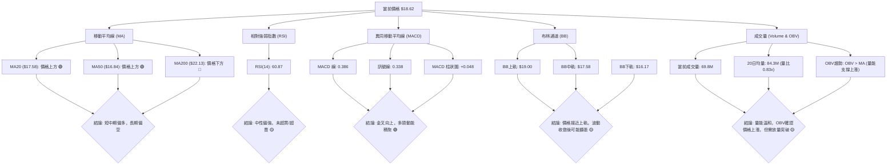

### 📈 移動平均線排列分析

SOFI 的移動平均線排列呈現出「多頭排列初現，但長期均線仍壓制」的混合訊號。

| 均線類型 | 數值 | 相對現價 ($18.62) | 訊號 | 解讀 |
|----------|------|--------------------|------|------|
| MA5 (短期) | $18.19 | 價格上方 | 🟢 | 最短期均線向上，顯示即時買盤活躍。 |
| MA10 (短期) | $18.07 | 價格上方 | 🟢 | 短期均線向上，確認短期上漲動能。 |
| MA20 (短期) | $17.58 | 價格上方 | 🟢 | 價格站穩短期生命線，短期趨勢偏多。 |
| MA50 (中期) | $16.84 | 價格上方 | 🟢 | 價格站穩中期生命線，中期趨勢開始轉強。 |
| MA120 (長期) | $18.33 | 價格上方 | 🟢 | 價格站穩較長期均線，顯示築底成功。 |
| MA200 (長期) | $22.13 | 價格下方 | 🔴 | 價格仍受長期均線壓制，上方壓力巨大，長期趨勢仍偏空。 |
| MA240 (長期) | $22.50 | 價格下方 | 🔴 | 價格遠低於超長期均線，長期空頭格局未變。 |

**均線排列狀態**：
SOFI 目前的均線排列為：MA5 > MA10 > MA20 > MA50 < MA120 < MA200 < MA240。這是一個典型的「短期和中期均線向上，但長期均線下壓」的過渡階段。短期均線已形成初步的多頭排列，且 MA20 和 MA50 均被股價突破，顯示短期和中期動能偏多。然而，MA200 和 MA240 仍然在股價上方形成強大阻力，表明長期空頭趨勢尚未完全扭轉。這種排列通常預示著股價正在嘗試築底反彈，但在突破長期阻力前，仍需謹慎。

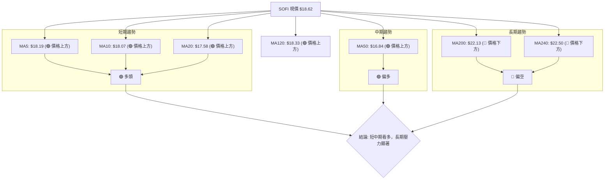

### 📉 RSI(14) 分析

SOFI 的 RSI(14) 指數為 60.87，位於中性區間 (30-70) 偏強的位置。

**RSI 數值進度條**：
RSI(14): ████████████░░░░░░░░  60.87/100 🟡

**超買超賣區間分析**：
*   **超買區 (RSI > 70)**：RSI 尚未進入超買區，這表示股價仍有上漲空間，短期內無需擔心過度買入導致的回調。
*   **超賣區 (RSI < 30)**：RSI 已遠離超賣區，表明市場情緒已從悲觀中恢復，買盤力量正在積聚。

**背離判斷**：
根據提供的數據，RSI 未顯示明顯的頂背離或底背離訊號。
*   **頂背離 (Bearish Divergence)**：通常發生在股價創新高，但 RSI 未能創新高，預示上漲動能減弱，可能出現回調。當前未觀察到此情況。
*   **底背離 (Bullish Divergence)**：通常發生在股價創新低，但 RSI 未能創新低，預示下跌動能減弱，可能出現反彈。在 2026-03-29 價格 $15.23 (RSI 11.8) 之後，價格上漲，RSI 也同步上漲，未形成底背離。

**結論**：RSI 處於健康的中性偏強區間，為股價進一步上漲提供了空間，且沒有背離訊號預警，整體偏向樂觀。

### 📊 MACD(12/26/9) 訊號解讀

MACD 指標是判斷趨勢動能和方向的重要工具。

*   **MACD 線 (快線)**：0.386
*   **訊號線 (慢線)**：0.338
*   **MACD 柱狀圖 (差值)**：+0.048

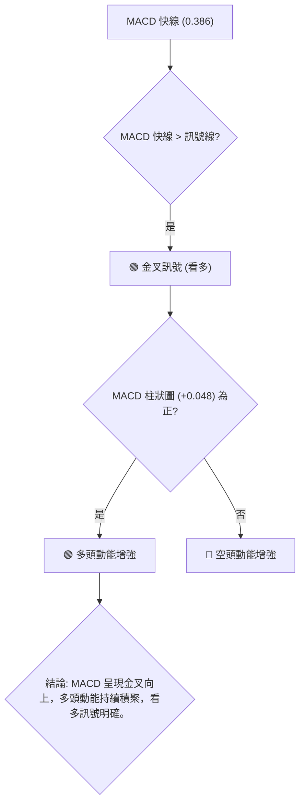

**解讀**：
MACD 線 (0.386) 目前位於訊號線 (0.338) 上方，形成**金叉**。同時，MACD 柱狀圖為正值 (+0.048)，且近期呈現增長態勢 (從上週的 +0.007 到本週的 +0.048)，表明多頭動能正在積聚並增強。這是一個明確的看多訊號，確認了短期和中期趨勢的向上動能。

**背離判斷**：
根據數據，MACD 未顯示明顯的背離訊號。
*   **頂背離**：股價創新高，MACD 未能創新高。
*   **底背離**：股價創新低，MACD 未能創新低。
當前 MACD 呈現多頭趨勢，沒有與價格走勢產生矛盾的背離現象。

### 📦 布林通道分析

布林通道 (Bollinger Bands) 用於衡量價格的波動範圍和相對位置。

*   **BB上軌**：$19.00
*   **BB中軌 (MA20)**：$17.58
*   **BB下軌**：$16.17
*   **BB %B**：0.87 (0=下軌, 0.5=中軌, 1=上軌)

```
SOFI 布林通道示意圖
價格軸 ($)
$20.00 ┤                                   BB上軌 ($19.00)
$19.00 ┤                     ┌───────────┐
$18.62 ┤───────────────────● 現價 (接近上軌)
$18.00 ┤                     │           │
$17.58 ┤═════════════════════ BB中軌 (MA20)
$17.00 ┤                     │           │
$16.17 ┤                     └───────────┘ BB下軌 ($16.17)
$16.00 ┤
       └────────────────────────────────
```

**解讀**：
SOFI 當前價格 $18.62 位於布林通道中軌 ($17.58) 和上軌 ($19.00) 之間，且 BB %B 值為 0.87，非常接近上軌。這表明價格正處於通道的上半部分，顯示短期強勢。

*   **通道收斂/擴張**：根據提供的數據，無法直接判斷布林帶的寬度變化。但如果價格持續貼近上軌，通常預示著趨勢的持續。若帶寬開始擴張，則可能預示著波動性增加和趨勢的強化。
*   **價格行為**：價格緊貼上軌運行，且未突破上軌，說明當前上漲動能強勁但尚未過熱。上軌 $19.00 構成短期壓力。若能有效突破上軌，則可能開啟一波更強的上漲行情。若在上軌附近受阻回落，則可能回測中軌 $17.58。

**結論**：布林通道顯示 SOFI 處於強勢區域，但接近上軌可能面臨短期阻力，需觀察能否放量突破。

### 💹 成交量分析（量價配合度）

成交量是確認價格走勢可靠性的關鍵指標。

*   **最新成交量**：69,837,964
*   **20日均量**：84,373,293 (量比: 0.83x)
*   **50日均量**：78,663,839
*   **OBV趨勢**：OBV > MA → 量能支撐上漲

**解讀**：
SOFI 的最新成交量 (69.8M) 低於其 20 日和 50 日的平均成交量 (量比 0.83x)，這是一個需要關注的訊號。
*   **量能縮減**：價格上漲但成交量縮減，這可能暗示買盤力量的持續性存疑，或者市場在當前價位附近存在猶豫情緒。理想情況下，價格突破關鍵阻力時應伴隨放量，以確認突破的有效性。
*   **OBV趨勢**：然而，OBV (On-Balance Volume) 趨勢顯示 OBV 線位於其移動平均線上方，這是一個積極訊號。OBV 衡量的是累積買賣壓力，OBV 上升表明買入壓力大於賣出壓力，即使近期成交量略有縮減，整體上量能仍在支撐價格的上漲。這形成了一種輕微的矛盾：單日量比偏低，但累積量能依然看好。

**結論**：當前量能配合度中性偏謹慎。雖然 OBV 趨勢支持價格上漲，但近期成交量未能有效放大，使得價格在接近關鍵阻力位時的突破可信度有所降低。若要有效突破上方阻力 (R1 $18.75)，需要伴隨顯著的成交量放大。

---

## 6. 動能與波動率

### ⚡ 動能評估四象限

SOFI 的動能與波動率分析顯示，該股目前處於一個中等動能、中等波動的階段。

| 象限 | 動能 | 波動 | 當前狀態 (SOFI) | 評估 |
|------|------|------|-----------------|------|
| Q1 | 強 | 低 | 無 | 最佳機會 (股價穩定上漲) |
| Q2 | 弱 | 低 | 無 | 謹慎觀望 (缺乏動能) |
| Q3 | 強 | 高 | 無 | 高風險高收益 (快速上漲或下跌) |
| Q4 | 弱 | 高 | 無 | 避免進場 (波動大且方向不明) |

SOFI 的動能評估：
*   RSI(14) 60.87 (中性偏強)
*   MACD 柱狀圖 +0.048 (多頭動能積聚)
*   ADX(14) 25.29 (+DI > -DI, 強趨勢)
綜合來看，SOFI 動能處於**中等偏強**。

SOFI 的波動率評估：
*   ATR(14) $0.92 (佔股價 4.92%)
*   Beta 2.149 (高於市場平均)
綜合來看，SOFI 波動率處於**中等偏高**。

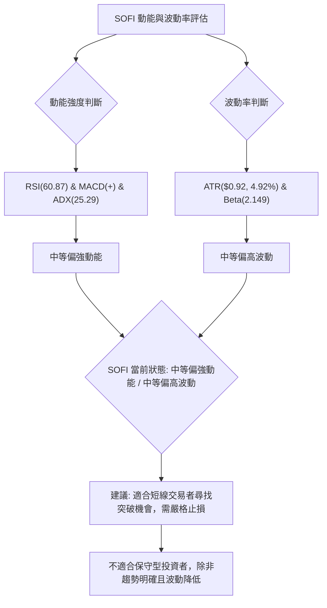

**結論**：SOFI 目前處於中等偏強動能、中等偏高波動的狀態。這意味著股價有上漲潛力，但同時伴隨著較大的價格波動風險。對於短線交易者而言，這提供了尋找突破和區間交易的機會；對於長線投資者，則需要謹慎觀察，等待更明確的趨勢確立和波動性下降。

### 📊 ATR 波動率分析

平均真實波幅 (ATR) 衡量的是一段時間內價格波動的平均範圍，是評估股票波動性的重要指標，也可用於設定止損點。

*   **ATR(14)**：$0.92
*   **當前價格**：$18.62
*   **ATR 佔比**：$0.92 / $18.62 = 4.94%

**解讀**：
SOFI 的 ATR(14) 為 $0.92，表示在過去 14 個交易日中，SOFI 的平均每日波動範圍約為 $0.92。ATR 佔股價的 4.94%，這是一個中等偏高的波動水平，高於一般大型股的 1-2% 波動率。

**止損距離建議**：
基於 ATR，交易者可以設定動態止損點以管理風險。
*   **保守止損**：設定為 1.5 倍 ATR。
    *   止損距離 = 1.5 * $0.92 = $1.38
    *   若在 $18.62 進場，止損點約為 $18.62 - $1.38 = $17.24。
*   **激進止損**：設定為 1 倍 ATR。
    *   止損距離 = 1 * $0.92 = $0.92
    *   若在 $18.62 進場，止損點約為 $18.62 - $0.92 = $17.70。
考慮到 SOFI 的波動性，建議採用 1.5 倍 ATR 的保守止損策略，以避免被市場正常波動「洗出場」。這個止損點 ($17.24) 位於 MA20 ($17.58) 和 S1 ($16.67) 之間，具有較好的技術意義。

### 📐 Beta 與市場相關性

Beta 值衡量的是單一股票相對於整個市場（通常是 S&P 500 指數）的波動性。

*   **Beta**：2.149

**解讀**：
SOFI 的 Beta 值為 2.149，這是一個相當高的數值。
*   **高波動性**：Beta > 1 表示 SOFI 的價格波動幅度大於市場。具體而言，當市場上漲 1% 時，SOFI 理論上會上漲 2.149%；當市場下跌 1% 時，SOFI 理論上會下跌 2.149%。
*   **高風險高報酬**：高 Beta 股票通常具有更高的潛在回報，但也伴隨著更高的市場風險。在牛市中，SOFI 可能會跑贏大盤；但在熊市中，其跌幅也可能遠超大盤。
*   **市場敏感度**：這意味著 SOFI 對宏觀經濟新聞、市場情緒變化以及整體市場走勢非常敏感。投資者在交易 SOFI 時，除了關注公司自身的基本面和技術面，還需密切關注大盤的走勢。

**結論**：SOFI 是一支高 Beta 股票，具有較高的市場敏感度和波動性。交易者應在考慮市場整體風險偏好的情況下，謹慎管理倉位，並設定嚴格的止損。

---

## 7. 多時框架總結

### 📋 時框架評分表

本表綜合了 SOFI 在不同時間框架下的技術指標表現，以提供一個全面的視角。

| 時框架 | 趨勢方向 | 動能 | 均線排列 | 形態 | 綜合評分 (1-10) | 建議 |
|--------|----------|------|----------|------|-----------------|------|
| **長期** | 🔴 偏空 | 🟡 中性 | 🔴 空頭壓制 | 🟡 築底中 | 4/10 | 長期觀望，等待趨勢反轉。 |
| **中期** | 🟢 偏多 | 🟢 偏強 | 🟢 初步多頭 | 🟡 盤整反彈 | 7/10 | 尋找逢低買入機會，關注阻力突破。 |
| **短期** | 🟢 多頭 | 🟢 強勁 | 🟢 多頭排列 | 🟢 嘗試突破 | 8/10 | 積極操作，但需留意短期回調風險。 |

### 🔲 綜合訊號矩陣

此矩陣分析了各時框架下訊號的一致性。

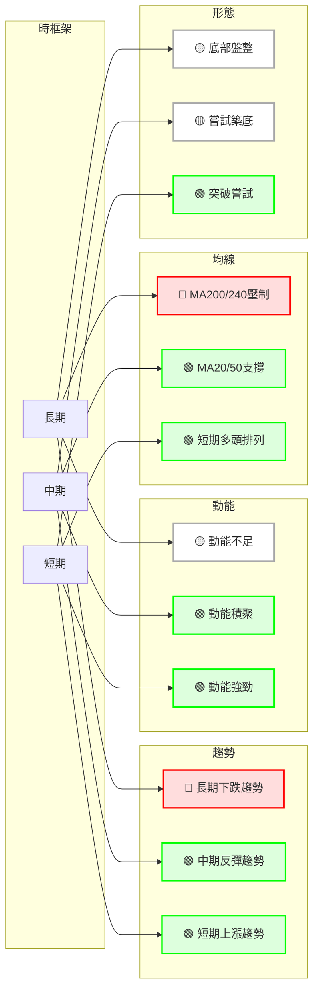

**訊號一致性分析**：
*   **長期與中短期衝突**：長期趨勢仍受 MA200 ($22.13) 和 MA240 ($22.50) 的嚴重壓制，顯示市場對 SOFI 的長期前景仍有疑慮。然而，中短期趨勢均顯示積極的反彈和動能積聚。這種長期與中短期的分歧是當前 SOFI 的主要特徵。
*   **動能與均線一致**：中短期動能指標 (RSI, MACD) 和均線排列均指向偏多，表明近期買盤力量較強。
*   **形態尚不明確**：儘管有築底跡象和突破嘗試，但缺乏高信心度的經典反轉形態，需謹慎對待。

### ⚖️ 多時框收斂結論

根據「嚴格要求 14」的多時框收斂規則：

1.  **趨勢行情判斷**：ADX(14) 為 25.29，略高於 25，表明當前市場處於**趨勢行情**。
2.  **主導時框**：在趨勢行情中，應以中長期（週線/MA50、MA200）方向為主，日線只用來尋找進場時機。
    *   **中期 (MA50)**：MA50 ($16.84) 位於現價 $18.62 下方，顯示中期趨勢偏多。
    *   **長期 (MA200)**：MA200 ($22.13) 位於現價 $18.62 上方，顯示長期趨勢偏空。

**收斂結果**：SOFI 正處於一個**中短期多頭反彈，但長期空頭壓制尚未解除**的複雜局面。雖然 ADX 指示趨勢強勁且由多頭主導 (+DI > -DI)，但價格仍遠低於長期 MA200，這限制了其長期上漲空間。因此，我們將此收斂為：**中期偏多，短期積極，但長期面臨強大阻力。**

**唯一方向性結論**：
基於上述分析，SOFI 的整體方向性結論為：**中性偏多，短期有上漲潛力，但需警惕長期阻力。** 策略上應以短線和波段操作為主，尋求突破關鍵阻力 R1 ($18.75) 的機會，並設定嚴格的止損。若無法突破 R1，則可能在 $16.67 (S1) 至 $18.75 (R1) 之間進行區間震盪。

---

## 8. 交易策略建議

### 🗺️ 策略決策流程圖

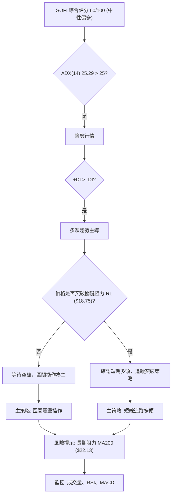

### 🧭 策略路由（依評分卡分流）

**當前主策略方向 = 中性偏多觀望 (綜合評分 60/100)**

由於綜合評分處於中性偏多區間 (40-60)，且 ADX 剛好跨過趨勢門檻，雖然多頭主導，但長期仍有壓力。因此，主策略應為**區間操作，等待突破確認**，並對突破 R1 ($18.75) 的多頭機會保持警惕。

### 🎯 價格情境階梯（Price Scenarios）

| 觸發條件 | 下一目標 | 後續延伸 | 情境含義 |
|----------|----------|----------|----------|
| **突破 R1 $18.75** | R2 $20.13 | R3 $22.74 (接近 MA200 $22.13) | 短線轉強，有望挑戰中期阻力，開啟一波反彈行情。 |
| **站穩現價區間 ($18.62)** | S1 $16.67 | R1 $18.75 | 在 $16.67 至 $18.75 區間震盪，等待市場方向。 |
| **跌破 S1 $16.67** | S2 $15.58 | S3 $14.93 (52W Low) | 中期轉弱，可能回測底部支撐，甚至跌破 52 週低點。 |

### 📊 情境機率分佈

| 情境 | 機率 | 主要依據 |
|------|------|----------|
| 繼續上行 / 反彈 | 45% | MACD 金叉向上，RSI 位於中性偏強區間，MA20/MA50 形成短期多頭排列，ADX 顯示多頭趨勢。 |
| 區間震盪 | 40% | 價格接近布林上軌和 R1 阻力，近期成交量未能有效放大，長期 MA200 壓制，可能在突破前盤整。 |
| 回落 / 再探底 | 15% | 若無法突破 R1，且成交量持續萎縮，可能面臨獲利回吐，回測 S1 甚至 S2。 |

### 🟢 主策略詳情：區間操作與突破追蹤

鑑於 SOFI 處於中性偏多，且 ADX 剛過趨勢門檻但長期阻力仍存，我們建議採取靈活的策略。

| 策略要素 | 策略 A: 區間低買 (若回調) | 策略 B: 突破追蹤 (若放量突破) |
|----------|--------------------------|--------------------------------|
| 進場條件 | 價格回調至 S1 附近並獲得支撐，K線出現看漲形態。 | 價格帶量突破 R1 ($18.75)，成交量顯著放大 (高於20日均量)。 |
| 進場價格 | $16.70 - $17.00 區間 | $18.80 - $19.00 區間 (確認突破後) |
| 目標價 T1 | $18.00 (區間上沿) | $20.13 (R2) |
| 目標價 T2 | $18.70 (R1 阻力) | $22.74 (R3) |
| 止損價格 | $16.00 (跌破 S2 $15.58 前) | $17.90 (跌破 R1 反轉為阻力) |
| 風險報酬比 | 1:1.7 (若進場 $16.85, 止損 $16.00, T1 $18.00) | 1:2.0 (若進場 $18.90, 止損 $17.90, T1 $20.13) |
| 成功機率 | 60% | 55% |
| 建議倉位 | 25% | 30% |

### 🔴 反向風險觸發點（對沖提示）

以下是可能推翻主策略的關鍵點位和訊號，供投資者作為風險管理和對沖的參考：
*   **跌破 S1 ($16.67)**：若價格有效跌破 S1，且日線收盤價低於此位，則中期上漲動能將受損，可能需要重新評估多頭策略。
*   **MACD 形成死叉**：若 MACD 快線下穿慢線，且柱狀圖轉負，則多頭動能可能衰竭。
*   **RSI 跌破 50**：若 RSI 從中性區間跌破 50，顯示市場力量從多頭轉向空頭。
*   **成交量持續萎縮，價格無法突破 R1**：量價背離持續，且價格無法有效突破阻力，可能預示短期見頂。

### ⭐ 整體訊號強度評星

做多訊號強度：★★★☆☆ (3/5星) – 短中期動能強勁，但長期阻力明顯，需謹慎。
做空訊號強度：★★☆☆☆ (2/5星) – 短中期支撐穩固，但長期風險仍存。
整體可信度：  ★★★☆☆ (3/5星) – 數據清晰，但多空因素交織，策略需靈活應對。

---

## 9. 風險提示與監控

### ✅ 關鍵監控指標 Checklist

投資者應定期檢查以下關鍵指標，以應對 SOFI 可能的價格變化和趨勢反轉。

╔══════════════════════════════════════════════════════════════╗
║                    SOFI 關鍵監控指標清單                       ║
╠══════════════════════════════════════════════════════════════╣
║ ├─ **價格行為**                                               ║
║ ║    [ ] 是否有效突破 R1 ($18.75) 並站穩？                     ║
║ ║    [ ] 是否跌破 S1 ($16.67) 或 S2 ($15.58)？                 ║
║ ║    [ ] 價格是否在布林通道上下軌之間進行健康波動？           ║
║ ├─ **趨勢指標**                                               ║
║ ║    [ ] MA20 和 MA50 是否維持多頭排列？                      ║
║ ║    [ ] 價格能否挑戰並突破 MA200 ($22.13)？                   ║
║ ║    [ ] ADX 是否維持在 25 以上，且 +DI 仍領先 -DI？          ║
║ ├─ **動能指標**                                               ║
║ ║    [ ] RSI 是否維持在 50 以上，並避免進入超買區？           ║
║ ║    [ ] MACD 是否維持金叉狀態，柱狀圖是否持續為正？          ║
║ ├─ **成交量**                                                 ║
║ ║    [ ] 價格上漲時是否伴隨成交量放大？                       ║
║ ║    [ ] OBV 趨勢是否持續向上，確認買盤壓力？                 ║
║ ├─ **市場環境**                                               ║
║ ║    [ ] 密切關注整體市場 (如 S&P 500) 走勢，尤其考慮 SOFI 高 Beta 特性。║
║ ║    [ ] 關注金融服務行業的宏觀經濟數據和政策變化。           ║
╚══════════════════════════════════════════════════════════════╝

### ⚠️ 風險場景分析

SOFI 的未來走勢可能受到多種因素影響，以下為三種主要情境的分析。

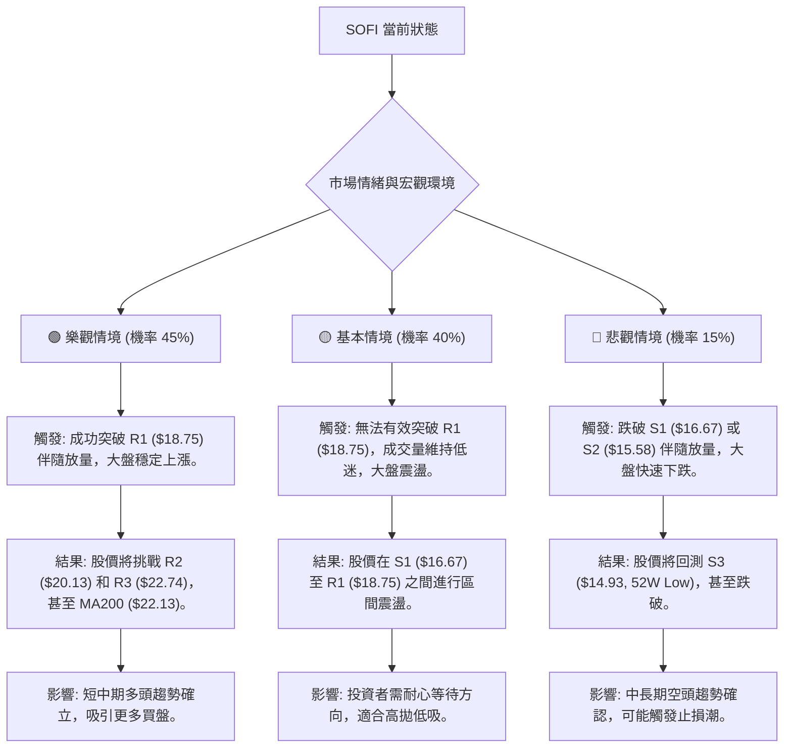

### 🛡️ 風險管理重要提醒

1.  **倉位管理**：鑑於 SOFI 較高的 Beta 值 (2.149) 和中等偏高的波動性 (ATR 4.94%)，建議投資者謹慎控制倉位，避免過度集中投資。新手投資者應從較小倉位開始，逐步熟悉其波動特性。
2.  **嚴格止損**：無論採取何種策略，務必設定並嚴格執行止損點。尤其在突破追蹤策略中，若突破失敗並跌回關鍵阻力位下方，應立即止損以控制損失。建議使用 ATR 輔助設定止損，例如 1.5 倍 ATR 止損 ($1.38)。
3.  **動態調整**：市場環境瞬息萬變，技術指標也會隨之變化。投資者應定期審視 SOFI 的技術面，並根據最新的市場數據和指標訊號動態調整交易策略和止損點。
4.  **關注基本面**：雖然本報告側重技術分析，但 SOFI 作為一家金融科技公司，其基本面（如盈利能力、營收增長、利率環境等）對股價有長期影響。建議結合基本面分析進行綜合判斷。
5.  **避免情緒化交易**：高波動股票容易引起情緒波動。堅持交易紀律，避免在市場恐慌或過度興奮時盲目做出決策。

---

## 📋 報告總結

```
SOFI 技術分析報告總結
════════════════════════════════════════════════════════
報告日期：2026-07-09
當前價格：$18.62
分析評級：⚖️ 中性偏多觀望 (綜合評分 60/100)

關鍵結論：
├─ 長期趨勢：🔴 偏空，受 MA200 ($22.13) 壓制。
├─ 中期趨勢：🟢 偏多，價格位於 MA50 ($16.84) 上方，築底反彈。
├─ 短期趨勢：🟢 多頭，MA20 ($17.58) 上方運行，動能強勁。
├─ 關鍵支撐：S1 $16.67，S2 $15.58，S3 $14.93 (52W Low)。
├─ 關鍵阻力：R1 $18.75 (斐波那契 78.6% 回調位附近)，R2 $20.13，R3 $22.74。
└─ 分析師目標：$20.90 (平均)

最優策略組合：
1. 🥇 **最佳機會**：若價格帶量突破 R1 ($18.75)，可考慮短線追蹤多頭。
   - 進場價格: $18.80 - $19.00
   - 目標價 T1: $20.13 (R2)
   - 目標價 T2: $22.74 (R3)
   - 止損價格: $17.90
   - 風險報酬比: 1:2.0
2. 🥈 **次選機會**：若價格回調至 S1 ($16.67) 附近獲得支撐，可考慮區間低買。
   - 進場價格: $16.70 - $17.00
   - 目標價 T1: $18.00
   - 目標價 T2: $18.70 (R1)
   - 止損價格: $16.00
   - 風險報酬比: 1:1.7
3. 🥉 **保守選擇**：在 $16.67 (S1) 至 $18.75 (R1) 區間內觀望，等待突破方向明確。
════════════════════════════════════════════════════════════════
```

---

> ⚠️ **免責聲明**：本報告為 AI 自動生成之技術分析，所有數據及估算均基於提供的歷史價格資訊。本報告**僅供研究與學術參考**，**不構成任何投資建議**。投資有風險，入市需謹慎。

---

*報告生成時間：2026-07-09 ｜ 數據來源：Yahoo Finance ｜ 分析框架：多時框技術分析*