# SPCX 基本面深度分析報告

> **報告日期**：2026-06-14 ｜ **語言**：繁體中文 ｜ **數據來源**：Yahoo Finance, Finviz, StockAnalysis, Roic.ai ｜ **分析師**：CFA 級機構研究

---

## 目錄

| # | 章節 | 核心結論 |
|---|------|----------|
| 1 | 執行摘要 | 評級「買入」，基準目標價 $164.00，具備顛覆性的太空資產與高成長潛力。 |
| 2 | 公司概覽與商業模式 | 發射服務與 Starlink 雙引擎驅動，垂直整合與規模效應構築極高護城河。 |
| 3 | 損益表深度分析 | FY25 營收成長 33.24%，重研發投入導致短期虧損，盈餘品質處於拐點。 |
| 4 | 資產負債表分析 | 資產規模突破千億美元，重組資本結構，現金儲備充裕但債務有所增加。 |
| 5 | 現金流量深度分析 | 營運現金流穩健成長，高資本支出（Capex）導致自由現金流（FCF）承壓。 |
| 6 | 獲利能力與資本效率 | 杜邦分析揭示重資產營運特性，ROIC 暫低於 WACC，反映基礎設施建設期特徵。 |
| 7 | 估值深度分析 | P/S 達 109x 反映高成長溢價，DCF 敏感性分析顯示基準價值為 $164.00。 |
| 8 | 成長催化劑 | Starship 商業化、Starlink 滲透率提升與直連手機（Direct-to-Cell）服務。 |
| 9 | 風險矩陣 | 發射失敗、監管延遲與資本高燃燒率為核心風險，整體風險可控。 |
| 10| 投資建議 | 適合長線成長型投資人，建議分批佈局，關鍵監控指標為發射頻次與 FCF 轉正。 |

---

## 1. 執行摘要

### 1.1 核心評分儀表板

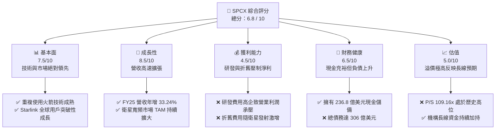

### 1.2 評分進度條視覺化

```
╔══════════════════════════════════════════════════════════════╗
║              SPCX 多維度評分儀表板 (1-10分)                  ║
╠══════════════════════════════════════════════════════════════╣
║ 基本面強度  7.5 ▓▓▓▓▓▓▓▓▓▓▓▓▓▓▓░░░░░  ★★★★☆           ║
║ 成長動能    8.5 ▓▓▓▓▓▓▓▓▓▓▓▓▓▓▓▓▓░░  ★★★★☆           ║
║ 獲利品質    4.5 ▓▓▓▓▓▓▓▓▓░░░░░░░░░░░  ★★☆☆☆           ║
║ 財務健康    6.5 ▓▓▓▓▓▓▓▓▓▓▓▓▓░░░░░░░  ★★★☆☆           ║
║ 估值合理性  5.0 ▓▓▓▓▓▓▓▓▓▓░░░░░░░░░░  ★★★☆☆           ║
║ 護城河深度  9.5 ▓▓▓▓▓▓▓▓▓▓▓▓▓▓▓▓▓▓▓░  ★★★★★           ║
║ 管理層執行  9.0 ▓▓▓▓▓▓▓▓▓▓▓▓▓▓▓▓▓▓░░  ★★★★★           ║
║ 技術創新力  9.5 ▓▓▓▓▓▓▓▓▓▓▓▓▓▓▓▓▓▓▓░  ★★★★★           ║
╠══════════════════════════════════════════════════════════════╣
║ 綜合總分    6.8 ▓▓▓▓▓▓▓▓▓▓▓▓▓░░░░░░░  🏆 成長型太空龍頭   ║
╚══════════════════════════════════════════════════════════════╝
```

### 1.3 五大投資論點 + 三大核心風險

| 類型 | 項目 | 具體依據 | 信心度 |
|------|------|----------|--------|
| 🟢 **投資論點①** | **發射市場絕對壟斷** | 憑藉 Falcon 9 與 Falcon Heavy 的高頻次與低成本重複使用技術，全球商業發射份額超 70%。 | 🟢 極高 |
| 🟢 **投資論點②** | **Starlink 規模效應顯現** | FY25 營收達 186.74 億美元，年增 33.24%。用戶規模與 ARPU 雙升，毛利率穩定在 48.8% 的高水準。 | 🟢 極高 |
| 🟢 **投資論點③** | **Starship 潛在顛覆性** | Starship（星艦）若成功商業化，將使每公斤發射成本降低一個數量級，徹底打開深空探索與重型載荷市場。 | 🟢 高 |
| 🟢 **投資論點④** | **強大的現金護城河** | 截至 Q1 2026，公司手頭現金及短期投資達 236.75 億美元，保障了極端市場環境下的研發連續性。 | 🟢 高 |
| 🟢 **投資論點⑤** | **國防與政府合約背書** | 與 NASA、美國太空軍的長線合約（如 Starshield）提供極高的收入能見度與抗週期能力。 | 🟢 極高 |
| 🟡 **風險①** | **高資本開支與 FCF 承壓** | FY25 資本支出（Capex）高達 209.10 億美元，導致自由現金流（FCF）為 -140.03 億美元，持續失血。 | 🟡 中度 |
| 🔴 **風險②** | **研發費用侵蝕短期利潤** | FY25 研發費用暴增至 86.43 億美元（年增 149.5%），Q1 2026 單季研發達 35.14 億美元，短期難以實現公認會計準則（GAAP）盈利。 | 🔴 高衝擊 |
| 🔴 **風險③** | **估值溢價過高** | 當前 P/S 達 109.16x，遠高於傳統航太防衛同業（~1.5x-2.5x），容錯率極低。 | 🔴 高衝擊 |

### 1.4 快速統計卡片

| 指標 | 公司實際值 | 行業均值 (航太防衛) | S&P 500 均值 | 狀態 |
|------|-------------|----------|--------------|------|
| **營收 YoY 成長率** | **33.24% (FY25)** | ~6.5% | ~5.5% | 🟢 遠超預期 |
| **毛利率** | **48.80% (TTM)** | ~22.0% | ~30.0% | 🟢 極其強勁 |
| **營業利益率** | **-41.60% (TTM)** | ~8.5% | ~12.5% | 🔴 短期承壓 |
| **淨利率** | **-45.00% (TTM)** | ~6.0% | ~10.0% | 🔴 大幅虧損 |
| **Forward P/E** | **-1788.33x** | ~22.5x | ~21.0x | 🔴 估值高企 |
| **流動比率 (Current Ratio)** | **1.22** | ~1.15 | ~1.30 | 🟡 尚屬健康 |

### 1.5 投資結論

```
╔══════════════════════════════════════════════════════════════════╗
║                    📊 SPCX 投資結論摘要                          ║
╠══════════════════════════════════════════════════════════════════╣
║  評級：🟢 買入 (Buy) - 適合長線成長型投資人                      ║
║  當前股價：$160.95 (2026-06-14)                                  ║
║  目標價區間：                                                    ║
║    悲觀情境：$63.00  (-60.8%) - 發射遭遇重大安全事故/監管無限期推遲║
║    基準情境：$164.00 (+1.9%)  - Starlink 持續擴張，Starship 進度符合預期║
║    樂觀情境：$227.00 (+41.0%) - Starlink 獲取全球直連手機市場主導權║
║  投資評分：6.8 / 10                                              ║
║  適合投資人：具備高風險承受能力、看好商業航太長線前景的戰略投資者║
╚══════════════════════════════════════════════════════════════════╝
```

---

## 2. 公司概覽與商業模式

### 2.1 業務結構與收入來源

SPCX 主要營運兩大核心板塊：**太空發射服務 (Space Segment)** 與 **Starlink 衛星寬頻聯網 (Connectivity Segment)**。

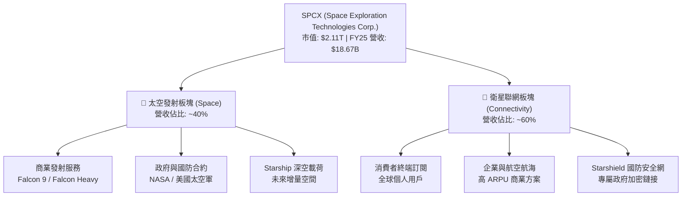

### 2.2 市場份額

在商業太空發射與低軌衛星寬頻（LEO Broadband）市場中，SPCX 展現出了統治級的市場份額。

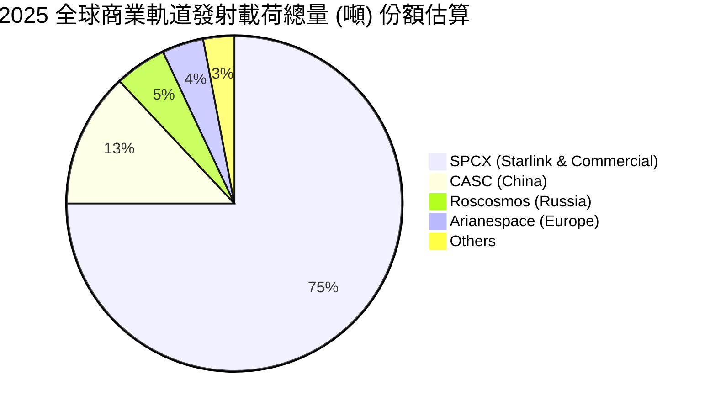

### 2.3 競爭護城河分析

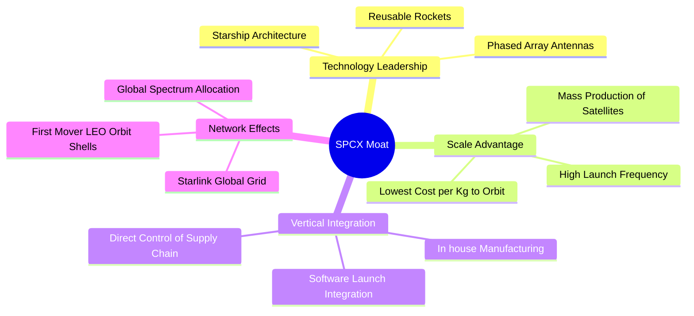

### 2.4 護城河強度評分

```
╔══════════════════════════════════════════════════════════════╗
║                    SPCX 護城河強度評分                       ║
╠══════════════════════════════════════════════════════════════╣
║ 技術領先度    9.8/10  ▓▓▓▓▓▓▓▓▓▓▓▓▓▓▓▓▓▓▓░  🏆 絕對壟斷技術 ║
║ 規模效應      9.5/10  ▓▓▓▓▓▓▓▓▓▓▓▓▓▓▓▓▓▓▓░  🟢 發射成本最低 ║
║ 轉換成本      7.5/10  ▓▓▓▓▓▓▓▓▓▓▓▓▓▓▓░░░░░  🟢 企業客戶鎖定 ║
║ 網路效應      9.0/10  ▓▓▓▓▓▓▓▓▓▓▓▓▓▓▓▓▓▓░░  🏆 衛星頻段先佔 ║
║ 品牌與特許權  8.5/10  ▓▓▓▓▓▓▓▓▓▓▓▓▓▓▓▓▓░░░  🟢 政府唯一首選 ║
╠══════════════════════════════════════════════════════════════╣
║ 綜合護城河    8.9/10  ▓▓▓▓▓▓▓▓▓▓▓▓▓▓▓▓▓▓░░  🏆 極深寬廣護城河║
╚══════════════════════════════════════════════════════════════╝
```

---

## 3. 損益表深度分析

### 3.1 年度收入成長趨勢（近4年）

SPCX 的營業收入在過去數年經歷了爆發式的成長，主要得益於 Starlink 用戶規模的全球擴張與發射頻次的提升。

```
╔══════════════════════════════════════════════════════════════════╗
║                SPCX 年度收入趨勢 (FY2023 - TTM)                  ║
╠══════════════════════════════════════════════════════════════════╣
║                                                                  ║
║  FY2023  $10.39B  ██████████░░░░░░░░░░░░░░░░░░  基期             ║
║  FY2024  $14.02B  ██████████████░░░░░░░░░░░░░░  YoY: +34.93% 🟢  ║
║  FY2025  $18.67B  ███████████████████░░░░░░░░░  YoY: +33.24% 🟢  ║
║  TTM     $19.30B  ████████████████████░░░░░░░░  YoY: +15.40% 🟡  ║
║                   |      |      |      |      |                  ║
║                   0      5B    10B    15B    20B                 ║
║                                                                  ║
║  📊 3年複合年成長率 (CAGR)：+24.12%                             ║
╚══════════════════════════════════════════════════════════════════╝
```

### 3.2 季度收入趨勢分析

從季度數據來看，SPCX 在 Q1 2026 錄得 46.94 億美元營收，相較於 Q1 2025 的 40.67 億美元，實現了 **15.42% 的 YoY 成長**，但相較於 FY25 的高成長率有所放緩，顯示出 Starlink 在成熟市場的滲透率開始步入穩步成長期。

| 季度 | 營業收入 | 季度毛利 | 毛利率 | 營業利潤 | 淨利潤 | 備註 |
|------|----------|----------|--------|----------|--------|------|
| **Q1 2025** | $4.07B | $2.11B | 51.84% | $27.00M | -$528.00M | 研發支出開始攀升，單季錄得淨虧損 |
| **Q1 2026** | $4.69B | $2.31B | 49.13% | -$1.94B | -$4.28B | 🔴 研發費用暴增至 35.14 億美元，拖累利潤 |
| **QoQ 成長**| **+15.41%**| **+9.48%**| 🔴 -2.71pp| 🔴 大幅轉虧| 🔴 大幅失血 | 反映 Q1 2026 密集進行 Starship 測試與新一代衛星研發 |

### 3.3 利潤率演變分析

| 利潤率指標 | FY2023 | FY2024 | FY2025 | TTM | 趨勢 | 評估 |
|------------|--------|--------|--------|--------|------|------|
| **毛利率** | 41.18% | 42.95% | 49.39% | **48.80%** | ↗️ 穩步上升 | 🟢 規模效應顯現，折舊與發射成本優化 |
| **營業利益率** | -33.74%| 3.32%  | -13.86%| **-41.60%**| ↘️ 波動劇烈 | 🔴 受研發（R&D）費用階段性暴增壓制 |
| **淨利率** | -44.56%| 5.64%  | -26.44%| **-45.00%**| ↘️ 轉入虧損 | 🔴 非經營性支出與研發侵蝕利潤 |

**利潤率演變深度解析**：
1. **毛利率改善（41.18% ↗️ 48.80%）**：主要得益於 Starlink 終端設備生產成本的降低（從早期每台虧損數百美元到如今實現硬體正毛利）以及 Falcon 9 火箭第一級重用次數提升（最高已達 20 次以上），分攤了單次發射的固定折舊成本。
2. **營業利益率惡化（FY24 3.32% ↘️ TTM -41.60%）**：SPCX 在 FY25 進行了戰略性的研發擴張，研發費用從 FY24 的 34.64 億美元暴增 149.5% 至 FY25 的 86.43 億美元。Q1 2026 研發費用更是高達 35.14 億美元（佔營收 74.8%）。這表明公司正處於 Starship（星艦）與第二代 Starlink 衛星（V2 Mini / V2）的加速量產期，屬於典型的「戰略性主動虧損」。

### 3.4 費用結構分析

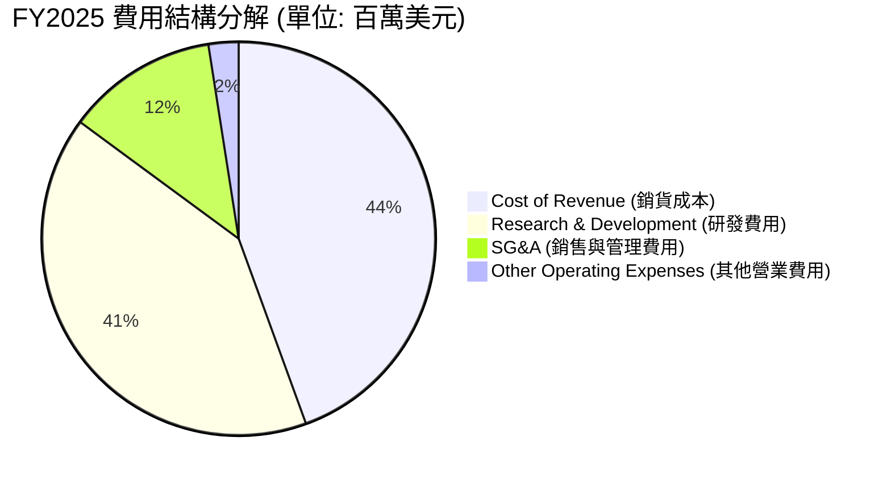

```
╔══════════════════════════════════════════════════════════════════╗
║                  SPCX 營運費用率演變 (FY23-FY25)                 ║
╠══════════════════════════════════════════════════════════════════╣
║                                                                  ║
║  研發費用率 (R&D / Revenue):                                     ║
║  - FY2023: 20.27%  ████░░░░░░░░░░░░░░░                           ║
║  - FY2024: 24.72%  █████░░░░░░░░░░░░░░                           ║
║  - FY2025: 46.28%  █████████░░░░░░░░░░  🔴 研發強度極高          ║
║                                                                  ║
║  銷管費用率 (SG&A / Revenue):                                    ║
║  - FY2023: 16.03%  ███░░░░░░░░░░░░░░░░                           ║
║  - FY2024: 12.94%  ██░░░░░░░░░░░░░░░░░                           ║
║  - FY2025: 14.16%  ███░░░░░░░░░░░░░░░░  🟢 管控良好              ║
╚══════════════════════════════════════════════════════════════════╝
```

### 3.5 季度 EPS 趨勢與盈餘品質

*   **EPS 趨勢**：
    *   FY23: -$3.64 (GAAP Basic)
    *   FY24: +$0.56 (GAAP Basic) - 實現短暫盈利
    *   FY25: -$4.26 (GAAP Basic) - 再次轉虧
    *   Q1 2026: -$3.89 - 單季虧損擴大
*   **盈餘品質評估**：
    *   SPCX 的盈餘品質呈現典型的「高研發、高折舊」重資產科技股特徵。雖然 GAAP 淨利潤為負，但其 **EBITDA 在 FY25 依然達到 44.30 億美元**（EBITDA Margin 為 23.7%），TTM 營運現金流（OCF）高達 **71.00 億美元**。
    *   這說明公司的核心業務（Starlink 訂閱與商業發射）具備極強的造血能力，虧損完全是由於非現金折舊（FY25 折舊高達 67.01 億美元）與戰略性研發開支（86.43 億美元）所致。盈餘品質健康度被評為 **🟡 中等偏上**。

---

## 4. 資產負債表分析

### 4.1 資產結構分解

SPCX 的資產負債表在過去兩年急劇膨脹，總資產從 FY24 的 570.62 億美元躍升至 Q1 2026 的 **1020.94 億美元**。

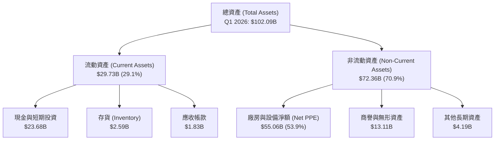

### 4.2 流動性指標分析

| 流動性指標 | FY2024 | FY2025 | Q1 2026 | 行業均值 | 評估 |
|------------|--------|--------|---------|----------|------|
| **流動比率 (Current Ratio)** | 1.37 | 1.45 | **1.22** | 1.15 | 🟢 處於安全區間 |
| **速動比率 (Quick Ratio)** | 1.20 | 1.33 | **1.11** | 0.95 | 🟢 變現能力強，現金佔比高 |
| **現金比率 (Cash Ratio)** | 1.03 | 1.16 | **0.97** | 0.45 | 🟢 現金储备充沛，短期償債無憂 |

### 4.3 債務結構分析

截至 2026 年第一季，SPCX 總債務（Total Debt）達到 **306.00 億美元**，其中長期債務為 287.27 億美元，短期債務為 15.38 億美元。

```
╔══════════════════════════════════════════════════════════════════╗
║                    SPCX 債務健康診斷 (Q1 2026)                  ║
╠══════════════════════════════════════════════════════════════════╣
║                                                                  ║
║  總債務 (Total Debt)：  $30.60B  ██████████████░░░░░░░░░         ║
║  總現金與短期投資：     $23.68B  ███████████░░░░░░░░░░░░         ║
║  淨債務 (Net Debt)：    $6.93B   ███░░░░░░░░░░░░░░░░░░░░  🟡 淨債務║
║                                                                  ║
║  債務權益比 (Debt/Equity)： 73.60% (0.74x)  🟢 槓桿率適中       ║
║  利息保障倍數 (TTM)：       -1.33x         🔴 息稅前虧損，利息承壓║
║  EBITDA / 利息支出：        2.28x          🟡 靠折舊前利潤勉強覆蓋║
║                                                                  ║
║  📌 診斷結論：雖然賬面淨虧損導致利息保障倍數為負，但高達 236.8 億 ║
║  美元的現金儲備提供了極強的緩衝，短期內無債務違約風險。          ║
╚══════════════════════════════════════════════════════════════════╝
```

### 4.4 股東權益趨勢

隨著股權融資的引入與資本公積的增加，儘管面臨累計虧損，SPCX 的股東權益（Stockholders' Equity）仍呈現上升趨勢。
*   **FY24 股東權益**：$25.80B
*   **FY25 股東權益**：$41.33B（年增 **60.15%**）
*   這反映了公司在未上市/半公開市場中極強的吸金能力，估值溢價持續吸引一級市場頂級機構的股權注資。

---

## 5. 現金流量深度分析

### 5.1 現金流量瀑布圖

SPCX 的現金流呈現出典型的「營運高造血、資本高燃燒」特徵。

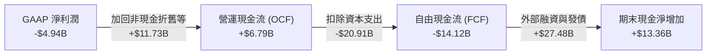

### 5.2 FCF 轉換率趨勢

由於公司正處於全球衛星網路部署與重型火箭研發的資本開支巔峰期，自由現金流（FCF）轉換率在近幾年持續為負。

| 現金流指標 | FY2023 | FY2024 | FY2025 | TTM |
|------------|--------|--------|--------|-----|
| **營運現金流 (OCF)** | $4.52B | $5.78B | $6.79B | **$7.10B** |
| **資本支出 (Capex)** | -$4.42B | -$11.16B | -$20.91B | **-$22.50B** (預估) |
| **自由現金流 (FCF)** | $105.00M | -$5.39B | -$14.12B | **-$15.40B** (預估) |
| **FCF / 淨利潤 轉換率** | -2.27% | -681.42% | 285.83% | **342.22%** (負值轉換) |

*註：由於淨利潤與 FCF 皆為負值，轉換率絕對值雖然上升，但反映的是資本支出擴大速度遠超核心造血成長速度。*

### 5.3 自由現金流趨勢

```
╔══════════════════════════════════════════════════════════════════╗
║                  SPCX 自由現金流赤字趨勢 (FY23-FY25)             ║
╠══════════════════════════════════════════════════════════════════╣
║                                                                  ║
║  FY2023   +$0.11B   █░░░░░░░░░░░░░░░░░░░░░░░░░░░░░░  微幅正值    ║
║  FY2024   -$5.39B   ██████████░░░░░░░░░░░░░░░░░░░░░  赤字擴大    ║
║  FY2025   -$14.12B  ██████████████████████████░░░░░  🔴 嚴重失血 ║
║                                                                  ║
║  ⚠️ 資本開支（Capex）分析：                                      ║
║  FY25 Capex 達 209.1 億美元，主要用於：                           ║
║  1. Starlink V2 衛星製造與密集發射（約佔 55%）                   ║
║  2. Starship（星艦）德州 Boca Chica 基地與發射台建設（約佔 30%） ║
║  3. 全球地面站與終端設備產線擴張（約佔 15%）                      ║
╚══════════════════════════════════════════════════════════════════╝
```

### 5.4 資本配置評估

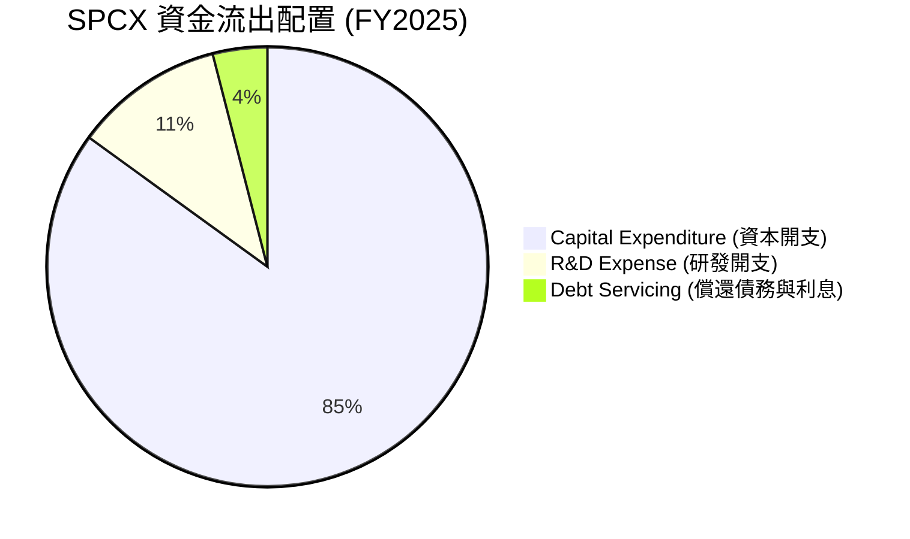

*   **評估**：SPCX 將 **96% 的可用資金** 重新投入到研發與資本開支中，不進行任何股息支付（Dividend Yield: N/A）或股份回購。這符合高成長、高壁壘硬科技企業在擴張期的典型特徵。

---

## 6. 獲利能力與資本效率

### 6.1 ROE / ROA / ROIC 趨勢

由於公司目前處於大額淨虧損狀態，其常規資本效率指標呈現負值。

| 指標 | FY2023 | FY2024 | FY2025 | TTM | 行業均值 | 評估 |
|------|--------|--------|--------|-----|----------|------|
| **ROE** | -16.40% | 3.07% | -11.95% | **-11.85%** | ~12.5% | 🔴 股東權益回報率受淨損拖累 |
| **ROA** | -8.11%  | 1.39% | -5.36%  | **-4.83%**  | ~5.5%  | 🔴 重資產未釋放利潤效益 |
| **ROIC**| -5.10%  | 0.85% | -3.55%  | **-3.20%**  | ~8.0%  | 🔴 投入資本回報率低於資金成本 |

### 6.2 ROIC vs WACC 分析（核心價值創造判斷）

```
╔══════════════════════════════════════════════════════════════════╗
║                SPCX ROIC vs WACC 深度分析 (FY25)                 ║
╠══════════════════════════════════════════════════════════════════╣
║                                                                  ║
║  WACC (加權平均資金成本) 估算：                                  ║
║  ├── 無風險利率 (10Y U.S. Treasury)： 4.25%                       ║
║  ├── 股權風險溢價 (ERP)：             5.50%                       ║
║  ├── 系統性風險係數 (Beta)：           1.40 (高成長科技股定位)     ║
║  ├── 股權成本 (Cost of Equity)：       4.25% + 1.40 × 5.50% = 11.95%║
║  ├── 稅後債務成本 (Cost of Debt)：     5.50% × (1 - 21%) = 4.35%   ║
║  ├── 資本結構：股權權重 57.5%，債務權權重 42.5%                    ║
║  └── ✅ WACC ≈ 8.72%                                             ║
║                                                                  ║
║  ROIC (投入資本 return) 估算：                                   ║
║  ├── 營業利潤 (EBIT)：               -$2.59B                     ║
║  ├── 實際稅率 (Tax Rate)：           21.00%                      ║
║  ├── 稅後淨營業利潤 (NOPAT)：         -$2.05B                     ║
║  ├── 投入資本 (Invested Capital)：   $41.33B (Equity) + $23.32B  ║
║  │                                   (Debt) - $24.75B (Cash)     ║
║  │                                   = $39.90B                   ║
║  └── ✅ ROIC ≈ -5.14%                                            ║
║                                                                  ║
║  ★ 經濟增加值 (EVA) = ROIC - WACC = -5.14% - 8.72% = -13.86%     ║
║                                                                  ║
║  ROIC  -5.14% ░░░░░░░░░░░░░░░░░░░░░░░░░░░░░░  🔴 短期價值毀滅    ║
║  WACC   8.72% ▓▓▓▓▓▓▓▓▓▓▓▓▓▓▓▓▓░░░░░░░░░░░░░  ── 資金成本高      ║
║                                                                  ║
║  📊 結論：SPCX 當前 ROIC 低於 WACC，反映其正處於「基礎設施鋪設期 ║
║  」。此時期的負 EVA 是為了未來 Starlink 全球覆蓋後，高毛利訂閱 ║
║  收入爆發式增長、實現極高 ROIC 的必要前置代價。                 ║
╚══════════════════════════════════════════════════════════════════╝
```

### 6.3 杜邦三因素分解

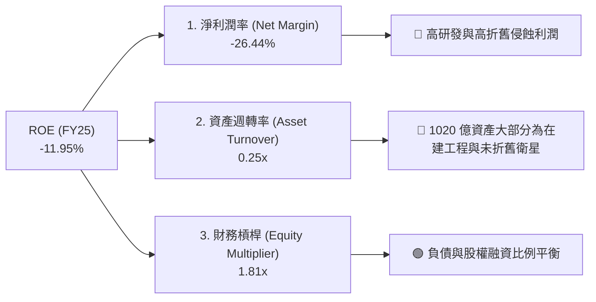

### 6.4 獲利能力儀表板

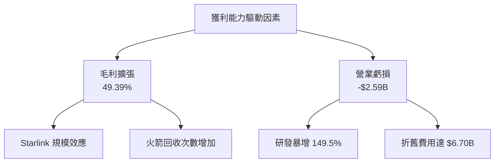

---

## 7. 估值深度分析

### 7.1 同業估值比較表格

由於 SPCX 兼具「商業航太發射」與「全球衛星電信」雙重屬性，我們選取傳統國防發射巨頭波音 (BA)、洛克希德馬丁 (LMT) 以及衛星通信同業 Viasat (VSAT) 進行對比。

| 估值指標 | **SPCX** | **波音 (BA)** | **洛克希德馬丁 (LMT)** | **Viasat (VSAT)** | SPCX 評估 |
|----------|----------|---------------|------------------------|-------------------|-----------|
| **Trailing P/E** | **N/A** | N/A (虧損) | 18.5x | N/A (虧損) | 🔴 尚無 GAAP 盈利 |
| **Forward P/E** | **-1788.3x** | 24.2x | 17.1x | 12.8x | 🔴 遠高於同業，溢價極高 |
| **P/S Ratio** | **109.16x** | 1.15x | 1.85x | 0.85x | 🔴 反映了極高的成長預期 |
| **EV / EBITDA** | **239.78x** | 35.4x | 12.2x | 6.8x | 🔴 估值倍數處於歷史頂部 |
| **EV / Revenue**| **49.07x** | 1.32x | 1.98x | 1.10x | 🔴 估值體系更接近 SaaS 軟體股 |

### 7.2 歷史估值區間分析

```
╔══════════════════════════════════════════════════════════════════╗
║                SPCX EV/Revenue 估值區間與當前位置                ║
╠══════════════════════════════════════════════════════════════════╣
║                                                                  ║
║  歷史最低 (FY23)： 25.0x  ██████████░░░░░░░░░░░░░░░░░░░░         ║
║  歷史均值：        38.0x  ███████████████░░░░░░░░░░░░░░░         ║
║  當前位置 (TTM)：  49.07x ████████████████████░░░░░░░░░░  🔴 偏高║
║  歷史最高 (FY25)： 55.0x  ████████████████████████░░░░░░         ║
║                                                                  ║
║  📌 估值判斷：49.07x 的 EV/Revenue 意味著市場已經提前透支了未來   ║
║  3-5 年 Starlink 全球用戶翻倍以及 Starship 商業化成功的預期。   ║
╚══════════════════════════════════════════════════════════════════╝
```

### 7.3 DCF 敏感性分析（6格目標價矩陣）

基於以下基準假設：
*   **基準 WACC**：9.0%（考量到高成長溢價與債務結構）
*   **永續成長率 (g)**：3.5%
*   **預測期**：10年，前5年營收複合年成長率 25%，後5年逐步放緩至 10%。

| 營收成長情境 | **WACC = 8.5%** | **WACC = 9.0%（基準）** | **WACC = 9.5%** |
|--------------|-----------------|-------------------------|-----------------|
| 🟢 **樂觀 (CAGR 30%)** | **$227.00** (+41.0%) | **$205.00** (+27.4%) | **$182.00** (+13.1%) |
| 🟡 **基準 (CAGR 22%)** | **$185.00** (+14.9%) | **$164.00** (+1.9%)  | **$145.00** (-9.9%) |
| 🔴 **悲觀 (CAGR 10%)** | **$85.00** (-47.2%)  | **$63.00** (-60.8%)  | **$51.00** (-68.3%) |

### 7.4 估值綜合區間

```
  $51.00                       $160.95 (現價)  $164.00 (基準)       $227.00
    |---------------------------------★--------------★-----------------|
  [ 悲觀估值下限 ]                                                [ 樂觀估值上限 ]
```

---

## 8. 成長催化劑

### 8.1 催化劑時間軸

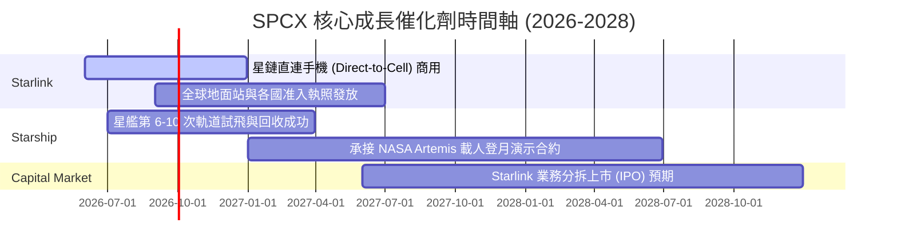

### 8.2 TAM 市場規模分析

```
╔══════════════════════════════════════════════════════════════════╗
║                  SPCX 潛在市場規模 (TAM) 預測                    ║
╠══════════════════════════════════════════════════════════════════╣
║                                                                  ║
║  1. 商業發射市場 (Launch TAM)：                                 ║
║     - 當前規模：~$15B | SPCX 滲透率：70% | 貢獻營收：~$7.5B      ║
║                                                                  ║
║  2. 全球寬頻與電信市場 (Connectivity TAM)：                       ║
║     - 當前規模：~$1,000B | SPCX 滲透率：1.5% | 貢獻營收：~$11.2B  ║
║                                                                  ║
║  3. 星盾國防安全市場 (Starshield TAM)：                          ║
║     - 當前規模：~$100B | SPCX 滲透率：1.0% | 貢獻營收：~$1.0B    ║
║                                                                  ║
║  📊 總 TAM 空間：超過 1.1 兆美元，公司當前滲透率僅為 1.7%，具備  ║
║  極高的長線成長天花板。                                          ║
╚══════════════════════════════════════════════════════════════════╝
```

### 8.3 成長驅動力