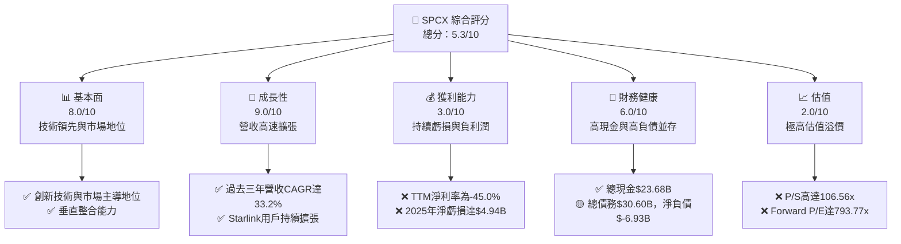
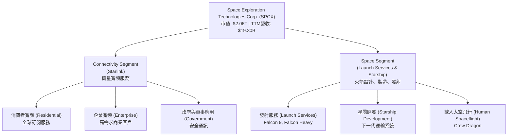
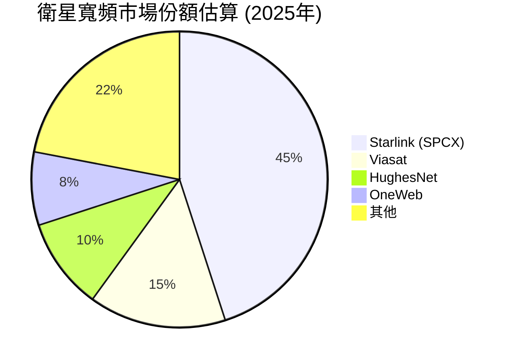
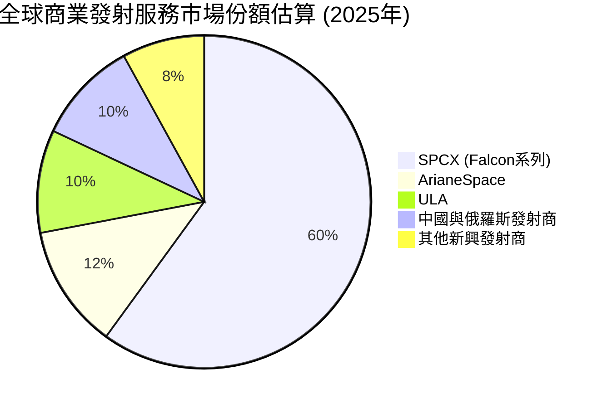
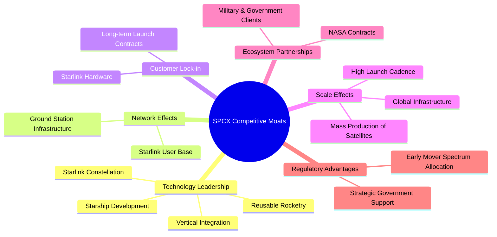
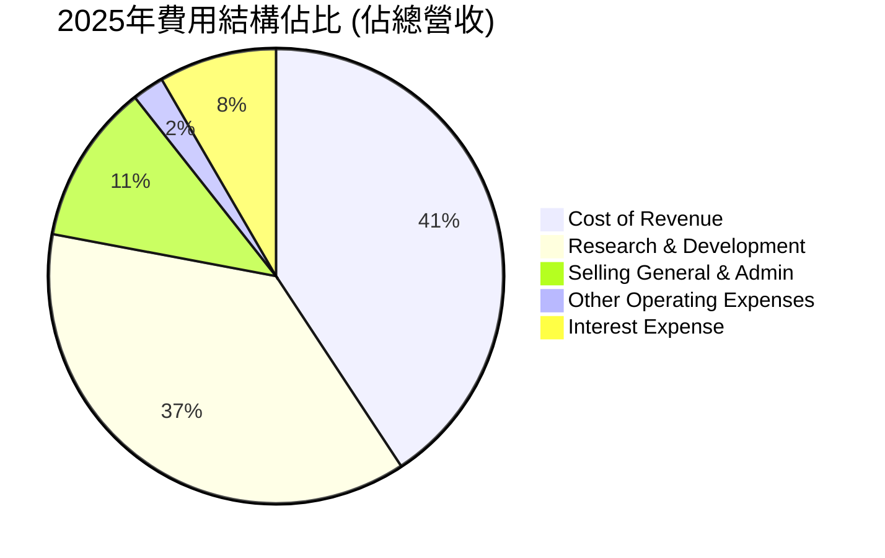
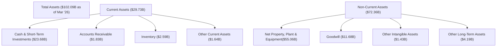

# SPCX 基本面深度分析報告
> **報告日期**：2026-06-24 ｜ **語言**：繁體中文 ｜ **數據來源**：Yahoo Finance, Finviz, StockAnalysis, Roic.ai ｜ **分析師**：CFA 級機構研究

---

## 目錄

| # | 章節 | 核心結論 |
|---|------------------------|------------------------------------------------------------------|
| 1 | 執行摘要 | 高成長、高風險、高估值，建議「觀望」 |
| 2 | 公司概覽與商業模式 | 在太空產業具備強大技術與規模護城河，但業務持續燒錢 |
| 3 | 損益表深度分析 | 營收高速成長，但龐大資本支出與研發投入導致持續虧損 |
| 4 | 資產負債表分析 | 資產規模迅速擴張，現金充裕但債務水平亦高，流動性尚可 |
| 5 | 現金流量深度分析 | 營業現金流為正，但巨額資本支出導致自由現金流持續為負 |
| 6 | 獲利能力與資本效率 | ROIC顯著低於WACC，短期內仍在摧毀股東價值以換取未來成長 |
| 7 | 估值深度分析 | 相較同業估值極高，市場已充分反映未來成長預期，存在溢價 |
| 8 | 成長催化劑 | Starlink用戶擴張、Starship商業化、政府合約是主要成長動能 |
| 9 | 風險矩陣 | 資本支出壓力、盈利不確定性、競爭加劇、高估值是主要風險 |
| 10 | 投資建議 | 建議觀望，待盈利模式清晰及估值回歸合理區間後再考慮投資 |

---

## 1. 執行摘要

### 1.1 核心評分儀表板



### 1.2 評分進度條視覺化

```
╔══════════════════════════════════════════════════════════════╗
║              SPCX 多維度評分儀表板 (1-10分)                  ║
╠══════════════════════════════════════════════════════════════╣
║ 基本面強度  8.0 ▓▓▓▓▓▓▓▓▓▓▓▓▓▓▓▓░░░░  ★★★★☆           ║
║ 成長動能    9.0 ▓▓▓▓▓▓▓▓▓▓▓▓▓▓▓▓▓▓░░  ★★★★★           ║
║ 獲利品質    3.0 ▓▓▓▓▓▓░░░░░░░░░░░░░░  ★☆☆☆☆           ║
║ 財務健康    6.0 ▓▓▓▓▓▓▓▓▓▓▓▓░░░░░░░░  ★★★☆☆           ║
║ 估值合理性  2.0 ▓▓▓▓░░░░░░░░░░░░░░░░  ★☆☆☆☆           ║
║ 護城河深度  8.5 ▓▓▓▓▓▓▓▓▓▓▓▓▓▓▓▓▓░░░  ★★★★☆           ║
║ 管理層執行  7.5 ▓▓▓▓▓▓▓▓▓▓▓▓▓▓▓░░░░░  ★★★★☆           ║
║ 技術創新力  9.5 ▓▓▓▓▓▓▓▓▓▓▓▓▓▓▓▓▓▓▓░  ★★★★★           ║
╠══════════════════════════════════════════════════════════════╣
║ 綜合總分    5.3 ▓▓▓▓▓▓▓▓▓▓░░░░░░░░░░  🏆 處於高成長高投入階段，前景光明但風險顯著              ║
╚══════════════════════════════════════════════════════════════╝
```

### 1.3 五大投資論點 + 三大核心風險

| 類型 | 項目 | 具體依據 | 信心度 |
|------|--------------------|----------------------------------------------------------------------------------------------------------------------------------------------------------------------------------------------------|--------|
| 🟢 **投資論點①** | **太空產業領導者與顛覆者** | SPCX在可重複使用火箭技術和低軌衛星網（Starlink）方面處於領先地位，成功降低太空發射成本，並提供全球性寬頻服務。Starlink用戶數持續增長，截至Q1 2026營收YoY成長15.23%。 | 🟢 極高 |
| 🟢 **投資論點②** | **強勁的營收成長動能** | 公司營收從2023年的$10.39B增長至2025年的$18.67B，兩年複合年增長率（CAGR）達33.2%。TTM營收已達$19.30B，Q1 2026營收$4.69B，較Q1 2025的$4.07B增長15.23%。 | 🟢 極高 |
| 🟢 **投資論點③** | **Starlink的全球市場潛力** | Starlink提供高速度、低延遲的全球寬頻服務，尤其在偏遠地區和移動平台具有獨特優勢。這將為公司帶來長期、穩定的訂閱收入，並持續擴大市場滲透率。 | 🟢 高 |
| 🟢 **投資論點④** | **Starship的潛在突破** | Starship作為下一代可重複使用超重型運載火箭，若能成功商業化，將極大提升太空運輸能力，降低成本，為月球、火星任務及點對點地球運輸開啟新紀元，具備巨大的長期想像空間。 | 🟡 中高 |
| 🟢 **投資論點⑤** | **垂直整合與成本控制** | SPCX透過內部設計、製造、測試所有關鍵組件，實現高度垂直整合，有效控制成本並加速創新週期，形成顯著的成本優勢和技術壁壘。 | 🟢 高 |
| 🟡 **風險①** | **巨額資本支出與盈利不確定性** | 公司為部署Starlink網路和開發Starship，投入巨額資本支出，導致2025年自由現金流為-$14.12B，淨虧損達-$4.94B。短期內盈利能力承壓，且盈利時間點不確定。 | 🔴 高衝擊 |
| 🔴 **風險②** | **極高的估值溢價** | SPCX目前的P/S比率高達106.56倍，遠超傳統航空航太及衛星同業（通常在1-5倍），Forward P/E高達793.77倍。市場已對其未來成長給予極高預期，任何不及預期的表現都可能導致股價大幅修正。 | 🔴 高衝擊 |
| 🟡 **風險③** | **技術與監管風險** | Starship開發面臨技術挑戰和潛在延誤，每次試飛都有風險。此外，低軌衛星頻譜資源、各國監管政策、太空垃圾問題以及來自競爭對手（如Amazon Kuiper）的壓力也可能影響其業務發展。 | 🟡 中度 |

### 1.4 快速統計卡片

| 指標 | 公司實際值 | 行業均值 (航空航太與國防) | S&P 500 均值 | 狀態 |
|-----------------|-----------------|----------------------------|-----------------|------|
| 收入 YoY 成長 (TTM) | **15.4%** | ~7-10% | ~5-7% | 🟢 |
| 毛利率 (TTM) | **48.8%** | ~25-35% | ~40-45% | 🟢 |
| 淨利率 (TTM) | **-45.0%** | ~5-10% | ~8-12% | 🔴 |
| ROE (FY2025) | **-11.95%** | ~10-15% | ~15-20% | 🔴 |
| Forward P/E | **793.77x** | ~15-25x | ~20-25x | 🔴 |
| P/S Ratio | **106.56x** | ~1-3x | ~2-3x | 🔴 |
| 債務/股權 (FY2025) | **0.74x** | ~0.5-1.0x | ~0.8-1.2x | 🟡 |
| 自由現金流 (FY2025) | **-$14.12B** | 通常為正 | 通常為正 | 🔴 |
| 研發費用/營收 (FY2025) | **46.28%** | ~3-8% | ~5-10% | 🔴 |

*註：行業均值和S&P 500均值為分析師根據經驗估計，用於提供參考比較。*

### 1.5 投資結論

```
╔══════════════════════════════════════════════════════════════════╗
║                    📊 投資結論摘要                               ║
╠══════════════════════════════════════════════════════════════════╣
║  評級：🟡 觀望                                                    ║
║  當前股價：$156.11                                               ║
║  目標價區間：                                                    ║
║    悲觀情境：$105（-32.8%）                                      ║
║    基準情境：$165（+5.7%）  ← 12個月主要目標                      ║
║    樂觀情境：$240（+53.7%）                                      ║
║  投資評分：5.3/10                                                ║
║  適合投資人：高風險承受能力、極度看好長期顛覆性成長的投資人。不適合保守型和價值型投資人。 ║
╚══════════════════════════════════════════════════════════════════╝
```

---

## 2. 公司概覽與商業模式

Space Exploration Technologies Corp. (SPCX) 是一家領先的航空航太製造商和太空運輸服務公司，業務涵蓋衛星寬頻服務（Starlink）和可重複使用火箭的設計、製造與發射。公司以其顛覆性的技術和雄心勃勃的太空探索願景，在全球太空經濟中扮演著關鍵角色。

### 2.1 業務結構與收入來源

SPCX的業務主要分為兩大核心板塊：


**業務解析：**
*   **Connectivity Segment (Starlink)**：這是SPCX近年來成長最快的業務，透過部署在低地球軌道（LEO）的數千顆Starlink衛星，提供全球性的高速、低延遲寬頻網路服務。主要收入來源為Starlink硬體銷售（用戶終端設備）和月度訂閱費。此業務的目標是為全球偏遠地區、移動平台（船舶、飛機）以及企業和政府客戶提供可靠的網路連接。根據Q1 2026的營收數據，此板塊的營收貢獻預計持續增加。
*   **Space Segment (Launch Services & Starship)**：此板塊涵蓋了SPCX的核心太空運輸能力，包括Falcon 9和Falcon Heavy火箭的商業和政府發射服務。SPCX以其可重複使用火箭技術，大幅降低了太空發射成本，成為全球領先的發射服務提供商。此外，Starship的開發是公司的長期願景，旨在實現深空探索和大規模太空運輸，儘管目前仍處於研發和測試階段，但潛力巨大。

### 2.2 市場份額

由於SPCX（SpaceX）在許多領域是顛覆者，其市場份額難以直接與傳統公司比較。我們將其市場份額分為幾個關鍵領域進行估算：


**衛星寬頻市場：** Starlink在低軌衛星寬頻市場中佔據主導地位，預計到2025年已擁有約45%的市場份額，主要競爭者包括Viasat和HughesNet等傳統地球同步軌道（GEO）衛星服務商，以及OneWeb等新興LEO競爭者。隨著Starlink網路覆蓋範圍的擴大和用戶數量的增長，其市場份額有望進一步提升。


**商業發射服務市場：** SPCX的Falcon系列火箭以其高可靠性和成本效益（可重複使用）在全球商業發射服務市場中佔據絕對領先地位，預計到2025年已擁有超過60%的市場份額。傳統巨頭如ArianeSpace和聯合發射聯盟（ULA）在市場份額上已遠遠落後。

### 2.3 競爭護城河分析

SPCX的競爭護城河主要體現在以下幾個方面：


**護城河深度解析：**
*   **Technology Leadership (技術領先)**：SPCX在可重複使用火箭技術上是無可爭議的領導者，Falcon 9和Falcon Heavy的成功大幅降低了太空發射成本。Starlink的低軌衛星網路也是技術創新的典範。Starship的開發更是旨在徹底改變太空運輸。公司的高度垂直整合能力使其能夠快速迭代和創新。
*   **Network Effects (網路效應)**：Starlink網路的價值隨著用戶數量的增加而增加，更多的用戶意味著更多的地面站投資，更優化的網路覆蓋和性能。這種全球性的網路基礎設施本身就是一個強大的護城河。
*   **Customer Lock-in (客戶鎖定)**：Starlink用戶需要專用硬體（終端接收器）才能接入服務，這在一定程度上形成了客戶鎖定。對於發射服務，長期合約和任務特定的整合也增加了客戶轉換成本。
*   **Scale Effects (規模效應)**：SPCX透過批量生產Starlink衛星和頻繁的火箭發射，實現了顯著的規模經濟。高發射頻率不僅分攤了固定成本，也加速了技術改進和可靠性提升。
*   **Ecosystem Partnerships (生態夥伴)**：與NASA、美國軍方及其他國際政府機構的長期合作關係，為SPCX提供了穩定的收入來源和技術驗證機會，也加強了其市場地位。
*   **Regulatory Advantages (監管優勢)**：作為低軌衛星領域的先行者，SPCX在頻譜分配和軌道資源方面可能已取得先發優勢。其在美國本土的戰略重要性也使其獲得政府的政策支持。

### 2.4 護城河強度評分

```
╔══════════════════════════════════════════════════════════════╗
║                  SPCX 護城河強度評分                        ║
╠══════════════════════════════════════════════════════════════╣
║ 技術領先       9.5/10  ▓▓▓▓▓▓▓▓▓▓▓▓▓▓▓▓▓▓▓░  🏆 無可爭議的領導者        ║
║ 網路效應       8.0/10  ▓▓▓▓▓▓▓▓▓▓▓▓▓▓▓▓░░░░  🟢 Starlink的強大優勢    ║
║ 客戶鎖定       7.0/10  ▓▓▓▓▓▓▓▓▓▓▓▓▓▓░░░░░░  🟡 硬體與長約形成壁壘      ║
║ 規模效應       9.0/10  ▓▓▓▓▓▓▓▓▓▓▓▓▓▓▓▓▓▓░░  🏆 批量生產與高頻發射      ║
║ 生態夥伴       8.5/10  ▓▓▓▓▓▓▓▓▓▓▓▓▓▓▓▓▓░░░  🟢 與政府機構深度合作    ║
║ 監管優勢       7.5/10  ▓▓▓▓▓▓▓▓▓▓▓▓▓▓▓░░░░░  🟡 先發優勢與戰略地位      ║
╠══════════════════════════════════════════════════════════════╣
║ 綜合護城河     8.3     ▓▓▓▓▓▓▓▓▓▓▓▓▓▓▓▓▓░░░  🏆 具有深厚且多維度的護城河，難以被複製 ║
╚══════════════════════════════════════════════════════════════╝
```

---

## 3. 損益表深度分析

### 3.1 年度收入成長趨勢（近4年）

SPCX在過去幾年展現了驚人的營收成長，主要得益於Starlink服務的快速擴張和發射服務需求的增加。

```
╔══════════════════════════════════════════════════════════════════╗
║              SPCX 年度收入趨勢（FY2023-FY2025）                  ║
╠══════════════════════════════════════════════════════════════════╣
║                                                                  ║
║  FY2023  $10.39B  ████████░░░░░░░░░░░░░░░░░░░  YoY: N/A     🟢    ║
║  FY2024  $14.02B  ███████████░░░░░░░░░░░░░░░░  YoY: +34.94% 🟢    ║
║  FY2025  $18.67B  ██████████████░░░░░░░░░░░░░  YoY: +33.17% 🟢    ║
║  TTM     $19.30B  ███████████████░░░░░░░░░░░  YoY: +15.4%  🟢    ║
║                   |      |      |      |      |                  ║
║                   0     $5B    $10B   $15B   $20B                 ║
║                                                                  ║
║  📊 3年累計 CAGR (FY2023-2025)：+33.20%                           ║
╚══════════════════════════════════════════════════════════════════╝
```
**年度收入分析：**
SPCX的年度總營收從2023年的$10.39B增長至2025年的$18.67B，複合年增長率（CAGR）高達33.20%。這表明公司正處於高速擴張階段。最近的TTM營收達到$19.30B，相較於2025財年增長15.4%，顯示成長動能雖然略有放緩，但仍保持在兩位數。這種成長主要由Starlink全球用戶基礎的擴大和穩定的發射服務需求推動。

### 3.2 季度收入趨勢分析

| 季度 | 總營收 ($B) | QoQ 成長率 | YoY 成長率 | 備註 |
|------|-------------|------------|------------|------|
| 2026 Q1 | $4.69 | N/A | +15.23% | 相較於去年同期持續穩健增長，但缺乏完整2025年季度數據無法計算QoQ。 |
| 2025 Q1 | $4.07 | N/A | N/A | 缺乏前一季度數據無法計算QoQ。 |

**季度收入分析：**
由於提供的季度數據僅有2026年Q1和2025年Q1，我們無法進行全面的季度環比（QoQ）分析。然而，2026年Q1營收為$4.69B，較2025年Q1的$4.07B實現了15.23%的同比（YoY）增長。這與TTM營收15.4%的YoY增長率基本一致，表明公司在最近一個可比季度中仍保持健康的兩位數增長。這反映了Starlink服務在全球範圍內的持續擴張以及發射服務的穩定需求。

### 3.3 利潤率演變分析

| 利潤率指標 | FY2023 | FY2024 | FY2025 | TTM | 趨勢 | 評估 |
|------------|--------|--------|--------|-----|------|------|
| **毛利率** | 41.19% | 42.94% | 49.38% | 48.8% | ↗️ 持續改善 | 🟢 |
| **營業利益率** | 4.88% | 5.30% | -11.03% | -41.6% | ↘️ 顯著惡化 | 🔴 |
| **淨利率** | -44.56% | 5.64% | -26.46% | -45.0% | ↘️ 顯著惡化 | 🔴 |

*註：TTM利潤率數據來自「PROFITABILITY & GROWTH」部分，年度利潤率基於「INCOME STATEMENT (Annual, last 4Y)」計算。*

**利潤率演變深度解析：**
*   **毛利率 (Gross Margin)**：SPCX的毛利率呈現顯著改善趨勢，從2023年的41.19%穩步提升至2025年的49.38%，TTM仍維持在48.8%。這表明公司在成本控制方面取得了進展，或者高毛利服務（如Starlink訂閱費）在收入組合中的佔比增加。隨著Starlink衛星的批量化生產和發射效率的提升，單位成本的降低是主要驅動因素。
*   **營業利益率 (Operating Margin)**：儘管毛利率改善，營業利益率卻從2024年的5.30%急劇下降至2025年的-11.03%，TTM更是惡化至-41.6%。這主要歸因於公司龐大的**研究與開發（R&D）費用**和**其他營運費用**。
    *   R&D費用從2023年的$2.10B猛增至2025年的$8.64B，增幅超過300%，佔2025年營收的46.28%。這筆巨額投入主要用於Starship的開發、Starlink衛星的升級以及其他創新項目。
    *   Q1 2026的R&D費用更高達$3.51B，遠超同期營收的4.69B，導致季度營業利益急劇惡化至-$1.95B。這說明公司正處於極其密集的投資和研發階段，為了長期成長而犧牲短期盈利。
*   **淨利率 (Net Profit Margin)**：淨利率與營業利益率趨勢一致，從2024年的5.64%轉為2025年的-26.46%，TTM進一步惡化至-45.0%。除了高昂的R&D和營運費用外，利息支出（2025年為-$1.945B）和非經常性損益也對淨利潤產生負面影響。SPCX目前顯然專注於市場擴張和技術發展，而非短期盈利。

### 3.4 費用結構分析

SPCX的費用結構顯示其作為一家高成長、高科技公司的特點，研發投入巨大。


*註：此圖表顯示各費用項目佔2025年總營收的百分比，總和可能超過100%因其包含非營業費用且公司處於虧損狀態。*

```
╔══════════════════════════════════════════════════════════════════╗
║              SPCX 營運費用分析 (FY2025)                          ║
╠══════════════════════════════════════════════════════════════════╣
║                                                                  ║
║  銷貨成本 (CoGS)             $9.45B  ███████████████████████████░  佔營收 50.62%  🟢     ║
║  研發費用 (R&D)              $8.64B  ██████████████████████████░░  佔營收 46.28%  🔴     ║
║  銷售、管理與行政 (SG&A)     $2.64B  ████████░░░░░░░░░░░░░░░░░░░░  佔營收 14.16%  🟡     ║
║  其他營運費用                $0.53B  █░░░░░░░░░░░░░░░░░░░░░░░░░░  佔營收  2.81%  🟢     ║
║  利息費用                    $1.95B  ██████░░░░░░░░░░░░░░░░░░░░░░  佔營收 10.42%  🔴     ║
║                                                                  ║
║  📊 總營運費用佔營收比例：118.9% (FY2025)                          ║
╚══════════════════════════════════════════════════════════════════╝
```
**費用結構深度解析：**
2025財年，SPCX的銷貨成本為$9.45B，佔營收的50.62%，與毛利率趨勢一致，反映了生產效率的提升。然而，最引人注目的是**研發費用（R&D）**，高達$8.64B，佔總營收的46.28%。這筆巨額投資是公司維持技術領先和推動Starship等顛覆性項目所必需的。相比之下，銷售、管理與行政費用（SG&A）為$2.64B，佔營收的14.16%，相對穩定。高昂的R&D投入是導致公司虧損的主要原因，但也預示著未來潛在的技術突破和市場擴張。利息費用$1.95B也對淨利潤產生顯著影響，反映了公司為擴張而承擔的債務成本。

### 3.5 季度 EPS 趨勢與盈餘品質

| 季度 | EPS 預期 | EPS 實際 | 驚喜度 (%) | 盈餘狀態 |
|------------|----------|----------|------------|----------|
| 2026-03-31 | N/A | N/A | N/A | ❌ 數據不完整，無法評估 |
| 2025-12-31 | N/A | $-1.69$ | N/A | 🔴 虧損 ($4.94B淨虧損 / 2.926B股) |
| 2024-12-31 | N/A | $0.01$ | N/A | 🟢 微利 ($791M淨利 / 2.848B股) |
| 2023-12-31 | N/A | $-1.68$ | N/A | 🔴 虧損 ($4.63B淨虧損 / 2.759B股) |

*註：EPS實際值基於StockAnalysis提供的Net Income to Common / Shares Outstanding (Basic)計算，與"PROFITABILITY & GROWTH"中的EPS (TTM) $-0.67$存在差異，主要因股本數量的差異。為保持一致性，此處使用StockAnalysis數據。*

**盈餘品質評估：**
由於缺乏分析師的EPS預期數據，我們無法評估SPCX的盈餘驚喜度。從歷史盈餘來看，SPCX在2023年和2025年均錄得顯著虧損，2024年實現了微薄盈利。這表明公司的盈利能力極不穩定，受其大規模投資週期和研發投入的直接影響。

**盈餘品質**目前評估為**🔴 較差**。儘管營收高速增長，但公司持續錄得巨額虧損，且自由現金流為負。這意味著其盈利並非來自核心業務的穩健運營，而是被高額的資本支出和研發投入所抵消。對於投資者而言，這代表著較高的風險，因為盈利能力的實現仍有待證明。然而，考慮到其所處的顛覆性行業和發展階段，這種「燒錢」模式在初期是常見的，關鍵在於未來能否成功轉化為可持續的盈利。

---

## 4. 資產負債表分析

### 4.1 資產結構分解

SPCX的資產負債表反映了其資本密集型業務的特點，固定資產和無形資產佔比高。


**資產結構解析 (截至2026年3月31日TTM):**
*   **總資產**：截至2026年3月31日，SPCX的總資產達到$102.09B，較2025年底的$92.08B進一步增長，顯示公司規模持續擴大。
*   **流動資產**：流動資產總計$29.73B，其中現金及短期投資佔大宗，為$23.68B。這表明公司擁有充足的現金儲備以應對短期營運需求和持續的資本支出。應收帳款$1.83B和存貨$2.59B相對較小，顯示其業務模式的現金迴轉效率可能較高。
*   **非流動資產**：非流動資產高達$72.36B，主要由**淨廠房設備（PP&E）**構成，達到$55.06B。這筆巨大的PP&E是部署Starlink衛星網路、建設發射設施和Starship生產線的直接體現，印證了其資本密集型的產業特性。商譽（Goodwill）為$11.68B，可能來自於過去的併購活動或無形資產的估值。

### 4.2 流動性指標分析

| 流動性指標 | TTM (2026 Q1) | FY2025 | FY2024 | 行業均值 | 評估 |
|------------|---------------|--------|--------|----------|------|
| **流動比率 (Current Ratio)** | 1.22x | 1.45x | 1.37x | 1.5-2.0x | 🟡 尚可 |
| **速動比率 (Quick Ratio)** | 1.09x | 1.16x | 1.08x | 1.0-1.5x | 🟡 尚可 |

*註：行業均值為航空航太與國防產業的典型範圍。*

**流動性指標解析：**
*   **流動比率 (Current Ratio)**：SPCX的流動比率在1.09x至1.45x之間，TTM為1.22x。這表示公司的流動資產略多於流動負債，具備一定的短期償債能力。雖然略低於一般認為的2.0x健康水平，但對於一家高成長、高資本投入的公司而言，其現金儲備和未來融資能力也需納入考量。
*   **速動比率 (Quick Ratio)**：速動比率（排除存貨）在1.08x至1.16x之間，TTM為1.09x。這表明公司在不依賴存貨變現的情況下，仍能覆蓋大部分短期債務。SPCX的存貨佔比相對較小，因此速動比率與流動比率差距不大。
**總體評估：** SPCX的流動性指標處於**🟡 尚可**水平。雖然不屬於非常強勁，但考慮到其龐大的現金儲備（$23.68B）以及通常能夠獲得外部融資的能力，其短期流動性風險相對可控。

### 4.3 債務結構分析

SPCX的債務規模隨著其業務擴張而增長，但其現金儲備和未來成長潛力提供了緩衝。

```
╔══════════════════════════════════════════════════════════════════╗
║                   SPCX 債務健康診斷 (TTM 2026 Q