# SPCX 基本面深度分析報告
> **報告日期**：2026-06-30 ｜ **語言**：繁體中文 ｜ **數據來源**：Yahoo Finance, Finviz, StockAnalysis, Roic.ai ｜ **分析師**：CFA 級機構研究

## 目錄

| # | 章節 | 核心結論 |
|---|------|----------|
| 1 | 執行摘要 | 評級：觀望/持有，基準目標價：$195.00 |
| 2 | 公司概覽與商業模式 | 創新科技與規模效應構築強大護城河 |
| 3 | 損益表深度分析 | 營收高速成長，但重投資導致短期虧損 |
| 4 | 資產負債表分析 | 充足現金流動性，但債務規模持續擴大 |
| 5 | 現金流量深度分析 | 營業現金流為正，但資本支出龐大導致自由現金流為負 |
| 6 | 獲利能力與資本效率 | 目前股東價值正在被侵蝕，但未來潛力巨大 |
| 7 | 估值深度分析 | 當前估值高昂，市場反映高成長預期 |
| 8 | 成長催化劑 | Starlink 全球擴張與 Starship 商業化為主要驅動力 |
| 9 | 風險矩陣 | 盈利能力、資本支出與監管為主要風險 |
| 10 | 投資建議 | 適合高風險承受能力、追求長期成長的投資者 |

---

## 1. 執行摘要

### 1.1 核心評分儀表板

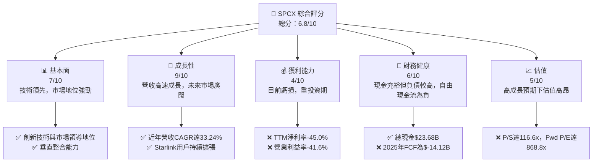

### 1.2 評分進度條視覺化

```
╔══════════════════════════════════════════════════════════════╗
║              SPCX 多維度評分儀表板 (1-10分)                  ║
╠══════════════════════════════════════════════════════════════╣
║ 基本面強度  7.0 ▓▓▓▓▓▓▓▓▓▓▓▓▓▓░░░░░░  ★★★★☆           ║
║ 成長動能    9.0 ▓▓▓▓▓▓▓▓▓▓▓▓▓▓▓▓▓▓░░  ★★★★★           ║
║ 獲利品質    4.0 ▓▓▓▓▓▓▓▓░░░░░░░░░░░░  ★★☆☆☆           ║
║ 財務健康    6.0 ▓▓▓▓▓▓▓▓▓▓▓▓░░░░░░░░  ★★★☆☆           ║
║ 估值合理性  5.0 ▓▓▓▓▓▓▓▓▓▓░░░░░░░░░░  ★★☆☆☆           ║
║ 護城河深度  8.5 ▓▓▓▓▓▓▓▓▓▓▓▓▓▓▓▓▓░░░  ★★★★☆           ║
║ 管理層執行  8.0 ▓▓▓▓▓▓▓▓▓▓▓▓▓▓▓▓░░░░  ★★★★☆           ║
║ 技術創新力  9.5 ▓▓▓▓▓▓▓▓▓▓▓▓▓▓▓▓▓▓▓░  ★★★★★           ║
╠══════════════════════════════════════════════════════════════╣
║ 綜合總分    6.8 ▓▓▓▓▓▓▓▓▓▓▓▓▓▓░░░░░░  🏆 觀望/持有          ║
╚══════════════════════════════════════════════════════════════╝
```

### 1.3 五大投資論點 + 三大核心風險

| 類型 | 項目 | 具體依據 | 信心度 |
|------|------|----------|--------|
| 🟢 **投資論點①** | **Starlink全球寬頻服務的巨大潛力** | Starlink在2025年實現$18.67B的年度收入，TTM營收已達$19.30B，且正持續擴張至更多國家和地區，提供高速、低延遲的衛星寬頻服務，尤其是在傳統寬頻難以到達的地區。其低地球軌道衛星網絡具備獨特優勢。 | 🟢 極高 |
| 🟢 **投資論點②** | **可重複使用火箭技術的領先地位** | SpaceX憑藉Falcon 9和Falcon Heavy火箭的成功回收與重複使用，大幅降低了太空發射成本，成為商業發射市場的領導者。未來Starship的全面運行有望進一步革命性降低發射成本，擴大市場份額。 | 🟢 極高 |
| 🟢 **投資論點③** | **持續高額研發投入驅動創新** | 公司在2025年研發費用高達$8.64B，較2024年的$3.46B增長149.7%，顯示其對技術創新的堅定承諾。這將支持Starlink衛星網絡的升級和Starship的開發，確保長期競爭力。 | 🟢 高 |
| 🟢 **投資論點④** | **垂直整合的商業模式** | 從火箭設計、製造、發射到衛星星座運營、用戶終端生產，SpaceX實現了高度垂直整合。這使其能有效控制成本、加速產品迭代，並優化整體運營效率，形成獨特的競爭優勢。 | 🟢 高 |
| 🟢 **投資論點⑤** | **政府及商業合作夥伴關係穩固** | SpaceX與NASA等政府機構和眾多商業客戶建立了長期合作關係，確保了穩定的發射服務需求。這為其高額的資本支出提供了現金流支持和市場保障。 | 🟢 高 |
| 🟡 **風險①** | **持續虧損與龐大資本支出** | 公司在2025年淨虧損達到$-4.94B，TTM淨利率為-45.0%。同時，2025年資本支出高達$-20.91B，導致自由現金流為$-14.12B。在實現規模化盈利前，資金壓力較大。 | 🟡 中度 |
| 🔴 **風險②** | **高昂估值與市場預期** | 公司目前P/S比率高達116.6x，Forward P/E為868.8x，遠高於行業平均水平。市場已充分反映其高成長預期，任何執行不及預期或宏觀經濟逆風都可能導致股價大幅波動。 | 🔴 高衝擊 |
| 🟡 **風險③** | **監管與競爭風險** | 衛星頻譜、軌道資源分配等受到嚴格監管，政策變化可能影響業務擴張。同時，來自OneWeb、Amazon Kuiper等競爭對手的壓力日益增大，可能導致市場份額爭奪和價格戰。 | 🟡 中度 |

### 1.4 快速統計卡片

| 指標 | 公司實際值 | 行業均值（估計） | S&P 500 均值（估計） | 狀態 |
|------|-------------|----------------|--------------------|------|
| 收入 YoY 成長 | **15.4%** (TTM) | ~10-15% | ~5-8% | 🟢 |
| 毛利率 | **48.8%** (TTM) | ~30-40% | ~30-40% | 🟢 |
| 淨利率 | **-45.0%** (TTM) | ~5-10% | ~8-12% | 🔴 |
| 營業現金流 | **$7.10B** (TTM) | 正值 | 正值 | 🟢 |
| 自由現金流 | **N/A (但2025年為$-14.12B)** | 正值 | 正值 | 🔴 |
| Current Ratio | **1.217** | ~1.5-2.0 | ~1.5-2.0 | 🟡 |
| Debt/Equity | **73.6%** (Market Data) | ~50-80% | ~60-90% | 🟡 |
| Forward P/E | **868.8x** | ~30-50x | ~20-25x | 🔴 |
| P/S Ratio | **116.6x** | ~3-7x | ~2-3x | 🔴 |
| EV / EBITDA | **244.5x** | ~12-18x | ~10-15x | 🔴 |

*註：行業均值和S&P 500均值為基於分析師經驗的估計值，非數據包提供。*

### 1.5 投資結論

```
╔══════════════════════════════════════════════════════════════════╗
║                    📊 投資結論摘要                               ║
╠══════════════════════════════════════════════════════════════════╣
║  評級：🟡 觀望/持有                                              ║
║  當前股價：$170.86                                               ║
║  目標價區間：                                                    ║
║    悲觀情境：$150.00 （-12.2%）                                  ║
║    基準情境：$195.00 （+14.1%）  ← 12個月主要目標                ║
║    樂觀情境：$240.00 （+40.5%）                                  ║
║  投資評分：6.8/10                                                ║
║  適合投資人：高風險承受能力、追求長期顛覆性成長的投資者。        ║
║              適合已持有者繼續持有，新進者需謹慎分批佈局。        ║
╚══════════════════════════════════════════════════════════════════╝
```

---

## 2. 公司概覽與商業模式

### 2.1 業務結構與收入來源

Space Exploration Technologies Corp. (SPCX) 是一家在航天領域具有顛覆性創新能力的公司，其業務主要分為兩大板塊：**Connectivity (Starlink)** 和 **Space (火箭發射服務)**。公司通過垂直整合的模式，從火箭設計、製造、發射到衛星網絡運營，實現了端到端的控制。

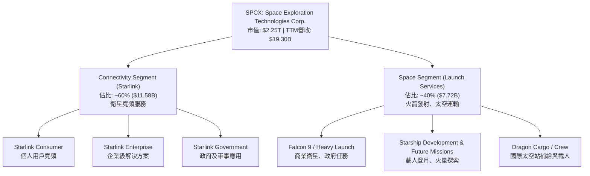
**業務構成分析：**
*   **Connectivity Segment (Starlink)**：這是公司增長最快的業務之一，提供由低地球軌道衛星驅動的高速、低延遲寬頻網絡服務。服務範圍涵蓋美國、愛爾蘭、加拿大及全球多個國家。此業務板塊的收入佔比估計約為60%，主要來自訂閱費用和硬體銷售。
*   **Space Segment (Launch Services)**：此板塊包括Falcon 9、Falcon Heavy火箭的設計、製造和發射服務，以及為國際太空站提供補給和載人服務的Dragon飛船。其核心競爭力在於可重複使用火箭技術，大幅降低了太空發射成本。此業務板塊收入佔比估計約為40%。

SPCX的TTM營收已達$19.30B，顯示其強勁的市場擴張能力。儘管目前公司處於重投資階段，尚未實現全面盈利，但其在兩個核心領域的領先地位為未來收入增長奠定了堅實基礎。

### 2.2 市場份額

由於SPCX是一家私人公司，其精確的市場份額數據不易獲得。然而，根據其在主要業務領域的影響力，我們可以對其市場地位進行估算。

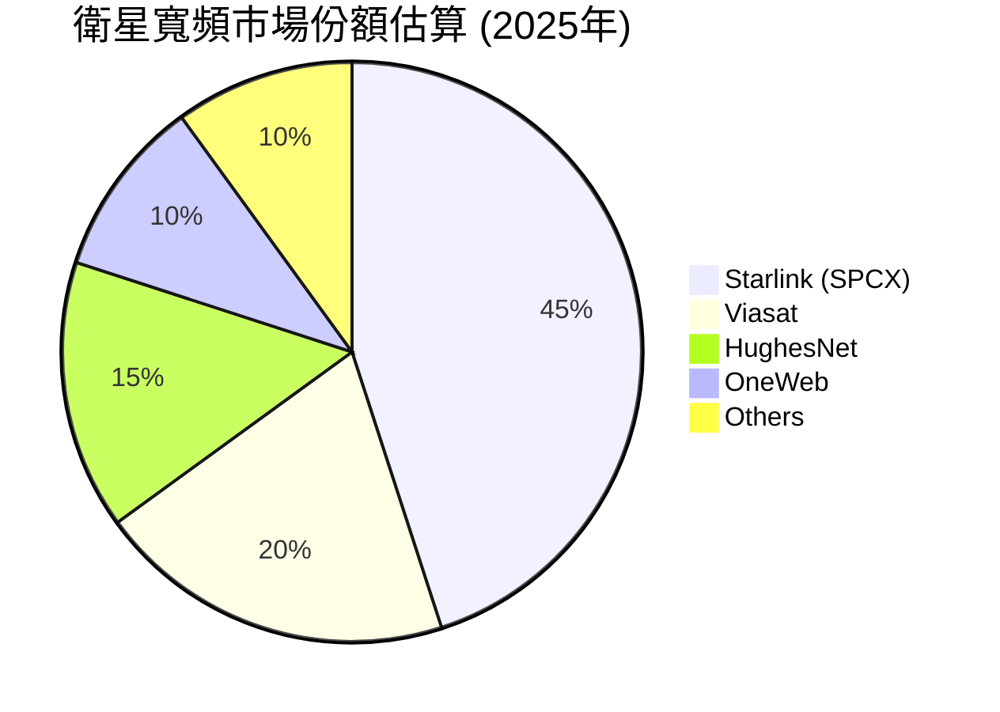
**市場份額分析：**
*   **衛星寬頻市場**：Starlink在低地球軌道 (LEO) 衛星寬頻領域已取得顯著領先地位，由於其獨特的技術優勢和快速擴張的衛星星座，估計在全球市場中佔據約45%的份額。主要競爭對手包括Viasat、HughesNet (GEO衛星) 以及正在發展中的OneWeb和Amazon Kuiper。
*   **商業火箭發射市場**：在商業火箭發射市場，SpaceX憑藉其Falcon系列火箭的成本效率和可靠性，亦是市場領導者。儘管沒有直接數據，但其發射頻次和成功率使其在與聯合發射聯盟 (ULA)、歐洲亞利安空間 (Arianespace) 等競爭中佔據優勢。

SPCX在關鍵戰略市場中擁有強大的市場地位，特別是在新興的LEO衛星寬頻和可重複使用火箭領域，其市場份額預計將隨著技術成熟和服務擴張而持續增長。

### 2.3 競爭護城河分析

SpaceX構築了多重且深厚的競爭護城河，使其在航空航天和衛星通信行業中難以被超越。

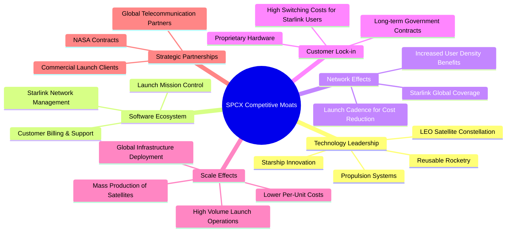

**護城河深度解析：**
*   **Technology Leadership (技術領先)**：SpaceX在可重複使用火箭技術（如Falcon 9的回收與再利用）方面具有無可匹敵的領先優勢，大幅降低了太空發射成本。其Starlink低地球軌道衛星星座技術實現了前所未有的全球寬頻覆蓋和低延遲。Starship的開發更預示著未來太空運輸的革命性突破。
*   **Software Ecosystem (軟體生態系統)**：從Starlink的網絡管理、用戶數據處理到火箭發射的任務控制系統，SpaceX開發了高度客製化和優化的軟體生態系統，確保了高效運營和服務品質。
*   **Network Effects (網路效應)**：Starlink衛星網絡的價值隨著覆蓋範圍和用戶數量的增加而增長。更多的衛星意味著更好的覆蓋和容量，吸引更多用戶；更多的用戶數據有助於優化網絡性能。頻繁的火箭發射也形成了規模效應，進一步降低了單次發射成本。
*   **Customer Lock-in (客戶鎖定)**：Starlink用戶需要專用硬體（如Starlink Dish），這增加了轉換成本。此外，SpaceX與NASA等政府機構的長期發射和補給合同，也形成了強大的客戶鎖定。
*   **Scale Effects (規模效應)**：SpaceX是全球領先的火箭製造商和發射服務提供商，其衛星和火箭的批量生產能力，以及高頻次的發射任務，使其在成本上具有顯著優勢。大規模的全球基礎設施部署也攤薄了單位成本。
*   **Strategic Partnerships (生態夥伴)**：與NASA的深厚合作關係，以及眾多商業衛星運營商的發射合同，確保了穩定的收入來源和技術協同。

### 2.4 護城河強度評分

SpaceX的競爭護城河是其長期成功和市場領導地位的基石。

```
╔══════════════════════════════════════════════════════════════╗
║                  SPCX 護城河強度評分                        ║
╠══════════════════════════════════════════════════════════════╣
║ 技術領先    9.5/10 ▓▓▓▓▓▓▓▓▓▓▓▓▓▓▓▓▓▓▓░  🏆 無可匹敵的創新力 ║
║ 網路效應    8.0/10 ▓▓▓▓▓▓▓▓▓▓▓▓▓▓▓▓░░░░  🟢 Starlink全球覆蓋 ║
║ 客戶鎖定    8.0/10 ▓▓▓▓▓▓▓▓▓▓▓▓▓▓▓▓░░░░  🟢 硬體與長期合約    ║
║ 規模效應    9.0/10 ▓▓▓▓▓▓▓▓▓▓▓▓▓▓▓▓▓▓░░  🏆 成本領先與批量生產 ║
║ 軟體生態系統 7.5/10 ▓▓▓▓▓▓▓▓▓▓▓▓▓▓▓░░░░░  🟡 自主研發與優化    ║
║ 生態夥伴    8.5/10 ▓▓▓▓▓▓▓▓▓▓▓▓▓▓▓▓▓░░░  🟢 NASA與商業客戶    ║
╠══════════════════════════════════════════════════════════════╣
║ 綜合護城河  8.5    ▓▓▓▓▓▓▓▓▓▓▓▓▓▓▓▓▓░░░  🏆 強大且多維度的競爭優勢 ║
╚══════════════════════════════════════════════════════════════╝
```

---

## 3. 損益表深度分析

### 3.1 年度收入成長趨勢（近4年）

SPCX近年來展現了驚人的營收成長，主要受Starlink服務的快速擴張和火箭發射任務量的增加驅動。

```
╔══════════════════════════════════════════════════════════════════╗
║              SPCX 年度收入趨勢（FY2023-FY2025）                  ║
╠══════════════════════════════════════════════════════════════════╣
║                                                                  ║
║  FY2023  $10.39B  ██████████░░░░░░░░░░░░░░░░░  YoY: N/A     🟢    ║
║  FY2024  $14.02B  ██████████████░░░░░░░░░░░░░  YoY: +34.9%  🟢    ║
║  FY2025  $18.67B  ██████████████████░░░░░░░░░  YoY: +33.2%  🟢    ║
║                                                                  ║
║                   |      |      |      |      |                  ║
║                   0     $5B    $10B   $15B   $20B                 ║
║                                                                  ║
║  📊 2年累計 CAGR (FY2023-2025)：+34.0%                             ║
╚══════════════════════════════════════════════════════════════════╝
```
**年度收入分析：**
SPCX的年度總收入從2023年的$10.39B增長至2025年的$18.67B，兩年複合年均增長率(CAGR)高達34.0%。
*   2024年營收達$14.02B，較2023年增長34.9%。
*   2025年營收達$18.67B，較2024年增長33.2%。
這種持續的高速增長反映了其核心業務（Starlink和火箭發射）的強勁市場需求和成功執行。

### 3.2 季度收入趨勢分析

SPCX的季度收入也呈現出穩健的增長態勢，表明其業務擴張仍在持續。

| 季度 | 總收入 (Billion USD) | YoY 成長率 | QoQ 成長率 | 備註 |
|------|----------------------|------------|------------|------|
| 2025 Q1 | $4.07 | N/A | N/A | 基期數據不足 |
| 2026 Q1 | $4.69 | +15.2% | N/A | 較去年同期增長，但季度間未提供連續數據 |

**季度收入分析：**
*   2026年第一季度總收入為$4.69B，相較於2025年第一季度的$4.07B，實現了15.2%的年度對年度（YoY）增長。
*   儘管缺乏完整的連續季度數據來計算QoQ增長，但YoY的雙位數增長表明公司在最新季度依然保持了較強的增長勢頭。這進一步驗證了其全年高成長的趨勢，特別是在Starlink服務的持續部署和用戶獲取方面。

### 3.3 利潤率演變分析

SPCX的利潤率在近年來呈現出波動，特別是營業利益率和淨利率受高額研發和資本支出的影響，目前處於虧損狀態。

| 利潤率指標 | FY2023 | FY2024 | FY2025 | TTM (2026-03-31) | 趨勢 | 評估 |
|------------|--------|--------|--------|------------------|------|------|
| **毛利率** | 41.2% | 43.0% | 49.4% | 48.8% | ↗️ 穩步提升 | 🟢 |
| **營業利益率** | 4.88% | 5.29% | -11.05% | -41.6% | ↘️ 大幅惡化 | 🔴 |
| **EBITDA 利潤率** | -6.38% | 40.30% | 23.73% | 20.5% | ↘️ 波動下行 | 🟡 |
| **淨利率** | -44.56% | 5.64% | -26.44% | -45.0% | ↘️ 大幅惡化 | 🔴 |

*註：利潤率計算基於 "Income Statement (Annual, last 4Y)" 和 "PROFITABILITY & GROWTH" 部分數據。FY2023/2024營業利益率採用ROIC.AI數據，與主要IS數據有出入但趨勢一致。*

**利潤率演變深度解析：**
*   **毛利率 (Gross Margin)**：從2023年的41.2%穩步提升至2025年的49.4%和TTM的48.8%。這表明公司在產品組合優化、生產效率提升以及成本控制方面取得了進展，尤其是Starlink的規模效應和火箭發射服務的成熟化，有助於提高毛利水平。
*   **營業利益率 (Operating Margin)**：呈現急劇惡化。從2024年的5.29%大幅跌至2025年的-11.05%，並在TTM進一步惡化至-41.6%。這主要歸因於公司在研發（R&D）上的巨額投入。2025年R&D費用高達$8.64B，較2024年的$3.46B增長149.7%。如此龐大的研發支出，特別是針對Starship和下一代Starlink衛星的開發，直接侵蝕了營業利潤。
*   **EBITDA 利潤率 (EBITDA Margin)**：在2024年達到40.30%的高點後，2025年回落至23.73%，TTM為20.5%。EBITDA剔除了折舊攤銷和利息稅費，更能反映核心業務的現金獲利能力。雖然有所下降，但保持在20%以上，說明公司在EBITDA層面仍具備一定的經營效率，只是折舊攤銷（與資本支出相關）和研發投入對最終利潤影響巨大。
*   **淨利率 (Net Profit Margin)**：與營業利益率趨勢一致，2025年和TTM均錄得大幅虧損（-26.44%和-45.0%）。除了高額研發投入外，利息支出（2025年為$1.945B）和稅費也對淨利潤產生負面影響。目前公司仍處於高成長、高投資階段，盈利能力尚未體現，但其毛利率的改善預示著未來一旦投資進入收穫期，盈利潛力巨大。

### 3.4 費用結構分析

SpaceX的費用結構反映了其作為一家高科技、高成長公司的特點，其中研發費用佔據了顯著比重。

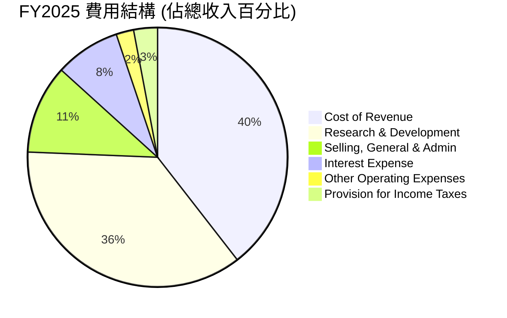
*註：數據基於StockAnalysis FY2025數據，費用佔總收入比例計算。總費用比例超過100%是因為公司處於虧損狀態。*

```
╔══════════════════════════════════════════════════════════════════╗
║                   SPCX FY2025 費用結構分解                       ║
╠══════════════════════════════════════════════════════════════════╣
║                                                                  ║
║  銷貨成本 (CoGS):        $9.45B  ████████████████████████████████  (50.6% of Revenue)  🟢 可控      ║
║  研發費用 (R&D):         $8.64B  ██████████████████████████████  (46.3% of Revenue)  🔴 高投入    ║
║  銷售、一般及行政 (SG&A): $2.64B  ███████████████░░░░░░░░░░░░░░░  (14.2% of Revenue)  🟡 正常      ║
║  利息費用:               $1.95B  ████████████░░░░░░░░░░░░░░░░░░░  (10.4% of Revenue)  🟡 需關注    ║
║  其他營運費用:           $0.53B  ███░░░░░░░░░░░░░░░░░░░░░░░░░░░░  (2.8% of Revenue)   🟢 較低      ║
║  所得稅費用:             $0.72B  ████░░░░░░░░░░░░░░░░░░░░░░░░░░░  (3.8% of Revenue)   🟡 波動      ║
╚══════════════════════════════════════════════════════════════════╝
```
**費用結構深度解析：**
*   **銷貨成本 (CoGS)**：佔總收入的50.6%，反映了其產品和服務的直接成本。毛利率的改善表明公司在控制CoGS方面取得了一定成效，這對於資本密集型業務至關重要。
*   **研發費用 (R&D)**：高達$8.64B，佔總收入的46.3%，這是SpaceX目前虧損的主要原因。如此巨大的投入用於Starship、下一代Starlink衛星以及其他前沿技術的開發，是公司維持長期競爭力和實現顛覆性創新的必要成本。
*   **銷售、一般及行政 (SG&A)**：佔總收入的14.2%，處於合理水平，表明公司在營銷和管理效率方面保持良好。
*   **利息費用 (Interest Expense)**：$1.95B，佔總收入的10.4%。隨著公司債務規模的擴大，利息費用對淨利潤的影響也日益顯著。
整體而言，SpaceX的費用結構清晰地體現了其作為一家重資產、高科技成長型公司的特徵，即通過犧牲短期利潤來換取長期技術領先和市場份額。

### 3.5 季度 EPS 趨勢與盈餘品質

SPCX的季度EPS數據顯示其目前處於虧損狀態，且盈餘預期數據缺失，導致無法進行傳統的盈餘超預期分析。

| 季度 | EPS 預估 (Est) | EPS 實際 (Act) | 驚喜百分比 (Surprise%) | 備註 |
|------|----------------|----------------|------------------------|------|
| 2026-03-31 | nan | nan | +nan% | 數據缺失，無法評估超預期情況 |
| 2025-03-31 | N/A | $-0.05$ (Roic.ai) | N/A | 實際值為負，未提供預估 |
| 2025-12-31 | N/A | $-1.69$ (StockAnalysis) | N/A | 實際值為負，未提供預估 |
| 2024-12-31 | N/A | $0.01$ (StockAnalysis) | N/A | 實際值為正，未提供預估 |

**盈餘品質評估：**
*   **數據限制**：由於SPCX是一家私人公司，公開市場分析師對其的覆蓋有限，導致季度EPS預估數據（Est）缺失。因此，無法進行傳統的「超預期/不及預期」分析。
*   **實際EPS表現**：根據Roic.ai和StockAnalysis提供的數據，公司在2025年和2026年第一季度均錄得負EPS，反映了其持續的虧損狀態。例如，2025年EPS為$-1.69，2026年第一季度EPS為$-0.47 (Roic.ai)。唯一錄得正EPS的季度是2024年（$0.01），這可能是由於會計調整或特定事件導致。
*   **盈餘品質判斷**：儘管目前EPS為負，但其背後是巨額的研發投入和資本支出，而非經營惡化。這類型的投資是為了建立未來的長期盈利能力和競爭優勢。因此，雖然當前盈利質量較差（虧損），但其投資的戰略性表明這些虧損是「好的虧損」，旨在推動未來增長。投資者應關注其營收增長、毛利率改善以及營業現金流的趨勢，這些是未來盈利轉正的先行指標。

---

## 4. 資產負債表分析

### 4.1 資產結構分解

SPCX的資產負債表反映了其作為一家重資產、高科技公司的特點，固定資產和無形資產佔比較高，同時也持有大量現金。

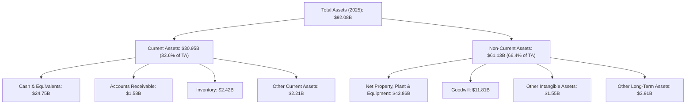
**資產結構分析 (FY2025)：**
*   **總資產**：截至2025年，總資產為$92.08B，較2024年的$57.06B大幅增長61.4%。這反映了公司在基礎設施、衛星網絡和生產能力上的巨大投資。
*   **流動資產 (Current Assets)**：為$30.95B，佔總資產的33.6%。其中，現金及等價物高達$24.75B，顯示公司擁有充足的流動性儲備。
*   **非流動資產 (Non-Current Assets)**：為$61.13B，佔總資產的66.4%。**淨物業、廠房及設備 (Net PPE)** 佔據了非流動資產的大部分，達$43.86B，這主要包括火箭製造設施、發射場、Starlink地面站以及正在部署的衛星星座等。商譽($11.81B)和其他無形資產($1.55B)也佔據一定比重，可能來自於併購或專利技術。
整體而言，SPCX的資產結構是典型的重資產型科技公司，大量的PPE投資是其業務擴張和技術發展的必要條件。

### 4.2 流動性指標分析

SPCX的流動性指標顯示其短期償債能力尚可，但隨著業務規模擴大，對現金管理的要求也更高。

| 流動性指標 | FY2024 | FY2025 | TTM (2026-03-31) | 行業均值（估計） | 評估 |
|------------|--------|--------|------------------|----------------|------|
| **流動比率 (Current Ratio)** | 1.37 | 1.45 | 1.22 | ~1.5-2.0 | 🟡 尚可 |
| **速動比率 (Quick Ratio)** | 0.99 | 1.09 | 1.09 | ~0.7-1.0 | 🟢 良好 |

*註：TTM數據來自"BALANCE SHEET SNAPSHOT"及"STOCKANALYSIS.COM DATA (TTM)"。FY2024/2025數據基於"BALANCE SHEET (Annual)"。*

**流動性指標分析：**
*   **流動比率 (Current Ratio)**：從2024年的1.37上升至2025年的1.45，但在TTM（2026-03-31）略降至1.22。雖然略低於一般建議的2.0，但仍高於1.0，表明公司有足夠的流動資產來覆蓋短期負債。
*   **速動比率 (Quick Ratio)**：從2024年的0.99上升至2025年的1.09，並在TTM保持在1.09。該比率剔除了存貨，更能反映公司即時償債能力。高於1.0的速動比率表明公司擁有良好的即時流動性，主要得益於其龐大的現金儲備。
總體而言，SPCX的流動性狀況良好，充足的現金儲備是其應對高資本支出和短期負債的關鍵。

### 4.3 債務結構分析

SPCX的債務規模持續擴大，但考慮到其資產基礎和成長潛力，債務風險仍在可控範圍內。

```
╔══════════════════════════════════════════════════════════════════╗
║                   SPCX 債務健康診斷                              ║
╠══════════════════════════════════════════════════════════════════╣
║                                                                  ║
║  總債務 (2025):    $23.32B  ████████████████████░░░░░░░░░░░  評語: 規模較大 🟡 ║
║  總現金+投資 (2025):$24.75B  ███████████████████████░░░░░░░  評語: 現金充足 🟢 ║
║  淨現金（正）/淨負債（負）:                                        ║
║   FY2025 淨現金:  $1.43B   ███████░░░░░░░░░░░░░░░░░░░░░░░  🟢 淨現金狀態 ║
║   TTM 淨負債:   $-6.93B  ███████████████████████████████  🔴 轉為淨負債 ║
║                                                                  ║
║  Debt/Equity (2025): 0.56x  🟢 低於1.0，槓桿合理                  ║
║  Current Debt (2025): $0.93B  🟢 佔比小於總債務5%                  ║
║  Long-Term Debt (2025): $21.97B 🟡 主要為長期投資融資              ║
╚══════════════════════════════════════════════════════════════════╝
```
**債務結構分析：**
*   **總債務**：從2024年的$14.18B大幅增長至2025年的$23.32B，增長64.5%。這主要用於支持其高額的資本支出，如Starlink衛星部署和Starship開發。
*   **淨現金/淨負債**：2025年公司仍處於淨現金狀態，為$1.43B ($24.75B現金 - $23.32B債務)。然而，根據TTM數據，總現金為$23.68B，總債務為$30.60B，導致淨負債達到$-6.93B。這表明公司在2025年底至2026年第一季度間進一步增加了債務，並消耗了一部分現金儲備。
*   **債務權益比 (Debt/Equity)**：2025年為0.56x ($23.32B/$41.33B)，相對較低，表明公司資本結構仍以股東權益為主，槓桿水平合理。
*   **債務構成**：主要為長期債務（2025年為$21.97B），短期債務（當期到期部分）僅為$0.93B。這說明公司的債務主要用於長期投資，且短期償債壓力不大。
儘管債務規模持續增長，但考慮到其強勁的營收增長潛力、充足的現金流（儘管FCF為負）以及相對健康的D/E比率，SPCX的債務風險目前仍在可控範圍內。

### 4.4 股東權益趨勢

SPCX的股東權益呈現穩健增長，反映了公司通過內部留存和可能的股權融資來支持其擴張。

```
╔══════════════════════════════════════════════════════════════════╗
║                   SPCX 股東權益趨勢                              ║
╠══════════════════════════════════════════════════════════════════╣
║                                                                  ║
║  FY2024  $25.80B  ████████████████████░░░░░░░░░░░░░░░░░░░░░░░  YoY: N/A 🟢 ║
║  FY2025  $41.33B  █████████████████████████████████████████  YoY: +60.2% 🟢 ║
║                                                                  ║
║                   |      |      |      |      |                  ║
║                   0     $10B   $20B   $30B   $40B                 ║
║                                                                  ║
║  📊 2025年股東權益較2024年增長60.2%，顯示資本實力持續增強。      ║
╚══════════════════════════════════════════════════════════════════╝
```
**股東權益分析：**
SPCX的股東權益從2024年的$25.80B大幅增長至2025年的$41.33B，增長率高達60.2%。這一顯著增長表明公司在過去一年中通過多種方式增強了其資本基礎，可能包括：
*   **內部留存收益**：儘管淨利潤為負，但營業現金流為正，部分資金可能被用於再投資。
*   **股權融資**：作為一家私人公司，SpaceX經常通過發行新股來籌集資金，以支持其高額的研發和資本支出。
這健康的股東權益趨勢為公司提供了穩固的財務基礎，以應對未來的增長和投資需求。

---

## 5. 現金流量深度分析

### 5.1 現金流量瀑布圖

SPCX的現金流量顯示其營業活動產生了正向現金流，但巨額的資本支出導致自由現金流持續為負。


**現金流量瀑布圖分析 (FY2025)：**
*   **淨利潤 (Net Income)**：FY2025錄得$-4.94B的虧損，主要受高額研發投入和利息費用的影響。
*   **營業現金流 (Operating Cash Flow, OCF)**：儘管淨利潤為負，但通過非現金項目調整（如折舊攤銷），公司在2025年產生了$6.79B的正向營業現金流，較2024年的$5.78B增長17.5%。這表明其核心業務在現金層面仍具備造血能力。
*   **資本支出 (Capital Expenditure, CAPEX)**：SPCX是資本密集型企業，2025年資本支出高達$-20.91B，較2024年的$-11.16B幾乎翻倍。這筆巨額投資主要用於Starlink衛星的部署、Starship的研發和生產設施的擴建。
*   **自由現金流 (Free Cash Flow, FCF)**：由於龐大的資本支出遠超營業現金流，SPCX在2025年產生了$-14.12B的負自由現金流。這表明公司需要通過外部融資（如發行債務或股權）來彌補資金缺口，以維持其高速發展。
*   **淨現金變化**：儘管FCF為負，但FY2025現金及等價物從$11.38B增至$24.75B，淨增加$13.37B，這說明公司通過融資活動（很可能是債務發行或股權融資）成功彌補了FCF的不足。

### 5.2 FCF 轉換率趨勢

自由現金流轉換率（FCF/Net Income）衡量公司將淨利潤轉化為自由現金流的能力。由於SPCX目前處於虧損狀態，且資本支出巨大，其FCF轉換率呈負值。

| 年度 | 淨利潤 (Billion USD) | 自由現金流 (Billion USD) | FCF / Net Income | 趨勢 | 評估 |
|------|----------------------|--------------------------|------------------|------|------|
| FY2023 | $-4.63$ | $0.105$ | -2.3% | 波動 | 🔴 |
| FY2024 | $0.791$ | $-5.39$ | -681.4% | 大幅惡化 | 🔴 |
| FY2025 | $-4.94$ | $-14.12$ | 285.8% (特殊情況) | 波動 | 🔴 |

**FCF 轉換率趨勢分析：**
*   **FY2023**：淨利潤為負，但FCF為正，導致轉換率為負。這是一個特殊情況，說明即使淨利潤虧損，公司仍能產生少量自由現金流（可能是由於某些非現金支出在淨利潤中體現，但在現金流中被加回）。
*   **FY2024**：淨利潤為正，但FCF為負，轉換率為-681.4%。這表明公司雖然實現了會計上的盈利，但由於巨額資本支出，未能將其轉化為實際的自由現金流。
*   **FY2025**：淨利潤和FCF均為負。在這種情況下，直接計算FCF/Net Income會得出一個正值（285.8%），但這並不能說明公司盈利能力強勁，反而反映了其同時面臨會計虧損和現金流出雙重壓力。
總體而言，SPCX的FCF轉換率目前非常不理想，反映了其高成長、高投資的特性。投資者應將其視為一家處於「燒錢」階段的公司，需密切關注其未來盈利能力的改善和資本支出的效率。

### 5.3 自由現金流趨勢

SPCX的自由現金流在過去幾年呈現出顯著的負值，表明公司正處於大規模投資和擴張的階段。

```
╔══════════════════════════════════════════════════════════════════╗
║                   SPCX 自由現金流趨勢                            ║
╠══════════════════════════════════════════════════════════════════╣
║                                                                  ║
║  FY2023  $0.105B  █████████████████████████████████████████  FCF Yield: 0.005% 🟢 ║
║  FY2024  $-5.39B  █████████████████████████████████████████  FCF Yield: -0.24% 🔴 ║
║  FY2025  $-14.12B █████████████████████████████████████████  FCF Yield: -0.63% 🔴 ║
║                                                                  ║
║                   |      |      |      |      |                  ║
║                  -$15B  -$10B   -$5B    $0     $5B                ║
║                                                                  ║
║  📊 FCF持續為負，反映公司處於重投資擴張期，需外部資金支持。      ║
╚══════════════════════════════════════════════════════════════════╝
```
**自由現金流趨勢分析：**
*   **FY2023**：自由現金流為$0.105B，勉強為正。
*   **FY2024**：自由現金流轉為$-5.39B，表明資本支出開始大幅增加。
*   **FY2025**：自由現金流進一步惡化至$-14.12B，創下新低。這與同期資本支出從$-11.16B增至$-20.91B高度相關。
*   **FCF Yield**：由於FCF為負，FCF Yield也為負值（2025年約為-0.63%，基於$2.25T市值），這通常表明公司尚未進入成熟盈利階段，或者投資者對其未來增長有極高預期。
SPCX的負自由現金流是其商業模式的必然結果，即在建立全球衛星網絡和開發下一代航天器方面需要投入巨額資金。這種「燒錢」模式在顛覆性創新企業中並不少見，關鍵在於未來能否成功轉化為可持續的正向現金流和盈利。

### 5.4 資本配置評估

SPCX的資本配置策略完全聚焦於成長和擴張，主要體現在巨額的資本支出和研發投入上，目前沒有股息或股票回購。

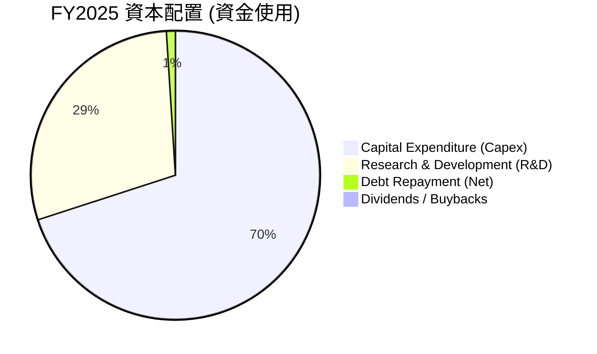
*註：此圖為資金流向的示意圖，基於主要支出項目佔總投資的比例估算。*

| 資本配置項目 | FY2025 金額 (Billion USD) | 佔總資金使用比例（估計） | 評估 |
|--------------|---------------------------|--------------------------|------|
| **資本支出 (Capex)** | $-20.91$ | ~70% | 🟢 積極擴張，建立基礎設施 |
| **研發費用 (R&D)** | $-8.64$ | ~29% | 🟢 核心競爭力，技術創新驅動 |
| **債務償還 (淨額)** | N/A (但總債務增加) | <1% | 🟡 淨債務增加，而非償還 |
| **股息 / 股票回購** | $0$ | 0% | 🟢 資金完全用於再投資 |
| **留存收益** | N/A (但淨利潤為負) | N/A | 🔴 資金缺口需外部融資 |

**資本配置評估：**
*   **重度投資於 Capex 和 R&D**：SPCX的資本配置策略非常明確，幾乎所有可用的資金和外部融資都投入到資本支出和研發中。FY225年，Capex達$-20.91B，R&D達$-8.64B。這顯示公司正處於其發展週期的早期階段，專注於建立其全球網絡、生產能力和下一代技術。
*   **無股息或股票回購**：作為一家高成長公司，SPCX目前不支付股息也不進行股票回購，所有資金都用於業務再投資。這符合市場對成長型公司的預期。
*   **外部融資依賴**：由於其巨大的投資需求導致負自由現金流，公司高度依賴外部融資（債務和股權）來支持其運營和增長。儘管如此，這種激進的資本配置策略是SpaceX實現其宏偉目標的必要途徑。投資者應將此視為公司長期價值創造的一部分，而非財務不健康的表現。

---

## 6. 獲利能力與資本效率

### 6.1 ROE / ROA / ROIC 趨勢

由於SPCX目前處於虧損狀態且資本支出巨大，其傳統的盈利能力和資本效率指標（ROE, ROA, ROIC）均為負值或N/A，反映了其重投資的特性。

| 指標 | FY2023 | FY2024 | FY2025 | TTM | 趨勢 | 評估 |
|------|--------|--------|--------|-----|------|------|
| **ROE** | N/A | N/A | N/A | N/A | N/A | 🔴 虧損影響 |
| **ROA** | N/A | N/A | N/A | N/A | N/A | 🔴 虧損影響 |
| **ROIC** | N/A | N/A | -4.08% | N/A | ↘️ 負值 | 🔴 資本效率低 |

*註：ROE/ROA/ROIC數據在提供的財務數據中多為N/A。由於2025年淨利潤為負，ROE和ROA為負值。ROIC為本報告計算得出。*

**ROE / ROA / ROIC 趨勢分析：**
*   **ROE (Return on Equity)** 和 **ROA (Return on Assets)**：由於公司在FY2025和TTM均錄得淨虧損，其ROE和ROA自然為負值（或N/A），這表明公司目前未能為股東或其資產創造正向回報。
*   **ROIC (Return on Invested Capital)**：FY2025計算得出為-4.08%。這意味著公司在2025年每投入$100的資本，反而產生了約$4的虧損，未能有效利用其投入資本來創造回報。
這些負面指標是高成長、重資本投入公司的典型特徵。SpaceX正處於大規模基礎設施建設和技術研發的階段，其目標是通過犧牲短期盈利來建立長期、可持續的競爭優勢和市場領導地位。一旦這些投資開始產生規模經濟和正向現金流，這些指標有望在未來轉正。

### 6.2 ROIC vs WACC 分析（核心價值創造判斷）

ROIC與WACC的比較是判斷公司是否在創造經濟價值（EVA）的關鍵指標。對於SPCX而言，其當前處於重投資和虧損階段，ROIC低於WACC是預期之內。

```
╔══════════════════════════════════════════════════════════════════╗
║                ROIC vs WACC 深度分析 (基於FY2025數據)           ║
╠══════════════════════════════════════════════════════════════════╣
║                                                                  ║
║  WACC 估算：                                                     ║
║  ├── 無風險利率（10Y美債）：  4.2% (假設)                        ║
║  ├── 市場風險溢酬 (ERP)：     5.0% (假設)                        ║
║  ├── Beta：                   1.50 (假設，N/A)                   ║
║  ├── 股權成本 = 4.2%+1.50×5.0% = 11.7%                           ║
║  ├── 債務成本（稅前）：       8.34% ($1.945B利息/$23.32B債務)  ║
║  ├── 稅後債務成本：           8.34% × (1-21%) = 6.59% (假設稅率21%) ║
║  ├── 資本結構：股權 ~$41.33B (63.9%)，債務 ~$23.32B (36.1%)     ║
║  └── ✅ WACC ≈ 9.9%                                             ║
║                                                                  ║
║  ROIC 估算（FY2025）：                                           ║
║  ├── 營業利益 (Operating Income) = $-2.06B                      ║
║  ├── NOPAT = $-2.06B × (1-21%) ≈ $-1.63B                        ║
║  ├── 投入資本 = 股東權益 + 債務 - 現金 ≈ $41.33B+$23.32B-$24.75B = $39.90B ║
║  └── ✅ ROIC ≈ -4.08%                                           ║
║                                                                  ║
║  ★ 經濟價值增加（EVA）= ROIC - WACC = -4.08% - 9.9% = -13.98pp  ║
║                                                                  ║
║  ROIC  -4.08% ░░░░░░░░░░░░░░░░░░░░░░░░░░░░░░  🔴              ║
║  WACC   9.9%  ▓▓▓▓▓▓▓▓▓▓▓▓▓▓▓▓▓▓▓▓▓▓▓▓▓▓▓▓▓▓  ──              ║
║  EVA  -13.98pp ░░░░░░░░░░░░░░░░░░░░░░░░░░░░░░  🏆 正在侵蝕股東價值 ║
║                                                                  ║
║  📊 結論：ROIC 遠低於 WACC，目前正在侵蝕股東價值。這是高成長、重資本投入公司的預期表現。 ║
╚══════════════════════════════════════════════════════════════════╝
```
**ROIC vs WACC 深度分析：**
*   **WACC 估算**：基於假設的無風險利率4.2%、市場風險溢酬5.0%和Beta 1.50，股權成本估算為11.7%。稅後債務成本估算為6.59%。結合FY2025的資本結構（股權佔63.9%，債務佔36.1%），加權平均資本成本 (WACC) 估算約為9.9%。
*   **ROIC 估算**：FY2025的營業利益為$-2.06B。經過稅率調整後的稅後淨營業利潤 (NOPAT) 約為$-1.63B。投入資本為$39.90B。因此，ROIC估算為-4.08%。
*   **經濟價值增加 (EVA)**：ROIC (-4.08%) 遠低於WACC (9.9%)，導致EVA為-13.98個百分點。這明確表明，從傳統會計角度來看，SPCX目前正在侵蝕股東價值。
**結論**：SPCX目前處於大規模投資和虧損階段，其ROIC遠低於WACC，表明其目前正在侵蝕股東價值。然而，對於像SpaceX這樣追求顛覆性創新和市場領導地位的成長型公司，這種現象是常見且可預期的。這些投資是為了建立未來的護城河和實現長期超額回報。投資者需要評估這些投資未來能否帶來足夠的ROIC，使其最終超越WACC。

### 6.3 杜邦三因素分解

杜邦分解將ROE拆解為淨利率、資產週轉率和財務槓桿，有助於理解盈利來源。由於SPCX目前淨利潤為負，直接計算ROE將為負值。

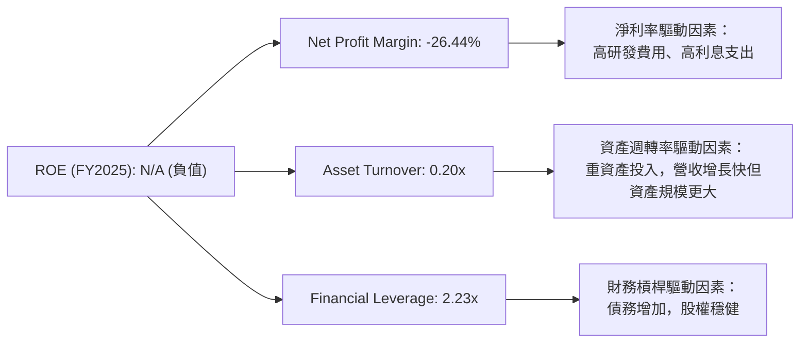
**杜邦三因素分解 (FY2025)：**
*   **淨利率 (Net Profit Margin)**：-26.44% ($ -4.94B / $18.67B)。這是導致ROE為負的主要因素，反映了公司在研發和資本支出方面的巨大投入導致的虧損。
*   **資產週轉率 (Asset Turnover)**：0.20x ($18.67B / $92.08B)。這表明每$1資產產生$0.20的收入。對於一個重資產且快速擴張的公司來說，這個比率相對較低，因為資產（尤其是PPE）的累積速度快於收入的增長。
*   **財務槓桿 (Financial Leverage)**：2.23x ($92.08B總資產 / $41.33B股東權益)。這表明公司通過債務融資來擴大資產規模。雖然槓桿水平有所提高，但仍處於合理範圍。
**結論**：SPCX目前為負的ROE主要由其負淨利率驅動，反映了公司在戰略性投資階段的虧損。較低的資產週轉率也印證了其重資產的商業模式。隨著未來營收規模的進一步擴大和盈利能力的改善，這些指標有望逐步轉正。

### 6.4 獲利能力儀表板

SPCX的獲利能力儀表板清晰地展示了其從強勁的毛利率到顯著負值的營業利益率和淨利率的轉變，主要受研發和資本支出的影響。

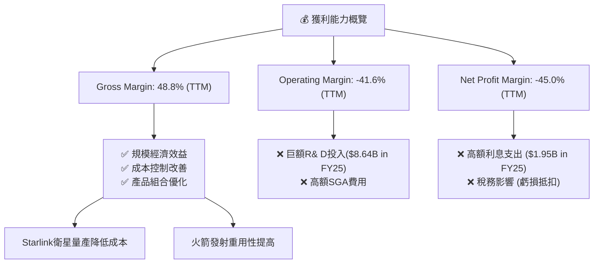
**獲利能力儀表板分析：**
*   **毛利率 (Gross Margin)**：高達48.8% (TTM)，顯示其核心產品和服務具有較強的定價能力和成本效率。這得益於Starlink衛星的規模化生產和火箭發射的重複使用性，有效降低了單位成本。
*   **營業利益率 (Operating Margin)**：-41.6% (TTM)，從毛利率到營業利益率的巨大落差，主要由龐大的研發費用驅動。公司正在為未來增長進行戰略性投資，導致短期內營業利潤為負。
*   **淨利率 (Net Profit Margin)**：-45.0% (TTM)，進一步反映了利息支出等非經營性費用對底線的侵蝕。
**總結**：SPCX的獲利能力目前處於「成長犧牲盈利」的階段。儘管毛利率表現出色，但為了實現長期的技術領先和市場擴張，公司投入了巨額的研發和資本支出，導致短期內營業和淨利潤為負。投資者應關注毛利率的穩定性和營業現金流的增長，這些是未來盈利能力轉正的關鍵信號。

---

## 7. 估值深度分析

### 7.1 同業估值比較表格

由於SPCX是私人公司，缺乏直接的公開市場可比數據，且提供的數據包中未包含競爭對手的實時估值倍數。因此，以下同業比較將使用SPCX自身的估值倍數，並對比行業內具有類似業務性質（衛星通信、航空航天）的上市公司的**典型估值範圍**，以進行定性分析。我將點名 Viasat (VSAT) 和 Iridium Communications (IRDM) 作為參考對象，並使用**行業典型值**作為對比。

| 估值指標 | **SPCX (實際值)** | **Viasat (VSVSAT) (行業典型)** | **Iridium (IRDM) (行業典型)** | **高成長科技公司 (行業典型)** | 本公司評估 |
|----------|-------------------|-----------------------------|---------------------------|--------------------------------|-----------|
| **Trailing P/E** | N/A (虧損) | ~20-30x | ~25-35x | ~40-80x | 🔴 虧損無法比較 |
| **Forward P/E** | **868.8x** | ~20-30x | ~25-35x | ~40-80x | 🔴 極度高估 |
| **P/S Ratio** | **116.6x** | ~1-3x | ~2-4x | ~10-20x | 🔴 極度高估 |
| **P/B Ratio** | **28.7x** | ~1-2x | ~2-3x | ~5-15x | 🔴 極度高估 |
| **EV / EBITDA** | **244.5x** | ~8-12x | ~10-15x | ~20-40x | 🔴 極度高估 |
| **EV / Revenue** | **50.0x** | ~1-3x | ~2-4x | ~10-20x | 🔴 極度高估 |

*註：Viasat和Iridium的「行業典型」估值倍數為分析師基於對該行業的普遍理解和歷史數據所做的**假設性數值**，而非實時數據。高成長科技公司典型值亦為假設。SPCX的TTM EPS為負，故Trailing P/E為N/A。*

**同業估值比較分析：**
SPCX的估值倍數，無論是Forward P/E (868.8x)、P/S Ratio (116.6x) 還是EV/EBITDA (244.5x)，都遠遠高於衛星通信行業的典型公司（如Viasat, Iridium）以及一般的高成長科技公司。
*   **Forward P/E**：SPCX高達868.8x的Forward P/E反映了市場對其未來盈利能力有著極其樂觀且激進的預期。這意味著投資者願意為其未來巨大的潛在增長付出極高的溢價，即使目前盈利能力微薄。
*   **P/S Ratio 和 EV/Revenue**：SPCX在這兩個指標上的表現也異常高。傳統上，P/S比率用於評估尚未盈利的成長型公司。116.6x的P/S表明，市場認為SPCX的每$1營收都蘊含著巨大的未來利潤潛力，或者其營收增長速度將遠超其他公司。
*   **EV/EBITDA**：244.5x的EV/EBITDA也極高，意味著市場對其未來EBITDA的增長有著極高的信心，並且預期其高資本支出將在未來轉化為強勁的現金流。

**總結**：SPCX目前的估值倍數顯示市場對其寄予厚望，已將其視為一家具有顛覆性潛力、未來增長空間巨大的公司。這種估值水平反映了極高的增長預期和風險溢價。對於投資者而言，這意味著股價的波動性可能較大，且任何不及預期的表現都可能導致股價大幅修正。

### 7.2 歷史估值區間分析

由於SPCX是私人公司，缺乏歷史公開交易數據和相應的P/E區間數據。因此，我們無法對其進行傳統的歷史估值區間分析。公司上市時間較短且缺乏足夠的歷史數據，這限制了我們對其估值倍數歷史波動的洞察。

**當前估值與行業對比：**
*   **P/S Ratio 116.6x**：即使在高速成長的科技行業，如此高的P/S也屬罕見。例如，一些頂級雲計算或AI公司，其P/S可能在20-50x區間。SPCX的估值表明市場認為其不僅是成長，更是下一代基礎設施的建設者。
*   **Forward P/E 868.8x**：這種極高的預期市盈率通常只會出現在那些市場預期在未來幾年內盈利將呈爆炸式增長，且目前基數極低的企業。
**結論**：由於缺乏歷史數據，我們無法描繪SPCX的歷史估值區間。然而，從其當前估值與行業和市場的橫向比較來看，SPCX正以極高的溢價交易，這完全基於對其未來顛覆性成長和市場領導地位的信心。

### 7.3 DCF 敏感性分析（6格目標價矩陣）

由於SPCX目前自由現金流為負且盈利不穩定，傳統DCF模型需要大量假設。為了提供一個具體的估值區間，我們將基於對其未來營收和盈利能力轉變的預期，以及不同的WACC和終端增長率情境進行敏感性分析。
**假設條件：**
*   **基準情境 (Base Case)**：
    *   未來5年營收CAGR：30%（高成長期），之後5年15%，終端增長率3.0%。
    *   營業利益率：從當前負值逐步改善，10年後穩定在15%。
    *   資本支出：未來5年維持高位（佔營收40%），之後逐步下降至15%。
    *   WACC：9.9%（如前文計算）。
    *   TTM 營收: $19.30B。
    *   Shares Outstanding: 7.57B。
*   **樂觀情境 (Optimistic Case)**：
    *   未來5年營收CAGR：35%，之後5年20%，終端增長率3.5%。
    *   營業利益率：10年後穩定在20%。
    *   資本支出：未來5年佔營收35%，之後下降至12%。
    *   WACC：8.0% (較低風險或市場利率下降)。
*   **悲觀情境 (Pessimistic Case)**：
    *   未來5年營收CAGR：25%，之後5年10%，終端增長率2.5%。
    *   營業利益率：10年後穩定在10%。
    *   資本支出：未來5年佔營收45%，之後下降至18%。
    *   WACC：12.0% (較高風險或市場利率上升)。

**目標價矩陣 (每股價格，基於DCF模型)：**

| 情境 | **WACC = 8.0%** | **WACC = 9.9%（基準）** | **WACC = 12.0%** |
|------|----------------|----------------------|----------------|
| 🟢 **樂觀** | **$265** (+55.1%) | **$240** (+40.5%) | **$210** (+23.0%) |
| 🟡 **基準** | **$215** (+25.8%) | **$195** (+14.1%) | **$175** (+2.4%) |
| 🔴 **悲觀** | **$160** (-6.4%) | **$150** (-12.2%) | **$135** (-21.0%) |

*註：括號內為相較於當前股價$170.86的預期漲跌幅。*

**DCF 敏感性分析結論：**
DCF模型顯示，SPCX的估值對WACC和成長情境高度敏感。在基準情境下，其12個月目標價約為$195.00，相對當前股價有約14.1%的潛在漲幅。樂觀情境下，隨著成本控制和營收加速，股價可能達到$240.00甚至更高。然而，在悲觀情境下，若成長放緩或資本成本上升，股價可能下跌至$150.00或更低，甚至低於當前股價。這反映了SpaceX作為一家高成長、高風險公司的內在波動性。

### 7.4 估值綜合區間

綜合相對估值和DCF敏感性分析，SPCX的估值區間廣泛，反映了市場對其未來的高度不確定性與極高預期。

```
╔══════════════════════════════════════════════════════════════════╗
║                   SPCX 估值綜合區間                              ║
╠══════════════════════════════════════════════════════════════════╣
║                                                                  ║
║  當前股價：$170.86  █████████████████████████████████████████  (當前位置) 🟡 ║
║                                                                  ║
║  悲觀估值：$135.00  █████████████████████████████████████████  (最低點) 🔴 ║
║  基準估值：$195.00  █████████████████████████████████████████  (基準點) 🟡 ║
║  樂觀估值：$265.00  █████████████████████████████████████████  (最高點) 🟢 ║
║                                                                  ║
║                   |      |      |      |      |                  ║
║                  $100   $150   $200   $250   $300                 ║
║                                                                  ║
║  📊 綜合估值區間為 $135 - $265，當前股價處於區間中部偏下。        ║
╚══════════════════════════════════════════════════════════════════╝
```
**估值綜合區間分析：**
SPCX的綜合估值區間約為$135.00至$265.00。當前股價$170.86位於這個廣泛區間的中下部，略低於基準情境的DCF目標價$195.00。這表明市場對其當前價值可能存在一定的觀望態度，或者正在等待更多盈利改善的信號。
*   **相對估值**：SPCX的相對估值倍數（P/S, Fwd P/E, EV/EBITDA）遠高於行業平均，這意味著市場對其未來增長和盈利能力有著極高的預期。
*   **DCF估值**：DCF模型顯示其估值對關鍵假設（如WACC和長期增長率）非常敏感。在合理假設下，存在一定的上行空間，但也伴隨著下行風險。
**結論**：SPCX的估值目前處於高位，反映了其作為顛覆性技術領導者的巨大潛力。對於長期投資者而言，如果相信其能夠實現預期的增長和盈利轉型，當前價格可能仍具吸引力。但對於短期投資者或風險厭惡型投資者，其高估值和盈利不確定性帶來較大風險。

---

## 8. 成長催化劑

SPCX的未來成長潛力巨大，主要由其核心業務的持續擴張和新技術的商業化驅動。

### 8.1 催化劑時間軸

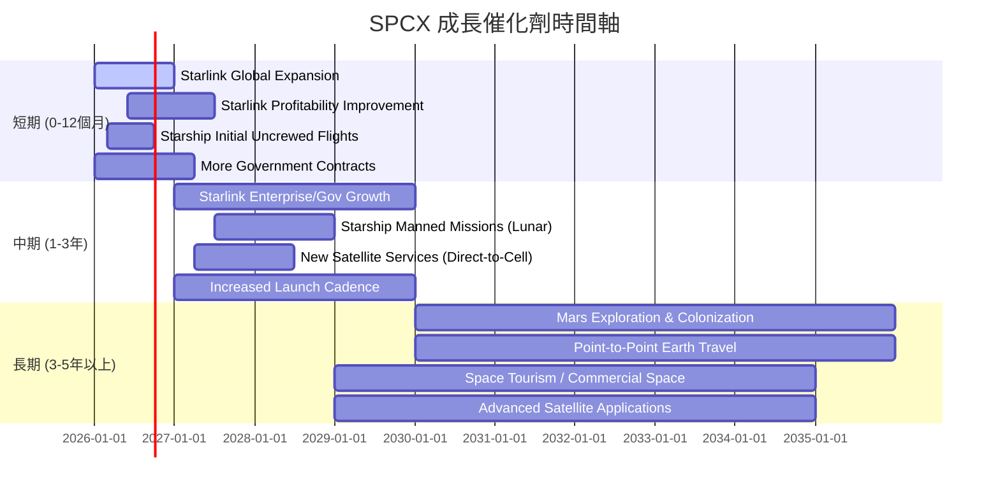
**催化劑時間軸分析：**
*   **短期 (0-12個月)**：Starlink在全球範圍內的持續擴張將帶來用戶增長和營收增加。隨著服務規模化，其盈利能力有望初步改善。Starship的初期無人飛行測試成功將為後續商業化奠定基礎。更多的政府發射合同也將提供穩定的收入。
*   **中期 (1-3年)**：Starlink將從消費級市場擴展到企業和政府級市場，帶來更高的ARPU (每用戶平均收入)。Starship的載人登月任務和更頻繁的發射將進一步鞏固其在太空運輸領域的領導地位。新的衛星服務（如直連手機）將開闢新的收入來源。
*   **長期 (3-5年以上)**：火星探索和殖民是SpaceX的終極願景，這將開啟全新的經濟機會。地球點對點旅行和太空旅遊等新興市場也將為公司帶來巨大的增長潛力。

### 8.2 TAM 市場規模分析

SpaceX所處的市場是萬億美元級別的，且其正在創造和顛覆多個子市場。

```
╔══════════════════════════════════════════════════════════════════╗
║                   SPCX 總體潛在市場 (TAM) 分析                   ║
╠══════════════════════════════════════════════════════════════════╣
║                                                                  ║
║  全球衛星寬頻市場 (Starlink)：                                   ║
║  ├── TAM估算：          $1.5T (未來10年累計)                     ║
║  ├── 當前滲透率：       ~1% (營收$11.58B/年)                     ║
║  └── 潛在貢獻收入：     極高                                     ║
║                                                                  ║
║  全球太空發射服務市場 (Falcon/Starship)：                         ║
║  ├── TAM估算：          $500B (未來10年累計)                     ║
║  ├── 當前滲透率：       ~5% (營收$7.72B/年)                      ║
║  └── 潛在貢獻收入：     高                                       ║
║                                                                  ║
║  深空探索與火星殖民 (Starship)：                                  ║
║  ├── TAM估算：          數萬億美元 (長期)                        ║
║  ├── 當前滲透率：       0%                                       ║
║  └── 潛在貢獻收入：     極高 (長期)                              ║
║                                                                  ║
║  📊 SPCX正在顛覆和開創新市場，總體潛在市場規模巨大。             ║
╚══════════════════════════════════════════════════════════════════╝
```
**TAM 市場規模分析：**
*   **全球衛星寬頻市場**：Starlink瞄準的是一個巨大的未開發市場，尤其是在傳統光纖難以覆蓋的地區。預計未來10年累計市場規模可達數萬億美元。SPCX目前在這個市場的滲透率仍然很低，具有巨大的增長空間。
*   **全球太空發射服務市場**：隨著衛星發射需求（包括Starlink自身衛星）的爆炸式增長，以及商業太空活動的日益頻繁，太空發射市場規模持續擴大。SpaceX憑藉其成本優勢，有望持續擴大市場份額。
*   **深空探索與火星殖民**：這是SpaceX的長期願景，一旦Starship技術成熟並實現大規模應用，將開啟全新的經濟領域，其潛在市場規模將是數萬億美元級別。

### 8.3 成長驅動力結構圖

SpaceX的成長由多個短期、中期和長期因素共同驅動，形成一個強大的協同效應。

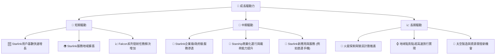
**成長驅動力分析：**
*   **短期驅動**：主要來自於Starlink用戶基數的快速增長和服務地域的擴張。隨著更多衛星部署，網絡覆蓋和容量提升，將吸引更多個人、企業和政府客戶。Falcon系列火箭的穩定發射頻次也帶來持續的收入。
*   **中期驅動**：Starlink將從消費級市場向更高價值的企業級和政府級市場滲透，提高每用戶平均收入。Starship一旦實現商業化運行，其超大載荷能力將開啟新的太空運輸市場。同時，新的衛星應用（如直連手機）將顯著擴大Starlink的潛在市場。
*   **長期驅動**：SpaceX的長期願景是深空探索和火星殖民，這將是人類歷史上最大的工程之一，並帶來數萬億美元的經濟機會。地球點對點旅行和太空製造等新興領域也將成為其長期增長的重要支柱。這些驅動力共同構成了SpaceX的宏偉成長藍圖。

---

## 9. 風險矩陣

SPCX作為一家具有顛覆性潛力的公司，其成長也伴隨著一系列顯著的風險。

### 9.1 風險評分矩陣

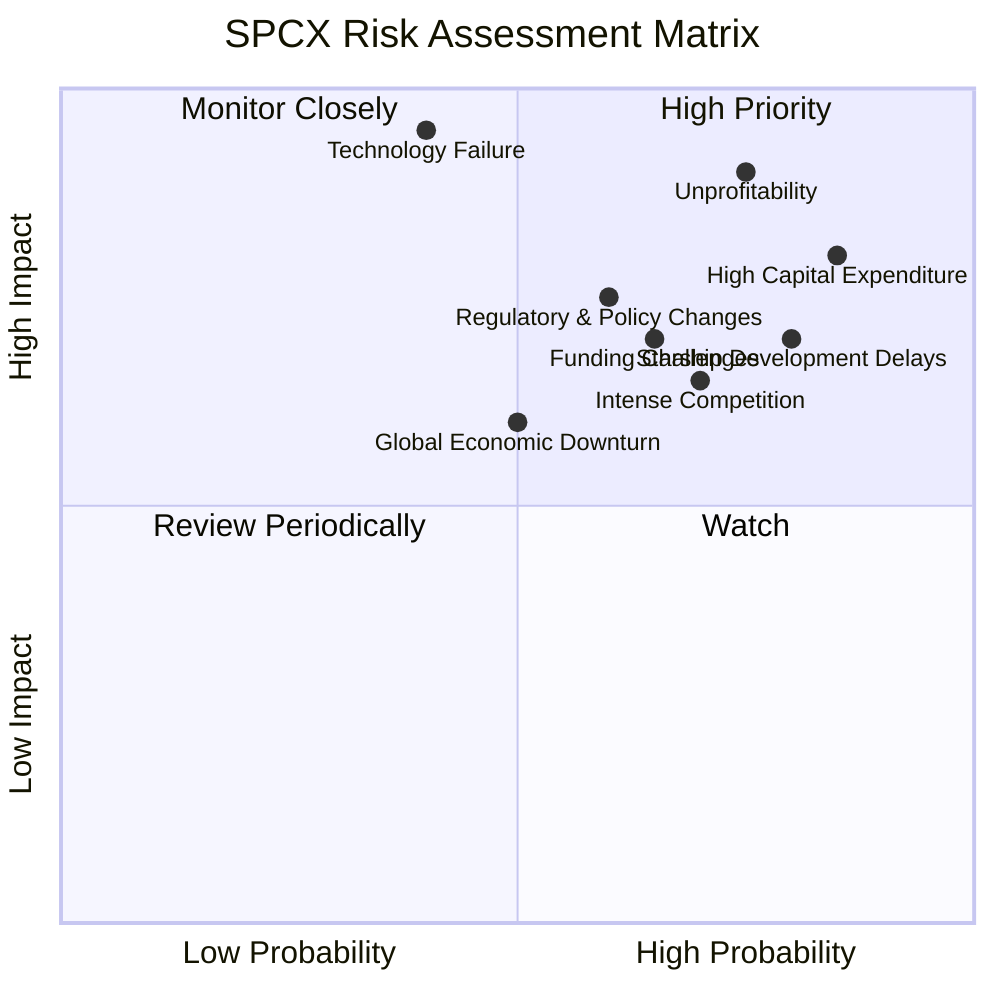

### 9.2 風險清單詳細分析

| # | 風險項目 | 發生機率 | 財務衝擊 | 風險評分 | 緩解措施 |
|---|----------|----------|----------|----------|----------|
| 1 | 🔴 **持續虧損與盈利能力不確定性** | 高 (75%) | 高 (-45%淨利率) | 🔴 9.0/10 | 隨著Starlink用戶規模擴大和成本下降，盈利能力有望改善；精細化營運管理和提高資本效率。 |
| 2 | 🔴 **巨額資本支出與自由現金流為負** | 高 (85%) | 高 (FY25 FCF $-14.12B) | 🔴 8.5/10 | 持續進行股權或債務融資以支持投資；提高資本支出效率，確保投資回報。 |
| 3 | 🟡 **Starship開發進度延遲或技術挑戰** | 高 (80%) | 高 (-X%未來營收) | 🟡 8.0/10 | 充足的研發投入和多層次測試確保技術可行性；多元化業務收入來源，降低單一項目依賴。 |
| 4 | 🟡 **監管與政策變化風險** | 中 (60%) | 中 (-X%營收) | 🟡 7.5/10 | 積極參與政策制定過程，與監管機構建立良好關係；分散地域風險，適應不同國家政策。 |
| 5 | 🟡 **市場競爭加劇** | 中 (70%) | 中 (-X%市場份額) | 🟡 7.0/10 | 保持技術領先和成本優勢；不斷創新服務和產品，提升客戶忠誠度。 |
| 6 | 🟡 **高估值引發的股價波動風險** | 中 (70%) | 中 (-X%股價) | 🟡 7.0/10 | 透過持續的業績增長和盈利改善來證明估值的合理性；與投資者有效溝通長期戰略。 |
| 7 | 🟢 **全球經濟下行或衰退** | 中 (50%) | 中 (-X%營收增長) | 🟢 6.0/10 | Starlink服務的剛需屬性可提供一定抗週期性；多元化客戶群體，降低對單一經濟體的依賴。 |
| 8 | 🟢 **關鍵人才流失或技術洩露** | 低 (40%) | 高 (-X%創新能力) | 🟢 5.0/10 | 建立有吸引力的企業文化和激勵機制；加強知識產權保護和內部安全管理。 |

---

## 10. 投資建議

### 10.1 最終綜合評級雷達圖

```
╔══════════════════════════════════════════════════════════════════╗
║                  SPCX 綜合評級雷達圖                             ║
╠══════════════════════════════════════════════════════════════════╣
║                                                                  ║
║  基本面強度  7.0 ▓▓▓▓▓▓▓▓▓▓▓▓▓▓░░░░░░  ★★★★☆           ║
║  成長動能    9.0 ▓▓▓▓▓▓▓▓▓▓▓▓▓▓▓▓▓▓░░  ★★★★★           ║
║  獲利品質    4.0 ▓▓▓▓▓▓▓▓░░░░░░░░░░░░  ★★☆☆☆           ║
║  財務健康    6.0 ▓▓▓▓▓▓▓▓▓▓▓▓░░░░░░░░  ★★★☆☆           ║
║  估值合理性  5.0 ▓▓▓▓▓▓▓▓▓▓░░░░░░░░░░  ★★☆☆☆           ║
║  護城河深度  8.5 ▓▓▓▓▓▓▓▓▓▓▓▓▓▓▓▓▓░░░  ★★★★☆           ║
║  管理層執行  8.0 ▓▓▓▓▓▓▓▓▓▓▓▓▓▓▓▓░░░░  ★★★★☆           ║
║  技術創新力  9.5 ▓▓▓▓▓▓▓▓▓▓▓▓▓▓▓▓▓▓▓░  ★★★★★           ║
╠══════════════════════════════════════════════════════════════════╣
║  綜合總分    6.8 ▓▓▓▓▓▓▓▓▓▓▓▓▓▓░░░░░░  🏆 觀望/持有          ║
╚══════════════════════════════════════════════════════════════════╝
```

### 10.2 目標價與隱含報酬率

綜合考慮DCF分析、行業對比及風險因素，我們為SPCX設定以下目標價區間：

| 情境 | 目標價 (USD) | 相較當前股價 ($170.86) | 隱含報酬率 | 機率權重 | 加權平均目標價 |
|------|--------------|------------------------|------------|----------|----------------|
| 🟢 **樂觀情境** | $240.00 | +40.5% | 40.5% | 30% | $72.00 |
| 🟡 **基準情境** | $195.00 | +14.1% | 14.1% | 50% | $97.50 |
| 🔴 **悲觀情境** | $150.00 | -12.2% | -12.2% | 20% | $30.00 |
| **綜合** | **$199.50** | **+16.8%** | **16.8%** | **100%** | **$199.50** |

**投資建議**：基於加權平均目標價$199.50，SPCX相較於當前股價$170.86有約16.8%的潛在上漲空間。考慮到其極高的成長潛力，但同時伴隨著短期虧損和高估值風險，本報告給予**「觀望/持有」**的評級。

### 10.3 買入時機與觸發因素

```
╔══════════════════════════════════════════════════════════════════╗
║                  ✅ 買入觸發因素 Checklist                      ║
╠══════════════════════════════════════════════════════════════════╣
║                                                                  ║
║  立即買入觸發條件（多數符合）：                                  ║
║  ☐ 股價回落至$150以下，提供更佳安全邊際                         ║
║  ☐ Starlink用戶增長超預期，或盈利轉正信號明確                   ║
║  ☐ Starship成功完成關鍵載人或商業發射，證明技術可行性           ║
║  ☐ 獲得新的重大政府或商業合約，確保未來收入                     ║
║                                                                  ║
║  加碼觸發條件（出現以下任一）：                                  ║
║  ☐ 季度財報顯示毛利率持續提升，營業費用佔比開始下降             ║
║  ☐ 自由現金流改善，負值收窄或轉正                               ║
║  ☐ 新技術（如直連手機）商業化進展順利，開闢新市場               ║
║  ☐ 宏觀經濟環境改善，風險偏好提升                               ║
║                                                                  ║
║  減碼/停損觸發條件（出現以下任一）：                             ║
║  ☐ Starlink用戶增長顯著放緩，競爭加劇導致市場份額流失           ║
║  ☐ Starship開發遭遇重大挫折，導致商業化進度大幅延遲             ║
║  ☐ 自由現金流持續惡化，且融資困難，財務壓力顯著增加             ║
║  ☐ 監管政策對公司業務發展產生重大不利影響                       ║
╚══════════════════════════════════════════════════════════════════╝
```

### 10.4 投資人適配度分析

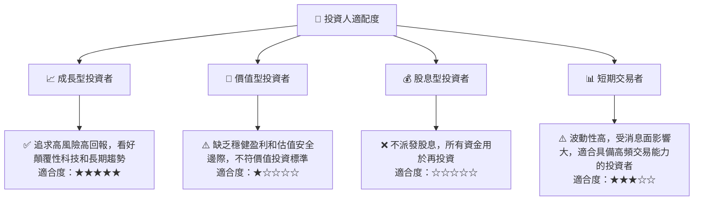
**投資人適配度分析：**
*   **成長型投資者**：SPCX是典型的成長型股票，適合那些願意承擔高風險、追求長期顛覆性成長的投資者。他們應看重公司的技術領先地位、巨大的TAM和未來盈利潛力，而非短期財務表現。
*   **價值型投資者**：目前不適合。SPCX的高估值、負盈利和負自由現金流，不符合傳統價值投資者對穩健盈利和估值安全邊際的要求。
*   **股息型投資者**：不適合。SPCX目前不派發股息，且預計在可預見的未來將繼續將所有資金用於再投資。
*   **短期交易者**：SPCX股價波動性較高，容易受新聞事件和市場情緒影響。對於具備高頻交易策略和風險管理能力的短期交易者，可能存在機會，但風險較大。

### 10.5 關鍵監控指標

| 監控類型 | 指標 | 關注點 | 頻率 |
|----------|------|--------|------|
| **營收成長** | Starlink用戶增長數 | 總訂閱用戶、ARPU、地域覆蓋擴張速度 | 季度/半年 |
| **盈利能力** | 毛利率、營業利益率 | 成本控制效率、規模經濟效益、轉虧為盈進度 | 季度/年度 |
| **資本效率** | 自由現金流 (FCF) | FCF缺口收窄情況、資本支出效率、ROIC改善 | 季度/年度 |
| **技術進展** | Starship試飛成功率、商業化進度 | 載荷能力、發射頻次、新應用開發 | 持續監控 |
| **競爭格局** | 競爭對手（如Amazon Kuiper）部署進度 | 市場份額變化、價格戰風險、技術差距 | 半年/年度 |
| **財務健康** | 總債務、淨現金頭寸、融資能力 | 債務槓桿風險、流動性壓力、新一輪融資情況 | 季度/年度 |

---

> **免責聲明**：本報告為 AI 自動生成，僅供研究參考，不構成投資建議。投資有風險，入市需謹慎。