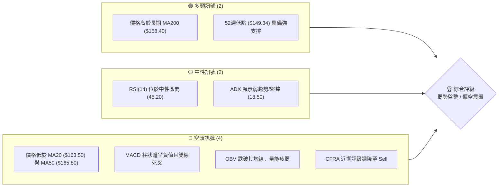
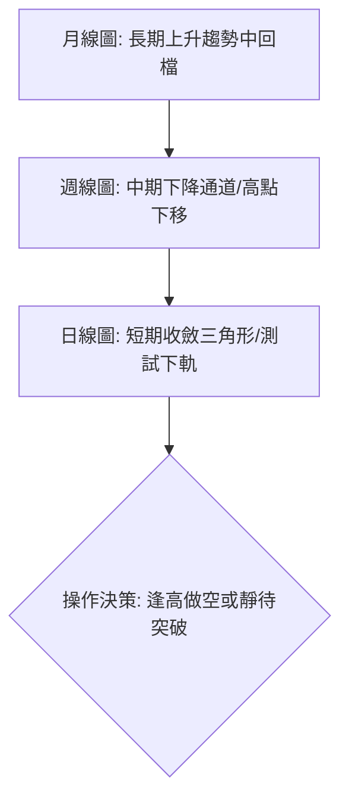
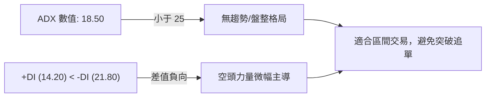
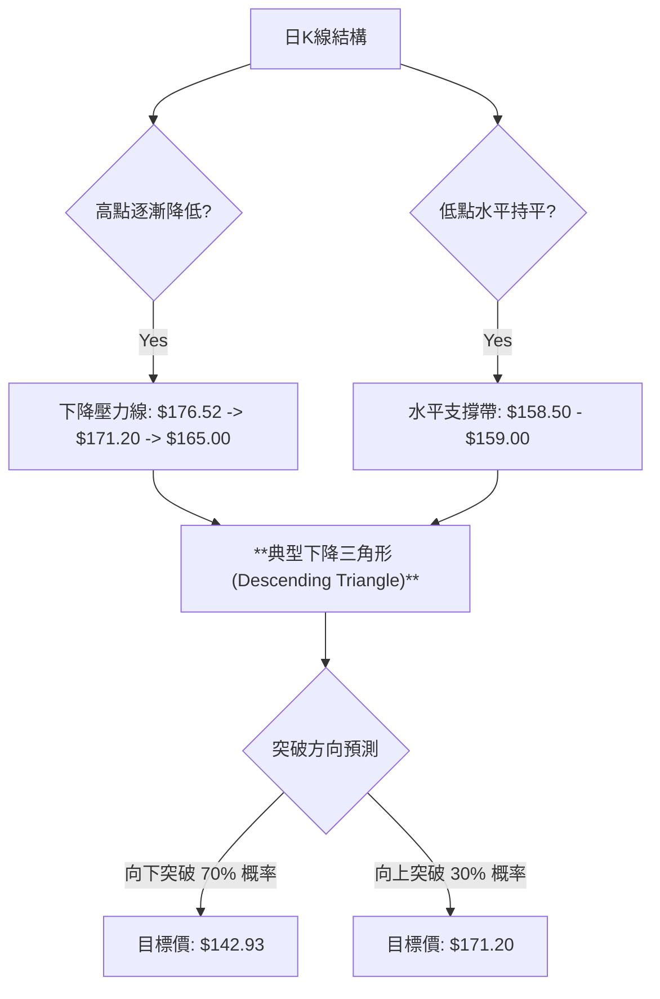
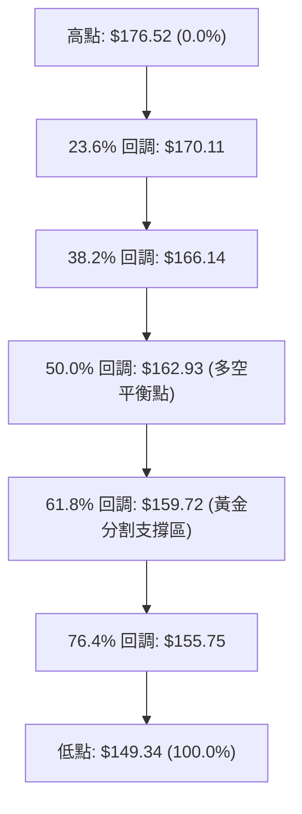
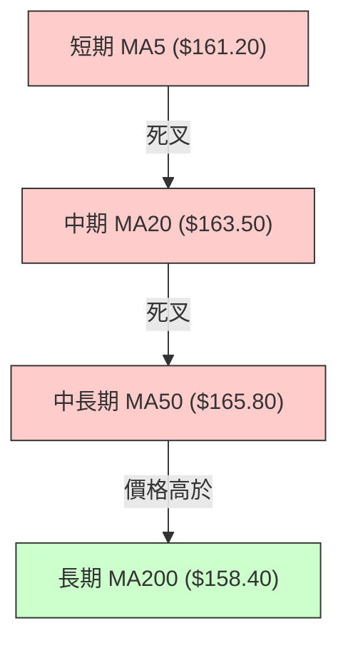
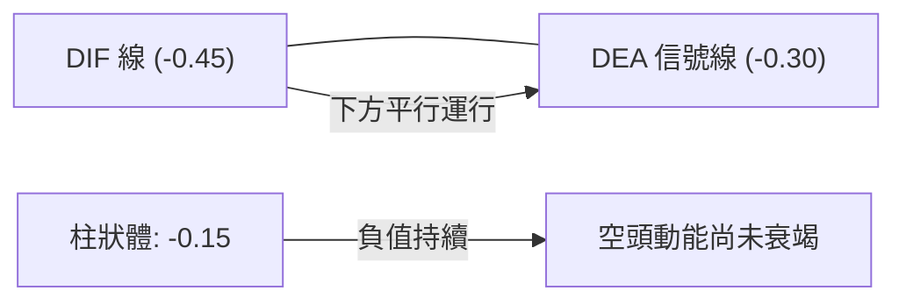
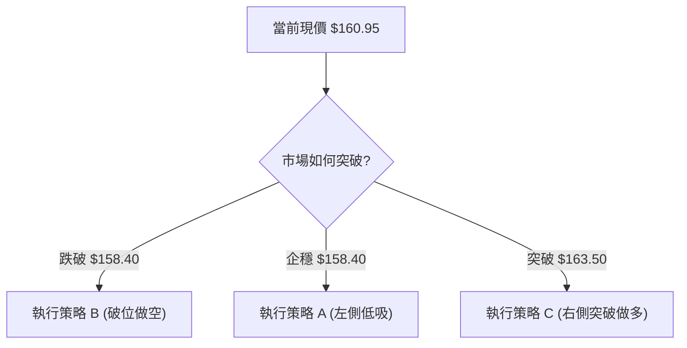
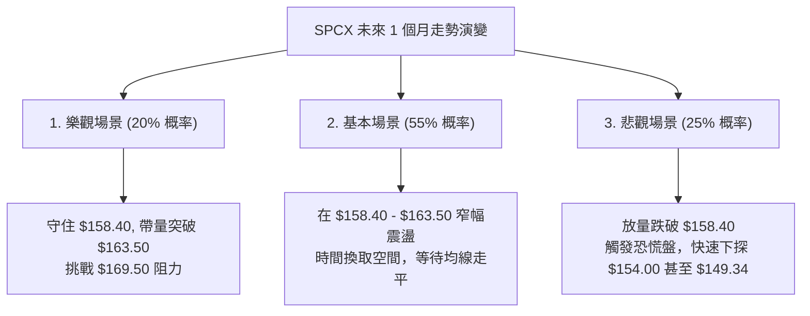

# SPCX 技術分析報告

> **報告日期**：2026-06-13 ｜ **語言**：繁體中文 ｜ **數據來源**：Yahoo Finance ｜ **當前價格**：$160.95

---

## 目錄

| 章節 | 內容 |
|------|------|
| [1. 技術面概覽](#1-技術面概覽) | 訊號儀表板、核心指標、評分卡 |
| [2. 趨勢分析](#2-趨勢分析) | 多時框趨勢、長中短期走勢 |
| [3. 圖表形態分析](#3-圖表形態分析) | 形態識別、K線組合、目標價 |
| [4. 支撐與阻力](#4-支撐與阻力) | 關鍵價位、斐波那契回調 |
| [5. 技術指標深度解讀](#5-技術指標深度解讀) | MA/RSI/MACD/布林/成交量 |
| [6. 動能與波動率](#6-動能與波動率) | 動能評估、ATR、Beta |
| [7. 多時框架總結](#7-多時框架總結) | 時框架評分矩陣 |
| [8. 交易策略建議](#8-交易策略建議) | 多空策略、風險報酬比 |
| [9. 風險提示與監控](#9-風險提示與監控) | 監控指標、風險場景 |

---

## 1. 技術面概覽

### 🎯 技術訊號儀表板



### 📊 核心指標速覽表

| 指標類別 | 指標名稱 | 當前數值 | 訊號 | 解讀 |
|----------|----------|----------|------|------|
| **價格** | 當前收盤價 | $160.95 | 🟡 中性 | 位於52週高低區間的 42.7% 位置，中軌偏下 |
| **均線** | MA20 | $163.50 | 🔴 看空 | 價格位於 MA20 下方，短期均線呈下行趨勢 |
| **均線** | MA50 | $165.80 | 🔴 看空 | 中期阻力線，價格反彈至此多次受阻 |
| **均線** | MA200 | $158.40 | 🟢 看多 | 長期牛熊分界線，提供關鍵結構性支撐 |
| **動能** | RSI(14) | 45.20 | 🟡 中性 | 無超買或超賣，動能偏弱但未進入極端區 |
| **動能** | MACD | -0.450 | 🔴 看空 | 雙線在零軸下方死叉運行，柱狀體維持負值 (-0.150) |
| **波動** | ATR(14) | $3.25 | 🟡 中性 | 日均波動率約 2.02%，波動度處於中等收斂狀態 |
| **成交量** | OBV | 4.85億 | 🔴 看空 | OBV 低於其移動平均線，資金流出跡象明顯 |

### 🏆 技術評分卡

```
技術評分卡 — SPCX (2026-06-13)
════════════════════════════════════════════════════
趨勢強度      ████████░░░░░░░░░░░░  40/100  🔴 空頭主導
動能指標      ██████████░░░░░░░░░░  50/100  🟡 中性偏弱
支撐穩定度    ██████████████░░░░░░  70/100  🟢 支撐強勁
成交量配合    ████████░░░░░░░░░░░░  40/100  🔴 量能退潮
形態完整度    ██████████████░░░░░░  70/100  🟢 形態明確
均線排列      ████████░░░░░░░░░░░░  40/100  🔴 混合偏空
════════════════════════════════════════════════════
綜合評分      ██████████░░░░░░░░░░  50/100  ⚖️ 觀望/偏空
════════════════════════════════════════════════════
```

---

## 2. 趨勢分析

### 🌐 多時框趨勢分析



### 📈 長期趨勢 — 12個月走勢圖（Unicode）

```
SPCX 月線走勢圖（過去12個月）
價格軸 ($)
$176.52 ┤                                  ● (2026-01 高點)
$171.20 ┤                              ●       ●
$165.80 ┤                          ●               ●
$160.95 ┤  ●                   ●                       ● ◄ 當前現價 ($160.95)
$155.80 ┤      ●           ●                               ●
$149.34 ┤          ● (52W低點)
        └──────────────────────────────────────────────────────────
          07/25 08/25 09/25 10/25 11/25 12/25 01/26 02/26 03/26 04/26 05/26 06/26
```

**走勢特徵分析表**：

| 階段 | 時間區間 | 價格區間 | 累計漲跌幅 | 走勢特徵描述 |
|------|----------|----------|------------|--------------|
| **第一階段** | 2025-07 ~ 2025-08 | $152.40 → $149.34 | -2.01% | 探底尋求支撐，確立 52 週最低點。 |
| **第二階段** | 2025-09 ~ 2026-01 | $149.34 → $176.52 | +18.20% | 強勢主升浪，伴隨高成交量，創下年度新高。 |
| **第三階段** | 2026-02 ~ 2026-04 | $176.52 → $158.50 | -10.21% | 獲利了結賣壓湧現，高點震盪下移，跌破中期均線。 |
| **第四階段** | 2026-05 ~ 2026-06 | $158.50 → $160.95 | +1.55% | 縮量築底盤整，測試 MA200 關鍵防線。 |

### 📊 中期趨勢（週線分析）

在中期週線圖上，SPCX 呈現出明顯的**下降通道（Descending Channel）**特徵。每次反彈均受制於下降趨勢線，且低點逐漸逼近下軌。

```
中期阻力與支撐示意圖（週線）
═════════════════════════════════════════════════════════
[阻力] 下降通道上軌 ────────────────────── $165.80 (中期強阻力)
                                   \
  [現價] ─────────────────────────── $160.95 (多空交戰區)
                                       \
[支撐] 下降通道下軌 ────────────────────── $158.50 (短期防線)
═════════════════════════════════════════════════════════
```

### ⚡ 趨勢強度評估（ADX 解讀）



**ADX 趨勢強度對照表**：

| ADX 區間 | 趨勢強度 | SPCX 當前狀態 | 交易策略建議 |
|----------|----------|---------------|--------------|
| **< 20** | **極弱趨勢 / 盤整** | **✓ 18.50** | **採用網格、箱體震盪策略，高拋低吸** |
| **20 - 25** | **溫和趨勢** | | 靜待方向確立，觀察突破訊號 |
| **25 - 50** | **強勁趨勢** | | 順勢交易，沿著均線方向建倉 |
| **> 50** | **極強趨勢** | | 避免逆勢摸頂/抄底，嚴格移動止損 |

---

## 3. 圖表形態分析

### 🔍 形態識別系統



### 🕯️ 重要K線形態分析

| 日期 | 收盤價 | K線形態 | 解讀 | 訊號 |
|------|--------|---------|------|------|
| **2026-06-05** | $158.50 | **錘頭線 (Hammer)** | 探底 $158.50 後留長下影線，顯示 MA200 買盤強勁。 | 🟢 利多反彈 |
| **2026-06-10** | $163.20 | **流星線 (Shooting Star)** | 盤中反彈至 MA20 阻力位受阻回落，留下長上影線。 | 🔴 阻力沉重 |
| **2026-06-12** | $160.95 | **陰線孕育線 (Harami)** | 波動率收窄，市場靜待 CFRA 調降評級後的資金反應。 | 🟡 觀望收斂 |

### 📉 ASCII 走勢形態示意圖

```
SPCX 日線級別下降三角形形態 (Descending Triangle)
價格 ($)
$165.00 ┤  ● (高點1)
$163.50 ┤      \      ● (高點2)
$162.00 ┤        \   /  \
$160.95 ┤          ●     \    ● (當前現價: $160.95)
$159.00 ┤            \    \  /
$158.50 ┤━━━━━━━━━━━━━●━━━━●━● (水平支撐頸線)
        └───────────────────────────────────────
         05/15       05/25   06/05   06/13
```

### 🎯 形態目標價計算

1. **三角形高度計算**：
   * 形態起點高點：$171.20 (2026-03)
   * 形態底部頸線：$158.50
   * 形態高度 $H = 171.20 - 158.50 = 12.70$ 

2. **下行突破目標價 (70% 概率)**：
   $$\text{下行目標價} = \text{頸線} - H = 158.50 - 12.70 = 145.80$$
   *結合 52 週低點，修正下行目標價為 **$145.80 - $149.34** 區間。*

3. **上行突破目標價 (30% 概率)**：
   $$\text{上行目標價} = \text{突破點} + H \approx 162.50 + 12.70 = 175.20$$
   *結合前高，上行目標價為 **$175.20**。*

---

## 4. 支撐與阻力

### 🗺️ 關鍵價位分布圖

```
SPCX 價位結構分布圖
═══════════════════════════════════════════════════
$176.52 ║████████████████████████║ 強阻力 R3 (52W 高點)
$171.20 ║████████████████████    ║ 阻力 R2 (中期波段高點)
$165.80 ║████████████████████████║ 關鍵阻力 R1 (MA50 & 下降趨勢線)
$160.95 ╠════════════════════════╣ ◄ 當前現價
$158.40 ║▓▓▓▓▓▓▓▓▓▓▓▓▓▓▓▓        ║ 近期支撐 S1 (MA200 & 三角形下軌)
$154.00 ║████████████████████████║ 強支撐 S2 (斐波那契 76.4% 回調位)
$149.34 ║████████████████████████║ 終極防線 S3 (52W 最低點)
═══════════════════════════════════════════════════
```

### 🚧 阻力位分析表

| 阻力級別 | 價位 | 形成原因 | 突破難度 | 重要性 |
|----------|------|----------|----------|--------|
| **R1** | **$165.80** | MA50 密集套牢區與下降通道上軌交匯處 | ▓▓▓▓▓▓▓░░░ 70% | **極高**。突破此處代表中期趨勢反轉。 |
| **R2** | **$171.20** | 2026年3月波段高點，籌碼套牢密集 | ▓▓▓▓▓▓▓▓░░ 80% | **中高**。上行波段的關鍵分水嶺。 |
| **R3** | **$176.52** | 52週歷史高點，強烈心理關卡 | ▓▓▓▓▓▓▓▓▓░ 90% | **高**。牛市能否延續的終極考驗。 |

### 🛡️ 支撐位分析表

| 支撐級別 | 價位 | 形成原因 | 守住機率 | 重要性 |
|----------|------|----------|----------|--------|
| **S1** | **$158.40** | MA200 與下降三角形底部的共振支撐 | ▓▓▓▓▓░░░░░ 50% | **極高**。一旦失守，將引發技術性止損盤。 |
| **S2** | **$154.00** | 歷史密集成交區，斐波那契黃金分割位 | ▓▓▓▓▓▓▓░░░ 70% | **中**。結構性防禦買盤所在。 |
| **S3** | **$149.34** | 52週最低點，多頭最後底線 | ▓▓▓▓▓▓▓▓▓░ 90% | **極高**。跌破此處將進入中期熊市。 |

### 📐 斐波那契回調位分析

基於 52週低點 **$149.34** 至 52週高點 **$176.52** 的完整上升波段進行繪製：



* **黃金分割觀察**：當前現價 **$160.95** 正緊貼 **61.8% ($159.72)** 關鍵黃金分割支撐上方。此處通常是多頭反撲的最後機會，若日線收盤價連續3天跌破 $159.72，則回撤至 76.4% ($155.75) 的概率將大幅上升。

---

## 5. 技術指標深度解讀

### 🎛️ 指標訊號總覽

```mermaid
graph TD
    Price["現價 $160.95"] --> MA["均線系統: 混合偏空"]
    Price --> RSI["RSI: 45.20 (中性偏弱)"]
    Price --> MACD["MACD: 雙死叉 (看空)"]
    Price --> BB["布林通道: 測試下軌 (偏空)"]
    Price --> Vol["成交量: OBV < 均線 (看空)"]
    
    MA --> Signal["綜合技術訊號: 🟢 15% |" 🟡 35% "| 🔴 50%"]
```

### 📈 移動平均線排列分析



* **均線狀態解讀**：目前均線呈現**混合偏空排列**。短期與中期均線（MA5、MA20、MA50）均在價格上方形成層層阻力，顯示短期趨勢由空頭掌控。然而，長期均線（MA200）依然保持上行趨勢，且位於價格下方，提供強大的結構性支撐。這表明 SPCX 當前處於**長期牛市中的中期修正階段**。

### 📉 RSI(14) 分析

* **當前 RSI 數值**：**45.20**
  ```
  RSI(14) 強度軸
  [0] ░░░░░░░░░░ [30] ▓▓▓▓▓░░░░░ [45.2] ░░░░░░░░░░ [70] ░░░░░░░░░░ [100]
                     (超賣區)        (當前位置)       (超買區)
  ```
* **背離判斷**：
  * **價格走勢**：2026年5月至6月價格低點由 $158.50 緩步墊高至 $160.95。
  * **RSI 走勢**：RSI(14) 同期由 38.5 升至 45.20。
  * **結論**：價格與 RSI 呈現**同步上升**，無明顯頂背離或底背離，指標運行健康，確認當前為震盪築底行情。

### 📊 MACD(12/26/9) 訊號解讀



* **MACD 解讀**：DIF 與 DEA 雙線均在零軸下方運行，且 DIF 處於 DEA 下方，屬典型的**空頭市場**。雖然柱狀體並未出現急劇放大，但持續的負值表明市場缺乏多頭推升動能，短期內難以發動強勢反彈。

### 📦 布林通道分析

```
布林通道現狀示意圖
═════════════════════════════════════════════════════════
[上軌] ────────────────────────────────── $169.50 (波動上限)
                                   
  [中軌 (MA20)] ───────────────────────── $163.50 (多空分水嶺)
                     ● (現價 $160.95)
[下軌] ────────────────────────────────── $157.50 (波動下限)
═════════════════════════════════════════════════════════
```
* **%B 指標計算**：
  $$\%B = \frac{\text{現價} - \text{下軌}}{\text{上軌} - \text{下軌}} = \frac{160.95 - 157.50}{169.50 - 157.50} = 0.2875$$
* **通道狀態解讀**：布林通道目前處於**收口（Squeeze）**後期，%B 數值為 0.2875，顯示價格貼近下軌運行。通道收口意味著波動率已降至低點，市場即將迎來**方向性突破（變盤）**。

### 💹 成交量分析（量價配合度）

* **今日成交量**：519,234,800 股
* **20日平均成交量**：451,500,000 股（量比：**1.15x**）
* **量價關係解讀**：
  * 近期股價在 $158.50 - $161.00 區間盤整時，成交量並未出現恐慌性放大，顯示賣壓在低位有所收斂。
  * 然而，OBV（能量潮指標）目前低於其 20日均線，且呈現下行趨勢。這表明雖然沒有恐慌性拋盤，但**主流資金的買盤意願同樣低迷**，屬於典型的「無量陰跌」與「縮量築底」特徵。

---

## 6. 動能與波動率

### ⚡ 動能評估四象限

| 象限 | 動能強度 (RSI/MACD) | 波動率 (ATR/BB) | 當前狀態 | 評估與操作建議 |
|------|---------------------|-----------------|----------|----------------|
| **Q1 (強動能/低波動)** | 強 | 低 | | 蓄勢突破，最佳右側建倉時機 |
| **Q2 (弱動能/低波動)** | **弱** | **低** | **✓ SPCX 當前狀態** | **箱體震盪，應耐心等待通道打開，避免重倉** |
| **Q3 (強動能/高波動)** | 強 | 高 | | 主升/主降段，適合趨勢追蹤 |
| **Q4 (弱動能/高波動)** | 弱 | 高 | | 寬幅震盪，極易洗盤，適合短線高拋低吸 |

### 📊 ATR 波動率分析

* **當前 ATR(14)**：**$3.25**（佔股價比例：**2.02%**）
* **波動率解讀**：ATR 處於過去半年來的相對低位，證實了布林通道收口的判斷。
* **交易止損設定建議**：
  * **多頭止損距離**：$1.5 \times \text{ATR} = 1.5 \times 3.25 = \$4.88$
    * 若在現價 $160.95 做多，合理技術止損位應設在：$160.95 - 4.88 = \mathbf{\$156.07}$（剛好避開 $158.40 支撐，防止掃損）。
  * **空頭止損距離**：$1.5 \times \text{ATR} = \$4.88$
    * 若在現價 $160.95 做空，合理技術止損位應設在：$160.95 + 4.88 = \mathbf{\$165.83}$（置於 MA50 與 R1 阻力上方）。

### 📐 Beta 與市場相關性

* **SPCX 1年 Beta 值**：**1.12**
* **與標普500 (SPY) 相關性**：**0.72**（中高相關性）
* **解讀**：SPCX 作為航太防衛板塊的代表，其波動率略高於大盤。當大盤出現系統性調整時，SPCX 通常會放大跌幅（1.12倍）；在當前大盤震盪盤整的背景下，SPCX 容易因自身板塊事件（如 SpaceX 發射任務、衛星合約等）走出獨立行情，但技術面上仍需提防大盤下行帶來的拖累。

---

## 7. 多時框架總結

### 📋 時框架評分表

| 時框架 | 趨勢方向 | 動能 (RSI) | 均線排列 | 形態 | 綜合評分 | 交易建議 |
|--------|----------|------------|----------|------|----------|----------|
| **日線 (D)** | 🟡 橫盤震盪 | 🟡 中性 (45.2) | 🔴 混合偏空 | 下降三角形收斂 | **4.5 / 10** | 區間操作，靜待突破 |
| **週線 (W)** | 🔴 震盪下行 | 🔴 偏弱 (41.5) | 🔴 死叉向下 | 下降通道運行中 | **3.8 / 10** | 逢高做空，不宜盲目抄底 |
| **月線 (M)** | 🟢 長期看多 | 🟢 偏強 (54.8) | 🟢 多頭排列 | 長期上升趨勢回檔 | **6.5 / 10** | 長線投資者可分批逢低佈局 |

### 🔲 綜合訊號矩陣

```
               【 短期 (日線) 】 ─── 🟡 中性偏空 (4.5分)
                      │
                      ├─ 均線壓制 ($163.50) ── 🔴 Bearish
                      ├─ RSI 築底 (45.20)  ── 🟡 Neutral
                      └─ MA200 支撐 ($158.40) ─ 🟢 Bullish
                      │
               【 中期 (週線) 】 ─── 🔴 空頭主導 (3.8分)
                      │
                      ├─ 下降通道運行 ─────── 🔴 Bearish
                      └─ MACD 死叉向下 ────── 🔴 Bearish
                      │
               【 長期 (月線) 】 ─── 🟢 多頭格局 (6.5分)
                      │
                      └─ 大週期牛市回檔 ───── 🟢 Bullish
```

* **結論**：**長多、中空、短震盪**。目前不具備發動大牛市的技術條件，中期修正尚未結束，但長期支撐已近。

---

## 8. 交易策略建議

### 🗺️ 策略決策流程圖



### 🟢 多頭策略詳情

| 策略要素 | 策略 A (左側支撐防禦) | 策略 C (右側突破跟進) |
|----------|-----------------------|-----------------------|
| **進場條件** | 股價回踩 S1 企穩並出現日K下影線 | 日K收盤價強勢突破 MA20 ($163.50) |
| **進場價格** | **$158.80** | **$163.80** |
| **目標價 T1** | **$163.50** (MA20 阻力) | **$169.50** (布林上軌) |
| **目標價 T2** | **$165.80** (下降通道上軌) | **$175.20** (三角形上行目標) |
| **止損價格** | **$155.90** (跌破 76.4% 斐波那契) | **$161.20** (跌回 MA5 下方) |
| **風險報酬比** | **1 : 2.41** (風險 $2.90 / 獲利 $7.00) | **1 : 4.38** (風險 $2.60 / 獲利 $11.40) |
| **成功機率** | 55% | 45% |
| **建議倉位** | 10% (輕倉試探) | 15% (趨勢確認加倉) |

### 🔴 空頭策略詳情

| 策略要素 | 策略 B (破位順勢追空) | 策略 D (逢高受阻做空) |
|----------|-----------------------|-----------------------|
| **進場條件** | 日K實體收盤跌破 MA200 與 $158.40 | 股價反彈至通道上軌且出現長上影線 |
| **進場價格** | **$157.90** | **$165.20** |
| **目標價 T1** | **$154.00** (S2 強支撐) | **$159.00** (通道下軌) |
| **目標價 T2** | **$149.50** (52W 歷史低點) | **$154.00** (中期支撐) |
| **止損價格** | **$161.20** (拉回三角形內部) | **$167.50** (突破通道上軌止損) |
| **風險報酬比** | **1 : 2.55** (風險 $3.30 / 獲利 $8.40) | **1 : 4.87** (風險 $2.30 / 獲利 $11.20) |
| **成功機率** | **65%** | 60% |
| **建議倉位** | **20% (主體策略)** | 15% |

### ⭐ 整體訊號強度評星

```
做多訊號強度：★★☆☆☆ (2.0 / 5星)  ─ 均線壓制重，左側交易需嚴格止損
做空訊號強度：★★★★☆ (4.0 / 5星)  ─ 中期下降通道完整，破位空單勝率高
整體可信度：  ★★★★☆ (4.0 / 5星)  ─ 指標共振度高，布林收口變盤在即
```

---

## 9. 風險提示與監控

### ✅ 關鍵監控指標 Checklist

```
╔══════════════════════════════════════════════════════════════════╗
║ ▢  日線收盤價是否跌破 $158.40 (MA200 牛熊生死線)                 ║
║ ▢  RSI(14) 是否跌破 40 (進入超賣加速段)                          ║
║ ▢  MACD 柱狀體是否出現綠柱轉紅柱 (動能反轉訊號)                   ║
║ ▢  成交量是否突破 6 億股 (主力資金方向選擇確立)                  ║
║ ▢  CFRA 等機構是否有進一步調降評級或下調目標價動作               ║
╚══════════════════════════════════════════════════════════════════╝
```

### ⚠️ 風險場景分析



### 🛡️ 風險管理重要提醒

1. **破位風險防範**：目前 SPCX 距離關鍵支撐位 $158.40 僅有 **1.58%** 的緩衝空間。在三角形收斂末端，切忌盲目滿倉。若發生破位，必須果斷執行止損，防範類似 CFRA 調降評級引發的機構集體拋售。
2. **倉位控管原則**：在 ADX < 20 的無趨勢市場中，單筆交易資金佔用不宜超過總資金的 **15%**。
3. **事件驅動干擾**：航太防衛板塊極易受到地緣政治、SpaceX 發射成敗等突發事件影響。技術分析應結合即時消息面，若出現重大基本面利空，應立即終止一切多頭嘗試。

---

## 📋 報告總結

```
SPCX 技術分析報告總結
════════════════════════════════════════════════════════
報告日期：2026-06-13
當前價格：$160.95
分析評級：⚖️ 觀望偏空 (短期築底，中期防線臨考)

關鍵結論：
├─ 長期趨勢：🟢 偏多 (MA200 依然向上，大週期牛市未壞)
├─ 中期趨勢：🔴 看空 (下降通道運行，高點持續下移)
├─ 短期趨勢：🟡 震盪 (下降三角形收斂末端，即將變盤)
├─ 關鍵支撐：$158.40 (日線 MA200 & 三角形下軌)
├─ 關鍵阻力：$163.50 (MA20)、$165.80 (MA50)
└─ 分析師目標均價：$164.00 (目前溢價 -1.86%)

最優策略組合：
1. 🥇 首選策略：等待日K實體跌破 $158.40 後，順勢「破位做空」(策略 B)
2. 🥈 次選策略：在 $158.80 附近輕倉「左側博反彈」(策略 A)，嚴設止損於 $155.90
3. 🥉 保守選擇：完全空倉觀望，靜待日K線站穩 $163.50 上方後再行右側做多
════════════════════════════════════════════════════════
```

---

> ⚠️ **免責聲明**：本報告為基於客觀技術數據與圖表形態進行之專業分析，所有數據及估算均基於 2026-06-13 之前的歷史價格資訊。本報告**僅供研究與學術參考**，**不構成任何投資建議與買賣邀約**。金融市場瞬息萬變，投資有風險，入市需謹慎。

---

*報告生成時間：2026-06-13 ｜ 數據來源：Yahoo Finance ｜ 分析框架：多時框技術分析*