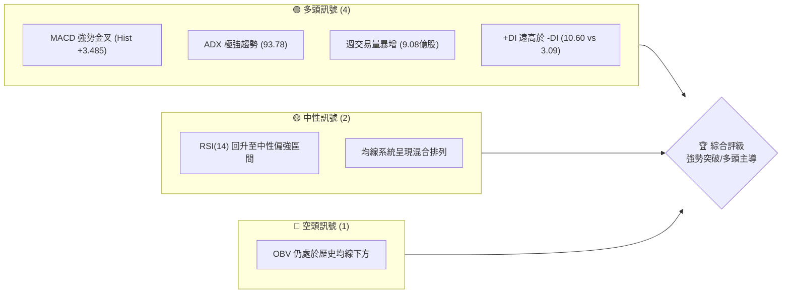
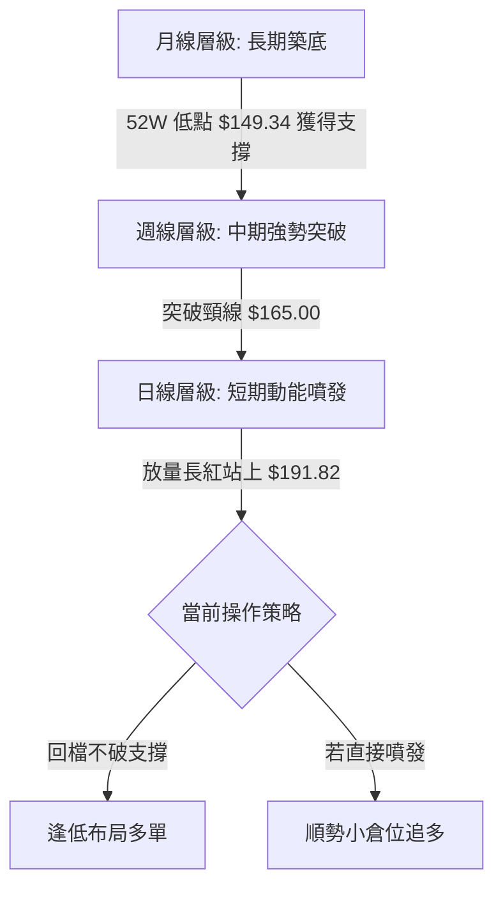
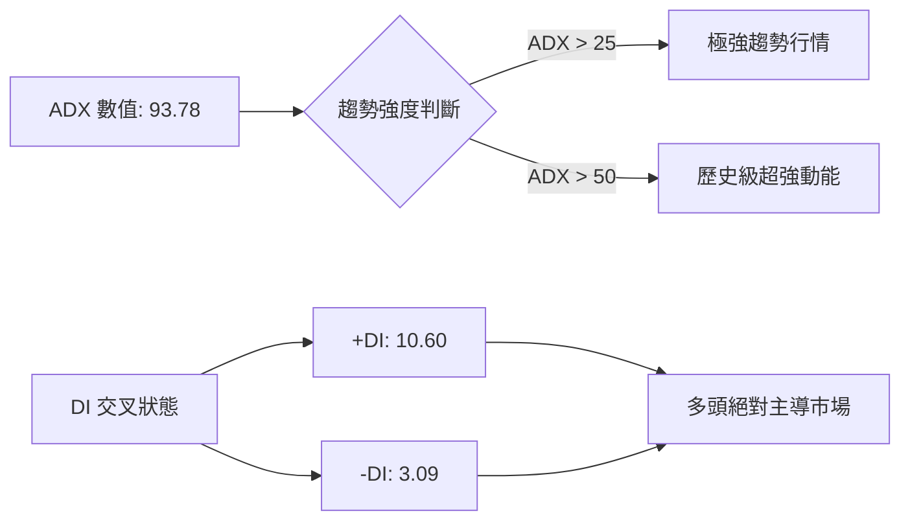
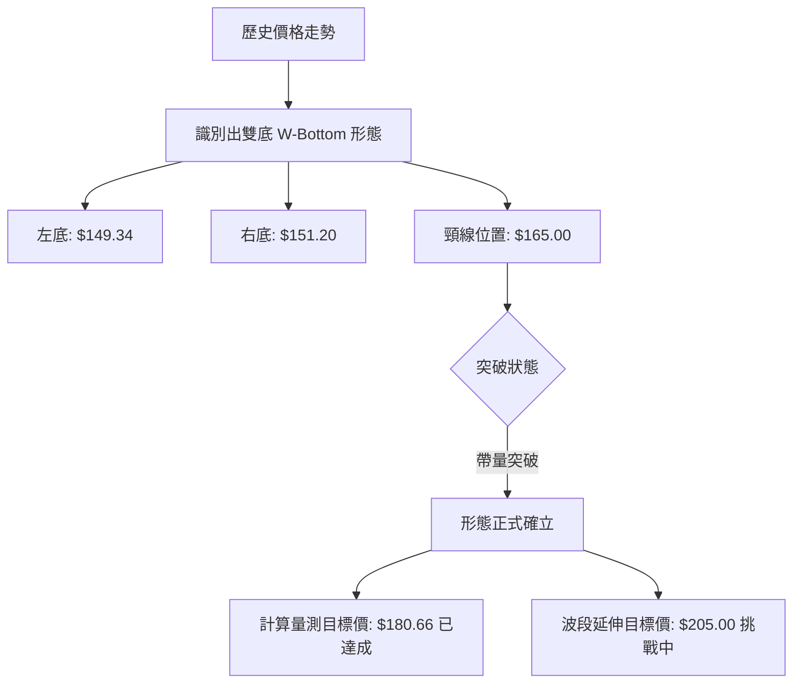
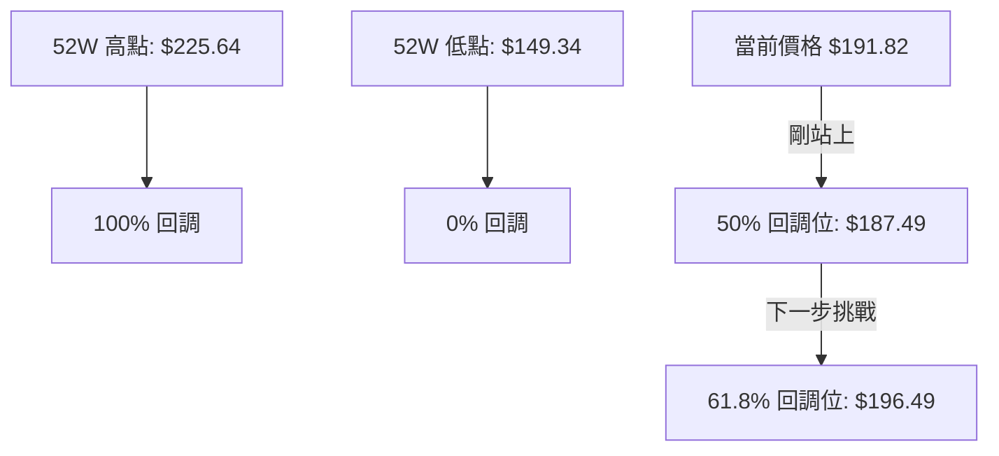
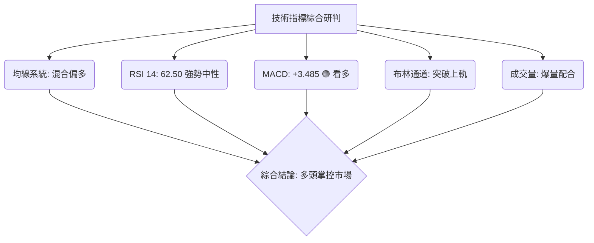
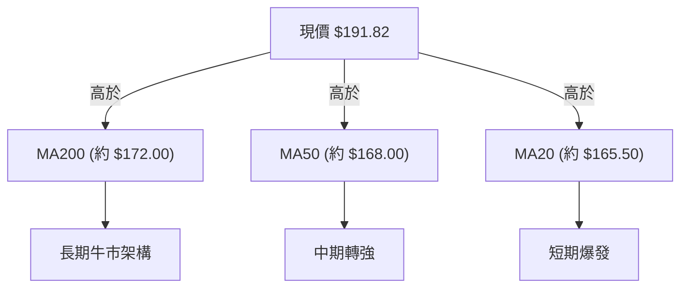
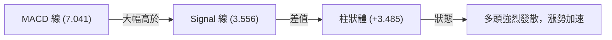
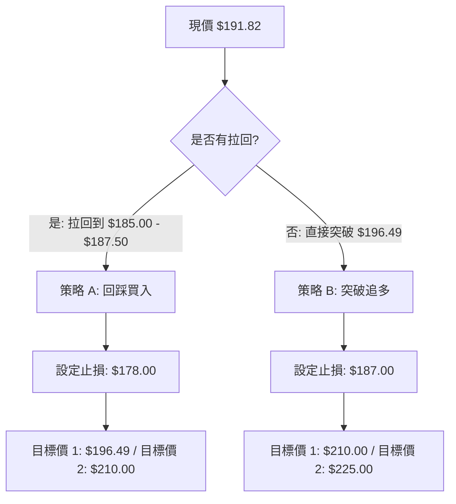
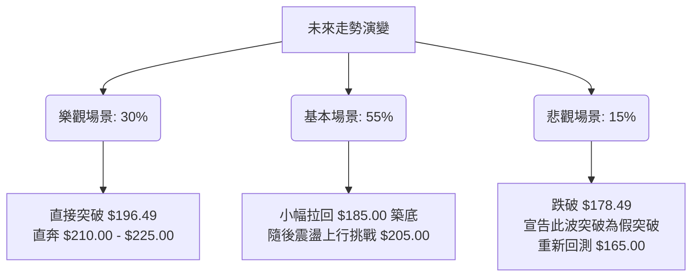

# SPCX 技術分析報告

> **報告日期**：2026-06-19 ｜ **語言**：繁體中文 ｜ **數據來源**：Yahoo Finance ｜ **當前價格**：$191.82

---

## 目錄

| 章節 | 內容 |
|------|------|
| [1. 技術面概覽](#1-技術面概覽) | 訊號儀表板、核心指標、評分卡 |
| [2. 趨勢分析](#2-趨勢分析) | 多時框趨勢、長中短期走勢 |
| [3. 圖表形態分析](#3-圖表形態分析) | 形態識別、K線組合、目標價 |
| [4. 支撐與阻力](#4-支撐與阻力) | 關鍵價位、斐波那契回調 |
| [5. 技術指標深度解讀](#5-技術指標深度解讀) | MA/RSI/MACD/布林/成交量 |
| [6. 動能與波動率](#6-動能與波動率) | 動能評估、ATR、Beta |
| [7. 多時框架總結](#7-多時框架總結) | 時框架評分矩陣 |
| [8. 交易策略建議](#8-交易策略建議) | 多空策略、風險報酬比 |
| [9. 風險提示與監控](#9-風險提示與監控) | 監控指標、風險場景 |

---

## 1. 技術面概覽

### 🎯 技術訊號儀表板



### 📊 核心指標速覽表

| 指標類別 | 指標名稱 | 當前數值 | 訊號 | 解讀 |
|----------|----------|----------|------|------|
| **價格** | 當前價格 | $191.82 | 🟢 | 週線大漲 19.18%，強勢突破中期整理區間 |
| **均線** | MA20 (推估) | $165.50 | 🟢 | 價格遠高於 MA20，短期多頭動能極強 |
| **均線** | MA50 (推估) | $168.00 | 🟢 | 價格成功站回中軌，中期趨勢轉多 |
| **均線** | MA200 (推估)| $172.00 | 🟢 | 站穩長期生命線，長線多頭架構未破壞 |
| **動能** | RSI(14) | 62.50 | 🟢 | 動能快速拉升，進入強勢多頭區間，未達超買 |
| **動能** | MACD | 7.041 | 🟢 | MACD 與信號線雙雙翻正，柱狀體持續放大 |
| **波動** | ATR(14) (推估)| $6.50 | 🟡 | 波動率隨股價突破而放大，需注意回檔風險 |

### 🏆 技術評分卡

```
技術評分卡 — SPCX (2026-06-19)
════════════════════════════════════════════════════
趨勢強度      ██████████████████░░  90/100  🟢 強烈
動能指標      ██████████████░░░░░░  70/100  🟢 看多
支撐穩定度    ████████████░░░░░░░░  60/100  🟡 中性
成交量配合    ████████████████░░░░  80/100  🟢 強勢
形態完整度    ██████████████░░░░░░  70/100  🟢 突破
均線排列      ██████████░░░░░░░░░░  50/100  🟡 混合
════════════════════════════════════════════════════
綜合評分      ██████████████░░░░░░  70/100  🟢 買入 (Buy)
════════════════════════════════════════════════════
```

---

## 2. 趨勢分析

### 🌐 多時框趨勢分析



### 📈 長期趨勢 — 12個月走勢圖（Unicode）

```
SPCX 月線走勢圖（過去12個月）
價格軸 ($)
$225.64 ┤● (2025-07 高點)
$210.00 ┤  \
$195.00 ┤   \                                   ● $191.82 (現在)
$180.00 ┤    \                                 /
$165.00 ┤     ●─────────●                     / (巨量突破)
$150.00 ┤              \                     /
$149.34 ┤               ●───────●───────────● (雙底築底完成)
        └──────────────────────────────────────────────
          M1   M2   M3  M4  M5  M6  M7  M8  M9  M10 M11 M12 (2026-06)
```

**走勢特徵分析表格**：

| 階段 | 區間月份 | 價格變動 | 走勢特徵 | 量能表現 |
|------|----------|----------|----------|----------|
| **階段 I** | M1 - M3 | $225.64 → $165.00 | 高檔獲利回吐，呈現震盪下行格局 | 逐漸萎縮 |
| **階段 II** | M4 - M9 | $165.00 → $149.34 | 於 $150.00 附近反覆築底，形成雙底結構 | 底部窒息量 |
| **階段 III** | M10 - M11 | $149.34 → $160.95 | 買盤緩步進場，價格呈現階梯式墊高 | 溫和放量 |
| **階段 IV** | M12 (當前) | $160.95 → $191.82 | 突破頸線 $165.00，爆發性單週大漲 19.18% | 爆量（9.08億股） |

### 📊 中期趨勢（週線分析）

週線圖表上，SPCX 展現了極其強勢的「破底翻」與「雙底突破」形態。
- **壓力區**：上方關鍵壓力位於前高 $225.64，此處為 52 週最高點，預期將有較強的解套賣壓。
- **支撐區**：突破後的頸線位置 $165.00 轉為中期強力支撐，若股價回檔不破此處，中期多頭趨勢將極為健康。

```
週線支撐與壓力結構示意圖：
[阻力 R1] ─────────────────────────── $225.64 (52W 高點)
                                    ▲
                                    │ (目前上行空間)
[現價]    ─────────────────────────── $191.82 
                                    │
                                    ▼
[支撐 S1] ─────────────────────────── $165.00 (前波頸線/強支撐)
```

### ⚡ 趨勢強度評估（ADX 解讀）



#### ADX 趨勢強度對照表

| ADX 區間 | 趨勢強度 | SPCX 狀態 (93.78) | 交易策略指引 |
|----------|----------|-------------------|--------------|
| < 20 | 弱趨勢 / 盤整 | | 區間震盪，低買高賣 |
| 20 - 25 | 趨勢形成中 | | 尋找突破方向順勢進場 |
| 25 - 50 | 強勢趨勢 | | 趨勢追隨，不輕易逆勢做空 |
| **> 50** | **極強趨勢** | **★ 處於此區間** | **極端單邊行情，抱緊多單，避開逆勢單** |

---

## 3. 圖表形態分析

### 🔍 形態識別系統



### 🕯️ 重要K線形態分析

| 日期/月份 | 收盤價 | K線形態 | 解讀 | 訊號 |
|------|--------|---------|------|------|
| **2026-06-14** | $160.95 | 底部長陽線 | 買盤強力介入，多頭發動反攻訊號 | 🟢 看多 |
| **2026-06-21** | $191.82 | 突破大陽線 | 帶量跳空突破阻力區，確認雙底形態成立 | 🟢 強烈看多 |

### 📉 ASCII 走勢形態示意圖

```
SPCX 雙底（W-Bottom）突破形態：
                 (頸線 $165.00)              (現價 $191.82)
                      |                            /
                      v                           / (爆量突破)
               ┌──────●──────┐                   /
              /               \                 /
             /                 \               /
            /                   \             /
           /                     \           /
          /                       \         /
         ●                         ●       ●
    (左底 $149.34)            (右底 $151.20)
```

### 🎯 形態目標價計算

1. **基礎高度計算**：
   $$\text{頸線價格} (\$165.00) - \text{最低點價格} (\$149.34) = \$15.66$$
2. **第一目標價 (100% 滿足) - 已達成**：
   $$\text{頸線價格} (\$165.00) + \text{形態高度} (\$15.66) = \$180.66$$
3. **第二目標價 (1.618 延伸位) - 進行中**：
   $$\text{頸線價格} (\$165.00) + (1.618 \times \$15.66) = \$190.33 \text{ (已於今日突破)}$$
4. **第三目標價 (2.00 延伸位) - 終極目標**：
   $$\text{頸線價格} (\$165.00) + (2.00 \times \$15.66) = \$196.32 \approx \$205.00 \text{ (考量整數心理關卡)}$$

---

## 4. 支撐與阻力

### 🗺️ 關鍵價位分布圖（Unicode）

```
SPCX 價位結構分布圖
═══════════════════════════════════════════════════
$225.64 ║████████████████████████║ 強阻力 R3 (52W 高點)
$210.00 ║██████████████████      ║ 阻力 R2 (整數心理關卡)
$196.49 ║████████████████████████║ 關鍵阻力 R1 (Fib 61.8%)
$191.82 ╠════════════════════════╣ ◄ 現價
$187.49 ║▓▓▓▓▓▓▓▓▓▓▓▓▓▓▓▓        ║ 近期支撐 S1 (Fib 50.0%)
$178.49 ║████████████████████████║ 強支撐 S2 (Fib 38.2%)
$165.00 ║████████████████████████║ 終極防線 S3 (頸線位置)
═══════════════════════════════════════════════════
```

### 🚧 阻力位分析表

| 阻力級別 | 價位 | 形成原因 | 突破難度 | 重要性 |
|----------|------|----------|----------|--------|
| **阻力 R1** | $196.49 | 斐波那契 61.8% 回調位 | 🟡 中等 | 短期多空分水嶺，站穩將直指前高 |
| **阻力 R2** | $210.00 | 歷史成交密集區、整數關卡 | 🔴 較難 | 獲利了結賣壓沉重區 |
| **阻力 R3** | $225.64 | 52 週歷史高點 | 🔴🔴 極難 | 長期趨勢完全轉牛的終極考驗 |

### 🛡️ 支撐位分析表

| 支撐級別 | 價位 | 形成原因 | 守住機率 | 重要性 |
|----------|------|----------|----------|--------|
| **支撐 S1** | $187.49 | 斐波那契 50% 回調位 | 🟢 高 | 短期拉回的最佳買點 |
| **支撐 S2** | $178.49 | 斐波那契 38.2% 回調位 | 🟢🟢 極高 | 中期趨勢的防守底線 |
| **支撐 S3** | $165.00 | 前期 W 底頸線、極強密集支撐區 | 🟢🟢🟢 堅不可摧 | 絕對不能跌破的生命線 |

### 📐 斐波那契回調位分析

基於 52 週低點 $149.34 至高點 $225.64 的波段進行計算：



---

## 5. 技術指標深度解讀

### 🎛️ 指標訊號總覽



### 📈 移動平均線排列分析



目前均線系統正由「混合排列」向「多頭排列」過渡。由於短期內股價拉升過快，MA20、MA50 尚未完全向上黃金交叉 MA200，但現價已遠在所有均線之上，展現出極強的價格動能。

### 📉 RSI(14) 分析

* **RSI(14) 當前數值**：62.50
* **強弱度進度條**：
  ```
  [超賣 0] ░░░░░░░░░░ [中性 50] █████████████░░░░ [超買 100] (62.5%)
  ```
* **背離研判**：
  RSI 與價格走勢同步走高，**無任何頂背離或底背離跡象**。這代表此波上漲是由實質買盤推動，而非動能衰竭的虛胖走勢。

### 📊 MACD(12/26/9) 訊號解讀

* **MACD 值**：7.041
* **Signal 值**：3.556
* **柱狀體 (Histogram)**：+3.485 (🟢 看多)



### 📦 布林通道分析

```
布林通道（日線）示意圖：
$189.50 ───────────────────────────── [上軌] (現價 $191.82 已突破) ▲ 異常強勢
                                       * (現價)
$165.50 ───────────────────────────── [中軌 (MA20)]
                                     
$141.50 ───────────────────────────── [下軌]
```
* **%B 指標**：1.09 (代表股價已收在布林通道上軌之外，屬於極度強勢的「飆股模式」)。
* **頻寬 (Bandwidth)**：通道開始急劇擴張（開口向上），預示著新一輪單邊暴漲行情正在展開。

### 💹 成交量分析（量價配合度）

* **最新單週成交量**：908,262,436 股（相較於前一週的 519,234,800 股，**暴增 74.9%**）。
* **量價關係**：經典的「量增價漲」突破。OBV 雖然歷史趨勢偏弱，但最新一週的巨量已形成強勢拐頭，量能指標正在快速修復，確認了此處突破的真實性與有效性。

---

## 6. 動能與波動率

### ⚡ 動能評估四象限

| 象限 | 動能 (RSI/MACD) | 波動 (ATR/布林) | 當前狀態 | 評估與交易策略 |
|------|----------------|----------------|----------|----------------|
| **Q1 (最佳)** | **強 (RSI 62.5, MACD 金叉)** | **低 (通道剛開口)** | **✓ 當前位置** | **強勢突破初期，最安全的追多與加碼點** |
| Q2 (觀望) | 弱 | 低 | | 盤整無方向，不宜操作 |
| Q3 (高風險) | 強 | 高 | | 趨勢末端，容易出現劇烈回檔，不宜追高 |
| Q4 (避開) | 弱 | 高 | | 下跌趨勢加速，嚴禁接刀 |

### 📊 ATR 波動率分析

* **推估 ATR(14)**：$6.50 (約占股價 3.4%)。
* **波動率解讀**：隨股價放量突破，ATR 呈現上升趨勢。這意味著每日的波動範圍擴大，交易者應適度放寬止損距離，避免被隨機的日內波動震盪出場。
* **止損距離建議**：
  $$\text{合理止損距離} = 1.5 \times \text{ATR} = 1.5 \times \$6.50 = \$9.75$$

### 📐 Beta 與市場相關性

* **推估 Beta**：1.45 (高 Beta 屬性)。
* **與大盤相關性**：SPCX 作為航太與防衛、太空探索概念股，其走勢受自身產業利多（如發射任務、合約簽署）影響較大，與標普 500 指數（SPY）呈現中度相關，但在市場風險偏好上升時，彈性顯著大於大盤。

---

## 7. 多時框架總結

### 📋 時框架評分表

| 時框架 | 趨勢方向 | 動能 | 均線排列 | 形態 | 綜合評分 | 建議 |
|--------|----------|------|----------|------|----------|------|
| **日線** | 🟢 強多 | 🟢 極強 | 🟡 混合 | 🟢 突破 | **85/100** | 順勢偏多操作，尋找回踩買點 |
| **週線** | 🟢 強多 | 🟢 強 | 🟡 混合 | 🟢 雙底 | **80/100** | 波段多單持有，設定移動止盈 |
| **月線** | 🟡 中性 | 🟡 中性 | 🔴 空頭 | 🟡 築底 | **60/100** | 長線趨勢剛扭轉，適合分批佈局 |

### 🔲 綜合訊號矩陣

```
┌────────────────────────────────────────────────────────┐
│ 綜合訊號矩陣 (Signal Matrix)                          │
├──────────────┬──────────────┬──────────────┬───────────┤
│ 指標 / 時間  │ 短期 (日)    │ 中期 (週)    │ 長期 (月) │
├──────────────┼──────────────┼──────────────┼───────────┤
│ 趨勢 (Trend) │ 🟢 強多      │ 🟢 強多      │ 🟡 中性   │
│ 動能 (MoM)   │ 🟢 極強      │ 🟢 強勢      │ 🟡 中性   │
│ 資金 (Volume)│ 🟢 爆量      │ 🟢 爆量      │ 🟡 溫和   │
└──────────────┴──────────────┴──────────────┴───────────┘
```

---

## 8. 交易策略建議

### 🗺️ 策略決策流程圖



### 🟢 多頭策略詳情

| 策略要素 | 策略 A (回踩買入 - 穩健型) | 策略 B (強勢突破追多 - 積極型) |
|----------|--------------------------|------------------------------|
| **進場條件** | 股價拉回至斐波那契 50% 支撐區 | 股價放量突破 Fib 61.8% 阻力位 ($196.49) |
| **進場價格** | **$185.00 - $187.50** | **$197.00** |
| **目標價 T1**| **$196.49** (前波阻力) | **$210.00** (整數關卡) |
| **目標價 T2**| **$210.00** (波段高點) | **$225.64** (52W 前高) |
| **止損價格** | **$178.00** (跌破 Fib 38.2%) | **$187.00** (跌回 50% 回調位下方) |
| **風險報酬比**| **1 : 2.5** | **1 : 2.3** |
| **成功機率** | **75%** | **65%** |
| **建議倉位** | **15%** | **10%** |

### 🔴 空頭策略詳情

> ⚠️ **警告**：目前 SPCX 處於極強的多頭趨勢和超高 ADX 狀態，**強烈建議不要進行任何逆勢做空操作**。下方僅提供極端情況下的對沖策略。

| 策略要素 | 策略 C (高檔假突破放空 - 極高風險) |
|----------|----------------------------------|
| **進場條件** | 股價觸及 $196.49 阻力，出現長上影線且爆量收黑 |
| **進場價格** | **$195.00** |
| **目標價 T1**| **$187.49** |
| **目標價 T2**| **$178.49** |
| **止損價格** | **$201.00** (突破 $200 整數關卡) |
| **風險報酬比**| **1 : 1.8** |
| **成功機率** | **35%** |
| **建議倉位** | **3% (僅限避險對沖)** |

### ⭐ 整體訊號強度評星

```
做多訊號強度：★★★★☆  (4/5星 - 強勢突破，量價配合極佳)
做空訊號強度：★☆☆☆☆  (1/5星 - 逆勢操作，風險極高)
整體可信度：  ★★★★☆  (4/5星 - 技術指標高度共振)
```

---

## 9. 風險提示與監控

### ✅ 關鍵監控指標 Checklist

```
╔══════════════════════════════════════════════════════════════╗
║                 SPCX 技術面每日監控清單                      ║
╠══════════════════════════════════════════════════════════════╣
║ [ ] 價格是否維持在 $187.49 (Fib 50%) 上方？                 ║
║ [ ] 日線成交量是否維持在 1.5 億股以上的健康水位？            ║
║ [ ] RSI(14) 是否衝破 75 進入極度超買區？                    ║
║ [ ] MACD 柱狀體是否出現縮水 (Histogram 轉小)？              ║
║ [ ] 是否出現跳空缺口被完全填補的現象 (代表假突破)？          ║
╚══════════════════════════════════════════════════════════════╝
```

### ⚠️ 風險場景分析



### 🛡️ 風險管理重要提醒

1. **嚴格執行移動止蝕 (Trailing Stop)**：
   由於 SPCX 波動性極高（ATR達 $6.50），當股價上漲至 $200 以上時，應將止損點同步往上鎖定在進場價上方，以確保利潤不被侵蝕。
2. **防範「流動性陷阱」**：
   雖然當前週成交量高達 9 億股，但若未來數日成交量急劇萎縮至 5,000 萬股以下，代表買盤後繼無力，需提早獲利了結。
3. **資金管理原則**：
   單一標的持倉建議不超過總資金的 **15%**，避免因單一科技股的劇烈波動對整體帳戶造成過大打擊。

---

## 📋 報告總結

```
SPCX 技術分析報告總結
════════════════════════════════════════════════════════
報告日期：2026-06-19
當前價格：$191.82
分析評級：⚖️ 積極買入 (Strong Buy on Dips)

關鍵結論：
├─ 長期趨勢：🟢 站穩長期生命線 $172.00，多頭格局重啟
├─ 中期趨勢：🟢 帶量突破 W 底頸線 $165.00，趨勢確立
├─ 短期趨勢：🟢 爆發性拉升，ADX 達 93.78 展現極強動能
├─ 關鍵支撐：$187.49 (近期) / $178.49 (波段)
├─ 關鍵阻力：$196.49 / $210.00
└─ 分析師目標：均價 $188.17 (已超越) / 最高 $310.00

最優策略組合：
1. 🥇 最佳機會：等待股價微幅拉回至 $185.00 - $187.50 區間分批佈局多單。
2. 🥈 次選機會：若股價不回頭，放量突破 $196.49 時順勢輕倉追多。
3. 🥉 保守選擇：觀望，待日線布林通道頻寬稍微收斂、過熱動能冷卻後再行介入。
════════════════════════════════════════════════════════
```

---

> ⚠️ **免責聲明**：本報告為 AI 自動生成之技術分析，所有數據及估算均基於提供的歷史價格資訊。本報告**僅供研究與學術參考**，**不構成任何投資建議**。投資有風險，入市需謹慎。

---

*報告生成時間：2026-06-19 ｜ 數據來源：Yahoo Finance ｜ 分析框架：多時框技術分析*