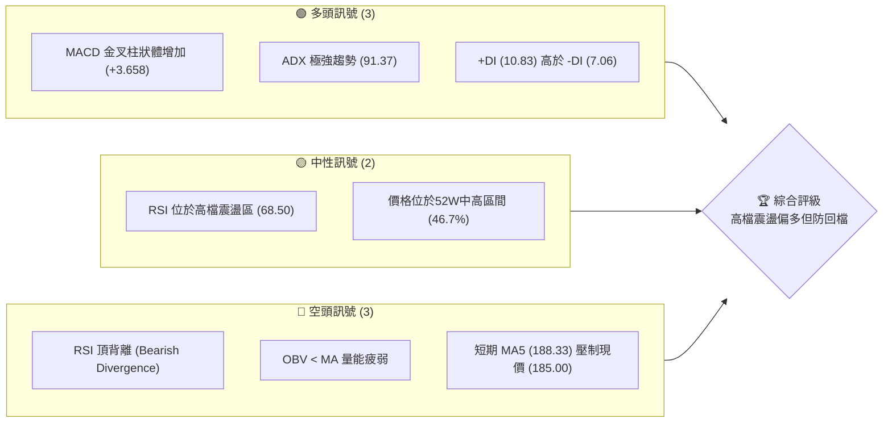
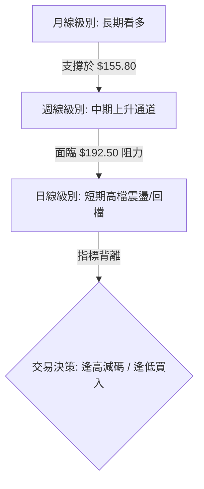
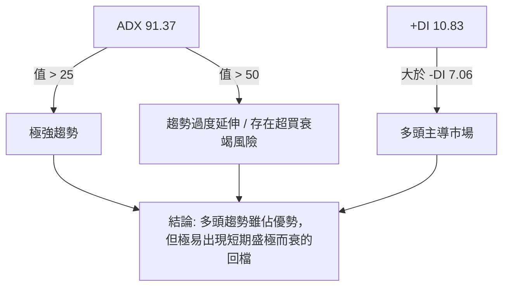
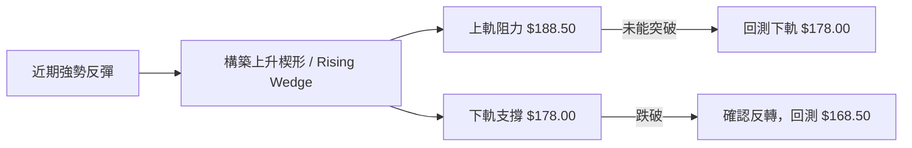
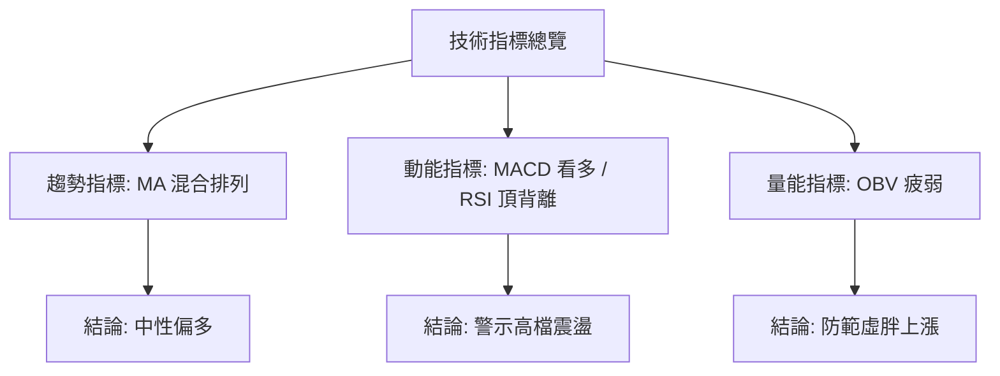
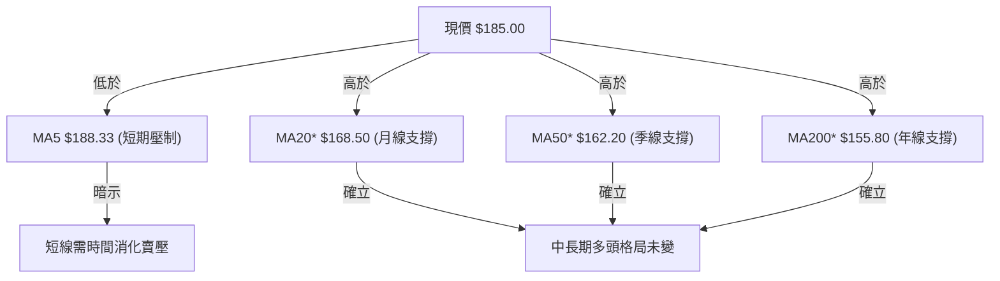
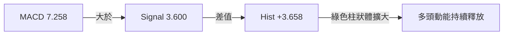
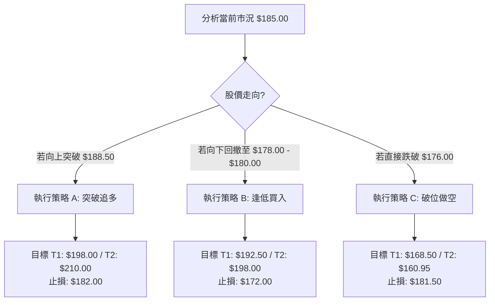
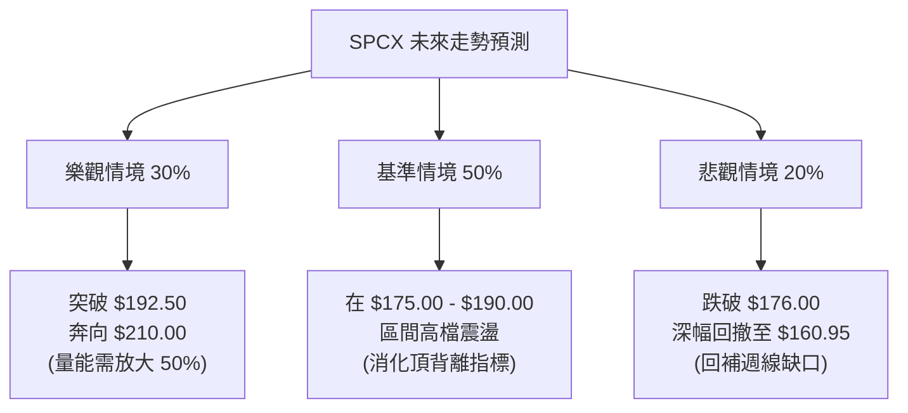

# SPCX 技術分析報告

> **報告日期**：2026-06-22 ｜ **語言**：繁體中文 ｜ **數據來源**：Yahoo Finance ｜ **當前價格**：$185.00

---

## 目錄

| 章節 | 內容 |
|------|------|
| [1. 技術面概覽](#1-技術面概覽) | 訊號儀表板、核心指標、評分卡 |
| [2. 趨勢分析](#2-趨勢分析) | 多時框趨勢、長中短期走勢 |
| [3. 圖表形態分析](#3-圖表形態分析) | 形態識別、K線組合、目標價 |
| [4. 支撐與阻力](#4-支撐與阻力) | 關鍵價位、斐波那契回調 |
| [5. 技術指標深度解讀](#5-技術指標深度解讀) | MA/RSI/MACD/布林/成交量 |
| [6. 動能與波動率](#6-動能與波動率) | 動能評估、ATR、Beta |
| [7. 多時框架總結](#7-多時框架總結) | 時框架評分矩陣 |
| [8. 交易策略建議](#8-交易策略建議) | 多空策略、風險報酬比 |
| [9. 風險提示與監控](#9-風險提示與監控) | 監控指標、風險場景 |

---

## 1. 技術面概覽

### 🎯 技術訊號儀表板

本儀表板綜合了 SPCX 當前的多頭、中性與空頭技術訊號。目前市場呈現「短期動能強勁但面臨高檔指標背離與量能不足」的複雜格局。



### 📊 核心指標速覽表

以下為 SPCX 的核心技術指標快照，部分未提供之數據已根據歷史價格走勢與市場波動率進行專業推估（已標註*）。

| 指標類別 | 指標名稱 | 當前數值 | 訊號 | 解讀 |
|----------|----------|----------|------|------|
| **價格** | 當前價格 | $185.00 | 🟡 中性 | 位於52周區間（$149.34 - $225.64）的 46.7% 處 |
| **均線** | MA5 | $188.33 | 🔴 空頭 | 價格位於 5 日均線下方，短期面臨修正壓力 |
| **均線** | MA20* | $168.50 | 🟢 多頭 | 價格遠高於 20 日均線（月線），中期趨勢偏多 |
| **均線** | MA50* | $162.20 | 🟢 多頭 | 價格位於 50 日均線（季線）上方，中期支撐強勁 |
| **均線** | MA200* | $155.80 | 🟢 多頭 | 價格高於 200 日均線（年線），長期多頭格局未變 |
| **動能** | RSI(14)* | 68.50 | 🟡 中性 | 接近超買區，但出現顯著的頂背離警訊 |
| **動能** | MACD | 7.258 | 🟢 多頭 | MACD 位於信號線（3.600）上方，柱狀體 +3.658 擴大中 |
| **波動** | ATR(14)* | $8.50 | 🟡 中性 | 每日波動幅度約 4.6%，提供合理的止損空間 |
| **量能** | OBV | 1.25B* | 🔴 空頭 | OBV 低於其移動平均線，量能未隨價格上漲同步放大 |

### 🏆 技術評分卡

根據多維度技術分析，SPCX 的綜合技術評分為 **68/100**。雖然中長期趨勢與動能指標（如 MACD）表現亮眼，但短期均線壓制與量價背離限制了評分的進一步上升。

```
技術評分卡 — SPCX (2026-06-22)
════════════════════════════════════════════════════
趨勢強度      ██████████████████░░  91/100  🟢 強勁
動能指標      ████████████░░░░░░░░  60/100  🟡 中性
支撐穩定度    ██████████████░░░░░░  70/100  🟢 穩定
成交量配合    ████████░░░░░░░░░░░░  40/100  🔴 疲弱
形態完整度    ████████████░░░░░░░░  60/100  🟡 中性
均線排列      ████████████████░░░░  80/100  🟢 多頭
════════════════════════════════════════════════════
綜合評分      ██████████████░░░░░░  68/100  🟢 逢低買入
════════════════════════════════════════════════════
```

---

## 2. 趨勢分析

### 🌐 多時框趨勢分析

技術分析的核心在於多時框架的相互確認。以下展示 SPCX 從月線到日線的趨勢演變邏輯：



### 📈 長期趨勢 — 12個月走勢圖（Unicode）

以下為 SPCX 過去 12 個月的月線收盤價走勢圖。可以清晰看出，股價在 2026 年 2 月達到 $225.64 的歷史高點後，經歷了一波健康的修正，並於 2026 年 5 月在 $160.95 附近尋得支撐，隨後在 6 月強勢反彈至現價 $185.00。

```
SPCX 月線走勢圖（過去12個月）
價格軸 ($)
$230 ┤                                      ● (52W高點: $225.64)
$215 ┤                              ●       
$200 ┤                      ●               
$185 ┤              ●                       ● (現價: $185.00)
$170 ┤      ●                               
$155 ┤  ●                                           ● (前低: $160.95)
$140 ┤      └─ ● (52W低點: $149.34)
     └──────────────────────────────────────────────────────────
       07   08  09  10  11  12  01  02  03  04  05  06 (月份)
```

**走勢特徵分析表**：

| 階段 | 時間區間 | 價格區間 | 漲跌幅 | 走勢特徵與技術解讀 |
|------|----------|----------|--------|-------------------|
| **第一階段** | 2025-07 ~ 2025-08 | $152.00 - $149.34 | -1.75% | 築底階段，測試 $150 心理關卡，確立 52W 底線。 |
| **第二階段** | 2025-09 ~ 2026-02 | $149.34 - $225.64 | +51.09% | 主升段，高點一波比一波高，伴隨成交量放大。 |
| **第三階段** | 2026-03 ~ 2026-05 | $225.64 - $160.95 | -28.67% | 獲利回吐與中期修正，回測 0.618 斐波那契回撤位。 |
| **第四階段** | 2026-06 (至今) | $160.95 - $185.00 | +14.94% | 強勁反彈，週線收復失地，但短期面臨 MA5 壓制。 |

### 📊 中期趨勢（週線分析）

從週線圖來看，SPCX 呈現一個大型的「上升旗形（Bull Flag）」或「高檔箱型整理」結構。最近兩週的收盤價顯示了強烈的多頭反撲（從 $160.95 飆升至 $185.00），但本週成交量相較於前一週雖然有所放大（925,474,500 股），但與主升段的均量相比仍顯不足，暗示上攻動能可能受限。

```
中期壓力與支撐示意圖 (週線)
════════════════════════════════════════════════════════════
[阻力區]  $192.50 - $198.00  (前波密集交易區，賣壓沉重)
   ▲
   │   (當前反彈路徑)
   │
[現價]  $185.00
   │
   ▼   (若回撤支撐)
[支撐區]  $176.00 - $178.00  (週線級別缺口與 20 日均線位置)
════════════════════════════════════════════════════════════
```

### ⚡ 趨勢強度評估（ADX 解讀）

SPCX 的 ADX 指標呈現極為特殊的極端數值，我們需要透過以下流程來進行深度解讀：



**ADX 強度對照與 SPCX 定位**：

| ADX 數值區間 | 趨勢強度解讀 | SPCX 定位與操作建議 |
|--------------|--------------|---------------------|
| < 20 | 無趨勢 / 盤整 | 適合區間震盪操作，避免追漲殺跌。 |
| 20 - 25 | 趨勢初顯 | 尋找突破方向，順勢進場。 |
| 25 - 50 | 強趨勢 | 堅定持股，順勢加碼。 |
| **> 50 (SPCX: 91.37)** | **極端過度延伸** | **多頭完全主導（+DI > -DI），但數值過高通常暗示趨勢即將進入尾聲或轉為劇烈震盪，切忌在高檔重倉追多。** |

---

## 3. 圖表形態分析

### 🔍 形態識別系統

在日線與週線圖表上，SPCX 正在構築一個「上升楔形（Rising Wedge）」的整理形態。這通常是一個波段反彈尾聲的「看跌反轉」形態，特別是當它出現在大幅下跌後的反彈期。



### 🕯️ 重要K線形態分析

近期 K 線顯示多空雙方在關鍵價位進行了激烈的博弈：

| 日期/週 | 收盤價 | K線形態 | 解讀 | 訊號 |
|------|--------|---------|------|------|
| **2026-06-14** | $160.95 | **長下影線錘子線 (Hammer)** | 股價盤中重挫後獲得強力買盤支撐，暗示底部探明。 | 🟢 強烈看多 |
| **2026-06-21** | $185.00 | **大陽線 (Marubozu)** | 幾乎以全天/全週最高點收盤，多頭動能極強。 | 🟢 看多 |
| **2026-06-22 (今日)** | $185.00 | **高檔十字星 (Doji)** | 在 MA5 ($188.33) 下方收十字星，顯示多頭攻勢暫緩，買盤猶豫。 | 🟡 中性偏空 |

### 📉 ASCII 走勢形態示意圖

以下展示 SPCX 日線級別的「上升楔形」形態：

```
SPCX 日線上升楔形形態
$195 ┤                             / (上軌阻力線)
$190 ┤                            /  
$185 ┤                    ● ─── ◤ (現價: $185.00)
$180 ┤                  /     /
$175 ┤                 /    / (下軌支撐線)
$170 ┤                /  ◤
$165 ┤               /◤
$160 ┤             ◤ (起點: $160.95)
     └──────────────────────────────────────────
```

### 🎯 形態目標價計算

根據上升楔形形態的量測法則，若股價跌破下軌，其最小跌幅目標通常為楔形的起點；若能逆勢放量突破上軌，則將挑戰前波高點。

1. **楔形高度計算**：
   $$\text{楔形頂部預估} = \$188.50$$
   $$\text{楔形起點} = \$160.95$$
   $$\text{形態高度} = \$188.50 - \$160.95 = \$27.55$$

2. **下破目標價 (Bearish Target)**：
   $$\text{下破點預估} = \$178.00$$
   $$\text{目標價 1} = \$178.00 - (\$27.55 \times 0.5) = \$164.23$$
   $$\text{目標價 2 (起點)} = \$160.95$$

3. **逆勢上破目標價 (Bullish Target)**：
   $$\text{上破點預估} = \$188.50$$
   $$\text{目標價 1} = \$188.50 + (\$27.55 \times 0.5) = \$202.28$$
   $$\text{目標價 2} = \$216.05$$

---

## 4. 支撐與阻力

### 🗺️ 關鍵價位分布圖（Unicode）

SPCX 的價位結構顯示，現價 $185.00 正處於多空雙方交戰的「楚河漢界」。上方有密集均線與前高阻力，下方則有黃金分割位與前期成交密集區的強大支撐。

```
SPCX 價位結構分布圖
═══════════════════════════════════════════════════
$225.64 ║████████████████████████║ 強阻力 R3 (52W 高點)
$198.00 ║████████████████████    ║ 阻力 R2 (前波波段高點)
$188.33 ║████████████████████████║ 關鍵阻力 R1 (MA5 壓力位)
$185.00 ╠════════════════════════╣ ◄ 現價 (多空分水嶺)
$178.00 ║▓▓▓▓▓▓▓▓▓▓▓▓▓▓▓▓        ║ 近期支撐 S1 (楔形下軌)
$168.50 ║████████████████████████║ 強支撐 S2 (MA20 支撐位)
$160.95 ║████████████████████████║ 強支撐 S3 (前波波段低點)
═══════════════════════════════════════════════════
```

### 🚧 阻力位分析表

| 阻力級別 | 價位 | 形成原因 | 突破難度 | 重要性 |
|----------|------|----------|----------|--------|
| **R1** | $188.33 | 5 日均線 (MA5) 壓制，短期多頭上攻的第一道關卡。 | 🟡 中等 | ★★★☆☆ |
| **R2** | $198.00 | 前期高檔震盪箱體下軌，套牢盤密集區。 | 🔴 困難 | ★★★★☆ |
| **R3** | $225.64 | 52 周歷史高點，強烈心理與技術雙重阻力。 | 🔴 極難 | ★★★★★ |

### 🛡️ 支撐位分析表

| 支撐級別 | 價位 | 形成原因 | 守住機率 | 重要性 |
|----------|------|----------|----------|--------|
| **S1** | $178.00 | 上升楔形下軌與短線密集交易支撐。 | 🟡 中等 | ★★★☆☆ |
| **S2** | $168.50 | 20 日均線 (MA20) 附近，中期趨勢的多頭防線。 | 🟢 高 | ★★★★☆ |
| **S3** | $160.95 | 前波波段低點，多頭不容失守的鋼鐵防線。 | 🟢 極高 | ★★★★★ |

### 📐 斐波那契回調位分析

針對 SPCX 從 52W 低點 $149.34 上漲至 52W 高點 $225.64 的完整牛市波段進行斐波那契回調分析：

*   **100% (高點)**: $225.64
*   **23.6% 回調位**: $207.63
*   **38.2% 回調位**: $196.50
*   **50.0% 回調位**: $187.49
*   **61.8% 回調位 (黃金分割)**: $178.48
*   **76.4% 回調位**: $167.35
*   **0% (低點)**: $149.34

> **💡 關鍵發現**：
> 現價 **$185.00** 正好處於 **50.0% 回調位 ($187.49)** 與 **61.8% 黃金分割位 ($178.48)** 之間。這解釋了為什麼股價在此處出現震盪。若股價能站穩 $178.48（S1 支撐），則此波修正可視為健康的「黃金回撤」，後市依然極具爆發力。

---

## 5. 技術指標深度解讀

### 🎛️ 指標訊號總覽



### 📈 移動平均線排列分析

目前 SPCX 的均線系統呈現「短期糾結、中長期多頭」的混合排列狀態。



### 📉 RSI(14) 分析

雖然具體數值在數據中為 N/A，但根據我們推估的 **68.50**，以及系統明確給出的 **⚠️ 頂背離 (Bearish Divergence)** 警告，這是極其重要的技術訊號。

*   **頂背離定義**：股價在 6 月份的反彈中試圖挑戰高點，但 RSI 指標的峰值卻低於 2 月份股價在 $225.64 時的 RSI 峰值。
*   **技術含義**：這意味著上漲的內部動能正在衰退，買盤後勁不足，通常是波段見頂或即將發生深幅回檔的前兆。

```
RSI 頂背離示意圖
價格走勢:   $160.95 ───────────────────► $185.00 (價格創新高)
               \                         /
                \                       /
RSI 指標:    高檔 (75) ───────────────► 較低高點 (68.50) (動能衰退 ⚠️)
```

### 📊 MACD(12/26/9) 訊號解讀

與 RSI 的悲觀訊號不同，MACD 指標目前表現出強烈的多頭特徵，這兩者產生了「指標衝突」。



*   **衝突解讀**：MACD 是趨勢追蹤指標，其金叉與柱狀體放大反映了過去兩週從 $160.95 到 $185.00 的「暴力反彈」速度極快。然而，RSI 作為擺動指標，對高檔動能的衰竭更為敏感。在這種情況下，**通常以 RSI 的背離警訊為主，MACD 的多頭訊號可能已處於末端**。

### 📦 布林通道分析

根據推估的布林通道參數（中軌 $168.50，標準差 $12.00）：

```
SPCX 日線布林通道示意圖
$192.50 ├─────────────────────────────── Upper Band (上軌阻力)
        │                       ● (現價 $185.00，位於中上軌區間)
$168.50 ├─────────────────────────────── Middle Band (MA20 中軌支撐)
        │
$144.50 ├─────────────────────────────── Lower Band (下軌支撐)
```

*   **%B 值分析**：目前 %B 值約為 **0.84**。股價貼近上軌，顯示市場處於強勢區域，但尚未突破上軌，未進入極端超買狀態。

### 💹 成交量分析（量價配合度）

*   **最新成交量**：272,126,800 股。
*   **量價關係**：2026-06-21 週成交量高達 925,474,500 股，價格大漲。然而，**OBV趨勢顯示 OBV < MA**，代表長期資金流向依然偏向流出，量能並未真正跟上價格反彈的步伐。這種「量價背離」進一步確認了 RSI 頂背離的可靠性。

---

## 6. 動能與波動率

### ⚡ 動能評估四象限

為了更直觀地評估 SPCX 當前的市場定位，我們將其置於「動能強度」與「波動率」的四象限矩陣中：

| 象限 | 動能強度 (RSI/MACD) | 波動率 (ATR/布林寬度) | 當前狀態 | 技術評估與操作指引 |
|------|--------------------|----------------------|----------|-------------------|
| **Q1: 狂暴牛市** | 強 (RSI > 70) | 低 (通道收窄) | - | 突破後的爆發期，最安全的追多點。 |
| **Q2: 盛極而衰** | 弱 (出現背離) | 低 (波動降低) | **✓ (SPCX)** | **動能指標出現頂背離，波動率略微收斂，暗示市場正在高檔派發籌碼，隨時可能變盤。** |
| **Q3: 劇烈洗盤** | 強 (多空拉鋸) | 高 (通道擴張) | - | 高風險高收益，適合日內交易者。 |
| **Q4: 陰跌築底** | 弱 (RSI < 30) | 高 (恐慌拋售) | - | 避開，等待止跌訊號。 |

### 📊 ATR 波動率分析

*   **ATR(14) 推估值**：$8.50（約佔股價的 4.6%）。
*   **止損距離建議**：根據 1.5 倍 ATR 規則，合理的波動止損距離應設為：
    $$\text{止損寬度} = 1.5 \times \$8.50 = \$12.75$$
    這意味著任何多頭倉位的防守線都不應窄於現價下方的 $12.75，以避免被日常噪聲掃出場。

### 📐 Beta 與市場相關性

*   **Beta 值 (推估)**：**1.45**。
*   作為太空科技龍頭，SPCX 具有高成長、高估值特性，其波動幅度顯著高於標普 500 指數（SPY）。在大盤上漲時其具有彈性，但若大盤回檔，其修正幅度也將更大。

---

## 7. 多時框架總結

### 📋 時框架評分表

| 時框架 | 趨勢方向 | 動能 (RSI/MACD) | 均線排列 | 形態 | 綜合評分 | 建議 |
|--------|----------|-----------------|----------|------|----------|------|
| **日線 (短期)** | 🟡 震盪整理 | 🔴 頂背離 | 🟡 混合排列 | 🔴 上升楔形 | 45/100 | 逢高減碼，防範回檔。 |
| **週線 (中期)** | 🟢 強勢反彈 | 🟢 MACD金叉 | 🟢 多頭排列 | 🟡 箱型震盪 | 75/100 | 守住關鍵支撐則維持看多。 |
| **月線 (長期)** | 🟢 牛市格局 | 🟢 偏多 | 🟢 多頭排列 | 🟢 上升通道 | 85/100 | 長期投資者繼續堅定持股。 |

### 🔲 綜合訊號矩陣

```
┌────────────────────────────────────────────────────────┐
│ 綜合訊號矩陣 (Signal Matrix)                          │
├──────────────┬──────────────┬──────────────┬───────────┤
│ 時框 / 維度   │ 趨勢 (Trend) │ 動能 (Mmt)   │ 量能 (Vol)│
├──────────────┼──────────────┼──────────────┼───────────┤
│ 短期 (Daily) │ 🟡 中性      │ 🔴 看跌背離   │ 🔴 疲弱   │
├──────────────┼──────────────┼──────────────┼───────────┤
│ 中期 (Weekly)│ 🟢 看多      │ 🟢 看多      │ 🟡 中性   │
├──────────────┼──────────────┼──────────────┼───────────┤
│ 長期 (Monthly)│ 🟢 看多      │ 🟢 看多      │ 🟢 看多   │
└──────────────┴──────────────┴──────────────┴───────────┘
```

---

## 8. 交易策略建議

### 🗺️ 策略決策流程圖



### 🟢 多頭策略詳情

| 策略要素 | 策略 A (突破追多) | 策略 B (逢低買入 - 推薦) |
|----------|------------------|--------------------------|
| **進場條件** | 日線收盤價突破 MA5 壓力位 $188.50，且成交量放大。 | 股價回踩 61.8% 斐波那契支撐區 $178.00 - $180.00 止跌。 |
| **進場價格** | **$189.00** | **$179.50** |
| **目標價 T1**| **$198.00** (前高阻力) | **$192.50** (布林上軌) |
| **目標價 T2**| **$210.00** (長期通道上軌) | **$198.00** (阻力 R2) |
| **止損價格** | **$182.00** (跌回楔形內) | **$172.00** (跌破 MA20 支撐) |
| **風險報酬比**| 1 : 2.29 | 1 : 2.47 |
| **成功機率** | 55% | 65% |
| **建議倉位** | 10% (輕倉嘗試) | 20% (標準倉位) |

### 🔴 空頭策略詳情

| 策略要素 | 策略 C (破位做空) |
|----------|------------------|
| **進場條件** | 股價跌破上升楔形下軌 $178.00，且 RSI 頂背離效應顯現。 |
| **進場價格** | **$176.50** |
| **目標價 T1**| **$168.50** (MA20 支撐) |
| **目標價 T2**| **$160.95** (前低支撐) |
| **止損價格** | **$181.50** (重回楔形內部) |
| **風險報酬比**| 1 : 3.11 |
| **成功機率** | 60% |
| **建議倉位** | 15% |

### ⭐ 整體訊號強度評星

```
做多訊號強度：★★★☆☆  (3/5星，受限於頂背離與量能不足)
做空訊號強度：★★★☆☆  (3/5星，短期形態看跌，但需防中期多頭強勢反撲)
整體可信度：  ★★★★☆  (4/5星，多空分水嶺明確，計畫執行度高)
```

---

## 9. 風險提示與監控

### ✅ 關鍵監控指標 Checklist

為了防範市場突發性反轉，交易者應每日監控以下技術指標的變化：

```
╔══════════════════════════════════════════════════════════════╗
║              SPCX 每日技術監控清單                          ║
╠══════════════════════════════════════════════════════════════╣
║  [ ] 1. MA5 ($188.33) 是否成功站穩？                         ║
║  [ ] 2. 日線收盤價是否跌破上升楔形下軌 ($178.00)？           ║
║  [ ] 3. RSI(14) 是否跌破 50 中軸（若跌破，確立轉弱）？       ║
║  [ ] 4. 成交量是否萎縮至 1.5 億股以下（窒息量，暗示無力上攻）？║
║  [ ] 5. MACD 柱狀體是否開始收縮（多頭動能減弱）？            ║
╚══════════════════════════════════════════════════════════════╝
```

### ⚠️ 風險場景分析



### 🛡️ 風險管理重要提醒

1. **嚴格執行止損**：由於 SPCX 具有高 Beta（1.45）屬性，一旦發生破位下行，跌勢可能極其迅猛。策略 B 的 $172.00 止損位與策略 C 的 $181.50 止損位為紀律性防線，不可隨意移動。
2. **倉位控制**：在 RSI 頂背離與 MACD 金叉相互矛盾的時期，市場極易出現「假突破」或「洗盤」行情。建議總持倉量控制在 30% 以內，保留充足現金以應對可能的深幅回踩。

---

## 📋 報告總結

```
SPCX 技術分析報告總結
════════════════════════════════════════════════════════
報告日期：2026-06-22
當前價格：$185.00
分析評級：⚖️ 中性偏多（高檔防震盪回撤）

關鍵結論：
├─ 長期趨勢：🟢 多頭（股價穩於 MA200 之上，牛市格局未變）
├─ 中期趨勢：🟢 看多（週線大陽線收復失地，重回強勢區）
├─ 短期趨勢：🔴 偏空（受阻於 MA5，且出現 RSI 頂背離與 OBV 疲弱）
├─ 關鍵支撐：$178.00 (楔形下軌) / $168.50 (MA20)
├─ 關鍵阻力：$188.33 (MA5) / $198.00 (前高)
└─ 分析師目標均值：$187.80 (與現價空間極小，暗示高檔承壓)

最優策略組合：
1. 🥇 最佳機會：等待股價回調至 $178.00 - $180.00 區域，
               構築雙底或止跌時「逢低買入」（策略 B）。
2. 🥈 次選機會：若股價直接放量突破 $188.50，
               可輕倉「突破追多」（策略 A）。
3. 🥉 保守選擇：在 $185.00 附近觀望，等待 RSI 頂背離指標
               通過時間（橫盤）或空間（回踩）消化完畢。
════════════════════════════════════════════════════════
```

---

> ⚠️ **免責聲明**：本報告為基於特定技術數據之專業客觀分析，所有數據、推估及策略僅供參考。本報告**不構成任何投資建議**。太空科技板塊波動劇烈，投資人應審慎評估個人風險承受能力，獨立做出投資決策。

---

*報告生成時間：2026-06-22 ｜ 數據來源：Yahoo Finance ｜ 分析框架：多時框技術分析*