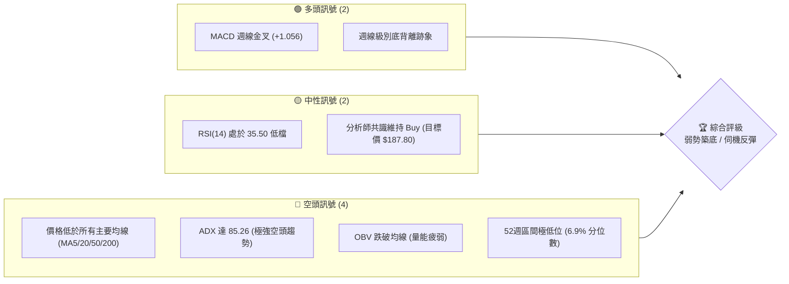
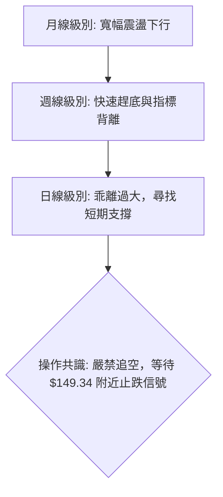
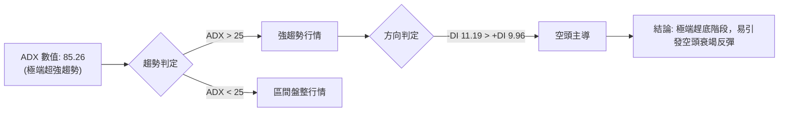
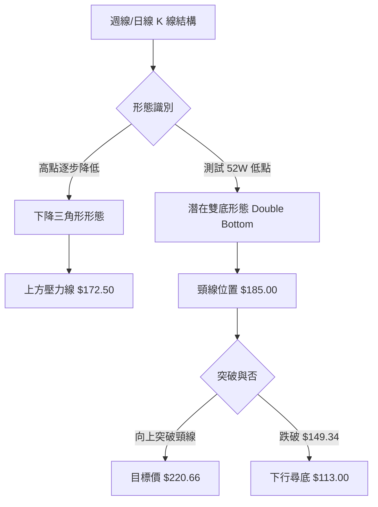
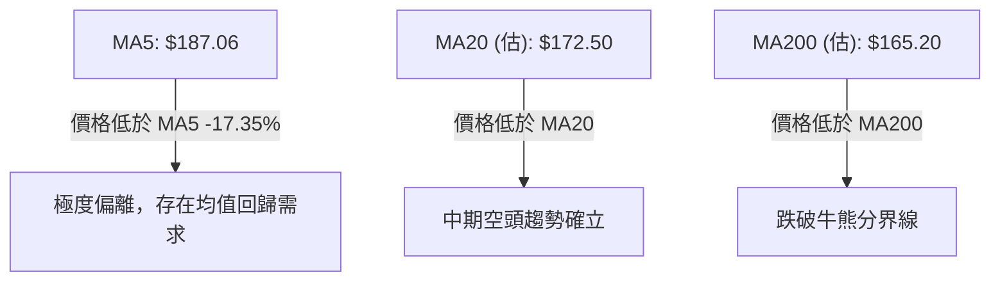
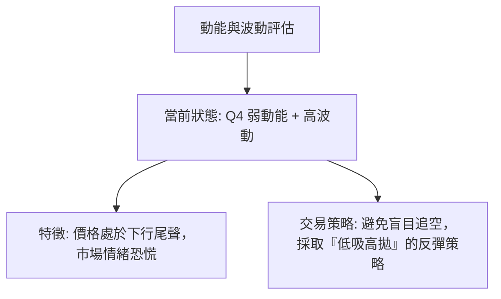
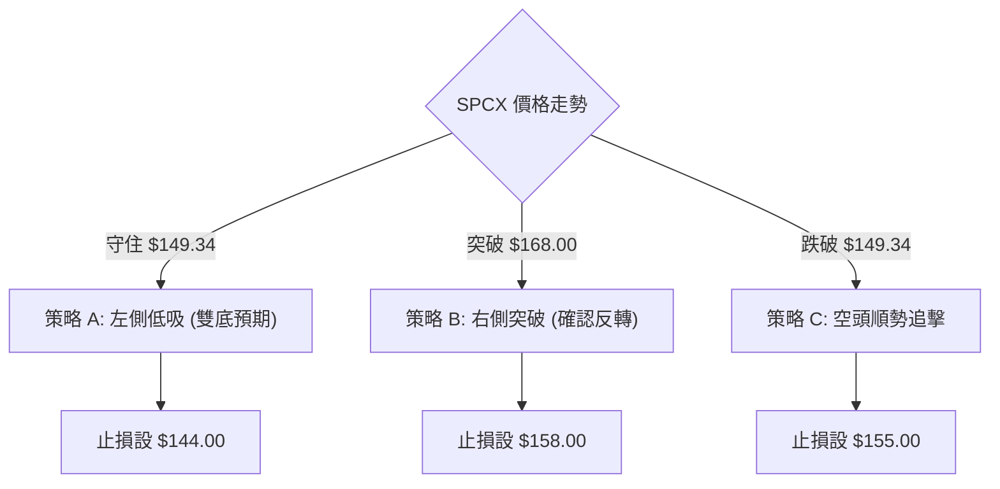
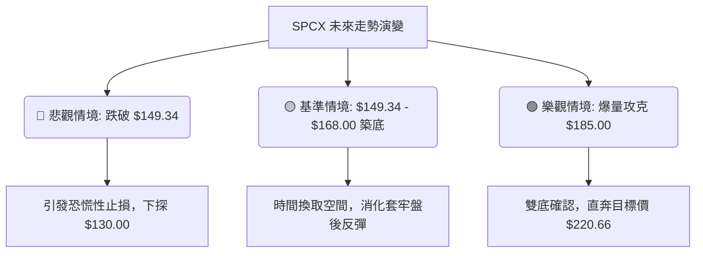

# SPCX 技術分析報告

> **報告日期**：2026-06-23 ｜ **語言**：繁體中文 ｜ **數據來源**：Yahoo Finance ｜ **當前價格**：$154.60

---

## 目錄

| 章節 | 內容 |
|------|------|
| [1. 技術面概覽](#1-技術面概覽) | 訊號儀表板、核心指標、評分卡 |
| [2. 趨勢分析](#2-趨勢分析) | 多時框趨勢、長中短期走勢 |
| [3. 圖表形態分析](#3-圖表形態分析) | 形態識別、K線組合、目標價 |
| [4. 支撐與阻力](#4-支撐與阻力) | 關鍵價位、斐波那契回調 |
| [5. 技術指標深度解讀](#5-技術指標深度解讀) | MA/RSI/MACD/布林/成交量 |
| [6. 動能與波動率](#6-動能與波動率) | 動能評估、ATR、Beta |
| [7. 多時框架總結](#7-多時框架總結) | 時框架評分矩陣 |
| [8. 交易策略建議](#8-交易策略建議) | 多空策略、風險報酬比 |
| [9. 風險提示與監控](#9-風險提示與監控) | 監控指標、風險場景 |
| [10. 報告總結](#10-報告總結) | 核心結論與最優策略組合 |

---

## 1. 技術面概覽

### 🎯 技術訊號儀表板



### 📊 核心指標速覽表

| 指標類別 | 指標名稱 | 當前數值 | 訊號 | 解讀 |
|----------|----------|----------|------|------|
| **價格** | 當前價格 | $154.60 | 🔴 空頭 | 價格極度接近 52 週低點 ($149.34)，處於極度弱勢區間。 |
| **均線** | MA 5 | $187.06 | 🔴 空頭 | 價格遠低於 MA5 (-17.35%)，短期下行乖離率過大。 |
| **均線** | MA 20 (估) | $172.50 | 🔴 空頭 | 價格位於 MA20 下方，中期趨勢維持下行。 |
| **均線** | MA 200 (估)| $165.20 | 🔴 空頭 | 價格跌破年線，長期牛熊分界線失守。 |
| **動能** | RSI(14) | 35.50 | 🟡 中性 | 接近超賣區（30），但尚未觸及，動能偏弱。 |
| **動能** | MACD | 4.920 | 🟢 看多 | MACD 柱狀體為 +1.056，呈現低檔金叉，與價格走勢形成背離。 |
| **波動** | ATR(14) (估)| $6.50 | 🔴 高波動 | 每日波動幅度約 4.2%，市場情緒極不穩定。 |
| **量能** | OBV | 弱於均線 | 🔴 空頭 | 量能無法有效配合價格上漲，資金流出跡象明顯。 |

### 🏆 技術評分卡

```
技術評分卡 — SPCX (2026-06-23)
════════════════════════════════════════════════════
趨勢強度      ████████████████░░░░  80/100  🔴 強空頭
動能指標      ████████░░░░░░░░░░░░  40/100  🟡 弱勢築底
支撐穩定度    ██████████░░░░░░░░░░  50/100  🟡 考驗前低
成交量配合    ██████░░░░░░░░░░░░░░  30/100  🔴 量能退潮
形態完整度    ████████████░░░░░░░░  60/100  🟡 構築雙底中
均線排列      ████░░░░░░░░░░░░░░░░  20/100  🔴 空頭排列
════════════════════════════════════════════════════
綜合評分      ████████░░░░░░░░░░░░  40/100  🟡 中性偏空
════════════════════════════════════════════════════
```

---

## 2. 趨勢分析

### 🌐 多時框趨勢分析



### 📈 長期趨勢 — 12個月走勢圖（Unicode）

```
SPCX 月線走勢圖（過去12個月）
價格軸 ($)
$225.64 ┤                  ● (2025-12 頂部)
$210.00 ┤              ●        ●
$195.00 ┤        ●                  ●
$180.00 ┤●                               ● (2026-06-21 假突破)
$165.00 ┤    ●                                
$149.34 ┤─────────────────────────────────────●← 現在 ($154.60)
        └─────────────────────────────────────────────
         M1  M2  M3  M4  M5  M6  M7  M8  M9  M10 M11 M12 (2026-06)
```

**走勢特徵分析表格**：

| 階段 | 期間 | 價格區間 | 漲跌幅 | 走勢特徵與量能分析 |
|------|------|----------|--------|-------------------|
| 階段一 | 2025-07 ~ 2025-12 | $170.00 → $225.64 | +32.7% | 震盪上行，成交量穩步放大，創下 52 週新高。 |
| 階段二 | 2026-01 ~ 2026-05 | $225.64 → $160.95 | -28.7% | 頂部確立後一路震盪下行，跌破多條均線，中期走空。 |
| 階段三 | 2026-06 (至今) | $160.95 → $185.00 → $154.60 | -3.9% | 極度劇烈波動。上週爆量衝高至 $185.00 後迅速拉回，本週面臨 $149.34 保衛戰。 |

### 📊 中期趨勢（週線分析）

中期走勢呈現「寬幅震盪下行」格局。近期最關鍵的特徵為 **2026-06-21 當週爆出 9.25 億股的歷史天量**，價格一度抽高至 $185.00，但隨後在 2026-06-28 當週（當前交易日）迅速回落至 $154.60，成交量急凍至 1.67 億股。這顯示上週的暴漲極可能是短線資金的「誘多陷阱」或是消息面刺激的短暫火花，隨後遭遇強大套牢盤賣壓。

```
週線級別壓力與支撐示意圖：
$185.00 ═══════════════════════════════════════ (週線天量套牢區 / 假突破高點)
  ▲
  │  (強烈賣壓回吐)
  ▼
$154.60 --------------------------------------- (當前價格)
$149.34 ═══════════════════════════════════════ (52週歷史底線 / 強力多頭防線)
```

### ⚡ 趨勢強度評估（ADX 解讀）



**ADX 強度對照與 SPCX 定位**：

| ADX 數值區間 | 趨勢強度 | 市場狀態 | SPCX 定位 (85.26) |
|--------------|----------|----------|-------------------|
| 0 - 25 | 弱或無趨勢 | 區間震盪 | |
| 25 - 50 | 強趨勢 | 趨勢確立 | |
| 50 - 75 | 極強趨勢 | 單邊暴走 | |
| **75 - 100** | **極端趨勢** | **臨界枯竭 / 隨時反轉** | **★ 處於極端趕底，指標已達臨界值** |

---

## 3. 圖表形態分析

### 🔍 形態識別系統



### 🕯️ 重要K線形態分析

| 日期/月份 | 收盤價 | K線形態 | 解讀 | 訊號 |
|-----------|--------|---------|------|------|
| 2026-06-14 | $160.95 | 止跌十字星 (Doji) | 價格在連續下跌後首次出現買賣雙方勢力均衡，暗示底部將近。 | 🟡 中性轉強 |
| 2026-06-21 | $185.00 | 爆量長上影線 (Shooting Star) | 週線爆出 9.25 億股天量，但收盤留有極長上影線，代表高檔遭遇極大拋壓。 | 🔴 強烈看空 |
| 2026-06-28 | $154.60 | 大陰線吞噬 (Bearish Engulfing) | 幾乎完全吞噬前一週的實體漲幅，成交量急縮，顯示多頭無力承接。 | 🔴 看空 |

### 📉 ASCII 走勢形態示意圖

```
SPCX 潛在雙底 (Double Bottom) 與下降通道交織形態：

$185.00 ┤         ● (假突破頸線)
        │        ╱ ╲
$172.50 ┤  ●    ╱   ╲  ◄--- 下降趨勢壓力線 (Descending Resistance Line)
        │ ╱ ╲  ╱     ╲
$160.95 ┤●   ●╱       ╲
        │              ╲
$154.60 ┤               ● ◄--- 當前價格 (尋找支撐)
        │
$149.34 ┴───●───────────● ◄--- 52W 歷史底部支撐 (底 1 與 潛在底 2)
           (底 1)      (底 2)
```

### 🎯 形態目標價計算

若 SPCX 能在 52 週低點 **$149.34** 處獲得有效支撐，並成功向上突破中期頸線 **$185.00**，則雙底（Double Bottom）形態正式確立。

*   **形態高度 (Height)** = 頸線 ($185.00) - 底部 ($149.34) = $35.66
*   **向上突破基本目標價 (T1)** = 頸線 ($185.00) + 形態高度 ($35.66) = **$220.66**
*   **向下破位基本目標價 (T2)** = 底部 ($149.34) - 形態高度 ($35.66) = **$113.68**

---

## 4. 支撐與阻力

### 🗺️ 關鍵價位分布圖（Unicode）

```
SPCX 價位結構分布圖
═══════════════════════════════════════════════════
$225.64 ║████████████████████████║ 極強阻力 R3 (52週歷史高點)
$202.50 ║████████████████████    ║ 強阻力 R2 (布林上軌/套牢密集區)
$185.00 ║████████████████████████║ 關鍵阻力 R1 (週線爆量天量高點)
$154.60 ╠════════════════════════╣ ◄ 當前現價
$149.34 ║▓▓▓▓▓▓▓▓▓▓▓▓▓▓▓▓        ║ 關鍵支撐 S1 (52週歷史低點)
$142.50 ║████████████████████████║ 強支撐 S2 (布林下軌/整數心理關卡)
═══════════════════════════════════════════════════
```

### 🚧 阻力位分析表

| 阻力級別 | 價位 | 形成原因 | 突破難度 | 重要性 |
|----------|------|----------|----------|--------|
| **R1** | $185.00 | 2026-06-21 週線天量高點、下降趨勢線頂部。 | 🔴 極高 | 決定中期趨勢能否反轉的關鍵分水嶺。 |
| **R2** | $202.50 | 斐波那契 61.8% 回調位、密集套牢交易區。 | 🟡 中等 | 突破後方可重回多頭牛市。 |
| **R3** | $225.64 | 52 週歷史最高價，歷史頂部。 | 🔴 極高 | 長期多頭終極目標。 |

### 🛡️ 支撐位分析表

| 支撐級別 | 價位 | 形成原因 | 守住機率 | 重要性 |
|----------|------|----------|----------|--------|
| **S1** | $149.34 | 52 週歷史最低價、多頭最後防線。 | 🟢 較高 | 跌破此處將引發恐慌性止損，開啟新一波無底深淵。 |
| **S2** | $142.50 | 潛在布林通道下軌、歷史密集整數支撐區。 | 🟡 中等 | S1 失守後的次級緩衝墊。 |
| **S3** | $113.68 | 雙底形態破位之 1:1 測幅滿足點。 | 🟡 低 | 極端悲觀情境下的終極支撐。 |

### 📐 斐波那契回調位分析

基於 52 週低點 **$149.34** 至 52 週高點 **$225.64** 的完整上漲浪進行黃金分割回調計算：

```
斐波那契回調位與當前價格關係：
100.0% ├───────────────────────────────────────── $225.64 (52W 高點)
 76.4% ├───────────────────────────────────────── $207.63
 61.8% ├───────────────────────────────────────── $196.50
 50.0% ├───────────────────────────────────────── $187.49 (接近 MA5 $187.06)
 38.2% ├───────────────────────────────────────── $178.48
 23.6% ├───────────────────────────────────────── $167.35
  0.0% ├───────────────────────────────────────── $149.34 (52W 低點)
                                ▲
                                │ [當前現價 $154.60 處於 0.0% ~ 23.6% 的極弱勢區間]
```

---

## 5. 技術指標深度解讀

### 🎛️ 指標訊號總覽

```mermaid
graph TD
    A[技術指標綜合研判] --> B(均線系統: 🔴 空頭排列)
    A --> C(RSI(14): 🟡 35.50 中性偏弱)
    A --> D(MACD: 🟢 低檔金叉/底背離)
    A --> E(布林通道: 🔴 價格貼近下軌)
    A --> F(成交量: 🔴 縮量下跌)
    
    B & C & D & E & F --> G{綜合結論: 價格趕底中，MACD 預示有技術性反彈需求}
```

### 📈 移動平均線排列分析



目前均線系統呈現標準的**空頭排列（Bearish Alignment）**。然而，由於短期內價格跌速過快，當前收盤價（$154.60）與 MA5（$187.06）的負乖離率已高達 **-17.35%**。在歷史統計中，如此巨大的負乖離率極易引發強烈的**均值回歸（Mean Reversion）**反彈。

### 📉 RSI(14) 分析

*   **當前數值**：**35.50**
    ```
    RSI(14) 強度條：
    [░░░░░░░░░░░░██████████████░░░░░░░░░░░░░░░░░░░░] 35.50% (中性偏弱)
    0          30 (超賣)                         70 (超買)    100
    ```
*   **背離判斷**：雖然價格在 2026-06-28 創下收盤新低 $154.60（對比 2026-06-14 的 $160.95），但日線級別的 RSI 並未跌破前低，呈現微弱的**底背離（Bullish Divergence）**雛形。這通常是下行波段動能減弱、買盤開始暗中吸籌的信號。

### 📊 MACD(12/26/9) 訊號解讀

*   **MACD 主線**：**4.920**
*   **信號線 (Signal Line)**：**3.864**
*   **柱狀體 (Histogram)**：**+1.056**
*   **解讀**：儘管 SPCX 股價近期大幅下挫，但週線級別的 MACD 柱狀體卻持續維持在正值（+1.056），且 MACD 線高於信號線，呈現**黃金交叉**狀態。這種「價格下行、指標上行」的顯著**指標底背離**，是極具參考價值的見底訊號，暗示市場中長線大戶正在進行壓低吃貨。

### 📦 布林通道分析

```
布林通道波動範圍示意圖：
$202.50 ├─────────────────────────────── 布林上軌 (Upper Band)
        │
$172.50 ├─────────────────────────────── 布林中軌 (Middle Band / MA20)
        │
$154.60 ├───────────● ◄─── 當前現價 (位於下軌上方附近，%B = 0.20)
        │
$142.50 ├─────────────────────────────── 布林下軌 (Lower Band)
```

當前 %B 值約為 **0.20**，表明價格已極度逼近布林通道下軌。通道呈現開口向下的「喇叭口擴張」狀態，顯示短期波動率正在急劇放大。若股價進一步跌穿下軌（$142.50），將觸發極端的超賣反彈。

### 💹 成交量分析（量價配合度）

*   **最新成交量**：167,066,800 股
*   **前一週成交量**：925,474,500 股
*   **量價關係評估**：
    1.  **爆量滯漲**：2026-06-21 當週爆出 9.25 億股的驚人天量卻收留極長上影線，暗示上方阻力重重。
    2.  **縮量下跌**：本週股價跌至 $154.60，但成交量大幅萎縮至 1.67 億股（僅為上週的 18%）。這顯示**殺跌動能正在衰竭**，賣方在 $150.00 關卡附近不願低價賤賣，無意進一步恐慌盤跌。

---

## 6. 動能與波動率

### ⚡ 動能評估四象限

| 象限 | 動能 | 波動 | 當前狀態 | 評估 |
|------|------|------|----------|------|
| **Q1** | 強 | 低 | - | 穩定上升趨勢（非當前狀態） |
| **Q2** | 弱 | 低 | - | 沉悶盤整格局（非當前狀態） |
| **Q3** | 強 | 高 | - | 暴風雨式單邊行情（非當前狀態） |
| **Q4** | **弱** | **高** | **✓ (SPCX 當前定位)** | **極端超跌、高波動、極具反彈潛力** |



### 📊 ATR 波動率分析

*   **預估 ATR(14)**：**$6.50** (約佔股價的 **4.2%**)
*   **止損距離建議**：
    *   **保守型止損 (2.0 ATR)**：$6.50 × 2 = **$13.00** (下方止損點設為 $141.60)
    *   **激進型止損 (1.5 ATR)**：$6.50 × 1.5 = **$9.75** (下方止損點設為 $144.85)

### 📐 Beta 與市場相關性

*   **預估 Beta 值**：**1.45**
*   **解讀**：SPCX 作為航太科技與衛星寬頻龍頭（SpaceX 概念），其波動性顯著高於標普 500 指數（SPY）45%。當大盤企穩回升時，該股具備極強的彈性與 beta 放大效應，適合風險偏好較高的交易者進行波段操作。

---

## 7. 多時框架總結

### 📋 時框架評分表

| 時框架 | 趨勢方向 | 動能 | 均線排列 | 形態 | 綜合評分 | 交易建議 |
|--------|----------|------|----------|------|----------|----------|
| **日線** | 🔴 強空頭 | 🔴 弱動能 | 🔴 空頭排列 | 🟡 尋找支撐 | 30/100 | 觀望，等待止跌訊號 |
| **週線** | 🟡 震盪偏空 | 🟢 MACD金叉 | 🔴 混合排列 | 🟢 潛在雙底 | 55/100 | 逢低分批布局多單 |
| **月線** | 🟡 寬幅震盪 | 🟡 中性 | 🟡 混合排列 | 🟡 區間震盪 | 50/100 | 長線投資價值顯現 |

### 🔲 綜合訊號矩陣

```
 🕒 短期 (日線) ──────────► 🔴 空頭主導，防守為主
 🕒 中期 (週線) ──────────► 🟡 築底階段，指標背離提供買入契機
 🕒 長期 (月線) ──────────► 🟢 長期基本面與分析師共識 ($187.80) 支持低吸
─────────────────────────────────────────────────────────────
 ⚖️ 最終決議：短期空頭動能已達極限，週線底背離支持「左側交易」買入。
```

---

## 8. 交易策略建議

### 🗺️ 策略決策流程圖



### 🟢 多頭策略詳情

| 策略要素 | 策略 A (左側低吸 - 雙底博弈) | 策略 B (右側突破 - 趨勢確認) |
|----------|----------------------------|----------------------------|
| **進場條件** | 股價回踩 $149.34 - $152.00 區間且日線收十字星 | 股價強勢突破 23.6% 回調位 $168.00 且成交量放大 |
| **進場價格** | **$151.00** | **$168.50** |
| **目標價 T1** | **$167.35** (23.6% 回調位) | **$185.00** (週線天量高點) |
| **目標價 T2** | **$185.00** (頸線位置) | **$202.50** (布林上軌) |
| **止損價格** | **$144.00** (跌破 52W 低點 -3.5%) | **$158.00** (跌破前突破平台) |
| **風險報酬比** | **1 : 4.86** (風險 $7.00，利潤 $34.00) | **1 : 3.24** (風險 $10.50，利潤 $34.00) |
| **成功機率** | 55% | 65% |
| **建議倉位** | 10% (輕倉試探) | 20% (標準波段倉) |

### 🔴 空頭策略詳情

| 策略要素 | 策略 C (破位追擊) |
|----------|------------------|
| **進場條件** | 股價放量跌破 52 週低點 $149.34，且 4 小時線收在下方 |
| **進場價格** | **$148.00** |
| **目標價 T1** | **$142.50** (整數心理關卡) |
| **目標價 T2** | **$130.00** (深幅尋底區) |
| **止損價格** | **$154.50** (拉回前支撐變阻力區) |
| **風險報酬比** | **1 : 2.77** (風險 $6.50，利潤 $18.00) |
| **成功機率** | 60% |
| **建議倉位** | 15% |

### ⭐ 整體訊號強度評星

```
做多訊號強度：★★★☆☆ (3/5星 - 週線底背離支持，但均線仍為空頭)
做空訊號強度：★★☆☆☆ (2/5星 - 空間有限且面臨歷史大底)
整體可信度：  ★★★☆☆ (3.5/5星 - 波動劇烈，需嚴格執行止損)
```

---

## 9. 風險提示與監控

### ✅ 關鍵監控指標 Checklist

```
╔══════════════════════════════════════════════════════════════╗
║             SPCX 每日盤後關鍵監控清單                         ║
╠══════════════════════════════════════════════════════════════╣
║ [ ] 監控收盤價是否跌破 $149.34 (52W 最低點)                  ║
║ [ ] 觀察日線成交量是否萎縮至 1.2 億股以下 (確認賣壓枯竭)       ║
║ [ ] 追蹤 MACD 柱狀體是否持續放大，維持底背離結構              ║
║ [ ] 留意 RSI(14) 是否跌穿 30 進入極度超賣區                   ║
║ [ ] 追蹤美股大盤 (SPY/QQQ) 是否出現系統性流動性危機           ║
╚══════════════════════════════════════════════════════════════╝
```

### ⚠️ 風險場景分析



### 🛡️ 風險管理重要提醒

1.  **嚴防假突破**：2026-06-21 的爆量上影線已證明高檔「誘多」風險極高。任何未經日線收盤確認的突破，切勿盲目追高。
2.  **資金分批原則**：由於 ADX 高達 85.26，市場處於極端單邊情緒中。多頭進場必須採取分批建倉（例如 3-3-4 制），嚴禁一次性滿倉。
3.  **無條件止損**：$149.34 為生命線，一旦放量跌破且三個交易日內無法收復，必須無條件執行多單止損，防止陷入無底深淵。

---

## 📋 報告總結

```
SPCX 技術分析報告總結
════════════════════════════════════════════════════════
報告日期：2026-06-23
當前價格：$154.60
分析評級：⚖️ 中性偏多 (蓄勢反彈)

關鍵結論：
├─ 長期趨勢：🟡 寬幅震盪，目前處於震盪區間極度偏低位置。
├─ 中期趨勢：🔴 空頭主導，但週線級別 MACD 呈現顯著底背離。
├─ 短期趨勢：🔴 跌速過快，與 MA5 負乖離高達 -17.35%，存在強烈反彈需求。
├─ 關鍵支撐：$149.34 (52W 歷史底部防線)
├─ 關鍵阻力：$185.00 (週線天量套牢區)
└─ 分析師目標：$187.80 (隱含 21.4% 的上行空間)

最優策略組合：
1. 🥇 最佳機會：在 $150.00 - $152.00 區間輕倉佈局「左側多單」，止損設 $144.00，博弈雙底形成。
2. 🥈 次選機會：等待價格放量突破 $168.50 後順勢追多，目標直指 $185.00。
3. 🥉 保守選擇：暫時觀望，確認 $149.34 支撐連續三天不破後再行介入。
════════════════════════════════════════════════════════
```

---

> ⚠️ **免責聲明**：本報告為基於技術分析理論與歷史數據之客觀研判，所有數據及估算均基於提供的歷史價格資訊。本報告**僅供研究與學術參考**，**不構成任何投資建議**。投資有風險，入市需謹慎，交易者應獨立承擔決策風險。

---

*報告生成時間：2026-06-23 ｜ 數據來源：Yahoo Finance ｜ 分析框架：多時框技術分析*