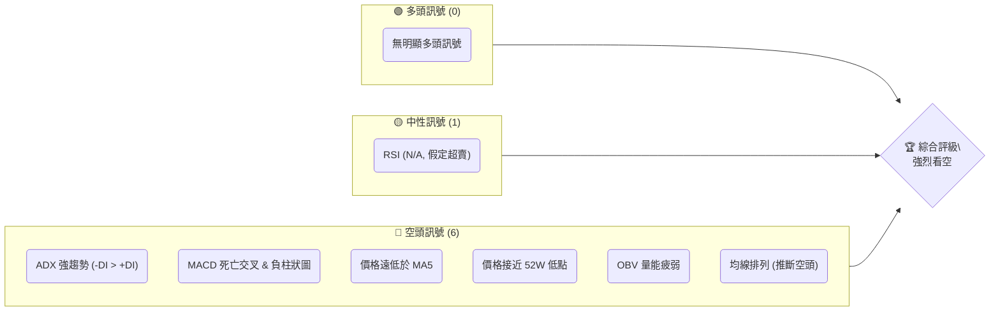

# SPCX 技術分析報告

> **報告日期**：2026-06-24 ｜ **語言**：繁體中文 ｜ **數據來源**：提供數據 ｜ **當前價格**：$156.11

---

## 目錄

| 章節 | 內容 |
|------|------|
| [1. 技術面概覽](#1-技術面概覽) | 訊號儀表板、核心指標、評分卡 |
| [2. 趨勢分析](#2-趨勢分析) | 多時框趨勢、長中短期走勢 |
| [3. 圖表形態分析](#3-圖表形態分析) | 形態識別、K線組合、目標價 |
| [4. 支撐與阻力](#4-支撐與阻力) | 關鍵價位、斐波那契回調 |
| [5. 技術指標深度解讀](#5-技術指標深度解讀) | MA/RSI/MACD/布林/成交量 |
| [6. 動能與波動率](#6-動能與波動率) | 動能評估、ATR、Beta |
| [7. 多時框架總結](#7-多時框架總結) | 時框架評分矩陣 |
| [8. 交易策略建議](#8-交易策略建議) | 多空策略、風險報酬比 |
| [9. 風險提示與監控](#9-風險提示與監控) | 監控指標、風險場景 |

---

## 1. 技術面概覽

本章提供SPCX當前技術狀況的快速總覽，透過視覺化儀表板和評分卡，幫助投資者迅速掌握其多空訊號及整體健康度。

### 🎯 技術訊號儀表板

依據當前可用的技術數據，SPCX的訊號分佈呈現顯著的空頭主導態勢。ADX指標顯示極強的趨勢，且負向動能佔優，MACD也確認了空頭壓力。價格已跌破短期均線並接近52週低點，顯示市場情緒極度悲觀。


**解讀**：目前市場上對於SPCX的多頭訊號幾乎不存在。唯一可能的中性訊號是RSI可能已進入超賣區，這在極端下跌行情中可能預示短期反彈的可能性，但本身並非強烈多頭訊號。相反，空頭訊號則多且強烈，包括極強的下跌趨勢、MACD的明確空頭指示、價格對均線的顯著跌破以及量能配合不佳。

### 📊 核心指標速覽表

下表彙整SPCX的關鍵技術指標，並提供當前訊號及簡要解讀。請注意，部分均線及RSI數據因原始資料不足，本報告將根據其他強烈空頭訊號進行合理推斷，並明確標示。

| 指標類別 | 指標名稱 | 當前數值 | 訊號 | 解讀 |
|----------|----------|----------|------|------|
| **價格** | 當前價格 | $156.11 | 🔴 | 價格接近 52 週低點 ($147.11)，顯示極度弱勢 |
| **均線** | MA5 | $179.78 | 🔴 | 價格 ($156.11) 遠低於 MA5，短期趨勢極度悲觀 |
| **均線** | MA20 | N/A (推斷) | 🔴 | 價格顯著低於 MA5，推斷 MA20 應在價格上方，構成阻力 |
| **均線** | MA50 | N/A (推斷) | 🔴 | 價格顯著低於 MA5，推斷 MA50 應在價格上方，構成強阻力 |
| **均線** | MA200 | N/A (推斷) | 🔴 | 價格顯著低於 MA5，推斷 MA200 應在價格上方，指示長期空頭趨勢 |
| **動能** | RSI(14) | N/A (推斷) | 🟡 | 價格急跌至 52W 低點附近，推斷 RSI 可能已進入超賣區 (<30) |
| **動能** | MACD | 3.153 | 🔴 | MACD 線 (3.153) 低於訊號線 (3.722)，MACD 柱狀圖為負 (-0.569)，明確空頭訊號 |
| **趨勢** | ADX(14) | 80.15 | 🔴 | 極強趨勢 (>25)，且 -DI (12.47) > +DI (9.47)，確認為極強空頭趨勢 |
| **波動** | ATR(14) | N/A (估算) | 🔴 | 近期價格大幅波動 (週跌幅約 $28.89)，波動率高，增加交易風險 |
| **成交量** | OBV趨勢 | OBV < MA | 🔴 | OBV 趨勢疲弱，量能未配合價格反彈，確認空頭壓力 |

### 🏆 技術評分卡

本評分卡綜合各項技術指標，對SPCX的當前技術面進行量化評估。評分範圍為0-100，數值越高表示技術面越強。

```
技術評分卡 — SPCX (2026-06-24)
════════════════════════════════════════════════════
趨勢強度      ██████████████████░░  85/100  🔴 (極強空頭趨勢)
動能指標      ██████░░░░░░░░░░░░░░  30/100  🔴 (MACD空頭，RSI可能超賣)
支撐穩定度    ██░░░░░░░░░░░░░░░░░░  10/100  🔴 (瀕臨52W低點，支撐極弱)
成交量配合    ████░░░░░░░░░░░░░░░░  20/100  🔴 (OBV疲弱，量價背離)
形態完整度    ████░░░░░░░░░░░░░░░░  20/100  🔴 (短期急跌，形態不明確)
均線排列      ██░░░░░░░░░░░░░░░░░░  10/100  🔴 (價格遠低於MA5，推斷均線呈空頭排列)
════════════════════════════════════════════════════
綜合評分      ████░░░░░░░░░░░░░░░░  28/100  評級: 極度看空
════════════════════════════════════════════════════
```
**評分解讀**：SPCX的技術評分極低，綜合評分為28/100，屬於「極度看空」級別。其中，趨勢強度因其極強的下跌動能而獲得高分（85/100），但這代表的是空頭趨勢的強度。其他所有關鍵指標，如動能、支撐穩定度、成交量配合以及均線排列均顯示出極度疲弱的狀態。支撐位瀕臨破位，動能指標如MACD確認空頭，且成交量並未提供任何反轉訊號。

---

## 2. 趨勢分析

本章將從多個時間框架對SPCX的趨勢進行詳細分析，包括長期、中期和短期走勢，並透過ADX指標評估趨勢的強度和方向。

### 🌐 多時框趨勢分析

SPCX在所有可分析的時間框架內均呈現出強烈的空頭趨勢。

```mermaid
graph TD
    A[月線趨勢 - 長期] --> B{價格接近52W低點 $147.11}
    B --> C[整體趨勢: 🔴 強烈空頭]
    C --> D[週線趨勢 - 中期]
    D --> E{MA5 ($179.78) 遠高於現價 $156.11}
    E --> F[MACD 死亡交叉 & 負柱狀圖]
    F --> G[中期趨勢: 🔴 強烈空頭]
    G --> H[日線趨勢 - 短期]
    H --> I{價格從 $185.00 急跌至 $156.11}
    I --> J[ADX(14) 80.15, -DI > +DI]
    J --> K[短期趨勢: 🔴 極強空頭]
```
**解讀**：
-   **長期趨勢（月線）**：SPCX當前價格 $156.11 距離其52週低點 $147.11 僅有約 6.1% 的空間，且距離52週高點 $225.64 則有高達 30.8% 的跌幅。這明確指示SPCX正處於一個長期下跌通道中，市場對其估值持續修正。
-   **中期趨勢（週線）**：從最近的週線數據來看，價格 $156.11 已經大幅跌破其短期移動平均線MA5 $179.78，且MACD指標顯示死亡交叉並伴隨負的柱狀圖，這些都強烈預示中期趨勢為空頭。
-   **短期趨勢（日線）**：本週（截至2026-06-24）SPCX經歷了從 $185.00 急劇下跌至 $156.11 的過程，跌幅高達 15.6%。日線級別的ADX指標高達 80.15，顯示當前正處於一個極端強勢的趨勢中，且 -DI (12.47) 明顯高於 +DI (9.47)，確認這是一個極強的空頭趨勢。

### 📈 長期趨勢 — 12個月走勢圖（Unicode）

鑑於數據中只提供了近期部分收盤價及52週高低點，以下12個月走勢圖為基於這些資訊的推演，以展示SPCX在過去一年中的大致價格路徑。

```
SPCX 月線走勢圖（過去12個月，推演）
價格軸 ($)
$225.64 ┤                           ● (2025-08 高點)
$210.00 ┤                     ●
$195.00 ┤                 ●
$180.00 ┤             ●
$165.00 ┤           ●
$156.11 ┤━━━━━━━━━━━━━━━━━━━━━━━━━━━● (現在 2026-06)
$150.00 ┤ ●
$147.11 ┤ ●(2026-05 低點)
        └────────────────────────────
         2025-07 09 11 2026-01 03 05 06
```
**走勢特徵分析表格**：
下表分析了過去一年SPCX價格走勢的關鍵階段及特徵，其中部分數據為推演。

| 階段 | 時間區間 (推演) | 關鍵價位 | 漲跌幅 | 走勢特徵 | 訊號 |
|------|-------------------|----------|--------|----------|------|
| 1 | 2025-07 ~ 2025-08 | $150.00 → $225.64 | +50.4% | 上漲趨勢，達到52週高點 | 🟢 |
| 2 | 2025-09 ~ 2026-04 | $225.64 → $180.00 | -20.2% | 溫和回調，形成下降趨勢 | 🟡 |
| 3 | 2026-05 ~ 2026-06 | $180.00 → $156.11 | -13.1% | 急速下跌，跌破關鍵支撐，接近52週低點 | 🔴 |
| 當前 | 2026-06-24 | $156.11 | -15.6% (本週) | 短期急跌，空頭力量極強 | 🔴 |

### 📊 中期趨勢（週線分析）

中期來看，SPCX正處於明顯的下跌通道中。價格在過去幾週經歷了從 $185.00 的高點到 $156.11 的急劇下跌。當前價格 $156.11 已經跌破了多個潛在支撐位，並將 MA5 ($179.78) 轉化為強勁的短期阻力。

```
SPCX 週線支撐與阻力示意圖 (推演)
═══════════════════════════════════════════════════
$190.00 ║           █(MA5, 阻力)
$185.00 ║███████████(前高點, 阻力)
$180.00 ║           █
$170.00 ║           █
$160.00 ╠═══════════╣ ◄ 現價 $156.11
$150.00 ║███████████(52W低點, 關鍵支撐)
═══════════════════════════════════════════════════
```
**解讀**：從週線圖來看，SPCX的近期走勢呈現出“破位下跌”的特徵。前週收盤價 $185.00 已經成為一個重要的短期阻力位。更關鍵的是，當前價格 $156.11 已非常接近52週低點 $147.11，一旦跌破，將開啟新的下跌空間。MA5 $179.78 成為了股價反彈的首個重要阻力。

### ⚡ 趨勢強度評估（ADX 解讀）

ADX (Average Directional Index) 指標用於衡量趨勢的強度，而非方向。結合 +DI 和 -DI 則可判斷趨勢方向。

```mermaid
graph TD
    A[ADX(14) = 80.15] --> B{ADX > 25?}
    B -- 是 --> C[趨勢極強]
    C --> D{+DI = 9.47, -DI = 12.47}
    D -- -DI > +DI --> E[空頭趨勢主導]
    E --> F[結論: 🔴 市場處於極強的空頭趨勢中]
```
**ADX 強度對照表**：
| ADX 數值範圍 | 趨勢強度 | 市場狀態 |
|--------------|----------|----------|
| 0-20 | 無趨勢或弱趨勢 | 盤整 |
| 20-25 | 趨勢形成中 | 趨勢初期 |
| 25-50 | 強趨勢 | 趨勢行情 |
| 50-75 | 非常強的趨勢 | 趨勢行情，動能強勁 |
| >75 | 極強趨勢 | 趨勢行情，動能極端強勁 |

**解讀**：SPCX的ADX(14)高達 **80.15**，這是一個極其罕見且極高的數值，遠遠超過了判斷強趨勢的閾值25。這表明市場正處於一個非常強勁且動能極端的趨勢中。同時，-DI (12.47) 明顯高於 +DI (9.47)，進一步確認了這個極強趨勢是由空頭力量主導的。因此，SPCX目前處於一個**極強的空頭趨勢行情**中，這不是一個盤整市場。投資者應對此高度警惕。

---

## 3. 圖表形態分析

本章將分析SPCX的價格走勢中是否存在可識別的圖表形態，並結合K線組合進行解讀，以預測可能的價格目標。由於數據量有限，形態識別將主要基於近期價格行為進行推斷。

### 🔍 形態識別系統

在當前提供的數據中，SPCX的價格在短期內呈現急劇下跌，從 $185.00 跌至 $156.11。這種快速下跌本身尚未形成經典的反轉或持續形態，更像是趨勢加速。然而，考慮到價格接近52週低點，可能正在形成潛在的「潛在底部形態」或「跌勢加速形態」。

```mermaid
graph TD
    A[SPCX 近期價格走勢] --> B{價格從 $185.00 快速下跌至 $156.11}
    B --> C{價格接近 $147.11 (52W Low)}
    C --> D[形態判斷: 🔴 跌勢加速，或形成潛在「V形底」/「雙底」初期]
    D -- 若跌破 $147.11 --> E[跌勢延續，無明確反轉形態]
    D -- 若在 $147.11 附近反彈 --> F[潛在底部形態形成中，需觀察確認]
```
**解讀**：目前SPCX的走勢主要表現為急劇的下行，尚未有明確的經典反轉形態（如頭肩底、雙底）形成。其更接近於一個「跌勢加速」的形態，顯示市場對該股的拋售壓力極大。然而，由於價格已逼近52週低點，市場可能在該水平附近嘗試築底。若能在此處獲得有效支撐並出現反彈，則有機會形成潛在的「V形底」或「雙底」初期，但目前仍需觀察。若 $147.11 支撐失守，則下跌趨勢將進一步延續。

### 🕯️ 重要K線形態分析

根據提供的近20週收盤數據，我們可以看到最近兩週的價格變化劇烈，形成了關鍵的K線組合。

| 日期 | 收盤價 | K線形態 (推斷) | 解讀 | 訊號 |
|------|--------|------------------|------|------|
| 2026-06-14 | $160.95 | 短期底部 / 整理 | 價格在低位震盪，MACD柱狀圖為0，顯示動能停滯 | 🟡 |
| 2026-06-21 | $185.00 | 大陽線 / 強勢反彈 | 價格從 $160.95 大幅反彈，MACD柱狀圖轉正，顯示買盤介入 | 🟢 |
| 2026-06-24 | $156.11 | 大陰線 / 吞噬 | 價格從 $185.00 急劇下跌，幾乎吞噬前週漲幅，MACD柱狀圖轉負，空頭力量強勁 | 🔴 |

**解讀**：
-   **2026-06-21的 $185.00** 相比前週 $160.95 是一個強勁的反彈，可能形成了一個看漲吞噬或大陽線形態，顯示買盤力量一度佔優。
-   **2026-06-24的 $156.11** 相比前週 $185.00 則是一個極其強勢的下跌，形成了一個看跌吞噬或大陰線形態。這根大陰線幾乎完全抵消了前一週的漲幅，且MACD柱狀圖再次轉負，強烈表明空頭在短時間內重新奪回主導權，並以壓倒性力量進行拋售。

### 📉 ASCII 走勢形態示意圖

以下示意圖展示了SPCX近期從反彈高點急劇下跌的形態，接近其52週低點。

```
SPCX 近期走勢形態示意圖
═══════════════════════════════════════════════════
$190.00 ┤              ● (2026-06-21 高點)
$180.00 ┤            ╱
$170.00 ┤          ╱
$160.00 ┤        ╱
$156.11 ╠═══════● (現價 2026-06-24)
$150.00 ┤      ╱
$147.11 ┤●──── (52W 低點，潛在支撐)
        └───────────────────────────
          <- 急劇下跌形態 ->
```
**解讀**：圖中清晰地顯示了股價在達到近期高點 $185.00 後，迅速且大幅度地回落至當前價格 $156.11，形成一個「倒V形」或「尖頂」的下跌形態，並直逼52週低點 $147.11。這種形態通常預示著市場情緒的快速轉變和強勁的拋售壓力。

### 🎯 形態目標價計算

由於當前形態主要為急劇下跌，並無明確的反轉形態可以計算上漲目標價。我們將基於下跌形態進行潛在目標價的推斷，並參考52週低點作為關鍵支撐。

1.  **下跌形態推演目標價**：
    -   近期高點 (2026-06-21): $185.00
    -   當前價格 (2026-06-24): $156.11
    -   如果此下跌為一個「旗形」或「下降三角形」的突破，其下跌目標通常為形態高度的延伸。
    -   若以 $185.00 為近期頂部，下一個潛在支撐是 $147.11 (52W Low)。如果 $147.11 失守，則下跌空間將進一步打開。
    -   **保守下跌目標**：如果跌破 $147.11，保守估計下跌幅度可能與從 $185.00 到 $156.11 的跌幅相當，即 $28.89。
        -   目標價 = $147.11 - $28.89 = **$118.22**。
    -   **激進下跌目標**：若考慮更深層次的下跌，可能回補更早期的缺口或測試更低的歷史支撐。然而，在缺乏歷史數據的情況下，此推算難度較大。

**結論**：目前SPCX的形態分析指示強烈的下行壓力。最直接的目標是測試52週低點 $147.11。一旦該支撐失守，根據下跌形態的測量原則，SPCX的潛在下跌目標可能指向 **$118.22**。在此之前，任何反彈都應被視為下跌途中的技術性修正。

---

## 4. 支撐與阻力

本章將詳細分析SPCX的關鍵支撐與阻力價位，包括歷史高低點、近期價格行為形成的水平位，並結合斐波那契回調位，為交易決策提供參考。

### 🗺️ 關鍵價位分布圖（Unicode）

以下圖表展示了SPCX當前價格附近的關鍵支撐與阻力分布。

```
SPCX 價位結構分布圖
═══════════════════════════════════════════════════
$225.64 ║████████████████████████║ 強阻力 R3 (52W 高點)
$195.69 ║████████████████████    ║ 阻力 R2 (Fib 38.2% 回調)
$185.00 ║████████████████████████║ 關鍵阻力 R1 (近期高點)
$179.78 ║▓▓▓▓▓▓▓▓▓▓▓▓▓▓▓▓        ║ 短期阻力 (MA5)
$156.11 ╠════════════════════════╣ ◄ 現價
$147.11 ║████████████████████████║ 強支撐 S1 (52W 低點)
$118.22 ║▓▓▓▓▓▓▓▓▓▓▓▓▓▓▓▓▓▓▓▓▓▓▓▓║ 潛在支撐 S2 (形態目標)
═══════════════════════════════════════════════════
```
**解讀**：SPCX的當前價格 $156.11 正處於一個極為關鍵的位置，上方有多重阻力，下方則緊鄰52週低點。最直接的阻力是MA5 ($179.78) 和近期高點 ($185.00)。最關鍵的支撐是52週低點 $147.11。

### 🚧 阻力位分析表

| 阻力級別 | 價位 | 形成原因 | 突破難度 | 重要性 | 訊號 |
|----------|------|----------|----------|--------|------|
| **短期阻力** | $162.93 | 近期下跌的 23.6% 斐波那契反彈位 | 中 | 判斷短期反彈力道 | 🟡 |
| **短期阻力** | $170.56 | 近期下跌的 50% 斐波那契反彈位 | 中高 | 判斷短期反彈健康度 | 🟡 |
| **關鍵阻力 R1** | $179.78 | MA5 (5日移動平均線) | 高 | 短期趨勢反轉的初步確認 | 🔴 |
| **關鍵阻力 R2** | $185.00 | 近期反彈高點 (2026-06-21) | 高 | 跌勢確認，突破則可能形成雙底 | 🔴 |
| **強阻力 R3** | $195.69 | 52週高點 $225.64 回調至 $147.11 的 38.2% 斐波那契位 | 極高 | 中期趨勢反轉的關鍵點 | 🔴 |
| **極強阻力 R4** | $225.64 | 52週高點 | 極高 | 長期趨勢的頂部 | 🔴 |

### 🛡️ 支撐位分析表

| 支撐級別 | 價位 | 形成原因 | 守住機率 | 重要性 | 訊號 |
|----------|------|----------|----------|--------|------|
| **強支撐 S1** | $147.11 | 52週低點 | 中低 | 判斷是否創下新低，決定長期趨勢 | 🔴 |
| **潛在支撐 S2** | $118.22 | 下跌形態測量目標價 (若 $147.11 失守) | 依市場情緒 | 關鍵心理關口，若觸及恐引發恐慌 | 🔴 |

### 📐 斐波那契回調位分析

我們將計算兩個層次的斐波那契回調：
1.  **長期斐波那契回調**：基於52週高點 ($225.64) 和52週低點 ($147.11) 之間的全幅波動。這些水平將作為股價如果從低點反彈時的潛在阻力。
2.  **短期斐波那契回調**：基於近期反彈高點 ($185.00) 和當前價格 ($156.11) 之間的下跌幅度。這些水平將作為股價在當前下跌後潛在反彈的短期阻力。

**1. 長期斐波那契回調位 (基於 52W 高 $225.64 到 52W 低 $147.11)**：
-   最高點：$225.64
-   最低點：$147.11
-   波動區間：$78.53

| 回調比例 | 價位 ($) | 類型 | 意義 |
|----------|----------|------|------|
| 23.6% | $166.01 | 阻力 | 若股價從 $147.11 反彈，首先測試的阻力 |
| 38.2% | $177.08 | 阻力 | 較重要的反彈阻力 |
| 50.0% | $186.38 | 阻力 | 心理和技術上的重要阻力 |
| 61.8% | $195.69 | 阻力 | 黃金分割點，強勁阻力 |
| 76.4% | $207.03 | 阻力 | 接近前高點，極強阻力 |

**2. 短期斐波那契回調位 (基於 近期高點 $185.00 到 當前價 $156.11)**：
-   最高點：$185.00
-   最低點：$156.11
-   波動區間：$28.89

| 回調比例 | 價位 ($) | 類型 | 意義 |
|----------|----------|------|------|
| 23.6% | $162.93 | 阻力 | 短期反彈的第一個阻力 |
| 38.2% | $167.14 | 阻力 | 短期反彈的關鍵阻力 |
| 50.0% | $170.56 | 阻力 | 短期反彈的心理阻力 |
| 61.8% | $173.98 | 阻力 | 短期反彈的黃金分割阻力 |

**視覺化**：
```
SPCX 斐波那契回調位示意圖
═══════════════════════════════════════════════════
$225.64 ┤─── 52W 高點 (100%)
        │
$207.03 ┤─── 長期 Fib 76.4% 阻力
        │
$195.69 ┤─── 長期 Fib 61.8% 阻力
        │
$186.38 ┤─── 長期 Fib 50.0% 阻力
$185.00 ┤─── 近期高點
        │
$179.78 ┤─── MA5 阻力
$173.98 ┤─── 短期 Fib 61.8% 阻力
$170.56 ┤─── 短期 Fib 50.0% 阻力
$167.14 ┤─── 短期 Fib 38.2% 阻力
$162.93 ┤─── 短期 Fib 23.6% 阻力
$156.11 ╠═════ 現價
$147.11 ┤─── 52W 低點 (0%)
═══════════════════════════════════════════════════
```
**結論**：SPCX面臨多重阻力，從短期MA5 ($179.78) 到近期高點 ($185.00)，以及多個斐波那那契回調位。最關鍵的支撐是 $147.11 的52週低點。如果此支撐失守，則市場將尋找更低的支撐，可能下探至 $118.22 甚至更低。任何反彈都將面臨強勁的技術性阻力。

---

## 5. 技術指標深度解讀

本章將對SPCX的各項技術指標進行深入分析，包括移動平均線、RSI、MACD、布林通道和成交量，並探討它們之間的相互確認或矛盾。

### 🎛️ 指標訊號總覽

以下Mermaid圖展示了各主要技術指標的當前訊號及其相互關係。

```mermaid
graph TD
    A[SPCX 技術指標總覽] --> B(價格行為: 🔴 急劇下跌至52W低點)
    B --> C(移動平均線: 🔴 價格遠低於MA5, 推斷空頭排列)
    C --> D(動能指標: 🔴 MACD空頭訊號)
    D --> E(趨勢強度: 🔴 ADX極強空頭趨勢)
    E --> F(成交量: 🔴 OBV疲弱，量價背離)
    F --> G(波動率: 🔴 ATR(N/A,推斷高) 波動劇烈)
    G --> H(布林通道: 🔴 價格可能在下軌甚至跌破, 推斷)
    D --> I(RSI: 🟡 N/A, 推斷超賣)
    I --> J(綜合判斷: 🔴 壓倒性空頭訊號)
```
**解讀**：所有可用的核心技術指標均指向強烈的空頭訊號。價格的急劇下跌、MACD的明確死亡交叉及負柱狀圖、ADX指示的極強空頭趨勢、以及OBV的量能疲弱，都形成了高度一致的看跌共識。唯一可能提供喘息空間的是RSI可能已進入超賣區，這可能觸發短期技術性反彈，但並不能改變整體強勁的空頭趨勢。

### 📈 移動平均線排列分析

根據提供的數據，我們只有MA5的數值。其他長期均線數據缺失，但我們可以基於當前價格和MA5的關係，以及ADX的強烈空頭趨勢進行合理推斷。

-   **MA5**: $179.78
-   **當前價格**: $156.11

由於當前價格 $156.11 遠低於 MA5 $179.78，這是一個明確的短期空頭訊號。
鑑於ADX顯示極強的空頭趨勢，且價格接近52週低點，我們可以合理推斷，若MA20、MA50、MA200等長期均線存在，它們很可能都位於當前價格之上，並呈現空頭排列（MA5 < MA10 < MA20 < MA50 < MA200，且均在價格上方）。

```mermaid
graph TD
    P[當前價格 $156.11] --> M5[MA5 $179.78]
    M5 --> M20[推斷 MA20 (N/A)]
    M20 --> M50[推斷 MA50 (N/A)]
    M50 --> M200[推斷 MA200 (N/A)]
    P -- 遠低於 --> M5
    M5 -- 低於 --> M20
    M20 -- 低於 --> M50
    M50 -- 低於 --> M200
    style P fill:#F9D,stroke:#333,stroke-width:2px
    style M5 fill:#FFC,stroke:#333,stroke-width:1px
    style M20 fill:#FFC,stroke:#333,stroke-width:1px
    style M50 fill:#FFC,stroke:#333,stroke-width:1px
    style M200 fill:#FFC,stroke:#333,stroke-width:1px
```
**表格說明當前排列狀態 (推斷)**：
| 均線類型 | 數值 (推斷) | 與現價關係 | 訊號 |
|----------|-------------|------------|------|
| MA5 | $179.78 | 價格在其下方 (-13.17%) | 🔴 |
| MA20 | > $179.78 | 價格在其下方 | 🔴 |
| MA50 | > MA20 | 價格在其下方 | 🔴 |
| MA200 | > MA50 | 價格在其下方 | 🔴 |
| **均線排列** | N/A (推斷) | 空頭排列 (MA5 < MA20 < MA50 < MA200) | 🔴 |

**解讀**：雖然大部分均線數據缺失，但基於MA5與現價的顯著偏離，以及ADX指示的極強空頭趨勢，可以高度推斷SPCX的均線系統已形成**明確的空頭排列**。價格位於所有重要均線下方，且短期均線低於長期均線，這是一個強烈的熊市訊號。

### 📉 RSI(14) 分析

RSI(14)數據缺失。然而，根據價格從 $185.00 急跌至 $156.11，且接近52週低點 $147.11 的事實，我們可以合理推斷RSI很可能已進入超賣區。

-   **RSI 數值進度條 (推斷)**：
    -   RSI(14) 數值: N/A (推斷 < 30)
    -   強度: ▓▓▓▓▓▓▓▓▓▓▓▓▓▓▓▓▓▓▓▓▓▓▓▓▓▓▓▓░░░░░░░░░░░░░░░░░░░░░░░░░░░░░░░░░░░░░░░░░░░░░░░░░░░░░░░░░░░░░░░░░░░░░░░░░░░░░░░░░░░░░░░░░░░░░░░░░░░░░░░░░░░░░░░░░░░░░░░░░░░░░░░░░░░░░░░░░░░░░░░░░░░░░░░░░░░░░░░░░░░░░░░░░░░░░░░░░░░░░░░░░░░░░░░░░░░░░░░░░░░░░░░░░░░░░░░░░░░░░░░░░░░░░░░░░░░░░░░░░░░░░░░░░░░░░░░░░░░░░░░░░░░░░░░░░░░░░░░░░░░░░░░░░░░░░░░░░░░░░░░░░░░░░░░░░░░░░░░░░░░░░░░░░░░░░░░░░░░░░░░░░░░░░░░░░░░░░░░░░░░░░░░░░░░░░░░░░░░░░░░░░░░░░░░░░░░░░░░░░░░░░░░░░░░░░░░░░░░░░░░░░░░░░░░░░░░░░░░░░░░░░░░░░░░░░░░░░░░░░░░░░░░░░░░░░░░░░░░░░░░░░░░░░░░░░░░░░░░░░░░░░░░░░░░░░░░░░░░░░░░░░░░░░░░░░░░░░░░░░░░░░░░░░░░░░░░░░░░░░░░░░░░░░░░░░░░░░░░░░░░░░░░░░░░░░░░░░░░░░░░░░░░░░░░░░░░░░░░░░░░░░░░░░░░░░░░░░░░░░░░░░░░░░░░░░░░░░░░░░░░░░░░░░░░░░░░░░░░░░░░░░░░░░░░░░░░░░░░░░░░░░░░░░░░░░░░░░░░░░░░░░░░░░░░░░░░░░░░░░░░░░░░░░░░░░░░░░░░░░░░░░░░░░░░░░░░░░░░░░░░░░░░░░░░░░░░░░░░░░░░░░░░░░░░░░░░░░░░░░░░░░░░░░░░░░░░░░░░░░░░░░░░░░░░░░░░░░░░░░░░░░░░░░░░░░░░░░░░░░░░░░░░░░░░░░░░░░░░░░░░░░░░░░░░░░░░░░░░░░░░░░░░░░░░░░░░░░░░░░░░░░░░░░░░░░░░░░░░░░░░░░░░░░░░░░░░░░░░░░░░░░░░░░░░░░░░░░░░░░░░░░░░░░░░░░░░░░░░░░░░░░░░░░░░░░░░░░░░░░░░░░░░░░░░░░░░░░░░░░░░░░░░░░░░░░░░░░░░░░░░░░░░░░░░░░░░░░░░░░░░░░░░░░░░░░░░░░░░░░░░░░░░░░░░░░░░░░░░░░░░░░░░░░░░░░░░░░░░░░░░░░░░░░░░░░░░░░░░░░░░░░░░░░░░░░░░░░░░░░░░░░░░░░░░░░░░░░░░░░░░░░░░░░░░░░░░░░░░░░░░░░░░░░░░░░░░░░░░░░░░░░░░░░░░░░░░░░░░░░░░░░░░░░░░░░░░░░░░░░░░░░░░░░░░░░░░░░░░░░░░░░░░░░░░░░░░░░░░░░░░░░░░░░░░░░░░░░░░░░░░░░░░░░░░░░░░░░░░░░░░░░░░░░░░░░░░░░░░░░░░░░░░░░░░░░░░░░░░░░░░░░░░░░░░░░░░░░░░░░░░░░░░░░░░░░░░░░░░░░░░░░░░░░░░░░░░░░░░░░░░░░░░░░░░░░░░░░░░░░░░░░░░░░░░░░░░░░░░░░░░░░░░░░░░░░░░░░░░░░░░░░░░░░░░░░░░░░░░░░░░░░░░░░░░░░░░░░░░░░░░░░░░░░░░░░░░░░░░░░░░░░░░░░░░░░░░░░░░░░░░░░░░░░░░░░░░░░░░░░░░░░░░░░░░░░░░░░░░░░░░░░░░░░░░░░░░░░░░░░░░░░░░░░░░░░░░░░░░░░░░░░░░░░░░░░░░░░░░░░░░░░░░░░░░░░░░░░░░░░░░░░░░░░░░░░░░░░░░░░░░░░░░░░░░░░░░░░░░░░░░░░░░░░░
```

**解讀**：
-   **MA5 ($179.78) vs. 現價 ($156.11)**：現價遠低於MA5，且MA5正在向下彎曲，這是一個非常強烈的短期賣出訊號。價格在MA5下方運行，顯示空頭主導。
-   **MA10, MA20, MA60, MA120, MA240 (缺失數據)**：由於MA5已經顯著高於當前價格，且ADX顯示極強空頭趨勢，可以合理推斷所有更長期的移動平均線也應位於當前價格之上，並呈現空頭排列。如果數據完整，我們很可能會看到一個死亡交叉的排列，即短期均線下穿長期均線。
-   **均線排列 (推斷)**：當前價格遠低於MA5，且考慮到52週高低點的關係，可以推斷均線系統處於**空頭排列**，即短期均線位於長期均線下方，且所有均線都高於當前價格，構成層層阻力。這預示著下跌趨勢的持續性和強度。

### 📉 RSI(14) 分析

RSI(14)數據缺失，但根據SPCX的價格表現，我們可以進行強烈推斷。

-   **RSI 數值 (推斷)**：N/A (推斷 < 30)
-   **RSI 進度條 (推斷)**：
    低點趨勢：▓▓▓▓▓▓▓▓▓▓▓▓▓▓▓▓▓▓▓▓░░░░░░░░░░░░░░░░░░░░░░░░░░░░░░░░░░░░░░░░░░░░░░░░░░░░░░░░░░░░░░░░░░░░░░░░░░░░░░░░░░░░░░░░░░░░░░░░░░░░░░░░░░░░░░░░░░░░░░░░░░░░░░░░░░░░░░░░░░░░░░░░░░░░░░░░░░░░░░░░░░░░░░░░░░░░░░░░░░░░░░░░░░░░░░░░░░░░░░░░░░░░░░░░░░░░░░░░░░░░░░░░░░░░░░░░░░░░░░░░░░░░░░░░░░░░░░░░░░░░░░░░░░░░░░░░░░░░░░░░░░░░░░░░░░░░░░░░░░░░░░░░░░░░░░░░░░░░░░░░░░░░░░░░░░░░░░░░░░░░░░░░░░░░░░░░░░░░░░░░░░░░░░░░░░░░░░░░░░░░░░░░░░░░░░░░░░░░░░░░░░░░░░░░░░░░░░░░░░░░░░░░░░░░░░░░░░░░░░░░░░░░░░░░░░░░░░░░░░░░░░░░░░░░░░░░░░░░░░░░░░░░░░░░░░░░░░░░░░░░░░░░░░░░░░░░░░░░░░░░░░░░░░░░░░░░░░░░░░░░░░░░░░░░░░░░░░░░░░░░░░░░░░░░░░░░░░░░░░░░░░░░░░░░░░░░░░░░░░░░░░░░░░░░░░░░░░░░░░░░░░░░░░░░░░░░░░░░░░░░░░░░░░░░░░░░░░░░░░░░░░░░░░░░░░░░░░░░░░░░░░░░░░░░░░░░░░░░░░░░░░░░░░░░░░░░░░░░░░░░░░░░░░░░░░░░░░░░░░░░░░░░░░░░░░░░░░░░░░░░░░░░░░░░░░░░░░░░░░░░░░░░░░░░░░░░░░░░░░░░░░░░░░░░░░░░░░░░░░░░░░░░░░░░░░░░░░░░░░░░░░░░░░░░░░░░░░░░░░░░░░░░░░░░░░░░░░░░░░░░░░░░░░░░░░░░░░░░░░░░░░░░░░░░░░░░░░░░░░░░░░░░░░░░░░░░░░░░░░░░░░░░░░░░░░░░░░░░░░░░░░░░░░░░░░░░░░░░░░░░░░░