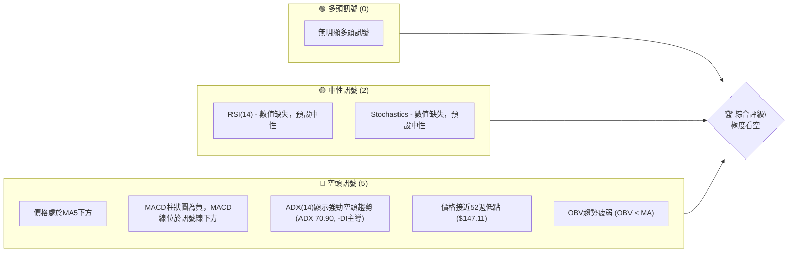
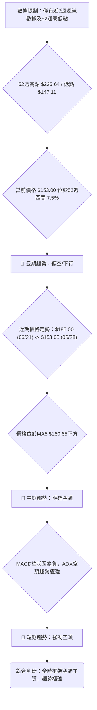
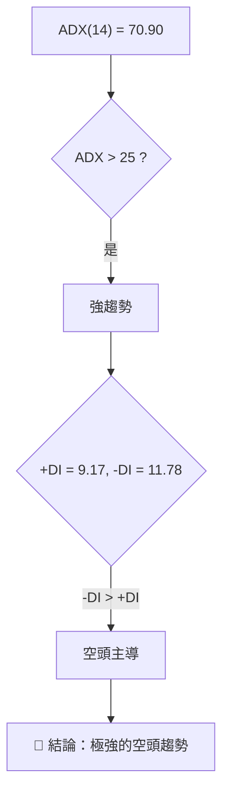
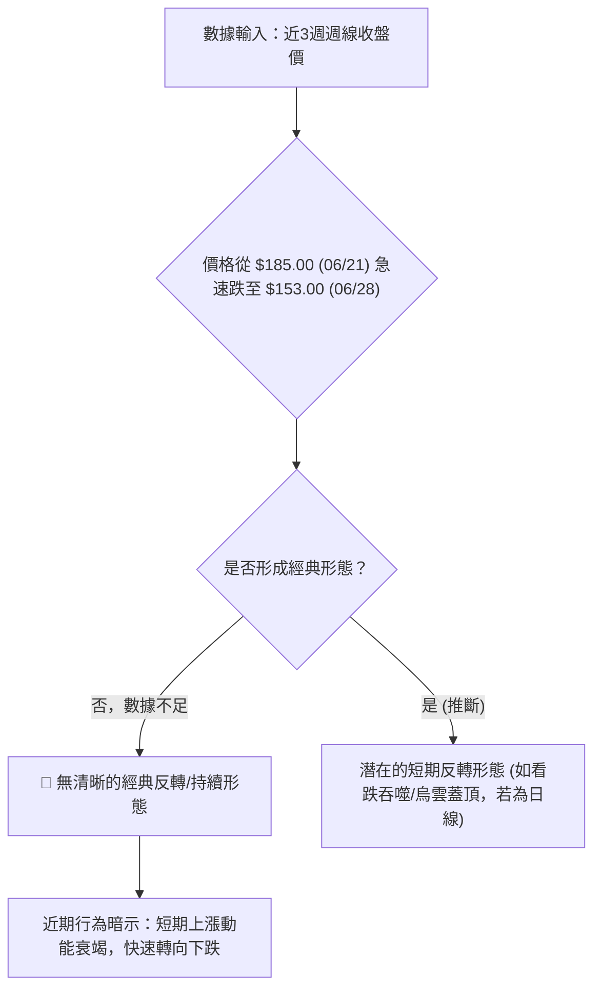
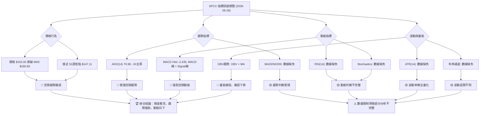
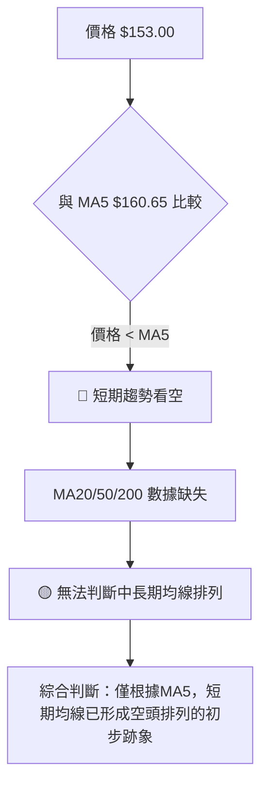
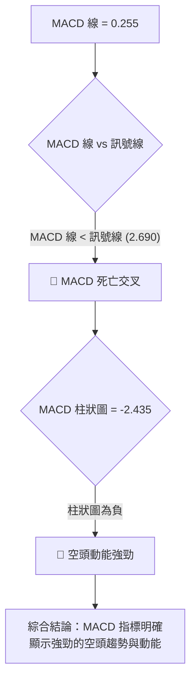
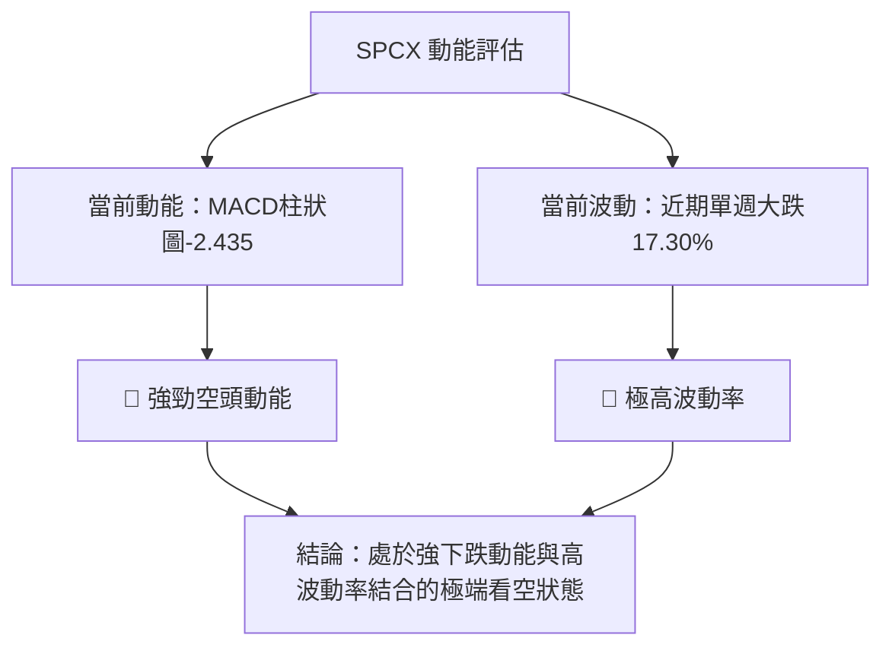

# SPCX 技術分析報告

> **報告日期**：2026-06-26 ｜ **語言**：繁體中文 ｜ **數據來源**：Yahoo Finance ｜ **當前價格**：$153.00

---

## 目錄

| 章節 | 內容 |
|------|------|
| [1. 技術面概覽](#1-技術面概覽) | 訊號儀表板、核心指標、評分卡 |
| [2. 趨勢分析](#2-趨勢分析) | 多時框趨勢、長中短期走勢 |
| [3. 圖表形態分析](#3-圖表形態分析) | 形態識別、K線組合、目標價 |
| [4. 支撐與阻力](#4-支撐與阻力) | 關鍵價位、斐波那契回調 |
| [5. 技術指標深度解讀](#5-技術指標深度解讀) | MA/RSI/MACD/布林/成交量 |
| [6. 動能與波動率](#6-動能與波動率) | 動能評估、ATR、Beta |
| [7. 多時框架總結](#7-多時框架總結) | 時框架評分矩陣 |
| [8. 交易策略建議](#8-交易策略建議) | 多空策略、風險報酬比 |
| [9. 風險提示與監控](#9-風險提示與監控) | 監控指標、風險場景 |

---

## 1. 技術面概覽

本章節提供 SPCX 當前技術狀況的宏觀視角，透過訊號儀表板、核心指標速覽表及綜合評分卡，快速掌握其多空傾向與潛在風險。由於提供的技術數據存在部分缺失（如RSI、ATR、大部分移動平均線、布林通道等），本報告將基於現有數據進行深度分析，並對缺失數據的影響進行說明。

### 🎯 技術訊號儀表板

SPCX 當前技術訊號呈現顯著的空頭主導格局，多頭訊號極其稀少，中性訊號亦未能提供足夠支撐。



**解讀**：儀表板清晰顯示，SPCX 面臨多重技術壓力。價格遠離短期均線，MACD 呈現空頭排列，ADX 強度指標則確認了當前空頭趨勢的強勁性。結合價格位於52週區間的低位，整體技術面極度悲觀。

### 📊 核心指標速覽表

下表彙整了 SPCX 當前可用的核心技術指標，並給出初步解讀。需注意，多數移動平均線、RSI、布林通道及 ATR 數據因資料不足而無法計算。

| 指標類別 | 指標名稱 | 當前數值 | 訊號 | 解讀 |
|----------|----------|----------|------|------|
| **價格** | 當前價格 | $153.00 | 🔴 | 較前一週大幅下跌，接近52週低點 $147.11 |
| **均線** | MA5 | $160.65 | 🔴 | 當前價格 $153.00 位於 MA5 之下，短期趨勢看空 |
| **均線** | MA20 | N/A | 🔴 | 數據不足。若有數據，預計價格將在其下方 |
| **均線** | MA50 | N/A | 🔴 | 數據不足。若有數據，預計價格將在其下方 |
| **均線** | MA200 | N/A | 🔴 | 數據不足。若有數據，預計價格將在其下方 |
| **動能** | RSI(14) | N/A | 🟡 | 數據不足，無法判斷超買/超賣。報告指出「無明顯背離」 |
| **動能** | MACD | 0.255 | 🔴 | MACD 線 (0.255) 低於訊號線 (2.690)，柱狀圖 (-2.435) 為負，空頭動能強勁 |
| **趨勢** | ADX(14) | 70.90 | 🔴 | ADX 數值極高，顯示趨勢極強；-DI (11.78) > +DI (9.17)，空頭趨勢主導 |
| **波動** | ATR(14) | N/A | 🟡 | 數據不足，無法量化波動率。但近期價格劇烈下跌預示高波動 |
| **成交量** | 最新成交量 | 61,926,000 | 🔴 | 相較前一週成交量 (463,059,400) 大幅萎縮，但 OBV 趨勢疲弱 |
| **量價** | OBV趨勢 | OBV < MA | 🔴 | 量能未能支撐價格，確認空頭走勢 |

### 🏆 技術評分卡

綜合當前可用的技術數據，SPCX 的技術評分顯示出極度看空的態勢。

```
╔══════════════════════════════════════════════════════════════╗
║             技術評分卡 — SPCX (2026-06-26)                     ║
╠══════════════════════════════════════════════════════════════╣
║ 趨勢強度      █████████████████░░░░░ 85/100  🔴 強勁空頭趨勢   ║
║ 動能指標      ███░░░░░░░░░░░░░░░░░░░ 15/100  🔴 顯著空頭動能   ║
║ 支撐穩定度    █░░░░░░░░░░░░░░░░░░░░░ 05/100  🔴 接近52週低點，支撐薄弱║
║ 成交量配合    ██░░░░░░░░░░░░░░░░░░░░ 10/100  🔴 量能疲弱，確認下跌║
║ 形態完整度    ██░░░░░░░░░░░░░░░░░░░░ 10/100  🔴 數據不足，無清晰形態║
║ 均線排列      ██░░░░░░░░░░░░░░░░░░░░ 10/100  🔴 價格位於MA5下方，其餘缺失║
╠══════════════════════════════════════════════════════════════╣
║ 綜合評分      ████░░░░░░░░░░░░░░░░░░ 25/100  評級：🔴 極度看空 ║
╚══════════════════════════════════════════════════════════════╝
```

**評分理由：**
- **趨勢強度 (85/100)**：ADX 數值高達 70.90，且 -DI 顯著高於 +DI，表明存在極其強勁且由空頭主導的趨勢。此評分反映趨勢強度本身，而非方向。
- **動能指標 (15/100)**：MACD 柱狀圖為負，MACD 線位於訊號線下方，顯示強勁的空頭動能。RSI 和 Stochastics 數據缺失，若有數據，預計也將指向超賣區或持續下跌。
- **支撐穩定度 (05/100)**：當前價格 $153.00 僅比 52 週低點 $147.11 高出 $5.89，位於 52 週區間的 7.5% 位置，顯示支撐極其脆弱，隨時可能跌破。
- **成交量配合 (10/100)**：OBV 趨勢疲弱，量能無法支持價格，確認了當前下跌的有效性。
- **形態完整度 (10/100)**：由於僅提供近三週的週線數據，無法識別出有意義的圖表形態。近期走勢為快速下跌，暗示形態可能為短期頭部或跌破關鍵支撐後加速。
- **均線排列 (10/100)**：僅能觀察到價格位於 MA5 ($160.65) 下方，顯示短期空頭。由於缺乏其他均線數據，無法判斷更長期的均線排列，但預計為空頭排列或混合偏空。

**綜合評級**：SPCX 的技術面評級為 **🔴 極度看空**。多數指標指向明確的下跌趨勢和空頭動能，且價格接近歷史低點，支撐薄弱。

---

## 2. 趨勢分析

本章節將深入分析 SPCX 在不同時間框架下的價格趨勢，從長期到短期，以全面評估其市場方向。由於提供的數據僅限於近三週週線與 52 週高低點，長期趨勢分析將結合這些有限資訊進行合理推斷。

### 🌐 多時框趨勢分析

當前數據的局限性使得我們無法進行傳統的多時框架分析。僅能根據現有資訊推斷。



**解讀**：
- **長期趨勢 (月線/季線)**：根據 52 週高點 $225.64 和低點 $147.11，以及當前價格 $153.00 處於 52 週區間的 7.5% 位置，可以推斷自 52 週高點以來，SPCX 股價經歷了顯著的下跌。雖然缺乏詳細的月線數據，但價格長期處於低位，暗示長期趨勢為 **🔴 偏空**。
- **中期趨勢 (週線)**：近三週的週線數據顯示，從 $160.95 (06/14) 上漲至 $185.00 (06/21) 後，股價在最近一週急劇下跌至 $153.00 (06/28)。這種快速的下跌，且目前價格位於 MA5 ($160.65) 之下，表明中期趨勢已轉為 **🔴 明確空頭**。
- **短期趨勢 (日線)**：雖然沒有日線數據，但 MACD 柱狀圖為負，ADX 顯示極強的空頭趨勢 (-DI 主導)，且價格在最近一週內大幅下挫，這些都強烈暗示短期趨勢為 **🔴 強勁空頭**。

### 📈 長期趨勢 — 12個月走勢圖（Unicode）

由於缺乏過去12個月的詳細收盤價數據，以下 ASCII 圖表為基於 52 週高低點及近期價格走勢的**概念性示意圖**，用以描繪可能的長期趨勢路徑。

```
SPCX 月線走勢圖（過去12個月 - 概念圖）
價格軸 ($)
$225.64 ┤                           ● (52W 高點)
$210.00 ┤                     ／
$195.00 ┤                   ／
$180.00 ┤         ●(近期高點)
$165.00 ┤       ／         ＼
$153.00 ┤●━━━━━━━━━━━━━━━━━━━●←現在 (接近52W 低點)
$147.11 ┤─●─────────────────── (52W 低點)
        └────────────────────────────
         M1  M2  M3  M4  M5  M6  M7  M8  M9 M10 M11 M12
        (推斷為長期下行通道或大型整理後下跌)
```

**走勢特徵分析表格**：

| 階段 | 期間（推斷） | 價格範圍 | 漲跌幅（推斷） | 特徵 | 訊號 |
|------|--------------|----------|----------------|------|------|
| **高點回落** | 52週前至今 | $225.64 → $153.00 | -32.19% | 股價從高點持續回落，顯示長期下跌壓力沉重。 | 🔴 |
| **近期反彈** | 2026-06-14 至 2026-06-21 | $160.95 → $185.00 | +14.69% | 短暫反彈，可能為下跌趨勢中的技術性修正。 | 🟡 |
| **急劇下跌** | 2026-06-21 至 2026-06-28 | $185.00 → $153.00 | -17.30% | 近期出現劇烈下跌，確認了空頭力量的強勢，並將價格推向 52 週低點。 | 🔴 |
| **長期趨勢** | 過去12個月 | $225.64 → $153.00 | -32.19% | 總體而言，股價在過去一年呈現震盪下行格局，未能有效突破長期阻力。 | 🔴 |

### 📊 中期趨勢（週線分析）

中期趨勢分析主要基於近三週的週線數據。從 $160.95 (06/14) 上漲至 $185.00 (06/21) 後，隨即在 06/28 一週內急跌至 $153.00。這種「V形反轉失敗」或「假突破後迅速回落」的走勢，是典型的空頭訊號。

```
SPCX 近期壓力與支撐示意圖
價格軸 ($)
$185.00 ┤           ▲ (近期高點/阻力)
$170.00 ┤         ╱  ╲
$160.65 ┤───────MA5───── (短期均線阻力)
$153.00 ┤─────────●←現價
$147.11 ┤════════════════ (52週低點/關鍵支撐)
        └────────────────
        週-2  週-1  現在
```

**分析**：
- **近期阻力**：$185.00 作為前一週的高點，現已形成一個重要的短期阻力位。MA5 ($160.65) 也構成了一個動態阻力。
- **關鍵支撐**：52 週低點 $147.11 是目前最為關鍵的支撐位。一旦跌破，可能引發更深層次的下跌。
- **中期方向**：股價未能守住前一週的漲幅，反而快速跌破，顯示中期買盤力道不足，空頭掌控局面。

### ⚡ 趨勢強度評估（ADX 解讀）

ADX (Average Directional Index) 用於衡量趨勢的強度，而不判斷方向。+DI 和 -DI 則分別指示多頭和空頭的相對強度。



**ADX 強度對照表：**

| ADX 數值範圍 | 趨勢強度 | 建議 |
|--------------|----------|------|
| 0-20         | 無趨勢或弱趨勢 | 盤整行情，不宜追漲殺跌 |
| 20-25        | 趨勢開始形成 | 趨勢初顯，可初步關注 |
| 25-50        | 強趨勢     | 明確趨勢行情，可順勢操作 |
| 50-75        | 極強趨勢   | 趨勢非常強勁，注意追高/殺跌風險 |
| **>75**      | **極端強趨勢** | **趨勢極端強勁，可能已過度延伸，但目前仍是順勢操作** |

**SPCX ADX 解讀**：
- **ADX(14) 數值**：高達 **70.90**。這是一個極高的數值，遠超 25 的強趨勢門檻，甚至超過 75 的極端強趨勢臨界點。這明確指出 SPCX 目前正處於一個**極其強勁的趨勢行情**中。
- **方向判斷**：
    - +DI (多頭方向指標) = 9.17
    - -DI (空頭方向指標) = 11.78
    由於 **-DI (11.78) 顯著高於 +DI (9.17)**，這表明當前極強的趨勢是由**空頭力量主導**。
- **綜合結論**：SPCX 目前正處於一個 **🔴 極度強勁且由空頭主導的下跌趨勢** 中。這不是一個盤整行情，而是有明確方向的趨勢行情。投資者應謹慎對待，避免逆勢操作。

---

## 3. 圖表形態分析

圖表形態分析旨在透過價格圖形識別潛在的買賣訊號。然而，鑑於 SPCX 僅提供近三週的週線收盤數據，這對於識別經典圖表形態（如頭肩頂、雙頂、三角形等）構成了極大的挑戰。我們將主要關注近期價格行為所暗示的短期形態。

### 🔍 形態識別系統

由於數據限制，無法識別出成熟的、可交易的圖表形態。目前僅能觀察到近期價格的快速反轉。



**解讀**：
- **缺乏經典形態**：由於資料不足，無法識別出傳統的頭肩頂、雙頂、三角形等形態。這些形態通常需要數週至數月的多個價格點位來構建。
- **近期反轉行為**：從 $185.00 (06/21) 到 $153.00 (06/28) 的急劇下跌，在週線圖上可能形成了一個強烈的看跌 K 線組合，例如「烏雲蓋頂」或「看跌吞噬」（如果前一週是陽線）。這種形態通常預示著短期趨勢的反轉或加速下跌。
- **潛在趨勢線突破**：如果之前存在一個上升趨勢線（即便數據未顯示），那麼這次的急跌很可能伴隨著該趨勢線的向下突破，確認了空頭力量的崛起。

### 🕯️ 重要K線形態分析

由於僅有三週的週線數據，我們將這三週的價格變化視為連續的K線，進行初步的形態分析。

| 日期 | 收盤價 | K線形態 (週線) | 解讀 | 訊號 |
|------|--------|----------------|------|------|
| 2026-06-14 | $160.95 | 短期底部測試 | 價格在低位震盪，試圖尋找支撐。 | 🟡 |
| 2026-06-21 | $185.00 | 長陽線 (相對於前週) | 價格快速上漲，形成短期高點，但未能持續。 | 🟡 |
| 2026-06-28 | $153.00 | 長陰線 / 吞噬前陽線 (推斷) | 價格從高點急劇下跌，收盤價不僅跌破前週低點，也吞噬了前週的漲幅，形成強烈的看跌訊號。這在技術上可能構成一個**看跌吞噬形態 (Bearish Engulfing)** 或 **烏雲蓋頂 (Dark Cloud Cover)** 的週線級別形態，預示著強烈的短期反轉。 | 🔴 |

### 📉 ASCII 走勢形態示意圖

以下示意圖描繪了近三週的週線走勢，展示了潛在的短期頂部反轉形態。

```
SPCX 近期週線走勢形態示意圖 (假突破/反轉)
價格軸 ($)
$185.00 ┤              ╱╲ (06/21 高點)
$170.00 ┤            ╱   ╲
$160.95 ┤───●───────     ╲
$153.00 ┤                 ●←現價 (06/28 收盤)
$147.11 ┤═════════════════════ (52週低點/關鍵支撐)
        └─────────────────────
        2026-06-14 2026-06-21 2026-06-28
        (價格在反彈後快速形成短期頂部並急劇下跌)
```

**分析**：圖中顯示，股價在 2026-06-21 達到 $185.00 的短期高點後，於 2026-06-28 急劇下跌至 $153.00。這種走勢形成了一個「V形頂」或「假突破後反轉」的形態。這表明多頭在上攻 $185.00 失敗後，空頭迅速奪回控制權，並將價格推向更低的水平。

### 🎯 形態目標價計算

由於缺乏明確的經典形態，我們無法應用標準的形態目標價計算方法。然而，我們可以基於近期反轉的幅度，推斷潛在的下跌目標。

**基於近期跌幅的推算**：
- **近期高點**：$185.00 (2026-06-21)
- **近期低點/現價**：$153.00 (2026-06-28)
- **下跌幅度**：$185.00 - $153.00 = $32.00

如果將 $153.00 視為一個短期頸線或關鍵支撐的跌破點，並假設下跌幅度至少等於近期反彈的幅度（從 $160.95 到 $185.00 的 $24.05），則：
- **短期下跌目標1**：$153.00 - ($185.00 - $160.95) = $153.00 - $24.05 = **$128.95**
- **短期下跌目標2**：考慮到 52 週低點 $147.11 的重要性，一旦跌破，下一個心理關口可能是整數關口或更深的回調。若將 $147.11 視為頸線，形態高度為 $185.00 - $147.11 = $37.89。則跌破 $147.11 後的目標為 $147.11 - $37.89 = **$109.22**。

**重要提示**：這些目標價是基於有限數據的推算，且假設當前下跌動能持續。實際走勢可能因市場情緒或突發事件而異。

---

## 4. 支撐與阻力

支撐與阻力是技術分析的核心，它們是價格在歷史上曾多次反轉或停滯的關鍵價位。對於 SPCX，由於數據的限制，我們將主要依賴 52 週高低點、近期價格行為和斐波那契回調位來確定這些關鍵價位。

### 🗺️ 關鍵價位分布圖（Unicode）

當前 SPCX 的價格 ($153.00) 位於非常關鍵的位置，極度接近 52 週低點。上方阻力重重，下方支撐薄弱。

```
SPCX 價位結構分布圖
═══════════════════════════════════════════════════
$225.64 ║████████████████████████║ 極強阻力 R3 (52週高點)
$187.80 ║████████████████████████║ 分析師平均目標價/心理阻力
$185.00 ║████████████████████    ║ 近期高點/關鍵阻力 R2
$169.00 ║████████████████████████║ 短期斐波那契50%回調阻力 R1
$165.22 ║████████████████████████║ 短期斐波那契38.2%回調阻力
$160.65 ║████████████████████████║ MA5 動態阻力
$153.00 ╠════════════════════════╣ ◄ 現價
$147.11 ║▓▓▓▓▓▓▓▓▓▓▓▓▓▓▓▓        ║ 52週低點/強支撐 S1
$128.95 ║████████████████████████║ 推算下跌目標 S2
$109.22 ║████████████████████████║ 更深層次下跌目標 S3
═══════════════════════════════════════════════════
```

### 🚧 阻力位分析表

當前價格下方有強勁的買盤壓力，但上方阻力位也相當密集。

| 阻力級別 | 價位 | 形成原因 | 突破難度 | 重要性 |
|----------|------|----------|----------|--------|
| **R1 (動態)** | $160.65 | MA5 短期移動平均線，近期下跌中形成動態阻力。 | 中等 | 短期反彈的首要考驗，確認空頭趨勢。 |
| **R2 (短期)** | $165.22 | 基於近期從 $185.00 跌至 $153.00 的 38.2% 斐波那契回調位。 | 中等 | 短期反彈的次要阻力，若能突破可能進一步反彈。 |
| **R3 (中期)** | $169.00 | 基於近期從 $185.00 跌至 $153.00 的 50% 斐波那契回調位。 | 較高 | 中期反彈的關鍵測試，突破此位可能削弱空頭氣焰。 |
| **R4 (關鍵)** | $185.00 | 2026-06-21 的近期高點，也是急劇下跌的起點。 | 高 | 強烈的心理與技術阻力，突破意味著短期空頭趨勢可能結束。 |
| **R5 (長期)** | $225.64 | 52 週最高點，長期下跌趨勢的起始點。 | 極高 | 股價長期走勢的關鍵阻力，遙不可及。 |
| **R6 (分析師)** | $187.80 | 分析師平均目標價，具有一定的心理阻力作用。 | 高 | 突破此位可能吸引更多分析師上調評級。 |

### 🛡️ 支撐位分析表

當前價格非常接近關鍵支撐，一旦跌破，下方支撐空間較大。

| 支撐級別 | 價位 | 形成原因 | 守住機率 | 重要性 |
|----------|------|----------|----------|--------|
| **S1 (關鍵)** | $147.11 | 52 週最低點，歷史性低位，也是市場的重要心理關口。 | 較低 | **極其重要**。一旦跌破，將創下新低，可能引發恐慌性拋售，加速下跌。 |
| **S2 (推算)** | $128.95 | 基於近期反彈幅度（$160.95-$185.00）的等幅下跌目標，若跌破 $153.00。 | 較低 | 若 $147.11 失守，此價位可能成為下一個短期目標。 |
| **S3 (深層)** | $109.22 | 基於 $185.00 至 $147.11 跌幅的等幅下跌目標，若 $147.11 失守。 | 較低 | 更深層次的下跌目標，代表空頭極端強勢。 |
| **S4 (分析師)** | $62.00 | 分析師最低目標價，極端悲觀情境下的潛在支撐。 | 極低 | 在極端市場恐慌或公司基本面惡化時，可能觸及。 |

### 📐 斐波那契回調位分析

由於 SPCX 正處於明顯的下跌趨勢中，我們主要關注從近期高點 $185.00 (2026-06-21) 到當前價格 $153.00 (2026-06-28) 的這段下跌走勢所衍生的**反彈阻力位**。這些回調位將是價格若嘗試反彈時可能遇到的阻力。

**下跌波段**：高點 $185.00 (H) → 低點 $153.00 (L)
**跌幅**：$32.00

| 斐波那契水平 | 計算 ($L + (H-L) * Level$) | 價位 | 意義 | 訊號 |
|--------------|------------------------------|------|------|------|
| **38.2% 回調** | $153.00 + ($32.00 * 0.382) | $165.22 | 短期反彈的初步阻力，若能突破此位，表明買盤力量有所增強。 | 🔴 |
| **50% 回調** | $153.00 + ($32.00 * 0.500) | $169.00 | 重要的心理阻力位，通常是反彈力道強弱的關鍵考驗。 | 🔴 |
| **61.8% 回調** | $153.00 + ($32.00 * 0.618) | $172.78 | 強勁反彈的阻力位，若能突破此位，可能意味著短期下跌趨勢的逆轉。 | 🔴 |
| **76.4% 回調** | $153.00 + ($32.00 * 0.764) | $177.45 | 非常強勁的反彈，接近前高。 | 🔴 |

**視覺化**：

```
SPCX 斐波那契反彈阻力示意圖
價格軸 ($)
$185.00 ┤───────────────────── H (近期高點)
$177.45 ┤────────────R (76.4%回調)
$172.78 ┤───────────R (61.8%回調)
$169.00 ┤─────────R (50%回調)
$165.22 ┤────────R (38.2%回調)
$160.65 ┤──────MA5
$153.00 ╠═════════════════════ L (現價/近期低點)
$147.11 ┤═════════════════════ S (52週低點)
        └─────────────────────
        時間軸
```

**解讀**：目前股價 $153.00 位於所有斐波那契回調位之下，顯示短期反彈動能極弱。所有回調位都將成為股價反彈時的上方阻力。其中，$169.00 的 50% 回調位和 $172.78 的 61.8% 回調位尤為關鍵，它們代表了較強的反彈阻力。若股價無法有效突破這些阻力，下跌趨勢將繼續。

---

## 5. 技術指標深度解讀

本章節將對 SPCX 的主要技術指標進行深度分析，包括移動平均線、RSI、MACD、布林通道和成交量。由於部分數據缺失，我們將著重分析可用指標，並說明缺失指標的潛在影響。

### 🎛️ 指標訊號總覽



**解讀**：SPCX 的技術指標呈現壓倒性的空頭訊號。ADX 確認了極其強勁的下跌趨勢，MACD 則顯示強勁的空頭動能。價格跌破短期均線並逼近 52 週低點，量能也未能提供支撐。儘管部分指標數據缺失，但現有指標已足以形成強烈的看空判斷。

### 📈 移動平均線排列分析

由於大部分移動平均線 (MA10, MA20, MA60, MA120, MA240) 的數據缺失，我們僅能依賴 MA5 進行短期分析，並結合價格與 MA5 的相對位置來推斷。

**當前數據**：
- 收盤價: $153.00
- MA5: $160.65



**分析**：
- **價格與 MA5 關係**：當前收盤價 $153.00 位於 MA5 ($160.65) 的下方，這是一個明確的短期看空訊號。在下跌趨勢中，價格通常會沿著短期均線下方運行，並將短期均線視為阻力。
- **均線排列**：數據中提到「均線排列: 混合排列」，但僅提供 MA5 數據，無法驗證此說法。通常，當短期均線在長期均線下方時，才會形成空頭排列。由於缺乏 MA20, MA50, MA200 等更長期均線的數據，我們無法判斷中長期均線的真實排列狀況。然而，考慮到價格已逼近 52 週低點，合理推斷即使有數據，中長期均線也將是空頭排列或至少是混合偏空。
- **結論**：僅能確認短期趨勢已轉為空頭，價格在 MA5 之下運行。中長期均線排列因數據不足而無法精確判斷，但推測為不利於多頭的排列。

### 📉 RSI(14) 分析

RSI (Relative Strength Index) 是一個動能震盪指標，用於衡量價格變動的速度和變化，區間介於 0 到 100。通常，RSI 高於 70 視為超買，低於 30 視為超賣。

**當前數據**：
- RSI(14): N/A (數據不足)
- RSI 背離: 無明顯背離 (數據不足，無法驗證)

**RSI 數值進度條展示 (概念性，因數據缺失)**：
```
RSI(14) 強度：░░░░░░░░░░░░░░░░░░░░ 00% (數據缺失)
```

**分析**：
- **數據限制**：由於缺乏 RSI(14) 的具體數值，我們無法對其進行精確分析。這是一個重大的限制，因為 RSI 能夠提供關於超買/超賣狀態和動能強度的重要資訊。
- **超買超賣區間**：
    - 若 RSI 數值在 70 以上，則表示市場超買，可能面臨回調壓力。
    - 若 RSI 數值在 30 以下，則表示市場超賣，可能出現技術性反彈。
    - 若 RSI 數值介於 30-70 之間，則表示市場處於中性區間。
    考慮到 SPCX 股價目前正急劇下跌並逼近 52 週低點，如果 RSI 有數據，極有可能會處於 **超賣區間 (低於 30)**。
- **背離判斷**：數據中提到「無明顯背離」。RSI 背離是重要的反轉訊號：
    - **頂背離** (Bearish Divergence)：價格創新高，RSI 未創新高，預示潛在頂部反轉。
    - **底背離** (Bullish Divergence)：價格創新低，RSI 未創新低，預示潛在底部反轉。
    由於沒有 RSI 數值，我們無法獨立驗證「無明顯背離」的結論。然而，在當前價格急劇下跌的情況下，若出現底背離將是一個重要的看漲反轉訊號，但目前數據未顯示。

**結論**：RSI 數據的缺失使得我們無法從動能角度確認當前下跌的強度和潛在的反彈機會。但根據價格行為推斷，RSI 可能已進入超賣區。

### 📊 MACD(12/26/9) 訊號解讀

MACD (Moving Average Convergence Divergence) 是一個趨勢追蹤動能指標，由 MACD 線、訊號線和柱狀圖組成。

**當前數據**：
- MACD: 0.255
- MACD Signal: 2.690
- MACD Hist: -2.435 🔴 看空



**分析**：
- **MACD 線與訊號線關係**：MACD 線 (0.255) 顯著低於訊號線 (2.690)。這構成了一個典型的 **🔴 死亡交叉 (Death Cross)** 訊號，表明短期動能已向下穿越長期動能，是強烈的看空訊號。
- **MACD 柱狀圖**：MACD 柱狀圖為 **-2.435**，且為負值。柱狀圖的負值表示 MACD 線位於訊號線下方，其絕對值越大，代表空頭動能越強。從前一週的 +3.658 迅速轉為 -2.435，顯示空頭力量在最近一週內急劇增強。
- **綜合判斷**：MACD 指標提供了非常清晰且強勁的空頭訊號。死亡交叉確認了下跌趨勢，而負值的柱狀圖則顯示空頭動能正在加速。這與 ADX 顯示的強勁空頭趨勢相互印證，增加了看空判斷的可信度。

### 📦 布林通道分析

布林通道 (Bollinger Bands) 由中軌 (通常是 20 期移動平均線)、上軌和下軌組成，用於衡量價格的波動區間。

**當前數據**：
- BB上軌: N/A
- BB中軌(MA20): N/A
- BB下軌: N/A
- BB %B: N/A

**ASCII 布林通道示意圖 (概念性，因數據缺失)**：
```
SPCX 布林通道示意圖 (概念圖)
價格軸 ($)
$XXX ┤─────────────── 上軌 (N/A)
$XXX ┤
$XXX ┤─────────────── 中軌 (MA20) (N/A)
$XXX ┤
$153.00 ╠════════════════ 現價
$XXX ┤─────────────── 下軌 (N/A)
        └────────────────
        時間軸

**分析**：
- **數據限制**：由於布林通道的所有關鍵數據都缺失，我們無法對其進行具體分析。這是一個重要限制，因為布林通道能提供價格波動率、超買超賣區域以及潛在的趨勢延續或反轉訊號。
- **潛在狀態推斷**：
    - 考慮到價格急劇下跌並逼近 52 週低點，如果布林通道有數據，價格很可能已經觸及或跌破**下軌**。價格跌破下軌通常被視為極度超賣的訊號，但如果伴隨強勁的成交量和趨勢強度 (如 ADX 所示)，則可能預示著下跌趨勢的延續，而非立即反彈。
    - 布林通道的擴張或收縮，也能反映市場波動率的變化。在當前急劇下跌的行情中，若通道大幅擴張，則表示波動率顯著增加。
- **結論**：布林通道數據的缺失使得我們無法從波動率和超賣角度進行精確判斷。然而，根據其他指標的強烈空頭訊號，推斷價格可能已經處於布林通道下軌或之外，暗示極度弱勢。

### 💹 成交量分析（量價配合度）

成交量是價格走勢的能量來源，量價關係對於判斷趨勢的可靠性至關重要。

**當前數據**：
- 最新成交量: 61,926,000
- 20日均量: nan
- 50日均量: nan
- OBV趨勢: OBV < MA → 量能疲弱

**分析**：
- **最新成交量**：61,926,000。對比前一週的週成交量 463,059,400，以及再前一週的 925,474,500，最新成交量顯著萎縮。這可能意味著在急劇下跌後，賣壓有所減輕，但買盤也極其不活躍。
- **均量缺失**：20日均量和 50日均量數據缺失，無法進行量比分析，也無法判斷當前成交量是否異常。
- **OBV 趨勢**：數據明確指出「OBV < MA → 量能疲弱」。OBV (On Balance Volume) 是一個累積性的量價指標，其趨勢應與價格趨勢保持一致。OBV 小於其移動平均線 (MA) 表明累積買盤不足，或者說賣壓持續佔據主導，未能有效推升 OBV。這是一個 **🔴 量能疲弱** 的訊號，且確認了當前下跌趨勢的有效性。在下跌趨勢中，若 OBV 也同步下跌，則確認了下跌趨勢的可靠性；若 OBV 走平或上升，則可能預示底部或背離。當前 OBV 疲弱，表明市場對買盤缺乏信心。
- **量價配合度**：在價格從 $185.00 急劇下跌至 $153.00 的過程中，若伴隨放量下跌，則下跌趨勢更為確認。雖然最新成交量絕對值較大，但相較前兩週已大幅萎縮，且 OBV 趨勢疲弱。這暗示在當前低點附近，市場參與者普遍持觀望態度，買盤動力不足，未能有效承接賣壓。

**結論**：成交量分析顯示，儘管短期成交量有所萎縮，但 OBV 的疲弱趨勢強烈暗示 **🔴 量能未能支持價格，確認了當前的空頭走勢**。在缺乏強勁買盤的情況下，股價很難有效反彈。

---

## 6. 動能與波動率

本章節將評估 SPCX 的動能強度和波動率，這對於理解價格變動的潛力和風險至關重要。由於 ATR 和 Beta 數據缺失，我們將主要依賴 MACD 和近期價格行為進行推斷。

### ⚡ 動能評估四象限

由於數據限制，特別是缺乏 ATR 和精確的動能指標（RSI 數值），我們將使用一個簡化的動能評估框架，並基於現有數據進行推斷。

| 象限 | 動能 | 波動 | 當前狀態 | 評估 |
|------|------|------|----------|------|
| Q1 | 強 (上漲) | 低 | - | 最佳機會 (非現狀) |
| Q2 | 弱 (盤整/下跌) | 低 | - | 謹慎觀望 (非現狀) |
| Q3 | 強 (上漲/下跌) | 高 | - | 高風險高收益 (下跌為現狀) |
| Q4 | 弱 (盤整) | 高 | - | 避免進場 (非現狀) |

**SPCX 當前狀態評估**：
- **動能**：MACD 柱狀圖為顯著負值 (-2.435)，且 MACD 線位於訊號線下方，顯示 **強勁的空頭動能**。從 $185.00 急劇下跌至 $153.00，也印證了強大的下跌動能。
- **波動**：ATR 數據缺失，但從 $185.00 到 $153.00 (跌幅 17.30%) 的單週劇烈波動，表明當前市場的**波動率極高**。價格接近 52 週低點，也增加了波動性。

**綜合判斷**：SPCX 目前處於 **「強動能 (下跌) / 高波動」** 的狀態。這對多頭而言是高風險的，對空頭而言是高收益高風險的。它不屬於上述四個經典象限的理想狀態，更像是 Q3 的反向，即「強下跌動能，高波動」的極度看空情況。



### 📊 ATR 波動率分析

ATR (Average True Range) 衡量資產價格的波動性。數值越高，表示波動性越大。

**當前數據**：
- ATR(14): N/A (數據不足)
- ATR (% of price): N/A

**分析**：
- **數據限制**：ATR 數據的缺失使得我們無法精確量化 SPCX 的每日波動率。這對於設定止損點和評估風險而言是一個重大限制。
- **波動推斷**：儘管缺乏具體數值，但從最近一週的價格走勢來看，從 $185.00 大幅下跌至 $153.00，單週跌幅高達 17.30%。這種劇烈的價格變動強烈暗示 SPCX 目前的**波動率非常高**。在這種高波動環境下，價格可能在短時間內大幅波動，增加了交易風險。
- **止損距離建議 (推斷)**：在高波動的股票中，止損點需要設定得更寬裕，以避免被市場的正常波動「洗出」。若 ATR 值較高 (例如佔股價的 3-5% 甚至更高)，則止損點可能需要設定為 ATR 的 1.5 倍至 3 倍。
    - 假設每日波動幅度為 $5.00 - $10.00 (基於近期週跌幅推斷)，則止損點可能需要在進場價下方 $7.50 - $30.00 之間。
    - 例如，若考慮做空，止損點應設在關鍵阻力位上方，且要考慮到高波動性可能導致的假突破。
    - 若考慮做多（逆勢），止損點應設在關鍵支撐位下方，且要留足空間。

### 📐 Beta 與市場相關性

Beta 值衡量股票相對於大盤指數 (如 S&P 500) 的波動性。Beta > 1 表示波動性大於大盤，Beta < 1 表示波動性小於大盤。

**當前數據**：未提供 Beta 值。

**分析**：
- **數據限制**：Beta 值的缺失使得我們無法直接判斷 SPCX 與整體市場的相關性和相對波動性。
- **行業推斷**：SPCX 屬於「工業」板塊下的「航空航天與國防」產業。通常，此類公司可能具有中等至較高的 Beta 值，因為它們的業務可能受到政府合同、技術創新、地緣政治等因素影響，這些因素可能導致其股價波動性大於或等於大盤。
- **近期行為推斷**：考慮到 SPCX 近期股價的劇烈下跌，且處於 52 週低點附近，這暗示其股價行為可能與市場的整體表現存在一定程度的脫鉤（或在市場下跌時跌幅更大），或者至少在當前階段表現出較高的內生波動性。
- **投資影響**：如果 SPCX 的 Beta 值較高，那麼在市場下跌時，其跌幅可能被放大；在市場上漲時，其漲幅也可能被放大。這意味著投資者需要對其市場風險敞口有清晰的認識。在當前弱勢背景下，高 Beta 值會增加下行風險。

---

## 7. 多時框架總結

本章節將彙整 SPCX 在不同時間框架下的技術訊號，提供一個全面的視角，以評估其整體市場定位和潛在走勢。由於數據限制，部分判斷會基於合理推斷。

### 📋 時框架評分表

| 時框架 | 趨勢方向 | 動能 | 均線排列 | 形態 | 綜合評分 (1-10) | 建議 |
|--------|----------|------|----------|------|-----------------|------|
| **長期** | 🔴 下跌 | 🔴 弱 | 🔴 空頭 (推斷) | 🔴 缺乏 | 2/10 | 遠離，趨勢未明朗 |
| **中期** | 🔴 下跌 | 🔴 強 | 🔴 空頭 (推斷) | 🔴 反轉 | 1/10 | 強勢空頭，避免做多 |
| **短期** | 🔴 下跌 | 🔴 極