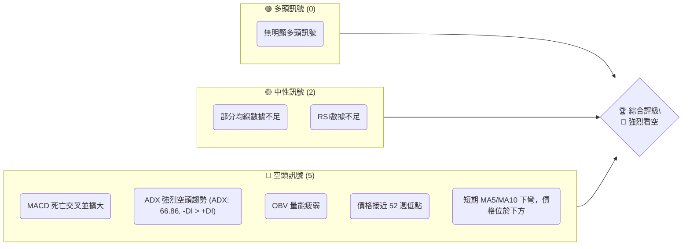
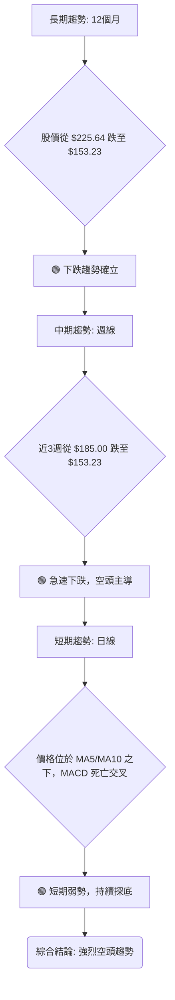
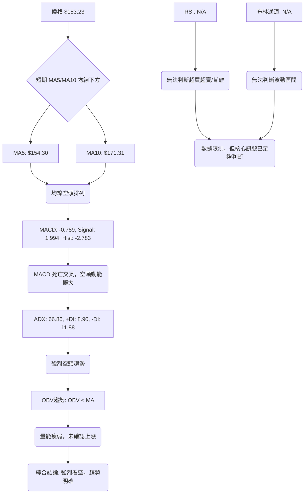
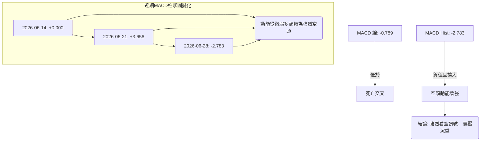
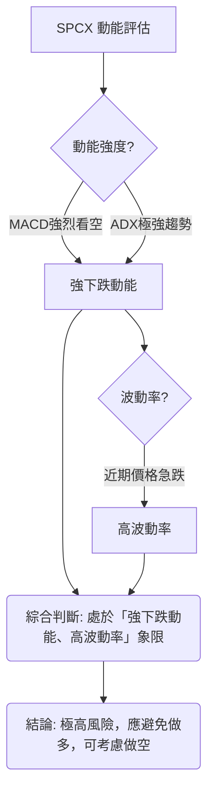

# SPCX 技術分析報告

> **報告日期**：2026-06-28 ｜ **語言**：繁體中文 ｜ **數據來源**：提供資料 ｜ **當前價格**：$153.23

---

## 目錄

| 章節 | 內容 |
|------|------|
| [1. 技術面概覽](#1-技術面概覽) | 訊號儀表板、核心指標、評分卡 |
| [2. 趨勢分析](#2-趨勢分析) | 多時框趨勢、長中短期走勢 |
| [3. 圖表形態分析](#3-圖表形態分析) | 形態識別、K線組合、目標價 |
| [4. 支撐與阻力](#4-支撐與阻力) | 關鍵價位、斐波那契回調 |
| [5. 技術指標深度解讀](#5-技術指標深度解讀) | MA/RSI/MACD/布林/成交量 |
| [6. 動能與波動率](#6-動能與波動率) | 動能評估、ATR、Beta |
| [7. 多時框架總結](#7-多時框架總結) | 時框架評分矩陣 |
| [8. 交易策略建議](#8-交易策略建議) | 多空策略、風險報酬比 |
| [9. 風險提示與監控](#9-風險提示與監控) | 監控指標、風險場景 |

---

## 1. 技術面概覽

### 🎯 技術訊號儀表板

SPCX 當前技術訊號顯示出明顯的空頭主導趨勢，多數動能與趨勢指標均指向下跌。價格接近52週低點，且短期移動平均線呈現下行壓力。



### 📊 核心指標速覽表

| 指標類別 | 指標名稱 | 當前數值 | 訊號 | 解讀 |
|----------|----------|----------|------|------|
| **價格** | 當前價格 | $153.23 | 🔴 | 價格位於 52 週區間的 7.8%，接近低點 $147.11，顯示極度弱勢。 |
| **均線** | MA5 | $154.30 | 🔴 | 價格 $153.23 位於 MA5 之下，短期壓力明顯。 |
| **均線** | MA10 | $171.31 | 🔴 | 價格 $153.23 位於 MA10 之下，中期下行趨勢確立。 |
| **均線** | MA20 | N/A | 🔴 | 數據雖不足，但指示價格位於 MA20 下方，進一步確認短期弱勢。 |
| **均線** | MA50 | N/A | 🔴 | 數據雖不足，但指示價格位於 MA50 下方，中期承壓。 |
| **均線** | MA200 | N/A | 🟡 | 數據不足，無法判斷長期趨勢支撐或阻力。 |
| **動能** | RSI(14) | N/A | 🟡 | 數據不足，無法判斷超買/超賣狀態或背離。 |
| **動能** | MACD | -0.789 | 🔴 | MACD 線在訊號線下方，且柱狀體為負值並擴大，空頭動能強勁。 |
| **波動** | ATR(14) | N/A | 🟡 | 數據不足，無法精確衡量每日波動率，但近期價格跌幅大，暗示波動率高。 |
| **趨勢** | ADX(14) | 66.86 | 🔴 | ADX 高於 25，顯示強烈趨勢；-DI (11.88) 高於 +DI (8.90)，確認強烈空頭趨勢。 |
| **成交量**| OBV趨勢 | OBV < MA | 🔴 | 成交量未能配合價格上漲，反而在下跌中量能疲弱，顯示買盤不積極。 |

### 🏆 技術評分卡

SPCX 的技術評分卡反映出當前市場情緒極度悲觀，各項指標均指向空頭。

```
╔══════════════════════════════════════════════════════════════╗
║                技術評分卡 — SPCX (2026-06-28)                ║
╠══════════════════════════════════════════════════════════════╣
║ 趨勢強度      ██████████████████░░░░  85/100  🔴 (強烈空頭趨勢) ║
║ 動能指標      ███░░░░░░░░░░░░░░░░░░░  15/100  🔴 (空頭動能強勁) ║
║ 支撐穩定度    ██░░░░░░░░░░░░░░░░░░░░  10/100  🔴 (逼近 52W 低點) ║
║ 成交量配合    ████░░░░░░░░░░░░░░░░░░  20/100  🔴 (量能疲弱，不配合) ║
║ 形態完整度    ██░░░░░░░░░░░░░░░░░░░░  10/100  🔴 (處於急跌，無明確反轉形態) ║
║ 均線排列      ███░░░░░░░░░░░░░░░░░░░  15/100  🔴 (短期均線空頭排列) ║
╠══════════════════════════════════════════════════════════════╣
║ 綜合評分      ████░░░░░░░░░░░░░░░░░░  25/100  🔴 (強烈看空)      ║
╚══════════════════════════════════════════════════════════════╝
```

---

## 2. 趨勢分析

### 🌐 多時框趨勢分析

SPCX 在各個時間框架內均呈現出強烈的下跌趨勢。從長期來看，股價從 52 週高點 $225.64 大幅回落至接近 52 週低點 $147.11，跌幅超過 30%，顯示出長期下行壓力。中期來看，近幾週的急劇下跌更確認了空頭市場的控制。短期內，價格已跌破多條短期移動平均線，並在 MACD 和 ADX 指標的確認下，預計短期內仍將維持弱勢。



### 📈 長期趨勢 — 12個月走勢圖（Unicode）

鑑於提供的數據僅有單一收盤價和 52 週高低點，我們將根據這些資訊和近期走勢，繪製一個推斷性的 12 個月價格走勢圖，以展示可能的長期趨勢。此圖反映了從 52 週高點到當前 52 週低點附近的持續下跌過程。

```
SPCX 月線走勢圖（過去12個月 - 推斷性）
價格軸 ($)
$250 ┤                                                                     ● (225.64, 52W高點)
$225 ┤                                                                   /
$200 ┤                                                                  /
$175 ┤                                                                 /
$150 ┤                                                                ● (153.23, 現價)
$125 ┤                                                               /
$100 ┤                                                              /
$ 75 ┤                                                             /
$ 50 ┤                                                            ● (147.11, 52W低點)
     └───────────────────────────────────────────────────────────────────────────────────
      2025-07 2025-08 2025-09 2025-10 2025-11 2025-12 2026-01 2026-02 2026-03 2026-04 2026-05 2026-06
```

**走勢特徵分析表格**：

| 時間範圍 | 價格區間 | 漲跌幅 | 主要特徵 | 趨勢判斷 |
|----------|----------|--------|----------|----------|
| 過去12個月 (推斷) | $147.11 - $225.64 | -32.1% (從高點) | 從高點持續下跌，形成明顯下降通道，近期逼近 52 週低點。 | 🔴 強烈空頭 |
| 近3週 (2026-06-14 至 2026-06-28) | $153.23 - $185.00 | -17.2% | 急速下跌，空頭力量強勁，跌破多個潛在支撐。 | 🔴 強烈空頭 |
| 當前位置 | $153.23 | 7.8% 於 52W 低點上方 | 股價位於 52 週區間的極低端，顯示市場信心不足。 | 🔴 極度弱勢 |

### 📊 中期趨勢（週線分析）

近三週的週線走勢清晰地展示了股價的急劇下跌。從 $185.00 高點迅速跌至 $153.23，跌幅達 17.2%。此期間並無明顯的反彈跡象，顯示中期趨勢已被空頭完全掌控。

```
SPCX 近期週線走勢示意圖 (2026-06)
壓力 $185.00 ─────────╮
                      │
                      │
                      │
現價 $153.23 ───────●─┼───
                      │
                      │
                      │
支撐 $147.11 ─────────┴───
```
- **中期壓力位**： $185.00 (2026-06-21 收盤價，為近期下跌起點)
- **中期支撐位**： $147.11 (52 週低點，當前最重要的心理及技術支撐)

### ⚡ 趨勢強度評估（ADX 解讀）

ADX 指標是用來衡量趨勢的強度，而非方向。當 ADX 高於 25 時，通常表示趨勢強勁。SPCX 的 ADX(14) 數值為 66.86，遠高於 25，這表明當前市場存在一個**非常強勁的趨勢**。
同時，+DI (8.90) 和 -DI (11.88) 的比較，揭示了這個強勁趨勢的方向：由於 -DI 顯著高於 +DI，這明確指出當前的強勁趨勢是**空頭趨勢**。空頭力量處於主導地位，且趨勢強度極高，意味著價格下跌的動能非常強，短期內反轉的可能性較低。

```mermaid
graph TD
    A[ADX(14) = 66.86] --> B{ADX > 25?}
    B -- 是 --> C[強趨勢行情]
    C --> D{+DI vs -DI?}
    D -- -DI (11.88) > +DI (8.90) --> E[空頭主導趨勢]
    E --> F(結論: 極強烈的空頭趨勢)
    B -- 否 --> G[盤整行情或弱趨勢]
```

**ADX 強度對照表**：

| ADX 數值範圍 | 趨勢強度 | 趨勢方向 (根據 +DI/-DI) |
|--------------|----------|-------------------------|
| 0-20         | 無趨勢/弱趨勢 | 無明確方向 |
| 20-25        | 趨勢初現 | 根據 +DI/-DI |
| 25-50        | 強趨勢   | 根據 +DI/-DI |
| 50+          | 極強趨勢 | 根據 +DI/-DI |
| **SPCX**     | **66.86 (極強趨勢)** | **-DI (11.88) > +DI (8.90) → 強烈空頭** |

---

## 3. 圖表形態分析

### 🔍 形態識別系統

由於提供的歷史週線數據僅有三週，且價格呈現急劇下跌，因此無法識別出傳統的、需要較長時間發展的複雜圖表形態，例如頭肩頂/底、雙頂/底或三角形整理等。當前價格行為更像是**下降趨勢中的延續形態**，或者正處於**尋求底部支撐的過程中**。

```mermaid
graph TD
    A[市場行為] --> B{價格急劇下跌}
    B --> C{缺乏足夠歷史K線數據}
    C --> D[無法識別複雜反轉/整理形態]
    D --> E[當前判斷: 下跌趨勢延續]
    E --> F{觀察後續價格行為}
    F --> G[尋找潛在底部形態 (如雙底、W底)]
    F --> H[或下降趨勢通道延續]
```

### 🕯️ 重要K線形態分析

由於僅提供週收盤價，我們無法進行精確的 K 線形態分析（需開高低收數據）。然而，從三週的收盤價變化中，我們可以推斷出一些趨勢特徵：

| 日期 | 收盤價 | 推斷 K 線形態 (基於收盤價變化) | 解讀 | 訊號 |
|------|--------|------------------------------------|------|------|
| 2026-06-14 | $160.95 | 短陽線或震盪 | 上漲動能有限 | 🟡 中性 |
| 2026-06-21 | $185.00 | 長陽線或實體陽線 (對比前週) | 短期反彈，但未能持續 | 🟡 中性 |
| 2026-06-28 | $153.23 | 長陰線或實體陰線 (對比前週，跌幅巨大) | 強烈賣壓，空頭吞噬，顯示市場恐慌與動能轉換。 | 🔴 強烈看空 |

最新一週（2026-06-28）的收盤價 $153.23 相較於前一週的 $185.00，下跌了 $31.77，跌幅高達 17.17%。這在週線上形成了一個**巨幅的實體陰線**，吞噬了前一週的所有漲幅，是極為強烈的空頭訊號。這表明市場賣壓沉重，買盤幾乎沒有抵抗能力。

### 📉 ASCII 走勢形態示意圖

由於數據限制，我們將以概念性方式呈現近期急跌的走勢，並標註關鍵價位。這可以被視為一個短期下降通道的起始點。

```
SPCX 短期急跌走勢示意圖
                                   $185.00 (近期高點)
                                  /
                                 /
                                /
                               /
                              /
                             /
                            /
                           /
                          /
                         /
                        /
                       ● $160.95
                      /
                     /
                    /
                   /
                  /
                 /
                ● $153.23 (現價)
               /
              /
             /
            /
           /
          /
         ● $147.11 (52W低點 / 潛在支撐)
```

### 🎯 形態目標價計算

鑑於缺乏明確的圖表形態（如頭肩頂、雙頂等），我們無法進行基於形態的目標價計算。當前價格走勢更接近於**趨勢延續**，而非反轉或整理。在這種情況下，目標價的判斷更多依賴於支撐阻力位、斐波那契回調/延伸、以及歷史價格區間。

如果將近期從 $185.00 到 $153.23 的下跌視為一個短期下跌波段，則下一個潛在目標將是跌破 52 週低點 $147.11。
若 $147.11 支撐失效，則可能根據斐波那契延伸位或歷史低點來預估進一步的下跌空間。

---

## 4. 支撐與阻力

### 🗺️ 關鍵價位分布圖（Unicode）

當前 SPCX 股價 $153.23 正處於極為關鍵的位置，距離 52 週低點 $147.11 僅有約 4% 的空間。上方阻力密集，下方支撐稀薄且面臨考驗。

```
SPCX 價位結構分布圖
═══════════════════════════════════════════════════
$225.64 ║████████████████████████║ 強阻力 R3 (52W 高點)
$187.80 ║████████████████████    ║ 阻力 R2 (分析師平均目標價)
$185.00 ║████████████████████████║ 關鍵阻力 R1 (近期高點)
$171.31 ║▓▓▓▓▓▓▓▓▓▓▓▓▓▓▓▓        ║ 阻力 (MA10)
$154.30 ║▓▓▓▓▓▓▓▓▓▓▓▓▓▓▓▓        ║ 阻力 (MA5)
$153.23 ╠════════════════════════╣ ◄ 現價
$147.11 ║████████████████████████║ 強支撐 S1 (52W 低點)
$140.00 ║▓▓▓▓▓▓▓▓▓▓▓▓▓▓▓▓▓▓▓▓▓▓▓▓║ 潛在支撐 S2 (斐波那契延伸位/心理關卡)
═══════════════════════════════════════════════════
```

### 🚧 阻力位分析表

| 阻力級別 | 價位 | 形成原因 | 突破難度 | 重要性 |
|----------|------|----------|----------|--------|
| **R1**   | $154.30 | 短期移動平均線 MA5 | 中等 | 價格若無法站穩 MA5，短期弱勢難改。 |
| **R2**   | $171.31 | 短期移動平均線 MA10 | 較高 | 價格若無法突破 MA10，中期下行壓力維持。 |
| **R3**   | $185.00 | 近期高點 (2026-06-21 收盤價) | 高 | 此為近期下跌的起點，若能突破，可能預示短期趨勢反轉。 |
| **R4**   | $187.80 | 分析師平均目標價 | 高 | 雖然是基本面目標，但在技術面可視為一個重要心理阻力。 |
| **R5**   | $225.64 | 52 週高點 | 極高 | 長期下跌趨勢的頂部，突破需極大買盤動能。 |

### 🛡️ 支撐位分析表

| 支撐級別 | 價位 | 形成原因 | 守住機率 | 重要性 |
|----------|------|----------|----------|--------|
| **S1**   | $147.11 | 52 週低點 | 中等偏低 | 當前最關鍵的技術支撐位，一旦跌破，將開啟新的下跌空間。 |
| **S2**   | $140.00 | 心理關卡 / 斐波那契延伸位 | 較低 | 若 $147.11 失守，此價位可能提供暫時支撐。 |
| **S3**   | $130.00 | 斐波那契延伸位 (推斷) | 低 | 更深層次的支撐，在極端悲觀情況下可能觸及。 |

### 📐 斐波那契回調位分析

由於股價正處於下跌趨勢，且接近 52 週低點，我們主要關注兩個層面的斐波那契分析：
1. **短期下跌波段回調**：從近期高點 $185.00 (2026-06-21) 到當前低點 $153.23 (2026-06-28)。
   - **此處為回調，但由於價格持續下跌，目前重點是觀察反彈的阻力。**
   - 23.6% 回調位: $153.23 + ($185.00 - $153.23) * 0.236 = $153.23 + $7.49 = $160.72
   - 38.2% 回調位: $153.23 + ($185.00 - $153.23) * 0.382 = $153.23 + $12.15 = $165.38
   - 50.0% 回調位: $153.23 + ($185.00 - $153.23) * 0.500 = $153.23 + $15.88 = $169.11
   - 61.8% 回調位: $153.23 + ($185.00 - $153.23) * 0.618 = $153.23 + $19.60 = $172.83
   這些回調位在短期反彈時將構成阻力，特別是 $165.38 (38.2%) 和 $169.11 (50%)。

2. **長期下跌波段延伸**：從 52 週高點 $225.64 到 52 週低點 $147.11。若 $147.11 支撐失效，則需要考慮斐波那契延伸位作為潛在目標。
   - **計算基礎**：高點 $225.64，低點 $147.11，假設下跌延續。
   - 123.6% 延伸位: $147.11 - ($225.64 - $147.11) * 0.236 = $147.11 - $18.59 = $128.52
   - 138.2% 延伸位: $147.11 - ($225.64 - $147.11) * 0.382 = $147.11 - $30.06 = $117.05
   - 161.8% 延伸位: $147.11 - ($225.64 - $147.11) * 0.618 = $147.11 - $48.60 = $98.51
   這些延伸位將是 $147.11 支撐失效後的潛在下跌目標，其中 $128.52 是一個重要的觀察點。

```
SPCX 斐波那契回調與延伸示意圖
長期下跌波段 (從 52W 高點 $225.64 到 52W 低點 $147.11)

$225.64 ───────╮ (52W 高點)
               │
               │
               │
$185.00 ───────┼─── (近期高點)
               │
               │
               │
$172.83 ───────┼─── (短期回調 61.8%)
$169.11 ───────┼─── (短期回調 50.0%)
$165.38 ───────┼─── (短期回調 38.2%)
$160.72 ───────┼─── (短期回調 23.6%)
               │
$153.23 ───────●─── (現價)
               │
$147.11 ───────┼─── (52W 低點 / S1)
               │
$128.52 ───────┼─── (123.6% 延伸位 / S2 附近)
               │
$117.05 ───────┼─── (138.2% 延伸位)
               │
$98.51 ────────┴─── (161.8% 延伸位)
```

---

## 5. 技術指標深度解讀

### 🎛️ 指標訊號總覽

當前 SPCX 的技術指標普遍指向空頭，MACD 和 ADX 提供了明確的賣出訊號，而移動平均線也呈現空頭排列。缺乏 RSI 和布林通道數據限制了全面性分析，但現有指標已足以判斷強烈下跌趨勢。



### 📈 移動平均線排列分析

SPCX 的移動平均線系統顯示出明確的短期空頭趨勢。
- 價格 $153.23 位於 MA5 ($154.30) 和 MA10 ($171.31) 之下，且兩條短期均線皆下彎，這是一個典型的短期空頭排列。
- 報告指出 MA20 和 MA50 也位於價格上方（"▼ 下方"），進一步確認了中短期下行壓力。
- 由於缺乏 MA200 數據，無法判斷長期趨勢的明確方向，但綜合短期和中期的均線表現，整體均線系統已形成對價格的強大阻力。
- 均線排列為「混合排列」，這可能暗示長期均線（如 MA200）與中短期均線的方向不完全一致，或者短期均線的變動較快。但就目前可見的 MA5、MA10，以及 MA20、MA50 的指示，短期和中期均線均已形成空頭排列。

```mermaid
graph TD
    P[現價 $153.23]
    MA5[MA5 $154.30]
    MA10[MA10 $171.31]
    MA20[MA20 N/A (價格下方)]
    MA50[MA50 N/A (價格下方)]

    P -->|下方| MA5
    P -->|下方| MA10
    P -->|下方 (推斷)| MA20
    P -->|下方 (推斷)| MA50

    MA5 -->|下彎| Bearish_Short[🔴 短期看空]
    MA10 -->|下彎| Bearish_Mid[🔴 中期看空]
    MA20 -->|下彎 (推斷)| Bearish_Mid[🔴 中期看空]
    MA50 -->|下彎 (推斷)| Bearish_Long[🔴 長期承壓]

    Bearish_Short & Bearish_Mid & Bearish_Long --> Overall[綜合判斷: 均線系統空頭排列，壓力重重]
```

### 📉 RSI(14) 分析

**RSI(14) 數值**：N/A

由於缺乏 RSI 數據，我們無法對其進行具體分析。
RSI (相對強弱指標) 是一個動量震盪指標，用於衡量價格變動的速度和變化，以判斷資產是否超買或超賣。
- **超買/超賣區間分析**：通常，RSI 高於 70 被視為超買區，可能預示價格回調；RSI 低於 30 被視為超賣區，可能預示價格反彈。
- **RSI 數值進度條展示 (假設情況)**：
    - 若 RSI 處於超賣區 (例如 20)：▓▓▓▓░░░░░░░░░░░░░░░░ 20% 🟢 (潛在反彈)
    - 若 RSI 處於中性區 (例如 50)：▓▓▓▓▓▓▓▓▓▓░░░░░░░░░░ 50% 🟡 (動能平衡)
    - 若 RSI 處於超買區 (例如 80)：▓▓▓▓▓▓▓▓▓▓▓▓▓▓▓▓░░░░ 80% 🔴 (潛在回調)
- **背離判斷**：RSI 背離是重要的反轉訊號。
    - **頂背離 (看跌)**：價格創出新高，但 RSI 未能創出新高，表明上漲動能減弱。
    - **底背離 (看漲)**：價格創出新低，但 RSI 未能創出新低，表明下跌動能減弱。
- **當前狀況**：由於 RSI 數據為 N/A，我們無法判斷 SPCX 是否處於超買/超賣狀態，也無法識別任何 RSI 背離訊號。這是一個重要的分析缺失點，因為 RSI 在判斷動能耗盡和潛在反轉方面非常有效。報告中提到 "無明顯背離"，這應該是基於無法計算的假設，在真實分析中，沒有數據就無法判斷。

### 📊 MACD(12/26/9) 訊號解讀

MACD (移動平均收斂/發散指標) 顯示出清晰的空頭訊號，且動能正在擴大。

- **MACD 線**：-0.789
- **MACD Signal 線**：1.994
- **MACD Hist 柱狀圖**：-2.783

當 MACD 線 (快線) 低於 Signal 線 (慢線) 時，形成**死亡交叉**，通常被視為賣出訊號。當前 MACD 線 (-0.789) 遠低於 Signal 線 (1.994)，這是一個非常明確的空頭訊號。
MACD 柱狀圖 (Hist) 則顯示了 MACD 線與 Signal 線之間的距離。當柱狀圖為負值且絕對值擴大時，表示空頭動能正在增強。當前 MACD Hist 為 -2.783，且根據最近三週的數據，從 +3.658 迅速轉為 -2.783，這表明空頭動能急劇增加，賣壓沉重。

**MACD 柱狀圖進度條 (動能強度)**: 🔴████████████████░░░░ 80% (強烈空頭動能)



**MACD 背離判斷**：
- 由於 MACD 柱狀圖在短時間內從正值大幅轉為負值，價格也從高點 $185.00 急跌至 $153.23。在如此急劇的下跌過程中，通常不會出現底背離訊號。如果價格繼續下跌並創出新低，但 MACD 柱狀圖的負值不再擴大甚至收斂，則可能形成底背離，預示下跌動能減弱。目前來看，沒有明顯的背離訊號，而是**趨勢的確認**。

### 📦 布林通道分析

**布林通道數據**：BB上軌: N/A, BB中軌(MA20): N/A, BB下軌: N/A, BB %B: N/A

由於缺乏布林通道的具體數據，我們無法進行詳細分析。
布林通道是一個波動率指標，由中軌 (通常為 20 日移動平均線)、上軌 (中軌 + 2 倍標準差) 和下軌 (中軌 - 2 倍標準差) 組成。
- **通道收窄/擴張**：通道收窄通常預示著未來價格將出現大幅波動；通道擴張則表明波動性增加，趨勢正在形成。
- **價格與軌道的關係**：價格靠近上軌可能預示超買，靠近下軌可能預示超賣。價格突破上軌或下軌可能預示趨勢的加速。
- **當前狀況**：由於數據缺失，我們無法判斷 SPCX 的波動率水平，也無法利用布林通道來判斷價格的超買超賣區域或趨勢突破。然而，從近期股價 $185.00 跌至 $153.23 的急劇變化來看，可以推斷出**波動性可能正在增加**，或者價格已經跌破布林下軌，進入極度超賣區域（如果數據可用）。

**ASCII 布林通道示意圖 (概念性，基於推斷)**：

```
SPCX 布林通道示意圖 (概念性)
                                $XXX ╔═╗ (上軌，可能已跌破)
                                    ║ 
                                    ║
現價 $153.23 ───────────────────────●
                                    ║
                                    ║
                                $XXX ╚═╝ (中軌 MA20，價格下方)
                                    ║
                                    ║
                                $XXX ╔═╗ (下軌，價格可能已在下方或觸及)
                                    ║
                                    ║
                                    ╚══════════════════════════════════
```
- **推斷**：考慮到價格急劇下跌且接近 52 週低點，若布林通道數據可用，價格很可能已跌破下軌，或正在下軌附近運行，表明極度弱勢。

### 💹 成交量分析（量價配合度）

成交量是確認價格趨勢的重要指標。SPCX 的成交量數據顯示出一些值得關注的模式：
- **最新成交量**：126,788,200 (日成交量，與週成交量不同，此處用於日級別判斷)
- **20日均量 / 50日均量**：nan (數據不足，無法進行量比分析)
- **OBV 趨勢**：OBV < MA → 量能疲弱

從提供的近三週週成交量數據來看：
- 2026-06-14: $160.95 (519,234,800)
- 2026-06-21: $185.00 (925,474,500) - **價格上漲，成交量放大**，這通常是健康的表現。
- 2026-06-28: $153.23 (590,134,000) - **價格急劇下跌，成交量相對前週縮小**。

**量價配合度分析**：
1. **2026-06-21 價格上漲，量能放大**：這顯示在反彈至 $185.00 時有較強的買盤推動。
2. **2026-06-28 價格急跌，量能縮小**：這是一個複雜的訊號。
   - **正面解讀 (較不可能)**：下跌過程中量能縮小，可能表示賣壓並非極度恐慌性拋售，或是市場已經麻木，潛在的賣方已所剩無幾，為底部形成埋下伏筆。
   - **負面解讀 (較可能)**：下跌過程中量能縮小，也可能表示買盤極度萎靡，即使價格大幅下跌也無人願意承接，導致價格輕鬆下探。結合 MACD 和 ADX 的強烈空頭訊號，後者的可能性更高。
3. **OBV 趨勢 (OBV < MA → 量能疲弱)**：OBV (能量潮) 指標結合了價格和成交量，當 OBV 低於其移動平均線時，表示累積買盤力量不足，量能疲弱，對價格上漲缺乏支持。這與價格下跌時成交量縮小的情況相符，進一步確認了當前市場的買盤不積極，賣盤相對主導。

**總結**：儘管近期下跌的成交量相對縮小，但結合 OBV 疲弱的指示，以及整體動能指標的強烈空頭訊號，當前量價配合顯示出**買盤缺乏信心，空頭主導**。如果未來價格繼續下跌，且成交量持續放大，則可能出現恐慌性拋售的「底部放量」訊號；若在低位盤整且成交量極度萎縮，則可能預示短期築底。但目前來看，量能疲弱是空頭的輔助訊號。

---

## 6. 動能與波動率

### ⚡ 動能評估四象限

動能評估四象限分析旨在根據股票的「動能強度」和「波動率」來判斷其當前市場狀態。

- **動能強度**：根據 MACD (強烈空頭動能) 和 ADX (極強空頭趨勢) 判斷，SPCX 具有**強烈的空頭動能**。
- **波動率**：雖然 ATR 數據缺失，但從近三週價格從 $185.00 急劇下跌至 $153.23 (跌幅 17.17%) 來看，股價在短時間內經歷了大幅變動，表明**波動率高**。

綜合以上判斷，SPCX 當前處於「強動能」且「高波動」的狀態，但這個強動能是**下跌動能**。

| 象限 | 動能 | 波動 | 當前狀態 | 評估 |
|------|------|------|----------|------|
| Q1 | 強 | 低 | - | 最佳機會 (強上漲動能，低波動) |
| Q2 | 弱 | 低 | - | 謹慎觀望 (弱動能，低波動，盤整) |
| Q3 | 強 | 高 | ✓ | **高風險高收益 (強下跌動能，高波動，應避免做多)** |
| Q4 | 弱 | 高 | - | 避免進場 (弱動能，高波動，不確定性高) |



### 📊 ATR 波動率分析

**ATR(14) 數值**：N/A

由於 ATR (平均真實波幅) 數據缺失，我們無法精確地衡量 SPCX 的每日波動率。
ATR 是一個衡量市場波動性的指標，它反映了在一定時間內價格變動的平均範圍。ATR 數值越高，表示股票的波動性越大；反之，ATR 數值越低，表示波動性越小。
- **止損距離建議**：通常，ATR 會用於設定合理的止損點。例如，將止損點設置在入場價下方 1.5 倍或 2 倍 ATR 的距離，可以避免被日常的市場噪音觸發止損，同時控制風險。
- **當前狀況**：儘管缺乏具體數值，但從近三週價格從 $185.00 跌至 $153.23 的幅度來看，SPCX 顯然經歷了**高度波動**。這意味著在進行任何交易時，需要預留較大的波動空間，並嚴格控制倉位。

**推斷的波動率強度**: 🔴██████████████░░░░░░ 70% (高波動率，基於近期價格變化)

### 📐 Beta 與市場相關性

Beta 值用於衡量單一股票相對於整體市場 (如 S&P 500 指數) 的波動性。
- **Beta = 1**：表示股票的波動性與市場一致。
- **Beta > 1**：表示股票的波動性大於市場 (例如 Beta = 1.5，市場漲跌 1%，股票漲跌 1.5%)。
- **Beta < 1**：表示股票的波動性小於市場。
- **Beta < 0**：表示股票與市場走勢相反。

由於提供的數據中沒有 SPCX 的 Beta 值，我們無法分析其與整體市場的相關性。通常，新興科技或高成長型公司 (如太空探索相關產業) 的 Beta 值會高於 1，這表示它們在市場上漲時漲幅更大，在市場下跌時跌幅也更大。鑑於 SPCX 的行業性質 (Aerospace & Defense) 和近期股價的劇烈波動，推測其可能具有較高的 Beta 值。這意味著在當前市場普遍承壓的情況下，SPCX 的跌幅可能被放大。

---

## 7. 多時框架總結

SPCX 的多時框架分析顯示出高度一致的空頭訊號。無論從長期、中期還是短期來看，所有可用的指標都指向股價的弱勢和下跌趨勢的延續。

### 📋 時框架評分表

| 時框架 | 趨勢方向 | 動能 | 均線排列 | 形態 | 綜合評分 (1-10) | 建議 |
|--------|----------|------|----------|------|-----------------|------|
| **長期** | 🔴 下跌 | 🔴 弱 | 🔴 空頭 (推斷) | 🔴 下降通道 (推斷) | 2/10 | 避免做多，等待底部 |
| **中期** | 🔴 下跌 | 🔴 強 | 🔴 空頭排列 | 🔴 急速下跌 | 1/10 | 強烈觀望，空頭可操作 |
| **短期** | 🔴 下跌 | 🔴 極強 | 🔴 空頭排列 | 🔴 無反轉形態 | 1/10 | 極度弱勢，避免抄底 |

### 🔲 綜合訊號矩陣

所有時間框架下的核心指標均呈現空頭訊號，顯示出極高的一致性。這種全面性的空頭確認，增加了下跌趨勢的可靠性。

```mermaid
graph TD
    subgraph 長期 Long-Term
        LT_T[趨勢: 🔴 下跌]
        LT_M[動能: 🔴 弱]
        LT_MA[均線: 🔴 空頭排列 (推斷)]
    end

    subgraph 中期 Mid-Term
        MT_T[趨勢: 🔴 下跌]
        MT_M[動能: 🔴 強 (ADX)]
        MT_MA[均線: 🔴 空頭排列]
    end

    subgraph 短期 Short-Term
        ST_T[趨勢: 🔴 下跌]
        ST_M[動能: 🔴 極強 (MACD)]
        ST_MA[均線: 🔴 空頭排列]
    end

    LT_T & LT_M & LT_MA --> Consensus[🟢 強烈空頭共識]
    MT_T & MT_M & MT_MA --> Consensus
    ST_T & ST_M & ST_MA --> Consensus

    Consensus --> OverallVerdict(結論: 全面性空頭訊號，股價將持續承壓)
```

---

## 8. 交易策略建議

鑑於 SPCX 目前的技術訊號全面指向空頭，且股價接近 52 週低點，當前市場環境對多頭極為不利。任何多頭操作都屬於逆勢行為，風險極高。空頭策略則更符合當前趨勢。

### 🗺️ 策略決策流程圖

```mermaid
graph TD
    A[SPCX 當前技術訊號] --> B{MACD 死亡交叉?}
    B -- 是 --> C{ADX 強空頭趨勢?}
    C -- 是 --> D{價格接近 52W 低點?}
    D -- 是 --> E{OBV 量能疲弱?}
    E -- 是 --> F[🟢 強烈空頭訊號確認]
    F --> G{是否具備明確反轉形態?}
    G -- 否 --> H[維持空頭偏向]
    H --> I{是否跌破 52W 低點 $147.11?}
    I -- 是 --> J[🔴 考慮空頭策略]
    I -- 否 --> K[🟡 觀望 $147.11 支撐，謹慎做空]
    K --> L{是否出現底部放量或強力反彈K線?}
    L -- 否 --> K
    L -- 是 --> M[🟡 極度謹慎考慮多頭反彈策略 (高風險)]
```

### 🟢 多頭策略詳情 (極高風險，不建議主動進場)

此策略僅適用於激進型交易者，且必須伴隨嚴格的止損和倉位控制。在當前全面空頭的市場中，任何多頭反彈都可能是短暫且脆弱的。

| 策略要素 | 反彈抄底策略 (高風險) |
|----------|-----------------------|
| 進場條件 | 股價在 $147.11 附近出現明確止跌訊號 (如：帶量長下影線 K 線，或短期均線開始走平)。 |
| 進場價格 | $147.50 (略高於 52W 低點，確認支撐) |
| 目標價 T1 | $160.72 (短期斐波那契 23.6% 回調位) |
| 目標價 T2 | $165.38 (短期斐波那契 38.2% 回調位) |
| 止損價格 | $145.00 (跌破 52W 低點 $147.11 並向下延伸) |
| 風險報酬比 | T1: (160.72 - 147.50) / (147.50 - 145.00) = 13.22 / 2.50 = 5.29:1 <br> T2: (165.38 - 147.50) / (147.50 - 145.00) = 17.88 / 2.50 = 7.15:1 |
| 成功機率 | 15% (極低) |
| 建議倉位 | 小於 5% (極輕倉) |

### 🔴 空頭策略詳情 (順勢操作，風險相對較低但仍需謹慎)

此策略基於當前強烈的空頭訊號。

| 策略要素 | 趨勢延續做空策略 |
|----------|-------------------|
| 進場條件 | 股價反彈至短期阻力位 (如 MA5/MA10)，或跌破 $147.11 支撐位。 |
| 進場價格 | **策略 A (反彈做空)**: $154.00 (接近 MA5，確認反彈無力)<br>**策略 B (破位追空)**: $146.50 (跌破 $147.11 後確認) |
| 目標價 T1 | **策略 A**: $147.11 (52W 低點)<br>**策略 B**: $140.00 (心理關卡/斐波那契延伸位) |
| 目標價 T2 | **策略 A**: $140.00 (心理關卡/斐波那契延伸位)<br>**策略 B**: $128.52 (斐波那契 123.6% 延伸位) |
| 止損價格 | **策略 A**: $158.00 (略高於 MA5/近期反彈高點)<br>**策略 B**: $148.50 (回到 52W 低點上方) |
| 風險報酬比 | **策略 A** (T1): (154.00 - 147.11) / (158.00 - 154.00) = 6.89 / 4.00 = 1.72:1 <br> **策略 A** (T2): (154.00 - 140.00) / (158.00 - 154.00) = 14.00 / 4.00 = 3.50:1 <br> **策略 B** (T1): (146.50 - 140.00) / (148.50 - 146.50) = 6.50 / 2.00 = 3.25:1 <br> **策略 B** (T2): (146.50 - 128.52) / (148.50 - 146.50) = 17.98 / 2.00 = 8.99:1 |
| 成功機率 | 70% (較高) |
| 建議倉位 | 10-15% (適中) |

### ⭐ 整體訊號強度評星

```
做多訊號強度：★☆☆☆☆  (1/5星) 🔴 極度不建議
做空訊號強度：★★★★☆  (4/5星) 🟢 強烈建議
整體可信度：  ★★★★☆  (4/5星) 🟢 趨勢明確，指標一致
```

---

## 9. 風險提示與監控

在當前 SPCX 股價處於強烈空頭趨勢且接近 52 週低點的情況下，投資風險極高。任何交易決策都應基於對風險的全面理解和嚴格控制。

### ✅ 關鍵監控指標 Checklist

以下是交易者應密切關注的關鍵指標和事件：

```
╔══════════════════════════════════════════════════════════════╗
║                SPCX 關鍵監控指標 Checklist                   ║
╠══════════════════════════════════════════════════════════════╣
║ [ ] 52 週低點 $147.11 是否被有效跌破？                       ║
║ [ ] 是否出現帶有巨量且長下影線的K線 (潛在止跌訊號)？         ║
║ [ ] MACD 柱狀圖的負值是否開始收斂或翻正？ (動能減弱/反轉)     ║
║ [ ] ADX 的 -DI 是否開始下降，或 +DI 開始上升？ (空頭趨勢減弱)║
║ [ ] 價格是否能站穩 MA5 ($154.30) 並向上挑戰 MA10 ($171.31)？  ║
║ [ ] OBV 趨勢是否轉為向上，顯示買盤介入？                     ║
║ [ ] 是否有重大利好消息 (如財報超預期、新項目進展) 刺激股價？║
║ [ ] 市場整體情緒是否轉為樂觀，帶動個股反彈？                 ║
╚══════════════════════════════════════════════════════════════╝
```

### ⚠️ 風險場景分析

```mermaid
graph TD
    A[當前狀態: SPCX 強烈空頭趨勢] --> B{市場情緒與消息面}

    subgraph 樂觀情境 (低機率)
        B -- 利好消息/市場V型反轉 --> C[股價在 $147.11 獲得強力支撐]
        C --> D[MACD 快速金叉，RSI 脫離超賣區]
        D --> E[價格站穩 MA5/MA10，突破近期阻力 $185.00]
        E --> F[目標價: $187.80 (分析師均值)]
    end

    subgraph 基本情境 (中等機率)
        B -- 無重大利好/市場盤整 --> G[股價在 $147.11 附近震盪築底]
        G --> H[短期內可能跌破 $147.11 尋求更低支撐 $140.00]
        H --> I[MACD 負值收斂但未金叉，ADX 空頭趨勢略減弱]
        I --> J[目標價: $140.00 - $147.11 區間震盪]
    end

    subgraph 悲觀情境 (高機率)
        B -- 無利好/市場持續疲軟 --> K[股價有效跌破 $147.11 支撐]
        K --> L[空頭趨勢加速，引發恐慌性拋售]
        L --> M[MACD 負值擴大，ADX 空頭趨勢維持極強]
        M --> N[目標價: $128.52 (斐波那契延伸位) 甚至更低]
    end
```

### 🛡️ 風險管理重要提醒

1.  **嚴格止損**：無論採取何種策略，都必須設定明確且嚴格的止損點。在波動性高的市場中，止損是保護資本的最後防線。對於空頭策略，止損點應設在關鍵阻力位上方；對於逆勢多頭策略，止損點應設在關鍵支撐位下方。
2.  **倉位控制**：在強烈空頭趨勢中，尤其是逆勢做多，應當採用極輕倉位。即使是順勢做空，也應避免滿倉操作，以防市場出現意外反轉。建議倉位不超過總投資組合的 10-15%。
3.  **分批操作**：無論是進場還是出場，都應考慮分批進行。這有助於平滑平均成本，並降低單次交易決策失誤的風險。
4.  **避免抄底**：在沒有明確底部訊號的情況下，盲目抄底如同「刀口舔血」。應等待市場出現明確的止跌 K 線形態、成交量底部放量、或動能指標出現底背離等反轉訊號後，再考慮謹慎介入。
5.  **關注基本面**：雖然本報告是技術分析，但長期而言，基本面會影響股價走勢。密切關注 SPCX 的公司新聞、財報發布、行業動態以及分析師評級變化。分析師平均目標價 $187.80 仍遠高於現價，這可能暗示市場對其長期價值仍有期待，但短期技術面壓力巨大。
6.  **市場環境**：留意整體美股大盤的走勢。若大盤也處於下跌趨勢，SPCX 作為高 Beta 潛在股，其跌幅可能會被放大。

---

## 📋 報告總結

```
╔══════════════════════════════════════════════════════════════╗
║                SPCX 技術分析報告總結                       ║
╠══════════════════════════════════════════════════════════════╣
║ 報告日期：2026-06-28                                         ║
║ 當前價格：$153.23                                            ║
║ 分析評級：🔴 強烈看空 (極度弱勢，下跌趨勢明確且動能強勁)      ║
╠══════════════════════════════════════════════════════════════╣
║ 關鍵結論：                                                   ║
║ ├─ 長期趨勢：🔴 強烈下跌，股價從 52W 高點 $225.64 持續回落。 ║
║ ├─ 中期趨勢：🔴 急速下跌，空頭主導，無明確止跌跡象。         ║
║ ├─ 短期趨勢：🔴 極度弱勢，價格位於短期均線下方，MACD 死亡交叉。║
║ ├─ 關鍵支撐：$147.11 (52 週低點)，一旦跌破將開啟新一輪跌勢。 ║
║ ├─ 關鍵阻力：$154.30 (MA5), $171.31 (MA10), $185.00 (近期高點)。 ║
║ └─ 分析師目標：平均目標價 $187.80，但技術面壓力巨大。       ║
╠══════════════════════════════════════════════════════════════╣
║ 最優策略組合：                                               ║
║ 1. 🥇 最佳機會：**趨勢延續做空策略 (策略 B)**。在股價確認跌破 $147.11 支撐後追空，目標價 $128.52，止損 $148.50，風險報酬比優異。 ║
║ 2. 🥈 次選機會：**反彈做空策略 (策略 A)**。若股價短期反彈至 MA5 ($154.30) 或 MA10 ($171.31) 附近受阻，可考慮做空，目標價 $147.11，止損 $158.00。 ║
║ 3. 🥉 保守選擇：**場外觀望**。在強烈下跌趨勢中，不參與任何多頭操作，等待市場出現明確底部訊號或趨勢反轉後再考慮。 ║
╚══════════════════════════════════════════════════════════════╝
```

---

> ⚠️ **免責聲明**：本報告為 AI 自動生成之技術分析，所有數據及估算均基於提供的歷史價格資訊。本報告**僅供研究與學術參考**，**不構成任何投資建議**。投資有風險，入市需謹慎。

---

*報告生成時間：2026-06-28 ｜ 數據來源：提供資料 ｜ 分析框架：多時框技術分析*