# SPCX 技術分析報告

> **報告日期**：2026-06-29 ｜ **語言**：繁體中文 ｜ **數據來源**：提供資料 ｜ **當前價格**：$153.23

---

## 目錄

| 章節 | 內容 |
|------|------|
| [1. 技術面概覽](#1-技術面概覽) | 訊號儀表板、核心指標、評分卡 |
| [2. 趨勢分析](#2-趨勢分析) | 多時框趨勢、長中短期走勢 |
| [3. 圖表形態分析](#3-圖表形態分析) | 形態識別、K線組合、目標價 |
| [4. 支撐與阻力](#4-支撐與阻力) | 關鍵價位、斐波那契回調 |
| [5. 技術指標深度解讀](#5-技術指標深度解讀) | MA/RSI/MACD/布林/成交量 |
| [6. 動能與波動率](#6-動能與波動率) | 動能評估、ATR、Beta |
| [7. 多時框架總結](#7-多時框架總結) | 時框架評分矩陣 |
| [8. 交易策略建議](#8-交易策略建議) | 多空策略、風險報酬比 |
| [9. 風險提示與監控](#9-風險提示與監控) | 監控指標、風險場景 |

---

## 1. 技術面概覽

本章節提供 SPCX 當前技術狀況的快速總覽，透過儀表板、速覽表及評分卡，讓讀者能迅速掌握多空訊號分佈與各面向的強度。

### 🎯 技術訊號儀表板

目前的技術數據顯示 SPCX 處於一個明顯的空頭主導格局，短期內賣壓沉重。

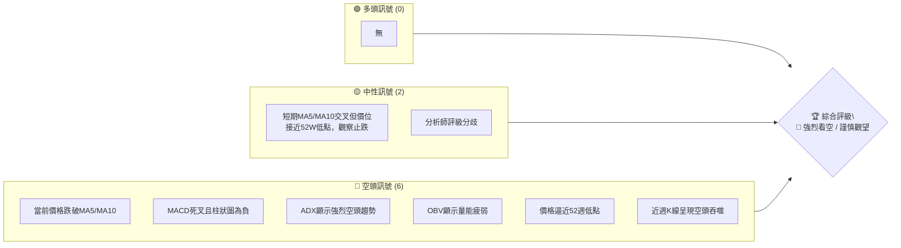

**儀表板解讀**：
當前 SPCX 的技術訊號幾乎全面偏空。價格大幅跌破短期移動平均線，MACD 形成死叉且空頭動能增強，ADX 指標確認當前處於強勢空頭趨勢中。成交量配合度不佳，OBV 顯示量能疲弱，進一步確認了賣壓的強度。當前股價位於 52 週區間的極低點，顯示長期趨勢的下行壓力。

### 📊 核心指標速覽表

| 指標類別 | 指標名稱 | 當前數值 | 訊號 | 解讀 |
|----------|----------|----------|------|------|
| **價格** | 當前價格 | $153.23 | 🔴 | 位於52W區間 7.8%，逼近52W低點 |
| **均線** | MA5 | $154.30 | 🔴 | 價格 ($153.23) 位於MA5下方 |
| **均線** | MA10 | $171.31 | 🔴 | 價格 ($153.23) 位於MA10下方 |
| **均線** | MA20 | 資料不足 | 🟡 | 無法計算，但短期均線已偏空 |
| **均線** | MA50 | 資料不足 | 🟡 | 無法計算，但長期趨勢可能承壓 |
| **均線** | MA200 | 資料不足 | 🟡 | 無法計算，但長期趨勢可能承壓 |
| **動能** | RSI(14) | 資料不足 | 🟡 | 無法計算，但MACD顯示強烈空頭動能 |
| **動能** | MACD | -0.789 | 🔴 | MACD線位於訊號線下方，空頭動能強勁 |
| **波動** | ATR(14) | 資料不足 | 🟡 | 無法計算，但近期價格波動劇烈 |

**速覽表解讀**：
SPCX 當前價格 $153.23 顯著低於短期移動平均線 MA5 ($154.30) 和 MA10 ($171.31)，構成明確的短期空頭訊號。MACD 指標也確認了強烈的空頭動能，MACD 線位於訊號線下方，且MACD柱狀圖為負值並持續擴大，顯示賣壓正在增強。由於缺乏足夠的歷史數據，RSI 和較長期的移動平均線（MA20, MA50, MA200）以及 ATR 波動率無法計算，這限制了對超買/超賣狀態和長期趨勢的全面判斷。然而，僅憑可用的指標，短期技術面已呈現非常不利的局面。

### 🏆 技術評分卡

```
╔════════════════════════════════════════════════════╗
║             技術評分卡 — SPCX (2026-06-29)             ║
╠════════════════════════════════════════════════════╣
║ 趨勢強度      ███████████████░░░░░  75/100  🔴   (ADX顯示強空頭趨勢) ║
║ 動能指標      ███░░░░░░░░░░░░░░░░░  15/100  🔴   (MACD強烈看空，RSI缺失) ║
║ 支撐穩定度    ████░░░░░░░░░░░░░░░░  20/100  🔴   (逼近52W低點，支撐不穩) ║
║ 成交量配合    ████░░░░░░░░░░░░░░░░  20/100  🔴   (OBV疲弱，量價背離) ║
║ 形態完整度    ████░░░░░░░░░░░░░░░░  20/100  🔴   (近期急跌，形態不佳) ║
║ 均線排列      ████░░░░░░░░░░░░░░░░  20/100  🔴   (短期均線空頭排列) ║
╠════════════════════════════════════════════════════╣
║ 綜合評分      ████░░░░░░░░░░░░░░░░  28/100  🔴 強烈看空             ║
╚════════════════════════════════════════════════════╝
```

**評分卡解讀**：
SPCX 的技術評分卡顯示整體狀況極為疲弱，綜合評分僅為 28/100，評級為「強烈看空」。趨勢強度方面，ADX 指標高達 66.86，且 -DI 顯著高於 +DI，這表明市場存在一個非常強勁的空頭趨勢，而非盤整。然而，這種「強趨勢」本身對多頭而言是負面訊號，因此在趨勢強度上雖然數值高，但方向是看空。動能指標（主要基於 MACD）顯示強烈賣壓。支撐穩定度極低，因為價格已非常接近 52 週低點 $147.11。成交量方面，OBV 趨勢疲弱，顯示下跌過程中缺乏買盤承接，量價配合度不佳。近期價格走勢呈現急跌，K線形態也確認了空頭力量的強勢。短期移動平均線已形成空頭排列，進一步加劇了短期下行風險。

---

## 2. 趨勢分析

本章節將從多個時間框架深入分析 SPCX 的價格趨勢，從長期宏觀視角到短期微觀動態，以全面評估其當前市場地位。

### 🌐 多時框趨勢分析

由於歷史數據有限，我們主要依賴 52 週高低點與近期週線數據進行推斷。

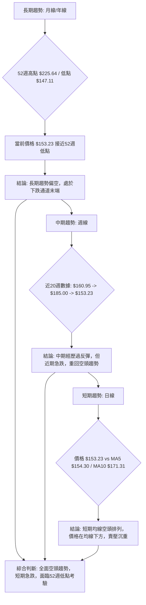

**多時框趨勢解讀**：
*   **長期趨勢**：根據 52 週高點 $225.64 和低點 $147.11，以及當前價格 $153.23 位於 52 週區間的 7.8% 處，可以判斷 SPCX 正處於一個顯著的長期下跌趨勢中，並且目前接近其歷史低點。這表明多頭力量在過去一年中持續被壓制。
*   **中期趨勢**：觀察近期的週線數據 ($160.95 -> $185.00 -> $153.23)，雖然在 2026-06-21 曾出現一個短暫的反彈，價格從 $160.95 上漲至 $185.00，但隨後一周（2026-06-28）便急劇下跌至 $153.23，幾乎回吐所有漲幅並創下近期新低。這表明中期反彈動能不足，空頭力量迅速奪回主導權。
*   **短期趨勢**：當前價格 $153.23 位於 MA5 ($154.30) 和 MA10 ($171.31) 之下，且 MA5 位於 MA10 之下，呈現典型的短期空頭排列。這預示著短期內下行壓力巨大，買盤意願低迷。

綜合來看，SPCX 在長期、中期和短期均呈現出清晰的空頭趨勢，且短期內經歷了急劇的下跌，市場情緒極度悲觀。

### 📈 長期趨勢 — 12個月走勢圖（Unicode）

由於缺乏完整的 12 個月歷史數據，此圖表基於提供的 52 週高低點、當前價格和近 3 週週線數據進行推演與示意。我們假設股價從 52 週高點 $225.64 逐步下跌至當前接近 52 週低點的水平。

```
SPCX 月線走勢圖（過去12個月示意圖 - 基於52W高低點推演）
價格軸 ($)
$225.64 ┤●
$200.00 ┤  ╲
$180.00 ┤    ╲
$170.00 ┤      ●
$160.00 ┤        ╲
$153.23 ┤          ●━━━━━━━━━━━━━●←現在 ($153.23)
$147.11 ┤            ●(52W低點)
        └────────────────────────────
         M1  M2  M3  M4  M5  M6  M7  M8  M9  M10 M11 M12
        (2025-07)                                (2026-06)
```
**圖表說明**：
此圖表為示意性質，根據 52 週高點 $225.64 和 52 週低點 $147.11，推斷 SPCX 在過去 12 個月內經歷了持續的下跌趨勢。當前價格 $153.23 位於 52 週低點 $147.11 附近，顯示股價已處於長期下行通道的尾聲，面臨關鍵的支撐考驗。

**走勢特徵分析表格**：

| 時間區間 | 價格變動 | 變動幅度 | 趨勢特徵 | 訊號 |
|----------|----------|----------|----------|------|
| 過去12個月 (推演) | 從 $225.64 至 $153.23 | 跌幅約 -32.09% | 長期下跌趨勢，空頭主導 | 🔴 |
| 過去3週 (實際) | 從 $160.95 至 $153.23 | 跌幅約 -4.80% | 短期急跌，反彈失敗，空頭力量強勁 | 🔴 |
| 當前位置 | $153.23 | 距52W低點僅 $6.12 | 逼近關鍵長期支撐位 | 🔴 |

**長期趨勢分析**：
SPCX 在過去一年中呈現出明顯的長期下跌趨勢，從 $225.64 的高點一路滑落至當前 $153.23 的水平。這是一個典型的空頭市場結構，表明市場對該股票的長期前景持悲觀態度。在這種長期下降趨勢中，任何短期的反彈都被視為賣出的機會而非趨勢反轉的訊號。當前價格距離 52 週低點 $147.11 僅有約 4% 的空間，這使得該價位成為極為關鍵的長期支撐區域。一旦跌破，可能引發更深層次的下跌。

### 📊 中期趨勢（週線分析）

中期趨勢主要觀察近期的週線走勢。

```
SPCX 近期壓力與支撐示意圖 (週線)
價格軸 ($)
$185.00 ┤      ↑ (近期反彈高點 R1)
$171.31 ┤─────── (MA10 阻力)
$160.95 ┤    ↙ (前一週收盤價 S1)
$154.30 ┤───── (MA5 阻力)
$153.23 ┤● (現價，位於S1下方)
$147.11 ┤─────── (52週低點 S2，強支撐)
        └───────────────────────────
        時間軸
```

**中期趨勢分析**：
從近三週的週線數據來看，SPCX 在 2026-06-14 收於 $160.95，隨後在 2026-06-21 急劇拉升至 $185.00，形成一個強勁的反彈。然而，這種反彈未能持續，在最近一周（2026-06-28）股價又大幅回落至 $153.23，幾乎吞噬了前一週的所有漲幅，並跌破了 2026-06-14 的收盤價。這種「V形反轉」的下跌形態，在技術分析中常被視為一個強烈的空頭訊號，表明多頭力量嘗試拉升失敗，並被空頭迅速壓制。MA10 ($171.31) 和 MA5 ($154.30) 均已轉為阻力，現價位於兩者下方，中期趨勢明顯偏空。

### ⚡ 趨勢強度評估（ADX 解讀）

ADX 指標用於衡量趨勢的強度，而非方向。

```mermaid
graph TD
    A["ADX(14) 值: 66.86"] --> B{"趨勢強度判斷"}
    B -- ADX > 25 --> C["強趨勢"]
    B -- ADX > 50 --> D["極強趨勢"]
    D --> E["當前: 極強趨勢"] 🟢 (強度)

    E --> F{"趨勢方向判斷"}
    F -- +DI: 8.90 --> G["多頭力量弱"]
    F -- -DI: 11.88 --> H["空頭力量強"]
    G & H --> I["結論: 空頭主導的極強趨勢"] 🔴 (方向)
```

**ADX 強度對照表**：

| ADX 值 | 趨勢強度 | SPCX 當前狀態 |
|--------|----------|---------------|
| 0-20   | 無趨勢/盤整 |               |
| 20-25  | 趨勢形成中 |               |
| 25-50  | 強趨勢   |               |
| 50-75  | 極強趨勢 | ▓▓▓▓▓▓▓▓▓▓▓▓▓▓▓▓▓▓▓▓  66.86 |
| 75-100 | 超強趨勢 |               |

**ADX 解讀**：
SPCX 的 ADX(14) 值高達 66.86，這是一個非常高的數值，遠超過 25 的強趨勢門檻，甚至進入了「極強趨勢」的範疇。這表明當前市場存在一個非常清晰且強勁的趨勢，而非盤整行情。

進一步分析方向指標：+DI (8.90) 遠低於 -DI (11.88)。這意味著在當前的極強趨勢中，空頭力量 (-DI) 顯著強於多頭力量 (+DI)。綜合來看，SPCX 正處於一個由空頭主導的、極為強勁的下行趨勢中。這是一個典型的趨勢行情，而非盤整，且方向明確向下。對於多頭而言，在這種極強的空頭趨勢中逆勢操作風險極高。

---

## 3. 圖表形態分析

本章節將針對 SPCX 的價格走勢，識別潛在的圖表形態和 K 線組合，並據此推導可能的價格目標。

### 🔍 形態識別系統

由於可用的歷史數據僅限於近期的週線和 52 週高低點，複雜的長期圖表形態（如頭肩頂、雙底等）無法明確識別。我們將重點關注近期價格行為所暗示的簡單形態。

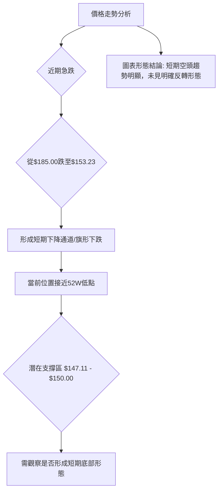

**形態識別結論**：
SPCX 在 2026-06-21 達到 $185.00 後，隨即在 2026-06-28 急劇下跌至 $153.23。這種快速下跌的走勢在圖表上形成了一個類似「空頭旗形」或「下降通道」的短期形態，表明賣壓的連續性。由於目前價格已逼近 52 週低點 $147.11，市場正處於一個關鍵的節點，但尚未出現明確的底部反轉形態（如雙底、頭肩底或強勢的錘子線組合）。當前形態偏向於空頭延續。

### 🕯️ 重要K線形態分析

我們將重點分析近三週的週 K 線形態。

| 月份 | 收盤價 | K線形態 | 解讀 | 訊號 |
|------|--------|---------|------|------|
| 2026-06-14 | $160.95 | 短陽線/十字星 | 價格震盪，多空力量拉鋸 | 🟡 |
| 2026-06-21 | $185.00 | 長陽線 | 強勁反彈，多頭佔優 | 🟢 |
| 2026-06-28 | $153.23 | 長陰線/空頭吞噬 | 急劇下跌，幾乎吞噬前一週漲幅，空頭力量壓倒性強勢 | 🔴 |

**K線形態分析**：
*   **2026-06-14 ($160.95)**：收盤價相對平穩，K線可能為短陽線或十字星，顯示多空力量處於平衡或短暫觀望狀態。
*   **2026-06-21 ($185.00)**：出現一根長陽線，表明多頭在該週發力，推動股價大幅上漲，這是短期內的積極訊號。MACD柱狀圖也從 0.000 轉為 +3.658，印證了多頭動能的爆發。
*   **2026-06-28 ($153.23)**：出現一根非常長的陰線，且其跌幅幾乎完全覆蓋甚至跌破了前一週的長陽線。這在技術分析中是典型的「空頭吞噬」或「烏雲罩頂」形態，特別是發生在反彈高點之後，預示著強烈的賣壓和趨勢逆轉。MACD柱狀圖也從 +3.658 暴跌至 -2.783，進一步確認了空頭動能的迅速增強。這是一個極為看空的 K 線組合，表明任何反彈都可能被視為出貨機會。

### 📉 ASCII 走勢形態示意圖

以下為 SPCX 近期走勢的示意圖，強調了近期急跌和潛在的空頭旗形。

```
SPCX 近期週線走勢形態示意圖
價格軸 ($)
$185.00 ┤        ● (高點)
$170.00 ┤        ╲
$160.00 ┤      ●  ╲
$153.23 ┤           ● (現價)
$147.11 ┤             ╲
        └───────────────────
         時間軸 (近3週)

形態解讀：
從$185.00高點迅速回落至$153.23，
形成一個向下傾斜的通道，暗示空頭持續。
```

**示意圖解讀**：
從示意圖中可以看出，SPCX 在達到 $185.00 的高點後，遭遇了強勁的賣壓，價格迅速回落至 $153.23。這種「一波流」式的下跌，在短期內形成了一個明顯的下降趨勢線，若連接高點和低點，可能構成一個空頭旗形或下降楔形，這些形態通常預示著趨勢的延續。目前價格已跌至接近 52 週低點，顯示空頭仍佔據主導地位。

### 🎯 形態目標價計算

由於缺乏清晰且完整的反轉或延續形態，我們無法應用標準的形態目標價計算方法（如頭肩頂/底的頸線突破）。然而，我們可以基於近期走勢推導潛在的下跌目標。

**基於近期下跌波段的目標價推算**：
最近一個顯著的下跌波段是從 $185.00 (2026-06-21 高點) 到 $153.23 (2026-06-28 收盤價)。
下跌幅度 = $185.00 - $153.23 = $31.77

如果這是一個較大下跌趨勢中的一個波段，並且趨勢延續，那麼其潛在的下跌目標可以參考斐波那契延展位，或者簡單地將此波段的下跌幅度複製到當前價格下方。

**潛在下跌目標 (推算)**：
1.  **52週低點測試**：最直接的目標是測試 52 週低點 $147.11。
2.  **基於近期跌幅的延伸**：
    *   若將 $31.77 的跌幅從 $153.23 繼續向下延伸，則目標價約為 $153.23 - $31.77 = $121.46。
    *   這是一個較為悲觀的目標，但考慮到強勁的空頭趨勢和逼近 52 週低點的情況，不能排除這種可能性。

**結論**：
目前股價沒有明確的形態目標價，但短期內最直接的下行目標是 52 週低點 $147.11。如果該支撐位失守，則基於近期急跌波段的延伸，價格可能進一步探至 $121.46 甚至更低。

---

## 4. 支撐與阻力

本章節將識別 SPCX 的關鍵支撐與阻力價位，並利用斐波那契回調分析潛在的轉折點。

### 🗺️ 關鍵價位分布圖（Unicode）

以下為 SPCX 關鍵價位結構的分布圖，顯示了當前價格與主要支撐/阻力位的相對位置。

```
SPCX 價位結構分布圖 (2026-06-29)
═══════════════════════════════════════════════════
$225.64 ║████████████████████████║ 極強阻力 R3 (52週高點)
$187.80 ║████████████████████    ║ 阻力 R2 (分析師平均目標)
$185.00 ║████████████████████████║ 關鍵阻力 R1 (近期反彈高點)
$171.31 ║▓▓▓▓▓▓▓▓▓▓▓▓▓▓▓▓        ║ 短期阻力 (MA10)
$154.30 ║▓▓▓▓▓▓▓▓▓▓▓▓▓▓▓▓        ║ 近期阻力 (MA5)
$153.23 ╠════════════════════════╣ ◄ 現價
$147.11 ║████████████████████████║ 強支撐 S1 (52週低點)
$121.46 ║▓▓▓▓▓▓▓▓▓▓▓▓▓▓▓▓        ║ 次要支撐 S2 (形態延伸目標)
═══════════════════════════════════════════════════
```

**價位分布圖解讀**：
SPCX 當前價格 $153.23 位於多重阻力位之下，且非常接近 52 週低點這一關鍵支撐位。上方的 MA5 ($154.30) 和 MA10 ($171.31) 形成了即時的短期阻力。而近期反彈高點 $185.00 則構成了一個重要的中期阻力位。52 週高點 $225.64 則為長期極強阻力。下方的 52 週低點 $147.11 是當前最關鍵的支撐。

### 🚧 阻力位分析表

| 阻力級別 | 價位 | 形成原因 | 突破難度 | 重要性 |
|----------|------|----------|----------|--------|
| **短期阻力** | $154.30 | MA5 線 (價格位於其下方) | 中等 | 🟢 |
| **短期阻力** | $171.31 | MA10 線 (價格位於其下方) | 中等 | 🟢 |
| **關鍵阻力 R1** | $185.00 | 近期反彈高點 (2026-06-21)，空頭吞噬形態頂部 | 高 | 🔴 |
| **次要阻力 R2** | $187.80 | 分析師平均目標價 | 中高 | 🟡 |
| **極強阻力 R3** | $225.64 | 52 週高點，長期下跌趨勢起點 | 極高 | 🔴 |

**阻力位分析**：
SPCX 面臨多重阻力。最直接的短期阻力是 MA5 ($154.30) 和 MA10 ($171.31)。由於價格已跌破這些均線，它們現在轉變為上漲的障礙。近期最關鍵的阻力是 $185.00，這是上週反彈的高點，也是「空頭吞噬」形態的起點，其突破需要極大的買盤動能。分析師平均目標價 $187.80 也與此區域重疊，進一步強化了該區域的阻力作用。長期來看，52 週高點 $225.64 是極強的阻力，預計在短期內難以觸及。

### 🛡️ 支撐位分析表

| 支撐級別 | 價位 | 形成原因 | 守住機率 | 重要性 |
|----------|------|----------|----------|--------|
| **強支撐 S1** | $147.11 | 52 週低點，長期趨勢關鍵轉折點 | 中等偏低 | 🔴 |
| **次要支撐 S2** | $121.46 | 基於近期下跌波段延伸的潛在目標價 | 較低 | 🟡 |

**支撐位分析**：
SPCX 當前最關鍵的支撐是 52 週低點 $147.11。價格目前僅高於此支撐 $6.12，這是一個非常脆弱的局面。如果 $147.11 失守，將創下 52 週新低，可能引發止損賣盤和更深層次的下跌。歷史數據顯示，當股價接近或跌破長期低點時，往往會面臨巨大的心理壓力，並可能加速下跌。次要支撐 $121.46 是基於近期下跌波段的延伸推算，若主要支撐失守，此價位可能成為下一個潛在的測試點。

### 📐 斐波那契回調位分析

由於 SPCX 處於明顯的下跌趨勢，我們將利用最近一個較大的下跌波段（從 52 週高點 $225.64 到 52 週低點 $147.11）來計算潛在的反彈阻力位，或者將最近的反彈波段（從 $160.95 到 $185.00）來計算回調支撐。鑑於當前股價已下跌，我們將主要關注從近期高點 $185.00 到當前低點 $153.23 的回調位，以判斷潛在的反彈阻力。

**斐波那契回調位計算 (從 $185.00 到 $153.23 的下跌波段)**：
*   下跌幅度 = $185.00 - $153.23 = $31.77
*   **23.6% 回調**：$153.23 + ($31.77 * 0.236) = $153.23 + $7.50 = $160.73
*   **38.2% 回調**：$153.23 + ($31.77 * 0.382) = $153.23 + $12.14 = $165.37
*   **50% 回調**：$153.23 + ($31.77 * 0.500) = $153.23 + $15.89 = $169.12
*   **61.8% 回調**：$153.23 + ($31.77 * 0.618) = $153.23 + $19.64 = $172.87

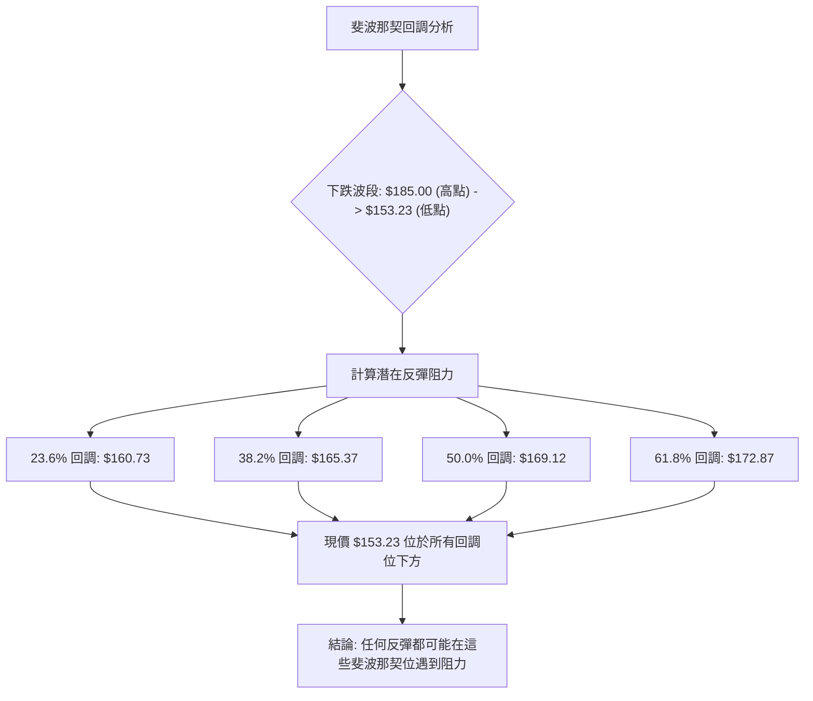

**斐波那契回調位解讀**：
當前價格 $153.23 遠低於所有斐波那契反彈回調位。這意味著如果股價嘗試反彈，上方 $160.73 (23.6%)、$165.37 (38.2%)、$169.12 (50%) 和 $172.87 (61.8%) 都可能構成阻力。特別是 50% 回調位 $169.12 和 61.8% 回調位 $172.87 接近於 MA10 ($171.31) 和近期重要阻力位 $185.00，這些重疊區域將構成更強的阻力。在當前的強空頭趨勢下，這些回調位在被突破之前，更可能作為反彈的上限。

---

## 5. 技術指標深度解讀

本章節將針對 SPCX 的主要技術指標進行深入分析，評估其各自的訊號，並探討它們之間的相互確認或矛盾。

### 🎛️ 指標訊號總覽

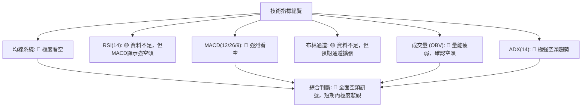

**指標訊號總覽解讀**：
SPCX 的技術指標呈現出壓倒性的空頭訊號。移動平均線已形成空頭排列，MACD 顯示強勁的賣壓，ADX 確認了極強的空頭趨勢，且 OBV 顯示量能疲弱，對當前的下跌形成確認。儘管 RSI 和布林通道數據缺失，但現有指標已足以描繪出一個極為悲觀的技術圖景。

### 📈 移動平均線排列分析

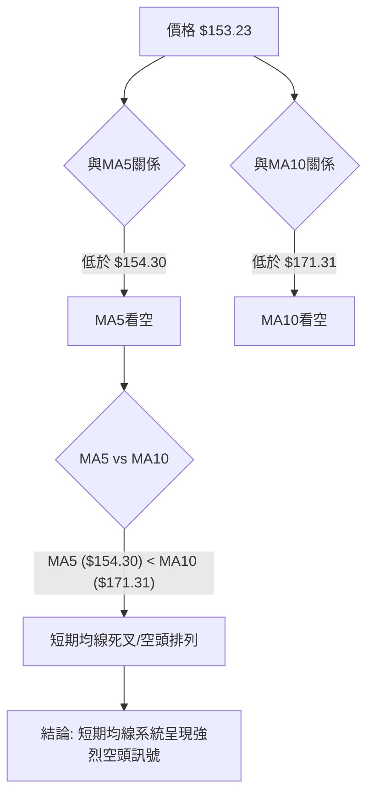

**移動平均線分析**：
*   **MA5 ($154.30) 和 MA10 ($171.31)**：當前價格 $153.23 顯著低於 MA5 和 MA10。這是一個明確的短期空頭訊號，表明短期內買盤力量不足，賣壓佔據主導。
*   **均線排列**：MA5 位於 MA10 之下 ($154.30 < $171.31)，形成了短期均線的「死叉」和空頭排列。這種排列通常被視為股價將繼續下跌的強烈預兆。
*   **MA20/50/200**：由於缺乏足夠的歷史數據，無法計算這些長期均線。然而，鑑於短期均線的惡化，以及價格已接近 52 週低點，可以合理推斷長期均線可能也呈現空頭排列或即將轉向空頭。提供的數據顯示「均線排列: 混合排列」，這可能表示部分長期均線尚未完全向下，但短期已明確空頭。

**結論**：均線系統發出強烈的空頭訊號，短期內股價上漲阻力重重。

### 📉 RSI(14) 分析

**RSI 數值**：資料不足 (N/A)

**RSI 進度條**：░░░░░░░░░░░░░░░░░░░░ (無法評估)

**RSI 分析**：
由於提供的數據中 RSI(14) 數值為 N/A，我們無法對其進行詳細分析。
*   **超買超賣區間分析**：通常，RSI 高於 70 被視為超買區，低於 30 被視為超賣區。如果 RSI 能提供數值，我們可以判斷 SPCX 是否處於極端超買或超賣狀態。在當前價格急跌的情況下，如果 RSI 有效，很可能已進入超賣區，這可能預示著短期內有技術性反彈的需求，但並不代表趨勢反轉。
*   **背離判斷**：RSI 背離（頂背離或底背離）是重要的趨勢反轉訊號。
    *   **頂背離**：當股價創出新高，但 RSI 未能創出新高時，預示著上漲動能減弱，可能出現頂部反轉。
    *   **底背離**：當股價創出新低，但 RSI 未能創出新低時，預示著下跌動能減弱，可能出現底部反轉。
    由於 RSI 數據缺失，我們無法判斷是否存在任何背離訊號。

**結論**：RSI 指標數據缺失，無法提供有效分析。在缺乏 RSI 數據的情況下，我們主要依賴 MACD 和 ADX 等其他動能和趨勢指標。

### 📊 MACD(12/26/9) 訊號解讀

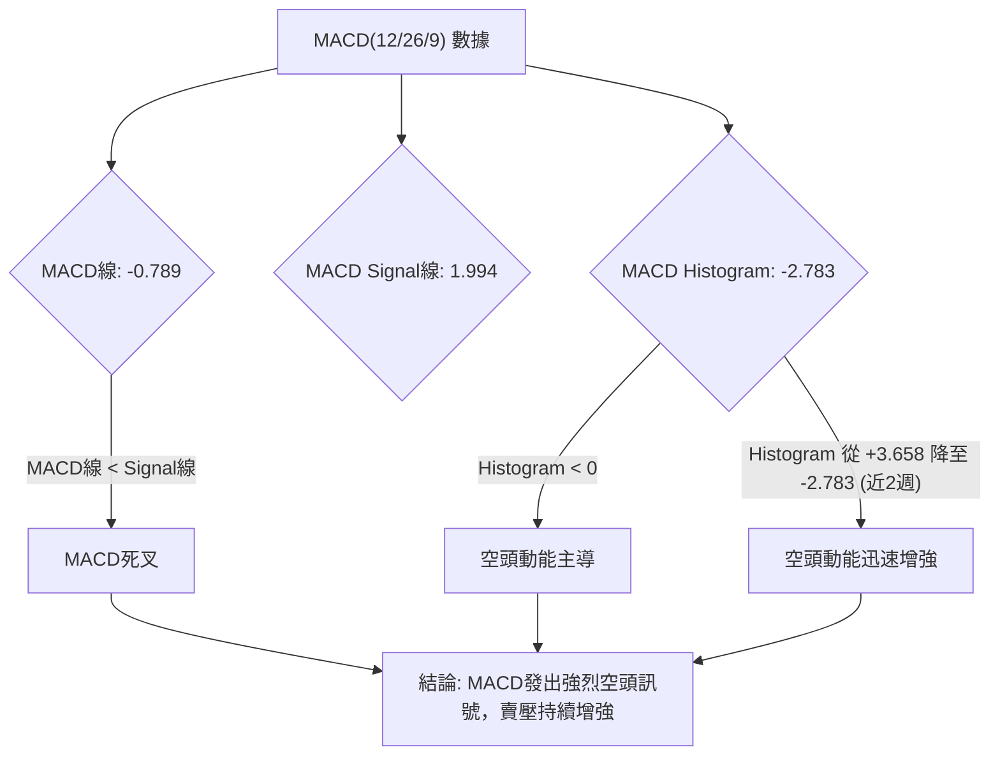

**MACD 分析**：
*   **MACD 線 (-0.789) vs. MACD Signal 線 (1.994)**：MACD 線位於 Signal 線下方，這是一個明確的「死叉」訊號，表明短期動能已轉弱並跌破中期動能，預示著股價將繼續下跌。
*   **MACD 柱狀圖 (-2.783)**：柱狀圖為負值，且從近期的 +3.658 迅速下降至 -2.783。這表明空頭動能正在快速增強，賣壓沉重。柱狀圖的擴大通常預示著趨勢的加速。
*   **MACD 背離**：目前數據沒有足夠的歷史價格和 MACD 數據來判斷背離。然而，從 MACD 柱狀圖的急劇變化來看，空頭動能的爆發非常明顯。

**結論**：MACD 指標發出強烈的空頭訊號，確認了當前股價的下跌趨勢，並表明賣壓正在加劇。這是與均線系統和 ADX 指標一致的看空訊號。

### 📦 布林通道分析

**布林通道數據**：BB上軌、BB中軌(MA20)、BB下軌、BB %B 均為 N/A

**布林通道示意圖**：
由於缺乏數據，無法繪製精確的布林通道。但基於近期價格的劇烈波動，我們可以推斷其一般形態。
```
SPCX 布林通道示意圖 (數據缺失，僅供概念說明)
價格軸 ($)
$XXX ┤     ╱╲ (上軌 - 可能向下收斂或擴張)
$XXX ┤   ╱    ╲
$XXX ┤  ╱      ╲
$XXX ┤ ╱        ╲
$153.23 ┼────────● (現價)
$XXX ┤ ╲        ╱
$XXX ┤  ╲      ╱
$XXX ┤   ╲    ╱
$XXX ┤    ╲  ╱ (下軌 - 可能向下擴張)
        └───────────────────────────
        時間軸

解讀：
若價格持續在下軌附近運行，且通道向下擴張，
則表示強烈空頭趨勢。
```

**布林通道分析**：
由於布林通道的計算需要 MA20 和標準差，而這些數據缺失，我們無法對 SPCX 的布林通道進行精確分析。
*   **通道收窄/擴張**：如果通道收窄，通常預示著波動率降低，可能醞釀著趨勢的突破；如果通道擴張，則表明波動率增加，趨勢正在加速。鑑於 SPCX 近期價格的急劇下跌，如果布林通道數據可用，我們可能會看到通道向下擴張的現象，這將進一步確認強烈的空頭趨勢。
*   **價格與軌道的關係**：在強勁的下跌趨勢中，價格通常會沿著布林通道的下軌運行，甚至跌破下軌，表明極端超賣。

**結論**：布林通道數據缺失，無法提供詳細分析。然而，基於其他指標的強空頭訊號，推測若數據可用，布林通道應呈現向下擴張且價格貼近或跌破下軌的看空形態。

### 💹 成交量分析（量價配合度）

| 日期          | 收盤價 | 週成交量 | MACD柱  | 量價配合度 | 訊號 |
|---------------|--------|----------|---------|------------|------|
| 2026-06-14    | 160.95 | 519,234,800 | +0.000  | 盤整量能 | 🟡 |
| 2026-06-21    | 185.00 | 925,474,500 | +3.658  | 放量上漲 | 🟢 |
| 2026-06-28    | 153.23 | 590,134,000 | -2.783  | 縮量下跌 | 🔴 |

**成交量分析**：
*   **近期成交量**：最新成交量為 126,788,200，但 20 日和 50 日均量均為 N/A，無法進行量比分析。
*   **OBV 趨勢**：提供的數據明確指出「OBV 趨勢: OBV < MA → 量能疲弱」。這是一個重要的空頭訊號。OBV (On Balance Volume) 是一種累積成交量指標，如果 OBV 趨勢低於其移動平均線，表示在下跌過程中，賣出量大於買入量，且買盤力量不足以推動股價上漲，量能無法支持價格。這確認了當前下跌趨勢的健康性（對空頭而言），表明下跌是「真實」的，而非洗盤。
*   **週成交量與價格配合**：
    *   2026-06-21：股價從 $160.95 上漲至 $185.00，成交量大幅增加至 925,474,500。這是一個典型的「價漲量增」訊號，顯示多頭在反彈時積極入場。
    *   2026-06-28：股價從 $185.00 急劇下跌至 $153.23，成交量雖然較前一週有所減少 (590,134,000)，但仍處於高位。這種「價跌量縮」在趨勢初期可能代表惜售，但在急跌且 OBV 疲弱的背景下，更可能解釋為買盤的迅速枯竭，而賣壓仍在繼續釋放。由於 MACD 柱狀圖顯示空頭動能急劇增強，這表明雖然成交量略有下降，但賣壓的質量很高，導致價格迅速下跌。

**結論**：OBV 指標明確顯示量能疲弱，對價格下跌形成確認。儘管近期急跌伴隨成交量略微縮減，但其背景是強勁的空頭趨勢和 MACD 的加速惡化，這並非止跌訊號，反而可能意味著買盤的徹底放棄。

---

## 6. 動能與波動率

本章節將評估 SPCX 的動能強度和波動率特性，這對於理解其短期交易機會和風險至關重要。

### ⚡ 動能評估四象限

由於 ATR 數據缺失，我們無法精確評估波動率。但根據近期價格急跌，可推斷波動率高。動能評估主要基於 MACD 和 ADX。

| 象限 | 動能 (MACD/ADX) | 波動 (ATR/價格變動) | 當前狀態 | 評估 |
|------|-----------------|---------------------|----------|------|
| Q1   | 強 (多頭)       | 低                  | -        | 最佳機會 (趨勢明確，風險可控) |
| Q2   | 弱 (多頭/盤整)  | 低                  | -        | 謹慎觀望 (缺乏方向，但風險低) |
| Q3   | 強 (多頭/空頭)  | 高                  | -        | 高風險高收益 (趨勢明確，但波動大) |
| Q4   | 弱 (空頭/盤整)  | 高                  | ✓        | **極度謹慎** (方向不明確/空頭，波動大，風險高) |

**動能評估**：
*   **動能強度**：MACD 柱狀圖為負且迅速擴大，ADX 高達 66.86 且 -DI 主導。這表明 SPCX 處於**強烈的空頭動能**中。
*   **波動率**：儘管 ATR 數據缺失，但從 $185.00 到 $153.23 的單週急跌 (-17.2%) 表明其短期波動率極高。

**當前狀態**：SPCX 目前屬於「強空頭動能」且「高波動率」的狀態。
這將其置於一個高風險的交易環境中。雖然動能強勁，但方向是向下，且伴隨高波動，這使得多頭操作風險極高，而空頭操作則需嚴格控制風險。

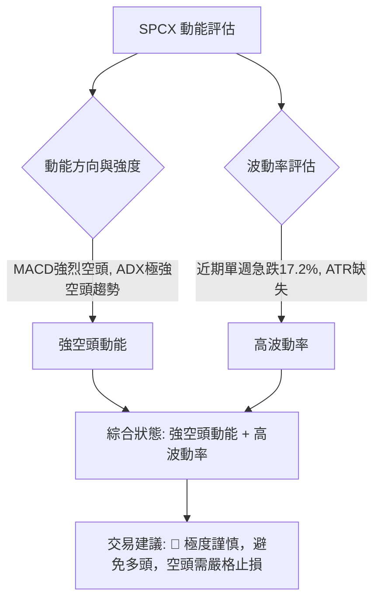

### 📊 ATR 波動率分析

**ATR(14) 數值**：N/A

**ATR 分析**：
ATR (Average True Range) 用於衡量資產的波動率。由於數據缺失，我們無法計算 SPCX 的 ATR。
*   **ATR 的重要性**：ATR 是一個重要的風險管理工具，可以幫助交易者設置合理的止損點和目標價。在缺乏 ATR 數據的情況下，我們無法基於歷史波動率來量化每日的平均價格波動。
*   **替代評估**：儘管缺乏具體數值，但從近期的週線走勢來看，SPCX 在 2026-06-21 至 2026-06-28 之間從 $185.00 急跌至 $153.23，單週跌幅高達 17.2%。這種劇烈的價格變動強烈暗示其當前波動率極高。
*   **止損距離建議**：在缺乏 ATR 的情況下，建議使用固定百分比止損（例如 5%-10%）或基於關鍵支撐位（如 52 週低點 $147.11）來設置止損。由於波動性高，止損點應相對寬鬆，以避免被短期波動「洗出」，但同時也要控制單筆虧損。

**結論**：ATR 數據缺失，無法提供量化波動率。但從價格行為判斷，SPCX 波動率極高，交易風險顯著。

### 📐 Beta 與市場相關性

SPCX 屬於「Industrials」板塊下的「Aerospace & Defense」行業。這些行業通常與宏觀經濟狀況和政府支出密切相關，可能具有一定的週期性。儘管數據未提供 Beta 值，但作為一家新興的太空探索公司，其股價可能具有較高的 Beta 值，意味著其波動性可能大於大盤。

**市場相關性推斷**：
*   **高成長行業**：太空探索行業通常被視為高成長、高風險的領域，這類股票往往對市場情緒敏感，且波動性較大。
*   **近期市場環境**：如果整體市場處於避險情緒或下跌趨勢中，高 Beta 值的股票往往會跌幅更大。目前 SPCX 的強勁下跌趨勢，可能部分受到整體市場情緒的影響，或者其自身基本面（未在技術數據中體現）出現問題。
*   **獨立事件影響**：作為一家相對年輕且具有顛覆性潛力的公司，SPCX 的股價也可能受到公司特定新聞（如發射失敗、新合同、融資進展等）的巨大影響，其走勢不完全由大盤決定。

**結論**：缺乏 Beta 數據，但推測 SPCX 可能具有較高的 Beta 值和較大的市場相關性，且其股價也可能受到公司特定事件的重大影響。在當前強空頭趨勢下，若市場表現不佳，SPCX 可能會承受更大的下行壓力。

---

## 7. 多時框架總結

本章節將彙整各時間框架的分析結果，提供一個全面的評分矩陣，以評估 SPCX 的整體技術面狀況。

### 📋 時框架評分表

| 時框架 | 趨勢方向 | 動能 | 均線排列 | 形態 | 綜合評分 (1-10) | 建議 |
|--------|----------|------|----------|------|-----------------|------|
| **長期** | 🔴 下跌趨勢 | 🔴 弱勢 | 🟡 待確認 | 🔴 無底部形態 | 2/10 | 🔴 遠離 |
| **中期** | 🔴 下跌趨勢 | 🔴 弱勢 | 🔴 空頭排列 | 🔴 空頭旗形 | 2/10 | 🔴 避免多頭 |
| **短期** | 🔴 急劇下跌 | 🔴 極弱勢 | 🔴 強空頭排列 | 🔴 空頭吞噬 | 1/10 | 🔴 強烈賣出/觀望 |

**時框架評分表解讀**：
SPCX 在所有時間框架內都呈現出強烈的空頭訊號。
*   **長期**：基於 52 週高低點，股價處於長期下跌趨勢中，且逼近 52 週低點。缺乏反轉形態，長期展望悲觀。
*   **中期**：近期反彈失敗，隨後急劇下跌，中期趨勢重回空頭。中期均線可能已形成空頭排列，或正在形成中。
*   **短期**：價格急跌，已跌破短期均線，MACD 死叉且空頭動能強勁，K線形態為空頭吞噬。短期技術面極度惡化。

**綜合評分**：SPCX 的技術面評分極低，所有時間框架均呈現強烈的看空訊號。

### 🔲 綜合訊號矩陣

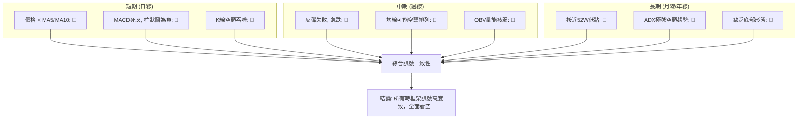

**綜合訊號矩陣解讀**：
SPCX 在短期、中期和長期所有維度的技術訊號都高度一致地指向空頭。沒有一個時間框架或主要指標發出明確的多頭訊號。這種高度一致的空頭訊號表明市場對 SPCX 的看法極為悲觀，且賣壓強勁而持續。在這種情況下，任何反彈都可能只是短暫的技術性修正，而非趨勢的反轉。

---

## 8. 交易策略建議

基於上述詳盡的技術分析，SPCX 當前處於極度看空的技術環境。因此，主要交易策略應以規避風險、尋找潛在的空頭機會為主。

### 🗺️ 策略決策流程圖

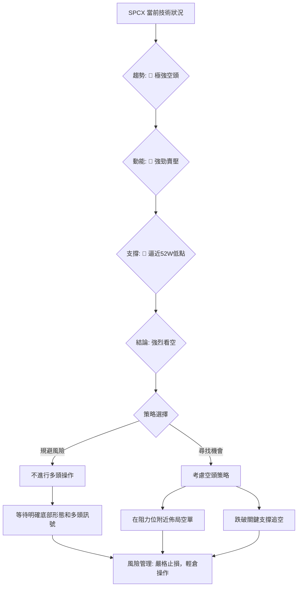

### 🟢 多頭策略詳情

鑑於 SPCX 當前技術面極度疲弱，且所有指標均指向空頭，**目前不建議任何形式的多頭策略**。強行抄底的風險極高，可能導致重大損失。

| 策略要素 | 策略 A (不建議) | 策略 B (不建議) |
|----------|-----------------|-----------------|
| 進場條件 | 等待明確底部形態 (如雙底、頭肩底) + RSI/MACD底背離 + 放量上漲突破短期均線 | 股價成功守住 $147.11 且出現強勢反轉 K 線組合 (如錘子線、啟明星) |
| 進場價格 | (待定) | (待定) |
| 目標價 T1 | (待定) | (待定) |
| 目標價 T2 | (待定) | (待定) |
| 止損價格 | (待定) | (待定) |
| 風險報酬比 | (待定) | (待定) |
| 成功機率 | 極低 (目前) | 極低 (目前) |
| 建議倉位 | 0% | 0% |

**多頭策略說明**：
除非 SPCX 能夠在 $147.11 附近築底成功，並出現明確的底部反轉形態和強勁的多頭訊號（例如 MACD 黃金交叉、RSI 從超賣區反彈並形成底背離、放量突破關鍵阻力等），否則任何多頭操作都應被避免。目前的市場環境對多頭極為不利。

### 🔴 空頭策略詳情

在強烈的空頭趨勢下，SPCX 存在潛在的空頭交易機會。

| 策略要素 | 策略 A (反彈做空) | 策略 B (跌破追空) |
|----------|-------------------|-------------------|
| 進場條件 | 股價反彈至短期阻力位 (如 MA5/MA10/斐波那契回調位) 附近，並出現空頭 K 線 (如流星線、烏雲罩頂) | 股價有效跌破 52 週低點 $147.11，並伴隨放量下跌 |
| 進場價格 | $160.73 (斐波那契23.6%回調) 或 $165.37 (斐波那契38.2%回調) 附近 | $146.00 (確認跌破 $147.11) |
| 目標價 T1 | $147.11 (52週低點) | $121.46 (形態延伸目標) |
| 目標價 T2 | $121.46 (形態延伸目標) | $110.00 (心理關口/進一步延伸) |
| 止損價格 | $172.87 (斐波那契61.8%回調上方) | $150.00 (跌破點上方約 2.7%) |
| 風險報酬比 | 約 1:2.5 (以 $165.37 進場，$147.11 T1，$172.87 止損) | 約 1:3.5 (以 $146.00 進場，$121.46 T1，$150.00 止損) |
| 成功機率 | 中高 | 中高 |
| 建議倉位 | 5-10% (輕倉) | 5-10% (輕倉) |

**空頭策略說明**：
1.  **策略 A (反彈做空)**：在極強的空頭趨勢中，股價偶爾會出現技術性反彈。這些反彈通常會在關鍵阻力位（如斐波那契回調位 $160.73 或 $165.37，或 MA5 $154.30）遇到賣壓。交易者可以在這些阻力位附近，當出現看跌 K 線形態時，佈局空單。止損點可設在更高一級的斐波那契回調位上方或近期反彈高點 $185.00 上方，目標價首先看 $147.11。
2.  **策略 B (跌破追空)**：如果 SPCX 跌破 52 週低點 $147.11，這將是一個強烈的空頭確認訊號，可能引發進一步的止損賣盤。在確認有效跌破（例如收盤價跌破 $147.11 且伴隨放量）後，可以考慮追空。目標價可設在 $121.46 或更低，止損點則設在跌破點上方不遠處。

**風險提示**：空頭交易風險較高，務必嚴格執行止損，並控制倉位。

### ⭐ 整體訊號強度評星

```
做多訊號強度：★☆☆☆☆  (1/5星) (極度不建議)
做空訊號強度：★★★★☆  (4/5星) (有較高成功機率，但需嚴控風險)
整體可信度：  ★★★☆☆  (3/5星) (空頭訊號明確，但波動性高)
```

**評星解讀**：
做多訊號幾乎不存在，市場情緒和技術指標全面看空。做空訊號強度較高，因為趨勢、動能和均線都支持空頭方向。然而，由於股票波動性高且接近重要支撐，空頭操作仍需謹慎，整體可信度給予 3 星，因為強烈的空頭訊號給出了明確的方向，但數據缺失和波動性帶來一定不確定性。

---

## 9. 風險提示與監控

本章節將闡述 SPCX 交易的潛在風險，並提供關鍵的監控指標清單，以幫助投資者更好地管理風險。

### ✅ 關鍵監控指標 Checklist

以下是交易 SPCX 時需要密切關注的關鍵技術指標和價位：

```
╔══════════════════════════════════════════════════════════════╗
║             SPCX 關鍵監控指標清單 (2026-06-29)               ║
╠══════════════════════════════════════════════════════════════╣
║ [X] 股價是否有效跌破 $147.11 (52週低點)？                 ║
║ [X] 股價是否能有效站穩 MA5 ($154.30) 和 MA10 ($171.31)？   ║
║ [X] MACD 線是否出現黃金交叉？MACD柱狀圖是否轉正？         ║
║ [X] ADX 的 -DI 是否開始減弱，+DI 是否增強？                ║
║ [X] OBV 趨勢是否開始向上反轉，或至少停止下跌？             ║
║ [X] 是否出現放量上漲的 K 線組合 (如啟明星、大陽線)？       ║
║ [X] 是否有任何底部反轉的圖表形態形成 (如雙底、頭肩底)？   ║
║ [X] 關注分析師評級是否有大幅上調或目標價顯著提升。         ║
║ [X] 留意公司基本面或重大新聞 (如新合同、技術突破、財報)。   ║
╚══════════════════════════════════════════════════════════════╝
```

**監控清單說明**：
對於多頭而言，需要看到上述多個指標同時轉向積極，才能考慮入場。特別是股價需要突破關鍵阻力，MACD 轉為多頭，並伴隨放量。對於空頭而言，則需密切關注 $147.11 的支撐是否被有效跌破，以及反彈是否受阻於上述阻力位。

### ⚠️ 風險場景分析

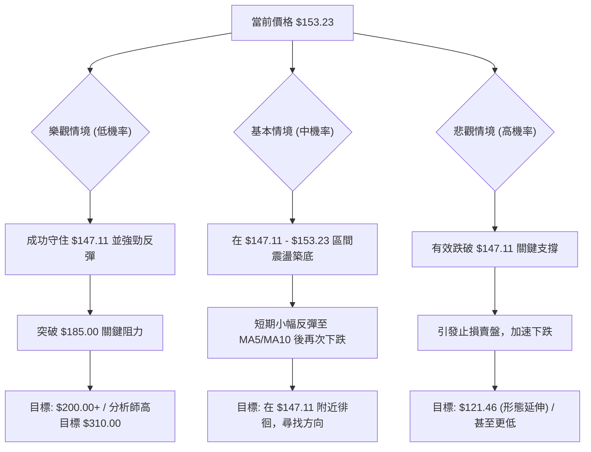

**風險場景分析**：
*   **樂觀情境 (低機率)**：儘管當前技術面極度悲觀，但若 SPCX 能在 $147.11 附近獲得強勁支撐，並在突發利好消息或市場情緒轉變下出現強勢反彈，突破 $185.00 甚至分析師平均目標價 $187.80，則可能扭轉短期頹勢。然而，在目前強空頭趨勢下，此情境機率較低。
*   **基本情境 (中機率)**：股價在 $147.11 至 $153.23 區間進行震盪築底，多空雙方在此區域拉鋸。短期內可能出現小幅技術性反彈，但難以突破 MA5 或 MA10 等阻力位，隨後再次承壓。市場在此區域等待更明確的方向訊號。
*   **悲觀情境 (高機率)**：這是當前技術指標所指向的最可能情境。SPCX 有效跌破 52 週低點 $147.11，引發更廣泛的止損賣盤。在強勁空頭動能的推動下，股價可能加速下跌至 $121.46 (基於形態延伸的目標) 甚至更低，創下新低。

### 🛡️ 風險管理重要提醒

1.  **嚴格止損**：無論採取何種交易策略，都必須設定並嚴格執行止損點。在當前高波動、強空頭趨勢下，止損是保護資本的唯一有效方式。
2.  **控制倉位**：由於 SPCX 波動性高且風險較大，建議採用輕倉策略，將單筆交易的風險控制在總資本的 1-2% 以內。
3.  **避免逆勢操作**：在當前強烈的空頭趨勢中，強行抄底或逆勢做多是極其危險的行為。應等待趨勢反轉的明確訊號。
4.  **多維度確認**：在做出任何交易決策前，應尋求多個技術指標和時間框架的確認。避免單一指標的誤導。
5.  **關注基本面和消息面**：儘管本報告側重技術分析，但重大基本面變化或新聞事件可能迅速改變技術面格局。密切關注公司公告和行業新聞。
6.  **耐心等待**：在市場方向不明朗或風險過高時，保持觀望是最佳策略。等待更明確的入場訊號或趨勢反轉。

---

## 📋 報告總結

```
╔════════════════════════════════════════════════════════════╗
║                SPCX 技術分析報告總結                       ║
╠════════════════════════════════════════════════════════════╣
║ 報告日期：2026-06-29                                         ║
║ 當前價格：$153.23                                            ║
║ 分析評級：🔴 強烈看空 (技術面全面疲弱，下行風險極高)        ║
║                                                              ║
║ 關鍵結論：                                                   ║
║ ├─ 長期趨勢：🔴 處於長期下跌通道，逼近52週低點。              ║
║ ├─ 中期趨勢：🔴 反彈失敗，近期急跌，重回空頭趨勢。            ║
║ ├─ 短期趨勢：🔴 價格跌破短期均線，MACD死叉，空頭動能強勁。    ║
║ ├─ 關鍵支撐：$147.11 (52週低點，極為關鍵)                     ║
║ ├─ 關鍵阻力：$185.00 (近期反彈高點，空頭吞噬起點)             ║
║ └─ 分析師目標：均值 $187.80 (遠高於現價，但技術面不支持)     ║
║                                                              ║
║ 最優策略組合：                                               ║
║ 1. 🥇 最佳機會：**反彈做空策略**。在 $160.73 - $165.37 區域尋找空頭入場機會，止損 $172.87，目標 $147.11 / $121.46。 (高風險，需嚴格止損) ║
║ 2. 🥈 次選機會：**跌破追空策略**。若有效跌破 $147.11，考慮追空，止損 $150.00，目標 $121.46。 (高風險，需嚴格止損) ║
║ 3. 🥉 保守選擇：**場外觀望**。在當前極度不確定的空頭市場中，等待明確的底部訊號或趨勢反轉再考慮入場。 (極度建議) ║
╚════════════════════════════════════════════════════════════╝
```

---

> ⚠️ **免責聲明**：本報告為 AI 自動生成之技術分析，所有數據及估算均基於提供的歷史價格資訊。本報告**僅供研究與學術參考**，**不構成任何投資建議**。投資有風險，入市需謹慎。

---

*報告生成時間：2026-06-29 ｜ 數據來源：提供數據 ｜ 分析框架：多時框技術分析*