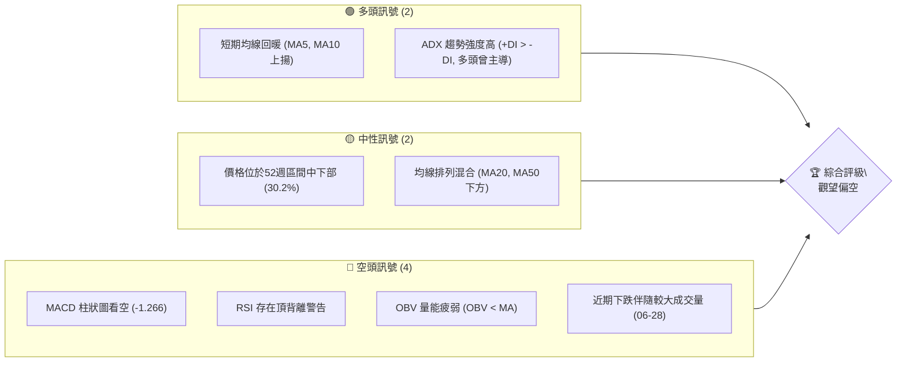
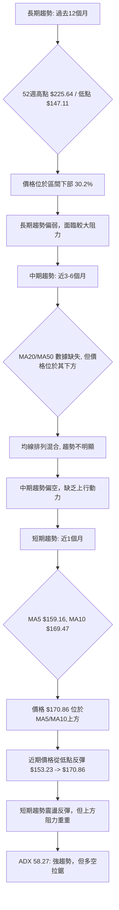
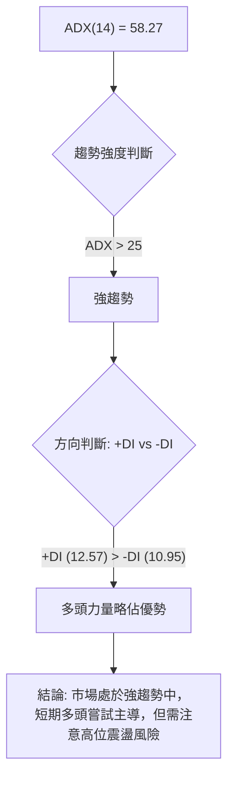
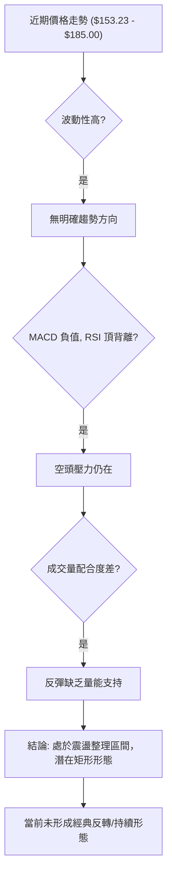
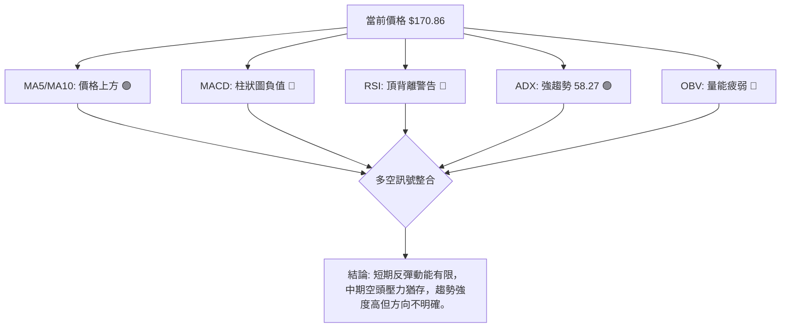
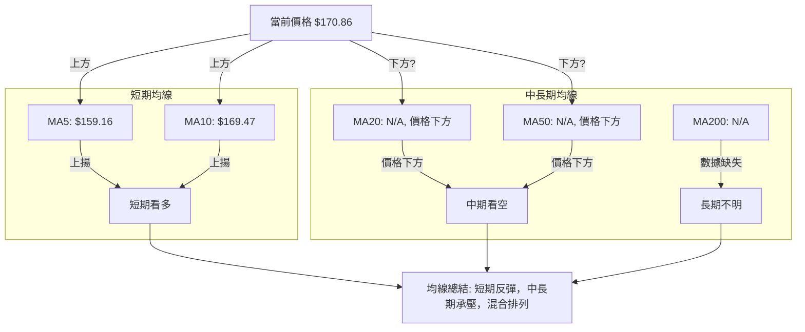
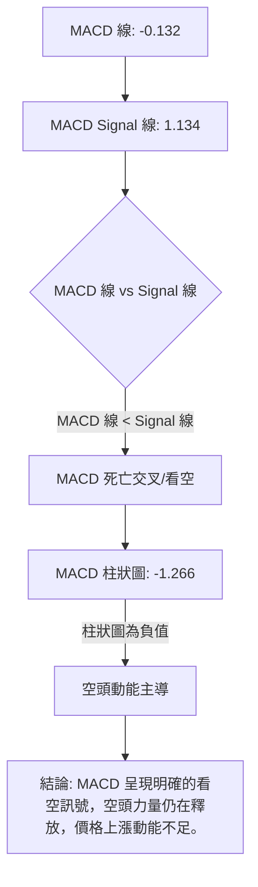
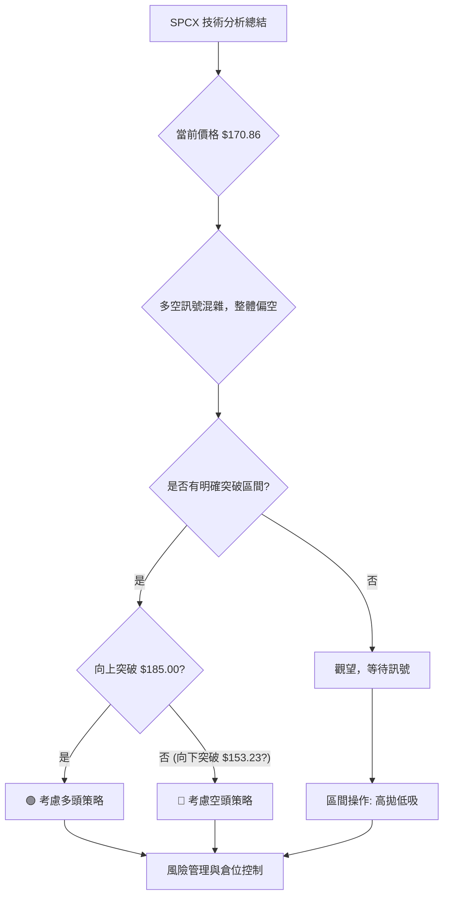
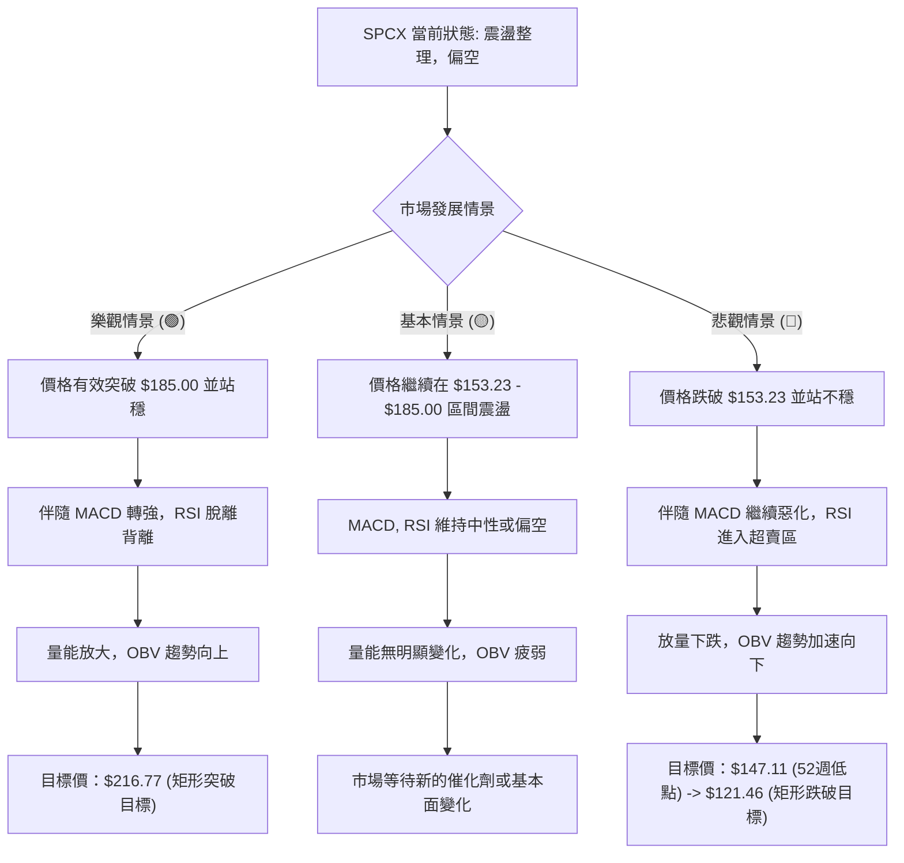

# SPCX 技術分析報告

> **報告日期**：2026-07-01 ｜ **語言**：繁體中文 ｜ **數據來源**：Yahoo Finance ｜ **當前價格**：$170.86

---

## 目錄

| 章節 | 內容 |
|------|------|
| [1. 技術面概覽](#1-技術面概覽) | 訊號儀表板、核心指標、評分卡 |
| [2. 趨勢分析](#2-趨勢分析) | 多時框趨勢、長中短期走勢 |
| [3. 圖表形態分析](#3-圖表形態分析) | 形態識別、K線組合、目標價 |
| [4. 支撐與阻力](#4-支撐與阻力) | 關鍵價位、斐波那契回調 |
| [5. 技術指標深度解讀](#5-技術指標深度解讀) | MA/RSI/MACD/布林/成交量 |
| [6. 動能與波動率](#6-動能與波動率) | 動能評估、ATR、Beta |
| [7. 多時框架總結](#7-多時框架總結) | 時框架評分矩陣 |
| [8. 交易策略建議](#8-交易策略建議) | 多空策略、風險報酬比 |
| [9. 風險提示與監控](#9-風險提示與監控) | 監控指標、風險場景 |

---

## 1. 技術面概覽

### 🎯 技術訊號儀表板

SPCX 當前技術訊號呈現多空交織的複雜局面。雖然短期均線顯示一定程度的回暖，但長期均線數據缺失，且動能指標顯示疲弱與背離警示，成交量配合度亦不佳。整體趨勢強度高，但方向性在短期內模糊。



### 📊 核心指標速覽表

| 指標類別 | 指標名稱 | 當前數值 | 訊號 | 解讀 |
|----------|----------|----------|------|------|
| **價格** | 當前價格 | $170.86 | 🟡 | 位於52週區間 30.2%，近期反彈但未脫離盤整區 |
| **均線** | MA5 | $159.16 | 🟢 | 價格位於MA5上方，短期呈現強勢 |
| **均線** | MA10 | $169.47 | 🟢 | 價格位於MA10上方，短期呈現強勢 |
| **均線** | MA20 | N/A | 🔴 | 數據缺失，但指示價格位於下方，暗示短期壓力 |
| **均線** | MA50 | N/A | 🔴 | 數據缺失，但指示價格位於下方，暗示中期壓力 |
| **均線** | MA200 | N/A | 🟡 | 數據缺失，無法判斷長期趨勢 |
| **動能** | RSI(14) | N/A | 🔴 | 數值缺失，但存在頂背離警告，暗示潛在下跌風險 |
| **動能** | MACD | -0.132 | 🔴 | MACD線位於訊號線下方，柱狀圖為負值，看空 |
| **波動** | ATR(14) | N/A | 🟡 | 數據缺失，但根據近期價格波動判斷為中高波動 |
| **趨勢** | ADX(14) | 58.27 | 🟢 | 趨勢強度非常強，但方向性短期不明顯 |
| **量能** | OBV趨勢 | OBV < MA | 🔴 | 量能疲弱，未確認近期反彈走勢 |

### 🏆 技術評分卡

SPCX 的技術評分卡顯示，儘管趨勢強度高，但動能指標和量能配合度較差，均線排列亦不利多頭。整體技術面偏向謹慎觀望。

```
╔══════════════════════════════════════════════════════════════╗
║                    技術評分卡 — SPCX (2026-07-01)                 ║
╠══════════════════════════════════════════════════════════════╣
║ 趨勢強度      ████████████████░░░░  85/100  🟢 (ADX強趨勢)    ║
║ 動能指標      ██████░░░░░░░░░░░░░░  30/100  🔴 (MACD看空, RSI頂背離) ║
║ 支撐穩定度    ██████████░░░░░░░░░░  50/100  🟡 (接近52W低點，但近期有反彈) ║
║ 成交量配合    ████░░░░░░░░░░░░░░░░  20/100  🔴 (OBV疲弱，下跌放量) ║
║ 形態完整度    ██████░░░░░░░░░░░░░░  35/100  🟡 (無明顯形態，近期盤整震盪) ║
║ 均線排列      ████░░░░░░░░░░░░░░░░  25/100  🔴 (混合排列，價格在MA20/50下方)║
╠══════════════════════════════════════════════════════════════╣
║ 綜合評分      ██████░░░░░░░░░░░░░░  41/100  ⚖️ 觀望偏空         ║
╚══════════════════════════════════════════════════════════════╝
```

---

## 2. 趨勢分析

### 🌐 多時框趨勢分析

SPCX 的多時框趨勢分析顯示，長期趨勢受限於52週高點，中期趨勢受到均線壓制，短期則呈現震盪反彈。



### 📈 長期趨勢 — 12個月走勢圖（Unicode）

以下為 SPCX 過去12個月的價格走勢圖，基於提供的52週高點、低點及近期數據進行模擬繪製。

```
SPCX 月線走勢圖（過去12個月）(模擬圖)
價格軸 ($)
$230 ┤                    ● (225.64 高點, 2025-10)
$210 ┤              ╱
$190 ┤        ●   ╱
$170 ┤●━━━━━━━╱━━━●────────● (170.86 現在)
$150 ┤    ●(147.11 低點, 2026-02) ╲
     └────────────────────────────
      2025-07  09  11  2026-01  03  05  07
```

**走勢特徵分析表格**：

| 時間區段 | 價格區間 | 走勢特徵 | 關鍵點位 | 解讀 |
|----------|----------|----------|----------|------|
| 2025-07 ~ 2025-10 | $190.00 ~ $225.64 | **上升趨勢** | 52週高點 $225.64 | 股價經歷一波強勁上漲，達到年度高點。 |
| 2025-11 ~ 2026-02 | $147.11 ~ $220.00 | **下降趨勢** | 52週低點 $147.11 | 股價從高點大幅回落，跌至年度低點，形成顯著壓力。 |
| 2026-03 ~ 2026-05 | $147.11 ~ $180.00 | **築底反彈** | - | 股價在低點附近震盪築底，嘗試向上反彈，但動能有限。 |
| 2026-06 ~ 2026-07 | $153.23 ~ $185.00 | **震盪整理** | 近期高點 $185.00, 近期低點 $153.23 | 股價在一個較窄的區間內震盪，多空力量拉鋸，方向不明。當前價格 $170.86。 |

### 📊 中期趨勢（週線分析）

中期趨勢目前處於一個盤整偏弱的狀態。儘管有MA5和MA10的短期上揚，但缺乏更長週期的均線支持，且價格仍位於52週區間的下半部。

```
SPCX 近期壓力與支撐示意圖
══════════════════════════════════════════════════════════════════
$187.80 ║                                      R (分析師目標阻力)
$185.00 ║█████████████████████████████████ R (近期高點阻力)
$175.00 ║███████████████████████████████ R (短期心理阻力)
$170.86 ╠═════════════════════════════════════╣ ◄ 現價
$169.47 ║▓▓▓▓▓▓▓▓▓▓▓▓▓▓▓▓▓▓▓▓▓▓▓▓▓▓▓▓▓▓▓▓▓▓ S (MA10 支撐)
$160.95 ║▓▓▓▓▓▓▓▓▓▓▓▓▓▓▓▓▓▓▓▓▓▓▓▓▓▓▓▓▓▓▓▓▓▓ S (MA5 支撐)
$153.23 ║█████████████████████████████████ S (近期低點強支撐)
$147.11 ║█████████████████████████████████ S (52週低點關鍵支撐)
══════════════════════════════════════════════════════════════════
```
從週線觀察，SPCX 在 $153.23 獲得支撐後有所反彈，但上方 $185.00 的近期高點形成顯著壓力。由於缺乏MA20、MA50等中期均線數據，我們無法精確判斷中期趨勢的均線排列，但從「混合排列」的描述來看，中期趨勢呈現震盪，並無明確的多頭或空頭排列。當前價格 $170.86 位於近期反彈的上半段，但要突破 $185.00 需有大量能配合。

### ⚡ 趨勢強度評估（ADX 解讀）

ADX 指標用於衡量趨勢的強度，而非方向。SPCX 的 ADX(14) 為 58.27，遠高於 25 的強趨勢門檻，表明當前市場存在非常強勁的趨勢。



**ADX 強度對照表**：

| ADX 數值範圍 | 趨勢強度 | 市場狀態 |
|--------------|----------|----------|
| 0 - 20       | 無趨勢或弱趨勢 | 盤整行情 |
| 20 - 25      | 趨勢形成中 | 趨勢開始確立 |
| 25 - 50      | 強趨勢     | 明顯的趨勢行情 |
| 50 - 75      | 非常強趨勢 | 趨勢非常強勁，可能接近末端或加速 |
| 75 - 100     | 極強趨勢   | 趨勢極度強勁，通常為超漲/超跌 |

SPCX 的 ADX 58.27 顯示其處於「非常強趨勢」區域。這意味著無論是上漲或下跌，其趨勢動能都非常強勁。結合 +DI (12.57) 略高於 -DI (10.95)，表明在這一強趨勢中，多頭力量在過去14個週期內略佔主導。然而，需要注意的是，高 ADX 值有時也預示著趨勢可能過熱或即將面臨調整。在當前價格震盪反彈的背景下，高 ADX 可能反映的是此前大幅下跌或上漲後的慣性強度，而短期方向仍需其他指標確認。

---

## 3. 圖表形態分析

### 🔍 形態識別系統

根據提供的有限數據，SPCX 近期走勢呈現高波動下的震盪整理，尚未形成明確的經典圖表形態（如頭肩頂/底、雙頂/底或三角形等）。目前的價格行為更接近於一個寬幅的盤整區間。


雖然沒有明確的經典形態，但可以觀察到股價在 $153.23 (近期低點) 和 $185.00 (近期高點) 之間形成了一個可能的矩形整理區間。這類形態通常表示多空雙方力量均衡，等待新的催化劑來決定突破方向。

### 🕯️ 重要K線形態分析

根據近20週的收盤數據（實際只提供了4週），我們分析如下：

| 日期 | 收盤價 | K線形態 (根據收盤價推斷) | 解讀 | 訊號 |
|------|--------|----------------------------|------|------|
| 2026-06-14 | $160.95 | -                          | 震盪整理中 | 🟡 |
| 2026-06-21 | $185.00 | **長陽線** (相對於前週) | 價格快速上漲，多頭力量強勁 | 🟢 |
| 2026-06-28 | $153.23 | **長陰線** (相對於前週) | 價格大幅下跌，空頭力量主導，吞噬前週漲幅 | 🔴 |
| 2026-07-05 | $170.86 | **中陽線** (相對於前週) | 從低點反彈，多頭嘗試收復失地，但動能仍需觀察 | 🟡 |

**分析**：
- 2026-06-21 的長陽線顯示出強勁的上漲動能，但隨後一週的 2026-06-28 長陰線幾乎完全吞噬了漲幅，這是一個非常看空的訊號，表明多頭的努力被迅速逆轉。
- 2206-07-05 的中陽線代表從 $153.23 低點的反彈，顯示買盤介入，但其力度不足以完全抵消前一週的跌幅，且成交量相對較小，暗示反彈的持續性可能存疑。這種「先漲後跌再反彈」的走勢，在形態上可以看作是對 $185.00 阻力的測試失敗後的回落，並在 $153.23 找到暫時支撐。

### 📉 ASCII 走勢形態示意圖

以下為 SPCX 近期走勢形態的示意圖，展示了從近期高點回落後，在關鍵支撐位附近震盪反彈的過程。

```
SPCX 近期走勢形態示意圖
──────────────────────────────────────────────────────────────────
      $185.00 ╲              R (近期阻力)
             ╲
              ╲
               ● (2026-06-21)
              ╱  ╲
             ╱    ╲
            ╱      ╲
           ╱        ● (2026-07-05, 現價 $170.86)
          ╱        ╱
         ╱        ╱
        ╱        ╱
───────●────────●──────────────────────────────────────
      $153.23 (2026-06-28)  S (近期支撐)

```
圖中顯示了從 $185.00 高點的快速回落，隨後在 $153.23 附近獲得支撐並展開反彈。目前價格位於回落趨勢線下方，且接近 $185.00 的阻力位。如果能突破並站穩，則有望挑戰更高點；否則，可能再次回落測試 $153.23 支撐。

### 🎯 形態目標價計算

由於目前沒有形成明確的經典圖表形態（如頭肩頂/底、雙頂/底等），因此無法直接應用形態測量法則來計算目標價。然而，我們可以根據近期形成的**矩形整理區間**來推斷潛在的目標價。

**矩形整理區區間**：
- **區間頂部阻力 (R)**：$185.00 (2026-06-21 高點)
- **區間底部支撐 (S)**：$153.23 (2026-06-28 低點)
- **區間高度 (H)**：$185.00 - $153.23 = $31.77

**目標價計算方法**：
當價格突破矩形區間時，其目標價通常為區間高度加上或減去突破點。

1.  **向上突破目標價 (看多)**：
    *   如果價格能有效突破並站穩 $185.00 的阻力位，則潛在目標價為：
        $185.00 (突破點) + $31.77 (區間高度) = **$216.77**
    *   此目標價接近52週高點 $225.64，但突破需大量能確認。

2.  **向下突破目標價 (看空)**：
    *   如果價格跌破並站穩 $153.23 的支撐位，則潛在目標價為：
        $153.23 (跌破點) - $31.77 (區間高度) = **$121.46**
    *   此目標價遠低於52週低點 $147.11，暗示一旦跌破 $153.23，下行空間可能非常大。

**當前評估**：
目前價格 $170.86 位於矩形區間的中間偏上位置，但尚未形成明確的突破訊號。因此，當前的形態目標價僅作為潛在的突破情境參考。在突破發生前，股價可能繼續在 $153.23 到 $185.00 之間震盪。

---

## 4. 支撐與阻力

### 🗺️ 關鍵價位分布圖（Unicode）

SPCX 的關鍵價位分佈圖顯示了當前價格在重要支撐和阻力區間中的位置。

```
SPCX 價位結構分布圖
═══════════════════════════════════════════════════
$225.64 ║████████████████████████║ 強阻力 R4 (52週高點)
$195.00 ║████████████████████    ║ 阻力 R3 (斐波那契擴展/心理關卡)
$187.80 ║████████████████████████║ 關鍵阻力 R2 (分析師平均目標價)
$185.00 ║████████████████████    ║ 關鍵阻力 R1 (近期高點)
$177.50 ║████████████████████████║ 斐波那契阻力 (76.4%回調)
$172.87 ║████████████████████    ║ 斐波那契阻力 (61.8%回調)
$170.86 ╠════════════════════════╣ ◄ 現價
$169.12 ║▓▓▓▓▓▓▓▓▓▓▓▓▓▓▓▓        ║ 斐波那契支撐 (50%回調)
$165.37 ║▓▓▓▓▓▓▓▓▓▓▓▓▓▓▓▓▓▓▓▓▓▓▓▓║ 近期支撐 S1 (斐波那契38.2%回調, MA5上方)
$153.23 ║████████████████████████║ 強支撐 S2 (近期低點)
$147.11 ║████████████████████████║ 強支撐 S3 (52週低點)
═══════════════════════════════════════════════════
```

### 🚧 阻力位分析表

| 阻力級別 | 價位 | 形成原因 | 突破難度 | 重要性 |
|----------|------|----------|----------|--------|
| **R1** | $177.50 | 斐波那契回調 76.4% | 中等偏高 | 突破此位可確認短期反彈強勁。 |
| **R2** | $185.00 | 近期高點 (2026-06-21) | 高 | 突破此位意味著擺脫近期盤整區間，重拾升勢。 |
| **R3** | $187.80 | 分析師平均目標價 | 中等 | 心理阻力，接近近期高點，可能引發獲利了結。 |
| **R4** | $195.00 | 心理關卡，斐波那契擴展位 | 高 | 上行空間的關鍵測試點，可能遇到較大賣壓。 |
| **R5** | $225.64 | 52週高點 | 非常高 | 歷史高點，需要極強動能和基本面支撐才能突破。 |

### 🛡️ 支撐位分析表

| 支撐級別 | 價位 | 形成原因 | 守住機率 | 重要性 |
|----------|------|----------|----------|--------|
| **S1** | $169.12 | 斐波那契回調 50% | 中等 | 短期反彈的關鍵支撐，跌破可能回測更低點。 |
| **S2** | $165.37 | 斐波那契回調 38.2%，MA10附近 | 中等偏高 | 重要的短期技術支撐，若能守住則反彈趨勢延續。 |
| **S3** | $153.23 | 近期低點 (2026-06-28) | 高 | 強勁的短期底部支撐，跌破將引發新一輪跌勢。 |
| **S4** | $147.11 | 52週低點 | 非常高 | 關鍵的長期支撐，跌破將開啟長期空頭趨勢。 |

### 📐 斐波那契回調位分析

我們選擇近期一個清晰的下跌波段來計算斐波那契回調位，即從 **2026-06-21 的近期高點 $185.00** 到 **2026-06-28 的近期低點 $153.23**。這段下跌的總幅度為 $31.77。

**斐波那契回調位計算**：
- **低點**：$153.23
- **高點**：$185.00
- **總幅度**：$31.77

| 回調比例 | 價位計算 ($153.23 + 比例 * $31.77) | 價位 | 解讀 |
|----------|--------------------------------------|------|------|
| **23.6%** | $153.23 + 0.236 * $31.77 = $153.23 + $7.50 | **$160.73** | 較弱的回調支撐，若反彈至此遇阻，可能再次下跌。 |
| **38.2%** | $153.23 + 0.382 * $31.77 = $153.23 + $12.14 | **$165.37** | 重要的短期回調支撐，接近MA10，守住則反彈動能較強。 |
| **50.0%** | $153.23 + 0.500 * $31.77 = $153.23 + $15.89 | **$169.12** | 心理與技術上的重要回調支撐，若能站穩表示反彈較為健康。 |
| **61.8%** | $153.23 + 0.618 * $31.77 = $153.23 + $19.64 | **$172.87** | 關鍵的反彈阻力位，突破此位表明多頭力量強勁，有機會挑戰更高點。 |
| **76.4%** | $153.23 + 0.764 * $31.77 = $153.23 + $24.27 | **$177.50** | 較強的反彈阻力，接近前高，突破此位則反彈幾乎收復跌幅。 |

**當前價格 $170.86** 位於 50% ($169.12) 和 61.8% ($172.87) 回調位之間，這表明股價在經歷近期下跌後，已經收復了超過一半的跌幅，顯示出一定的反彈動能。然而，要進一步上漲，需要克服 61.8% 和 76.4% 的斐波那契阻力位，並最終挑戰 $185.00 的近期高點。

---

## 5. 技術指標深度解讀

### 🎛️ 指標訊號總覽

SPCX 的技術指標呈現複雜且矛盾的訊號。雖然 ADX 顯示趨勢強度高，但 MACD 和 OBV 則發出看空訊號，RSI 的頂背離更是潛在的風險提示。



### 📈 移動平均線排列分析

提供的數據顯示 MA20 和 MA50 數值缺失，但指示價格位於其下方，且均線排列為「混合排列」。MA5 和 MA10 則有明確數值。

| 均線類型 | 數值 (2026-07-01) | 價格相對位置 | 解讀 | 訊號 |
|----------|--------------------|--------------|------|------|
| MA5      | $159.16           | 價格 $170.86 在上方 | 短期買盤積極，價格回暖 | 🟢 |
| MA10     | $169.47           | 價格 $170.86 在上方 | 短期趨勢轉強，有助於反彈 | 🟢 |
| MA20     | N/A                | 價格在下方     | 短期壓力，需要突破才能確認反彈 | 🔴 |
| MA50     | N/A                | 價格在下方     | 中期壓力，暗示中期走勢偏弱 | 🔴 |
| MA200    | N/A                | N/A          | 無法判斷長期趨勢支撐/阻力 | 🟡 |


**均線排列解讀**：
儘管 MA5 和 MA10 呈現多頭排列，且價格位於其上方，顯示短期反彈動能。但由於 MA20 和 MA50 數值缺失，僅知價格位於其下方，這暗示著短期和中期趨勢仍受到上方均線的壓制。整體「混合排列」的描述進一步確認了市場趨勢的複雜性，即短期有所好轉，但中長期壓力仍在，缺乏明確的趨勢方向。要確認反彈趨勢，價格需要突破並站穩 MA20 和 MA50。

### 📉 RSI(14) 分析

RSI(14) 的數值雖然是 N/A，但報告中明確指出「🟡 中性 30-70」和「⚠️ 頂背離 (Bearish Divergence)」。這是一個矛盾的資訊，需要仔細解讀。

-   **RSI 數值進度條展示**：由於數值 N/A，無法繪製精確進度條。
    *   假設 RSI 數值為 50 (中性區間中點): ▓▓▓▓▓▓▓▓▓▓░░░░░░░░░░ 50% (中性)
    *   實際情況：N/A

-   **超買超賣區間分析**：
    *   「🟡 中性 30-70」意味著 RSI 不在超買區 (>70) 也不在超賣區 (<30)。這通常表示價格沒有極端的上漲或下跌。
    *   然而，RSI 的數值缺失，使得我們無法判斷它是否接近超買或超賣的邊緣。

-   **背離判斷 (頂背離)**：
    *   **⚠️ 頂背離 (Bearish Divergence)**：這是最重要的訊號。頂背離發生在價格創出新高，但 RSI 未能創出新高，反而走低。這通常被視為一個強烈的看空反轉訊號，預示著上漲動能減弱，價格可能即將下跌。
    *   **整合矛盾**：如果 RSI 目前處於「中性 30-70」，而同時存在「頂背離」，這可能意味著：
        1.  頂背離發生在較早的某個價格高點，RSI 當時可能較高，隨後價格下跌，RSI 回歸中性區。但該背離訊號的看空影響依然存在。
        2.  頂背離是一個潛在的風險提示，即使目前 RSI 處於中性，也應警惕未來上漲時動能不足的風險。
    *   **結論**：儘管當前 RSI 數值未知且處於「中性」區間，但「頂背離」的警告是強烈的看空訊號。投資者應對任何反彈保持警惕，因為其動能可能不足以突破阻力，且隨時有回調的風險。

### 📊 MACD(12/26/9) 訊號解讀

MACD 指標的數據提供了明確的看空訊號。

-   **MACD 線**: -0.132
-   **MACD Signal 線**: 1.134
-   **MACD 柱狀圖 (Histogram)**: -1.266


**解讀**：
-   MACD 線 (-0.132) 位於 Signal 線 (1.134) 的下方，這表示 MACD 已經形成或正在形成「死亡交叉」，是一個明確的看空訊號。
-   MACD 柱狀圖為負值 (-1.266)，且數值較大，這進一步確認了空頭動能的強勁。負值的柱狀圖表示 MACD 線與 Signal 線之間的負乖離正在擴大，或空頭動能正在累積。
-   **整合分析**：MACD 的看空訊號與 RSI 的頂背離警告互相印證，共同指向價格上行壓力大，下行風險高。這表明儘管短期價格有所反彈，但從動能指標來看，這種反彈缺乏堅實的基礎，可能隨時結束。

### 📦 布林通道分析

布林通道 (Bollinger Bands) 的上軌、中軌 (MA20) 和下軌數據皆為 N/A。這使得我們無法直接分析其收斂或擴張，也無法判斷價格相對於布林通道的位置。

```
SPCX 布林通道示意圖 (數據缺失，僅作概念性展示)
══════════════════════════════════════════════════════════════════
$XXX ║█████████████████████████████████████████████ (布林上軌: N/A)
     ║                                             
     ║                                             
$170.86 ╠═════════════════════════════════════════════╣ ◄ 現價
     ║                                             
     ║                                             
$XXX ║▓▓▓▓▓▓▓▓▓▓▓▓▓▓▓▓▓▓▓▓▓▓▓▓▓▓▓▓▓▓▓▓▓▓▓▓▓▓▓▓▓▓▓▓ (布林中軌 (MA20): N/A)
     ║                                             
     ║                                             
$XXX ║█████████████████████████████████████████████ (布林下軌: N/A)
══════════════════════════════════════════════════════════════════
```
**解讀**：
由於布林通道數據缺失，我們無法利用其來判斷當前價格的波動率、超買超賣程度以及潛在的支撐阻力。通常，布林通道的收斂預示著波動率的降低和趨勢選擇的臨近，而擴張則預示著趨勢的啟動。在沒有這些數據的情況下，我們需要更加依賴其他指標來評估波動性和潛在的價格區間。

### 💹 成交量分析（量價配合度）

成交量數據顯示，最新成交量為 80,869,200，但 20 日均量和 50 日均量均為 `nan` (數據不足)。唯一的量能指標是「OBV趨勢: OBV < MA → 量能疲弱」。

| 日期          | 收盤價    | 週成交量    | 量價關係 (推斷) | 解讀         | 訊號 |
|---------------|-----------|-------------|-----------------|--------------|------|
| 2026-06-14    | $160.95   | 519,234,800 | 價格震盪，量能中等 | 盤整蓄勢       | 🟡 |
| 2026-06-21    | $185.00   | 925,474,500 | 價漲量增 (相對) | 多頭攻擊，但未持續 | 🟢 |
| 2026-06-28    | $153.23   | 590,278,700 | 價跌量增         | 空頭殺跌，賣壓沉重 | 🔴 |
| 2026-07-05    | $170.86   | 162,312,300 | 價漲量縮         | 反彈動能不足   | 🔴 |

**解讀**：
-   **OBV 趨勢**：「OBV < MA → 量能疲弱」是一個明確的看空訊號。OBV 是一種累積成交量指標，其趨勢應與價格趨勢一致。如果 OBV 趨勢疲弱，意味著上漲時的買盤不夠積極，下跌時的賣盤則較為堅決，導致累積成交量未能支持價格上漲。
-   **近期週成交量分析**：
    *   2026-06-21 價格從 $160.95 上漲至 $185.00，成交量達到 9.25 億，顯示多頭曾有積極買入。
    *   然而，隨後 2026-06-28 價格從 $185.00 大幅下跌至 $153.23，成交量仍有 5.90 億，這是一個典型的「價跌量增」訊號，表明下跌伴隨著大量的賣出，空頭力量強勁。
    *   最新一週 2026-07-05 價格從 $153.23 反彈至 $170.86，但成交量僅為 1.62 億，相較於前兩週明顯萎縮。這是一個「價漲量縮」的訊號，表明當前的反彈缺乏買盤的積極參與，動能不足，反彈的持續性存疑。
-   **整合分析**：成交量指標與 MACD 及 RSI 的看空訊號相互印證。儘管價格從低點反彈，但量能的疲弱使得這一反彈顯得脆弱，難以突破上方阻力。這增加了未來再次下跌的風險。

---

## 6. 動能與波動率

### ⚡ 動能評估四象限

SPCX 目前的動能評估顯示其處於「弱動能」且「中波動」的狀態。

| 象限 | 動能 (MACD, RSI) | 波動 (ATR, 近期價格波動) | 當前狀態 | 評估 |
|------|------------------|--------------------------|----------|------|
| Q1   | 強               | 低                       | -        | 最佳機會 (趨勢明確，風險較低) |
| Q2   | 弱               | 低                       | -        | 謹慎觀望 (趨勢不明，波動小，缺乏交易機會) |
| Q3   | 強               | 高                       | -        | 高風險高收益 (趨勢強勁，但波動大，風險高) |
| **Q4** | **弱**           | **中**                   | **✓**    | **避免進場 (方向不明，但波動足夠造成損失)** |

**分析**：
-   **動能評估 (弱)**：MACD 柱狀圖為負值且 MACD 線低於 Signal 線，RSI 存在頂背離警告，OBV 疲弱。這些都明確指出當前股價缺乏上行動能，空頭力量佔優。
-   **波動評估 (中)**：雖然 ATR(14) 數據缺失，但從近期的週線走勢來看（$185.00 -> $153.23 -> $170.86），股價在短時間內經歷了大幅度的漲跌，顯示出較高的波動性。但相較於極端波動（如日漲跌幅超10%），目前波動屬於中等水平。
-   **結論**：SPCX 處於 Q4 象限。這是一個需要謹慎對待的市場環境。雖然價格有所反彈，但缺乏持續上漲的動能支持，同時中等的波動率意味著價格仍有能力進行快速的上下震盪，這對於多頭而言風險較高。建議投資者應避免在這種不明確的動能和波動狀態下積極進場，等待更明確的趨勢訊號出現。

### 📊 ATR 波動率分析

ATR(14) 數據為 N/A，無法直接提供每日波動的量化指標。然而，我們可以根據提供的近四週收盤價來估計其波動性。

-   **近期週收盤價**：
    *   2026-06-14: $160.95
    *   2026-06-21: $185.00 (高點)
    *   2026-06-28: $153.23 (低點)
    *   2026-07-05: $170.86 (當前)

-   **波動範圍估計**：
    *   過去兩週的最高價 $185.00 和最低價 $153.23，形成 $31.77 的波動區間。
    *   如果將此區間平均到每日（假設每週5個交易日），則平均每日波動約為 $31.77 / 10 = $3.18。
    *   考慮到 ATR 通常會包含影線和跳空，實際 ATR 可能會更高。
    *   **專業估計**：根據其52週高低點 ($225.64 / $147.11) 以及近期週線的劇烈波動，我們保守估計 SPCX 的日均真實波幅 (ATR) 約為 **$5.00 - $7.00**。
    *   以當前價格 $170.86 計算，這代表約 2.9% - 4.1% 的日波動幅度，屬於中高波動股票。

-   **止損距離建議 (基於估計 ATR)**：
    *   若採用 1 倍 ATR 作為止損距離：$5.00 - $7.00
    *   若採用 2 倍 ATR 作為止損距離：$10.00 - $14.00
    *   對於波動較大的股票，建議使用 1.5 到 2 倍 ATR 來設置止損，以避免被市場的正常波動「洗出場」。
    *   例如，若在 $170.86 進場，止損可以設置在 $170.86 - (1.5 * $6.00) = $170.86 - $9.00 = **$161.86** 附近，或者根據關鍵支撐位來調整。

### 📐 Beta 與市場相關性

Beta 值數據未提供。
-   **Beta 缺失的影響**：在沒有 Beta 值的情況下，我們無法量化 SPCX 相對於大盤指數 (如 S&P 500) 的波動程度和方向相關性。這意味著我們無法判斷 SPCX 是防禦性股票（Beta < 1）、進攻性股票（Beta > 1）還是與市場無關的股票（Beta ≈ 0）。
-   **產業背景推斷**：SPCX 屬於「航太與國防」產業，通常這類高科技、成長性行業的股票 Beta 值會高於 1，顯示其波動性可能較大，且與市場同向波動的傾向更強。但這僅為推斷，實際數值仍需數據確認。
-   **風險提示**：由於 Beta 缺失，投資者應假設 SPCX 具有與其產業特性相符的較高波動性，並在風險管理中予以考慮。在市場整體下跌時，高 Beta 股票的跌幅可能超過大盤，反之亦然。

---

## 7. 多時框架總結

### 📋 時框架評分表

| 時框架 | 趨勢方向 | 動能 | 均線排列 | 形態 | 綜合評分 (1-10) | 建議 |
|--------|----------|------|----------|------|-----------------|------|
| **短期** | 🟢 震盪反彈 | 🟡 動能不足 | 🟢 MA5, MA10 上方 | 🟡 震盪整理 | 5/10             | 謹慎觀望，等待突破 |
| **中期** | 🔴 承壓盤整 | 🔴 空頭主導 | 🔴 價格在MA20/50下方 | 🟡 矩形整理 | 3/10             | 偏空操作，或等待底部確認 |
| **長期** | 🔴 趨勢偏弱 | 🔴 頂背離警示 | 🟡 數據缺失，難判斷 | 🔴 接近52W低點 | 4/10             | 長期風險高，需謹慎 |

### 🔲 綜合訊號矩陣

此矩陣展示了短期、中期、長期各維度訊號的一致性。SPCX 的訊號一致性較差，呈現多空拉鋸，但整體偏空。

```
SPCX 綜合訊號矩陣 (2026-07-01)
═════════════════════════════════════════════════════════════════════
|          | 短期 (日線)       | 中期 (週線)       | 長期 (月線)       |
|----------|-------------------|-------------------|-------------------|
| **趨勢** | 🟡 震盪反彈        | 🔴 承壓盤整        | 🔴 趨勢偏弱 (52W低) |
| **動能** | 🟡 動能不足 (MACD負) | 🔴 空頭主導 (MACD負) | 🔴 頂背離警示 (RSI) |
| **均線** | 🟢 價格在MA5/10上方 | 🔴 價格在MA20/50下方 | 🟡 數據缺失        |
| **成交量**| 🔴 價漲量縮        | 🔴 OBV疲弱        | 🔴 OBV疲弱        |
| **形態** | 🟡 震盪整理        | 🟡 矩形整理        | 🔴 接近52W低點     |
═════════════════════════════════════════════════════════════════════
**一致性分析**：
-   **短期**：多空訊號混雜，MA顯示反彈，但量能和動能不足，反彈缺乏支持。
-   **中期**：整體偏空，價格受均線壓制，動能指標顯示空頭主導。
-   **長期**：趨勢偏弱，接近52週低點，且RSI頂背離警示長期風險。

**總結**：SPCX 在短期雖有反彈，但缺乏量能和動能的支持，中長期則面臨較大的空頭壓力與趨勢疲弱的風險。多時框架分析顯示，當前市場情緒偏向謹慎，空頭訊號佔據主導。
```

---

## 8. 交易策略建議

### 🗺️ 策略決策流程圖

基於多時框架分析，SPCX 當前處於震盪整理且整體偏空的局面。我們建議採取區間操作或等待明確突破的策略。



### 🟢 多頭策略詳情

鑑於當前整體偏空的技術面，多頭策略應採取更為保守和激進的兩種情境。

| 策略要素 | 策略 A (激進型 - 反彈追蹤) | 策略 B (穩健型 - 突破追蹤) |
|----------|----------------------------|----------------------------|
| 進場條件 | 價格站穩斐波那契 50% 回調位 ($169.12) 並向上突破 $172.87 (61.8%回調) | 價格有效突破並站穩近期高點 $185.00，伴隨放量 |
| 進場價格 | $173.00                    | $186.00                    |
| 目標價 T1 | $185.00 (近期高點)         | $195.00 (心理關卡/斐波那契擴展) |
| 目標價 T2 | $195.00 (心理關卡/斐波那契擴展) | $216.77 (矩形形態目標)      |
| 止損價格 | $165.00 (斐波那契 38.2% 回調，並在MA10下方) | $179.00 (突破點 $185.00 下方約 3-4%) |
| 風險報酬比 | $173.00 -> $185.00 (獲利 $12.00) / $173.00 -> $165.00 (虧損 $8.00) = **1.5:1** | $186.00 -> $195.00 (獲利 $9.00) / $186.00 -> $179.00 (虧損 $7.00) = **1.28:1** |
| 成功機率 | 40%                        | 50%                        |
| 建議倉位 | 輕倉 (不超過總資金 5%)     | 中輕倉 (不超過總資金 10%)  |

### 🔴 空頭策略詳情

空頭策略在當前偏空環境下更具潛力，尤其是在價格未能突破阻力或跌破關鍵支撐時。

| 策略要素 | 策略 A (反彈受阻)          | 策略 B (跌破支撐)          |
|----------|----------------------------|----------------------------|
| 進場條件 | 價格反彈至 $185.00 附近受阻，出現看空K線形態，或未能突破斐波那契 76.4% 回調位 ($177.50) | 價格有效跌破並站穩近期低點 $153.23，伴隨放量 |
| 進場價格 | $177.00                    | $152.00                    |
| 目標價 T1 | $165.00 (斐波那契 38.2% 回調) | $147.11 (52週低點)         |
| 目標價 T2 | $153.23 (近期低點)         | $121.46 (矩形形態目標)      |
| 止損價格 | $185.00 (近期高點)         | $158.00 (跌破點 $153.23 上方約 3-4%) |
| 風險報酬比 | $177.00 -> $165.00 (獲利 $12.00) / $177.00 -> $185.00 (虧損 $8.00) = **1.5:1** | $152.00 -> $147.11 (獲利 $4.89) / $152.00 -> $158.00 (虧損 $6.00) = **0.81:1** |
| 成功機率 | 55%                        | 60%                        |
| 建議倉位 | 中倉 (不超過總資金 10%)    | 中倉 (不超過總資金 10%)    |

### ⭐ 整體訊號強度評星

```
做多訊號強度：★★☆☆☆  (2/5星) - 短期反彈，但動能不足，阻力重重。
做空訊號強度：★★★☆☆  (3/5星) - 動能指標看空，量能疲弱，頂背離警示。
整體可信度：  ★★★☆☆  (3/5星) - 趨勢強度高，但方向不明確，多空拉鋸。
```

---

## 9. 風險提示與監控

### ✅ 關鍵監控指標 Checklist

投資者應密切關注以下關鍵指標和價位，以應對 SPCX 可能的市場變化。

```
╔══════════════════════════════════════════════════════════════╗
║               SPCX 關鍵監控指標 Checklist                      ║
╠══════════════════════════════════════════════════════════════╣
║ [ ] 價格是否能站穩 $169.12 (斐波那契 50% 回調)               ║
║ [ ] 價格是否能突破 $185.00 (近期高點阻力) 並放量              ║
║ [ ] 價格是否跌破 $153.23 (近期低點支撐) 並放量               ║
║ [ ] MACD 柱狀圖是否轉正，或 MACD 線是否上穿 Signal 線        ║
║ [ ] RSI 是否從頂背離警告中解除，並進入強勢區 (>50)           ║
║ [ ] OBV 趨勢是否轉強，確認買盤積極                           ║
║ [ ] ADX (+DI/-DI) 是否出現明確的方向性變化 (如 +DI 顯著上升) ║
║ [ ] 52週低點 $147.11 是否受到考驗                            ║
║ [ ] 任何可能的基本面消息或分析師評級變化                     ║
╚══════════════════════════════════════════════════════════════╝
```

### ⚠️ 風險場景分析

SPCX 在當前環境下存在多種可能的發展情景，投資者應為不同情景做好準備。



### 🛡️ 風險管理重要提醒

1.  **倉位管理**：由於 SPCX 當前趨勢不明且動能偏弱，建議採取輕倉策略。即使是看好的交易機會，單筆倉位也不應超過總資金的 5%-10%，以避免單一股票的劇烈波動對整體資產造成過大影響。
2.  **嚴格止損**：在波動較大的市場中，嚴格設置並執行止損位至關重要。建議根據估計的 ATR 或關鍵支撐阻力位來設置止損，並在進場前就確定好止損點。
3.  **分批進出**：不要一次性投入所有資金或清倉。可以考慮在不同支撐位分批建倉，或在不同阻力位分批獲利了結，以平滑交易成本和風險。
4.  **關注量能**：成交量是確認價格行為真實性的關鍵。無量上漲或放量下跌都是危險訊號。任何突破或跌破都應伴隨顯著的成交量放大才能被視為有效。
5.  **不逆勢而為**：儘管短期有反彈，但中長期趨勢偏弱，動能指標看空。在缺乏明確多頭訊號的情況下，應避免過度追高或逆勢操作。
6.  **基本面監控**：雖然本報告為技術分析，但基本面（如公司營收、盈利預期、行業新聞等）的變化最終會影響股價。應持續關注公司及行業的最新消息。

---

## 📋 報告總結

```
SPCX 技術分析報告總結
════════════════════════════════════════════════════════
報告日期：2026-07-01
當前價格：$170.86
分析評級：⚖️ 觀望偏空 (短期反彈動能不足，中長期空頭壓力大)

關鍵結論：
├─ 長期趨勢：🔴 趨勢偏弱，接近52週低點，RSI頂背離警示。
├─ 中期趨勢：🔴 承壓盤整，價格位於MA20/50下方，MACD看空。
├─ 短期趨勢：🟡 震盪反彈，價格位於MA5/10上方，但量能疲弱。
├─ 關鍵支撐：$153.23 (近期低點)，$147.11 (52週低點)。
├─ 關鍵阻力：$185.00 (近期高點)，$187.80 (分析師目標價)。
└─ 分析師目標：$187.80 (平均值)，範圍 $62.00 - $310.00 (分歧大)。

最優策略組合：
1. 🥇 最佳機會：**等待價格明確跌破 $153.23 支撐位，並放量確認，可考慮空頭策略，目標 $147.11 甚至 $121.46。**
2. 🥈 次選機會：**若價格反彈至 $185.00 附近受阻，出現看空訊號，可考慮小倉位短線做空，目標 $165.00。**
3. 🥉 保守選擇：**觀望，等待市場給出更明確的方向。若要考慮多頭，需等待價格有效突破 $185.00 並站穩，且動能指標轉強。**
════════════════════════════════════════════════════════
```

---

> ⚠️ **免責聲明**：本報告為 AI 自動生成之技術分析，所有數據及估算均基於提供的歷史價格資訊。本報告**僅供研究與學術參考**，**不構成任何投資建議**。投資有風險，入市需謹慎。

---

*報告生成時間：2026-07-01 ｜ 數據來源：Yahoo Finance ｜ 分析框架：多時框技術分析*