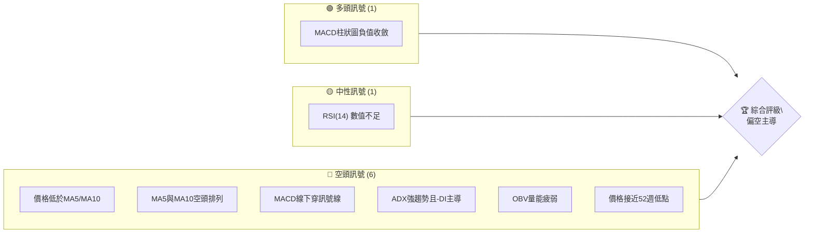
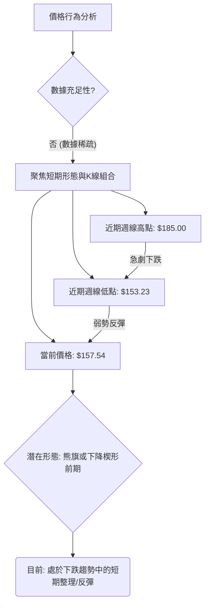
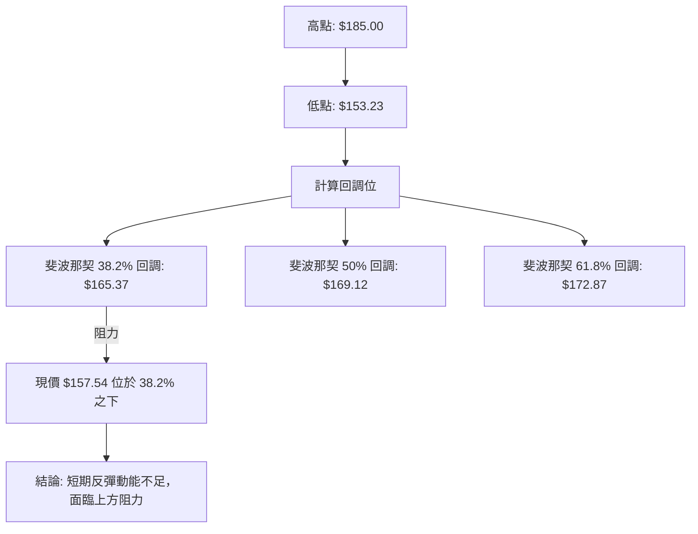
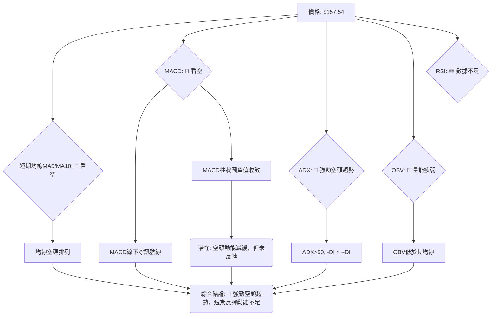
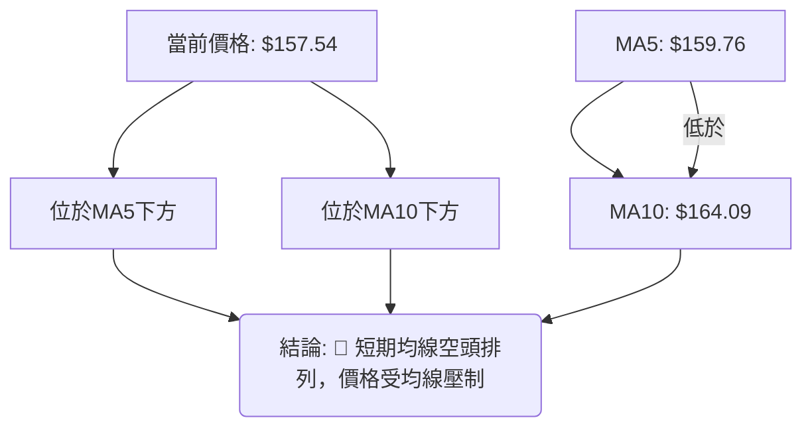
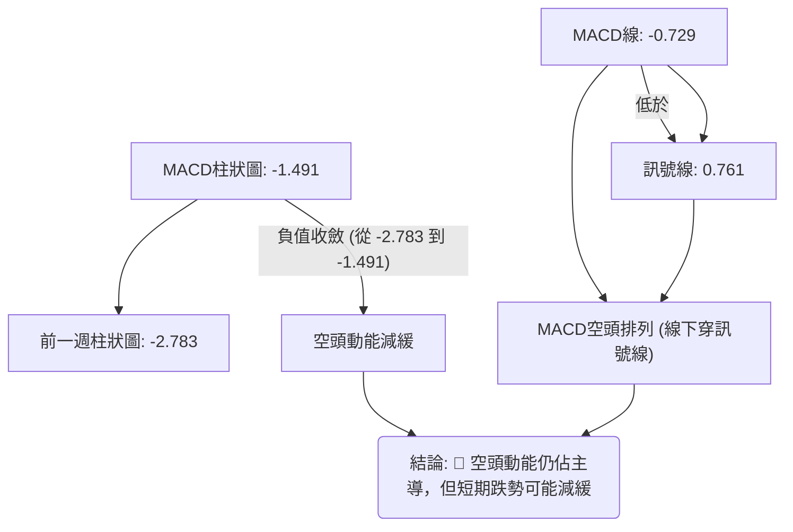
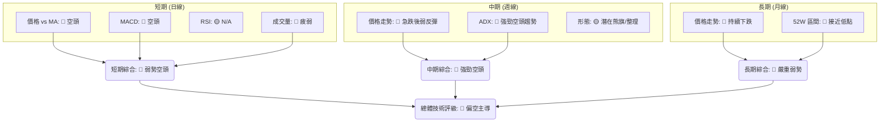
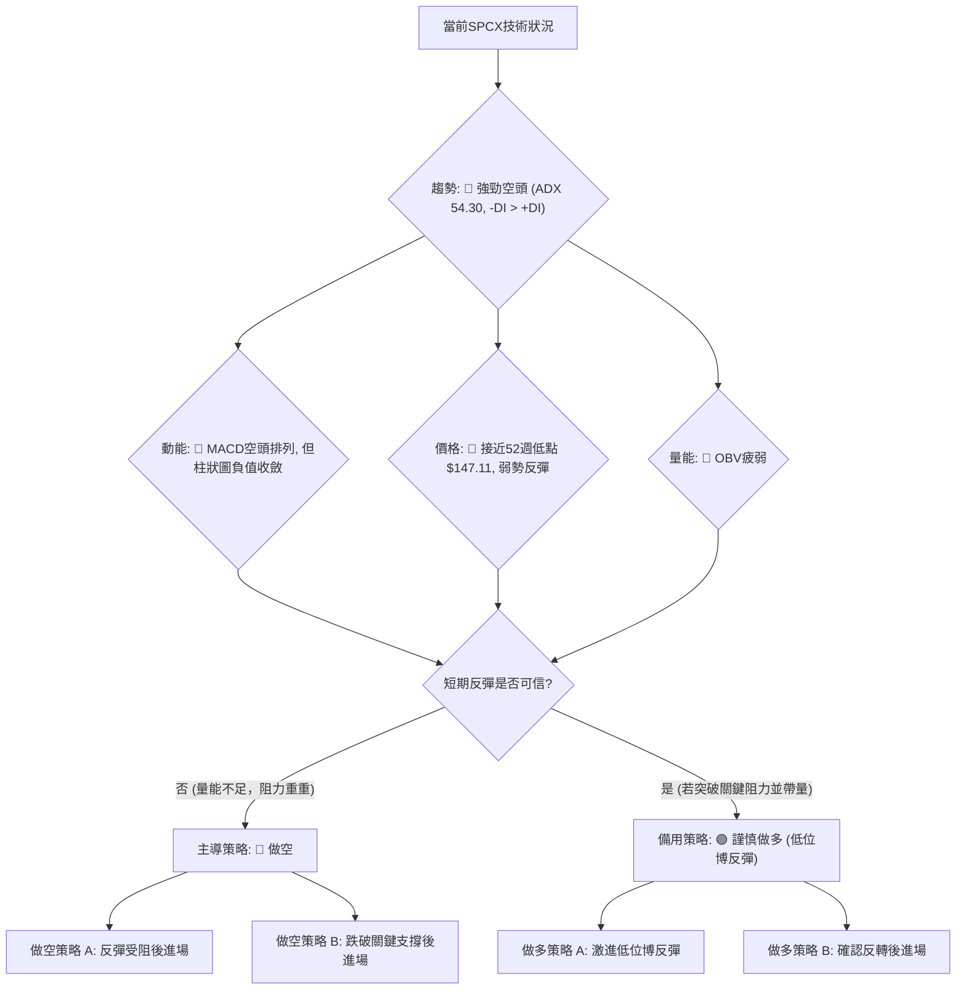
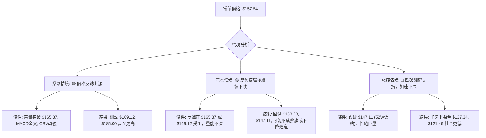

# SPCX 技術分析報告

> **報告日期**：2026-07-02 ｜ **語言**：繁體中文 ｜ **數據來源**：提供數據 ｜ **當前價格**：$157.54

---

## 目錄

| 章節 | 內容 |
|------|------|
| [1. 技術面概覽](#1-技術面概覽) | 訊號儀表板、核心指標、評分卡 |
| [2. 趨勢分析](#2-趨勢分析) | 多時框趨勢、長中短期走勢 |
| [3. 圖表形態分析](#3-圖表形態分析) | 形態識別、K線組合、目標價 |
| [4. 支撐與阻力](#4-支撐與阻力) | 關鍵價位、斐波那契回調 |
| [5. 技術指標深度解讀](#5-技術指標深度解讀) | MA/RSI/MACD/布林/成交量 |
| [6. 動能與波動率](#6-動能與波動率) | 動能評估、ATR、Beta |
| [7. 多時框架總結](#7-多時框架總結) | 時框架評分矩陣 |
| [8. 交易策略建議](#8-交易策略建議) | 多空策略、風險報酬比 |
| [9. 風險提示與監控](#9-風險提示與監控) | 監控指標、風險場景 |

---

## 1. 技術面概覽

本章節提供 SPCX 當前技術狀況的快速總覽，透過儀表板、核心指標速覽及專業評分卡，讓投資者迅速掌握其多空傾向與潛在風險。

### 🎯 技術訊號儀表板

當前市場對 SPCX 的技術訊號呈現顯著的空頭主導，儘管價格在52週低點附近出現初步反彈，但多數動能與趨勢指標仍指向下行壓力。


**解讀**：儀表板顯示，空頭訊號數量明顯多於多頭訊號，反映出 SPCX 目前處於較為弱勢的技術環境。唯一的正面跡象是 MACD 柱狀圖負值收斂，這可能暗示短期跌勢動能有所減緩，但尚未形成明確的反轉訊號。RSI 數據的缺失限制了對超買/超賣狀態的判斷。

### 📊 核心指標速覽表

| 指標類別 | 指標名稱 | 當前數值 | 訊號 | 解讀 |
|----------|----------|----------|------|------|
| **價格** | 當前價格 | $157.54 | 🔴 | 價格接近52週低點 $147.11，顯示市場情緒悲觀。 |
| **均線** | MA5 | $159.76 | 🔴 | 價格 ($157.54) 位於MA5下方，短期呈現弱勢。 |
| **均線** | MA10 | $164.09 | 🔴 | 價格 ($157.54) 位於MA10下方，短期趨勢偏空。 |
| **均線** | MA20 | N/A | 🟡 | 數據不足無法計算，無法判斷中短期趨勢。 |
| **均線** | MA50 | N/A | 🟡 | 數據不足無法計算，無法判斷中長期趨勢。 |
| **均線** | MA200 | N/A | 🟡 | 數據不足無法計算，無法判斷長期趨勢。 |
| **動能** | RSI(14) | N/A | 🟡 | 數據不足無法判斷超買/超賣狀況。 |
| **動能** | MACD | -0.729 | 🔴 | MACD線 ($ -0.729) 低於訊號線 ($ 0.761)，空頭排列。 |
| **動能** | MACD Hist | -1.491 | 🔴 | 柱狀圖為負值，但較前一週 (-2.783) 收斂，顯示空頭動能減緩。 |
| **趨勢** | ADX(14) | 54.30 | 🔴 | ADX值高於25，顯示趨勢強度強勁，但-DI主導，為強勁下跌趨勢。 |
| **趨勢** | +DI/-DI | 11.87/12.53 | 🔴 | -DI > +DI，空頭力量佔優勢。 |
| **波動** | ATR(14) | N/A | 🟡 | 數據不足無法計算，無法評估近期價格波動幅度。 |
| **成交量** | OBV趨勢 | OBV < MA | 🔴 | 成交量動能疲弱，未能確認價格反彈。 |

### 🏆 技術評分卡

本評分卡綜合各項技術指標，對 SPCX 的當前技術狀況進行量化評估。

╔══════════════════════════════════════════════════════════════════╗
║                    技術評分卡 — SPCX (2026-07-02)                  ║
╠══════════════════════════════════════════════════════════════════╣
║ 趨勢強度      ██████████████░░░░░░░░  70/100  🔴 (強勁下跌趨勢) ║
║ 動能指標      ████░░░░░░░░░░░░░░░░░░  20/100  🔴 (MACD空頭排列，RSI缺失)║
║ 支撐穩定度    ████████░░░░░░░░░░░░░░  40/100  🟡 (接近52W低點，考驗支撐)║
║ 成交量配合    ████░░░░░░░░░░░░░░░░░░  20/100  🔴 (OBV疲弱，量價背離)║
║ 形態完整度    ██████░░░░░░░░░░░░░░░░  30/100  🟡 (數據稀疏，形態不明顯)║
║ 均線排列      ██░░░░░░░░░░░░░░░░░░░░  10/100  🔴 (短期均線空頭排列)║
╠══════════════════════════════════════════════════════════════════╣
║ 綜合評分      ██████░░░░░░░░░░░░░░░░  35/100  🔴 偏空                              ║
╚══════════════════════════════════════════════════════════════════╝

**評級解讀**：SPCX 的綜合評分顯示其技術面處於偏空狀態。趨勢強度雖然高，但方向明確向下。動能指標和均線排列都呈現空頭訊號。成交量未能提供有效支撐，形態方面也因數據不足而難以判斷。整體而言，SPCX 面臨較大的下行壓力。

---

## 2. 趨勢分析

本章節將從多個時間框架深入分析 SPCX 的價格趨勢，從長期宏觀視角到短期微觀波動，以全面評估其市場走向。

### 🌐 多時框趨勢分析

SPCX 在所有可觀察的時間框架內均呈現偏空或弱勢趨勢，顯示下行壓力持續。

```mermaid
graph TD
    A["月線趨勢: 🔴 下跌"] --> B{"整體趨勢判斷"}
    B --> C["週線趨勢: 🔴 下跌後弱勢反彈"]
    C --> D["日線趨勢: 🔴 短期偏空"]
    B --> E("當前趨勢: 🔴 強勁空頭趨勢")
    E -- ADX("14"): 54.30 --> F("趨勢強度: 強")
    E -- -DI("12.53") > +DI("11.87") --> G("趨勢方向: 空頭主導")
```
**解讀**：
- **月線趨勢 (長期)**：根據提供的兩年月線數據 (2026-06: $170.86, 2026-07: $157.54)，價格呈現明顯的月度下跌，顯示長期趨勢偏空。
- **週線趨勢 (中期)**：從近四週數據來看，SPCX 在 2026-06-21 達到 $185.00 的近期高點後，於 2026-06-28 迅速跌至 $153.23，隨後反彈至 $157.54。這種「急跌後弱勢反彈」的模式通常被視為中期下跌趨勢中的調整，而非反轉。
- **日線趨勢 (短期)**：當前價格 $157.54 位於 MA5 ($159.76) 和 MA10 ($164.09) 之下，且 MA5 低於 MA10，形成了短期的空頭排列。MACD 指標也處於空頭排列，儘管柱狀圖負值收斂，但尚未轉正，顯示短期走勢仍偏空。

### 📈 長期趨勢 — 12個月走勢圖（Unicode）

**重要提示：由於提供的歷史數據極其稀疏（僅有過去兩月的月度收盤價），本圖僅能基於有限數據進行高度簡化的示意性繪製，並將52週高低點納入參考區間。實際12個月走勢可能更為複雜。**

```
SPCX 月線走勢圖（過去12個月，簡化示意）
價格軸 ($)
$225.64 ┤                                         ● (52W 高點)
        │
$200.00 ┤
        │
$175.00 ┤                      ● (2026-06: $170.86)
$157.54 ┤                                          ● (2026-07: $157.54, 當前價格)
$150.00 ┤
        │
$147.11 ┤● (52W 低點)
        └─────────────────────────────────────────────
         M1  M2  M3  M4  M5  M6  M7  M8  M9  M10 M11 M12
         (僅為示意，數據不足以精確繪製完整12個月)
```
**解讀**：從提供的有限數據來看，SPCX 在最近兩個月經歷了從 $170.86 下跌至 $157.54 的走勢。當前價格 $157.54 位於其52週高點 $225.64 和低點 $147.11 的區間內，且更接近52週低點（僅高出低點約 7.1%）。這表明長期股價表現不佳，股價正承受較大的下行壓力，並在尋求52週低點附近的支撐。

**走勢特徵分析表格**：

| 時間區間 | 起始價 | 結束價 | 漲跌幅 | 主要特徵 | 訊號 |
|----------|--------|--------|--------|----------|------|
| 52週區間 | $147.11(低) | $225.64(高) | +53.38% | 價格位於區間低端，顯示長期弱勢。 | 🔴 |
| 2026-06月 | N/A | $170.86 | N/A | 月線收盤價。 | 🟡 |
| 2026-07月 (至今) | $170.86 | $157.54 | -7.80% | 繼續下跌，確認月線空頭趨勢。 | 🔴 |
| 近4週 (週線) | $160.95 | $157.54 | -2.12% | 從高點 $185.00 急跌後，弱勢反彈。 | 🔴 |

### 📊 中期趨勢（週線分析）

從近四週的收盤價來看，SPCX 經歷了一個劇烈的下跌過程，隨後出現小幅反彈。

```
SPCX 近期週線走勢與關鍵價位示意圖
價格軸 ($)
$185.00 ┤                     ● (2026-06-21 高點，形成中期阻力 R1)
        │                     │
$175.00 ┤                     │
        │                     │
$165.00 ┤                     │
        │                     │
$157.54 ┼─────────────────────● (當前價格，位於短期阻力下方)
        │                     │
$153.23 ┤           ●─────────┘ (2026-06-28 低點，形成短期支撐 S1)
        │           │
$147.11 ┤●──────────┘ (52週低點，形成中期強支撐 S2)
        └───────────────────────────────────────────
             2026-06-14  2026-06-21  2026-06-28  2026-07-02
```
**解讀**：SPCX 在 2026-06-21 觸及週線高點 $185.00 後，遭遇強烈賣壓，於次週 (2026-06-28) 暴跌至 $153.23，構成了一個強烈的看跌吞噬形態（或烏雲蓋頂，具體依開盤價而定，但收盤價跌幅巨大）。目前的 $157.54 價格是從 $153.23 低點的反彈。這個反彈目前被 $185.00 的中期阻力壓制，同時也受到短期均線的壓制，顯示中期趨勢仍處於下跌後的整理階段，尚未出現明確反轉訊號。

### ⚡ 趨勢強度評估（ADX 解讀）

ADX (Average Directional Index) 用於衡量趨勢的強度，而非方向。結合 +DI 和 -DI 則可判斷趨勢方向。

```mermaid
graph TD
    A["ADX(14) = 54.30"] --> B{"趨勢強度判斷"}
    B -- ADX > 25 --> C["趨勢強度: 強勁"]
    B -- ADX > 50 --> D["趨勢強度: 極強"]
    C --> E{"趨勢方向判斷"}
    E -- +DI("11.87") < -DI("12.53") --> F["方向: 空頭主導"]
    F --> G("結論: SPCX 處於極強勁的空頭趨勢中")
```
**ADX 強度對照表**：

| ADX 數值範圍 | 趨勢強度 | 評估 |
|--------------|----------|------|
| 0-20         | 無趨勢或弱趨勢 | ░░░░░░░░░░░░░░░░░░░░ |
| 20-25        | 趨勢形成中 | ▓▓▓▓░░░░░░░░░░░░░░░░ |
| 25-50        | 強趨勢     | ▓▓▓▓▓▓▓▓▓▓▓▓░░░░░░░░ |
| **50-75**    | **極強趨勢** | **▓▓▓▓▓▓▓▓▓▓▓▓▓▓▓▓░░░░** |
| 75-100       | 極端強趨勢 | ▓▓▓▓▓▓▓▓▓▓▓▓▓▓▓▓▓▓▓▓ |

**解讀**：SPCX 的 ADX(14) 值為 54.30，這是一個非常高的數值，明確指出市場存在一個「極強勁」的趨勢。結合 +DI (11.87) 和 -DI (12.53) 的比較，由於 -DI 明顯高於 +DI，這表明當前的極強勁趨勢是一個「空頭趨勢」。換句話說，SPCX 目前正處於非常強勁的下跌行情中。這種情況下，反彈往往是短暫且脆弱的，趨勢的延續性較高。

---

## 3. 圖表形態分析

本章節旨在透過識別價格圖表上的形態與K線組合，預測 SPCX 未來的潛在價格走勢和目標價位。

### 🔍 形態識別系統

由於提供的歷史數據非常有限，特別是缺乏日線級別的連續數據，難以識別複雜的頭肩頂/底、雙頂/底等反轉或持續形態。目前觀察到的主要為近期週線價格行為所形成的短期形態。


**解讀**：從近四週的週線數據來看，SPCX 在 $185.00 形成一個明顯的短期高點，隨後快速下跌至 $153.23，目前正在 $153.23-$157.54 區間進行弱勢反彈。這種急跌後的反彈，如果伴隨成交量縮小（如 OBV 所示），則可能構成一個「熊旗」或「下降楔形」的初期形態，暗示下跌趨勢可能仍將延續。目前價格行為更像是下跌趨勢中的短期整理或死貓跳，尚未形成明確的反轉形態。

### 🕯️ 重要K線形態分析

根據近20週收盤走勢（實際只有4週數據），我們可以觀察到以下關鍵K線形態：

| 日期 | 收盤價 | K線形態 | 解讀 | 訊號 |
|------|--------|---------|------|------|
| 2026-06-21 | $185.00 | 長陽線 (假定) | 創近期高點，多頭力量強勁。 | 🟢 |
| 2026-06-28 | $153.23 | 長陰線 (假定) | 較前一週急跌，形成強烈看跌吞噬或烏雲蓋頂，空頭力量強勢主導。 | 🔴 |
| 2026-07-05 (實為07-02收盤) | $157.54 | 小陽線 (假定) | 從 $153.23 反彈，但漲幅有限，未能收復前週失地，顯示多頭力量不足。 | 🟡 |

**解讀**：
- **2026-06-21 至 2026-06-28**：這是最關鍵的形態。從 $185.00 的高點急劇下跌至 $153.23，形成了一個非常強勢的空頭反轉K線組合（如看跌吞噬或烏雲蓋頂），確認了短期內空頭的強勁主導。
- **2026-07-02 (週)**：本週收盤價 $157.54 較上週低點 $153.23 有所反彈，但相對於前兩週的劇烈波動而言，漲幅有限，且仍遠低於 $185.00 的高點。這顯示目前的反彈動能不足，更像是在下跌趨勢中的短期調整或技術性反彈。

### 📉 ASCII 走勢形態示意圖

以下示意圖展示了 SPCX 近期從高點急跌後的反彈走勢，呈現出潛在的「熊旗」或「下降通道」形態。

```
SPCX 近期走勢形態示意圖 (週線)
價格軸 ($)
$185.00 ┤              A
        │             / \
$175.00 ┤            /   \
        │           /     \
$165.00 ┤          /       \
        │         /         \
$157.54 ┼────────C           B ← 當前價格
        │        / \         /
$153.23 ┤       /   \       /
        │      /     \     /
$147.11 ┤─────D───────E─────F ← 52週低點
        └───────────────────────────
         (高點) (下跌) (反彈) (潛在下行)

**形態描述**:
- A: 2026-06-21 高點 $185.00
- B: 2026-06-28 低點 $153.23
- C: 2026-07-02 當前價格 $157.54

當前走勢為從 A 到 B 的急跌之後，從 B 到 C 的弱勢反彈。如果 C 點未能有效突破上方阻力，則可能形成熊旗或下降通道，預示價格將繼續下探 D、E、F 等更低點位。
```

### 🎯 形態目標價計算

鑑於數據稀疏，難以識別具有明確測量目標的經典形態。但我們可以基於最近的下跌幅度來進行推估。

**基於近期下跌波段的潛在目標價推估**：
- **下跌波段**：從 2026-06-21 高點 $185.00 到 2026-06-28 低點 $153.23。
- **波段跌幅**：$185.00 - $153.23 = $31.77。

**情境一：若熊旗形態確認並向下突破**
如果目前的弱勢反彈在 $165.37 (斐波那契 38.2% 回調位) 或 $169.12 (斐波那契 50% 回調位) 附近受阻，並再次跌破 $153.23 的近期低點，則可能確認熊旗形態的下行突破。
- **測量目標計算**：將前一波跌幅 $31.77 疊加到突破點下方。
    - **突破點**：$153.23
    - **目標價 T1**：$153.23 - ($31.77 * 0.5) = $153.23 - $15.89 = $137.34 (保守目標)
    - **目標價 T2**：$153.23 - $31.77 = $121.46 (激進目標)

**情境二：若價格未能有效突破近期阻力**
若價格在 $165.37 (斐波那契 38.2% 回調位) 附近受阻，且未能有效站穩，則預計將再次回測 $153.23 和 $147.11 (52週低點) 的支撐。

**結論**：由於缺乏完整形態，上述目標價為基於近期波段跌幅的推估，僅供參考。需密切關注 $153.23 支撐位和 $165.37 阻力位的價格行為。

---

## 4. 支撐與阻力

支撐與阻力位是技術分析的基石，它們代表了買賣雙方力量平衡的關鍵價位。本章節將詳細識別 SPCX 的關鍵支撐與阻力位。

### 🗺️ 關鍵價位分布圖（Unicode）

當前價格 $157.54 位於近期關鍵支撐 $153.23 和中期阻力 $185.00 之間。

```
SPCX 價位結構分布圖
═══════════════════════════════════════════════════
$225.64 ║████████████████████████║ 強阻力 R2 (52週高點)
$185.00 ║████████████████████    ║ 關鍵阻力 R1 (近期週線高點)
$172.87 ║▓▓▓▓▓▓▓▓▓▓▓▓▓▓▓▓▓▓▓▓▓▓▓▓║ 斐波那契 61.8% 回調
$169.12 ║▓▓▓▓▓▓▓▓▓▓▓▓▓▓▓▓▓▓▓▓▓▓▓▓║ 斐波那契 50% 回調
$165.37 ║▓▓▓▓▓▓▓▓▓▓▓▓▓▓▓▓▓▓▓▓▓▓▓▓║ 斐波那契 38.2% 回調
$164.09 ║████████████████████████║ MA10 阻力
$159.76 ║████████████████████████║ MA5 阻力
$157.54 ╠════════════════════════╣ ◄ 現價
$153.23 ║▓▓▓▓▓▓▓▓▓▓▓▓▓▓▓▓        ║ 近期支撐 S1 (近期週線低點)
$147.11 ║████████████████████████║ 強支撐 S2 (52週低點)
═══════════════════════════════════════════════════
```

### 🚧 阻力位分析表

| 阻力級別 | 價位 | 形成原因 | 突破難度 | 重要性 |
|----------|------|----------|----------|--------|
| **短期阻力** | $159.76 | MA5，短期賣壓集中點。 | 中 | 🟢 (若突破可引導短期反彈) |
| **短期阻力** | $164.09 | MA10，短期賣壓集中點。 | 中 | 🟢 (若突破可引導短期反彈) |
| **關鍵阻力 R1** | $165.37 | 斐波那契 38.2% 回調位 (從 $185.00 到 $153.23 的下跌波段)，也是較強的心理關口。 | 高 | 🔴 (決定短期反彈能否持續) |
| **關鍵阻力 R1'** | $169.12 | 斐波那契 50% 回調位，常為反彈的極限。 | 高 | 🔴 (若突破可能測試更高點) |
| **主要阻力 R2** | $185.00 | 近期週線高點，此處賣壓極重，需巨量才能突破。 | 非常高 | 🔴 (突破意味著中期趨勢反轉) |
| **強阻力 R3** | $225.64 | 52週高點，長期回升的最終目標。 | 極高 | 🔴 (長期趨勢反轉的終極確認) |

**解讀**：SPCX 面臨多重阻力。首先是短期均線 MA5 ($159.76) 和 MA10 ($164.09) 的壓制。更關鍵的是斐波那契回調位 $165.37 和 $169.12，這是判斷近期反彈強度是否足夠的試金石。若能突破這些斐波那契阻力，則可能向 $185.00 的近期高點邁進。然而，在目前強勁的空頭趨勢下，突破這些阻力將面臨巨大挑戰。

### 🛡️ 支撐位分析表

| 支撐級別 | 價位 | 形成原因 | 守住機率 | 重要性 |
|----------|------|----------|----------|--------|
| **近期支撐 S1** | $153.23 | 近期週線低點，短期買盤可能介入。 | 中 | 🟢 (決定短期反彈是否結束) |
| **強支撐 S2** | $147.11 | 52週低點，具有強烈的心理和技術支撐作用。 | 高 | 🟢 (若跌破將確認長期趨勢惡化) |

**解讀**：目前 SPCX 的價格 $157.54 距離近期支撐 $153.23 不遠。若此支撐未能守住，股價將直接考驗其 52 週低點 $147.11。52 週低點通常是重要的心理關口和技術支撐，一旦跌破，可能引發止損賣盤，導致更深層次的下跌。因此，$147.11 是 SPCX 短期內最關鍵的生命線。

### 📐 斐波那契回調位分析

我們以最近一個明顯的下跌波段進行斐波那契回調分析，即從 2026-06-21 的高點 $185.00 到 2026-06-28 的低點 $153.23。此波段跌幅為 $31.77。


**斐波那契回調位表**：

| 回調比例 | 價位 ($) | 距離現價 ($157.54) | 意義 |
|----------|----------|--------------------|------|
| **38.2%** | $165.37 | +$7.83             | 短期反彈的第一個重要阻力位，若能突破則反彈有望延續。 |
| **50.0%** | $169.12 | +$11.58            | 關鍵心理阻力位，通常是弱勢反彈的極限。 |
| **61.8%** | $172.87 | +$15.33            | 強阻力位，若突破可能暗示趨勢的反轉。 |

**解讀**：當前價格 $157.54 位於斐波那契 38.2% 回調位 $165.37 之下，顯示從 $153.23 的反彈目前仍處於較弱勢的階段。若要確認反彈的有效性，SPCX 需要首先突破並站穩 $165.37。未能突破此水平，則反彈很可能只是下跌趨勢中的技術性調整，隨後可能再次回落測試 $153.23 甚至 $147.11 的支撐。

---

## 5. 技術指標深度解讀

本章節將對 SPCX 的關鍵技術指標進行詳盡分析，包括移動平均線、RSI、MACD、布林通道和成交量，並探討它們之間的相互確認或矛盾。

### 🎛️ 指標訊號總覽

以下 Mermaid 圖展示了各主要技術指標當前的訊號狀態及其相互關係。


**解讀**：綜合來看，SPCX 的多數技術指標都指向空頭。價格位於短期均線下方，MACD 處於空頭排列，ADX 確認了強勁的下跌趨勢，且 OBV 顯示量能疲弱。唯一可能帶來一絲希望的是 MACD 柱狀圖負值收斂，這暗示跌勢可能在減緩，但這不足以抵消其他指標的強烈空頭訊號。RSI 數據的缺失是分析上的一大遺憾。

### 📈 移動平均線排列分析

由於數據不足，我們只能分析 MA5 和 MA10。


**當前移動平均線狀態**：
- MA5: $159.76
- MA10: $164.09
- 當前價格: $157.54

**解讀**：
1.  **價格與均線關係**：當前價格 $157.54 明顯低於短期移動平均線 MA5 ($159.76) 和 MA10 ($164.09)。這是一個明確的短期看跌訊號，表明短期內賣壓佔據主導，價格在這些均線下方運行，均線構成上行阻力。
2.  **均線排列**：MA5 ($159.76) 低於 MA10 ($164.09)，這形成了一個短期的「空頭排列」或「死亡交叉」。這進一步確認了短期趨勢的疲弱和下行壓力。
3.  **數據限制**：由於缺乏 MA20、MA60、MA120、MA240 的數據，我們無法對中長期趨勢進行均線分析，也無法判斷是否存在更重要的「黃金交叉」或「死亡交叉」。但僅從短期均線來看，SPCX 處於明確的弱勢。

### 📉 RSI(14) 分析

**重要提示**：提供的數據中 RSI(14) 為 N/A，這使得我們無法進行精確的 RSI 分析。

- **RSI 數值進度條展示**：由於數值缺失，無法繪製。
    - RSI(14): N/A ░░░░░░░░░░░░░░░░░░░░ (無法評估)

- **超買超賣區間分析**：
    - 一般而言，RSI 高於 70 為超買區，低於 30 為超賣區。RSI 位於 30-70 之間為中性區。
    - **影響**：由於 RSI 數據缺失，我們無法判斷 SPCX 是否處於超買或超賣狀態。在價格接近 52 週低點時，如果 RSI 處於極度超賣區 (例如低於 20)，通常會增加技術性反彈的可能性。然而，我們無法確認這一點。

- **背離判斷**：
    - 提供的數據中指出：「RSI 背離: 無明顯背離」。
    - **解讀**：儘管 RSI 數值 N/A，但系統提示「無明顯背離」。這可能意味著如果 RSI 曾經被計算（即使數值未顯示），它並沒有與價格走勢產生明顯的頂背離（價格創新高而 RSI 未創新高）或底背離（價格創新低而 RSI 未創新低）。在下跌趨勢中，缺乏底背離訊號意味著潛在的反轉訊號較弱。然而，基於 N/A 的數值，此判斷的可靠性應持謹慎態度。

### 📊 MACD(12/26/9) 訊號解讀

MACD (Moving Average Convergence Divergence) 是判斷趨勢動能和方向的常用指標。


**MACD 指標數值**：
- MACD 線: -0.729
- MACD Signal 線: 0.761
- MACD 柱狀圖 (Histogram): -1.491

**解讀**：
1.  **MACD 線與訊號線**：MACD 線 (-0.729) 位於訊號線 (0.761) 之下，這是一個明確的「空頭排列」或「死亡交叉」訊號，表明短期動能轉弱，空頭力量佔優勢。
2.  **MACD 柱狀圖**：柱狀圖為負值 (-1.491)，這也確認了空頭動能的存在。然而，值得注意的是，本週的柱狀圖值 (-1.491) 相較於前一週的 -2.783，負值有所收斂。這意味著雖然空頭動能依然存在，但其「強度」正在減弱。這種負值收斂可以被視為跌勢可能減緩，或潛在底部構築的初步跡象，但尚未構成明確的反轉訊號。
3.  **背離判斷**：從數據來看，MACD 柱狀圖的負值收斂，而價格從 $153.23 反彈到 $157.54，這可能形成一個短期的「底背離」跡象（價格在低位震盪或小幅反彈，但 MACD 柱狀圖負值縮小或向零軸靠近），預示短期賣壓減輕，有潛在的反彈機會。然而，由於 MACD 線仍處於訊號線下方，這種背離的強度和持續性需要進一步觀察。

### 📦 布林通道分析

**重要提示**：提供的數據中布林通道的上軌、中軌、下軌和 %B 值均為 N/A。

- **影響**：由於布林通道數據缺失，我們無法評估 SPCX 當前價格相對於其波動區間的位置，也無法判斷市場是處於擴張還是收縮狀態。布林通道通常用於判斷價格的超買超賣情況以及波動率變化，其缺失對判斷價格的相對位置和潛在突破/回歸均值訊號造成限制。

- **ASCII 布林通道示意圖 (概念性)**：
    ```
    SPCX 布林通道示意圖 (概念性，數據缺失)
    ═══════════════════════════════════════════════════
    $XXX ║████████████████████████║ 上軌 (N/A)
         ║                        ║
    $XXX ║▓▓▓▓▓▓▓▓▓▓▓▓▓▓▓▓        ║ 中軌 (MA20, N/A)
         ║                        ║
    $157.54 ╠════════════════════════╣ ◄ 現價
         ║                        ║
    $XXX ║████████████████████████║ 下軌 (N/A)
    ═══════════════════════════════════════════════════
    **解讀**: 由於缺乏數據，無法確定價格在通道內的具體位置，也無法判斷通道的開口或收縮情況。
    ```

### 💹 成交量分析（量價配合度）

成交量是確認價格走勢可靠性的關鍵指標。

- **最新成交量**：109,032,500
- **20日均量/50日均量**：N/A (nan)
- **OBV 趨勢**：OBV < MA → 量能疲弱

**解讀**：
1.  **成交量絕對值**：最新成交量為 109,032,500 股，這是一個較高的數值。然而，由於缺乏 20 日或 50 日的平均成交量進行比較，我們無法判斷當前成交量是相對於平均水平而言是放大還是縮小。
2.  **OBV 趨勢**：提供的 OBV 趨勢顯示「OBV < MA → 量能疲弱」。這是一個明確的看跌訊號。OBV (On-Balance Volume) 是一種累積性指標，當 OBV 下降且低於其移動平均線時，表明在下跌期間成交量放大，而在上漲期間成交量縮小，這預示著買盤力量不足，賣壓持續。
3.  **量價配合度**：當前價格從 $153.23 反彈至 $157.54，而 OBV 顯示量能疲弱。這種「價格反彈但量能不濟」的現象，通常被視為「無量上漲」，是一種弱勢反彈，缺乏買盤的真正支持。這增加了反彈失敗並繼續下跌的風險。

**總結**：成交量分析強烈支持當前的空頭趨勢。即使價格出現小幅反彈，但其背後的量能疲弱，使得反彈的可靠性大打折扣。

---

## 6. 動能與波動率

本章節將評估 SPCX 的動能強度和價格波動特性，這對於理解其短期行為和風險管理至關重要。

### ⚡ 動能評估四象限

由於 ATR 數據缺失，我們將基於現有資訊對「動能」和「波動」進行綜合判斷。
- **動能**：MACD 線下穿訊號線，為空頭排列；MACD 柱狀圖負值收斂，顯示空頭動能有所減弱，但仍為負值。綜合判斷為「弱動能」。
- **波動**：儘管 ATR N/A，但從 2026-06-21 的 $185.00 急跌至 2026-06-28 的 $153.23 (約 17.2% 跌幅)，顯示近期價格波動劇烈。綜合判斷為「高波動」。

| 象限 | 動能 | 波動 | 當前狀態 | 評估 | 訊號 |
|------|------|------|----------|------|------|
| Q1 | 強 | 低 | - | 最佳機會 (趨勢明確，風險較低) | 🟡 |
| Q2 | 弱 | 低 | - | 謹慎觀望 (缺乏明確方向，波動小) | 🟡 |
| **Q3** | **強** | **高** | - | **高風險高收益 (趨勢強勁，但波動大)** | 🟡 |
| **Q4** | **弱** | **高** | **✓** | **避免進場 (方向不明，波動大，風險高)** | 🔴 |

**解讀**：SPCX 目前處於「弱動能、高波動」的第四象限。這是一個高風險且方向不明確的環境。雖然 MACD 柱狀圖負值收斂可能暗示跌勢減緩，但整體 MACD 仍是空頭排列，且 ADX 顯示強勁下跌趨勢。高波動性意味著價格可能在短時間內劇烈變動，加上動能偏弱，投資者應避免在此時盲目進場。市場缺乏明確的買入或賣出動力，且波動性增加，使得交易難度加大。

### 📊 ATR 波動率分析

**重要提示**：提供的數據中 ATR(14) 為 N/A。

- **ATR 數值**：N/A
- **ATR 佔價格比重**：N/A

**解讀**：ATR (Average True Range) 是衡量市場波動性的重要指標，對於設定止損點和評估風險至關重要。由於 ATR 數據的缺失，我們無法量化 SPCX 的每日平均波動幅度。
- **影響**：
    1.  **止損設定**：缺乏 ATR，使得基於波動率的止損設定變得困難。我們將不得不依賴於百分比止損或結構性止損（如支撐/阻力位）。
    2.  **倉位管理**：無法根據波動性調整倉位大小，可能導致在波動較大的市場中承受超出預期的風險。
    3.  **價格預測**：難以預測未來價格可能達到的範圍。

- **替代方案**：雖然缺乏 ATR 數值，但從近期價格走勢 (從 $185.00 到 $153.23 的急跌) 可以看出 SPCX 具有較高的實際波動性。在設定止損時，應預留足夠的緩衝空間，例如基於關鍵支撐位下方一定百分比或固定金額。

### 📐 Beta 與市場相關性

**重要提示**：提供的數據中未包含 SPCX 的 Beta 值。

- **解讀**：Beta 值衡量個股相對於整體市場（通常是 S&P 500 指數）的波動性。
    - 如果 Beta > 1，表示股票波動性大於市場。
    - 如果 Beta < 1，表示股票波動性小於市場。
    - 如果 Beta = 1，表示股票波動性與市場一致。
    - 如果 Beta < 0，表示股票與市場呈負相關。
- **影響**：缺乏 Beta 值，我們無法判斷 SPCX 在市場整體波動時的表現特徵，也無法評估其系統性風險。這使得在進行跨資產配置和風險分散時，難以將 SPCX 的市場相關性納入考量。在不確定 Beta 的情況下，投資者應假設其可能具有較高的波動性（尤其結合近期價格行為），並在投資組合中謹慎配置。

---

## 7. 多時框架總結

本章節將彙整 SPCX 在不同時間框架下的技術分析結果，提供一個全面的評分和建議，以協助投資者理解其整體市場地位。

### 📋 時框架評分表

| 時框架 | 趨勢方向 | 動能 | 均線排列 | 形態 | 綜合評分 (1-10) | 建議 |
|--------|----------|------|----------|------|-----------------|------|
| **短期 (日線)** | 🔴 下跌 | 🔴 弱勢空頭 (MACD柱狀圖負值收斂，但MACD線仍空頭排列) | 🔴 空頭排列 (MA5 < MA10) | 🟡 整理/弱勢反彈 | 3/10 | 觀望或短線做空 |
| **中期 (週線)** | 🔴 下跌後弱勢反彈 | 🔴 弱勢空頭 (由高點急跌) | 🟡 N/A (MA數據不足) | 🔴 下跌趨勢中整理 | 2/10 | 謹慎，避免追高 |
| **長期 (月線)** | 🔴 下跌 | 🔴 弱勢空頭 (近2月收盤價持續下跌) | 🟡 N/A (MA數據不足) | 🔴 下跌趨勢 | 2/10 | 避免長期持有 |

**解讀**：SPCX 在所有可觀察的時間框架內都呈現出強烈的空頭訊號或弱勢表現。短期內，儘管價格在近期低點有所反彈，但動能指標和均線排列仍指向空頭。中期和長期趨勢更是明確的下跌，且缺乏足夠的數據來支持任何反轉的論點。整體而言，SPCX 的技術面非常疲弱。

### 🔲 綜合訊號矩陣

以下 Mermaid 圖表展示了 SPCX 各個時間框架和關鍵指標之間的一致性。


**一致性分析**：
- **趨勢方向**：短期、中期、長期趨勢都明確指向下跌。ADX 也確認了下跌趨勢的強勁。
- **動能指標**：MACD 處於空頭排列，儘管柱狀圖負值收斂，但不足以改變整體空頭動能的判斷。RSI 缺失使得動能分析不夠完整。
- **成交量**：OBV 顯示量能疲弱，與價格的弱勢反彈形成背離，進一步確認了空頭趨勢的可靠性。
- **支撐與阻力**：價格目前在短期支撐 $153.23 和 52 週低點 $147.11 附近徘徊，上方阻力重重。

**結論**：SPCX 的多時框架訊號呈現高度一致的空頭傾向。所有可用的關鍵指標都指向下行壓力。雖然價格在近期低點有所反彈，但缺乏實質的動能和量能支持，使得這種反彈顯得脆弱，很可能只是下跌趨勢中的技術性調整。

---

## 8. 交易策略建議

基於 SPCX 當前強勁的空頭趨勢、弱勢反彈動能以及多數指標的看跌訊號，本章節將提出相應的交易策略，並詳細規劃進場、止損與目標價位。

### 🗺️ 策略決策流程圖


**決策邏輯**：SPCX 的核心趨勢為強勁空頭。儘管 MACD 柱狀圖負值收斂暗示跌勢可能減緩，但其他指標（ADX、均線、OBV）均確認空頭主導。因此，做空策略是當前更具趨勢優勢的選擇。做多策略應被視為高風險的逆勢交易，僅在關鍵支撐位確認或反轉訊號明確時考慮。

### 🟢 多頭策略詳情 (逆勢交易，高風險)

**風險提示**：以下多頭策略為逆勢交易，在強勁空頭趨勢中風險極高，僅適合風險承受能力高且嚴格執行止損的交易者。

| 策略要素 | 策略 A：激進低位博反彈 (價格接近52W低點) | 策略 B：確認反彈 (突破短期阻力) |
|----------|----------------------------------------|------------------------------------|
| 進場條件 | 價格在 $147.11 (52W低點) 附近獲得支撐，且MACD柱狀圖持續收斂。 | 價格突破斐波那契 38.2% 回調位 ($165.37) 並帶有放量。 |
| 進場價格 | $147.50 (略高於52W低點，考慮買盤介入) | $165.50 (確認突破 $165.37 阻力) |
| 目標價 T1 | $153.23 (近期低點，第一阻力) | $169.12 (斐波那契 50% 回調位) |
| 目標價 T2 | $165.37 (斐波那契 38.2% 回調位) | $185.00 (近期週線高點，強阻力) |
| 止損價格 | $146.00 (跌破52W低點 $147.11) | $157.00 (跌破當前價格 $157.54，或近期反彈低點) |
| 風險報酬比 | T1: (153.23-147.50)/(147.50-146.00) = 5.73/1.50 = 3.82:1 <br> T2: (165.37-147.50)/(147.50-146.00) = 17.87/1.50 = 11.91:1 | T1: (169.12-165.50)/(165.50-157.00) = 3.62/8.50 = 0.43:1 <br> T2: (185.00-165.50)/(165.50-157.00) = 19.50/8.50 = 2.29:1 |
| 成功機率 | 20% (逆勢交易) | 30% (需量能配合) |
| 建議倉位 | 5% (極小倉位) | 10% (小倉位) |

### 🔴 空頭策略詳情 (順勢交易，相對風險較低)

| 策略要素 | 策略 A：反彈受阻後做空 (確認弱勢反彈) | 策略 B：跌破關鍵支撐後做空 (趨勢延續) |
|----------|--------------------------------------|------------------------------------|
| 進場條件 | 價格在斐波那契 38.2% 回調位 ($165.37) 或 MA10 ($164.09) 附近遇阻回落。 | 價格跌破 $153.23 (近期低點) 或 $147.11 (52W低點)。 |
| 進場價格 | $164.50 (略低於MA10和38.2%回調位) | $146.50 (跌破52W低點 $147.11) |
| 目標價 T1 | $153.23 (近期低點) | $137.34 (形態目標價 T1) |
| 目標價 T2 | $147.11 (52週低點) | $121.46 (形態目標價 T2) |
| 止損價格 | $169.50 (略高於斐波那契 50% 回調位 $169.12) | $153.50 (略高於近期低點 $153.23) |
| 風險報酬比 | T1: (164.50-153.23)/(169.50-164.50) = 11.27/5.00 = 2.25:1 <br> T2: (164.50-147.11)/(169.50-164.50) = 17.39/5.00 = 3.48:1 | T1: (146.50-137.34)/(153.50-146.50) = 9.16/7.00 = 1.31:1 <br> T2: (146.50-121.46)/(153.50-146.50) = 25.04/7.00 = 3.58:1 |
| 成功機率 | 60% (順勢交易，阻力有效) | 50% (跌破關鍵支撐可能加速) |
| 倉位建議 | 20% (中倉位) | 15% (中倉位) |

### ⭐ 整體訊號強度評星

```
做多訊號強度：★☆☆☆☆  (1/5星) 🔴 (極端逆勢，風險極高)
做空訊號強度：★★★★☆  (4/5星) 🟢 (趨勢強勁，多指標確認)
整體可信度：  ★★★☆☆  (3/5星) 🟡 (指標數據缺失限制判斷，但主要訊號明確)
```
**總結**：SPCX 目前的技術面強烈偏空，順勢做空策略的可信度更高。做多策略則屬於高風險的逆勢操作，需要極其嚴格的風險控制。投資者應優先考慮做空機會，並等待明確的入場訊號。

---

## 9. 風險提示與監控

在強勁空頭趨勢中進行交易，無論是順勢做空還是逆勢做多，都伴隨著顯著風險。本章節旨在提醒投資者關鍵的風險因素和監控指標。

### ✅ 關鍵監控指標 Checklist

以下是交易 SPCX 時需要密切關注的關鍵技術指標和價格行為：

╔══════════════════════════════════════════════════════════════════╗
║                    SPCX 關鍵監控指標 Checklist                     ║
╠══════════════════════════════════════════════════════════════════╣
║ ├─ **價格行為**                                                    ║
║ ║    ├─ 價格是否有效突破 MA5 ($159.76) 和 MA10 ($164.09)?        ║
║ ║    ├─ 價格是否能站穩斐波那契 38.2% 回調位 ($165.37)?            ║
║ ║    ├─ 價格是否跌破近期低點 $153.23 或 52週低點 $147.11?         ║
║ ║    └─ 價格在關鍵支撐/阻力位附近的K線形態 (如看漲吞噬、流星線等)。║
║ ├─ **動能指標**                                                    ║
║ ║    ├─ MACD 線是否上穿訊號線 (金叉) 或下穿訊號線 (死叉)?         ║
║ ║    ├─ MACD 柱狀圖負值是否持續收斂並轉正?                        ║
║ ║    └─ (若數據恢復) RSI 是否進入超賣區 (<30) 並出現底背離?       ║
║ ├─ **趨勢強度**                                                    ║
║ ║    └─ ADX 是否持續高位 (>25)，以及 +DI 和 -DI 的相對強弱變化。  ║
║ ├─ **成交量**                                                      ║
║ ║    ├─ OBV 趨勢是否從疲弱轉為上升，並突破其均線?                 ║
║ ║    └─ 價格突破關鍵點位時，成交量是否配合放大?                   ║
╚══════════════════════════════════════════════════════════════════╝

### ⚠️ 風險場景分析

SPCX 當前處於一個高度不確定的階段，以下情境分析將幫助投資者預判可能的市場走向。


**解讀**：
- **樂觀情境 (🟢)**：SPCX 在 $147.11 或 $153.23 附近形成強勁底部，並在放量配合下，有效突破斐波那契回調位 $165.37 和 $169.12，MACD 形成金叉，OBV 轉強。此情境下，價格有望挑戰 $185.00 的近期高點。但目前來看，此情境發生的可能性較低。
- **基本情境 (🟡)**：價格從 $153.23 的反彈在短期均線或斐波那契回調位 ($165.37, $169.12) 處遭遇阻力，且缺乏成交量支持。MACD 柱狀圖負值收斂後未能轉正，隨後再次回落，測試 $153.23 和 $147.11 的支撐。此情境下，SPCX 仍處於下跌趨勢中的整理階段。
- **悲觀情境 (🔴)**：SPCX 未能守住 $147.11 的 52 週低點，並在放量配合下有效跌破。此舉將引發大量止損盤，導致股價加速下跌，可能向下測試 $137.34 甚至 $121.46 等更低價位，長期下跌趨勢將得到確認和延續。考慮到 ADX 的強勁空頭趨勢，此情境發生的可能性較高。

### 🛡️ 風險管理重要提醒

1.  **嚴格止損**：在高度波動且趨勢明確的市場中，嚴格設定並執行止損是保護資本的關鍵。尤其在逆勢交易時，止損點應設置在關鍵支撐位下方或阻力位上方，且不應隨意移動。
2.  **倉位管理**：根據自身風險承受能力，合理控制倉位大小。在不確定性高或逆勢交易時，應採用較小的倉位。ATR 缺失使得難以精確計算倉位，此時應更加保守。
3.  **多指標確認**：避免僅憑單一指標進行決策。應等待多個指標（如價格行為、均線、動能、成交量）形成共振訊號後再進場。
4.  **避免追漲殺跌**：在急跌後反彈或急漲後回落的階段，情緒化交易容易導致損失。應耐心等待價格在關鍵支撐或阻力位附近形成明確的訊號。
5.  **關注基本面**：雖然本報告為技術分析，但在實際投資中，基本面變化（如公司財報、產業新聞、宏觀經濟數據）可能對技術走勢產生重大影響，應綜合考慮。
6.  **數據缺失影響**：本報告多次提及 ATR、RSI 和多條均線數據缺失。這些缺失限制了分析的全面性和精確性。投資者在決策時應充分意識到這一點，並對分析結論持謹慎態度。

---

## 📋 報告總結

```
SPCX 技術分析報告總結
════════════════════════════════════════════════════════
報告日期：2026-07-02
當前價格：$157.54
分析評級：⚖️ 偏空主導 (技術面顯示強勁下跌趨勢，短期反彈動能不足)

關鍵結論：
├─ 長期趨勢：🔴 下跌 (近兩月月線下跌，價格接近52週低點)
├─ 中期趨勢：🔴 下跌後弱勢反彈 (從$185.00急跌至$153.23，反彈無力)
├─ 短期趨勢：🔴 偏空 (價格低於MA5/MA10，MACD空頭排列)
├─ 關鍵支撐：$153.23 (近期低點), $147.11 (52週低點)
├─ 關鍵阻力：$165.37 (斐波那契 38.2% 回調), $185.00 (近期高點)
└─ 分析師目標：$188.17 (提供數據中的平均目標價，與技術面偏空結論矛盾，需謹慎對待)

最優策略組合：
1. 🥇 最佳機會：**反彈受阻後做空** (在 $164.50 附近做空，止損 $169.50，目標 $147.11/$153.23，風險報酬比 2.25:1 至 3.48:1)
2. 🥈 次選機會：**跌破關鍵支撐後做空** (跌破 $147.11 時在 $146.50 做空，止損 $153.50，目標 $137.34/$121.46，風險報酬比 1.31:1 至 3.58:1)
3. 🥉 保守選擇：**觀望** (等待更明確的反轉訊號或趨勢確認，避免在不確定性高且波動大的市場中操作)
════════════════════════════════════════════════════════
```

---

> ⚠️ **免責聲明**：本報告為 AI 自動生成之技術分析，所有數據及估算均基於提供的歷史價格資訊。本報告**僅供研究與學術參考**，**不構成任何投資建議**。投資有風險，入市需謹慎。

---

*報告生成時間：2026-07-02 ｜ 數據來源：提供數據 ｜ 分析框架：多時框技術分析*