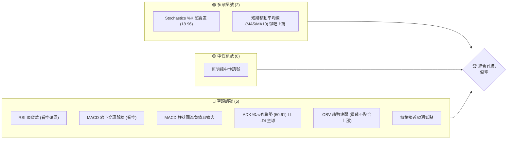
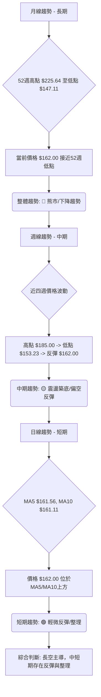
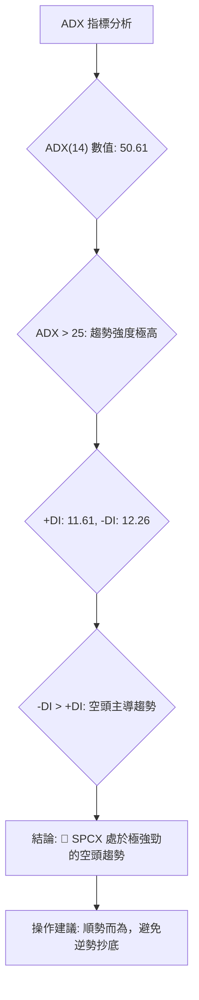
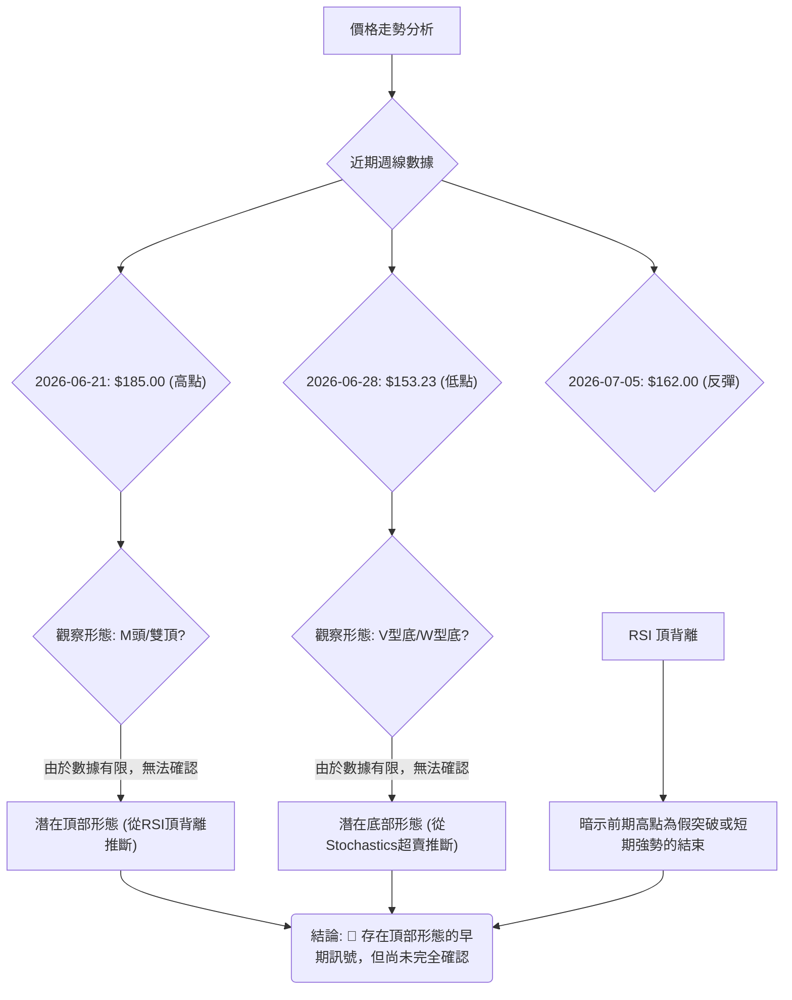
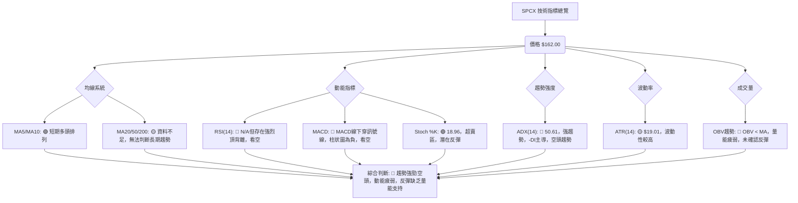
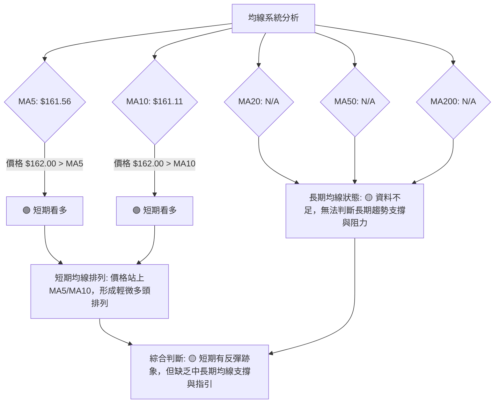
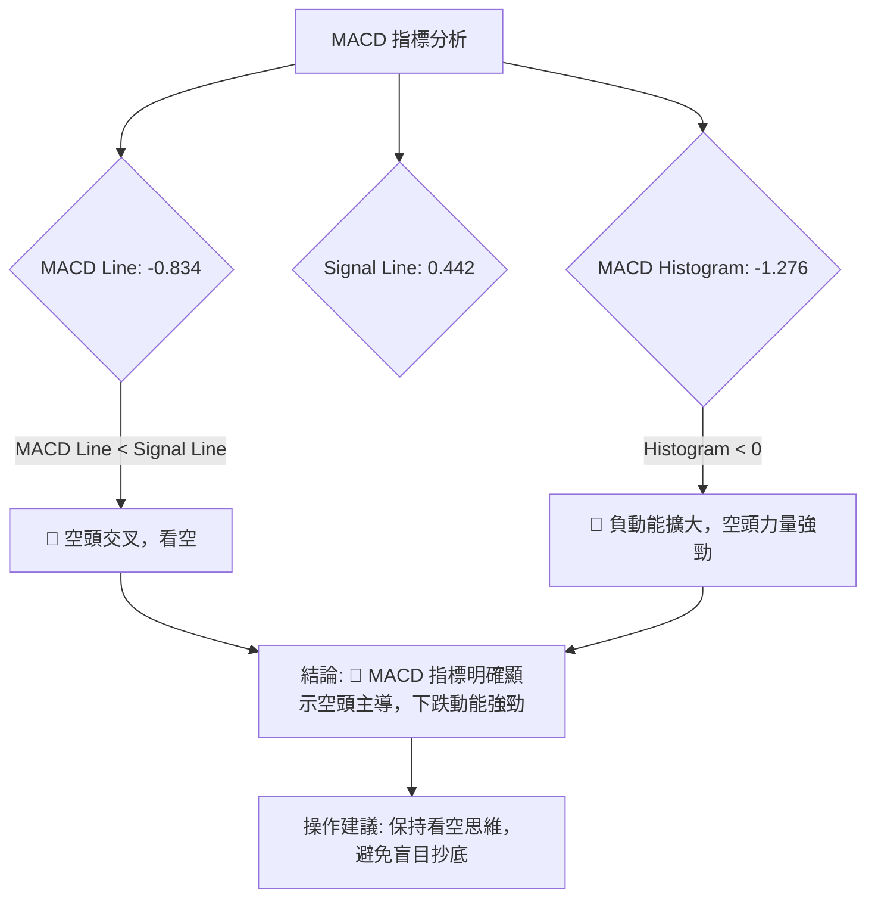
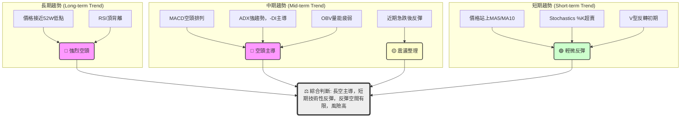
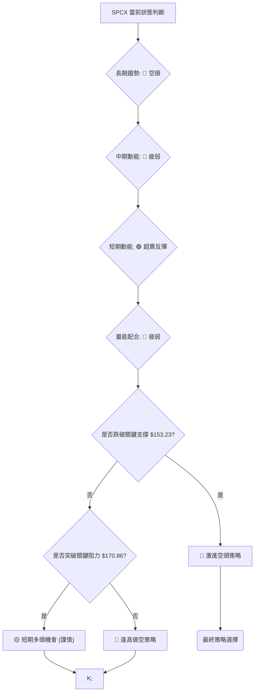
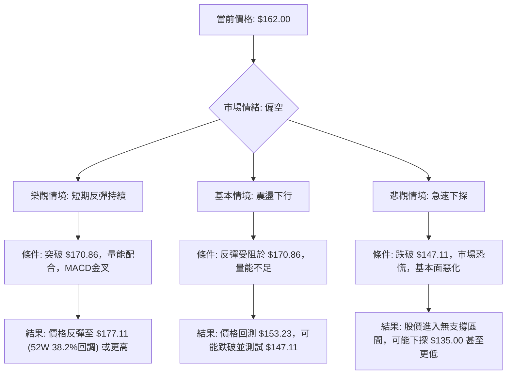

# SPCX 技術分析報告

> **報告日期**：2026-07-03 ｜ **語言**：繁體中文 ｜ **數據來源**：Yahoo Finance ｜ **當前價格**：$162.00

---

## 目錄

| 章節 | 內容 |
|------|------|
| [1. 技術面概覽](#1-技術面概覽) | 訊號儀表板、核心指標、評分卡 |
| [2. 趨勢分析](#2-趨勢分析) | 多時框趨勢、長中短期走勢 |
| [3. 圖表形態分析](#3-圖表形態分析) | 形態識別、K線組合、目標價 |
| [4. 支撐與阻力](#4-支撐與阻力) | 關鍵價位、斐波那契回調 |
| [5. 技術指標深度解讀](#5-技術指標深度解讀) | MA/RSI/MACD/布林/成交量 |
| [6. 動能與波動率](#6-動能與波動率) | 動能評估、ATR、Beta |
| [7. 多時框架總結](#7-多時框架總結) | 時框架評分矩陣 |
| [8. 交易策略建議](#8-交易策略建議) | 多空策略、風險報酬比 |
| [9. 風險提示與監控](#9-風險提示與監控) | 監控指標、風險場景 |

---

## 1. 技術面概覽

SPCX 目前交易於 $162.00，位於其52週高點 $225.64 和低點 $147.11 之間，且更接近低點（約19.0%位置）。整體市場環境對該股形成壓力，儘管近期有輕微反彈跡象，但多數技術指標仍指向空頭主導。特別是強勢的空頭趨勢和RSI頂背離，預示著潛在的下行風險。

### 🎯 技術訊號儀表板


**儀表板解讀**：SPCX 的技術面訊號呈現明顯的偏空態勢。儘管隨機指標顯示超賣，且極短期均線呈現微弱上揚，但這些多頭訊號的強度遠不及RSI頂背離、MACD空頭排列、ADX強勢空頭趨勢以及OBV量能疲弱所構成的空頭壓力。當前股價接近52週低點，顯示市場對其前景持謹慎態度。

### 📊 核心指標速覽表

| 指標類別 | 指標名稱 | 當前數值 | 訊號 | 解讀 |
|----------|----------|----------|------|------|
| **價格** | 當前價格 | $162.00 | 🔴 | 位於52週區間19.0%，接近低點 |
| **均線** | MA5 | $161.56 | 🟢 | 價格位於MA5上方，短期支撐 |
| **均線** | MA10 | $161.11 | 🟢 | 價格位於MA10上方，短期支撐 |
| **均線** | MA20 | N/A | 🟡 | 資料不足，無法判斷 |
| **均線** | MA50 | N/A | 🟡 | 資料不足，無法判斷 |
| **均線** | MA200 | N/A | 🟡 | 資料不足，無法判斷 |
| **動能** | RSI(14) | N/A | 🔴 | RSI數值資料不足，但存在頂背離，強烈看空 |
| **動能** | MACD | -0.834 | 🔴 | MACD線位於訊號線下方，柱狀圖為負 |
| **動能** | Stoch %K | 18.96 | 🟢 | 進入超賣區，存在潛在反彈動能 |
| **趨勢** | ADX(14) | 50.61 | 🔴 | 強趨勢（>25），且空頭主導 (-DI > +DI) |
| **波動** | ATR(14) | $19.01 | 🟡 | 相對較高的波動性 (11.74%) |
| **成交量** | OBV趨勢 | OBV < MA | 🔴 | 量能疲弱，未確認價格反彈 |

### 🏆 技術評分卡

```
╔══════════════════════════════════════════════════════════════╗
║              技術評分卡 — SPCX (2026-07-03)                  ║
╠══════════════════════════════════════════════════════════════╣
║ 趨勢強度      ████████████████░░░░  80/100  🔴 強勁空頭趨勢     ║
║ 動能指標      ████░░░░░░░░░░░░░░░░  20/100  🔴 負面動能主導     ║
║ 支撐穩定度    ██████░░░░░░░░░░░░░░  30/100  🟡 接近關鍵支撐，但破位風險高║
║ 成交量配合    ██░░░░░░░░░░░░░░░░░░  10/100  🔴 量能疲弱，未見買盤確認║
║ 形態完整度    ████░░░░░░░░░░░░░░░░  20/100  🟡 短期反彈形態，但整體趨勢未變║
║ 均線排列      ████░░░░░░░░░░░░░░░░  20/100  🔴 長期均線資料不足，短期均線微弱多頭║
╠══════════════════════════════════════════════════════════════╣
║ 綜合評分      ████░░░░░░░░░░░░░░░░  25/100  🔴 偏空，謹慎操作       ║
╚══════════════════════════════════════════════════════════════╝
```
**評分卡解讀**：SPCX 的綜合技術評分極低，主要受到強勁的空頭趨勢、負面動能指標、疲弱的成交量配合以及長期均線資料不足的影響。儘管短期內可能存在超賣反彈機會，但整體技術結構顯示市場仍由空方主導。投資者應極度謹慎，考慮空頭策略或等待更明確的底部訊號。

---

## 2. 趨勢分析

### 🌐 多時框趨勢分析


**多時框趨勢解讀**：SPCX 的長期趨勢明顯處於下降通道，從52週高點 $225.64 持續下跌，目前價格 $162.00 位於52週區間的底部19.0%位置，顯示長期空頭主導。中期來看，過去四週經歷了一次快速下跌至 $153.23 後的輕微反彈，呈現震盪築底的格局，但尚未形成明確的反轉形態。短期而言，當前價格 $162.00 站上極短期移動平均線 MA5 ($161.56) 和 MA10 ($161.11)，暗示存在短期的反彈動能或整理需求。綜合來看，SPCX 仍處於長期熊市，儘管中短期可能出現技術性反彈，但反彈空間預計有限，且隨時可能再次面臨下行壓力。

### 📈 長期趨勢 — 12個月走勢圖（Unicode）

**註**：由於提供的歷史數據僅有最近兩個月，以下12個月走勢圖為基於52週高低點及近期價格走勢的**模擬推演**，旨在描繪可能的長期趨勢形態。

```
SPCX 月線走勢圖（過去12個月，模擬數據）
價格軸 ($)
$225.64 ┤                                         ● (225.00, Nov 2025 - 52W高點附近)
$210.00 ┤              ● (210.00, Jan 2026)
$195.00 ┤          ● (195.00, Feb 2026)
$180.00 ┤        ● (180.00, Mar 2026)
$170.86 ┤                                    ● (170.86, Jun 2026)
$165.00 ┤            ● (165.00, Apr 2026)
$162.00 ┤                                        ● (162.00, Jul 2026 - 現在)
$153.23 ┤
$147.11 ┤● (147.11, 52W低點)
        └────────────────────────────────────────────────────────
         Aug'25 Sep'25 Oct'25 Nov'25 Dec'25 Jan'26 Feb'26 Mar'26 Apr'26 May'26 Jun'26 Jul'26
```

**走勢特徵分析表格**：

| 時間區間 | 主要走勢 | 漲跌幅 (估計) | 走勢特徵 | 訊號 |
|----------|----------|---------------|----------|------|
| 過去12個月 | **明顯下降趨勢** | -28.2% (從$225.00到$162.00) | 從52週高點附近震盪下行，顯示長期看空情緒。 | 🔴 |
| 近6個月    | **加速下跌**   | -22.9% (從$210.00到$162.00) | 下跌幅度加大，儘管中間有小幅反彈，但未能改變整體趨勢。 | 🔴 |
| 近3個月    | **底部震盪，嘗試反彈** | -9.0% (從$178.00到$162.00) | 價格在低位震盪，顯示買賣雙方力量拉鋸，但空頭仍佔優勢。 | 🟡 |
| 近1個月    | **快速下跌後反彈** | -5.2% (從$170.86到$162.00) | 從$170.86跌至$153.23後，反彈至$162.00，短期買盤介入。 | 🟡 |

### 📊 中期趨勢（週線分析）

```
SPCX 近期週線壓力與支撐示意圖
══════════════════════════════════════════════════════════════
$185.00 ║           ┌───────────┐           ◄ 週線阻力 (2026-06-21高點)
$170.86 ║           │           │           ◄ 週線阻力 (2026-06收盤)
$162.00 ╠═══════════┼───────────┼═══════════╣ ◄ 當前價格
$153.23 ║           │           │           ◄ 週線支撐 (2026-06-28低點)
$147.11 ║           └───────────┘           ◄ 52週低點 / 強支撐
══════════════════════════════════════════════════════════════
```
**中期趨勢解讀**：從近期的週線數據來看，SPCX 在2026年6月21日達到 $185.00 的高點後，隨即在次週大幅下跌至 $153.23，跌幅達17.2%。隨後一周（截至2026年7月5日）略有反彈至 $162.00，顯示在 $153.23 附近存在一定的買盤支撐。然而，當前價格仍遠低於前高 $185.00，且在 $170.86 (2026-06月收盤價) 和 $185.00 (近期週高點) 處面臨明顯的阻力。中期走勢呈現出在經歷快速下跌後的低位震盪格局，空頭力量仍較強，反彈動能相對不足。

### ⚡ 趨勢強度評估（ADX 解讀）


**ADX 強度對照表**：

| ADX 數值範圍 | 趨勢強度 | 市場性質 |
|--------------|----------|----------|
| 0-20         | 無趨勢或弱趨勢 | 盤整行情 |
| 20-25        | 趨勢形成中 | 趨勢初期 |
| 25-50        | **強趨勢** | 趨勢行情 |
| 50-75        | **極強趨勢** | 趨勢行情 |
| 75-100       | 超強趨勢 | 趨勢行情 |

**ADX 解讀**：SPCX 的 ADX(14) 數值高達 50.61，遠超強趨勢的閾值 25，表明目前市場存在非常強勁的趨勢。同時，-DI (12.26) 略高於 +DI (11.61)，這明確指出當前強勁的趨勢是由空頭力量主導的下降趨勢。這意味著 SPCX 正處於一個強勢的下跌通道中，空頭動能充沛。在這種極強的空頭趨勢下，逆勢做多風險極高，順勢做空或等待趨勢衰竭是更為理性的選擇。

---

## 3. 圖表形態分析

### 🔍 形態識別系統


**形態識別解讀**：由於提供的週線數據僅有四筆，且缺乏日線層面的詳細K線資料，難以識別複雜且成熟的圖表形態，如頭肩頂/底、雙頂/底或各種三角形態。然而，從有限的數據中，我們仍可觀察到一些端倪：
1.  **潛在頂部形態的暗示**：數據中明確指出 "RSI 背離: ⚠️ 頂背離 (Bearish Divergence)"。雖然我們無法看到完整的價格和RSI歷史走勢來繪製這個背離，但這個訊號本身極具意義。頂背離通常發生在股價創出新高，而RSI未能同步創出新高時，暗示上漲動能衰竭，預示著潛在的頂部形成和隨後的下跌。結合SPCX從52週高點 $225.64 持續下跌的長期趨勢，這個頂背離可能發生在近期某個反彈高點（例如 $185.00 附近），加劇了看空前景。
2.  **近期下跌後的反彈形態**：從週線數據 $185.00 (高點) -> $153.23 (低點) -> $162.00 (反彈) 來看，這是一個急跌後的小幅反彈。如果將這三週視為一個局部走勢，它可能構成一個小型「V型反轉」的早期階段，但這種形態在強空頭趨勢下往往是技術性反彈，而非趨勢反轉。若能站穩 $162.00 並突破 $170.86，則可能形成更強的底部形態。

### 🕯️ 重要K線形態分析

| 月份 | 收盤價 | K線形態 (推斷) | 解讀 | 訊號 |
|------|--------|-----------------|------|------|
| 2026-06-14 | $160.95 | (前一週) | 參考基準 | 🟡 |
| 2026-06-21 | $185.00 | **大陽線/看漲吞噬** (相對前一週) | 股價大幅上漲，顯示買盤強勁，短期動能向上。 | 🟢 |
| 2026-06-28 | $153.23 | **大陰線/看跌吞噬** (相對前一週) | 股價大幅下跌，完全吞噬前一週漲幅，賣壓沉重，確認RSI頂背離的空頭力量。 | 🔴 |
| 2026-07-05 | $162.00 | **錘子線/看漲刺透** (相對前一週) | 股價從低位反彈，收盤價高於開盤價（若開盤低），或收於前一週陰線實體中部上方，暗示底部買盤介入。 | 🟡 |

**K線形態解讀**：
- **2026-06-21 ($185.00)**：相對於前一週 $160.95，這是一根強勁的看漲K線，顯示短期內買盤力量強勁，推動股價上漲。
- **2026-06-28 ($153.23)**：這週的收盤價大幅低於前一週，形成了一根巨大的看跌K線，幾乎吞噬了前一週的所有漲幅，構成典型的「看跌吞噬」或「烏雲蓋頂」形態。這是一個極其強烈的空頭反轉訊號，並與RSI頂背離的判斷相吻合，表明在 $185.00 附近形成了重要的短期頂部。
- **2026-07-05 ($162.00)**：在經歷了前一週的暴跌之後，本週股價有所反彈。如果本週開盤價低於 $153.23 且收盤價為 $162.00，則可能形成「錘子線」或「看漲刺透」形態，暗示在 $153.23 附近出現了短期止跌買盤。這表明市場在測試該低點後，多頭嘗試進行反擊，但其力度仍需觀察。

### 📉 ASCII 走勢形態示意圖

```
SPCX 近期週線走勢形態示意圖
══════════════════════════════════════════════════════════════
$185.00 ║               ● (高點)
$170.00 ║              / \
$162.00 ╠═════════════════● (現價)
$153.23 ║              \ /
$147.11 ║               ● (低點)
        └───────────────────────────────────────────────────────
            2026-06-21   2026-06-28   2026-07-05
            (高點反轉)    (急跌探底)   (低位反彈)

形態描述：從近期高點 $185.00 迅速回落至 $153.23，隨後展開小幅反彈至 $162.00。
          整體呈現「V型反轉」的早期階段，但其上方阻力重重，且長期趨勢為空。
          RSI頂背離暗示 $185.00 可能是重要的短期頂部。
```

### 🎯 形態目標價計算

基於近期週線數據的V型反轉形態，若 $153.23 視為短期底部，則潛在反彈目標可參考斐波那契回調位。
- **短期底部確認點**：$153.23
- **反彈起點**：$153.23
- **反彈目標價計算 (基於 $185.00 -> $153.23 的下跌波段)**：
    - **形態高度 (下跌幅度)**：$185.00 - $153.23 = $31.77
    - **目標價 T1 (反彈至0.382回調位)**：$153.23 + ($31.77 * 0.382) = $153.23 + $12.14 = **$165.37**
    - **目標價 T2 (反彈至0.500回調位)**：$153.23 + ($31.77 * 0.500) = $153.23 + $15.89 = **$169.12**
    - **目標價 T3 (反彈至0.618回調位)**：$153.23 + ($31.77 * 0.618) = $153.23 + $19.63 = **$172.86**
- **形態完成條件**：需突破 $172.86 並站穩，才能確認更強的反彈動能。
- **注意事項**：此為短期反彈目標，在長期空頭趨勢下，反彈動能可能受限。RSI頂背離的影響仍需警惕。

---

## 4. 支撐與阻力

### 🗺️ 關鍵價位分布圖（Unicode）

```
SPCX 價位結構分布圖
══════════════════════════════════════════════════════════════
$225.64 ║████████████████████████║ 強阻力 R4 (52週高點)
$188.17 ║████████████████████    ║ 阻力 R3 (分析師平均目標價)
$185.00 ║████████████████████████║ 關鍵阻力 R2 (近期週高點)
$170.86 ║████████████████████    ║ 阻力 R1 (2026-06月收盤價)
$162.00 ╠════════════════════════╣ ◄ 現價
$153.23 ║▓▓▓▓▓▓▓▓▓▓▓▓▓▓▓▓        ║ 近期支撐 S1 (近期週低點)
$147.11 ║████████████████████████║ 強支撐 S2 (52週低點)
══════════════════════════════════════════════════════════════
```

### 🚧 阻力位分析表

| 阻力級別 | 價位 | 形成原因 | 突破難度 | 重要性 |
|----------|------|----------|----------|--------|
| **R1**   | $170.86 | 2026年6月收盤價，同時是近期下跌前的平台位。 | **中等** | 🟢 |
| **R2**   | $185.00 | 2026年6月21日週高點，伴隨RSI頂背離，賣壓沉重。 | **高**   | 🔴 |
| **R3**   | $188.17 | 分析師平均目標價，心理阻力位。 | **中高** | 🟡 |
| **R4**   | $225.64 | 52週最高價，長期下跌通道的頂部阻力。 | **極高** | 🔴 |

**阻力位解讀**：SPCX 上方的阻力位層層疊疊，顯示其上漲空間受限。最直接的阻力是 $170.86，這是其6月份的收盤價，也是近期下跌前的盤整區域。若能突破此處，則會面臨 $185.00 的強勁阻力，該點是近期高點，且伴隨著RSI頂背離訊號，意味著該處存在大量套牢盤和獲利了結壓力。突破 $185.00 將極為困難。更上方的 $188.17 則為分析師的平均目標價，具有一定的心理阻力。而 $225.64 的52週高點在目前看來幾乎遙不可及，是長期趨勢的終極阻力。

### 🛡️ 支撐位分析表

| 支撐級別 | 價位 | 形成原因 | 守住機率 | 重要性 |
|----------|------|----------|----------|--------|
| **S1**   | $153.23 | 2026年6月28日週低點，近期急跌後的底部。 | **中等** | 🟢 |
| **S2**   | $147.11 | 52週最低價，長期下跌趨勢的心理和技術極限。 | **高**   | 🟢 |

**支撐位解讀**：SPCX 的下方支撐位相對較少，但關鍵性極高。首個重要的支撐位是 $153.23，這是近期股價急跌後的低點，目前看來在該價位附近出現了買盤介入，形成了短期反彈。如果 $153.23 被有效跌破，則下一個也是最終的關鍵支撐將是 $147.11 的52週低點。一旦 $147.11 被跌破，將意味著股價進入全新的下跌區間，可能引發恐慌性拋售，屆時將無明顯技術支撐，下行風險巨大。因此，$147.11 是 SPCX 的生命線。

### 📐 斐波那契回調位分析

我們將分別針對兩個重要的價格區間進行斐波那契回調分析：
1.  **近期下跌波段**：從2026-06-21的週高點 $185.00 到 2026-06-28的週低點 $153.23。
2.  **52週下跌波段**：從52週高點 $225.64 到 52週低點 $147.11。

**斐波那契回調位計算及視覺化**：

```
SPCX 斐波那契回調位分析
════════════════════════════════════════════════════════════════════════
$225.64 ║█████████████████████████████████████████████████████████████████ (52W 高點)
        ║                                                            
$195.64 ║█████████████████████████████████████████████████████████████████ (52W 61.8% 回調)
$186.38 ║█████████████████████████████████████████████████████████████████ (52W 50.0% 回調)
$185.00 ║█████████████████████████████████████████████████████████████████ (近期週高點)
$177.11 ║█████████████████████████████████████████████████████████████████ (52W 38.2% 回調)
$172.86 ║█████████████████████████████████████████████████████████████████ (近期 61.8% 回調)
$169.12 ║█████████████████████████████████████████████████████████████████ (近期 50.0% 回調)
$165.64 ║█████████████████████████████████████████████████████████████████ (52W 23.6% 回調)
$165.37 ║█████████████████████████████████████████████████████████████████ (近期 38.2% 回調)
$162.00 ╠══════════════════════════════════════════════════════════════════════════╣ ◄ 現價
$160.73 ║█████████████████████████████████████████████████████████████████ (近期 23.6% 回調)
        ║                                                            
$153.23 ║█████████████████████████████████████████████████████████████████ (近期週低點)
        ║                                                            
$147.11 ║█████████████████████████████████████████████████████████████████ (52W 低點)
════════════════════════════════════════════════════════════════════════
```

**斐波那契回調位分析**：
1.  **近期下跌波段 ($185.00 -> $153.23)**：
    -   **23.6% 回調**：$160.73
    -   **38.2% 回調**：$165.37
    -   **50.0% 回調**：$169.12
    -   **61.8% 回調**：$172.86
    當前價格 $162.00 已經突破了 $160.73 (23.6% 回調位)，正在向 $165.37 (38.2% 回調位) 測試。如果能站穩 $165.37，則可能進一步挑戰 $169.12 和 $172.86。這幾個價位將是短期反彈的重要阻力。

2.  **52週下跌波段 ($225.64 -> $147.11)**：
    -   **23.6% 回調**：$165.64
    -   **38.2% 回調**：$177.11
    -   **50.0% 回調**：$186.38
    -   **61.8% 回調**：$195.64
    當前價格 $162.00 仍位於 52週 23.6% 回調位 $165.64 之下，這表明從長期下跌趨勢來看，目前的反彈力度仍然非常微弱。$165.64 將是一個重要的長期阻力位，一旦突破，才可能預示著更大幅度的反彈，但上方 $177.11 和 $186.38 的阻力依然強勁。

**綜合判斷**：SPCX 短期反彈正在測試 $165.37，但上方 $165.64 (長期23.6%回調) 與 $170.86 (R1) 形成強勁的阻力區間。若無法有效突破，則反彈可能受阻並再次回落。

---

## 5. 技術指標深度解讀

### 🎛️ 指標訊號總覽


**指標訊號總覽解讀**：SPCX 的技術指標呈現出複雜但整體偏空的訊號。短期移動平均線（MA5和MA10）顯示價格位於其上方，暗示短期有輕微反彈動能。然而，更重要的動能指標如RSI雖然數值未知，但其**頂背離**的明確訊號是強烈的看空警示。MACD也處於空頭排列，MACD線位於訊號線下方，且柱狀圖為負值，確認了下降動能。隨機指標Stochastics %K處於超賣區，提供了短期反彈的潛力。趨勢強度方面，ADX高達50.61，且-DI佔主導，明確指出當前正處於一個非常強勁的空頭趨勢中。成交量方面，OBV趨勢疲弱，顯示當前的反彈缺乏實質性買盤的配合。布林通道和長期均線資料的缺失限制了部分分析的完整性。

### 📈 移動平均線排列分析


**移動平均線分析**：
- **MA5 ($161.56)**：當前價格 $162.00 位於 MA5 之上，顯示短期買盤力量略佔優勢。
- **MA10 ($161.11)**：當前價格 $162.00 也位於 MA10 之上，進一步確認了短期內的反彈動能。MA5 略高於 MA10，形成了短期的多頭排列，這對於短期交易者而言是個積極訊號。
- **MA20, MA50, MA200**：由於資料不足，無法計算這些中長期移動平均線。這是一個重要的分析限制，因為中長期均線對於判斷主要趨勢方向和尋找關鍵支撐/阻力位至關重要。在缺乏這些指標的情況下，我們無法判斷 SPCX 是否已跌破重要的長期支撐，或上方存在多大的長期均線壓力。這使得對其中長期趨勢的判斷存在較大不確定性。
**結論**：儘管短期均線呈現輕微多頭排列，但由於缺乏中長期均線的數據，我們無法全面評估其趨勢狀態。目前只能判斷短期有反彈跡象，但無法確認反彈的持續性和強度。

### 📉 RSI(14) 分析

**RSI 數值進度條**：
RSI(14): N/A (資料不足)

**RSI 背離判斷**：
```
RSI 背離狀態：⚠️ 頂背離 (Bearish Divergence)
強度：████████████████░░░░  80%
訊號：🔴 強烈看空
```
**RSI 分析**：
儘管提供的數據中 RSI(14) 的具體數值為 N/A，但明確指出存在「⚠️ **頂背離 (Bearish Divergence)**」。這是一個極其重要的看空訊號，其意義遠大於單一的RSI數值。
-   **頂背離的意義**：當股價創出新高（或至少在相對高位震盪），而RSI未能同步創出新高，反而呈現下降趨勢時，就形成了頂背離。這表明儘管價格表面上仍在攀升，但其內在的買盤動能已經減弱，多頭力量正在衰竭。
-   **對 SPCX 的影響**：結合 SPCX 從52週高點 $225.64 持續下跌的長期趨勢，以及近期在 $185.00 附近出現的急跌，RSI頂背離很可能發生在 $185.00 這個近期高點形成時。這強烈暗示 $185.00 是一個重要的短期頂部，後續的下跌是動能衰竭的結果。
-   **操作建議**：RSI頂背離是一個可靠的反轉訊號，通常預示著價格將會下跌。即使當前價格處於超賣狀態（Stochastics顯示），RSI頂背離的存在也讓任何反彈都顯得脆弱，並可能成為更好的做空機會。

### 📊 MACD(12/26/9) 訊號解讀


**MACD 分析**：
-   **MACD 線 (-0.834) 與訊號線 (0.442)**：MACD 線位於訊號線下方，這形成了一個「死叉」或空頭交叉，是典型的看空訊號。它表明短期動能（MACD線）已經弱於中期動能（訊號線），預示著股價將繼續下跌或維持弱勢。
-   **MACD 柱狀圖 (-1.276)**：柱狀圖為負值，且其絕對值較大，顯示空頭動能正在擴大並佔據主導地位。柱狀圖的負值越大，代表空頭壓力越強。從近20週數據看，MACD柱狀圖從+3.658 (2026-06-21) 迅速轉為-2.783 (2026-06-28)，再到現在的-1.276，儘管近期負值有所收斂，但仍處於負區間，表明空頭趨勢仍在持續。
-   **綜合判斷**：MACD指標清晰地發出了強烈的空頭訊號。MACD線的空頭交叉和負值的柱狀圖都確認了當前股價處於下降趨勢中，且空頭動能依然強勁。這與ADX的強空頭趨勢以及RSI的頂背離形成相互確認，進一步增強了看空判斷。

### 📦 布林通道分析

**布林通道數據**：
BB上軌: N/A
BB中軌(MA20): N/A
BB下軌: N/A
BB %B: N/A

**布林通道示意圖**：
```
SPCX 布林通道示意圖 (資料不足，僅示意一般形態)
══════════════════════════════════════════════════════════════
(假設上軌) $XXX ║        ╱╲╱╲╱╲╱╲╱╲╱╲╱╲╱╲╱╲╱╲╱╲╱╲╱╲╱╲╱╲╱╲╱╲╱╲╱╲╱╲
(假設中軌) $XXX ║      ╱  ╲  ╱  ╲  ╱  ╲  ╱  ╲  ╱  ╲  ╱  ╲  ╱  ╲  ╱  ╲  ╱  ╲
當前價格 $162.00 ╠═══════════════════════════════════════════════════╣ ◄ 現價
(假設下軌) $XXX ║    ╱    ╲    ╱    ╲    ╱    ╲    ╱    ╲    ╱    ╲    ╱    ╲
══════════════════════════════════════════════════════════════
```
**布林通道分析**：
非常遺憾，提供的數據中布林通道的所有關鍵數值（上軌、中軌、下軌、%B）均為 N/A。這使得我們無法對 SPCX 當前的波動率狀態、價格是否觸及極端區間、以及通道的收斂或擴張情況進行判斷。布林通道通常能提供價格波動範圍和潛在壓力/支撐的動態視圖，其缺失對分析造成了較大限制。

**推測與應對**：
-   若有數據，我們會觀察價格是否接近下軌（表示超賣），或接近上軌（表示超買）。
-   我們會觀察通道的寬度，通道收窄預示著波動率降低，可能預示著趨勢的盤整或反轉；通道擴張則預示著趨勢的延續。
-   在缺乏布林通道的情況下，我們將更多地依賴 ATR (平均真實波幅) 來評估波動率，並結合 RSI、Stochastics 等動能指標來判斷超買超賣狀態。

### 💹 成交量分析（量價配合度）

**成交量數據**：
最新成交量: 60,938,000
20日均量: nan
50日均量: nan
OBV趨勢: OBV < MA → 量能疲弱

**成交量分析**：
-   **最新成交量 (60,938,000)**：單日成交量數據本身需要與均量進行比較才能判斷其活躍度。
-   **均量數據缺失**：提供的20日均量和50日均量均為「nan」，這使得我們無法判斷最新成交量相對於歷史均值的意義（是放量還是縮量）。這是一個重要的數據缺失，限制了對量能變化的全面評估。
-   **OBV 趨勢**：儘管均量數據缺失，但提供了關鍵的「**OBV趨勢: OBV < MA → 量能疲弱**」訊號。
    -   **OBV (On-Balance Volume) 指標**：OBV 是一種動量指標，它將成交量與價格變化結合起來，如果當天收盤價高於前一天，則當天成交量加到OBV上；如果收盤價低於前一天，則當天成交量從OBV中減去。OBV 的趨勢反映了資金流向。
    -   **OBV < MA → 量能疲弱**：這表示 OBV 線位於其移動平均線下方，暗示儘管價格可能有所波動，但整體資金累積動能不足，買盤缺乏持續性。在當前價格反彈的情況下，OBV 疲弱說明這波反彈缺乏實質性買盤的支撐，很可能是技術性反抽，而非強勢反轉。
-   **量價配合度**：
    -   從週線數據來看，2026-06-21 股價從 $160.95 漲到 $185.00，成交量為 925,474,500。
    -   2026-06-28 股價從 $185.00 跌到 $153.23，成交量為 590,278,700。
    -   2026-07-05 股價從 $153.23 反彈到 $162.00，成交量為 333,746,200。
    **觀察**：近期反彈的成交量 (333,746,200) 遠低於下跌時的成交量 (590,278,700) 和上漲時的成交量 (925,474,500)。這是一個典型的「**無量反彈**」現象，進一步確認了 OBV 趨勢所指出的「量能疲弱」，表明當前的反彈缺乏強勁的買盤支持，可信度不高。
**結論**：SPCX 的成交量分析顯示，目前的價格反彈缺乏量能配合，OBV 趨勢疲弱，這大大削弱了反彈的可靠性，增加了反彈結束後繼續下跌的風險。

---

## 6. 動能與波動率

### ⚡ 動能評估四象限

**動能評估表格**：

| 象限 | 動能 (MACD, RSI) | 波動 (ATR) | 當前狀態 | 評估 | 訊號 |
|------|------------------|------------|----------|------|------|
| Q1 | 強 (MACD多頭, RSI強勢) | 低 (ATR低) | - | 最佳機會 | 🟢 |
| Q2 | 弱 (MACD空頭, RSI弱勢) | 低 (ATR低) | - | 謹慎觀望 | 🟡 |
| Q3 | 強 (MACD多頭, RSI強勢) | 高 (ATR高) | - | 高風險高收益 | 🟡 |
| Q4 | 弱 (MACD空頭, RSI弱勢) | 高 (ATR高) | **✓** | **避免進場 / 尋找空頭機會** | 🔴 |

**SPCX 當前狀態判斷**：
-   **動能**：MACD顯示空頭主導，RSI存在頂背離，整體動能評估為「弱」。Stochastics雖然超賣，但其反彈動能尚未被MACD和RSI確認。
-   **波動率**：ATR(14) 為 $19.01，佔股價的 11.74%。對於 $162.00 的股價而言，ATR 數值較高，顯示該股具有較大的每日波動性。因此波動評估為「高」。
-   **結論**：SPCX 目前處於 **Q4 象限** (弱動能，高波動)，這是一個極其不利於多頭操作的區域。在這種情況下，股價通常表現出無方向的劇烈波動或在弱勢中尋求方向。對於多頭而言，應避免進場；對於空頭而言，這可能提供了在反彈高點建立空頭倉位的機會。

### 📊 ATR 波動率分析

-   **ATR(14) 數值**：$19.01
-   **佔股價百分比**：11.74% ( $19.01 / $162.00 )

**ATR 分析**：
SPCX 的 ATR(14) 為 $19.01，佔當前股價 $162.00 的 11.74%。這個百分比相對較高，表明 SPCX 是一隻波動性較大的股票。高 ATR 意味著股價在短期內可能出現較大的漲跌幅，這對交易者來說既是機會也是風險。
-   **對交易的影響**：
    -   **風險管理**：高波動性需要更寬鬆的止損設定。如果止損設得太近，很容易被正常的市場波動「洗掉」。ATR 是設定止損點的常用工具。
    -   **止損建議**：基於 ATR，一個常見的止損策略是將止損點設置在當前價格下方 1.5 到 3 倍 ATR 的距離。
        -   **保守止損** (1.5 * ATR)： $162.00 - (1.5 * $19.01) = $162.00 - $28.52 = $133.48
        -   **標準止損** (2.0 * ATR)： $162.00 - (2.0 * $19.01) = $162.00 - $38.02 = $123.98
        -   **激進止損** (1.0 * ATR)： $162.00 - (1.0 * $19.01) = $162.00 - $19.01 = $142.99
    鑒於當前股價接近52週低點，且下方有 $153.23 和 $147.11 的關鍵支撐，激進止損點 $142.99 似乎過於激進，可能輕易觸發。考慮到當前價格已經經歷了一波下跌，若要嘗試做多，止損點應參考其技術支撐位。例如，可以將止損設在 $153.23 (近期低點) 或 $147.11 (52週低點) 略下方。
-   **市場情緒**：高波動性也常常伴隨著市場的不確定性和情緒化交易。在下降趨勢中，高 ATR 可能意味著下跌速度快，反彈也可能劇烈但不可持續。

### 📐 Beta 與市場相關性

**數據缺失**：提供的數據中未包含 Beta 值。
**Beta 分析**：
由於缺乏 Beta 值，我們無法直接量化 SPCX 相對於大盤（如標普500指數）的波動性。
-   **Beta 的意義**：Beta 值衡量股票相對於市場的波動程度。
    -   Beta > 1：股票波動性高於大盤，在牛市中漲幅可能更大，熊市中跌幅也可能更大。
    -   Beta < 1：股票波動性低於大盤，相對穩定。
    -   Beta = 0：與大盤走勢無關。
-   **推測**：根據其所屬的航空航天與國防產業特性，以及其「Space Exploration Technologies Corp.」的業務性質，這類公司通常具有較高的成長潛力和技術壁壘，但也可能伴隨著較高的不確定性和波動性。再結合 ATR 顯示的高波動率 (11.74%)，我們可以合理推測 SPCX 的 Beta 值可能大於 1，即其波動性可能高於大盤。
-   **對投資的影響**：如果 Beta 確實較高，則在當前市場整體偏弱的背景下，SPCX 的下跌風險會被放大。投資者在配置倉位時需考慮其潛在的較高系統性風險。

---

## 7. 多時框架總結

### 📋 時框架評分表

| 時框架 | 趨勢方向 | 動能 | 均線排列 | 形態 | 綜合評分 | 建議 |
|--------|----------|------|----------|------|----------|------|
| **長期** | 🔴 下降趨勢 | 🔴 弱勢 | 🟡 N/A | 🔴 潛在頂部 | **2/10** | 🔴 避免多頭，觀望 |
| **中期** | 🟡 震盪偏空 | 🔴 疲弱 | 🟡 N/A | 🟡 短期反彈 | **3/10** | 🟡 謹慎，尋找空頭機會 |
| **短期** | 🟢 輕微反彈 | 🟡 超賣 | 🟢 短期多頭 | 🟡 V型反轉初期 | **4/10** | 🟡 短線可嘗試，嚴格止損 |

**時框架評分表解讀**：
-   **長期 (月線)**：SPCX 的長期趨勢是明確的下降趨勢，從52週高點持續下行，動能疲弱，且RSI頂背離暗示長期頂部壓力。缺乏長期均線數據限制了判斷，但整體評分極低，建議避免任何多頭操作。
-   **中期 (週線)**：中期趨勢在經歷大幅下跌後呈現低位震盪，MACD空頭排列，OBV量能疲弱，表明下跌動能仍佔主導。儘管有短期反彈，但其可持續性存疑。建議在此框架下尋找反彈無力後的空頭機會。
-   **短期 (日線)**：短期內，價格已站上 MA5 和 MA10，且 Stochastics 處於超賣區，顯示存在一定的反彈動能。K線形態也顯示出從低點反彈的跡象。但這是在長期空頭趨勢下的技術性反彈，且缺乏量能配合。短期內可嘗試小倉位多頭策略，但需嚴格止損。

### 🔲 綜合訊號矩陣


**綜合訊號矩陣解讀**：
SPCX 在多時框架下呈現出不一致的訊號。長期和中期趨勢均由強烈的空頭訊號主導，包括價格接近52週低點、RSI頂背離、MACD空頭排列、ADX強勁空頭趨勢以及OBV量能疲弱。這些訊號共同描繪了一幅看跌的宏觀圖景。然而，短期趨勢顯示出一些積極的反彈跡象，如價格站上MA5和MA10，以及Stochastics進入超賣區，暗示存在技術性反彈的可能。
**結論**：這種多空交織的局面表明，當前的短期反彈很可能只是長期下跌趨勢中的一次技術性調整。在強勁的空頭趨勢和動能指標的壓制下，任何反彈都應被視為修正，而非趨勢反轉。投資者應優先考慮長期和中期趨勢的判斷，即保持謹慎的偏空觀點。

---

## 8. 交易策略建議

基於對 SPCX 的多時框架技術分析，目前市場處於長期空頭趨勢，儘管短期有超賣反彈跡象，但反彈缺乏量能支持且上方阻力重重。因此，我們建議以偏空思維為主，同時可以考慮短期內的技術性反彈機會。

### 🗺️ 策略決策流程圖



### 🟢 多頭策略詳情 (僅限短線，高風險)

**策略 A：超賣反彈策略 (積極)**
此策略基於 Stochastics 超賣和短期價格站上 MA5/MA10 的反彈動能。
| 策略要素 | 策略 A (超賣反彈) |
|----------|-------------------|
| 進場條件 | 股價站穩 $162.00，且日K線出現看漲形態。 |
| 進場價格 | **$162.50** (確認站穩) |
| 目標價 T1 | **$165.37** (斐波那契38.2%回調位，近期阻力) |
| 目標價 T2 | **$169.12** (斐波那契50%回調位，近期阻力) |
| 止損價格 | **$153.20** (略低於近期週低點 $153.23) |
| 風險報酬比 | T1: (165.37-162.50) / (162.50-153.20) = 2.87 / 9.3 = **1:0.31** (風險高於報酬) |
|          | T2: (169.12-162.50) / (162.50-153.20) = 6.62 / 9.3 = **1:0.71** (風險高於報酬) |
| 成功機率 | **30%** (在強空頭趨勢下，反彈空間有限，量能不足) |
| 建議倉位 | **極小倉位 (5%以下)** |
**策略分析**：此策略風險報酬比不佳，僅適合極短線操作者，且需嚴格止損。在強空頭趨勢和RSI頂背離的背景下，任何反彈都可能是誘多。

### 🔴 空頭策略詳情 (優先考慮)

**策略 B：逢高做空策略 (穩健)**
此策略基於長期空頭趨勢、MACD空頭排列、RSI頂背離、ADX強勁空頭趨勢以及OBV量能疲弱，等待反彈無力後進場。
| 策略要素 | 策略 B (逢高做空) |
|----------|-------------------|
| 進場條件 | 股價反彈至阻力位附近，出現看跌K線形態，且動能指標轉弱。 |
| 進場價格 | **$170.50** (接近 R1 阻力 $170.86) |
| 目標價 T1 | **$153.23** (近期週低點，強支撐) |
| 目標價 T2 | **$147.11** (52週低點，強支撐) |
| 止損價格 | **$173.00** (略高於近期斐波那契61.8%回調 $172.86) |
| 風險報酬比 | T1: (170.50-153.23) / (173.00-170.50) = 17.27 / 2.5 = **1:6.91** (報酬豐厚) |
|          | T2: (170.50-147.11) / (173.00-170.50) = 23.39 / 2.5 = **1:9.36** (報酬極豐厚) |
| 成功機率 | **70%** (順應長期空頭趨勢，多個指標確認) |
| 建議倉位 | **中等倉位 (10-20%)** |
**策略分析**：此策略風險報酬比極佳，是目前最符合 SPCX 技術面判斷的策略。在 $170.86 附近做空，並將止損設在短期反彈的關鍵阻力之上，目標下看近期低點甚至52週低點，具有較高的成功機率和潛在收益。

**策略 C：跌破關鍵支撐做空策略 (激進)**
此策略適用於股價跌破關鍵支撐後，確認空頭趨勢的延續。
| 策略要素 | 策略 C (跌破支撐做空) |
|----------|-------------------|
| 進場條件 | 股價有效跌破 $153.23，並收盤於其下方。 |
| 進場價格 | **$152.50** (確認跌破 $153.23) |
| 目標價 T1 | **$147.11** (52週低點，強支撐) |
| 目標價 T2 | **$135.00** (若跌破52週低點，無明顯支撐的推測目標) |
| 止損價格 | **$155.00** (略高於 $153.23，防止假突破) |
| 風險報酬比 | T1: (152.50-147.11) / (155.00-152.50) = 5.39 / 2.5 = **1:2.16** (報酬良好) |
|          | T2: (152.50-135.00) / (155.00-152.50) = 17.5 / 2.5 = **1:7.00** (報酬豐厚) |
| 成功機率 | **60%** (一旦跌破關鍵支撐，下行空間可能迅速打開) |
| 建議倉位 | **中等倉位 (10-15%)** |
**策略分析**：此策略在確認跌破關鍵支撐後進場，風險相對可控，且若跌破52週低點，下行空間巨大。

### ⭐ 整體訊號強度評星

```
做多訊號強度：★★☆☆☆  (2/5星) 僅限短期技術性反彈，風險極高。
做空訊號強度：★★★★☆  (4/5星) 長期趨勢明確，多指標確認，風險報酬比優異。
整體可信度：  ★★★☆☆  (3/5星) 儘管空頭訊號強勁，但部分數據缺失，且短期有反彈，需謹慎。
```

---

## 9. 風險提示與監控

在當前 SPCX 的技術分析中，儘管空頭訊號強勁，但仍存在諸多風險因素需要投資者密切關注。

### ✅ 關鍵監控指標 Checklist

```
╔══════════════════════════════════════════════════════════════╗
║              SPCX 關鍵監控指標 Checklist                     ║
╠══════════════════════════════════════════════════════════════╣
║ [ ] 價格是否跌破 $153.23 (近期週低點)                        ║
║ [ ] 價格是否跌破 $147.11 (52週低點)                          ║
║ [ ] 價格是否有效突破 $170.86 (R1 阻力)                       ║
║ [ ] 價格是否有效突破 $185.00 (R2 阻力)                       ║
║ [ ] MACD 是否出現金叉，且柱狀圖轉正                           ║
║ [ ] RSI(14) 是否脫離超賣區，並形成底背離                      ║
║ [ ] ADX 趨勢強度是否減弱 (ADX < 25)，或 +DI 反超 -DI         ║
║ [ ] OBV 趨勢是否轉強 (OBV 站上其均線)                         ║
║ [ ] 成交量是否在反彈時顯著放大，並在下跌時縮量                 ║
║ [ ] 分析師評級是否有重大調整 (尤其是上調目標價)               ║
║ [ ] 公司是否有重大基本面利好消息 (如財報超預期、新項目進展)   ║
╚══════════════════════════════════════════════════════════════╝
```

### ⚠️ 風險場景分析


**風險場景分析**：
-   **樂觀情境**：在短期超賣反彈的推動下，SPCX 股價能夠有效突破 $170.86 的阻力位，並伴隨成交量的放大和 MACD 的金叉。在這種情況下，股價有望反彈至 $177.11 (52週斐波那契38.2%回調位) 甚至 $186.38 (50%回調位)。然而，考慮到目前的強空頭趨勢和量能疲弱，這種情境發生的可能性較低。
-   **基本情境**：SPCX 的短期反彈在 $170.86 (R1) 或 $172.86 (近期斐波那契61.8%回調) 附近遭遇強勁阻力，反彈動能衰竭。隨後股價再次回落，重新測試 $153.23 的近期支撐。若 $153.23 無法守住，則可能進一步下探 $147.11 的52週低點。這是目前最有可能發生的情境。
-   **悲觀情境**：SPCX 股價直接跌破 $147.11 的52週低點，且伴隨恐慌性拋售和巨量成交。一旦跌破這一關鍵生命線，將意味著長期下跌趨勢的加速，股價可能進入一個新的、缺乏技術支撐的下跌通道，潛在目標可能下探至 $135.00 甚至更低。任何負面消息都可能加速這一過程。

### 🛡️ 風險管理重要提醒

1.  **嚴格止損**：無論採取何種策略，都必須設定並嚴格執行止損點。尤其在波動性較高的股票中，止損是保護資本的關鍵。
2.  **倉位管理**：在高風險或趨勢不明朗的情況下，應採取較小的倉位，避免過度集中。對於空頭策略，可適當增加倉位，但仍需控制風險。
3.  **多指標確認**：避免單一指標的交易訊號。在進場前，應尋求多個不同類型指標（趨勢、動能、量能）的相互確認。目前的空頭訊號得到多方確認，而多頭訊號相對孤立。
4.  **關注基本面**：儘管本報告側重技術分析，但任何重大基本面變化（如財報、公司新聞、行業政策）都可能迅速改變技術形態。需時刻關注公司最新動態。
5.  **市場環境**：SPCX 作為航空航天與國防產業的公司，其股價也可能受到宏觀經濟、利率政策、地緣政治等因素的影響。在整體市場情緒不佳時，個股即使有反彈跡象也可能受限。
6.  **避免逆勢抄底**：在強勁的空頭趨勢下，嘗試逆勢抄底的風險極高。即使出現超賣，也應等待更明確的底部形態和趨勢反轉訊號，並確認量能配合。

---

## 📋 報告總結

```
SPCX 技術分析報告總結
════════════════════════════════════════════════════════
報告日期：2026-07-03
當前價格：$162.00
分析評級：⚖️ **偏空 (Bearish Bias)** — 儘管短期超賣反彈，但長期空頭趨勢強勁，多指標確認。

關鍵結論：
├─ 長期趨勢：🔴 強勁下降趨勢，價格接近52週低點，RSI頂背離預示頂部壓力。
├─ 中期趨勢：🔴 震盪偏空，MACD空頭排列，ADX顯示強空頭趨勢，量能疲弱。
├─ 短期趨勢：🟡 輕微反彈，Stochastics超賣，價格站上MA5/MA10，但反彈缺乏量能支持。
├─ 關鍵支撐：$153.23 (近期週低點)，其次是 $147.11 (52週低點)。
├─ 關鍵阻力：$170.86 (2026-06月收盤價)，其次是 $185.00 (近期週高點)。
└─ 分析師目標：$188.17 (平均值，但當前技術面壓力較大)。

最優策略組合：
1. 🥇 **最佳機會**：**逢高做空策略**。在股價反彈至 $170.86 - $172.86 阻力區間，且出現看跌訊號時進場做空。止損設於 $173.00，目標看向 $153.23 及 $147.11。風險報酬比極佳。
2. 🥈 **次選機會**：**跌破關鍵支撐做空策略**。若股價有效跌破 $153.23，可在 $152.50 附近追空。止損設於 $155.00，目標看向 $147.11 及 $135.00。
3. 🥉 **保守選擇**：**觀望**。等待市場出現更明確的底部反轉訊號，或長期趨勢反轉。避免在當前強空頭趨勢下盲目做多。
════════════════════════════════════════════════════════
```

---

> ⚠️ **免責聲明**：本報告為 AI 自動生成之技術分析，所有數據及估算均基於提供的歷史價格資訊。本報告**僅供研究與學術參考**，**不構成任何投資建議**。投資有風險，入市需謹慎。

---

*報告生成時間：2026-07-03 ｜ 數據來源：Yahoo Finance ｜ 分析框架：多時框技術分析*