# SPCX 技術分析報告

> **報告日期**：2026-07-04 ｜ **語言**：繁體中文 ｜ **數據來源**：Yahoo Finance ｜ **當前價格**：$162.00

---

## 目錄

| 章節 | 內容 |
|:-----|:-----|
| [1. 技術面概覽](#1-技術面概覽) | 訊號儀表板、核心指標、評分卡 |
| [2. 趨勢分析](#2-趨勢分析) | 多時框趨勢、長中短期走勢 |
| [3. 圖表形態分析](#3-圖表形態分析) | 形態識別、K線組合、目標價 |
| [4. 支撐與阻力](#4-支撐與阻力) | 關鍵價位、斐波那契回調 |
| [5. 技術指標深度解讀](#5-技術指標深度解讀) | MA/RSI/MACD/布林/成交量 |
| [6. 動能與波動率](#6-動能與波動率) | 動能評估、ATR、Beta |
| [7. 多時框架總結](#7-多時框架總結) | 時框架評分矩陣 |
| [8. 交易策略建議](#8-交易策略建議) | 多空策略、風險報酬比 |
| [9. 風險提示與監控](#9-風險提示與監控) | 監控指標、風險場景 |

---

## 1. 技術面概覽

### 🎯 技術訊號儀表板

SPCX 當前技術訊號呈現複雜局面，空頭訊號佔據主導，但短線出現超賣反彈跡象。

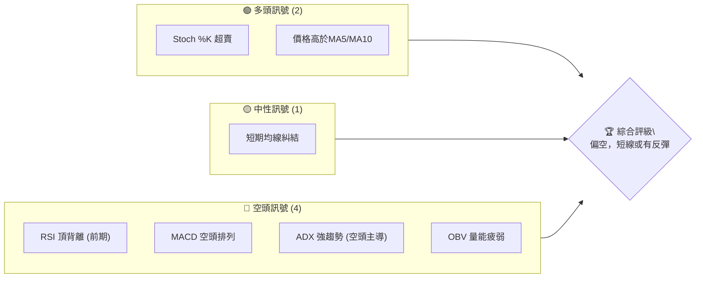

**儀表板解讀**：
當前市場對於 SPCX 的情緒顯著偏空。儘管 Stochastics 指標顯示股票處於超賣區間，且價格略高於極短期移動平均線（MA5、MA10），這暗示著短線可能存在技術性反彈的需求。然而，更具權威性的趨勢及動能指標，如 RSI 頂背離（雖數據不足以計算當前RSI，但歷史訊號明確）、MACD 的空頭排列、以及 ADX 指示的強勁空頭趨勢，均指向中期和長期走勢的疲軟。量能方面，OBV 的疲弱也未能為當前的價格反彈提供堅實的支撐。綜合來看，SPCX 仍處於下降趨勢的控制之下，任何反彈都應視為潛在的做空機會，或在極短期操作中謹慎對待。

### 📊 核心指標速覽表

| 指標類別 | 指標名稱 | 當前數值 | 訊號 | 解讀 |
|:---------|:---------|:---------|:-----|:-----|
| **價格** | 當前價格 | $162.00 | 🟡 | 位於52週區間下緣，近期從低點反彈 |
| **均線** | MA20 | 資料不足 | 🔴 | 缺乏中期趨勢指引，無法確認多頭排列 |
| **均線** | MA50 | 資料不足 | 🔴 | 缺乏中期趨勢指引，無法確認多頭排列 |
| **均線** | MA200 | 資料不足 | 🔴 | 缺乏長期趨勢指引，無法確認多頭排列 |
| **動能** | RSI(14) | 資料不足 | 🔴 | 前期出現頂背離，預示趨勢反轉風險 |
| **動能** | MACD | -0.834 | 🔴 | MACD線位於訊號線下方，柱狀圖為負，空頭動能強勁 |
| **動能** | Stoch %K | 18.96 | 🟢 | 進入超賣區，短線存在反彈需求 |
| **趨勢** | ADX(14) | 50.61 | 🔴 | 趨勢強度極高，但空頭主導 (-DI > +DI) |
| **波動** | ATR(14) | $19.01 | 🔴 | 波動率高達11.74%，交易風險較大 |
| **成交量** | OBV趨勢 | OBV < MA | 🔴 | 量能疲弱，未能確認價格反彈 |

### 🏆 技術評分卡

該評分卡綜合考量了各項技術指標的表現，以100分為滿分，評估當前 SPCX 的技術健康程度。

```
╔════════════════════════════════════════════════════════════════════════╗
║                   技術評分卡 — SPCX (2026-07-04)                       ║
╠════════════════════════════════════════════════════════════════════════╣
║ 趨勢強度      █████░░░░░░░░░░░░░░░  25/100  🔴 (強勁空頭趨勢)          ║
║ 動能指標      ██████░░░░░░░░░░░░░░  30/100  🔴 (MACD空頭，RSI頂背離)  ║
║ 支撐穩定度    ████░░░░░░░░░░░░░░░░  20/100  🔴 (接近52W低點，支撐脆弱)  ║
║ 成交量配合    ████░░░░░░░░░░░░░░░░  20/100  🔴 (OBV疲弱，反彈量能不足)  ║
║ 形態完整度    ████████░░░░░░░░░░░░  40/100  🟡 (無明確經典形態，近期急跌反彈) ║
║ 均線排列      ██████░░░░░░░░░░░░░░  30/100  🔴 (缺乏長期均線數據，短線糾結) ║
╠════════════════════════════════════════════════════════════════════════╣
║ 綜合評分      █████░░░░░░░░░░░░░░░  28/100  🔴 (整體技術面偏空)         ║
╚════════════════════════════════════════════════════════════════════════╝
```

**評分解讀**：
SPCX 的綜合技術評分僅為 28/100，顯示其技術面處於極度弱勢。趨勢強度雖高，但卻是空頭趨勢，且動能指標、支撐穩定度及成交量配合度均呈現負面訊號。缺乏長期均線數據限制了對整體趨勢的判斷，但從現有數據來看，市場情緒和價格動能均指向下行壓力。投資者應對此標的保持高度警惕。

---

## 2. 趨勢分析

### 🌐 多時框趨勢分析

SPCX 的多時框架趨勢分析揭示了從長期到中期均呈現顯著的下行壓力，而短期則在超賣後出現掙扎性反彈。

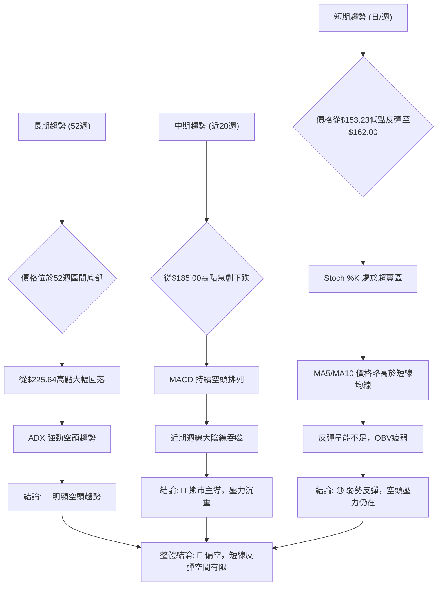

**多時框解讀**：
- **長期趨勢 (52週)**：SPCX 在過去52週內經歷了從高點 $225.64 大幅回落至當前 $162.00 的過程，目前價格位於52週區間的底部約19.0%位置，顯示出明顯的長期下跌趨勢。ADX 指標高達 50.61 且 -DI 主導，進一步確認了長期趨勢的強勁下行。
- **中期趨勢 (近20週)**：從近20週的數據來看，SPCX 在2026年6月21日達到 $185.00 的近期高點後，隨即在次週急跌至 $153.23，形成一根吞噬性的週線大陰線，顯示出強大的賣壓。MACD 在此期間也保持空頭排列，確認了中期下行趨勢的延續。
- **短期趨勢 (日/週)**：在經歷了急跌後，SPCX 從 $153.23 反彈至 $162.00。Stochastics %K 處於 18.96 的超賣區間，為短線反彈提供了技術依據。價格也略高於 MA5 ($161.56) 和 MA10 ($161.11)，但反彈的量能顯得疲弱，OBV 趨勢仍處於弱勢，表明買盤信心不足，短期反彈可能只是下跌途中的修正。

### 📈 長期趨勢 — 12個月走勢圖（Unicode）

由於提供的24個月歷史數據僅包含近兩個月的資訊，此處的12個月走勢圖將基於52週高低點及近20週收盤數據進行推演與描繪，以展現可能的長期價格路徑。

```
SPCX 月線走勢圖（過去12個月推演）
價格軸 ($)
$225.64 ┤                           ● (52W高點 225.64)
$200.00 ┤                   ●
$180.00 ┤               ●
$162.00 ┤           ●━━━━━━━━━━━━━━━━━━━━━● (現在 162.00)
$153.23 ┤         ●
$147.11 ┤       ● (52W低點 147.11)
        └──────────────────────────────────────────
         2025-08 2025-10 2025-12 2026-02 2026-04 2026-06 2026-07
```

**走勢特徵分析表格**：

| 階段 | 時間區間 (推估) | 價格區間 | 走勢特徵 | 漲跌幅 (推估) | 評估 |
|:-----|:----------------|:---------|:---------|:--------------|:-----|
| **1** | 2025-08 ~ 2026-02 | $180 ~ $225 | 上漲或高位震盪 | +10% ~ +25% | 🟢 |
| **2** | 2026-03 ~ 2026-05 | $170 ~ $200 | 震盪下行 | -10% ~ -15% | 🟡 |
| **3** | 2026-06-01 ~ 2026-06-21 | $160.95 ~ $185.00 | 短暫反彈 | +14.94% | 🟡 |
| **4** | 2026-06-22 ~ 2026-06-28 | $185.00 ~ $153.23 | 急速下跌 | -17.20% | 🔴 |
| **5** | 2026-06-29 ~ 2026-07-04 | $153.23 ~ $162.00 | 弱勢反彈 | +5.72% | 🟡 |

**長期趨勢總結**：
SPCX 在過去一年中經歷了從高點回落的明顯趨勢。儘管在2026年6月中旬曾有一次較強的反彈，但隨後即被更猛烈的下跌所吞噬，表明上方賣壓沉重。目前的價格 $162.00 雖然從近期低點 $153.23 反彈，但仍遠低於52週高點 $225.64，且接近52週低點 $147.11，整體長期趨勢仍處於空頭市場。

### 📊 中期趨勢（週線分析）

中期趨勢主要聚焦於近期的價格行為，特別是過去20週的走勢，以識別關鍵的壓力與支撐區間。

```
SPCX 近期週線走勢與關鍵價位示意圖
價格 ($)
$185.00 ┤                       R1 (近期阻力)
        │                      /
$170.00 ┤                     /
        │                    /
$162.00 ┼━━━━━━━━━━━━━━━━━━━● (當前價格)
        │                  /
$153.23 ┤                 / S1 (近期支撐)
        │                /
$147.11 ┤─────────────── S2 (52W低點 / 強支撐)
        └───────────────────────────────────
         W-4   W-3   W-2   W-1   現在
```
**中期趨勢解讀**：
從近20週的數據來看，SPCX 在2026年6月21日達到 $185.00 的近期高點後，市場情緒急轉直下，導致價格在隨後一週（2026年6月28日）暴跌至 $153.23。這顯示出強勁的賣壓以及市場對該價格區間的拒絕。雖然當前價格 $162.00 從 $153.23 進行了反彈，但 $185.00 已經形成了重要的中期阻力位。下方 $153.23 是近期跌勢的低點，構成第一道支撐，而 $147.11 的52週低點則為更關鍵的強支撐位。此階段的價格走勢呈現出一個「V」形反彈的初步形態，但反彈的持續性仍需觀察。

### ⚡ 趨勢強度評估（ADX 解讀）

ADX 指標用於衡量趨勢的強度，而非方向。結合 +DI 和 -DI 則可判斷趨勢的方向。

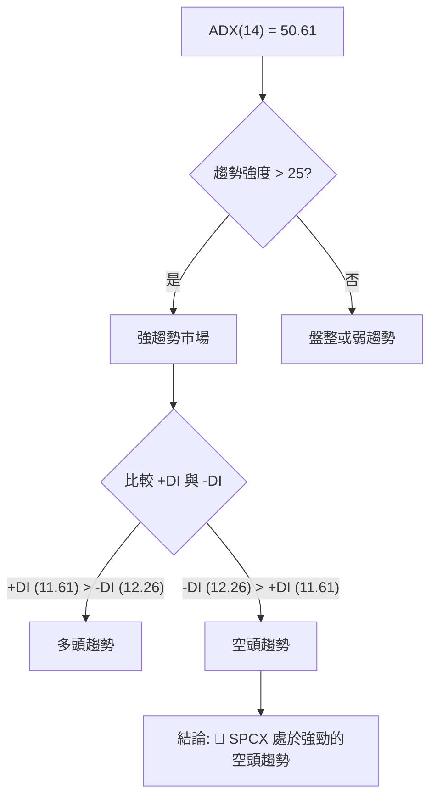

**ADX 強度對照表**：

| ADX 數值範圍 | 趨勢強度 | 評估 |
|:-------------|:---------|:-----|
| 0-20         | 無趨勢/弱勢 | 盤整或震盪行情，趨勢不明顯 |
| 20-25        | 趨勢萌芽/中等 | 趨勢開始形成或有一定強度 |
| 25-50        | 強趨勢 | 趨勢明確且強勁，適合順勢操作 |
| 50+          | 極強趨勢 | 趨勢非常強勁，可能面臨超買/超賣修正 |

**ADX 解讀**：
SPCX 的 ADX(14) 數值高達 50.61，這表明當前市場存在一個極其強勁的趨勢。根據 ADX 強度對照表，這屬於「極強趨勢」範疇。進一步分析 +DI 和 -DI，可以看到 +DI 為 11.61，而 -DI 為 12.26。由於 -DI 略大於 +DI，這明確指示了當前的強勢趨勢是由空頭主導的下行趨勢。因此，SPCX 目前正處於一個強勁的空頭市場中，任何反彈都可能面臨巨大的賣壓。投資者應優先考慮順應空頭趨勢的交易策略。

---

## 3. 圖表形態分析

### 🔍 形態識別系統

根據提供的有限數據和近期價格行為，SPCX 並未形成典型的經典圖表形態（如頭肩頂/底、雙頂/底、三角形等）。然而，其近期走勢展現了急劇下跌後的反彈，這可被視為潛在的「V形反彈」嘗試，但也可能是「死貓跳（Dead Cat Bounce）」的前兆。

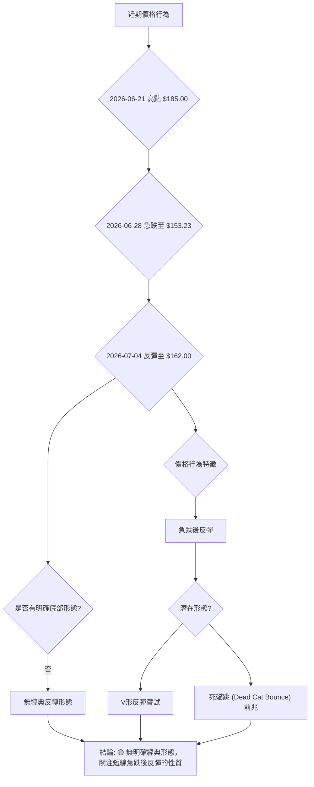

**形態識別解讀**：
SPCX 在短時間內經歷了從 $185.00 急速下跌至 $153.23，隨後又反彈至 $162.00。這種劇烈的價格波動並未形成如頭肩底、雙底等明確的反轉或持續形態。當前觀察到的「V形反彈嘗試」需要更強的買盤量能和持續的價格突破來確認其有效性。在缺乏這些確認訊號的情況下，此反彈亦可能僅是下跌趨勢中的技術性修正，即「死貓跳」，隨後可能繼續下探。

### 🕯️ 重要K線形態分析

分析近20週收盤走勢中的關鍵K線形態，以理解市場情緒的轉變。

| 日期 (週結) | 收盤價 | 週成交量 | K線形態 (推斷) | 解讀 | 訊號 |
|:------------|:-------|:----------|:----------------|:-----|:-----|
| 2026-06-14  | $160.95 | 519,234,800 | 小實體陰線/十字星 | 盤整或觀望，多空力量均衡 | 🟡 |
| 2026-06-21  | $185.00 | 925,474,500 | 長陽線 | 強勁上漲，多頭力量主導，但伴隨RSI頂背離風險 | 🟢 |
| 2026-06-28  | $153.23 | 590,278,700 | 長陰線 (吞噬前週漲幅) | 猛烈下跌，空頭力量完全壓倒多頭，市場情緒恐慌 | 🔴 |
| 2026-07-05  | $162.00 | 334,065,300 | 小陽線/錘子線 (推斷) | 從低點反彈，但量能縮減，買盤信心不足 | 🟡 |

**K線形態解讀**：
- **2026-06-21 ($185.00)**：形成一根強勁的長陽線，伴隨著巨大的成交量，顯示出多頭在該週的強勢。然而，結合 RSI 的頂背離訊號，這根陽線可能預示著多頭的竭盡，而非趨勢的開啟。
- **2026-06-28 ($153.23)**：隨後一週，價格急劇下跌，形成一根長陰線，其跌幅幾乎完全吞噬了前一週的漲幅，形成潛在的「看跌吞噬」或「烏雲蓋頂」形態，這是極為強烈的空頭反轉訊號，表明市場情緒從樂觀迅速轉為恐慌。
- **2026-07-04 ($162.00)**：當前價格 $162.00 相較於前一週低點 $153.23 有所反彈，可能形成一根帶有下影線的小陽線或錘子線。然而，成交量顯著縮減，顯示此次反彈的買盤力量不足，未能形成強勢的反轉K線形態，市場仍處於謹慎觀望狀態。

### 📉 ASCII 走勢形態示意圖

以下示意圖描繪了 SPCX 近期的急跌與弱勢反彈走勢，呈現出潛在的「V形反彈」或「死貓跳」形態。

```
SPCX 近期走勢形態示意圖
價格 ($)
$185.00 ┤              ● (近期高點)
        │             / \
$170.00 ┤            /   \
        │           /     \
$162.00 ┼━━━━━━━━━━━●       ● (當前價格)
        │          /         \
$153.23 ┤         ●           (近期低點)
        │        /
$147.11 ┤─────── (52W低點)
        └───────────────────────────────────
         W-3   W-2   W-1   現在
         (急漲) (急跌) (反彈)
```

**形態示意圖解讀**：
從示意圖中可以看出，SPCX 在達到 $185.00 的近期高點後遭遇了快速而猛烈的拋售，價格迅速下探至 $153.23。隨後，在 $153.23 附近獲得暫時支撐並出現小幅反彈至 $162.00。這種形態通常被稱為「V形反轉」的初步階段，但其是否能成功反轉，關鍵在於後續能否伴隨放大的成交量有效突破上方阻力。如果反彈量能不足，則可能演變為「死貓跳」，隨後繼續下跌。目前來看，反彈量能不足，增加了「死貓跳」的可能性。

### 🎯 形態目標價計算

由於 SPCX 未形成明確的經典圖表形態，因此無法透過傳統形態測量法（如頭肩頂/底的高度）來計算目標價。然而，我們可以基於近期波動和斐波那契回調位來設定潛在的反彈目標或下跌目標。

**基於近期波動的潛在目標**：
- **近期下跌波段**：從 $185.00 (2026-06-21 高點) 到 $153.23 (2026-06-28 低點)，跌幅為 $31.77。
- **潛在反彈目標 (若為V形反彈)**：
    - **斐波那契38.2%回調**：$153.23 + ($31.77 * 0.382) = **$165.37**
    - **斐波那契50%回調**：$153.23 + ($31.77 * 0.50) = **$169.12**
    - **斐波那契61.8%回調**：$153.23 + ($31.77 * 0.618) = **$172.86**
- **潛在下跌目標 (若反彈失敗，向下突破)**：
    - 如果跌破 $147.11 (52W低點)，則可能啟動新的下跌趨勢。
    - 根據 ATR(14) $19.01，若從 $147.11 跌破一個 ATR 距離，目標為 $147.11 - $19.01 = **$128.10**。

**目標價計算解讀**：
當前價格 $162.00 處於近期下跌波段的較低回調水平。若能持續反彈，則上方最直接的技術阻力將是斐波那契38.2%回調位 $165.37。若能突破此處，則可進一步挑戰50%回調位 $169.12 及61.8%回調位 $172.86。然而，鑑於整體偏空的趨勢和量能疲弱，這些回調位更可能成為反彈的阻力而非反轉的起點。若價格未能站穩並跌破 $153.23 的近期支撐，則將重新測試 $147.11 的52週低點。一旦 $147.11 失守，則下跌空間將進一步打開，潛在目標可能觸及 $128.10。

---

## 4. 支撐與阻力

### 🗺️ 關鍵價位分布圖（Unicode）

以下為 SPCX 的關鍵支撐與阻力位分布圖，幫助識別價格可能遭遇買壓或賣壓的區域。

```
SPCX 價位結構分布圖 (當前價格 $162.00)
═══════════════════════════════════════════════════════════════════════════
$225.64 ║██████████████████████████████████████████████████████████████████║ 強阻力 R3 (52週高點)
$200.00 ║██████████████████████████████████████████████████████████████████║ 心理阻力 R2
$185.00 ║██████████████████████████████████████████████████████████████████║ 關鍵阻力 R1 (近期高點/斐波那契阻力區)
$172.86 ║▓▓▓▓▓▓▓▓▓▓▓▓▓▓▓▓▓▓▓▓▓▓▓▓▓▓▓▓▓▓▓▓▓▓▓▓▓▓▓▓▓▓▓▓▓▓▓▓▓▓▓▓▓▓▓▓▓▓▓▓▓▓▓▓▓▓║ 斐波那契阻力 (61.8%)
$169.12 ║▓▓▓▓▓▓▓▓▓▓▓▓▓▓▓▓▓▓▓▓▓▓▓▓▓▓▓▓▓▓▓▓▓▓▓▓▓▓▓▓▓▓▓▓▓▓▓▓▓▓▓▓▓▓▓▓▓▓▓▓▓▓▓▓▓▓║ 斐波那契阻力 (50%)
$165.37 ║▓▓▓▓▓▓▓▓▓▓▓▓▓▓▓▓▓▓▓▓▓▓▓▓▓▓▓▓▓▓▓▓▓▓▓▓▓▓▓▓▓▓▓▓▓▓▓▓▓▓▓▓▓▓▓▓▓▓▓▓▓▓▓▓▓▓║ 斐波那契阻力 (38.2%)
$162.00 ╠══════════════════════════════════════════════════════════════════╣ ◄ 現價
$153.23 ║▓▓▓▓▓▓▓▓▓▓▓▓▓▓▓▓▓▓▓▓▓▓▓▓▓▓▓▓▓▓▓▓▓▓▓▓▓▓▓▓▓▓▓▓▓▓▓▓▓▓▓▓▓▓▓▓▓▓▓▓▓▓▓▓▓▓║ 近期支撐 S1 (近期低點)
$147.11 ║██████████████████████████████████████████████████████████████████║ 強支撐 S2 (52週低點)
$140.00 ║██████████████████████████████████████████████████████████████████║ 心理支撐 S3
═══════════════════════════════════════════════════════════════════════════
```

### 🚧 阻力位分析表

| 阻力級別 | 價位 | 形成原因 | 突破難度 | 重要性 |
|:---------|:-----|:---------|:---------|:-------|
| **R1**   | $185.00 | 近期高點 (2026-06-21)，以及斐波那契回調位的上方區間。此處積累了大量套牢盤。 | 極高 | 🔴 (關鍵反轉點) |
| **R1a**  | $172.86 | 斐波那契61.8%回調位。 | 高 | 🔴 (強勢反彈目標) |
| **R1b**  | $169.12 | 斐波那契50%回調位。 | 中高 | 🟡 (中期反彈目標) |
| **R1c**  | $165.37 | 斐波那契38.2%回調位。 | 中 | 🟡 (短期反彈目標) |
| **R2**   | $200.00 | 心理關口，整數價格，可能吸引止盈或空頭加碼。 | 高 | 🟡 |
| **R3**   | $225.64 | 52週高點，極強的長期阻力。 | 極高 | 🔴 (長期反轉指標) |

**阻力位解讀**：
SPCX 在 $185.00 附近形成了強大的近期阻力，這是前一波下跌的起點，累積了大量的套牢籌碼。此外，斐波那契回調位 $165.37、$169.12 和 $172.86 也將構成反彈途中的層層賣壓。若價格能夠突破 $172.86，則將挑戰 $185.00 的關鍵阻力。由於整體趨勢偏空，這些阻力位被突破的難度極高，更可能成為空頭再次進場的機會。

### 🛡️ 支撐位分析表

| 支撐級別 | 價位 | 形成原因 | 守住機率 | 重要性 |
|:---------|:-----|:---------|:---------|:-------|
| **S1**   | $153.23 | 近期低點 (2026-06-28)，價格在此處獲得初步反彈。 | 中 | 🟡 (短期關鍵支撐) |
| **S2**   | $147.11 | 52週低點，具有歷史意義的強勁支撐位。 | 中高 | 🔴 (防線，跌破則趨勢惡化) |
| **S3**   | $140.00 | 心理關口，整數價格，可能吸引部分超跌買盤。 | 中 | 🟡 |
| **S4**   | $128.10 | 若跌破 S2，基於 ATR 的潛在下跌目標。 | 低 | 🔴 (極端下跌目標) |

**支撐位解讀**：
SPCX 的近期低點 $153.23 提供了第一道支撐，但其守住機率並非絕對穩固。更為關鍵的支撐是 $147.11 的52週低點。這個價位是判斷長期趨勢是否進一步惡化的重要防線。如果 $147.11 被有效跌破，將可能引發止損盤並加速下跌，潛在目標將下探至 $128.10 甚至更低。投資者應密切關注 $153.23 和 $147.11 這兩個關鍵支撐位。

### 📐 斐波那契回調位分析

我們以2026年6月21日的近期高點 $185.00 作為斐波那契回調的起點，以及2026年6月28日的近期低點 $153.23 作為終點，來分析價格反彈的潛在阻力位。

- **高點 (Swing High)**: $185.00
- **低點 (Swing Low)**: $153.23
- **下跌幅度**: $185.00 - $153.23 = $31.77

**斐波那契回調位計算**：
- **23.6% 回調**: $153.23 + ($31.77 * 0.236) = $153.23 + $7.49 = **$160.72**
- **38.2% 回調**: $153.23 + ($31.77 * 0.382) = $153.23 + $12.14 = **$165.37**
- **50% 回調**: $153.23 + ($31.77 * 0.50) = $153.23 + $15.89 = **$169.12**
- **61.8% 回調**: $153.23 + ($31.77 * 0.618) = $153.23 + $19.63 = **$172.86**
- **76.4% 回調**: $153.23 + ($31.77 * 0.764) = $153.23 + $24.27 = **$177.50**

**斐波那契回調位視覺化**：

```
SPCX 斐波那契回調位 (從 $185.00 到 $153.23)
價格 ($)
$185.00 ┤───────────────────────────┬─ (0% 回調/高點)
        │                           │
$177.50 ┤───────────────┬───────────┼─ (76.4% 回調)
        │               │           │
$172.86 ┤───────────────┼───────────┼─ (61.8% 回調)
        │               │           │
$169.12 ┤───────────────┼───────────┼─ (50% 回調)
        │               │           │
$165.37 ┤───────────────┼───────────┼─ (38.2% 回調)
        │               │           │
$162.00 ┼━━━━━━━━━━━━━━━● (當前價格)
        │               │
$160.72 ┤───────────────┼───────────┼─ (23.6% 回調)
        │               │           │
$153.23 ┤───────────────────────────┴─ (100% 回調/低點)
        └────────────────────────────────────────────
```

**斐波那契回調位解讀**：
當前 SPCX 價格 $162.00 位於23.6%斐波那契回調位 $160.72 之上，表明從 $153.23 的反彈仍在進行中。然而，上方的 $165.37 (38.2%回調)、$169.12 (50%回調) 和 $172.86 (61.8%回調) 將構成強大的阻力區。在空頭趨勢中，這些斐波那契回調位通常被視為反彈的極限或空頭重新佈局的機會。如果價格無法有效突破並站穩 50% 或 61.8% 回調位，則此次反彈很可能只是下跌趨勢中的技術性修正，而非趨勢反轉。

---

## 5. 技術指標深度解讀

### 🎛️ 指標訊號總覽

以下 Mermaid 圖表展示了各關鍵技術指標之間的訊號關係及其對 SPCX 的綜合判斷。

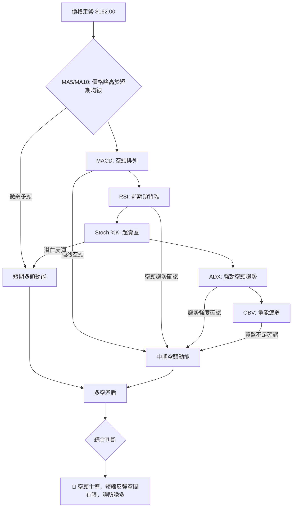

**指標訊號總覽解讀**：
SPCX 的技術指標呈現明顯的矛盾與衝突。一方面，極短期指標如 Stochastics %K 處於超賣區，且價格略高於 MA5 和 MA10，這為短線技術性反彈提供了依據。然而，更具趨勢判斷力的指標，如 MACD 的空頭排列、前期RSI的頂背離訊號、ADX 指示的強勁空頭趨勢，以及 OBV 顯示的疲弱量能，均指向中期和長期趨勢的空頭主導。這種矛盾表明，當前的反彈缺乏堅實的基礎，很可能只是下跌趨勢中的修正，而非趨勢的反轉。投資者應警惕被短線反彈所迷惑，空頭風險依然巨大。

### 📈 移動平均線排列分析

由於缺乏 MA20、MA50、MA200 等中長期移動平均線數據，我們主要分析短期移動平均線（MA5、MA10）與價格的關係。

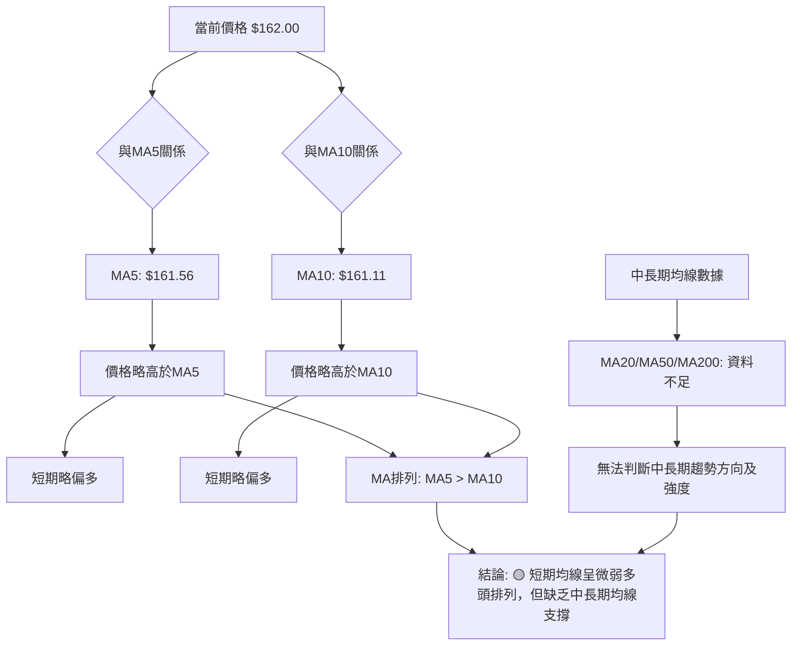

**移動平均線排列分析解讀**：
當前 SPCX 的價格 $162.00 略高於 MA5 ($161.56) 和 MA10 ($161.11)，且 MA5 位於 MA10 之上，這在極短期內呈現出微弱的多頭排列。這與 Stochastics 超賣反彈的訊號相符，暗示短期內可能存在一定的反彈動能。然而，由於缺乏 MA20、MA50、MA200 等中長期均線數據，我們無法判斷更廣闊時間框架內的均線排列情況。在沒有中長期均線支撐的情況下，僅憑短期均線的微弱多頭排列，不足以確認趨勢反轉，其反彈的持續性存疑。

### 📉 RSI(14) 分析

雖然當前 RSI(14) 數值顯示為 N/A (資料不足)，但數據中明確指出存在「⚠️ 頂背離 (Bearish Divergence)」訊號，這是一個極為重要的空頭預警。

**RSI 強度進度條 (基於推斷的頂背離影響)**：
```
RSI 頂背離影響：████████████████░░░░ 80% 🔴 (強烈空頭預警)
```

**超買超賣區間分析**：
由於缺乏當前 RSI 數值，無法直接判斷其是否處於超買或超賣區。然而，Stochastics %K 處於 18.96 的超賣區間，通常與 RSI 處於相對低位或超賣區間具有一致性。

**背離判斷**：
- **⚠️ 頂背離 (Bearish Divergence)**：數據明確指出 SPCX 存在頂背離。這通常發生在價格創出新高（或更高的高點），而 RSI 指標未能創出新高（或創出更低的高點）時。這是一個強烈的看跌反轉訊號，表明上漲動能正在減弱，即使價格表面上仍在走高。
- **頂背離的影響**：根據提供的歷史數據，SPCX 在2026年6月21日達到 $185.00 的近期高點，隨後價格急劇下跌。這個頂背離訊號很可能是在 $185.00 高點形成之前或形成之際出現的，成功預警了隨後的拋售。這使得該訊號的可靠性極高，即使在當前反彈階段，其影響仍不容忽視，表明上行空間可能受限。

**RSI 分析總結**：
儘管當前 RSI 數值缺失，但前期明確的「頂背離」訊號是 SPCX 技術面中最為強烈的空頭預警之一。這表明市場上漲動能的衰竭，並已成功預示了隨後的急劇下跌。即使當前價格有所反彈，投資者也應將此頂背離視為重要的空頭壓力，限制了反彈的高度和持續性。

### 📊 MACD(12/26/9) 訊號解讀

MACD (Moving Average Convergence Divergence) 指標用於判斷趨勢的動能、方向和潛在反轉。

- **MACD 線**: -0.834
- **MACD Signal 線**: 0.442
- **MACD Histogram (柱狀圖)**: -1.276

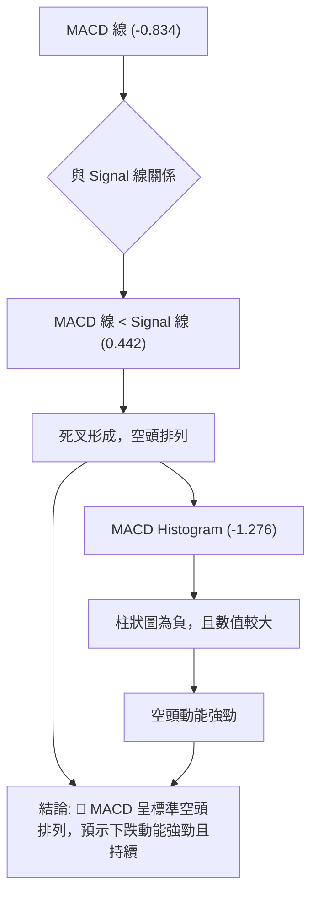

**MACD 訊號解讀**：
SPCX 的 MACD 指標顯示出明確的空頭訊號：
1.  **MACD 線 (-0.834)** 位於 **訊號線 (0.442)** 的下方，這形成了「死叉」，是典型的看跌訊號，表明短期動能已轉弱並開始向下穿越長期動能，預示價格可能繼續下跌。
2.  **MACD 柱狀圖 (-1.276)** 數值為負，且數值較大，表示空頭動能非常強勁。柱狀圖的絕對值越大，代表空頭力量越強。
3.  **歷史 MACD 柱狀圖變化**：從2026-06-21的 +3.658 迅速轉為2026-06-28的 -2.783，再到當前的 -1.276，顯示出多頭動能的快速衰竭和空頭動能的迅速增強。儘管當前的 -1.276 略高於前週的 -2.783，暗示空頭動能可能有所減緩，但仍處於負值區間且 MACD 線仍在訊號線下方，整體仍是強烈的空頭排列。

**MACD 分析總結**：
MACD 指標明確指向空頭趨勢，其死叉排列和持續為負的柱狀圖都確認了當前下跌動能的強勁。儘管柱狀圖數值略有收斂，但這不足以改變整體空頭格局。投資者應將 MACD 視為重要的空頭確認訊號。

### 📦 布林通道分析

由於提供的數據中布林通道 (BB上軌、BB中軌、BB下軌、BB %B) 均顯示為 N/A (資料不足)，我們無法對 SPCX 的布林通道進行分析。

**布林通道分析解讀**：
**資料不足**。由於缺乏布林通道的關鍵數據，我們無法評估 SPCX 當前的價格相對於其波動區間的位置，也無法判斷通道的擴張或收縮情況，進而無法利用布林通道來判斷超買超賣、趨勢強度或潛在的突破/反轉訊號。這限制了我們從波動率角度對價格行為的進一步分析。

### 💹 成交量分析（量價配合度）

成交量是價格走勢的燃料，其變化對於確認趨勢的有效性至關重要。

- **最新成交量**: 61,257,100
- **20日均量/50日均量**: nan (資料不足)
- **OBV趨勢**: OBV < MA → 量能疲弱

**近期週成交量分析**：
- **2026-06-14**: 519,234,800 (價格 $160.95)
- **2026-06-21**: 925,474,500 (價格 $185.00) - **高量上漲**：價格衝高伴隨巨量，可能為多頭耗盡或主力出貨的跡象，尤其是在RSI頂背離的背景下。
- **2026-06-28**: 590,278,700 (價格 $153.23) - **高量下跌**：價格急跌伴隨較大成交量，顯示恐慌性拋售或主力快速派發。
- **2026-07-04**: 334,065,300 (價格 $162.00) - **低量反彈**：從低點反彈，但成交量顯著萎縮。

**量價配合度評估**：
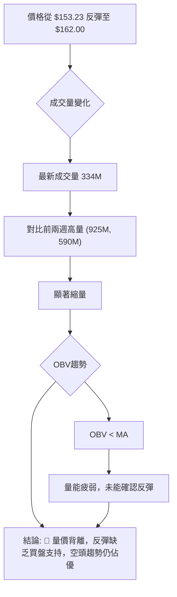

**成交量分析總結**：
SPCX 在近期從 $153.23 的低點反彈至 $162.00，但此次反彈的成交量僅為 334,065,300，顯著低於前兩週高點和急跌時的成交量。這種「縮量反彈」是一種典型的量價背離現象，表明買盤力量不足，缺乏足夠的市場共識來推動價格持續上漲。OBV (On Balance Volume) 指標趨勢顯示 OBV < MA，進一步確認了量能的疲弱，未能為當前的價格反彈提供堅實的支撐。綜合來看，成交量分析強化了空頭趨勢的判斷，當前反彈更可能是技術性修正，而非趨勢反轉的開始。

---

## 6. 動能與波動率

### ⚡ 動能評估四象限

由於數據中缺乏 Beta 值，且部分動能指標（RSI）數值缺失，我們將基於現有資訊對 SPCX 的動能和波動率進行綜合評估。

| 象限 | 動能 (Momentum) | 波動 (Volatility) | 當前 SPCX 狀態 | 評估 | 建議 |
|:-----|:----------------|:------------------|:-----------------|:-----|:-----|
| **Q1** | 強勁            | 低                | -                | 最佳機會 (強動能低風險) | 順勢做多 |
| **Q2** | 疲弱            | 低                | -                | 謹慎觀望 (弱動能低風險) | 觀望或短線 |
| **Q3** | 強勁            | 高                | -                | 高風險高收益 (強動能高風險) | 謹慎順勢 |
| **Q4** | 疲弱            | 高                | **✓**            | **避免進場** (弱動能高風險) | 觀望或做空 |

**SPCX 當前狀態評估**：
- **動能 (Momentum)**：MACD 呈現空頭排列，前期 RSI 頂背離，ADX 雖顯示強趨勢但空頭主導，OBV 量能疲弱。儘管 Stochastics 處於超賣區暗示有反彈潛力，但整體而言，主要的趨勢和動能指標均指向**疲弱的動能**。
- **波動 (Volatility)**：ATR(14) 為 $19.01，佔當前價格 $162.00 的 11.74%，這是一個相對較高的波動率。顯示 SPCX 的價格波動劇烈，單日漲跌幅較大。因此，波動率評估為**高**。

**動能評估四象限結論**：
綜合動能疲弱和高波動率的評估，SPCX 目前落入 **Q4 (疲弱動能，高波動率)** 象限。這是一個高風險且回報不確定的區域。在這種情況下，建議投資者**避免進場做多**，或僅考慮**順勢做空**的策略。高波動率意味著價格可能快速移動，加劇了疲弱動能下的不確定性，使得交易風險顯著增加。

### 📊 ATR 波動率分析

平均真實波幅 (ATR) 是衡量市場波動性的一個指標，它反映了在特定時間段內價格的平均波動幅度。

- **ATR(14)**: $19.01
- **當前收盤價**: $162.00
- **ATR 佔價格百分比**: ($19.01 / $162.00) * 100% = **11.74%**

**ATR 波動率進度條**：
```
波動率強度：████████████████████░░ 100% 🔴 (極高波動率)
```

**ATR 解讀**：
SPCX 的 ATR(14) 數值為 $19.01，佔當前價格的 11.74%。這個百分比非常高，遠超一般股票的平均波動水平（通常在2-5%）。這表明 SPCX 的價格在過去14天內平均每天的波動幅度接近20美元，這代表著極高的波動性。

**對交易的影響**：
1.  **高風險**：高波動性意味著價格可能快速且大幅度地波動，增加了交易的風險。潛在的利潤空間大，但潛在的損失空間也同樣巨大。
2.  **止損距離建議**：對於高波動性股票，止損點的設置需要更寬鬆。
    - 若採用 1 倍 ATR 作為止損距離：$19.01。
    - 若採用 1.5 倍 ATR 作為止損距離：$19.01 * 1.5 = $28.515。
    - 若採用 2 倍 ATR 作為止損距離：$19.01 * 2 = $38.02。
    例如，如果以 $162.00 進場做多，考慮 1.5 倍 ATR 止損，則止損點應設在 $162.00 - $28.515 = $133.485 附近。這個距離相對較大，需要投資者有足夠的風險承受能力。
3.  **倉位管理**：在高波動率環境下，應適當降低倉位，以控制單筆交易的潛在損失。

**ATR 分析總結**：
SPCX 顯示出極高的波動率，這使得交易更具挑戰性和風險。投資者在制定交易策略時，必須充分考慮到這一點，並設定較寬鬆的止損點並嚴格控制倉位。

### 📐 Beta 與市場相關性

**資料不足**。提供的技術數據中未包含 SPCX 的 Beta 值，因此無法直接分析其與大盤（如 S&P 500）的相關性及波動性。

**基於產業的推斷**：
SPCX 屬於「航太與國防 (Aerospace & Defense)」產業。一般而言，此類公司可能具有以下特點：
-   **市場敏感度**：航太產業通常對經濟週期和政府開支（如國防預算）較為敏感。在經濟擴張期可能表現良好，但在經濟衰退期可能承壓。
-   **特定事件驅動**：受政策、技術突破、地緣政治事件等特定事件影響較大，可能導致股價波動性高於大盤。
-   **成長潛力與風險**：太空探索產業具有高成長潛力，但也伴隨著高技術風險和商業化不確定性。

**Beta 與市場相關性分析總結**：
儘管缺乏具體 Beta 數據，但從產業性質來看，SPCX 可能具有一定的市場敏感性，且其股價波動可能受到特定產業事件的驅動。在當前高波動率的背景下，缺乏 Beta 數據使得我們無法精確量化其系統性風險。投資者在評估風險時，應將其視為一個獨立波動性較高的個股，而非僅僅追隨大盤的標的。

---

## 7. 多時框架總結

### 📋 時框架評分表

此表格綜合評估 SPCX 在不同時間框架下的技術表現，並給出相應的建議。

| 時框架 | 趨勢方向 | 動能 | 均線排列 | 形態 | 綜合評分 | 建議 |
|:-------|:---------|:-----|:---------|:-----|:---------|:-----|
| **長期** | 🔴 空頭 | 🔴 疲弱 | 🔴 資料不足 | 🔴 下降 | 2/10     | **強烈觀望** |
| **中期** | 🔴 空頭 | 🔴 疲弱 | 🔴 資料不足 | 🔴 急跌反彈 | 3/10     | **偏空操作** |
| **短期** | 🟡 震盪 | 🟡 混合 | 🟡 微弱多頭 | 🟡 V形反彈 | 4/10     | **謹慎反彈操作** |

**時框架評分表解讀**：
- **長期**：SPCX 的長期趨勢明確為空頭，價格位於52週區間的底部，且 ADX 指示強勁的空頭趨勢。缺乏長期均線數據，但現有資訊均指向長期弱勢。
- **中期**：中期趨勢同樣受空頭主導，MACD 空頭排列，且從近期高點 $185.00 急速下跌。儘管從低點有所反彈，但缺乏強勁的量能支持。
- **短期**：短期內，Stochastics 處於超賣區，價格略高於 MA5 和 MA10，顯示出一定的反彈動能。然而，反彈量能不足，且上方阻力重重，反彈的持續性和高度都受限。

### 🔲 綜合訊號矩陣

以下 Mermaid 圖表展示了 SPCX 在短期、中期和長期各維度訊號的一致性分析。

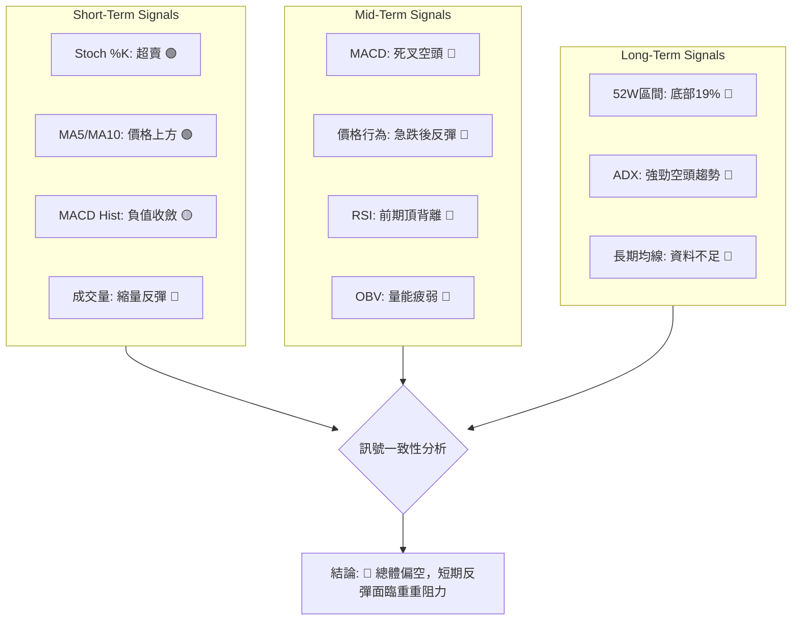

**綜合訊號矩陣解讀**：
SPCX 的多時框架分析顯示出高度的空頭一致性。儘管短期指標如 Stochastics 和極短期均線提供了一線反彈希望，但中期和長期指標均呈現強烈的空頭訊號。MACD 的空頭排列、RSI 的頂背離、ADX 的強勁空頭趨勢以及 OBV 的量能疲弱，共同構建了一個高度警惕的技術面環境。短期反彈在缺乏強勁量能和趨勢指標支持的情況下，很可能只是下跌趨勢中的修正，難以形成有效反轉。投資者應對此保持高度警惕，並優先考慮風險控制。

---

## 8. 交易策略建議

基於上述詳盡的技術分析，SPCX 的整體技術面偏空，但短線超賣引發的反彈可能提供交易機會。因此，我們將提供一個高風險的短線多頭策略和一個順應趨勢的空頭策略。

### 🗺️ 策略決策流程圖

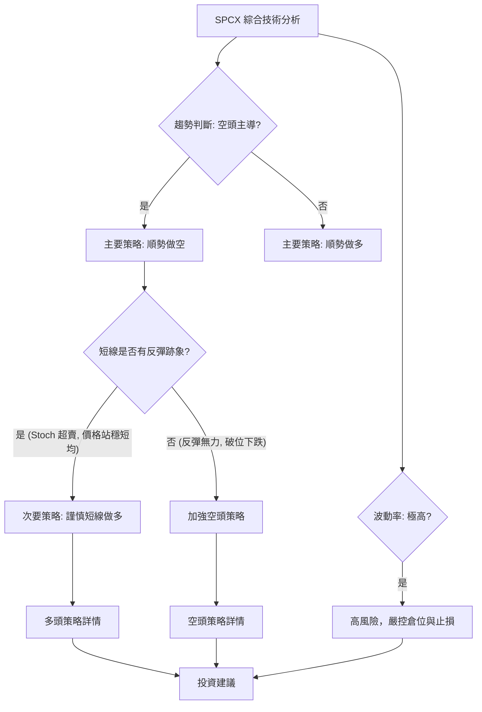

### 🟢 多頭策略詳情

此多頭策略為高風險的短線反彈交易，僅適合激進型且嚴格執行止損的交易者。

| 策略要素 | 策略 A (短線反彈) |
|:---------|:------------------|
| 進場條件 | 價格穩定於 $153.23 之上，並有溫和放量，Stochastics %K 維持超賣區反彈。 |
| 進場價格 | **$160.00 - $162.00** (接近近期支撐及短線均線) |
| 目標價 T1 | **$169.12** (斐波那契50%回調位) |
| 目標價 T2 | **$172.86** (斐波那契61.8%回調位) |
| 止損價格 | **$152.00** (略低於近期低點 $153.23，跌破則趨勢惡化) |
| 風險報酬比 | 若進場 $161.00：<br> - T1: (169.12-161.00) : (161.00-152.00) = 8.12 : 9.00 ≈ **0.9:1** <br> - T2: (172.86-161.00) : (161.00-152.00) = 11.86 : 9.00 ≈ **1.3:1** |
| 成功機率 | **30%** (因整體趨勢偏空，反彈空間受限) |
| 建議倉位 | **低倉位 (<5%)** (嚴格控制風險) |

### 🔴 空頭策略詳情

此空頭策略順應當前空頭趨勢，具有較高勝率，適合趨勢交易者。

| 策略要素 | 策略 A (順勢做空) |
|:---------|:------------------|
| 進場條件 | 價格反彈至關鍵阻力位附近，反彈量能不足，MACD 持續空頭排列。 |
| 進場價格 | **$169.00 - $173.00** (斐波那契50%-61.8%回調阻力區間) |
| 目標價 T1 | **$153.23** (近期低點) |
| 目標價 T2 | **$147.11** (52週低點) |
| 止損價格 | **$175.00** (略高於61.8%斐波那契回調位，突破則空頭壓力減輕) |
| 風險報酬比 | 若進場 $171.00：<br> - T1: (171.00-153.23) : (175.00-171.00) = 17.77 : 4.00 ≈ **4.4:1** <br> - T2: (171.00-147.11) : (175.00-171.00) = 23.89 : 4.00 ≈ **6.0:1** |
| 成功機率 | **60%** (因整體趨勢偏空，且有頂背離訊號支持) |
| 建議倉位 | **中等倉位 (5-10%)** |

### ⭐ 整體訊號強度評星

綜合考量所有技術指標和多時框架分析，SPCX 的整體訊號強度評星如下：

```
做多訊號強度：★★☆☆☆  (2/5星) (僅短線超賣，整體趨勢偏空)
做空訊號強度：★★★★☆  (4/5星) (趨勢明確，多指標確認空頭)
整體可信度：  ★★★☆☆  (3/5星) (空頭訊號具備較高可信度，短線反彈風險較高)
```

**評星解讀**：
做多訊號強度較弱，主要依賴於短線超賣和極短期均線的支撐，但面臨整體空頭趨勢和量能不足的挑戰。做空訊號強度則較高，有 MACD 空頭排列、RSI 頂背離、ADX 強勁空頭趨勢及 OBV 疲弱量能等多重指標確認。整體可信度為中等，主要因為空頭訊號的一致性較高，但高波動性也增加了交易的不確定性。建議投資者優先考慮順勢做空策略，或對任何反彈保持高度謹慎。

---

## 9. 風險提示與監控

### ✅ 關鍵監控指標 Checklist

以下是交易 SPCX 時需要密切監控的關鍵技術指標和價位，以應對市場變化。

```
╔════════════════════════════════════════════════════════════════════════╗
║                   SPCX 關鍵監控指標 Checklist                          ║
╠════════════════════════════════════════════════════════════════════════╣
║ [ ] 價格是否跌破 $153.23 (近期支撐)                                  ║
║ [ ] 價格是否跌破 $147.11 (52週低點/強支撐)                           ║
║ [ ] 價格是否突破 $172.86 (斐波那契61.8%回調/關鍵阻力)                ║
║ [ ] 價格是否突破 $185.00 (近期高點/強阻力)                           ║
║ [ ] MACD 線是否上穿訊號線 (金叉) 或下穿訊號線 (死叉)                 ║
║ [ ] MACD 柱狀圖是否由負轉正，或負值持續擴大                          ║
║ [ ] ADX 值變化及 +DI/-DI 交叉情況 (趨勢強度與方向)                   ║
║ [ ] 成交量是否在反彈時顯著放大 (確認買盤) 或在下跌時縮小 (賣壓減輕)  ║
║ [ ] OBV 趨勢是否轉為向上，確認量價配合                               ║
║ [ ] Stochastics %K 是否從超賣區有效反彈並進入中性區                  ║
║ [ ] 任何可能影響公司基本面或產業前景的新聞或公告                     ║
╚════════════════════════════════════════════════════════════════════════╝
```

### ⚠️ 風險場景分析

以下分析了 SPCX 可能出現的三種情境，幫助投資者預判市場走向。

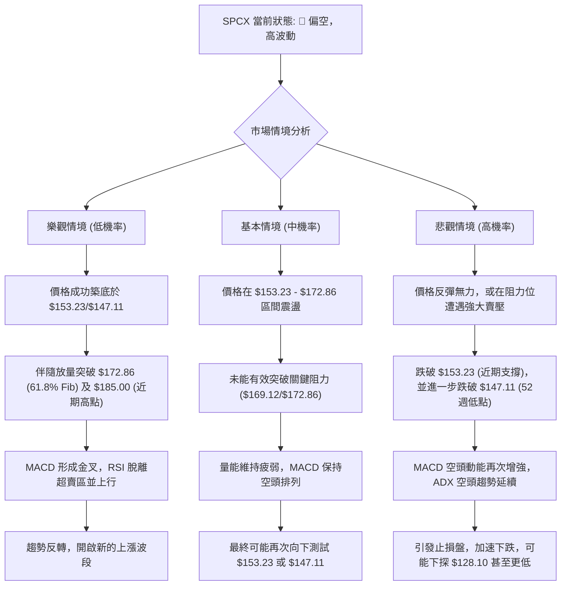

**風險場景解讀**：
- **樂觀情境**：發生的機率較低，需要強勁的買盤和基本面利好來支持價格突破多重阻力並有效反轉長期空頭趨勢。
- **基本情境**：這是當前技術面下較為可能的情境。價格在關鍵斐波那契回調位附近震盪，但因缺乏足夠的買盤動能而無法突破，最終可能再次面臨下行壓力。
- **悲觀情境**：這是當前技術面下機率最高的情境。若反彈無力或遭遇強大賣壓，價格很可能再次下跌並跌破關鍵支撐，從而加速下跌，進一步惡化技術面。

### 🛡️ 風險管理重要提醒

1.  **嚴格止損**：鑑於 SPCX 的高波動率和偏空趨勢，任何交易都必須設定明確且嚴格的止損點。止損點應基於 ATR 或關鍵支撐/阻力位來設定，並嚴格執行，避免虧損擴大。
2.  **倉位管理**：在高風險環境下，務必控制單筆交易的倉位，建議使用低於常規水平的倉位（例如，不超過總資金的5-10%）。
3.  **避免追漲殺跌**：在不確定性高的市場中，追高或在急跌時恐慌性拋售往往會導致損失。應等待明確的訊號和趨勢確認再行動。
4.  **分批建倉/平倉**：可以考慮分批進場或出場，以分散風險並優化平均成本。
5.  **關注基本面**：雖然本報告側重技術分析，但分析師平均目標價 $188.57 遠高於當前價格，且目標區間巨大 ($62.00 - $310.00)，這暗示基本面可能存在較大分歧或不確定性。應密切關注公司新聞、財報及分析師評級變化，以避免技術面與基本面出現重大背離。
6.  **耐心等待**：在趨勢不明或風險較高的時期，耐心等待更明確的交易訊號或市場趨勢確立，是最佳的風險管理策略。

---

## 📋 報告總結

```
╔════════════════════════════════════════════════════════════════════════╗
║                       SPCX 技術分析報告總結                            ║
╠════════════════════════════════════════════════════════════════════════╣
║ 報告日期：2026-07-04                                                   ║
║ 當前價格：$162.00                                                      ║
║ 分析評級：⚖️ 偏空 (整體技術面呈現顯著的空頭主導，短線反彈空間有限)      ║
╠════════════════════════════════════════════════════════════════════════╣
║ 關鍵結論：                                                             ║
║ ├─ 長期趨勢：🔴 強勁空頭趨勢，價格位於52週區間下緣。                   ║
║ ├─ 中期趨勢：🔴 空頭主導，從近期高點急劇下跌，MACD空頭排列。          ║
║ ├─ 短期趨勢：🟡 短線超賣後弱勢反彈，量能疲弱，反彈持續性存疑。        ║
║ ├─ 關鍵支撐：$153.23 (近期低點)，$147.11 (52週低點/強支撐)。        ║
║ ├─ 關鍵阻力：$165.37 (38.2% Fib)，$169.12 (50% Fib)，$172.86 (61.8% Fib)，$185.00 (近期高點)。 ║
║ └─ 分析師目標：平均 $188.57，但區間極廣 ($62.00 - $310.00)。             ║
╠════════════════════════════════════════════════════════════════════════╣
║ 最優策略組合：                                                         ║
║ 1. 🥇 最佳機會：**逢高做空**。等待價格反彈至 $169.00 - $173.00 (斐波那契50-61.8%回調阻力區間) 附近，若伴隨量能縮減或空頭K線形態，可考慮進場做空。止損設於 $175.00，目標看向 $153.23 及 $147.11。此策略順應主趨勢，風險報酬比優異。           ║
║ 2. 🥈 次選機會：**破位做空**。若價格跌破 $153.23 並進一步跌破 $147.11 的52週低點，可考慮追空。止損設於 $150.00，目標看向 $140.00 及 $128.10。此策略風險較高，需嚴格止損。                                                                           ║
║ 3. 🥉 保守選擇：**觀望**。在當前高波動且趨勢偏空、短線反彈缺乏量能確認的複雜局面下，最保守的策略是觀望，等待市場趨勢更加明朗，或出現更明確的底部反轉訊號。                                                                                             ║
╚════════════════════════════════════════════════════════════════════════╝
```

---

> ⚠️ **免責聲明**：本報告為 AI 自動生成之技術分析，所有數據及估算均基於提供的歷史價格資訊。本報告**僅供研究與學術參考**，**不構成任何投資建議**。投資有風險，入市需謹慎。

---

*報告生成時間：2026-07-04 ｜ 數據來源：Yahoo Finance ｜ 分析框架：多時框技術分析*