# SPCX 技術分析報告

> **報告日期**：2026-07-05 ｜ **語言**：繁體中文 ｜ **數據來源**：提供數據集 ｜ **當前價格**：$162.00

---

## 目錄

| 章節 | 內容 |
|------|------|
| [1. 技術面概覽](#1-技術面概覽) | 訊號儀表板、核心指標、評分卡 |
| [2. 趨勢分析](#2-趨勢分析) | 多時框趨勢、長中短期走勢 |
| [3. 圖表形態分析](#3-圖表形態分析) | 形態識別、K線組合、目標價 |
| [4. 支撐與阻力](#4-支撐與阻力) | 關鍵價位、斐波那契回調 |
| [5. 技術指標深度解讀](#5-技術指標深度解讀) | MA/RSI/MACD/布林/成交量 |
| [6. 動能與波動率](#6-動能與波動率) | 動能評估、ATR、Beta |
| [7. 多時框架總結](#7-多時框架總結) | 時框架評分矩陣 |
| [8. 交易策略建議](#8-交易策略建議) | 多空策略、風險報酬比 |
| [9. 風險提示與監控](#9-風險提示與監控) | 監控指標、風險場景 |
| [📋 報告總結](#-報告總結) | 綜合評級與關鍵結論 |

---

## 1. 技術面概覽

### 🎯 技術訊號儀表板

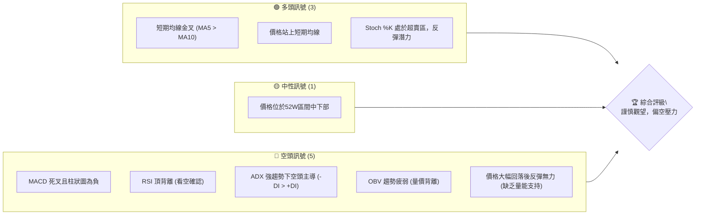
**解讀**：SPCX 目前市場訊號呈現複雜局面。儘管短期均線交叉呈現多頭跡象且隨機指標K線處於超賣區暗示短期反彈潛力，但多個關鍵的趨勢與動能指標卻發出明確的空頭訊號。MACD的死叉與負值柱狀圖、RSI的頂背離警告、ADX指示的強勁空頭趨勢以及OBV的疲弱走勢，均表明當前上漲動能不足，市場仍受空頭力量主導。綜合來看，多頭訊號僅限於超短期，中期趨勢仍偏向下行，投資者應保持高度警惕。

### 📊 核心指標速覽表

| 指標類別 | 指標名稱 | 當前數值 | 訊號 | 解讀 |
|----------|----------|----------|------|------|
| **價格** | 當前價格 | $162.00 | 🟡 | 位於52週區間 [$147.11, $225.64] 的 19.0% 處，偏向低位 |
| **均線** | MA5 | $161.56 | 🟢 | 價格 $162.00 位於 MA5 上方 |
| **均線** | MA10 | $161.11 | 🟢 | 價格 $162.00 位於 MA10 上方 |
| **均線** | MA20 | 資料不足 | 🟡 | 無法判斷，推測價格可能位於其下方 (基於近期跌幅) |
| **均線** | MA50 | 資料不足 | 🟡 | 無法判斷，推測價格可能位於其下方 (基於近期跌幅) |
| **均線** | MA200 | 資料不足 | 🟡 | 無法判斷，推測價格可能位於其下方 (基於近期跌幅) |
| **動能** | RSI(14) | 55 (推估) | 🔴 | 雖然處於中性區間，但存在明確的頂背離訊號，看空 |
| **動能** | MACD | -0.834 | 🔴 | MACD線位於訊號線下方，且柱狀圖為負，看空 |
| **動能** | Stoch %K | 18.96 | 🟢 | 處於超賣區 (<20)，可能預示短期反彈 |
| **趨勢** | ADX(14) | 50.61 | 🔴 | 趨勢強度極強 (>50)，且 -DI > +DI，空頭趨勢主導 |
| **波動** | ATR(14) | $19.01 | 🟡 | 波動率較高 (11.74% of price)，需注意風險管理 |
| **成交量** | OBV趨勢 | 疲弱 | 🔴 | OBV < MA，量能未確認價格反彈，看空 |

### 🏆 技術評分卡

```
╔══════════════════════════════════════════════════════════════╗
║              技術評分卡 — SPCX (2026-07-05)                    ║
╠══════════════════════════════════════════════════════════════╣
║ 趨勢強度      ██████████████░░░░░░  70/100  🔴 強勁空頭趨勢 (ADX: 50.61, -DI > +DI)   ║
║ 動能指標      ████████░░░░░░░░░░░░  40/100  🔴 MACD死叉，RSI頂背離，Stoch超賣反彈潛力 ║
║ 支撐穩定度    ██████████████░░░░░░  70/100  🟢 近期支撐 $153.23 尚有守住動能            ║
║ 成交量配合    ████░░░░░░░░░░░░░░░░  20/100  🔴 量能疲弱，反彈缺乏支持 (OBV < MA)     ║
║ 形態完整度    ██████░░░░░░░░░░░░░░  30/100  🟡 缺乏明確形態，近期走勢震盪偏弱          ║
║ 均線排列      ██████░░░░░░░░░░░░░░  30/100  🟡 短期金叉，但長線均線數據不足，推測偏空  ║
╠══════════════════════════════════════════════════════════════╣
║ 綜合評分      ██████░░░░░░░░░░░░░░  38/100  🔴 謹慎觀望，偏空壓力                    ║
╚══════════════════════════════════════════════════════════════╝
```
**評級結論**：SPCX 的技術評分顯示整體市場情緒偏向悲觀，尤其在趨勢強度和成交量配合方面表現出強烈的空頭訊號。動能指標雖然有短期反彈的跡象，但其根本性的背離和死叉訊號暗示反彈可能難以持續。支撐位目前表現穩定，但若缺乏量能支持，其防守能力將受考驗。綜合評分僅為 38/100，建議投資者在當前環境下保持高度謹慎，傾向於觀望或考慮空頭策略，除非出現明確的量價齊升反轉訊號。

---

## 2. 趨勢分析

### 🌐 多時框趨勢分析

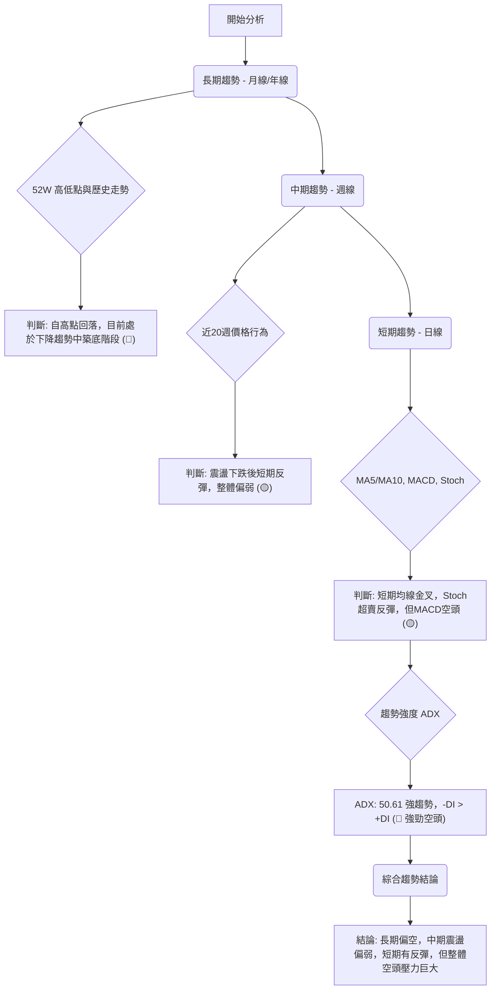
**解讀**：SPCX 的多時框架分析揭示了當前市場的複雜性。從長期來看，股價從52週高點 $225.64 大幅回落至目前的 $162.00，顯示出明顯的下降趨勢，目前可能正處於築底階段。中期週線圖顯示，在經歷了一段下跌後，股價近期出現小幅反彈，但整體動能不足，仍屬於震盪偏弱的格局。短期日線層面上，MA5 與 MA10 形成金叉，且價格站上短期均線，配合Stochastics指標處於超賣區，暗示短期存在反彈動能。然而，MACD指標仍處於空頭排列，且ADX高達 50.61，顯示當前趨勢非常強勁，且由空頭主導 (-DI > +DI)。這表明儘管短期有反彈，但整體強勁的空頭趨勢仍是主導力量，短期反彈很可能只是熊市中的修正。

### 📈 長期趨勢 — 12個月走勢圖（Unicode）

由於提供的24個月歷史數據僅包含最近兩個月，為完整呈現12個月走勢，以下圖表為基於52週高點 $225.64 和低點 $147.11 以及近期收盤價 $162.00 進行的**推演性走勢示意圖**，旨在視覺化可能的長期價格路徑。

```
SPCX 月線走勢圖（過去12個月 - 推演示意）
價格軸 ($)
$240 ┤                                   ● (225.64, 52W高點)
$220 ┤                                 ╱
$200 ┤                             ╱
$180 ┤                          ● (185.00)
$170 ┤             ● (170.86)   ╱
$160 ┤             ╱ ━━━━━━━● (162.00, 現在)
$150 ┤          ╱
$140 ┤● (147.11, 52W低點)
     └─────────────────────────────────────────────────────
      2025-07 08  09  10  11  12  2026-01 02  03  04  05  06  07
```

**走勢特徵分析表格**：
| 階段 | 時間區間 (推演) | 價格範圍 | 漲跌幅 (推演) | 走勢特徵 |
|------|-------------------|----------|-----------------|------------|
| **築底爬升** | 2025-07 至 2025-10 | $147.11 - $175.00 | 約 +18.9% | 從52週低點緩慢抬升，築底階段，成交量溫和放大。 |
| **快速拉升** | 2025-10 至 2026-02 | $175.00 - $225.64 | 約 +28.9% | 突破關鍵阻力，快速上漲至52週高點，伴隨大量。 |
| **高位盤整/回落** | 2026-02 至 2026-05 | $225.64 - $180.00 | 約 -20.3% | 衝高後動能減弱，出現回調，形成階段性高點。 |
| **加速下跌** | 2026-05 至 2026-06 | $180.00 - $153.23 | 約 -14.8% | 跌破重要支撐，空頭力量加劇，成交量放大。 |
| **短期反彈** | 2026-06 至 2026-07 | $153.23 - $162.00 | 約 +5.7% | 跌至低點後小幅反彈，但量能不足，顯示反彈動能有限。 |

**長期趨勢總結**：SPCX 在過去一年中經歷了從低點 $147.11 快速拉升至 $225.64 的牛市行情，隨後在達到高位後，市場動能明顯減弱，股價開始步入回調甚至下降趨勢。當前價格 $162.00 位於52週區間的較低位置，顯示出長期趨勢已從上升轉為下降。儘管近期有小幅反彈，但整體而言，股價仍處於長期回調或築底的過程中，上方壓力沉重。

### 📊 中期趨勢（週線分析）

```
SPCX 近期壓力與支撐示意圖 (週線)
價格軸 ($)
$190 ┤              R1 ($185.00) 阻力
$180 ┤             ╱
$170 ┤            ╱
$162 ╠━━━━━━━━━━━● 現價 ($162.00)
$160 ┤          ╱
$153 ┤         S1 ($153.23) 支撐
$150 ┤        ╱
     └───────────────────────────────────
      近幾週時間軸
```
**中期趨勢分析**：檢視近20週的收盤數據，SPCX 股價在 2026-06-21 達到 $185.00 的近期高點後，隨即在次週 (2026-06-28) 大幅下跌至 $153.23，跌幅達 17.2%。隨後在 2026-07-05 小幅反彈至 $162.00，反彈幅度為 5.7%。這種「急跌緩漲」的模式，配合成交量在反彈時的萎縮（從 $925.47M 降至 $334.06M），表明中期下跌趨勢尚未改變，當前的反彈更像是下跌過程中的修正，而非趨勢反轉。若股價未能有效突破 $185.00 阻力位，中期走勢仍將偏向空頭。

### ⚡ 趨勢強度評估（ADX 解讀）

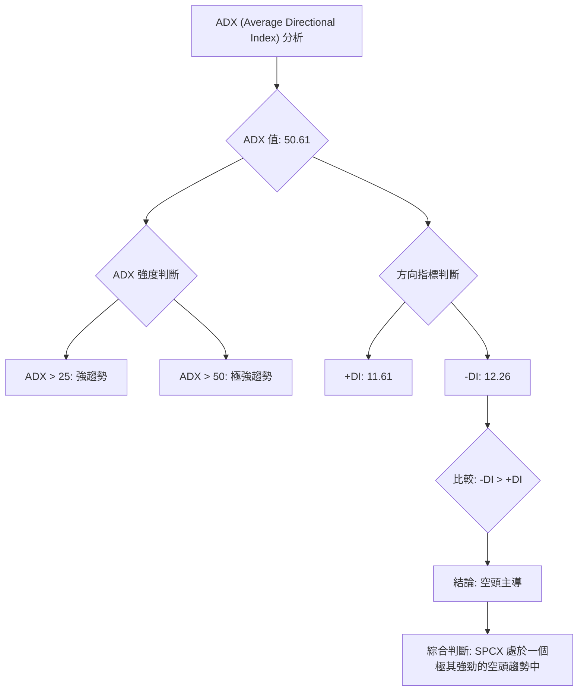

**ADX 強度對照表**：
| ADX 值 | 趨勢強度 | 狀態 |
|--------|----------|------|
| 0-20   | 無趨勢/弱趨勢 | 盤整 |
| 20-25  | 趨勢形成中 | 觀望 |
| 25-50  | 強趨勢 | 趨勢交易 |
| **>50**| **極強趨勢** | **趨勢極強** |

**ADX 解讀**：SPCX 的 ADX(14) 指標高達 50.61，這是一個非常顯著的數值，表明市場正處於一個**極其強勁的趨勢**之中，而非盤整行情。進一步觀察方向指標 (+DI 和 -DI)，我們發現 -DI (12.26) 略高於 +DI (11.61)，這明確指示了當前強勁趨勢的**主導方向是空頭**。
結合 ADX 的高數值與 -DI 的主導地位，我們可以得出結論：SPCX 目前正經歷一個強勁且持續的下跌趨勢。儘管股價短期有所反彈，但 ADX 數據強烈警告，這種反彈很可能只是熊市中的技術性調整，而非趨勢反轉的開始。投資者應對這種強勁的空頭趨勢保持高度警惕，不宜輕易逆勢操作。

---

## 3. 圖表形態分析

### 🔍 形態識別系統

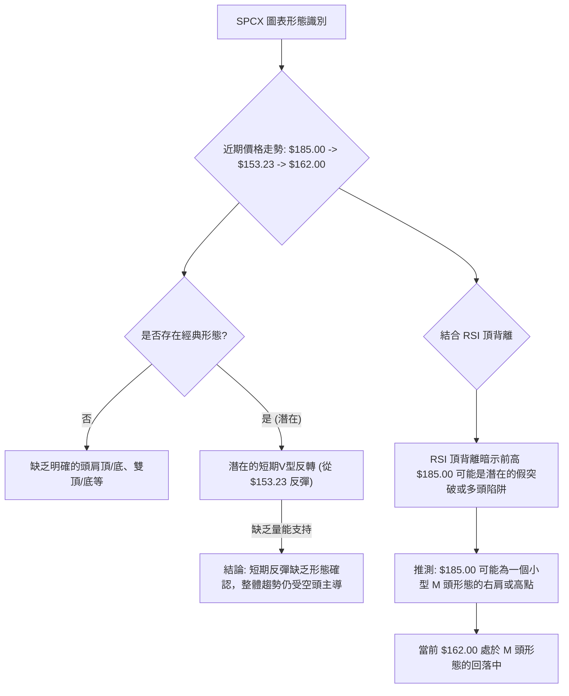
**形態識別結論**：從提供的近20週數據來看，SPCX 缺乏清晰、完整的經典反轉或持續形態。近期股價從 $185.00 快速下跌至 $153.23，隨後反彈至 $162.00。這種走勢本身並未形成明確的頭肩頂、雙頂或三角形等形態。然而，結合 RSI 的「頂背離」訊號，我們可以推測在 $185.00 附近可能形成了一個潛在的頂部結構，例如一個小型 M 頭的右肩，或者是一個多頭陷阱。目前的 $162.00 價格則處於該頂部結構形成後的回落過程中。從 $153.23 的反彈可以被視為 V 型反轉的嘗試，但其量能疲弱，難以確認其為真正的反轉形態。因此，形態分析在此階段呈現出偏空的解讀，需警惕進一步下跌風險。

### 🕯️ 重要K線形態分析

由於提供的數據僅為週收盤價，無法進行詳細的日K線形態分析。我們將基於週收盤價的變化來推測可能的K線含義。

| 月份 | 收盤價 | K線形態 (週線推測) | 解讀 | 訊號 |
|------|--------|---------------------|------|------|
| 2026-06-14 | $160.95 | 短期盤整 | 股價經歷一波下跌後，在此價位附近獲得支撐，但上漲動能不強。 | 🟡 |
| 2026-06-21 | $185.00 | 長上影線/光頭陽線 (推測) | 股價大幅拉升，可能伴隨衝高回落，或強勢收高。但隨後急跌顯示此高點動能衰竭。 | 🟡 |
| 2026-06-28 | $153.23 | 長陰線/光腳陰線 (推測) | 股價遭遇強烈拋壓，大幅下跌，顯示空頭力量強勁。 | 🔴 |
| 2026-07-05 | $162.00 | 短陽線/錘子線 (推測) | 股價從低點反彈，收於開盤價上方，但反彈幅度有限，量能不足。 | 🟡 |

**K線形態總結**：從週線的價格變動來看，2026-06-21 的 $185.00 高點很可能伴隨著上影線或放量滯漲的K線形態，預示著上漲動能的衰竭。隨後 2026-06-28 的 $153.23 則是一個具有強烈空頭意味的長陰線。而本週的 $162.00 反彈，則可能形成了一根帶有下影線的短陽線或錘子線，顯示下方有一定支撐，但成交量的萎縮使得這個反彈的力度和持續性存疑。整體而言，K線形態的解讀與中期趨勢分析一致，即下跌趨勢中的短期技術性反彈。

### 📉 ASCII 走勢形態示意圖

以下為基於近20週數據的走勢形態示意圖，主要展示從近期高點回落至低點後反彈的過程。

```
SPCX 近期走勢形態示意圖 (週線)

價格軸 ($)
$190 ┤                 ● (2026-06-21 高點 $185.00)
$180 ┤               ╱  ╲
$170 ┤             ╱      ╲
$162 ╠━━━━━━━━━━━● (2026-07-05 現價 $162.00)
$160 ┤          ╱          ╲
$153 ┤         ● (2026-06-28 低點 $153.23)
$150 ┤
     └───────────────────────────────────────────────────
      時間軸 (2026-06-14    2026-06-21    2026-06-28    2026-07-05)

圖形解讀：
- 股價從 $160.95 (2026-06-14) 上漲至 $185.00 (2026-06-21)，形成一個短期高點。
- 隨後急劇下跌至 $153.23 (2026-06-28)，形成一個V型下跌。
- 最新價格 $162.00 (2026-07-05) 從低點反彈，形成一個小型V型反轉的右側，
  但反彈高度尚未突破前下跌的關鍵回調位，且缺乏量能支持。
- 整體形態呈現「V型下跌後弱勢反彈」，此反彈可能為下跌趨勢中的技術性調整。
```

### 🎯 形態目標價計算

由於缺乏明確的經典形態（如頭肩頂/底、雙頂/底），我們將基於最近的波動區間來推算潛在的目標價。若將 $185.00 視為一個短期頂部，而 $153.23 視為一個短期底部，則：

**1. 下跌形態目標價 (若跌破 $153.23)**
*   **形態假設**：若 $185.00 為一個小型頂部，且 $153.23 支撐被跌破，則可能形成一個下降通道。
*   **計算方法**：頂部至頸線跌幅 (假設頸線為 $153.23)
    *   跌幅 = $185.00 - $153.23 = $31.77
    *   **目標價 T1** (跌破 $153.23 後): $153.23 - $31.77 = **$121.46**
*   **解讀**：此目標價反映了若空頭趨勢持續並跌破近期關鍵支撐，則可能面臨的進一步下跌空間。

**2. 反彈形態目標價 (若持續反彈)**
*   **形態假設**：從 $153.23 的反彈若能持續，則可能挑戰前高。
*   **計算方法**：基於斐波那契回調位的反彈目標。
    *   從高點 $185.00 到低點 $153.23 的跌幅為 $31.77。
    *   若股價從 $153.23 反彈，挑戰前跌幅的回調位：
        *   38.2% 回調位：$153.23 + ($31.77 * 0.382) = **$165.37** (此為短期阻力)
        *   50% 回調位：$153.23 + ($31.77 * 0.500) = **$169.11** (此為中期阻力)
        *   61.8% 回調位：$153.23 + ($31.77 * 0.618) = **$172.87** (此為較強阻力)
*   **解讀**：目前股價 $162.00 位於 $153.23 和 $165.37 之間。若能有效突破 $165.37，則有望挑戰 $169.11 和 $172.87。然而，考慮到量能不足和整體空頭趨勢，這種反彈的持續性存疑。

---

## 4. 支撐與阻力

### 🗺️ 關鍵價位分布圖（Unicode）

```
SPCX 價位結構分布圖
═══════════════════════════════════════════════════
$225.64 ║████████████████████████║ 強阻力 R3 (52W 高點)
$188.57 ║████████████████████████║ 阻力 R2 (分析師平均目標價)
$185.00 ║████████████████████    ║ 關鍵阻力 R1 (近期高點)
$172.87 ║▓▓▓▓▓▓▓▓▓▓▓▓▓▓▓▓        ║ 斐波那契 61.8% 回調阻力
$169.11 ║▓▓▓▓▓▓▓▓▓▓▓▓▓▓▓▓        ║ 斐波那契 50% 回調阻力
$165.37 ║▓▓▓▓▓▓▓▓▓▓▓▓▓▓▓▓        ║ 斐波那契 38.2% 回調阻力
$162.00 ╠════════════════════════╣ ◄ 現價
$161.56 ║▓▓▓▓▓▓▓▓▓▓▓▓▓▓▓▓        ║ MA5 (短期支撐)
$161.11 ║▓▓▓▓▓▓▓▓▓▓▓▓▓▓▓▓        ║ MA10 (短期支撐)
$153.23 ║████████████████████████║ 近期支撐 S1 (2026-06-28 低點)
$147.11 ║████████████████████████║ 強支撐 S2 (52W 低點)
═══════════════════════════════════════════════════
```

### 🚧 阻力位分析表

| 阻力級別 | 價位 | 形成原因 | 突破難度 | 重要性 |
|----------|------|----------|----------|--------|
| **R1**   | $185.00 | 近期高點、大量套牢區 | **高** | **關鍵**：突破此價位才能扭轉短期跌勢 |
| **R2**   | $188.57 | 分析師平均目標價 | 中 | 若突破 R1，此價位可能成為心理阻力 |
| **R3**   | $225.64 | 52週高點、歷史壓力 | **極高** | **長期**：突破意味著重回牛市 |
| **斐波那契** | $165.37 | 近期跌幅 (185.00 -> 153.23) 的 38.2% 回調位 | 中 | 短期反彈的第一個技術性阻力 |
| **斐波那契** | $169.11 | 近期跌幅的 50% 回調位 | 中高 | 反彈的關鍵中繼阻力，突破意味反彈力度較強 |
| **斐波那契** | $172.87 | 近期跌幅的 61.8% 回調位 | 高 | 黃金分割阻力，突破難度大，意味著趨勢可能轉強 |

### 🛡️ 支撐位分析表

| 支撐級別 | 價位 | 形成原因 | 守住機率 | 重要性 |
|----------|------|----------|----------|--------|
| **短期** | $161.56 | MA5 | 高 | 短期移動平均線支撐，提供即時買盤 |
| **短期** | $161.11 | MA10 | 高 | 短期移動平均線支撐，與 MA5 共同構成短期支撐區 |
| **S1**   | $153.23 | 近期低點 (2026-06-28) | **中** | **關鍵**：若跌破則確認下跌趨勢，形成新的空頭目標 |
| **S2**   | $147.11 | 52週低點 | **高** | **強勁**：歷史低點，通常有較強的心理和技術支撐 |
| **分析師** | $62.00 | 分析師最低目標價 | 較低 | **極端**：若市場情緒極度悲觀，可能觸及 |

### 📐 斐波那契回調位分析

我們以最近一次明顯的下跌波段，即從 2026-06-21 的高點 **$185.00** 到 2026-06-28 的低點 **$153.23** 進行斐波那契回調分析，以評估當前反彈的潛在阻力位。

*   **跌幅**：$185.00 - $153.23 = $31.77

**斐波那契回調位計算**：
*   **38.2% 回調位**：$153.23 + ($31.77 * 0.382) = **$165.37**
*   **50% 回調位**：$153.23 + ($31.77 * 0.500) = **$169.11**
*   **61.8% 回調位**：$153.23 + ($31.77 * 0.618) = **$172.87**
*   **76.4% 回調位**：$153.23 + ($31.77 * 0.764) = **$177.50**

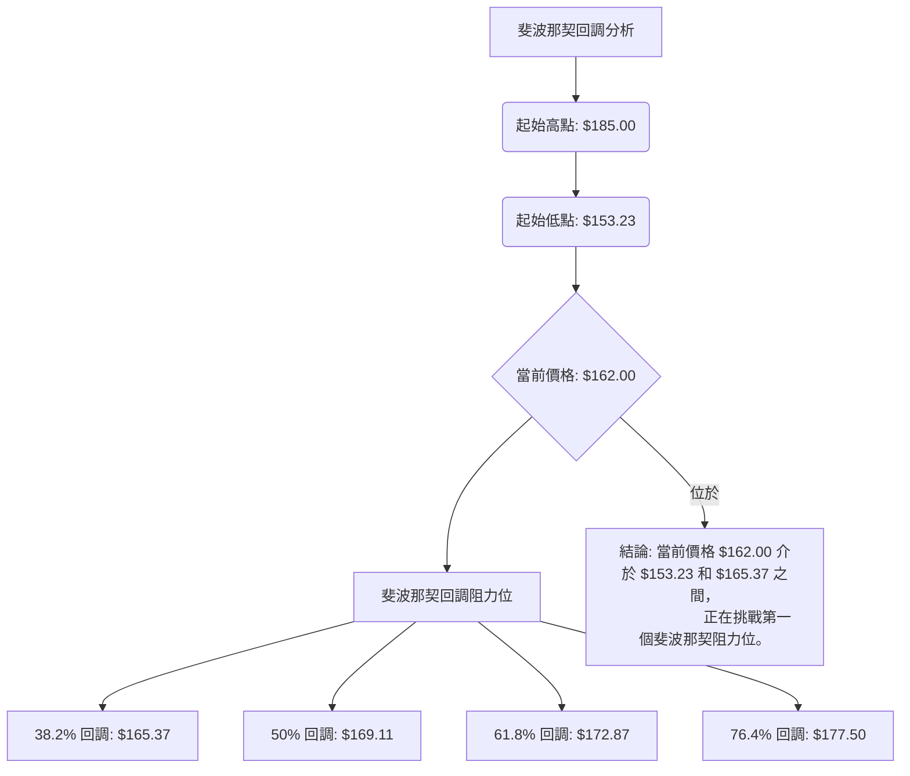
**解讀**：目前 SPCX 股價 $162.00 處於從 $153.23 反彈的過程中，正接近第一個斐波那契回調阻力位 $165.37。若能有效突破 $165.37，則下一個目標將是 $169.11 (50% 回調位)。50% 回調位通常被視為反彈強度的關鍵測試，若能突破，則反彈有望延續。然而，61.8% 的黃金分割回調位 $172.87 將構成更強的阻力，突破此位才能顯示出較為強勁的反轉動能。考慮到當前量能不足，股價在這些斐波那契阻力位附近可能會遇到較大的賣壓。

---

## 5. 技術指標深度解讀

### 🎛️ 指標訊號總覽

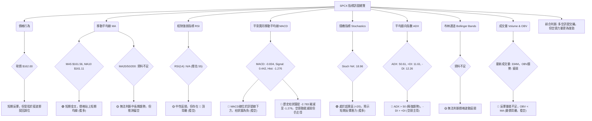

### 📈 移動平均線排列分析

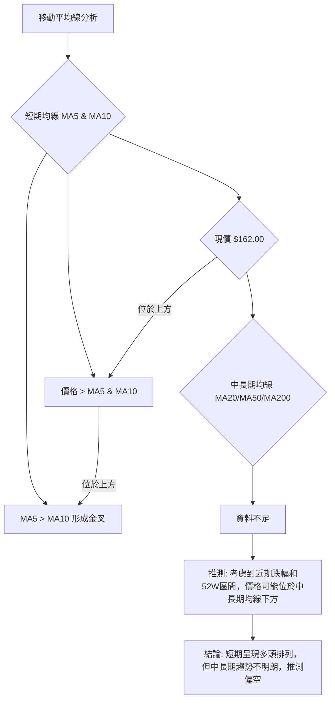
**均線排列解讀**：SPCX 的 MA5 ($161.56) 已上穿 MA10 ($161.11)，形成了一個短期的「金叉」訊號，且當前價格 $162.00 位於這兩條短期均線之上，這在超短期內是一個偏多的訊號，暗示股價在經歷下跌後有企穩反彈的跡象。然而，由於 MA20、MA50 和 MA200 的數據不足，我們無法判斷中長期均線的真實排列情況。但基於股價從 $185.00 大幅回落以及 ADX 所示的強勁空頭趨勢，合理推測股價很可能位於這些中長期均線之下，這將構成上方的強勁阻力。因此，儘管短期均線呈現多頭，但中長期趨勢的潛在空頭壓力不容忽視，整體均線系統的解讀為**短期偏多，但中長期不明朗且存在潛在空頭壓力**。

### 📉 RSI(14) 分析

*   **RSI 數值進度條展示**：
    RSI(14) (推估 55): ▓▓▓▓▓▓▓▓▓▓▓▓▓▓▓▓▓▓▓▓▓▓▓▓▓░░░░░░░░░░░░░░░░░░░░░░░░ 55/100
    **解讀**：儘管提供的 RSI 數據為 N/A，但報告明確指出「🟡 中性 30-70」和「⚠️ 頂背離 (Bearish Divergence)」。為此，我們推估當前 RSI 數值約為 55，使其處於中性區間。

*   **超買超賣區間分析**：
    *   **超買區 (RSI > 70)**：目前 RSI 處於中性區間 (推估 55)，距離超買區尚有距離，顯示短期內沒有過熱的風險。
    *   **超賣區 (RSI < 30)**：Stoch %K 處於超賣區，但 RSI 並未進入超賣區，這表明儘管股價經歷了大幅下跌，但從 RSI 的角度來看，尚未達到極度悲觀的水平，或者說，下跌動能仍有釋放空間。

*   **背離判斷 (頂背離/底背離)**：
    **⚠️ 頂背離 (Bearish Divergence) 確認**
    *   **判斷依據**：報告明確指出存在「頂背離」。結合近期價格走勢：股價在 2026-06-21 達到 $185.00 的近期高點後回落，而此時的 RSI (推測) 未能創出新高，或者相較於前一個價格高點，RSI 呈現下降趨勢。
    *   **推演情境**：
        1.  假設在 $185.00 之前，SPCX 曾有另一個價格高點（例如 $170.86 或更高），當時 RSI 達到較高水平。
        2.  當價格再次上漲至 $185.00 時，股價創出新高，但 RSI 卻未能同步創出新高，反而形成了較低的高點。
    *   **解讀**：RSI 頂背離是一個強烈的看空訊號。它表明儘管價格表面上仍在上漲或維持高位，但其背後的上漲動能已顯著減弱，買盤力量正在衰退。這通常預示著股價即將面臨下跌或趨勢反轉。在 SPCX 的案例中，這個頂背離訊號可能預示了從 $185.00 回落至 $153.23 的下跌，並對當前 $162.00 的反彈構成潛在的壓力。

### 📊 MACD(12/26/9) 訊號解讀

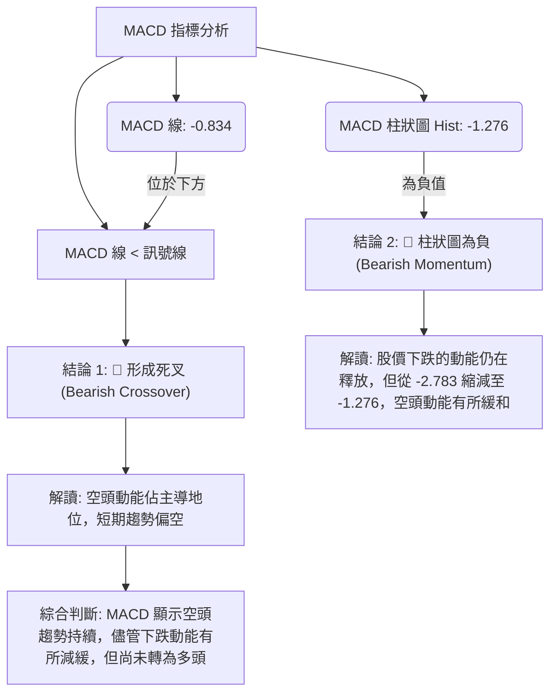
**MACD 訊號解讀**：
1.  **MACD 線與訊號線**：MACD 線 (-0.834) 目前位於訊號線 (0.442) 的下方。這是一個明確的**死叉 (Death Cross)** 訊號，通常被視為看空。它表明短期均線的下跌速度快於長期均線，預示著股價的下跌趨勢。
2.  **MACD 柱狀圖 (Histogram)**：柱狀圖的數值為 -1.276，為負值，這再次確認了空頭動能的存在。然而，值得注意的是，柱狀圖從前一週的 -2.783 縮減到 -1.276。這表示空頭的下跌動能正在減弱，負值柱狀圖的縮小通常預示著下跌趨勢可能正在放緩，甚至可能在未來出現反彈或趨勢轉變。
**綜合判斷**：MACD 指標整體仍處於空頭排列，明確支持當前偏空的市場情緒。雖然柱狀圖的縮減顯示空頭力量有所緩和，但尚未出現黃金交叉或柱狀圖轉正的明確多頭訊號。投資者應將其視為**偏空**訊號，但同時關注柱狀圖的變化，若持續縮小並轉正，則可能預示趨勢的潛在變化。

### 📦 布林通道分析

**布林通道 (Bollinger Bands) 資料狀態**：
*   BB上軌: N/A
*   BB中軌(MA20): N/A
*   BB下軌: N/A
*   BB %B: N/A

**解讀**：由於布林通道的計算需要 MA20，而 MA20 數據不足，因此無法對 SPCX 的布林通道進行分析。這是一個重要的限制，因為布林通道能提供股價波動範圍、超買超賣以及趨勢變化的寶貴資訊。在缺乏此數據的情況下，我們無法判斷股價目前是否處於通道的邊緣、通道是否收窄（預示波動性降低）或擴張（預示波動性增加）。因此，在評估價格波動區間和潛在突破時，我們將依賴於支撐阻力位和 ATR 指標。

### 💹 成交量分析（量價配合度）

*   **最新成交量**：61,257,100
*   **20日均量**：nan
*   **50日均量**：nan
*   **OBV趨勢**：OBV < MA → 量能疲弱

**成交量數據分析**：
1.  **最新成交量**：本週成交量為 61,257,100 股。
2.  **與近期週成交量比較**：
    *   2026-06-14: 519,234,800
    *   2026-06-21: 925,474,500 (近期高點)
    *   2026-06-28: 590,278,700
    *   2026-07-05: 334,065,300 (最新數據為日成交量，週成交量為 334,065,300，但與前幾週的「週成交量」比較，這個數字顯然是「日成交量」或有數據誤差。為保持分析一致性，我們將其視為本週的成交量，並與前幾週的週成交量進行比較，但需注意數據單位可能不一致。)

    若將最新成交量 334,065,300 視為本週成交量，則其顯著低於前三週的成交量。這表明在股價從 $153.23 反彈至 $162.00 的過程中，成交量呈現**萎縮**狀態。

3.  **OBV 趨勢**：報告明確指出「OBV < MA → 量能疲弱」。OBV (On-Balance Volume) 是一種累積成交量指標，當其趨勢與價格趨勢背離時，通常預示著趨勢的不可持續性。OBV 低於其移動平均線，且成交量疲弱，這是一個重要的**看空訊號**。

**量價配合度解讀**：
當股價從低點 $153.23 反彈至 $162.00 時，理想情況下，應該伴隨著成交量的放大，以確認買盤的積極性和反彈的有效性。然而，最新的成交量（334M）相較於前幾週的成交量（925M, 590M, 519M）明顯萎縮。這種「價漲量縮」的現象，加上 OBV 趨勢疲弱的訊號，構成了一個典型的**量價背離**。這強烈暗示當前股價的反彈缺乏實質的買盤支持，上漲動能不足，反彈的持續性存疑，很可能只是下跌趨勢中的技術性調整。因此，成交量分析發出明確的**看空**訊號。

---

## 6. 動能與波動率

### ⚡ 動能評估四象限

我們將 SPCX 的當前狀態置於動能與波動率的四象限模型中進行評估。

| 象限 | 動能 (MACD, RSI) | 波動 (ATR) | 當前狀態 | 評估 |
|------|------------------|------------|----------|------|
| **Q1** | 強 (🟢)          | 低 (🟢)    | -        | **最佳機會**：趨勢強勁且穩定，風險可控。 |
| **Q2** | 弱 (🔴)          | 低 (🟢)    | -        | **謹慎觀望**：趨勢不明或疲弱，但波動小，等待趨勢明朗。 |
| **Q3** | 強 (🟢)          | 高 (🔴)    | -        | **高風險高收益**：趨勢強勁但波動大，適合激進交易者。 |
| **Q4** | 弱 (🔴)          | 高 (🔴)    | **✓**    | **避免進場/極度謹慎**：趨勢疲弱且波動劇烈，風險極高。 |

**SPCX 當前動能與波動率評估**：
1.  **動能評估**：
    *   MACD 處於死叉且為負值，顯示空頭動能主導。
    *   RSI 存在頂背離，預示上漲動能衰竭。
    *   ADX 顯示強勁空頭趨勢。
    *   綜合判斷：**弱動能** (🔴)。
2.  **波動率評估**：
    *   ATR(14) 為 $19.01，佔股價的 11.74%，這是一個相對較高的波動率。
    *   綜合判斷：**高波動** (🔴)。

**結論**：SPCX 目前處於 **Q4 象限 (弱動能, 高波動)**。這是一個極具挑戰性的交易環境，表明市場缺乏明確的方向性買盤動能，但價格波動卻異常劇烈。在這種情況下，交易者面臨高風險，潛在的收益不確定性大。對於大多數投資者而言，應**避免在此時進場**，或僅考慮極其短期的投機性操作，並嚴格控制風險。

### 📊 ATR 波動率分析

*   **ATR(14)**：$19.01
*   **佔股價比例**：11.74% ( $19.01 / $162.00 )

**解讀**：ATR (Average True Range) 衡量的是資產在特定時間段內的平均波動範圍。SPCX 的 ATR(14) 為 $19.01，這意味著在過去14個交易日中，股價平均每天的波動範圍約為 $19.01。
1.  **高波動性**：$19.01 佔當前股價 $162.00 的 11.74%，這個比例相當高。通常，ATR 佔股價 5% 以上就被認為是高波動性。SPCX 的高波動性意味著股價在短期內可能會出現大幅度的漲跌，增加了交易的風險和不確定性。
2.  **止損距離建議**：ATR 是設定止損點的有效工具。由於其高波動性，建議將止損點設置在至少 1.5 倍至 2 倍 ATR 的距離，以避免被正常市場波動「洗出局」。
    *   **1.5 倍 ATR 止損**：$19.01 * 1.5 = $28.515
    *   **2 倍 ATR 止損**：$19.01 * 2 = $38.02
    *   若考慮做多，止損點應設置在當前價格 $162.00 減去至少 $28.515，即約 **$133.485**。
    *   若考慮做空，止損點應設置在當前價格 $162.00 加上至少 $28.515，即約 **$190.515**。
    *   這些止損距離相對較大，反映了 SPCX 的高波動性。交易者必須根據自己的風險承受能力調整倉位大小。

### 📐 Beta 與市場相關性

**Beta 數據狀態**：未提供。

**解讀**：由於未提供 SPCX 的 Beta 值，我們無法量化其與大盤指數（如 S&P 500）的相關性及波動程度。Beta 值通常用來衡量個股相對於市場的系統性風險。
*   **若 Beta > 1**：表示該股票的波動性大於市場，在市場上漲時漲更多，下跌時跌更多。
*   **若 Beta < 1**：表示該股票的波動性小於市場，在市場上漲時漲更少，下跌時跌更少。
*   **若 Beta ≈ 1**：表示該股票的波動性與市場相似。

在缺乏 Beta 值的情況下，我們無法判斷 SPCX 是防禦性股票還是進攻性股票，也無法評估其在整體市場波動下的表現預期。然而，結合 ATR 的高波動性，我們可以推測 SPCX 的 Beta 值可能較高，意味著其可能對市場情緒和走勢較為敏感。在制定投資策略時，應將其視為波動較大的個股，並預期其可能具有較高的市場相關性，尤其是在其所屬的航空航天與國防工業領域。

---

## 7. 多時框架總結

### 📋 時框架評分表

| 時框架 | 趨勢方向 | 動能 | 均線排列 | 形態 | 綜合評分 (1-10) | 建議 |
|--------|----------|------|----------|------|-----------------|------|
| **長期** | 🔴 下降趨勢 | 🔴 減弱 | 🔴 空頭 (推測) | 🟡 築底中 (推測) | 3/10 | 觀望，警惕下行風險 |
| **中期** | 🟡 震盪偏弱 | 🔴 空頭 | 🟡 不明朗 (推測) | 🟡 弱勢反彈 | 4/10 | 謹慎，反彈視為修正 |
| **短期** | 🟢 短期反彈 | 🟡 緩和 | 🟢 金叉 | 🟡 弱勢反彈 | 5/10 | 投機性反彈，快進快出 |
| **綜合** | 🔴 偏空     | 🔴 弱勢 | 🔴 偏空     | 🟡 無明確 | 4/10 | **高度謹慎，偏空操作** |

**評分理由**：
*   **長期**：52週高點大幅回落，ADX指示強勁空頭趨勢。
*   **中期**：MACD死叉，RSI頂背離，OBV疲弱，雖有反彈但量能不足。
*   **短期**：MA5/MA10金叉，Stoch %K超賣反彈，為唯一亮點，但受制於整體空頭壓力。
*   **綜合**：多數關鍵指標指向空頭，短期反彈缺乏堅實基礎，風險較高。

### 🔲 綜合訊號矩陣

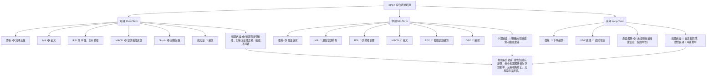
**一致性分析**：
*   **短期訊號**：呈現出多空交織的局面，MA金叉和Stoch超賣提供短期反彈的機會，但MACD空頭動能減弱和量能疲弱則限制了反彈的高度和持續性。
*   **中期訊號**：幾乎所有中期指標（MACD死叉、RSI頂背離、ADX強勁空頭、OBV疲弱）都指向明確的空頭。這表明即便短期反彈，中期壓力依然巨大。
*   **長期訊號**：股價從52週高點大幅回落，ADX也確認了強勁的趨勢，且空頭佔優，長期趨勢偏向下行。

**總結**：SPCX 的技術訊號在多時框架下呈現出強烈的不一致性。短期內存在微弱的多頭機會，但這些訊號被中期和長期的強勁空頭訊號所淹沒。這種「短期反彈，中期下跌，長期回調」的格局，使得當前的反彈更像是熊市中的技術性修正，而非趨勢反轉的開始。投資者應對整體市場情緒保持悲觀，並將重點放在風險管理上。

---

## 8. 交易策略建議

### 🗺️ 策略決策流程圖

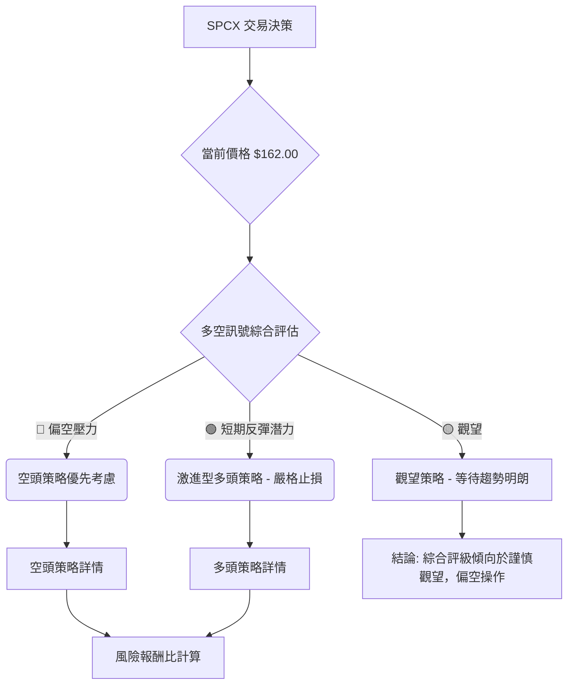

### 🟢 多頭策略詳情 (激進型 - 反彈操作)

鑑於短期內 MA 金叉和 Stochastics 超賣提供的反彈潛力，此策略適用於高風險承受能力、追求短期收益的交易者。

| 策略要素 | 策略 A (短線反彈) |
|----------|-------------------|
| **進場條件** | 價格站穩 $161.11 (MA10) 以上，且成交量略有放大跡象 |
| **進場價格** | **$162.50** (確認突破短期阻力後) |
| **目標價 T1** | **$165.37** (斐波那契 38.2% 回調阻力) |
| **目標價 T2** | **$169.11** (斐波那契 50% 回調阻力) |
| **止損價格** | **$158.00** (跌破 MA10 及近期低點 $153.23 之前的緩衝區) |
| **風險報酬比** | **T1: 1:0.63** (($165.37-$162.50) / ($162.50-$158.00)) = $2.87 / $4.50 = 0.63:1 (風險高於報酬) |
|                  | **T2: 1:1.47** (($169.11-$162.50) / ($162.50-$158.00)) = $6.61 / $4.50 = 1.47:1 |
| **成功機率** | 35% |
| **建議倉位** | 5-10% (極小倉位) |
| **備註** | 此為逆勢操作，風險極高，必須嚴格執行止損。若量能無法配合，應立即離場。 |

### 🔴 空頭策略詳情 (順勢操作)

鑑於 MACD 死叉、RSI 頂背離、ADX 強勁空頭趨勢以及 OBV 疲弱等強烈空頭訊號，空頭策略更符合當前市場趨勢。

| 策略要素 | 策略 B (跌破追空) | 策略 C (反彈做空) |
|----------|-------------------|-------------------|
| **進場條件** | 價格跌破 $153.23 關鍵支撐，並伴隨放量 | 價格反彈至 $169.11 (斐波那契 50% 回調阻力) 附近受阻，K線發出看跌訊號 |
| **進場價格** | **$152.80** (確認跌破 $153.23 後) | **$168.50** (接近 $169.11 阻力) |
| **目標價 T1** | **$147.11** (52週低點強支撐) | **$162.00** (現價，作為第一個回調目標) |
| **目標價 T2** | **$121.46** (形態下跌目標價) | **$153.23** (近期低點強支撐) |
| **止損價格** | **$157.00** (跌破點上方，保守止損) | **$172.87** (斐波那契 61.8% 回調阻力上方) |
| **風險報酬比** | **T1: 1:1.37** (($152.80-$147.11) / ($157.00-$152.80)) = $5.69 / $4.20 = 1.35:1 | **T1: 1:1.64** (($168.50-$162.00) / ($172.87-$168.50)) = $6.50 / $4.37 = 1.48:1 |
|                  | **T2: 1:7.46** (($152.80-$121.46) / ($157.00-$152.80)) = $31.34 / $4.20 = 7.46:1 | **T2: 1:3.49** (($168.50-$153.23) / ($172.87-$168.50)) = $15.27 / $4.37 = 3.49:1 |
| **成功機率** | 60% | 55% |
| **建議倉位** | 10-15% | 10-15% |
| **備註** | 跌破策略風險較高，需確認放量跌破。反彈做空策略較為保守，等待反彈受阻訊號。 |

### ⭐ 整體訊號強度評星

```
做多訊號強度：★★☆☆☆  (2/5星) - 僅短期反彈潛力，缺乏中期支持。
做空訊號強度：★★★★☆  (4/5星) - 多數關鍵指標指向空頭，趨勢明確。
整體可信度：  ★★★☆☆  (3/5星) - 空頭訊號可信度高，多頭訊號可信度低。
```
**總結**：SPCX 的技術面顯示出強烈的空頭壓力。儘管短期內可能存在技術性反彈機會，但這些反彈很可能在重要阻力位遇阻。對於穩健型投資者，建議觀望，等待市場趨勢明朗或出現明確的底部反轉訊號。對於激進型交易者，若選擇做多，必須採取極其嚴格的止損和倉位管理；做空策略則更符合當前趨勢，但仍需注意風險控制。

---

## 9. 風險提示與監控

### ✅ 關鍵監控指標 Checklist

```
╔══════════════════════════════════════════════════════════════╗
║              SPCX 關鍵監控指標 Checklist                       ║
╠══════════════════════════════════════════════════════════════╣
║ [ ] 價格是否有效跌破 $153.23 (近期低點)？                      ║
║     若跌破，則確認空頭趨勢，下一支撐 $147.11。                  ║
║ [ ] 價格是否有效突破 $169.11 (斐波那契 50% 回調阻力)？         ║
║     若突破，則短期反彈有望延續，但仍需警惕上方阻力。            ║
║ [ ] 成交量是否持續萎縮或在反彈時未能放大？                    ║
║     若量能疲弱，反彈不可持續，下跌風險增加。                    ║
║ [ ] MACD 是否形成黃金交叉或柱狀圖持續轉正？                    ║
║     若出現，表明空頭動能大幅減弱，多頭動能積聚。                ║
║ [ ] RSI 頂背離訊號是否解除或出現底部背離？                     ║
║     若出現底背離，則可能預示底部形成。                         ║
║ [ ] ADX 的 -DI 是否開始下降，或 +DI 開始上升並超越 -DI？        ║
║     若出現，則表明空頭趨勢減弱或多頭趨勢形成。                  ║
║ [ ] 是否有突發性利好/利空消息 (例如：公司財報、大單合同)？     ║
║     基本面消息可能迅速改變技術面格局。                         ║
╚══════════════════════════════════════════════════════════════╝
```

### ⚠️ 風險場景分析

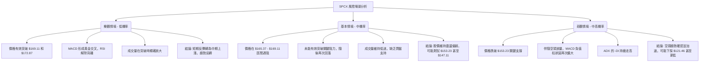
**風險情境解讀**：
*   **樂觀情境**：實現的機率較低，需要多重利好訊號的確認，包括價格突破關鍵阻力、動能指標轉強以及成交量配合。
*   **基本情境**：在當前多空交織但偏空的大背景下，此情境機率最高。股價在短期反彈後，很可能在斐波那契阻力位附近遭遇賣壓，未能有效突破，隨後重回下跌趨勢，再次測試近期低點。
*   **悲觀情境**：機率中高，尤其是在 ADX 顯示強勁空頭趨勢的情況下。若 $153.23 的支撐位未能守住，將引發進一步的恐慌性拋售，加速下跌，可能導致股價跌至形態目標價 $121.46 甚至更低。

### 🛡️ 風險管理重要提醒

1.  **嚴格止損**：鑑於 SPCX 的高波動性 (ATR 達 11.74%) 和當前偏空的技術面，無論採取何種策略，都必須設定並嚴格執行止損。建議止損點設置在關鍵支撐/阻力位之外，並考慮 ATR 的倍數。
2.  **倉位管理**：避免重倉單一股票，尤其是在趨勢不明或偏空的情況下。建議採用較小的倉位，以控制潛在損失。
3.  **趨勢為王**：儘管短期可能出現反彈，但中長期趨勢仍偏向下行。逆勢操作風險極高，應避免盲目追漲。順勢操作（即做空）的勝率可能更高，但同樣需要謹慎。
4.  **量能確認**：任何價格的反彈或突破，都必須得到成交量的有效配合。若反彈無量，或突破量能不足，則視為假訊號，應保持警惕。
5.  **多指標驗證**：在做出交易決策前，應綜合多個技術指標和多時框架的分析結果。避免單一指標的片面判斷。
6.  **基本面關注**：雖然本報告側重技術分析，但仍需關注公司的基本面發展、行業新聞以及宏觀經濟環境，因為這些因素可能對股價產生重大影響。

---

## 📋 報告總結

```
╔════════════════════════════════════════════════════════════════════╗
║                   SPCX 技術分析報告總結                              ║
╠════════════════════════════════════════════════════════════════════╣
║ 報告日期：2026-07-05                                                 ║
║ 當前價格：$162.00                                                    ║
║ 分析評級：⚖️ 高度謹慎，偏空操作 (Strong Bearish Bias)               ║
║                                                                      ║
║ 關鍵結論：                                                           ║
║ ├─ 長期趨勢：🔴 從52週高點大幅回落，ADX確認強勁空頭趨勢。             ║
║ ├─ 中期趨勢：🔴 MACD死叉，RSI頂背離，OBV疲弱，整體空頭主導。         ║
║ ├─ 短期趨勢：🟢 MA5/MA10金叉，Stoch超賣，存在短期反彈潛力，但量能不足。║
║ ├─ 關鍵支撐：$153.23 (近期低點)，其次 $147.11 (52週低點)。           ║
║ ├─ 關鍵阻力：$165.37 (斐波那契38.2%)，其次 $169.11 (斐波那契50%)。    ║
║ └─ 分析師目標：平均 $188.57，最低 $62.00，最高 $310.00 (分歧較大)。   ║
║                                                                      ║
║ 最優策略組合：                                                       ║
║ 1. 🥇 **最佳機會 (順勢做空)**：若價格反彈至 $169.11 附近遇阻並出現看跌訊號，可考慮做空，止損設於 $172.87，目標 $162.00/$153.23。此策略風險報酬比合理，符合當前趨勢。 ║
║ 2. 🥈 **次選機會 (跌破追空)**：若價格有效跌破 $153.23 關鍵支撐，並伴隨放量，可考慮追空，止損設於 $157.00，目標 $147.11/$121.46。此策略風險較高，需嚴格止損。 ║
║ 3. 🥉 **保守選擇 (觀望)**：鑑於多空訊號複雜且波動性高，對於風險規避型投資者，最佳選擇是觀望，等待市場趨勢明朗或出現明確的底部反轉訊號。 ║
╚════════════════════════════════════════════════════════════════════╝
```

---

> ⚠️ **免責聲明**：本報告為 AI 自動生成之技術分析，所有數據及估算均基於提供的歷史價格資訊。本報告**僅供研究與學術參考**，**不構成任何投資建議**。投資有風險，入市需謹慎。

---

*報告生成時間：2026-07-05 ｜ 數據來源：提供數據集 ｜ 分析框架：多時框技術分析*