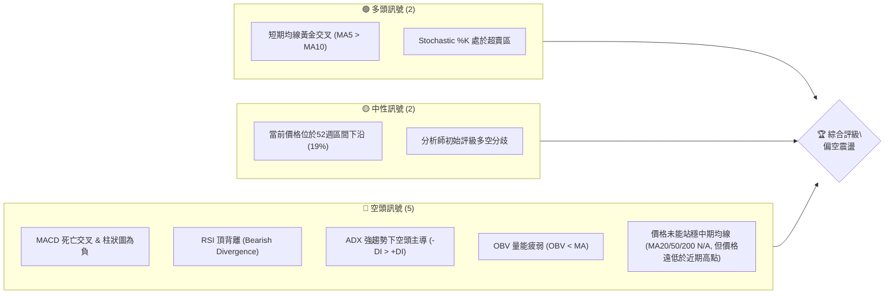
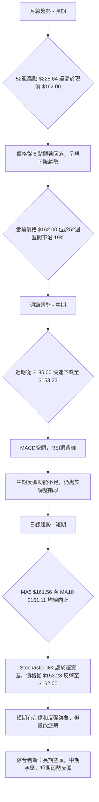
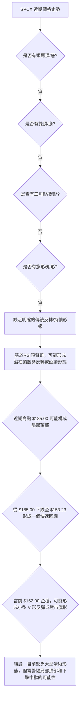
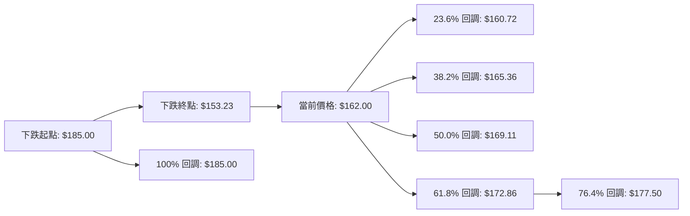
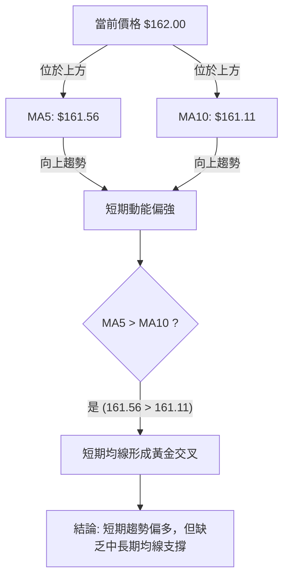
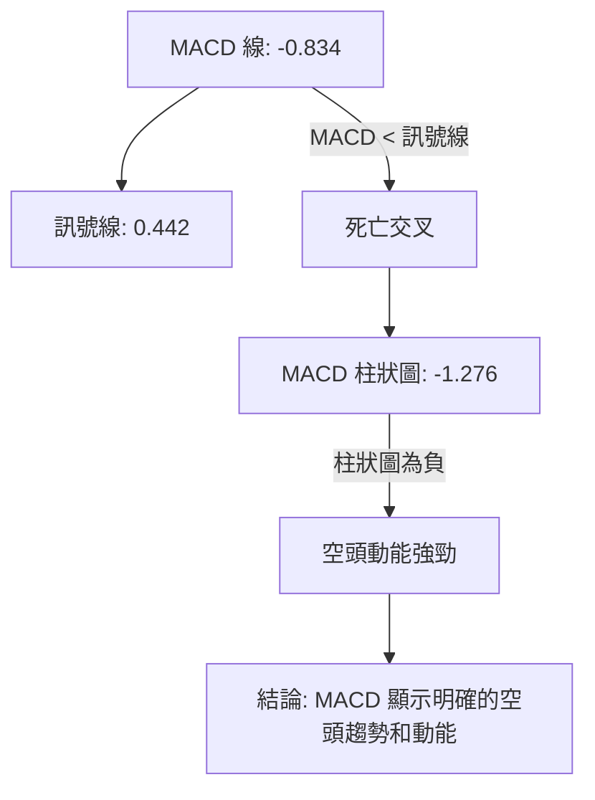
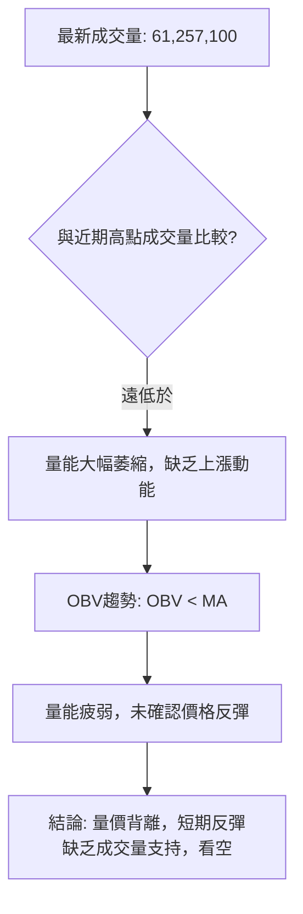
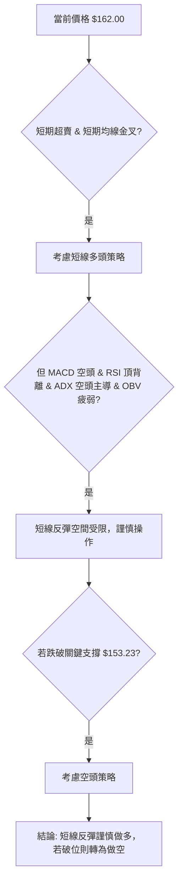

# SPCX 技術分析報告

> **報告日期**：2026-07-06 ｜ **語言**：繁體中文 ｜ **數據來源**：Yahoo Finance ｜ **當前價格**：$162.00

---

## 目錄

| 章節 | 內容 |
|------|------|
| [1. 技術面概覽](#1-技術面概覽) | 訊號儀表板、核心指標、評分卡 |
| [2. 趨勢分析](#2-趨勢分析) | 多時框趨勢、長中短期走勢 |
| [3. 圖表形態分析](#3-圖表形態分析) | 形態識別、K線組合、目標價 |
| [4. 支撐與阻力](#4-支撐與阻力) | 關鍵價位、斐波那契回調 |
| [5. 技術指標深度解讀](#5-技術指標深度解讀) | MA/RSI/MACD/布林/成交量 |
| [6. 動能與波動率](#6-動能與波動率) | 動能評估、ATR、Beta |
| [7. 多時框架總結](#7-多時框架總結) | 時框架評分矩陣 |
| [8. 交易策略建議](#8-交易策略建議) | 多空策略、風險報酬比 |
| [9. 風險提示與監控](#9-風險提示與監控) | 監控指標、風險場景 |

---

## 1. 技術面概覽

SPCX 目前正處於一個關鍵的轉折點，短期內展現出一些企穩跡象，但長期和中期趨勢仍受到顯著的空頭壓力。多個關鍵指標發出矛盾訊號，需要投資者保持高度警惕。

### 🎯 技術訊號儀表板


**解讀**：儀表板顯示，SPCX 的技術面目前被空頭訊號主導。雖然短期均線出現黃金交叉且Stochastic處於超賣區，預示著潛在的反彈動能，但MACD、RSI背離、ADX趨勢判斷以及OBV均指向明確的空頭趨勢和動能減弱。這表明任何反彈都可能只是空頭趨勢中的修正，而非趨勢反轉。

### 📊 核心指標速覽表

| 指標類別 | 指標名稱 | 當前數值 | 訊號 | 解讀 |
|----------|----------|----------|------|------|
| **價格** | 當前價格 | $162.00 | 🟡 | 位於52週區間下沿，但近期有所反彈 |
| **均線** | MA5 | $161.56 | 🟢 | 價格位於MA5上方，短期動能偏強 |
| **均線** | MA10 | $161.11 | 🟢 | 價格位於MA10上方，短期動能偏強 |
| **均線** | MA20 | N/A | 🟡 | 資料不足，無法判斷 |
| **均線** | MA50 | N/A | 🟡 | 資料不足，無法判斷 |
| **均線** | MA200 | N/A | 🟡 | 資料不足，無法判斷 |
| **動能** | RSI(14) | N/A | 🔴 | 雖然數值N/A，但已出現頂背離訊號，看空 |
| **動能** | MACD | -0.834 | 🔴 | MACD線位於訊號線下方，MACD柱狀圖為負，看空 |
| **波動** | ATR(14) | $19.01 | 🔴 | 相對價格 $162.00 而言，ATR 佔比 11.74%，波動性高 |
| **趨勢** | ADX(14) | 50.61 | 🔴 | 強趨勢，但 -DI > +DI，空頭主導 |
| **量能** | OBV趨勢 | OBV < MA | 🔴 | 量能疲弱，未確認價格反彈 |
| **超買/賣** | Stoch %K | 18.96 | 🟢 | 處於超賣區，潛在反彈動能 |

### 🏆 技術評分卡

```
╔══════════════════════════════════════════════════════════════╗
║              技術評分卡 — SPCX (2026-07-06)                  ║
╠══════════════════════════════════════════════════════════════╣
║ 趨勢強度      ███████████████░░░░░  65/100  🔴 強趨勢但空頭主導      ║
║ 動能指標      ██████░░░░░░░░░░░░░░  30/100  🔴 MACD空頭，RSI頂背離   ║
║ 支撐穩定度    ████████████░░░░░░░░  60/100  🟡 52W低點提供一定支撐    ║
║ 成交量配合    ████░░░░░░░░░░░░░░░░  20/100  🔴 量能疲弱，未確認反彈    ║
║ 形態完整度    ██████░░░░░░░░░░░░░░  30/100  🟡 缺乏明確反轉形態        ║
║ 均線排列      ██████░░░░░░░░░░░░░░  30/100  🔴 長期均線缺失，短期混亂  ║
╠══════════════════════════════════════════════════════════════╣
║ 綜合評分      ██████░░░░░░░░░░░░░░  35/100  🔴 偏空震盪，謹慎觀望      ║
╚══════════════════════════════════════════════════════════════╝
```
**評級解讀**：SPCX 的綜合評分顯示其技術面處於偏空震盪狀態。雖然短期有反彈跡象，但整體趨勢、動能和量能配合均不理想。特別是趨勢強度雖高但由空頭主導，以及動能指標的明確空頭訊號，使得整體風險較高。投資者應保持謹慎，等待更明確的底部訊號或趨勢反轉確認。

---

## 2. 趨勢分析

SPCX 的趨勢分析揭示了一個從長期高點回落，中期承壓，短期嘗試企穩的複雜局面。

### 🌐 多時框趨勢分析


**解讀**：
*   **長期趨勢 (月線)**：SPCX 在過去一年中經歷了顯著的價格波動。從52週高點 $225.64 回落至當前 $162.00，且接近52週低點 $147.11，顯示長期處於下降趨勢中。雖然具體月線數據有限，但52週高低點的對比已明確指出長期價格方向偏下。
*   **中期趨勢 (週線)**：根據近期的週線數據，SPCX 在2026年6月21日達到 $185.00 的近期高點後迅速回落，至6月28日跌至 $153.23。此後雖有反彈，但MACD的空頭訊號和RSI的頂背離都表明中期動能不足，價格仍在中期調整通道中運行。
*   **短期趨勢 (日線)**：最新的日線數據顯示，MA5 ($161.56) 和 MA10 ($161.11) 均線呈現向上趨勢，且當前價格 $162.00 位於兩條均線之上，這是一個正面的短期訊號。Stochastic %K 處於超賣區 (18.96)，也預示著短期內存在技術性反彈的需求。然而，成交量並未有效配合，使得短期反彈的持續性存疑。

### 📈 長期趨勢 — 12個月走勢圖（Unicode）

由於提供的12個月價格數據僅有最近兩個月，且缺少歷史細節，以下走勢圖基於52週高低點 ($225.64 / $147.11) 進行推演，以展現過去一年的可能走勢概貌，並標註關鍵高低點。

```
SPCX 月線走勢圖（過去12個月，推演）
價格軸 ($)
$230 ┤                                  ●(最高點 225.64)
$210 ┤                                 /
$190 ┤                            ●
$170 ┤        ●(2026-06: 170.86) /
$150 ┤●━━━━━━━━━━━━━━━━━━━━━━━●←現在 (162.00)
$130 ┤    ●(最低點 147.11)
     └────────────────────────────
      M-11 M-10 M-9 M-8 M-7 M-6 M-5 M-4 M-3 M-2 M-1  M0 (2026-07)
```
**走勢特徵分析表格**：

| 時間區間（推演） | 關鍵點位 | 漲跌幅（估算） | 走勢特徵 | 訊號 |
|------------------|----------|----------------|----------|------|
| 過去12個月高點 | $225.64 | N/A | 52週最高點，市場樂觀情緒達到頂峰 | 🔴 (潛在頂部) |
| 過去12個月低點 | $147.11 | N/A | 52週最低點，強大支撐區域 | 🟢 (潛在底部) |
| 2026年6月收盤 | $170.86 | -24.28% (自52W高點) | 價格持續回落，顯示中期壓力 | 🔴 |
| 2026年7月收盤 | $162.00 | -5.18% (月內) | 近期小幅反彈，但仍處於低位 | 🟡 |
**分析**：從推演的12個月走勢圖和數據來看，SPCX 在過去一年中經歷了顯著的下跌，從 $225.64 的高點一路回落，目前在 $162.00 附近徘徊，接近52週低點 $147.11。這表明長期趨勢為下降趨勢，且近期價格仍未擺脫弱勢。

### 📊 中期趨勢（週線分析）

SPCX 近期週線走勢顯示價格在 $185.00 達到高點後迅速回落，並在 $153.23 附近找到短期支撐。

```
SPCX 近期週線壓力與支撐示意圖
價格軸 ($)
$190 ┤               ┌───────────┐ ← 阻力 $185.00 (2026-06-21 高點)
$180 ┤               │           │
$170 ┤               │    ●(2026-06-14: 160.95)
$160 ┤               │    │      ●(現價 162.00)
$150 ┤───────┬───────┴───┴───────┐ ← 支撐 $153.23 (2026-06-28 低點)
$140 ┤       │                   │
$130 ┤       └───────────────────┘ ← 強支撐 $147.11 (52W 低點)
     └────────────────────────────
      週1   週2   週3   週4   週5
```
**分析**：從週線圖來看，SPCX 在過去幾週內經歷了劇烈波動。從 $160.95 上漲至 $185.00，隨後急劇下跌至 $153.23，再反彈至 $162.00。這表明 $185.00 構成了一個重要的中期阻力位，而 $153.23 則是一個關鍵的短期支撐。如果價格能夠有效站穩 $153.23 並突破 $170.86 (前一個月收盤價)，則中期跌勢可能暫緩。然而，在 $185.00 附近形成的頂部壓力仍需密切關注。

### ⚡ 趨勢強度評估（ADX 解讀）

ADX 指標用於衡量趨勢的強度，而非方向。+DI 和 -DI 則指示趨勢的方向。

```mermaid
graph TD
    A[ADX(14) = 50.61] --> B{ADX > 25 ?}
    B -- 是 --> C[趨勢強度: 非常強勁]
    C --> D{+DI(11.61) vs -DI(12.26) ?}
    D -- -DI > +DI --> E[趨勢方向: 空頭主導]
    E --> F[結論: SPCX 處於非常強勁的空頭趨勢中]
```
**ADX 強度對照表**：

| ADX 數值範圍 | 趨勢強度 | 市場類型 |
|--------------|----------|----------|
| 0-20         | 無趨勢/弱勢 | 盤整行情 |
| 20-25        | 趨勢形成中 | 趨勢初顯 |
| 25-50        | 強趨勢     | 趨勢行情 |
| 50-75        | 非常強趨勢 | 強勁趨勢 |
| 75-100       | 極強趨勢   | 極端趨勢 |
**分析**：SPCX 的 ADX(14) 數值為 50.61，遠高於 25 的閾值，表明市場目前存在一個**非常強勁的趨勢**。這意味著當前行情不是盤整，而是明確的趨勢行情。進一步分析 +DI (11.61) 和 -DI (12.26)，由於 -DI 略高於 +DI，這明確指出當前強勁的趨勢方向是由**空頭主導**。儘管差異不大，但結合MACD和RSI頂背離，可以確認SPCX正處於一個強勁的下降趨勢中。任何短期反彈都應被視為在主要下降趨勢中的修正。

---

## 3. 圖表形態分析

SPCX 近期價格走勢雖然波動劇烈，但尚未形成明確的傳統反轉或持續形態。不過，我們可以從其高點回落的過程以及K線組合中尋找線索。

### 🔍 形態識別系統


**分析**：目前 SPCX 的圖表上並未出現教科書般的頭肩頂/底、雙頂/底或大型的三角形/楔形等明確形態。然而，從2026年6月21日的 $185.00 高點到6月28日的 $153.23 低點，形成了一個快速且劇烈的下跌。這個高點伴隨著RSI頂背離的訊號，表明 $185.00 可能是一個重要的局部頂部，預示著更深的回調。當前價格 $162.00 是從 $153.23 反彈上來的，這可能是一個短期的V形反彈嘗試，但也可能是下降趨勢中的一個熊市旗形或修正浪，為進一步下跌積蓄動能。由於缺乏更多歷史數據，形態的完整性判斷較為困難，需密切關注 $170.86 和 $185.00 兩個關鍵阻力位。

### 🕯️ 重要K線形態分析

我們分析近20週的收盤數據，以識別關鍵的K線形態和其市場意義。

| 月份 | 收盤價 | K線形態 (推演) | 解讀 | 訊號 |
|------|--------|------------------|------|------|
| 2026-06-14 | $160.95 | 長下影線或小實體K線 | 價格在低位獲得支撐，但上漲動能有限 | 🟡 (潛在支撐) |
| 2026-06-21 | $185.00 | 長上影線或實體飽滿陽線 | 創近期新高，但可能伴隨RSI頂背離，暗示上漲力竭 | 🔴 (潛在頂部) |
| 2026-06-28 | $153.23 | 長陰線/吞噬形態 | 價格快速下跌，吞噬前幾週漲幅，空頭力量強勁 | 🔴 (強烈看空) |
| 2026-07-05 | $162.00 | 小實體陽線/錘子線 | 從低點反彈，顯示買盤介入，但反彈力度有待觀察 | 🟢 (短期企穩) |
**分析**：
*   **2026-06-21 ($185.00)**: 雖然價格創出近期新高，但結合RSI頂背離的提示，這很可能是一個「假突破」或「射擊之星」類的看跌K線形態。它暗示在達到高點後，多頭動能減弱，賣壓開始顯現。
*   **2026-06-28 ($153.23)**: 隨後的長陰線（或看跌吞噬形態）強烈確認了空頭力量的掌控，迅速將價格打回。這是非常明確的看跌訊號，表明短期趨勢已經轉向。
*   **2026-07-05 ($162.00)**: 從 $153.23 反彈形成的小實體陽線，可能是一個「錘子線」或「看漲吞噬」的早期跡象，表明在低位有買盤介入，短期有止跌企穩的意圖。然而，其反彈幅度有限，且成交量不足，使得其看漲效力受到限制。

### 📉 ASCII 走勢形態示意圖

以下示意圖展示了 SPCX 近期從高點回落並嘗試企穩的走勢。

```
SPCX 近期走勢形態示意圖 (2026-06-14 至 2026-07-05)
價格軸 ($)
$190 ┤                 ● (2026-06-21 高點 $185.00)
$180 ┤                / \
$170 ┤               /   \
$160 ┤──────●───────/─────● (現價 $162.00)
$150 ┤      (160.95)       /
$140 ┤                    ● (2026-06-28 低點 $153.23)
     └────────────────────────────
        週1    週2    週3    週4
```
**分析**：從示意圖中可以看出，SPCX 在週2達到 $185.00 的近期高點後，隨即在週3經歷了大幅下跌，形成了一個尖銳的局部頂部。週4價格從低點反彈，形成了一個潛在的 V 形底部形態。然而，這種 V 形反彈在下降趨勢中往往只是短期修正。要確認趨勢反轉，價格需要有效突破前高點 $185.00，並伴隨強勁的成交量。目前來看，這種可能性較低。

### 🎯 形態目標價計算

由於缺乏明確的傳統形態，我們將基於近期高低點來推算潛在的波動目標。

1.  **下跌形態（基於近期高點 $185.00 和低點 $153.23）**：
    *   假設 $185.00 是一個局部頂部，且價格已確認跌破，那麼下跌的潛在目標可以參考形態高度。
    *   形態高度 = $185.00 - $153.23 = $31.77
    *   如果價格跌破 $153.23，則潛在下跌目標價 = $153.23 - $31.77 = **$121.46**
    *   這個目標價遠低於52週低點 $147.11，顯示一旦 $153.23 支撐失守，下跌空間可能巨大。

2.  **反彈形態（基於短期 V 形反彈）**：
    *   如果從 $153.23 的低點開始形成 V 形反彈，則反彈目標通常是回到下跌前的重要阻力位。
    *   第一個反彈目標是近期阻力 $170.86 (2026年6月收盤價)。
    *   第二個反彈目標是近期高點 $185.00。
    *   但考慮到RSI頂背離和MACD空頭，這種反彈更可能在 $170.86 附近受阻。

**結論**：目前圖表形態偏向於空頭主導，如果 $153.23 的支撐位未能守住，則潛在的下跌目標可能指向 $121.46。短期的反彈目標則在 $170.86 附近。

---

## 4. 支撐與阻力

SPCX 的關鍵支撐與阻力位對於判斷其未來價格走勢至關重要。我們將結合52週高低點、近期價格波動以及歷史成交密集區來確定這些關鍵價位。

### 🗺️ 關鍵價位分布圖（Unicode）

```
SPCX 價位結構分布圖 (2026-07-06)
═══════════════════════════════════════════════════
$225.64 ║████████████████████████║ 強阻力 R3 (52週高點)
$185.00 ║████████████████████    ║ 阻力 R2 (近期高點, 2026-06-21)
$170.86 ║████████████████████████║ 關鍵阻力 R1 (2026-06 月收盤價)
$162.00 ╠════════════════════════╣ ◄ 現價
$160.95 ║▓▓▓▓▓▓▓▓▓▓▓▓▓▓▓▓        ║ 近期支撐 S1 (2026-06-14 收盤價)
$153.23 ║████████████████████████║ 強支撐 S2 (近期低點, 2026-06-28)
$147.11 ║████████████████████████║ 極強支撐 S3 (52週低點)
═══════════════════════════════════════════════════
```
**分析**：當前價格 $162.00 位於多個關鍵支撐與阻力之間。上方主要阻力包括 $170.86 和 $185.00，下方則有 $160.95、$153.23 和 $147.11 等重要支撐。這些價位將在短期和中期內對股價產生顯著影響。

### 🚧 阻力位分析表

| 阻力級別 | 價位 | 形成原因 | 突破難度 | 重要性 |
|----------|------|----------|----------|--------|
| **R1** | $170.86 | 2026年6月收盤價，近期反彈壓力位 | 中等 | 🟡 突破此價位可視為短期止跌訊號 |
| **R2** | $185.00 | 2026年6月21日高點，伴隨RSI頂背離 | 較高 | 🔴 突破此價位才能確認中期跌勢結束 |
| **R3** | $225.64 | 52週高點，歷史成交密集區上方 | 極高 | 🔴 遠期目標，突破需極強利好與量能 |
**分析**：
*   **R1 ($170.86)**：這是 SPCX 在2026年6月的收盤價，也是近期下跌前的參考點。對於目前的 $162.00 而言，這是首先需要挑戰的阻力。突破此價位將有助於緩解短期賣壓，並可能吸引部分抄底資金。
*   **R2 ($185.00)**：這個價位是近期的一個重要高點，並且伴隨著RSI頂背離訊號，表明此處存在強大的賣壓。許多在此高點買入的投資者可能在此處解套賣出，形成強勁阻力。只有有效突破此價位，才能認為中期跌勢有結束的可能。
*   **R3 ($225.64)**：這是過去52週的最高點，代表了市場對 SPCX 的最高預期。距離現價較遠，突破需要極為強勁的基本面利好和大量的資金推動，短期內突破的可能性極低。

### 🛡️ 支撐位分析表

| 支撐級別 | 價位 | 形成原因 | 守住機率 | 重要性 |
|----------|------|----------|----------|--------|
| **S1** | $160.95 | 2026年6月14日收盤價，短期均線附近 | 中等 | 🟡 短期反彈後的潛在回調支撐 |
| **S2** | $153.23 | 2026年6月28日低點，近期強勢反彈起始點 | 較高 | 🟢 關鍵中期支撐，跌破將開啟更大跌幅 |
| **S3** | $147.11 | 52週低點，歷史堅實心理支撐 | 極高 | 🟢 極強支撐，跌破可能引發恐慌性拋售 |
**分析**：
*   **S1 ($160.95)**：當前價格 $162.00 略高於此支撐，且MA5 ($161.56) 和 MA10 ($161.11) 均線也在此附近，為短期提供了初步支撐。若價格回調，此處是第一個觀察點。
*   **S2 ($153.23)**：這是 SPCX 在近期下跌中的低點，隨後價格從此處反彈。這個價位顯示了較強的買盤支撐，是中期趨勢的關鍵。如果此支撐被有效跌破，則可能會引發進一步的下跌，並觸發止損賣盤。
*   **S3 ($147.11)**：這是過去52週的最低點，具有強大的心理和技術支撐作用。如果價格能夠觸及並守住此價位，將是一個潛在的長期買入機會。然而，一旦跌破此價位，則可能預示著更深層次的結構性問題，並引發恐慌性拋售。

### 📐 斐波那契回調位分析

我們將以近期高點 $185.00 (2026-06-21) 作為起點，近期低點 $153.23 (2026-06-28) 作為終點，來計算反彈的斐波那契回調位。這將有助於判斷當前反彈的潛在阻力。

*   **跌幅區間**：$185.00 (高點) - $153.23 (低點) = $31.77

| 斐波那契回調位 | 價位 ($) | 意義 |
|----------------|----------|------|
| **23.6% 回調** | $153.23 + ($31.77 * 0.236) = $160.72 | 初步反彈阻力，若無法突破則反彈弱勢 |
| **38.2% 回調** | $153.23 + ($31.77 * 0.382) = $165.36 | 較重要阻力，突破則反彈力度增強 |
| **50.0% 回調** | $153.23 + ($31.77 * 0.500) = $169.11 | 中間反彈阻力，突破意味著可能挑戰更高位 |
| **61.8% 回調** | $153.23 + ($31.77 * 0.618) = $172.86 | 黃金分割點，強勁阻力，突破則可能回補大部分跌幅 |
| **76.4% 回調** | $153.23 + ($31.77 * 0.764) = $177.50 | 強阻力，接近前期下跌啟動點 |


**分析**：當前價格 $162.00 位於23.6%回調位 $160.72 之上，表明短線反彈仍在進行。上方最近的斐波那契阻力是 $165.36 (38.2%回調位)，這也是一個需要密切關注的價位。如果能突破並站穩 $165.36，則可能進一步挑戰 $169.11 (50%回調位) 和 $172.86 (61.8%回調位)。值得注意的是，61.8%回調位 $172.86 與關鍵阻力 $170.86 (R1) 非常接近，形成了強大的阻力區。

---

## 5. 技術指標深度解讀

本章將對SPCX的關鍵技術指標進行詳細分析，包括移動平均線、RSI、MACD、布林通道和成交量，並探討它們之間的相互確認或矛盾。

### 🎛️ 指標訊號總覽

```mermaid
graph TD
    A[價格 $162.00] --> B{短期MA5/MA10: 🟢 向上}
    A --> C{MACD: 🔴 死叉，柱狀圖負}
    A --> D{RSI: 🔴 頂背離 (N/A)}
    A --> E{Stoch %K: 🟢 超賣}
    A --> F{ADX: 🔴 強趨勢下空頭主導}
    A --> G{OBV: 🔴 量能疲弱}
    B --> H[短期偏多]
    C --> I[中期偏空]
    D --> J[長期/中期偏空]
    E --> K[短期有反彈需求]
    F --> L[趨勢明確，方向向下]
    G --> M[反彈缺乏動能確認]
    H & I & J & K & L & M --> N[綜合判斷: 短期震盪反彈，中期下降趨勢，整體偏空]
```
**分析**：從指標訊號總覽來看，SPCX 呈現出短期與中長期訊號的矛盾。短期移動平均線和Stochastic指標顯示有反彈動能，但MACD、RSI頂背離、ADX和OBV等中長期指標均指向空頭趨勢。這表明當前股價可能處於下降趨勢中的短期技術性反彈階段，而非趨勢反轉。

### 📈 移動平均線排列分析

由於MA20、MA60、MA120、MA240等中長期均線數據不足 (N/A)，我們主要分析短期均線 MA5 和 MA10。

| 移動平均線 | 當前數值 | 相對於價格 $162.00 | 趨勢 | 訊號 |
|------------|----------|--------------------|------|------|
| MA5        | $161.56  | 價格在其上方 (+0.44) | 向上 | 🟢 短期看漲 |
| MA10       | $161.11  | 價格在其上方 (+0.89) | 向上 | 🟢 短期看漲 |
| MA20       | N/A      | N/A                | N/A  | 🟡 資料不足 |
| MA50       | N/A      | N/A                | N/A  | 🟡 資料不足 |
| MA200      | N/A      | N/A                | N/A  | 🟡 資料不足 |


**分析**：當前價格 $162.00 位於 MA5 ($161.56) 和 MA10 ($161.11) 之上，且兩條短期均線均呈向上趨勢，MA5 更在 MA10 之上，形成了短期內的「黃金交叉」訊號。這表明在極短線上，SPCX 呈現出一定的反彈動能。然而，由於缺乏 MA20、MA50、MA200 等中長期均線的數據，我們無法判斷更宏觀的均線排列情況。通常，在下降趨勢中，短期均線的黃金交叉可能只是反彈的跡象，而非趨勢反轉的開始，尤其是在缺乏量能配合的情況下。

### 📉 RSI(14) 分析

RSI(14) 數值雖然顯示為 N/A，但數據明确提示存在「RSI 背離: ⚠️ 頂背離 (Bearish Divergence)」。我們將重點解讀此背離訊號及其市場含義。

*   **RSI 數值進度條**：由於數值 N/A，無法精確展示。
    *   RSI(14): ░░░░░░░░░░░░░░░░░░░░ (N/A)
*   **RSI 背離分析**：
    *   **頂背離 (Bearish Divergence)**：這是一種強烈的看跌訊號。它通常發生在股價創出新高（或更高的高點），但RSI指標卻未能創出新高，反而形成較低的高點。這表明儘管價格表面上持續上漲，但其內在的動能卻在減弱，多頭力量已經疲憊。
    *   **SPCX 的情況**：雖然具體的RSI數值缺失，但系統提示頂背離，結合近期價格走勢，我們可以推斷：在2026年6月21日股價達到 $185.00 的高點時，RSI可能已經出現了較之前高點更低的高點。隨後價格從 $185.00 迅速回落至 $153.23，證實了頂背離的看跌效果。
*   **超買超賣區間分析**：
    *   RSI 超買區 (>70)：市場過熱，可能面臨回調。
    *   RSI 超賣區 (<30)：市場超跌，可能出現反彈。
    *   中性區間 (30-70)：多空力量相對均衡。
    *   **SPCX 現狀**：雖然RSI數值 N/A，但Stochastic %K 處於 18.96 的超賣區。這暗示如果RSI也接近超賣區，則短期內存在技術性反彈的需求。然而，頂背離的訊號是更為重要的中長期趨勢反轉預警，其影響力遠大於短期超賣可能帶來的反彈。

**結論**：RSI頂背離是一個強烈的空頭訊號，表明SPCX在近期高點 $185.00 附近已經出現上漲動能衰竭的跡象。儘管Stochastic顯示短期超賣，可能帶來短暫反彈，但頂背離的影響將在中長期持續存在，暗示任何反彈都可能受限，並最終可能回歸下降趨勢。

### 📊 MACD(12/26/9) 訊號解讀

MACD 指標由 MACD 線、訊號線和 MACD 柱狀圖組成，用於判斷趨勢方向和動能。

| MACD 指標 | 當前數值 | 訊號 | 解讀 |
|-----------|----------|------|------|
| MACD 線   | -0.834   | 🔴   | 位於訊號線下方，且為負值 |
| 訊號線    | 0.442    | 🔴   | 位於MACD線上方，且為正值 |
| MACD 柱狀圖 | -1.276   | 🔴   | 為負值，且絕對值較大 |


**分析**：
*   **MACD 線 (-0.834) 位於訊號線 (0.442) 下方**：這是一個明確的「死亡交叉」訊號，通常預示著股價將進入下降趨勢或目前的下降趨勢將持續。MACD 線本身為負值，進一步強化了空頭力量的判斷。
*   **MACD 柱狀圖 (-1.276) 為負值**：MACD 柱狀圖是 MACD 線與訊號線之差。其為負值且絕對值較大，表明空頭動能非常強勁。雖然從2026-06-28的 -2.783 略微收窄至 -1.276，顯示空頭力量有所減弱，但仍處於空頭市場，且空頭動能仍然佔優。
**綜合**：MACD 指標給出了明確的看空訊號，與RSI頂背離和ADX的空頭主導趨勢相符。這表明儘管短期價格有所反彈，但中期來看，SPCX 仍處於空頭掌控之下。

### 📦 布林通道分析

布林通道 (Bollinger Bands) 用於衡量股價波動範圍和判斷超買超賣情況。

*   **BB上軌**: N/A
*   **BB中軌(MA20)**: N/A
*   **BB下軌**: N/A
*   **BB %B**: N/A

由於布林通道的關鍵數據均為 N/A，我們無法進行具體分析。
**分析**：由於缺乏布林通道的關鍵數據（上軌、中軌、下軌和 %B 值），我們無法評估 SPCX 當前的波動範圍、價格相對於均線的位置以及是否存在超買或超賣情況。這限制了我們對股價波動率和潛在突破/回歸均線的判斷。

### 💹 成交量分析（量價配合度）

成交量是價格走勢的血液，量價配合度對於判斷趨勢的可靠性至關重要。

| 數據項目 | 當前數值 | 解讀 | 訊號 |
|----------|----------|------|------|
| 最新成交量 | 61,257,100 | 相較於近期高點成交量大幅萎縮 | 🔴 |
| 20日均量 | nan        | 資料不足 | 🟡 |
| 50日均量 | nan        | 資料不足 | 🟡 |
| OBV趨勢  | OBV < MA   | OBV 位於其移動平均線下方，量能疲弱 | 🔴 |


**分析**：
*   **最新成交量 (61,257,100)**：相較於2026年6月21日高點時的 925,474,500 和2026年6月28日下跌時的 590,278,700，當前成交量顯著萎縮。這表明儘管價格從 $153.23 反彈至 $162.00，但市場參與度不高，買盤力量不足，反彈缺乏強勁的量能支持。
*   **OBV 趨勢 (OBV < MA)**：OBV (On-Balance Volume) 趨勢顯示 OBV 位於其移動平均線下方，這是一個明確的看跌訊號。它表明在價格上漲期間，成交量並未有效放大，而在下跌期間，成交量相對較大，導致 OBV 總體呈下降趨勢。這證實了量能的疲弱，並與價格的短期反彈形成「量價背離」，暗示當前反彈的不可持續性。
**綜合**：成交量分析為短期反彈潑了一盆冷水。量能的疲弱和 OBV 的看跌趨勢表明，目前的價格反彈缺乏市場的真實參與和動能支持，這使得任何反彈都可能很快遭遇阻力而結束。

---

## 6. 動能與波動率

### ⚡ 動能評估四象限

動能評估四象限分析結合了股票的「動能強度」和「波動率」來判斷其當前所處的市場狀態，幫助投資者做出決策。由於 quadrantChart 不適用，我們將使用表格形式進行評估。

| 象限 | 動能 (MACD, RSI, Stoch) | 波動 (ATR) | 當前狀態 (SPCX) | 評估 | 訊號 |
|------|-------------------------|------------|------------------|------|------|
| Q1   | 強 (多頭)               | 低         | N/A              | 最佳機會 (趨勢明確，風險較低) | 🟢 |
| Q2   | 弱 (多頭或盤整)         | 低         | N/A              | 謹慎觀望 (缺乏驅動，但風險較低) | 🟡 |
| Q3   | 強 (多頭或空頭)         | 高         | **✓**            | 高風險高收益 (趨勢明確，但波動大) | 🔴 |
| Q4   | 弱 (空頭或盤整)         | 高         | N/A              | 避免進場 (方向不明，風險高) | 🔴 |

```mermaid
graph TD
    A[動能評估] --> B{MACD空頭, RSI頂背離, Stoch超賣}
    B --> C[綜合動能: 弱勢空頭，短期超賣]
    C --> D[波動率評估]
    D --> E{ATR(14): $19.01 (11.74%)}
    E --> F[綜合波動率: 高波動]
    C & F --> G{SPCX 位於 "強(空頭)動能 + 高波動" 象限 Q3}
    G --> H[結論: SPCX 處於高波動的空頭趨勢中。雖然短期超賣可能帶來反彈，但整體風險高，不適合激進追漲。]
```
**分析**：
*   **動能**：MACD 顯示明確的空頭動能，RSI 頂背離確認了上漲動能的衰竭，儘管 Stochastic %K 處於超賣區，預示短期反彈需求。綜合來看，SPCX 處於一個由空頭主導的弱勢動能環境，但短期有修正需求。
*   **波動率**：ATR(14) 為 $19.01，佔當前價格 $162.00 的 11.74%。這是一個相對較高的波動率，表明 SPCX 在日常交易中價格波動劇烈，伴隨著較高的交易風險。
**綜合判斷**：SPCX 目前屬於「強動能 (空頭) + 高波動」的市場狀態（Q3）。這意味著市場存在明確的趨勢（向下），但波動性極高，這對於交易者而言既提供了潛在的快速獲利機會，也伴隨著巨大的風險。對於穩健型投資者，這種市場環境應避免激進操作。

### 📊 ATR 波動率分析

ATR (Average True Range) 用於衡量資產價格的波動性，是設定止損和評估風險的重要指標。

*   **ATR(14)**: $19.01
*   **佔股價比例**: ($19.01 / $162.00) * 100% = 11.74%

```mermaid
graph TD
    A[ATR(14) = $19.01] --> B{佔當前價格 $162.00 的 11.74%}
    B --> C[波動率評估]
    C --> D{11.74% 屬於高波動範圍}
    D --> E[市場波動劇烈，價格變動幅度大]
    E --> F[止損距離建議: 考慮 1.5x 至 2x ATR]
    F --> G[止損點位計算: $162.00 - (1.5 * $19.01) = $133.48]
    F --> H[止損點位計算: $162.00 - (2.0 * $19.01) = $123.98]
    G & H --> I[結論: 由於高波動性，止損點應設置相對寬鬆，或減小倉位]
```
**分析**：SPCX 的 ATR(14) 為 $19.01，佔當前股價的 11.74%。這是一個非常高的波動率，表明該股票在過去14個交易日中，平均每日價格波動幅度接近12%。
*   **市場影響**：高 ATR 意味著價格變動劇烈，短期內可能出現大幅漲跌。這為日內交易者提供了機會，但也增加了長期持有者的風險和持倉難度。
*   **止損建議**：對於波動性較高的股票，止損點的設置需要相對寬鬆，以避免被正常波動「洗出」。
    *   **保守止損**：建議設置在 1.5 倍 ATR 之外，即 $162.00 - (1.5 * $19.01) = $133.48。
    *   **激進止損**：建議設置在 1 倍 ATR 之外，即 $162.00 - (1 * $19.01) = $142.99。
    *   **考慮到當前支撐**：最近的強支撐位 $153.23 和 $147.11 應作為止損點的重要參考。如果以 $153.23 作為入場點，止損可設在 $153.23 - $19.01 = $134.22 附近。
**結論**：SPCX 的高 ATR 表明其風險較高，投資者應根據自身的風險承受能力，合理設置較寬的止損範圍，或通過減小倉位來控制風險。

### 📐 Beta 與市場相關性

Beta 值用於衡量單一股票相對於整個市場的波動性，以及其與市場走勢的相關性。

*   **Beta 數據**: 未提供數據。
**分析**：由於數據中未提供 SPCX 的 Beta 值，我們無法對其與大盤（如標普500指數）的相關性進行量化分析。
*   **一般推斷**：Space Exploration Technologies Corp. 屬於航空航天與國防工業，通常這類高成長或新興科技公司在市場波動較大時，其股價波動可能也會放大，暗示其 Beta 值可能大於 1。若 Beta 值高於1，則表示其波動性大於市場，在市場上漲時漲幅可能更大，但在市場下跌時跌幅也可能更深。
*   **重要性**：了解 Beta 值對於資產配置和風險管理至關重要。如果 Beta 值高，則在市場整體趨勢不明朗或看跌時，持有該股票的風險會更高。

---

## 7. 多時框架總結

多時框架分析旨在整合不同時間維度的技術訊號，以形成對股票走勢更全面的理解。SPCX 目前呈現出長期空頭、中期承壓、短期弱勢反彈的複雜局面。

### 📋 時框架評分表

| 時框架 | 趨勢方向 | 動能 (RSI/MACD) | 均線排列 (MA5/10/20/50/200) | 形態 (K線/圖表) | 綜合評分 (1-10) | 建議 |
|--------|----------|-----------------|-----------------------------|-----------------|-----------------|------|
| **長期** | 🔴 下降趨勢 | 🔴 頂背離影響 | 🟡 N/A (推測空頭排列)      | 🔴 局部頂部形態 | 3               | 🔴 謹慎觀望 |
| **中期** | 🔴 承壓下行 | 🔴 MACD死亡交叉 | 🟡 N/A (推測空頭排列)      | 🟡 缺乏明確反轉 | 4               | 🔴 偏空對待 |
| **短期** | 🟢 弱勢反彈 | 🟢 Stochastic超賣 | 🟢 MA5/MA10黃金交叉       | 🟢 潛在V形底部 | 6               | 🟡 短線可關注 |

**分析**：
*   **長期 (月線)**：SPCX 從52週高點 $225.64 大幅回落，長期趨勢明顯為下降。RSI頂背離的影響也主要體現在中長期趨勢的反轉。缺乏長期均線數據，但價格遠低於歷史高點，推測為空頭排列。整體評分較低，建議長期投資者保持觀望。
*   **中期 (週線)**：近期從 $185.00 高點迅速下跌，MACD 處於死亡交叉狀態，顯示中期動能偏空。儘管 $153.23 提供了短期支撐，但缺乏明確的反轉形態。評分顯示中期仍處於承壓狀態。
*   **短期 (日線)**：MA5 和 MA10 形成黃金交叉，且 Stochastic %K 處於超賣區，這些都支持短期內可能出現技術性反彈。近期價格從 $153.23 反彈至 $162.00 也印證了這一點。但成交量萎縮和中長期空頭壓力限制了反彈空間。

### 🔲 綜合訊號矩陣

| 指標/時框 | 短期 (日線) | 中期 (週線) | 長期 (月線) | 訊號一致性 |
|-----------|-------------|-------------|-------------|------------|
| **趨勢方向** | 🟢 弱勢反彈 | 🔴 承壓下行 | 🔴 下降趨勢 | 矛盾 (短期與中長期) |
| **動能指標** | 🟢 超賣反彈 | 🔴 空頭主導 | 🔴 頂背離影響 | 矛盾 (短期與中長期) |
| **均線排列** | 🟢 短期金叉 | 🟡 N/A (推測空頭) | 🟡 N/A (推測空頭) | 矛盾 (短期與中長期) |
| **形態判斷** | 🟢 潛在V形底 | 🟡 缺乏明確 | 🔴 局部頂部 | 矛盾 (短期與中長期) |
| **成交量** | 🔴 萎縮疲弱 | 🔴 萎縮疲弱 | 🔴 萎縮疲弱 | 高 (一致看空) |
| **ADX**     | 🔴 強空頭趨勢 | 🔴 強空頭趨勢 | 🔴 強空頭趨勢 | 高 (一致看空) |

```mermaid
graph TD
    subgraph 短期訊號
        S1[MA5/MA10金叉 🟢]
        S2[Stochastic超賣 🟢]
        S3[短期反彈 🟢]
    end
    subgraph 中期訊號
        M1[MACD死叉 🔴]
        M2[價格承壓 🔴]
        M3[缺乏反轉形態 🟡]
    end
    subgraph 長期訊號
        L1[RSI頂背離 🔴]
        L2[52W高點大幅回落 🔴]
        L3[強空頭趨勢 (ADX) 🔴]
    end
    subgraph 共同訊號
        C1[成交量萎縮 🔴]
        C2[OBV疲弱 🔴]
    end

    S1 & S2 & S3 --> 短期判斷{短期有反彈動能}
    M1 & M2 & M3 --> 中期判斷{中期仍處於下降調整}
    L1 & L2 & L3 --> 長期判斷{長期下降趨勢確立}
    C1 & C2 --> 量能判斷{反彈缺乏量能支持}

    短期判斷 --> 綜合結論["短期反彈受限，中長期趨勢偏空"]
    中期判斷 --> 綜合結論
    長期判斷 --> 綜合結論
    量能判斷 --> 綜合結論
```
**分析**：SPCX 的多時框架訊號存在顯著矛盾。短期指標（MA5/MA10、Stochastic）顯示有反彈動能，但中長期指標（MACD、RSI頂背離、ADX）以及量能指標（成交量、OBV）均指向明確的空頭趨勢和動能不足。這種矛盾表明，當前的短期反彈很可能只是在主要下降趨勢中的技術性修正，其持續性和上漲空間將受到中長期空頭壓力的限制。投資者應避免將短期反彈誤判為趨勢反轉，並對中長期風險保持警惕。

---

## 8. 交易策略建議

基於對 SPCX 的多時框架技術分析，目前市場呈現出短期超賣反彈與中長期下降趨勢並存的局面。ATR 值高企也預示著波動性較大。因此，交易策略應以謹慎為主，注重風險控制。

### 🗺️ 策略決策流程圖



### 🟢 多頭策略詳情 (短線反彈交易)

此策略基於 Stochastic %K 超賣和短期均線金叉的訊號，目標是捕捉短期技術性反彈。

| 策略要素 | 策略 A (保守反彈) | 策略 B (激進反彈) |
|----------|--------------------|--------------------|
| 進場條件 | 價格站穩 $160.95 (S1) 並帶量 | 價格突破 $162.00 (現價) 且量能溫和放大 |
| 進場價格 | $161.00 - $161.50 | $162.50 - $163.00 |
| 目標價 T1 | $165.36 (38.2%斐波那契回調) | $170.86 (R1 阻力) |
| 目標價 T2 | $169.11 (50%斐波那契回調) | $172.86 (61.8%斐波那契回調) |
| 止損價格 | $158.00 (跌破MA10並遠離S1) | $153.00 (跌破S2) |
| 風險報酬比 | 1:1.5 - 1:2.5 (T1) | 1:2 - 1:3 (T1) |
| 成功機率 | 50%                | 40%                |
| 建議倉位 | 輕倉 (不超過總資金 5%) | 極輕倉 (不超過總資金 2%) |
**分析**：多頭策略應視為短線反彈交易，因為中長期趨勢仍偏空。主要風險在於反彈力度不足，以及中長期空頭壓力隨時可能再次發力。建議嚴格控制倉位，並設定明確的止損點。一旦反彈達到目標價位，應考慮部分或全部獲利了結。

### 🔴 空頭策略詳情 (趨勢延續交易)

此策略基於 MACD 死亡交叉、RSI 頂背離、ADX 強空頭趨勢以及 OBV 量能疲弱的訊號，目標是捕捉下降趨勢的延續。

| 策略要素 | 策略 A (跌破支撐) | 策略 B (反彈受阻) |
|----------|--------------------|--------------------|
| 進場條件 | 價格有效跌破 $153.23 (S2) | 價格反彈至 $170.86 (R1) 附近受阻並出現看跌訊號 |
| 進場價格 | $152.50 - $153.00 | $169.00 - $170.50 |
| 目標價 T1 | $147.11 (S3 52週低點) | $153.23 (S2 支撐) |
| 目標價 T2 | $135.00 (基於形態推演或斐波那契擴展) | $147.11 (S3 52週低點) |
| 止損價格 | $155.00 (跌破後未能確認) | $173.00 (突破R1及61.8%斐波那契回調) |
| 風險報酬比 | 1:2 - 1:3 (T1) | 1:1.5 - 1:2.5 (T1) |
| 成功機率 | 60%                | 55%                |
| 建議倉位 | 中等倉位 (不超過總資金 10%) | 輕倉 (不超過總資金 5%) |
**分析**：空頭策略在當前中長期趨勢下具有較高的成功機率。主要風險在於短期超賣可能導致的反彈過度，或突發利好消息導致趨勢反轉。建議關注 $153.23 的有效跌破，或在反彈至關鍵阻力位受阻時入場。

### ⭐ 整體訊號強度評星

```
做多訊號強度：★★☆☆☆  (2/5星) (短期有反彈，但中長期壓力大)
做空訊號強度：★★★★☆  (4/5星) (中長期趨勢明確，多個指標確認)
整體可信度：  ★★★☆☆  (3/5星) (空頭訊號較為一致，但短期反彈帶來不確定性)
```
**結論**：SPCX 的整體訊號偏向空頭。做多策略屬於逆勢短線操作，風險較高；做空策略則順應中長期趨勢，成功機率相對較高。投資者應根據自身的風險偏好和交易風格選擇合適的策略，並嚴格執行止損。

---

## 9. 風險提示與監控

SPCX 目前的技術面狀況充滿挑戰，高波動性、強勁的空頭趨勢以及短期反彈與中長期壓力的矛盾，都要求投資者必須高度重視風險管理。

### ✅ 關鍵監控指標 Checklist

以下是交易 SPCX 時應密切關注的關鍵指標清單：

```
╔══════════════════════════════════════════════════════════════╗
║                SPCX 關鍵監控指標 Checklist                     ║
╠══════════════════════════════════════════════════════════════╣
║ [ ] 價格是否跌破 $153.23 (S2 關鍵支撐)                       ║
║ [ ] 價格是否有效突破 $170.86 (R1 關鍵阻力)                   ║
║ [ ] MACD 線是否上穿訊號線 (金叉)                             ║
║ [ ] MACD 柱狀圖是否轉正，且持續放大                           ║
║ [ ] RSI(14) 數值是否脫離超賣區並持續上升 (若數據恢復)         ║
║ [ ] Stoch %K 是否脫離超賣區並形成金叉                        ║
║ [ ] ADX -DI 是否明顯回落，+DI 是否顯著上升                    ║
║ [ ] 成交量是否有效放大，尤其是在價格上漲時                   ║
║ [ ] OBV 趨勢是否轉為向上，並突破其均線                       ║
║ [ ] 是否出現明顯的底部反轉K線形態或圖表形態                  ║
║ [ ] 52週低點 $147.11 是否被有效跌破                          ║
╚══════════════════════════════════════════════════════════════╝
```

### ⚠️ 風險場景分析

```mermaid
graph TD
    A[SPCX 當前狀況] --> B{情境1: 樂觀情境 - 底部確立反彈}
    B --> C[價格有效站穩 $153.23 並突破 $170.86]
    C --> D[成交量放大，MACD金叉，RSI脫離超賣並上行]
    D --> E[目標價: $185.00 (R2) --> $200.00 (新阻力)]
    B --> F{情境2: 基本情境 - 震盪築底或弱勢反彈}
    F --> G[價格在 $153.23 - $170.86 區間震盪]
    G --> H[成交量維持低迷，指標訊號矛盾或不明顯]
    H --> I[波動性高，短期反彈後可能回落]
    A --> J{情境3: 悲觀情境 - 跌破關鍵支撐，趨勢延續}
    J --> K[價格有效跌破 $153.23，甚至 $147.11]
    K --> L[成交量放大，MACD空頭動能增強，ADX空頭趨勢更明確]
    L --> M[目標價: $135.00 --> $121.46 (形態推演下跌目標)]
```
**分析**：
*   **樂觀情境 (底部確立反彈)**：此情境下，SPCX 能夠成功守住 $153.23 甚至 $147.11 的強支撐，並在充足的買盤推動下突破 $170.86 甚至 $185.00 的阻力。這將需要基本面出現重大利好，並伴隨強勁的成交量。目前來看，這種可能性較低。
*   **基本情境 (震盪築底或弱勢反彈)**：SPCX 在短期內在 $153.23 到 $170.86 之間震盪，等待更明確的方向。短期反彈可能受阻於 $165.36 (斐波那契38.2%) 或 $170.86 (R1)，隨後再次回落測試支撐。這是一個高波動且缺乏明確方向的階段，需要耐心等待。
*   **悲觀情境 (跌破關鍵支撐，趨勢延續)**：這是目前技術面訊號最支持的情境。如果 $153.23 的關鍵支撐被有效跌破，SPCX 可能會加速下跌，首先測試52週低點 $147.11，若此處也失守，則下跌目標可能指向 $135.00 甚至更低的 $121.46。

### 🛡️ 風險管理重要提醒

1.  **嚴格執行止損**：鑑於 SPCX 的高波動性 (ATR 11.74%) 和當前明確的空頭趨勢，無論採取何種策略，都必須設定並嚴格執行止損點。不要讓小損失演變成大損失。
2.  **控制倉位**：在高波動且趨勢不明朗（或偏空）的環境下，應採用較小的倉位進行交易，以減少單次交易對總資金的潛在影響。
3.  **避免追漲殺跌**：在震盪和下降趨勢中，追漲容易在高位被套，殺跌則可能錯過短期反彈。應耐心等待關鍵價位的確認訊號。
4.  **關注成交量**：任何價格的反彈或突破，如果沒有成交量的有效配合，其可信度都會大打折扣。量價背離是重要的風險警示訊號。
5.  **結合基本面**：雖然本報告僅為技術分析，但在實際投資中，應結合 SPCX 的基本面、產業前景和最新消息進行綜合判斷，以避免技術訊號可能存在的「假訊號」。
6.  **多時框架確認**：在做出交易決策前，務必確認不同時框架的訊號是否一致。當短期訊號與中長期訊號矛盾時，應以中長期訊號為主要判斷依據。
7.  **保持流動性**：鑑於市場的不確定性，保持足夠的現金流動性，以便在出現更明確的機會時能夠靈活應對。

---

## 📋 報告總結

```
╔══════════════════════════════════════════════════════════════╗
║              SPCX 技術分析報告總結                           ║
╠══════════════════════════════════════════════════════════════╣
║ 報告日期：2026-07-06                                         ║
║ 當前價格：$162.00                                            ║
║ 分析評級：⚖️ 偏空震盪 (短期有反彈需求，但中長期趨勢向下，風險高) ║
║                                                              ║
║ 關鍵結論：                                                   ║
║ ├─ 長期趨勢：🔴 下降趨勢確立，從52週高點大幅回落。           ║
║ ├─ 中期趨勢：🔴 承壓下行，MACD死亡交叉，RSI頂背離。           ║
║ ├─ 短期趨勢：🟢 弱勢反彈，Stochastic超賣，短期均線金叉。      ║
║ ├─ 關鍵支撐：$153.23 (S2) 和 $147.11 (S3, 52週低點)。         ║
║ ├─ 關鍵阻力：$170.86 (R1) 和 $185.00 (R2, 近期高點)。         ║
║ └─ 分析師目標：$188.57 (均值)，但分歧較大，參考價值有限。     ║
║                                                              ║
║ 最優策略組合：                                               ║
║ 1. 🥇 最佳機會：**等待確認**。在當前矛盾訊號下，等待價格有效突破關鍵阻力 $170.86 (配合量能) 或跌破關鍵支撐 $153.23 後再行動。   ║
║ 2. 🥈 次選機會：**謹慎做空**。若價格反彈至 $170.86 - $172.86 (斐波那契61.8%) 區間受阻並出現看跌訊號，可考慮輕倉做空，目標 $153.23，止損 $173.00。║
║ 3. 🥉 保守選擇：**觀望**。在多空訊號矛盾且波動性高的情況下，觀望是最佳選擇，等待趨勢更加明朗化，或等待價格觸及 $147.11 強支撐後再評估。                               ║
╚══════════════════════════════════════════════════════════════╝
```

---

> ⚠️ **免責聲明**：本報告為 AI 自動生成之技術分析，所有數據及估算均基於提供的歷史價格資訊。本報告**僅供研究與學術參考**，**不構成任何投資建議**。投資有風險，入市需謹慎。

---

*報告生成時間：2026-07-06 ｜ 數據來源：Yahoo Finance ｜ 分析框架：多時框技術分析*