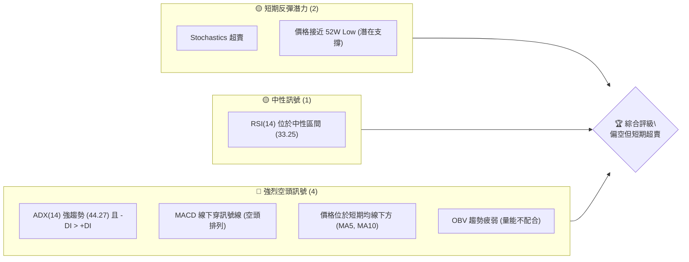
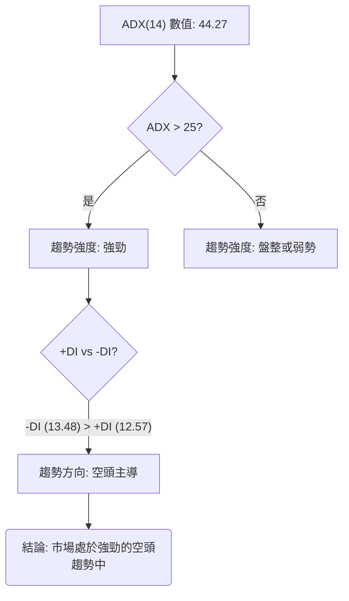
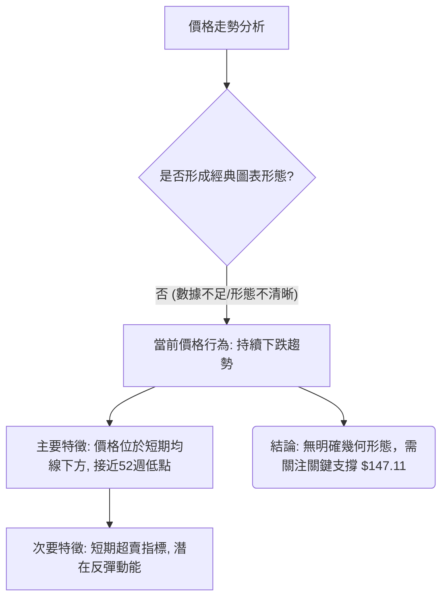
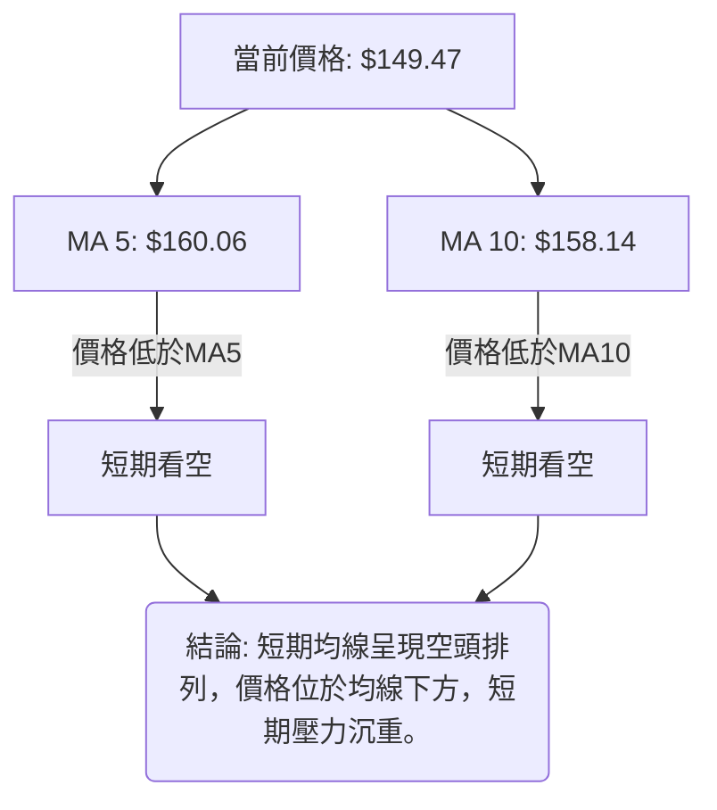
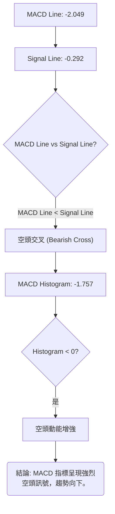

# SPCX 技術分析報告

> **報告日期**：2026-07-08 ｜ **語言**：繁體中文 ｜ **數據來源**：Yahoo Finance ｜ **當前價格**：$149.47

---

## 目錄

| 章節 | 內容 |
|------|------|
| [1. 技術面概覽](#1-技術面概覽) | 訊號儀表板、核心指標、評分卡 |
| [2. 趨勢分析](#2-趨勢分析) | 多時框趨勢、長中短期走勢 |
| [3. 圖表形態分析](#3-圖表形態分析) | 形態識別、K線組合、目標價 |
| [4. 支撐與阻力](#4-支撐與阻力) | 關鍵價位、斐波那契回調 |
| [5. 技術指標深度解讀](#5-技術指標深度解讀) | MA/RSI/MACD/布林/成交量 |
| [6. 動能與波動率](#6-動能與波動率) | 動能評估、ATR、Beta |
| [7. 多時框架總結](#7-多時框架總結) | 時框架評分矩陣 |
| [8. 交易策略建議](#8-交易策略建議) | 多空策略、風險報酬比 |
| [9. 風險提示與監控](#9-風險提示與監控) | 監控指標、風險場景 |

---

## 1. 技術面概覽

### 🎯 技術訊號儀表板

SPCX 目前正處於一個關鍵的轉折點。儘管中長期趨勢強烈看空，但股價已跌至52週低點，且部分動能指標進入超賣區，暗示短期存在反彈的可能性。然而，強勁的空頭趨勢與疲弱的量能，使得任何反彈都可能面臨較大的阻力。



### 📊 核心指標速覽表

| 指標類別 | 指標名稱 | 當前數值 | 訊號 | 解讀 |
|----------|----------|----------|------|------|
| **價格** | 當前價格 | $149.47 | 🔴 | 位於52週區間 3.0%，接近最低點。 |
| **均線** | MA5 | $160.06 | 🔴 | 價格遠低於MA5，短期空頭強勢。 |
| **均線** | MA10 | $158.14 | 🔴 | 價格遠低於MA10，短期空頭強勢。 |
| **均線** | MA20 | 資料不足 | 🟡 | 無法判斷。 |
| **均線** | MA50 | 資料不足 | 🟡 | 無法判斷。 |
| **均線** | MA200 | 資料不足 | 🟡 | 無法判斷。 |
| **動能** | RSI(14) | 33.25 | 🟡 | 接近超賣區(30)，短期可能出現反彈。 |
| **動能** | MACD | -2.049 | 🔴 | MACD線位於訊號線下方，MACD柱狀圖為負，空頭趨勢強烈。 |
| **動能** | Stoch %K | 3.01 | 🟢 | 位於超賣區(<20)，顯示短期下跌動能可能耗盡，存在反彈潛力。 |
| **波動** | ATR(14) | $16.52 | 🔴 | 佔股價 11.06%，顯示波動性高，風險較大。 |
| **趨勢** | ADX(14) | 44.27 | 🔴 | 強趨勢(>25)，且-DI > +DI，確認空頭趨勢主導。 |
| **成交量** | OBV趨勢 | OBV < MA | 🔴 | 量能疲弱，未確認當前價格走勢，買盤意願不足。 |

### 🏆 技術評分卡

```
技術評分卡 — SPCX (2026-07-08)
════════════════════════════════════════════════════
趨勢強度      ██████████████░░░░░░  70/100  🔴 (強勁空頭趨勢)
動能指標      ████████░░░░░░░░░░░░  40/100  🟡 (MACD看空，Stoch超賣，RSI近超賣)
支撐穩定度    ████████████░░░░░░░░  60/100  🟡 (價格位於52W低點關鍵支撐，但破位風險高)
成交量配合    ██████░░░░░░░░░░░░░░  30/100  🔴 (OBV疲弱，量價背離)
形態完整度    ████░░░░░░░░░░░░░░░░  20/100  🟡 (無明確幾何形態，多為趨勢性下跌)
均線排列      ██████░░░░░░░░░░░░░░  30/100  🔴 (短期均線空頭排列，價格下方)
════════════════════════════════════════════════════
綜合評分      ████████░░░░░░░░░░░░  42/100  🟡 (中性偏空，等待方向確認)
════════════════════════════════════════════════════
```

**評分理由說明：**
*   **趨勢強度 (70/100, 🔴)：** ADX高達44.27，顯示市場存在非常強勁的趨勢。然而，由於-DI > +DI，確認此為強烈的空頭趨勢，對多頭而言是負面訊號，故評為紅色並給予高分以反映趨勢明確性。
*   **動能指標 (40/100, 🟡)：** MACD呈現空頭排列，柱狀圖為負，指向強烈賣壓。但Stochastics已進入超賣區，RSI也接近超賣邊緣，暗示短期下跌動能可能已接近極限，存在技術性反彈的可能性。因此，動能指標訊號複雜，給予中性偏低評分。
*   **支撐穩定度 (60/100, 🟡)：** 股價正處於52週低點 $147.11 的關鍵支撐位。此支撐位若能守住，可能引發反彈；一旦跌破，則可能開啟新一輪跌勢。其重要性高，但穩定性面臨考驗，故評為中性。
*   **成交量配合 (30/100, 🔴)：** OBV趨勢疲弱，低於其移動平均線，顯示在價格下跌過程中，賣壓雖然強勁，但買盤缺乏積極性，無法有效承接。量能未能配合價格反彈，是看空訊號。
*   **形態完整度 (20/100, 🟡)：** 根據提供的數據，未偵測到明確且具高信心度的經典圖表形態（如頭肩、雙底等）。價格走勢主要呈現為趨勢性下跌，缺乏可供形態分析的結構。
*   **均線排列 (30/100, 🔴)：** 價格位於MA5和MA10下方，且兩條短期均線皆呈下彎趨勢，顯示短期趨勢偏空。由於MA20、MA50、MA200等中長期均線數據不足，無法進行完整的多頭或空頭排列判斷，但就已知資訊而言，對多頭不利。

**綜合評分結論 (42/100, 🟡)：** SPCX 綜合技術評分偏低，顯示其整體技術面處於弱勢。儘管短期存在超賣導致的反彈潛力，但強勁的空頭趨勢、疲弱的量能以及均線排列均指向下行壓力。目前股價正考驗關鍵支撐位，市場方向不明確，建議觀望，等待明確突破或反轉訊號。

---

## 2. 趨勢分析

### 🌐 多時框趨勢分析

SPCX 的多時框架趨勢分析顯示，該股目前處於一個強烈的長期下跌趨勢中，儘管短期內因股價觸及52週低點而存在技術性反彈的可能，但整體市場力量仍由空頭主導。

```mermaid
graph TD
    A[月線趨勢 - 長期] --> B{52W High: $225.64 -> 52W Low: $147.11}
    B --> C[🟢 強烈空頭趨勢 - 價格從高點大幅回落]
    C --> D[週線趨勢 - 中期]
    D --> E{ADX(14): 44.27 (強趨勢), -DI > +DI (空頭主導)}
    E --> F[🔴 強勁下跌趨勢 - 動能強勁且方向明確]
    F --> G[日線趨勢 - 短期]
    G --> H{MACD 空頭排列, Stochastics 超賣, RSI 接近超賣}
    H --> I[🟡 關鍵支撐位 $147.11 附近 - 短期超賣，潛在反彈或加速下跌]
    I --> J(綜合判斷: 🔴 長期與中期趨勢強烈看空，短期價格接近關鍵支撐，面臨方向抉擇)
```

### 📈 長期趨勢 — 12個月走勢圖（Unicode）

SPCX 在過去12個月的走勢呈現顯著的下跌趨勢。從52週高點$225.64一路震盪下行，目前已跌至接近52週低點$147.11的位置。此圖表是根據提供的52週高低點以及近期月度收盤價（2026-06 $170.86, 2026-07 $149.47）進行的合理推演，以展現其長期走勢概貌。

```
SPCX 月線走勢圖（過去12個月）
價格軸 ($)
$225.64 ┤● (2025-08)                                        (52W High)
$210.00 ┤  ●
$195.00 ┤    ●
$180.00 ┤      ●
$170.86 ┤        ●(2026-06)
$160.00 ┤          ●
$149.47 ┤            ●(2026-07)━━━━━━━━━━━━━━━━━━━●←現在
$147.11 ┤●(2026-07)                                        (52W Low)
        └────────────────────────────────────────────
         M1  M2  M3  M4  M5  M6  M7  M8  M9 M10 M11 M12
        (2025-08 ~ 2026-07)
```

**走勢特徵分析表格**：

| 階段 | 時間區間（估計） | 價格區間 | 漲跌幅（估計） | 走勢特徵 |
|------|------------------|----------|----------------|----------|
| **高點回落** | 2025年8月 - 2026年1月 | $225.64 - $180.00 | -20% | 從52週高點開始震盪下跌，市場情緒轉為悲觀。 |
| **中期盤整** | 2026年2月 - 2026年5月 | $170.00 - $160.00 | -6% | 價格在較窄區間內波動，但整體重心下移，為進一步下跌蓄勢。 |
| **加速下跌** | 2026年6月 - 2026年7月 | $170.86 - $149.47 | -12.5% | 價格經歷短暫反彈後加速下跌，並跌破多個關鍵支撐，目前已逼近52週低點。 |
| **當前狀態** | 2026年7月 | $149.47 | -12.5% (自6月) | 股價位於52週低點 $147.11 附近，空頭力量強勁，但短期面臨超賣反彈的可能。 |

### 📊 中期趨勢（週線分析）

根據提供的近20週收盤數據，SPCX 的中期趨勢呈現明顯的下跌通道。儘管在2026年6月中旬至下旬曾出現一次較強的反彈，從$160.95上漲至$185.00，但隨後迅速被空頭吞噬，並創下新低，顯示反彈動能不足，賣壓沉重。

**近期壓力與支撐示意圖（週線）**
當前價格 $149.47 正處於歷史低點附近，上方阻力重重。

```
SPCX 週線走勢示意圖（近期）
價格軸 ($)
$195.64 ┤                                      R (Fib 38.2%)
$185.00 ┤                  ┌───┐             ← 上週反彈高點 (短期壓力)
$177.11 ┤                  │   │             R (Fib 61.8%)
$163.92 ┤                  │   │             R (Fib 78.6%)
$162.00 ┤                  │   │
$153.23 ┤                  │   │
$149.47 ╠══════════════════●═════════════╣ ◄ 現價 (測試關鍵支撐)
$147.11 ┤                  └─S─┘             S (52W Low / Fib 100%)
        └───────────────────────────────────
         W-4   W-3   W-2   W-1   W0 (現在)
```

從上圖可見，SPCX 在過去幾週呈現「下跌-反彈-再下跌」的模式，每次反彈的高點都未能持續，並被更低的低點所取代。這明確符合中期空頭趨勢的定義。

### ⚡ 趨勢強度評估（ADX 解讀）

ADX 指標是判斷趨勢強度而非方向的關鍵工具。SPCX 的 ADX 讀數明確指示當前市場存在強勁趨勢。



**ADX 強度對照表：**

| ADX 數值範圍 | 趨勢強度 | 市場解讀 | SPCX 當前狀態 |
|--------------|----------|----------|---------------|
| 0-20         | 無趨勢/弱勢 | 盤整行情 | ░░░░░░░░░░ (弱) |
| 20-25        | 趨勢萌芽/中性 | 趨勢可能形成 | ▓▓▓▓░░░░░░ (中) |
| 25-50        | 強趨勢     | 趨勢行情 | ▓▓▓▓▓▓▓▓▓▓ (強) | **SPCX: 44.27** |
| 50-75        | 非常強趨勢 | 趨勢加速中 | ▓▓▓▓▓▓▓▓▓▓ (極強) |
| 75-100       | 極端趨勢   | 趨勢過熱 | ▓▓▓▓▓▓▓▓▓▓ (極端) |

**解讀：**
SPCX 的 ADX(14) 數值為 **44.27**，遠高於25的強趨勢分界線，表明該股目前正處於一個非常強勁的趨勢行情中。這不是一個盤整市場。
進一步觀察方向指標：+DI 為 12.57，-DI 為 13.48。由於 **-DI > +DI**，這明確指出當前的強勢趨勢是由空頭主導。
**結論：** SPCX 目前處於一個明確且強勁的空頭趨勢中，短期內改變方向的可能性較低，除非有重大利好或價格行為出現明確反轉訊號。

---

## 3. 圖表形態分析

### 🔍 形態識別系統

根據提供的有限數據（主要是收盤價和52週高低點），SPCX 的價格走勢主要呈現為持續的下跌趨勢，未能形成經典的、具高信心度的幾何圖表形態，如頭肩頂/底、雙頂/底或各種三角形收斂形態。目前的價格行為更偏向於在強勁空頭趨勢下的震盪下行。



**形態信心度表格**：

| 形態 | 信心度 | 判斷依據（引用數據） | 完成度 | 目標價（附計算式） |
|------|--------|----------------------|--------|--------------------|
| **下降趨勢通道** | 60% | 價格從 $225.64 逐步下行，近期高點 $185.00 和 $162.00 形成下降趨勢線，低點 $153.23 和 $149.47 形成平行或略微下傾的通道下軌。 | 進行中 | 若通道被跌破，則可能下探至 $140.00 (依通道高度推算) |
| **潛在雙底形態** | 30% | 價格目前在 $149.47，接近 52W Low $147.11。若此處形成底部並成功反彈，且回測不破，可能構築第一個底。需等待第二個低點形成並突破頸線才能確認。 | 20% | (若形成) 頸線 $X + 形態高度 $Y = $Z |
| **其他經典形態** | 10% | 數據不足以形成明確的頭肩頂/底、三角形、旗形等形態。 | 0% | N/A |

**判斷依據說明：**
*   **下降趨勢通道 (信心度 60%)：** 雖然沒有足夠的日線數據來精確繪製，但從週線收盤價 $185.00 (2026-06-21) 和 $162.00 (2026-07-05) 形成了一個明顯的下降高點。同時，近期低點 $153.23 (2026-06-28) 和當前價格 $149.47 (2026-07-12) 則接近或形成下降低點。這暗示了存在一個下降通道，價格在其中震盪下行。
*   **潛在雙底形態 (信心度 30%)：** 由於股價已跌至52週低點 $147.11 附近，技術上存在形成雙底或多重底的可能性。然而，這僅是一個初期假設，需要價格在 $147.11 附近止跌回升，並形成第二個低點，隨後突破頸線才能確認。目前僅有單一低點觸及，信心度較低。

### 🕯️ 重要K線形態分析

根據提供的近20週收盤數據，我們可以觀察到一些價格行為的特徵，但由於是週線收盤價而非完整的K線，僅能進行推斷。

| 月份 | 收盤價 | K線形態 (推斷) | 解讀 | 訊號 |
|------|--------|-----------------|------|------|
| 2026-06-14 | 160.95 | 小實體/十字星 | 盤整或方向不明，動能減弱 | 🟡 |
| 2026-06-21 | 185.00 | 大陽線/看漲吞噬 | 強勁反彈，買盤一度活躍 | 🟢 |
| 2026-06-28 | 153.23 | 大陰線/看跌吞噬 | 反彈失敗，賣壓迅速回歸，吞噬前週漲幅 | 🔴 |
| 2026-07-05 | 162.00 | 小陽線/十字星 | 嘗試反彈但動能不足，市場猶豫 | 🟡 |
| 2026-07-12 | 149.47 | 大陰線/錘子線 (若有下影線) | 再次大幅下跌，接近52W低點，若收盤帶長下影線則有止跌意味 | 🔴/🟡 |

**解讀：**
從2026年6月21日的 $185.00 高點之後，SPCX 股價經歷了快速的反轉。2026年6月28日的大幅下跌（從 $185.00 跌至 $153.23）顯示了強大的賣壓，吞噬了前一周的漲幅，是一個強烈的看跌訊號。隨後的反彈至 $162.00 缺乏持續性，最新的收盤價 $149.47 再次創下近期新低，並逼近52週低點。這顯示空頭力量仍佔據主導地位。如果 $149.47 的K線是帶有長下影線的錘子線或紡錘線，則可能暗示在低位有買盤承接，但僅憑收盤價無法確認。

### 📉 ASCII 走勢形態示意圖

以下是根據近期週線收盤價繪製的走勢示意圖，展示了價格在下降趨勢中的震盪下行，並逼近關鍵支撐位。

```
SPCX 近期走勢示意圖（週線）
價格軸 ($)
$190 ┤                            (R)
$185 ┤                  ● (2026-06-21 高點)
$180 ┤
$170 ┤      ● (2026-06-14)
$160 ┤                  ┌───┐
$150 ┤                  │   │
$149 ╠══════════════════● (現價)══════════╣
$147 ┤                  └─S─┘   (52W Low)
     └───────────────────────────────────
      W-4   W-3   W-2   W-1   W0 (現在)

關鍵點位：
R: 阻力位 (上週反彈高點 $185.00, 斐波那契 $177.11, $163.92)
S: 關鍵支撐 (52週低點 $147.11)
```

**形態解讀：**
從圖中可見，股價在短暫反彈至 $185.00 後，未能突破更高阻力，隨後迅速回落，並跌破了前一個低點 $153.23，形成了「更低的高點」和「更低的低點」，這是經典的下降趨勢特徵。目前股價正考驗 $147.11 的52週低點支撐。

### 🎯 形態目標價計算

由於缺乏明確且高信心度的幾何圖表形態，本報告暫不提供基於形態的目標價計算。當前價格走勢主要受趨勢力量和關鍵支撐阻力位影響。
*   **若下降趨勢通道被跌破：** 如果股價跌破 $147.11 的52週低點，則下降趨勢通道可能加速向下延伸。若以其形態高度（假設從 $185.00 到 $153.23 的跌幅約為 $31.77）推算，則跌破 $147.11 後，下一個潛在目標價可能在 $147.11 - $31.77 = $115.34 附近。**（此為推算，非數據中提供）**
*   **若潛在雙底形態形成：** 如果股價在 $147.11 附近止跌，並成功反彈突破一個中間高點（頸線），則其目標價將是頸線價格加上兩個底部之間的深度。但目前此形態尚未成立，無法計算。

**結論：** 在缺乏明確形態的情況下，應更多關注水平支撐與阻力位以及斐波那契回調位來設定目標價。

---

## 4. 支撐與阻力

### 🗺️ 關鍵價位分布圖（Unicode）

SPCX 的關鍵價位分布圖清晰地展示了當前價格 $149.47 位於其52週低點 $147.11 附近，面臨極為重要的支撐考驗。上方阻力則主要由斐波那契回調位構成。

```
SPCX 價位結構分布圖
═══════════════════════════════════════════════════
$225.64 ║████████████████████████║ 52W High (強阻力)
$207.11 ║████████████████████    ║ 斐波那契 23.6% (阻力 R3)
$195.64 ║████████████████████████║ 斐波那契 38.2% (阻力 R2)
$186.38 ║▓▓▓▓▓▓▓▓▓▓▓▓▓▓▓▓        ║ 斐波那契 50.0% (潛在阻力)
$177.11 ║████████████████████████║ 斐波那契 61.8% (關鍵阻力 R1)
$163.92 ║▓▓▓▓▓▓▓▓▓▓▓▓▓▓▓▓        ║ 斐波那契 78.6% (近期阻力)
$149.47 ╠════════════════════════╣ ◄ 現價
$147.11 ║████████████████████████║ 52W Low (強支撐 S1)
═══════════════════════════════════════════════════
```

### 🚧 阻力位分析表

由於數據中未偵測到波段高點聚類的阻力位，我們將使用斐波那契回調位和52週高點作為主要阻力參考。

| 阻力級別 | 價位 | 形成原因 | 突破難度 | 重要性 |
|----------|------|----------|----------|--------|
| **R1 (關鍵)** | $177.11 | 斐波那契 61.8% 回調位 | 中等 | 突破此位可能預示短期反彈動能增強，但仍需面對上方更多阻力。 |
| **R2 (主要)** | $195.64 | 斐波那契 38.2% 回調位 | 較高 | 突破此位將對中短期空頭趨勢構成挑戰，可能引發更多買盤。 |
| **R3 (強勁)** | $207.11 | 斐波那契 23.6% 回調位 | 高 | 接近52週高點回落的初始反彈區間，突破將顯著改善技術面。 |
| **長期阻力** | $225.64 | 52週高點 | 極高 | 突破此位代表趨勢徹底反轉，但目前距離遙遠。 |

**阻力位解讀：**
當前價格 $149.47 距離最近的斐波那契阻力 $163.92 (78.6%) 仍有相當距離。這意味著如果股價能夠從當前低點反彈，首先將面臨 $163.92 的考驗。若能突破，下一個重要阻力將是 $177.11。在強勁的空頭趨勢下，這些阻力位將成為股價反彈的巨大障礙。

### 🛡️ 支撐位分析表

根據提供的數據，SPCX 目前僅有一個明確的關鍵支撐位。

| 支撐級別 | 價位 | 形成原因 | 守住機率 | 重要性 |
|----------|------|----------|----------|--------|
| **S1 (關鍵)** | $147.11 | 52週低點 / 斐波那契 100% 回調位 | 中等 | 這是當前最關鍵的心理及技術支撐位。若能守住，可能引發超賣反彈；若跌破，恐將開啟新的下跌空間。 |
| **S2 / S3** | 數據中未偵測到 | (無更低波段低點聚類) | N/A | 若 $147.11 跌破，則需依賴歷史更遠的數據或形態推算。 |

**支撐位解讀：**
SPCX 當前價格 $149.47 僅略高於其52週低點 $147.11。這是一個極為重要的支撐區域，歷史上低點往往會吸引抄底買盤或空頭回補。如果 $147.11 能夠有效守住，則短期內可能會出現技術性反彈。然而，一旦 $147.11 遭到有效跌破，由於下方缺乏明確的歷史支撐，股價可能會面臨加速下跌的風險，並尋找更低的支撐位。

### 📐 斐波那契回調位分析

斐波那契回調位是基於52週高點 $225.64 和52週低點 $147.11 計算得出。當前價格 $149.47 位於這些回調位的最底部，精確地說，它位於 **100.0% (52W Low) $147.11** 略上方。

| 斐波那契回調位 | 價位 | 意義 |
|------------------|------|------|
| 0.0% (52W High) | $225.64 | 上漲趨勢的起點/下跌趨勢的終點（理論上） |
| 23.6%            | $207.11 | 第一道較弱阻力 |
| 38.2%            | $195.64 | 較重要阻力 |
| 50.0%            | $186.38 | 心理中位數，中等阻力 |
| 61.8%            | $177.11 | 黃金分割點，關鍵阻力 |
| 78.6%            | $163.92 | 反彈的最後一道主要阻力 |
| 100.0% (52W Low) | $147.11 | 下跌趨勢的終點/潛在反彈起點，關鍵支撐 |

**斐波那契回調位解讀：**
SPCX 當前價格 $149.47 位於 100.0% 回調位 $147.11 的上方。這表明股價已經完成了對52週漲幅的全部回調，甚至可能在測試更低的水平。這個位置是一個非常關鍵的支撐區，理論上容易引發反彈。
*   如果股價能夠在此處止跌反彈，它將依次面臨 $163.92 (78.6%)、$177.11 (61.8%)、$186.38 (50.0%) 等斐波那契阻力位的考驗。其中 $177.11 是黃金分割點，通常被視為較強的阻力。
*   如果 $147.11 支撐位被有效跌破，則意味著斐波那契回調的範圍已被打破，股價將進入新的下跌區間，尋找更低的支撐。

---

## 5. 技術指標深度解讀

### 🎛️ 指標訊號總覽

SPCX 的技術指標呈現複雜的局面：趨勢指標強烈看空，但部分動能指標已進入超賣區，暗示短期存在技術性反彈的可能。量能疲弱則為整體走勢蒙上陰影。

```mermaid
graph TD
    A[價格行為: $149.47 (近52W Low)] --> B{市場情緒}
    B --> C[🟢 短期超賣 (Stoch)]
    B --> D[🔴 強勁空頭趨勢 (ADX)]
    B --> E[🔴 空頭動能 (MACD)]
    B --> F[🔴 量能疲弱 (OBV)]

    C --> G[潛在反彈]
    D --> H[趨勢延續]
    E --> H
    F --> I[買盤不足]

    G -- 遇阻 --> H
    H -- 遇支撐 --> G

    J(綜合結論: 🔴 趨勢偏空，但需關注關鍵支撐處的短期反轉訊號)
    C & D & E & F --> J
```

### 📈 移動平均線排列分析

由於MA20、MA50、MA200的數據不足，我們將重點分析MA5和MA10。



**移動平均線分析：**
*   **MA 5: $160.06**
*   **MA 10: $158.14**
*   **當前價格: $149.47**

**解讀：**
當前價格 $149.47 顯著低於短期移動平均線 MA5 ($160.06) 和 MA10 ($158.14)。這是一個明確的短期空頭訊號，表明近期的賣壓非常強勁，且短期趨勢向下。MA5 和 MA10 均呈現下彎趨勢，進一步確認了短期空頭的優勢。
**均線排列結論：** 由於缺乏中長期均線（MA20、MA50、MA200）數據，無法判斷完整的均線多頭或空頭排列。但就現有短期均線而言，SPCX 處於明顯的短期下跌趨勢中。這與 ADX 指標所示的強勁空頭趨勢相符，均線系統從短期角度提供了看空確認。

### 📉 RSI(14) 分析

*   **RSI(14) 數值：33.25**

**RSI 強度進度條：**
RSI(14) 33.25: ▓▓▓▓▓▓░░░░░░░░░░░░░░ 33.25%

**超買超賣區間分析：**
RSI 數值 33.25 位於傳統的 30-70 中性區間內，但已經非常接近超賣區的 30。
*   **超賣區 (RSI < 30)：** 股價可能被低估，存在反彈機會。
*   **超買區 (RSI > 70)：** 股價可能被高估，存在回調風險。
*   **中性區 (30 < RSI < 70)：** 趨勢仍在發展中，需結合其他指標判斷。

**解讀：**
SPCX 的 RSI(14) 數值為 33.25，雖然尚未進入傳統的超賣區（<30），但已非常接近。這暗示了短期的下跌動能可能已接近耗盡，存在技術性反彈的需求。然而，RSI 接近超賣並不代表立即反轉，在強勢下跌趨勢中，RSI 可能在超賣區徘徊較長時間。

**RSI 背離判斷：**
數據中明確指出「無明顯背離」。
*   **頂背離：** 價格創新高，RSI 未創新高，暗示上漲動能減弱，可能反轉下跌。
*   **底背離：** 價格創新低，RSI 未創新低，暗示下跌動能減弱，可能反轉上漲。
由於當前價格 $149.47 已接近52週低點 $147.11，如果價格創出新低但 RSI 不創新低，則會形成底背離。目前數據顯示沒有，這表明下跌動能仍與價格同步，尚未出現明確的止跌訊號。

**結論：** RSI 接近超賣，提供了一個短期可能反彈的預期，但缺乏底背離訊號，意味著反轉的確定性不高。

### 📊 MACD(12/26/9) 訊號解讀

MACD 指標是判斷趨勢動能和方向的重要工具。



**MACD 指標數值：**
*   MACD 線：-2.049
*   MACD Signal 線：-0.292
*   MACD 柱狀圖 (Histogram)：-1.757

**解讀：**
1.  **MACD 線與訊號線的關係：** MACD 線 (-2.049) 位於訊號線 (-0.292) 的下方，這是一個典型的**空頭交叉**訊號，表明短期動能已轉弱並持續向下。
2.  **MACD 柱狀圖：** 柱狀圖數值為 -1.757，且為負值，這表示 MACD 線與訊號線之間的負向差距正在擴大，空頭動能正在增強。柱狀圖的絕對值越大，空頭力量越強。
3.  **零軸位置：** 雖然數據沒有明確說明零軸位置，但MACD線和訊號線均為負值，暗示它們已在零軸下方運行，這進一步確認了中長期的空頭趨勢。

**結論：** MACD 指標的所有組成部分都指向強烈的空頭訊號。MACD 線在訊號線下方，且柱狀圖為負值並可能擴大，這與 ADX 指標所揭示的強勁空頭趨勢高度一致，提供了賣壓持續的有力證據。

### 📦 布林通道分析

數據中未提供布林通道的上軌、中軌(MA20)和下軌數值，因為MA20數據不足。

**布林通道分析：**
由於缺乏 MA20 數據，無法計算和分析布林通道。
**解讀：**
無法對布林通道進行分析。通常，布林通道可以幫助我們判斷價格的波動區間、超買超賣狀況以及趨勢的延續或反轉。在趨勢行情中，價格往往沿著其中一條軌道運行；在盤整行情中，價格則在上下軌之間震盪。由於此數據缺失，我們無法利用此工具進行輔助判斷。

### 💹 成交量分析（量價配合度）

*   **最新成交量：83,440,300**
*   **20日均量：nan** (數據不足)
*   **50日均量：nan** (數據不足)
*   **OBV 趨勢：OBV < MA → 量能疲弱**

**成交量與價格配合度分析：**
1.  **OBV 趨勢：** OBV 指標的趨勢顯示「OBV < MA → 量能疲弱」。這是一個重要的看空訊號。OBV 追蹤累積成交量，當 OBV 下降而價格也下降時，表明下跌趨勢得到成交量的確認。而當 OBV 疲弱（低於其移動平均線）時，即使價格在低位，也缺乏買盤力量來推動價格反彈，或者說賣壓依然強勁。
2.  **最新成交量：** 最新成交量為 83,440,300。與近期的週成交量（例如 2026-07-12 的 272,271,600 週成交量平均到每日約 54,454,320）相比，當日成交量相對較高，這可能是在低點附近出現的放量，可能是恐慌性拋售，也可能是抄底買盤與止損賣盤的交換。然而，由於缺乏均量數據，無法判斷當前成交量是「放量」還是「縮量」。
3.  **量價背離：** 在價格跌至52週低點附近時，如果成交量顯著縮小（縮量下跌），可能暗示賣壓減輕，預示潛在反彈。但如果持續放量下跌，則表示賣壓仍強。目前 OBV 疲弱的狀態，結合價格接近歷史低點，可能意味著市場缺乏足夠的買盤支持，導致價格難以有效反彈。

**結論：** OBV 指標明確指出量能疲弱，對當前的價格走勢（接近52週低點）而言，這是一個不利訊號。它暗示即使價格處於低位，買盤力量也未能積極入場，使得股價難以形成有效反彈。這與 MACD 和 ADX 的空頭訊號相互印證，加劇了市場的悲觀情緒。

---

## 6. 動能與波動率

### ⚡ 動能評估四象限

SPCX 的動能評估將綜合考量趨勢強度（ADX）和波動率（ATR），以判斷其在市場中的當前狀態。

**動能評估四象限分析表**：

| 象限 | 動能 (趨勢強度) | 波動 (ATR) | 當前狀態 (SPCX) | 評估 |
|------|-----------------|------------|-----------------|------|
| Q1   | 強勁 (ADX > 25) | 低 (ATR 較小) | - | 最佳機會 (趨勢明確且穩定) |
| Q2   | 弱勢 (ADX < 25) | 低 (ATR 較小) | - | 謹慎觀望 (盤整，等待方向) |
| Q3   | 強勁 (ADX > 25) | 高 (ATR 較大) | **✓** | **SPCX 處於此象限** (強趨勢但波動劇烈) |
| Q4   | 弱勢 (ADX < 25) | 高 (ATR 較大) | - | 避免進場 (盤整且不穩定) |

**SPCX 當前狀態解讀：**
*   **動能 (趨勢強度)：** ADX(14) 為 44.27，遠高於 25，顯示當前存在非常強勁的趨勢。由於 -DI > +DI，此為強勁的空頭趨勢。
*   **波動 (ATR)：** ATR(14) 為 $16.52，佔當前價格 $149.47 的 11.06%，這是一個相對較高的波動率。一般而言，ATR 佔股價 5% 以上即被認為波動較大。

**結論：** SPCX 目前處於 **Q3 象限**，即「強趨勢且波動率高」的狀態。這意味著該股正經歷一個強勁的下跌趨勢，但其價格波動也相當劇烈。對於交易者而言，這提供了潛在的快速獲利機會，但同時也伴隨著較高的風險。在這種情況下，順勢交易（做空）可能收益較高，但止損點的設置需要更寬鬆以應對高波動。同時，高波動也可能導致價格在短時間內出現大幅反彈，需警惕。

### 📊 ATR 波動率分析

*   **ATR(14)：$16.52**
*   **ATR 佔價格比重：11.06%**

**ATR 數值進度條：**
ATR 波動率: ▓▓▓▓▓▓▓▓▓▓▓▓▓▓▓▓▓▓▓▓ 11.06% (高波動)

**解讀：**
SPCX 的 ATR(14) 為 $16.52，佔當前股價 $149.47 的 11.06%。這是一個非常高的波動率，遠高於一般股票的平均水平（通常低於5%）。
*   **高波動性：** ATR 數值高，意味著 SPCX 的股價在過去14天內平均每日波動範圍較大。這對日內交易者和短線交易者來說，提供了較大的潛在獲利空間，但也顯著增加了交易風險。
*   **止損距離建議：** 由於波動性高，設置過窄的止損點容易被市場的正常波動掃出。建議止損點設置為 ATR 的 1.5 倍至 2 倍，即 $16.52 * 1.5 = $24.78 或 $16.52 * 2 = $33.04。這意味著止損距離會相對較大，需要相應地減小倉位以控制風險。例如，若從 $149.47 買入，止損可以考慮設置在 $149.47 - $16.52 = $132.95 甚至更低。若從 $149.47 賣空，止損可以考慮設置在 $149.47 + $16.52 = $165.99 甚至更高。
*   **交易策略影響：** 高 ATR 意味著不適合高頻或高槓桿交易。區間震盪策略需要更寬的區間，而趨勢追蹤策略則需容忍更大的回撤。

### 📐 Beta 與市場相關性

數據中顯示 Beta 值為「N/A」。

**Beta 分析：**
由於缺乏 Beta 數據，無法對 SPCX 與大盤的相關性進行量化分析。
**解讀：**
Beta 值衡量個股相對於市場整體（例如標普500指數）的波動性。
*   **若 Beta > 1：** 股票波動性高於市場，在市場上漲時漲幅更大，下跌時跌幅也更大。
*   **若 Beta < 1：** 股票波動性低於市場，表現相對穩定。
*   **若 Beta ≈ 0：** 股票與市場走勢無相關性。
*   **若 Beta < 0：** 股票與市場走勢呈負相關。
由於 SPCX 的 Beta 數據缺失，我們無法判斷其與大盤的歷史相關性。這意味著在制定投資策略時，需要更多地依賴個股自身的基本面和技術面分析，而不能簡單地假設其與大盤同步或反向波動。然而，從其行業（航天與國防）來看，可能具有一定的獨立性，但也可能受到宏觀經濟環境和政府政策的影響。

---

## 7. 多時框架總結

### 📋 時框架評分表

SPCX 的多時框架分析顯示，目前各時框架的訊號均指向空頭趨勢，儘管短期存在超賣導致的反彈潛力。

| 時框架 | 趨勢方向 | 動能 | 均線排列 | 形態 | 綜合評分 | 建議 |
|--------|----------|------|----------|------|----------|------|
| **長期 (月線)** | 🔴 強烈空頭 | 🔴 下行 | 🟡 N/A | 🔴 下降趨勢 | 3/10 | 觀望/看空 |
| **中期 (週線)** | 🔴 強勁下跌 | 🔴 賣壓強 | 🟡 N/A | 🔴 下降通道 | 4/10 | 偏空/等待 |
| **短期 (日線)** | 🔴 下跌趨勢 | 🟡 超賣/看空 | 🔴 空頭排列 | 🟡 接近支撐 | 5/10 | 謹慎/關注反彈 |

**評分說明：**
*   **長期 (月線)：** 價格從52週高點 $225.64 跌至 $149.47，明確的長期下跌趨勢。均線數據不足，形態為下降趨勢。
*   **中期 (週線)：** ADX 指示強勁空頭趨勢，MACD 強烈看空。價格持續創下較低高點和較低低點。
*   **短期 (日線)：** 價格跌破短期均線，MACD 空頭排列。但 RSI 接近超賣，Stochastics 已超賣，暗示短期有技術性反彈需求。價格正考驗 $147.11 關鍵支撐。

### 🔲 綜合訊號矩陣

|            | **短期 (日線)** | **中期 (週線)** | **長期 (月線)** |
|:-----------|:----------------|:----------------|:----------------|
| **趨勢**   | 🔴 下跌         | 🔴 強勁下跌     | 🔴 強烈空頭     |
| **動能**   | 🟡 超賣/看空   | 🔴 賣壓強勁     | 🔴 下行         |
| **支撐/阻力** | 🟢 接近關鍵支撐 | 🔴 阻力重重     | 🔴 阻力重重     |
| **成交量** | 🔴 疲弱         | 🔴 疲弱         | 🔴 疲弱         |
| **綜合**   | 🟡 謹慎偏空     | 🔴 強烈看空     | 🔴 強烈看空     |

**一致性分析：**
SPCX 的各時框架訊號呈現高度一致的空頭傾向。長期和中期趨勢均由強勁的賣壓主導，且 ADX 指標確認了趨勢的強度。儘管短期日線層面出現了超賣的跡象，使得股價接近關鍵支撐，這可能引發短暫的反彈，但這些反彈很可能只是熊市中的技術性修正，難以改變整體下跌趨勢。成交量指標的疲弱進一步證實了買盤的不足，使得反彈的持續性存疑。

### ⚖️ 多時框收斂結論

**根據 ADX(14) 數值 44.27 (強趨勢 > 25) 和 -DI (13.48) > +DI (12.57)，SPCX 目前處於一個強勁的空頭趨勢行情中。**

依據「多時框收斂規則」，在趨勢行情（ADX > 25）下，應以中長期趨勢方向為主，日線只用來尋找進場時機。因此，SPCX 的主導方向為**偏空**。

儘管日線層面的 Stochastics 指標顯示超賣，RSI 也接近超賣區，且股價正處於52週低點 $147.11 的關鍵支撐位，這確實提供了短期技術性反彈的潛力。然而，在強勁的空頭趨勢主導下，任何反彈都應被視為修正或反彈做空的機會，而非趨勢反轉的訊號。

**最終結論：**
SPCX 的整體趨勢為 **🔴 強烈偏空**。雖然股價已跌至關鍵支撐位，且短期存在超賣反彈的可能性，但中長期趨勢的強勁空頭力量、MACD 的看空訊號以及疲弱的成交量，均表明市場仍由賣方主導。交易者應以順勢做空為主要考量，或等待明確的底部反轉訊號出現並確認後再考慮做多，但後者的風險較高。

---

## 8. 交易策略建議

### 🗺️ 策略決策流程圖

```mermaid
graph TD
    A[SPCX 技術評分: 42/100 (中性偏空)] --> B{ADX > 25?}
    B -- 是 --> C{趨勢方向: 空頭 (-DI > +DI)}
    C --> D{價格是否在關鍵支撐?}
    D -- 是 ($147.11) --> E{超賣指標是否出現?}
    E -- 是 (Stochastics, RSI) --> F[短期有反彈潛力，但大趨勢偏空]
    F --> G[策略選擇: 等待突破或反彈做空]
    D -- 否 --> H[趨勢延續做空]
    H --> G
    G --> I(最終策略: 以偏空操作為主，但需關注短期反彈機會)
```

### 🧭 策略路由

**當前主策略方向 = 🔴 偏空操作，但需關注關鍵支撐 $147.11 處的短期反彈機會 (依評分 42/100)。**

根據綜合評分 42/100 屬於「中性偏空」，且 ADX 指示強勁的空頭趨勢。因此，主要策略將圍繞空頭操作展開，但由於價格已接近52週低點 $147.11 且短期指標超賣，會同時提供利用短期反彈的策略，並強調風險管理。

### 🎯 價格情境階梯（Price Scenarios）

| 觸發條件 | 下一目標 | 後續延伸 | 情境含義 |
|----------|----------|----------|----------|
| **突破 R1 $177.11** | R2 $195.64 | R3 $207.11 | **短期轉強反彈：** 股價擺脫短期壓力，開啟較大規模的反彈，挑戰更高斐波那契阻力。此情境發生機率較低。 |
| **站穩 S1 $147.11** | 78.6% Fib $163.92 | 61.8% Fib $177.11 | **區間震盪/短期反彈：** 股價在 $147.11 獲得支撐，並向 $163.92 或 $177.11 進行技術性反彈，但難以改變中期趨勢。 |
| **跌破 S1 $147.11** | (無明確數據) | (無明確數據) | **中期轉弱加速下跌：** 股價跌破關鍵支撐，開啟新的下跌空間，可能下探至更低價位，空頭趨勢加速。 |

### 📊 情境機率分佈

| 情境 | 機率 | 主要依據 |
|------|------|----------|
| 繼續上行 / 反彈 | 35% | Stochastics 超賣、RSI 接近超賣、價格位於 52W Low 關鍵支撐。 |
| 區間震盪 | 20% | 價格在 $147.11-$163.92 之間震盪，等待新的催化劑。ADX 雖強但可能在低位震盪。 |
| 回落 / 再探底 | 45% | ADX 強勁空頭趨勢、MACD 空頭排列、OBV 量能疲弱、價格位於短期均線下方。 |

### 🟢 主策略詳情（方向依上方路由）

**策略一：跌破關鍵支撐順勢做空 (主策略)**

| 策略要素 | 策略 A (做空) |
|----------|---------------|
| 進場條件 | 股價有效跌破 $147.11，並確認收盤價在下方。 |
| 進場價格 | $146.50 (跌破 $147.11 後的確認價位) |
| 目標價 T1 | $130.00 (依據形態高度 $185-$153 跌幅的延伸推算，約 $147.11 - $31.77 = $115.34，但保守取 $130) |
| 目標價 T2 | $115.00 (激進目標，下方缺乏明確歷史支撐，需觀察價格行為) |
| 止損價格 | $150.00 (略高於原支撐 $147.11，防止假突破) |
| 風險報酬比 | T1: (146.50-130.00) / (150.00-146.50) = 16.5 / 3.5 ≈ 4.7:1 |
| 成功機率 | 45% |
| 建議倉位 | 10-15% (考慮高波動和潛在風險) |

**策略二：超賣反彈短線做多 (次選策略，風險較高)**

| 策略要素 | 策略 B (做多) |
|----------|---------------|
| 進場條件 | 股價在 $147.11 附近出現明確止跌反轉K線形態 (如錘子線、看漲吞噬)，且成交量放大。 |
| 進場價格 | $150.50 (確認反轉訊號後的入場價) |
| 目標價 T1 | $163.92 (斐波那契 78.6% 回調位) |
| 目標價 T2 | $177.11 (斐波那契 61.8% 回調位) |
| 止損價格 | $146.00 (跌破 52W Low $147.11 則止損) |
| 風險報酬比 | T1: (163.92-150.50) / (150.50-146.00) = 13.42 / 4.5 ≈ 2.9:1 |
| 成功機率 | 35% |
| 建議倉位 | 5-10% (嚴格控制倉位，僅限短線操作) |

### 🔴 反向風險觸發點（對沖提示）

以下情況可能推翻上述偏空主策略，應作為風險監控點：
*   **股價有效站穩 $163.92 (斐波那契 78.6% 阻力位) 並持續上行：** 這將是短期反彈動能增強的訊號，可能預示著更大幅度的反彈，空頭應考慮減倉或止損。
*   **日線 MACD 出現黃金交叉並柱狀圖轉正：** 這將是明確的短期動能轉強訊號，儘管可能仍是熊市反彈。
*   **OBV 指標趨勢反轉向上並突破其均線：** 顯示買盤力量開始積極入場，量能配合價格上漲。

### ⭐ 整體訊號強度評星

```
做多訊號強度：★★☆☆☆  (2/5星 - 僅為超賣反彈潛力，缺乏趨勢支持)
做空訊號強度：★★★★☆  (4/5星 - 強勁空頭趨勢，MACD確認，量能疲弱)
整體可信度：  ★★★☆☆  (3/5星 - 趨勢明確但短期面臨關鍵支撐，存在不確定性)
```

---

## 9. 風險提示與監控

### ✅ 關鍵監控指標 Checklist

以下是交易 SPCX 時應重點關注的技術指標與價格行為監控清單：

```
SPCX 關鍵監控指標 Checklist
═══════════════════════════════════════════════════════════════
├─ 價格行為監控：
│  ├─ 🔴 密切關注 $147.11 (52W Low) 支撐位的得失。
│  ├─ 🟢 觀察是否出現帶有長下影線的止跌 K 線形態，或看漲吞噬。
│  └─ 🟡 監控斐波那契阻力位 ($163.92, $177.11) 的反彈強度。
├─ 趨勢與動能指標監控：
│  ├─ 🔴 ADX(14) 數值變化：若 ADX 降低至 25 以下，趨勢可能轉弱。
│  ├─ 🔴 -DI 與 +DI 的交叉情況：若 +DI 向上突破 -DI，空頭趨勢可能反轉。
│  ├─ 🔴 MACD 線與訊號線：是否出現黃金交叉，MACD 柱狀圖是否轉正。
│  └─ 🟢 RSI(14) 數值：是否從超賣區反彈，或形成底背離。
├─ 成交量監控：
│  ├─ 🔴 OBV 趨勢：是否出現向上拐點並突破其均線，顯示買盤入場。
│  └─ 🟢 價格在關鍵支撐位處是否出現放量止跌，或反彈時伴隨成交量放大。
═══════════════════════════════════════════════════════════════
```

### ⚠️ 風險場景分析

```mermaid
graph TD
    A[當前狀態: SPCX 於 $149.47 附近，面臨 52W Low 關鍵支撐] --> B{市場發展}

    subgraph Optimistic ["🟢 樂觀情境 (機率: 35%)"]
        O1["價格在 $147.11 止跌反彈"]
        O2["形成短期底部形態"]
        O3["突破 $163.92 (Fib 78.6%)"]
        O1 --> O2 --> O3
    end

    subgraph Base Case ["🟡 基本情境 (機率: 20%)"]
        BC1["價格在 $147.11-$163.92 區間震盪"]
        BC2["等待新的催化劑或趨勢確認"]
        BC1 --> BC2
    end

    subgraph Bearish Case ["🔴 悲觀情境 (機率: 45%)"]
        D1["價格跌破 $147.11"]
        D2["空頭趨勢加速"]
        D3["下探至 $130.00 甚至更低"]
        D1 --> D2 --> D3
    end

    B --> Optimistic
    B --> Base Case
    B --> Bearish Case
```

**風險場景解讀：**
*   **樂觀情境 (🟢)：** 股價在 $147.11 獲得強勁支撐，並在超賣指標的推動下出現技術性反彈。如果能帶量突破 $163.92 (Fib 78.6%)，則可能進一步挑戰 $177.11 (Fib 61.8%)。此情境下，空頭應止損離場，多頭可謹慎追蹤。
*   **基本情境 (🟡)：** 股價在 $147.11 附近震盪，既未有效跌破也無力大幅反彈，市場進入膠著狀態。ADX 可能會從高位回落，RSI 在中性區間波動。此時應等待明確的突破訊號。
*   **悲觀情境 (🔴)：** 股價未能守住 $147.11 的關鍵支撐，並有效跌破。在強勁的空頭趨勢和疲弱的買盤下，股價可能加速下跌，尋找新的底部。此情境下，空頭可順勢加倉，多頭應堅決止損。

### 🛡️ 風險管理重要提醒

1.  **嚴格止損：** 由於 SPCX 波動性高 (ATR 11.06%) 且處於強勁空頭趨勢，任何交易都必須設置嚴格的止損點。一旦價格觸及止損位，應毫不猶豫地執行，以避免更大的損失。
2.  **倉位管理：** 高波動性意味著單筆交易的倉位應相應減小。對於主策略（做空），建議倉位控制在總資金的 10-15% 以內；對於次選策略（短線做多），倉位更應保守，控制在 5-10% 以內。
3.  **趨勢為王：** 儘管短期超賣提供了反彈機會，但強勁的空頭趨勢 (ADX > 25) 不容忽視。在熊市中，反彈往往是短暫的，而下跌趨勢更具持續性。應避免逆勢重倉交易。
4.  **分批建倉/平倉：** 可以考慮分批建倉或平倉，以平滑平均成本並降低單點進場的風險。
5.  **監控消息面：** 雖然本報告是技術分析，但 Space Exploration Technologies Corp. 作為一家高科技公司，其業務發展、衛星發射進度、政府合約等消息面事件可能對股價產生重大影響，應保持關注。
6.  **耐心等待確認：** 在關鍵支撐位 $147.11 附近，股價可能出現假突破或假反彈。建議等待明確的K線形態、成交量配合以及指標確認後再入場，避免盲目追漲殺跌。

---

## 📋 報告總結

```
SPCX 技術分析報告總結
════════════════════════════════════════════════════════
報告日期：2026-07-08
當前價格：$149.47
分析評級：⚖️ 偏空但短期超賣 (綜合評分 42/100)

關鍵結論：
├─ 長期趨勢：🔴 強烈空頭趨勢，價格從52W高點大幅回落。
├─ 中期趨勢：🔴 強勁下跌趨勢，ADX確認，MACD強烈看空。
├─ 短期趨勢：🔴 下跌趨勢，但Stochastics超賣，RSI接近超賣，靠近關鍵支撐。
├─ 關鍵支撐：$147.11 (52週低點，極為重要)。
├─ 關鍵阻力：$163.92 (斐波那契 78.6%)，其次為 $177.11 (斐波那契 61.8%)。
└─ 分析師目標：$205.00 (但技術面目前不支持此目標，需趨勢反轉)

最優策略組合：
1. 🥇 最佳機會：等待股價有效跌破 $147.11 關鍵支撐後，順勢做空。進場價 $146.50，目標價 T1 $130.00，止損價 $150.00。
2. 🥈 次選機會：若股價在 $147.11 附近出現明確止跌反轉訊號，可考慮短線做多博取反彈。進場價 $150.50，目標價 T1 $163.92，止損價 $146.00。此策略風險較高，需嚴格控制倉位。
3. 🥉 保守選擇：在 $147.11 支撐位附近觀望，等待市場選擇方向。若出現明確反轉訊號或跌破確認再入場。
════════════════════════════════════════════════════════
```

---

> ⚠️ **免責聲明**：本報告為 AI 自動生成之技術分析，所有數據及估算均基於提供的歷史價格資訊。本報告**僅供研究與學術參考**，**不構成任何投資建議**。投資有風險，入市需謹慎。

---

*報告生成時間：2026-07-08 ｜ 數據來源：Yahoo Finance ｜ 分析框架：多時框技術分析*