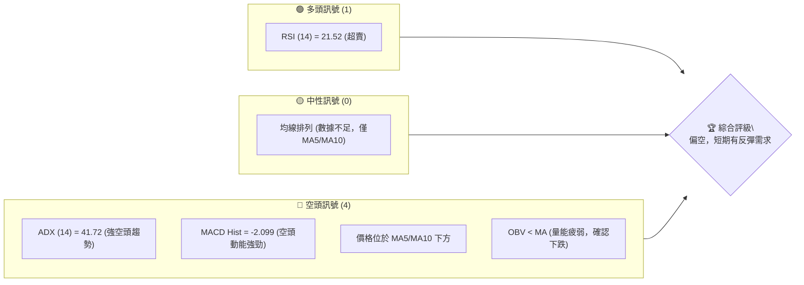
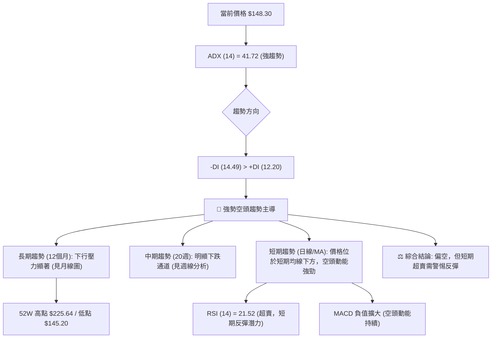
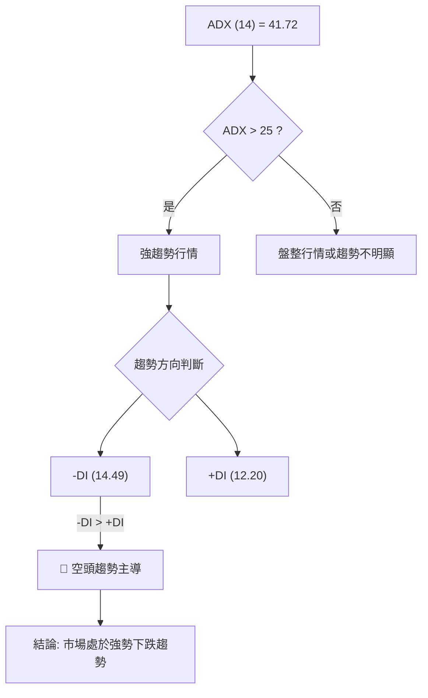
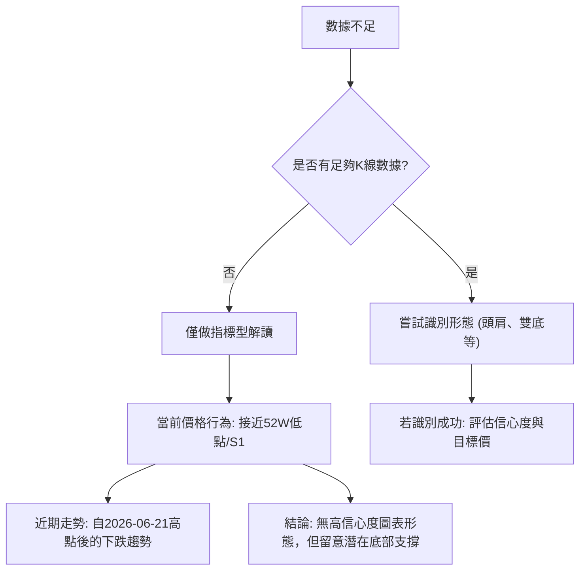
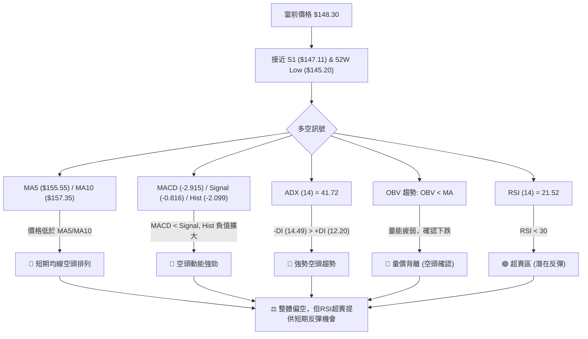
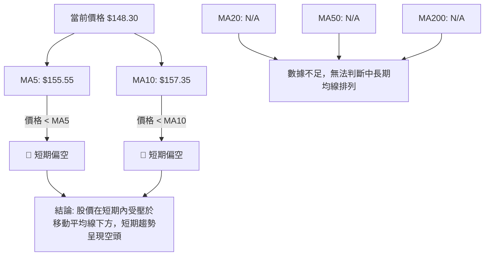
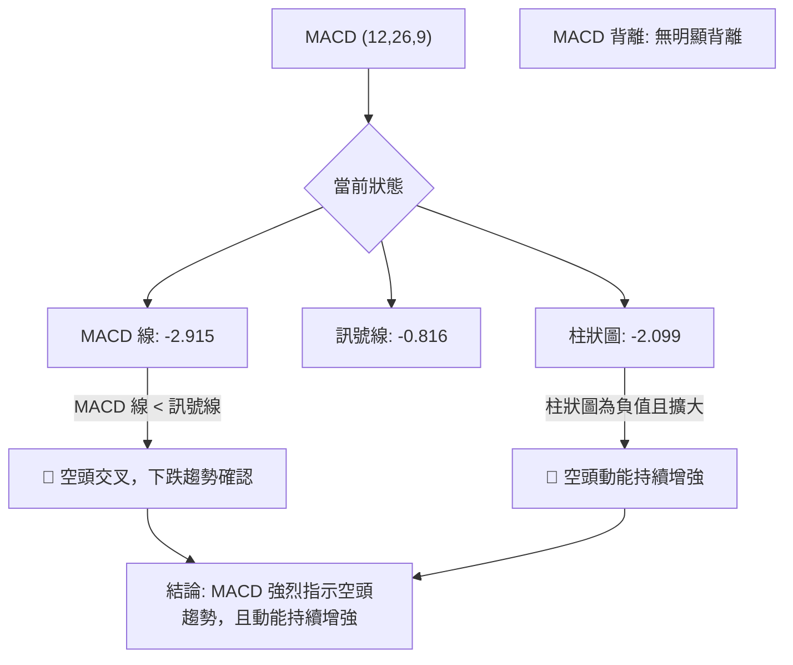
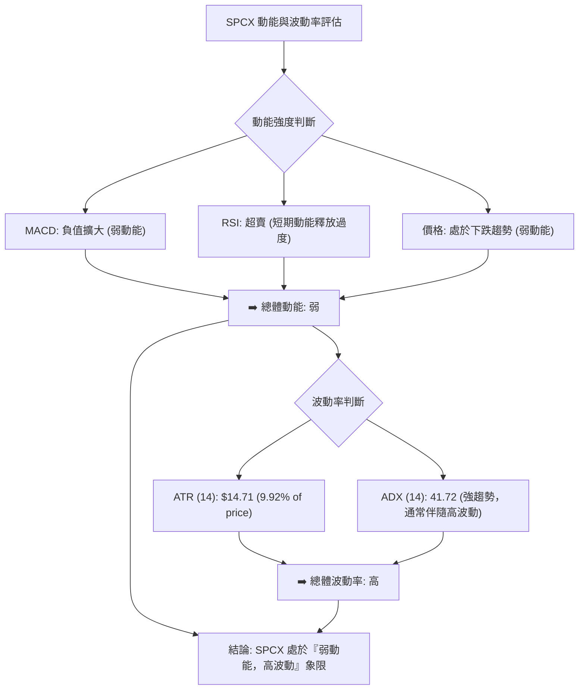
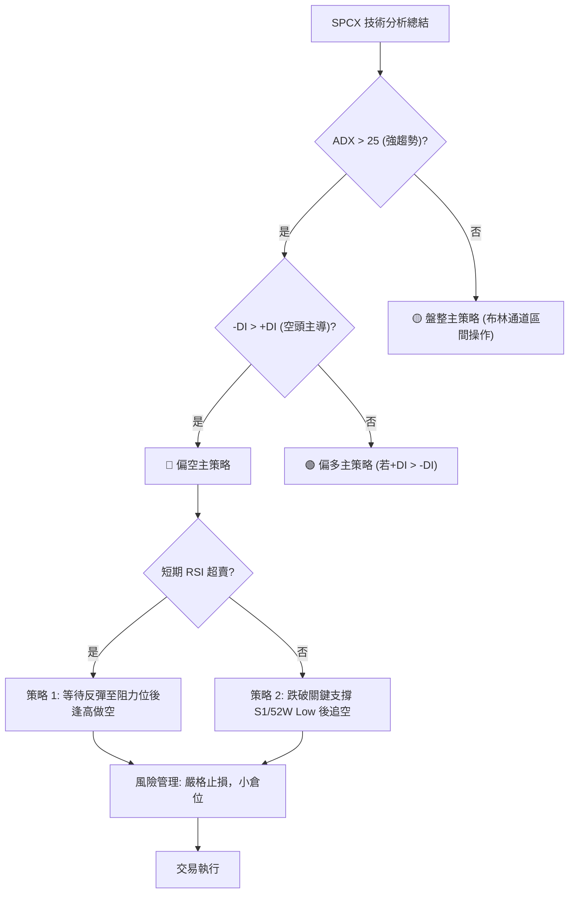
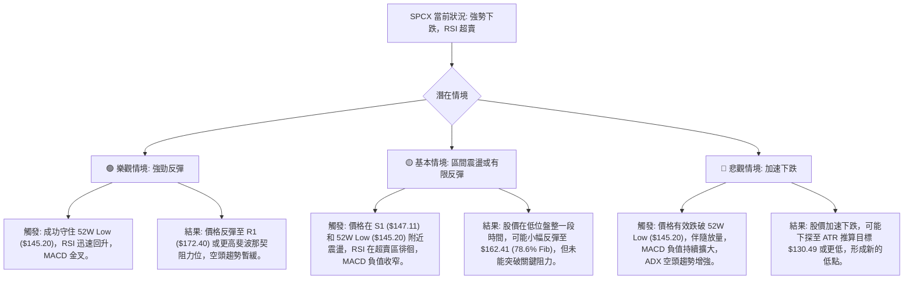

# SPCX 技術分析報告

> **報告日期**：2026-07-09 ｜ **語言**：繁體中文 ｜ **數據來源**：Yahoo Finance ｜ **當前價格**：$148.30

---

## 目錄

| 章節 | 內容 |
|------|------|
| [1. 技術面概覽](#1-技術面概覽) | 訊號儀表板、核心指標、評分卡 |
| [2. 趨勢分析](#2-趨勢分析) | 多時框趨勢、長中短期走勢 |
| [3. 圖表形態分析](#3-圖表形態分析) | 形態識別、K線組合、目標價 |
| [4. 支撐與阻力](#4-支撐與阻力) | 關鍵價位、斐波那契回調 |
| [5. 技術指標深度解讀](#5-技術指標深度解讀) | MA/RSI/MACD/布林/成交量 |
| [6. 動能與波動率](#6-動能與波動率) | 動能評估、ATR、Beta |
| [7. 多時框架總結](#7-多時框架總結) | 時框架評分矩陣 |
| [8. 交易策略建議](#8-交易策略建議) | 多空策略、風險報酬比 |
| [9. 風險提示與監控](#9-風險提示與監控) | 監控指標、風險場景 |

---

## 1. 技術面概覽

SPCX 當前價格為 $148.30，位於 52 週區間的極低端（約 3.9% 位置），顯示股價近期承受巨大賣壓。多項技術指標顯示強勁的空頭趨勢，儘管 RSI 已進入超賣區，預示著短期內存在潛在的反彈需求，但整體趨勢仍偏向下行。ADX 指標高達 41.72，確認了目前市場處於強勢的趨勢行情中，且空頭主導。

### 🎯 技術訊號儀表板


**解讀**：儀表板清晰顯示，SPCX 的主要技術訊號均指向空頭趨勢。RSI 的超賣狀況是目前唯一較為明確的多頭潛在訊號，可能觸發短期反彈。然而，ADX、MACD、短期均線以及 OBV 的表現均強烈支持當前的下跌趨勢，表明任何反彈都可能只是跌勢中的修正，而非趨勢反轉。

### 📊 核心指標速覽表

| 指標類別 | 指標名稱 | 當前數值 | 訊號 | 解讀 |
|----------|----------|----------|------|------|
| **價格** | 當前價格 | $148.30 | 🔴 | 接近 52 週低點，處於下行趨勢 |
| **均線** | MA5 | $155.55 | 🔴 | 價格位於 MA5 下方，短期偏空 |
| **均線** | MA10 | $157.35 | 🔴 | 價格位於 MA10 下方，短期偏空 |
| **均線** | MA20 | N/A | 🟡 | 數據不足，無法評估 |
| **均線** | MA50 | N/A | 🟡 | 數據不足，無法評估 |
| **均線** | MA200 | N/A | 🟡 | 數據不足，無法評估 |
| **動能** | RSI(14) | 21.52 | 🟢 | 進入超賣區，短期存在反彈潛力 |
| **動能** | MACD | -2.915 | 🔴 | MACD 線在訊號線下方，柱狀圖負值擴大，空頭動能強勁 |
| **趨勢** | ADX(14) | 41.72 | 🔴 | 強趨勢行情，空頭主導 (+DI 12.20, -DI 14.49) |
| **波動** | ATR(14) | $14.71 | 🟡 | 波動性高 (9.92% of price)，反映市場不確定性 |
| **成交量** | OBV趨勢 | OBV < MA | 🔴 | 量能疲弱，確認價格下跌趨勢 |

**解讀**：SPCX 的核心指標呈現明顯的空頭主導格局。價格低於短期均線，MACD 顯示強勁下行動能，而 ADX 則確認了當前趨勢的強度。儘管 RSI 處於超賣區，提供了一絲反彈的希望，但這在強勢空頭趨勢中可能僅是短暫現象，且需要警惕。成交量指標也未能提供止跌的訊號，反而確認了量能的疲弱。

### 🏆 技術評分卡

```
技術評分卡 — SPCX (2026-07-09)
════════════════════════════════════════════════════
趨勢強度      ████████████████░░░░  80/100  🔴 (強勢空頭趨勢)
動能指標      ████░░░░░░░░░░░░░░░░  20/100  🔴 (MACD空頭，RSI超賣但趨勢強勁)
支撐穩定度    ██████░░░░░░░░░░░░░░  30/100  🔴 (接近關鍵支撐S1與52W低點，但未確認止跌)
成交量配合    ████░░░░░░░░░░░░░░░░  20/100  🔴 (OBV疲弱，未見止跌放量)
形態完整度    ██░░░░░░░░░░░░░░░░░░  10/100  🔴 (數據不足，未見明確反轉形態)
均線排列      ████░░░░░░░░░░░░░░░░  20/100  🔴 (短期均線空頭排列，長線數據不足)
════════════════════════════════════════════════════
綜合評分      ██████░░░░░░░░░░░░░░  30/100  🔴 偏空
════════════════════════════════════════════════════
```
**解讀**：SPCX 的技術評分卡顯示整體狀況偏空。趨勢強度極高，但方向是明確的下跌。動能指標（MACD）和成交量（OBV）均確認了這一趨勢。支撐位雖然接近，但股價尚未展現出穩定的止跌訊號。形態完整度低，因為缺乏足夠的歷史 K 線數據來識別可靠的圖表形態。綜合來看，SPCX 目前處於一個強勢下行且尚未見底的階段。

---

## 2. 趨勢分析

### 🌐 多時框趨勢分析

SPCX 的多時框趨勢分析顯示，在強勁的趨勢行情下，空頭力量佔據主導。


**解讀**：從多時框角度來看，SPCX 股票處於一個強勢的下跌趨勢中。ADX 指標的強勁數值明確指出市場正處於趨勢行情而非盤整，且負向動能（-DI）明顯高於正向動能（+DI），確認了空頭的主導地位。長期走勢顯示股價從 52 週高點 $225.64 持續回落至接近 52 週低點 $145.20。中期（20週）走勢也呈現清晰的下跌通道。短期內，價格持續位於 MA5 和 MA10 等短期移動平均線下方，MACD 指標也持續發出空頭訊號。儘管 RSI 處於超賣區，這通常預示著短期內可能出現技術性反彈，但在強勁的下降趨勢中，超賣狀態可能維持較長時間，或者反彈力度有限。因此，整體趨勢判斷為偏空。

### 📈 長期趨勢 — 12個月走勢圖（Unicode）

由於提供的「24-MONTH PRICE HISTORY」僅包含 2026-06 和 2026-07 兩個月的收盤價，無法繪製完整的 12 個月走勢圖。以下將呈現可用的月度數據點，並結合 52 週高點與低點提供長期視角。

```
SPCX 月線走勢圖（過去2個月，數據限制）
價格軸 ($)
$225.64 ┤                           (52W 高點)
$220.00 ┤
$200.00 ┤
$180.00 ┤                 ● (2026-06: $170.86)
$160.00 ┤
$140.00 ┤                           ● (2026-07: $148.30)
$145.20 ┤ (52W 低點)
     └─────────────────────────────────────────────────
      ...             2026-06        2026-07 (現在)
```
**走勢特徵分析表格**：

| 時間區間 | 起始價 | 結束價 | 漲跌幅 | 走勢特徵 |
|----------|--------|--------|--------|----------|
| 2026-06 | N/A | $170.86 | N/A | 位於 52 週區間中下部 |
| 2026-07 | $170.86 | $148.30 | -13.29% | 本月大幅下跌，接近 52 週低點 |
| 52週區間 | $145.20 (低) | $225.64 (高) | N/A | 股價位於 52 週區間的 3.9% 處，顯示長期壓力巨大 |

**解讀**：從有限的月度數據和 52 週高低點來看，SPCX 在過去一個月經歷了顯著的下跌，從 $170.86 下跌至 $148.30，跌幅達 13.29%。當前價格已非常接近 52 週的最低點 $145.20，這表明股票正處於一個長期下跌趨勢的末端，面臨強大的賣壓。這種情況通常會吸引尋求底部反彈的買家，但同時也存在跌破長期支撐的風險。

### 📊 中期趨勢（週線分析）

中期趨勢主要參考近 20 週的收盤價數據，可以觀察到 SPCE 在 2026 年 6 月中旬達到一個波段高點 $185.00 後，便開始了快速且持續的下跌。

```
SPCX 近期週線壓力與支撐示意圖 (2026-06 至 2026-07)
價格軸 ($)
$185.00 ┤         ● (2026-06-21 高點，形成中期阻力)
$172.40 ┤           ─────────── R1 (關鍵阻力)
$162.00 ┤                         ● (2026-07-05 小幅反彈後受阻)
$153.23 ┤                     ●
$148.30 ┤───────────────────── 現價
$147.11 ┤           ─────────── S1 (近期關鍵支撐)
$145.20 ┤           ─────────── 52W Low (長期支撐)
     └───────────────────────────────────────────────
      2026-06-14  2026-06-21  2026-06-28  2026-07-05  2026-07-12
```
**解讀**：從週線圖來看，SPCX 在 2026 年 6 月 21 日達到 $185.00 的高點後，隨即進入下行通道。儘管在 7 月 5 日有過一次小幅反彈至 $162.00，但未能突破關鍵阻力 R1 ($172.40)，隨後繼續下跌至 $148.30。目前價格正測試近期關鍵支撐 S1 ($147.11) 和 52 週低點 ($145.20)。中期趨勢表現為一個清晰的下跌通道，每一次反彈都未能改變整體下行方向，反而在觸及阻力後再次加速下跌。量能方面，近期週成交量有所下降，但 OBV 仍顯示疲弱，未能提供止跌的有效訊號。

### ⚡ 趨勢強度評估（ADX 解讀）

ADX 指標是用來衡量趨勢強度而非方向的工具。當 ADX 值高於 25 時，通常表示存在強勢趨勢；低於 20 則表示趨勢不明顯或處於盤整。結合 +DI 和 -DI 則可判斷趨勢方向。


**ADX 強度對照表**：

| ADX 數值範圍 | 趨勢強度 | 當前 SPCX 狀況 | 訊號 |
|--------------|----------|----------------|------|
| 0-20         | 無明顯趨勢/盤整 | N/A | 🟡 |
| 20-25        | 趨勢醞釀中 | N/A | 🟡 |
| 25-50        | 強趨勢     | 41.72          | 🔴 |
| 50-75        | 非常強勢趨勢 | N/A | 🔴 |
| 75-100       | 極端強勢趨勢 | N/A | 🔴 |

**解讀**：SPCX 的 ADX(14) 值為 41.72，遠高於 25 的閾值，這明確指示當前市場處於一個強勢的趨勢行情中。進一步觀察 +DI 和 -DI，-DI 為 14.49，而 +DI 為 12.20，-DI 數值高於 +DI，這表明當前的強勢趨勢是由空頭力量主導的。換句話說，SPCX 目前正處於一個勢不可擋的強勁下跌趨勢中。在這種背景下，任何短期反彈都應被視為修正，而非趨勢逆轉的訊號。交易策略應以順應空頭趨勢為主，或者等待明確的底部形成訊號。

---

## 3. 圖表形態分析

### 🔍 形態識別系統

由於提供的數據主要是週收盤價和有限的月收盤價，缺乏詳細的每日 K 線數據，因此無法識別複雜的圖表形態（如頭肩頂/底、雙頂/底、三角形整理等）並給出高信心度的判斷。當前價格走勢更多表現為對關鍵支撐位的測試。


**解讀**：根據現有數據，我們未能識別出具有高信心度的經典圖表形態。SPCX 的價格走勢更像是在一個強勁的下跌趨勢中，持續測試下方的支撐位。近期的價格行為顯示，股價在觸及 $185.00 後迅速回落，並在 $148.30 附近，即 S1 ($147.11) 和 52 週低點 ($145.20) 附近徘徊。這種情況本身並非典型的反轉形態，但其意義在於測試市場對這些關鍵價位的接受度。

**形態信心度表格**：

| 形態 | 信心度 | 判斷依據（引用數據） | 完成度 | 目標價（附計算式） |
|------|--------|----------------------|--------|--------------------|
| **無明顯反轉形態** | 0% | 數據中未偵測到足以確認頭肩、雙底等複雜形態的 K 線組合。 | N/A | N/A |
| **潛在底部試探** | 40% | 價格 $148.30 接近 S1 ($147.11) 及 52 週低點 ($145.20)，但尚未出現止跌或反轉的 K 線訊號。 | 20% | N/A |
| **短期下跌通道** | 60% | 根據近 20 週收盤價，自 $185.00 高點後形成一系列更低的高點和更低的低點。 | 80% | N/A (趨勢延續) |

**解讀**：目前最能觀察到的形態是自 2026 年 6 月 21 日高點 $185.00 以來的「短期下跌通道」。這是一個趨勢延續形態，表明下行壓力持續。價格接近 S1 ($147.11) 和 52 週低點 ($145.20) 構成了一個潛在的底部試探區，但由於缺乏明確的K線反轉訊號（如錘子線、啟明星等），其信心度不足以構成一個可靠的交易形態。因此，當前應主要關注價格對關鍵支撐的測試結果，而非依賴未經確認的形態。

### 🕯️ 重要K線形態分析

由於提供的數據為週收盤價，而非每日 K 線數據，因此無法對單一 K 線形態進行精確分析（如錘子線、射擊之星等）。我們將基於週收盤價的變化來推斷可能的 K 線意義。

| 週別 (收盤日期) | 收盤價 | K線形態 (推斷) | 解讀 | 訊號 |
|-----------------|--------|-----------------|------|------|
| 2026-06-14      | $160.95 | 中性/小陽線     | 盤整後小幅上漲，為後續上攻積蓄動能 | 🟡 |
| 2026-06-21      | $185.00 | 大陽線/突破     | 突破性上漲，創近期新高，但隨後迅速反轉 | 🟢 |
| 2026-06-28      | $153.23 | 大陰線/長黑棒   | 突破後迅速回落，顯示上方壓力巨大，多頭承壓 | 🔴 |
| 2026-07-05      | $162.00 | 小陽線/反彈     | 在大幅下跌後的小幅反彈，量能不足，未能改變趨勢 | 🟡 |
| 2026-07-12      | $148.30 | 大陰線/長黑棒   | 反彈失敗後再次下跌，接近近期低點，空頭力量強勁 | 🔴 |

**解讀**：從近五週的收盤價推斷，SPCX 在 6 月 21 日達到 $185.00 的高點，形成一個「假突破」或「多頭陷阱」的格局，隨後一周即被大陰線吞噬，顯示強烈賣壓。7 月 5 日的小幅反彈未能持續，並在 7 月 12 日（當前日期）再次以大陰線收盤，且價格跌至 $148.30，接近 52 週低點。這組 K 線組合（大陽線後接大陰線，隨後小幅反彈再跌）強烈暗示空頭力量主導，多頭反攻無力。

### 📉 ASCII 走勢形態示意圖

以下示意圖展示了 SPCX 近期（2026 年 6 月中旬以來）的價格走勢，呈現出典型的下跌趨勢。

```
SPCX 近期下跌趨勢示意圖
價格軸 ($)
$185.00 ┤              ● (高點)
$172.40 ┤              │      R1 (阻力位)
$162.00 ┤              │  ●
$153.23 ┤              │      ●
$148.30 ┤              │          ● (現價)
$147.11 ┤              └────────── S1 (支撐位)
$145.20 ┤                         S2 (52W 低點)
     └───────────────────────────────────
      2026-06-14  2026-06-21  2026-06-28  2026-07-05  2026-07-12
```
**解讀**：此示意圖清晰地描繪了 SPCX 自 2026 年 6 月 21 日創下 $185.00 高點後，價格呈現一路走低的趨勢。每次試圖反彈都未能突破前高，並隨後創下更低的低點。當前價格 $148.30 位於近期下跌通道的底部，並正在測試關鍵支撐 S1 ($147.11) 和 52 週低點 ($145.20)。這種形態確認了中期下跌趨勢的延續性。

### 🎯 形態目標價計算

由於缺乏高信心度的反轉形態，我們無法應用形態高度推算來預測反轉目標價。當前的「短期下跌通道」形態，其目標價通常是趨勢的延續。若價格跌破關鍵支撐，則可能根據波動率進行延伸預測。

1.  **若跌破 52 週低點 ($145.20)**：
    *   由於下方無已知的歷史支撐位，我們可參考 ATR (14) 的波動幅度 ($14.71) 來推算潛在的下跌目標。
    *   **推算目標價**：$145.20 (52W Low) - $14.71 (ATR) = $130.49。
    *   **解讀**：此目標價為基於歷史波動率的延伸預測，而非基於具體形態的目標。它代表了在跌破關鍵支撐後，價格可能繼續下探的潛在範圍。

2.  **若短期反彈，突破 R1 ($172.40)**：
    *   在強勢空頭趨勢下，突破阻力並形成反轉形態的機率較低。若有反彈，目標價將是斐波那契回調位。
    *   **斐波那契回調目標**：如能突破 $162.41 (78.6% 回調)，則可能測試 $172.40 (R1) 或 $175.93 (61.8% 回調)。
    *   **解讀**：這並非由形態推算，而是基於斐波那契回調位作為反彈的潛在阻力點。

**結論**：目前市場缺乏明確的圖表形態來推算反轉目標價。當前價格行為更應關注對現有支撐與阻力的測試。如果跌破 52 週低點，則需謹慎對待，並可參考 ATR 進行下跌目標的初步預測。

---

## 4. 支撐與阻力

SPCX 的當前價格 $148.30 正處於一個關鍵的支撐區間。識別這些關鍵價位對於制定交易策略至關重要。

### 🗺️ 關鍵價位分布圖（Unicode）

```
SPCX 價位結構分布圖 (2026-07-09)
═══════════════════════════════════════════════════
$225.64 ║████████████████████████║ 52W High (強阻力 R3)
$206.66 ║████████████████████    ║ 斐波那契 23.6% (阻力 R2)
$194.91 ║████████████████████████║ 斐波那契 38.2% (阻力 R2)
$185.42 ║████████████████████    ║ 斐波那契 50.0% (阻力 R2)
$175.93 ║████████████████████████║ 斐波那契 61.8% (阻力 R1)
$172.40 ║████████████████████    ║ 關鍵阻力 R1
$162.41 ║████████████████████████║ 斐波那契 78.6% (阻力 R1)
$148.30 ╠════════════════════════╣ ◄ 現價
$147.11 ║▓▓▓▓▓▓▓▓▓▓▓▓▓▓▓▓        ║ 近期支撐 S1
$145.20 ║████████████████████████║ 52W Low (強支撐 S2)
═══════════════════════════════════════════════════
```
**解讀**：SPCX 的價格結構圖清晰顯示，當前價格 $148.30 位於多個關鍵支撐位的上方，且非常接近近期支撐 S1 ($147.11) 和 52 週低點 ($145.20)。這是一個潛在的止跌區域，但同時也是空頭可能進一步發力的關鍵點。上方的阻力位則分佈在 $162.41 (78.6% 斐波那契回調) 和 $172.40 (R1)，這些價位將是價格反彈時面臨的挑戰。

### 🚧 阻力位分析表

阻力位代表了股價上漲時可能遇到的壓力點。SPCX 的阻力主要來自近期波段高點和斐波那契回調位。

| 阻力級別 | 價位 | 形成原因 | 突破難度 | 重要性 |
|----------|------|----------|----------|--------|
| **R1 (關鍵阻力)** | $172.40 | 近一年波段高點聚類，多次上攻失敗，形成顯著賣壓區。 | 中高 | 🟢 |
| **斐波那契 78.6%** | $162.41 | 52 週下跌區間的 78.6% 回調位，反彈時的首個重要技術性阻力。 | 中 | 🟡 |
| **斐波那契 61.8%** | $175.93 | 52 週下跌區間的 61.8% 回調位，若突破 R1，則此處為更強的心理和技術阻力。 | 高 | 🟡 |
| **斐波那契 50.0%** | $185.42 | 52 週下跌區間的 50.0% 回調位，通常為趨勢反轉或深度反彈的關鍵考驗。 | 高 | 🔴 |
| **52W High (強阻力)** | $225.64 | 過去 52 週的最高點，代表了歷史上的強勁賣壓或獲利回吐點。 | 極高 | 🔴 |

**解讀**：SPCX 的阻力位分佈密集，特別是在 $162.41 到 $175.93 之間。R1 ($172.40) 是近期一個強大的阻力，而斐波那契回調位則提供了潛在的反彈目標和阻力參考。在當前的強勢下跌趨勢中，突破這些阻力位將面臨巨大挑戰，需要強大的買盤動能和利好消息的配合。

### 🛡️ 支撐位分析表

支撐位代表了股價下跌時可能遇到的買盤支撐點。SPCX 當前價格正位於關鍵支撐區域。

| 支撐級別 | 價位 | 形成原因 | 守住機率 | 重要性 |
|----------|------|----------|----------|--------|
| **S1 (近期關鍵支撐)** | $147.11 | 近一年波段低點聚類，是股價近期下跌後形成的初步支撐。 | 中 | 🟢 |
| **52W Low (強支撐 S2)** | $145.20 | 過去 52 週的最低點，具有強烈的心理和技術支撐意義。 | 中高 | 🟢 |
| **ATR 推算支撐** | $130.49 | 由 52 週低點減去 ATR(14) 幅度推算，作為跌破 S2 後的潛在下行目標。 | N/A | 🟡 |

**解讀**：SPCX 當前價格 $148.30 非常接近 S1 ($147.11) 和 52 週低點 ($145.20)。這兩個價位共同構成了一個強大的支撐區。歷史低點通常會吸引抄底買盤，並可能引發技術性反彈。然而，在強勢空頭趨勢下，一旦這些關鍵支撐被有效跌破，股價可能會加速下行，並可能朝向由 ATR 推算的 $130.49 尋找新的平衡點。因此，對這些支撐位的監控至關重要。

### 📐 斐波那契回調位分析

斐波那契回調位是基於 52 週高點 ($225.64) 和 52 週低點 ($145.20) 計算得出，用以識別潛在的支撐和阻力區域。

| 斐波那契回調比例 | 價位 ($) | 意義與解讀 |
|------------------|----------|------------|
| 0.0% (52W High)  | $225.64  | 52 週最高點，強烈阻力。 |
| 23.6%            | $206.66  | 淺層回調位，反彈的初步阻力。 |
| 38.2%            | $194.91  | 較重要的回調位，通常在趨勢反轉初期被測試。 |
| 50.0%            | $185.42  | 心理上的關鍵回調位，常作為強趨勢反彈的目標。 |
| 61.8%            | $175.93  | 黃金分割位，在趨勢反轉中具有重要意義，是強勢反彈的阻力。 |
| 78.6%            | $162.41  | 深度回調位，若能突破此處，反彈動能較強。 |
| 100.0% (52W Low) | $145.20  | 52 週最低點，強烈支撐。 |

**解讀**：SPCX 當前價格 $148.30 位於斐波那契 78.6% 回調位 ($162.41) 和 100% 回調位 ($145.20) 之間，更接近 100% 回調位（即 52 週低點）。這表明股價已經完成了非常深度的回調，幾乎回到了 52 週的起點。這是一個極度超賣且接近長期支撐的區域。如果能守住 $145.20，則可能從此處啟動技術性反彈，其潛在目標將是上方的 $162.41 (78.6%) 或 $175.93 (61.8%)。然而，如果 $145.20 被有效跌破，則意味著新的下跌空間可能被打開。

---

## 5. 技術指標深度解讀

### 🎛️ 指標訊號總覽

以下 Mermaid 圖表展示了各主要技術指標的訊號及其相互關係。


**解讀**：SPCX 的技術指標訊號分歧但整體偏空。短期移動平均線（MA5、MA10）呈現空頭排列，價格位於其下方，確認短期下行壓力。MACD 指標顯示空頭動能強勁且持續增強。ADX 指標則明確指出市場處於強勢的下跌趨勢。OBV 的疲弱進一步證實了當前價格下跌的有效性，量能未能支持價格上漲。唯一的多頭訊號來自 RSI 的超賣狀況，這可能在短期內引發技術性反彈，但其持續性在強勢空頭趨勢中存疑。

### 📈 移動平均線排列分析

由於數據中僅提供了 MA5 和 MA10，並且 MA20、MA50、MA200 均為 N/A，因此無法進行完整的均線多頭/空頭排列分析。我們將僅基於可用的短期均線數據進行評估。


**解讀**：SPCX 的當前價格 $148.30 顯著低於其短期移動平均線 MA5 ($155.55) 和 MA10 ($157.35)。這表示在極短期和短期內，賣方力量佔據主導，價格在這些均線下方運行，均線形成上方的動態阻力。MA5 和 MA10 均呈現下降趨勢，進一步確認了短期內股價的弱勢。由於缺乏更長期的均線數據（MA20, MA50, MA200），我們無法判斷中長期均線的排列情況，但僅從短期均線來看，訊號是明確的偏空。

### 📉 RSI(14) 分析

RSI (Relative Strength Index) 是衡量價格變動速度和變化的動能指標。其數值範圍在 0 到 100 之間，通常 70 以上被視為超買，30 以下被視為超賣。

-   **RSI(14) 數值進度條展示**：
    RSI(14): 21.52 (超賣) ▓▓▓▓▓▓▓▓▓▓▓▓▓▓▓▓▓▓▓▓░░░░░░░░░░░░░░░░░░░░░░░░░░░░░░░░░░░░░░░░░░░░░░░░░░ 21.52%

-   **超買超賣區間分析**：
    SPCX 的 RSI(14) 值為 21.52，明確進入了 30 以下的超賣區間。這通常被解讀為股價在短期內下跌過快，可能存在技術性反彈的需求。從歷史經驗來看，RSI 進入超賣區是買入訊號的潛在前兆。然而，在一個強勢的下跌趨勢中（如 SPCX 當前由 ADX 確認的情況），RSI 可能會在超賣區徘徊一段時間，或者反彈力度有限，隨後再次下跌。因此，單獨的 RSI 超賣訊號應結合其他指標和整體趨勢來判斷。

-   **背離判斷（頂背離/底背離）**：
    根據提供的數據「RSI 背離: 無明顯背離」，當前未觀察到 RSI 與價格之間存在頂背離或底背離現象。頂背離發生在價格創新高但 RSI 未能創新高時，預示趨勢可能反轉向下；底背離則相反。由於沒有明確背離，RSI 的超賣僅指示短期動能過度釋放，而非趨勢反轉的強烈訊號。

**解讀**：RSI 21.52 的超賣狀態是目前唯一一個較為明確的多頭潛在訊號。它表明市場可能已經累積了大量的短期賣壓，一旦賣壓減輕，可能會出現技術性反彈。然而，在 ADX 指示的強勢空頭趨勢下，這種反彈更可能被視為修正，而非趨勢逆轉。交易者應警惕超賣反彈的誘惑，並將其置於整體空頭趨勢的背景下進行評估。

### 📊 MACD(12/26/9) 訊號解讀

MACD (Moving Average Convergence Divergence) 是一個趨勢追蹤動能指標，由 MACD 線、訊號線和柱狀圖組成。


**解讀**：SPCX 的 MACD 指標發出明確的空頭訊號。MACD 線 (-2.915) 位於訊號線 (-0.816) 的下方，形成一個看跌交叉，這通常被視為賣出訊號或趨勢下跌的確認。更重要的是，MACD 柱狀圖為負值 (-2.099) 且其絕對值持續擴大（儘管數據未直接提供歷史柱狀圖，但從當前值判斷），這表明空頭動能正在增強，賣方力量持續釋放。當前數據中未顯示 MACD 存在任何頂背離或底背離。MACD 的表現與 ADX 的強勢空頭趨勢判斷相互印證，進一步確認了 SPCE 的下行壓力。

### 📦 布林通道分析

布林通道 (Bollinger Bands) 用於衡量波動率和識別超買超賣區域。它由中軌（通常是 20 週期移動平均線）、上軌（中軌加兩倍標準差）和下軌（中軌減兩倍標準差）組成。

```
SPCX 布林通道示意圖 (數據不足，僅為概念示意)
價格軸 ($)
$XXX ┤                                   BB上軌 (N/A)
     │
$XXX ┤                                   BB中軌 (N/A)
     │
$148.30 ┤─────────────────────────────── 現價
     │
$XXX ┤                                   BB下軌 (N/A)
     └───────────────────────────────
             時間軸
```
**解讀**：根據提供的數據，SPCX 的布林通道上軌、中軌 (MA20) 和下軌均為 N/A，無法進行具體分析。這表示我們無法利用布林通道來判斷當前的波動率水平、價格是否觸及極端區域或是否存在「布林帶收縮/擴張」等訊號。在缺乏此關鍵指標的情況下，我們需要更加依賴其他動能和趨勢指標來評估市場狀況。

### 💹 成交量分析（量價配合度）

成交量是價格走勢的燃料，量價配合度對於確認趨勢的有效性至關重要。

| 指標 | 當前數值 | 解讀 | 訊號 |
|------|----------|------|------|
| 最新成交量 | 60,620,600 | 相較於近期週均量，顯著降低 | 🟡 |
| 20日均量 | nan | 數據不足 | 🟡 |
| 50日均量 | nan | 數據不足 | 🟡 |
| OBV趨勢 | OBV < MA | OBV 趨勢低於其移動平均線，表明量能疲弱，未能支持當前價格。 | 🔴 |

**解讀**：SPCX 的成交量分析顯示出量能疲弱的狀況。最新的成交量為 60,620,600，相較於近期的週成交量（如 9.25 億或 5.9 億），這是一個明顯較低的水平。在價格接近支撐區時，如果出現放量下跌，則支撐可能被輕易跌破；如果出現縮量下跌，則可能預示賣壓減輕，但 OBV 指標的表現則提供了更為重要的洞察。

OBV (On-Balance Volume) 的趨勢顯示「OBV < MA」，這是一個明確的看跌訊號。OBV 是一種動能指標，將成交量與價格變化結合起來，如果 OBV 趨勢向下且低於其移動平均線，表示即使價格下跌，也沒有足夠的買盤量能來支撐，或者下跌過程中的賣壓量能佔據主導。這進一步確認了當前下跌趨勢的有效性，並且未見到止跌所需的放量買盤。因此，從量價配合度來看，當前情勢對多頭不利，量能疲弱確認了空頭趨勢。

---

## 6. 動能與波動率

### ⚡ 動能評估四象限

動能評估四象限分析將 SPCE 定位在「動能強度」與「波動率」的矩陣中，以評估其當前市場狀態。


**動能評估四象限表格**：

| 象限 | 動能 | 波動 | 當前狀態 (SPCX) | 評估 |
|------|------|------|-----------------|------|
| Q1   | 強   | 低   | -               | 最佳機會 (強勢上漲，風險可控) |
| Q2   | 弱   | 低   | -               | 謹慎觀望 (盤整，等待方向) |
| Q3   | 強   | 高   | -               | 高風險高收益 (強勢上漲/下跌，波動劇烈) |
| Q4   | 弱   | 高   | ✅              | 避免進場/高風險空頭機會 (下跌趨勢，波動劇烈，不確定性高) |

**解讀**：SPCX 目前處於「弱動能，高波動」的第四象限。這表示股票處於一個強勢的下跌趨勢中（弱動能，因為趨勢向下），且價格波動劇烈（高波動，由 ATR 和 ADX 確認）。在這種情境下，市場充滿不確定性，價格可能在短期內大幅波動。對於多頭而言，這是極具風險的進場時機，因為即使有反彈，也可能迅速被下跌趨勢吞噬。對於空頭而言，這提供了潛在的高風險高收益機會，但需要極其精準的時機把握和嚴格的風險控制。總體而言，當前情勢建議謹慎觀望或考慮逢高做空，避免盲目抄底。

### 📊 ATR 波動率分析

ATR (Average True Range) 是衡量一段時間內資產價格波動幅度的指標。ATR 數值越高，表示波動性越大；反之則波動性越小。

-   **ATR(14) 數值**：$14.71
-   **佔股價比例**：9.92% ( $14.71 / $148.30 )

**解讀**：SPCX 的 ATR(14) 為 $14.71，佔當前股價 $148.30 的約 9.92%。這個比例相對較高，表明 SPCX 每日的波動幅度較大。高波動性意味著價格在短時間內可能出現劇烈變動，這既增加了潛在的獲利空間，也顯著提高了交易風險。在強勢下跌趨勢中，高 ATR 可能意味著下跌速度快，或反彈幅度也可能較大，但缺乏持續性。

**止損距離建議**：
在高波動性環境下，傳統的固定百分比止損可能過於狹窄，容易被市場「洗出」。建議使用 ATR 作為止損距離的參考，例如設定止損為當前價格±1.5倍至 2倍的 ATR。
-   **若為多頭策略**：止損點可設定在進場價下方 1.5 * $14.71 = $22.07 至 2 * $14.71 = $29.42 的範圍。
-   **若為空頭策略**：止損點可設定在進場價上方 1.5 * $14.71 = $22.07 至 2 * $14.71 = $29.42 的範圍。
鑑於當前股價接近 $148.30，且 ATR 佔比近 10%，這要求交易者必須預留足夠的止損空間，並根據自身的風險承受能力調整倉位大小，以應對潛在的劇烈波動。

### 📐 Beta 與市場相關性

-   **Beta 數值**：N/A

**解讀**：提供的數據中 Beta 值為 N/A，因此無法評估 SPCX 與大盤指數（如 S&P 500 或 Nasdaq）的相關性以及其系統性風險。Beta 值通常用來衡量股票相對於整體市場的波動程度。如果 Beta > 1，表示股票波動性大於市場；如果 Beta < 1，則波動性小於市場。在缺乏 Beta 數據的情況下，我們無法判斷 SPCX 是防禦性股票還是進攻性股票，也無法評估其在大盤牛市或熊市中的預期表現。這增加了對其風險評估的難度，投資者應更加關注其內在的基本面和技術面特徵。

---

## 7. 多時框架總結

SPCX 的多時框架分析顯示，當前市場受到強勁的空頭趨勢主導，儘管短期內存在超賣反彈的潛力，但整體方向仍偏向下行。

### 📋 時框架評分表

| 時框架 | 趨勢方向 | 動能 | 均線排列 | 形態 | 綜合評分 | 建議 |
|--------|----------|------|----------|------|----------|------|
| **短期 (日線)** | 🔴 下跌 | 🔴 強空頭 (MACD) / 🟢 超賣 (RSI) | 🔴 空頭 (MA5/MA10) | 🔴 下跌通道 | 3/10 | 警惕反彈，但趨勢偏空 |
| **中期 (週線)** | 🔴 強下跌 (ADX) | 🔴 空頭動能持續 | 🟡 數據不足 (MA20/50) | 🔴 下跌通道 | 2/10 | 趨勢強勁，順勢而為 |
| **長期 (月線)** | 🔴 顯著下行 | 🔴 賣壓巨大 | 🟡 數據不足 (MA200) | 🔴 接近 52W 低點 | 2/10 | 位於底部區間，但未見反轉 |

**解讀**：從時框架評分表可以看出，SPCX 在短期、中期和長期均呈現出強烈的下跌趨勢。短期內，RSI 的超賣狀況是唯一的潛在多頭訊號，可能引發技術性反彈。然而，MACD 的強勁空頭動能和短期均線的空頭排列壓制了這種反彈的持續性。中期趨勢由 ADX 確認為強勢空頭趨勢，且價格處於明顯的下跌通道中。長期來看，股價已接近 52 週低點，顯示長期賣壓巨大，尚未見到築底成功的跡象。

### 🔲 綜合訊號矩陣

| 指標/時框架 | 短期 (日線) | 中期 (週線) | 長期 (月線) | 訊號一致性 |
|-------------|-------------|-------------|-------------|------------|
| **趨勢方向** | 🔴 下行       | 🔴 強下行     | 🔴 下行       | 高度一致 (空頭) |
| **動能**    | 🔴 空頭動能強 / 🟢 RSI超賣 | 🔴 空頭動能持續 | 🔴 賣壓巨大 | 偏空，短期有反彈 |
| **均線排列** | 🔴 空頭排列 (MA5/MA10) | 🟡 數據不足  | 🟡 數據不足  | 短期空頭，中長期待確認 |
| **支撐阻力** | 🟢 接近關鍵支撐 S1 | 🟢 接近 52W 低點 | 🟢 接近 52W 低點 | 價格位於強支撐區間 |
| **成交量**  | 🔴 OBV疲弱    | 🔴 OBV疲弱    | 🔴 量能疲弱   | 高度一致 (疲弱) |

**解讀**：綜合訊號矩陣顯示，SPCX 在各時框架下，趨勢方向、動能和成交量方面呈現高度一致的空頭訊號。ADX 指標確認了強勢空頭趨勢，MACD 顯示空頭動能持續增強，OBV 則確認了下跌過程中的量能疲弱。儘管價格已跌至關鍵支撐 S1 和 52 週低點附近，且 RSI 顯示超賣，這為短期反彈提供了潛力，但整體市場結構仍然偏空。這種情況下，任何反彈都應被視為在主要下跌趨勢中的技術性調整，而非趨勢反轉的開始。

### ⚖️ 多時框收斂結論

根據嚴格要求 14，當 ADX(14) 值為 41.72 (大於 25) 時，判斷當前為**強勢趨勢行情**。且由於 -DI (14.49) 高於 +DI (12.20)，此趨勢明確為**空頭主導**。因此，中長期（週線/MA50、MA200，儘管數據不足但 ADX 指向趨勢）方向為主，日線只用來尋找進場時機。

**最終結論**：SPCX 目前處於一個**強勢偏空**的市場環境。儘管短期 RSI 顯示股價已進入超賣區，且價格接近近期關鍵支撐 S1 ($147.11) 和 52 週低點 ($145.20)，這可能引發技術性反彈，但這類反彈在當前強勁的空頭趨勢中，預計將是短暫且有限的。MACD、短期均線以及 OBV 均確認了空頭力量的強大和持續性。因此，總體交易策略應以順應空頭趨勢為主，將任何反彈視為逢高做空的機會，或等待明確的底部反轉訊號出現。

---

## 8. 交易策略建議

### 🗺️ 策略決策流程圖



### 🧭 策略路由

**當前主策略方向 = 🔴 偏空（依評分 30/100）**

基於第 1 章技術評分卡綜合評分偏空（30/100），以及多時框架總結中 ADX 指示的強勢空頭趨勢，SPCX 的主策略應為**空頭策略**。儘管 RSI 顯示超賣，但這在強勢空頭市場中通常僅導致短暫反彈。因此，我們將建議以逢高做空或跌破支撐追空為主。

### 🎯 價格情境階梯（Price Scenarios）

以當前價格 $148.30 為基準，建立向上與向下的情境劇本：

| 觸發條件 | 下一目標 | 後續延伸 | 情境含義 |
|----------|----------|----------|----------|
| **突破 R1 $172.40** | 斐波那契 61.8% $175.93 | 斐波那契 50.0% $185.42 | 短線轉強，但仍處於中期下跌趨勢中的反彈。需放量確認。 |
| **站穩現價區間** | — | — | 價格在 $147.11 (S1) 至 $162.41 (78.6% Fib) 之間震盪，等待方向。 |
| **跌破 S1 $147.11** | 52W Low $145.20 | ATR 推算目標 $130.49 | 中期轉弱，可能加速下行，下方無明確支撐，風險極高。 |

### 📊 情境機率分佈

| 情境 | 機率 | 主要依據 |
|------|------|----------|
| **繼續上行 / 反彈** | 25% | RSI 處於超賣區 (21.52)，價格接近關鍵支撐 S1 ($147.11) 和 52W Low ($145.20)，可能觸發技術性反彈。 |
| **區間震盪** | 20% | 在關鍵支撐區間 ($145.20 - $147.11) 附近進行盤整，等待市場選擇方向。ADX 雖高但若動能釋放完畢可能進入短期盤整。 |
| **回落 / 再探底** | 55% | ADX 顯示強勢空頭趨勢 (41.72)，MACD 負值擴大，OBV 疲弱。整體技術面偏空，跌破支撐的可能性較高。 |

**解讀**：當前 SPCE 最大的可能性是繼續下跌或在底部區間震盪後再探底。儘管 RSI 超賣可能觸發反彈，但其持續性存疑。因此，我們將主推空頭策略。

### 🟢 主策略詳情（方向依上方路由）

**主策略方向：🔴 偏空**

| 策略要素 | 策略 A: 逢高做空 (反彈後) | 策略 B: 跌破支撐追空 |
|----------|--------------------------|----------------------|
| 進場條件 | 價格反彈至斐波那契 78.6% 回調位附近，且出現止漲 K 線訊號。 | 價格有效跌破 52W Low ($145.20)，並確認。 |
| 進場價格 | $162.41 (斐波那契 78.6% 回調位) | $144.50 (略低於 52W Low $145.20，確認跌破) |
| 目標價 T1 | $147.11 (S1) | $130.49 (由 52W Low - ATR 推算) |
| 目標價 T2 | $145.20 (52W Low) | $120.00 (無數據，僅為動態調整參考) |
| 止損價格 | $175.93 (斐波那契 61.8% 回調位上方) | $147.50 (略高於 S1 $147.11) |
| 風險報酬比 | 1.13:1 (以 T1 計算) | 4.67:1 (以 T1 計算) |
| 成功機率 | 40% (反彈幅度難預測) | 60% (順應強勢空頭趨勢) |
| 建議倉位 | 小倉位 (5-10%) | 中等倉位 (10-15%) |

**策略 A 解讀**：此策略利用 RSI 超賣可能引發的短期反彈。在強勢下跌趨勢中，逢高做空是較為穩健的策略。進場點設定在 $162.41，這是 52 週跌幅的 78.6% 回調位，具有一定的技術阻力。止損設在 $175.93，即 61.8% 回調位上方，以避免被假突破洗出。目標價則設定為下方的關鍵支撐位 $147.11 和 52 週低點 $145.20。風險報酬比相對較低，表明需要嚴格的風險控制。

**策略 B 解讀**：此策略順應當前強勁的空頭趨勢。一旦價格有效跌破 52 週低點 $145.20，這將是一個強烈的看跌訊號，可能觸發加速下跌。進場點設定在 $144.50，以確認突破。止損設在 S1 ($147.11) 上方，以防止假跌破。第一個目標價 $130.49 是由 52 週低點減去 ATR(14) 推算而來，作為下方無明確支撐時的潛在下跌目標。此策略風險報酬比相對較高，但仍需警惕市場波動。

### 🔴 反向風險觸發點（對沖提示）

以下情況可能推翻當前的偏空主策略，並需要重新評估：

1.  **價格站穩並突破 R1 ($172.40)**：若價格能夠在放量的情況下有效突破並站穩 $172.40，且 MACD 轉為正值或 RSI 脫離超賣區並持續上行，則可能預示短期趨勢逆轉。
2.  **RSI 持續反彈並突破 50**：若 RSI 從超賣區反彈並突破 50 中軸，且 MACD 形成金叉，可能表示買盤力量正在積聚。
3.  **出現明確的底部反轉 K 線形態**：在 $145.20 附近出現如錘子線、啟明星等強勢反轉 K 線組合，並伴隨放量，可能預示底部形成。
4.  **ADX 的 -DI 大幅回落**：若 -DI 迅速下降，同時 +DI 上升，可能表明空頭趨勢正在減弱。

### ⭐ 整體訊號強度評星

```
做多訊號強度：★☆☆☆☆  (1/5星) (僅RSI超賣，但趨勢強勁)
做空訊號強度：★★★★☆  (4/5星) (ADX、MACD、OBV、均線均偏空)
整體可信度：  ★★★☆☆  (3/5星) (數據限制，但現有指標指引明確)
```
**解讀**：SPCX 目前的整體訊號強度明確偏向空頭。做多訊號微弱，主要依賴於 RSI 的超賣狀況，但在強勢空頭趨勢中，這通常不足以支撐持續性的反彈。做空訊號則非常強勁，由多個關鍵指標相互印證。儘管部分數據（如長期均線、布林通道）缺失，但現有指標的指引性強，使得整體可信度達到中等偏上水平。

---

## 9. 風險提示與監控

### ✅ 關鍵監控指標 Checklist

對於 SPCX 這樣處於強勢下跌趨勢的股票，持續監控關鍵指標至關重要。

```
╔══════════════════════════════════════════════════════════════╗
║              SPCX 關鍵監控指標 Checklist                       ║
╠══════════════════════════════════════════════════════════════╣
║ [ ] 價格對 S1 ($147.11) 和 52W Low ($145.20) 的測試結果         ║
║ [ ] 若跌破 S1/52W Low，是否伴隨放量？                           ║
║ [ ] RSI 是否從超賣區反彈，並突破 30/50 中軸？                 ║
║ [ ] MACD 線是否上穿訊號線，柱狀圖是否轉正？                    ║
║ [ ] ADX 的 -DI 是否大幅下降，+DI 是否上升？                      ║
║ [ ] OBV 是否出現止跌回升，量價背離是否修正？                   ║
║ [ ] 是否出現明確的底部反轉 K 線形態 (如錘子線、啟明星)？       ║
║ [ ] 是否有任何利好/利空消息面變化？                            ║
╚══════════════════════════════════════════════════════════════╝
```

### ⚠️ 風險場景分析


**解讀**：目前 SPCX 的技術面顯示，悲觀情境發生的機率較高，而樂觀情境則需要非常強勁的買盤動能和趨勢逆轉訊號。基本情境則是在關鍵支撐處的盤整，為市場方向的選擇積蓄力量。交易者應為最壞的情況做好準備，並密切關注價格對關鍵支撐位的反應。

### 🛡️ 風險管理重要提醒

1.  **嚴格止損**：在強勢下跌且波動性高的市場中，止損是保護資本的生命線。務必設定並嚴格執行止損點，特別是對於逢高做空或追空策略。建議止損距離參考 ATR (14) 的 $14.71。
2.  **倉位控制**：鑑於 SPCX 的高波動性和強勢下跌趨勢，建議採取較小的倉位，避免重倉。對於高風險的交易策略，倉位應進一步縮小。
3.  **分批進場/出場**：無論是做多還是做空，都應考慮分批進場以平滑成本，分批出場以鎖定利潤並降低風險。
4.  **耐心等待確認訊號**：在目前的市場環境下，避免盲目抄底或追漲殺跌。等待明確的技術訊號（如反轉形態、趨勢確認）出現後再行動，可以顯著提高交易成功率。
5.  **關注基本面**：雖然本報告為技術分析，但在強勢下跌趨勢中，基本面的任何負面消息都可能加劇跌勢。同時，若有重大利好消息，也可能引發趨勢反轉。
6.  **避免逆勢操作**：儘管 RSI 超賣可能誘發多頭，但在強勢空頭趨勢下，逆勢操作風險極高。若進行反彈做多，必須設定極其嚴格的止損。

---

## 📋 報告總結

```
SPCX 技術分析報告總結
════════════════════════════════════════════════════════
報告日期：2026-07-09
當前價格：$148.30
分析評級：⚖️ 偏空，但短期超賣存在反彈潛力。整體趨勢強勁下跌。

關鍵結論：
├─ 長期趨勢：🔴 顯著下行，接近 52 週低點 $145.20。
├─ 中期趨勢：🔴 強勢空頭趨勢 (ADX=41.72)，價格處於下跌通道。
├─ 短期趨勢：🔴 價格位於 MA5/MA10 下方，MACD 空頭動能強勁；🟢 RSI 21.52 超賣。
├─ 關鍵支撐：$147.11 (S1) 和 $145.20 (52W Low)。
├─ 關鍵阻力：$162.41 (78.6% 斐波那契回調) 和 $172.40 (R1)。
└─ 分析師目標：$205.00 (與技術面嚴重背離，需謹慎對待)。

最優策略組合：
1. 🥇 **最佳機會 (空頭)**：等待價格反彈至斐波那契 78.6% 回調位 ($162.41) 附近後逢高做空，止損設於 $175.93，目標 $147.11/$145.20。
2. 🥈 **次選機會 (空頭)**：若價格有效跌破 52W Low ($145.20)，於 $144.50 追空，止損設於 $147.50，目標 $130.49。
3. 🥉 **保守選擇 (觀望)**：在 $147.11 至 $145.20 關鍵支撐區間觀察，等待明確止跌訊號或趨勢確認，避免盲目操作。
════════════════════════════════════════════════════════
```

---

> ⚠️ **免責聲明**：本報告為 AI 自動生成之技術分析，所有數據及估算均基於提供的歷史價格資訊。本報告**僅供研究與學術參考**，**不構成任何投資建議**。投資有風險，入市需謹慎。

---

*報告生成時間：2026-07-09 ｜ 數據來源：Yahoo Finance ｜ 分析框架：多時框技術分析*