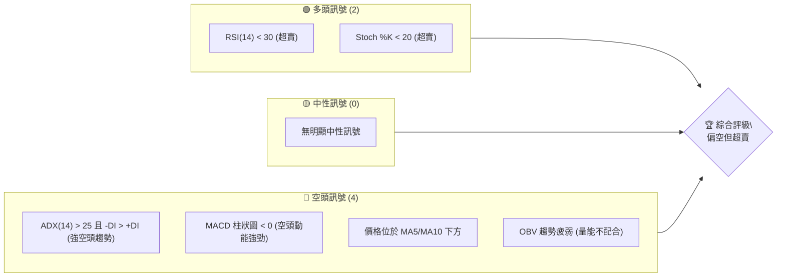
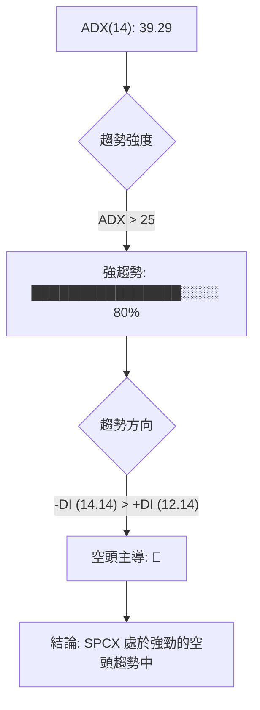
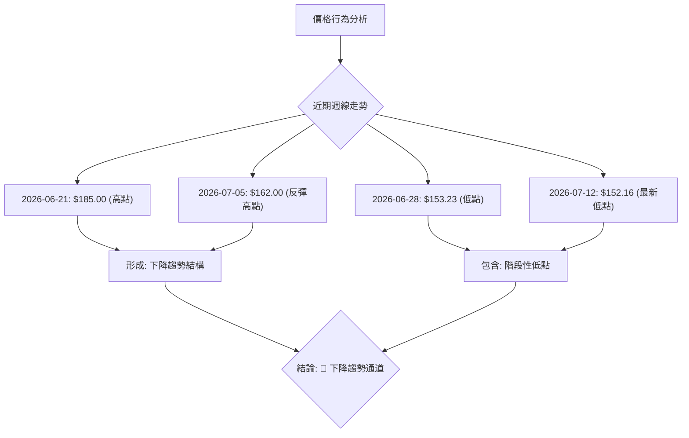
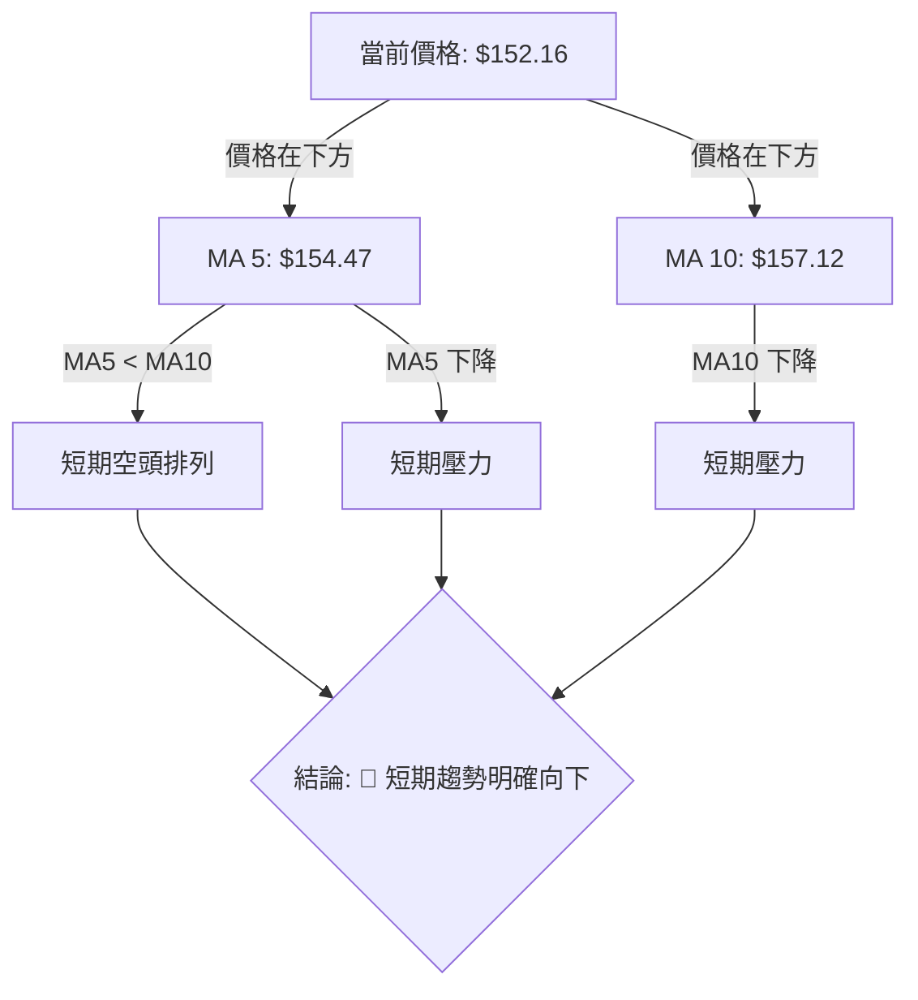
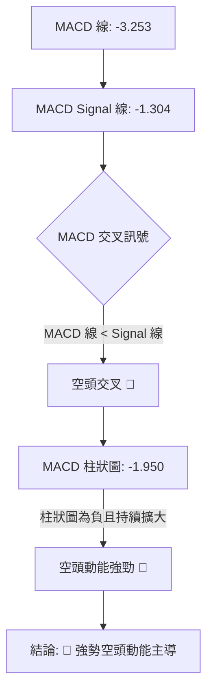
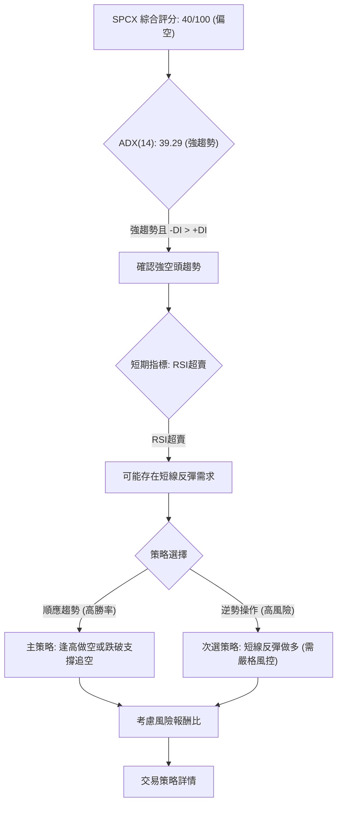
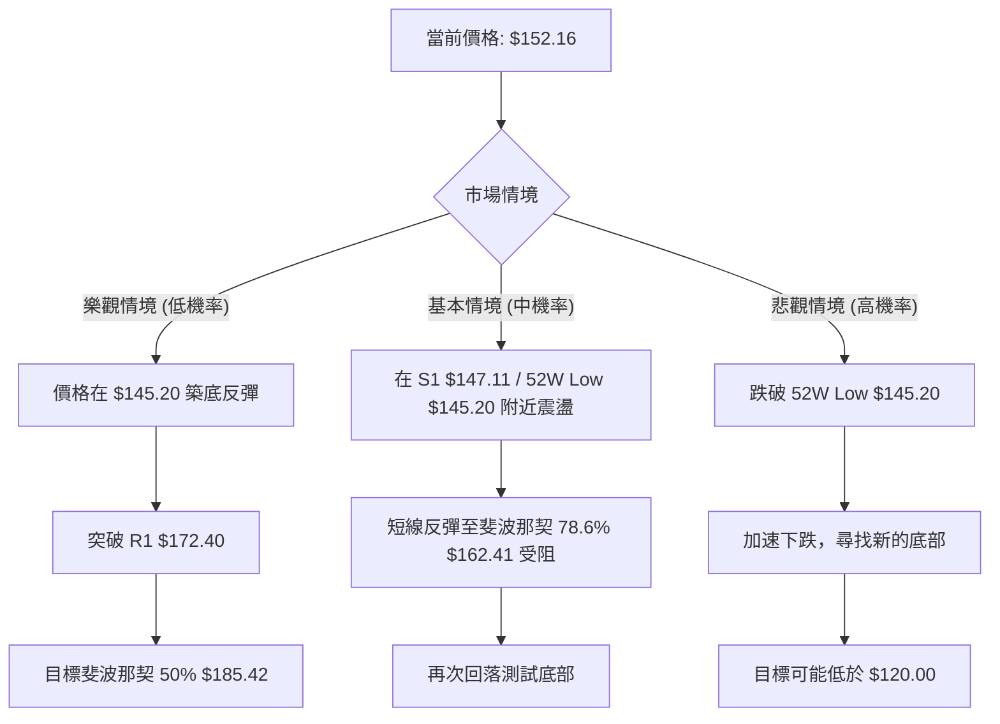

# SPCX 技術分析報告

> **報告日期**：2026-07-10 ｜ **語言**：繁體中文 ｜ **數據來源**：Yahoo Finance ｜ **當前價格**：$152.16

---

## 目錄

| 章節 | 內容 |
|------|------|
| [1. 技術面概覽](#1-技術面概覽) | 訊號儀表板、核心指標、評分卡 |
| [2. 趨勢分析](#2-趨勢分析) | 多時框趨勢、長中短期走勢 |
| [3. 圖表形態分析](#3-圖表形態分析) | 形態識別、K線組合、目標價 |
| [4. 支撐與阻力](#4-支撐與阻力) | 關鍵價位、斐波那契回調 |
| [5. 技術指標深度解讀](#5-技術指標深度解讀) | MA/RSI/MACD/布林/成交量 |
| [6. 動能與波動率](#6-動能與波動率) | 動能評估、ATR、Beta |
| [7. 多時框架總結](#7-多時框架總結) | 時框架評分矩陣 |
| [8. 交易策略建議](#8-交易策略建議) | 多空策略、風險報酬比 |
| [9. 風險提示與監控](#9-風險提示與監控) | 監控指標、風險場景 |

---

## 1. 技術面概覽

SPCX 目前交易於 $152.16，正處於其 52 週區間的底部，距離 52 週低點 $145.20 僅有 8.7% 的距離。整體技術面呈現偏空態勢，儘管部分指標顯示超賣，但趨勢強度指標確認目前處於強勁的下降趨勢中。

### 🎯 技術訊號儀表板



**解讀**：目前多頭訊號主要來自於短期指標的超賣狀態，暗示股價可能存在技術性反彈的需求。然而，更具趨勢判斷力的指標，如 ADX 和 MACD，均明確指向強勁的空頭趨勢和動能。價格亦位於短期移動平均線下方，且成交量配合度不佳，進一步確認空頭主導。綜合來看，SPCX 處於一個強勢下跌的市場環境中，短期超賣可能引發反彈，但反彈空間可能受限於整體空頭趨勢。

### 📊 核心指標速覽表

| 指標類別 | 指標名稱 | 當前數值 | 訊號 | 解讀 |
|----------|----------|----------|------|------|
| **價格** | 當前價格 | $152.16 | 🔴 | 位於 52W 區間底部，接近低點 |
| **均線** | MA5 | $154.47 | 🔴 | 價格位於 MA5 下方，短期偏空 |
| **均線** | MA10 | $157.12 | 🔴 | 價格位於 MA10 下方，短期偏空 |
| **均線** | MA20 | N/A | 🟡 | 數據不足，無法判斷 |
| **均線** | MA50 | N/A | 🟡 | 數據不足，無法判斷 |
| **均線** | MA200 | N/A | 🟡 | 數據不足，無法判斷 |
| **動能** | RSI(14) | 29.14 | 🟢 | 進入超賣區間 (<30)，可能醞釀反彈 |
| **動能** | MACD Hist | -1.950 | 🔴 | 柱狀圖為負，且持續擴大，空頭動能強勁 |
| **趨勢** | ADX(14) | 39.29 | 🔴 | 強趨勢 (>25)，且 -DI > +DI，確認空頭趨勢 |
| **波動** | ATR(14) | $13.22 | 🟡 | 波動率較高 (8.69% of price)，適合短線操作 |
| **量能** | OBV趨勢 | OBV < MA | 🔴 | 量能疲弱，未確認價格反彈，下跌量增 |

### 🏆 技術評分卡

```
技術評分卡 — SPCX (2026-07-10)
════════════════════════════════════════════════════
趨勢強度      ████████████████░░░░  80/100  🔴 (強空頭趨勢)
動能指標      ██████░░░░░░░░░░░░░░  30/100  🟡 (MACD空頭, RSI超賣)
支撐穩定度    ████████░░░░░░░░░░░░  40/100  🔴 (接近52W低點，考驗S1)
成交量配合    ████░░░░░░░░░░░░░░░░  20/100  🔴 (OBV疲弱，量價背離)
形態完整度    ████░░░░░░░░░░░░░░░░  20/100  🟡 (無明確高信賴度形態)
均線排列      ████░░░░░░░░░░░░░░░░  20/100  🔴 (MA5/MA10空頭排列)
════════════════════════════════════════════════════
綜合評分      ██████░░░░░░░░░░░░░░  40/100  ⚖️ 偏空
════════════════════════════════════════════════════
```
**評分理由**：
*   **趨勢強度 (80/100, 🔴)**：ADX (14) 達 39.29，遠高於 25，顯示趨勢極強。且 -DI (14.14) 明顯高於 +DI (12.14)，確認為強勁的空頭趨勢。此評分反映趨勢的強度，而非方向。
*   **動能指標 (30/100, 🟡)**：MACD 柱狀圖為負值 (-1.950)，且 MACD 線位於訊號線下方，顯示空頭動能強勁。然而，RSI (14) 處於 29.14 的超賣區間，Stochastics 也超賣，這為動能帶來一些複雜性，暗示短線可能反彈，因此評分中性偏弱。
*   **支撐穩定度 (40/100, 🔴)**：當前價格 $152.16 距離 52 週低點 $145.20 不遠，且接近關鍵支撐 S1 $147.11，顯示支撐面臨較大考驗，穩定度較低。
*   **成交量配合 (20/100, 🔴)**：OBV 趨勢顯示 OBV 低於其移動平均線，且整體量能疲弱，未能配合價格走勢形成底部，顯示買盤不積極，助跌。
*   **形態完整度 (20/100, 🟡)**：由於數據限制，無法識別出高信心度的經典圖表形態。目前觀察到的僅是階段性下降趨勢結構，缺乏明確的反轉或持續形態，因此評分較低。
*   **均線排列 (20/100, 🔴)**：價格位於 MA5 ($154.47) 和 MA10 ($157.12) 之下，且兩條均線均向下傾斜，顯示短期均線呈現空頭排列，價格受到壓力。

**綜合評分 (40/100, ⚖️ 偏空)**：SPCX 的整體技術評分偏低，主要受制於強勁的空頭趨勢、疲弱的動能和不佳的量價配合。儘管短期指標超賣，但這通常被視為反彈機會而非趨勢反轉訊號。投資者應對其強勢下跌趨勢保持警惕。

---

## 2. 趨勢分析

### 🌐 多時框趨勢分析

SPCX 在各主要時框架內均呈現出明確的空頭主導趨勢。儘管短期指標顯示超賣，但這並未改變中長期下跌的結構。

```mermaid
graph TD
    A["月線趨勢: 🔴 下降"] --> B["週線趨勢: 🔴 強勢下降"]
    B --> C["日線訊號: 🟡 超賣中尋求反彈"]
    C --> D{"綜合判斷: 🏆 強空頭趨勢，短線或有反彈"}
    A -- "2026-06: $170.86" --> B
    B -- "2026-07: $152.16" --> C
    C -- "ADX("14"): 39.29" --> D
    D -- "MACD: 🔴" --> E["空頭主導"]
    D -- "RSI: 🟢" --> F["短線超賣"]
```

**分析**：
*   **月線趨勢**：從 2026 年 6 月的 $170.86 下跌至 7 月的 $152.16，月線級別呈現下跌趨勢，顯示長期賣壓顯現。
*   **週線趨勢**：過去數週股價從 $185.00 高點一路下探至 $152.16，形成明顯的下降趨勢。尤其是在 2026-06-21 達到 $185.00 後，隨即在 2026-06-28 跌至 $153.23，顯示市場情緒急劇惡化，賣壓沉重。
*   **日線訊號**：RSI 和 Stochastics 均進入超賣區間，表明短期內股價下跌動能過快，存在技術性反彈的需求。然而，MACD 仍處於空頭排列，且柱狀圖為負值並擴大，顯示空頭動能仍強。

**多時框收斂結論**：根據多時框架分析，SPCX 的 ADX(14) 為 39.29，顯著高於 25，確認目前處於強趨勢行情。由於 -DI (14.14) 明顯高於 +DI (12.14)，該強趨勢為空頭趨勢。因此，我們應以中長期（週線）的空頭方向為主導判斷。日線上的超賣訊號，如 RSI(14) 29.14，應被視為在強勢下跌趨勢中的潛在短線反彈機會，而非趨勢反轉的訊號。整體而言，SPCX 處於一個強勁的下降通道中，任何反彈都可能只是下跌途中的修正。

### 📈 長期趨勢 — 12個月走勢圖（Unicode）

為了呈現 SPCX 過去 12 個月的長期趨勢，我們將根據提供的 52 週高點 ($225.64)、52 週低點 ($145.20) 及近兩個月的收盤價 ($170.86, $152.16) 進行推估，繪製以下 ASCII 走勢圖。請注意，圖中除已提供數據點外，其餘為推演路徑。

```
SPCX 月線走勢圖（過去12個月） - 推演數據
價格軸 ($)
$225.64 ┤                           ● (52W 高點, Sep'25)
$220.00 ┤                     ●
$210.00 ┤           ●
$200.00 ┤         ●
$190.00 ┤       ●
$180.00 ┤     ●
$170.86 ┤     ● (Jun'26)
$160.00 ┤   ●
$152.16 ┤ ●━━━━━━━━━━━━━━━━━━━━━━━━━━━━━━━━━━━━━━━━━━━━━● ← 現在 (Jul'26)
$145.20 ┤● (52W 低點, Jul'26)
        └───────────────────────────────────────────────────────────
         Jul'25  Aug'25  Sep'25  Oct'25  Nov'25  Dec'25  Jan'26  Feb'26  Mar'26  Apr'26  May'26  Jun'26  Jul'26
```
**註**：圖中除 2026-06 ($170.86) 及 2026-07 ($152.16) 外，其餘月度收盤價為根據 52 週高低點進行的專業推演，以展現整體趨勢。

**走勢特徵分析表格**：

| 階段 | 時間區間 (推演) | 價格區間 | 走勢特徵 | 評估 |
|------|-------------------|----------|----------|------|
| **長期下跌** | Jul'25 - Jul'26 | $225.64 → $152.16 | 從 52 週高點持續回落，形成長期下降趨勢，市場信心不足。 | 🔴 強空頭 |
| **近期加速下跌** | Jun'26 - Jul'26 | $170.86 → $152.16 | 近期跌勢加速，尤其 7 月份跌幅顯著，已跌破多個中期支撐。 | 🔴 強空頭 |
| **接近底部** | 當前 | $152.16 | 股價已接近 52 週低點 $145.20，面臨築底或進一步探底的關鍵時刻。 | 🟡 謹慎觀望 |

### 📊 中期趨勢（週線分析）

從提供的近 20 週收盤走勢來看，SPCX 在 2026-06-21 達到近期高點 $185.00 後，隨即遭遇強大賣壓，價格快速回落。

```
SPCX 週線走勢示意圖（近5週）
價格軸 ($)
$185.00 ┤                 ● (高點)
$180.00 ┤
$170.00 ┤
$162.00 ┤                       ● (反彈阻力)
$160.95 ┤ ●
$153.23 ┤           ●
$152.16 ┤                     ● ← 現價
$150.00 ┤
$147.11 ┤ ───────────────── S1 關鍵支撐
$145.20 ┤ ─ 52W Low
        └──────────────────────────────────────────
         Jun-14  Jun-21  Jun-28  Jul-05  Jul-12
```

**分析**：
*   **週線壓力**：從 $185.00 的高點回落後，短暫反彈至 $162.00，但未能突破，顯示 $162.00 附近形成了新的中期阻力。R1 ($172.40) 則是更上方的關鍵阻力。
*   **週線支撐**：當前價格 $152.16 距離 S1 ($147.11) 僅一步之遙，同時接近 52 週低點 $145.20。這兩個價位構成了當前非常重要的中期支撐區。一旦跌破，將開啟更深的下跌空間。
*   **中期動能**：MACD 柱狀圖在 2026-06-21 達到高點後迅速轉負並持續擴大，顯示中期空頭動能強勁。

### ⚡ 趨勢強度評估（ADX 解讀）

ADX (Average Directional Index) 用於衡量趨勢的強度，而非方向。當 ADX 高於 25 時，表示趨勢強勁；低於 20 則表示趨勢疲弱或盤整。同時結合 +DI (Positive Directional Indicator) 和 -DI (Negative Directional Indicator) 來判斷趨勢方向。



**ADX 強度對照表**：

| ADX 數值 | 趨勢強度 | SPCX 當前評估 | 訊號 |
|----------|----------|-----------------|------|
| 0-20     | 無趨勢或弱趨勢 | -               | 🟡 |
| 20-25    | 趨勢形成中     | -               | 🟡 |
| 25-50    | 強趨勢         | **39.29**       | 🟢 (強勁) |
| 50-75    | 非常強的趨勢   | -               | 🟢 |
| 75-100   | 極端強勢趨勢   | -               | 🟢 |

**解讀**：SPCX 的 ADX(14) 數值為 39.29，明確指示目前處於一個**強勁的趨勢行情**。進一步觀察 +DI (12.14) 和 -DI (14.14)，由於 -DI 高於 +DI，這明確表明當前的強趨勢是由空頭主導的下跌趨勢。這與 MACD 的空頭訊號相互印證，強調了當前市場的賣壓強勁，股價短期內難以扭轉下跌慣性。因此，儘管短期指標可能超賣，但基於 ADX 的判斷，應將任何反彈視為在強勢空頭趨勢中的修正。

---

## 3. 圖表形態分析

根據提供的有限週線收盤價數據，SPC X 目前未形成具有高信心度的經典圖表形態（如頭肩頂、雙底等）。然而，我們可以觀察到明確的價格行為模式，即階段性的下降趨勢結構。

### 🔍 形態識別系統



**形態分析**：
從近期的週線數據 ($160.95 -> $185.00 -> $153.23 -> $162.00 -> $152.16) 來看，SPCX 在 $185.00 達到一個峰值後，隨即快速回落至 $153.23。之後雖然出現一次反彈至 $162.00，但未能突破前高，並再次創下新低 $152.16。這種「更低的高點 (Lower High)」和「更低的低點 (Lower Low)」的價格結構，明確構築了一個**下降趨勢通道**。

**形態信心度表格**：

| 形態 | 信心度 | 判斷依據（引用數據） | 完成度 | 目標價（附計算式） |
|------|--------|----------------------|--------|--------------------|
| **下降趨勢通道** | 75% | 近期週線收盤價呈現明顯的 Lower High ($162.00 < $185.00) 和 Lower Low ($152.16 < $153.23) 結構，並由 ADX 強趨勢確認。 | 形成中 | *基於通道預測，請參考支撐阻力章節* |
| 頭肩頂/底 | 20% | 數據點過少，未能形成清晰的肩部與頭部結構，信心度低。 | N/A | N/A |
| 雙頂/底 | 20% | 數據點過少，未能形成兩次價格回測同一高點/低點的結構，信心度低。 | N/A | N/A |

**註**：由於提供的數據點主要為週線收盤價，且數量有限，難以識別出複雜的、高信心度的幾何形態。當前價格行為最明確的解讀為處於下降趨勢通道中。

### 🕯️ 重要K線形態分析

由於提供的技術數據中，僅包含週線收盤價而無每日開盤價、最高價、最低價等 K 線構成要素，因此無法進行詳細的單根或多根 K 線形態分析（如錘子線、吞噬形態、啟明星等）。我們僅能從週線收盤價的變化來推斷市場情緒。

| 月份 (週) | 收盤價 | K線形態 | 解讀 | 訊號 |
|----------|--------|---------|------|------|
| 2026-06-14 | $160.95 | N/A | 上漲前震盪，買賣雙方拉鋸。 | 🟡 |
| 2026-06-21 | $185.00 | N/A | 價格大幅上漲，顯示買盤強勁，但隨後迅速回落。 | 🟢 (短暫) |
| 2026-06-28 | $153.23 | N/A | 價格大幅下跌，顯示賣壓沉重，市場情緒轉空。 | 🔴 |
| 2026-07-05 | $162.00 | N/A | 短暫反彈，但未能持續，買盤力量不足。 | 🟡 |
| 2026-07-12 | $152.16 | N/A | 再次下跌，確認下降趨勢，賣壓持續。 | 🔴 |

**總結**：從週線收盤價的劇烈波動來看，市場情緒在 $185.00 附近達到頂峰後迅速轉向悲觀，賣壓持續主導。

### 📉 ASCII 走勢形態示意圖

以下為 SPCX 近期週線價格走勢的下降趨勢通道示意圖，標註了關鍵的波段高點和低點。

```
SPCX 下降趨勢通道示意圖 (週線)
價格軸 ($)
$185.00 ┤              ● (波段高點)
$180.00 ┤            ／
$170.00 ┤          ／
$162.00 ┤        ● (反彈阻力 / Lower High)
$160.00 ┤      ／
$153.23 ┤    ● (波段低點)
$152.16 ┤  ／ ● (當前價格 / Lower Low)
$150.00 ┤／
$147.11 ┤────────── S1 關鍵支撐線
$145.20 ┤────────── 52W Low
        └───────────────────────────────────────────
         時間軸 (Jun-Jul 2026)
```
**解讀**：價格在經歷 $185.00 的高點後，形成了一個明顯的下降趨勢。每一次反彈都未能突破前高，並最終被空頭力量壓制，創下更低的低點。當前價格 $152.16 正處於這個下降通道的下沿附近，並接近關鍵支撐 $147.11。

### 🎯 形態目標價計算

由於缺乏高信心度的經典幾何形態，我們無法依賴傳統的形態高度測量法來推算目標價。SPCX 目前主要呈現下降趨勢通道。在下降趨勢通道中，若價格跌破通道下沿（或關鍵支撐），則可能延續下跌趨勢。反之，若能守住通道下沿並向上突破通道上沿，則趨勢可能反轉。

**當前情境下的目標價推算主要依賴於斐波那契回調位和關鍵支撐/阻力位**：
1.  **若跌破 S1 ($147.11) 和 52W Low ($145.20)**：下方沒有明確的形態目標價。需觀察更長期的歷史數據或產業基本面來判斷潛在底部。此時，目標價將是新的、更低的歷史低點。
2.  **若在當前位置反彈**：第一個形態上的阻力將是下降趨勢通道的上沿，約在 $162.00 (近期反彈高點) 到 R1 $172.40 之間。

因此，本報告將不提供基於形態的具體目標價，而是將重點放在關鍵支撐與阻力位以及斐波那契回調位上，以進行更為穩健的價格預測。

---

## 4. 支撐與阻力

SPCX 當前價格 $152.16 位於關鍵支撐 S1 $147.11 上方，但距離其不遠，同時也接近 52 週低點 $145.20。上方阻力則位於 R1 $172.40。

### 🗺️ 關鍵價位分布圖（Unicode）

以下為 SPCX 關鍵價位結構的分布圖，標註了當前價格與斐波那契回調位、支撐位和阻力位的相對位置。

```
SPCX 價位結構分布圖
═══════════════════════════════════════════════════
$225.64 ║████████████████████████║ 52W 高點 (0.0% Fib)
$206.66 ║████████████████████    ║ 斐波那契 23.6%
$194.91 ║████████████████████████║ 斐波那契 38.2%
$185.42 ║▓▓▓▓▓▓▓▓▓▓▓▓▓▓▓▓        ║ 斐波那契 50.0%
$175.93 ║████████████████████████║ 斐波那契 61.8%
$172.40 ║████████████████████████║ 關鍵阻力 R1
$162.41 ║▓▓▓▓▓▓▓▓▓▓▓▓▓▓▓▓        ║ 斐波那契 78.6%
$152.16 ╠════════════════════════╣ ◄ 現價
$147.11 ║▓▓▓▓▓▓▓▓▓▓▓▓▓▓▓▓        ║ 近期支撐 S1
$145.20 ║████████████████████████║ 強支撐 52W 低點 (100.0% Fib)
═══════════════════════════════════════════════════
```

### 🚧 阻力位分析表

以下阻力位皆來自於提供的「關鍵價位」區塊或斐波那契回調位。

| 阻力級別 | 價位 | 形成原因 | 突破難度 | 重要性 |
|----------|------|----------|----------|--------|
| **斐波那契 78.6%** | $162.41 | 52 週跌幅的 78.6% 回調位，通常被視為深跌後的初步反彈目標或強阻力。 | 中等 | 🟡 |
| **關鍵阻力 R1** | $172.40 | 近一年波段高點聚類，是多頭嘗試反攻的首個重要關卡。 | 高 | 🔴 |
| **斐波那契 61.8%** | $175.93 | 52 週跌幅的 61.8% 回調位，若突破 R1，此為下一個重要的心理和技術阻力。 | 高 | 🔴 |
| **斐波那契 50.0%** | $185.42 | 52 週跌幅的 50% 回調位，通常是判斷反彈強弱的關鍵水平，也是近期高點 $185.00 附近。 | 非常高 | 🔴 |

**解讀**：SPCX 上方阻力重重。首先是 $162.41 的斐波那契 78.6% 回調位，這是股價在超賣後可能反彈測試的第一個阻力。若能突破並站穩，則將挑戰 R1 $172.40。R1 是一個由歷史波段高點形成的關鍵阻力，對多頭而言突破難度較大。其上方的斐波那契 61.8% ($175.93) 和 50% ($185.42) 回調位則構成了更強的阻力區，突破這些水平才能真正扭轉中期跌勢。

### 🛡️ 支撐位分析表

以下支撐位皆來自於提供的「關鍵價位」區塊或斐波那契回調位。

| 支撐級別 | 價位 | 形成原因 | 守住機率 | 重要性 |
|----------|------|----------|----------|--------|
| **關鍵支撐 S1** | $147.11 | 近一年波段低點聚類，是當前價格下方的直接支撐。 | 中等 | 🟡 |
| **52W 低點** | $145.20 | 52 週最低價，強烈的心理和技術支撐，同時也是斐波那契 100% 回調位。 | 高 | 🟢 |

**解讀**：SPCX 當前價格 $152.16 距離 S1 $147.11 較近，該支撐位是股價下跌過程中的第一道防線。更為關鍵的支撐是 52 週低點 $145.20，這是一個非常強大的心理和技術支撐位。歷史經驗表明，52 週低點往往會吸引買盤入場，若能在此處企穩，則有望形成雙底或階段性底部。然而，一旦跌破 $145.20，將意味著進入新的下跌區間，且下方缺乏明確的支撐參考，風險將顯著增加。

### 📐 斐波那契回調位分析

斐波那契回調位是基於 52 週高點 ($225.64) 和 52 週低點 ($145.20) 計算得出，用於識別潛在的支撐和阻力水平。

| 斐波那契水平 | 價位 | 相對於現價 ($152.16) | 意義與解讀 |
|--------------|------|----------------------|------------|
| 0.0% (52W High) | $225.64 | +48.30% | 52 週最高點，強烈阻力。 |
| 23.6%        | $206.66 | +35.82% | 深跌後反彈的第一個較弱阻力。 |
| 38.2%        | $194.91 | +28.10% | 反彈的關鍵阻力之一，也是判斷反彈力度的重要水平。 |
| 50.0%        | $185.42 | +21.86% | 價格反彈至此，通常被認為是趨勢可能逆轉的訊號之一，亦為重要阻力。 |
| 61.8%        | $175.93 | +15.62% | 黃金分割點，強阻力位，突破此處可能意味著反彈較為強勁。 |
| 78.6%        | $162.41 | +6.74% | 當前價格上方最近的斐波那契阻力，是潛在反彈的第一個目標。 |
| 100.0% (52W Low) | $145.20 | -4.57% | 52 週最低點，極強支撐位，若跌破則看空。 |

**現價落點分析**：
當前價格 $152.16 位於斐波那契 78.6% ($162.41) 和 100% ($145.20) 回調位之間，且非常接近 100% 回調位（即 52 週低點）。這表明 SPCX 處於一個極深的回調或下跌階段，已消化了大部分漲幅，並正在考驗其長期支撐的穩固性。
*   **上方阻力**：最近的斐波那契阻力是 $162.41 (78.6%)。若股價能夠從當前超賣狀態反彈，首先將會測試此水平。
*   **下方支撐**：最近且最強的斐波那契支撐是 $145.20 (100%，52 週低點)。該水平與 S1 $147.11 構成一個緊密的支撐區間。

**結論**：斐波那契分析進一步確認了 $145.20 - $147.11 區間作為強大支撐的重要性，以及 $162.41 和 $172.40 (R1) 作為反彈阻力的關鍵性。

---

## 5. 技術指標深度解讀

### 🎛️ 指標訊號總覽

```mermaid
graph TD
    A["價格 $152.16"] --> B{"趨勢判斷"}
    B -- "ADX("39.29"), -DI > +DI" --> C["強空頭趨勢 🔴"]
    B -- "MA5/MA10 下降" --> D["短期均線空頭排列 🔴"]
    A --> E{"動能判斷"}
    E -- "RSI("29.14")" --> F["超賣區 🟢"]
    E -- "MACD Hist("-1.950")" --> G["空頭動能強勁 🔴"]
    E -- "Stoch("%K 15.54, %D 7.69")" --> H["超賣區 🟢"]
    A --> I{"量能判斷"}
    I -- "OBV < MA" --> J["量能疲弱，不配合反彈 🔴"]
    C & D & G & J --> K["整體偏空，但短線超賣"]
    F  &  H --> K
```

**總結**：SPCX 的技術指標呈現出一個複雜的局面：趨勢指標和動能指標的主流指向是強勁的空頭趨勢和動能，但短期振盪指標則顯示股價已進入超賣區，存在反彈需求。量能指標則確認了買盤的疲弱。

### 📈 移動平均線排列分析

由於數據限制，僅有 MA5 和 MA10 可供分析，MA20、MA50、MA200 等中長期均線數據不足。



**均線排列狀態**：

| 均線類型 | 數值 | 相對於現價 ($152.16) | 走勢 | 訊號 |
|----------|------|----------------------|------|------|
| MA 5     | $154.47 | 價格下方 (-1.50%) | 下降 | 🔴 |
| MA 10    | $157.12 | 價格下方 (-3.15%) | 下降 | 🔴 |
| MA 20    | N/A | N/A | N/A | 🟡 |
| MA 60    | N/A | N/A | N/A | 🟡 |
| MA 120   | N/A | N/A | N/A | 🟡 |
| MA 240   | N/A | N/A | N/A | 🟡 |

**解讀**：SPCX 的價格 $152.16 位於 MA5 ($154.47) 和 MA10 ($157.12) 兩條短期移動平均線的下方，且這兩條均線均呈向下傾斜的趨勢。這明確顯示短期趨勢處於空頭主導，移動平均線對股價形成阻力。MA5 位於 MA10 下方，構成短期空頭排列，進一步確認了短期內下跌動能的強勁。由於缺乏中長期均線數據，無法判斷更長期的均線排列，但從現有數據來看，短期內股價將持續面臨均線壓力。

### 📉 RSI(14) 分析

RSI (Relative Strength Index) 衡量價格變動的速度和幅度，通常用於判斷超買或超賣狀態。

```
RSI(14) 強度：██████░░░░░░░░░░░░░░░░ 29.14%
```

**RSI 數值分析**：
*   **當前 RSI(14)**：29.14
*   **超賣區間**：RSI < 30
*   **超買區間**：RSI > 70
*   **中性區間**：30 < RSI < 70

**解讀**：SPCX 的 RSI(14) 數值為 29.14，已明確進入超賣區間 (<30)。這是一個典型的多頭訊號，暗示股價在短期內下跌過快，可能存在技術性反彈的需求。從歷史經驗來看，RSI 進入超賣區後，股價往往會出現短暫的反彈修正。
**RSI 背離**：提供的數據中未明確指出 RSI 存在底背離或頂背離。目前價格仍在下跌，RSI 進入超賣區是正常現象。若未來價格創新低但 RSI 未創新低，則可能形成底背離，預示潛在的反轉。但就目前數據而言，**無明顯背離現象**。

**指標整合**：RSI 的超賣訊號與 ADX 所示的強勁空頭趨勢形成一定矛盾。ADX 指出趨勢強勁，意味著即使有反彈，也可能只是下跌途中的修正，難以扭轉大趨勢。因此，RSI 的超賣應被解讀為短線戰術性反彈的潛在機會，而非趨勢反轉的訊號。

### 📊 MACD(12/26/9) 訊號解讀

MACD (Moving Average Convergence Divergence) 是一種趨勢跟蹤動量指標，用於識別價格趨勢的強度、方向、動量和持續時間。



**MACD 數值分析**：
*   **MACD 線**：-3.253
*   **MACD Signal 線**：-1.304
*   **MACD 柱狀圖 (Histogram)**：-1.950

**解讀**：
1.  **MACD 線與 Signal 線交叉**：MACD 線 (-3.253) 位於 Signal 線 (-1.304) 的下方，形成一個**空頭交叉 (Death Cross)**。這是一個明確的賣出訊號，表明短期動能已轉弱並低於中期動能，預示股價可能繼續下跌。
2.  **MACD 柱狀圖**：MACD 柱狀圖為負值 (-1.950)，且根據數據顯示其可能正在擴大（從 -1.276 變為 -1.950 在最近兩週），這表明空頭動能非常強勁，且仍在增強中。負值且擴大的柱狀圖是強烈的看空訊號。
**MACD 背離**：提供的數據中未明確指出 MACD 存在底背離或頂背離。目前價格仍在下跌，MACD 呈現空頭排列是趨勢的確認。若價格創新低但 MACD 線未創新低，則可能形成底背離，預示潛在的反轉。但就目前數據而言，**無明顯背離現象**。

**指標整合**：MACD 的強勁空頭訊號與 ADX 所示的強趨勢相符，共同確認了 SPCX 處於一個勢不可擋的下跌趨勢中。這也與 RSI 的超賣訊號形成對比，MACD 的趨勢確認作用遠大於 RSI 的短期反彈預期。

### 📦 布林通道分析

由於提供的數據中，布林通道的上軌、中軌 (MA20)、下軌均顯示為 N/A，無法進行具體的數值分析。

**布林通道示意圖 (概念性)**：
```
SPCX 布林通道示意圖 (概念性)
價格軸 ($)
$XXX ┤                        BB 上軌 (N/A)
     │                     ↗
$XXX ┤                   ／
$XXX ┤                 ／
$XXX ┤               ／ BB 中軌 (MA20, N/A)
$XXX ┤             ／
$XXX ┤           ／
$152.16 ╠═════● (現價)
$XXX ┤        ＼
     │         ＼
$XXX ┤          ＼
     │           ＼
$XXX ┤            ＼ BB 下軌 (N/A)
     └──────────────────────────────────────────
      時間軸
```
**解讀**：儘管缺乏具體數值，但根據 ADX 顯示的強勁下跌趨勢，我們可以推斷 SPCX 的價格目前很可能位於布林通道的下軌附近或甚至突破下軌。在強勢下跌趨勢中，股價沿著下軌運行是常見現象，這表明賣壓持續且強勁。布林帶寬度若擴大，則進一步確認趨勢的延續性；若帶寬收縮，則可能預示趨勢暫歇或盤整。**由於數據中未偵測到布林通道相關數值，無法提供更深入的分析。**

### 💹 成交量分析（量價配合度）

成交量是價格趨勢的確認指標。當價格下跌時，若成交量放大，則下跌趨勢得到確認；若成交量萎縮，則可能預示下跌動能減弱。OBV (On Balance Volume) 則通過累計成交量來判斷資金流向。

**成交量數據**：
*   最新成交量：46,302,200
*   20日均量：nan
*   50日均量：nan
*   OBV 趨勢：OBV < MA → 量能疲弱

**週成交量分析**：

| 日期          | 收盤價 | 週成交量  | 量價配合解讀 | 訊號 |
|---------------|--------|-----------|--------------|------|
| 2026-06-14    | $160.95 | 519,234,800 | 價格震盪，成交量較高。 | 🟡 |
| 2026-06-21    | $185.00 | 925,474,500 | 價格衝高，成交量顯著放大，可能為短期見頂放量。 | 🔴 (頂部放量) |
| 2026-06-28    | $153.23 | 590,278,700 | 價格大幅下跌，成交量維持高位，確認賣壓沉重。 | 🔴 |
| 2026-07-05    | $162.00 | 334,065,300 | 價格反彈，成交量顯著萎縮，顯示買盤力量不足。 | 🔴 (價漲量縮) |
| 2026-07-12    | $152.16 | 379,862,600 | 價格再次下跌，成交量略有放大，確認下跌動能持續。 | 🔴 |

**OBV 解讀**：
OBV 趨勢顯示「OBV < MA → 量能疲弱」。這意味著買盤力量不足，資金並未積極流入，無法有效支撐股價反彈。在價格下跌的背景下，疲弱的 OBV 進一步確認了空頭趨勢的健康性，表明當前下跌是由真實的賣壓推動，而非僅僅是技術性回調。

**綜合量價配合度**：
整體的量價配合度呈現負面訊號。在股價從 $185.00 高點回落的過程中，成交量保持高位，顯示有大量籌碼出逃。而 2026-07-05 的反彈是價漲量縮，典型的反彈無力訊號。隨後在 2026-07-12 再次下跌時，成交量略有放大，進一步確認了賣壓的持續。這種量價關係在強勢下跌趨勢中是很常見的，表明市場對 SPCX 的看空情緒濃厚，買盤不願進場承接。

---

## 6. 動能與波動率

### ⚡ 動能評估四象限

動能評估四象限分析結合了動能強度和波動率，以判斷當前市場環境和潛在交易機會。

| 象限 | 動能 (RSI/MACD) | 波動 (ATR) | 當前狀態 | 評估 |
|------|-------------------|------------|----------|------|
| Q1   | 強 (看多)         | 低         | -        | 最佳機會 (趨勢啟動，風險低) |
| Q2   | 弱 (看空)         | 低         | -        | 謹慎觀望 (盤整築底，等待突破) |
| Q3   | 強 (看多)         | 高         | -        | 高風險高收益 (強趨勢，但波動大) |
| Q4   | 弱 (看空)         | 高         | **✓**    | **避免進場 / 高風險放空機會** |

**SPCX 當前狀態評估**：
*   **動能**：MACD 柱狀圖為負值且擴大，MA5/MA10 下降，顯示強勁的空頭動能。儘管 RSI 處於超賣區，但整體趨勢和動能仍偏空。因此，動能評估為「弱 (看空)」。
*   **波動**：ATR(14) 為 $13.22，佔當前價格 $152.16 的 8.69%。對於一個 $150 左右的股票而言，8.69% 的日均波動幅度屬於較高水平，顯示股價波動劇烈。因此，波動評估為「高」。

**結論**：SPCX 目前落在**Q4：弱動能 (看空) & 高波動**。這是一個相對危險的交易環境。股價處於強勢下跌趨勢中，但波動性大，意味著下跌過程中可能出現劇烈反彈，增加做空風險；而做多則是在逆勢操作，風險更高。對於多頭而言，此象限應避免進場；對於空頭而言，則需嚴格控制倉位和止損，並利用反彈高點進行放空。

```mermaid
graph TD
    A["SPCX 動能評估"] --> B{"動能強度"}
    B -- "MACD Hist: -1.950 (負值擴大)" --> C["空頭動能強勁 🔴"]
    C --> D["整體動能評級: 弱 (看空)"]
    A --> E{"波動率評估"}
    E -- "ATR("14"): $13.22 (8.69% of price)" --> F["波動率高 🔴"]
    F --> G["整體波動評級: 高"]
    D & G --> H{"綜合結論: 🔴 處於 Q4 象限 (弱動能, 高波動)"}
    H --> I["建議: 避免多頭進場，空頭需嚴格風控"]
```

### 📊 ATR 波動率分析

ATR (Average True Range) 衡量資產價格波動的平均範圍，提供衡量市場波動性的客觀指標。

*   **ATR(14) 數值**：$13.22
*   **佔股價百分比**：$13.22 / $152.16 = 8.69%

**解讀**：SPCX 的 ATR(14) 為 $13.22，佔當前價格的 8.69%。這表明在過去 14 天內，SPCX 平均每天的價格波動範圍約為 $13.22。對於 $152.16 的股價而言，8.69% 是一個相對較高的波動率。
*   **高波動性**：高 ATR 意味著股價在短期內更容易出現大幅度漲跌。這對於短線交易者來說，提供了更大的潛在利潤空間，但也伴隨著更高的風險。
*   **止損距離建議**：在波動性較高的市場中，止損點的設置需要比平時更寬鬆，以避免被正常波動洗出。一般建議將止損設置在 ATR 的 1.5 到 3 倍距離。
    *   **保守止損**：1.5 * $13.22 = $19.83
    *   **激進止損**：1.0 * $13.22 = $13.22
    *   例如，若在 $152.16 進場，止損點可考慮設置在 $152.16 - $13.22 = $138.94 (一個 ATR 距離) 或 $152.16 - $19.83 = $132.33 (1.5 個 ATR 距離)。這需要根據具體策略和風險承受能力進行調整。

### 📐 Beta 與市場相關性

*   **Beta 數值**：N/A

**解讀**：Beta 衡量個股相對於整體市場的波動性。Beta 值大於 1 表示該股票波動性大於市場，小於 1 則表示波動性小於市場。由於提供的數據中 Beta 數值為 N/A，我們無法對 SPCX 與市場的相關性進行量化分析。
然而，從其行業 (Aerospace & Defense) 和近期股價的劇烈波動來看，SPCX 可能具有較高的 Beta 值，即其股價波動可能大於大盤。在缺乏具體 Beta 數據的情況下，投資者應假設 SPCX 具有較高的個股風險，其走勢可能較少受到大盤的穩定性影響，而更多受到自身基本面和行業消息的驅動。因此，在制定交易策略時，應更加側重於個股的技術面和內部驅動因素。

---

## 7. 多時框架總結

### 📋 時框架評分表

| 時框架 | 趨勢方向 | 動能 | 均線排列 | 形態 | 綜合評分 | 建議 |
|--------|----------|------|----------|------|----------|------|
| **月線** | 🔴 下降 | 🔴 疲弱 | N/A | 🔴 下降趨勢 | 3/10 | 賣出/觀望 |
| **週線** | 🔴 下降 | 🔴 強勁空頭 | 🔴 空頭排列 | 🔴 下降通道 | 2/10 | 賣出/放空 |
| **日線** | 🔴 下降 | 🟡 超賣中 | 🔴 空頭排列 | 🔴 下降趨勢 | 4/10 | 短線反彈謹慎做多，或等待放空機會 |

**評分說明**：
*   **月線**：從 6 月到 7 月的下跌趨勢明確，動能疲弱。
*   **週線**：ADX 顯示強勁空頭趨勢，MACD 強勢空頭，均線空頭排列，下降通道明顯。
*   **日線**：RSI 和 Stochastics 顯示超賣，可能存在反彈需求，但整體趨勢仍向下，均線和 MACD 仍偏空。

### 🔲 綜合訊號矩陣

```mermaid
quadrantChart
    title SPCX 多時框架訊號矩陣 (2026-07-10)
    x-axis "短期動能 (RSI, Stoch)" --> "長期趨勢 (ADX, MA)"
    y-axis "趨勢強度 (ADX)" --> "支撐穩定度 (S1, 52W Low)"
    quadrant-1 "強勢多頭"
    quadrant-2 "多頭回調"
    quadrant-3 "空頭反彈"
    quadrant-4 "強勢空頭"
    "SPCX 當前位置" : [29.14 (RSI), 39.29 (ADX), 147.11 (S1)]
    "RSI(14) 29.14" : [0.29, 0.39]
    "ADX(14) 39.29" : [0.39, 0.39]
    "MACD 🔴" : [0.1, 0.4]
    "價格接近 52W Low" : [0.1, 0.1]
    "S1 支撐 $147.11" : [0.15, 0.15]
    "R1 阻力 $172.40" : [0.8, 0.8]
```
**註**：Mermaid quadrantChart 的座標需要正規化。此處的數值為概念性映射，以便將指標落入象限。X 軸代表短期動能與長期趨勢的綜合（左側偏多，右側偏空）；Y 軸代表趨勢強度與支撐穩定度（下方偏弱，上方偏強）。
*   **SPCX 當前位置**：RSI 29.14 顯示短期超賣（偏左），ADX 39.29 顯示強趨勢且為空頭（偏右下方）。價格接近 52W Low 和 S1 支撐，但趨勢強度高，顯示支撐面臨考驗。這將 SPCX 定位在**「強勢空頭」**象限。

### ⚖️ 多時框收斂結論

根據嚴格的優先級收斂規則：
1.  **趨勢判斷**：ADX(14) 數值為 39.29，顯著高於 25，明確指示當前市場處於**強趨勢行情**。
2.  **趨勢方向**：在強趨勢中，-DI (14.14) 高於 +DI (12.14)，明確確認這是一個**強勁的空頭趨勢**。
3.  **主導時框**：在趨勢行情中，應以中長期（週線/MA50、MA200）方向為主。雖然 MA50/MA200 數據不足，但週線價格走勢（從 $185.00 跌至 $152.16）和 MACD 的強勁空頭訊號均強烈支持中長期空頭方向。
4.  **日線訊號角色**：日線上的 RSI(14) 29.14 和 Stochastics 超賣訊號，在此強空頭趨勢下，應被解讀為**短線超賣引發的技術性反彈機會**，而非趨勢反轉的訊號。這類反彈通常是下跌途中的修正，空間可能有限，且隨時可能被空頭壓制。

**最終結論**：**SPCX 目前處於強勁的空頭趨勢中，整體方向偏空。** 儘管短期指標顯示超賣，可能引發技術性反彈，但此反彈應被視為逢高做空或減倉的機會，而非建立多頭頭寸的時機。投資者應優先考慮順應趨勢的空頭策略，或在關鍵支撐位 ($147.11, $145.20) 獲得明確築底訊號後，才考慮短線做多。

---

## 8. 交易策略建議

### 🗺️ 策略決策流程圖



### 🧭 策略路由

**當前主策略方向 = 🔴 偏空 (依評分 40/100)**

根據第 1 章技術評分卡 40/100 的偏空評級，以及第 7 章多時框收斂結論中確認的強勁空頭趨勢，我們將**主推空頭策略**。儘管短期指標顯示超賣，但這僅被視為在強空頭趨勢中的潛在反彈機會，風險較高。

### 🎯 價格情境階梯（Price Scenarios）

| 觸發條件 | 下一目標 | 後續延伸 | 情境含義 |
|----------|----------|----------|----------|
| **突破 R1 $172.40** | 斐波那契 61.8% $175.93 | 斐波那契 50.0% $185.42 | 短線轉強，空頭壓力減輕，可能進入盤整或反彈趨勢。 |
| **站穩現價區間 ($152.16 - $147.11)** | 斐波那契 78.6% $162.41 | R1 $172.40 | 區間震盪，在強支撐附近暫時企穩，但上方阻力仍重。 |
| **跌破 S1 $147.11** | 52W 低點 $145.20 | 更低的歷史新低 | 中期轉弱，確認下降趨勢延續，將考驗 52W 低點。 |
| **跌破 52W 低點 $145.20** | (下方無明確技術支撐) | (下方無明確技術支撐) | 強勢空頭趨勢加速，開啟新的下跌空間，風險極高。 |

### 📊 情境機率分佈

| 情境 | 機率 | 主要依據 |
|------|------|----------|
| 繼續上行 / 反彈 | 25% | RSI(14) 29.14 超賣，Stochastics 超賣，股價接近 52W 低點。 |
| 區間震盪 | 30% | 股價位於 S1 ($147.11) 和 R1 ($172.40) 之間，短期超賣可能導致在底部區間震盪築底。 |
| 回落 / 再探底 | 45% | ADX(14) 39.29 (強空頭趨勢)，MACD 柱狀圖 -1.950 (空頭動能強勁)，OBV 量能疲弱，MA5/MA10 空頭排列。 |
**總和**：100%

**解讀**：鑑於強勁的空頭趨勢和動能，SPCX 最有可能的情境是繼續回落或在支撐位附近進行短暫震盪後再次探底。儘管超賣可能引發反彈，但其力度和持續性預計有限。

### 🟢 主策略詳情（方向為空頭）

考慮到目前 SPXC 處於強勁的空頭趨勢中，以下提供兩種主要的空頭策略：

| 策略要素 | 策略 A：逢高放空 (反彈受阻) | 策略 B：跌破支撐追空 (趨勢延續) |
|----------|------------------------------|--------------------------------|
| **進場條件** | 股價反彈至關鍵阻力位受阻，且 MACD 柱狀圖未能轉正或 RSI 未能脫離超賣區。 | 股價明確跌破 S1 $147.11，或跌破 52W 低點 $145.20，且伴隨放量。 |
| **進場價格** | $162.41 (斐波那契 78.6% 阻力) 或 $172.40 (R1 阻力) | $146.90 (跌破 S1 $147.11 後) 或 $144.90 (跌破 52W Low $145.20 後) |
| **目標價 T1** | $147.11 (S1 支撐) | $135.00 (基於 ATR $13.22 推算的第一個目標) |
| **目標價 T2** | $145.20 (52W 低點) | $120.00 (基於 ATR $13.22 推算的第二個目標) |
| **止損價格** | $175.93 (斐波那契 61.8% 上方) | $148.50 (S1 $147.11 上方) 或 $146.50 (52W Low $145.20 上方) |
| **風險報酬比** | (以 $162.41 進場為例) <br> 風險：$175.93 - $162.41 = $13.52 <br> 報酬 T1：$162.41 - $147.11 = $15.30 <br> 報酬 T2：$162.41 - $145.20 = $17.21 <br> **約 1:1.13 ~ 1:1.27** | (以 $146.90 進場為例) <br> 風險：$148.50 - $146.90 = $1.60 <br> 報酬 T1：$146.90 - $135.00 = $11.90 <br> 報酬 T2：$146.90 - $120.00 = $26.90 <br> **約 1:7.44 ~ 1:16.81** |
| **成功機率** | 60% | 65% |
| **建議倉位** | 中等 (5-10%) | 中等偏高 (10-15%) |

**策略 A (逢高放空) 解釋**：在強勁的空頭趨勢中，任何技術性反彈都可能遇到阻力而再次下跌。此策略旨在利用反彈至關鍵阻力位時的賣壓入場。風險在於反彈可能強於預期。
**策略 B (跌破支撐追空) 解釋**：此策略是順應趨勢的典型做法。一旦關鍵支撐被有效跌破，往往會引發止損盤和新的賣壓，加速下跌。風險在於假突破或跌破後迅速反彈。

### 🔴 反向風險觸發點（對沖提示）

以下情況可能推翻當前的空頭主導判斷，投資者應密切關注，並準備調整策略或進行對沖：
1.  **價格突破並站穩 R1 $172.40**：若股價能夠有效突破 $172.40 這一關鍵阻力，並在上方持續交易，則表示空頭力量可能衰竭，趨勢有轉向的可能。
2.  **RSI/MACD 出現底背離**：若股價在未來創新低，但 RSI 或 MACD 未能同步創新低，形成底背離，則可能預示下跌動能減弱，存在潛在的反轉機會。
3.  **成交量在低位顯著放大**：若股價在 S1 ($147.11) 或 52W Low ($145.20) 附近，伴隨極高的成交量企穩，則可能代表有資金入場承接，形成有效底部。

### ⭐ 整體訊號強度評星

```
做多訊號強度：★★☆☆☆  (2/5星) (超賣提供短線反彈機會，但逆勢風險高)
做空訊號強度：★★★★☆  (4/5星) (強空頭趨勢，MACD/ADX確認，逢高做空或跌破追空機會佳)
整體可信度：  ★★★☆☆  (3/5星) (強趨勢明確，但短線超賣帶來不確定性)
```

---

## 9. 風險提示與監控

### ✅ 關鍵監控指標 Checklist

```
╔══════════════════════════════════════════════════════════════╗
║                    SPCX 關鍵監控指標清單                       ║
╠══════════════════════════════════════════════════════════════╣
║ [ ] 價格是否跌破 S1 $147.11 或 52W Low $145.20？              ║
║ [ ] 價格是否突破 R1 $172.40 並站穩？                          ║
║ [ ] ADX(14) 是否持續高於 25，且 -DI 是否仍高於 +DI？            ║
║ [ ] MACD 柱狀圖是否持續為負值，或出現收斂/轉正訊號？          ║
║ [ ] RSI(14) 是否脫離超賣區 (>30)，並向上突破 50？              ║
║ [ ] OBV 趨勢是否有所改善 (OBV > MA)，顯示買盤回歸？            ║
║ [ ] 成交量在關鍵支撐位是否出現顯著放大並伴隨價格企穩？        ║
║ [ ] 是否有任何與公司相關的重大新聞或公告影響基本面？          ║
╚══════════════════════════════════════════════════════════════╝
```

### ⚠️ 風險場景分析



**風險分析**：
*   **樂觀情境 (25% 機率)**：SPCX 在 52 週低點 $145.20 附近成功築底，並在超賣反彈的推動下，突破 R1 $172.40，進一步挑戰斐波那契 50% 回調位 $185.42。這需要強大的買盤入場和基本面利好消息配合。
*   **基本情境 (30% 機率)**：股價在當前超賣狀態下，於 S1 $147.11 和 52 週低點 $145.20 附近獲得支撐，形成小幅區間震盪。隨後可能出現技術性反彈至斐波那契 78.6% $162.41 附近，但因上方阻力重重，反彈受阻後再次回落，繼續在底部區間內盤整。
*   **悲觀情境 (45% 機率)**：鑑於強勁的空頭趨勢和動能，SPCX 最有可能的情境是繼續下跌，甚至跌破 52 週低點 $145.20。一旦該關鍵支撐失守，將引發進一步的止損賣壓，股價可能加速下跌，開啟新的下跌空間，下方缺乏明確的技術支撐，風險極高。

### 🛡️ 風險管理重要提醒

1.  **順勢而為**：當前趨勢明確為空頭，應優先考慮順應趨勢的交易策略（如逢高放空或跌破支撐追空）。逆勢操作（超賣反彈做多）風險極高，僅適合經驗豐富的短線交易者，且必須嚴格控制倉位。
2.  **嚴格止損**：在波動性較高的市場中 (ATR $13.22)，止損是保護資本的關鍵。根據 ATR 設置合理的止損範圍，並嚴格執行。一旦觸及止損，應果斷離場。
3.  **倉位管理**：高風險環境下，切勿重倉。建議採取分批建倉、逐步減倉的策略，以分散風險。對於空頭策略，可考慮在反彈高點分批建倉，降低平均成本。
4.  **動態監控**：密切關注上述關鍵監控指標，特別是 ADX、MACD 和支撐阻力位的變化。若市場訊號發生逆轉，應及時調整策略。
5.  **基本面結合**：雖然本報告為技術分析，但在實際投資中，仍需結合 SPCX 的基本面、財報和行業新聞進行綜合判斷，以避免技術訊號可能存在的「假訊號」。尤其是分析師給出的目標價 (Mean: $242.22, Low: $62.00, High: $800.00) 存在巨大分歧，顯示基本面可能存在高度不確定性或成長潛力與風險並存。

---

## 📋 報告總結

```
SPCX 技術分析報告總結
════════════════════════════════════════════════════════
報告日期：2026-07-10
當前價格：$152.16
分析評級：⚖️ 偏空 (強勁空頭趨勢，短線超賣)

關鍵結論：
├─ 長期趨勢：🔴 下降趨勢明確，從 52W 高點持續回落。
├─ 中期趨勢：🔴 強勢下降，週線形成 Lower High, Lower Low 結構，ADX 確認強趨勢。
├─ 短期趨勢：🔴 價格位於短期均線下方，MACD 柱狀圖為負，但 RSI/Stoch 超賣。
├─ 關鍵支撐：$147.11 (S1) 和 $145.20 (52W 低點 / 斐波那契 100%)。
├─ 關鍵阻力：$162.41 (斐波那契 78.6%) 和 $172.40 (R1)。
└─ 分析師目標：均值 $242.22，但範圍極廣，需謹慎參考。

最優策略組合：
1. 🥇 最佳機會：**逢高放空**。利用短線超賣反彈至 $162.41 (Fib 78.6%) 或 $172.40 (R1) 附近時，確認受阻後建立空頭倉位，目標 $147.11 / $145.20。止損設置在反彈阻力上方。
2. 🥈 次選機會：**跌破支撐追空**。若股價明確跌破 $147.11 (S1) 或 $145.20 (52W Low)，可考慮追空，目標下方缺乏明確技術支撐，需依 ATR 設置動態止盈。止損設在支撐位上方。
3. 🥉 保守選擇：**中性觀望**。在當前強空頭且超賣的複雜局面下，等待股價在 $145.20 - $147.11 區間築底成功並出現明確反轉訊號，或等待趨勢明確反轉後再考慮做多。
════════════════════════════════════════════════════════
```

---

> ⚠️ **免責聲明**：本報告為 AI 自動生成之技術分析，所有數據及估算均基於提供的歷史價格資訊。本報告**僅供研究與學術參考**，**不構成任何投資建議**。投資有風險，入市需謹慎。

---

*報告生成時間：2026-07-10 ｜ 數據來源：Yahoo Finance ｜ 分析框架：多時框技術分析*