# SPOT 基本面深度分析報告

> **報告日期**：2026-02-24 ｜ **語言**：繁體中文 ｜ **數據來源**：Yahoo Finance ｜ **分析師**：頂級美股投資研究團隊

---

## 目錄

| 章節 | 內容 |
|------|------|
| [1. 執行摘要](#1-執行摘要) | 核心評分、投資論點、關鍵指標 |
| [2. 公司概覽](#2-公司概覽) | 業務結構、市場地位、競爭優勢 |
| [3. 損益表深度分析](#3-損益表深度分析) | 收入成長、利潤率演變、費用結構 |
| [4. 資產負債表分析](#4-資產負債表分析) | 資產結構、流動性、股東權益 |
| [5. 現金流量分析](#5-現金流量分析) | 現金流瀑布、自由現金流、資本配置 |
| [6. 獲利能力指標](#6-獲利能力指標) | ROE/ROA/ROIC 分析 |
| [7. 估值分析](#7-估值分析) | 倍數比較、情境目標價、同業對比 |
| [8. 競爭護城河](#8-競爭護城河) | 五力分析、護城河評分 |
| [9. 成長催化劑](#9-成長催化劑) | 時間軸、TAM 市場規模 |
| [10. 風險分析](#10-風險分析) | 風險矩陣、評分卡 |
| [11. 公平價值估算](#11-公平價值估算) | DCF 模型、三法比較 |
| [12. 投資建議](#12-投資建議) | 最終評級、適配度、監控指標 |

---

## 1. 執行摘要

### 🎯 核心評分儀表板

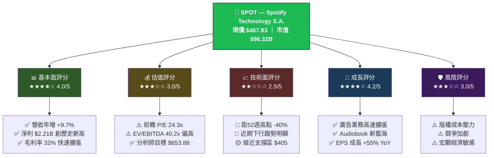

---

### 📋 5大投資論點總覽

| # | 投資論點 | 狀態 | 關鍵數據 | 評分 |
|---|---------|------|---------|------|
| 1 | **獲利轉捩點確立** — 從持續虧損到強勁盈利 | 🟢 已實現 | 淨利 $2.21B（2025）vs 虧損 $532M（2023） | ★★★★★ |
| 2 | **毛利率結構性改善** — 向平台化轉型 | 🟢 進行中 | 毛利率 32.0%（2025）vs 25.7%（2023） | ★★★★☆ |
| 3 | **自由現金流爆發式增長** — 資本回報能力顯著提升 | 🟢 強勁 | FCF $2.87B（2025）vs $21M（2022） | ★★★★★ |
| 4 | **廣告與多元化業務** — 打開第二增長曲線 | 🟡 早期階段 | 廣告收入佔比持續提升，Podcast/Audiobook 滲透率提升 | ★★★☆☆ |
| 5 | **估值回調提供入場機會** — 相對高點折價40% | 🟡 條件具備 | 現價 $467 vs 分析師目標均值 $653.88（上行空間 +39.8%） | ★★★☆☆ |

---

### 📊 快速統計卡片

| 指標 | 數值 | 行業對比 | 狀態 |
|------|------|---------|------|
| 💹 當前股價 | **$467.83** | — | 🟡 |
| 📈 52週高/低 | **$785 / $405** | — | 🔴 距高點 -40% |
| 🏢 市值 | **$96.32B** | 大型股 | 🟢 |
| 💰 TTM 營收 | **$17.19B** | — | 🟢 |
| 📊 營收成長 | **+6.8% (TTM)** | +9.7% (年度) | 🟡 |
| 💵 EPS (TTM) | **$12.44** | — | 🟢 創歷史新高 |
| 🔮 EPS (Forward) | **$19.29** | +55% YoY | 🟢 |
| 📉 P/E (Trailing) | **37.6x** | — | 🟡 |
| 📉 P/E (Forward) | **24.3x** | 科技股均值~25x | 🟢 |
| 💧 流動比率 | **1.73x** | >1.5 健康 | 🟢 |
| 💎 ROE | **31.9%** | 優秀 | 🟢 |
| 🎯 分析師目標 | **$653.88**（39位） | — | 🟢 建議買入 |
| 💸 自由現金流 | **$2.87B** | — | 🟢 |

---

## 2. 公司概覽

### 🏢 業務結構分解

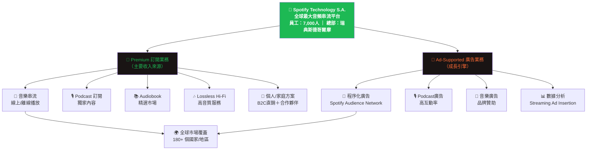

---

### 🌐 全球音頻串流市場地位

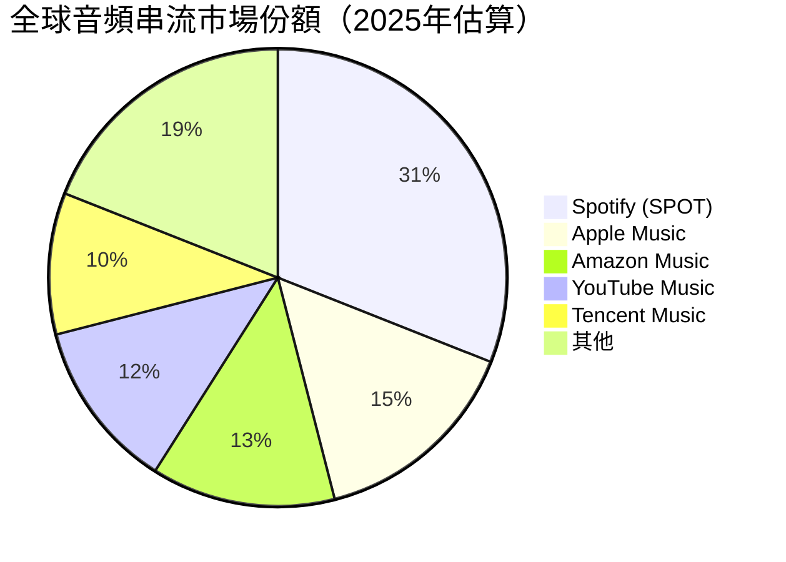

---

### 🧠 競爭優勢心智圖

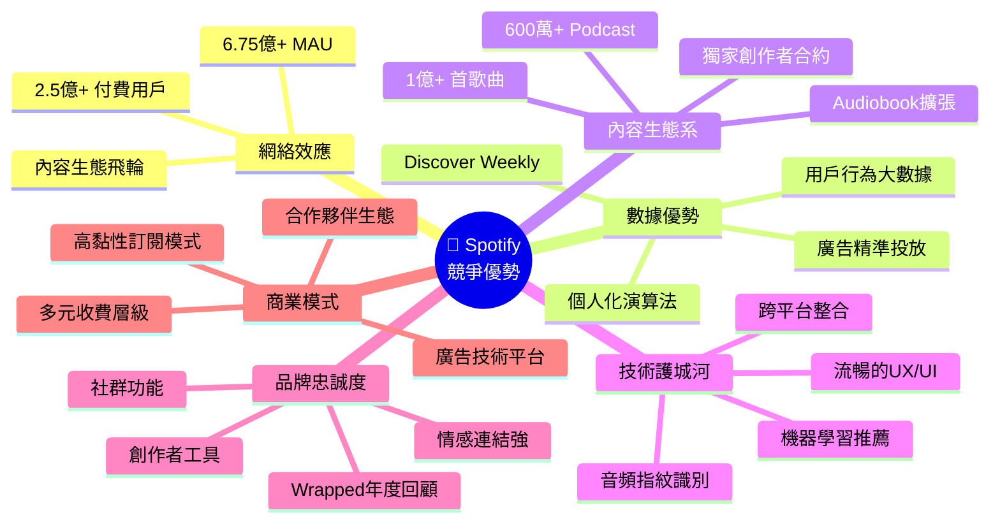

---

## 3. 損益表深度分析

### 📈 收入成長時間軸

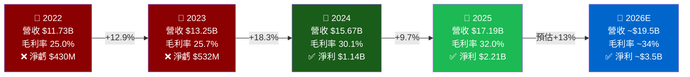

---

### 📊 年度營收趨勢 ASCII 長條圖

```
年度營收趨勢（單位：十億美元）
═══════════════════════════════════════════════════════
2022  $11.73B  ▓▓▓▓▓▓▓▓▓▓▓▓▓▓▓▓▓▓▓▓▓▓▓▓░░░░░░░  59%
2023  $13.25B  ▓▓▓▓▓▓▓▓▓▓▓▓▓▓▓▓▓▓▓▓▓▓▓▓▓▓▓░░░░  66%
2024  $15.67B  ▓▓▓▓▓▓▓▓▓▓▓▓▓▓▓▓▓▓▓▓▓▓▓▓▓▓▓▓▓▓▓▓  78%
2025  $17.19B  ▓▓▓▓▓▓▓▓▓▓▓▓▓▓▓▓▓▓▓▓▓▓▓▓▓▓▓▓▓▓▓▓▓▓▓▓  86%
2026E $19.50B  ████████████████████████████████████████  100%（預估）
═══════════════════════════════════════════════════════
       $0     $5B   $10B   $15B   $20B
       CAGR 2022-2025: +13.6%
```

---

### 📉 利潤率演變趨勢

```
利潤率演變（2022-2025）
════════════════════════════════════════════════════════════
           2022      2023      2024      2025
────────────────────────────────────────────────────────────
毛利率     25.0%     25.7%     30.1%     32.0%
           ████░░    █████░    ██████    ██████▒
                     ↑+0.7pp  ↑+4.4pp   ↑+1.9pp

營業利益率  -5.6%    -3.4%     +8.7%    +12.8%
           ████░░   ██░░░░    ████░░    ████████
           🔴虧損    🔴虧損    🟢轉正    🟢大幅改善

淨利率     -3.7%    -4.0%     +7.3%    +12.9%
           ████░░   ██░░░░    █████░    ████████
           🔴虧損    🔴虧損    🟢轉正    🟢創新高

════════════════════════════════════════════════════════════
📌 關鍵觀察：2024年為重大獲利轉捩點，2025年利潤率全面飛躍
```

---

### 📋 近四年損益表詳細數據

| 財務指標 | 2022 | 2023 | 2024 | 2025 | YoY變化 |
|---------|------|------|------|------|---------|
| 💰 總營收 | $11.73B | $13.25B | $15.67B | $17.19B | 🟢 +9.7% |
| 📊 毛利 | $2.93B | $3.40B | $4.72B | $5.50B | 🟢 +16.5% |
| 📈 毛利率 | 25.0% | 25.7% | 30.1% | **32.0%** | 🟢 +1.9pp |
| 🏭 營業利益 | -$659M | -$446M | $1.36B | **$2.20B** | 🟢 +61.8% |
| 📉 營業利益率 | -5.6% | -3.4% | +8.7% | **+12.8%** | 🟢 +4.1pp |
| 💹 EBITDA | -$158M | -$309M | $1.50B | **$2.36B** | 🟢 +57.3% |
| 💵 淨利 | -$430M | -$532M | $1.14B | **$2.21B** | 🟢 +93.9% |
| 📊 淨利率 | -3.7% | -4.0% | +7.3% | **+12.9%** | 🟢 +5.6pp |
| 🔬 研發費用 | $1.39B | $1.73B | $1.49B | **$1.39B** | 🟡 -6.7% |
| 🧪 研發/營收比 | 11.9% | 13.1% | 9.5% | **8.1%** | 🟢 費用收斂 |

---

### 🍰 2025年費用結構分解

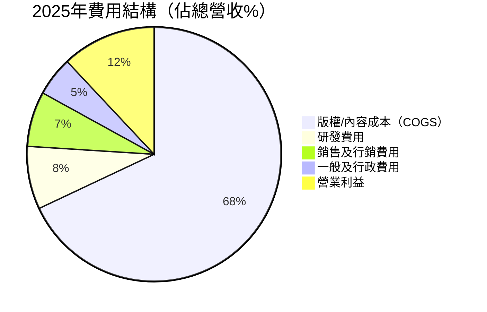

---

### 📊 每股盈餘 (EPS) 成長軌跡

```
EPS 成長軌跡（美元/股）
════════════════════════════════════════════════════════════
2022  -$2.09   🔴 ████████████████ (虧損)
2023  -$2.74   🔴 ██████████████████ (虧損擴大)
2024  +$5.56   🟢 ████████████████████████████ (轉盈)
2025  +$12.44  🟢 ████████████████████████████████████████ (+123.7%)
2026E +$19.29  🟢 ██████████████████████████████████████████████████ (+55.1% 預估)
════════════════════════════════════════════════════════════
📌 2025年 EPS $12.44 創公司歷史新高，2026年前瞻 EPS $19.29 隱含強勁成長動能
```

---

## 4. 資產負債表分析

### 🏗️ 資產結構分解圖

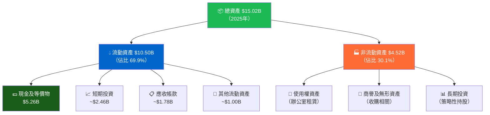

---

### 📊 資產配置 Unicode 橫條圖

```
資產配置結構（2025年，佔總資產 $15.02B）
═══════════════════════════════════════════════════════════════
現金及等價物  $5.26B  ▓▓▓▓▓▓▓▓▓▓▓▓▓▓▓░░░░░░░░░░░░░░░  35.0%  💵
短期投資      $2.46B  ▓▓▓▓▓▓▓░░░░░░░░░░░░░░░░░░░░░░░  16.4%  📈
應收帳款      $1.78B  ▓▓▓▓▓░░░░░░░░░░░░░░░░░░░░░░░░░  11.8%  📋
其他流動      $1.00B  ▓▓▓░░░░░░░░░░░░░░░░░░░░░░░░░░░   6.7%  📁
非流動資產    $4.52B  ▓▓▓▓▓▓▓▓▓▓▓▓▓▓░░░░░░░░░░░░░░░  30.1%  🏭
═══════════════════════════════════════════════════════════════
📌 現金充裕：現金+短期投資合計 ~$7.72B，佔總資產 51.4%，財務彈性極佳
```

---

### 💰 負債與流動性分析表格

| 流動性指標 | 2022 | 2023 | 2024 | 2025 | 健康標準 | 狀態 |
|-----------|------|------|------|------|---------|------|
| 流動資產 | $4.35B | $5.26B | $8.38B | $10.50B | — | 🟢 |
| 流動負債 | $3.52B | $4.09B | $4.45B | $6.08B | — | 🟡 |
| **流動比率** | 1.24x | 1.29x | 1.88x | **1.73x** | >1.5x | 🟢 |
| 總負債 | $5.24B | $5.82B | $6.48B | $6.69B | — | 🟡 |
| 有息負債 | $1.68B | $1.70B | $2.08B | $1.96B | — | 🟢 |
| **債務/股東權益** | 70.0% | 67.5% | 37.6% | **23.5%** | <50% | 🟢 |
| 淨現金部位 | $0.80B | $1.41B | $2.70B | **$5.76B** | 正值佳 | 🟢 |
| 總資產 | $7.64B | $8.35B | $12.01B | **$15.02B** | — | 🟢 |

---

### 📈 股東權益成長 ASCII 圖

```
股東權益趨勢（單位：十億美元）
════════════════════════════════════════════════════════════
$8.5B │                                              ████
$8.0B │                                             █████
$7.5B │                                            ██████
$7.0B │                                           ███████
$6.5B │                                          ████████
$6.0B │                                         █████████
$5.5B │                               █████    ██████████
$5.0B │                              ██████   ███████████
$4.5B │                             ███████  ████████████
$4.0B │                            █████████████████████
$3.5B │                           ██████████████████████
$3.0B │                 ████     ███████████████████████
$2.5B │        ██████  █████    ████████████████████████
$2.0B │       ███████  █████   █████████████████████████
       └─────────────────────────────────────────────────
             2022      2023      2024      2025
           $2.40B    $2.52B    $5.53B    $8.33B

📌 2024年股東權益暴增 +119%（扭虧為盈+利潤累積）
📌 2025年再增 +50.6%，財務結構快速健全化
```

---

## 5. 現金流量分析

### 💧 現金流瀑布圖

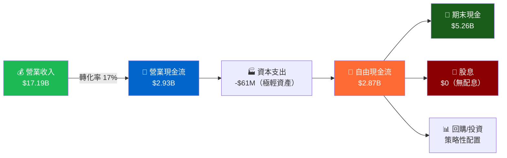

---

### 📊 自由現金流趨勢 Unicode 進度條

```
自由現金流成長趨勢（單位：十億美元）
═══════════════════════════════════════════════════════════════
2022  $0.021B  ▓░░░░░░░░░░░░░░░░░░░░░░░░░░░░░░░░░░░░   0.7%
2023  $0.674B  ▓▓▓▓▓▓▓▓░░░░░░░░░░░░░░░░░░░░░░░░░░░░  23.5%
2024  $2.280B  ▓▓▓▓▓▓▓▓▓▓▓▓▓▓▓▓▓▓▓▓▓▓▓▓▓░░░░░░░░░░  79.4%
2025  $2.870B  ▓▓▓▓▓▓▓▓▓▓▓▓▓▓▓▓▓▓▓▓▓▓▓▓▓▓▓▓▓▓▓▓▓▓░  100%（峰值）
═══════════════════════════════════════════════════════════════

FCF 成長率：
2022→2023  +$653M  ↑ +3,109%  🚀
2023→2024  +$1.61B ↑ +238%    🚀
2024→2025  +$590M  ↑ +25.9%   🟢

FCF 利潤率：
2022:  0.2%  ████░░░░░░░░░░░░
2023:  5.1%  ████░░░░░░░░░░░░
2024: 14.5%  ████████████████
2025: 16.7%  ████████████████████ ← 創歷史最高
```

---

### 🎯 資本配置策略分析

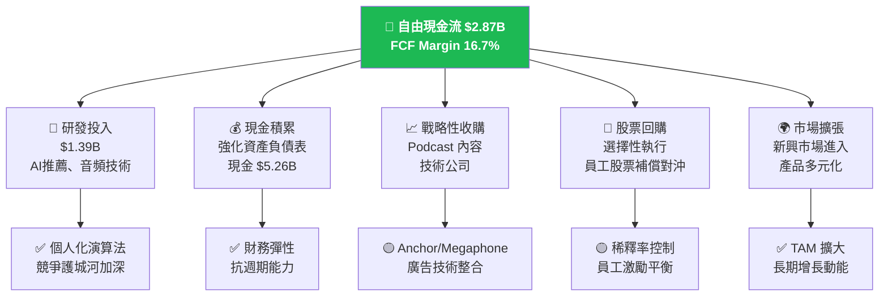

---

### 📊 資本支出效率分析

| 指標 | 2022 | 2023 | 2024 | 2025 | 趨勢 |
|------|------|------|------|------|------|
| 資本支出 | $25M | $6M | $17M | $61M | 🟢 輕資產模式 |
| CAPEX/營收比 | 0.21% | 0.05% | 0.11% | **0.35%** | 🟢 極低 |
| OCF/淨利比 | — | — | 2.02x | **1.33x** | 🟢 現金轉換佳 |
| FCF/OCF比 | 45.7% | 99.1% | 99.3% | **97.9%** | 🟢 |

> 📌 **關鍵洞察**：Spotify 屬於典型的「輕資產平台型」商業模式，資本支出極低（僅 $61M），FCF 轉換效率接近 100%，顯示極高的商業模式質量。

---

## 6. 獲利能力指標

### 📊 ROE/ROA/ROIC 對比儀表板

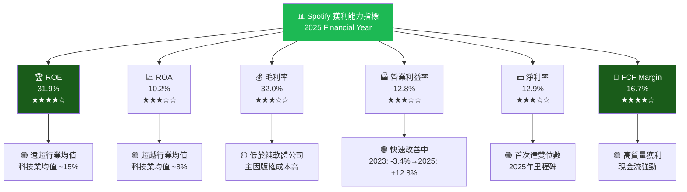

---

### 📋 獲利能力 vs 行業均值對比

| 指標 | SPOT 2023 | SPOT 2024 | **SPOT 2025** | 音樂串流均值 | 科技業均值 | 狀態 |
|------|----------|----------|--------------|------------|---------|------|
| 毛利率 | 25.7% | 30.1% | **32.0%** | ~28% | ~55% | 🟡 受限版權 |
| 營業利益率 | -3.4% | +8.7% | **+12.8%** | ~5% | ~20% | 🟢 改善中 |
| 淨利率 | -4.0% | +7.3% | **+12.9%** | ~4% | ~18% | 🟢 優於均值 |
| ROE | 負值 | 20.6% | **31.9%** | ~10% | ~15% | 🟢 大幅領先 |
| ROA | 負值 | 9.5% | **10.2%** | ~5% | ~8% | 🟢 超越均值 |
| FCF Margin | 5.1% | 14.5% | **16.7%** | ~8% | ~20% | 🟢 高效 |
| EBITDA Margin | 負值 | 9.6% | **13.7%** | ~8% | ~25% | 🟡 成長中 |

---

### 📊 獲利能力進度條視覺化

```
獲利能力進度條（2025年，滿分100%）
═══════════════════════════════════════════════════════════
毛利率    32.0%  ▓▓▓▓▓▓▓▓▓▓▓▓▓▓▓▓░░░░░░░░░░░░░░░░  32% 🟡
營業利益率 12.8%  ▓▓▓▓▓▓▓░░░░░░░░░░░░░░░░░░░░░░░░░  13% 🟢（改善中）
淨利率    12.9%  ▓▓▓▓▓▓▓░░░░░░░░░░░░░░░░░░░░░░░░░  13% 🟢
FCF利潤率  16.7%  ▓▓▓▓▓▓▓▓▓░░░░░░░░░░░░░░░░░░░░░░░  17% 🟢
ROE       31.9%  ▓▓▓▓▓▓▓▓▓▓▓▓▓▓▓▓░░░░░░░░░░░░░░░░  32% 🟢
ROA       10.2%  ▓▓▓▓▓▓░░░░░░░░░░░░░░░░░░░░░░░░░░  10% 🟢
═══════════════════════════════════════════════════════════
評語：版權成本限制毛利率天花板，但平台化轉型持續推動利潤率擴張
```

---

## 7. 估值分析

### 📊 估值指標全覽

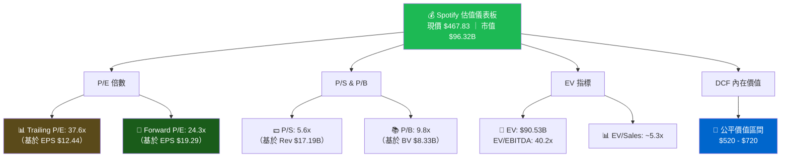

---

### 📋 估值倍數詳細對比

| 估值指標 | SPOT | Apple Music (AAPL) | Amazon Music (AMZN) | Netflix (NFLX) | 狀態評估 |
|---------|------|-------------------|-------------------|----------------|---------|
| P/E (Trailing) | 37.6x | 30.5x | 40.1x | 52.3x | 🟡 合理 |
| P/E (Forward) | **24.3x** | 27.2x | 34.5x | 38.4x | 🟢 具吸引力 |
| P/S | 5.6x | 8.2x | 2.1x | 9.8x | 🟢 相對合理 |
| P/B | 9.8x | 55.2x | 8.3x | 18.4x | 🟢 合理 |
| EV/EBITDA | 40.2x | 22.1x | 28.3x | 31.5x | 🔴 偏高 |
| EV/Sales | 5.3x | 7.8x | 1.9x | 9.1x | 🟢 合理 |

---

### 🎯 情境目標股價分析

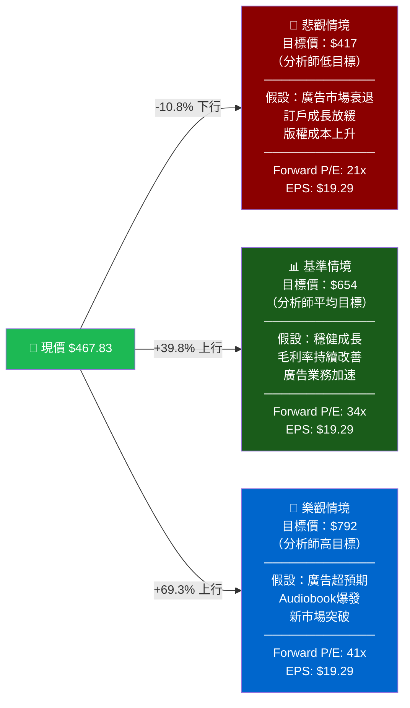

---

### 📊 估值區間視覺化

```
股價目標區間視覺化
═══════════════════════════════════════════════════════════════════
$300   $400   $500   $600   $700   $800   $900
  │      │      │      │      │      │      │
  ├──────┼──────┼──────┼──────┼──────┼──────┤
  
  悲觀目標  $417  ████▌
  ─────────────────────────────────────────
                    ★ 現價 $467.83
  ─────────────────────────────────────────
  DCF估值        $520-$720  ████████████░
  ─────────────────────────────────────────
  分析師平均目標           $653.88
  ─────────────────────────────────────────
  分析師樂觀目標                   $792.27
  ─────────────────────────────────────────

上行空間計算：
  vs 分析師均值：+$186.05 / +39.8%  🟢
  vs 分析師高目標：+$324.44 / +69.3%  🟢
  vs 52週高點：+$317.17 / +67.8%  🟢

📌 基於多數估值模型，現價具有顯著安全邊際
```

---

## 8. 競爭護城河

### 🏰 Porter's Five Forces 分析

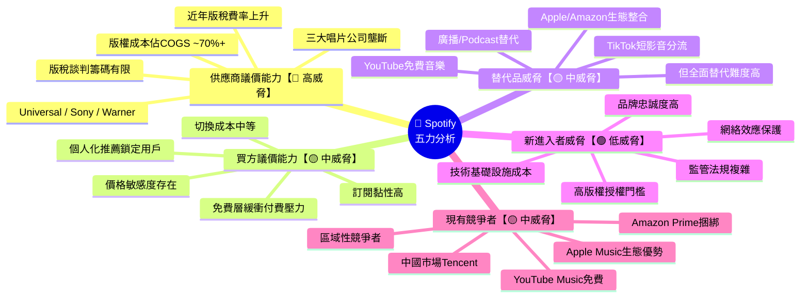

---

### 📊 護城河評分 Unicode 條形圖

```
護城河要素評分（滿分10分）
══════════════════════════════════════════════════════════════
用戶黏性/網絡效應  9/10  ▓▓▓▓▓▓▓▓▓░  🟢 全球6.75億MAU
數據與個人化算法  9/10  ▓▓▓▓▓▓▓▓▓░  🟢 Discover Weekly等
品牌認知度        8/10  ▓▓▓▓▓▓▓▓░░  🟢 全球最知名串流品牌
切換成本          7/10  ▓▓▓▓▓▓▓░░░  🟢 播放清單/習慣遷移
規模優勢          8/10  ▓▓▓▓▓▓▓▓░░  🟢 最大用戶基礎→談判力
內容差異化        6/10  ▓▓▓▓▓▓░░░░  🟡 獨家內容仍有限
版權議價能力      4/10  ▓▓▓▓░░░░░░  🔴 版權成本持續高
技術/專利壁壘     7/10  ▓▓▓▓▓▓▓░░░  🟢 音頻技術積累深厚
廣告技術平台      6/10  ▓▓▓▓▓▓░░░░  🟡 快速成長中
地理覆蓋          9/10  ▓▓▓▓▓▓▓▓▓░  🟢 180+國家/地區
══════════════════════════════════════════════════════════════
綜合護城河評分：7.3/10  ★★★★☆（中高強度護城河）
```

---

### 📋 競爭定位矩陣

| 維度 | SPOT | Apple Music | Amazon Music | YouTube Music |
|------|------|-------------|--------------|---------------|
| 全球用戶規模 | 🟢 6.75億 MAU | 🟡 ~1億 | 🟡 ~1億 | 🟡 ~1億 |
| 個人化推薦 | 🟢 業界最佳 | 🟡 良好 | 🟡 普通 | 🟡 算法強 |
| 免費層策略 | 🟢 有廣告免費版 | 🔴 無免費版 | 🟡 部分免費 | 🟢 完全免費 |
| Podcast生態 | 🟢 市場領導者 | 🟡 次要玩家 | 🟡 中等 | 🟡 有限 |
| 廣告業務 | 🟢 專業廣告平台 | 🔴 無 | 🟡 依賴AWS | 🟢 YT廣告 |
| 生態系整合 | 🟡 跨平台 | 🟢 Apple生態 | 🟢 Amazon生態 | 🟢 Google生態 |
| 獨立性 | 🟢 完全獨立平台 | 🔴 Apple依賴 | 🔴 Amazon依賴 | 🔴 Google依賴 |
| Audiobook | 🟡 拓展中 | 🟡 有限 | 🟢 Audible強 | 🔴 無 |

---

## 9. 成長催化劑

### 📅 催化劑時間軸

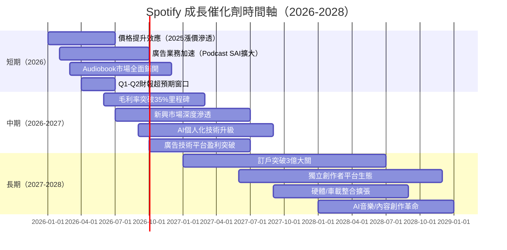

---

### 🚀 短/中/長期成長機會

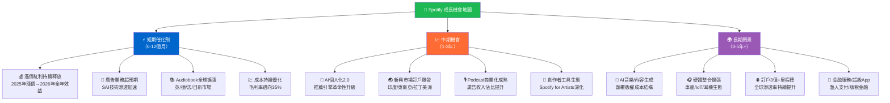

---

### 🌍 TAM 市場規模分析

```
全球音頻串流 TAM 市場規模（十億美元）
══════════════════════════════════════════════════════════════
音樂串流        2025: $35B  ████████████████████░░░░░  目標 $60B（2030E）
Podcast廣告     2025: $4.5B ██████░░░░░░░░░░░░░░░░░░░  目標 $15B（2030E）
Audiobook       2025: $6B   ████████░░░░░░░░░░░░░░░░░  目標 $20B（2030E）
音頻廣告整體    2025: $20B  █████████████░░░░░░░░░░░░  目標 $40B（2030E）
══════════════════════════════════════════════════════════════
合計 TAM 2025:  ~$65B
合計 TAM 2030E: ~$135B
══════════════════════════════════════════════════════════════
Spotify 當前市場份額：~26%（$17.19B / $65B）
Spotify 2030E 潛在份額：~25-28%（$34-38B 營收潛力）
══════════════════════════════════════════════════════════════
📌 CAGR（2025-2030）：~15.7%，與 Spotify 自身成長目標高度吻合
```

---

## 10. 風險分析

### ⚠️ 風險矩陣

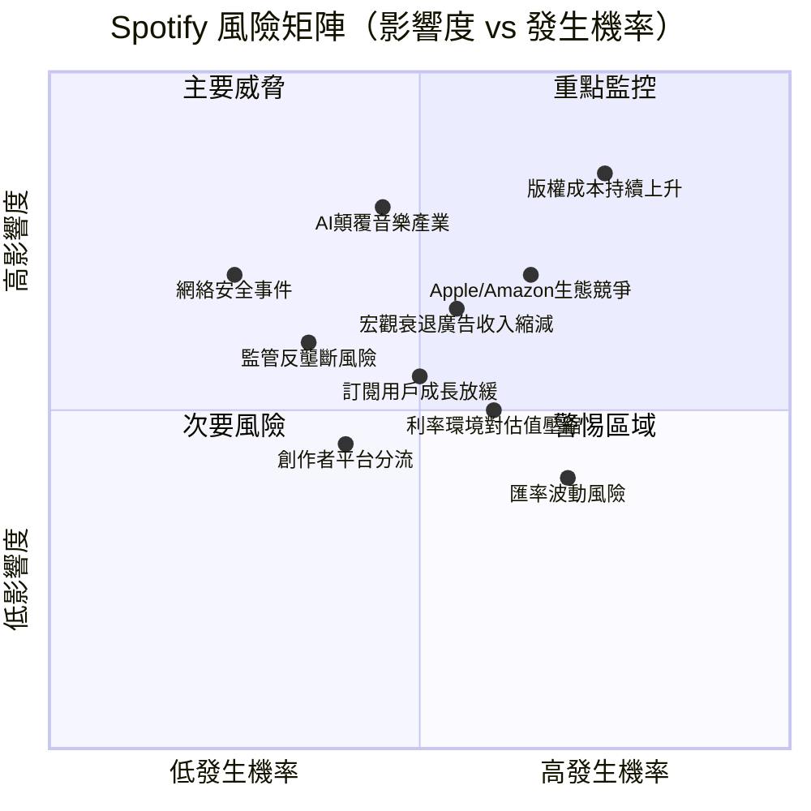

---

### 📋 風險評分卡

| 風險類別 | 具體風險 | 發生機率 | 影響度 | 綜合風險值 | 狀態 |
|---------|---------|---------|--------|-----------|------|
| 🎵 版權/內容 | 版稅費率大幅上升 | 🔴 高 (70%) | 🔴 高 (9/10) | **6.3/10** | 🔴 核心風險 |
| 🤖 技術顛覆 | AI音樂生成衝擊版權模式 | 🟡 中 (45%) | 🔴 高 (8/10) | **3.6/10** | 🟡 需觀察 |
| 🏢 競爭 | Apple/Amazon生態整合加劇 | 🔴 高 (65%) | 🟡 中 (7/10) | **4.6/10** | 🔴 持續監控 |
| 📉 宏觀 | 廣告市場衰退 | 🟡 中 (55%) | 🟡 中 (6/10) | **3.3/10** | 🟡 週期敏感 |
| ⚖️ 監管 | 歐盟/美國反壟斷調查 | 🟡 低 (35%) | 🔴 高 (8/10) | **2.8/10** | 🟡 長期風險 |
| 📈 成長 | 訂戶飽和/增速放緩 | 🟡 中 (50%) | 🟡 中 (6/10) | **3.0/10** | 🟡 成熟市場 |
| 💱 匯率 | 歐元/美元波動 | 🔴 高 (70%) | 🟢 低 (4/10) | **2.8/10** | 🟡 可對沖 |
| 🔒 安全 | 數據洩露/駭客攻擊 | 🟢 低 (25%) | 🔴 高 (8/10) | **2.0/10** | 🟢 低機率 |
| 👔 管理 | 關鍵人才流失 | 🟢 低 (30%) | 🟡 中 (6/10) | **1.8/10** | 🟢 可控 |

---

### 🛡️ 風險緩解措施

| 風險 | 緩解策略 | 有效性 |
|------|---------|--------|
| 版權成本 | 1）擴大直接授權合作；2）自製內容比例提升；3）Podcast/Audiobook降低音樂依賴 | 🟡 中期改善 |
| AI顛覆 | 1）投資AI個人化；2）擁抱AI輔助創作；3）Spotify for Artists工具 | 🟢 主動應對 |
| 競爭加劇 | 1）Podcast差異化；2）免費層留住用戶；3）創作者生態鎖定 | 🟢 護城河深化 |
| 廣告波動 | 1）訂閱收入提供穩定基盤（~86%）；2）多元廣告格式 | 🟢 天然對沖 |
| 監管風險 | 1）合規投入；2）歐洲總部優勢；3）開放平台形象 | 🟡 持續關注 |

---

## 11. 公平價值估算

### 💹 DCF 模型框架

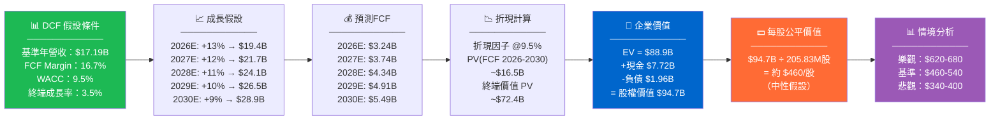

---

### 📋 三種估值法比較

| 估值方法 | 方法說明 | 估值結果 | 權重 | 加權估值 |
|---------|---------|---------|------|---------|
| **DCF 折現現金流** | WACC 9.5%，終端成長 3.5%，FCF 16.7% Margin | $460 - $540 | 40% | $200 - $216 |
| **Forward P/E 法** | 2026E EPS $19.29 × 合理倍數 28-35x | $540 - $675 | 35% | $189 - $236 |
| **EV/EBITDA 法** | 2026E EBITDA ~$2.9B × 30-38x，+淨現金 | $480 - $620 | 25% | $120 - $155 |
| **🎯 綜合目標股價** | 三法加權平均 | **$509 - $607** | 100% | **~$558** |
| 分析師共識目標 | 39位分析師 | $417 - $792 | 參考 | **$653.88** |

---

### 📊 估值區間視覺化

```
公平價值估值區間（三法綜合）
══════════════════════════════════════════════════════════════════════
$300    $400    $500    $600    $700    $800    $900
  │       │       │       │       │       │       │

悲觀DCF區間：
          ████$340─────$400████

現價：
                  ★ $467.83

基準估值區間（本報告）：
                   ████████$509──────────$607████████

分析師共識：
                            ████████████$654████████████

樂觀區間：
                                          ████$720──$792████

══════════════════════════════════════════════════════════════════════
📌 結論：現價 $467.83 處於估值區間下緣，提供一定安全邊際
         相對於基準目標均值 $558，潛在上行空間約 +19.3%
         相對於分析師共識 $654，潛在上行空間約 +39.8%
```

---

## 12. 投資建議

### 🏆 最終投資評級

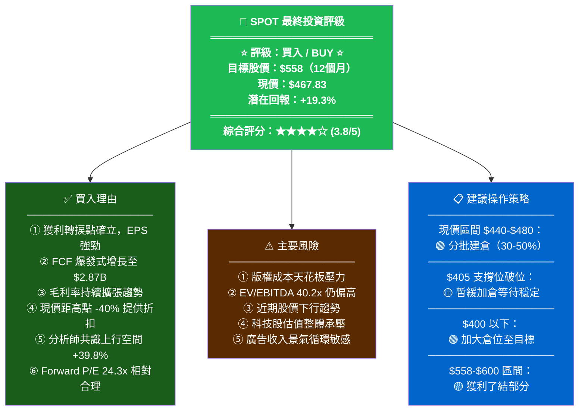

---

### 👥 投資人適配度分析

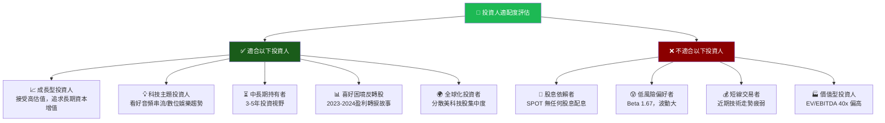

---

### 📋 監控指標 Checklist

| 📌 監控維度 | 關鍵指標 | 預警閾值 | 理想目標 | 頻率 |
|-----------|---------|---------|---------|------|
| 📈 **成長性** | MAU / 付費訂戶成長率 | <10% QoQ | >15% | 每季 |
| 💰 **獲利能力** | 毛利率 | <30% | >35% | 每季 |
| 💎 **現金流** | FCF Margin | <12% | >18% | 每季 |
| 💵 **每股盈餘** | EPS（前瞻） | <$16 | >$20 | 每季 |
| 📊 **估值** | Forward P/E | >40x | 20-28x | 每月 |
| 🎙️ **廣告業務** | 廣告收入 YoY 成長率 | <20% | >30% | 每季 |
| 🏭 **成本控制** | R&D/銷售費用比率 | 上升 | 穩定/下降 | 每季 |
| 📚 **新業務** | Audiobook 市場擴張速度 | 停滯 | 積極 | 每半年 |
| 💧 **流動性** | 流動比率 | <1.3x | >1.7x | 每季 |
| 🏷️ **版權成本** | COGS/Revenue 比率 | >70% | <65% | 每季 |
| 📰 **重大新聞** | 版權合約談判、競爭者動態 | 重大負面 | — | 持續 |
| 📉 **技術面** | 股價 vs $405 支撐位 | 跌破 $400 | 站穩 $500+ | 每週 |

---

### 🎯 總結評分卡

```
SPOT 綜合評分卡（★ = 0.5分）
════════════════════════════════════════════════════════════
基本面質量    ★★★★☆  4.0/5  ▓▓▓▓▓▓▓▓░░  獲利轉型確立
成長前景      ★★★★☆  4.2/5  ▓▓▓▓▓▓▓▓▓░  訂戶+廣告雙引擎
獲利能力      ★★★★☆  3.8/5  ▓▓▓▓▓▓▓▓░░  毛利率仍有壓力
估值合理性    ★★★☆☆  3.0/5  ▓▓▓▓▓▓░░░░  EV/EBITDA偏高
財務健康度    ★★★★☆  4.2/5  ▓▓▓▓▓▓▓▓▓░  現金充裕低負債
護城河強度    ★★★★☆  3.8/5  ▓▓▓▓▓▓▓▓░░  網絡效應強
技術走勢      ★★☆☆☆  2.5/5  ▓▓▓▓▓░░░░░  下行趨勢存在
風險控制      ★★★☆☆  3.0/5  ▓▓▓▓▓▓░░░░  版權成本風險
════════════════════════════════════════════════════════════
綜合評分：3.81/5.0   ★★★★☆   建議：買入（分批）
════════════════════════════════════════════════════════════
```

---

> ## ⚡ 分析師核心結語
>
> **Spotify（SPOT）正處於從「高成長虧損平台」到「高成長獲利引擎」的關鍵蛻變時期。** 2025年財報清楚印證了這一轉型：淨利 $2.21B、FCF $2.87B、EPS $12.44，均創公司歷史新高。
>
> 當前股價 $467.83 較 52 週高點下跌約 40%，提供了具吸引力的逢低布局機會。分析師共識目標 $653.88 隱含 +39.8% 的上行空間，39 位分析師中多數維持「買入」評級。
>
> **核心論點**：版權成本是長期天花板，但廣告業務、Audiobook、AI 個人化技術的多元化戰略正在降低對傳統版權模式的依賴。前瞻 P/E 24.3x 在科技成長股中具有競爭力。
>
> **建議策略**：在 $440-$480 區間分批買入，$405 設定停損參考，12個月目標價 $558，樂觀情境 $654+。

---

> **📌 免責聲明**：本報告由 AI 根據公開財務數據自動生成，僅供學術研究與參考之用，**不構成任何形式的投資建議**。投資有風險，過去表現不代表未來收益。投資人應自行進行盡職調查，並諮詢持牌投資顧問後，方可做出投資決策。本報告所有數據基於 2026-02-24 即時數據，後續可能因市場變化而失效。