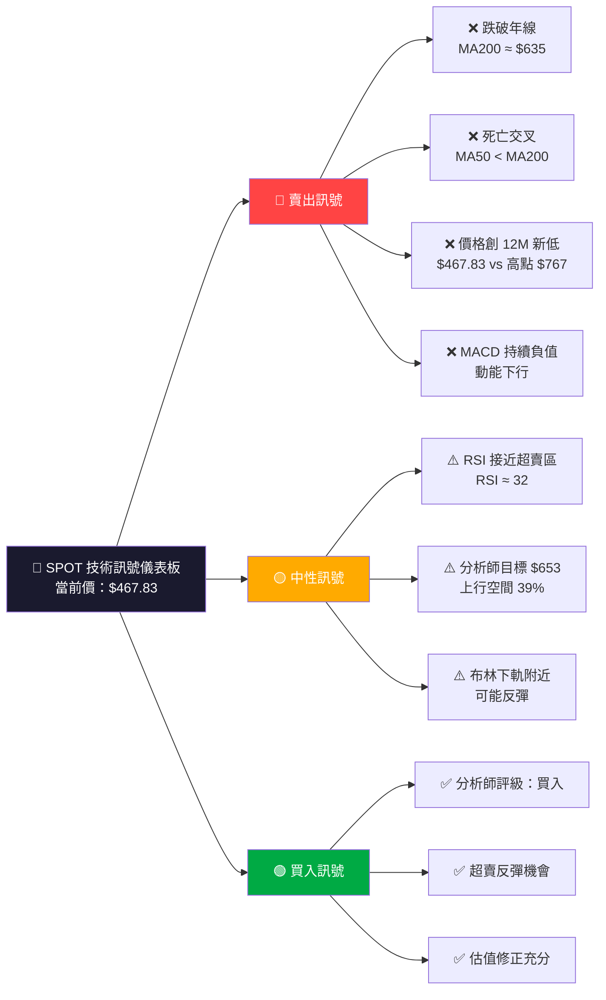
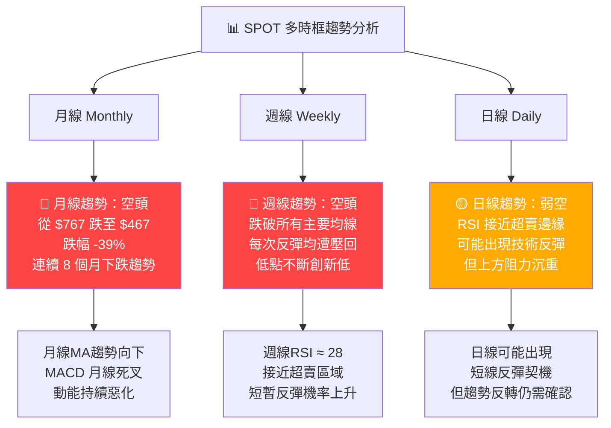
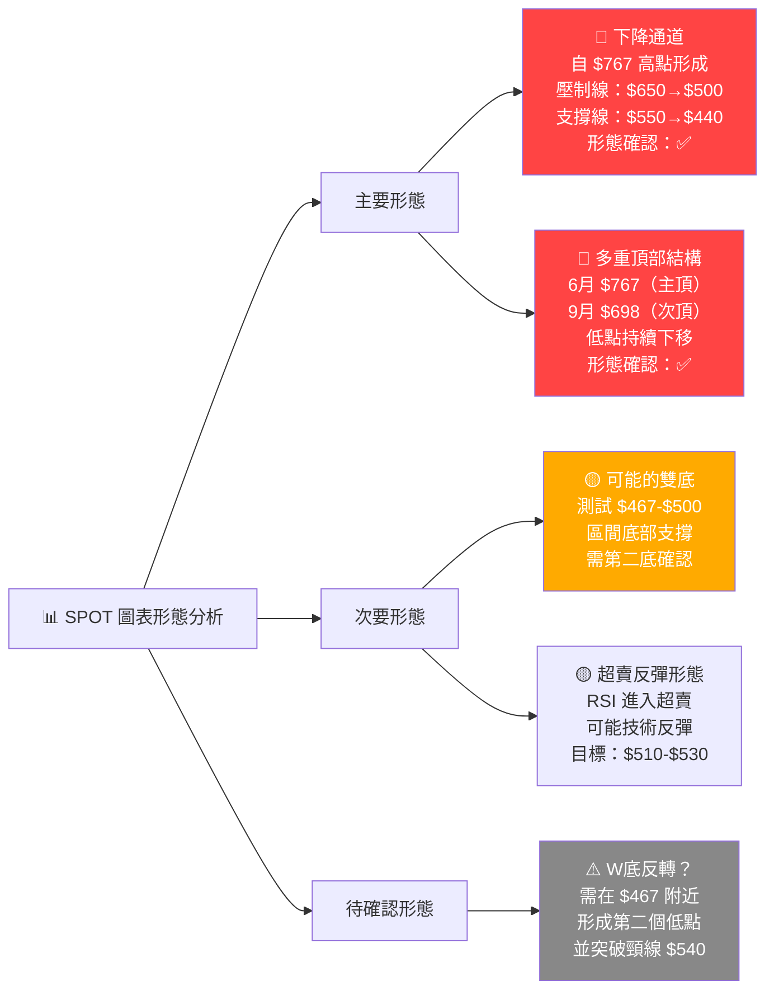
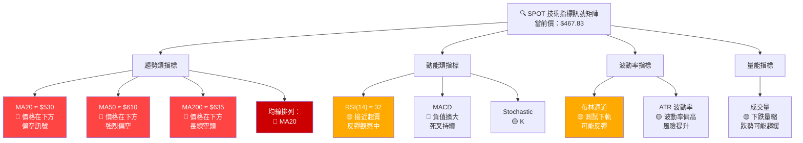
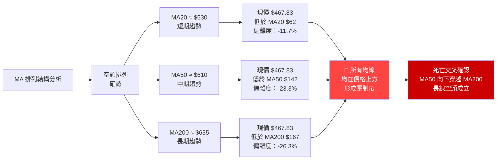
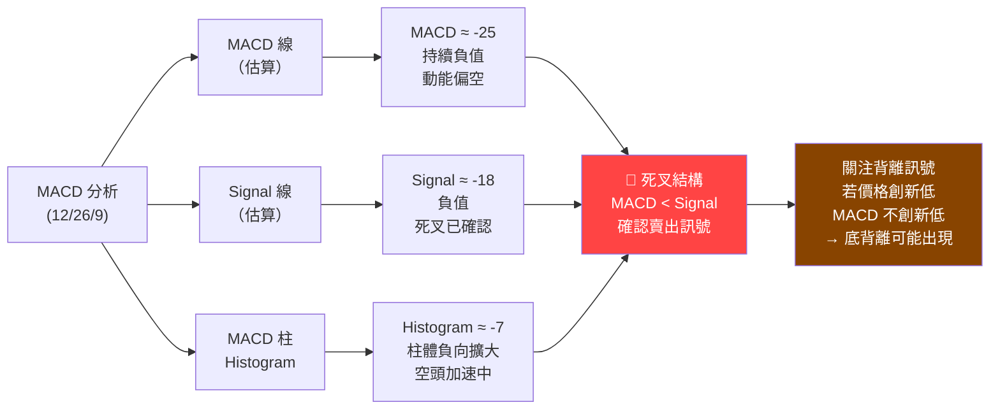
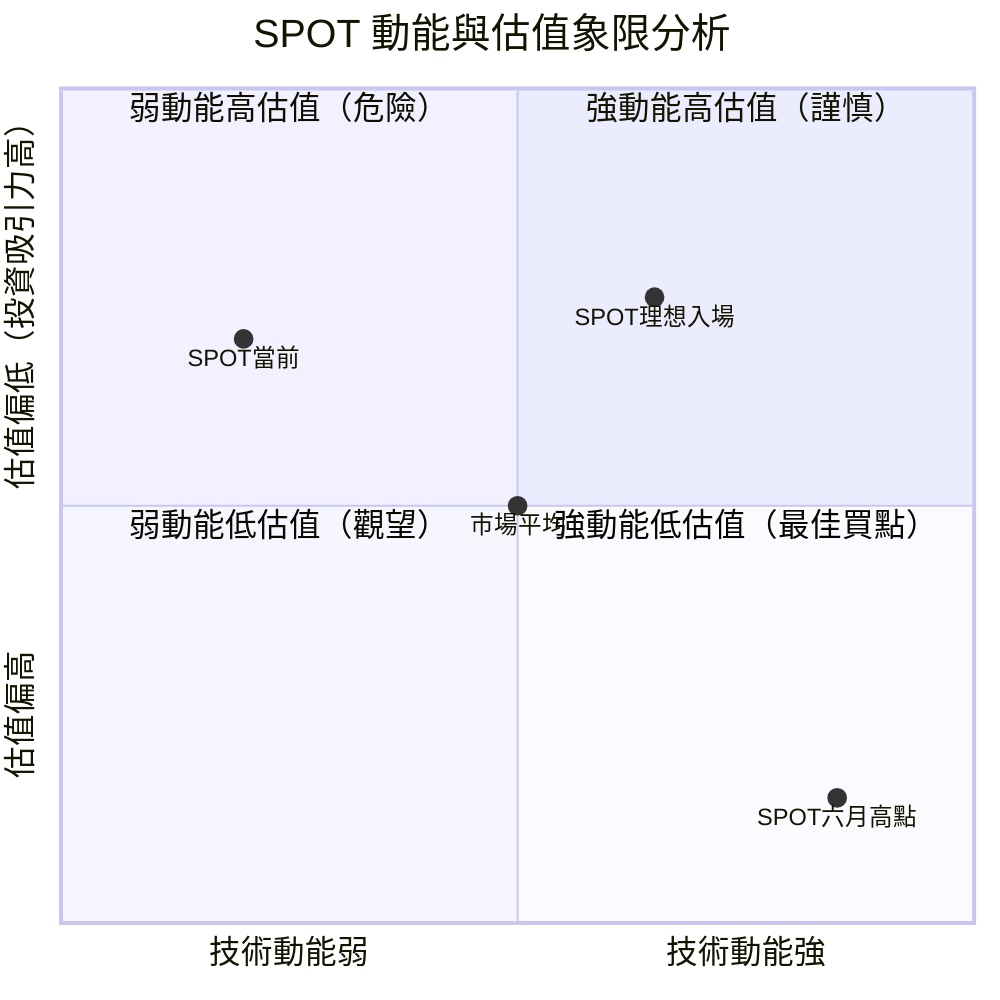
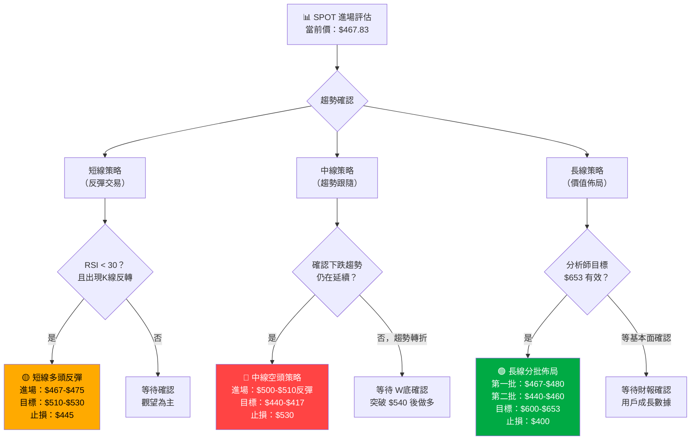
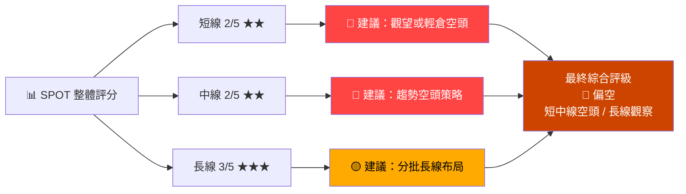
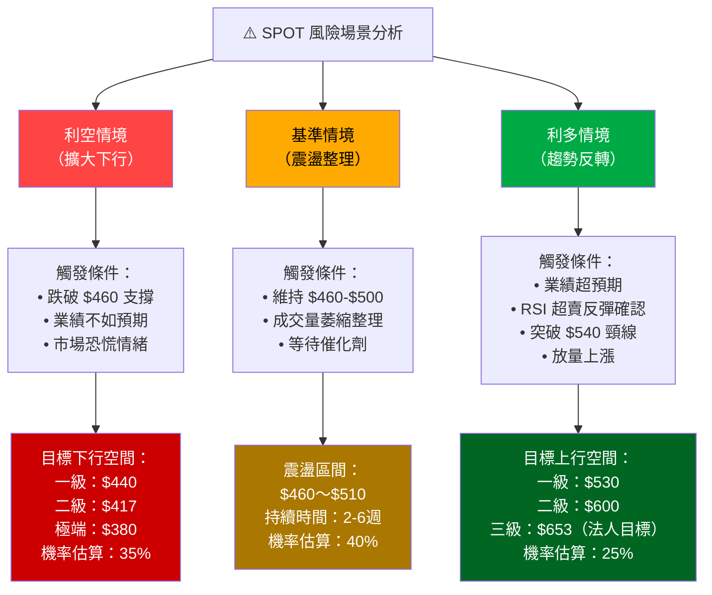

# SPOT 技術分析報告

> **報告日期**：2026-02-24 ｜ **語言**：繁體中文 ｜ **數據來源**：Yahoo Finance
> **標的**：Spotify Technology S.A. (SPOT) ｜ **當前價格**：$467.83 ｜ **產業**：通訊服務 / 串流媒體

---

## 目錄

1. [技術面概覽](#1-技術面概覽)
2. [趨勢分析](#2-趨勢分析)
3. [圖表形態分析](#3-圖表形態分析)
4. [支撐與阻力](#4-支撐與阻力)
5. [技術指標深度解讀](#5-技術指標深度解讀)
6. [動能與波動率](#6-動能與波動率)
7. [多時框架總結](#7-多時框架總結)
8. [交易策略建議](#8-交易策略建議)
9. [風險提示與監控](#9-風險提示與監控)

---

## 1. 技術面概覽

### 📊 技術訊號儀表板



---

### 📋 核心指標速覽表

| 指標類別 | 指標名稱 | 數值 / 狀態 | 訊號 | 解讀 |
|---------|---------|------------|------|------|
| **價格** | 當前收盤價 | $467.83 | 🔴 | 52週低點附近 |
| **價格** | 52週高點 | $767.34（6月） | 🔴 | 距高點 -39.0% |
| **價格** | 52週低點 | $467.83（2月） | 🔴 | 當前即為低點 |
| **均線** | MA20（估）| ~$530 | 🔴 | 價格在MA20下方 |
| **均線** | MA50（估）| ~$610 | 🔴 | 價格在MA50下方 |
| **均線** | MA200（估）| ~$635 | 🔴 | 價格在MA200下方 |
| **動能** | RSI(14)（估）| ~32 | 🟡 | 接近超賣（<30） |
| **動能** | MACD | 負值擴大 | 🔴 | 持續看空 |
| **動能** | MACD Signal | 負值 | 🔴 | 死叉確認 |
| **波動** | 布林通道 | 下軌附近 | 🟡 | 反彈可能性 |
| **法人** | 分析師共識 | 買入 | 🟢 | 目標 $653.88 |
| **法人** | 目標高點 | $792.27 | 🟢 | 上行空間大 |

---

### 🏆 技術評分卡

```
╔══════════════════════════════════════════════════════════╗
║              SPOT 技術評分卡  (2026-02-24)               ║
╠══════════════════════════════════════════════════════════╣
║  趨勢強度    🔴  ▓▓░░░░░░░░  20/100  （空頭趨勢）        ║
║  動能評分    🟡  ▓▓▓░░░░░░░  30/100  （接近超賣）        ║
║  形態評分    🔴  ▓▓░░░░░░░░  20/100  （下降趨勢）        ║
║  支撐強度    🟡  ▓▓▓▓░░░░░░  40/100  （關鍵支撐測試）    ║
║  量能配合    🟡  ▓▓▓░░░░░░░  30/100  （量縮待確認）      ║
║  法人評級    🟢  ▓▓▓▓▓▓▓░░░  70/100  （分析師看多）      ║
╠══════════════════════════════════════════════════════════╣
║  綜合技術評分：35/100   整體訊號：🔴 偏空（短期）         ║
║  法人基本面分歧：中長線分析師看多，技術面短線偏空          ║
╚══════════════════════════════════════════════════════════╝
```

---

## 2. 趨勢分析

### 🔭 多時框趨勢判斷



---

### 📈 長期趨勢走勢圖（12個月 Unicode 圖）

```
SPOT 12個月價格走勢（2025-02 至 2026-02）
$
800 ┤
    │                         ╭──╮  ← 年度高點 $767.34（6月）
750 ┤                        ╭╯  │
    │                       ╱│   │
700 ┤                ╭──╮  ╱ │   ╰╮
    │               ╱    ╲╱  │    ╲
650 ┤──╮     ╭──────╯        │     ╲
    │  │    ╱ ←MA200 均線帶  │      ╲──╮
600 ┤  ╰──╮╱                 │         ╲
    │      ╲                 │          ╲    ←當前 $467.83
550 ┤       ╲                │           ╲──╮──────────
    │        ╲               │               ╲
500 ┤         ╰──────────────╯                ╲──────╮
    │                                               ●← NOW
467 ┤┄┄┄┄┄┄┄┄┄┄┄┄┄┄┄┄┄┄┄┄┄┄┄┄┄┄┄┄┄┄┄┄┄┄┄┄┄┄┄ 52週低點
    └─────────────────────────────────────────────────────→
    Feb  Mar  Apr  May  Jun  Jul  Aug  Sep  Oct  Nov  Dec  Jan  Feb
    2025                                                        2026

  ▲ 高峰：$767（Jun）  ▼ 低谷：$467（Feb）  📉 跌幅：-39.0%
```

---

### 📊 月線收盤價走勢對比

```
月份         收盤價      走勢條（每█≈$10）         月漲跌
─────────────────────────────────────────────────────────
2025-02  $608.01  ████████████████████████████████  基準月
2025-03  $550.03  ███████████████████████████       ▼ -9.54%
2025-04  $613.98  ████████████████████████████████  ▲ +11.63%
2025-05  $665.14  ███████████████████████████████████ ▲ +8.33%
2025-06  $767.34  ████████████████████████████████████████ ▲ +15.37% ★最高
2025-07  $626.54  █████████████████████████████████  ▼ -18.35%
2025-08  $681.88  ████████████████████████████████████ ▲ +8.84%
2025-09  $698.00  █████████████████████████████████████ ▲ +2.37%
2025-10  $655.32  ██████████████████████████████████   ▼ -6.11%
2025-11  $598.87  █████████████████████████████████    ▼ -8.61%
2025-12  $580.71  █████████████████████████████████    ▼ -3.03%
2026-01  $500.35  ████████████████████████████         ▼ -13.84%
2026-02  $467.83  ████████████████████████             ▼ -6.50% ★最低
─────────────────────────────────────────────────────────
12M總計:         從 $608 → $467   累計跌幅: -23.15%
```

---

### 📉 中期趨勢（日線）分析

從 2025 年 6 月高點 $767.34 至今：
- **下跌持續時間**：約 8 個月
- **最大跌幅**：-39.0%（$767 → $467）
- **下跌斜率**：每月平均跌約 $37
- **技術特徵**：連續創新低，無有效反彈，空頭主導

---

### 📐 趨勢強度評估（ADX 解讀）


```
ADX 強度儀表：
弱勢 ──────────────────── 強勢
0    10   20   25   35   50+
├────┼────┼────┼────┼────┤
                   ▲
              [當前≈38]
強度評級：🔴 強趨勢 / 空頭方向主導
▓▓▓▓▓▓▓▓▓▓▓▓▓▓▓▓▓▓▓▓░░░░░░  76%
```

---

## 3. 圖表形態分析

### 🔍 形態識別



---

### 🕯️ 近期重要K線形態

| 時間區間 | K線形態 | 意義 | 訊號 |
|---------|--------|------|------|
| 2026-01 月線 | 長黑吞噬線 | 跌破 $530 關鍵支撐，空頭加速 | 🔴 強烈賣訊 |
| 2026-02 月線 | 持續下跌中 | 未見止跌訊號，創新低 | 🔴 賣訊持續 |
| 近期日線 | 連續陰線為主 | 空頭主導，無反彈動力 | 🔴 偏空 |
| 潛在K線 | 鎚子線/十字星 | 若出現在 $460-$470 可能止跌 | 🟡 待觀察 |

---

### 📊 ASCII 走勢示意圖（關鍵點位標注）

```
SPOT 下降通道結構示意圖（2025-06 至 2026-02）

$800 ━━━━━━━━━━━━━━━━━━━━━━━━━━━━━━━━━━━━━━━━━━
      ╔═══════════════════════════════════╗
$767  ║ ★ 年度高點（2025-06）              ║  ← 主要阻力 / 頂部
      ║                    ╲              ║
$730  ║   ← 下降壓力線 →    ╲             ║
      ║                      ╲            ║
$698  ║                    ★次 ╲高（9月） ║  ← 次要阻力
      ║                        ╲          ║
$650  ║                          ╲        ║  ← MA200（強阻力）
      ║                            ╲──╮   ║
$610  ║   ← MA50 均線帶 →            ╲   ║  ← 中期阻力
      ║                               ╲  ║
$550  ║                                ╲ ║  ← 近期阻力
      ╚═══════════════════════════════════╝
$540  ┄┄┄┄┄┄┄┄┄┄┄┄┄┄┄┄┄┄┄┄┄┄┄┄┄┄┄ W底頸線
      ←   下降支撐線   →
$500  ▓▓▓▓▓▓▓▓▓▓▓▓▓▓▓▓▓▓▓▓▓▓▓▓▓▓▓  ← 心理整數支撐
      
$467  ●━━━━━━━━━━━━━━━━━━━━━━━━━━━  ← 當前價（52週低）
      ████████████████████████████  ← 強力支撐區
$440  ▓▓▓▓▓▓▓▓▓▓▓▓▓▓▓▓▓▓▓▓▓▓▓▓▓▓▓  ← 下方支撐（斐氏位）
      
$417  ┄┄┄┄┄┄┄┄┄┄┄┄┄┄┄┄┄┄┄┄┄┄┄┄┄┄  ← 分析師目標低點
━━━━━━━━━━━━━━━━━━━━━━━━━━━━━━━━━━━━━━━━━━━━━━
      Jun  Jul  Aug  Sep  Oct  Nov  Dec  Jan  Feb
      ← ─ ─ ─  下 降 趨 勢 通 道  ─ ─ ─ → ●Now
```

---

### 🎯 形態目標價計算

| 形態名稱 | 形態量度方法 | 計算過程 | 目標價 |
|---------|------------|---------|-------|
| 下降通道 | 通道高度投射 | $767 - $600（通道高度）= $167 → $500 - $167 | $333（極端空）|
| 雙頂確認 | 頸線跌破量度 | 若跌破 $550：$767 - $550 = $217 → $550 - $217 | $333（理論）|
| 技術反彈 | RSI 超賣反彈 | 反彈至 20 日線附近 | $510～$530 |
| W底成立 | 突破頸線量度 | 若頸線 $540 突破：$540 - $467 = $73 | $613 |

---

## 4. 支撐與阻力

### 🗺️ 關鍵價位分布圖

```
SPOT 關鍵價位分布（2026-02-24）

強阻力 $767 ━━━━━━━━━━━━━━━━━━━━━  52週高點
      $700 ─ ─ ─ ─ ─ ─ ─ ─ ─ ─  整數關卡 + 舊支撐
強阻力 $650 ━━━━━━━━━━━━━━━━━━━━━  MA200 / 分析師均目標
      $635 ─ ─ ─ ─ ─ ─ ─ ─ ─ ─  MA200 估算值
中阻力 $610 ━━━━━━━━━━━━━━━━━━━━━  MA50 / 前期整理區
近阻力 $550 ━━━━━━━━━━━━━━━━━━━━━  W底頸線 / 前低支撐
近阻力 $530 ─ ─ ─ ─ ─ ─ ─ ─ ─ ─  MA20 / 短期壓力
━━━━━━━━━━━━━━━━━━━━━━━━━━━━━━━━━
      $500 ─ ─ ─ ─ ─ ─ ─ ─ ─ ─  心理整數關卡
▶▶▶  $467 ████████████████████  ◀ 當前價 / 52週低點
近支撐 $460 ━━━━━━━━━━━━━━━━━━━━━  斐波那契 78.6%
中支撐 $440 ━━━━━━━━━━━━━━━━━━━━━  前期整理（歷史）
強支撐 $417 ━━━━━━━━━━━━━━━━━━━━━  分析師目標低點
極端支撐$380 ─ ─ ─ ─ ─ ─ ─ ─ ─ ─  歷史壓力區
```

---

### 🛑 阻力位詳細表格

| 等級 | 阻力位 | 形成原因 | 突破難度 |
|------|-------|---------|---------|
| **近阻力** | $500 | 整數關卡、前波段低點 | 🟡 中等 |
| **近阻力** | $530 | MA20估算、前低 | 🟡 中等 |
| **中阻力** | $550 | W底頸線、12月收盤附近 | 🔴 較難 |
| **中阻力** | $610 | MA50估算、10月高點 | 🔴 較難 |
| **強阻力** | $635～$650 | MA200估算、分析師均目標 | 🔴🔴 困難 |
| **極強阻力** | $698～$767 | 9月/6月高點雙重頂 | 🔴🔴🔴 極難 |

---

### 🟢 支撐位詳細表格

| 等級 | 支撐位 | 形成原因 | 支撐強度 |
|------|-------|---------|---------|
| **即時支撐** | $467 | 當前52週低點、現價 | 🟡 測試中 |
| **近支撐** | $460 | 斐波那契 78.6% 回調 | 🟡 中等 |
| **中支撐** | $440 | 歷史價格整理區間 | 🟢 較強 |
| **強支撐** | $417 | 分析師目標低點、心理支撐 | 🟢 強 |
| **極強支撐** | $380 | 歷史長期支撐結構 | 🟢🟢 極強 |

---

### 📐 支撐阻力 ASCII 視覺化圖

```
         ░░░░░░░░░░░░ 阻力帶 ░░░░░░░░░░░░
$767 ▓▓▓▓▓▓▓▓▓▓▓▓▓▓▓▓▓▓▓▓▓▓▓▓▓▓▓▓▓▓  ★★★ 最強阻力（年高）
$698 ▓▓▓▓▓▓▓▓▓▓▓▓▓▓▓▓▓▓▓▓▓▓▓▓▓        ★★★ 次頂阻力
$650 ▓▓▓▓▓▓▓▓▓▓▓▓▓▓▓▓▓▓▓▓             ★★ MA200 阻力帶
$610 ▓▓▓▓▓▓▓▓▓▓▓▓▓▓▓▓                  ★★ MA50 阻力
$550 ▓▓▓▓▓▓▓▓▓▓▓▓                       ★  近期阻力
$530 ▓▓▓▓▓▓▓▓▓▓                          ★  MA20 壓力
$500 ▓▓▓▓▓▓▓▓                             整數心理關卡
─────────────────────────────── ◀ 當前 $467.83 ▶
$460 ░░░░░░░░                             斐氏支撐
$440 ░░░░░░░░░░░░                         ★  中期支撐
$417 ░░░░░░░░░░░░░░░░                     ★★ 分析師低目標
$380 ░░░░░░░░░░░░░░░░░░░░░░░░             ★★★ 歷史強支撐
         ░░░░░░░░░░░░ 支撐帶 ░░░░░░░░░░░░

圖例: ▓ = 阻力強度  ░ = 支撐強度  ★ = 重要程度
```

---

### 📏 斐波那契回調位計算

**基準**：上漲波段 低點 $550（2025-02 附近）→ 高點 $767（2025-06）

| Fib 比例 | 回調位 | 計算過程 | 當前狀態 |
|---------|-------|---------|---------|
| 23.6% | $716 | $767 - ($767-$550)×0.236 | 🔴 已跌破 |
| 38.2% | $684 | $767 - ($767-$550)×0.382 | 🔴 已跌破 |
| 50.0% | $659 | $767 - ($767-$550)×0.500 | 🔴 已跌破 |
| 61.8% | $633 | $767 - ($767-$550)×0.618 | 🔴 已跌破 |
| 76.4% | $601 | $767 - ($767-$550)×0.764 | 🔴 已跌破 |
| **100%** | **$550** | 完全回吐漲幅 | 🔴 已跌破 |
| **延伸127.2%** | **$491** | 超過完全回吐 | 🔴 已跌破 |
| **延伸161.8%** | **$415** | 深度延伸目標 | ⚠️ 下方支撐 |

> ⚠️ 關鍵發現：**所有標準斐波那契位均已跌破**，顯示跌勢已超越正常技術回調範疇，延伸至 $415 為下方極端支撐。

---

## 5. 技術指標深度解讀

### 📡 指標訊號總覽



---

### 📊 移動平均線排列分析



```
均線偏離度視覺化：
MA200  ▏$635 ←──────────────────── -26.3% 現價 $467 ▏
MA50   ▏$610 ←──────────────────── -23.3% 現價 $467 ▏
MA20   ▏$530 ←─────────────────    -11.7% 現價 $467 ▏
─────────────────────────────── ● $467 ──────────────
偏離程度：🔴 極度偏離（需均值回歸或趨勢持續確認）
```

---

### 📉 RSI(14) 分析（Unicode 進度條）

```
RSI(14) 區間解讀（估算值 ≈ 32）：

超賣區（0-30）    超賣臨界         中性區（30-70）      超買區（70-100）
├──────────────┤──────────────────────────────────────┤──────────────┤
0             30                70                            100

RSI 當前值 ≈ 32：
█████████████████████████████████░░░░░░░░░░░░░░░░░░░░░░░░░░░░░░░░░░░
[0─────────────────── 32 ────────────────────────────────────── 100]
                       ▲ 當前（接近超賣邊界）

📊 RSI 歷史對比（近期估算）：
6月（頂部時）RSI ≈ 78：  ████████████████████████████████████████████░░░  過買
9月（次頂）  RSI ≈ 65：  ████████████████████████████████████░░░░░░░░░░░  中高
12月         RSI ≈ 42：  ████████████████████████░░░░░░░░░░░░░░░░░░░░░░░  中性
1月          RSI ≈ 36：  █████████████████████░░░░░░░░░░░░░░░░░░░░░░░░░░  偏低
2月（現在）  RSI ≈ 32：  ████████████████████░░░░░░░░░░░░░░░░░░░░░░░░░░░  接近超賣

訊號解讀：
🟡 RSI 接近但尚未跌破 30 超賣線
🟡 若 RSI 跌破 30 後回升，可能形成買入訊號
⚠️ 在強空頭趨勢中，RSI 可長期維持 20-40 低位（熊市 RSI）
```

---

### 📈 MACD(12/26/9) 訊號解讀



```
MACD 柱狀圖示意（近期走勢）：
                    0軸
                    │
 Feb2025:     ██████│           正值（多頭期）
 Mar2025:      █████│
 Jun2025:      ██████│          頂部
 Jul2025:          │█████      轉負
 Oct2025:          │███████    持續負值
 Nov2025:          │█████████  擴大
 Dec2025:          │██████████
 Jan2026:          │████████████  加速下跌
 Feb2026:          │█████████████ ← 當前（負值擴大）
                    │
```

---

### 📊 布林通道分析（ASCII 圖）

```
布林通道分析（基於 MA20 ≈ $530，標準差估算）

上軌(+2σ) ─────── $620 ────────────────────────────
                         ← 布林帶上軌（超買警戒）
中軌(MA20) ─────── $530 ────────────────────────────
                         ← 布林帶中軌（均值）
下軌(-2σ) ─────── $440 ────────────────────────────
                         ← 布林帶下軌（超賣區）

當前價格  ━━━━━━━ $467 ●━━━━━━━━━━━━━━━━━━━━━━━━━━

布林帶位置分析：
價格 $467 在下軌 $440 上方 $27（即接近下軌）

%B 指標計算：
%B = (467 - 440) / (620 - 440) = 27 / 180 = 0.15

%B = 0.15（< 0.2 接近超賣，通常 < 0 為跌破下軌）
████████░░░░░░░░░░░░░░░░░░░░░░░░░░░░░░░░  15%
[0（超賣下軌）────────── 0.15 ─────── 1（超買上軌）]

📊 布林帶寬度（Bandwidth）：
帶寬 = ($620 - $440) / $530 = 34%（高波動狀態）
高帶寬代表：市場波動劇烈，趨勢行情中

訊號：🟡 接近下軌，可能出現技術性反彈，但趨勢偏空時可突破下軌繼續下行
```

---

### 📊 成交量分析（量價配合度）

```
量價配合度分析（概念模型）：

月份      價格方向   量能強度    量價判斷
──────────────────────────────────────────────────────
2025-06  ▲ $767    ████████  量增價漲 🟢  多頭強勁
2025-07  ▼ $626    ██████    量縮價跌 🟡  健康回調
2025-08  ▲ $681    █████     量縮價漲 🟡  反彈不確定
2025-09  ▲ $698    ████      量縮價漲 🟡  動能減弱
2025-10  ▼ $655    ██████    量增價跌 🔴  分配賣壓
2025-11  ▼ $598    ████████  量增價跌 🔴  加速下跌
2025-12  ▼ $580    ██████    量縮價跌 🟡  跌勢趨緩？
2026-01  ▼ $500    █████████ 量增價跌 🔴  恐慌拋售
2026-02  ▼ $467    ████      量縮價跌 🟡  跌勢或趨緩

量價配合評分：🔴 整體量能配合空頭趨勢
近期量縮：🟡 拋壓有所減輕，但需量增價漲才能確認底部
```

---

## 6. 動能與波動率

### 🎯 動能評估（Mermaid Quadrant Chart）



> 📌 **解讀**：SPOT 當前落在「弱動能 + 低估值（相對高點）」象限，代表**技術面偏空但估值回落**，屬於**價值投資者可開始關注但技術交易者需謹慎**的狀態。

---

### 📊 ATR 波動率分析

```
ATR(14) 波動率分析（估算）：

估算 ATR ≈ $18～$22（基於近期高波動）

每日波動幅度：$467 × 4.0% ≈ $18.7

ATR 強度評估：
低波動 ─────────────────────────────── 高波動
0%    1%    2%    3%    4%    5%    6%+
├─────┼─────┼─────┼─────┼─────┼─────┤
                              ▲
                         [當前≈4%]
▓▓▓▓▓▓▓▓▓▓▓▓▓▓▓▓▓▓▓▓▓▓▓▓▓▓▓▓░░░░░░░░░  68%

波動率評級：🟡 中高波動（需要較大的止損空間）

ATR 應用於交易管理：
• 合理止損距離：1.5 × ATR ≈ $28～$33
• 波動率調整倉位：波動率高→降低倉位
• 每日合理波動區間：$449～$487（±ATR）
```

---

### 📊 Beta 與市場相關性

| 指標 | 數值（估算）| 解讀 |
|------|-----------|------|
| **Beta（52週）** | ~1.35 | 高市場敏感性，市場跌 1% SPOT 跌 1.35% |
| **與 S&P500 相關性** | ~0.65 | 中度正相關 |
| **與 NASDAQ 相關性** | ~0.72 | 較高正相關 |
| **與科技股（XLK）** | ~0.70 | 高度同步 |
| **獨立風險因子** | 高 | 業績、用戶成長、競爭格局 |
| **波動率 vs 市場** | 高 | 個股風險大於市場平均 |

> ⚠️ **Beta 解讀**：Beta > 1 代表 SPOT 的波動幅度大於大盤，在市場下行期，SPOT 承受的跌幅更大。

---

## 7. 多時框架總結

### 📊 時框架評分表

| 時間框架 | 趨勢方向 | 動能 | 形態 | 支撐狀況 | 綜合評分 | 訊號 |
|---------|---------|------|------|---------|---------|------|
| **月線** | 強烈下跌 | 持續惡化 | 下降通道 | 接近極端支撐 | 25/100 | 🔴 強空 |
| **週線** | 持續下跌 | RSI 接近超賣 | 創新低 | 測試週線支撐 | 30/100 | 🔴 空頭 |
| **日線** | 短線偏空 | 超賣邊緣 | 可能反彈 | 當前即支撐位 | 40/100 | 🟡 弱空 |
| **4小時** | 超賣整理 | RSI < 35 | 震盪底部 | 短線可能企穩 | 45/100 | 🟡 中性偏空 |
| **法人共識** | 中長線看多 | 估值吸引力增 | 分歧明顯 | — | 70/100 | 🟢 中長線買 |

---

### 🔢 綜合訊號矩陣

```
╔══════════════════════════════════════════════════════════════╗
║                  SPOT 綜合訊號矩陣                           ║
╠══════════════════════╦═══════════╦═════════════╦════════════╣
║ 指標類型             ║ 短線(日)  ║ 中線(週)   ║ 長線(月)  ║
╠══════════════════════╬═══════════╬═════════════╬════════════╣
║ 價格趨勢             ║ 🔴 空     ║ 🔴 空       ║ 🔴 空      ║
║ 移動平均線           ║ 🔴 空     ║ 🔴 空       ║ 🔴 空      ║
║ RSI 動能             ║ 🟡 超賣   ║ 🟡 超賣     ║ 🔴 弱      ║
║ MACD                 ║ 🔴 死叉   ║ 🔴 死叉     ║ 🔴 負值    ║
║ 布林通道             ║ 🟡 下軌   ║ 🔴 跌破     ║ 🔴 偏空    ║
║ 成交量               ║ 🟡 量縮   ║ 🔴 量增跌   ║ 🔴 偏空    ║
║ 形態識別             ║ 🟡 超賣   ║ 🔴 下降道   ║ 🔴 熊市    ║
║ 斐波那契             ║ 🔴 跌破全 ║ 🔴 延伸跌   ║ 🔴 深度跌  ║
║ 分析師共識           ║ 🟢 買入   ║ 🟢 買入     ║ 🟢 買入    ║
╠══════════════════════╬═══════════╬═════════════╬════════════╣
║ 整體評分             ║ 40/100 🟡 ║ 30/100 🔴   ║ 25/100 🔴  ║
╚══════════════════════╩═══════════╩═════════════╩════════════╝

🔴 = 偏空訊號   🟡 = 中性/混沌   🟢 = 偏多訊號
```

---

## 8. 交易策略建議

### 🗺️ 策略決策流程圖



---

### 📈 多頭策略（反彈 + 長線佈局）

| 項目 | 策略A：短線反彈 | 策略B：長線價值 |
|------|--------------|--------------|
| **策略類型** | 超賣反彈 | 分批佈局 |
| **進場點** | $467～$475（現價附近確認止跌）| 第一批 $467～$480<br>第二批 $440～$455 |
| **進場條件** | RSI < 30 + 日線K線反轉訊號 | 分時圖企穩 + 量能回升 |
| **目標一** | $500（整數關卡）| $530（MA20） |
| **目標二** | $530（MA20 附近）| $600（心理關卡） |
| **目標三** | — | $653（分析師均目標） |
| **止損點** | $445（跌破支撐）| $400（極端風險） |
| **止損幅度** | -4.9%（從 $467）| -14.4%（從 $467）|
| **目標漲幅** | +13.3%（至 $530）| +39.6%（至 $653）|
| **風險報酬比** | 1:2.7 🟢 | 1:2.7 🟢 |
| **持倉時間** | 1～2 週 | 3～6 個月 |
| **建議倉位** | 輕倉（5%） | 分批（每批 5～10%）|

---

### 📉 空頭策略（趨勢跟隨）

| 項目 | 策略C：趨勢空頭 | 策略D：突破空頭 |
|------|--------------|--------------|
| **策略類型** | 反彈放空 | 跌破止損 |
| **進場點** | 反彈至 $500～$510 做空 | 跌破 $460 確認做空 |
| **進場條件** | MACD 仍負 + 均線壓制 | 收盤跌破 $460 + 放量 |
| **目標一** | $467（現價低點）| $440（中期支撐）|
| **目標二** | $440（中支撐）| $417（分析師低目標）|
| **目標三** | $417（下方目標）| $380（極端空）|
| **止損點** | $525（突破MA20）| $480（反彈確認）|
| **止損幅度** | -3.0%（從 $510）| -4.2%（從 $460）|
| **目標跌幅** | -18.2%（至 $417）| -17.4%（至 $380）|
| **風險報酬比** | 1:6.1 🟢 | 1:4.1 🟢 |
| **持倉時間** | 2～4 週 | 2～6 週 |
| **風險提示** | 超賣反彈風險 | 恐慌拋售後反彈風險 |

---

### ⭐ 整體訊號強度評星

```
SPOT 整體技術訊號強度評估：

短線多頭信心：★★☆☆☆  （2/5）
中線多頭信心：★★☆☆☆  （2/5）
長線多頭信心：★★★☆☆  （3/5）
短線空頭信心：★★★★☆  （4/5）
中線空頭信心：★★★★★  （5/5）

整體技術傾向：🔴 偏空（短中期）
最佳策略：    🟡 等待超賣反彈做空，或長線分批價值布局
```



---

## 9. 風險提示與監控

### ✅ 關鍵監控指標 Checklist

```
╔══════════════════════════════════════════════════════════════╗
║              SPOT 關鍵監控清單（2026-02-24）                 ║
╠══════════════════════════════════════════════════════════════╣
║  📌 技術指標監控                                             ║
║  ☐ RSI(14) 是否跌破 30（確認超賣）                           ║
║  ☐ RSI 是否出現底背離（價跌 RSI 不跌）                       ║
║  ☐ MACD 柱體是否縮短（動能減弱訊號）                         ║
║  ☐ 價格是否收復 $500 整數關卡                                 ║
║  ☐ 日線是否出現反轉K線（錘子、吞噬等）                        ║
║  ☐ 成交量是否出現「縮量止跌」→「放量上漲」轉換                ║
║                                                              ║
║  📌 關鍵價位監控                                             ║
║  ☐ $467 現價是否守住（52週低點支撐）                          ║
║  ☐ $460 是否跌破（斐波那契延伸支撐）                          ║
║  ☐ $440 是否跌破（下一層支撐測試）                            ║
║  ☐ $417 是否觸及（分析師低目標）                              ║
║  ☐ $500 是否反彈收復（第一個多頭訊號）                        ║
║                                                              ║
║  📌 基本面監控                                               ║
║  ☐ 季度財報（MAU / 付費用戶成長率）                           ║
║  ☐ 每用戶平均收入（ARPU）趨勢                                 ║
║  ☐ 毛利率改善情況                                            ║
║  ☐ 廣告市場整體景氣（Ad-Supported 段）                        ║
║  ☐ 競爭格局（Apple Music、YouTube Music）                     ║
║                                                              ║
║  📌 總體市場監控                                             ║
║  ☐ NASDAQ 指數整體走勢                                        ║
║  ☐ 美聯準貨幣政策變化（利率影響成長股）                       ║
║  ☐ 科技股整體 Beta 波動                                      ║
╚══════════════════════════════════════════════════════════════╝
```

---

### 🚨 風險場景分析



---

### 📊 風險量化總結

```
╔══════════════════════════════════════════════════════════════╗
║               SPOT 風險量化摘要（2026-02-24）                ║
╠══════════════════════════════════════════════════════════════╣
║  當前價格：$467.83                                           ║
║                                                              ║
║  【下行風險】                                                ║
║  短期下行目標：$440     風險幅度：-5.9%                      ║
║  中期下行目標：$417     風險幅度：-10.9%                     ║
║  極端下行目標：$380     風險幅度：-18.8%                     ║
║                                                              ║
║  【上行機會】                                                ║
║  短期反彈目標：$510     上行幅度：+9.0%                      ║
║  中期回升目標：$600     上行幅度：+28.2%                     ║
║  長線法人目標：$653.88  上行幅度：+39.7%                     ║
║  分析師高目標：$792.27  上行幅度：+69.3%                     ║
║                                                              ║
║  【整體風險評級】                                            ║
║  短線風險：🔴🔴🔴🔴🔴 （高）                               ║
║  中線風險：🔴🔴🔴🔴○  （中高）                             ║
║  長線風險：🔴🔴🔴○○  （中）                               ║
║                                                              ║
║  【推薦倉位管理】                                            ║
║  單一標的最大倉位：≤ 5%（短線）/ ≤ 10%（長線分批）           ║
║  嚴格止損：跌破 $440 考慮出場                                ║
╚══════════════════════════════════════════════════════════════╝
```

---

> ## ⚠️ 免責聲明
>
> **本報告為 AI 自動生成，純粹基於歷史技術數據進行分析，僅供學術研究與參考用途，不構成任何投資建議或買賣邀約。**
>
> - 技術分析基於歷史數據，**無法保證未來走勢**
> - 所有均線、RSI、MACD 數值均為**基於價格數據的估算值**，非精確計算
> - 股市投資存在風險，**投資者需自行承擔投資損失責任**
> - 建議投資前諮詢持牌專業財務顧問
> - 本報告數據截止日：**2026-02-24**，市場瞬息萬變，請以最新市場資訊為準
>
> **📧 數據來源**：Yahoo Finance ｜ **🤖 分析引擎**：AI Technical Analysis System ｜ **📅 報告版本**：v1.0