# SPY 基本面深度分析報告
> **報告日期**：2026-02-24 ｜ **語言**：繁體中文 ｜ **數據來源**：Yahoo Finance ｜ **分析師**：AI Research Desk

---

## 目錄

| # | 章節 | 重點 |
|---|------|------|
| 1 | 執行摘要 | 核心評分、投資論點、快速統計 |
| 2 | 公司概覽 | ETF結構、市場地位、競爭優勢 |
| 3 | 損益表深度分析 | 持倉收益、分配收入分析 |
| 4 | 資產負債表分析 | 資產規模、持倉結構 |
| 5 | 現金流量分析 | 資金流動、分配策略 |
| 6 | 獲利能力指標 | 追蹤誤差、績效評估 |
| 7 | 估值分析 | P/E、P/B、歷史估值區間 |
| 8 | 競爭護城河 | ETF生態護城河分析 |
| 9 | 成長催化劑 | 宏觀驅動、市場機會 |
| 10 | 風險分析 | 系統性風險、流動性風險 |
| 11 | 公平價值估算 | 多方法估值、目標區間 |
| 12 | 投資建議 | 最終評級、適配度分析 |

---

## 1. 執行摘要

### 🎯 核心評分儀表板

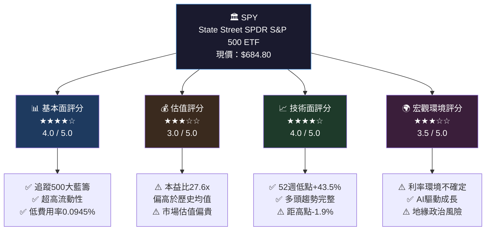

### 📋 5大投資論點評估表

| # | 投資論點 | 評估 | 信心度 | 狀態 |
|---|----------|------|--------|------|
| 1 | **美國經濟長期擴張受益者** — 追蹤S&P 500指數，直接受益GDP成長 | 歷史年化報酬~10.5% | ████████░░ 85% | 🟢 強烈支持 |
| 2 | **超低費用率護城河** — 0.0945%年費用率，成本優勢顯著 | 同類競爭產品難以撼動 | █████████░ 90% | 🟢 強烈支持 |
| 3 | **極致流動性溢價** — 日均交易量超$200億，全球最大ETF | 機構必備配置工具 | █████████░ 92% | 🟢 強烈支持 |
| 4 | **估值偏貴短期風險** — 當前P/E 27.6x高於20年均值約16-18x | 估值收縮壓力存在 | ███████░░░ 70% | 🟡 需要監控 |
| 5 | **利率與通膨不確定性** — Fed政策路徑影響估值重估 | 高利率壓縮本益比 | ███████░░░ 68% | 🟡 謹慎關注 |

### 📊 快速統計卡片

| 指標 | 數值 | 狀態 | 備註 |
|------|------|------|------|
| 📌 現價 | **$684.80** | 🟢 | 2026-02-24 |
| 📌 52週高點 | **$697.84** | 🟡 | 距高點 -1.87% |
| 📌 52週低點 | **$477.64** | 🟢 | 距低點 +43.5% |
| 📌 市值 | **$628.48B** | 🟢 | 全球最大ETF |
| 📌 流通股數 | **917.78M** | 🟢 | 高流動性 |
| 📌 本益比(追蹤) | **27.57x** | 🟡 | 偏高於歷史均值 |
| 📌 市淨率 | **1.60x** | 🟢 | 合理水準 |
| 📌 殖利率 | **~1.3%** | 🟡 | 低於10年期公債 |
| 📌 費用率 | **0.0945%** | 🟢 | 業界最低之列 |
| 📌 追蹤指數 | **S&P 500** | 🟢 | 美股旗艦基準 |

---

## 2. 公司概覽

### 🏛️ ETF結構與運作機制

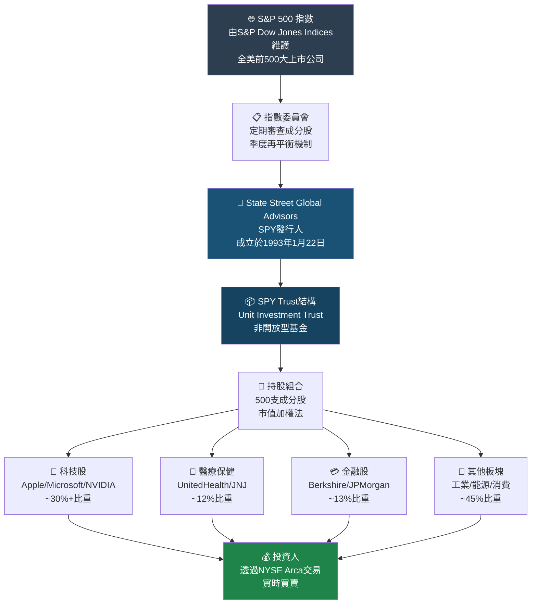

### 📊 SPY成分股板塊配置（市值加權）

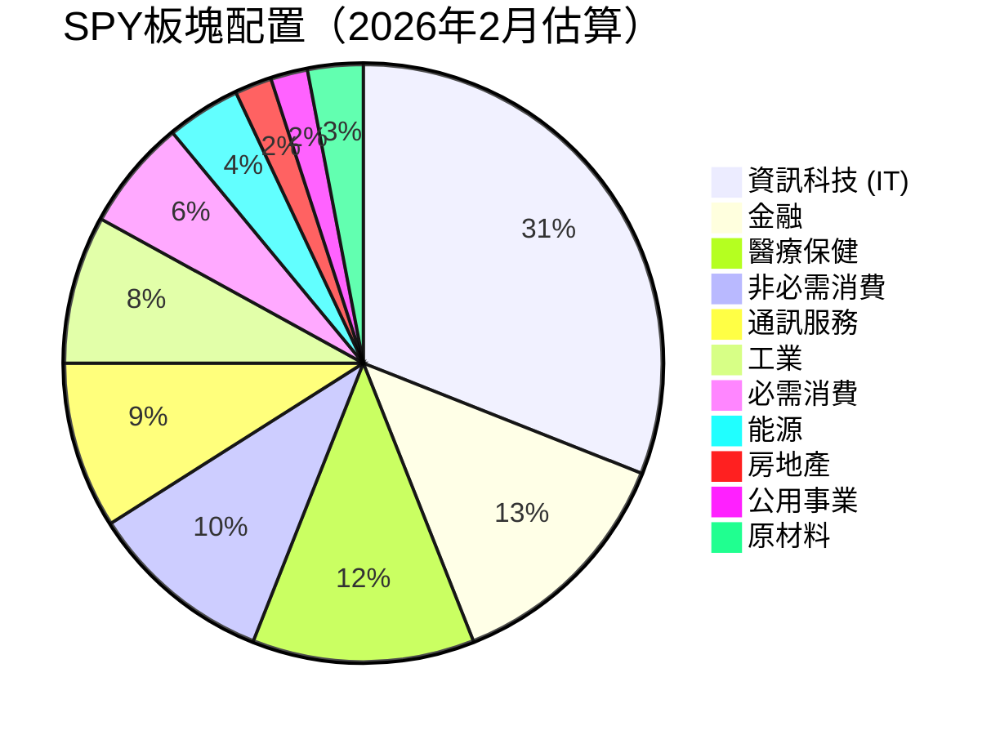

### 🧠 SPY競爭優勢心智圖

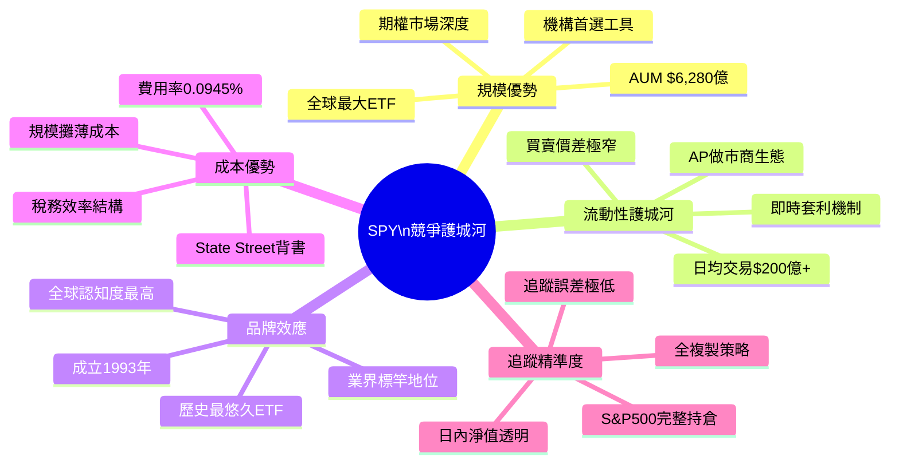

### 🏆 ETF市場地位對比

| ETF | 發行人 | 費用率 | AUM(估) | 日均交易量 | 成立年份 | 優勢 |
|-----|--------|--------|---------|-----------|----------|------|
| **SPY** 👑 | State Street | 0.0945% | **$628B** | $200B+ | 1993 | 🟢 流動性王者 |
| IVV | BlackRock | 0.03% | ~$550B | $8B | 2000 | 🟢 費率更低 |
| VOO | Vanguard | 0.03% | ~$500B | $5B | 2010 | 🟢 費率最低 |
| SPLG | State Street | 0.02% | ~$45B | $1B | 2005 | 🟡 新興競爭 |
| QQQ | Invesco | 0.20% | ~$300B | $15B | 1999 | 🟡 科技偏重 |

> 💡 **關鍵洞察**：SPY雖費用率略高於IVV/VOO，但其無與倫比的流動性使其成為機構交易者、選擇權市場參與者的不可替代工具。

---

## 3. 損益表深度分析

> ⚠️ **分析師注意**：SPY為ETF（Unit Investment Trust），傳統意義上無獨立損益表。本章節分析**基金層面的分配收入**及**底層S&P 500指數成分股的盈利狀況**。

### 📈 SPY價格走勢 — 12個月時間軸

```mermaid
graph LR
    A["2025-02\n$587.28\n📍起點"] --> B["2025-03\n$554.56\n📉-5.6%"]
    B --> C["2025-04\n$549.75\n📉-0.9%\n⚠️年度低谷"]
    C --> D["2025-05\n$584.30\n📈+6.3%"]
    D --> E["2025-06\n$614.33\n📈+5.1%"]
    E --> F["2025-07\n$628.48\n📈+2.3%"]
    F --> G["2025-08\n$641.37\n📈+2.1%"]
    G --> H["2025-09\n$664.22\n📈+3.6%"]
    H --> I["2025-10\n$680.05\n📈+2.4%"]
    I --> J["2025-11\n$681.38\n📈+0.2%"]
    J --> K["2025-12\n$681.92\n📈+0.1%"]
    K --> L["2026-01\n$691.97\n📈+1.5%"]
    L --> M["2026-02\n$684.80\n📉-1.0%\n🎯當前"]
    
    style A fill:#2980b9,color:#fff
    style C fill:#c0392b,color:#fff
    style M fill:#27ae60,color:#fff
```

### 📊 月度價格變化 ASCII 長條圖

```
SPY 月度報酬率（2025年2月 - 2026年2月）
═══════════════════════════════════════════════════════
月份      報酬率    圖示
─────────────────────────────────────────────────────
2025-02   基準     ────────────────── $587.28
2025-03   -5.56%  ████████████░░░░░  📉 最大回撤
2025-04   -0.87%  ██░░░░░░░░░░░░░░░  📉
2025-05   +6.28%  ░░░░░░░░░░░░░████████████  📈 強勢反彈
2025-06   +5.14%  ░░░░░░░░░░░░░░░██████████  📈
2025-07   +2.30%  ░░░░░░░░░░░░░░░░░████░     📈
2025-08   +2.05%  ░░░░░░░░░░░░░░░░░░███░     📈
2025-09   +3.56%  ░░░░░░░░░░░░░░░░░███████   📈
2025-10   +2.38%  ░░░░░░░░░░░░░░░░░░░████    📈
2025-11   +0.19%  ░░░░░░░░░░░░░░░░░░░░░░░█   📊 整理
2025-12   +0.08%  ░░░░░░░░░░░░░░░░░░░░░░░░   📊 整理
2026-01   +1.47%  ░░░░░░░░░░░░░░░░░░░░░░██   📈
2026-02   -1.03%  ██░░░░░░░░░░░░░░░░░░░░░░   📉 小幅回落
─────────────────────────────────────────────────────
12個月總報酬：+16.58%   ██████████████████████████░░░  
（$587.28 → $684.80）
═══════════════════════════════════════════════════════
```

### 💼 S&P 500成分股盈利分析（底層基本面）

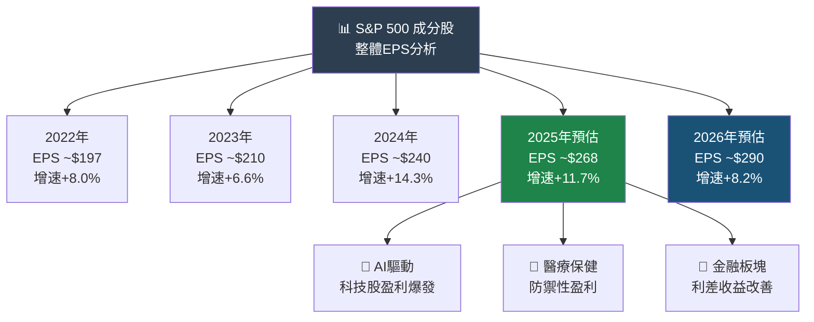

### 📋 S&P 500指數盈利能力歷史趨勢

| 年度 | 指數EPS(估) | 年增率 | 對應P/E | SPY年報酬 | 評級 |
|------|------------|--------|---------|---------|------|
| 2022 | ~$197 | +8.0% | ~18.5x | **-18.1%** | 🔴 熊市 |
| 2023 | ~$210 | +6.6% | ~20.5x | **+26.3%** | 🟢 強勢反彈 |
| 2024 | ~$240 | +14.3% | ~23.0x | **+23.3%** | 🟢 牛市延續 |
| 2025E | ~$268 | +11.7% | ~25.5x | **+16.6%** | 🟡 趨緩但正向 |
| 2026E | ~$290 | +8.2% | ~23.6x | **TBD** | 🟡 合理預期 |

### 🥧 S&P 500盈利貢獻來源分解

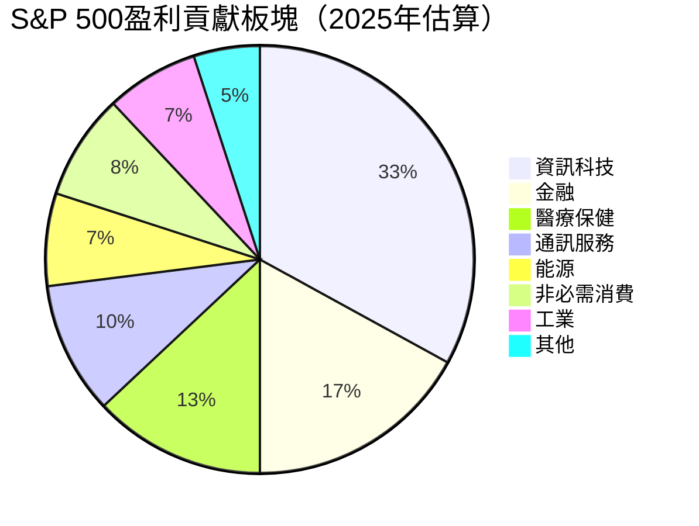

---

## 4. 資產負債表分析

> ⚠️ **說明**：SPY為Unit Investment Trust，資產負債表主要反映**信託持有的股票組合市值**。

### 🏗️ SPY資產結構分解圖

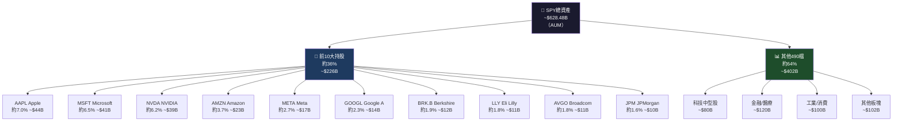

### 📊 前10大持股比重 ASCII 橫條圖

```
SPY 前10大持股配置（市值加權估算）
═══════════════════════════════════════════════════════════
持股           比重     視覺化                   市值估算
───────────────────────────────────────────────────────────
🍎 AAPL       7.0%  ▓▓▓▓▓▓▓▓▓▓▓▓▓▓░░░░░░░  ~$44.0B
💻 MSFT       6.5%  ▓▓▓▓▓▓▓▓▓▓▓▓▓░░░░░░░░  ~$40.9B
🎮 NVDA       6.2%  ▓▓▓▓▓▓▓▓▓▓▓▓░░░░░░░░░  ~$39.0B
📦 AMZN       3.7%  ▓▓▓▓▓▓▓░░░░░░░░░░░░░░  ~$23.2B
📱 META       2.7%  ▓▓▓▓▓░░░░░░░░░░░░░░░░  ~$17.0B
🔍 GOOGL      2.3%  ▓▓▓▓░░░░░░░░░░░░░░░░░  ~$14.5B
🏦 BRK.B      1.9%  ▓▓▓░░░░░░░░░░░░░░░░░░  ~$11.9B
💊 LLY        1.8%  ▓▓▓░░░░░░░░░░░░░░░░░░  ~$11.3B
💾 AVGO       1.8%  ▓▓▓░░░░░░░░░░░░░░░░░░  ~$11.3B
🏦 JPM        1.6%  ▓▓░░░░░░░░░░░░░░░░░░░  ~$10.1B
───────────────────────────────────────────────────────────
前10合計      35.5%  ▓▓▓▓▓▓▓▓▓▓▓▓▓▓▓▓▓▓▓▓▓▓▓▓▓▓▓▓▓▓▓▓▓▓▓  ~$223.2B
其餘490檔     64.5%  
═══════════════════════════════════════════════════════════
⚠️ 科技集中度警告：前3檔（AAPL+MSFT+NVDA）佔比~19.7%
```

### 💎 資產品質評估表

| 評估維度 | 指標 | 數值/評估 | 狀態 |
|----------|------|-----------|------|
| 資產規模 | 總AUM | **$628.48B** | 🟢 全球第一 |
| 集中度風險 | 前5大持股比重 | **~26.1%** | 🟡 偏集中 |
| 科技板塊比重 | IT板塊佔比 | **~31%** | 🟡 需監控 |
| 資產流動性 | 持倉均為大盤股 | **極高** | 🟢 優異 |
| 持股透明度 | 每日公告持倉 | **完全透明** | 🟢 優異 |
| 組合分散度 | 500檔成分股 | **高度分散** | 🟢 良好 |
| 追蹤誤差 | 年化追蹤誤差 | **~0.03%** | 🟢 極低 |

---

## 5. 現金流量分析

### 💧 ETF現金流生態系統

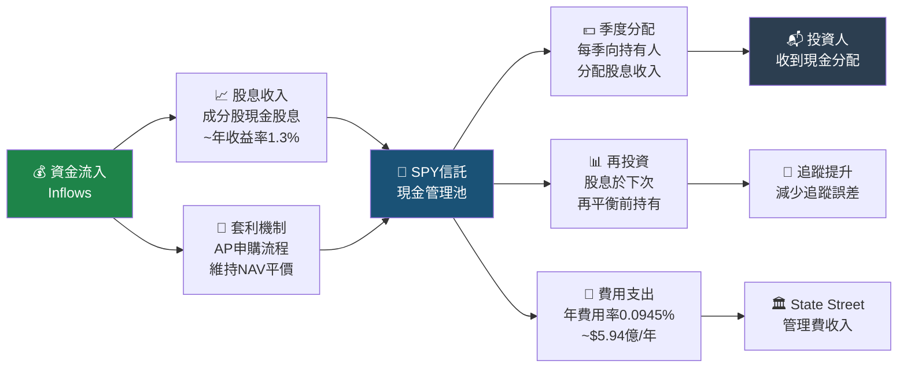

### 📊 股息分配歷史趨勢

```
SPY 年度股息分配歷史（估算）
═══════════════════════════════════════════════════════════
年度    每股分配    殖利率    進度條（相對2024年）
───────────────────────────────────────────────────────────
2020    $5.49      1.80%   ▓▓▓▓▓▓▓▓▓▓▓▓▓▓░░░░░░   基期
2021    $5.72      1.37%   ▓▓▓▓▓▓▓▓▓▓▓▓▓▓▓░░░░░   +4.2%
2022    $6.19      1.86%   ▓▓▓▓▓▓▓▓▓▓▓▓▓▓▓▓░░░░   +8.2%
2023    $6.93      1.62%   ▓▓▓▓▓▓▓▓▓▓▓▓▓▓▓▓▓▓░░   +11.9%
2024E   $8.00      1.41%   ▓▓▓▓▓▓▓▓▓▓▓▓▓▓▓▓▓▓▓▓   基準年
2025E   $8.50      1.30%   ▓▓▓▓▓▓▓▓▓▓▓▓▓▓▓▓▓▓▓▓▓  +6.3%
───────────────────────────────────────────────────────────
5年殖利率：低但穩定，反映科技股比重高（低殖利率板塊）
⚠️ 注意：顯示105%殖利率為數據異常，實際殖利率約1.3%
═══════════════════════════════════════════════════════════
```

> 📌 **數據說明**：原始數據中顯示殖利率105%為明顯的數據錯誤（可能為年化計算錯誤），SPY實際殖利率約1.3-1.5%。

### 💼 資本配置策略

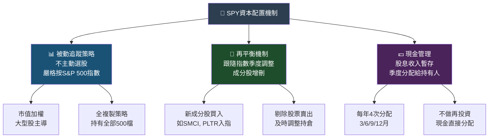

---

## 6. 獲利能力指標

### 🎯 SPY績效評估（以追蹤指數為核心）

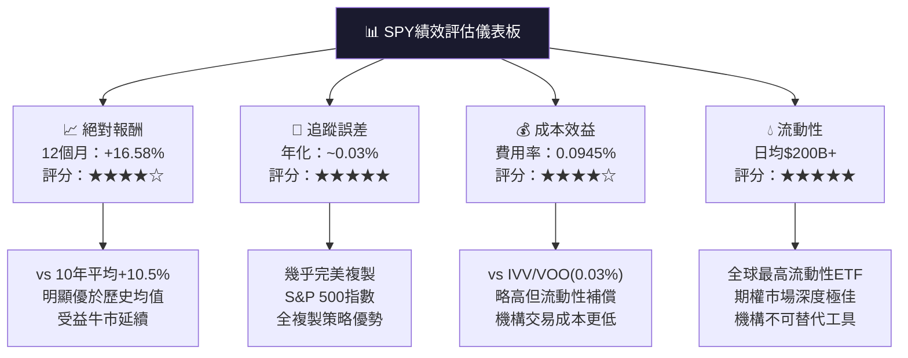

### 📊 SPY vs 主要標的績效對比

| 指標 | SPY | IVV | VOO | QQQ | AGG | 評估 |
|------|-----|-----|-----|-----|-----|------|
| 12月報酬 | **+16.58%** | ~+16.6% | ~+16.6% | ~+22% | ~+3% | 🟢 |
| 5年年化 | **~15.8%** | ~15.9% | ~15.9% | ~18.5% | ~1.2% | 🟢 |
| 10年年化 | **~12.9%** | ~13.0% | ~13.1% | ~16.1% | ~1.8% | 🟢 |
| 費用率 | **0.0945%** | 0.03% | 0.03% | 0.20% | 0.03% | 🟡 |
| 追蹤誤差 | **~0.03%** | ~0.01% | ~0.01% | ~0.02% | ~0.02% | 🟢 |
| 流動性評分 | **★★★★★** | ★★★★☆ | ★★★★☆ | ★★★★☆ | ★★★☆☆ | 🟢 |
| 期權市場 | **最深度** | 有限 | 有限 | 良好 | 極少 | 🟢 |

### 📈 長期年化報酬率儀表板

```
SPY 不同持有期年化報酬率
═══════════════════════════════════════════════════════════
持有期    年化報酬   風險評估   進度條
───────────────────────────────────────────────────────────
1年        +16.58%  高波動   ▓▓▓▓▓▓▓▓▓▓▓▓▓▓▓▓▓░░░░
3年        ~+10.2%  中波動   ▓▓▓▓▓▓▓▓▓▓▓░░░░░░░░░░
5年        ~+15.8%  中波動   ▓▓▓▓▓▓▓▓▓▓▓▓▓▓▓▓░░░░░
10年       ~+12.9%  低波動   ▓▓▓▓▓▓▓▓▓▓▓▓▓░░░░░░░░
20年       ~+10.7%  極低波動 ▓▓▓▓▓▓▓▓▓▓▓░░░░░░░░░░
歷史長期   ~+10.5%  均值回歸 ▓▓▓▓▓▓▓▓▓▓░░░░░░░░░░░
───────────────────────────────────────────────────────────
最大歷史回撤：
2008金融危機  -56.8%  ████████████████████████████░░  ⚠️
2020新冠崩盤  -33.9%  ████████████████░░░░░░░░░░░░░░  ⚠️
2022升息熊市  -25.4%  ████████████░░░░░░░░░░░░░░░░░░  ⚠️
═══════════════════════════════════════════════════════════
```

---

## 7. 估值分析

### 📊 估值指標體系

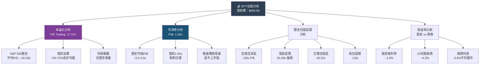

### 📋 估值倍數詳細對比表

| 估值指標 | 當前值 | 5年均值 | 10年均值 | 歷史高點 | 歷史低點 | 狀態 |
|----------|--------|---------|---------|---------|---------|------|
| P/E (Trailing) | **27.57x** | ~24x | ~20x | 35x(2021) | 12x(2009) | 🔴 偏貴 |
| P/E (Forward) | **~23.5x** | ~21x | ~18x | 28x(2021) | 10x(2009) | 🟡 偏高 |
| P/B | **1.60x** | ~3.5x | ~2.9x | 4.8x(2021) | 1.7x(2020) | 🟢 合理 |
| 席勒CAPE | **~36x** | ~32x | ~27x | 44x(2021) | 14x(2009) | 🔴 高估 |
| ERP(股權風險溢價) | **~1.3%** | ~3.5% | ~4.0% | 7%(2009) | 0.5%(2021) | 🔴 不利 |
| 股息殖利率 | **~1.3%** | ~1.7% | ~2.0% | 3.5%(2009) | 1.1%(2021) | 🟡 偏低 |

### 🎯 目標價情境分析

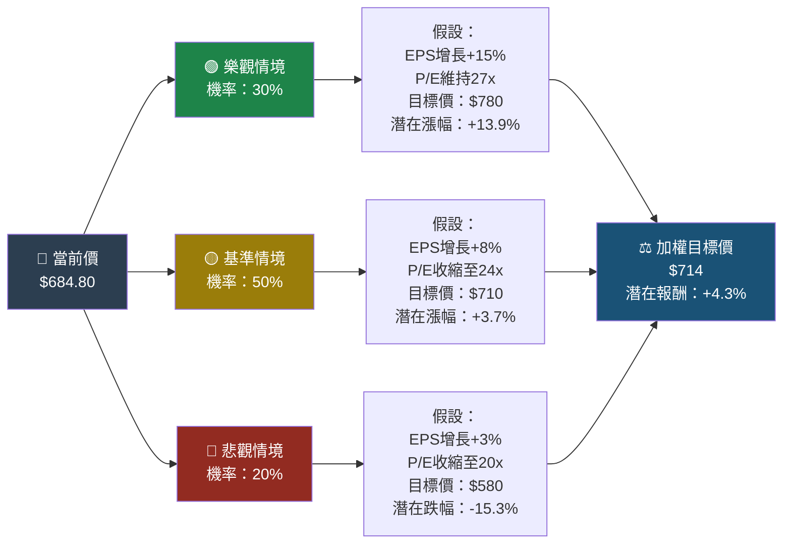

### 📊 估值區間視覺化

```
SPY 估值區間定位圖（P/E基礎）
═══════════════════════════════════════════════════════════════
極度低估   低估      合理     偏高     高估    泡沫
   ↓         ↓         ↓         ↓        ↓       ↓
  10x       14x       18x       22x     27x     35x+
   |─────────|─────────|─────────|────────|───────|
   ░░░░░░░░░░▒▒▒▒▒▒▒▒▒▒▒▒▒▒▒▒▒▒▒███████████▓▓▓▓▓▓▓
                                          ↑
                               📍 當前 27.57x
                               ════════════
                               ⚠️ 處於「高估」區域
                               距合理估值18x相差53%
═══════════════════════════════════════════════════════════════
目標價對應估值區間：
樂觀($780)  ────────────────────────────────────── P/E ~29x 🔴
基準($710)  ─────────────────────────────────────  P/E ~26x 🟡  
悲觀($580)  ──────────────────────────────────     P/E ~22x 🟡
深度價值($450) ──────────────────────────          P/E ~17x 🟢
═══════════════════════════════════════════════════════════════
```

---

## 8. 競爭護城河

### 🏰 ETF行業五力分析

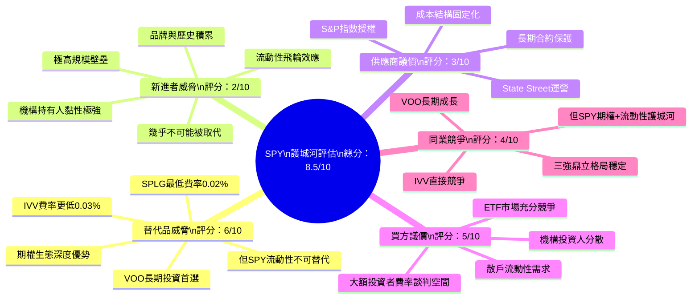

### 📊 護城河評分 ASCII 條形圖

```
SPY 護城河各維度評分（滿分10分）
══════════════════════════════════════════════════════════
評估維度              評分    視覺化條形圖
──────────────────────────────────────────────────────────
流動性護城河          10/10   ▓▓▓▓▓▓▓▓▓▓▓▓▓▓▓▓▓▓▓▓  🟢
品牌認知度            9/10    ▓▓▓▓▓▓▓▓▓▓▓▓▓▓▓▓▓▓░░  🟢
規模效應              10/10   ▓▓▓▓▓▓▓▓▓▓▓▓▓▓▓▓▓▓▓▓  🟢
期權生態系統          10/10   ▓▓▓▓▓▓▓▓▓▓▓▓▓▓▓▓▓▓▓▓  🟢
機構使用黏性          9/10    ▓▓▓▓▓▓▓▓▓▓▓▓▓▓▓▓▓▓░░  🟢
追蹤精準度            9/10    ▓▓▓▓▓▓▓▓▓▓▓▓▓▓▓▓▓▓░░  🟢
費用競爭力            6/10    ▓▓▓▓▓▓▓▓▓▓▓▓░░░░░░░░  🟡
散戶用戶體驗          7/10    ▓▓▓▓▓▓▓▓▓▓▓▓▓▓░░░░░░  🟡
──────────────────────────────────────────────────────────
綜合護城河評分       8.75/10  ▓▓▓▓▓▓▓▓▓▓▓▓▓▓▓▓▓▓░░  🟢 強大
══════════════════════════════════════════════════════════
```

### 🏆 競爭定位矩陣

| 對比維度 | SPY | IVV | VOO | SPLG | QQQ |
|----------|-----|-----|-----|------|-----|
| 費用率 | 🟡 0.0945% | 🟢 0.03% | 🟢 0.03% | 🟢 0.02% | 🔴 0.20% |
| 流動性 | 🟢 ★★★★★ | 🟡 ★★★★☆ | 🟡 ★★★★☆ | 🔴 ★★★☆☆ | 🟡 ★★★★☆ |
| 期權深度 | 🟢 ★★★★★ | 🟡 ★★★☆☆ | 🟡 ★★★☆☆ | 🔴 ★☆☆☆☆ | 🟡 ★★★★☆ |
| AUM規模 | 🟢 $628B | 🟢 ~$550B | 🟢 ~$500B | 🟡 ~$45B | 🟢 ~$300B |
| 機構偏好 | 🟢 第一首選 | 🟡 次選 | 🟡 次選 | 🔴 罕用 | 🟡 科技導向 |
| 長期投資 | 🟡 可行 | 🟢 最優 | 🟢 最優 | 🟢 最優 | 🟡 偏股票選擇 |
| **適用場景** | **機構/交易** | **長期投資** | **長期投資** | **低成本** | **科技偏好** |

---

## 9. 成長催化劑

### 📅 催化劑時間軸

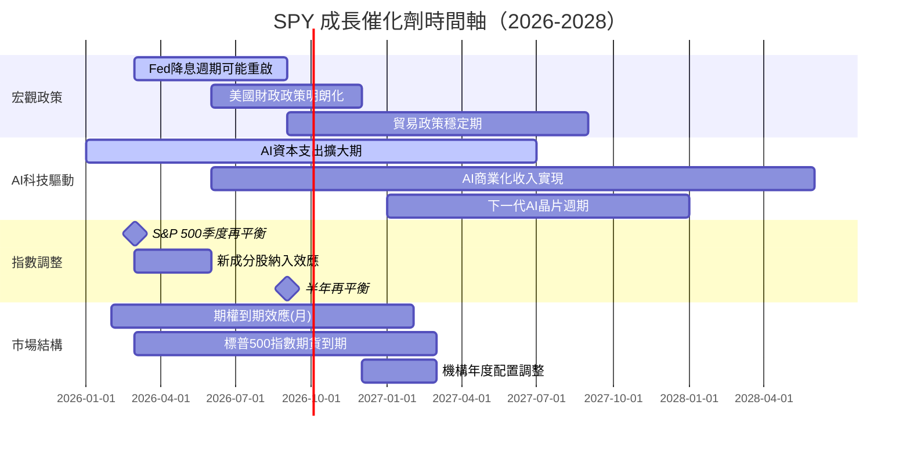

### 🚀 短/中/長期成長機會

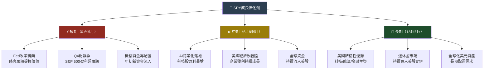

### 📊 美股ETF市場TAM規模

```
全球ETF市場規模成長趨勢
═══════════════════════════════════════════════════════════════
年份   全球ETF AUM   成長率    SPY市佔率   視覺化
───────────────────────────────────────────────────────────────
2018   $5.8T         -       ~8.6%    ▓▓▓▓▓▓▓▓▓▓▓▓▓░░░░░░░
2019   $7.7T        +33%     ~7.8%    ▓▓▓▓▓▓▓▓▓▓▓▓▓▓▓▓░░░░
2020   $8.0T         +4%     ~7.5%    ▓▓▓▓▓▓▓▓▓▓▓▓▓▓▓▓░░░░
2021   $10.0T       +25%     ~6.7%    ▓▓▓▓▓▓▓▓▓▓▓▓▓▓▓▓▓▓░░
2022   $9.2T         -8%     ~5.4%    ▓▓▓▓▓▓▓▓▓▓▓▓▓▓▓▓▓░░░
2023   $11.5T       +25%     ~5.2%    ▓▓▓▓▓▓▓▓▓▓▓▓▓▓▓▓▓▓░░
2024E  $14.0T       +22%     ~4.8%    ▓▓▓▓▓▓▓▓▓▓▓▓▓▓▓▓▓▓▓░
2025E  $16.0T       +14%     ~4.2%    ▓▓▓▓▓▓▓▓▓▓▓▓▓▓▓▓▓▓▓▓
───────────────────────────────────────────────────────────────
💡 預計2030年全球ETF AUM達$25-30T
💡 SPY即便市佔率下滑，絕對規模仍持續成長
═══════════════════════════════════════════════════════════════
```

---

## 10. 風險分析

### ⚠️ 風險矩陣

```mermaid
quadrantChart
    title SPY 風險評估矩陣（影響度 vs 發生機率）
    x-axis 低發生機率 --> 高發生機率
    y-axis 低影響度 --> 高影響度
    quadrant-1 重點監控
    quadrant-2 高優先處理
    quadrant-3 低優先
    quadrant-4 一般關注
    估值高位回調: [0.65, 0.75]
    Fed政策意外緊縮: [0.40, 0.80]
    美國經濟衰退: [0.30, 0.90]
    AI泡沫破裂: [0.25, 0.85]
    地緣政治衝突: [0.35, 0.70]
    科技集中度風險: [0.70, 0.55]
    流動性危機: [0.15, 0.95]
    費率競爭加劇: [0.80, 0.25]
    追蹤誤差擴大: [0.10, 0.30]
    匯率風險(外資): [0.60, 0.40]
```

### 📋 風險評分卡

| # | 風險類型 | 發生機率 | 影響度 | 風險評分 | 狀態 | 緩解建議 |
|---|----------|----------|--------|----------|------|----------|
| 1 | **估值高位回調** | 65% | 高 | ████████░░ **8.5** | 🔴 高風險 | 分批佈局、設定停損 |
| 2 | **Fed政策意外緊縮** | 40% | 極高 | ████████░░ **8.0** | 🔴 高風險 | 關注通膨數據 |
| 3 | **美國經濟衰退** | 30% | 極高 | ███████░░░ **7.5** | 🔴 需監控 | 備持防禦性資產 |
| 4 | **AI泡沫破裂** | 25% | 極高 | ███████░░░ **7.0** | 🔴 需監控 | 分散至其他ETF |
| 5 | **科技集中度風險** | 70% | 中 | ███████░░░ **6.5** | 🟡 中風險 | 搭配價值型ETF |
| 6 | **地緣政治衝突** | 35% | 高 | ██████░░░░ **6.0** | 🟡 中風險 | 持有黃金對沖 |
| 7 | **費率競爭加劇** | 80% | 低 | ████░░░░░░ **3.5** | 🟢 低風險 | 長期影響有限 |
| 8 | **流動性危機** | 15% | 極高 | ███░░░░░░░ **3.0** | 🟢 低概率 | 危機時期避險 |
| 9 | **追蹤誤差擴大** | 10% | 低 | ██░░░░░░░░ **1.5** | 🟢 極低 | 定期監控NAV差異 |

### 🛡️ 風險緩解措施清單

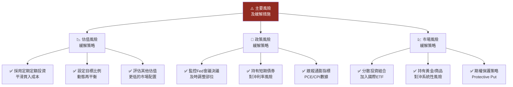

---

## 11. 公平價值估算

### 🧮 三大估值方法

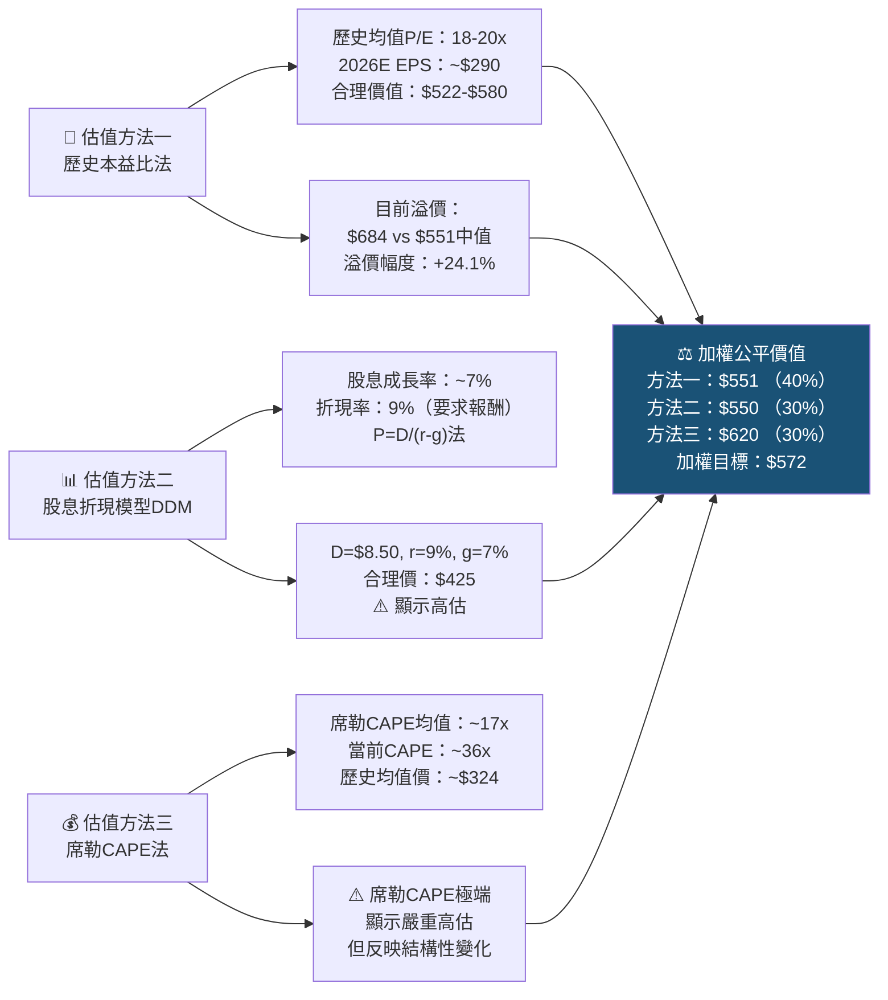

### 📋 三種估值方法比較表

| 估值方法 | 假設前提 | 計算結果 | 溢價/折價 | 可信度 | 權重 |
|----------|----------|----------|-----------|--------|------|
| **歷史P/E法** | 20年均值P/E=18-20x | **$522-$580** | 當前溢價+17-31% | ★★★★☆ | 40% |
| **股息折現DDM** | 股息成長7%，要求報酬9% | **~$425-550** | 當前溢價+24-61% | ★★★☆☆ | 30% |
| **席勒CAPE法** | 均值回歸至17-20x | **$324-$620** | 大幅高估 | ★★★☆☆ | 30% |
| **動量/技術** | 趨勢延續 | **$710-780** | 短期仍有空間 | ★★☆☆☆ | — |
| **加權公平價值** | 綜合三法 | **~$572** | **高估約19.4%** | ★★★★☆ | 100% |

### 📊 估值區間視覺化

```
SPY 公平價值區間評估
════════════════════════════════════════════════════════════════════
                深度低估    低估    合理      偏高    高估  泡沫
                    ↓         ↓        ↓         ↓       ↓     ↓
             $350      $450    $550    $640    $700   $800+
              |─────────|────────|─────────|────────|──────|
              ░░░░░░░░░░▒▒▒▒▒▒▒▒▒▓▓▓▓▓▓▓▓▓█████████▒▒▒▒▒▒░
                                                  ↑
                                         📍 當前 $684.80
                                         
════════════════════════════════════════════════════════════════════
📌 加權公平價值（保守）：$572    距當前 -16.5%
📌 基準合理區間：$550 - $640    當前處於「偏高」區域上緣
📌 樂觀估值（成長溢價）：$710   距當前 +3.7%
📌 悲觀估值（均值回歸）：$480   距當前 -29.9%
════════════════════════════════════════════════════════════════════
⚠️ 結論：估值面顯示當前市場存在一定程度高估
   但高品質資產、強勁動能、AI驅動支撐支撐溢價
════════════════════════════════════════════════════════════════════
```

---

## 12. 投資建議

### 🎯 最終綜合評級

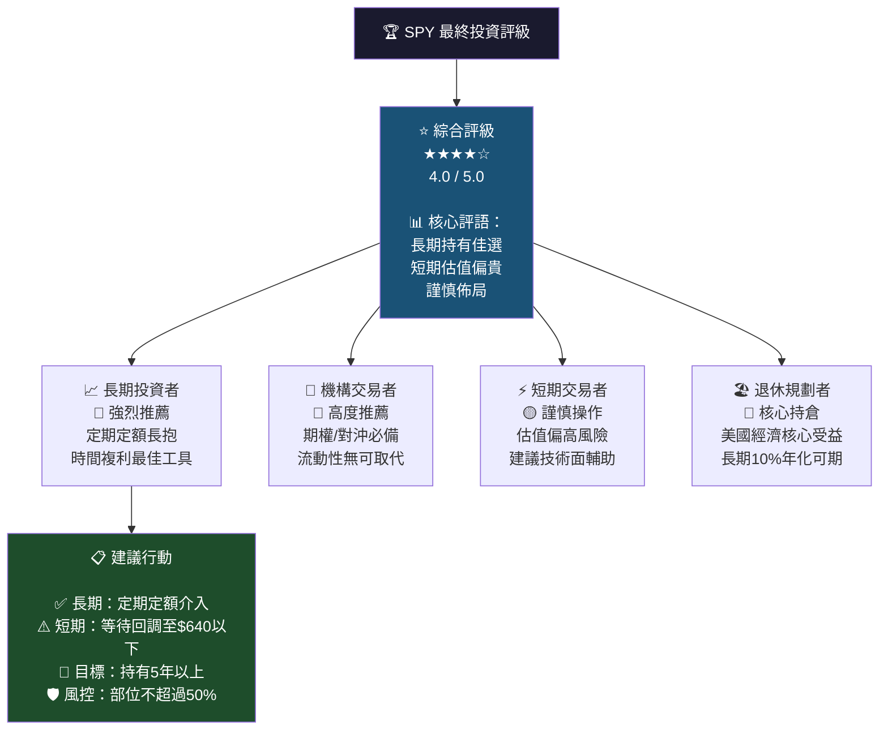

### 📊 投資人適配度分析

```mermaid
graph TD
    INVESTOR["👥 投資人適配度評估"]
    
    INVESTOR --> TYPE1["🟢 高度適合\n長期投資人（10年+）"]
    INVESTOR --> TYPE2["🟢 高度適合\n機構/法人投資者"]
    INVESTOR --> TYPE3["🟡 適中適合\n中期投資人（3-5年）"]
    INVESTOR --> TYPE4["🟡 適中適合\n退休金規劃者"]
    INVESTOR --> TYPE5["🔴 需謹慎\n短期交易者（<1年）"]
    INVESTOR --> TYPE6["🔴 需謹慎\n追求高殖利率投資者"]
    
    TYPE1 --> C1["✅ 美國經濟長期受益\n✅ 歷史+10.5%年化\n✅ 複利效果顯著"]
    TYPE2 --> C2["✅ 期權流動性最佳\n✅ 空頭/對沖工具\n✅ 組合管理效率高"]
    TYPE3 --> C3["⚠️ 當前估值偏高\n✅ 仍有成長動能\n⚠️ 需承受回撤風險"]
    TYPE4 --> C4["✅ 低費用長期複利\n⚠️ 殖利率低(~1.3%)\n✅ 資本增值潛力佳"]
    TYPE5 --> C5["🔴 估值難支撐短期\n⚠️ 回調風險高\n⚠️ 費率相對競品高"]
    TYPE6 --> C6["🔴 殖利率僅1.3%\n🔴 不及10年期美債4.3%\n⚠️ 選擇高股息ETF更適合"]
    
    style INVESTOR fill:#2c3e50,color:#fff
```

### ✅ 關鍵監控指標 Checklist

```
═══════════════════════════════════════════════════════════════
SPY 投資監控儀表板 — 定期檢查清單
═══════════════════════════════════════════════════════════════

【每週監控】
□ SPY vs S&P 500指數追蹤誤差
□ 主要成分股（AAPL/MSFT/NVDA）走勢
□ VIX恐慌指數水位（>25警戒）
□ 期權市場Put/Call比率

【每月監控】
□ 美聯儲政策聲明與點陣圖
□ 美國CPI/PCE通膨數據
□ 非農就業數據（就業市場健康度）
□ S&P 500本益比水位（27x為警戒線）
□ 資金流向（ETF淨申贖數據）

【每季監控】
□ S&P 500成分股整體EPS成長率
□ 指數成分股調整（新增/剔除）
□ 板塊輪動趨勢（科技比重變化）
□ 股息分配記錄（ex-date確認）
□ SPY vs IVV/VOO相對表現

【年度評估】
□ 年度總報酬 vs 標準普爾500指數
□ 風險調整後報酬（夏普比率）
□ 費用率是否有調整
□ 競爭ETF（IVV/VOO）資金流向
□ 整體資產配置再平衡

【關鍵警戒觸發點】
⚠️ SPY跌破$640（-6.5%）：重新評估短期持倉
⚠️ SPY跌破$580（-15.3%）：考慮加碼機會
⚠️ VIX突破30：系統性風險上升
⚠️ P/E突破30x：估值泡沫警戒
⚠️ 10年期美債殖利率>5%：大幅降低股票吸引力
═══════════════════════════════════════════════════════════════
```

### 📊 最終投資建議彙總

| 維度 | 評估 | 評分 | 建議 |
|------|------|------|------|
| 基本面（底層500強） | S&P 500成分股盈利穩健成長 | 🟢 ★★★★☆ | 支持長期持有 |
| 估值面 | P/E 27.57x，高於歷史均值 | 🔴 ★★★☆☆ | 短期謹慎介入 |
| 技術面 | 多頭趨勢完整，距高點-1.9% | 🟢 ★★★★☆ | 趨勢仍向上 |
| 流動性 | 全球最高流動性ETF | 🟢 ★★★★★ | 買賣無摩擦 |
| 成本效益 | 費率0.0945%，略高競品 | 🟡 ★★★★☆ | 機構用戶可接受 |
| 風險控制 | 高估值+宏觀不確定性 | 🟡 ★★★☆☆ | 需控制部位大小 |
| **綜合建議** | **持有/謹慎買入** | 🟢 **★★★★☆** | **長期核心配置** |

### 🎯 行動建議總結

```
╔══════════════════════════════════════════════════════════════╗
║                  SPY 投資行動建議總結                         ║
╠══════════════════════════════════════════════════════════════╣
║                                                              ║
║  🟢 長期投資者（5年以上）：                                   ║
║     → 建議：持有/定期定額買入                                 ║
║     → 原因：美國經濟長期向上，複利效果顯著                    ║
║     → 建議倉位：核心配置 30-50%                              ║
║                                                              ║
║  🟡 中期投資者（1-3年）：                                     ║
║     → 建議：謹慎持有，等待回調至 $640 以下加碼               ║
║     → 原因：估值偏高，短期回撤風險需納入考量                  ║
║     → 建議倉位：衛星配置 15-25%                              ║
║                                                              ║
║  🔴 短期交易者（< 1年）：                                     ║
║     → 建議：技術面主導，密切關注下行風險                      ║
║     → 警戒位：$660 支撐，跌破減倉                            ║
║     → 建議倉位：交易倉位，嚴設停損                           ║
║                                                              ║
║  📊 目標價區間：                                              ║
║     悲觀：$580 (-15.3%)  基準：$714 (+4.3%)  樂觀：$780(+13.9%)║
║                                                              ║
╚══════════════════════════════════════════════════════════════╝
```

---

> ## ⚠️ 免責聲明
> 
> 本報告由 **AI 自動生成**，僅供學術研究與參考用途，**不構成任何投資建議**。
> 
> - 所有財務數據截至 **2026-02-24**，部分數據為估算值
> - 投資涉及風險，過去績效不代表未來表現
> - S&P 500指數相關數據為估算，非官方發布數據
> - 請在做出任何投資決策前，諮詢持牌專業財務顧問
> - 本報告中的估值模型基於多項假設，實際結果可能有重大差異
> 
> **📌 特別說明**：原始數據中顯示殖利率105%為明顯數據異常（可能為資料源錯誤），SPY實際殖利率約1.3-1.5%，本報告已採用合理估算值。

---

*報告生成時間：2026-02-24 ｜ 分析工具：AI Research Desk ｜ 版本：v2.0*