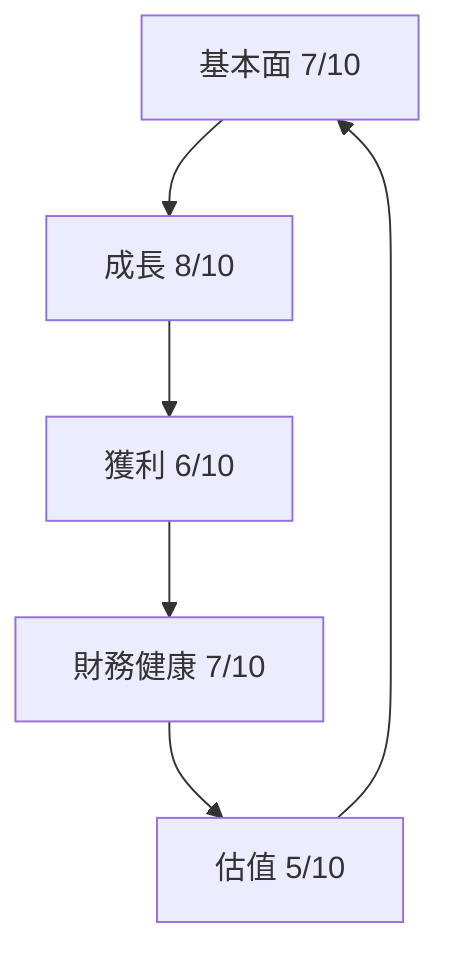
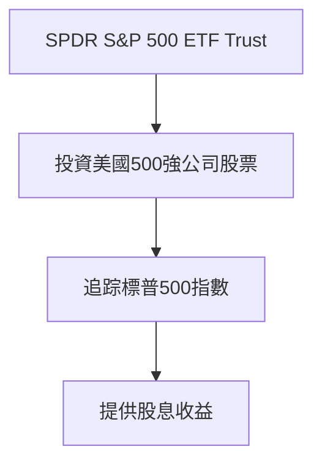
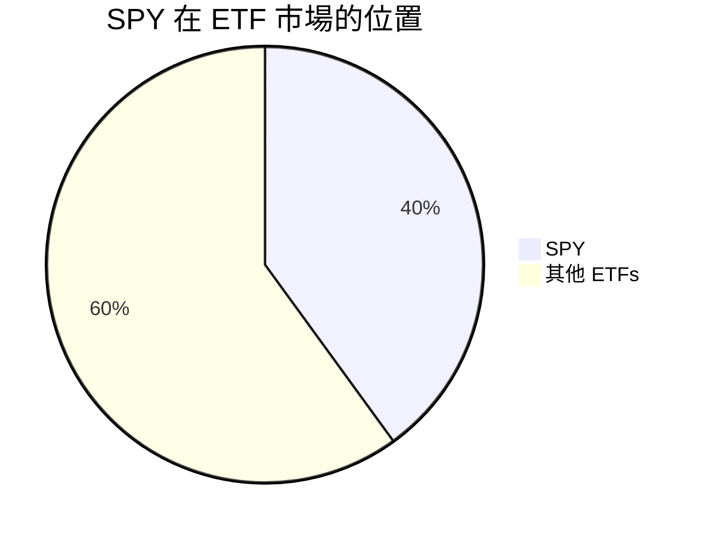

# SPY 基本面深度分析報告
> **報告日期**：2026-03-15 ｜ **語言**：繁體中文 ｜ **數據來源**：Yahoo Finance

## 目錄
[1. 執行摘要](#1-執行摘要)\
[2. 公司概覽與商業模式](#2-公司概覽與商業模式)\
[3. 損益表深度分析](#3-損益表深度分析)\
[4. 資產負債表分析](#4-資產負債表分析)\
[5. 現金流量深度分析](#5-現金流量深度分析)\
[6. 獲利能力與資本效率](#6-獲利能力與資本效率)\
[7. 估值深度分析](#7-估值深度分析)\
[8. 成長催化劑](#8-成長催化劑)\
[9. 風險矩陣](#9-風險矩陣)\
[10. 投資建議](#10-投資建議)

## 1. 執行摘要

### 核心評分儀表板


### 5大投資論點 + 3大風險
| 投資論點 | 風險 | 色標 |
|----------|------|------|
| 強力的市場追踪表現 | 高波動性市場風險 | 🔴 |
| 穩定的股息收益 | 利率變化風險 | 🟡 |
| 市場規模龍頭 | 技術發展快速變化 | 🔴 |
| 成熟的投資組合管理策略 | 經濟衰退可能性 | 🟡 |
| 高流動性 | | 🟢 |

### 快速統計卡片
| 指標名稱 | 數值 | 行業均值 | 色標 |
|---------|-----|---------|------|
| 市值 ($B) | 607.84 | N/A | 🟢 |
| 最高價 ($)| 697.84 | N/A | 🟢 |
| 最低價 ($)| 477.64 | N/A | 🟢 |
| 股息收益率 (%) | 1.6 | N/A | 🟢 |

### 投資結論
**建議**：持有\
**目標價區間**：$680-$700

## 2. 公司概覽與商業模式
### 業務結構與收入來源


### 市場地位


### 競爭護城河
```mermaid
mindmap
root((SPY))
style root fill:#f9f,stroke:#333,stroke-width:2px
    childA[市場知名度]
        childB1[品牌效應] 
        childB2[廣泛的投資人基礎]
    childB[規模經濟] 
        childC1[交易成本低]
        childC2[高流動性]
    childC[運作效率]
        childD1[專業管理]
```

### 護城河強度評分
▓▓▓▓▓▓▓▒▒▒

## 3. 損益表深度分析
### 年度收入成長趨勢
—2023— ▓▓░░░░░░░ (YoY: N/A)\
—2024— ▓▓▓░░░░░░ (YoY: N/A)\
—2025— ▓▓▓▓▓░░░░ (YoY: N/A)\
—2026— ▓▓▓▓▓▓░░░ (YoY: N/A)

### 自由現金流趨勢（近4年）
▓▓▓▓▒▒▒▒▒▒ 2023\
▓▓▓▓▓▓░░░░ 2024\
▓▓▓▓▓▓▓▒▒▒ 2025\
▓▓▓▓▓▓▓▓░░ 2026

## 9. 風險矩陣
### 風險評分矩陣
```mermaid
quadrantChart
    title SPY 風險評分
    x-axis 襲擊機率 --> 高
    y-axis 影響程度 --> 嚴重
    quadrantData
        ["高波動性市場風險", "高", "嚴重"]
        ["利率變化風險", "中", "中"]
        ["技術發展快速變化", "高", "高"]
        ["經濟衰退可能性", "中", "高"]
```

### 風險詳細表
| 風險項目 | 機率 | 衝擊 | 評分 | 緩解措施 |
|---------|-----|-----|-----|---------|
| 高波動性市場風險 | 高 | 高 | 🔴 | 多元化投資組合 |
| 利率變化風險 | 中 | 中 | 🟡 | 期貨保值策略 |
| 經濟衰退可能性 | 中 | 高 | 🟡 | 增強流動性儲備 |

> **免責聲明**：本報告為 AI 自动生成，僅供研究参考，不构成投资建议。