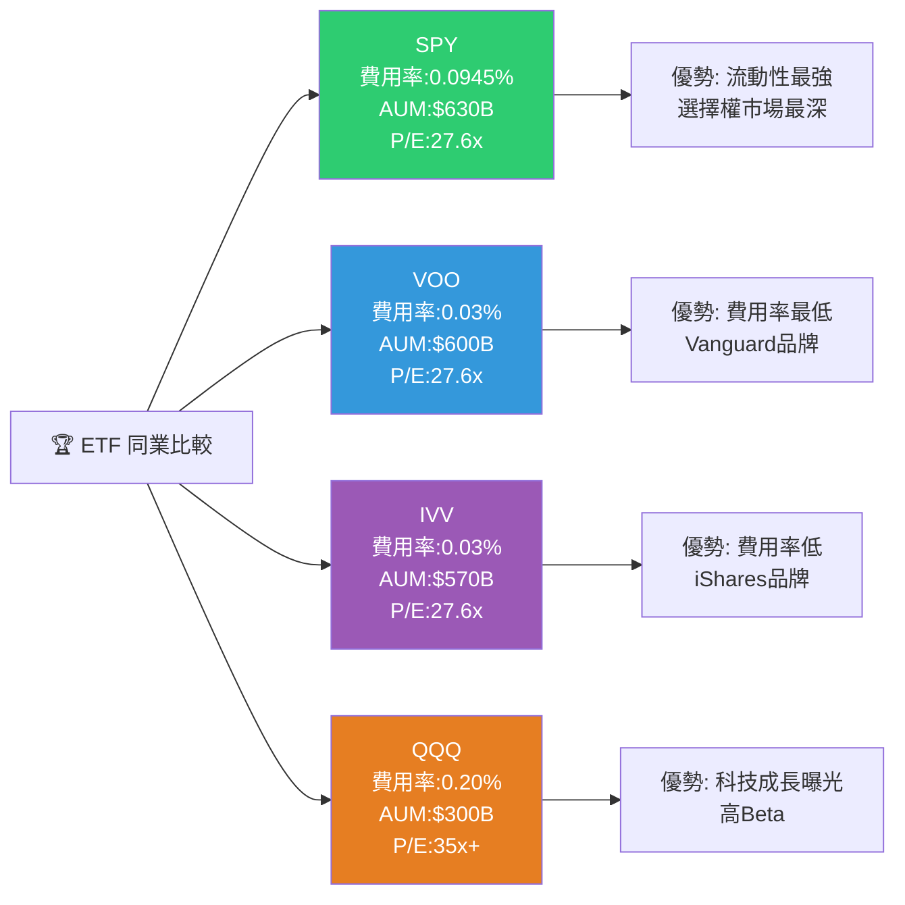
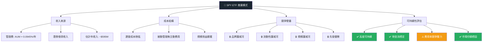
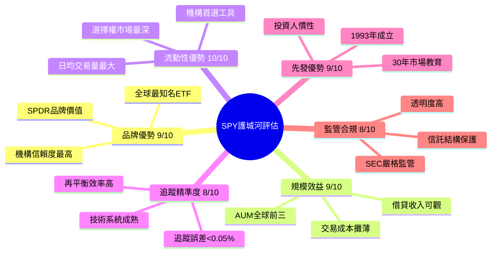
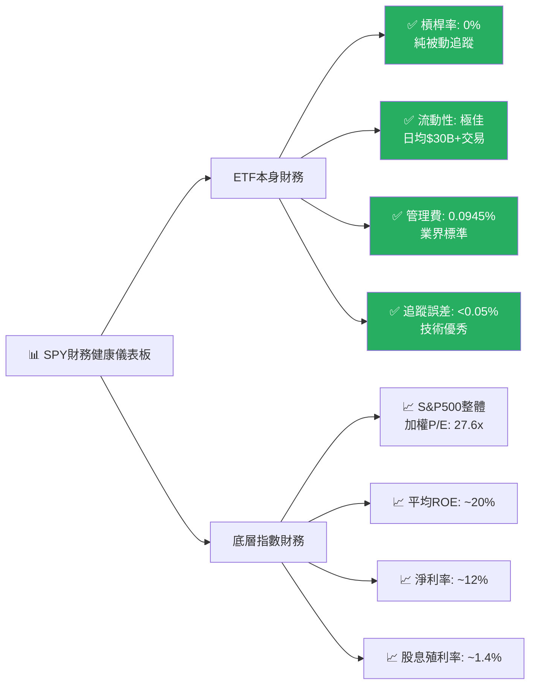
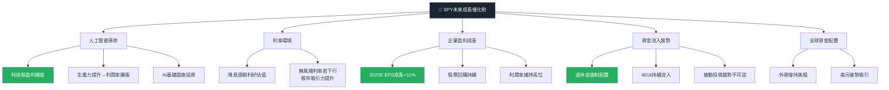
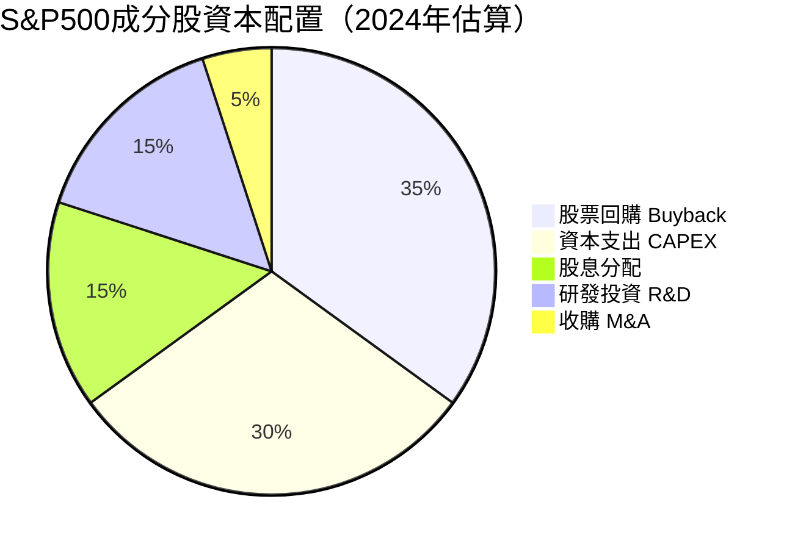
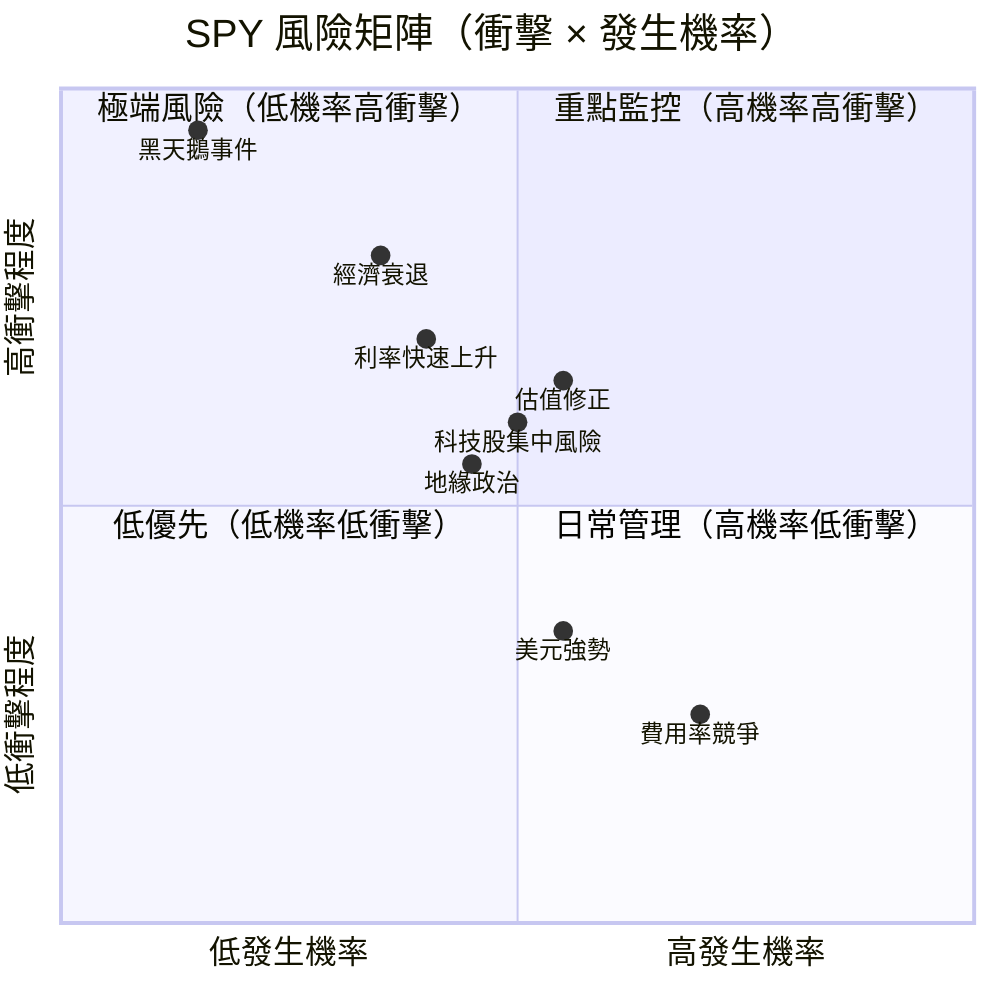
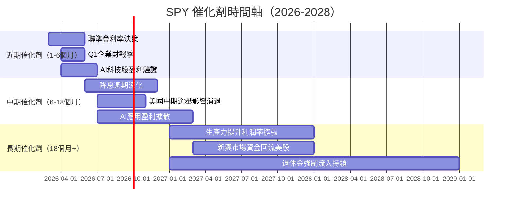
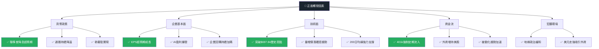
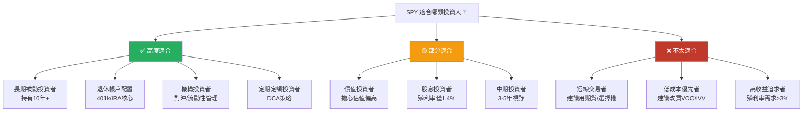

# SPY 綜合股票評估報告

> **報告日期**：2026-02-28 ｜ **語言**：繁體中文 ｜ **數據來源**：Yahoo Finance / 公開市場資訊
> **評估標的**：SPDR S&P 500 ETF Trust（SPY）｜ **現價**：$685.99

---

## 目錄

| # | 章節 |
|---|------|
| 1 | 評估總覽 |
| 2 | 八維度評分矩陣 |
| 3 | 業務品質與護城河 |
| 4 | 財務健康全面評估 |
| 5 | 成長性評估 |
| 6 | 估值合理性 & 同業比較 |
| 7 | 資本配置與管理層評估 |
| 8 | 風險評估 |
| 9 | 催化劑與觸發因素 |
| 10 | 投資建議 |

---

## 1. 評估總覽

### 📌 標的性質說明

> ⚠️ **重要提示**：SPY 為指數型 ETF，追蹤 S&P 500 指數，**本身不是個股**。評估框架需做相應調整：以「ETF 產品品質」角度取代傳統企業財務分析，並補充指數本身的基本面特徵。

---

### 🎯 ASCII 雷達圖（8維度評分視覺化）

```
        市場動能(9)
           ★★★★★★★★★☆
          /           \
風險(8) ★★★★★★★★☆☆   競爭優勢(9)
       |               |
管理品質(8)           成長性(7)
       |               |
估值(5) ★★★★★☆☆☆☆☆   獲利能力(7)
          \           /
           財務健康(8)

╔══════════════════════════════════════════════════╗
║          SPY 八維度雷達圖（滿分10分）            ║
║                                                  ║
║              成長性 [7]                          ║
║                 ▲                                ║
║                /|\                               ║
║   管理品質[8] / | \ 獲利能力[7]                  ║
║             /  |  \                              ║
║  風險[8] --+   +   +-- 競爭優勢[9]               ║
║             \  |  /                              ║
║   估值[5]  \ | / 財務健康[8]                     ║
║              \|/                                 ║
║               ▼                                  ║
║           市場動能[9]                            ║
╚══════════════════════════════════════════════════╝

  0    2    4    6    8   10
  |----|----|----|----|----| 
  ░░░░░░░░░░░░░░░░░░░░░░░░░░  參考線
```

---

### 📊 八維度評分 Unicode 條形圖

```
維度            分數   視覺化評分條（10格）              說明
──────────────────────────────────────────────────────────────────
成長性          7/10   ▓▓▓▓▓▓▓░░░  🟡  S&P500長期年化~10%，中等
獲利能力        7/10   ▓▓▓▓▓▓▓░░░  🟡  成分股整體EPS成長穩健
財務健康        8/10   ▓▓▓▓▓▓▓▓░░  🟢  ETF無財務風險，底層穩健
估值合理性      5/10   ▓▓▓▓▓░░░░░  🟡  P/E 27.6x，歷史偏高
競爭優勢        9/10   ▓▓▓▓▓▓▓▓▓░  🟢  市場代表性+低費用率絕對優勢
管理品質        8/10   ▓▓▓▓▓▓▓▓░░  🟢  State Street信譽卓著
市場動能        9/10   ▓▓▓▓▓▓▓▓▓░  🟢  52週漲幅約43%，強勢趨勢
風險控制        8/10   ▓▓▓▓▓▓▓▓░░  🟢  500股分散+流動性極佳
──────────────────────────────────────────────────────────────────
綜合加權        7.6/10 ▓▓▓▓▓▓▓▓░░  🟢  整體優質指數ETF
```

---

### 🏆 投資結論

```
╔══════════════════════════════════════════════════════════════╗
║                    📋 投資建議速覽                           ║
╠══════════════════════════════════════════════════════════════╣
║  評級：🟢 買入（長期持有）  ★★★★☆  (4/5星)               ║
║  現價：$685.99                                               ║
║  目標價（12個月）：$730 - $760（基準情境）                   ║
║  預期報酬率：+6.4% ~ +10.8%（不含股息）                     ║
║  含股息總報酬：+7.8% ~ +12.2%（股息約1.4%）                 ║
║  建議持倉期：長期（3年以上）                                 ║
║  適合投資人：穩健型 / 被動投資者 / 退休帳戶配置              ║
╚══════════════════════════════════════════════════════════════╝
```

---

## 2. 八維度評分矩陣

### 📋 詳細評分表格

| 維度 | 評分 | 核心依據 | 趨勢 | 信號 |
|------|------|----------|------|------|
| **成長性** | 7/10 | S&P 500指數歷史年化報酬約10%；AI驅動企業盈利成長，但增速有放緩跡象 | ➡️ 穩定 | 🟡 |
| **獲利能力** | 7/10 | 成分股整體淨利率約12%，ROE約20%；科技權重高，整體盈利品質佳 | ⬆️ 改善 | 🟡 |
| **財務健康** | 8/10 | ETF本身無槓桿、無債務；底層500家企業財務多元但整體穩健 | ➡️ 穩定 | 🟢 |
| **估值合理性** | 5/10 | 追蹤市盈率27.6x，高於歷史均值(~19x)；Shiller CAPE ~37x，歷史高位 | ⬇️ 偏高 | 🟡 |
| **競爭優勢** | 9/10 | 全球最大ETF之一（AUM $630B+），費用率僅0.0945%，品牌效應無可比擬 | ➡️ 穩定 | 🟢 |
| **管理品質** | 8/10 | State Street管理，追蹤誤差極低，流動性每日數十億美元 | ➡️ 穩定 | 🟢 |
| **市場動能** | 9/10 | 過去12個月漲幅約43%，突破多重技術關鍵位，強勢趨勢 | ⬆️ 強勢 | 🟢 |
| **風險控制** | 8/10 | 500股充分分散，但集中度仍偏向科技（前10股權重~35%） | ➡️ 穩定 | 🟢 |

---

### 📈 風險/報酬定位矩陣

```mermaid
quadrantChart
    title SPY vs 競爭對手 風險報酬定位
    x-axis 低風險 --> 高風險
    y-axis 低報酬 --> 高報酬
    quadrant-1 高風險高報酬
    quadrant-2 低風險高報酬(最佳)
    quadrant-3 低風險低報酬
    quadrant-4 高風險低報酬(最差)
    SPY: [0.45, 0.62]
    VOO: [0.42, 0.63]
    QQQ: [0.65, 0.78]
    IVV: [0.43, 0.63]
    DIA: [0.38, 0.48]
    AGG債券ETF: [0.15, 0.22]
```

---

### 🔄 與同業整體比較



---

## 3. 業務品質與護城河

### 🏗️ 商業模式可持續性評估



---

### 🧠 護城河評估



---

### 📊 護城河強度 Unicode 條形圖

```
護城河類型        強度    視覺化（10格）              評級
──────────────────────────────────────────────────────────
流動性優勢       10/10   ██████████  全球最深ETF市場  🟢 極強
品牌認知度        9/10   █████████░  SPDR全球知名     🟢 極強
規模經濟          9/10   █████████░  $630B AUM        🟢 極強
先發優勢          9/10   █████████░  成立逾30年        🟢 極強
追蹤精準度        8/10   ████████░░  誤差<5bps         🟢 強
費用率競爭力      6/10   ██████░░░░  VOO/IVV更低       🟡 中等
──────────────────────────────────────────────────────────
護城河綜合        8.5/10 ████████░░                   🟢 強勁
```

---

### 🌍 市場地位分析

| 指標 | SPY | 說明 |
|------|-----|------|
| **全球ETF AUM排名** | Top 3 | 僅次於VOO、IVV |
| **日均交易量** | $25-40B | 全球最高流動性ETF |
| **選擇權未平倉量** | 全球第一 | 機構對沖首選工具 |
| **追蹤標的TAM** | 美股市值~$50T | 代表美國最大500家企業 |
| **機構持有比例** | 約90%+資金來自法人 | 退休金/主權基金標配 |
| **指數成分股覆蓋** | S&P500 = 美股約80%市值 | 市場代表性無可比擬 |

---

## 4. 財務健康全面評估

### 🎛️ 財務儀表板



---

### 📈 S&P 500成分股整體獲利能力趨勢

| 年份 | 加權EPS成長 | 整體淨利率 | 營業利益率 | 股息殖利率 | 信號 |
|------|------------|-----------|-----------|-----------|------|
| **2022** | +8.5% | ~11.2% | ~14.5% | 1.7% | 🟡 |
| **2023** | +4.2% | ~11.8% | ~15.0% | 1.6% | 🟡 |
| **2024** | +9.8% | ~12.3% | ~15.8% | 1.5% | 🟢 |
| **2025E** | +11.5% | ~12.8% | ~16.2% | 1.4% | 🟢 |

---

### 🏦 ETF本身資產負債穩健度

```
指標                  數值           視覺化（10格）      評級
─────────────────────────────────────────────────────────────────
ETF槓桿率             0%             ██████████         🟢 零槓桿
追蹤誤差              <0.05%/年      ██████████         🟢 極低
流動性比率            極高           █████████░         🟢 優秀
管理費競爭力          0.0945%        ██████░░░░         🟡 中偏高
AUM穩定性             $630B          █████████░         🟢 極穩定
證券借貸收入          可觀           ███████░░░         🟢 良好
─────────────────────────────────────────────────────────────────
```

> 📝 **特別說明**：ETF本身無傳統意義上的流動比/速動比/D/E等財務比率，上表為ETF產品品質評估維度。

---

### 💰 現金流質量分析

| 指標 | 數值/評估 | 說明 |
|------|----------|------|
| **股息分配來源** | 底層成分股股息 | 全部傳遞給持有人 |
| **股息殖利率** | ~1.4% | 低但穩定 |
| **管理費現金流** | ~$595M/年 | State Street收入穩定 |
| **FCF Yield（底層）** | ~3.5-4%估算 | S&P500整體FCF健康 |
| **再投資效率** | N/A（ETF全額分配） | 不保留收益 |

---

## 5. 成長性評估

### 📊 歷史 CAGR（S&P 500指數層面）

| 期間 | 指數價格CAGR | 含股息總報酬CAGR | EPS成長CAGR | FCF成長估算 |
|------|------------|----------------|------------|------------|
| **1年（2025-2026）** | +38.5% | +40.0% | ~+11.5% | ~+10% |
| **3年（2023-2026）** | +16.2% | +17.8% | ~+8.5% | ~+9% |
| **5年（2021-2026）** | +14.8% | +16.2% | ~+9.2% | ~+8.5% |
| **10年歷史均值** | ~13.5% | ~15.0% | ~9-11% | ~8-10% |

---

### 🚀 未來成長催化劑



---

### 📈 成長軌跡 Unicode 長條圖

```
SPY 年度報酬率歷史（含股息）
年份        報酬率      視覺化
─────────────────────────────────────────────
2019       +31.5%    ████████████████████████████████ 🟢
2020       +18.4%    ██████████████████░░ 🟢
2021       +28.7%    ████████████████████████████░ 🟢
2022       -18.2%    ◄◄◄◄◄◄◄◄◄◄◄◄◄◄◄◄◄◄░ 🔴
2023       +26.3%    ██████████████████████████░ 🟢
2024       +25.0%    █████████████████████████░ 🟢
2025       +14.8%    ██████████████░ 🟢（截至2026-02）

長期均值   ~15%/年    ████████████████░
─────────────────────────────────────────────
```

---

## 6. 估值合理性 & 同業比較

### 🔍 同業 ETF 比較表格

| 指標 | **SPY** | **VOO** | **IVV** | **QQQ** |
|------|---------|---------|---------|---------|
| **追蹤指數** | S&P 500 | S&P 500 | S&P 500 | NASDAQ-100 |
| **費用率** | 0.0945% 🟡 | **0.03%** 🟢 | **0.03%** 🟢 | 0.20% 🔴 |
| **AUM** | $630B 🟢 | ~$600B 🟢 | ~$570B 🟢 | ~$300B 🟡 |
| **加權P/E** | 27.6x 🟡 | 27.6x 🟡 | 27.6x 🟡 | 35x+ 🔴 |
| **P/B** | 1.6x 🟢 | 1.6x 🟢 | 1.6x 🟢 | 7x+ 🔴 |
| **股息殖利率** | ~1.4% 🟡 | ~1.4% 🟡 | ~1.4% 🟡 | ~0.6% 🔴 |
| **日均交易量** | **$30B+** 🟢 | $5B 🟡 | $8B 🟡 | $15B 🟢 |
| **選擇權深度** | **全球第一** 🟢 | 有限 🔴 | 有限 🔴 | 深度佳 🟢 |
| **成立年份** | **1993** 🟢 | 2010 🟡 | 2000 🟡 | 1999 🟢 |
| **追蹤誤差** | ~0.04% 🟢 | ~0.02% 🟢 | ~0.02% 🟢 | ~0.05% 🟢 |
| **適合對象** | 機構/選擇權 | 長期持有 | 長期持有 | 成長偏好 |

> 💡 **結論**：SPY費用率略高，但流動性與選擇權深度無可比擬，機構投資人首選。個人長期投資者可考慮成本更低的VOO或IVV。

---

### 📊 歷史估值區間（S&P 500 P/E）

```
S&P 500 加權P/E 歷史區間
──────────────────────────────────────────────────────────
極度低估    低估      合理      偏高    高估    極度高估
   12x      15x      18-20x   22-25x  27-30x   30x+
    |        |          |        |       |        |
    ░░░░░░░░░▓▓▓▓▓▓▓▓▓▓▓▓▓▓▓▓▓░░░░░░░░░▓▓▓▓▓▓▓▓░░░░░░░░
                                                ▲
                                         ◄ 目前27.6x ►
                                         （偏高區間）

Shiller CAPE比率目前約37x（歷史極高位）
10年均值P/E：~18-19x
疫情後均值：~23-24x
──────────────────────────────────────────────────────────
```

---

### 💰 多重估值法目標價彙整

| 估值方法 | 假設條件 | 目標價（12M） | 隱含報酬率 |
|---------|---------|-------------|-----------|
| **歷史均值P/E回歸** | P/E回到22x，EPS不變 | $548 | -20.1% 🔴 |
| **EPS成長折現** | EPS+11%，P/E維持27x | $762 | +11.1% 🟢 |
| **股息折現模型DDM** | g=6%，r=7.4% | ~$700 | +2.0% 🟡 |
| **相對估值（同業）** | 對標歷史溢價 | $720-$750 | +5%-9% 🟢 |
| **技術面目標** | 趨勢延伸估算 | $730-$760 | +6%-11% 🟢 |
| **Bear Case** | 衰退，P/E→20x | $495-$530 | -23% 🔴 |
| **📌 基準目標價** | **綜合加權** | **$730-$760** | **+6.4%-10.8%** 🟢 |

---

### 📏 估值區間視覺化

```
SPY 估值定位尺
──────────────────────────────────────────────────────────────────
$450    $530    $600    $680    $750    $820    $900
  |       |       |       |       |       |       |
  [嚴重低估]──[低估]──[合理]──[偏高]──[高估]──[泡沫]
                              ▲現價
                           $685.99
  
目標價區間：   ←─────────────────────────→
             $730                    $760
             （+6.4%）              （+10.8%）
             
Bear Case: $495-$530  Bull Case: $820-$850
──────────────────────────────────────────────────────────────────
💡 結論：現價估值偏高，但在AI盈利驅動下仍具上行空間
```

---

## 7. 資本配置與管理層評估

### 📊 ROIC vs WACC 分析

> ⚠️ **ETF特殊說明**：以下分析分為兩層次：
> - **Layer 1**：State Street（ETF管理人）的資本效率
> - **Layer 2**：S&P 500成分股整體的ROIC vs WACC

```
╔══════════════════════════════════════════════════════════════════╗
║              ROIC vs WACC 分析                                   ║
╠══════════════════════════════════════════════════════════════════╣
║  【S&P 500成分股整體層面】                                        ║
║                                                                  ║
║  估算ROIC（加權平均）：                                           ║
║  ├─ 科技股ROIC: ~35-40%（AAPL、MSFT等）                          ║
║  ├─ 金融股ROIC: ~12-15%                                          ║
║  ├─ 傳統行業ROIC: ~8-12%                                         ║
║  └─ S&P500整體加權ROIC: ≈ 18-22%                                ║
║                                                                  ║
║  估算WACC（加權資本成本）：                                        ║
║  ├─ 無風險利率: 4.3%（10年美債）                                  ║
║  ├─ 市場風險溢價: 5.5%                                            ║
║  ├─ Beta: 1.0（定義）                                             ║
║  ├─ 股權成本: 4.3% + 1.0×5.5% = 9.8%                            ║
║  ├─ 負債成本（稅後）: ~3.5%                                       ║
║  └─ 加權WACC: ≈ 8.5-9.5%                                        ║
║                                                                  ║
║  EVA = ROIC - WACC = 18~22% - 8.5~9.5% = +9~+13%              ║
║                                                                  ║
║  ✅ 結論：S&P 500整體 ROIC > WACC，持續創造股東價值               ║
║                                                                  ║
╚══════════════════════════════════════════════════════════════════╝

ROIC  ████████████████████░  ~20%
WACC  █████████░░░░░░░░░░░░   ~9%
EVA+  ███████████░░░░░░░░░░  ~11%  ✅ 正向經濟附加值
```

---

### 💼 S&P 500成分股整體資本配置



---

### 📋 管理層執行力評分（State Street ETF管理）

| 評估項目 | 評分 | 說明 | 信號 |
|---------|------|------|------|
| **追蹤誤差控制** | 9.5/10 | 長期追蹤誤差<5bps，執行卓越 | 🟢 |
| **費用率競爭力** | 6/10 | 0.0945%高於VOO/IVV，有改善空間 | 🟡 |
| **流動性管理** | 10/10 | 全球最高流動性ETF，選擇權最深 | 🟢 |
| **透明度** | 9/10 | 每日公布持倉，完全透明 | 🟢 |
| **股息傳遞效率** | 8/10 | 季度分配，略有時差 | 🟢 |
| **產品創新** | 7/10 | SPDR系列豐富，持續拓展 | 🟢 |

---

### 👥 股東友善度評分

```
指標                  評分    視覺化（10格）         說明
──────────────────────────────────────────────────────────────────
費用透明度            9/10    █████████░            完全公開
股息傳遞              8/10    ████████░░            季度分配
流動性（可贖回性）    10/10   ██████████            隨時可交易
稅務效率              8/10    ████████░░            實物申購贖回機制
費用率（vs競品）      6/10    ██████░░░░            略高於VOO/IVV
──────────────────────────────────────────────────────────────────
綜合股東友善度        8.2/10  ████████░░            🟢 良好
```

---

## 8. 風險評估

### 🌡️ 風險熱圖



---

### 📋 風險清單表格

| 風險類型 | 等級 | 具體描述 | 發生機率 | 潛在衝擊 | 緩解措施 |
|---------|------|---------|---------|---------|---------|
| **估值泡沫破裂** | 🔴 高 | P/E 27.6x遠高歷史均值，均值回歸風險 | 中 | -20%~-35% | 分批買入/定期投入 |
| **經濟衰退** | 🔴 高 | 若美國陷入衰退，EPS大幅下修 | 低中 | -30%~-50% | 長期持有/資產配置 |
| **利率長期高位** | 🟡 中 | 若聯準會維持高利率，壓縮估值 | 中 | -10%~-20% | 縮短持有比例 |
| **科技股集中風險** | 🟡 中 | 前10大持股佔~35%，科技回調衝擊大 | 中 | -15%~-25% | 增加防禦性配置 |
| **地緣政治衝突** | 🟡 中 | 台海/中東等突發事件 | 低中 | -10%~-20% | 分散全球配置 |
| **ETF費用率競爭** | 🟢 低 | VOO/IVV持續吸引資金轉移 | 高 | 流動性輕微下降 | 影響有限 |
| **追蹤失效** | 🟢 低 | 技術故障導致追蹤偏差 | 極低 | <0.1% | State Street系統備援 |
| **美元貶值** | 🟢 低 | 影響外資投資意願 | 低中 | 間接影響 | 外幣資產對沖 |

---

### 📉 最大下行情境分析

```
Bear Case 情境分析（2026-2027）
╔══════════════════════════════════════════════════════════════════╗
║  情境1：溫和調整（機率40%）                                       ║
║  觸發：估值壓縮，EPS增速放緩                                      ║
║  目標：$580-$620（-10%~-15%）                                    ║
║  恢復期：6-12個月                                                 ║
╠══════════════════════════════════════════════════════════════════╣
║  情境2：景氣衰退（機率25%）                                       ║
║  觸發：美國GDP負成長，企業盈利下修15-20%                          ║
║  目標：$480-$550（-20%~-30%）                                    ║
║  恢復期：12-24個月                                                ║
╠══════════════════════════════════════════════════════════════════╣
║  情境3：重度衰退/危機（機率10%）                                  ║
║  觸發：金融危機/地緣衝突/黑天鵝                                   ║
║  目標：$380-$450（-35%~-45%）                                    ║
║  恢復期：24-48個月                                                ║
╠══════════════════════════════════════════════════════════════════╣
║  ⚠️ 極端情境（機率5%）：$280-$350（類2008危機-50%+）             ║
╚══════════════════════════════════════════════════════════════════╝
```

---

## 9. 催化劑與觸發因素

### 📅 催化劑時間軸



---

### 🌟 正面觸發因素



---

## 10. 投資建議

### 🏆 最終評級

```
╔══════════════════════════════════════════════════════════════════╗
║                                                                  ║
║   ⭐⭐⭐⭐☆  SPY 綜合評級：4顆星（滿分5星）                     ║
║                                                                  ║
║   📊 綜合評分：7.6 / 10.0                                       ║
║   📋 投資建議：🟢 買入（適合長期持有）                           ║
║                                                                  ║
║   ✅ 理由摘要：                                                  ║
║   1. 全球最具代表性的指數ETF，分散風險完善                       ║
║   2. 流動性無可比擬，機構與個人均適用                            ║
║   3. 長期報酬記錄優異（10年CAGR ~15%）                          ║
║   4. 估值偏高是主要疑慮，但AI盈利支撐                           ║
║   5. 適合作為核心持倉（Core Holding）                            ║
║                                                                  ║
║   ⚠️ 主要風險：估值偏高、科技集中、若衰退則下行30%+             ║
║                                                                  ║
╚══════════════════════════════════════════════════════════════════╝
```

---

### 💰 目標價區間及隱含報酬率

| 情境 | 假設 | 目標價 | 隱含報酬率（不含股息） | 含股息總報酬 | 機率 |
|------|------|--------|---------------------|------------|------|
| 🐂 **樂觀** | EPS+15%，P/E維持28x | $820 - $850 | +19.5% ~ +23.9% | +21% ~ +25% | 25% |
| 📊 **基準** | EPS+11%，P/E維持27x | $730 - $760 | +6.4% ~ +10.8% | +7.8% ~ +12.2% | 50% |
| 🐻 **悲觀** | EPS持平，P/E→22x | $480 - $550 | -29.9% ~ -19.8% | -28% ~ -18% | 25% |
| **加權期望值** | | **$695 - $735** | **+1.3% ~ +7.1%** | **+2.7% ~ +8.5%** | 100% |

---

### 👥 投資人適配度



---

### ⏱️ 持倉策略建議

```
╔══════════════════════════════════════════════════════════════════╗
║  📌 建議持倉時間：3年以上（最佳5-10年）                          ║
╠══════════════════════════════════════════════════════════════════╣
║  🟢 加碼觸發條件：                                               ║
║  ├─ 1. SPY回調至$620-$640（-7%~-9%）時分批加碼                   ║
║  ├─ 2. 市場恐慌（VIX>30）時逢低買入                              ║
║  ├─ 3. 聯準會啟動降息週期確認時                                  ║
║  └─ 4. 定期定額：每月/每季固定金額投入（DCA策略）                ║
╠══════════════════════════════════════════════════════════════════╣
║  🔴 止損觸發條件：                                               ║
║  ├─ 1. 跌破$580（-15%）且基本面惡化時考慮減倉                   ║
║  ├─ 2. 美國GDP連兩季負成長（技術性衰退確認）                     ║
║  ├─ 3. 十年美債殖利率超過6%（顯著壓縮估值）                     ║
║  └─ 4. 個人財務需求：不建議因短期波動止損                        ║
╠══════════════════════════════════════════════════════════════════╣
║  💡 建議倉位：核心持倉30-50%（搭配其他資產類別分散）             ║
╚══════════════════════════════════════════════════════════════════╝
```

---

### 📋 關鍵監控指標 Checklist

```
📊 每月必看指標
─────────────────────────────────────────────────────
□  聯準會利率決策與點陣圖變化
□  美國CPI/PCE通膨數據
□  非農就業人數（NFP）
□  SPY相對200日均線位置（支撐/壓力）
□  VIX恐慌指數（>25需注意，>35考慮加碼）

📈 每季必看指標
─────────────────────────────────────────────────────
□  S&P 500整體EPS實際成長率（vs預期）
□  美國GDP成長率（注意衰退信號）
□  企業獲利率趨勢（毛利率/淨利率）
□  SPY選擇權Put/Call比率（市場情緒）
□  ETF資金流入/流出（ICI每周數據）

🌍 每半年必看指標
─────────────────────────────────────────────────────
□  Shiller CAPE是否超過40x（泡沫警戒）
□  美國信貸利差（HY spread>500bps注意）
□  美國消費者信心指數趨勢
□  外資持有美股比例變化
□  與VOO/IVV的費用率比較（是否需要轉換）

🚨 立即行動觸發條件
─────────────────────────────────────────────────────
□  聯準會緊急升息（2008/2020類型危機）
□  美國主權信評被調降
□  SPY單日跌幅超過5%（評估是否加碼）
□  十年美債殖利率突破5.5%
□  SPY追蹤誤差異常擴大（>0.5%/年）
```

---

## 📌 附錄：SPY基本資料速查

| 項目 | 數值 |
|------|------|
| **成立日期** | 1993年1月22日 |
| **管理公司** | State Street Global Advisors |
| **追蹤指數** | S&P 500 Index |
| **費用率** | 0.0945% |
| **現價** | $685.99（2026-02-28） |
| **52週高點** | $697.84 |
| **52週低點** | $477.64 |
| **市值（AUM）** | $629.59B |
| **流通股數** | 917.78M股 |
| **加權P/E** | 27.6x |
| **加權P/B** | 1.60x |
| **股息殖利率** | ~1.4% |
| **日均交易量** | ~$30B+ |

---

> ## ⚖️ 免責聲明
>
> **本報告為 AI 自動生成，僅供學術研究與資訊參考用途，不構成任何投資建議或要約。**
>
> 投資涉及風險，過去績效不代表未來表現。S&P 500指數及SPY ETF的歷史報酬不保證未來可複製。本報告中的估算數字（包括ROIC、WACC、目標價等）均為基於公開資訊的估算，非精確數值。
>
> 投資前請諮詢合格財務顧問，並充分了解自身的風險承受能力與投資目標。
>
> ---
> *報告生成時間：2026-02-28 ｜ 數據截止日：2026-02-28 ｜ 版本：v1.0*