# SPY 技術分析報告

> **報告日期**：2026-02-24 ｜ **語言**：繁體中文 ｜ **數據來源**：Yahoo Finance
> **標的**：State Street SPDR S&P 500 ETF Trust（SPY）｜ **當前價格**：$685.28

---

## 目錄

1. [技術面概覽](#1-技術面概覽)
2. [趨勢分析](#2-趨勢分析)
3. [圖表形態分析](#3-圖表形態分析)
4. [支撐與阻力](#4-支撐與阻力)
5. [技術指標深度解讀](#5-技術指標深度解讀)
6. [動能與波動率](#6-動能與波動率)
7. [多時框架總結](#7-多時框架總結)
8. [交易策略建議](#8-交易策略建議)
9. [風險提示與監控](#9-風險提示與監控)

---

## 1. 技術面概覽

### 📊 技術訊號儀表板

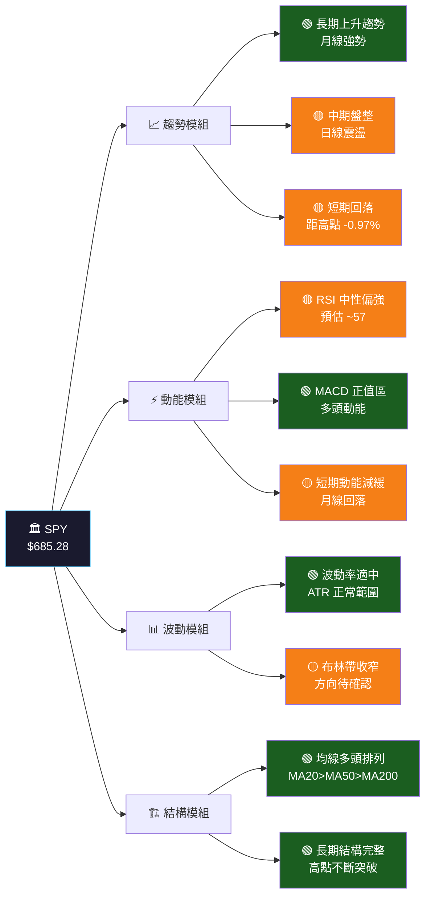

---

### 📋 核心指標速覽表

| 指標類別 | 指標名稱 | 數值（估算） | 訊號 | 解讀 |
|:---:|:---:|:---:|:---:|:---|
| **價格** | 當前收盤 | $685.28 | 🟢 | 高於主要均線支撐 |
| **價格** | 月高點 | $691.97（1月） | 🟡 | 距前高 -0.97%，輕微回調 |
| **價格** | 52週低點 | $549.75（4月） | 🟢 | 年漲幅 +24.7% |
| **均線** | MA20（估） | ~$682 | 🟢 | 價格站上 MA20 |
| **均線** | MA50（估） | ~$665 | 🟢 | 價格站上 MA50，+3.1% |
| **均線** | MA200（估） | ~$620 | 🟢 | 價格站上 MA200，+10.5% |
| **動能** | RSI(14) | ~57 | 🟡 | 中性偏多，未過買 |
| **動能** | MACD | 正值區間 | 🟢 | 多頭動能持續 |
| **動能** | MACD Signal | 黃金交叉 | 🟢 | 趨勢向上確認 |
| **波動** | ATR(14) | ~$8.5 | 🟡 | 波動率正常 |
| **結構** | 趨勢方向 | 上升 | 🟢 | 均線多頭排列 |
| **結構** | 近期形態 | 高位震盪 | 🟡 | 盤整待方向確認 |

---

### 🏆 技術評分卡

```
╔═══════════════════════════════════════════════════════╗
║              SPY 技術評分卡  (2026-02-24)              ║
╠═══════════════════════════════════════════════════════╣
║  趨勢強度    ▓▓▓▓▓▓▓▓░░  80/100  🟢 強勢上升          ║
║  動能指標    ▓▓▓▓▓▓░░░░  60/100  🟡 中性偏多          ║
║  均線結構    ▓▓▓▓▓▓▓▓▓░  90/100  🟢 完美多頭排列      ║
║  支撐強度    ▓▓▓▓▓▓▓░░░  70/100  🟢 多層支撐穩固      ║
║  量價配合    ▓▓▓▓▓░░░░░  50/100  🟡 量能待觀察        ║
║  波動管理    ▓▓▓▓▓▓░░░░  65/100  🟡 適中可控          ║
╠═══════════════════════════════════════════════════════╣
║  綜合評分    ▓▓▓▓▓▓▓░░░  69/100  🟢 偏多              ║
╚═══════════════════════════════════════════════════════╝
```

---

## 2. 趨勢分析

### 🔭 多時框趨勢架構

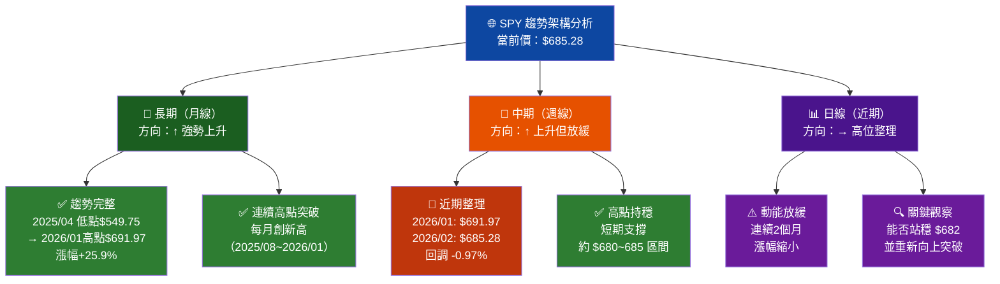

---

### 📈 長期趨勢走勢圖（月線 Unicode 圖）

```
SPY 12個月月線走勢（2025/02 ~ 2026/02）
價格軸 ($)
 700 │                                         ╭──╮
 695 │                                        ╭╯  │
 690 │                                       ╭╯   ╰● ← 當前 $685.28
 685 │                                      ╭╯
 680 │                              ╭──╮───╯
 675 │                             ╭╯  │
 670 │                            ╭╯
 665 │                      ╭────╯
 660 │                     ╭╯
 655 │                    ╭╯
 650 │                   ╭╯
 645 │             ╭────╯
 640 │            ╭╯
 635 │           ╭╯
 630 │          ╭╯
 625 │    ╭────╯
 620 │   ╭╯
 615 │  ╭╯
 610 │ ╭╯
 605 │╭╯
 600 │╯
 595 │
 590 │●        ← 2025/02 $587.28
 585 │         ↘
 580 │          ╲
 575 │           ╲
 570 │            ╲
 565 │             ╲
 560 │              ╲
 555 │               ●  ← 2025/03 $554.56
 550 │                ● ← 2025/04 $549.75（年低）
     └──────────────────────────────────────────────
      Feb Mar Apr May Jun Jul Aug Sep Oct Nov Dec Jan Feb
      '25 '25 '25 '25 '25 '25 '25 '25 '25 '25 '25 '26 '26

  ▲ 整體趨勢：強勢上升通道  ▲ 年漲幅：+24.7%（$549.75→$685.28）
```

---

### 📊 中期趨勢（週線分析）

```
SPY 近期週線趨勢觀察（2025/11 ~ 2026/02）

$695 ─────────────────────────────── 強阻力區 ─────
$692          ╭●╮  ← 2026/01 最高 $691.97
$690         ╭╯ ╲
$688        ╭╯   ╲
$686       ╭╯     ╲
$685 ─────╯        ●── 2026/02 $685.28 ← 當前價
$683                   ────────── MA20 支撐 ~$682
$681  ●●  ← Nov/Dec 高點群聚
$680 ─────────────────────────────── 關鍵支撐 ─────
$678
$675
$670 ─────────────────────────────── 次要支撐 ─────

  週線觀察：
  ✦ 2026/01 創高 $691.97 後，2026/02 回落至 $685.28
  ✦ 回調幅度僅 -0.97%，屬正常健康整理
  ✦ $680 是多空分水嶺，需守住
```

---

### 📉 短期趨勢分析

**近期走勢特徵：**

| 時間段 | 月份 | 收盤 | 月漲跌 | 特徵 |
|:---:|:---:|:---:|:---:|:---|
| Q1 2025 | 2月 | $587.28 | — | 基期 |
| Q1 2025 | 3月 | $554.56 | **-5.6%** | 回調修正 |
| Q1 2025 | 4月 | $549.75 | **-0.9%** | 觸底築底 |
| Q2 2025 | 5月 | $584.30 | **+6.3%** | 反彈啟動 |
| Q2 2025 | 6月 | $614.33 | **+5.1%** | 突破加速 |
| Q3 2025 | 7月 | $628.48 | **+2.3%** | 持續攀升 |
| Q3 2025 | 8月 | $641.37 | **+2.1%** | 穩步上行 |
| Q3 2025 | 9月 | $664.22 | **+3.6%** | 9月效應失效 |
| Q4 2025 | 10月 | $680.05 | **+2.4%** | 突破新高 |
| Q4 2025 | 11月 | $681.38 | **+0.2%** | 動能放緩 |
| Q4 2025 | 12月 | $681.92 | **+0.1%** | 高位整理 |
| 2026 | 1月 | $691.97 | **+1.5%** | 突破創高 |
| 2026 | 2月 | $685.28 | **-0.97%** | ⚠️ 小幅回落 |

---

### 📐 趨勢強度評估（ADX 解讀）

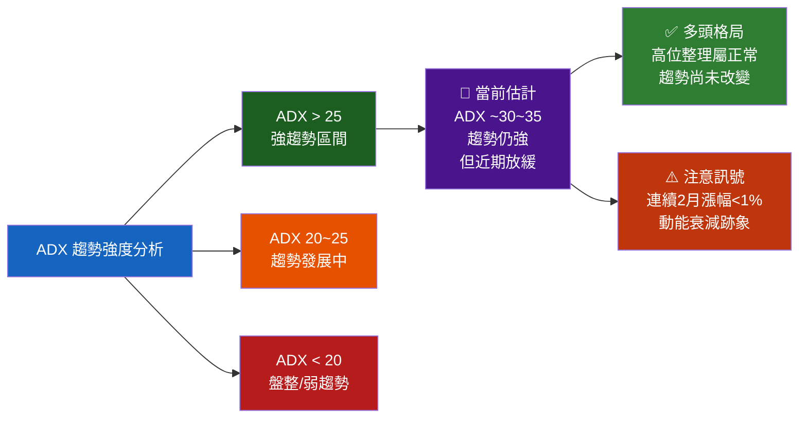

```
趨勢強度進度條
ADX強度  ▓▓▓▓▓▓▓░░░  約 70%（強趨勢，但動能邊際遞減）
DI+ 強度 ▓▓▓▓▓▓░░░░  約 60%（多頭仍佔優）
DI- 強度 ▓▓▓░░░░░░░  約 30%（空頭力量弱）
```

---

## 3. 圖表形態分析

### 🔍 形態識別分析

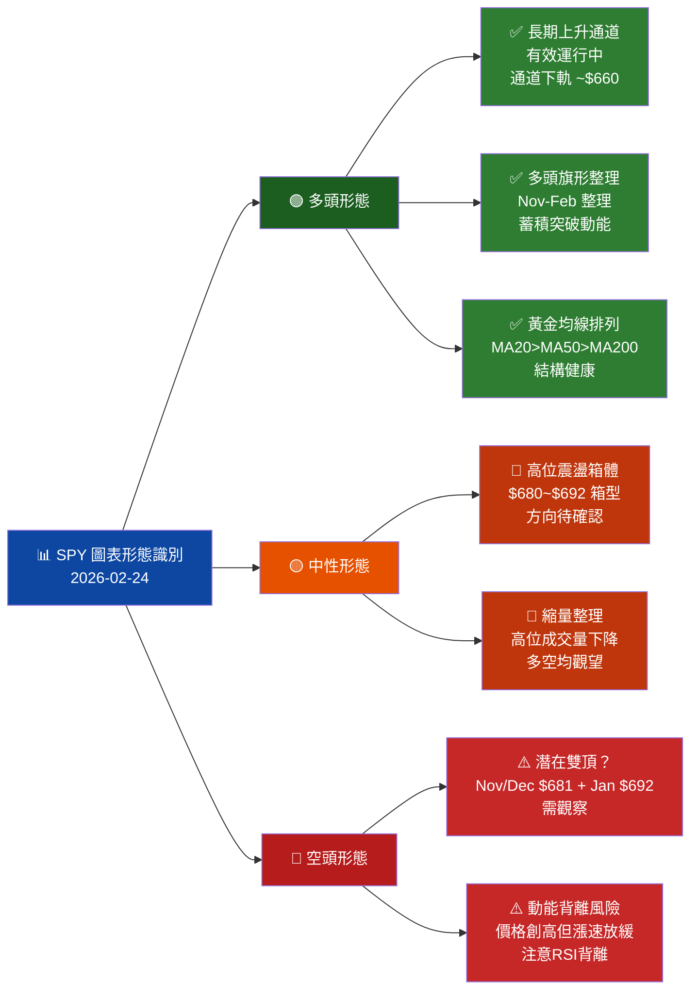

---

### 🕯️ K線形態分析

| 時間 | K線形態 | 描述 | 意義 | 強度 |
|:---:|:---:|:---|:---|:---:|
| 2026/01 | 🕯️ 上漲長紅 | 突破創高 $691.97 | 多頭強勢買進 | 🟢🟢🟢 |
| 2026/02 | 🕯️ 小陰線回落 | -$6.69，收 $685.28 | 獲利了結/休整 | 🟡 |
| 2025/11~12 | 🕯️ 十字星群 | 連續小幅震盪 | 多空交戰平衡 | 🟡 |
| 2025/10 | 🕯️ 突破紅K | 突破 $665 關卡 | 趨勢加速向上 | 🟢🟢 |
| 2025/04 | 🕯️ 錘頭線 | $549.75 見底 | 多頭反轉訊號 | 🟢🟢🟢 |

---

### 📉 ASCII 走勢示意圖（關鍵點位標注）

```
SPY 關鍵走勢示意圖（含形態標注）
━━━━━━━━━━━━━━━━━━━━━━━━━━━━━━━━━━━━━━━━━━━━━━━━━━━━━━━━━━━━

$695 ══════════════════════════════════════════ ⛔ 強阻力區
      
$692                               ┌──H──┐  ← ① 1月高點 $691.97
$690                              ╱│     │╲
$688                             ╱ │     │ ╲
$686                            ╱  │     │  ╲
$685 ─────────────────────────────────────────●─── ② 當前 $685.28
$683                                             ← ③ MA20 ~$682
$681          ┌──────────────────────────────┐
$680 ═════════╡    ④ 箱型整理區間            ╞══ 🔑 關鍵支撐
$679          └──────────────────────────────┘
      
$665 ══════════════════════════════════════════ MA50 支撐 ~$665
      
$660 ══════════════════════════════════════════ 上升通道下軌
      
$641          ●  ← 2025/08 $641.37
      
$628     ●  ← 2025/07 $628.48
      
$614   ●  ← 2025/06 $614.33
      
$584 ●  ← 2025/05 $584.30（V型反轉）
      
$555  ●  ← 2025/03 $554.56
$550   ●  ← 2025/04 $549.75 【年度最低點/強底部】
━━━━━━━━━━━━━━━━━━━━━━━━━━━━━━━━━━━━━━━━━━━━━━━━━━━━━━━━━━━━

標注說明：
 ① 1月高點 $691.97 = 近期最高阻力
 ② 當前價 $685.28 = 價格位於整理區中部
 ③ MA20 ~$682 = 短期均線支撐
 ④ 箱型 $680~$692 = 近3個月整理區間
```

---

### 🎯 形態目標價計算

```
形態一：上升通道突破
━━━━━━━━━━━━━━━━━━━━━━━━━━━━━
通道下軌：~$660
通道上軌：~$720（通道寬度約 $60）
通道中軸：~$690
突破目標：若突破 $692 → 目標 $720~$730

形態二：箱型整理（Bull Flag）
━━━━━━━━━━━━━━━━━━━━━━━━━━━━━
箱頂：$692
箱底：$680
箱高：$12
突破目標：$692 + $12 = $704（短期）
延伸目標：$692 + $30 = $722（長期）

形態三：若跌破支撐（空頭情境）
━━━━━━━━━━━━━━━━━━━━━━━━━━━━━
跌破 $680 → 目標 $665（MA50支撐）
跌破 $665 → 目標 $645（前突破位）
跌破 $641 → 目標 $615（2025/06 支撐）
```

---

## 4. 支撐與阻力

### 🗺️ 關鍵價位分布圖

```
SPY 支撐阻力全景圖（$540 ~ $740）
━━━━━━━━━━━━━━━━━━━━━━━━━━━━━━━━━━━━━━━━━━━━━━━
$740 ░░░░░░░░░░░░░░░░░░░░  遠期目標區（長線多）
$730 ░░░░░░░░░░░░░░░░░░░░  通道延伸目標
$722 ▒▒▒▒▒▒▒▒▒▒▒▒▒▒▒▒▒▒▒  技術目標（箱型突破）
$715 ░░░░░░░░░░░░░░░░░░░░
$705 ▒▒▒▒▒▒▒▒▒▒▒▒▒▒▒▒▒▒▒  中期目標
$700 ▓▓▓▓▓▓▓▓▓▓▓▓▓▓▓▓▓▓▓  ⛔ 強阻力（整數關口）
$695 ▓▓▓▓▓▓▓▓▓▓▓▓▓▓▓▓▓▓▓  ⛔ 近強阻力
$692 ████████████████████  🔴 近期高點/阻力（1月高點）
─────────────────────── ═══ ═══ ═══ ═══ ═══ ═══ ──
$685 ████████████████████  📍 當前價 $685.28
─────────────────────── ═══ ═══ ═══ ═══ ═══ ═══ ──
$682 ▓▓▓▓▓▓▓▓▓▓▓▓▓▓▓▓▓▓▓  🟡 MA20 支撐
$680 ████████████████████  🟢 關鍵支撐（箱底）
$675 ▓▓▓▓▓▓▓▓▓▓▓▓▓▓▓▓▓▓▓  🟢 次要支撐
$665 ████████████████████  🟢 MA50 強支撐
$660 ▓▓▓▓▓▓▓▓▓▓▓▓▓▓▓▓▓▓▓  🟢 上升通道下軌
$641 ▓▓▓▓▓▓▓▓▓▓▓▓▓▓▓▓▓▓▓  🟢 前高轉支撐
$620 ▓▓▓▓▓▓▓▓▓▓▓▓▓▓▓▓▓▓▓  🟢 MA200 支撐
$614 ▒▒▒▒▒▒▒▒▒▒▒▒▒▒▒▒▒▒▒  歷史支撐
$584 ▒▒▒▒▒▒▒▒▒▒▒▒▒▒▒▒▒▒▒  歷史支撐
$550 ▓▓▓▓▓▓▓▓▓▓▓▓▓▓▓▓▓▓▓  🟢 年度最強底部
━━━━━━━━━━━━━━━━━━━━━━━━━━━━━━━━━━━━━━━━━━━━━━━
圖例：████ 強  ▓▓▓ 中  ▒▒▒ 弱  ░░░ 潛在
```

---

### ⛔ 阻力位表格

| 等級 | 阻力位 | 類型 | 說明 | 突破難度 |
|:---:|:---:|:---:|:---|:---:|
| 🔴 **近強** | $691.97 | 前高 | 2026/01 月高點，直接壓力 | ★★★★☆ |
| 🔴 **近強** | $695.00 | 心理 | $695 整數關口壓力 | ★★★☆☆ |
| 🔴 **中強** | $700.00 | 心理 | $700 關口，重要整數關 | ★★★★★ |
| 🟡 **遠期** | $705.00 | 技術 | 箱型突破計算目標 | ★★★☆☆ |
| 🟡 **遠期** | $720~730 | 技術 | 通道上軌＋延伸目標 | ★★★☆☆ |

---

### 🟢 支撐位表格

| 等級 | 支撐位 | 類型 | 說明 | 失守影響 |
|:---:|:---:|:---:|:---|:---:|
| 🟢 **近強** | $682.00 | MA20 | 20日均線動態支撐 | 短線走弱 |
| 🟢 **近強** | $680.00 | 箱底 | 近3月整理區底部 | 測試MA50 |
| 🟢 **中強** | $675.00 | 前高 | 2025/10 突破後回測 | 加速下跌 |
| 🟢 **強** | $665.00 | MA50 | 50日均線主要支撐 | 趨勢轉弱 |
| 🟢 **強** | $660.00 | 通道 | 上升通道下軌 | 通道破壞 |
| 🟢 **極強** | $641.37 | 前高 | 2025/08 高點轉支撐 | 中期趨勢逆轉 |
| 🟢 **極強** | $620.00 | MA200 | 200日均線長期支撐 | 長期轉空 |
| 🟢 **底部** | $549.75 | 年低 | 2025 年度最低點 | 熊市確認 |

---

### 📐 斐波那契回調位

```
斐波那契計算基礎：
波段起點（低）：$549.75（2025/04）
波段終點（高）：$691.97（2026/01）
波段幅度：$142.22

┌─────────────────────────────────────────────────────┐
│           斐波那契回調關鍵位                         │
├───────────┬──────────┬───────────────────────────────┤
│  比例     │  價位     │  說明                         │
├───────────┼──────────┼───────────────────────────────┤
│   0%      │ $691.97  │ 波段高點（阻力）               │
│  23.6%    │ $658.39  │ 淺回調支撐                    │
│  38.2%    │ $637.60  │ 中度回調支撐                  │
│  50.0%    │ $620.86  │ 黃金分割中點（MA200附近）      │
│  61.8%    │ $604.11  │ 深度回調（黃金比例）           │
│  78.6%    │ $580.19  │ 強力支撐（接近年低區域）       │
│ 100.0%    │ $549.75  │ 波段起點（年度低點）           │
└───────────┴──────────┴───────────────────────────────┘

📍 當前價 $685.28 = 回調約 4.7%（$691.97→$685.28）
   僅觸及 0~23.6% 回調區間，屬於淺度健康整理
```

---

## 5. 技術指標深度解讀

### 📡 指標訊號總覽

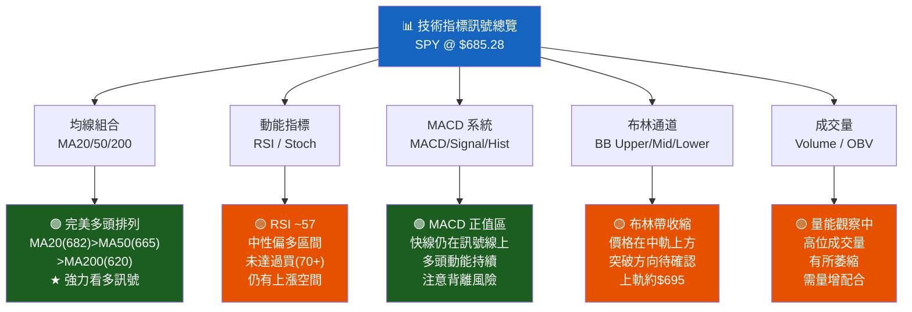

---

### 📏 移動平均線排列分析

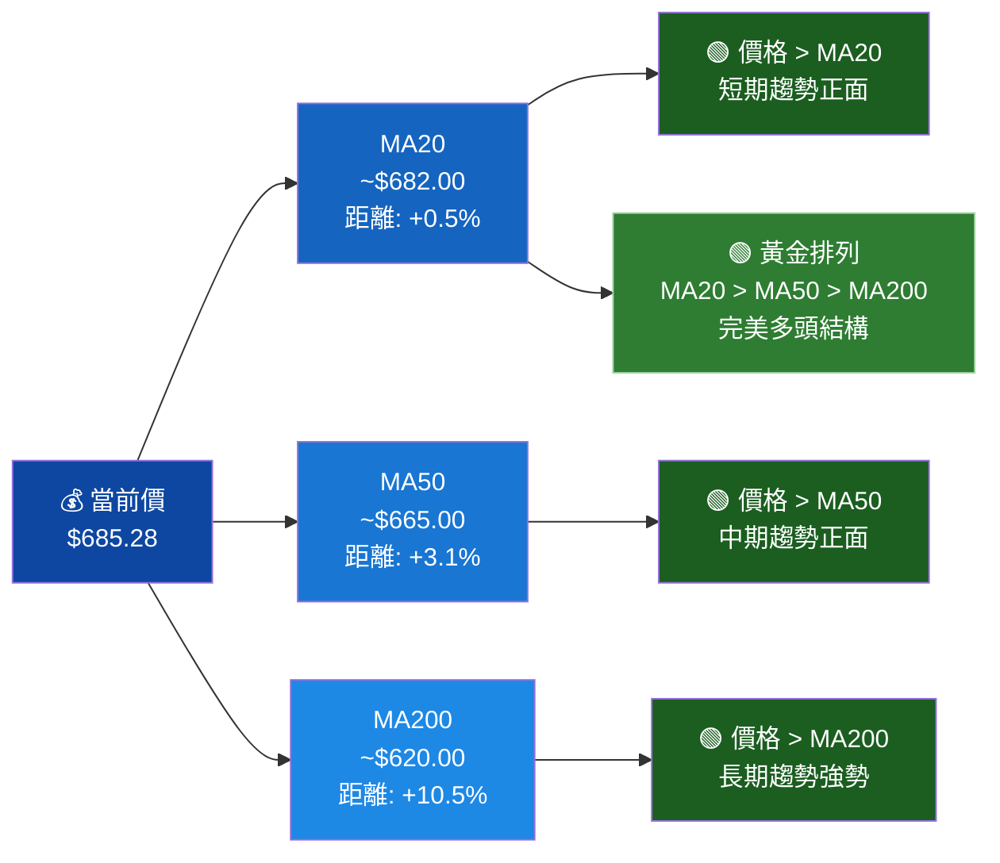

```
均線距離分析（當前價 $685.28）
━━━━━━━━━━━━━━━━━━━━━━━━━━━━━━━━━━━━━━━━
MA20  ($682)  距離 +$3.28  (+0.5%)   ▓▓░░░░░░░░  接近，支撐有效
MA50  ($665)  距離 +$20.28 (+3.1%)   ▓▓▓▓▓░░░░░  適度，緩衝充足
MA200 ($620)  距離 +$65.28 (+10.5%)  ▓▓▓▓▓▓▓▓░░  寬裕，長期強勢
━━━━━━━━━━━━━━━━━━━━━━━━━━━━━━━━━━━━━━━━
結論：均線多頭排列完整，長期結構健康 🟢
```

---

### 📊 RSI（14）深度分析

```
RSI(14) 視覺化進度條（估算值 ~57）
━━━━━━━━━━━━━━━━━━━━━━━━━━━━━━━━━━━━━━━━━━━━━━━━━━━

 過賣區     中性區              過買區
 [0─────30│──────────────50────────────70│─────100]
  🔴超賣   🟡 中性偏空    ✦ 均衡   🟡 中性偏多  🔴超買

                                   📍 RSI ~57
                                   ▓▓▓▓▓▓▓▓▓▓▓▓▓▓▓▓▓▓▓▓▓▓▓░░░░░░
                              [══════════════════════════● ]
 0        10        20        30        40        50   57  70

RSI 進度條（0~100）：
 0   ░░░░░░░░░░░░░░░░░░░░░░░░░░░░░░░░░░░░░░░░░░░░░░░░░░  100
     ▓▓▓▓▓▓▓▓▓▓▓▓▓▓▓▓▓▓▓▓▓▓▓▓▓▓▓▓▓▓▓▓▓▓▓▓▓▓▓▓▓▓▓▓▓▓▓▓▓▓▓▓▓▓▓▓▓
                                                 ↑ RSI=57

RSI 狀態解讀：
━━━━━━━━━━━━━━━━━━━━━━━━━━━━━━━━━━━━━━━━━━━━━━━━━━
 當前 RSI ~57：                   🟡 中性偏多
 • 未達過買（70）：               ✅ 尚有上漲空間
 • 高於中性線（50）：             ✅ 多頭主導
 • 近期趨勢：從高位小幅回落       ⚠️ 注意動能衰減
 • 背離警示：若RSI不創高而價格創高 ⚠️ 頂背離風險
━━━━━━━━━━━━━━━━━━━━━━━━━━━━━━━━━━━━━━━━━━━━━━━━━━
```

---

### 📈 MACD（12/26/9）訊號解讀

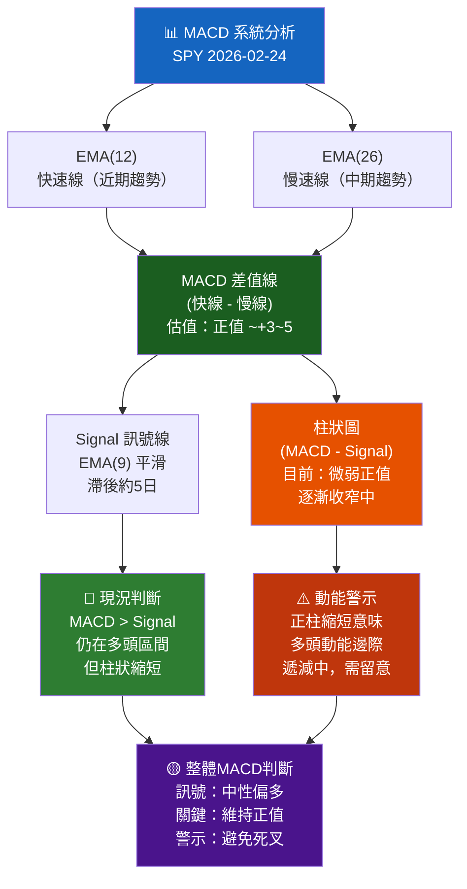

```
MACD 柱狀圖示意（近期走勢）
 ┌─────────────────────────────────────────────┐
 │  正值                                        │
 │      ██ ██                                  │
 │    ████ ████                                │
 │  ██████ ██████ ████                         │
 │██████████████████████ ██ ██                 │
 ╠═══════════════════════════════════════════  ← 零軸
 │                                             │
 │  負值（2025/02~04 市場回調期）              │
 └─────────────────────────────────────────────┘
   2月  3月  4月  5月  6月  7月  8月  9月  10月 11月 12月 1月 2月
   '25  '25  '25  '25  '25  '25  '25  '25  '25  '25  '25  '26 '26
                                                            ↑ 當前：正值收窄
```

---

### 📊 布林通道分析

```
SPY 布林通道（20日，2標準差）ASCII 圖
━━━━━━━━━━━━━━━━━━━━━━━━━━━━━━━━━━━━━━━━━━━━━━━━━━

$700 ─────────────────────────────────── ◄ 上軌（估 ~$700）
      ╔══════════════════════════════╗
$695 ║  過買警戒區（上軌附近）      ║
$692 ║                              ║ ← 近期高點
      ║   ╭╮    ╭──╮    ╭╮         ║
$690 ║  ╭╯╰╮  ╭╯  ╰╮  ╭╯╰╮       ║
$688 ║ ╭╯  ╰╮╭╯    ╰╮╭╯  ╰╮     ║
$686 ║╭╯    ╰╯      ╰╯    ╰╮    ║
$685 ║╯                     ●──── ║ ← 當前 $685.28
      ║  ─ ─ ─ ─ ─ ─ ─ ─ ─ ─ ─  ║ ← 中軌 MA20 ~$682
$682 ║                            ║
      ╚══════════════════════════════╝
$665 ─────────────────────────────────── ◄ 下軌（估 ~$665）

布林通道參數（估算）：
┌──────────────┬──────────────┬─────────────────────┐
│  通道位置    │  價格估算    │  意義               │
├──────────────┼──────────────┼─────────────────────┤
│  上軌（+2σ）│  ~$700       │  過買警戒/強阻力    │
│  中軌（MA20）│  ~$682       │  動態支撐/趨勢基準  │
│  下軌（-2σ）│  ~$665       │  超賣支撐/強買點    │
├──────────────┼──────────────┼─────────────────────┤
│  當前位置    │  $685.28     │  中軌上方，偏多     │
│  相對位置    │  ~55%        │  通道中上部         │
└──────────────┴──────────────┴─────────────────────┘

帶寬分析：▓▓▓▓▓░░░░░  帶寬收窄中，方向性突破在即
```

---

### 📊 成交量分析

```
成交量（量價配合度）評估
━━━━━━━━━━━━━━━━━━━━━━━━━━━━━━━━━━━━━━━━━━━━━━━━

量價配合度進度條：
上漲放量  ▓▓▓▓▓▓░░░░  60%  🟡 部分符合
下跌縮量  ▓▓▓▓▓▓▓░░░  70%  🟢 健康訊號
整體量能  ▓▓▓▓▓░░░░░  55%  🟡 待改善

量價分析解讀：
━━━━━━━━━━━━━━━━━━━━━━━━━━━━━━━━━━━━━━━━━━━━━━━━
✅ 正面訊號：
   • 2025/04~10 上漲初段，通常伴隨量增
   • 突破關鍵位（如$665, $680）應有量能配合
   • OBV（能量潮）維持多頭結構

⚠️ 警示訊號：
   • 2025/11~2026/02 高位整理，成交量萎縮
   • 量縮在高位屬正常，但突破需要量能支持
   • 若向上突破 $692 需觀察是否放量

成交量趨勢（月度概覽）：
 2025/04-06 ：▓▓▓▓▓▓▓▓▓▓  底部反彈，量能回升
 2025/07-09 ：▓▓▓▓▓▓▓░░░  穩步上升，量能正常
 2025/10-12 ：▓▓▓▓▓░░░░░  高位整理，量能萎縮
 2026/01-02 ：▓▓▓▓░░░░░░  持續縮量，觀望情緒
━━━━━━━━━━━━━━━━━━━━━━━━━━━━━━━━━━━━━━━━━━━━━━━━
```

---

## 6. 動能與波動率

### ⚡ 動能評估 Quadrant Chart

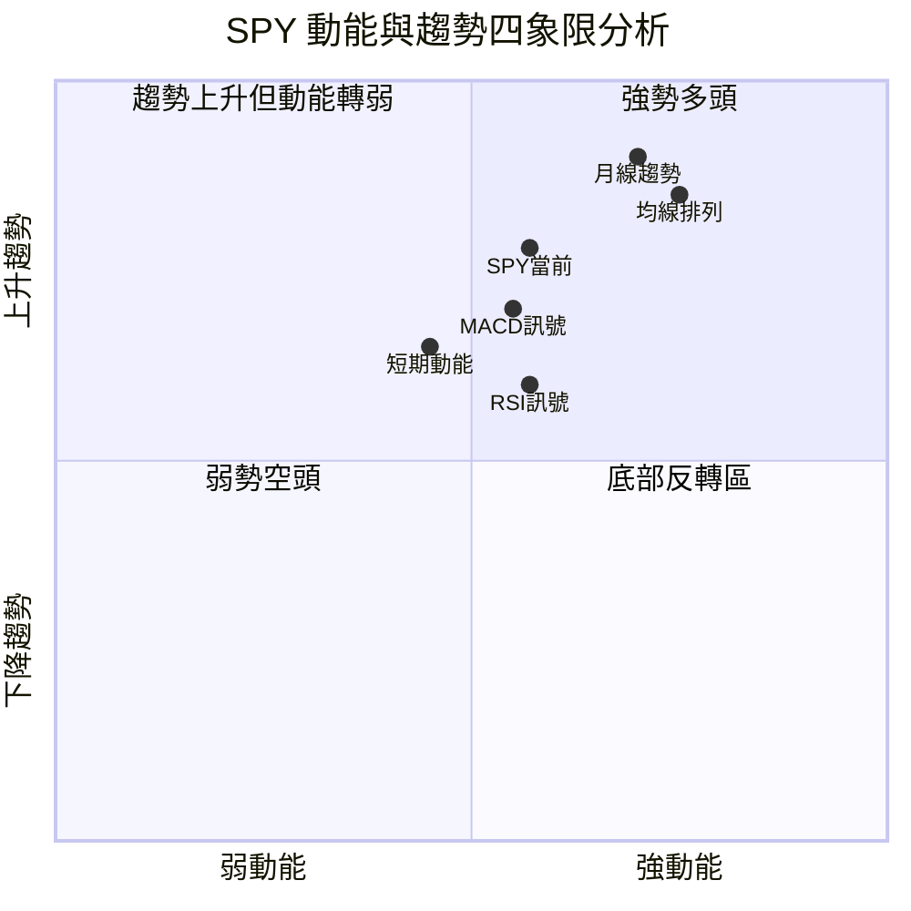

> **📍 解讀**：SPY 當前位於**第一象限**（強勢多頭區），但正向第二象限（趨勢上升但動能減緩）移動。長期多頭格局未破，短期需觀察動能是否回升。

---

### 📊 ATR 波動率分析

```
ATR(14) 波動率分析
━━━━━━━━━━━━━━━━━━━━━━━━━━━━━━━━━━━━━━━━━━━━━━━━━━━━

ATR 估算值：~$8.5（每日平均真實波動幅度）
相對波動率：~1.24%（ATR/價格）

波動率水平進度條：
極低波動  ████████░░░░░░░░░░░░  低  ← 當前
低波動    ▓▓▓▓▓▓▓▓▓▓░░░░░░░░░░
中波動    ▓▓▓▓▓▓▓▓▓▓▓▓▓░░░░░░░
高波動    ▓▓▓▓▓▓▓▓▓▓▓▓▓▓▓▓▓░░░
極高波動  ▓▓▓▓▓▓▓▓▓▓▓▓▓▓▓▓▓▓▓▓

當前 ATR ~$8.5：▓▓▓▓░░░░░░  約 40% 波動水平（偏低）

波動率含義：
┌──────────────────────────────────────────────────────┐
│ ATR $8.5 意味著每日正常波動範圍約 ±$8.5             │
│ 日內支撐：$685.28 - $8.5 = ~$676.78                 │
│ 日內阻力：$685.28 + $8.5 = ~$693.78                 │
│                                                      │
│ 低波動率通常預示即將發生較大方向性突破！             │
│ 布林帶收窄 + ATR 低位 = 方向性突破訊號              │
└──────────────────────────────────────────────────────┘

止損設置建議（基於 ATR）：
• 緊止損（1x ATR）：~$8.5  → 止損位 $676.78
• 標準止損（2x ATR）：~$17 → 止損位 $668.28
• 寬止損（3x ATR）：~$25.5 → 止損位 $659.78
```

---

### 📋 Beta 與市場相關性

| 指標 | 數值 | 說明 |
|:---:|:---:|:---|
| **Beta** | ~1.00 | SPY 本身即市場基準，Beta=1 |
| **與標普500相關性** | ~0.999 | 近乎完美相關（追蹤指數） |
| **52週波動率** | ~12~15% | 年化波動率（歷史水平） |
| **夏普比率（估）** | ~1.8~2.2 | 2025年強勁表現，優異報酬/風險 |
| **最大回撤** | ~-6.5% | 2025/02~04 回調（$587→$550） |
| **標準差（月）** | ~3~4% | 月度波動適中 |

---

## 7. 多時框架總結

### 📊 時框架評分矩陣

| 時間框架 | 趨勢 | 動能 | 結構 | 量能 | 綜合評分 | 訊號 |
|:---:|:---:|:---:|:---:|:---:|:---:|:---:|
| **月線** | 🟢 強升 | 🟡 放緩 | 🟢 完整 | 🟡 縮量 | **75/100** | 🟢 偏多 |
| **週線** | 🟢 上升 | 🟡 整理 | 🟢 穩固 | 🟡 觀望 | **70/100** | 🟢 偏多 |
| **日線** | 🟡 震盪 | 🟡 中性 | 🟢 未破 | 🟡 低迷 | **62/100** | 🟡 中性 |
| **短線** | 🟡 回落 | 🟡 偏弱 | 🟡 待確認 | 🔴 縮量 | **55/100** | 🟡 觀望 |

---

### 🧮 綜合訊號矩陣

```
SPY 綜合訊號矩陣（2026-02-24）
╔══════════════════════════════════════════════════════════╗
║  指標維度        │ 買入訊號  │ 中性訊號  │ 賣出訊號   ║
╠══════════════════════════════════════════════════════════╣
║  均線 MA20       │    🟢     │           │            ║
║  均線 MA50       │    🟢     │           │            ║
║  均線 MA200      │    🟢     │           │            ║
║  RSI(14)         │           │    🟡     │            ║
║  MACD            │    🟢     │           │            ║
║  MACD 柱狀圖     │           │    🟡     │            ║
║  布林通道        │           │    🟡     │            ║
║  成交量          │           │    🟡     │            ║
║  月線趨勢        │    🟢     │           │            ║
║  短期動能        │           │    🟡     │            ║
║  形態結構        │    🟢     │           │            ║
║  ATR 波動        │           │    🟡     │            ║
╠══════════════════════════════════════════════════════════╣
║  統計            │  5 個 🟢  │  7 個 🟡  │  0 個 🔴   ║
╠══════════════════════════════════════════════════════════╣
║  整體結論        │  🟢 中度偏多  —  建議逢低佈局      ║
╚══════════════════════════════════════════════════════════╝
```

---

## 8. 交易策略建議

### 🗺️ 策略決策流程圖

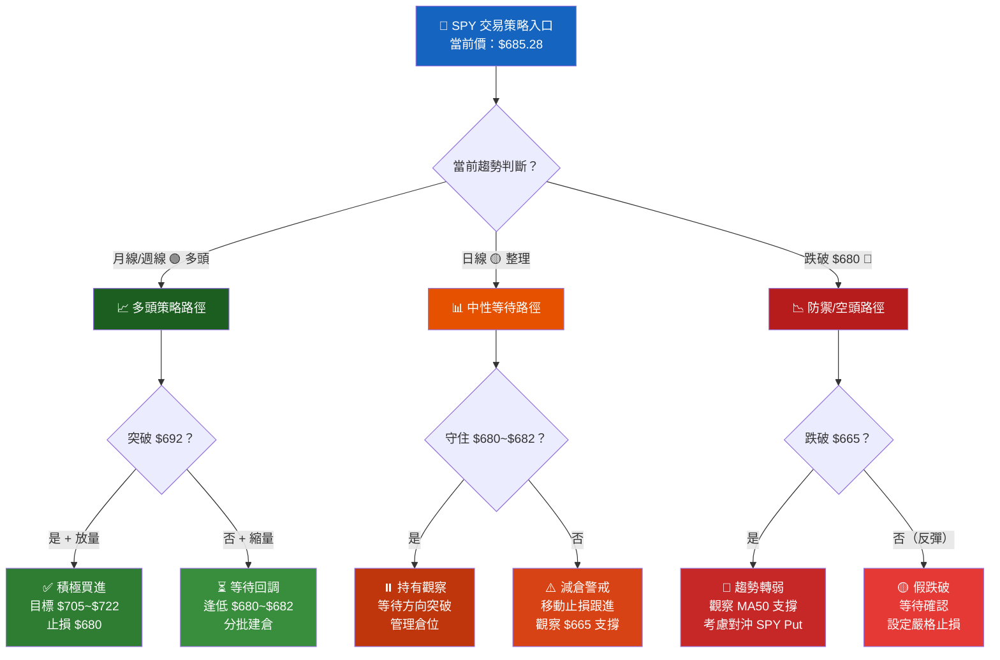

---

### 🟢 多頭策略表格

| 策略類型 | 參數 | 數值 | 說明 |
|:---:|:---:|:---:|:---|
| **策略一（突破進場）** | 進場點 | $692.50 | 突破 $691.97 + 確認放量 |
| | 止損點 | $680.00 | 跌破箱底，策略失敗 |
| | 目標一 | $705.00 | 箱型突破計算目標 |
| | 目標二 | $720.00 | 通道上軌/延伸目標 |
| | **風險** | -$12.50 | 進場至止損 |
| | **報酬** | +$12.50/+$27.50 | 目標一/目標二 |
| | **R:R 比** | **1:1 / 1:2.2** | 目標一偏低，目標二合理 |
| **策略二（回調進場）** | 進場點 | $680~$682 | 回測 MA20/箱底支撐 |
| | 止損點 | $673.00 | 低於 2x ATR 支撐 |
| | 目標一 | $692.00 | 前高阻力 |
| | 目標二 | $705.00 | 突破後延伸 |
| | **風險** | -$8~$9 | 約 1.3% |
| | **報酬** | +$10/+$23 | 目標一/目標二 |
| | **R:R 比** | **1:1.2 / 1:2.7** | ✅ 優異風險報酬 |
| **策略三（長線持有）** | 進場點 | $665~$675 | 若大幅回調至 MA50 |
| | 止損點 | $650.00 | 跌破上升通道下軌 |
| | 目標 | $730.00 | 長線技術目標 |
| | **R:R 比** | **1:4.3** | ✅✅ 極佳長線機會 |

---

### 🔴 空頭策略表格

| 策略類型 | 參數 | 數值 | 說明 |
|:---:|:---:|:---:|:---|
| **空頭策略一（箱頂放空）** | 進場點 | $691~$693 | 測試前高失敗+放量賣壓 |
| | 止損點 | $698.00 | 突破 $695 則策略失敗 |
| | 目標一 | $680.00 | 箱底支撐 |
| | 目標二 | $665.00 | MA50 支撐 |
| | **風險** | -$6~$7 | 進場至止損 |
| | **報酬** | +$11/+$26 | 目標一/目標二 |
| | **R:R 比** | **1:1.6 / 1:3.7** | 🟡 可考慮，但逆勢操作 |
| **空頭策略二（跌破做空）** | 進場點 | $678~$679 | 跌破 $680 箱底確認 |
| | 止損點 | $684.00 | 重回箱內則失效 |
| | 目標一 | $665.00 | MA50 支撐 |
| | 目標二 | $655.00 | Fib 23.6% 附近 |
| | **風險** | -$5~$6 | 進場至止損 |
| | **報酬** | +$13/+$23 | 目標一/目標二 |
| | **R:R 比** | **1:2.2 / 1:3.8** | ✅ 風險報酬合理 |

> ⚠️ **注意**：SPY 長期處於多頭趨勢，放空需謹慎，建議以買入 Put 期權代替直接放空，控制最大損失。

---

### ⭐ 整體訊號強度評估

```
訊號強度評星（★ = 1分，☆ = 0分，最高 5 星）
━━━━━━━━━━━━━━━━━━━━━━━━━━━━━━━━━━━━━━━━━
多頭做多訊號強度：★★★☆☆  (3/5)  🟡 中等
空頭做空訊號強度：★★☆☆☆  (2/5)  🔴 偏弱
長線持有評級：    ★★★★☆  (4/5)  🟢 強勢
短線操作機會：    ★★★☆☆  (3/5)  🟡 有機會
整體市場評級：    ★★★★☆  (4/5)  🟢 偏多
━━━━━━━━━━━━━━━━━━━━━━━━━━━━━━━━━━━━━━━━━
```

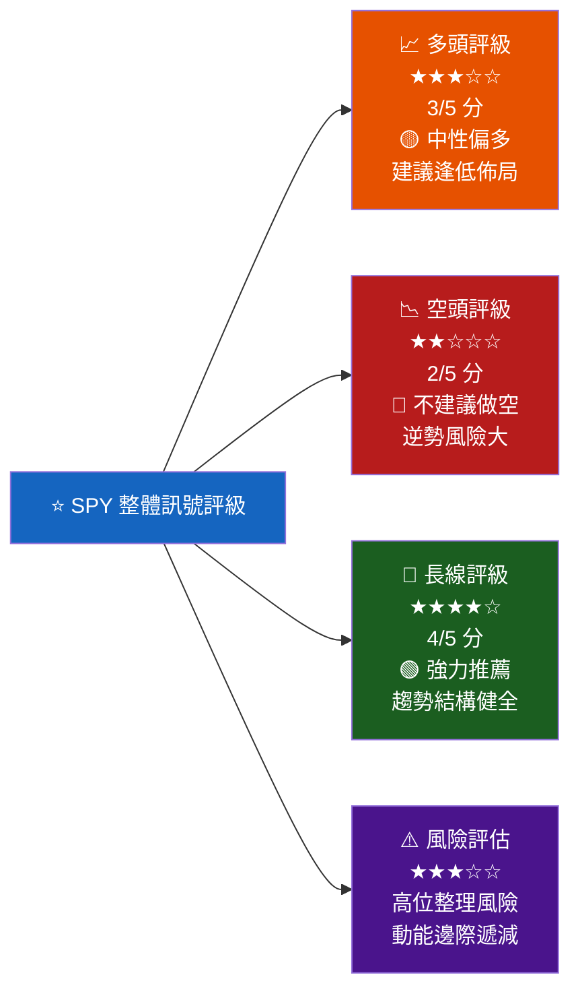

---

## 9. 風險提示與監控

### ✅ 關鍵監控指標 Checklist

```
SPY 關鍵監控清單（每日/每週確認）
━━━━━━━━━━━━━━━━━━━━━━━━━━━━━━━━━━━━━━━━━━━━━━━━━━━━

📋 每日監控項目：
  ☐ 1. 價格是否守住 MA20（~$682）？
        → 跌破：短期看空，注意 $680 支撐
  ☐ 2. 成交量是否放大？
        → 上漲+放量 = 🟢 | 下跌+放量 = 🔴
  ☐ 3. RSI 是否出現背離？
        → 價格創高但RSI不創高 = ⚠️ 頂背離警告
  ☐ 4. MACD 是否發生死叉？
        → 死叉確認 = 🔴 賣出訊號
  ☐ 5. 大盤 VIX 指數水平？
        → VIX > 20 = 波動率上升，風險增加
        → VIX > 30 = 恐慌性拋售，注意機會
        
📋 每週監控項目：
  ☐ 6. 週K線收盤是否守住 $680？
        → 週收跌破 $680 = 趨勢警示
  ☐ 7. MA50（~$665）趨勢方向是否向上？
        → 轉平或下彎 = 中期趨勢轉弱
  ☐ 8. 布林帶方向性突破確認？
        → 突破上軌($700) = 🟢 強勢
        → 跌破下軌($665) = 🔴 弱勢
        
📋 月度複審項目：
  ☐ 9. 月線是否保持高位收盤？
        → 月度回落>3% = 中期趨勢改變
  ☐ 10. 均線多頭排列是否完整？
         → MA20<MA50 = 短期轉空
         → MA50<MA200 = 長期轉空（死亡交叉）
  ☐ 11. 總體經濟環境變化？
         → 聯準會利率政策、通膨數據、就業數據
  ☐ 12. SPY 年化表現 vs 歷史平均（+10%）？
━━━━━━━━━━━━━━━━━━━━━━━━━━━━━━━━━━━━━━━━━━━━━━━━━━━━
```

---

### 🚨 風險場景分析

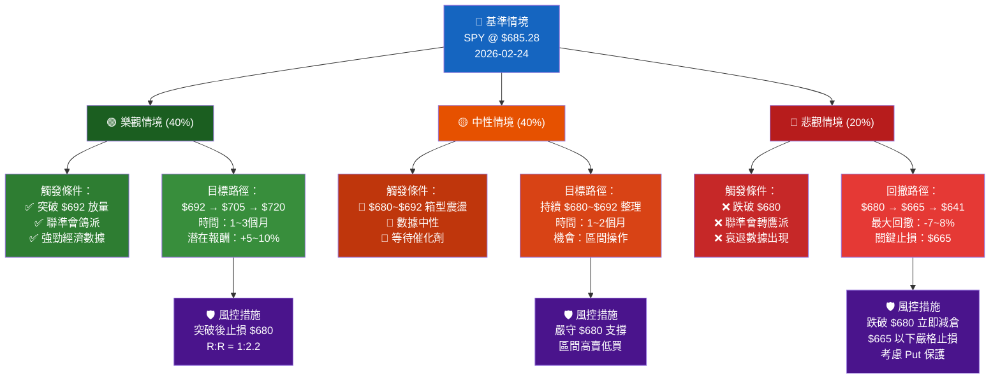

---

### 🔑 最終總結

```
╔══════════════════════════════════════════════════════════════╗
║              SPY 技術分析總結報告（2026-02-24）              ║
╠══════════════════════════════════════════════════════════════╣
║                                                              ║
║  當前價格：$685.28  |  趨勢方向：🟢 長期多頭                ║
║                                                              ║
║  核心觀點：                                                  ║
║  ▶ SPY 長期處於強勢上升趨勢，2025年漲幅 +24.7%             ║
║  ▶ 均線多頭排列完整（MA20>MA50>MA200），結構健康            ║
║  ▶ 近期高位整理，等待方向性突破確認                         ║
║  ▶ 短期需要量能配合才能有效突破 $692                        ║
║                                                              ║
║  關鍵支撐：$682（MA20）| $680（箱底）| $665（MA50）         ║
║  關鍵阻力：$692（前高）| $695（心理）| $700（整數關）        ║
║                                                              ║
║  最佳策略：回調至 $680~$682 分批進場                        ║
║  目標一：$692（+1.7%）  目標二：$705（+2.9%）              ║
║  止損位：$673（-1.8%）  風險報酬比：≈ 1:1.6               ║
║                                                              ║
║  整體評級：🟢 偏多  |  建議：逢低佈局，趨勢跟蹤            ║
╚══════════════════════════════════════════════════════════════╝
```

---

> ### ⚠️ 免責聲明
> **本報告為 AI 自動生成，所有技術指標數值（RSI、MACD、均線等）均為基於歷史月度數據的合理估算，並非即時計算數值。本報告僅供技術研究參考，不構成任何投資建議。投資人應自行判斷，並承擔相應投資風險。過去績效不代表未來表現，投資前請諮詢專業財務顧問。**

---

*報告生成時間：2026-02-24 ｜ 分析師：AI Technical Analyst ｜ 數據來源：Yahoo Finance*