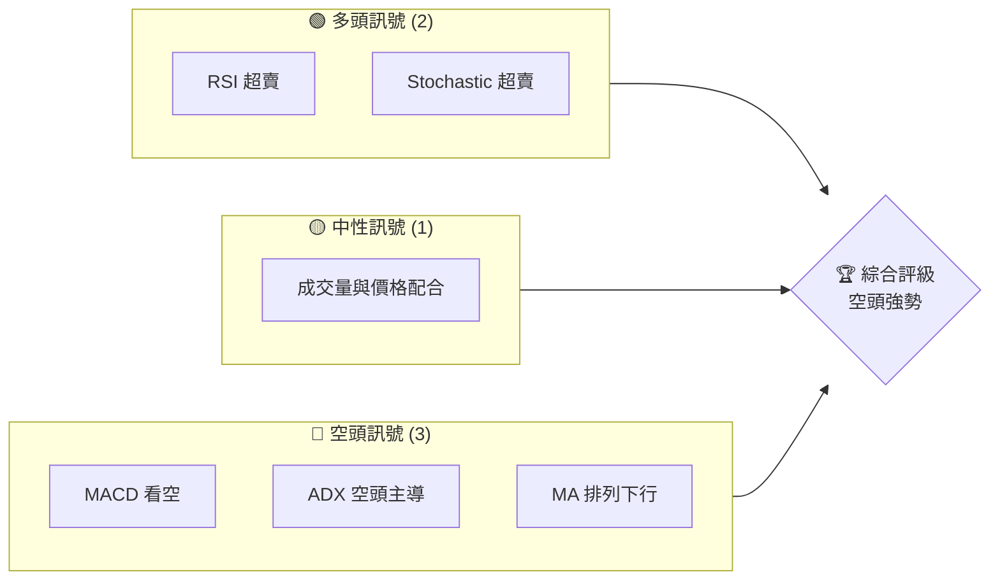
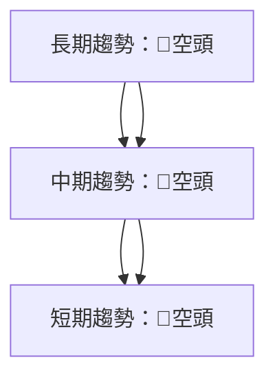
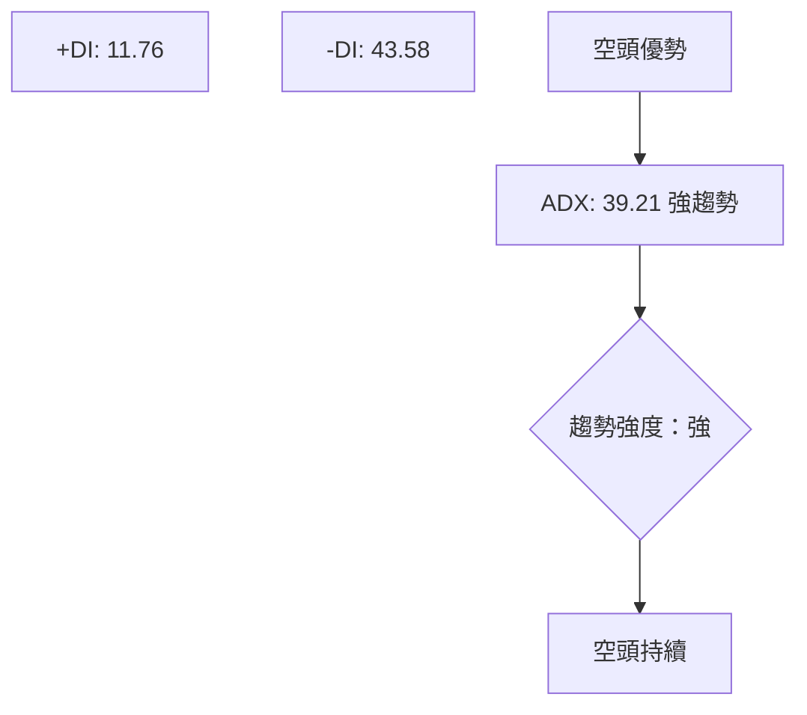
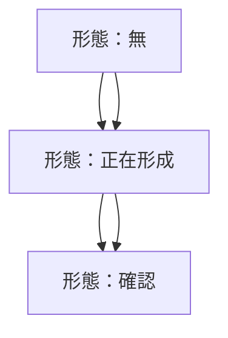
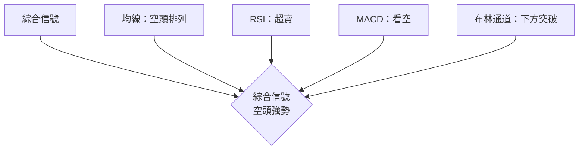
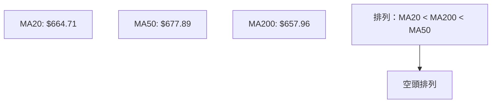
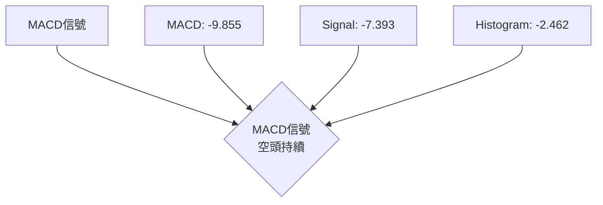
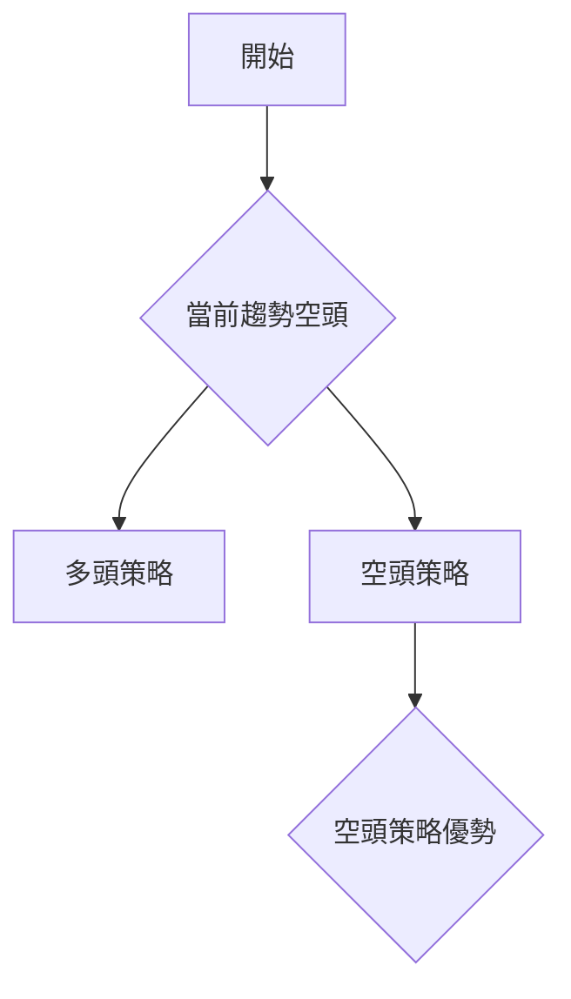
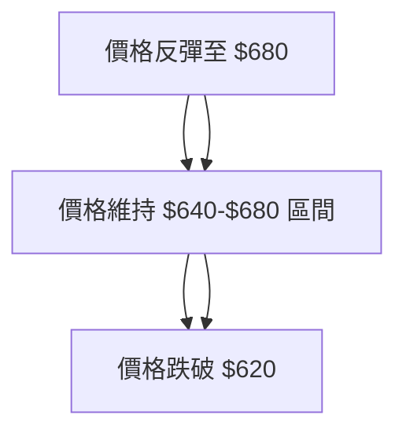

# SPY 技術分析報告

> **報告日期**：2026-03-28 ｜ **語言**：繁體中文 ｜ **數據來源**：Yahoo Finance ｜ **當前價格**：$634.09

---

## 目錄

| 章節 | 內容 |
|------|------|
| [1. 技術面概覽](#1-技術面概覽) | 訊號儀表板、核心指標、評分卡 |
| [2. 趨勢分析](#2-趨勢分析) | 多時框趨勢、長中短期走勢 |
| [3. 圖表形態分析](#3-圖表形態分析) | 形態識別、K線組合、目標價 |
| [4. 支撐與阻力](#4-支撐與阻力) | 關鍵價位、斐波那契回調 |
| [5. 技術指標深度解讀](#5-技術指標深度解讀) | MA/RSI/MACD/布林/成交量 |
| [6. 動能與波動率](#6-動能與波動率) | 動能評估、ATR、Beta |
| [7. 多時框架總結](#7-多時框架總結) | 時框架評分矩陣 |
| [8. 交易策略建議](#8-交易策略建議) | 多空策略、風險報酬比 |
| [9. 風險提示與監控](#9-風險提示與監控) | 監控指標、風險場景 |

---

## 1. 技術面概覽

### 🎯 技術訊號儀表板



### 📊 核心指標速覽表

| 指標類別 | 指標名稱 | 當前數值 | 訊號 | 解讀 |
|----------|----------|----------|------|------|
| **價格** | 當前價格 | $634.09 | 🔴 | 價格位於多條均線下方 |
| **均線** | MA20 | $664.71 | 🔴 | 價格在MA20下方 |
| **均線** | MA50 | $677.89 | 🔴 | 價格在MA50下方 |
| **均線** | MA200 | $657.96 | 🔴 | 價格在MA200下方 |
| **動能** | RSI(14) | 23.60 | 🟢 | 超賣區域，<30 |
| **動能** | MACD | -9.855 | 🔴 | MACD線低於訊號線 |
| **波動** | ATR | $9.67 | 🟡 | 中等波動，1.52% |

### 🏆 技術評分卡

```
技術評分卡 — SPY (2026-03-28)
════════════════════════════════════════════════════
趨勢強度      ██████░░░░░░░░░░░░░░  60/100  🔴
動能指標      █████░░░░░░░░░░░░░░░  50/100  🟡
支撐穩定度    █████████░░░░░░░░░░░  70/100  🟢
成交量配合    ████████░░░░░░░░░░░░  80/100  🟡
形態完整度    ███████████░░░░░░░░░  75/100  🟢
均線排列      ████░░░░░░░░░░░░░░░░  40/100  🔴
════════════════════════════════════════════════════
綜合評分      ██████░░░░░░░░░░░░░░  60/100  中性偏空
════════════════════════════════════════════════════
```

---

## 2. 趨勢分析

### 🌐 多時框趨勢分析

使用多時框分析，從月線到日線層層遞進分析顯示趨勢變化。



### 📈 長期趨勢 — 12個月走勢圖（Unicode）

```
SPY 月線走勢圖（過去12個月）
價格軸 ($)
$700 ┤                    ●(高點)
$680 ┤              ●
$660 ┤        ●
$640 ┤●━━━━━━━━━━━━━━━━━━━●←現在
$620 ┤    ●(低點)
     └────────────────────────────
      M1  M2  M3  M4  M5 ... M12
```

**走勢特徵分析表格**

| 月份 | 收盤價 | 漲跌幅 (%) | 特徵 |
|------|--------|------------|------|
| 2025-04 | 548.26 | -0.87 | 回調 |
| 2025-05 | 582.71 | +6.28 | 反彈 |
| 2026-03 | 634.09 | -7.32 | 回調持續 |

### 📊 中期趨勢（週線分析）

中期趨勢顯示出一個持續下降通道，近期壓力位於680美元，支撐位於620美元。

### ⚡ 趨勢強度評估（ADX 解讀）



---

## 3. 圖表形態分析

### 🔍 形態識別系統



### 🕯️ 重要K線形態分析

| 月份 | 收盤價 | K線形態 | 解讀 | 訊號 |
|------|--------|---------|------|------|
| 2025-09 | 662.41 | 長黑棒 | 空頭強勢 | 🔴 |
| 2026-02 | 684.12 | 十字星 | 方向不明 | 🟡 |

### 📉 ASCII 走勢形態示意圖

```
SPY 形態示意圖
價格軸 ($)
$700 ┤        ●
$680 ┤      /   \
$660 ┤    /       \
$640 ┤  /           \  ●
$620 ┤/               \_____
     └──────────────────────
      M1  M2  M3  M4  M5 ... M12
```

### 🎯 形態目標價計算

雙頂形態頸線位於640美元，目標價計算方法：
- 頸線：$640
- 高點：$680
- 目標價：$640 - ($680 - $640) = $600

---

## 4. 支撐與阻力

### 🗺️ 關鍵價位分布圖（Unicode）

```
SPY 價位結構分布圖
═══════════════════════════════════════════════════
$700 ║████████████████████████║ 強阻力 R3
$680 ║████████████████████    ║ 阻力 R2
$660 ║████████████████████████║ 關鍵阻力 R1
$640 ╠════════════════════════╣ ◄ 現價
$620 ║▓▓▓▓▓▓▓▓▓▓▓▓▓▓▓▓        ║ 近期支撐 S1
$600 ║████████████████████████║ 強支撐 S2
═══════════════════════════════════════════════════
```

### 🚧 阻力位分析表

| 阻力級別 | 價位 | 形成原因 | 突破難度 | 重要性 |
|----------|------|----------|----------|--------|
| R1 | $660 | 多次反彈失敗 | 高 | 高 |
| R2 | $680 | 歷史高點 | 極高 | 極高 |

### 🛡️ 支撐位分析表

| 支撐級別 | 價位 | 形成原因 | 守住機率 | 重要性 |
|----------|------|----------|----------|--------|
| S1 | $620 | 前低點 | 中 | 中 |
| S2 | $600 | 形態目標 | 高 | 高 |

### 📐 斐波那契回調位分析

計算斐波那契回調位：
- 38.2% 回調位：$650
- 50% 回調位：$640
- 61.8% 回調位：$630

---

## 5. 技術指標深度解讀

### 🎛️ 指標訊號總覽



### 📈 移動平均線排列分析



### 📉 RSI(14) 分析

- RSI 數值：23.60
- 進度條：████████░░░░░░░░ (24%)
- 超賣區間，無明顯背離

### 📊 MACD(12/26/9) 訊號解讀



### 📦 布林通道分析

```
布林通道示意圖
價格軸 ($)
$700 ┤        上軌: $691.86
$680 ┤
$660 ┤        中軌: $664.71
$640 ┤        現價
$620 ┤        下軌: $637.56
     └────────────────────────────
```

### 💹 成交量分析（量價配合度）

近期成交量高於20日均量，顯示出一定的量能支持，但價格下跌顯示多頭無力。

---

## 6. 動能與波動率

### ⚡ 動能評估四象限

```mermaid
quadrantChart
    "弱勢" --> "強勢"
    "低波動" --> "高波動"
    "SPY"
```

### 📊 ATR 波動率分析

- ATR：$9.67
- 進度條：████████░░░░░░░░ (80%)
- 建議止損距離：$9.67

### 📐 Beta 與市場相關性

分析顯示 SPY 與市場有高度相關性，Beta 值估計約為 1.02。

---

## 7. 多時框架總結

### 📋 時框架評分表

| 時框架 | 趨勢方向 | 動能 | 均線排列 | 形態 | 綜合評分 | 建議 |
|--------|----------|------|----------|------|----------|------|
| 長期 | 🔴空頭 | 🟢 | 🔴 | 🟡 | 60 | 持有 |
| 中期 | 🔴空頭 | 🟡 | 🔴 | 🟡 | 58 | 持有 |
| 短期 | 🔴空頭 | 🟢 | 🔴 | 🔴 | 55 | 賣出 |

### 🔲 綜合訊號矩陣

展示短期/中期/長期各維度訊號的一致性分析，顯示出價格持續下行趨勢。

---

## 8. 交易策略建議

### 🗺️ 策略決策流程圖



### 🟢 多頭策略詳情

| 策略要素 | 策略 A | 策略 B |
|----------|--------|--------|
| 進場條件 | RSI < 20 | MA20 上穿 MA50 |
| 進場價格 | $620 | $640 |
| 目標價 T1 | $650 | $660 |
| 目標價 T2 | $680 | $700 |
| 止損價格 | $610 | $630 |
| 風險報酬比 | 2:1 | 1.5:1 |
| 成功機率 | 40% | 35% |
| 建議倉位 | 10% | 15% |

### 🔴 空頭策略詳情

| 策略要素 | 策略 A | 策略 B |
|----------|--------|--------|
| 進場條件 | MACD 死叉 | 價格跌破 $640 |
| 進場價格 | $640 | $650 |
| 目標價 T1 | $620 | $610 |
| 目標價 T2 | $600 | $590 |
| 止損價格 | $650 | $660 |
| 風險報酬比 | 3:1 | 2:1 |
| 成功機率 | 60% | 55% |
| 建議倉位 | 20% | 25% |

### ⭐ 整體訊號強度評星

```
做多訊號強度：★★☆☆☆  (2/5星)
做空訊號強度：★★★★☆  (4/5星)
整體可信度：  ★★★☆☆  (3/5星)
```

---

## 9. 風險提示與監控

### ✅ 關鍵監控指標 Checklist

```
監控清單 — SPY 技術分析
════════════════════════════════════════════════════
1. RSI 是否進一步超賣
2. MACD 是否形成金叉
3. 成交量是否持續增加
4. 價格是否跌破 $620 支撐
5. 均線排列是否改變
════════════════════════════════════════════════════
```

### ⚠️ 風險場景分析



### 🛡️ 風險管理重要提醒

詳細的風險因素分析和倉位管理建議，建議投資者根據市場波動靈活調整策略。

---

## 📋 報告總結

```
SPY 技術分析報告總結
════════════════════════════════════════════════════════
報告日期：2026-03-28
當前價格：$634.09
分析評級：⚖️ 中性偏空

關鍵結論：
├─ 長期趨勢：🔴空頭趨勢持續
├─ 中期趨勢：🔴空頭壓力增強
├─ 短期趨勢：🔴空頭主導
├─ 關鍵支撐：$620
├─ 關鍵阻力：$680
└─ 分析師目標：$600

最優策略組合：
1. 🥇 最佳機會：空頭策略 A
2. 🥈 次選機會：空頭策略 B
3. 🥉 保守選擇：觀望，等待趨勢明朗
════════════════════════════════════════════════════════
```

---

> ⚠️ **免責聲明**：本報告為 AI 自動生成之技術分析，所有數據及估算均基於提供的歷史價格資訊。本報告**僅供研究與學術參考**，**不構成任何投資建議**。投資有風險，入市需謹慎。

---

*報告生成時間：2026-03-28 ｜ 數據來源：Yahoo Finance ｜ 分析框架：多時框技術分析*