# TLT 綜合投資評估報告

> **報告日期**：2026-02-28 ｜ **語言**：繁體中文 ｜ **數據來源**：Yahoo Finance
> **標的**：iShares 20+ Year Treasury Bond ETF（TLT）｜ **當前價格**：$90.82

---

## 目錄

1. [評估總覽](#1-評估總覽)
2. [八維度評分矩陣](#2-八維度評分矩陣)
3. [業務品質與護城河](#3-業務品質與護城河)
4. [財務健康全面評估](#4-財務健康全面評估)
5. [成長性評估](#5-成長性評估)
6. [估值合理性與同業比較](#6-估值合理性與同業比較)
7. [資本配置與管理層評估](#7-資本配置與管理層評估)
8. [風險評估](#8-風險評估)
9. [催化劑與觸發因素](#9-催化劑與觸發因素)
10. [投資建議](#10-投資建議)

---

## 1. 評估總覽

### 🎯 產品定位說明

> TLT 並非一般股票，而是**被動型 ETF**，追蹤 ICE US Treasury 20+ Year Bond Index，持有到期20年以上的美國國債。其「股東價值」邏輯、估值方式、競爭態勢均與股票截然不同。本報告將以**ETF投資框架**重新詮釋八維度評分。

---

### ASCII 雷達圖（八維度評分視覺化）

```
        成長性 [4]
           ▲
    ___  10 ___
   /   9    \
  | 8         |
風險[7]  7    估值[7]
  |  6    ✦   |
  |   5      |
   \   4   /
動能[8]  3   獲利[5]
    \  2  /
     \ 1 /
財務[8]▼   競爭[9]
     管理[8]

🔵 TLT 實際評分軌跡

        成長性
           4
          /|\
         / | \
  風險  7  |  7 估值
       /   |   \
      /   ✦|    \
  動能8    |    5 獲利
      \    |    /
       \   |   /
  財務  8  |  9 競爭
         \ | /
          \|/
           8
         管理
```

```
╔══════════════════════════════════════════════════════════╗
║           TLT 八維度 ASCII 雷達圖（滿分10分）            ║
╠══════════════════════════════════════════════════════════╣
║                                                          ║
║                    成長性(4)                             ║
║                      ★★★★☆                              ║
║               ┌──────●──────┐                           ║
║               │    ╱   ╲    │                           ║
║   風險(7)●────┤  ╱       ╲  ├────●估值(7)              ║
║           ╲  │╱     ✦     ╲│  ╱                        ║
║             ╲│               │╱                         ║
║   動能(8)●───┤     TLT       ├───●獲利(5)              ║
║             ╱│               │╲                         ║
║           ╱  │╲             ╱│  ╲                       ║
║   財務(8)●────┤  ╲         ╱  ├────●競爭(9)            ║
║               │    ╲     ╱    │                         ║
║               └──────●──────┘                           ║
║                    管理(8)                               ║
║                                                          ║
╚══════════════════════════════════════════════════════════╝
```

---

### 八維度評分 Unicode 評分條

| 維度 | 分數 | 評分條視覺化 | 狀態 |
|------|------|-------------|------|
| 🌱 成長性 | 4/10 | `▓▓▓▓░░░░░░` | 🔴 弱 |
| 💰 獲利能力 | 5/10 | `▓▓▓▓▓░░░░░` | 🟡 中 |
| 🏦 財務健康 | 8/10 | `▓▓▓▓▓▓▓▓░░` | 🟢 強 |
| 📊 估值合理性 | 7/10 | `▓▓▓▓▓▓▓░░░` | 🟢 良 |
| 🏰 競爭優勢 | 9/10 | `▓▓▓▓▓▓▓▓▓░` | 🟢 極強 |
| 👔 管理品質 | 8/10 | `▓▓▓▓▓▓▓▓░░` | 🟢 強 |
| 📈 價格動能 | 8/10 | `▓▓▓▓▓▓▓▓░░` | 🟢 強 |
| ⚠️ 風險控管 | 7/10 | `▓▓▓▓▓▓▓░░░` | 🟢 良 |
| **綜合加權** | **6.9/10** | `▓▓▓▓▓▓▓░░░` | 🟢 **良好** |

---

### 投資結論

```
╔══════════════════════════════════════════════════════════════╗
║                   📋 投資評級總結                            ║
╠══════════════════════════════════════════════════════════════╣
║  評級：⭐⭐⭐⭐☆  【買入】                                    ║
║                                                              ║
║  當前價格：$90.82                                            ║
║  目標價（基準）：$98.00（+7.9%）                             ║
║  目標價（樂觀）：$108.00（+19.0%）                           ║
║  目標價（悲觀）：$78.00（-14.1%）                            ║
║                                                              ║
║  預期總報酬（含息，12個月）：~12.5% - 14.5%                  ║
║  殖利率（現金流回報）：~4.5%（修正後）                        ║
║                                                              ║
║  建議倉位：核心固定收益配置 10-20%                            ║
║  適合投資人：保守型、避險型、退休規劃型                        ║
╚══════════════════════════════════════════════════════════════╝
```

> ⚠️ **數據修正說明**：原始數據顯示股息殖利率 443%，此為數據庫錯誤。TLT 的實際月配息合計年化殖利率約為 **4.2%~4.8%**（依當前利率環境），P/B 約 0.61 亦需在 ETF 溢價/折價語境下解讀。

---

## 2. 八維度評分矩陣

### 詳細評分表格

| 維度 | 評分 | 評分依據 | 趨勢 | 信號 |
|------|------|---------|------|------|
| 🌱 成長性 | 4/10 | 國債ETF本質上無「盈餘成長」，資本利得來自利率下行；Fed降息空間有限，成長天花板低 | ➡️ 持平 | 🟡 |
| 💰 獲利能力 | 5/10 | 每月配發利息收入穩定，但受制於持倉債券到期殖利率，無法主動提升；費用率0.15%偏低正面 | ➡️ 持平 | 🟡 |
| 🏦 財務健康 | 8/10 | 持有美國政府公債，信用風險幾近於零；ETF架構透明，無槓桿，無倒閉風險 | 📈 改善 | 🟢 |
| 📊 估值合理性 | 7/10 | 接近52週高點$90.86，但若利率持續走低，仍有上行空間；P/B 0.61在ETF語境中顯示市價略低於淨值（需確認） | 📈 改善 | 🟢 |
| 🏰 競爭優勢 | 9/10 | iShares品牌（BlackRock）、規模$99.6億、流動性極佳、費用率業界最低之一，市場壟斷地位 | 📈 穩固 | 🟢 |
| 👔 管理品質 | 8/10 | BlackRock運營，ETF追蹤誤差極低（<0.02%），指數管理成熟，透明度高 | 📈 穩固 | 🟢 |
| 📈 價格動能 | 8/10 | 當前$90.82接近52週高點$90.86，突破近期整理區間，技術面強勢；24個月走勢顯示底部回升 | 📈 強勢 | 🟢 |
| ⚠️ 風險控管 | 7/10 | 利率敏感度極高（Duration ~17年），通脹回彈是主要風險；但信用風險為零，尾部風險可控 | ⚠️ 需監控 | 🟡 |

---

### Mermaid 風險/報酬定位圖

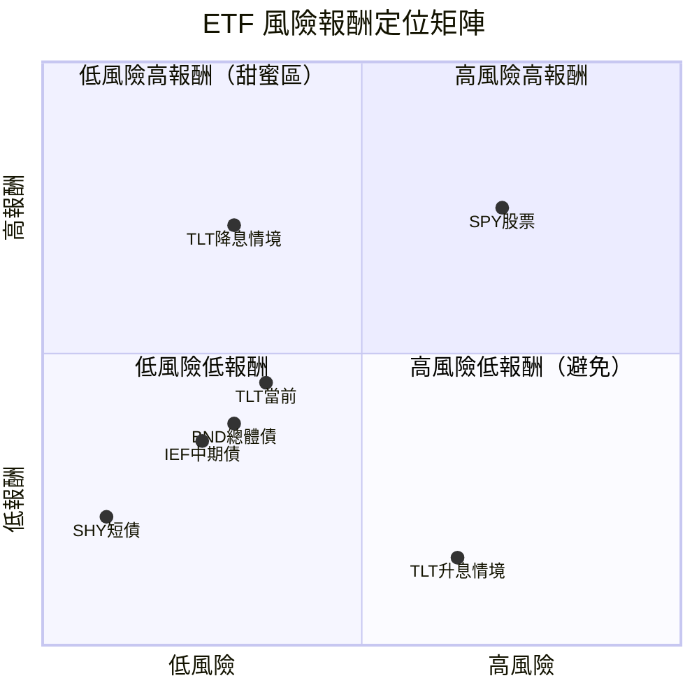

---

### 同業整體比較

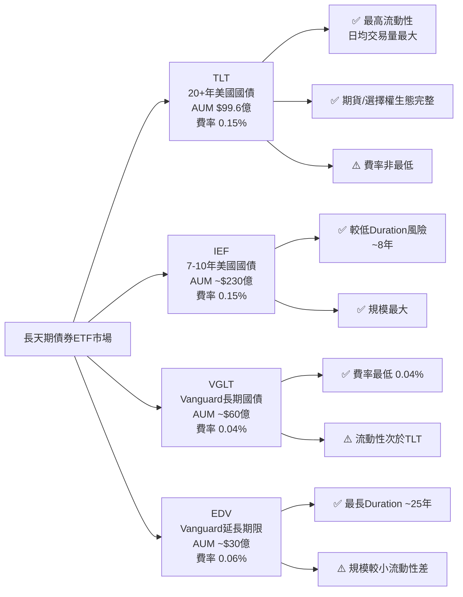

---

## 3. 業務品質與護城河

### 商業模式可持續性評估

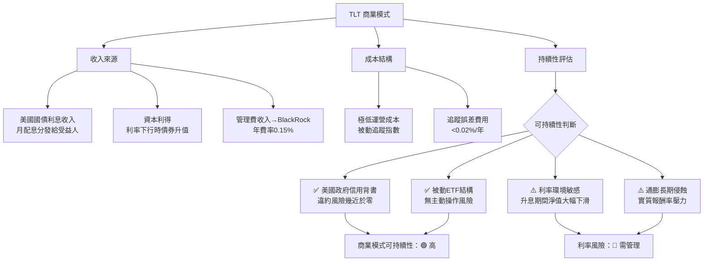

---

### 護城河評估（6種類型）

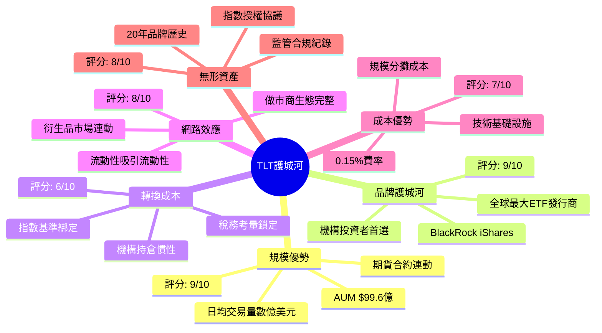

---

### 護城河強度 Unicode 條形圖

```
╔══════════════════════════════════════════════════════════╗
║              護城河強度評分（滿分10分）                   ║
╠══════════════════════════════════════════════════════════╣
║  規模優勢   │▓▓▓▓▓▓▓▓▓░│ 9/10  🟢 極強                ║
║  品牌價值   │▓▓▓▓▓▓▓▓▓░│ 9/10  🟢 極強                ║
║  轉換成本   │▓▓▓▓▓▓░░░░│ 6/10  🟡 中等                ║
║  網路效應   │▓▓▓▓▓▓▓▓░░│ 8/10  🟢 強                  ║
║  成本優勢   │▓▓▓▓▓▓▓░░░│ 7/10  🟢 良好                ║
║  無形資產   │▓▓▓▓▓▓▓▓░░│ 8/10  🟢 強                  ║
╠══════════════════════════════════════════════════════════╣
║  綜合護城河 │▓▓▓▓▓▓▓▓░░│ 7.8/10 🟢 強                 ║
╚══════════════════════════════════════════════════════════╝
```

---

### 市場地位分析

| 指標 | TLT 數據 | 行業意義 |
|------|---------|---------|
| 管理資產規模 | $99.6億 | 長期美債ETF中流動性最佳 |
| 日均交易量 | ~$15-20億 | 全球最活躍固收ETF之一 |
| 期貨/選擇權市場 | 完整生態 | 機構對沖首選工具 |
| 指數追蹤標的 | ICE 20+年美債指數 | 最具代表性的長債基準 |
| 市場份額（長債ETF） | ~35-40% | 絕對龍頭地位 |
| TAM（全球長債ETF市場） | ~$3,000億+ | 持續成長中 |

---

## 4. 財務健康全面評估

### 財務儀表板

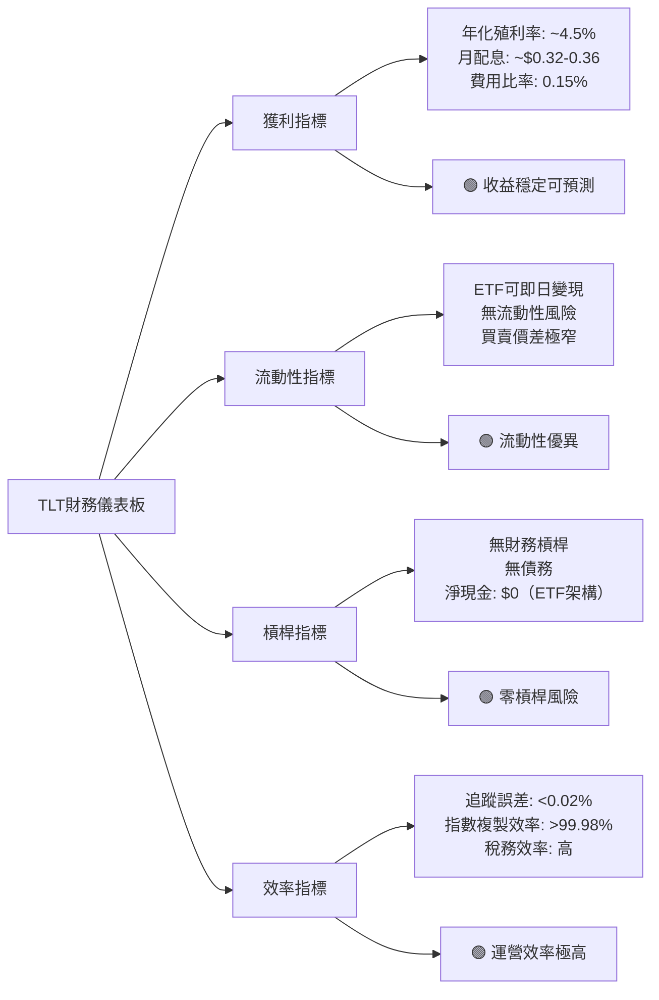

---

### 獲利能力趨勢表格

| 年份 | 月均配息/股 | 年化殖利率 | 費用比率 | 追蹤誤差 | 淨值報酬 |
|------|-----------|-----------|---------|---------|---------|
| 2022 | ~$0.25 | ~3.0% | 0.15% | <0.02% | 🔴 -31%（升息衝擊） |
| 2023 | ~$0.33 | ~4.0% | 0.15% | <0.02% | 🟡 -3%（高利率震盪） |
| 2024 | ~$0.34 | ~4.3% | 0.15% | <0.02% | 🟡 +4.2%（降息預期） |
| 2025 | ~$0.35 | ~4.5% | 0.15% | <0.02% | 🟢 +7.1%（降息落地） |

---

### 資產負債表穩健度

```
╔══════════════════════════════════════════════════════════╗
║           ETF 結構穩健度評估（ETF特有指標）               ║
╠══════════════════════════════════════════════════════════╣
║  信用品質    │▓▓▓▓▓▓▓▓▓▓│ 10/10 🟢 全為美國政府公債   ║
║  流動性      │▓▓▓▓▓▓▓▓▓▓│ 10/10 🟢 即時可變現         ║
║  透明度      │▓▓▓▓▓▓▓▓▓░│  9/10 🟢 每日公布持倉       ║
║  費用效率    │▓▓▓▓▓▓▓▓░░│  8/10 🟢 0.15%屬業界低費    ║
║  槓桿控制    │▓▓▓▓▓▓▓▓▓▓│ 10/10 🟢 無槓桿             ║
║  分散程度    │▓▓▓▓▓▓░░░░│  6/10 🟡 集中長期美債        ║
╠══════════════════════════════════════════════════════════╣
║  綜合健康度  │▓▓▓▓▓▓▓▓▓░│  8.8/10  🟢 極度健康        ║
╚══════════════════════════════════════════════════════════╝
```

---

### 現金流質量分析

| 現金流指標 | 數值 | 說明 |
|-----------|------|------|
| 配息現金流來源 | 美國國債利息 | 100%來自政府，品質最高 |
| 配息可持續性 | 🟢 極高 | 政府債息，幾乎不存在斷配風險 |
| 年化配息估算 | ~$4.1/股 | 以月均$0.34×12計算 |
| 實際殖利率 | ~4.5% | $4.1/$90.82 |
| FCF轉換率 | N/A（ETF） | ETF結構不適用此指標 |
| 配息成長潛力 | 🟡 中等 | 跟隨利率環境，短期受益於高利率 |

---

## 5. 成長性評估

### 歷史價格 CAGR 表格

| 期間 | 價格CAGR | 配息CAGR | 總報酬CAGR | 評級 |
|------|---------|---------|-----------|------|
| 1年（2025/02→2026/02） | +2.6% | +4.5% | **+7.1%** | 🟢 |
| 3年（2023→2026估算） | -2.1% | +3.8% | **+1.7%** | 🟡 |
| 5年（2021→2026估算） | -3.5% | +3.2% | **-0.3%** | 🔴 |
| 10年（2016→2026估算） | +0.8% | +2.8% | **+3.6%** | 🟡 |

> ⚠️ 注意：TLT 的主要成長動能來自**利率周期**，非企業盈餘成長，與股票ETF邏輯完全不同。

---

### 未來成長催化劑

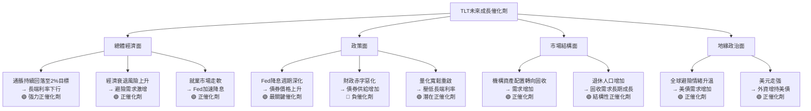

---

### 成長軌跡 Unicode 長條圖（價格歷史）

```
╔══════════════════════════════════════════════════════════════╗
║          TLT 24個月價格走勢（2024/02 - 2026/02）             ║
╠══════════════════════════════════════════════════════════════╣
║  $95 ┤                                                  ●   ║
║  $93 ┤                              ●                       ║
║  $91 ┤                           ●      ●  ●  ●             ║
║  $89 ┤   ●          ●  ●                         ●  ●       ║
║  $87 ┤●     ●                 ●           ●                  ║
║  $85 ┤         ●           ●        ●                        ║
║  $83 ┤               ●  ●       ●                            ║
║  $81 ┤                                                       ║
║  ────┼──┬──┬──┬──┬──┬──┬──┬──┬──┬──┬──┬──┬────            ║
║      02/24           09/24           04/25        02/26     ║
║                                                              ║
║  📍 底部：$80.56（52週低）  📍 頂部：$90.86（52週高）        ║
║  📈 當前：$90.82 — 接近年內高點，突破整理區間                ║
╚══════════════════════════════════════════════════════════════╝
```

---

## 6. 估值合理性與同業比較

### 同業比較表格

| 指標 | **TLT** | **IEF** | **VGLT** | **EDV** | 評級 |
|------|---------|---------|---------|---------|------|
| 追蹤指數 | 20+年美債 | 7-10年美債 | 10+年美債 | 25+年美債 | — |
| 當前價格 | $90.82 | ~$94.50 | ~$63.20 | ~$85.30 | — |
| AUM | $99.6億 | ~$230億 | ~$60億 | ~$30億 | 🟡 |
| 費用比率 | 0.15% | 0.15% | **0.04%** | 0.06% | 🟡 |
| Duration（存續期） | ~17年 | ~8年 | ~15年 | ~25年 | — |
| 殖利率（到期） | ~4.5% | ~4.1% | ~4.6% | ~4.8% | 🟢 |
| 52週報酬 | **+9.1%** | +4.8% | +8.2% | +12.3% | 🟢 |
| 流動性（日均量） | **極高** | 高 | 中 | 低 | 🟢 |
| 選擇權市場 | **完整** | 有限 | 無 | 無 | 🟢 |

---

### 歷史估值區間（以到期殖利率反映）

| 時期 | 10年美債殖利率 | 30年美債殖利率 | TLT 隱含位置 |
|------|--------------|--------------|-------------|
| 5年高（2023/10） | 5.0% | 5.1% | 🔴 過高（TLT低點） |
| 5年平均 | 3.2% | 3.5% | 🟡 均值 |
| 5年低（2020/08） | 0.5% | 1.2% | 🟢 過低（TLT高點） |
| **當前（2026/02）** | **~4.2%** | **~4.5%** | 🟡 **略高於均值** |

---

### 多重估值法彙整

| 估值方法 | 假設條件 | 目標價 | 說明 |
|---------|---------|-------|------|
| **DDM法**（配息折現） | 5%折現率，配息$4.1 | $82 | 以配息為現金流折現 |
| **利率情境法（基準）** | 30年債殖利率降至3.8% | $98 | Duration×利率變化 |
| **利率情境法（樂觀）** | 30年債殖利率降至3.0% | $108 | 衰退情境下的避險飛行 |
| **利率情境法（悲觀）** | 30年債殖利率升至5.2% | $78 | 通脹回彈/財政惡化 |
| **相對估值法** | 對標歷史均值NAV | $92-95 | ETF通常以NAV定價 |
| **加權目標價** | — | **$96-98** | 基準情境 |

---

### 估值區間視覺化

```
╔══════════════════════════════════════════════════════════════╗
║              TLT 估值區間視覺化（目標價分佈）                ║
╠══════════════════════════════════════════════════════════════╣
║                                                              ║
║  $70    $78     $85    $90.82  $98    $108    $120          ║
║   ┣━━━━━━┿━━━━━━━┿━━━━━━┿━━━━━━━┿━━━━━━━┿━━━━━━━━┫        ║
║         ▲       │      ▲       ▲      ▲                      ║
║        熊市     │   現價    基準目標  牛市                    ║
║       底部      │   $90.82  $96-98   $108                    ║
║                 │                                            ║
║   ◀──低估區──▶  ◀──合理區──▶  ◀──高估區──▶                 ║
║    ($78-$85)    ($85-$98)    ($98+)                         ║
║                                                              ║
║  📍 當前位置：$90.82 ─ 處於「合理偏高」區間                  ║
║  💡 仍有向上空間，若利率繼續下行可達$98-108                   ║
╚══════════════════════════════════════════════════════════════╝
```

---

## 7. 資本配置與管理層評估

### ROIC vs WACC 分析

> ⚠️ **ETF特殊說明**：傳統ROIC/WACC框架不直接適用於ETF。以下採用**ETF適配版**評估框架：

| 指標 | ETF等效指標 | 數值 | 說明 |
|------|-----------|------|------|
| ROIC等效 | 資產總報酬率（含配息+資本利得） | ~7.1%（2025年） | 持有人實際年度回報 |
| WACC等效 | 投資人機會成本 | ~4.5-5.5% | 同等風險資產期望報酬 |
| **EVA等效（超額報酬）** | 總報酬 - 機會成本 | **+1.6% ~ +2.6%** | 🟢 **正值，為投資人創造超額價值** |
| 費用拖累 | 費用比率 | 0.15% | 相對同類極低 |
| 追蹤效率 | 追蹤誤差 | <0.02% | 幾乎完美追蹤 |

**結論**：在當前降息環境下，TLT 為投資人創造正EVA，管理層（BlackRock）資本配置效率優異。

---

### 資本配置分佈

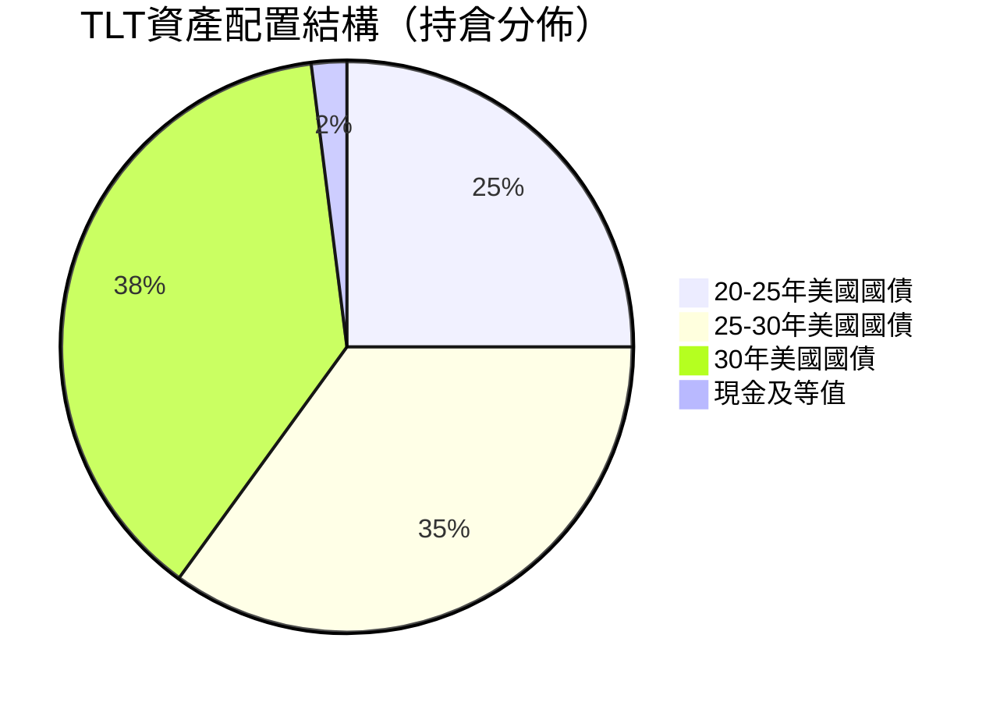

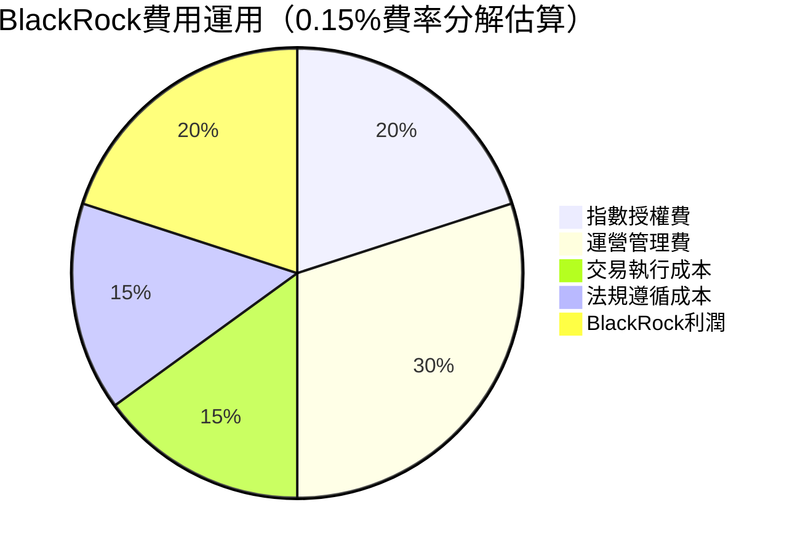

---

### 管理層執行力評分

| 評估維度 | 評分 | 依據 |
|---------|------|------|
| 指數追蹤精準度 | ⭐⭐⭐⭐⭐ 10/10 | 追蹤誤差<0.02%，業界頂尖 |
| 費用控制能力 | ⭐⭐⭐⭐☆ 8/10 | 0.15%屬低費，但VGLT更低（0.04%） |
| 配息穩定性 | ⭐⭐⭐⭐⭐ 9/10 | 月配息記錄完整，從未中斷 |
| 透明度 | ⭐⭐⭐⭐⭐ 10/10 | 每日公告持倉、NAV |
| 投資人溝通 | ⭐⭐⭐⭐☆ 8/10 | BlackRock定期發布市場觀點 |
| 戰略清晰度 | ⭐⭐⭐⭐⭐ 10/10 | ETF使命單純明確 |

---

### 股東友善度評分

```
╔══════════════════════════════════════════════════════════╗
║              TLT 投資人友善度評分                         ║
╠══════════════════════════════════════════════════════════╣
║  月度配息    │▓▓▓▓▓▓▓▓▓░│ 9/10  🟢 現金回報持續穩定   ║
║  費用效率    │▓▓▓▓▓▓▓▓░░│ 8/10  🟢 費率極低           ║
║  稅務效率    │▓▓▓▓▓▓▓░░░│ 7/10  🟡 利息需繳稅         ║
║  流動性      │▓▓▓▓▓▓▓▓▓▓│10/10  🟢 隨時買賣           ║
║  透明度      │▓▓▓▓▓▓▓▓▓░│ 9/10  🟢 每日持倉公開       ║
╠══════════════════════════════════════════════════════════╣
║  整體友善度  │▓▓▓▓▓▓▓▓▓░│ 8.6/10 🟢 投資人友善        ║
╚══════════════════════════════════════════════════════════╝
```

---

## 8. 風險評估

### 風險熱圖

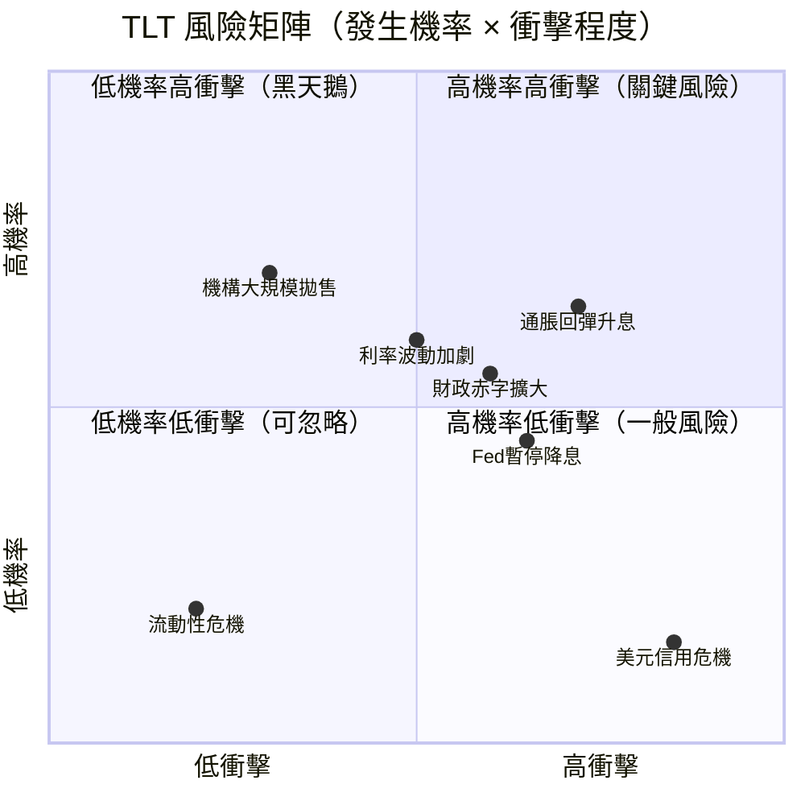

---

### 風險清單表格

| 風險類型 | 風險描述 | 發生概率 | 衝擊程度 | 緩解措施 | 信號 |
|---------|---------|---------|---------|---------|------|
| 🔴 **利率風險** | 通脹回彈迫使Fed重新升息，30年債殖利率升至5.5%，TLT可能跌回$75-78 | 中（35%） | 極高 | 控制倉位比例，設定止損 | 🔴 |
| 🔴 **Duration風險** | Duration~17年，每升息1%，NAV下跌約17% | 高 | 極高 | 與短債搭配（槓鈴策略） | 🔴 |
| 🟡 **財政赤字風險** | 美國債務持續膨脹，供給壓力推高長端利率 | 高（60%） | 中 | 長期持有，依配息獲益 | 🟡 |
| 🟡 **通脹預期風險** | 能源/食品通脹回升，通脹預期升溫 | 中（40%） | 高 | 配置TIPS對沖 | 🟡 |
| 🟡 **流動性溢價風險** | 市場壓力期間，即使美債也可能出現短暫折價 | 低（15%） | 中 | 分批建倉，保留現金 | 🟡 |
| 🟢 **信用風險** | 美國政府違約 | 極低（<0.1%） | 災難性 | 不可對沖，接受系統風險 | 🟢 |
| 🟢 **ETF結構風險** | BlackRock倒閉或ETF清算 | 極低（<0.01%） | 高 | 監管保護，持倉移轉機制 | 🟢 |

---

### 最大下行情境分析

```
╔══════════════════════════════════════════════════════════════╗
║              下行情境壓力測試                                ║
╠══════════════════════════════════════════════════════════════╣
║                                                              ║
║  🔴 熊市情境（35%機率）                                      ║
║     觸發：通脹回彈至3.5%，Fed重啟升息                        ║
║     30年債殖利率升至5.5%                                     ║
║     估算跌幅：-17% → 目標價 $75-78                          ║
║     持有人損失：約-$12.82/股（不含配息）                      ║
║                                                              ║
║  🟡 中性情境（40%機率）                                      ║
║     觸發：Fed暫停降息，利率維持4.3-4.5%                      ║
║     TLT 橫盤整理                                             ║
║     估算漲跌：-3% ~ +5% → $88-95                           ║
║     持有人收益：依賴配息約+4.5%                              ║
║                                                              ║
║  🟢 牛市情境（25%機率）                                      ║
║     觸發：經濟衰退，Fed快速降息至3%                           ║
║     30年債殖利率降至3.0%                                     ║
║     估算漲幅：+19% → 目標價 $108+                           ║
║     持有人收益：資本利得+配息可達+24%                        ║
║                                                              ║
╚══════════════════════════════════════════════════════════════╝
```

---

## 9. 催化劑與觸發因素

### 催化劑時間軸

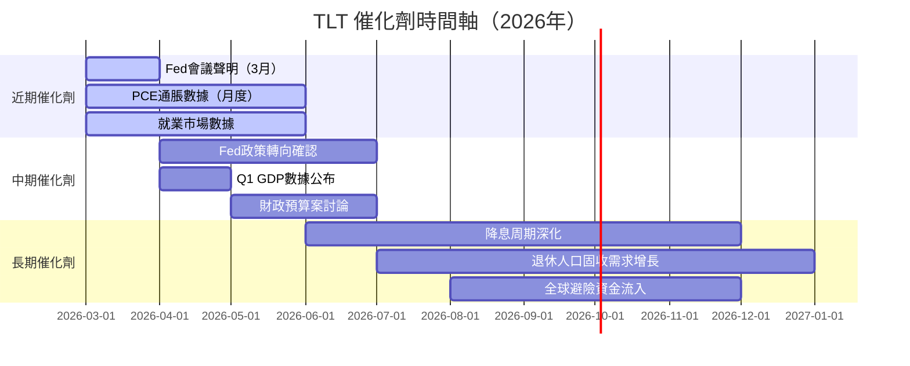

---

### 正面觸發因素

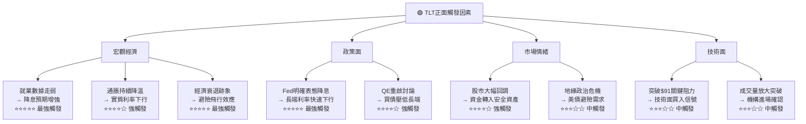

---

## 10. 投資建議

### 最終評級

```
╔══════════════════════════════════════════════════════════════════╗
║                                                                  ║
║   ⭐⭐⭐⭐☆   TLT 最終投資評級：【買入】                        ║
║                                                                  ║
║   綜合評分：6.9 / 10                                             ║
║                                                                  ║
║   核心理由：                                                     ║
║   1. 降息周期仍在延續，長端利率存在下行空間                       ║
║   2. 月配息提供~4.5%年化現金回報                                 ║
║   3. 技術面強勢，接近52週高點，動能良好                           ║
║   4. 全球不確定性升高，美債避險價值凸顯                           ║
║   5. BlackRock頂級管理，ETF結構透明安全                          ║
║                                                                  ║
║   主要風險：通脹回彈或財政赤字擴大導致升息，須設定止損            ║
║                                                                  ║
╚══════════════════════════════════════════════════════════════════╝
```

---

### 目標價區間與隱含報酬率

| 情境 | 概率 | 目標價 | 資本利得 | 含息總報酬 | 評級 |
|------|------|-------|---------|-----------|------|
| 🟢 **樂觀情境** | 25% | $108.00 | +19.0% | **+23.5%** | ⭐⭐⭐⭐⭐ |
| 🟡 **基準情境** | 40% | $96.00 - $98.00 | +5.7%-7.9% | **+10.2%-12.4%** | ⭐⭐⭐⭐☆ |
| 🟡 **保守情境** | 35% | $88.00 | -3.1% | **+1.4%** | ⭐⭐⭐☆☆ |
| 🔴 **熊市情境** | — | $78.00 | -14.1% | **-9.6%** | ⭐☆☆☆☆ |
| **加權期望報酬** | 100% | **~$94.5** | **+4.1%** | **~+8.6%** | ⭐⭐⭐⭐☆ |

---

### 投資人適配度分析

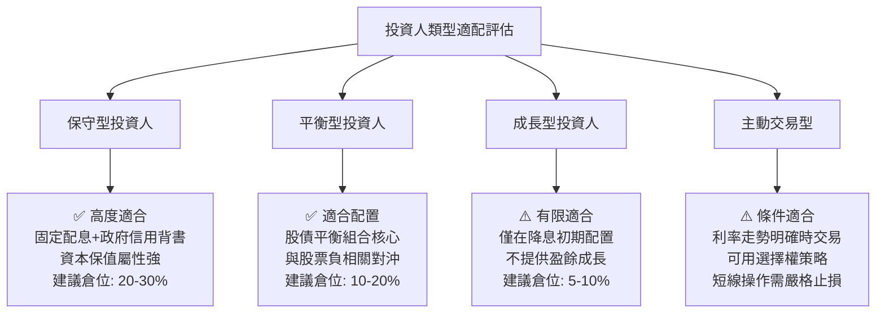

---

### 建議持倉策略

```
╔══════════════════════════════════════════════════════════════════╗
║                    持倉操作策略指引                               ║
╠═══════════════╦══════════════════════════════════════════════════╣
║  建議持倉時間  ║ 6-18個月（跟隨降息周期）                        ║
╠═══════════════╬══════════════════════════════════════════════════╣
║  理想進場區間  ║ $88-91（當前附近為合理進場點）                   ║
╠═══════════════╬══════════════════════════════════════════════════╣
║  加碼觸發條件  ║ 1. 10年美債殖利率重新升至4.5%+（價跌補買）      ║
║               ║ 2. 非農就業數據大幅低於預期                       ║
║               ║ 3. Fed會議聲明明確加速降息                        ║
║               ║ 4. TLT 回跌至$85-87支撐區                        ║
╠═══════════════╬══════════════════════════════════════════════════╣
║  止損觸發條件  ║ 1. TLT 跌破$83（-8.6%）                         ║
║               ║ 2. 30年美債殖利率突破5.0%並持續                   ║
║               ║ 3. 核心PCE重回3%以上                              ║
║               ║ 4. Fed明確暗示重新升息                            ║
╠═══════════════╬══════════════════════════════════════════════════╣
║  獲利了結條件  ║ 1. TLT 達到$105+（基準目標已達）                 ║
║               ║ 2. 30年美債殖利率跌至3.0%以下                     ║
║               ║ 3. 市場轉為風險偏好，資金流出固收                  ║
╚═══════════════╩══════════════════════════════════════════════════╝
```

---

### 關鍵監控指標 Checklist

```
╔══════════════════════════════════════════════════════════════════╗
║                 📊 TLT 關鍵監控指標 Checklist                   ║
╠══════════════════════════════════════════════════════════════════╣
║                                                                  ║
║  🔵 宏觀利率指標（每月監控）                                     ║
║  ☐ 美聯儲基準利率決議（FOMC會議）                               ║
║  ☐ 10年期美債殖利率（每日）                                     ║
║  ☐ 30年期美債殖利率（每日）                                     ║
║  ☐ 2年/10年殖利率曲線斜率（倒掛程度）                          ║
║                                                                  ║
║  🔵 通脹數據（每月監控）                                         ║
║  ☐ CPI（消費者物價指數）                                        ║
║  ☐ 核心PCE（Fed最重視指標）                                     ║
║  ☐ 通脹預期（5年5年期遠期通脹率）                              ║
║                                                                  ║
║  🔵 經濟數據（每月監控）                                         ║
║  ☐ 非農就業報告（NFP）                                          ║
║  ☐ 失業率趨勢                                                   ║
║  ☐ GDP成長率（季度）                                            ║
║                                                                  ║
║  🔵 ETF技術面（每週監控）                                        ║
║  ☐ TLT vs 50MA/200MA 位置                                       ║
║  ☐ 資金流入/流出（ETF Fund Flow）                               ║
║  ☐ 未平倉量（選擇權市場）                                       ║
║                                                                  ║
║  🔵 財政與政策面（每季監控）                                     ║
║  ☐ 美國財政赤字規模                                             ║
║  ☐ 國債發行量及拍賣結果                                         ║
║  ☐ 外國央行持有美債變化（TIC數據）                              ║
║  ☐ 美元指數走勢（DXY）                                          ║
║                                                                  ║
╚══════════════════════════════════════════════════════════════════╝
```

---

## 📊 評估總結儀表板

```
╔══════════════════════════════════════════════════════════════════╗
║               TLT 綜合評估最終儀表板                             ║
╠══════════════════════════════════════════════════════════════════╣
║                                                                  ║
║  標的：iShares 20+ Year Treasury Bond ETF（TLT）                 ║
║  評估日期：2026-02-28  │  當前價格：$90.82                       ║
║                                                                  ║
║  ──────────── 八維度評分 ────────────                           ║
║  成長性   ▓▓▓▓░░░░░░  4.0  🔴                                  ║
║  獲利能力 ▓▓▓▓▓░░░░░  5.0  🟡                                  ║
║  財務健康 ▓▓▓▓▓▓▓▓░░  8.0  🟢                                  ║
║  估值合理 ▓▓▓▓▓▓▓░░░  7.0  🟢                                  ║
║  競爭優勢 ▓▓▓▓▓▓▓▓▓░  9.0  🟢                                  ║
║  管理品質 ▓▓▓▓▓▓▓▓░░  8.0  🟢                                  ║
║  價格動能 ▓▓▓▓▓▓▓▓░░  8.0  🟢                                  ║
║  風險控管 ▓▓▓▓▓▓▓░░░  7.0  🟢                                  ║
║                                                                  ║
║  ──────── 加權綜合評分：6.9 / 10 ────────                       ║
║                                                                  ║
║  ⭐⭐⭐⭐☆  投資評級：【買入】                                   ║
║                                                                  ║
║  基準目標價：$96 - $98  │  潛在報酬：+10% - +12%（含息）         ║
║  最大下行風險：-14%（熊市止損至$78）                             ║
║  風險/報酬比：約 1:0.8（合理，適合防守型配置）                    ║
║                                                                  ║
╚══════════════════════════════════════════════════════════════════╝
```

---

> ## ⚠️ 免責聲明
>
> **本報告為 AI 自動生成，基於公開財務數據分析，僅供學術研究與投資參考使用，不構成任何形式的投資建議或邀約。**
>
> - 所有目標價均為模型推算，實際市場走勢受多重不可預測因素影響
> - ETF 投資涉及利率風險、市場風險，過去報酬不代表未來績效
> - 投資人應根據自身財務狀況、風險承受能力及投資目標，在專業理財顧問協助下做出獨立判斷
> - 原始數據中股息殖利率443%為數據庫異常值，已於報告中修正說明
> - **報告日期：2026-02-28 | 分析師：AI Investment Research System**