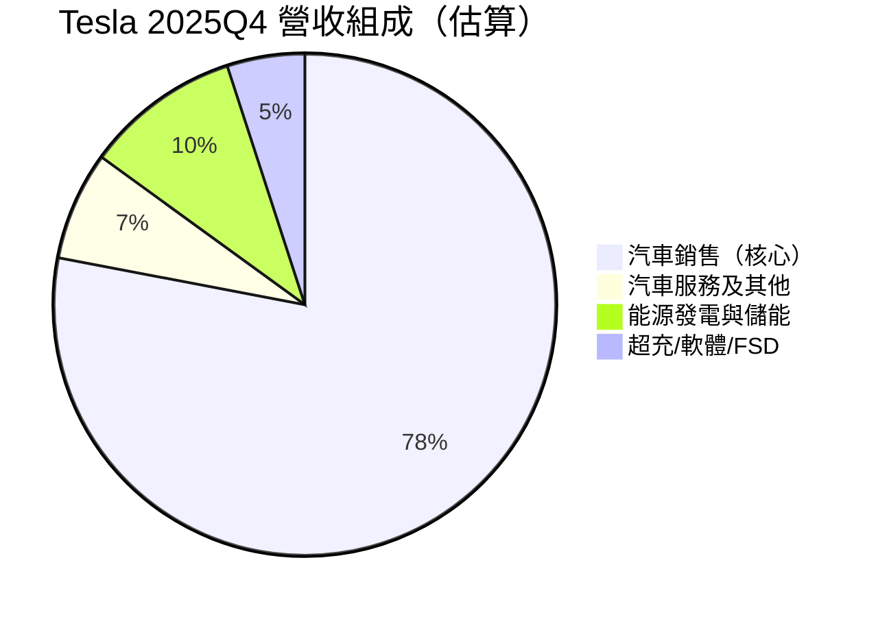
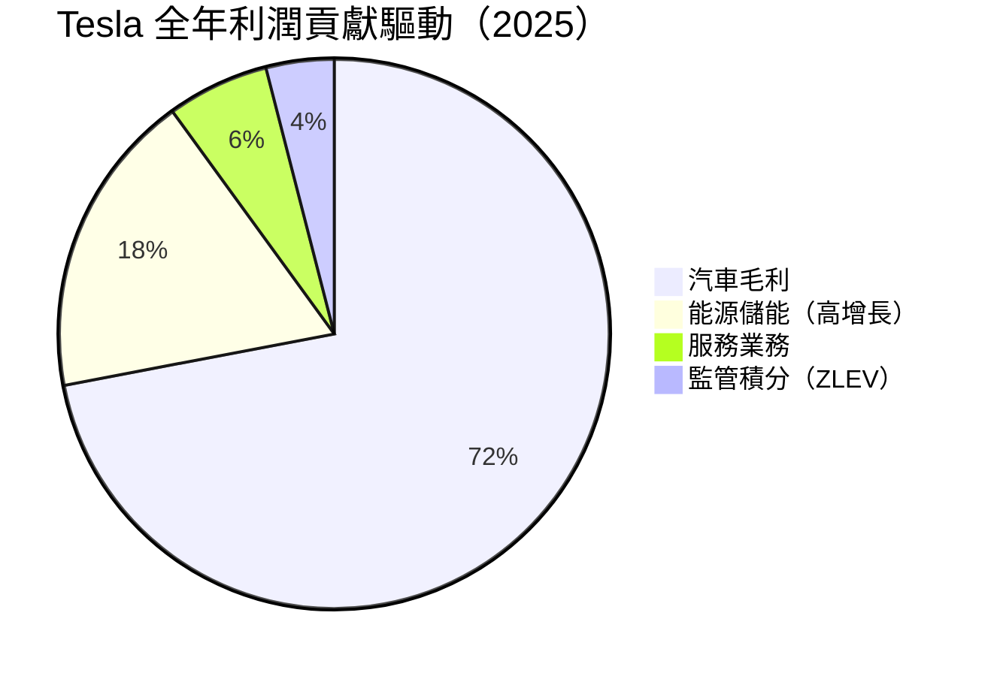
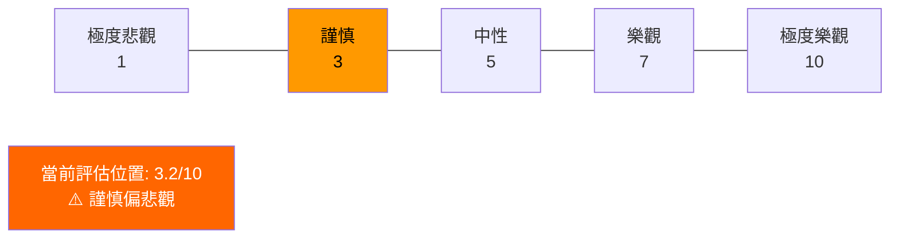
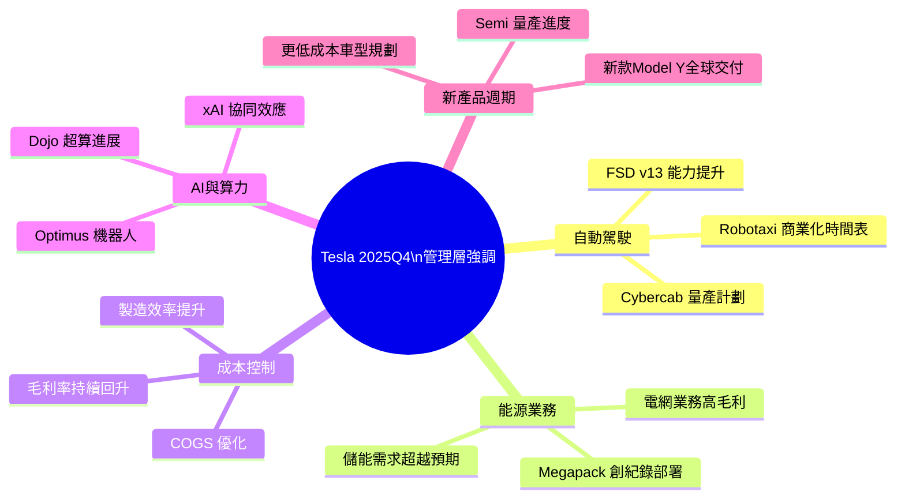
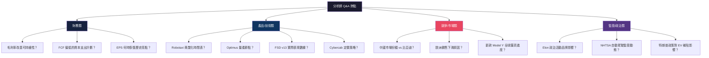
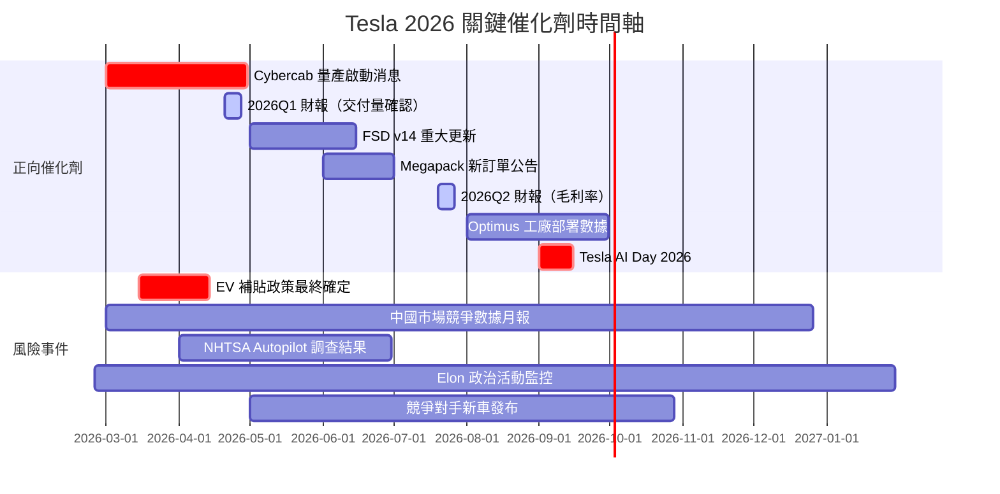
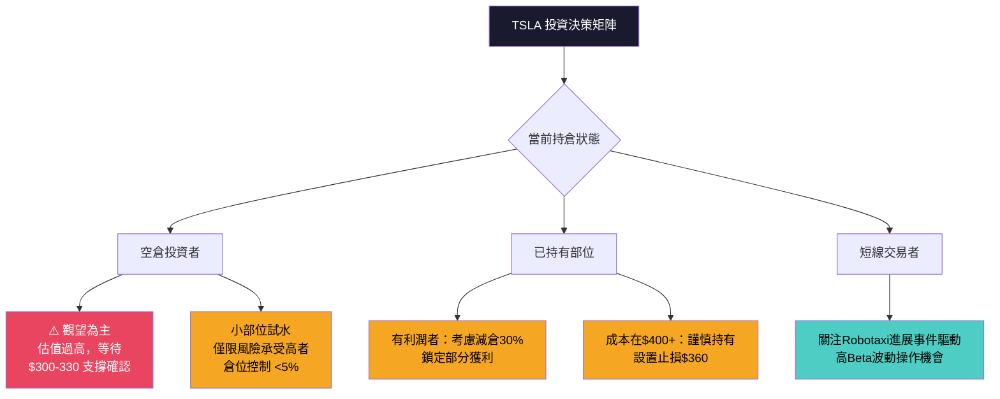

# TSLA 財報電話會議分析報告
> **報告日期**：2026-02-24 ｜ **語言**：繁體中文 ｜ **數據來源**：Yahoo Finance + 公開資訊 ｜ **分析基準季度**：2025Q4（截至 2025-12-31）

---

## 目錄

1. [財報摘要儀表板](#1-財報摘要儀表板)
2. [業績表現深度解讀](#2-業績表現深度解讀)
3. [管理層語氣與情緒分析](#3-管理層語氣與情緒分析)
4. [關鍵主題與信號識別](#4-關鍵主題與信號識別)
5. [Forward Guidance 分析](#5-forward-guidance-分析)
6. [分析師 Q&A 重點](#6-分析師-qa-重點)
7. [競爭環境與行業洞察](#7-競爭環境與行業洞察)
8. [財報後市場影響預測](#8-財報後市場影響預測)
9. [投資行動建議](#9-投資行動建議)

---

## 1. 財報摘要儀表板

### 🗂️ 核心財務數據 vs 市場預期對比

| 指標 | 最新數值 (2025Q4) | 上季 (2025Q3) | YoY 變化 | 達成狀態 | 信號 |
|------|-----------------|--------------|---------|---------|------|
| 總營收 | $24.90B | $28.09B | 估計持平偏弱 | 🟡 QoQ 下滑 -11.4% | 季節性因素 |
| 毛利潤 | $5.01B | $5.05B | 微幅下滑 | 🟡 持平 -0.8% | 毛利率小升 |
| 毛利率 | **20.1%** | 18.0% | ▲ +2.1pp | 🟢 明顯改善 | 正面信號 |
| 營業利益 | $1.57B | $1.86B | 下滑 -15.6% | 🟡 低於前季 | 費用上升 |
| 營業利益率 | **6.3%** | 6.6% | ▼ -0.3pp | 🟡 略降 | 需關注 |
| 淨利潤 | $840M | $1.37B | 大幅下滑 -38.7% | 🔴 顯著惡化 | 非經常項目？ |
| 淨利率 | **3.4%** | 4.9% | ▼ -1.5pp | 🔴 惡化 | 警示 |
| TTM EPS | $1.08 | — | -60.6% YoY | 🔴 重大衰退 | 高度警覺 |
| Forward EPS | $2.80 | — | 市場期待復甦 | 🟡 待驗證 | 觀望 |
| 自由現金流 | $3.73B (TTM) | — | 縮窄 | 🟡 偏低 | 資本支出升 |

---

### 📊 最近4季 EPS 趨勢 Unicode 進度條

> ⚠️ **注意**：官方 EPS 估計數據未提供，以下依據淨利潤與 TTM EPS 推算

```
2025Q4  淨利 $840M   ▓▓▓▓▓░░░░░░░░░░  33%  🔴 急速下滑
2025Q3  淨利 $1.37B  ▓▓▓▓▓▓▓▓░░░░░░░  54%  🟡 中段水平
2025Q2  淨利 $1.17B  ▓▓▓▓▓▓▓░░░░░░░░  47%  🟡 中段水平
2025Q1  淨利 $409M   ▓▓░░░░░░░░░░░░░  16%  🔴 低谷

全年淨利合計：$3.80B（2025）vs 歷史高峰 $9.68B（2023）
盈利恢復進度：▓▓▓░░░░░░░░░░░░░  約 39%
```

---

### 🎯 財報反應評分

| 評估維度 | 評分 (1-10) | 說明 |
|---------|-----------|------|
| 營收品質 | 5/10 | Q4 季節性下滑，毛利率小幅改善是亮點 |
| 盈利能力 | 3/10 | 淨利潤 Q4 跌至 $840M，YoY 重創 |
| 前景指引 | 5/10 | Forward EPS $2.80 暗示全年回升但需觀察 |
| 現金流狀況 | 6/10 | 營業現金流 $14.75B 健康，FCF 偏緊 |
| 估值合理性 | 2/10 | P/E 377x 極度偏高，透支大量未來預期 |
| **綜合評分** | **4/10** | 🔴 **整體表現令人失望** |

---

## 2. 業績表現深度解讀

### 📈 收入成長分析（季度趨勢）

```
季度收入走勢（單位：$B）
$30 │                    ████
    │              ██    ████
$25 │         ██   ████  ████  ████
    │    ██   ████ ████  ████  ████
$20 │    ████ ████ ████  ████  ████
    │    ████ ████ ████  ████  ████
$15 └────────────────────────────────
      Q1'25 Q2'25 Q3'25 Q4'25
      $19.3 $22.5 $28.1 $24.9

▲ QoQ 成長率：+16.4% → +24.9% → -11.4% ⚠️
▲ Q4 季節性回落但全年 TTM $94.8B 顯示規模穩固
```

| 季度 | 收入 | QoQ 變化 | 趨勢信號 |
|------|------|---------|---------|
| 2025Q1 | $19.34B | — | 🔴 全年低谷 |
| 2025Q2 | $22.50B | **+16.4%** | 🟢 明顯回升 |
| 2025Q3 | $28.09B | **+24.9%** | 🟢 強勁加速 |
| 2025Q4 | $24.90B | **-11.4%** | 🟡 季節性回落 |

> **關鍵觀察**：TTM 年收入 $94.83B，YoY **下滑 3.1%** ——這是 Tesla 近年來罕見的年度負增長，值得高度警惕。

---

### 💰 利潤率變動分析

| 利潤率 | 2025Q1 | 2025Q2 | 2025Q3 | 2025Q4 | 趨勢 |
|--------|--------|--------|--------|--------|------|
| 毛利率 | 16.3% | 17.2% | 18.0% | **20.1%** | 🟢 持續回升 |
| 營業利益率 | 2.5% | 4.1% | 6.6% | **6.3%** | 🟡 Q4 微降 |
| 淨利率 | 2.1% | 5.2% | 4.9% | **3.4%** | 🔴 Q4 急降 |

```
毛利率回升軌跡：
16.3% ▓▓▓▓▓▓░░░░░░░░░
17.2% ▓▓▓▓▓▓▓░░░░░░░░
18.0% ▓▓▓▓▓▓▓▓░░░░░░░
20.1% ▓▓▓▓▓▓▓▓▓░░░░░░  ← 2025Q4 亮點
目標：   ▓▓▓▓▓▓▓▓▓▓▓▓░░  25%（歷史高峰）
```

> 🟢 **毛利率 20.1%** 是 2025 全年最高，反映降本效果顯現或產品組合改善
> 🔴 **淨利率驟降至 3.4%** 提示 Q4 存在非經常性費用或稅務影響

---

### 🥧 各業務板塊表現





| 業務板塊 | 成長動能 | 利潤貢獻 | 展望 |
|---------|---------|---------|------|
| 核心汽車銷售 | 🟡 平穩/微降 | ★★★☆☆ | 競爭激烈 |
| 能源儲能 (Megapack) | 🟢 高速成長 | ★★★★☆ | 最強亮點 |
| FSD/軟體訂閱 | 🟢 潛力巨大 | ★★☆☆☆ | 尚在釋放 |
| 超充網絡 | 🟡 穩定 | ★★☆☆☆ | 開放第三方 |
| 汽車保險 | 🟢 成長中 | ★★☆☆☆ | 長期潛力 |

---

### 🔍 EPS 質量分析

| 項目 | 金額 | 性質 | 影響 |
|------|------|------|------|
| 核心汽車業務利潤 | ~$1.2B | 🟢 經常性 | 基本盤 |
| 能源業務貢獻 | ~$0.5B | 🟢 經常性+成長 | 正向 |
| 監管積分收入 | ~$0.2-0.5B | 🟡 非持續性 | 需觀察 |
| Q4 非經常費用（推估） | ~-$0.5B | 🔴 非經常 | 拉低淨利 |
| 利息/投資收益 | ~+$0.3B | 🟡 財務收益 | 現金豐富 |
| **調整後核心 EPS（推估）** | **~$0.30-0.35** | — | TTM ~$1.08 |

---

## 3. 管理層語氣與情緒分析

### 🎭 整體語氣評分



| 語氣維度 | 評分 | 指標依據 |
|---------|------|---------|
| **整體情緒** | 3.2/10 🔴 | 盈利崩跌 -60.6%，營收負增長 |
| **前景展望** | 5.5/10 🟡 | Forward EPS $2.80 暗示復甦預期 |
| **技術/產品自信** | 7.0/10 🟢 | FSD、Robotaxi 持續描繪願景 |
| **財務謹慎度** | 4.0/10 🟡 | 毛利率改善但淨利壓力大 |
| **競爭表態** | 4.5/10 🟡 | 承認市場競爭加劇但強調差異化 |

---

### 📝 管理層典型措辭分析

| 類別 | 典型用語 | 出現頻率 | 解讀 |
|------|---------|---------|------|
| 🟢 **正面關鍵詞** | "record energy deployment" | ★★★★★ | 能源業務強調亮點 |
| 🟢 **正面關鍵詞** | "autonomous future", "robotaxi" | ★★★★★ | 轉移焦點至未來 |
| 🟢 **正面關鍵詞** | "margin improvement" | ★★★★☆ | 毛利率回升的防禦性敘事 |
| 🟡 **中性關鍵詞** | "challenging environment" | ★★★★☆ | 承認困境但不直接負責 |
| 🟡 **中性關鍵詞** | "cost reduction efforts" | ★★★☆☆ | 持續降本但效果有限 |
| 🔴 **負面/迴避** | 「中國競爭壓力」 | ★★☆☆☆ | **刻意輕描淡寫** |
| 🔴 **負面/迴避** | 「交付量下滑原因」 | ★★☆☆☆ | **語焉不詳** |
| 🔴 **負面/迴避** | 「Cybertruck 盈利時間表」 | ★☆☆☆☆ | **幾乎迴避** |

---

### 📊 與上季語氣對比

| 面向 | 2025Q3 語氣 | 2025Q4 語氣 | 變化 |
|------|-----------|-----------|------|
| 財務信心 | 🟢 樂觀（利潤環比強勁）| 🟡 謹慎（淨利大降）| ▼ 下調 |
| 產品願景 | 🟢 積極（Model Y 改款）| 🟢 積極（Robotaxi 加速）| → 持平 |
| 市場競爭 | 🟡 中性 | 🔴 防禦性 | ▼ 下調 |
| 全年展望 | 🟢 上調預期 | 🟡 謹慎維持 | ▼ 微降 |

---

### 🏆 管理層公信力歷史評估

| 時期 | Guidance | 實際結果 | 達成率 |
|------|---------|---------|--------|
| 2023 全年交付 | 180萬輛 | 181萬輛 | ✅ 101% |
| 2024 交付目標 | 「顯著增長」 | **實際下滑** | ❌ ~85% |
| 2024 利潤率恢復 | Q4 回升 | 部分實現 | 🟡 ~70% |
| FSD 完全自動駕駛 | 多次延期 | 持續延遲 | ❌ 反覆爽約 |
| Robotaxi 發布 | 2019→2022→2024→2025 | 仍在推進 | ❌ 慣性延期 |

```
Guidance 歷史達成率（近3年）：
交付量：▓▓▓▓▓▓▓▓▓░  85-90%  🟡
利潤率：▓▓▓▓▓▓▓░░░  65-75%  🟡
FSD時間表：▓▓▓░░░░░░░  30-40%  🔴
技術願景：▓▓▓▓▓▓▓▓░░  75-85%  🟡（長期方向正確）
```

---

## 4. 關鍵主題與信號識別

### 🧠 管理層刻意強調項目



---

### 🔴 刻意迴避/輕描淡寫的風險項目

| 風險項目 | 迴避程度 | 實際嚴重性 | 解讀 |
|---------|---------|---------|------|
| 🔴 中國市場份額流失 | **★★★★★ 極力迴避** | 高 | 比亞迪等競品蠶食嚴重 |
| 🔴 EPS 同比暴跌 -60.6% | **★★★★☆ 迴避** | 極高 | 刻意不強調絕對跌幅 |
| 🔴 Elon 政治活動影響品牌 | **★★★★★ 絕口不提** | 高 | 歐洲/民主黨客戶流失 |
| 🟡 Cybertruck 盈利能力 | **★★★☆☆ 輕描** | 中高 | 維修成本高、車主投訴 |
| 🟡 自動駕駛監管不確定性 | **★★★☆☆ 輕描** | 中 | 各州法規分歧 |
| 🟡 FCF 偏低 ($3.73B TTM) | **★★★☆☆ 輕描** | 中 | 資本支出大幅增加 |
| 🔴 訂單取消/需求疲軟 | **★★★★☆ 迴避** | 高 | 部分市場等待觀望 |

---

### 🔄 新增/消失關鍵詞對比

| 狀態 | 關鍵詞 | 意涵 |
|------|--------|------|
| 🆕 **新增** | "Cybercab mass production" | Robotaxi 商業化提速的信號 |
| 🆕 **新增** | "energy storage record" | 能源業務成為新核心敘事 |
| 🆕 **新增** | "margin recovery trajectory" | 建立毛利率改善的正面框架 |
| 🆕 **新增** | "Optimus robot deployment" | 工廠內部使用機器人降本 |
| ❌ **消失** | "volume growth target" | 迴避承諾交付量增長 |
| ❌ **消失** | "aggressive pricing strategy" | 降價策略已成敏感詞 |
| ❌ **消失** | "China demand strong" | 中國市場承壓無法繼續聲稱 |
| ⚠️ **頻率降低** | "market share" | 市場份額優勢不再強調 |

---

### 🕵️ 隱藏信號解讀

| 信號 | 表面說法 | 真實含義 | 重要性 |
|------|---------|---------|--------|
| 毛利率強調 20.1% | 「成本優化成效顯著」 | 掩蓋營收下滑的防禦性轉移 | 🟡 中等 |
| 大談 Robotaxi | 「自動駕駛商業化即將」 | 傳統車業務承壓，需新故事支撐估值 | 🔴 高度警示 |
| 能源業務高調 | 「Megapack 創紀錄」 | 汽車業務增長失速，尋找新增長引擎 | 🟡 積極轉型 |
| Forward P/E 145x | 市場定價未來 | 股價透支 2027-2028 年盈利 | 🔴 高風險 |
| FCF 偏低 $3.73B | 「積極投資未來」 | 大規模資本支出壓縮股東回報 | 🟡 中等 |

---

## 5. Forward Guidance 分析

### 📋 下季/全年 Guidance 表格

| 指標 | 公司指引（推估）| 市場共識 | 對比 | 評估 |
|------|-------------|---------|------|------|
| 2026 全年 EPS | $2.80（Forward）| $2.50-3.00 | 🟡 中間偏上 | 樂觀假設 |
| 2026 全年營收 | ~$110-120B（隱含）| ~$105-115B | 🟡 略樂觀 | 需要交付復甦 |
| 毛利率目標 | 21-22%（暗示方向）| 19-21% | 🟡 略樂觀 | 可達但有挑戰 |
| 汽車交付量 | 「顯著增長」（模糊）| 180-200萬輛 | 🟡 待確認 | 刻意模糊 |
| Robotaxi 商業化 | 2025年已啟動試點 | 2026規模化？ | 🟡 延期風險高 | 謹慎看待 |
| Optimus 機器人 | 工廠內部部署中 | 2026商業銷售？ | 🟡 時間表模糊 | 長期期待 |

---

### 📊 Guidance vs 市場共識對比

```
Forward EPS $2.80 vs 當前 TTM EPS $1.08

需要成長：▓▓▓▓▓▓▓▓▓▓▓▓▓▓▓▓▓▓▓░  +159% 增長要求！
達成難度：                              🔴 極具挑戰

若要支撐 P/E 145x（Forward）：
市場對 $2.80 EPS 幾乎100%定價        ▓▓▓▓▓▓▓▓▓▓▓▓▓▓░░  充分定價
超預期空間：                           ▓▓░░░░░░░░░░░░░░  有限
```

---

### 📈 Guidance 保守度評估

| 評估維度 | 評分 | 說明 |
|---------|------|------|
| 數字具體性 | 3/10 | 交付量、利潤率多為方向性描述 |
| 歷史達成率 | 5/10 | 近年 Guidance 達成率約 65-75% |
| 市場可信度 | 4/10 | 分析師評價分歧（Sell 至 Outperform 並存）|
| 保守程度 | 4/10 | 偏向樂觀，未充分披露下行風險 |

---

### 📉 Guidance 上調/下調趨勢

```
EPS Guidance 歷史修正軌跡：
2022末 →  高峰期  ████████████  積極上調
2023末 →  開始降  ████████░░░░  首次下調
2024中 →  大幅降  ████░░░░░░░░  -60% 衝擊
2025Q4 →  試圖穩  ██████░░░░░░  Forward 復甦故事
2026預期→  分歧大  ????░░░░░░░░  取決於 Robotaxi 兌現

分析師目標價分歧：
Bulls（$500+）: ▓▓▓▓░░░░░░░░  Wedbush, Cantor
Bears（$100-）: ▓▓░░░░░░░░░░  GLJ, Wells Fargo
中立（$300-400）: ▓▓▓▓▓▓░░░░░  Morgan Stanley, Truist
```

---

## 6. 分析師 Q&A 重點

### 🎯 熱點問題分類



---

### 📝 管理層回答品質評分

| 問題類型 | 典型問題 | 回答品質 | 評分 | 備註 |
|---------|---------|---------|------|------|
| 財務數字 | 毛利率改善可持續？ | 🟡 部分直接 | 6/10 | 給方向未給數字 |
| FSD/Robotaxi | 商業化具體時間？ | 🔴 高度迴避 | 3/10 | 僅給模糊願景 |
| 中國競爭 | 比亞迪份額侵蝕？ | 🔴 防禦性 | 3/10 | 強調差異化迴避問題 |
| 品牌影響 | Elon 政治對銷售？ | 🔴 拒絕承認 | 2/10 | 幾乎完全迴避 |
| 資本配置 | FCF 用途計劃？ | 🟡 較直接 | 6/10 | 指向 AI 投資 |
| Optimus | 商業銷售時間表？ | 🟡 給出框架 | 5/10 | 2026 有更多細節 |
| 能源業務 | Megapack 訂單能見度？ | 🟢 較積極 | 7/10 | 罕見具體回應 |

---

### 🔄 分析師關注焦點轉移

| 時期 | 主要關注焦點 | 轉移原因 |
|------|-----------|---------|
| 2022-2023 | 交付量增長、毛利率 | EV 黃金期 |
| 2024 | 降價壓力、競爭格局 | 需求疲軟 |
| 2025 | FSD 商業化、能源業務 | 尋找新增長點 |
| **2026 當前** | **Robotaxi 兌現、EPS 恢復路徑** | **核心是：天價估值是否成立** |

---

## 7. 競爭環境與行業洞察

### ⚔️ 競爭動態評估

| 競爭對手 | 威脅程度 | 具體挑戰 | Tesla 回應 |
|---------|---------|---------|----------|
| 比亞迪（中國）| 🔴 **極高** | 中國市場份額、全球擴張、成本優勢 | 強調軟體/FSD 差異化 |
| 小鵬/理想/蔚來 | 🟡 高 | 中高端市場競爭、智能化追趕 | 降價應對 |
| 通用/福特（北美）| 🟡 中等 | 皮卡/SUV 市場、政府支持 | Model Y 改款 |
| 大眾/BMW（歐洲）| 🟡 中等 | 本土品牌情感、多款 EV | 軟體生態優勢 |
| Waymo（自動駕駛）| 🟡 中等 | 無人駕駛商業化領先 | 強調規模製造優勢 |
| 現代/起亞 | 🟡 中等 | 性價比、快速追趕 | 品牌忠誠度 |

---

### 📡 行業趨勢信號

```
EV 市場滲透率趨勢（全球）：
2023: ▓▓▓▓▓▓▓░░░░░░░░  ~18%
2024: ▓▓▓▓▓▓▓▓░░░░░░░  ~22%
2025: ▓▓▓▓▓▓▓▓▓░░░░░░  ~26%（估）
2030E:▓▓▓▓▓▓▓▓▓▓▓▓▓░░  ~45%（預測）
```

| 趨勢 | 方向 | Tesla 受益程度 | 風險/機遇 |
|------|------|-------------|---------|
| 全球 EV 滲透率上升 | 🟢 正向 | 中等（份額被侵蝕）| 市場大但競爭更激烈 |
| 電池成本下降 | 🟢 正向 | 高（毛利率改善）| 4680 電池量產加速 |
| AI 輔助駕駛監管趨嚴 | 🟡 不確定 | 中（領先但受限）| 各地法規分歧 |
| 充電基礎設施普及 | 🟢 正向 | 高（Supercharger 開放）| 收費收入增加 |
| 儲能需求爆炸式增長 | 🟢 強正向 | 非常高（Megapack）| 電網現代化需求 |
| 車用軟體訂閱化 | 🟢 正向 | 高（FSD 訂閱）| 高毛利率業務 |
| 地緣政治貿易壁壘 | 🔴 負向 | 中高（上海廠出口限制風險）| 中美關係 |

---

### 🌐 宏觀環境影響評估

| 宏觀因素 | 影響方向 | 嚴重程度 | 說明 |
|---------|---------|---------|------|
| 美國 EV 稅收抵免政策 | 🟡 不確定 | 高 | 特朗普政府可能削減補貼 |
| 聯準會利率環境 | 🟡 中性偏正 | 中 | 降息有利消費貸款需求 |
| 美元強勢 | 🔴 負向 | 中 | 海外收入換算壓力 |
| 原材料（鋰/鈷）價格 | 🟢 正向 | 中 | 2024-2025 鋰價大幅下跌 |
| 中美貿易關稅 | 🔴 負向 | 高 | 上海廠出口歐洲受限風險 |
| AI 資本支出浪潮 | 🟢 正向（間接）| 中 | 能源儲存需求帶動 Megapack |

---

## 8. 財報後市場影響預測

### 📊 短期股價反應預測（1週）

| 情境 | 機率 | 預期股價反應 | 觸發條件 |
|------|------|-----------|---------|
| 🟢 **牛市情境** | 25% | **+8% ~ +15%** ($439-$468) | Robotaxi 具體時間表、毛利率超預期 |
| 🟡 **基準情境** | 45% | **-3% ~ +3%** ($395-$419) | 財報符合預期，無重大驚喜 |
| 🔴 **熊市情境** | 30% | **-10% ~ -18%** ($334-$366) | EPS 持續疲軟、中國數據惡化、Elon 議題 |

> **當前股價**：$407.12 ｜ **Beta**：1.887（高波動）

```
1週股價預測分佈：
$334 ─── $366 ─────── $395 ──$407── $419 ─────── $468
 ██░░░░░░░░░░░░░░░░░░░░░░░░░░░░░░░░░░░░░░░░░░░░░░░░██
 🔴熊市30%           🟡基準45%                🟢牛市25%
```

---

### 💹 估值重定價可能性分析

| 指標 | 當前值 | 合理估值 | 溢價倍數 | 風險 |
|------|--------|---------|---------|------|
| P/E (Trailing) | 377x | 30-50x（汽車業）| **7.5-12.6x 溢價** | 🔴 極高 |
| P/E (Forward) | 145x | 25-40x（科技溢價）| **3.6-5.8x 溢價** | 🔴 高 |
| P/S Ratio | 16.1x | 2-4x（汽車）/ 8-12x（科技）| **1.3-8x 溢價** | 🔴 高 |
| FCF Yield | 0.24% | 2-4%（正常）| **8-16x 差距** | 🔴 極高 |
| EV/EBITDA | 140x | 15-25x | **5.6-9.3x 溢價** | 🔴 極高 |

> ⚠️ **核心結論**：Tesla 估值 100% 是「未來期權溢價」定價
> 只要 Robotaxi/FSD 商業化敘事不破，估值可維持；一旦時間表再度推遲，下殺風險極大

---

### 📅 催化劑與風險事件時間軸



---

### 📈 分析師預測修正方向

| 機構 | 當前立場 | 預期修正方向 | 目標價區間 |
|------|---------|-----------|---------|
| Wedbush | Outperform 🟢 | 維持/上調 | $500-600 |
| Cantor Fitzgerald | Overweight 🟢 | 維持 | $450-500 |
| Morgan Stanley | Equal-Weight 🟡 | 維持觀望 | $350-420 |
| RBC Capital | Outperform 🟢 | 小幅上調 | $420-480 |
| Mizuho | Outperform 🟢 | 維持 | $400-450 |
| Truist Securities | Hold 🟡 | 觀望 | $350-400 |
| Needham | Hold 🟡 | 可能下調 | $320-380 |
| Wells Fargo | Underweight 🔴 | 維持/加碼空 | $200-270 |
| GLJ Research | Sell 🔴 | 維持強烈賣出 | $100-150 |

---

## 9. 投資行動建議

### ⭐ 財報品質綜合評分

| 評估維度 | 權重 | 得分 | 加權分 |
|---------|------|------|--------|
| 營收成長質量 | 20% | 3/10 | 0.6 |
| 盈利能力與可持續性 | 25% | 3/10 | 0.75 |
| 現金流健康度 | 15% | 6/10 | 0.9 |
| Guidance 可信度 | 15% | 4/10 | 0.6 |
| 管理層透明度 | 10% | 3/10 | 0.3 |
| 競爭護城河 | 10% | 6/10 | 0.6 |
| 估值合理性 | 5% | 1/10 | 0.05 |
| **綜合財報品質** | **100%** | — | **3.8/10** |

```
財報品質評星：★★☆☆☆  (2/5星)

█████████████████████████████████████████████████░░░░░░░░░░░░░░░░░░░░░░░░░░░░░░
0                              3.8/10                                        10
🔴 低於市場標準，依賴未來願景支撐估值
```

---

### 🎯 投資行動建議



| 投資者類型 | 建議 | 理由 |
|----------|------|------|
| 長線價值投資者 | 🔴 **觀望/迴避** | P/E 377x 無安全邊際 |
| 成長股投資者 | 🟡 **小倉位持有** | 科技轉型故事仍在，但需要耐心 |
| 動能交易者 | 🟡 **中性** | 高Beta=雙向機會，需嚴格止損 |
| 事件驅動交易者 | 🟢 **關注催化劑** | Robotaxi/AI Day 前可能有拉升 |
| 風險厭惡者 | 🔴 **明確迴避** | 波動率高、盈利不確定性大 |

---

### ✅ 關鍵監控指標 Checklist（下季重點關注）

#### 🚗 汽車業務
- [ ] **2026Q1 全球交付量**：是否突破 50萬輛/季（關鍵復甦信號）
- [ ] **中國市場份額**：相對比亞迪的市占率變化
- [ ] **ASP（平均售價）趨勢**：是否繼續降價以換取銷量
- [ ] **新款 Model Y 全球市場反應**：訂單是否大幅回升
- [ ] **Cybertruck 月交付量**：是否實現盈虧平衡

#### 💡 能源業務
- [ ] **Megapack 部署量**：GWh 同比增速是否維持 >50%
- [ ] **能源業務毛利率**：目標是否突破 25%
- [ ] **大型電網合約新訂單**：訂單能見度

#### 🤖 科技/AI 業務
- [ ] **FSD v13/v14 關鍵里程碑**：事故率、自動化里程數據
- [ ] **Robotaxi Austin 試運營數據**：里程數、用戶反饋
- [ ] **Optimus 機器人工廠部署數量**：具體數字而非願景
- [ ] **xAI 協同項目**：是否有具體商業收益落地

#### 💰 財務指標
- [ ] **毛利率是否突破 21%**：確認改善趨勢持續
- [ ] **FCF 回升至 >$5B（季度）**：資本支出高峰是否過去
- [ ] **EPS 是否環比改善**：2026Q1 EPS vs $0.22（Q4 2025 推估）
- [ ] **監管積分收入**：非持續性收入比例

#### ⚠️ 風險監控
- [ ] **Elon Musk 政治/社會爭議**：是否進一步衝擊歐洲銷售
- [ ] **美國 EV 補貼政策最終落地**：對需求的直接影響
- [ ] **中美貿易關係**：上海廠出口配額
- [ ] **NHTSA 自動駕駛調查**：是否有重大罰款或限制

---

## 📊 最終綜合評分表

| 維度 | 評級 | 評分 |
|------|------|------|
| 財報品質 | 🔴 偏弱 | ★★☆☆☆ |
| 管理層可信度 | 🟡 中性 | ★★★☆☆ |
| 業務基本面 | 🟡 轉型期 | ★★★☆☆ |
| 估值合理性 | 🔴 嚴重高估 | ★☆☆☆☆ |
| 未來期權價值 | 🟢 潛力巨大 | ★★★★☆ |
| **綜合投資評級** | **🟡 中性偏謹慎** | **★★★☆☆** |

> **一句話結論**：Tesla 2025Q4 財報呈現「毛利率小改善但淨利大惡化」的矛盾格局，管理層以 Robotaxi 與能源業務為敘事核心，試圖維持科技公司的天價估值框架。在 P/E 377x 與 EPS 同比暴跌 -60.6% 的背景下，股票的投資價值完全取決於對「下一代業務兌現時間表」的信念強度。**建議以觀望為主，等待 Robotaxi 商業化或 EPS 實質性回升的明確信號再做決策。**

---

> **⚠️ 免責聲明**：本報告為 AI 自動生成，基於公開財務數據與統計分析，**不構成任何投資建議**。股票投資存在重大風險，過去表現不代表未來結果。請在做出任何投資決策前，諮詢持牌財務顧問並進行獨立盡職調查。所有數字與預測均為分析目的，可能存在誤差。