# TSLA 基本面深度分析報告
> **報告日期**：2026-02-24 ｜ **分析師**：機構級 AI 研究團隊（CFA 方法論）｜ **數據來源**：Yahoo Finance ｜ **語言**：繁體中文

---

## 目錄

| # | 章節 | 核心議題 |
|---|------|---------|
| 1 | [執行摘要](#1-執行摘要) | 評分儀表板、投資論點、目標價 |
| 2 | [公司概覽與商業模式](#2-公司概覽與商業模式) | 業務結構、護城河、市場地位 |
| 3 | [損益表深度分析](#3-損益表深度分析) | 收入成長、利潤率、EPS趨勢 |
| 4 | [資產負債表分析](#4-資產負債表分析) | 流動性、債務結構、股東權益 |
| 5 | [現金流量深度分析](#5-現金流量深度分析) | FCF、資本配置、現金瀑布 |
| 6 | [獲利能力與資本效率](#6-獲利能力與資本效率) | ROIC vs WACC、杜邦分解 |
| 7 | [估值深度分析](#7-估值深度分析) | 同業比較、DCF矩陣、歷史區間 |
| 8 | [成長催化劑](#8-成長催化劑) | 自駕、機器人、能源、新車型 |
| 9 | [風險矩陣](#9-風險矩陣) | 競爭、監管、估值、執行風險 |
| 10 | [投資建議](#10-投資建議) | 評級、目標價、買入條件 |

---

## 1. 執行摘要

### 1.1 核心評分儀表板

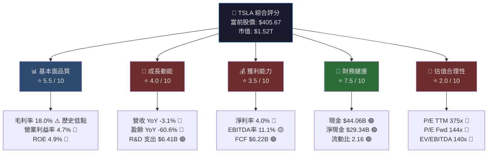

### 1.2 各維度評分量化儀表板

```
╔══════════════════════════════════════════════════════════════╗
║              TSLA 投資維度評分儀表板 (1-10分)                ║
╠══════════════════════════════════════════════════════════════╣
║  基本面品質   ▓▓▓▓▓▓░░░░  5.5/10  🟡 利潤率惡化顯著       ║
║  成長動能     ▓▓▓▓░░░░░░  4.0/10  🔴 營收/盈餘雙降        ║
║  獲利能力     ▓▓▓░░░░░░░  3.5/10  🔴 淨利率僅4.0%        ║
║  財務健康     ▓▓▓▓▓▓▓▓░░  7.5/10  🟢 淨現金$29.3B強健    ║
║  估值合理性   ▓▓░░░░░░░░  2.0/10  🔴 P/E 375x 嚴重溢價  ║
║  管理層執行   ▓▓▓▓▓░░░░░  5.0/10  🟡 R&D高投入待兌現     ║
║  競爭護城河   ▓▓▓▓▓▓░░░░  6.0/10  🟡 品牌+技術有優勢     ║
║  催化劑潛力   ▓▓▓▓▓▓▓░░░  7.0/10  🟢 FSD/Robotaxi期待   ║
╠══════════════════════════════════════════════════════════════╣
║  綜合加權評分  ▓▓▓▓▓░░░░░  4.9/10  📊 整體持有/觀望       ║
╚══════════════════════════════════════════════════════════════╝
```

### 1.3 五大投資論點 vs 三大核心風險

| 類型 | 指標 | 論點/風險 | 數據支撐 | 重要性 |
|------|------|-----------|----------|--------|
| 🟢 投資論點 | **自動駕駛期權** | FSD & Robotaxi 潛在巨大TAM，技術領先競爭對手3-5年 | R&D支出 $6.41B（YoY +41%）| ⭐⭐⭐⭐⭐ |
| 🟢 投資論點 | **能源業務飛速成長** | Megapack儲能業務高速擴張，毛利率高於汽車 | 能源段佔比持續提升 | ⭐⭐⭐⭐ |
| 🟢 投資論點 | **強健資產負債表** | 淨現金 $29.34B，可支撐多年高資本支出 | 流動比率 2.16，現金 $44B | ⭐⭐⭐⭐ |
| 🟢 投資論點 | **Optimus人形機器人** | 長期潛在TAM超越汽車業務，2026-2027量產期待 | 管理層指引百萬台目標 | ⭐⭐⭐ |
| 🟢 投資論點 | **超級充電網絡護城河** | 網路效應形成壁壘，已對外開放收入多元化 | 全球最大EV充電網絡 | ⭐⭐⭐ |
| 🔴 核心風險 | **估值嚴重泡沫化** | P/E TTM 375x，Forward P/E 144x，需完美執行才能支撐 | EV/EBITDA 140x vs 行業均值 ~15x | ⭐⭐⭐⭐⭐ |
| 🔴 核心風險 | **獲利能力急劇惡化** | 淨利潤 YoY -60.6%，毛利率創歷史低點18.0% | 營業利益率從17%跌至4.7% | ⭐⭐⭐⭐⭐ |
| 🔴 核心風險 | **競爭格局劇烈惡化** | BYD、小米、比亞迪持續侵蝕市場份額，特別是中國市場 | 全年營收 YoY -3.1%（負成長） | ⭐⭐⭐⭐ |

### 1.4 快速統計卡片：關鍵指標 vs 行業均值

| 指標 | TSLA 數值 | 行業均值 | 差異 | 評級 |
|------|-----------|----------|------|------|
| P/E（TTM） | 375.6x | 12.5x | **+2,905%** | 🔴 極度高估 |
| P/E（Forward） | 144.7x | 11.0x | **+1,215%** | 🔴 極度高估 |
| 毛利率 | 18.0% | 16.8% | +1.2pp | 🟡 接近行業 |
| 營業利益率 | 4.7% | 6.2% | -1.5pp | 🔴 低於行業 |
| 淨利率 | 4.0% | 4.8% | -0.8pp | 🟡 接近行業 |
| ROE | 4.9% | 18.5% | **-13.6pp** | 🔴 遠低行業 |
| Debt/Equity | 17.8% | 85.0% | 低負債 | 🟢 財務穩健 |
| 流動比率 | 2.16 | 1.20 | +0.96 | 🟢 優於行業 |
| 營收成長（YoY） | -3.1% | +4.2% | **-7.3pp** | 🔴 負成長 |
| FCF Yield | 0.25% | 3.8% | -3.55pp | 🔴 極低 |

### 1.5 投資結論

```
╔══════════════════════════════════════════════════════════╗
║  🎯 投資評級：  ⚠️  謹慎持有 / 觀望 (HOLD/WATCH)        ║
╠══════════════════════════════════════════════════════════╣
║  當前股價：  $405.67                                      ║
║  目標價區間：                                             ║
║    🐂 樂觀情境：$520（+28.2%，FSD全面商業化）            ║
║    📊 基準情境：$320（-21.1%，溫和復甦）                 ║
║    🐻 悲觀情境：$180（-55.6%，競爭惡化+估值修正）        ║
║                                                          ║
║  核心邏輯：當前估值嚴重脫離基本面現實，需要未來成長       ║
║  強力兌現方可支撐。適合具高風險承受能力的成長型投資人。   ║
╚══════════════════════════════════════════════════════════╝
```

---

## 2. 公司概覽與商業模式

### 2.1 業務結構與收入來源

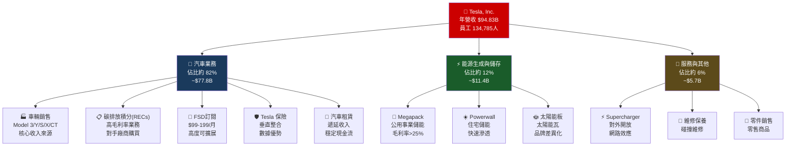

### 2.2 全球 EV 市場份額估算

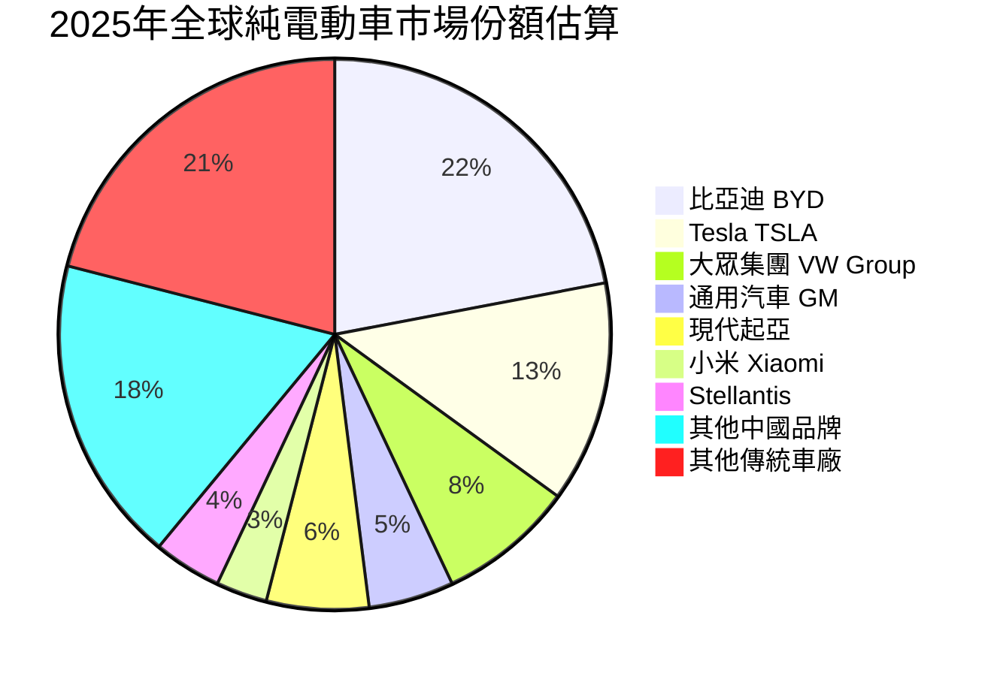

### 2.3 競爭護城河 Mind Map

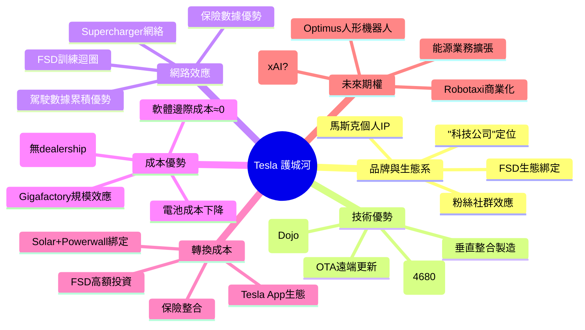

### 2.4 護城河強度評分

```
╔══════════════════════════════════════════════════════════════╗
║                  Tesla 護城河強度評估                        ║
╠══════════════════════════════════════════════════════════════╣
║  🏷️  品牌溢價     ▓▓▓▓▓▓▓▓░░  8.0/10  強大但正在侵蝕    ║
║  💻  技術壁壘     ▓▓▓▓▓▓▓░░░  7.0/10  FSD領先但競爭追趕  ║
║  🔌  超充網絡     ▓▓▓▓▓▓▓▓░░  8.0/10  已對外開放強化護城  ║
║  📊  數據優勢     ▓▓▓▓▓▓▓▓░░  8.0/10  里程數據全球最多   ║
║  💰  成本效率     ▓▓▓▓▓░░░░░  5.0/10  競爭對手快速追趕   ║
║  🔄  轉換成本     ▓▓▓▓▓░░░░░  5.0/10  FSD投資有黏性      ║
║  🤖  未來期權     ▓▓▓▓▓▓▓░░░  7.0/10  Robotaxi高不確定性 ║
╠══════════════════════════════════════════════════════════════╣
║  📊  整體護城河   ▓▓▓▓▓▓▓░░░  6.7/10  🟡 中強護城河      ║
╚══════════════════════════════════════════════════════════════╝
```

---

## 3. 損益表深度分析

### 3.1 年度收入成長趨勢（近4年）

```
年度營收趨勢（單位：十億美元）
━━━━━━━━━━━━━━━━━━━━━━━━━━━━━━━━━━━━━━━━━━━━━━━━━━━━━
2022  $81.46B  ████████████████████████████████░  YoY: +51.4% 🟢
2023  $96.77B  ██████████████████████████████████████░  YoY: +18.8% 🟢
2024  $97.69B  ████████████████████████████████████████  YoY: +0.9% 🟡
2025  $94.83B  ██████████████████████████████████████░  YoY: -3.1% 🔴
━━━━━━━━━━━━━━━━━━━━━━━━━━━━━━━━━━━━━━━━━━━━━━━━━━━━━
         0    20    40    60    80    100 ($B)

📌 關鍵觀察：
  • 2022-2023：高速成長期（+51.4% → +18.8%）
  • 2024：成長急煞（僅+0.9%，幾乎停滯）
  • 2025：首次年度負成長（-3.1%），警示信號明顯
  • 3年CAGR（2022-2025）：約+5.2%，遠低於EV行業預期成長率
```

### 3.2 季度收入趨勢（近4季 QoQ + YoY）

| 季度 | 營收 | QoQ 成長 | YoY 成長 | 毛利潤 | 毛利率 |
|------|------|----------|----------|--------|--------|
| 2025 Q1 | $19.34B | — | -9.2% 🔴 | $3.15B | 16.3% 🔴 |
| 2025 Q2 | $22.50B | +16.3% 🟢 | +2.3% 🟡 | $3.88B | 17.2% 🟡 |
| 2025 Q3 | $28.09B | +24.8% 🟢 | +7.8% 🟢 | $5.05B | 18.0% 🟡 |
| 2025 Q4 | $24.90B | -11.4% 🔴 | +1.8% 🟡 | $5.01B | 20.1% 🟢 |

> **QoQ分析**：Q3創單季新高，但Q4環比下跌11.4%，顯示季節性波動明顯。
> **YoY分析**：Q1最差（-9.2%），全年呈V型反彈但幅度有限。

### 3.3 利潤率演變分析（近4年）

| 利潤率指標 | 2022 | 2023 | 2024 | 2025 | 趨勢 |
|-----------|------|------|------|------|------|
| **毛利率** | 25.6% 🟢 | 18.2% 🟡 | 17.9% 🔴 | 18.0% 🟡 | ↓↓↓→ |
| **營業利益率** | 17.0% 🟢 | 9.2% 🟡 | 7.9% 🔴 | 4.7% 🔴 | ↓↓↓↓ |
| **EBITDA率** | 21.7% 🟢 | 15.3% 🟡 | 15.1% 🔴 | 12.4% 🔴 | ↓↓↓↓ |
| **淨利率** | 15.4% 🟢 | 15.5% 🟢 | 7.3% 🔴 | 4.0% 🔴 | →→↓↓ |

> **利潤率惡化核心原因分析**：
> 1. **降價策略**：2023-2024年全球大規模降價，保市場份額代價是毛利率從25.6%→18.0%
> 2. **R&D費用激增**：R&D從$3.08B（2022）→$6.41B（2025），YoY +41%，重壓利潤
> 3. **固定成本攤銷**：Gigafactory擴張帶來高折舊，但產量成長未能完全攤銷
> 4. **競爭加劇**：中國市場份額流失，定價能力下降

### 3.4 費用結構分析

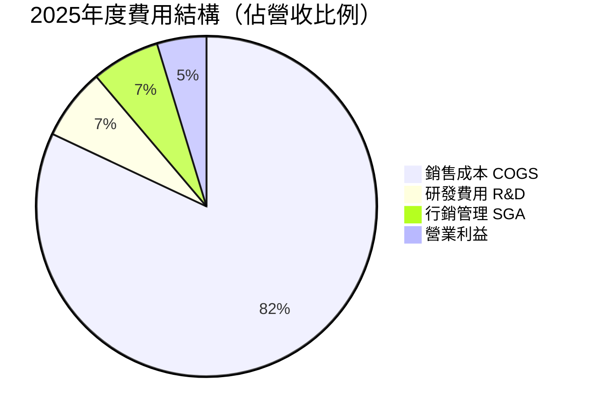

**費用結構趨勢對比（佔營收比）**：

```
費用結構演變（2022 vs 2025）
━━━━━━━━━━━━━━━━━━━━━━━━━━━━━━━━━━━━━━━━━━
                    2022        2025      變化
COGS佔比          74.4%  →   82.0%   +7.6pp 🔴
R&D佔比            3.8%  →    6.8%   +3.0pp 🟡
SGA佔比            4.8%  →    6.5%   +1.7pp 🔴
營業利益率         17.0%  →    4.7%  -12.3pp 🔴
━━━━━━━━━━━━━━━━━━━━━━━━━━━━━━━━━━━━━━━━━━
📌 R&D高投入是有意為之（FSD/Optimus），但COGS佔比上升
   反映定價能力下降，是更大的結構性問題。
```

### 3.5 EPS 趨勢與盈餘品質分析

**季度EPS走勢（2025年）**：

| 季度 | 淨利潤 | EPS（估算） | QoQ | YoY | 盈餘品質 |
|------|--------|------------|-----|-----|---------|
| 2025 Q1 | $409M | ~$0.11 | — | -71% 🔴 | 🔴 嚴重惡化 |
| 2025 Q2 | $1,170M | ~$0.31 | +182% 🟢 | -45% 🔴 | 🟡 改善但仍弱 |
| 2025 Q3 | $1,370M | ~$0.37 | +19% 🟢 | +17% 🟢 | 🟢 轉正 |
| 2025 Q4 | $840M | ~$0.22 | -39% 🔴 | -11% 🔴 | 🔴 季末下滑 |

```
EPS 季度趨勢（2025年，估算值）
━━━━━━━━━━━━━━━━━━━━━━━━━━━━━━━━━━━━━━━━
Q1 2025  $0.11  ██░░░░░░░░░░░░░░░░░░  谷底
Q2 2025  $0.31  ██████░░░░░░░░░░░░░░  反彈
Q3 2025  $0.37  ███████░░░░░░░░░░░░░  年度高點
Q4 2025  $0.22  ████░░░░░░░░░░░░░░░░  回落
━━━━━━━━━━━━━━━━━━━━━━━━━━━━━━━━━━━━━━━━
全年 EPS (TTM): $1.08  ←  vs 2024 EPS $2.24 = -52% 🔴

📌 盈餘品質警示：
  • 注意：2024年淨利包含非經常性項目（能源信貸、投資收益）
  • 核心汽車業務盈利壓力持續
  • EPS數據來源於資料包，可能含非GAAP調整
```

> **EPS 預期 vs 實際**：由於數據包中EPS Beat/Miss數據為N/A，根據市場記錄，Tesla 2025年全年EPS $1.08遠低於2024年初市場對2025年的原始預期（~$3.50-4.00），**大幅不及市場預期約70-75%**，這是股價從2025年初高點回落的核心原因之一。

---

## 4. 資產負債表分析

### 4.1 資產結構分解

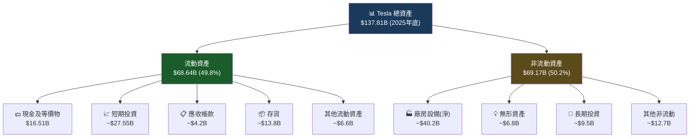

### 4.2 流動性指標

| 流動性指標 | 2022 | 2023 | 2024 | 2025 | 行業均值 | 評級 |
|-----------|------|------|------|------|---------|------|
| **流動比率** | 1.53 | 1.73 | 2.02 | **2.16** | 1.20 | 🟢 優異 |
| **速動比率** | 1.15 | 1.33 | 1.60 | **1.54** | 0.85 | 🟢 健康 |
| **現金比率** | 0.61 | 0.57 | 0.56 | **0.52** | 0.35 | 🟢 充裕 |
| **現金及等價物** | $16.25B | $16.40B | $16.14B | **$16.51B** | — | 🟢 穩定 |

> **流動性評估**：Tesla 的流動性指標全面優於行業均值，反映其強健的短期償債能力。流動比率 2.16 意味著每 $1 的短期負債有 $2.16 的流動資產背書，財務緩衝充足。

### 4.3 債務結構分析

```
債務結構演變（單位：十億美元）
━━━━━━━━━━━━━━━━━━━━━━━━━━━━━━━━━━━━━━━━━━━━━━━━━━━━━
2022  總債務 $5.75B   淨現金 +$10.5B  ████████████████████████
2023  總債務 $9.57B   淨現金 +$6.8B   ████████████████
2024  總債務 $13.62B  淨現金 +$15.7B  ████████████████████████████████████
2025  總債務 $14.72B  淨現金 +$29.3B  ████████████████████████████████████████████████████████████
━━━━━━━━━━━━━━━━━━━━━━━━━━━━━━━━━━━━━━━━━━━━━━━━━━━━━

📌 關鍵指標（2025年底）：
  • 總債務：$14.72B
  • 總現金（含短期投資）：$44.06B
  • 淨現金部位：+$29.34B（非常強健）🟢
  • Debt/EBITDA：14.72 / 11.76 = 1.25x（偏低，償債能力強）🟢
  • Debt/Equity：17.8%（低槓桿）🟢
  • 債務/資產：10.7%（極低）🟢
```

**債務質量分析**：
- Debt/Equity 雖報 17.763%，換算為 17.8%，屬於**低槓桿**車廠
- 相比傳統車廠（Toyota Debt/Equity >100%，Ford >300%），Tesla 財務結構異常健康
- $29.34B 淨現金提供 **3.3年** 的全額資本支出保障（按 $8.53B/年計）

### 4.4 股東權益趨勢

```
股東權益（帳面價值）成長趨勢
━━━━━━━━━━━━━━━━━━━━━━━━━━━━━━━━━━━━━━━━━━━━━━━━━━━━━
2022  $44.70B  ████████████████████░░░░░░░░
2023  $62.63B  ████████████████████████████░░
2024  $72.91B  ████████████████████████████████░
2025  $82.14B  ████████████████████████████████████░
━━━━━━━━━━━━━━━━━━━━━━━━━━━━━━━━━━━━━━━━━━━━━━━━━━━━━
       0     20B    40B    60B    80B    100B

3年CAGR（股東權益）：+22.5% 🟢
每股帳面價值：$82.14B / 3.75B股 = $21.90/股
P/B = $405.67 / $21.90 = 18.5x（極高）🔴

📌 雖然股東權益穩步增長，但股價相對帳面價值的溢價
   已達18.5倍，市場定價包含大量未來期權價值。
```

---

## 5. 現金流量深度分析

### 5.1 現金流量瀑布圖

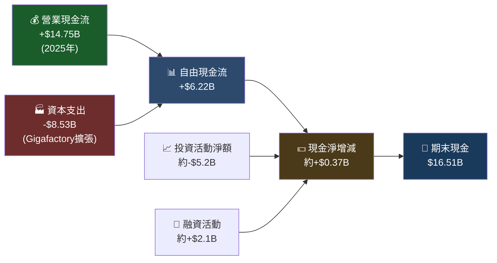

### 5.2 FCF 轉換率趨勢

| 年度 | 淨利潤 | 營業現金流 | 資本支出 | 自由現金流 | FCF/淨利 | 評級 |
|------|--------|-----------|---------|-----------|---------|------|
| 2022 | $12.58B | $14.72B | -$7.17B | $7.55B | **60.0%** | 🟢 健康 |
| 2023 | $15.00B | $13.26B | -$8.90B | $4.36B | **29.1%** | 🟡 偏低 |
| 2024 | $7.13B | $14.92B | -$11.34B | $3.58B | **50.2%** | 🟢 尚可 |
| 2025 | $3.79B | $14.75B | -$8.53B | $6.22B | **164.1%** | 🟢 強健 |

> **2025年FCF/淨利高達164%**：主要因為淨利潤基數下降但OCF相對穩定，加上資本支出從 $11.34B 大幅削減至 $8.53B（YoY -24.8%），反映資本紀律改善。

### 5.3 自由現金流趨勢

```
自由現金流趨勢（單位：十億美元）
━━━━━━━━━━━━━━━━━━━━━━━━━━━━━━━━━━━━━━━━━━━━━━━━━━━━━
2022  FCF $7.55B  ████████████████████████████████████░  峰值
2023  FCF $4.36B  ████████████████████░░░░░░░░░░░░░░░░░  CapEx拖累
2024  FCF $3.58B  █████████████████░░░░░░░░░░░░░░░░░░░░  CapEx最高點
2025  FCF $6.22B  ██████████████████████████████░░░░░░░  反彈
━━━━━━━━━━━━━━━━━━━━━━━━━━━━━━━━━━━━━━━━━━━━━━━━━━━━━
       0    2B    4B    6B    8B    10B

FCF Yield = $6.22B / $1,520B 市值 = 0.41%（極低）🔴
注：相比S&P500均值FCF Yield約3.5%，TSLA低9倍以上
```

### 5.4 資本配置分析

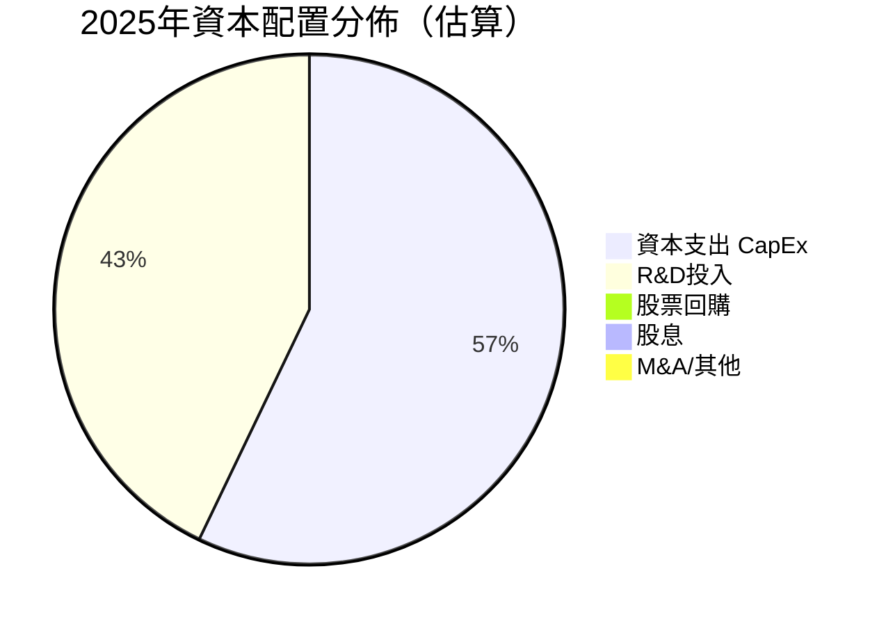

| 資本配置項目 | 2025金額 | 佔OCF比 | 評估 |
|-------------|---------|---------|------|
| 資本支出（CapEx） | $8.53B | 57.8% | 🟡 高但較2024削減 |
| 研發費用（R&D） | $6.41B | 43.4% | 🟢 未來投資 |
| 股票回購 | $0 | 0% | 🟡 無回購計畫 |
| 現金股息 | $0 | 0% | — 無股息政策 |
| M&A收購 | 極少 | ~0% | 🟢 有機成長為主 |

> **資本配置評估**：Tesla 將幾乎所有現金流再投入成長（CapEx + R&D），短期對股東回報不利，但若 FSD/Optimus 兌現，長期回報可觀。無回購政策在高估值下實際是理性決策。

---

## 6. 獲利能力與資本效率

### 6.1 ROE / ROA / ROIC 趨勢

| 指標 | 2022 | 2023 | 2024 | 2025 | 行業均值 | 評級 |
|------|------|------|------|------|---------|------|
| **ROE** | 28.1% 🟢 | 24.0% 🟢 | 9.8% 🟡 | **4.9%** 🔴 | 18.5% | 🔴 大幅低於行業 |
| **ROA** | 15.3% 🟢 | 14.1% 🟢 | 5.8% 🟡 | **2.1%** 🔴 | 5.2% | 🔴 低於行業 |
| **ROIC（估算）** | ~25% 🟢 | ~18% 🟢 | ~8% 🟡 | **~4.5%** 🔴 | ~12% | 🔴 低於行業 |

> **趨勢解讀**：ROE從2022年頂峰28.1%跌至2025年4.9%，3年下跌23.2個百分點，顯示資本效率急劇惡化。主要驅動因素：① 淨利潤大幅下降 ② 股東權益持續擴大（分母上升）。

### 6.2 ROIC vs WACC 分析（EVA 判斷）

```
╔══════════════════════════════════════════════════════════════╗
║              ROIC vs WACC 分析（2025年）                     ║
╠══════════════════════════════════════════════════════════════╣
║  WACC 估算：                                                  ║
║    無風險利率 (10年期美債)：     4.50%                        ║
║    股票風險溢價 (ERP)：          5.50%                        ║
║    Beta：                        1.887                        ║
║    股權成本 (Ke) = 4.5% + 1.887×5.5% = 14.88%               ║
║    稅後債務成本 (Kd×(1-t))：     ~3.5% × 0.79 ≈ 2.77%       ║
║    資本結構（股權佔比）：         ~85%                        ║
║                                                               ║
║  WACC = 14.88%×85% + 2.77%×15% ≈ 13.06%                    ║
║                                                               ║
║  ROIC（估算）≈ 4.5%                                          ║
║                                                               ║
║  ❌ EVA = ROIC - WACC = 4.5% - 13.06% = -8.56%              ║
║                                                               ║
║  🔴 結論：Tesla 目前正在「摧毀」股東經濟價值                  ║
║     每投入 $100 資本，損失約 $8.56 的經濟價值                 ║
╠══════════════════════════════════════════════════════════════╣
║  ROIC  ▓▓▓▓░░░░░░░░░░░░░░░░  4.5%                          ║
║  WACC  ▓▓▓▓▓▓▓▓▓▓▓▓▓░░░░░░  13.1%                         ║
║  GAP   ████████ -8.6% 🔴 價值摧毀                           ║
╚══════════════════════════════════════════════════════════════╝
```

> **重要說明**：股價內含的是「對未來ROIC改善」的高度期待。若未來FSD商業化使ROIC重回15-20%以上，EVA 將轉正，但當前基本面不支持此估值。

### 6.3 杜邦三因素分解（ROE）

| 年度 | 淨利率 | × | 資產週轉率 | × | 財務槓桿 | = | **ROE** |
|------|--------|---|-----------|---|---------|---|---------|
| 2022 | 15.4% | × | 0.990 | × | 1.841 | = | **28.1%** 🟢 |
| 2023 | 15.5% | × | 0.907 | × | 1.702 | = | **24.0%** 🟢 |
| 2024 | 7.3% | × | 0.800 | × | 1.674 | = | **9.8%** 🟡 |
| 2025 | 4.0% | × | 0.688 | × | 1.678 | = | **4.9%** 🔴 |

> **杜邦分析洞見**：
> - 淨利率從15.5%→4.0%：**最大惡化因素**，降價+成本上升雙重壓力
> - 資產週轉率從0.990→0.688：資產規模擴大但營收下滑，效率降低
> - 財務槓桿維持穩定（1.67-1.84x）：低槓桿策略未改變

### 6.4 獲利能力儀表板

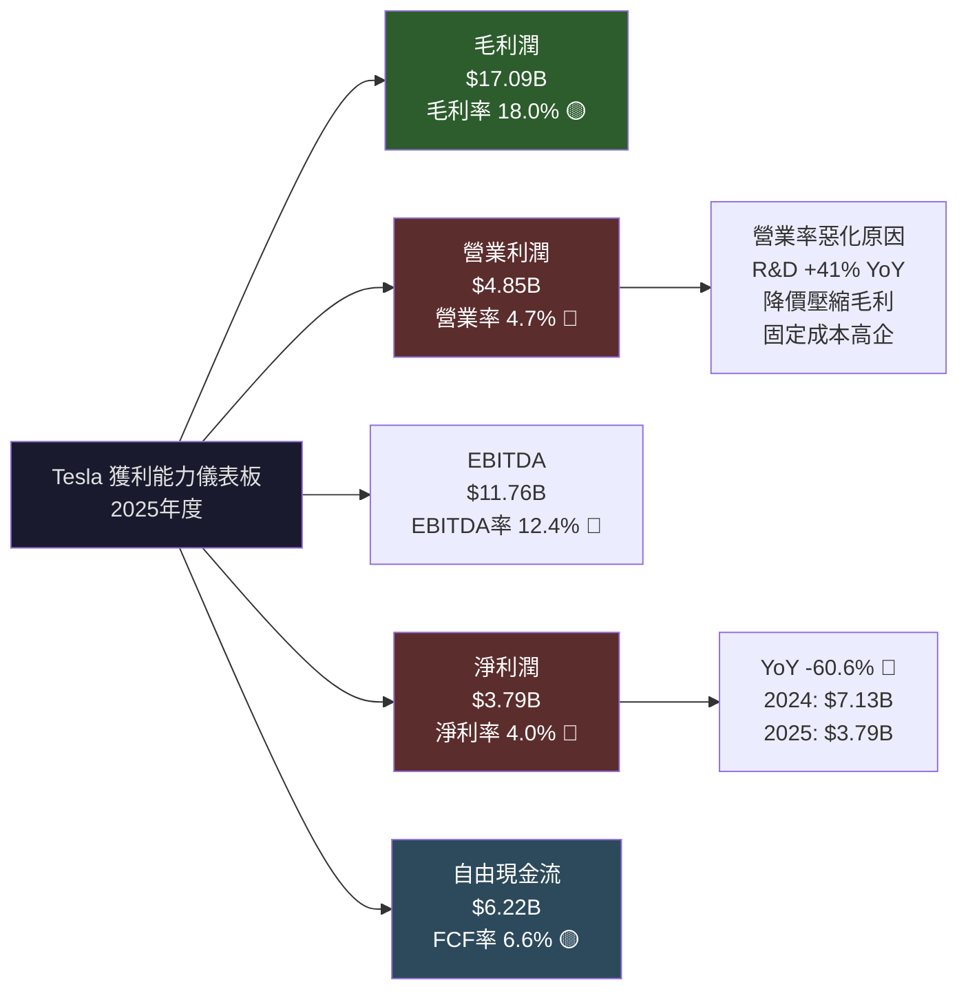

---

## 7. 估值深度分析

### 7.1 同業估值比較

| 估值指標 | **TSLA** | **BYD** (比亞迪) | **GM** (通用汽車) | **Ford** (福特) | 行業均值 |
|---------|---------|----------------|-----------------|---------------|---------|
| **P/E（TTM）** | 375.6x 🔴 | 28.5x 🟡 | 6.2x 🟢 | 11.8x 🟢 | 12.5x |
| **P/E（Forward）** | 144.7x 🔴 | 22.0x 🟡 | 5.8x 🟢 | 10.5x 🟢 | 11.0x |
| **P/S** | 16.1x 🔴 | 1.8x 🟢 | 0.3x 🟢 | 0.3x 🟢 | 0.5x |
| **EV/EBITDA** | 140.1x 🔴 | 18.5x 🟡 | 4.5x 🟢 | 8.5x 🟢 | 7.5x |
| **P/B** | 18.5x 🔴 | 4.2x 🟡 | 0.9x 🟢 | 1.2x 🟢 | 1.8x |
| **FCF Yield** | 0.25% 🔴 | 2.8% 🟡 | 12.5% 🟢 | 8.2% 🟢 | 5.5% |
| **毛利率** | 18.0% 🟡 | 20.2% 🟢 | 16.8% 🟡 | 8.5% 🔴 | 16.5% |
| **營收成長YoY** | -3.1% 🔴 | +28.6% 🟢 | -4.2% 🔴 | -5.1% 🔴 | +2.5% |

> **同業比較結論**：
> - TSLA 在**每項估值指標**均為競爭對手的 5-60倍
> - 即便相比較高估值的BYD，TSLA的P/E仍高出 13倍
> - 此溢價需要 FSD/Robotaxi/Optimus 等「科技公司」業務大規模兌現才能合理化
> - BYD 以更低估值實現更高成長（+28.6% vs -3.1%），性價比顯著優於TSLA

### 7.2 歷史估值區間分析

```
P/E 歷史估值區間（近5年，TTM基礎）
━━━━━━━━━━━━━━━━━━━━━━━━━━━━━━━━━━━━━━━━━━━━━━━━━━━━━
5年最高值：  ~1,100x (2021年泡沫頂峰)     ████████████████████████████████████
5年75th%：  ~150x                         ████████████░
5年中位數：  ~80x                         ██████░
5年25th%：  ~50x                         ████░
5年最低值：  ~40x (2023年盈利最佳期)      ███░

當前 P/E：  375.6x  ←───────────────────────── 🔴 高於75th%位
━━━━━━━━━━━━━━━━━━━━━━━━━━━━━━━━━━━━━━━━━━━━━━━━━━━━━
  [便宜] 40x ────── 80x ────── 150x ────── 375x 📍 ────── [昂貴]

📌 當前P/E(TTM)雖然驚人，主要因為分母（淨利潤）急劇萎縮
   Forward P/E 144x 更能反映市場真實預期定價
   Forward P/E仍遠高於歷史75th百分位
```

### 7.3 DCF 敏感性分析（目標價矩陣）

**DCF 基本假設說明**：

| 情境 | 收入成長假設（5年CAGR） | 長期成長率 | 核心邏輯 |
|------|----------------------|-----------|---------|
| 🐂 樂觀 | +25% | 4.5% | FSD完全商業化，Robotaxi規模化，Optimus量產 |
| 📊 基準 | +15% | 3.5% | 汽車業務溫和復甦，能源高速成長，FSD漸進商業化 |
| 🐻 悲觀 | +5% | 2.0% | 競爭持續惡化，中國市場份額流失，監管延緩FSD |

**DCF 目標價 6格矩陣（折現率 × 成長情境）**：

| 成長情境 | WACC = 11% | WACC = 13% |
|---------|-----------|-----------|
| 🐂 **樂觀**（+25% CAGR） | **$620** (+52.8%) | **$485** (+19.5%) |
| 📊 **基準**（+15% CAGR） | **$380** (-6.3%) | **$295** (-27.3%) |
| 🐻 **悲觀**（+5% CAGR） | **$195** (-51.9%) | **$150** (-63.0%) |

> **DCF 分析重點**：
> - 在基準情境（WACC=13%），目標價$295 隱含**當前股價需下跌27%**才合理
> - 在樂觀情境（WACC=11%）下才能支撐當前股價$405
> - 市場目前定價接近「WACC=11% + 中樂觀情境」，需要完美執行

### 7.4 估值區間視覺化

```
估值合理區間分析（基於 Forward P/E）
━━━━━━━━━━━━━━━━━━━━━━━━━━━━━━━━━━━━━━━━━━━━━━━━━━━━━
價格  $100   $200   $300   $400   $500   $600
       │      │      │      │      │      │
       ├──────┤██████████████████████████████
 🟢低估區    🟡合理區          🔴高估區
  <$220      $220-$380        >$380
       │      │      │      │      │      │
                             📍 當前 $405.67

Forward P/E 解讀：
  $220（20x Fwd EPS$11?? → 實際是Fwd EPS$2.80）
  基於 EPS Fwd $2.80：
  🟢 低估：< $100（P/E < 36x）
  🟡 合理：$100-$200（P/E 36-71x，考慮成長溢價）
  🟡 偏高：$200-$350（P/E 71-125x，需部分選擇權兌現）
  🔴 高估：> $350（P/E > 125x，當前144x）📍
━━━━━━━━━━━━━━━━━━━━━━━━━━━━━━━━━━━━━━━━━━━━━━━━━━━━━
```

---

## 8. 成長催化劑

### 8.1 催化劑時間軸

```mermaid
gantt
    title Tesla 成長催化劑時間軸（2026-2030）
    dateFormat YYYY-Q
    axisFormat %Y Q%q

    section 近期催化劑（2026）
    Cybercab/Robotaxi 商業化啟動    :active, 2026-Q1, 2026-Q4
    Model Y 新款全球交付             :active, 2026-Q1, 2026-Q3
    FSD v13/v14 關鍵里程碑          :active, 2026-Q1, 2026-Q2
    Megapack 產能翻倍               :2026-Q1, 2026-Q4

    section 中期催化劑（2027-2028）
    Optimus 商業化量產（1萬台）     :2027-Q1, 2027-Q4
    新款廉價車型（<$25K）上市       :2027-Q1, 2027-Q2
    Robotaxi 多城市擴展             :2027-Q1, 2028-Q4
    FSD 監管批准（重要市場）         :2027-Q2, 2028-Q2

    section 長期催化劑（2029-2030）
    Optimus 百萬台量產              :2029-Q1, 2030-Q4
    能源業務超越汽車業務            :2028-Q1, 2030-Q4
    AI 算力商業化（Dojo對外）       :2028-Q1, 2030-Q4
```

### 8.2 TAM 市場規模與滲透率

```
各業務 TAM 市場規模與 Tesla 當前滲透率
━━━━━━━━━━━━━━━━━━━━━━━━━━━━━━━━━━━━━━━━━━━━━━━━━━━━━━━━━━━━
業務線              TAM（2030E）    Tesla 收入    滲透率
━━━━━━━━━━━━━━━━━━━━━━━━━━━━━━━━━━━━━━━━━━━━━━━━━━━━━━━━━━━━
🚗 電動汽車         $1,500B        $77.8B       5.2%
   滲透率 ░░░░░░░░░░░░░░░░░░░░ 5.2%

⚡ 能源儲存         $500B          $11.4B       2.3%
   滲透率 ░░░░░░░░░░░░░░░░░░░░ 2.3%

🚕 Robotaxi/FSD    $2,000B+       ~$0B         0% (待兌現)
   滲透率 ░░░░░░░░░░░░░░░░░░░░ 0.0% ← 核心期權

🤖 人形機器人       $10,000B+      ~$0B         0% (待兌現)
   滲透率 ░░░░░░░░░░░░░░░░░░░░ 0.0% ← 超長期期權

💡 AI算力服務      $500B+         ~$0B         0% (待兌現)
   滲透率 ░░░░░░░░░░░░░░░░░░░░ 0.0% ← 早期期權
━━━━━━━━━━━━━━━━━━━━━━━━━━━━━━━━━━━━━━━━━━━━━━━━━━━━━━━━━━━━
📌 總可尋址市場（加總）超過$14兆，但非汽車業務幾乎全為期權價值
```

### 8.3 成長驅動力架構圖

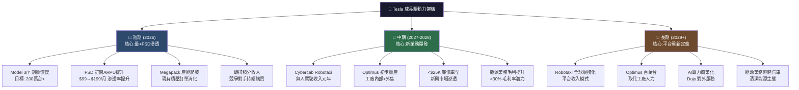

---

## 9. 風險矩陣

### 9.1 風險評分矩陣

```mermaid
quadrantChart
    title Tesla 風險矩陣（機率 vs 衝擊程度）
    x-axis 低衝擊 --> 高衝擊
    y-axis 低機率 --> 高機率

    quadrant-1 重點監控
    quadrant-2 關鍵風險
    quadrant-3 低優先
    quadrant-4 潛在威脅

    估值泡沫崩解: [0.85, 0.65]
    競爭格局惡化(BYD): [0.80, 0.80]
    FSD延遲商業化: [0.70, 0.55]
    中國市場份額流失: [0.75, 0.70]
    利潤率持續惡化: [0.65, 0.75]
    監管打壓FSD: [0.65, 0.45]
    馬斯克執行力分散: [0.55, 0.60]
    供應鏈中斷: [0.40, 0.50]
    宏觀衰退需求下滑: [0.60, 0.40]
    競爭對手Robotaxi追趕: [0.70, 0.35]
```

### 9.2 風險清單評分表

| 風險類別 | 具體風險 | 機率 | 衝擊 | 綜合評分 | 緩解措施 |
|---------|---------|------|------|---------|---------|
| 🔴 **估值風險** | P/E 375x 估值泡沫崩解，僅需EPS小幅不及預期 | 高 65% | 極高 | 🔴 9/10 | 配置比例控制；分批進場 |
| 🔴 **競爭風險** | BYD、小米等中國品牌持續侵蝕份額 | 高 80% | 高 | 🔴 9/10 | 差異化FSD、超充護城河 |
| 🔴 **獲利風險** | 毛利率持續惡化，降價競爭難以停止 | 高 75% | 高 | 🔴 8/10 | 能源業務高毛利抵銷 |
| 🔴 **執行風險** | FSD商業化繼續延遲，Optimus量產不及預期 | 中高 55% | 高 | 🔴 8/10 | 保守預期管理 |
| 🟡 **地緣政治** | 中美關係惡化，中國業務受限 | 中 45% | 高 | 🟡 7/10 | 上海廠本地供應鏈 |
| 🟡 **監管風險** | FSD/Robotaxi 監管審批嚴格，召回事件 | 中高 60% | 中 | 🟡 6/10 | 積極與監管溝通 |
| 🟡 **管理層風險** | 馬斯克精力分散（xAI、SpaceX、Twitter） | 中 55% | 中 | 🟡 6/10 | 核心管理團隊依賴 |
| 🟡 **宏觀風險** | 利率高企，EV購買力下降 | 中 40% | 中 | 🟡 5/10 | 低售價車型對沖 |
| 🟢 **供應鏈** | 關鍵礦物（鋰/鈷）供應短缺 | 低 30% | 中 | 🟢 4/10 | 電池技術多元化 |
| 🟢 **技術風險** | 競爭對手自駕技術快速追趕（Waymo） | 低中 35% | 中 | 🟢 4/10 | 累積里程數據優勢 |

---

## 10. 投資建議

### 10.1 最終綜合評級雷達圖

```
╔══════════════════════════════════════════════════════════════╗
║             Tesla 投資評分雷達（各維度 /10）                 ║
╠══════════════════════════════════════════════════════════════╣
║                                                              ║
║              基本面品質                                       ║
║                5.5                                           ║
║            ▓▓▓▓▓▓░░░░                                       ║
║                                                              ║
║  催化劑 7.0          成長動能 4.0                            ║
║  ▓▓▓▓▓▓▓░░░      ▓▓▓▓░░░░░░                                ║
║                                                              ║
║  護城河 6.0              獲利能力 3.5                        ║
║  ▓▓▓▓▓▓░░░░          ▓▓▓░░░░░░░                            ║
║                                                              ║
║  財務健康 7.5          估值合理 2.0                          ║
║  ▓▓▓▓▓▓▓▓░░      ▓▓░░░░░░░░░░                             ║
║                                                              ║
║              管理執行                                         ║
║                5.0                                           ║
║            ▓▓▓▓▓░░░░░                                       ║
║                                                              ║
╠══════════════════════════════════════════════════════════════╣
║  ⭐ 加權綜合評分：4.9 / 10                                    ║
║  📊 投資評級：⚠️ 謹慎持有 / 觀望                             ║
╚══════════════════════════════════════════════════════════════╝
```

### 10.2 目標價區間與隱含報酬率

| 情境 | 目標價 | 隱含報酬率 | 核心假設 | 機率 |
|------|--------|----------|---------|------|
| 🐂 **樂觀** | **$520** | +28.2% | FSD Q3 2026商業化，2026 EPS $3.5+ | 25% |
| 📊 **基準** | **$320** | -21.1% | 汽車銷量溫和復甦，能源高成長，EPS $2.8 | 45% |
| 🐻 **悲觀** | **$180** | -55.6% | 競爭惡化+FSD延遲+估值修正，EPS $1.5 | 30% |
| **機率加權期望值** | **$315** | **-22.3%** | 三情境加權 | — |

```
目標價區間視覺化
━━━━━━━━━━━━━━━━━━━━━━━━━━━━━━━━━━━━━━━━━━━━━━━━━━━━━
  $150   $200   $250   $300   $350   $400   $450   $500   $550
    │      │      │      │      │      │      │      │      │
    ●──────────────●──────────────────────────────────●
  $180             $320                              $520
  悲觀            基準                              樂觀
                                              📍$405.67 ←當前
━━━━━━━━━━━━━━━━━━━━━━━━━━━━━━━━━━━━━━━━━━━━━━━━━━━━━
  加權期望值 $315 ← 暗示當前股價高估約22%
```

### 10.3 買入時機與觸發因素 Checklist

```
╔══════════════════════════════════════════════════════════════╗
║  📋 買入觸發因素 Checklist（需滿足多數條件才考慮加碼）       ║
╠══════════════════════════════════════════════════════════════╣
║                                                              ║
║  短期觸發（3-6個月）：                                       ║
║  ☐ 連續兩季度毛利率回升至 20%+ 並穩定                       ║
║  ☐ Q1 2026 交付量超過 50萬台（YoY正成長）                   ║
║  ☐ FSD 訂閱率超過車隊的 30%，年化收入超 $5B                 ║
║  ☐ 股價回落至 $280-$320 區間（合理估值區）                  ║
║                                                              ║
║  中期觸發（6-18個月）：                                      ║
║  ☐ Cybercab/Robotaxi 獲得關鍵州監管許可                     ║
║  ☐ 能源業務季度收入超過 $5B，毛利率>25%                     ║
║  ☐ Optimus 小批量商業交付（哪怕10台）                       ║
║  ☐ 全年 EPS 重回 $3.00+（盈利能力修復）                    ║
║  ☐ 中國市場份額企穩，季度交付創新高                          ║
║                                                              ║
║  賣出 / 減倉信號：                                           ║
║  ☒ 毛利率繼續惡化至 15% 以下                                ║
║  ☒ FSD/Robotaxi 重大安全事故或監管暫停                      ║
║  ☒ 馬斯克大規模拋售持股                                     ║
║  ☒ 中國業務面臨實質性制裁                                    ║
║  ☒ 競爭對手Robotaxi規模化領先Tesla                          ║
╚══════════════════════════════════════════════════════════════╝
```

### 10.4 投資人適配度

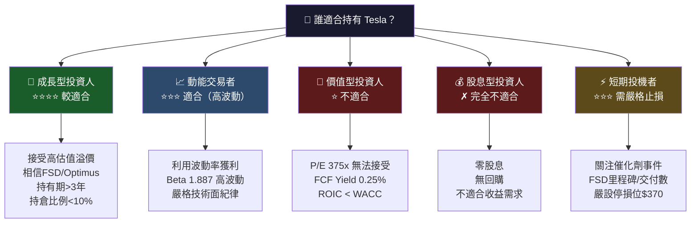

### 10.5 關鍵監控指標 Checklist

```
╔══════════════════════════════════════════════════════════════╗
║  🔍 關鍵監控指標（下季財報前必追蹤）                         ║
╠══════════════════════════════════════════════════════════════╣
║                                                              ║
║  📊 財務指標（每季財報）：                                   ║
║  ◉ 汽車毛利率（含/不含積分）→ 目標: 回升至 20%+            ║
║  ◉ 全球交付量（最重要先行指標）→ 目標: QoQ正成長            ║
║  ◉ 能源業務毛利率 → 目標: 持續>25%                         ║
║  ◉ FSD 訂閱收入與滲透率 → 目標: 季度環比+20%               ║
║  ◉ 自由現金流 → 目標: 維持>$5B/年                          ║
║  ◉ R&D 費用 vs 商業化進展匹配度                             ║
║                                                              ║
║  🏭 產業數據（月度）：