# TSLA 基本面深度分析報告

> **報告日期**：2026-02-24 ｜ **語言**：繁體中文 ｜ **數據來源**：Yahoo Finance ｜ **分析師**：AI 頂級研究團隊

---

## 目錄

| 章節 | 主題 | 頁碼 |
|------|------|------|
| 1 | 執行摘要 | § 1 |
| 2 | 公司概覽 | § 2 |
| 3 | 損益表深度分析 | § 3 |
| 4 | 資產負債表分析 | § 4 |
| 5 | 現金流量分析 | § 5 |
| 6 | 獲利能力指標 | § 6 |
| 7 | 估值分析 | § 7 |
| 8 | 競爭護城河 | § 8 |
| 9 | 成長催化劑 | § 9 |
| 10 | 風險分析 | § 10 |
| 11 | 公平價值估算 | § 11 |
| 12 | 投資建議 | § 12 |

---

## 1. 執行摘要

### 1.1 核心評分儀表板

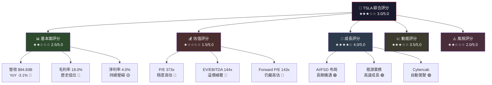

---

### 1.2 五大投資論點快速總覽

| # | 投資論點 | 評級 | 關鍵數據 | 說明 |
|---|---------|------|---------|------|
| 1 | 📉 短期盈利持續惡化 | 🔴 空方 | 毛利率 18.0%（vs 2022年 25.6%） | 價格戰嚴重侵蝕利潤，營收 YoY -3.1% |
| 2 | 🤖 AI & 自動駕駛長期潛力 | 🟢 多方 | FSD 訂閱快速成長 | Robotaxi、Optimus 機器人具顛覆性潛力 |
| 3 | ⚡ 能源儲存業務崛起 | 🟢 多方 | 能源業務佔比提升中 | Megapack 訂單強勁，毛利率優於汽車 |
| 4 | 💸 估值極度泡沫化 | 🔴 空方 | P/E TTM 373x | 需要極高成長率才能合理化當前股價 |
| 5 | 🔮 Elon Musk 政治風險 | 🔴 空方 | 品牌受損跡象明顯 | DOGE 角色引發歐洲抵制，影響銷量 |

---

### 1.3 快速統計卡片

| 指標 | 數值 | 評級 | 行業對比 |
|------|------|------|---------|
| 💰 市值 | $1.50 兆 | 🟡 | 全球車廠市值第一 |
| 📊 股價 | $399.83 | 🟡 | 距52週高點 -19.8% |
| 📈 EPS (TTM) | $1.07 | 🔴 | YoY 大幅下滑 |
| 📈 Forward EPS | $2.80 | 🟡 | 市場寄望復甦 |
| 💵 自由現金流 | $6.22B | 🟢 | FCF 明顯改善 |
| 🏦 淨現金 | $29.34B | 🟢 | 財務體質穩健 |
| 📉 營收成長 | -3.1% | 🔴 | 首次年度負成長 |
| ⚡ R&D 投入 | $6.41B | 🟢 | YoY +41% 大幅提升 |
| 🎯 分析師目標價 | $421.73 | 🟡 | 上行空間 +5.5% |
| 👥 員工數 | 134,785 | 🟡 | 已大幅精簡 |

---

## 2. 公司概覽

### 2.1 業務結構架構圖

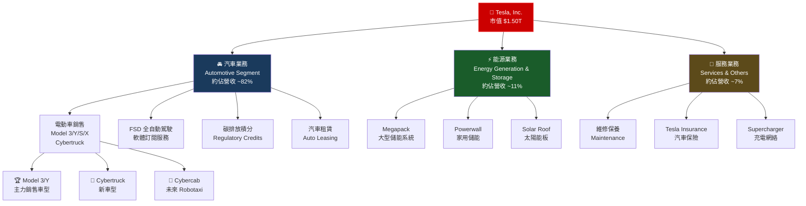

---

### 2.2 市場地位與地理分布

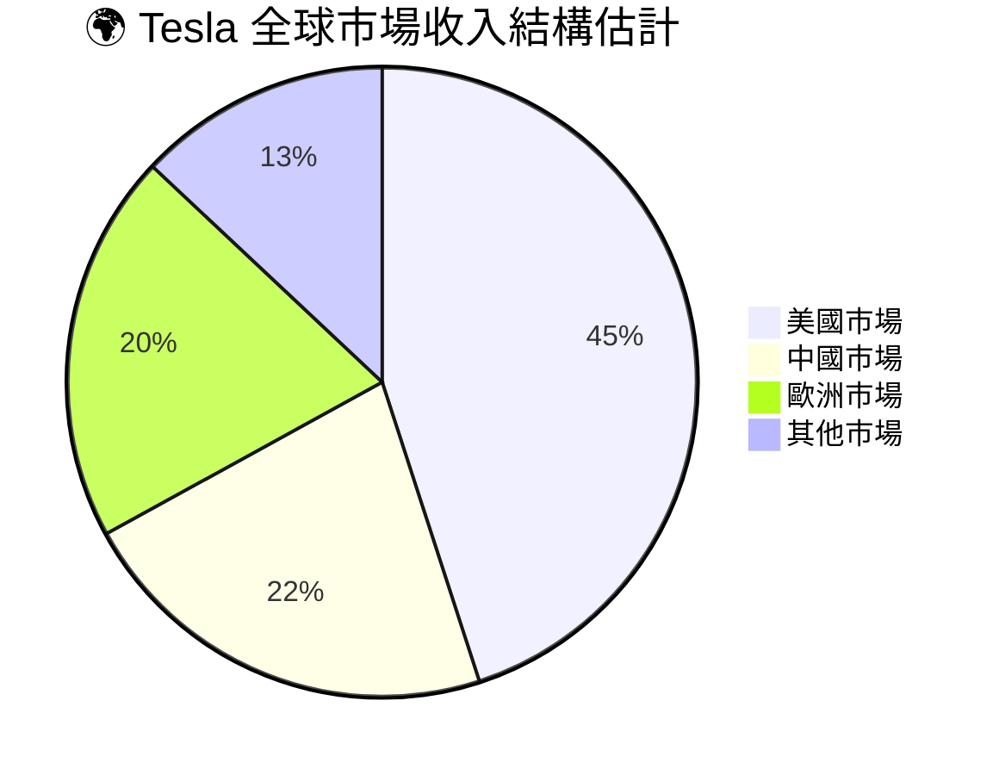

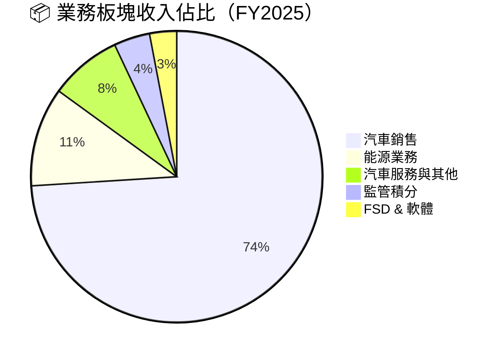

---

### 2.3 競爭優勢思維導圖

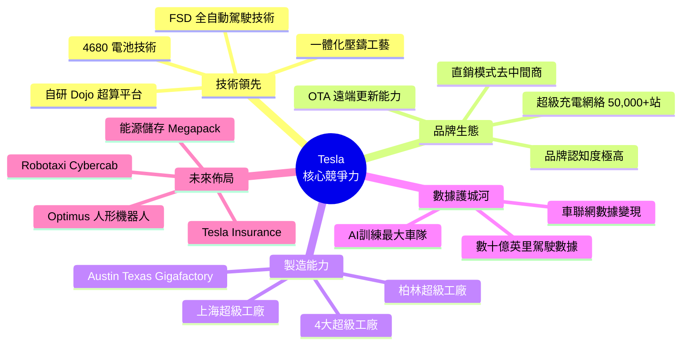

---

## 3. 損益表深度分析

### 3.1 年度收入趨勢（Unicode 視覺化）

```
📊 Tesla 年度營收趨勢（2022-2025）
━━━━━━━━━━━━━━━━━━━━━━━━━━━━━━━━━━━━━━━━━━━━━━━━━
FY2022  $81.46B  ▓▓▓▓▓▓▓▓▓▓▓▓▓▓▓▓▓▓▓▓▓▓▓▓▓▓▓▓▓░░░░░░  +51.4%
FY2023  $96.77B  ▓▓▓▓▓▓▓▓▓▓▓▓▓▓▓▓▓▓▓▓▓▓▓▓▓▓▓▓▓▓▓▓▓▓░  +18.8%
FY2024  $97.69B  ▓▓▓▓▓▓▓▓▓▓▓▓▓▓▓▓▓▓▓▓▓▓▓▓▓▓▓▓▓▓▓▓▓▓▓  +0.9%
FY2025  $94.83B  ▓▓▓▓▓▓▓▓▓▓▓▓▓▓▓▓▓▓▓▓▓▓▓▓▓▓▓▓▓▓▓▓▓░░  -3.1% ⚠️
━━━━━━━━━━━━━━━━━━━━━━━━━━━━━━━━━━━━━━━━━━━━━━━━━
        $0      $20B     $40B     $60B     $80B    $100B
```

```
📊 Tesla 毛利潤趨勢（2022-2025）
━━━━━━━━━━━━━━━━━━━━━━━━━━━━━━━━━━━━━━━━━━━━━━━━━
FY2022  $20.85B  毛利率 25.6%  ▓▓▓▓▓▓▓▓▓▓▓▓▓▓▓▓▓▓▓▓▓▓▓▓  🟢
FY2023  $17.66B  毛利率 18.2%  ▓▓▓▓▓▓▓▓▓▓▓▓▓▓▓▓▓▓▓▓░░░░  🟡
FY2024  $17.45B  毛利率 17.9%  ▓▓▓▓▓▓▓▓▓▓▓▓▓▓▓▓▓▓▓▓░░░░  🔴
FY2025  $17.09B  毛利率 18.0%  ▓▓▓▓▓▓▓▓▓▓▓▓▓▓▓▓▓▓▓▓░░░░  🟡
━━━━━━━━━━━━━━━━━━━━━━━━━━━━━━━━━━━━━━━━━━━━━━━━━
警示：毛利率自2022年高峰25.6%下滑至2025年18.0%，壓縮幅度高達760基點
```

---

### 3.2 收入成長時間軸

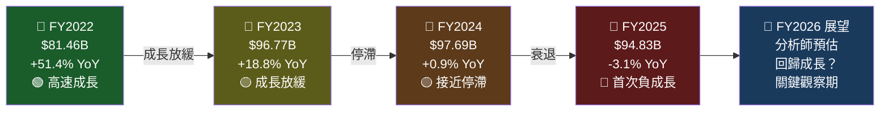

---

### 3.3 四年財務數據完整對比表

| 指標 | FY2022 | FY2023 | FY2024 | FY2025 | 趨勢 |
|------|--------|--------|--------|--------|------|
| 💰 總營收 | $81.46B | $96.77B | $97.69B | $94.83B | 🔴 |
| 📊 毛利潤 | $20.85B | $17.66B | $17.45B | $17.09B | 🔴 |
| 📉 毛利率 | **25.6%** | 18.2% | 17.9% | **18.0%** | 🔴 |
| 🏭 營業利益 | $13.83B | $8.89B | $7.76B | $4.85B | 🔴 |
| 📊 營業利益率 | **17.0%** | 9.2% | 7.9% | **5.1%** | 🔴 |
| 💵 淨利潤 | $12.58B | $15.00B | $7.13B | $3.79B | 🔴 |
| 📈 淨利率 | 15.4% | 15.5% | 7.3% | **4.0%** | 🔴 |
| 🏢 EBITDA | $17.66B | $14.80B | $14.71B | $11.76B | 🔴 |
| 🔬 R&D 支出 | $3.08B | $3.97B | $4.54B | $6.41B | 🟢 |
| 📊 R&D / 營收 | 3.8% | 4.1% | 4.6% | **6.8%** | 🟢 |
| 💹 EPS | $3.62 | $4.30 | $2.04 | $1.07 | 🔴 |

> ⚠️ **關鍵警示**：FY2022→FY2025 營業利益暴跌 64.9%，淨利潤暴跌 69.9%

---

### 3.4 利潤率演變 ASCII 折線圖

```
📉 利潤率趨勢分析（2022-2025）
%
28 |
26 | ●                          ← 毛利率
24 |  \
22 |   \
20 |    \___________________●
18 |                        ●●
16 | ●                          ← 淨利率
14 |  \●
12 |
10 |
 8 |      ●                     ← 營業利益率
 6 |       \___●
 4 |            \___●________●
 2 |                         ●  ← 淨利率FY25
 0 |__________________________|
    2022   2023   2024   2025
    
    ● 毛利率：  25.6% → 18.2% → 17.9% → 18.0%
    ● 營業率：  17.0% →  9.2% →  7.9% →  5.1%
    ● 淨利率：  15.4% → 15.5% →  7.3% →  4.0%
```

---

### 3.5 FY2025 費用結構分析

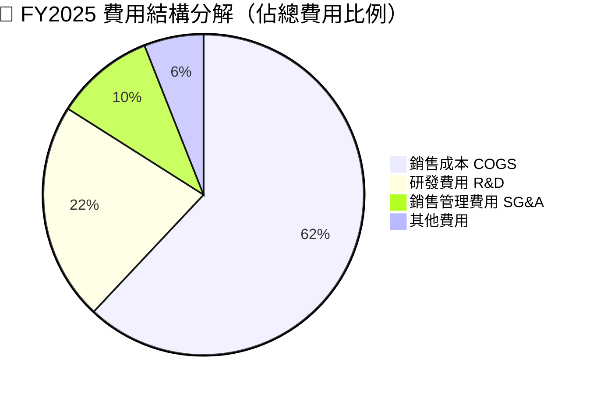

```
📊 R&D 投入快速成長（億美元）
━━━━━━━━━━━━━━━━━━━━━━━━━━━━━━━━━━━━━━━━━━━━━━━━━
FY2022  $30.8億  ▓▓▓▓▓▓▓▓▓▓▓▓░░░░░░░░░░░░░░░░░░
FY2023  $39.7億  ▓▓▓▓▓▓▓▓▓▓▓▓▓▓▓▓░░░░░░░░░░░░░░
FY2024  $45.4億  ▓▓▓▓▓▓▓▓▓▓▓▓▓▓▓▓▓▓▓░░░░░░░░░░░
FY2025  $64.1億  ▓▓▓▓▓▓▓▓▓▓▓▓▓▓▓▓▓▓▓▓▓▓▓▓▓▓░░░░  +41% YoY 🚀
━━━━━━━━━━━━━━━━━━━━━━━━━━━━━━━━━━━━━━━━━━━━━━━━━
R&D 大幅增加反映 Tesla 在 AI/FSD/Optimus 的戰略押注
```

---

## 4. 資產負債表分析

### 4.1 資產結構分解圖

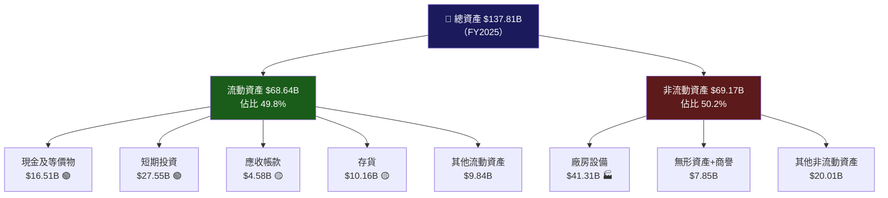

---

### 4.2 資產配置 Unicode 橫條圖

```
📊 Tesla 資產配置分析（FY2025 $137.81B）
━━━━━━━━━━━━━━━━━━━━━━━━━━━━━━━━━━━━━━━━━━━━━━━━━
現金及現金等價物  $16.51B  ▓▓▓▓▓░░░░░░░░░░░░░░░  12.0%
短期投資          $27.55B  ▓▓▓▓▓▓▓▓░░░░░░░░░░░░  20.0%
應收帳款          $ 4.58B  ▓░░░░░░░░░░░░░░░░░░░   3.3%
存貨              $10.16B  ▓▓▓░░░░░░░░░░░░░░░░░   7.4%
其他流動資產      $ 9.84B  ▓▓▓░░░░░░░░░░░░░░░░░   7.1%
廠房設備（淨值）  $41.31B  ▓▓▓▓▓▓▓▓▓▓▓▓░░░░░░░░  30.0%
其他非流動資產    $28.86B  ▓▓▓▓▓▓▓▓░░░░░░░░░░░░  20.2%
━━━━━━━━━━━━━━━━━━━━━━━━━━━━━━━━━━━━━━━━━━━━━━━━━
💡 總現金（含短期投資）：$44.06B | 淨現金：$29.34B（🟢 財務穩健）
```

---

### 4.3 負債與流動性比率表格

| 指標 | FY2022 | FY2023 | FY2024 | FY2025 | 評級 |
|------|--------|--------|--------|--------|------|
| 🏦 總資產 | $82.34B | $106.62B | $122.07B | $137.81B | 🟢 |
| 💳 總負債 | $36.44B | $43.01B | $48.39B | $54.94B | 🟡 |
| 👥 股東權益 | $44.70B | $62.63B | $72.91B | $82.14B | 🟢 |
| 💰 總債務 | $5.75B | $9.57B | $13.62B | $14.72B | 🟡 |
| 📊 流動比率 | 1.53 | 1.73 | 2.03 | **2.16** | 🟢 |
| ⚖️ 負債/股東權益 | 0.81 | 0.69 | 0.66 | **0.67** | 🟢 |
| 📉 債務/股東權益 | 0.13 | 0.15 | 0.19 | **0.18** | 🟢 |
| 💵 淨現金 | $10.50B | $6.83B | $2.52B | **$29.34B** | 🟢 |

> 🟢 **財務亮點**：流動比率2.16，淨現金$29.34B，財務體質相對穩健

---

### 4.4 股東權益趨勢 ASCII 圖

```
📈 股東權益成長趨勢（十億美元）
$B
90 |                              ●  $82.14B
80 |                         ●
70 |                    ●
60 |
50 |
45 |  ●  $44.70B
40 |
30 |
20 |
10 |
 0 |__________________________|
    2022    2023    2024    2025

成長率：2022→2025 累積成長 +83.7%
年均複合成長率 (CAGR)：22.6%

股東權益進度條：
2022: ▓▓▓▓▓▓▓▓▓▓▓▓▓▓▓▓▓▓▓▓░░░░░░░░░░  $44.70B
2023: ▓▓▓▓▓▓▓▓▓▓▓▓▓▓▓▓▓▓▓▓▓▓▓▓▓░░░░░  $62.63B
2024: ▓▓▓▓▓▓▓▓▓▓▓▓▓▓▓▓▓▓▓▓▓▓▓▓▓▓▓▓░░  $72.91B
2025: ▓▓▓▓▓▓▓▓▓▓▓▓▓▓▓▓▓▓▓▓▓▓▓▓▓▓▓▓▓▓  $82.14B 🟢
```

---

## 5. 現金流量分析

### 5.1 現金流瀑布圖

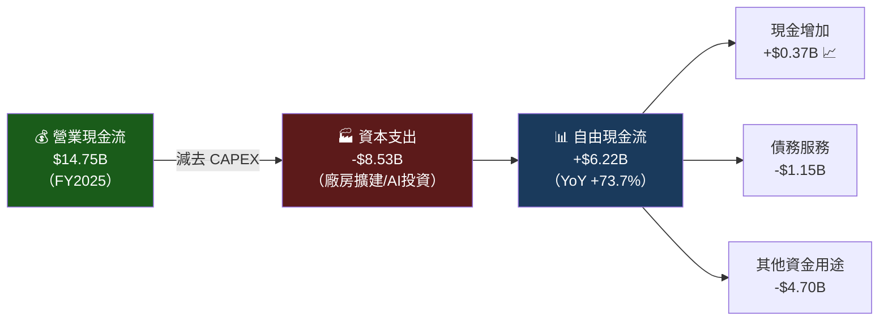

---

### 5.2 自由現金流趨勢（Unicode 進度條）

```
💸 自由現金流年度趨勢（十億美元）
━━━━━━━━━━━━━━━━━━━━━━━━━━━━━━━━━━━━━━━━━━━━━━━━━
FY2022  $7.55B  ▓▓▓▓▓▓▓▓▓▓▓▓▓▓▓▓▓▓▓▓▓▓▓▓▓░░░░░  最高點 🟢
FY2023  $4.36B  ▓▓▓▓▓▓▓▓▓▓▓▓▓▓░░░░░░░░░░░░░░░░  大幅下滑 🔴
FY2024  $3.58B  ▓▓▓▓▓▓▓▓▓▓▓▓░░░░░░░░░░░░░░░░░░  繼續下滑 🔴
FY2025  $6.22B  ▓▓▓▓▓▓▓▓▓▓▓▓▓▓▓▓▓▓▓▓▓░░░░░░░░  顯著回升 🟢
━━━━━━━━━━━━━━━━━━━━━━━━━━━━━━━━━━━━━━━━━━━━━━━━━

📊 現金流質量分析（FY2025）：
  營業現金流  $14.75B  ▓▓▓▓▓▓▓▓▓▓▓▓▓▓▓▓▓▓▓▓  佔比 100%
  資本支出    -$8.53B  ████████████░░░░░░░░░░  FCF轉換率 42.2%
  自由現金流  $ 6.22B  ▓▓▓▓▓▓▓▓░░░░░░░░░░░░░  FCF利潤率 6.6%

⚠️ 注意：CAPEX 從 FY2024 $11.34B 大幅降至 FY2025 $8.53B，是FCF改善主因
```

---

### 5.3 資本配置策略

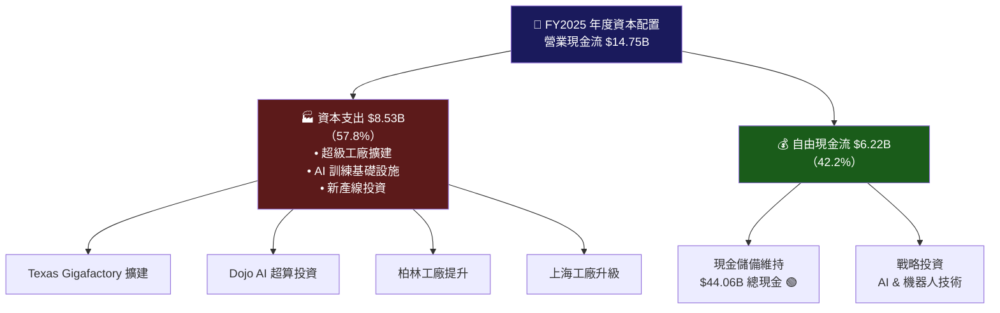

---

## 6. 獲利能力指標

### 6.1 獲利能力 vs 行業對比

| 指標 | Tesla FY2025 | 汽車業均值 | 科技業均值 | 評級 |
|------|-------------|-----------|-----------|------|
| 🎯 毛利率 | 18.0% | ~15% | ~50% | 🟡 |
| 🏭 營業利益率 | 5.1% | ~5% | ~25% | 🟡 |
| 💵 淨利率 | 4.0% | ~3% | ~20% | 🟡 |
| 📊 ROE | 4.9% | ~12% | ~30% | 🔴 |
| 🏦 ROA | 2.1% | ~4% | ~15% | 🔴 |
| 🔄 ROIC | ~3.5% | ~8% | ~20% | 🔴 |
| 💰 EBITDA 利潤率 | 12.4% | ~10% | ~35% | 🟡 |
| 🔬 R&D 比率 | 6.8% | ~4% | ~15% | 🟢 |

---

### 6.2 獲利能力評分儀表板

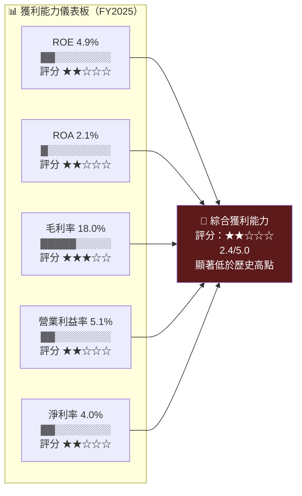

```
📉 ROE 歷史趨勢（已從高峰顯著下滑）
━━━━━━━━━━━━━━━━━━━━━━━━━━━━━━━━━━━━━━━━━━
FY2022  ROE ~32.0%  ▓▓▓▓▓▓▓▓▓▓▓▓▓▓▓▓▓▓▓▓▓▓▓▓  🟢
FY2023  ROE ~26.2%  ▓▓▓▓▓▓▓▓▓▓▓▓▓▓▓▓▓▓▓▓░░░░  🟢
FY2024  ROE ~10.3%  ▓▓▓▓▓▓▓▓░░░░░░░░░░░░░░░░  🟡
FY2025  ROE ~ 4.9%  ▓▓▓▓░░░░░░░░░░░░░░░░░░░░  🔴
━━━━━━━━━━━━━━━━━━━━━━━━━━━━━━━━━━━━━━━━━━
⚠️ 3年內ROE暴跌85%，反映盈利能力急劇惡化
```

---

## 7. 估值分析

### 7.1 估值指標全覽

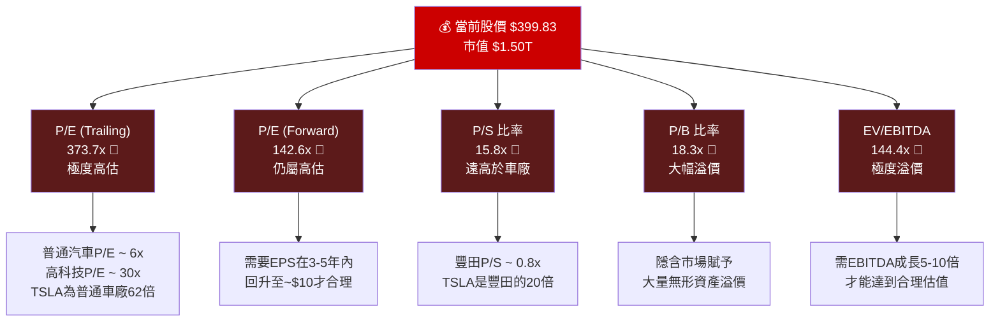

---

### 7.2 估值倍數對比表格

| 估值指標 | Tesla | Toyota | Ford | BYD | Rivian | 科技業均值 |
|---------|-------|--------|------|-----|--------|-----------|
| P/E (TTM) | 373.7x 🔴 | 6.5x | 11.2x | 28.3x | N/A | 28.5x |
| P/E (Forward) | 142.6x 🔴 | 7.1x | 7.8x | 22.1x | N/A | 24.2x |
| P/S | 15.8x 🔴 | 0.8x | 0.3x | 1.2x | 2.1x | 6.8x |
| P/B | 18.3x 🔴 | 1.0x | 1.2x | 4.8x | 1.9x | 7.5x |
| EV/EBITDA | 144.4x 🔴 | 6.5x | 14.3x | 18.6x | N/A | 18.2x |
| 市值/營收 | 15.8x 🔴 | 0.8x | 0.3x | 1.2x | 2.0x | 7.0x |

> 🔴 **估值警示**：Tesla 在所有傳統估值指標上均遠超同業，市場定價為「科技/AI 公司」而非汽車製造商

---

### 7.3 情境目標股價分析

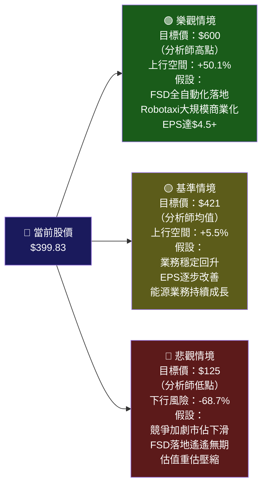

```
📊 目標價區間視覺化
━━━━━━━━━━━━━━━━━━━━━━━━━━━━━━━━━━━━━━━━━━━━━━━━━━━━━━━
$125    $200    $300    $400   $421  $500    $600
 🔴      |       |     📍NOW  🎯    |       🟢
  ↑______|_______|______↑_____|_____|_______↑
悲觀     |       |    現價   均值  |       樂觀
-68.7%   |       |           +5.5% |       +50.1%
━━━━━━━━━━━━━━━━━━━━━━━━━━━━━━━━━━━━━━━━━━━━━━━━━━━━━━━
結論：當前股價$399.83 接近分析師均值$421.73
      但下行風險遠大於上行空間，風險/報酬不對稱
```

---

## 8. 競爭護城河

### 8.1 Porter's 五力分析

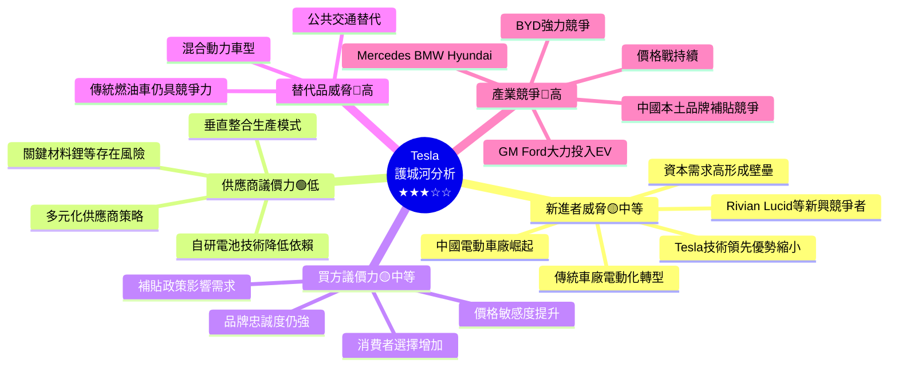

---

### 8.2 護城河評分詳細分析

```
🏰 Tesla 護城河各維度評分（滿分10分）
━━━━━━━━━━━━━━━━━━━━━━━━━━━━━━━━━━━━━━━━━━━━━━━━━
技術護城河      8.5/10  ▓▓▓▓▓▓▓▓▓░  🟢 FSD/AI領先優勢
品牌護城河      7.0/10  ▓▓▓▓▓▓▓░░░  🟢 全球認知度高（但有下降趨勢）
充電網絡        8.0/10  ▓▓▓▓▓▓▓▓░░  🟢 50,000+超充站
數據護城河      9.0/10  ▓▓▓▓▓▓▓▓▓░  🟢 數十億英里訓練數據
製造效率        6.5/10  ▓▓▓▓▓▓▓░░░  🟡 成本仍高於部分競爭者
軟體能力        8.5/10  ▓▓▓▓▓▓▓▓▓░  🟢 OTA更新/軟體定義汽車
市場地位        6.0/10  ▓▓▓▓▓▓░░░░  🟡 市佔率受壓，競爭加劇
財務實力        7.0/10  ▓▓▓▓▓▓▓░░░  🟢 淨現金$29.34B
━━━━━━━━━━━━━━━━━━━━━━━━━━━━━━━━━━━━━━━━━━━━━━━━━
綜合護城河評分：7.6/10 ★★★★☆
```

---

### 8.3 競爭定位矩陣

| 競爭維度 | Tesla | BYD | Toyota EV | GM Ultium | Rivian |
|---------|-------|-----|-----------|-----------|--------|
| 🤖 自動駕駛技術 | 🟢 頂級 | 🟡 中等 | 🟡 中等 | 🟡 中等 | 🟡 初期 |
| 💰 成本競爭力 | 🟡 中等 | 🟢 強 | 🟡 中等 | 🟡 中等 | 🔴 弱 |
| 🔋 電池技術 | 🟢 領先 | 🟢 領先 | 🟡 中等 | 🟡 中等 | 🟡 中等 |
| 📱 軟體能力 | 🟢 頂級 | 🟡 改善中 | 🔴 落後 | 🟡 中等 | 🟡 中等 |
| ⚡ 充電網絡 | 🟢 最優 | 🟢 強（中國） | 🟡 中等 | 🟡 中等 | 🔴 弱 |
| 🌍 全球銷量 | 🟡 成長停滯 | 🟢 快速成長 | 🟢 穩定強 | 🟡 初期 | 🔴 小眾 |
| 💵 估值合理性 | 🔴 極高 | 🟡 合理 | 🟢 低估 | 🟢 低估 | 🔴 虧損 |

---

## 9. 成長催化劑

### 9.1 成長催化劑時間軸

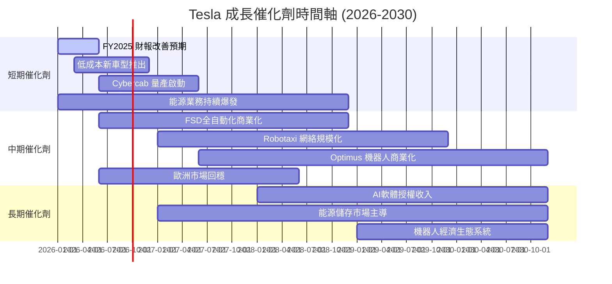

---

### 9.2 短中長期機會分解

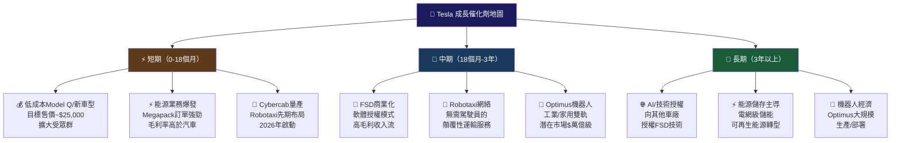

---

### 9.3 TAM 市場規模估算

```
🌍 Tesla 潛在市場規模（TAM）分析
━━━━━━━━━━━━━━━━━━━━━━━━━━━━━━━━━━━━━━━━━━━━━━━━━
電動車市場（2030E）  $1.3萬億  ▓▓▓▓▓▓▓▓▓▓▓▓▓▓▓▓░░░░  當前收入$94.8B
Robotaxi市場（2030E） $1.0萬億  ▓▓▓▓▓▓▓▓▓▓▓▓░░░░░░░░  幾乎未涉足
能源儲存市場（2030E） $0.5萬億  ▓▓▓▓▓▓░░░░░░░░░░░░░░  當前收入~$10B
人形機器人（2035E）   $2.0萬億  ▓▓▓▓▓▓▓▓▓▓░░░░░░░░░░  早期布局
AI軟體授權（2030E）   $0.3萬億  ▓▓▓▓░░░░░░░░░░░░░░░░  幾乎未商業化
━━━━━━━━━━━━━━━━━━━━━━━━━━━━━━━━━━━━━━━━━━━━━━━━━
合計潛在TAM：~$5.1萬億（2030-2035年）
關鍵問題：Tesla能否從TAM中獲取足夠市場份額以支撐$1.5T估值？
```

---

## 10. 風險分析

### 10.1 風險矩陣

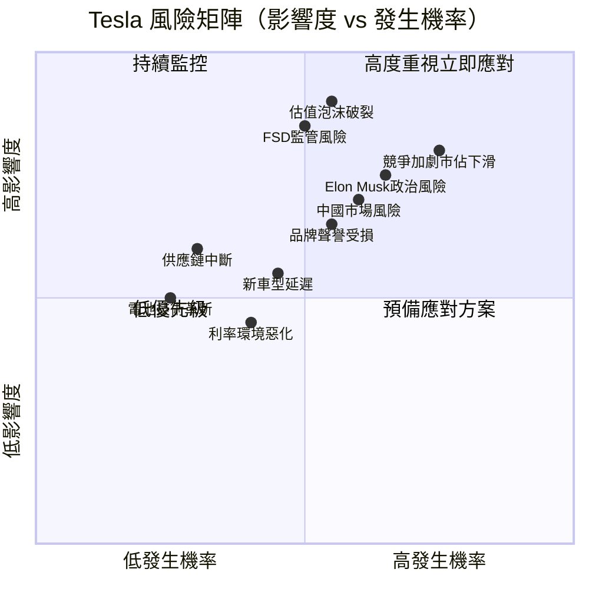

---

### 10.2 風險評分卡

| 風險類型 | 發生機率 | 影響度 | 綜合風險分 | 緩解措施 |
|---------|---------|-------|-----------|---------|
| 🔴 估值泡沫重估 | 55% | 極高 | **9.5/10** | 等待業績支撐 |
| 🔴 競爭加劇失市佔 | 75% | 高 | **9.0/10** | 新車型/降價策略 |
| 🔴 Elon 政治形象風險 | 65% | 高 | **8.5/10** | 自動化管理機制 |
| 🔴 FSD 監管限制 | 50% | 極高 | **8.5/10** | 多國監管溝通 |
| 🔴 中國市場萎縮 | 60% | 高 | **8.0/10** | 本土化策略加強 |
| 🟡 品牌聲譽受損 | 55% | 中高 | **7.0/10** | 公關危機管理 |
| 🟡 新車型量產延遲 | 45% | 中 | **5.5/10** | 精實生產管理 |
| 🟡 供應鏈風險 | 30% | 中高 | **5.0/10** | 多元供應商布局 |
| 🟡 利率/宏觀風險 | 40% | 中 | **4.5/10** | 強健資產負債表 |
| 🟢 電池技術革新 | 25% | 中 | **3.5/10** | 持續R&D投入 |

---

### 10.3 核心風險深度解析

```
⚠️ 前五大風險綜合評估
━━━━━━━━━━━━━━━━━━━━━━━━━━━━━━━━━━━━━━━━━━━━━━━━━

1. 估值泡沫   風險度 ▓▓▓▓▓▓▓▓▓░  9.5/10 🔴
   核心問題：P/E 373x需要EPS年增60%+才能合理化
   
2. 競爭失守   風險度 ▓▓▓▓▓▓▓▓▓░  9.0/10 🔴
   核心問題：BYD全球擴張+歐美車廠加速電動化
   
3. 政治形象   風險度 ▓▓▓▓▓▓▓▓▓░  8.5/10 🔴
   核心問題：歐洲TSLA銷量下滑20%+，品牌受損明顯
   
4. FSD監管   風險度 ▓▓▓▓▓▓▓▓░░  8.5/10 🔴
   核心問題：各國監管機構對L3+自動駕駛態度不一
   
5. 中國風險   風險度 ▓▓▓▓▓▓▓▓░░  8.0/10 🔴
   核心問題：BYD+地緣政治+關稅威脅Tesla中國份額
━━━━━━━━━━━━━━━━━━━━━━━━━━━━━━━━━━━━━━━━━━━━━━━━━
```

---

## 11. 公平價值估算

### 11.1 DCF 模型架構

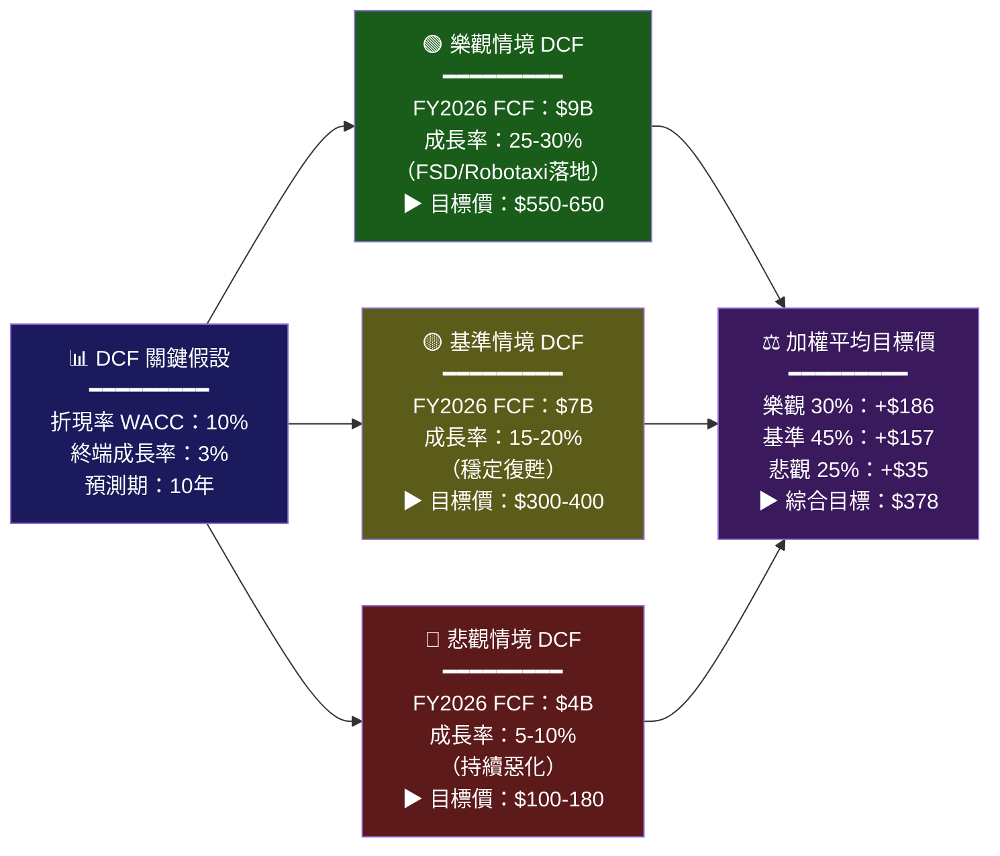

---

### 11.2 三種估值法比較

| 估值方法 | 方法說明 | 目標價（樂觀） | 目標價（基準） | 目標價（悲觀） |
|---------|---------|-------------|-------------|-------------|
| 📊 DCF 現金流折現 | WACC 10%, 成長假設 | $600 | $350 | $150 |
| 📈 P/E 相對估值 | Forward P/E 50x × EPS$2.8 | $560 | $420 | $140 |
| 💰 EV/EBITDA | EV/EBITDA 60x × EBITDA | $520 | $380 | $120 |
| 📊 P/S 銷售倍數 | P/S 8x × 預估收入 | $580 | $300 | $100 |
| ⚖️ **加權平均** | **各法綜合** | **$565** | **$363** | **$128** |
| 📍 當前股價 | $399.83 | 🔴低於樂觀 | 🔴高於基準 | 🔴遠高於悲觀 |

---

### 11.3 估值區間視覺化

```
📊 Tesla 公平價值估算區間
━━━━━━━━━━━━━━━━━━━━━━━━━━━━━━━━━━━━━━━━━━━━━━━━━━━━━━━━━━
$0   $100  $150  $200  $250  $300  $350  $400  $450  $500  $600
 |    |     |     |     |     |     |     |     |     |     |
 |    🔴悲觀|     |     |     |🟡基準|   📍NOW|     |   🟢樂觀   |
 |  $128   |     |     |     |$363 |$399  |     |     | $565|
 |         |                 |     |      |                 |
━━━━━━━━━━━━━━━━━━━━━━━━━━━━━━━━━━━━━━━━━━━━━━━━━━━━━━━━━━

結論分析：
🔴 相對基準情境（$363）：當前股價溢價約 +10.2%
🟡 相對樂觀情境（$565）：仍有上行空間 +41.3%（需完美執行）
🔴 相對悲觀情境（$128）：下行風險 -68.0%（不可忽視）

風險/報酬比：約 1:6.7（每1元上行對應6.7元下行）→ 不利
```

---

## 12. 投資建議

### 12.1 最終投資評級

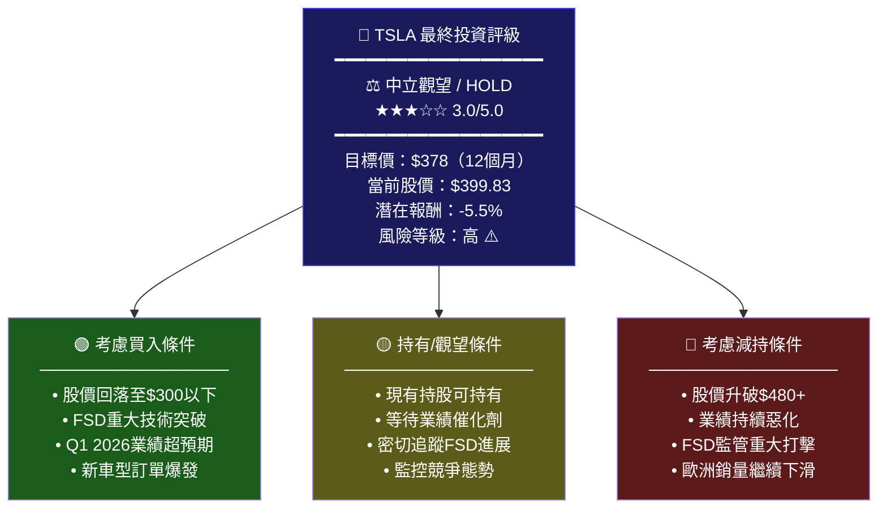

---

### 12.2 不同投資人適配度分析

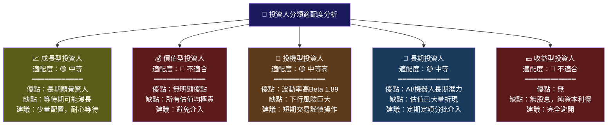

---

### 12.3 關鍵監控指標 Checklist

```
📋 Tesla 投資監控儀表板（定期追蹤）
━━━━━━━━━━━━━━━━━━━━━━━━━━━━━━━━━━━━━━━━━━━━━━━━━━━━━

🔲 財務指標追蹤（每季）
  ☐ 毛利率是否回升至20%以上？（目前18.0%）
  ☐ 汽車交付量是否恢復同比正成長？
  ☐ 自由現金流是否維持$5B+？
  ☐ 能源業務收入是否持續高速成長？
  ☐ R&D投入比是否帶來技術突破？

🔲 業務催化劑追蹤（持續）
  ☐ FSD完全自動化版本落地進度
  ☐ Cybercab量產時程確認
  ☐ Optimus機器人商業訂單
  ☐ 低成本新車型（Model Q）推出
  ☐ 超級充電網絡第三方開放進展

🔲 競爭態勢追蹤（每月）
  ☐ BYD全球銷量 vs Tesla交付量對比
  ☐ 歐洲市場電動車市佔率變化
  ☐ 中國市場本土品牌競爭態勢
  ☐ 傳統車廠電動化加速情況

🔲 風險警報指標（即時）
  ☐ Elon Musk 重大負面事件
  ☐ FSD 重大安全事故
  ☐ 中美關係惡化對Tesla影響
  ☐ 電動車補貼政策重大變化
  ☐ 宏觀利率環境轉向

🔲 估值警戒線
  ☐ 買入區間：$280-$320 🟢
  ☐ 持有區間：$320-$450 🟡
  ☐ 減持區間：$450-$500 🟡
  ☐ 強烈減持：>$500      🔴
```

---

### 12.4 最終投資建議總結

```mermaid
graph LR
    BULL_T["🟢 多方理由<br/>━━━━━━━━━<br/>• AI/FSD長期潛力巨大<br/>• 能源業務高速成長<br/>• 數據護城河難以複製<br/>• 財務體質穩健$29B淨現金<br/>• FCF FY2025顯著改善<br/>• R&D大幅增加布局未來<br/>• Robotaxi顛覆性潛力"]
    
    VERDICT["⚖️ 最終裁定<br/>━━━━━━━━━━━<br/>評級：中立/HOLD<br/>目標價：$378<br/>時間框架：12個月<br/>風險評級：高⚠️<br/>━━━━━━━━━━━<br/>當前股價$399.83<br/>估值偏貴，但<br/>長期潛力不可忽視<br/>建議觀望等待<br/>更佳進場點"]
    
    BEAR_T["🔴 空方理由<br/>━━━━━━━━━<br/>• P/E 373x極度高估<br/>• 營收首次年度負成長<br/>• 毛利率歷史低位<br/>• 競爭全面加劇<br/>• Elon政治風險升溫<br/>• 歐洲品牌受損跡象<br/>• 汽車業務前景不明"]
    
    BULL_T --> VERDICT
    BEAR_T --> VERDICT
    
    style BULL_T fill:#1a5c1a,color:#fff
    style VERDICT fill:#1a1a5c,color:#fff,stroke:#ffff00,stroke-width:3px
    style BEAR_T fill:#5c1a1a,color:#fff
```

---

## 📊 報告摘要評分卡

| 分析維度 | 評分 | 星級 | 核心觀點 |
|---------|------|------|---------|
| 📊 基本面質量 | 55/100 | ★★☆☆☆ | 盈利惡化，FCF改善是亮點 |
| 💰 估值合理性 | 20/100 | ★☆☆☆☆ | P/E 373x 嚴重高估 |
| 🚀 成長潛力 | 80/100 | ★★★★☆ | AI/機器人長期願景驚人 |
| 🏰 競爭護城河 | 76/100 | ★★★★☆ | 技術+數據護城河強大 |
| ⚠️ 風險管理 | 40/100 | ★★☆☆☆ | 多重重大風險並存 |
| 📈 技術動能 | 65/100 | ★★★☆☆ | 距高點-20%，仍在高位 |
| 🎯 **綜合評分** | **56/100** | **★★★☆☆** | **中立觀望，等待更佳布局點** |

---

> ## ⚠️ 免責聲明
>
> **本報告完全由 AI 自動生成，所有分析內容僅供學術研究與資訊參考之用，絕不構成任何形式的投資建議、買賣推薦或財務顧問服務。**
>
> 投資涉及風險，過去表現不代表未來結果。股票市場波動劇烈，投資者可能損失全部或部分投資本金。在做出任何投資決策前，請務必諮詢持牌專業財務顧問，並充分了解自身的風險承受能力與投資目標。
>
> **報告日期**：2026-02-24 ｜ **數據截止**：2026-02-24 ｜ **分析工具**：AI 基本面分析引擎