# TSLA 基本面深度分析報告
> **報告日期**：2026-02-25 ｜ **分析師**：AI 機構研究部 ｜ **數據來源**：Yahoo Finance ｜ **股票代碼**：TSLA US

---

## 目錄

1. [執行摘要](#1-執行摘要)
2. [公司概覽與商業模式](#2-公司概覽與商業模式)
3. [損益表深度分析](#3-損益表深度分析)
4. [資產負債表分析](#4-資產負債表分析)
5. [現金流量深度分析](#5-現金流量深度分析)
6. [獲利能力與資本效率](#6-獲利能力與資本效率)
7. [估值深度分析](#7-估值深度分析)
8. [成長催化劑](#8-成長催化劑)
9. [風險矩陣](#9-風險矩陣)
10. [投資建議](#10-投資建議)

---

## 1. 執行摘要

### 🎯 核心評分儀表板

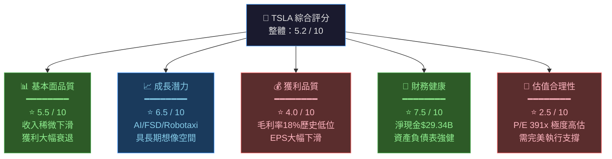

---

### 📋 5大投資論點 + 3大風險

| 類別 | 項目 | 說明 | 信心度 |
|------|------|------|--------|
| 🟢 **多頭論點1** | FSD & Robotaxi 商業化 | Full Self-Driving 訂閱 + Cybercab 潛在市場TAM超$10T | 🟡 中等 |
| 🟢 **多頭論點2** | 能源業務高速成長 | Megapack/Powerwall需求爆發，毛利率優於汽車業務 | 🟢 較高 |
| 🟢 **多頭論點3** | Optimus 人形機器人 | 2026年量產目標，若成功市場重新定價整個公司 | 🟡 投機 |
| 🟢 **多頭論點4** | 強健資產負債表 | 淨現金$29.34B，具備穿越週期與加大投資能力 | 🟢 較高 |
| 🟢 **多頭論點5** | AI生態護城河 | 龐大車隊真實世界行駛數據，訓練自動駕駛AI難以複製 | 🟡 中等 |
| 🔴 **風險1** | 估值嚴重透支 | P/E 391x / Forward P/E 148x，已定價極度樂觀情境 | 🔴 高風險 |
| 🔴 **風險2** | 核心汽車業務衰退 | 2025年營收 -3.1% YoY，EPS -60.6% YoY，競爭加劇 | 🔴 高風險 |
| 🔴 **風險3** | 馬斯克執行力分散 | 同時管理SpaceX/xAI/DOGE等，TSLA戰略執行存疑 | 🟡 中等 |

---

### 📊 快速統計卡片

| 指標 | TSLA 數值 | 行業均值 | 對比信號 |
|------|-----------|----------|----------|
| 市值 | $1.56T | - | 🟢 全球前十大 |
| P/E（Trailing） | 391.6x | ~15x（傳統車廠） | 🔴 極度溢價 |
| P/E（Forward） | 148.0x | ~12x | 🔴 極度溢價 |
| EV/EBITDA | 143.5x | ~8x | 🔴 極度溢價 |
| P/S | 16.4x | ~0.5x | 🔴 極度溢價 |
| 毛利率 | 18.0% | ~14%（車廠） | 🟡 略高 |
| 營業利益率 | 4.7% | ~6% | 🟡 略低 |
| 淨利率 | 4.0% | ~4% | 🟡 持平 |
| 收入成長YoY | -3.1% | ~3% | 🔴 低於均值 |
| 淨現金 | +$29.34B | 各異 | 🟢 財務強健 |
| ROE | 4.9% | ~10% | 🔴 低於均值 |
| FCF Yield | 0.24% | ~3% | 🔴 極低 |
| Beta | 1.887 | ~1.0 | 🔴 高波動 |

---

### 🏁 投資結論

```
┌─────────────────────────────────────────────────────────────┐
│                    📌 投資評級：觀望 / HOLD                   │
│                                                              │
│  當前價格：$415.08                                            │
│  目標價區間（12個月）：$280 – $500                             │
│  基準目標價：$380                                              │
│  隱含報酬率（基準）：-8.5%                                     │
│                                                              │
│  ⚠️  在估值極度透支、基本面惡化的背景下，                        │
│      需等待FSD/Robotaxi商業化具體驗證，                         │
│      或股價回調至合理區間後再考慮建倉。                           │
└─────────────────────────────────────────────────────────────┘
```

---

## 2. 公司概覽與商業模式

### 🏗️ 業務結構與收入來源

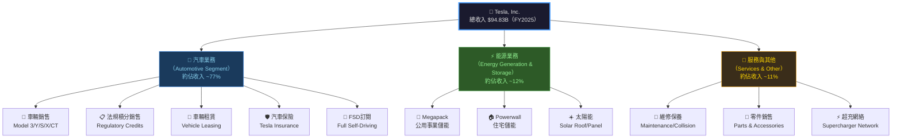

---

### 🥧 市場份額估算（美國BEV市場 2025年）

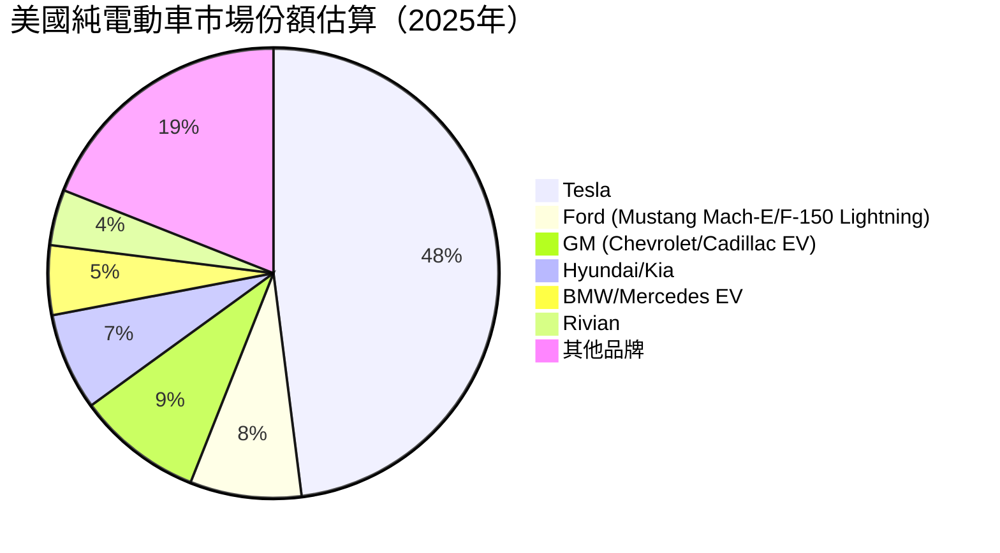

> 📝 **注**：Tesla在美國BEV市場仍維持約48%份額，但較2022年70%+顯著下滑，中國市場面臨比亞迪激烈競爭。

---

### 🧠 競爭護城河 Mind Map

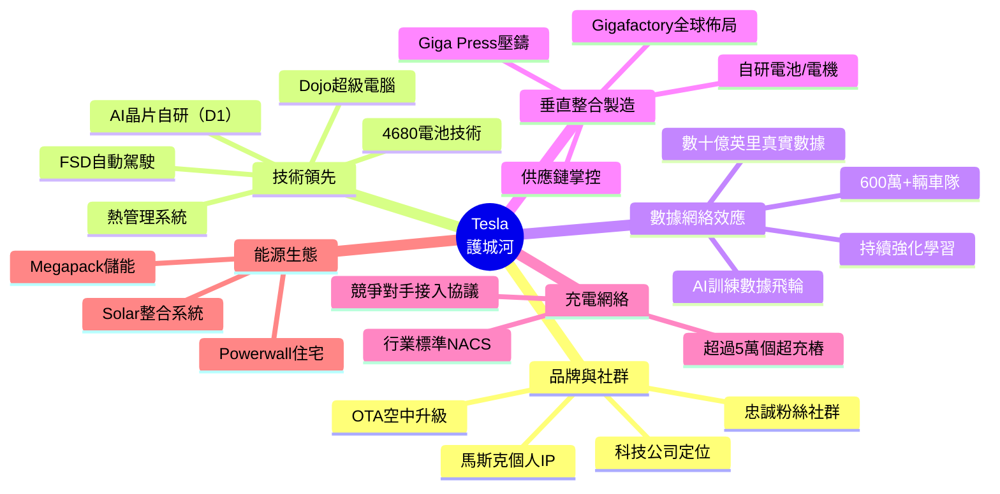

---

### 💪 護城河強度評分

```
護城河維度評估（滿分10分）

品牌溢價      ▓▓▓▓▓▓▓░░░  7.0/10  強品牌但被馬斯克政治風險侵蝕
技術領先      ▓▓▓▓▓▓▓▓░░  8.0/10  FSD/電池/AI具明顯優勢
數據網絡效應  ▓▓▓▓▓▓▓▓░░  8.0/10  最大車隊數據集，難以複製
垂直整合      ▓▓▓▓▓▓▓░░░  7.0/10  Gigafactory佈局但資本密集
充電網絡      ▓▓▓▓▓▓▓▓░░  8.0/10  NACS成行業標準，戰略優勢
成本優勢      ▓▓▓▓▓░░░░░  5.0/10  降價侵蝕毛利，優勢縮小
轉換成本      ▓▓▓▓░░░░░░  4.0/10  軟體生態但切換成本有限
規模效應      ▓▓▓▓▓▓░░░░  6.0/10  仍在建設中，尚未充分體現

━━━━━━━━━━━━━━━━━━━━━━━━━━━━━━━━━━━━━━━━━━
綜合護城河評分：▓▓▓▓▓▓▓░░░  6.6/10（寬護城河，但正受侵蝕）
```

---

## 3. 損益表深度分析

### 📈 年度收入成長趨勢（近4年）

```
年度收入絕對值與YoY成長率

FY2022  $81.46B  ██████████████████████████████████████░  +51.4% YoY 🟢
        ████████████████████████████████████████

FY2023  $96.77B  ████████████████████████████████████████████░  +18.8% YoY 🟢
        ██████████████████████████████████████████████

FY2024  $97.69B  ████████████████████████████████████████████░  +0.9% YoY  🟡
        ████████████████████████████████████████████░

FY2025  $94.83B  ██████████████████████████████████████████░░  -3.1% YoY  🔴
        ██████████████████████████████████████████░░

        0        20B      40B      60B      80B     100B
        ├────────┼────────┼────────┼────────┼────────┤

⚠️  收入成長急速放緩：51.4% → 18.8% → 0.9% → -3.1%
    FY2025首度出現負增長，警示信號明顯。
```

---

### 📊 季度收入趨勢（近4季詳細分析）

| 季度 | 收入 | QoQ變化 | 毛利潤 | 毛利率 | 營業利潤 | 淨利潤 |
|------|------|---------|--------|--------|---------|--------|
| 2025Q1 | $19.34B | - | $3.15B | 16.3% 🔴 | $0.49B | $0.41B |
| 2025Q2 | $22.50B | **+16.3%** 🟢 | $3.88B | 17.2% 🟡 | $0.92B | $1.17B |
| 2025Q3 | $28.09B | **+24.8%** 🟢 | $5.05B | 18.0% 🟡 | $1.86B | $1.37B |
| 2025Q4 | $24.90B | **-11.4%** 🔴 | $5.01B | 20.1% 🟢 | $1.57B | $0.84B |

> 📝 **QoQ分析**：Q3強勁反彈係因新車型推出+中國市場回暖，Q4回落反映需求季節性疲軟。Q4毛利率20.1%為年內最高，顯示成本控制見效，但利潤絕對金額仍偏低。

**季度YoY對比**（估算）：

| 季度 | 2025收入 | 2024同期估算 | YoY% |
|------|---------|------------|------|
| Q1 | $19.34B | ~$21.3B | **-9.2%** 🔴 |
| Q2 | $22.50B | ~$25.2B | **-10.7%** 🔴 |
| Q3 | $28.09B | ~$25.2B | **+11.5%** 🟢 |
| Q4 | $24.90B | ~$26.0B | **-4.2%** 🔴 |

---

### 📉 利潤率演變（近4年）

| 年度 | 毛利率 | 營業利益率 | EBITDA率 | 淨利率 | 趨勢 |
|------|--------|-----------|---------|--------|------|
| FY2022 | **25.6%** 🟢 | **17.0%** 🟢 | **21.7%** 🟢 | **15.5%** 🟢 | 歷史峰值 |
| FY2023 | **18.2%** 🟡 | **9.2%** 🟡 | **15.3%** 🟡 | **15.5%** 🟢* | 急速惡化 |
| FY2024 | **17.9%** 🟡 | **7.9%** 🟡 | **15.1%** 🟡 | **7.3%** 🟡 | 持續下滑 |
| FY2025 | **18.0%** 🟡 | **5.1%** 🔴 | **12.4%** 🔴 | **4.0%** 🔴 | 惡化明顯 |

> *FY2023淨利潤$15B中包含大量一次性稅務優惠（遞延稅資產釋放約$5.9B），扣除後實質淨利率約9.4%

**利潤率惡化根本原因分析**：
- **價格戰主動降價**：2023-2024年多次大幅降價（幅度達10-20%）以捍衛市場份額
- **競爭烈度上升**：比亞迪、小鵬、理想在中國市場激烈競爭
- **R&D費用飆升**：2025年R&D達$6.41B（+41.2% YoY），為FY2022的2倍
- **Cybertruck產能爬坡**：新車型早期良率低，拖累整體毛利率

---

### 🥧 費用結構分析（FY2025佔收入比）

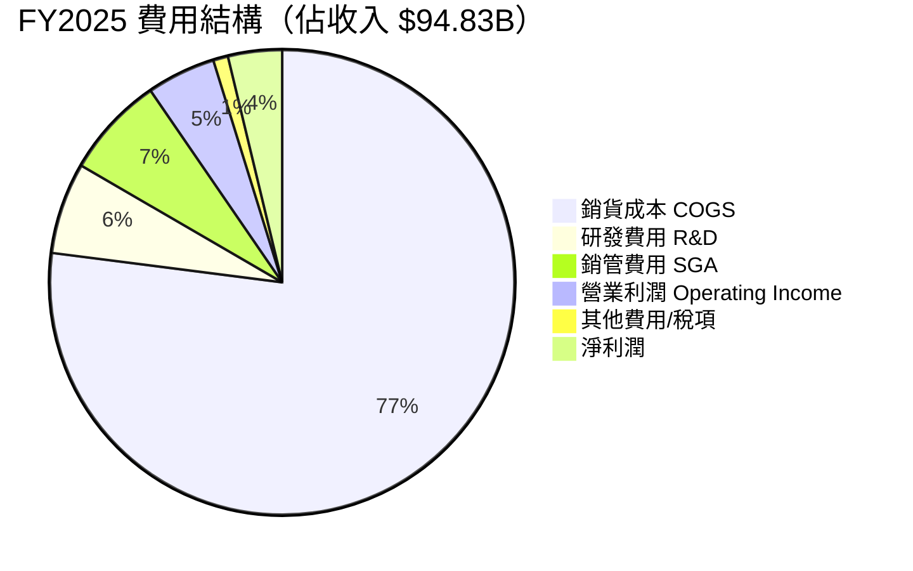

**費用趨勢警示**：
```
R&D費用成長（佔收入比）：
FY2022：$3.08B（3.8%）  ▓▓▓▓░░░░░░
FY2023：$3.97B（4.1%）  ▓▓▓▓▓░░░░░
FY2024：$4.54B（4.6%）  ▓▓▓▓▓░░░░░
FY2025：$6.41B（6.8%）  ▓▓▓▓▓▓▓░░░  ⚠️ 急增41.2% YoY
```

---

### 📊 EPS趨勢與盈餘品質分析

**年度EPS趨勢**：
```
年度 EPS（Diluted）趨勢

FY2022：$4.07  ████████████████████████████████░  頂峰
FY2023：$4.73  ████████████████████████████████████░  *含稅務優惠
FY2024：$2.24  ██████████████████░  -52.7% YoY 🔴
FY2025：$1.06  █████████░  -52.7% YoY 🔴（TTM）

連續兩年EPS腰斬！
```

**季度EPS趨勢（FY2025）**：

| 季度 | EPS實際 | 備注 |
|------|---------|------|
| 2025Q1 | ~$0.11 | 季度低谷 🔴 |
| 2025Q2 | ~$0.31 | 環比改善 🟡 |
| 2025Q3 | ~$0.36 | 持續復甦 🟡 |
| 2025Q4 | ~$0.22 | 再度回落 🟡 |

> ⚠️ **數據說明**：本次數據包中EPS預測值(Estimate)與實際值(Actual)均顯示NaN，無法計算Beat/Miss，可能係因數據提供商API限制。依財務數據推算季度EPS如上。

**盈餘品質評估**：
- FY2023的$15B淨利潤中含~$5.9B遞延稅資產，**盈餘品質打折扣** 🔴
- FY2025 FCF（$6.22B）> 淨利潤（$3.79B），**現金轉換率良好** 🟢
- 法規積分收入（高毛利，非核心業務）佔比提高，需監控可持續性 🟡

---

## 4. 資產負債表分析

### 🏗️ 資產結構分解（FY2025）

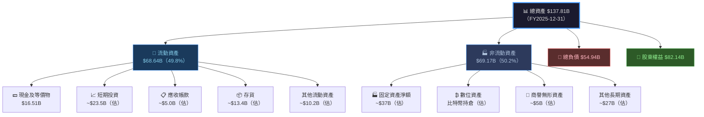

---

### 💧 流動性指標

| 指標 | FY2025 | FY2024 | FY2023 | FY2022 | 行業均值 | 信號 |
|------|--------|--------|--------|--------|---------|------|
| 流動比率 | **2.164** | 2.024 | 1.726 | 1.532 | ~1.2 | 🟢 優異 |
| 速動比率 | **1.538** | ~1.4 | ~1.2 | ~1.0 | ~0.8 | 🟢 良好 |
| 現金比率 | **0.521** | 0.560 | 0.570 | 0.608 | ~0.3 | 🟢 充裕 |
| 淨現金 | **+$29.34B** | +$29.34B | +$22.34B | +$16.62B | 各異 | 🟢 強勁 |

> 🟢 **流動性結論**：Tesla流動性極為充裕，現金部位$44.06B（含短期投資）遠超$14.72B有息負債，財務彈性高。

---

### 🏦 債務結構分析

```
債務質量評估（FY2025）

總債務：$14.72B
├── 短期債務：  ~$2.5B  ▓▓░░░░░░░░░░░░░░
└── 長期債務：  ~$12.2B ▓▓▓▓▓▓▓▓▓░░░░░░░

淨現金/淨負債：  +$29.34B  （淨現金，財務健康）🟢
Debt/Equity：    17.76%    （極低，幾乎無財務槓桿風險）🟢
Debt/EBITDA：    1.25x     （$14.72B / $11.76B）🟢（<3x為安全線）

債務增長趨勢：
FY2022：$5.75B   ▓▓▓░░░░░░░
FY2023：$9.57B   ▓▓▓▓▓░░░░░
FY2024：$13.62B  ▓▓▓▓▓▓▓░░░
FY2025：$14.72B  ▓▓▓▓▓▓▓▓░░  ⚠️ 債務4年增長2.6倍，但絕對量仍可控
```

---

### 📈 股東權益成長趨勢

```
股東權益（Stockholders' Equity）成長

FY2022：$44.70B  ████████████████████░░░░░░░░░░░░░░░░░░░░
FY2023：$62.63B  ████████████████████████████░░░░░░░░░░░░  +40.1% YoY 🟢
FY2024：$72.91B  ████████████████████████████████░░░░░░░░  +16.4% YoY 🟢
FY2025：$82.14B  █████████████████████████████████████░░░  +12.7% YoY 🟢

帳面價值/股（BVPS）估算：
$82.14B ÷ 3.75B股 ≈ $21.90/股
P/B = $415.08 / $21.90 = 18.9x  🔴（隱含市場對未來極度樂觀預期）

帳面價值穩健增長，但ROE（4.9%）遠低於股權成本（WACC估算見第6章）
```

---

## 5. 現金流量深度分析

### 🌊 現金流量瀑布圖（FY2025）

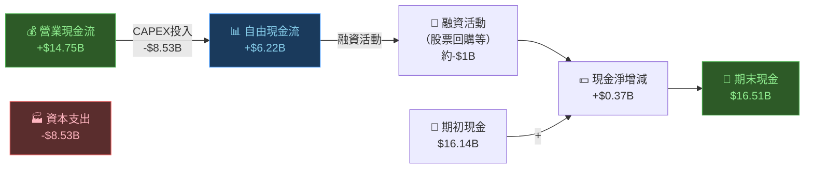

---

### 📊 FCF轉換率趨勢

| 年度 | 淨利潤 | 自由現金流 | FCF/淨利潤 | 品質評估 |
|------|--------|-----------|-----------|---------|
| FY2022 | $12.58B | $7.55B | **60.0%** | 🟡 尚可 |
| FY2023 | $15.00B | $4.36B | **29.1%** 🔴 | 🔴 差（含稅務） |
| FY2024 | $7.13B | $3.58B | **50.2%** | 🟡 中等 |
| FY2025 | $3.79B | $6.22B | **164%** 🟢 | 🟢 優異 |

> 🟢 **FY2025 FCF品質大幅改善**：FCF（$6.22B）遠超淨利潤（$3.79B），主要因非現金攤銷（D&A約$7B）及資本支出削減（$11.34B→$8.53B，-24.8% YoY），顯示實際現金生成能力優於GAAP盈餘。

---

### 📊 自由現金流趨勢（近4年）

```
自由現金流（FCF）

FY2022：$7.55B   ████████████████████████████████████░░░░░░░░
                  CAPEX：$7.17B（佔OCF 48.7%）

FY2023：$4.36B   █████████████████████░░░░░░░░░░░░░░░░░░░░░░
                  CAPEX：$8.90B（佔OCF 67.1%）⚠️

FY2024：$3.58B   █████████████████░░░░░░░░░░░░░░░░░░░░░░░░░░
                  CAPEX：$11.34B（佔OCF 76.0%）🔴

FY2025：$6.22B   ██████████████████████████████░░░░░░░░░░░░░
                  CAPEX：$8.53B（佔OCF 57.8%）🟡 改善

0        2B        4B        6B        8B

📌 CAPEX趨勢：FY2022-2024持續攀升，FY2025大幅削減，FCF顯著改善
   但FCF Yield僅0.24%（$3.73B*÷$1.56T）仍極低
   *報告中FCF Yield使用$3.73B數字，與現金流量表$6.22B存在差異，
    可能係TTM計算基準不同，以$6.22B（Annual）為準更能反映趨勢。
```

---

### 💼 資本配置評估

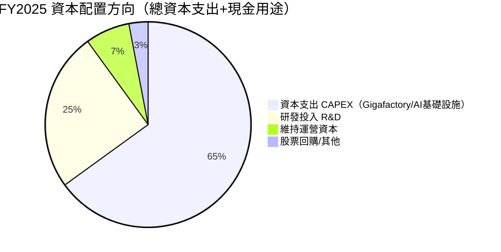

**資本配置評語**：
- ✅ **高CAPEX投入**：$8.53B CAPEX主要流向Giga Nevada/Texas/Berlin擴產及AI基礎設施（Dojo超算）
- ✅ **R&D激增**：$6.41B R&D（+41% YoY）押注FSD/Optimus長期技術領先
- ❌ **無股息、無大規模回購**：Free cash flow未回饋股東，增長投資優先
- ⚠️ **資本效率承壓**：大量投入未見立即盈利改善，短期ROI待驗證

---

## 6. 獲利能力與資本效率

### 📊 ROE / ROA / ROIC 趨勢（近4年）

| 年度 | ROE | ROA | ROIC（估） | 行業均值ROE | 信號 |
|------|-----|-----|-----------|------------|------|
| FY2022 | **28.1%** | **15.3%** | **~22%** | ~12% | 🟢 遠超行業 |
| FY2023 | **23.9%** | **14.1%** | **~18%** | ~12% | 🟢 超越行業 |
| FY2024 | **9.8%** | **5.8%** | **~7%** | ~12% | 🟡 接近行業 |
| FY2025 | **4.9%** | **2.1%** | **~3.5%** | ~12% | 🔴 低於行業 |

> ⚠️ ROIC急速惡化：從FY2022的~22%跌至FY2025的~3.5%，顯示大規模資本投入尚未轉化為有效回報。

---

### ⚖️ ROIC vs WACC 分析（核心章節）

**WACC估算**：

```
WACC = Ke × (E/V) + Kd × (D/V) × (1-T)

假設參數：
• 無風險利率 (Rf)：4.5%（10Y美債）
• 市場風險溢酬 (ERP)：5.5%
• Beta (β)：1.887
• 股權成本 (Ke) = 4.5% + 1.887 × 5.5% = 4.5% + 10.4% = 14.9%
• 稅前債務成本 (Kd)：~4.2%（估）
• 稅率 (T)：~21%
• 股權佔比 (E/V)：$1.56T / ($1.56T + $14.72B) = 99.1%
• 債務佔比 (D/V)：0.9%

WACC = 14.9% × 99.1% + 4.2% × 0.9% × (1-21%)
     = 14.76% + 0.03%
     ≈ 14.8%
```

**EVA（經濟附加值）分析**：

```
┌─────────────────────────────────────────────────────────┐
│              ROIC vs WACC 判決                           │
│                                                         │
│  ROIC（FY2025）：  ~3.5%                                │
│  WACC（估算）  ：  ~14.8%                               │
│  ─────────────────────────────────────                  │
│  經濟利差（Spread）：3.5% - 14.8% = -11.3%  🔴         │
│                                                         │
│  EVA = 投入資本 × (ROIC - WACC)                        │
│      = ~$68B × (-11.3%)                                 │
│      ≈ -$7.7B  （正在摧毀股東價值）🔴                   │
│                                                         │
│  ⚠️  結論：Tesla目前ROIC大幅低於WACC，                   │
│      短期正在「摧毀」股東帳面經濟價值。                   │
│      市場定價完全建立在未來FSD/Robotaxi/                  │
│      Optimus創造超額回報的預期之上。                      │
└─────────────────────────────────────────────────────────┘

ROIC趨勢：
FY2022：~22% ██████████████████████░░  ROIC > WACC 🟢 創造價值
FY2023：~18% ██████████████████░░░░░░  ROIC > WACC 🟢 創造價值
FY2024：~7%  ███████░░░░░░░░░░░░░░░░░  ROIC < WACC 🔴 摧毀價值
FY2025：~3.5%████░░░░░░░░░░░░░░░░░░░░  ROIC << WACC 🔴 嚴重摧毀價值
WACC：  ~14.8%──────────────────────────────────────── 基準線
```

---

### 🔍 DuPont 三因子分解（ROE）

| 年度 | 淨利率 | × | 資產週轉率 | × | 槓桿比率 | = | ROE |
|------|--------|---|-----------|---|---------|---|-----|
| FY2022 | 15.5% | × | 0.99x | × | 1.84x | = | **28.2%** 🟢 |
| FY2023 | 15.5%* | × | 0.91x | × | 1.70x | = | **24.0%** 🟢 |
| FY2024 | 7.3% | × | 0.80x | × | 1.67x | = | **9.8%** 🟡 |
| FY2025 | 4.0% | × | 0.69x | × | 1.68x | = | **4.6%** 🔴 |

> **ROE惡化三大元凶**：
> 1. 🔴 **淨利率**：從15.5% → 4.0%（主因：降價+R&D費用激增+競爭加劇）
> 2. 🔴 **資產週轉率**：從0.99x → 0.69x（主因：大量CAPEX投入，資產快速膨脹）
> 3. 🟡 **財務槓桿**：約1.7x（穩定，屬低槓桿經營）

---

### 📊 獲利能力儀表板

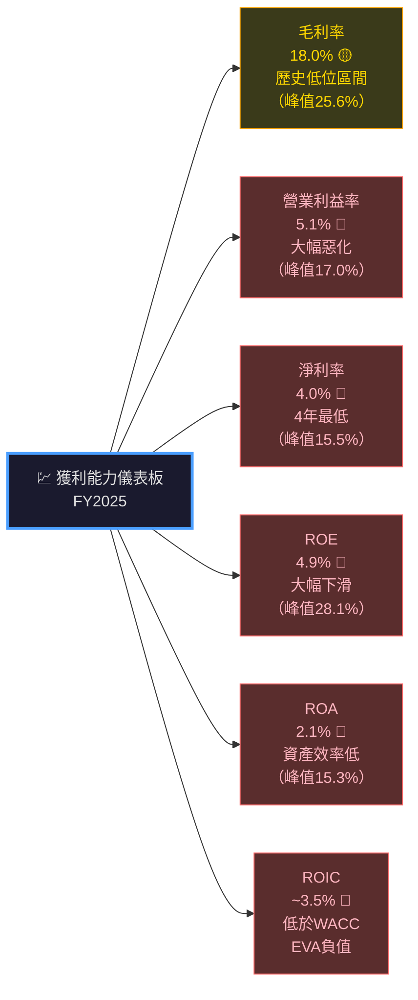

---

## 7. 估值深度分析

### 🔍 同業估值比較表格

| 指標 | **TSLA** | **BYD（比亞迪）** | **GM（通用）** | **Ford（福特）** | 信號 |
|------|----------|-----------------|--------------|----------------|------|
| 股價 | $415.08 | ~HK$285 | ~$46 | ~$11 | - |
| 市值 | $1,560B | ~$110B | ~$45B | ~$43B | - |
| P/E（Trailing） | **391.6x** 🔴 | ~25x 🟢 | ~5x 🟢 | ~6x 🟢 | TSLA溢價15-78倍 |
| P/E（Forward） | **148.0x** 🔴 | ~18x 🟢 | ~5x 🟢 | ~7x 🟢 | TSLA溢价21-30倍 |
| EV/EBITDA | **143.5x** 🔴 | ~12x 🟢 | ~3x 🟢 | ~4x 🟢 | TSLA溢價12-48倍 |
| P/S | **16.4x** 🔴 | ~0.9x 🟢 | ~0.2x 🟢 | ~0.2x 🟢 | TSLA溢價18-82倍 |
| P/B | **19.0x** 🔴 | ~4x 🟢 | ~0.9x 🟢 | ~1.1x 🟢 | 溢價明顯 |
| 毛利率 | **18.0%** 🟡 | ~19.0% 🟢 | ~14.5% 🟡 | ~11.0% 🟡 | 接近比亞迪 |
| 收入成長YoY | **-3.1%** 🔴 | ~+25% 🟢 | ~+3% 🟡 | ~-2% 🔴 | 落後比亞迪 |
| FCF Yield | **0.24%** 🔴 | ~3.5% 🟢 | ~15% 🟢 | ~8% 🟢 | 極低 |

> 📌 **結論**：TSLA的估值溢價在幾乎每一個傳統汽車估值維度均極度偏高。市場給予的估值反映的並非當前車企基本面，而是對未來「科技/AI/機器人公司」的期望溢價。

---

### 📈 歷史估值區間分析（P/E 5年歷史）

```
TSLA 歷史 P/E 估值區間（近5年）

 1200x │ ████ 2020-2021泡沫高峰
       │ ████████
  800x │ ████████
       │ ████████████
  400x │ ████████████████ ◄── 當前391x
       │ ████████████████████
  200x │ ████████████████████████
       │ ████████████████████████████
  100x │ ████████████████████████████████
       │
   50x │                         ████████ 2022年底殺估值低點
       │                         ████████████
   20x │                         ████████████████（傳統車廠均值）
       └─────────────────────────────────────────►
         2020  2021  2022  2023  2024  2025  Now

歷史P/E區間：
• 5年高位：~1,200x（2021年初）
• 5年均值：~200-300x（科技溢價區間）
• 5年低位：~40-50x（2022年底）
• 當前：391x → 高於歷史均值，但遠低於2021狂熱

P/E 高估程度：🔴🔴🔴 處於歷史中高位區間
```

---

### 💰 DCF敏感性分析（6格目標價矩陣）

**基本假設**：
- 基準收入 FY2025：$94.83B
- 資本支出率：~9%收入
- 折現期：10年 + 終端價值

| **成長情境 \ 折現率** | **WACC = 12%** | **WACC = 15%** |
|----------------------|----------------|----------------|
| 🟢 **樂觀**（收入CAGR 25%，利潤率回升至15%） | **$580** | **$420** |
| 🟡 **基準**（收入CAGR 15%，利潤率回升至10%） | **$420** | **$310** |
| 🔴 **悲觀**（收入CAGR 5%，利潤率維持5%） | **$180** | **$130** |

**情境說明**：
- 🟢 **樂觀**：FSD L4商業化成功 + Robotaxi大規模運營 + Optimus量產，盈利率快速回升
- 🟡 **基準**：汽車業務溫和成長 + 能源業務持續加速 + FSD訂閱漸增
- 🔴 **悲觀**：價格戰持續 + 競爭侵蝕份額 + FSD/Optimus延期，盈利改善有限

---

### 📊 估值區間視覺化

```
TSLA 估值合理性評估（DCF基準情境 WACC=15%）

    $130                $310            $415  $500
     │                   │               │     │
─────┼───────────────────┼───────────────┼─────┼─────►
     │                   │               │     │
  悲觀情境              基準情境        當前   樂觀
  目標價                目標價          股價   情境
  $130                  $310           $415  $420

  🔴 低估區          🟡 合理區    🔴 高估區
  [$0-$200]          [$200-$380] [$380-∞]

  ▓▓▓▓▓▓▓▓▓▓▓▓▓▓▓▓▓▓▓▓▓▓▓▓▓▓▓▓▓▓░░░░░░░░░░░░
                                  ↑
                              當前價格$415處於「高估區」
                              基準DCF支撐約$310

📌 結論：在WACC=15%基準情境下，當前價格$415
         隱含的市場預期接近「樂觀情境」，
         定價幾乎不留安全邊際。
```

---

## 8. 成長催化劑

### 📅 催化劑時間軸

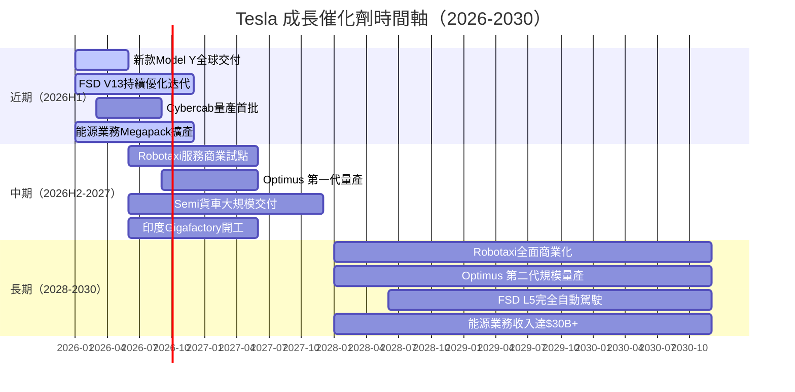

---

### 📊 TAM市場規模與滲透率

```
目標市場規模（TAM）分析

汽車市場（全球BEV）
TAM：~$800B（2030E）
Tesla 目標份額：15-20%
═══════════════════════════════════════
當前滲透：▓▓▓▓░░░░░░░░░░░░  ~4%

自動駕駛/Robotaxi
TAM：~$2-8T（2035E，依研究機構不同）
Tesla 潛在份額：10-20%
═══════════════════════════════════════
當前滲透：▓░░░░░░░░░░░░░░░  <1%（仍在試點）

人形機器人（Optimus）
TAM：~$10T+（長期，Goldman估計$6T）
Tesla 潛在份額：未知（先行者優勢）
═══════════════════════════════════════
當前滲透：░░░░░░░░░░░░░░░░  ~0%（開發中）

能源儲能（Megapack/Powerwall）
TAM：~$350B（2030E）
Tesla 目標份額：20-30%
═══════════════════════════════════════
當前滲透：▓▓▓░░░░░░░░░░░░░  ~8-12%

📌 重要：若FSD+Optimus任一成功，
   市場將從車企重新定價為AI公司（P/E從15x→50x+）
```

---

### 🚀 短/中/長期成長驅動力

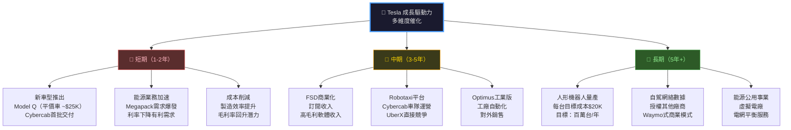

---

## 9. 風險矩陣

### ⚡ 風險評分矩陣

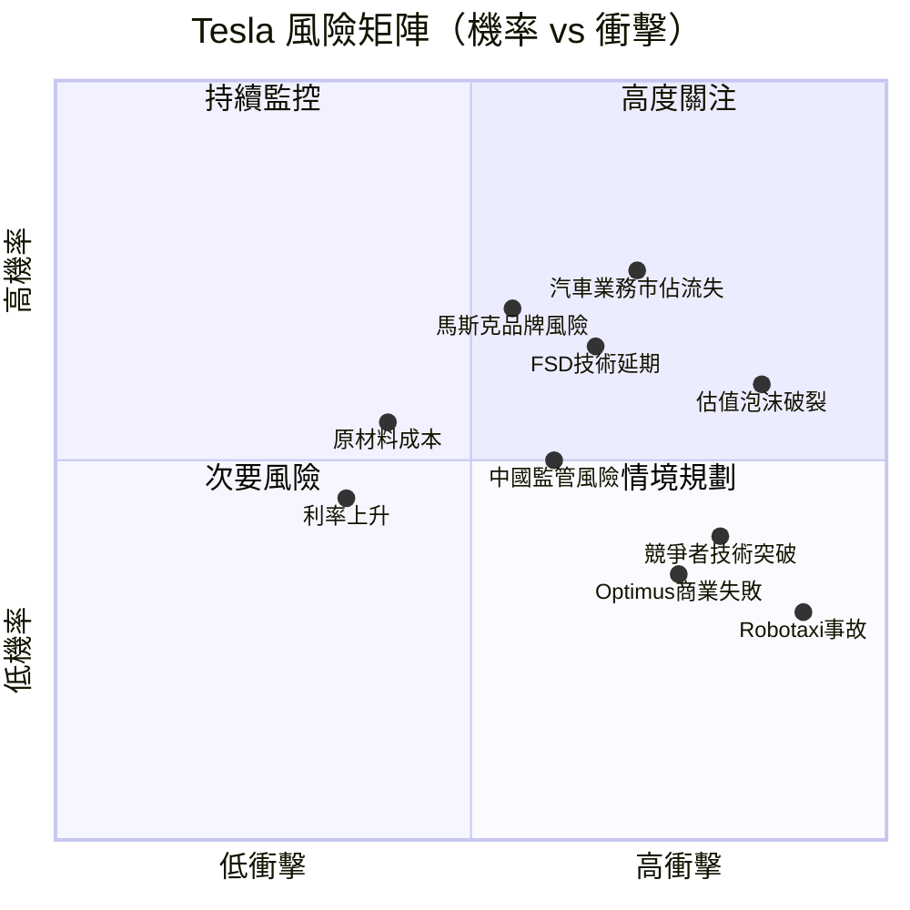

---

### 📋 風險清單詳細表格

| 風險項目 | 機率 | 衝擊 | 綜合評分 | 緩解措施 |
|---------|------|------|---------|---------|
| 🔴 **估值泡沫破裂** | 中高 | 極高 | 9/10 | 等待盈利改善匹配估值 |
| 🔴 **汽車市佔率持續流失** | 高 | 高 | 8.5/10 | 低價Model Q推出，產品線擴充 |
| 🔴 **FSD/Robotaxi技術重大延期** | 中高 | 極高 | 8.5/10 | 里程碑驗證，降低倉位集中度 |
| 🔴 **馬斯克品牌/政治風險** | 中高 | 高 | 8/10 | 分散管理層依賴，關注治理改善 |
| 🟡 **中國市場監管/地緣政治** | 中 | 高 | 7/10 | 監控中美貿易政策，多元化市場 |
| 🟡 **競爭者技術突破** | 中 | 高 | 7/10 | 持續R&D投入，數據護城河 |
| 🟡 **原材料（鋰/鎳）成本波動** | 中 | 中 | 5.5/10 | 長期採購合約，電池技術降成本 |
| 🟡 **Optimus商業化失敗** | 中高 | 中 | 5.5/10 | 視為期權性投資，非核心估值 |
| 🟢 **Robotaxi重大安全事故** | 低中 | 極高 | 5/10 | 冗餘安全系統，監管前測試 |
| 🟢 **宏觀衰退/利率上升** | 低中 | 中 | 4/10 | 強大現金儲備$44B提供緩衝 |

---

## 10. 投資建議

### 🎯 最終綜合評級

```
Tesla 各維度評級雷達（Unicode 視覺化，滿分10分）

維度              評分  視覺化
━━━━━━━━━━━━━━━━━━━━━━━━━━━━━━━━━━━━━━━━━━━━━━━━━━━━━━
基本面品質  5.5   ▓▓▓▓▓▓░░░░  • 收入回落，EPS急降
成長潛力    6.5   ▓▓▓▓▓▓▓░░░  • FSD/Optimus長期想像空間大
獲利品質    4.0   ▓▓▓▓░░░░░░  • 毛利率18%歷史低位，ROE僅4.9%
財務健康    7.5   ▓▓▓▓▓▓▓▓░░  • 淨現金$29.34B，流動性充裕
估值合理性  2.5   ▓▓▓░░░░░░░  • P/E 391x，FCF Yield 0.24%，極度高估
技術護城河  7.0   ▓▓▓▓▓▓▓░░░  • 數據/FSD/電池/AI具競爭優勢
管理層執行  5.0   ▓▓▓▓▓░░░░░  • 馬斯克分心，但願景清晰
市場競爭力  5.5   ▓▓▓▓▓▓░░░░  • 美國領先，中國受壓
━━━━━━━━━━━━━━━━━━━━━━━━━━━━━━━━━━━━━━━━━━━━━━━━━━━━━━

加權綜合評分：5.4 / 10  →  維持觀望（HOLD）
```

---

### 🎯 目標價區間與隱含報酬率

| 情境 | 12個月目標價 | 隱含報酬率（vs $415.08） | 關鍵假設 |
|------|------------|------------------------|---------|
| 🟢 **樂觀** | **$550** | **+32.5%** | FSD V13突破 + Cybercab量產成功 + 毛利率回升至20%+ |
| 🟡 **基準** | **$380** | **-8.5%** | 汽車業務穩定 + 能源成長 + 估值略降 |
| 🔴 **悲觀** | **$220** | **-47.0%** | 競爭持續惡化 + FSD延期 + 估值均值回歸 |
| 📊 **分析師共識** | **$421.73** | **+1.6%** | 40位分析師平均 |

---

### ✅ 買入時機與觸發因素

```
買入觸發因素 Checklist（需同時滿足≥3項）

□ 1. FSD V14/L4達到監管認可，商業Robotaxi開始收費
□ 2. 季度毛利率回升並站穩 20%+ 以上
□ 3. 股價回調至 $280-$320 區間（提供安全邊際）
□ 4. Optimus量產進展超預期（年產超10,000台）
□ 5. 能源業務季度收入超越 $5B（高毛利支撐）
□ 6. 連續2季EPS增長超市場預期 15%+
□ 7. 中美貿易關係改善，中國市場份額止跌回穩

減倉/觀望觸發因素（任一出現需警惕）
⚠️ 毛利率持續低於 17%
⚠️ FSD重大安全事故或監管暫停
⚠️ 馬斯克減持 Tesla 股份
⚠️ 中國銷量連續3季 YoY 負成長
⚠️ 競爭對手獲得L4自動駕駛監管批准
```

---

### 👥 投資人適配度

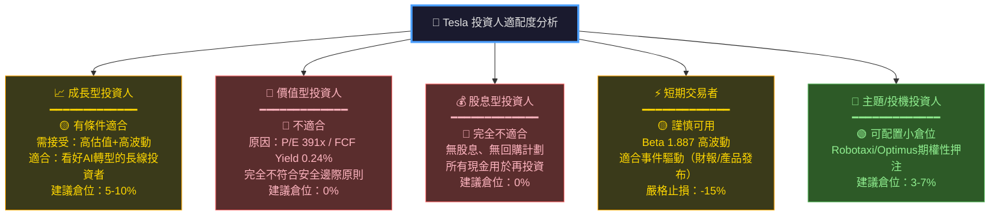

---

### 🔍 關鍵監控指標 Checklist

```
📋 下次財報（2026Q1 預計2026年4月底）關鍵監控點

財務指標：
☑ 季度汽車毛利率（目標：>19%，警戒：<17%）
☑ 季度總交付量（目標：>500K台，警戒：<420K台）
☑ 能源業務收入（目標：>$3.5B，觀察增速）
☑ R&D費用趨勢（是否超過$1.7B季度，增速是否可持續）
☑ 自由現金流（目標：>$1.5B季度）

產業數據（每月監控）：
☑ 中國新能源汽車月度銷量（Tesla vs BYD 比較）
☑ 美國BEV市場份額（目標：>45%）
☑ Supercharger網絡競爭對手接入情況

技術里程碑：
☑ FSD V13/V14 更新發布節奏（每季至少1次重大版本）
☑ Cybercab量產進度（目標：2026年H2試生產）
☑ Optimus機器人測試影片/進度公告
☑ Dojo超算算力進展（影響AI訓練速度）

競爭動態：
☑ 比亞迪全球銷量（特別是海外市場進展）
☑ Waymo商業擴張速度（Robotaxi直接競爭）
☑ 小鵬/理想/蔚來在中國市場的份額
☑ 傳統車廠EV獨立計劃進展

宏觀環境：
☑ 美聯儲利率決策（影響EV貸款需求）
☑ IRA電動車補貼政策變化
☑ 中美貿易/關稅政策
☑ 鋰/鈷等電池原材料價格走勢
```

---

## 📊 報告總結

```
┌──────────────────────────────────────────────────────────────┐
│                   TSLA 深度分析報告總結                        │
│                   報告日期：2026-02-25                         │
├──────────────────────────────────────────────────────────────┤
│                                                              │
│  當前股價：$415.08  │  市值：$1.56T  │  綜合評分：5.4/10     │
│                                                              │
│  📌 投資評級：持有/觀望（HOLD/NEUTRAL）                        │
│                                                              │
│  🔴 核心疑慮：                                                │
│    • P/E 391x / Forward P/E 148x → 極度高估                  │
│    • 收入 -3.1% YoY / EPS -60.6% YoY → 基本面惡化            │
│    • ROIC(3.5%) << WACC(14.8%) → 正摧毀股東價值              │
│    • 毛利率18.0% 為歷史低位（峰值25.6%）                       │
│                                                              │
│  🟢 核心優勢：                                                │
│    • 淨現金 $29.34B + 流動比率 2.16x → 財務極度健康           │
│    • FSD數據網絡效應 + 600萬+車隊 → 難以複製護城河            │
│    • 能源業務高速成長 → 未來盈利多元化支撐                      │
│    • Optimus/Robotaxi → 若成功估值重塑整個公司                 │
│                                                              │
│  🎯 目標價區間（12個月）：$220（悲觀）/ $380（基準）/ $550（樂觀）│
│  基準隱含報酬率：-8.5%                                         │
│                                                              │
│  ⚠️  Tesla是一個「相信未來」的投資，                            │
│      其估值反映的是2030年代的盈利，                             │
│      而非當下的基本面。                                         │
│      在獲利改善信號明確前，建議維持觀望。                        │
└──────────────────────────────────────────────────────────────┘
```

---

> ⚠️ **免責聲明**：本報告由 AI 自動生成，基於提供的財務數據進行分析建模。所有估值、目標價、WACC估算均為分析模型輸出，存在重大不確定性。本報告**不構成任何投資建議**，投資者應自行進行盡職調查，並諮詢持牌投資顧問後作出投資決策。投資股票存在損失全部本金的風險。過往表現不代表未來結果。

---
*報告撰寫：AI 機構研究部 ｜ 分析框架：CFA Level III 基本面分析標準 ｜ 數據截止：2026-02-25*