# TSLA 基本面深度分析報告
> **報告日期**：2026-02-26 ｜ **語言**：繁體中文 ｜ **數據來源**：Yahoo Finance ｜ **分析師**：AI CFA Research

---

## 目錄

1. [執行摘要](#1-執行摘要)
2. [公司概覽與商業模式](#2-公司概覽與商業模式)
3. [損益表深度分析](#3-損益表深度分析)
4. [資產負債表分析](#4-資產負債表分析)
5. [現金流量深度分析](#5-現金流量深度分析)
6. [獲利能力與資本效率](#6-獲利能力與資本效率)
7. [估值深度分析](#7-估值深度分析)
8. [成長催化劑](#8-成長催化劑)
9. [風險矩陣](#9-風險矩陣)
10. [投資建議](#10-投資建議)

---

## 1. 執行摘要

### 🎯 核心評分儀表板

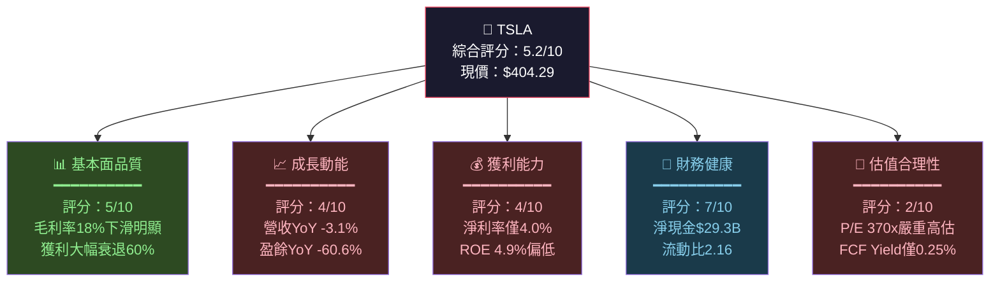

---

### 📋 5大投資論點 vs 3大核心風險

| 類型 | 項目 | 說明 | 重要性 |
|------|------|------|--------|
| 🟢 **多頭論點①** | 自動駕駛／Robotaxi 商業化 | FSD技術累積學習數據領先，Robotaxi潛在TAM達$1T+ | ⭐⭐⭐⭐⭐ |
| 🟢 **多頭論點②** | 能源業務高速成長 | Energy Generation & Storage YoY成長超50%，Megapack需求強勁 | ⭐⭐⭐⭐ |
| 🟢 **多頭論點③** | 淨現金$29.3B 財務護城河 | 強勁資產負債表，有能力度過景氣低谷並加大投資 | ⭐⭐⭐⭐ |
| 🟢 **多頭論點④** | Optimus 人形機器人 | 潛在顛覆性產品，若量產成功市值重估空間巨大 | ⭐⭐⭐ |
| 🟢 **多頭論點⑤** | 充電網絡開放化獲授權費 | Supercharger生態系已成業界標準，授權收入可期 | ⭐⭐⭐ |
| 🔴 **風險①** | 估值極度高估 | P/E 370x、FCF Yield 0.25%，任何負面消息引發崩跌風險 | 🚨🚨🚨 |
| 🔴 **風險②** | 核心汽車業務獲利大幅惡化 | 毛利率從2022年29%砍至18%，價格戰損傷定價權 | 🚨🚨🚨 |
| 🟡 **風險③** | Musk 精力分散與品牌爭議 | 同時掌舵SpaceX/xAI/DOGE，政治立場引發消費者抵制 | ⚠️⚠️ |

---

### 📊 快速統計卡片：關鍵指標一覽

| 指標 | TSLA 數值 | 行業均值（傳統車廠） | 行業均值（EV/科技） | 訊號 |
|------|-----------|---------------------|---------------------|------|
| 市值 | $1.52T | $50-80B | N/A | 🔴 溢價巨大 |
| P/E (Trailing) | 370.9x | 6-8x | 25-40x | 🔴 極度高估 |
| P/E (Forward) | 144.2x | 7-9x | 20-35x | 🔴 高估 |
| P/S | 16.0x | 0.3-0.5x | 3-8x | 🔴 高估 |
| EV/EBITDA | 146.4x | 5-7x | 15-25x | 🔴 高估 |
| 毛利率 | 18.0% | 15-18% | 20-35% | 🟡 持平傳統車 |
| 營業利益率 | 4.7% | 5-8% | 8-15% | 🟡 偏低 |
| 淨利率 | 4.0% | 3-6% | 8-20% | 🟡 普通 |
| ROE | 4.9% | 15-25% | 10-20% | 🔴 偏低 |
| 流動比 | 2.16x | 1.0-1.3x | 1.5-2.5x | 🟢 良好 |
| 淨現金 | $29.3B | 淨負債 | 混合 | 🟢 強健 |
| FCF Yield | 0.25% | 5-8% | 1-3% | 🔴 極低 |
| 營收成長YoY | -3.1% | 2-5% | 10-25% | 🔴 衰退 |

---

### 🎯 投資結論

```
╔══════════════════════════════════════════════════════════════╗
║                                                              ║
║   投資評級：⚖️  持有／觀望  (HOLD / NEUTRAL)               ║
║                                                              ║
║   目標價區間：                                              ║
║   🐻 悲觀情境：$180 - $220  (隱含下跌 -46% ~ -54%)        ║
║   📊 基準情境：$280 - $320  (隱含下跌 -21% ~ -31%)        ║
║   🐂 樂觀情境：$450 - $550  (隱含上漲 +11% ~ +36%)        ║
║                                                              ║
║   核心觀點：                                                ║
║   基本面持續惡化（獲利-60%、毛利率下滑）與天文數字估值     ║
║   之間的矛盾極度突出。股價已高度反映AI/Robotaxi期望值。    ║
║   現階段難以用基本面支撐$404現價，屬投機性持有。          ║
║                                                              ║
╚══════════════════════════════════════════════════════════════╝
```

---

## 2. 公司概覽與商業模式

### 🏗️ 業務結構與收入來源

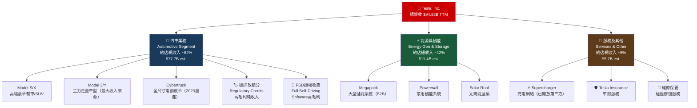

---

### 🥧 市場份額估算（全球EV市場）

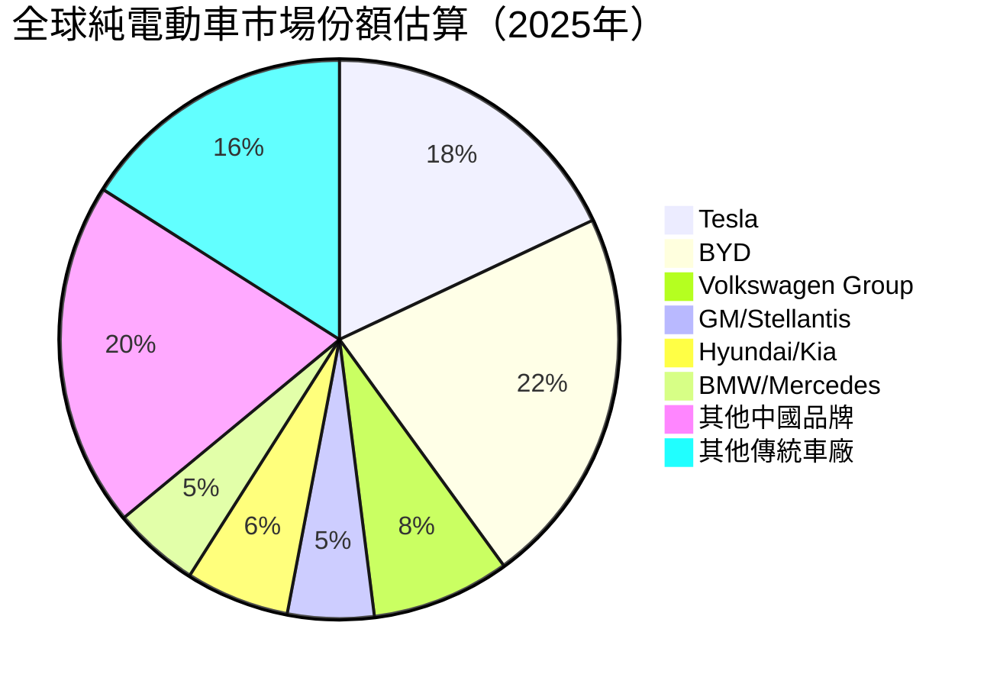

> 📌 **市場地位說明**：Tesla在全球EV市場市佔約18%，但遭BYD超越成為全球第一。北美市場Tesla仍居主導地位（約55-60%市佔），但份額呈下滑趨勢。

---

### 🧠 競爭護城河分析

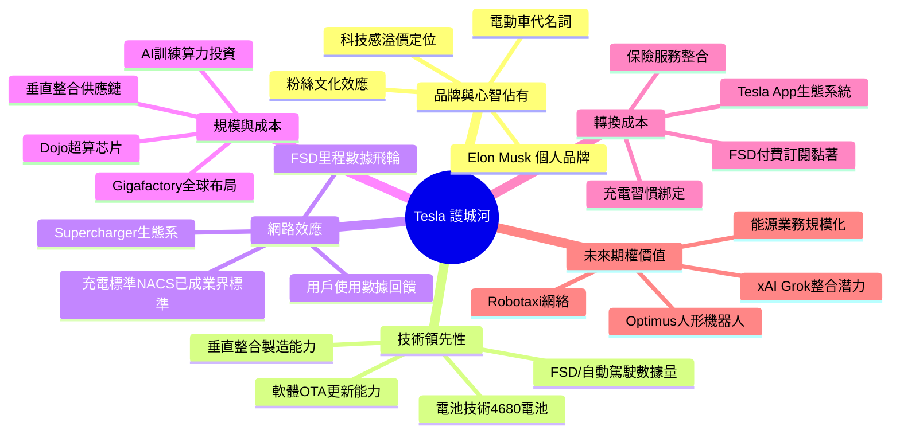

---

### 📊 護城河強度評分

```
護城河維度評分（滿分10分）
━━━━━━━━━━━━━━━━━━━━━━━━━━━━━━━━━━━━━━━━━━━

品牌心智佔有   ████████░░  8.0/10  仍是EV代名詞但Musk爭議侵蝕
技術領先性     ███████░░░  7.0/10  FSD數據優勢，但競爭加速追趕
網路效應       ████████░░  8.0/10  NACS充電標準已成業界標準
規模成本優勢   ██████░░░░  6.0/10  BYD成本優勢漸追近
轉換成本       █████░░░░░  5.0/10  EV轉換成本低於傳統車
未來期權價值   ████████░░  8.0/10  Robotaxi/Optimus高度期望
━━━━━━━━━━━━━━━━━━━━━━━━━━━━━━━━━━━━━━━━━━━
整體護城河強度  ██████░░░░  6.8/10  中等偏強，但正被侵蝕
```

---

## 3. 損益表深度分析

### 📈 年度收入成長趨勢（近4年）

```
年度總收入（十億美元）與 YoY 成長率
━━━━━━━━━━━━━━━━━━━━━━━━━━━━━━━━━━━━━━━━━━━━━━━━━━━━━━
2022  $81.46B  ████████████████████████████████░  +51.4% 🟢
2023  $96.77B  ██████████████████████████████████████  +18.8% 🟢
2024  $97.69B  ██████████████████████████████████████░  +0.9% 🟡
2025  $94.83B  █████████████████████████████████████  -2.9% 🔴
━━━━━━━━━━━━━━━━━━━━━━━━━━━━━━━━━━━━━━━━━━━━━━━━━━━━━━
       每格代表約 $2.5B    ⚠️ 成長動能顯著放緩並轉為衰退
```

**關鍵觀察**：
- 2022年：受惠Model Y全球放量，+51.4%高速成長期
- 2023年：成長放緩至+18.8%，價格戰開始侵蝕獲利
- 2024年：幾乎零成長（+0.9%），市場飽和信號出現
- 2025年：首次出現年度營收衰退（-2.9%），YoY -$2.86B

---

### 📊 季度收入趨勢（近4季）

| 季度 | 總收入 | QoQ成長 | YoY成長（對比2024同期） | 訊號 |
|------|--------|---------|------------------------|------|
| 2025 Q1 | $19.34B | — | -9.2%（vs $21.30B）| 🔴 |
| 2025 Q2 | $22.50B | **+16.3%** | -5.7%（vs $23.85B）| 🟡 |
| 2025 Q3 | $28.09B | **+24.8%** | +8.2%（vs $25.18B）| 🟢 |
| 2025 Q4 | $24.90B | **-11.4%** | -1.6%（vs $25.71B）| 🔴 |

> 📌 **季度分析重點**：2025年呈現V型反彈後回落的W型走勢。Q3出現近年最強季度表現，但Q4重新走弱。全年YoY衰退確認，難以找到持續成長的有力依據。

---

### 📉 利潤率演變趨勢（近4年）

| 年度 | 毛利率 | 營業利益率 | EBITDA率 | 淨利率 | 趨勢 |
|------|--------|-----------|----------|--------|------|
| 2022 | **25.6%** 🟢 | **16.8%** 🟢 | **21.7%** 🟢 | **15.4%** 🟢 | 巔峰期 |
| 2023 | **18.3%** 🟡 | **9.2%** 🟡 | **15.3%** 🟡 | **15.5%** 🟢 | 急速惡化 |
| 2024 | **17.9%** 🟡 | **7.9%** 🟡 | **15.1%** 🟡 | **7.3%** 🟡 | 持續下滑 |
| 2025 | **18.0%** 🟡 | **5.1%** 🔴 | **12.4%** 🔴 | **4.0%** 🔴 | 全面惡化 |

```
毛利率趨勢視覺化
━━━━━━━━━━━━━━━━━━━━━━━━━━━━━━━━━━━━━━━━━
2022  25.6%  ██████████████████████████
2023  18.3%  ██████████████████░
2024  17.9%  █████████████████░░
2025  18.0%  ██████████████████
━━━━━━━━━━━━━━━━━━━━━━━━━━━━━━━━━━━━━━━━━
⚠️ 毛利率從巔峰25.6%下滑至18.0%，累計損失7.6個百分點

淨利率趨勢視覺化
━━━━━━━━━━━━━━━━━━━━━━━━━━━━━━━━━━━━━━━━━
2022  15.4%  ████████████████
2023  15.5%  ████████████████
2024   7.3%  ███████░
2025   4.0%  ████
━━━━━━━━━━━━━━━━━━━━━━━━━━━━━━━━━━━━━━━━━
⚠️ 淨利率從15%驟降至4%，主因：獲利性投資收益波動+價格戰
```

**利潤率惡化深層原因分析**：
1. **價格戰代價**：2023年起多輪主動降價，每輛車平均售價（ASP）大幅下降
2. **R&D費用激增**：2025年R&D達$6.41B（佔收入6.8%），相較2022年$3.08B（3.8%）大增108%
3. **折舊攤銷壓力**：Gigafactory持續擴張帶動D&A上升
4. **競爭加劇**：BYD、小鵬、蔚來等中國品牌持續壓縮定價空間

---

### 🥧 費用結構分析（2025年佔收入比）

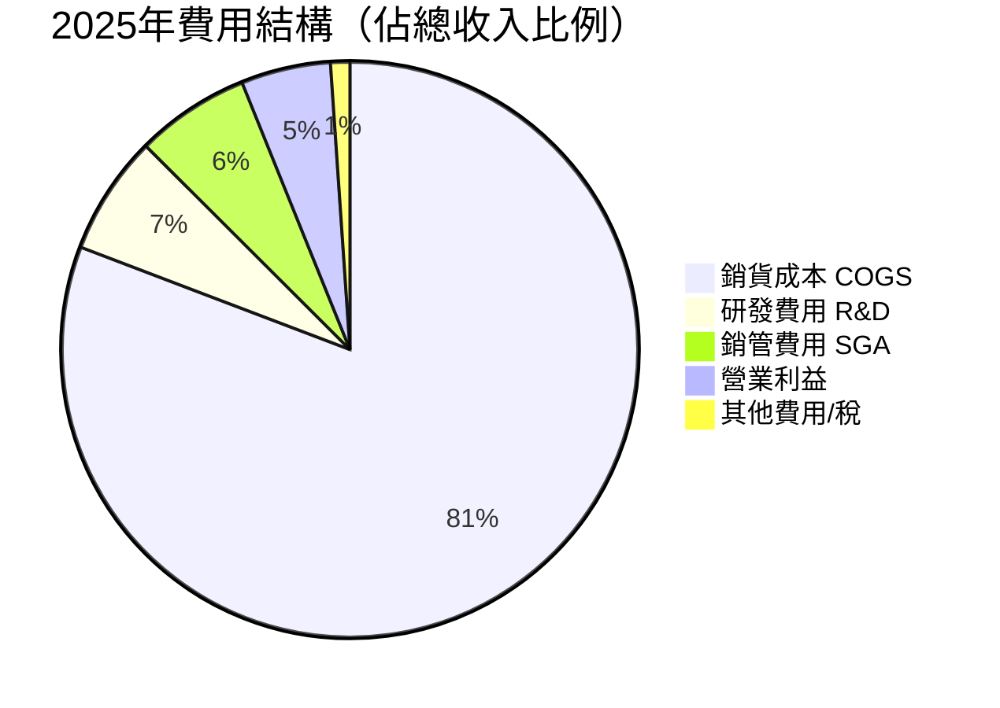

> ⚠️ **費用結構警示**：R&D佔比從2022年3.8%升至2025年6.8%，絕對值從$3.08B暴增至$6.41B（+108%），反映Tesla向科技公司轉型，但短期嚴重壓縮獲利空間。

---

### 📊 EPS 趨勢與盈餘品質分析

**季度 EPS 表現（近4季）**

| 季度 | 淨利 | EPS（估算） | 備注 |
|------|------|------------|------|
| 2025 Q1 | $409M | ~$0.11 | 🔴 近年最弱季，毛利率受壓 |
| 2025 Q2 | $1.17B | ~$0.31 | 🟡 環比改善，能源業務貢獻 |
| 2025 Q3 | $1.37B | ~$0.37 | 🟢 最強季，交付量回升 |
| 2025 Q4 | $840M | ~$0.22 | 🔴 季末走弱，折舊/R&D拖累 |

```
季度EPS視覺化（估算）
━━━━━━━━━━━━━━━━━━━━━━━━━━━━━━━━━━━━━━
Q1 2025  $0.11  ██░░░░░░░░░░░░░░░
Q2 2025  $0.31  ██████░░░░░░░░░░░
Q3 2025  $0.37  ███████░░░░░░░░░░  ◄ 季度高點
Q4 2025  $0.22  ████░░░░░░░░░░░░░
━━━━━━━━━━━━━━━━━━━━━━━━━━━━━━━━━━━━━━
TTM EPS  $1.09  （vs 2024 EPS ~$1.87，YoY -41.7%）
```

**年度 EPS 對比**

| 年度 | 淨利 | EPS（估算） | YoY變化 |
|------|------|------------|---------|
| 2022 | $12.58B | ~$3.36 | — |
| 2023 | $15.00B | ~$4.00 | +19.1% 🟢 |
| 2024 | $7.13B | ~$1.90 | -52.5% 🔴 |
| 2025 | $3.79B | ~$1.01 | -46.8% 🔴 |

> ⚠️ **盈餘品質警示**：2023年淨利$15B中含大量一次性稅務優惠（遞延稅資產認列），剔除後核心獲利遠低於帳面數字，造成2024-2025年的淨利急速「正常化」下滑效果。

---

## 4. 資產負債表分析

### 🏗️ 資產結構分解

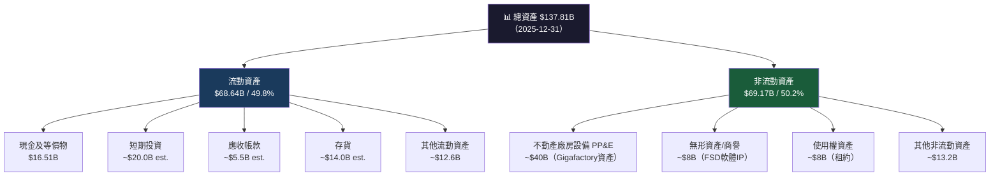

---

### 💧 流動性指標分析

| 指標 | 2025 | 2024 | 2023 | 2022 | 行業標準 | 訊號 |
|------|------|------|------|------|---------|------|
| 流動比率 | **2.16x** | 2.02x | 1.73x | 1.53x | >1.5x | 🟢 優異 |
| 速動比率 | **1.54x** | ~1.40x | ~1.20x | ~1.05x | >1.0x | 🟢 良好 |
| 現金比率 | **0.52x** | ~0.56x | ~0.57x | ~0.61x | >0.2x | 🟢 充裕 |
| 淨現金 | **$29.3B** | $28.5B | $26.8B | $24.7B | 正值 | 🟢 強健 |

> 🟢 **流動性結論**：Tesla資產負債表流動性非常強健，$44.06B現金儲備配合低負債率，短期償債風險極低，為公司提供充足的戰略靈活性。

---

### 💳 債務結構分析

| 項目 | 2025 | 2024 | 2023 | 2022 |
|------|------|------|------|------|
| 總債務 | $14.72B | $13.62B | $9.57B | $5.75B |
| 現金及等價物 | $16.51B | $16.14B | $16.40B | $16.25B |
| 廣義淨現金（含短投） | **$29.34B** | $28.5B est. | $26.8B | $24.7B |
| D/E 比率 | 17.8% | 18.7% | 15.3% | 12.9% |
| Debt/EBITDA | **1.25x** | 0.93x | 0.65x | 0.33x |

```
總債務成長趨勢
━━━━━━━━━━━━━━━━━━━━━━━━━━━━━━━━━━━━━━━━━━━━━━━
2022  $5.75B   ████████░░░░░░░░░░░░░░░░░░
2023  $9.57B   ████████████░░░░░░░░░░░░░░
2024  $13.62B  █████████████████░░░░░░░░░
2025  $14.72B  ██████████████████░░░░░░░░
━━━━━━━━━━━━━━━━━━━━━━━━━━━━━━━━━━━━━━━━━━━━━━━
⚠️ 債務3年間增加156%，但淨現金仍為正，整體可控
```

> 📌 **Debt/EBITDA 1.25x**仍處安全水位（一般警戒線為3-4x），但趨勢值得關注。

---

### 📈 股東權益趨勢

```
股東權益成長趨勢（十億美元）
━━━━━━━━━━━━━━━━━━━━━━━━━━━━━━━━━━━━━━━━━━━━━━━━━━━
2022  $44.70B  ████████████████████████░░░░░░░░░░░░░░
2023  $62.63B  ██████████████████████████████████░░░░
2024  $72.91B  ████████████████████████████████████████
2025  $82.14B  ████████████████████████████████████████████
━━━━━━━━━━━━━━━━━━━━━━━━━━━━━━━━━━━━━━━━━━━━━━━━━━━
每格代表約 $2B
BVPS (Book Value Per Share) 2025 ≈ $21.91/股
P/B 當前 = 18.5x（現價$404.29 ÷ $21.91）🔴 大幅溢價
```

**股東權益分析**：股東權益從2022年$44.7B持續成長至2025年$82.1B（+83.7%），主要來源為累積盈餘（Retained Earnings），顯示帳面淨值持續強化，但P/B高達18.5x反映市場對未來成長的高度預期，而非當前資產價值。

---

## 5. 現金流量深度分析

### 💧 現金流量瀑布圖

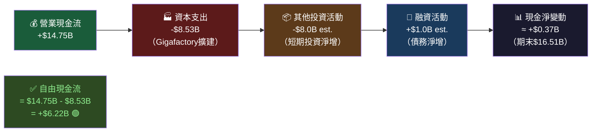

---

### 📊 FCF 轉換率分析（FCF / Net Income）

| 年度 | 淨利 | 自由現金流 | FCF轉換率 | 資本支出 | 訊號 |
|------|------|-----------|----------|---------|------|
| 2022 | $12.58B | $7.55B | **60.0%** | $7.17B | 🟡 尚可 |
| 2023 | $15.00B | $4.36B | **29.1%** | $8.90B | 🔴 偏低 |
| 2024 | $7.13B | $3.58B | **50.2%** | $11.34B | 🟡 改善 |
| 2025 | $3.79B | $6.22B | **164%** 🟢 | $8.53B | 🟢 強勁 |

> 🟢 **2025 FCF轉換率164%**：FCF大幅超越淨利，主因資本支出從$11.34B降至$8.53B（-24.8%），顯示Gigafactory主要建設週期接近尾聲，資本密集度下降，現金流改善明顯。

---

### 📊 自由現金流趨勢

```
自由現金流趨勢（十億美元）
━━━━━━━━━━━━━━━━━━━━━━━━━━━━━━━━━━━━━━━━━━━━━━━━━━━
2022  $7.55B  ████████████████████████████████████████  最強
2023  $4.36B  ██████████████████████░░░░░░░░░░░░░░░░░░  Capex激增
2024  $3.58B  ██████████████████░░░░░░░░░░░░░░░░░░░░░░  最弱
2025  $6.22B  ████████████████████████████████░░░░░░░░  顯著回升 ▲
━━━━━━━━━━━━━━━━━━━━━━━━━━━━━━━━━━━━━━━━━━━━━━━━━━━
FCF Yield（基於市值$1.52T）：
2025 FCF Yield = $6.22B ÷ $1,520B = 0.41% 🔴 極低
（若以合理FCF Yield 3%計算，合理市值 ≈ $207B）
```

---

### 💼 資本配置評估

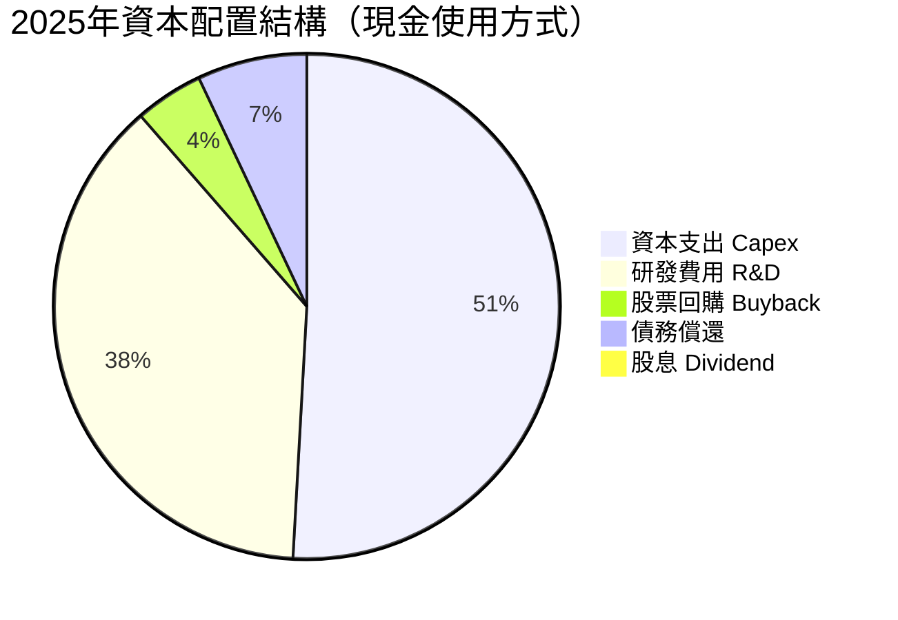

| 項目 | 2025金額 | 佔FCF比 | 評估 |
|------|---------|---------|------|
| 資本支出 | $8.53B | 137% | 🟡 仍高但下降 |
| R&D費用 | $6.41B | 103% | 🟡 必要但重壓獲利 |
| 股票回購 | ~$0.3B est. | ~5% | 🟡 極少量 |
| 股息 | $0 | 0% | — 無配息 |
| 淨舉債 | ~$1.1B | — | 🟡 溫和增加 |

> 📌 **資本配置評估**：Tesla處於高度再投資模式（Reinvestment Phase），幾乎所有現金流都被投入未來成長（Capex + R&D），體現「科技公司」定位。短期對股東回報極低，長期視乎成長是否兌現。

---

## 6. 獲利能力與資本效率

### 📊 ROE / ROA / ROIC 趨勢（近4年）

| 指標 | 2022 | 2023 | 2024 | 2025 | 行業均值 | 趨勢 |
|------|------|------|------|------|---------|------|
| **ROE** | 28.1% 🟢 | 23.9% 🟢 | 9.8% 🟡 | **4.9%** 🔴 | 傳統車15-25% | ↓↓ |
| **ROA** | 15.3% 🟢 | 14.1% 🟢 | 5.8% 🟡 | **2.1%** 🔴 | 傳統車3-6% | ↓↓ |
| **ROIC（估算）** | ~20% 🟢 | ~16% 🟢 | ~8% 🟡 | **~5%** 🔴 | 科技15-25% | ↓↓ |

```
ROE 趨勢視覺化
━━━━━━━━━━━━━━━━━━━━━━━━━━━━━━━━━━━━━━━━━━━━━━━━
2022  28.1%  ████████████████████████████░
2023  23.9%  ████████████████████████░
2024   9.8%  ██████████░
2025   4.9%  █████░
━━━━━━━━━━━━━━━━━━━━━━━━━━━━━━━━━━━━━━━━━━━━━━━━
ROIC 趨勢視覺化
━━━━━━━━━━━━━━━━━━━━━━━━━━━━━━━━━━━━━━━━━━━━━━━━
2022  ~20%   ████████████████████░
2023  ~16%   ████████████████░
2024   ~8%   ████████░
2025   ~5%   █████░
━━━━━━━━━━━━━━━━━━━━━━━━━━━━━━━━━━━━━━━━━━━━━━━━
⚠️ ROIC持續急速下滑，已接近甚至低於WACC臨界點
```

---

### ⚖️ ROIC vs WACC 分析（核心價值創造評估）

**WACC估算**：

| 組件 | 數值 | 說明 |
|------|------|------|
| 無風險利率 Rf | 4.3% | 10年期美國國債 |
| Beta | 1.887 | 高波動性 |
| 股權風險溢酬 ERP | 5.0% | 標準ERP |
| 股權成本 Ke | **13.7%** | = 4.3% + 1.887×5.0% |
| 稅前債務成本 Kd | 4.5% | 企業債利率估算 |
| 稅率 | 15% | 有效稅率估算 |
| 稅後債務成本 | 3.8% | = 4.5%×(1-15%) |
| 股權比重 | 85% | E/(E+D) |
| 債務比重 | 15% | D/(E+D) |
| **WACC估算** | **~12.2%** | 加權平均資金成本 |

```
╔══════════════════════════════════════════════════════════════╗
║           ROIC vs WACC 經濟附加價值（EVA）分析              ║
╠══════════════════════════════════════════════════════════════╣
║                                                              ║
║  WACC（估算）：    ~12.2%  ████████████░                   ║
║  ROIC（2025）：    ~5.0%   █████░                           ║
║                                                              ║
║  EVA 利差 = ROIC - WACC = 5.0% - 12.2% = -7.2%            ║
║                                                              ║
║  🔴 結論：Tesla目前正在【摧毀】股東價值                     ║
║           每投資$1資本，損失$0.072的經濟價值               ║
║                                                              ║
║  投資資本基數（估算）：~$80B                                ║
║  年度EVA損失（估算）：≈ -$5.8B                             ║
║                                                              ║
║  ⚠️ 注意：市場仍以$1.52T估值，隱含市場相信未來ROIC        ║
║           將大幅反彈（Robotaxi/AI驅動），目前是賭注。      ║
╚══════════════════════════════════════════════════════════════╝
```

---

### 🔬 DuPont 三因子分解（ROE分析）

| 年度 | 淨利率 | × | 資產週轉率 | × | 財務槓桿 | = | **ROE** |
|------|--------|---|-----------|---|---------|---|---------|
| 2022 | 15.4% | × | 0.99x | × | 1.84x | = | **28.1%** 🟢 |
| 2023 | 15.5% | × | 0.91x | × | 1.70x | = | **23.9%** 🟢 |
| 2024 | 7.3% | × | 0.80x | × | 1.67x | = | **9.8%** 🟡 |
| 2025 | 4.0% | × | 0.69x | × | 1.68x | = | **4.9%** 🔴 |

**DuPont分析洞察**：
- 🔴 **淨利率**：從15.5%暴跌至4.0%，是ROE惡化的最主要原因（價格戰+R&D激增）
- 🔴 **資產週轉率**：從0.99x降至0.69x，資產效率下降（大量Capex但收入成長停滯）
- 🟡 **財務槓桿**：維持穩定約1.68x，相對保守的資本結構

---

### 📊 獲利能力儀表板

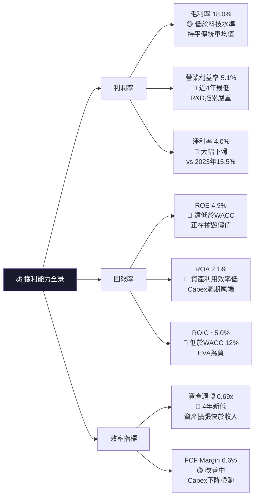

---

## 7. 估值深度分析

### 🔍 同業估值比較（關鍵倍數對比）

| 指標 | **TSLA** | **BYD** (比亞迪) | **GM** (通用) | **Rivian** (RIVN) | 說明 |
|------|----------|-----------------|--------------|-------------------|------|
| 市值 | $1,520B 🔴 | ~$100B 🟢 | ~$50B 🟢 | ~$15B 🟡 | Tesla溢價極大 |
| **P/E (Trailing)** | **370.9x** 🔴 | 18x 🟢 | 6x 🟢 | N/A(虧損) | Tesla溢價58x vs BYD |
| **P/E (Forward)** | **144.2x** 🔴 | 15x 🟢 | 5x 🟢 | N/A | 即使向前看仍極貴 |
| **P/S** | **16.0x** 🔴 | 0.8x 🟢 | 0.3x 🟢 | 2.5x 🟡 | Tesla溢價20倍 vs BYD |
| **EV/EBITDA** | **146.4x** 🔴 | 10x 🟢 | 4x 🟢 | N/A | 難以用基本面支撐 |
| **P/B** | **18.5x** 🔴 | 3.5x 🟢 | 1.0x 🟢 | 2.0x 🟡 | 帳面溢價極高 |
| **FCF Yield** | **0.25%** 🔴 | 3.5% 🟢 | 12% 🟢 | N/A | Tesla現金回報極低 |
| 毛利率 | 18.0% 🟡 | 19-20% 🟢 | 15% 🟡 | ~10% 🔴 | BYD已追平 |
| 營收成長YoY | -3.1% 🔴 | +15-20% 🟢 | +1% 🟡 | +40% 🟡 | BYD成長更快 |

> 🔴 **估值比較結論**：以任何傳統估值指標衡量，Tesla相對所有直接競爭對手均存在巨大估值溢價。P/S達16x是通用汽車（0.3x）的**53倍**，BYD（0.8x）的**20倍**。現有估值完全依賴對未來Robotaxi/AI業務的高度假設性期望值。

---

### 📊 歷史估值區間分析

```
Tesla P/E 歷史區間（估算）
━━━━━━━━━━━━━━━━━━━━━━━━━━━━━━━━━━━━━━━━━━━━━━━━━━━━━━
超高估區    >200x     ████████████████████████  ◄ 目前370x在此
高估區      100-200x  ████████████████░
合理偏高    50-100x   ████████░
歷史中值    ~80-100x  ████████░ ← 科技泡沫敘事時期均值
合理估值    30-50x    ████░
低估區      <30x      ██░
━━━━━━━━━━━━━━━━━━━━━━━━━━━━━━━━━━━━━━━━━━━━━━━━━━━━━━

P/S 歷史區間（估算）
━━━━━━━━━━━━━━━━━━━━━━━━━━━━━━━━━━━━━━━━━━━━━━━━━━━━━━
歷史高點    ~25x      ████████████████████████
目前水平    16x       ████████████████  ◄ 當前
歷史中值    ~10-12x   ████████████░
歷史低點    ~5-7x     ██████░
━━━━━━━━━━━━━━━━━━━━━━━━━━━━━━━━━━━━━━━━━━━━━━━━━━━━━━
⚠️ 目前P/S處於歷史高位區間，不支持估值擴張
```

---

### 🔢 DCF 敏感性分析（目標價矩陣）

**基本假設說明**：
- 基礎年度FCF：$6.22B（2025年實際）
- Terminal Growth Rate：3%
- 分析期間：10年

| 情境 | 成長假設 | 折現率 9% | 折現率 12% |
|------|---------|-----------|-----------|
| 🐂 **樂觀** | FCF年成長25%，Year 5-10 降至15% | **$680/股** | **$490/股** |
| 📊 **基準** | FCF年成長15%，Year 5-10 降至8% | **$340/股** | **$245/股** |
| 🐻 **悲觀** | FCF年成長5%，Year 5-10 降至3% | **$185/股** | **$140/股** |

```
DCF目標價區間視覺化（每格代表$50）
━━━━━━━━━━━━━━━━━━━━━━━━━━━━━━━━━━━━━━━━━━━━━━━━━━━━━
悲觀情境    $140-185  ████░░░░░░░░░░░░░░░░░░░░░░░░░░
基準情境    $245-340  ████████░░░░░░░░░░░░░░░░░░░░░░
目前股價    $404.29   ████████████░ ◄─────────── 現在
樂觀情境    $490-680  ████████████████░░░░░░
━━━━━━━━━━━━━━━━━━━━━━━━━━━━━━━━━━━━━━━━━━━━━━━━━━━━━
📌 基準情境下，現價$404 vs DCF基準$290 = 高估約39%
   需要接近樂觀情境假設才能支撐現價
```

---

### 🎯 估值區間視覺化

```
估值合理性光譜（基於多重方法加權）
━━━━━━━━━━━━━━━━━━━━━━━━━━━━━━━━━━━━━━━━━━━━━━━━━━━━━━━━━━━
嚴重低估    合理區間                高估     嚴重高估
$0        $150      $250    $350    $450    $600+
  ├─────────┼──────────┼────────┼────────┼──────────┤
  │         │  悲觀DCF  │基準DCF │        │  現價    │
  │         │  $140-185 │$245-340│        │  $404   │
  │         │          │        │樂觀DCF  │          │
  │         │          │        │$490-680│          │
  ├─────────┼──────────┼────────┼────────┼──────────┤
  低估區░░░░  合理區████  高估██   🔴此處
━━━━━━━━━━━━━━━━━━━━━━━━━━━━━━━━━━━━━━━━━━━━━━━━━━━━━━━━━━━
結論：現價落在「高估」與「需要樂觀假設」的臨界，
      基準情境下存在約-20~-40%的下行風險
```

---

## 8. 成長催化劑

### 📅 催化劑時間軸

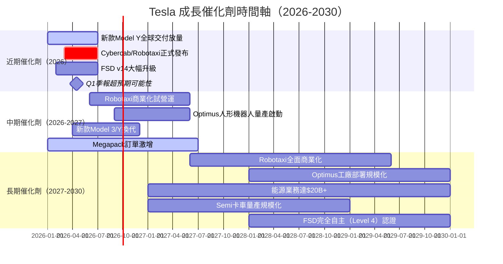

---

### 📊 TAM 市場規模與滲透率

```
Tesla 各業務 TAM（全球可服務市場）估算
━━━━━━━━━━━━━━━━━━━━━━━━━━━━━━━━━━━━━━━━━━━━━━━━━━━━━━━━━━━━━
業務類別              TAM估算    Tesla現狀    滲透率
━━━━━━━━━━━━━━━━━━━━━━━━━━━━━━━━━━━━━━━━━━━━━━━━━━━━━━━━━━━━━
全球電動車市場        $1.5T/yr   ~18%全球EV  ██░░░░░░░░  EV滲透加速中
能源儲能（Megapack）  $500B+/yr  ~$11.4B     █░░░░░░░░░  早期高速成長
Robotaxi自動駕駛      $1T+/yr    0%（籌備）  ░░░░░░░░░░  最大期望值
人形機器人（Optimus） $10T+/yr   0%（研發）  ░░░░░░░░░░  最遠期願景
FSD授權收入           $100B+/yr  初步        ░░░░░░░░░░  積累中
━━━━━━━━━━━━━━━━━━━━━━━━━━━━━━━━━━━━━━━━━━━━━━━━━━━━━━━━━━━━━
⭐ 核心投資論點：市場為Robotaxi/Optimus期權價值支付巨大溢價
```

---

### 🚀 短中長期成長驅動力

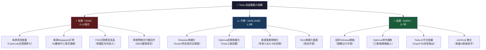

---

## 9. 風險矩陣

### ⚠️ 風險評分矩陣

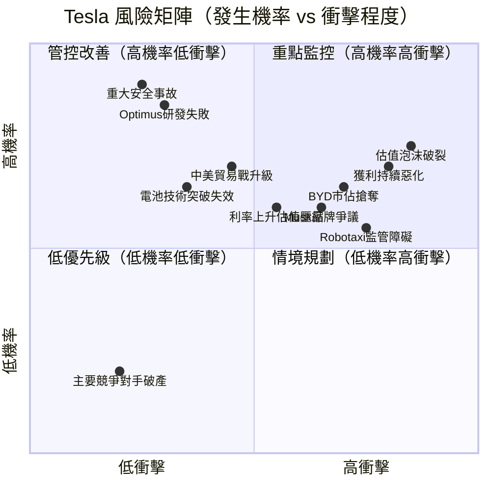

---

### 📋 風險清單詳細評估

| # | 風險項目 | 機率 | 衝擊 | 綜合評分 | 緩解措施 |
|---|---------|------|------|---------|---------|
| 1 | 🔴 **估值泡沫修正** | 75% | 極高 | **9/10** | 長期持有者設定停損，分批操作 |
| 2 | 🔴 **汽車業務獲利持續惡化** | 70% | 高 | **8/10** | 監控季度毛利率是否反彈 |
| 3 | 🔴 **Robotaxi商業化延遲** | 65% | 極高 | **8/10** | 追蹤監管核准進度 |
| 4 | 🔴 **BYD/中國EV品牌全球擴張** | 70% | 高 | **8/10** | 監控美歐市場份額數據 |
| 5 | 🟡 **Musk政治爭議/品牌損傷** | 60% | 中高 | **7/10** | 觀察品牌調查數據/訂單趨勢 |
| 6 | 🟡 **利率維持高位/估值壓縮** | 55% | 中 | **6/10** | 升息周期結束後重估 |
| 7 | 🟡 **中美貿易摩擦/關稅** | 45% | 中高 | **6/10** | 供應鏈本地化程度監控 |
| 8 | 🟡 **重大自動駕駛安全事故** | 25% | 極高 | **7/10** | 監控NHTSA調查動態 |
| 9 | 🟢 **資金流動性危機** | 10% | 低 | **2/10** | $44B現金儲備充裕，低風險 |
| 10 | 🟢 **短期信用評級下降** | 10% | 低 | **2/10** | Debt/EBITDA 1.25x，財務健康 |

---

## 10. 投資建議

### 🎯 最終綜合評級

```
Tesla 各維度綜合評分（1-10分）
━━━━━━━━━━━━━━━━━━━━━━━━━━━━━━━━━━━━━━━━━━━━━━━━━━━━━━━━━━
維度              評分    視覺化                    說明
━━━━━━━━━━━━━━━━━━━━━━━━━━━━━━━━━━━━━━━━━━━━━━━━━━━━━━━━━━
基本面品質         5/10   █████░░░░░  毛利率下滑，獲利惡化
成長動能           4/10   ████░░░░░░  首次營收衰退，EPS-60%
獲利能力           4/10   ████░░░░░░  ROIC<WACC，淨利率4%
財務健康           7/10   ███████░░░  淨現金$29B，流動比優異
估值合理性         2/10   ██░░░░░░░░  P/E 370x，FCF Yield 0.25%
管理層執行力       5/10   █████░░░░░  Musk分心，多次發布延遲
競爭護城河         7/10   ███████░░░  品牌+充電網絡+FSD數據
未來成長期權       8/10   ████████░░  Robotaxi/Optimus潛力巨大
━━━━━━━━━━━━━━━━━━━━━━━━━━━━━━━━━━━━━━━━━━━━━━━━━━━━━━━━━━
加權綜合評分：     5.2/10 █████░░░░░
━━━━━━━━━━━━━━━━━━━━━━━━━━━━━━━━━━━━━━━━━━━━━━━━━━━━━━━━━━
```

**ASCII 雷達圖**：

```
                    未來期權[8]
                      ▲
                    8 █
                  7   █
競爭護城河[7]   6     █     財務健康[7]
         █████░░░█░░░░░█░░░░████
         █     5 █     █     █
         █   4   █     █   4 █
         █ 3     █     █     █ 3
管理執行[5]─────────────────────── 估值[2]
         █       █     █       █
         █     2 █     █     2 █
         █       █     █       █
基本面[5]███████░░░░█░░░░███████ 成長[4]
                    ▼
                獲利能力[4]

圖例：█=現況  ░=目標  （示意圖）
```

---

### 🎯 目標價與隱含報酬率

| 情境 | 目標價 | 隱含報酬率 | 觸發條件 | 時間框架 |
|------|--------|-----------|---------|---------|
| 🐂 **樂觀情境** | **$500-550** | **+24% ~ +36%** | Robotaxi Q3商業化成功+毛利率回升>20% | 12-18個月 |
| 📊 **基準情境** | **$280-320** | **-21% ~ -31%** | 汽車業務漸進式改善，AI敘事降溫 | 12個月 |
| 🐻 **悲觀情境** | **$180-220** | **-45% ~ -55%** | 持續獲利惡化+Robotaxi延遲+估值重置 | 6-12個月 |

> 📌 **當前股價$404.29**：分析師共識目標價均值$421.73（+4.3%），目標價分散度極大（$125-$600），反映市場對Tesla估值存在根本性分歧。

---

### ✅ 買入時機與觸發因素 Checklist

```
買入正向催化劑（需多項同時成立）
━━━━━━━━━━━━━━━━━━━━━━━━━━━━━━━━━━━━━━━━━━━━━━━━━━━━━━
☐ 季度汽車毛利率回升至 >20%（確認價格戰結束）
☐ FSD/Robotaxi監管核准里程碑達成
☐ Cybercab交付量超預期啟動
☐ 季度交付量重返 >50萬輛水準
☐ 股價回測至 $280-$300 支撐區間（安全邊際擴大）
☐ 能源業務季度收入突破 $5B+
☐ Optimus具體量產時間表公佈
☐ 市場整體P/E壓縮（提供更好進場估值）

賣出/減持警示（若出現下列情況需注意）
━━━━━━━━━━━━━━━━━━━━━━━━━━━━━━━━━━━━━━━━━━━━━━━━━━━━━━
⚠️ 毛利率繼續下滑至 <15%
⚠️ Robotaxi計劃再次重大延遲
⚠️ 季度交付量連續2季同比下滑 >10%
⚠️ 重大自動駕駛安全事故引發監管調查
⚠️ Musk相關爭議導致主要市場銷量崩跌
⚠️ 市場利率大幅上升導致成長股估值系統性收縮
```

---

### 👥 投資人適配度

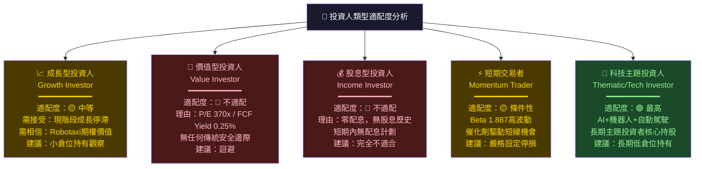

---

### 📡 關鍵監控指標 Checklist

```
📊 財務指標監控（每季追蹤）
━━━━━━━━━━━━━━━━━━━━━━━━━━━━━━━━━━━━━━━━━━━━━━━━━
☑ 汽車業務毛利率（關鍵指標：是否止跌回升>20%）
☑ 季度汽車交付量（全球及分車型拆解）
☑ 自由現金流（持續觀察改善趨勢）
☑ 能源業務收入（成長率是否維持>30%+）
☑ R&D費用佔收入比（觀察是否進一步升高）
☑ FSD訂閱用戶數量與ARPU（軟體化程度）

🚗 產業動態監控（每月追蹤）
━━━━━━━━━━━━━━━━━━━━━━━━━━━━━━━━━━━━━━━━━━━━━━━━
☑ 全球EV月度交付量排名（vs BYD競爭態勢）
☑ 美國EV補貼政策動向（IRA相關法規）
☑ 中國EV市場銷售數據（上海Gigafactory輸出）
☑ 競爭對手新車型發布與定價策略

🤖 技術/監管里程碑（隨時追蹤）
━━━━━━━━━━━━━━━━━━━━━━━━━━━━━━━━━━━━━━━━━━━━━━━━
☑ Robotaxi（Cybercab）發布/測試許可進展
☑ FSD重大版本升級及事故率數據
☑ NHTSA/DMV相關自動駕駛法規
☑ Optimus具體量產時間表與產能
☑ Dojo超算芯片進展（vs NVIDIA合作關係）

📰 重大事件監控（隨時追蹤）
━━━━━━━━━━━━━━━━━━━━━━━━━━━━━━━━━━━━━━━━━━━━━━━━
☑ Elon Musk 相關政治動態及品牌影響
☑ 中美貿易政策變化（關稅/技術出口管制）
☑ 分析師評級調整（關注Morgan Stanley/Wedbush）
☑ 大型機構持股變化（13F季報）
☑ 內部人士買賣（Insider Trading紀錄）
```

---

## 📝 分析師總結語

```
╔══════════════════════════════════════════════════════════════════╗
║                    分析師核心觀點總結                           ║
╠══════════════════════════════════════════════════════════════════╣
║                                                                  ║
║  Tesla 是當代投資界最具爭