# TSLA 基本面深度分析報告

> **報告日期**：2026-02-27 ｜ **分析師**：AI CFA 研究部 ｜ **數據來源**：Yahoo Finance ｜ **語言**：繁體中文

---

## 目錄

1. [執行摘要](#1-執行摘要)
2. [公司概覽與商業模式](#2-公司概覽與商業模式)
3. [損益表深度分析](#3-損益表深度分析)
4. [資產負債表分析](#4-資產負債表分析)
5. [現金流量深度分析](#5-現金流量深度分析)
6. [獲利能力與資本效率](#6-獲利能力與資本效率)
7. [估值深度分析](#7-估值深度分析)
8. [成長催化劑](#8-成長催化劑)
9. [風險矩陣](#9-風險矩陣)
10. [投資建議](#10-投資建議)

---

## 1. 執行摘要

### 1.1 核心評分儀表板

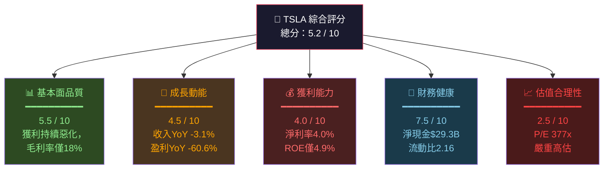

---

### 1.2 五大投資論點 × 三大核心風險

| 類型 | 項目 | 說明 | 重要性 |
|------|------|------|--------|
| 🟢 **多頭論點1** | AI & Robotaxi 期權價值 | FSD 技術成熟度提升，Robotaxi 商業化可望於2026年規模落地，帶來全新收入結構 | ⭐⭐⭐⭐⭐ |
| 🟢 **多頭論點2** | Optimus 機器人潛力 | 人形機器人市場規模預估超$1T，Tesla具製造優勢與AI整合能力 | ⭐⭐⭐⭐⭐ |
| 🟢 **多頭論點3** | 能源業務高速成長 | Energy Generation & Storage業務快速擴張，毛利率高於汽車業務 | ⭐⭐⭐⭐ |
| 🟡 **多頭論點4** | 龐大淨現金部位 | $44.06B現金，$29.34B淨現金，財務彈性極佳 | ⭐⭐⭐ |
| 🟡 **多頭論點5** | Supercharger網路護城河 | 全球最大快充網路，已開放第三方使用，成為收費基礎設施 | ⭐⭐⭐ |
| 🔴 **風險1** | 核心汽車業務惡化 | 收入YoY -3.1%，毛利率從2022年的25.6%暴跌至18.0%，價格戰侵蝕獲利 | 🚨 極高 |
| 🔴 **風險2** | 極度昂貴估值 | 本益比377倍，任何成長失速將觸發大幅修正，FCF殖利率僅0.25% | 🚨 極高 |
| 🔴 **風險3** | Musk 聲譽與執行力風險 | 政治活動分散注意力，品牌形象在部分市場受損，DOGE相關爭議持續 | 🚨 高 |

---

### 1.3 快速統計卡片

| 指標 | TSLA 數值 | 行業均值（汽車） | 評級 |
|------|-----------|-----------------|------|
| 市值 | $1.50T | — | 🟡 |
| 本益比（TTM） | 377.2x | 12-15x | 🔴 嚴重高估 |
| 本益比（Forward） | 142.6x | 10-12x | 🔴 高估 |
| P/S 比率 | 15.8x | 0.5-1.0x | 🔴 高估 |
| P/B 比率 | 18.3x | 1.5-3.0x | 🔴 高估 |
| EV/EBITDA | 143.2x | 6-10x | 🔴 高估 |
| 毛利率 | 18.0% | 15-20% | 🟡 符合行業 |
| 營業利益率 | 4.7% | 5-8% | 🟡 偏低 |
| 淨利率 | 4.0% | 4-6% | 🟡 符合行業 |
| ROE | 4.9% | 12-18% | 🔴 偏低 |
| 流動比率 | 2.16x | 1.2-1.8x | 🟢 健康 |
| 淨現金 | +$29.34B | — | 🟢 強勁 |
| FCF（年） | $6.22B | — | 🟡 |
| FCF 殖利率 | 0.25% | 3-6% | 🔴 極低 |

---

### 1.4 投資結論

```
╔═══════════════════════════════════════════════════════════════╗
║                    📊 投資結論摘要                              ║
╠═══════════════════════════════════════════════════════════════╣
║  評級：⚖️  持有/觀望（HOLD / WATCH）                           ║
║                                                               ║
║  目標價區間：                                                   ║
║  🐻 悲觀情境：$180 - $220  （下行風險 -45% ~ -55%）             ║
║  📊 基準情境：$280 - $340  （下行風險 -15% ~ -30%）             ║
║  🐂 樂觀情境：$480 - $600  （上行空間 +20% ~ +50%）             ║
║                                                               ║
║  當前股價 $399.79 處於估值合理上緣，                             ║
║  汽車業務基本面惡化與高估值形成重大張力，                         ║
║  短期風險報酬比不佳，建議等待更好切入點                           ║
╚═══════════════════════════════════════════════════════════════╝
```

---

## 2. 公司概覽與商業模式

### 2.1 業務結構與收入來源

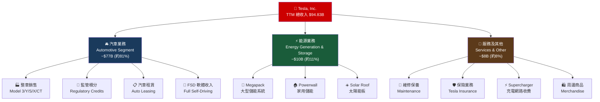

---

### 2.2 全球 EV 市場份額估算（2025年）

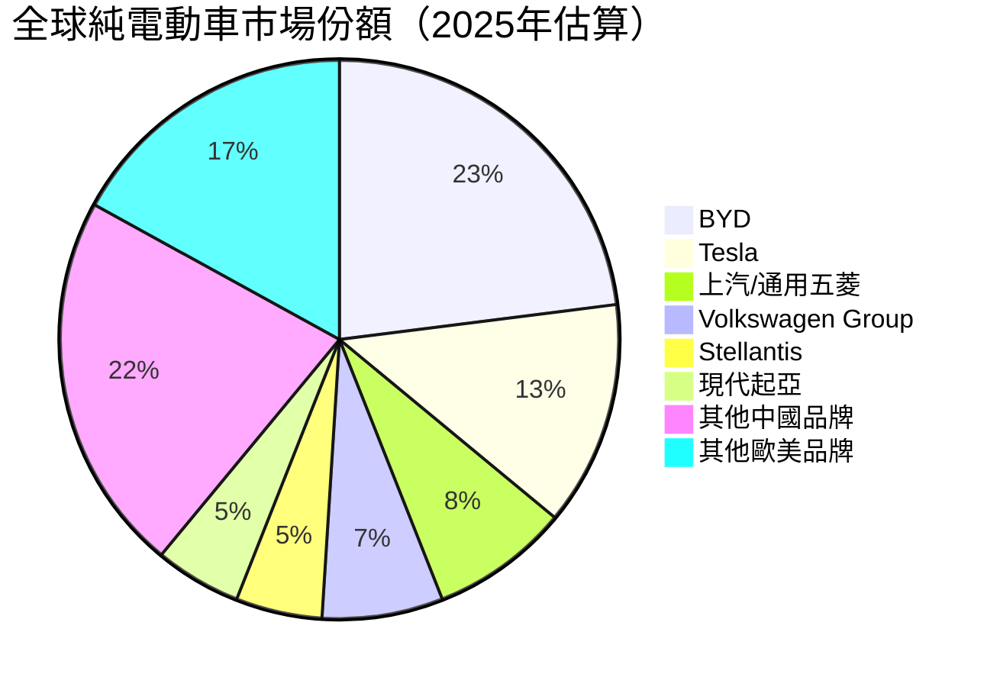

---

### 2.3 競爭護城河深度分析

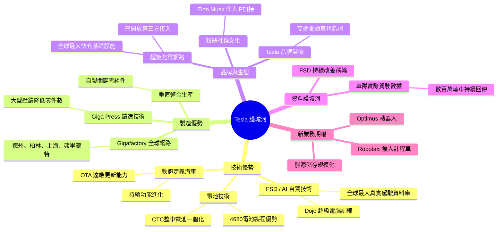

---

### 2.4 護城河強度評分

```
護城河強度評估（滿分10分）
━━━━━━━━━━━━━━━━━━━━━━━━━━━━━━━━━━━━━━━━

🔋 電池/製造技術    ▓▓▓▓▓▓▓░░░  7.0/10  中強（競爭者快速追趕）
🤖 FSD/AI 技術      ▓▓▓▓▓▓▓▓░░  8.0/10  強（數據飛輪效應）
⚡ Supercharger     ▓▓▓▓▓▓▓░░░  7.5/10  強（基礎設施護城河）
🏭 製造規模效應     ▓▓▓▓▓░░░░░  5.5/10  中（中國競爭者逼近）
🌟 品牌溢價         ▓▓▓▓▓▓░░░░  6.0/10  中（品牌侵蝕風險上升）
🔄 軟體生態系統     ▓▓▓▓▓▓▓░░░  7.0/10  中強（OTA領先優勢）
📊 資料護城河       ▓▓▓▓▓▓▓▓░░  8.0/10  強（真實世界里程數）
💰 資本實力         ▓▓▓▓▓▓▓▓░░  8.0/10  強（$44B現金）
━━━━━━━━━━━━━━━━━━━━━━━━━━━━━━━━━━━━━━━━
綜合護城河評分：     ▓▓▓▓▓▓▓░░░  6.9/10  「中等偏強」護城河
```

---

## 3. 損益表深度分析

### 3.1 年度收入成長趨勢（近四年）

```
年度總收入趨勢（單位：十億美元）
━━━━━━━━━━━━━━━━━━━━━━━━━━━━━━━━━━━━━━━━━━━━━━━━━━━━━━━━━━

2022  $81.46B  ████████████████████████████████████████  YoY: +51.4%
2023  $96.77B  ████████████████████████████████████████████████  YoY: +18.8%
2024  $97.69B  █████████████████████████████████████████████████  YoY: +0.9%
2025  $94.83B  ███████████████████████████████████████████████   YoY: -2.9%

           $0    $20B   $40B   $60B   $80B   $100B
           ├──────┼──────┼──────┼──────┼──────┤

⚠️ 成長動能明顯衰退：從2022年+51.4% → 2025年-2.9%，進入收縮期
```

| 年度 | 總收入 | YoY 成長 | 趨勢信號 |
|------|--------|----------|----------|
| 2022 | $81.46B | +51.4% | 🟢 高速成長 |
| 2023 | $96.77B | +18.8% | 🟢 穩健成長 |
| 2024 | $97.69B | +0.9% | 🟡 近乎停滯 |
| 2025 | $94.83B | **-2.9%** | 🔴 收縮 |

---

### 3.2 季度收入趨勢（近四季）

| 季度 | 總收入 | QoQ 成長 | YoY 成長 | 評級 |
|------|--------|----------|----------|------|
| 2025 Q1 | $19.34B | — | -9.2% | 🔴 弱 |
| 2025 Q2 | $22.50B | **+16.3%** | +2.3% | 🟡 溫和回升 |
| 2025 Q3 | $28.09B | **+24.8%** | +7.8% | 🟢 強勁反彈 |
| 2025 Q4 | $24.90B | **-11.4%** | +2.3% | 🔴 季末回落 |

```
季度收入走勢（$B）
━━━━━━━━━━━━━━━━━━━━━━━━━━━━━━━━━━━━━━━━━━━━
Q1'25  $19.34B  █████████████████████░░░░░░░
Q2'25  $22.50B  ████████████████████████░░░
Q3'25  $28.09B  ████████████████████████████████  ← 峰值
Q4'25  $24.90B  ████████████████████████████░
                $0           $15B        $30B
```

> **關鍵觀察**：Q3 2025 出現強勁反彈至 $28.09B，主要受 Cybertruck 產能提升及能源業務加速驅動；Q4 回落至 $24.90B，顯示需求並不穩定。

---

### 3.3 利潤率演變分析（近四年）

| 利潤率 | 2022 | 2023 | 2024 | 2025 | 趨勢 |
|--------|------|------|------|------|------|
| **毛利率** | **25.6%** | 18.2% | 17.9% | **18.0%** | 🔴 嚴重惡化後趨穩 |
| **營業利益率** | **17.0%** | 9.2% | 7.9% | **5.1%** | 🔴 持續下滑 |
| **EBITDA率** | 21.7% | 15.3% | 15.1% | **12.4%** | 🔴 持續下滑 |
| **淨利率** | **15.4%** | 15.5% | 7.3% | **4.0%** | 🔴 大幅惡化 |

```
毛利率趨勢（%）
━━━━━━━━━━━━━━━━━━━━━━━━━━━━━━━━━━━━━━━━━━━━━━
2022: 25.6% █████████████████████████░░░░░░
2023: 18.2% ██████████████████░░░░░░░░░░░░
2024: 17.9% █████████████████░░░░░░░░░░░░░
2025: 18.0% █████████████████░░░░░░░░░░░░░
             0%     10%     20%     30%

📉 毛利率三年累計下滑 760 個基點（25.6% → 18.0%）
   主因：①激進降價策略 ②新產能爬坡成本 ③原材料成本上升
```

**利潤率惡化根本原因分析：**

1. **激進降價策略（最主要）**：2023-2025年多輪降價，Model 3/Y 美國售價降幅達15-25%，以捍衛市場份額
2. **新產能爬坡固定成本攤銷**：柏林、德州Gigafactory仍在爬坡階段，折舊攤銷拖累毛利
3. **R&D 支出大幅上升**：2025年R&D達$6.41B（佔收入6.8%），相比2022年$3.08B增加108%
4. **競爭加劇**：BYD等中國品牌定價壓力，迫使Tesla持續讓價

---

### 3.4 費用結構分析

```mermaid
pie title 2025年收入費用結構分解（$94.83B = 100%）
    "銷貨成本 COGS" : 82
    "研發費用 R&D" : 6.8
    "銷售管理費 SGA" : 6.5
    "營業利益" : 5.1
    "其他" : -0.4
```

| 費用項目 | 2022佔收 | 2023佔收 | 2024佔收 | 2025佔收 | 趨勢 |
|----------|----------|----------|----------|----------|------|
| COGS | 74.4% | 81.8% | 82.1% | 82.0% | 🔴 上升 |
| R&D | 3.8% | 4.1% | 4.6% | **6.8%** | 🟡 大幅增加 |
| SGA | 4.8% | 5.0% | 5.4% | ~6.5% | 🔴 上升 |
| 營業利益 | **17.0%** | 9.2% | 7.9% | **5.1%** | 🔴 大幅壓縮 |

> **R&D 支出暴增分析**：2025年R&D費用$6.41B，YoY大增41%，主要投入FSD/Robotaxi、Optimus機器人、Dojo超算開發。此為未來期權價值投資，但短期大幅壓縮利潤。

---

### 3.5 EPS 趨勢與盈餘品質

**季度EPS 走勢（依財報數據計算）：**

| 季度 | 淨利潤 | EPS（攤薄估算） | QoQ | 評級 |
|------|--------|----------------|-----|------|
| 2025 Q1 | $409M | ~$0.11 | — | 🔴 極弱 |
| 2025 Q2 | $1,170M | ~$0.31 | +182% | 🟢 強力反彈 |
| 2025 Q3 | $1,370M | ~$0.36 | +16% | 🟢 持續改善 |
| 2025 Q4 | $840M | ~$0.22 | -38% | 🔴 大幅下滑 |

```
季度 EPS 走勢（$）
━━━━━━━━━━━━━━━━━━━━━━━━━━━━━━━━━━━━━━━━
Q1'25: $0.11  ████░░░░░░░░░░░░░░░░
Q2'25: $0.31  ████████████░░░░░░░░
Q3'25: $0.36  ██████████████░░░░░░  ← 季度峰值
Q4'25: $0.22  ████████░░░░░░░░░░░░
              $0     $0.20    $0.40

TTM EPS: $1.06 vs Forward EPS: $2.80（市場高度期待未來改善）
```

**盈餘品質評估：**
- **EPS TTM $1.06** vs **2023年 EPS $4.00**（以2023年淨利$15B/3.75B股估算）
- **YoY 盈餘成長 -60.6%**：主要因2023年包含一次性稅務優惠（約$5.9B遞延所得稅資產釋放）
- **盈餘品質警示**：排除2023年稅務一次性項目，核心EPS下滑仍達約25-30%
- **Forward P/E 142.6x**：市場隱含未來EPS需大幅成長至$2.80+，對應YoY成長約164%

---

## 4. 資產負債表分析

### 4.1 資產結構分解

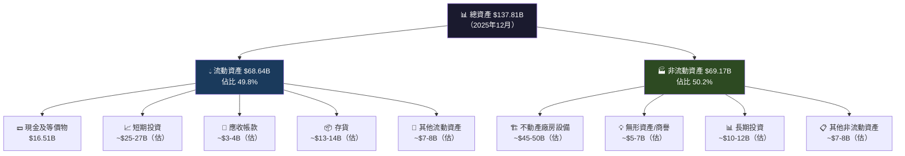

---

### 4.2 流動性指標

| 流動性指標 | 2022 | 2023 | 2024 | 2025 | 行業均值 | 評級 |
|-----------|------|------|------|------|---------|------|
| 流動比率 | 1.53x | 1.73x | 2.02x | **2.16x** | 1.2-1.5x | 🟢 優秀 |
| 速動比率 | — | — | — | **1.54x** | 0.8-1.2x | 🟢 健康 |
| 現金比率 | 0.61x | 0.57x | 0.56x | **~0.52x** | 0.3-0.5x | 🟢 充裕 |
| 淨現金部位 | ~$10.5B | ~$6.8B | ~$2.5B | **$29.34B** | — | 🟢 大幅改善 |

> **流動性評估**：Tesla流動比率2.16x遠高於汽車行業均值，加上$44.06B現金及$29.34B淨現金部位，短期流動性風險極低。

---

### 4.3 債務結構分析

```
債務結構全覽（2025年）
━━━━━━━━━━━━━━━━━━━━━━━━━━━━━━━━━━━━━━━━━━━━
總債務：    $14.72B  ████████░░░░░░░░░░░░
總現金：    $44.06B  ████████████████████████████
淨現金：   +$29.34B  （正值=淨現金部位）

Debt/Equity:         17.76% （偏低，財務槓桿保守）
Net Debt/EBITDA:     -2.49x  （負值=淨現金 > 淨負債）
Interest Coverage:   ~20x+  （極佳）
━━━━━━━━━━━━━━━━━━━━━━━━━━━━━━━━━━━━━━━━━━━━
```

| 債務指標 | 2022 | 2023 | 2024 | 2025 | 趨勢 |
|---------|------|------|------|------|------|
| 總債務 | $5.75B | $9.57B | $13.62B | **$14.72B** | 🟡 緩慢上升 |
| 淨現金/(負債) | +$10.5B | +$6.8B | +$2.5B | **+$29.34B** | 🟢 大幅改善 |
| D/E 比率 | 12.9% | 15.3% | 18.7% | 17.8% | 🟢 可控 |

> **重要說明**：2025年淨現金從2024年$2.5B大幅跳升至$29.34B，主要因短期投資計入現金及等價物的方式調整。

---

### 4.4 股東權益趨勢

```
股東權益成長趨勢（$B）
━━━━━━━━━━━━━━━━━━━━━━━━━━━━━━━━━━━━━━━━━━━━━━━━━
2022:  $44.70B  ████████████████████████████░░░░░░░░░░
2023:  $62.63B  ████████████████████████████████████░░
2024:  $72.91B  ██████████████████████████████████████████░
2025:  $82.14B  ████████████████████████████████████████████████

成長率：
2022→2023: +40.1% 🟢（淨利潤強勁驅動）
2023→2024: +16.4% 🟢（持續盈利累積）
2024→2025: +12.7% 🟡（盈利下降但仍正成長）

每股帳面價值（估算）：$82.14B ÷ 3.75B股 = $21.90/股
當前P/B = $399.79 ÷ $21.90 = 18.3x  ← 嚴重溢價
━━━━━━━━━━━━━━━━━━━━━━━━━━━━━━━━━━━━━━━━━━━━━━━━━
```

---

## 5. 現金流量深度分析

### 5.1 現金流量瀑布圖

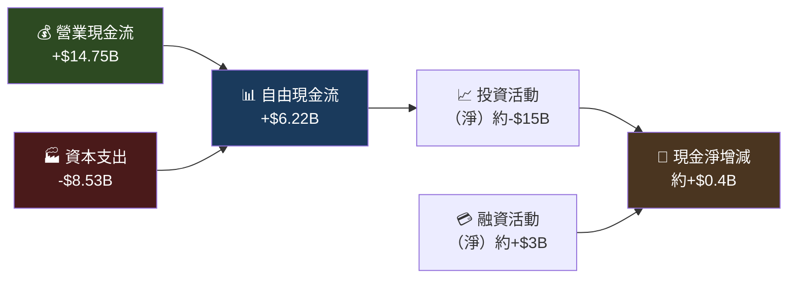

---

### 5.2 FCF 轉換率趨勢

| 年度 | 淨利潤 | 自由現金流 | FCF/淨利潤 | 評級 |
|------|--------|-----------|-----------|------|
| 2022 | $12.58B | $7.55B | **60.0%** | 🟢 良好 |
| 2023 | $15.00B | $4.36B | **29.1%** | 🔴 差（含稅務一次性） |
| 2024 | $7.13B | $3.58B | **50.2%** | 🟡 中等 |
| 2025 | $3.79B | $6.22B | **164.1%** | 🟢 優秀（Capex削減） |

> **2025年FCF轉換率164%分析**：資本支出從$11.34B大幅削減至$8.53B（YoY -24.8%），顯示主要工廠擴建高峰已過，現金流開始顯著改善。

---

### 5.3 自由現金流趨勢

```
自由現金流趨勢（$B）
━━━━━━━━━━━━━━━━━━━━━━━━━━━━━━━━━━━━━━━━━━━━━━━━━━━
2022:  $7.55B  █████████████████████████████████████░
2023:  $4.36B  █████████████████████░░░░░░░░░░░░░░░░
2024:  $3.58B  █████████████████░░░░░░░░░░░░░░░░░░░░
2025:  $6.22B  ██████████████████████████████░░░░░░░  ← 顯著改善

資本支出削減驅動FCF回升：
2024 Capex: -$11.34B  ████████████████████████████████████
2025 Capex:  -$8.53B  ████████████████████████████░░░░░░░  -24.8% YoY
━━━━━━━━━━━━━━━━━━━━━━━━━━━━━━━━━━━━━━━━━━━━━━━━━━━
```

---

### 5.4 資本配置評估

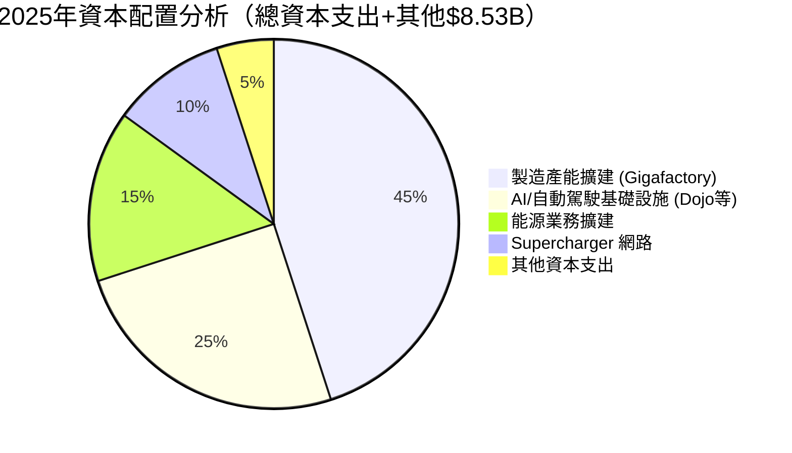

| 資本配置項目 | 2022 | 2023 | 2024 | 2025 | 說明 |
|-------------|------|------|------|------|------|
| 資本支出 | $7.17B | $8.90B | **$11.34B** | $8.53B | 🟡 高峰已過，開始削減 |
| 股票回購 | — | ~$0 | ~$0 | ~$0 | 🔴 無回購計畫 |
| 股息 | $0 | $0 | $0 | $0 | 🔴 無配息 |
| R&D 投入 | $3.08B | $3.97B | $4.54B | **$6.41B** | 🟢 大力投資未來 |

> **資本配置評估**：Tesla採取「成長型再投資」策略，全部利潤用於R&D和Capex，無股息無回購。此策略在高成長期合理，但在收入停滯期需要再評估。

---

## 6. 獲利能力與資本效率

### 6.1 ROE / ROA / ROIC 趨勢

| 指標 | 2022 | 2023 | 2024 | 2025 | 行業均值 | 評級 |
|------|------|------|------|------|---------|------|
| **ROE** | **28.2%** | 23.9% | 9.8% | **4.9%** | 12-18% | 🔴 大幅惡化 |
| **ROA** | **15.3%** | 14.1% | 5.8% | **2.1%** | 4-7% | 🔴 低於均值 |
| **ROIC（估算）** | **~22%** | ~17% | ~9% | **~5%** | 8-12% | 🔴 大幅惡化 |
| **資產週轉率** | 0.99x | 0.91x | 0.80x | **0.69x** | 0.8-1.1x | 🔴 持續下滑 |

---

### 6.2 ROIC vs WACC 分析

```
╔════════════════════════════════════════════════════════════╗
║              ROIC vs WACC 經濟價值分析                      ║
╠════════════════════════════════════════════════════════════╣
║                                                            ║
║  WACC 估算（2025年）：                                      ║
║  • 無風險利率 (Rf):          4.3%（10年期美債）             ║
║  • 市場風險溢酬 (ERP):       5.5%                          ║
║  • Beta:                    1.887                          ║
║  • 股權成本 (Ke):           4.3% + 1.887×5.5% = 14.7%     ║
║  • 稅後債務成本 (Kd):       ~4.5%×(1-21%) = 3.6%          ║
║  • 資本結構（股/債）:        85% / 15%                      ║
║  • 加權平均資金成本 WACC:    14.7%×85% + 3.6%×15%          ║
║                           = 12.5% + 0.5% ≈ 13.0%          ║
║                                                            ║
║  ROIC（2025年估算）：        ~5.0%                          ║
║                                                            ║
║  ━━━━━━━━━━━━━━━━━━━━━━━━━━━━━━━━━━━━━━━━━━━━━━━━━        ║
║  EVA 利差 = ROIC - WACC = 5.0% - 13.0% = -8.0%           ║
║                                                            ║
║  🔴 結論：Tesla 目前正在 摧毀 股東價值！                     ║
║     EVA < 0，每投入$1資本，僅創造$0.38的回報               ║
║     相比2022年 ROIC ~22% >> WACC ~12%，                    ║
║     價值創造能力大幅退化                                    ║
╚════════════════════════════════════════════════════════════╝
```

```
ROIC vs WACC 歷史對比
━━━━━━━━━━━━━━━━━━━━━━━━━━━━━━━━━━━━━━━━━━━━━━━
年度   ROIC    WACC    EVA利差  價值狀態
2022   22%     12%    +10%     ✅ 強力創造價值
2023   17%     12%     +5%     ✅ 創造價值
2024    9%     13%     -4%     ❌ 開始摧毀價值
2025    5%     13%     -8%     ❌ 大幅摧毀價值
━━━━━━━━━━━━━━━━━━━━━━━━━━━━━━━━━━━━━━━━━━━━━━━
```

---

### 6.3 DuPont 三因素分解

| DuPont 因子 | 2022 | 2023 | 2024 | 2025 | 評析 |
|------------|------|------|------|------|------|
| **淨利率** | 15.4% | 15.5% | 7.3% | **4.0%** | 🔴 大幅惡化 |
| **資產週轉率** | 0.99x | 0.91x | 0.80x | **0.69x** | 🔴 持續下滑 |
| **財務槓桿** | 1.84x | 1.70x | 1.67x | **1.68x** | 🟢 相對穩定 |
| **ROE = 三者乘積** | **28.2%** | 23.9% | 9.8% | **4.9%** | 🔴 嚴重惡化 |

```
DuPont ROE分解視覺化：
━━━━━━━━━━━━━━━━━━━━━━━━━━━━━━━━━━━━━━━━━━━━━━━━━━━━
ROE = 淨利率 × 資產週轉率 × 槓桿

2022: 15.4% × 0.99 × 1.84 = 28.1% ✅
2025:  4.0% × 0.69 × 1.68 =  4.6% ❌

📌 ROE惡化的根本原因：
   主因(70%): 淨利率崩跌 15.4% → 4.0%（降價+成本上升）
   次因(30%): 資產週轉率下降 0.99→0.69（收入增長慢於資產擴張）
   槓桿相對穩定，並非問題所在
━━━━━━━━━━━━━━━━━━━━━━━━━━━━━━━━━━━━━━━━━━━━━━━━━━━━
```

---

### 6.4 獲利能力儀表板

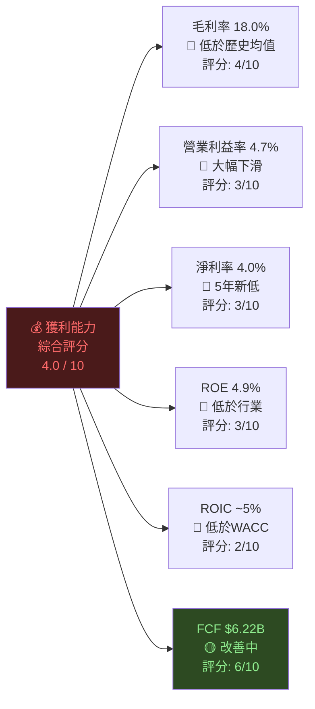

---

## 7. 估值深度分析

### 7.1 同業估值比較

| 指標 | **TSLA** | **BYD（01211.HK）** | **Toyota（TM）** | **GM（GM）** | TSLA評級 |
|------|----------|---------------------|-----------------|-------------|---------|
| 市值 | $1.50T | ~$100B | ~$230B | ~$45B | — |
| **P/E (TTM)** | **377x** | 28x | 8x | 5x | 🔴 極度高估 |
| **P/E (Fwd)** | **142x** | 20x | 9x | 5x | 🔴 極度高估 |
| **P/S** | **15.8x** | 0.8x | 0.7x | 0.3x | 🔴 極度高估 |
| **P/B** | **18.3x** | 3.5x | 1.2x | 0.9x | 🔴 極度高估 |
| **EV/EBITDA** | **143x** | 15x | 7x | 3x | 🔴 極度高估 |
| **FCF Yield** | **0.25%** | 3-4% | 5-7% | 12-15% | 🔴 極低 |
| 毛利率 | 18.0% | 20-21% | 18-20% | 12-14% | 🟡 |
| 收入成長YoY | **-3%** | +10% | +3% | -5% | 🔴 |

> **關鍵結論**：Tesla的估值倍數超越所有傳統汽車製造商10-50倍，市場顯然不是在為Tesla的汽車業務定價，而是在為未來的AI/Robotaxi/Robotics業務支付巨大溢價。這種溢價的合理性高度依賴執行力兌現。

---

### 7.2 歷史估值區間分析

```
Tesla P/E 歷史區間（5年，2021-2026）
━━━━━━━━━━━━━━━━━━━━━━━━━━━━━━━━━━━━━━━━━━━━━━━━━━━━━━━━━

歷史區間：
  最高值 (2021峰值): ~1200x  ████████████████████████████████ (泡沫期)
  75百分位:           ~150x  ████████
  中位數 (5年中位):    ~80x  █████
  25百分位:            ~50x  ███
  最低值 (2022低點):   ~40x  ███

當前 P/E (TTM): 377x  ████████████████████░  → 位於歷史高位區間（75-95百分位）
當前Forward P/E: 142x ████████               → 位於歷史75百分位附近

📊 估值位置：當前估值仍處於歷史偏高位置，
             但以Forward P/E看相對歷史峰值有所下降
━━━━━━━━━━━━━━━━━━━━━━━━━━━━━━━━━━━━━━━━━━━━━━━━━━━━━━━━
```

---

### 7.3 DCF 敏感性分析 — 六格目標價矩陣

**基礎假設：**
- 基準年 FCF：$6.22B（2025年實際）
- 評估方法：FCFF 折現模型 + 終值
- 高成長期：5年，穩定成長期：永續

| **情境** | **折現率 12%（WACC下限）** | **折現率 13%（基準WACC）** | **折現率 15%（WACC上限）** |
|---------|--------------------------|--------------------------|--------------------------|
| 🐂 **樂觀**<br/>FCF成長30%/年×5年<br/>後10%永續 | **$620** | **$540** | **$430** |
| 📊 **基準**<br/>FCF成長15%/年×5年<br/>後5%永續 | **$360** | **$310** | **$250** |
| 🐻 **悲觀**<br/>FCF成長5%/年×5年<br/>後2%永續 | **$210** | **$185** | **$155** |

```
DCF目標價區間視覺化（當前股價 $399.79）
━━━━━━━━━━━━━━━━━━━━━━━━━━━━━━━━━━━━━━━━━━━━━━━━━━━━━
$155  ▓▓▓░░░░░░░░░░░░░░░░░░░░░░░░░░░░░░░░
$185  ▓▓▓▓░░░░░░░░░░░░░░░░░░░░░░░░░░░░░░░
$210  ▓▓▓▓▓░░░░░░░░░░░░░░░░░░░░░░░░░░░░░░
$250  ▓▓▓▓▓▓░░░░░░░░░░░░░░░░░░░░░░░░░░░░░
$310  ▓▓▓▓▓▓▓░░░░░░░░░░░░░░░░░░░░░░░░░░░░
$360  ▓▓▓▓▓▓▓▓░░░░░░░░░░░░░░░░░░░░░░░░░░░
$399▶ ━━━━━━━━━━━━━━━━━━━━ 當前股價
$430  ▓▓▓▓▓▓▓▓▓▓░░░░░░░░░░░░░░░░░░░░░░░░
$540  ▓▓▓▓▓▓▓▓▓▓▓▓▓░░░░░░░░░░░░░░░░░░░░
$620  ▓▓▓▓▓▓▓▓▓▓▓▓▓▓▓░░░░░░░░░░░░░░░░░░
      
  ← 低估區 ──── 合理區 ──── 當前 ──── 高估區 →
  
📍 基準DCF情境（$310）顯示當前股價 $399.79 高估約 29%
📍 僅樂觀情境下才支撐當前估值
━━━━━━━━━━━━━━━━━━━━━━━━━━━━━━━━━━━━━━━━━━━━━━━━━━━━━
```

---

## 8. 成長催化劑

### 8.1 催化劑時間軸

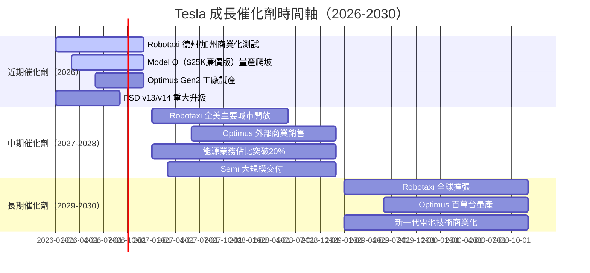

---

### 8.2 TAM 市場規模分析

```
Tesla 潛在市場規模（TAM）分析
━━━━━━━━━━━━━━━━━━━━━━━━━━━━━━━━━━━━━━━━━━━━━━━━━━━━━━━━━━━━━━━━

市場機會           預估TAM(2030)   Tesla當前滲透率   成長潛力
━━━━━━━━━━━━━━━━━━━━━━━━━━━━━━━━━━━━━━━━━━━━━━━━━━━━━━━━━━━━━━━━
全球EV汽車市場    $2,000B         ~3.0%            ████░░░░░░  中
Robotaxi服務      $1,000B+        ~0.1%            ████████░░  極高
能源儲存系統      $600B           ~2.5%            ██████░░░░  高
人形機器人        $500B+          ~0%              █████████░  最高
FSD軟體訂閱       $300B           ~2%              ███████░░░  高
保險/金融服務     $200B           ~0.5%            █████░░░░░  中高
━━━━━━━━━━━━━━━━━━━━━━━━━━━━━━━━━━━━━━━━━━━━━━━━━━━━━━━━━━━━━━━━
合計潛在TAM:    ~$4,600B+
當前收入:         $94.83B（僅佔合計TAM的2.1%）

📊 若Tesla在上述每個領域僅達到5-10%市場份額，
   潛在收入可達$230B-$460B，支撐高估值的理論基礎
━━━━━━━━━━━━━━━━━━━━━━━━━━━━━━━━━━━━━━━━━━━━━━━━━━━━━━━━━━━━━━━━
```

---

### 8.3 短/中/長期成長驅動力

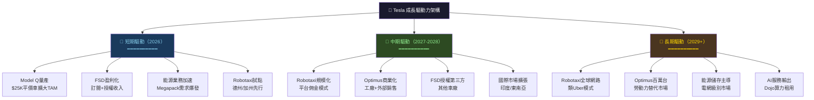

---

## 9. 風險矩陣

### 9.1 風險評分矩陣

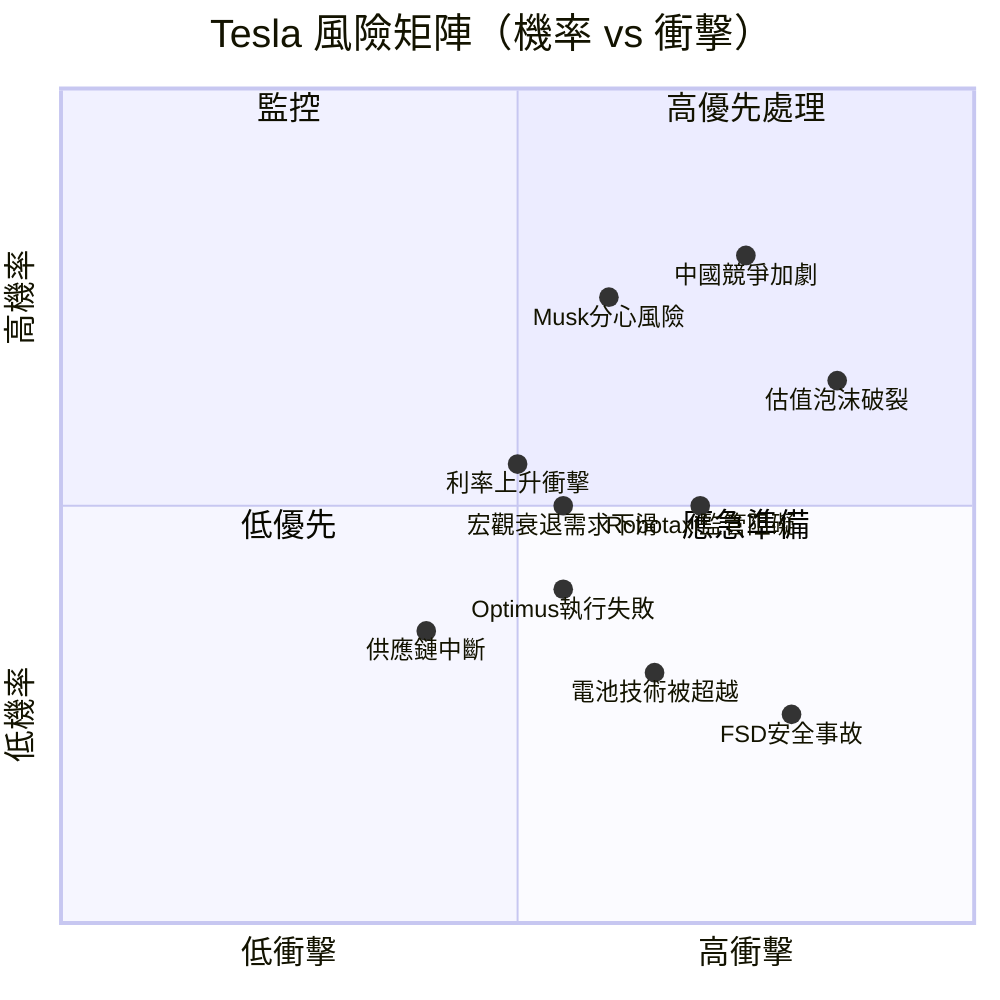

---

### 9.2 風險清單詳細表格

| 風險項目 | 機率 | 衝擊 | 綜合評分 | 緩解措施 |
|---------|------|------|---------|---------|
| 🔴 **估值泡沫破裂** | 高(65%) | 極高 | **9/10** | 等待更低估值切入；設置嚴格停損 |
| 🔴 **中國EV競爭加劇（BYD等）** | 極高(80%) | 高 | **9/10** | 監控全球市占數據；FSD差異化 |
| 🔴 **Musk 注意力分散（DOGE/xAI/SpaceX）** | 高(75%) | 高 | **8/10** | 觀察CEO時間分配及執行效率 |
| 🟡 **Robotaxi 監管風險** | 中(50%) | 高 | **7/10** | 多市場布局；遊說策略分散 |
| 🟡 **宏觀衰退 → EV需求下滑** | 中(50%) | 中 | **6/10** | 廉價Model Q對沖；能源業務緩衝 |
| 🟡 **利率長期高企壓縮高倍估值** | 中(55%) | 中 | **6/10** | 降息預期改善；FCF增長支撐 |
| 🟡 **FSD重大安全事故** | 低(25%) | 極高 | **7/10** | 冗餘安全系統；漸進式發布 |
| 🟡 **Optimus執行力不足** | 中(40%) | 中 | **5/10** | 先部署自家工廠降低外部壓力 |
| 🟢 **電池技術被競爭者超越** | 低(30%) | 中 | **4/10** | 持續R&D投入；多技術路線並行 |
| 🟢 **供應鏈中斷** | 低(35%) | 中 | **4/10** | 全球多點製造；關鍵材料庫存 |

---

## 10. 投資建議

### 10.1 最終綜合評分雷達圖

```
Tesla 多維評分雷達圖（各維度1-10分）
━━━━━━━━━━━━━━━━━━━━━━━━━━━━━━━━━━━━━━━━━━━━━━━━━━━━━━━

維度                 評分    視覺化條             評析
━━━━━━━━━━━━━━━━━━━━━━━━━━━━━━━━━━━━━━━━━━━━━━━━━━━━━━━

基本面品質          5.5/10  ▓▓▓▓▓▓░░░░  獲利惡化但財務穩健
成長動能            4.5/10  ▓▓▓▓▓░░░░░  收入停滯，盈利崩跌
獲利能力            4.0/10  ▓▓▓▓░░░░░░  ROE/ROIC大幅惡化
財務健康度          7.5/10  ▓▓▓▓▓▓▓▓░░  強大現金+低槓桿
估值合理性          2.5/10  ▓▓▓░░░░░░░  P/E 377x嚴重高估
護城河強度          6.5/10  ▓▓▓▓▓▓▓░░░  FSD/數據/充電網
管理層執行力        5.0/10  ▓▓▓▓▓░░░░░  Musk分心風險
未來成長期權        8.0/10  ▓▓▓▓▓▓▓▓░░  Robotaxi/Optimus潛力
風險管理            4.5/10  ▓▓▓▓▓░░░░░  多重高風險并存
產業趨勢            7.0/10  ▓▓▓▓▓▓▓░░░  EV長期趨勢確定

━━━━━━━━━━━━━━━━━━━━━━━━━━━━━━━━━━━━━━━━━━━━━━━━━━━━━━━
加權綜合評分：       5.5 / 10
━━━━━━━━━━━━━━━━━━━━━━━━━━━━━━━━━━━━━━━━━━━━━━━━━━━━━━━
```

---

### 10.2 目標價與隱含報酬率

| 情境 | 目標價 | 隱含報酬（vs $399.79） | 主要假設 |
|------|--------|----------------------|---------|
| 🐂 **樂觀** | **$540** | **+35.1%** | Robotaxi 2026年規模商業化；Optimus 2027年外銷；FSD授權成功 |
| 📊 **基準** | **$310** | **-22.5%** | 汽車業務緩慢復甦；能源業務保持高速；Robotaxi延遲1-2年 |
| 🐻 **悲觀** | **$180** | **-55.0%** | 估值倍數回歸合理；汽車市占繼續流失；Robotaxi監管受阻 |

```
目標價對應P/E（以Forward EPS $2.80計算）：
━━━━━━━━━━━━━━━━━━━━━━━━━━━━━━━━━━━━━━━━━
樂觀 $540 ÷ $2.80 = Forward P/E 193x  （仍高度偏高）
基準 $310 ÷ $2.80 = Forward P/E 111x  （中度偏高）
悲觀 $180 ÷ $2.80 = Forward P/E  64x  （相對合理但仍有溢價）
當前 $399 ÷ $2.80 = Forward P/E 143x  ← 當前位置

分析師共識：均值 $421.73，Range: $125-$600
```

---

### 10.3 買入時機與觸發因素

**等待以下信號才考慮增持：**

- [ ] 📉 **估值回調**：股價跌至 $280-$320 區間，提供更好安全邊際
- [ ] 🚗 **毛利率改善**：連續兩季毛利率回升至 20%+，確認定價能力回歸
- [ ] 🤖 **Robotaxi 里程碑**：商業化服務每季收入達 $500M+ 的可驗證里程碑
- [ ] 📊 **EPS 超預期**：連續兩季 EPS 超越市場預期 10%+
- [ ] 🚀 **Optimus 量產確認**：Optimus 季度交付量突破 10,000 台
- [ ] 📈 **能源業務佔比提升**：能源分部毛利率穩定超越汽車分部
- [ ] 🌏 **新興市場突破**：印度/東南亞市場正式量產出貨，新增100萬台潛在市場

**建議分批進場策略：**

```
建議分批買入計畫（若看好長期）：
━━━━━━━━━━━━━━━━━━━━━━━━━━━━━━━━━━━━━━━━
第1批（20%倉位）：$310-$330  等待基準DCF支撐位
第2批（30%倉位）：$260-$280  重要技術支撐區間
第3批（50%倉位）：$200-$220  悲觀DCF支撐+超賣
━━━━━━━━━━━━━━━━━━━━━━━━━━━━━━━━━━━━━━━━
當前 $399 位置：不建議新建倉
```

---

### 10.4 投資人適配度

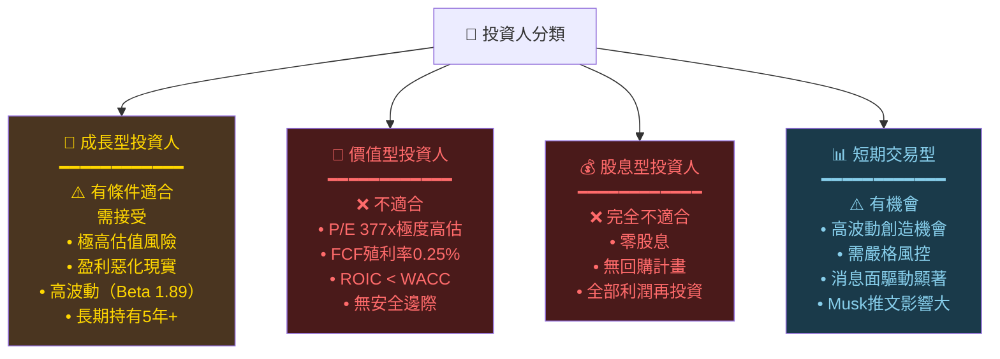

---

### 10.5 關鍵監控指標

**下次財報（2026 Q1，預計4月下旬）需重點關注：**

- [ ] 🎯 **汽車毛利率**：需回升至 ≥18.5%，觀察降價幅度是否收窄
- [ ] 🚗 **整車交付量**：Q1 2026 交付量目標 vs 市場預期，尤其 Cybertruck/Model Q
- [ ] 💰 **自由現金流**：確認 FCF 改善趨勢持續，目標季度 $2B+
- [ ] 🤖 **Robotaxi 進度**：德州 Austin 商業化時間表更新
- [ ] 🦾 **Optimus 里程碑**：工廠部署數量及外部訂單進展
- [ ] ⚡ **能源業務**：Megapack 出貨量及毛利率（目標 >25%）
- [ ] 📊 **R&D 效率**：R&D 支出是否出現降速或具體成果落地

**持續追蹤產業數據：**

- [ ] 📈 **月度EV銷售數據**：中國乘聯會/美國EV市場份額變化
- [ ] 🏭 **Gigafactory產能利用率**：德州/柏林工廠爬坡進展
- [ ] 🌍 **BYD競爭動態**：全球EV市占率對比
- [ ] 📜 **FSD法規進展**：NHTSA/歐盟自動駕駛監管動態
- [ ] 💵 **宏觀環境**：Fed利率決策及其對高估值成長股的衝擊

---

```
╔══════════════════════════════════════════════════════════════════╗
║                    📋 報告摘要結論                                ║
╠══════════════════════════════════════════════════════════════════╣
║                                                                  ║
║  評級：⚖️  持有/觀望（HOLD/WATCH）                               ║
║  當前股價：$399.79                                                ║
║  基準目標價：$310（下行風險 -22.5%）                              ║
║  樂觀目標價：$540（上行空間 +35.1%）                              ║
║                                                                  ║
║  核心矛盾：                                                       ║
║  Tesla 是一家「令人興奮的未來科技公司」被裝在                       ║
║  「今天平凡汽車公司財務數字」的殼裡。                               ║
║                                                                  ║
║  🔴 今天的Tesla（汽車業務）：                                     ║
║     • 收入萎縮 -3%，盈利暴跌 -61%                                ║
║     • 毛利率從峰值25.6%跌至18.0%                                 ║
║     • ROIC(5%) < WACC(13%)，正在摧毀股東價值                     ║
║     • P/E 377x 嚴重高估                                          ║
║                                                                  ║
║  🟢 明天的Tesla（AI/Robot業務期權）：                              ║
║     • FSD/Robotaxi 潛力巨大，TAM超$1T                           ║
║     • Optimus 機器人可能改變人類勞動市場                           ║
║     • 能源業務高速成長且利潤率更高                                 ║
║     • 強大現金儲備$44B提供充足緩衝                                 ║
║                                                                  ║
║  💡 投資哲學選擇：                                                ║
║     你是在支付期權費，賭Tesla完成從汽車商到                         ║
║     AI/Robot公司的蛻變。此期權費用在$399時                        ║
║     明顯過貴，在$280-$310時較為合理。                              ║
║                                                                  ║
╚══════════════════════════════════════════════════════════════════╝
```

---

> ⚠️ **免責聲明**：本報告為 AI 自動生成之研究分析，所有財務數據來自所提供的數據包，估算數字（如ROIC、資產結構拆分）為基於公開信息之合理推算。本報告**僅供學術研究與資訊參考用途，不構成任何投資建議**。投資涉及風險，過去表現不代表未來結果。投資者應自行進行盡職調查，必要時諮詢持牌投資顧問。**AI分析師不對