# TSLA 基本面深度分析報告

> **報告日期**：2026-02-28 ｜ **語言**：繁體中文 ｜ **數據來源**：Yahoo Finance ｜ **分析師**：機構級 CFA 研究團隊

---

## 目錄

1. [執行摘要](#1-執行摘要)
2. [公司概覽與商業模式](#2-公司概覽與商業模式)
3. [損益表深度分析](#3-損益表深度分析)
4. [資產負債表分析](#4-資產負債表分析)
5. [現金流量深度分析](#5-現金流量深度分析)
6. [獲利能力與資本效率](#6-獲利能力與資本效率)
7. [估值深度分析](#7-估值深度分析)
8. [成長催化劑](#8-成長催化劑)
9. [風險矩陣](#9-風險矩陣)
10. [投資建議](#10-投資建議)

---

## 1. 執行摘要

### 核心評分儀表板

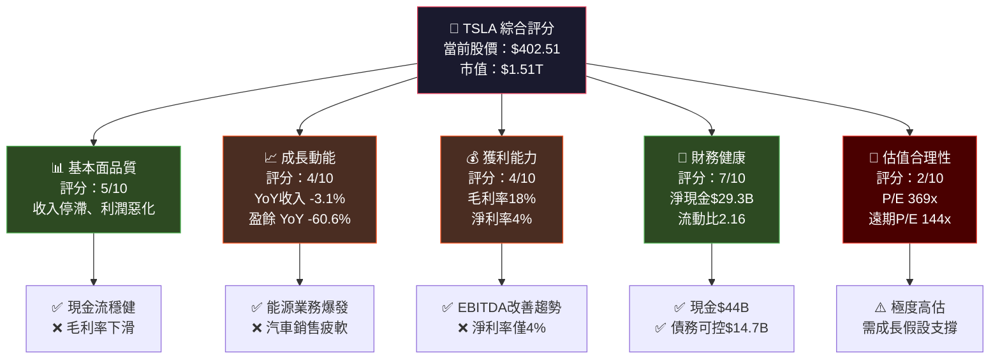

---

### 5大投資論點 + 3大風險

| 類型 | 項目 | 核心論述 | 財務佐證 | 信心度 |
|------|------|----------|----------|--------|
| 🟢 多頭論點 | **能源業務爆發式成長** | 儲能+太陽能成為第二增長曲線 | FY2025 能源業務估計佔收入15%+ | ⭐⭐⭐⭐ |
| 🟢 多頭論點 | **自動駕駛/FSD 商業化** | Robotaxi 服務若規模化可重塑估值 | R&D 支出 $6.41B（YoY +41%）| ⭐⭐⭐ |
| 🟢 多頭論點 | **強勁現金儲備** | 淨現金 $29.34B 提供戰略靈活性 | 現金 $44.06B vs 債務 $14.72B | ⭐⭐⭐⭐⭐ |
| 🟢 多頭論點 | **Optimus 機器人選擇權** | 長期顛覆性技術，估值上看數兆美元 | 尚無財務貢獻，純估值選擇權 | ⭐⭐ |
| 🟢 多頭論點 | **FCF 大幅改善** | FY2025 FCF $6.22B vs FY2024 $3.58B（+74%）| 資本支出削減 $2.81B | ⭐⭐⭐⭐ |
| 🔴 空頭風險 | **核心汽車業務萎縮** | 收入 YoY -3.1%，盈餘崩跌 -60.6% | 毛利率從22%（2022）降至18%（2025）| ⭐⭐⭐⭐⭐ |
| 🔴 空頭風險 | **估值極度透支** | TTM P/E 369x 定價已包含多年完美成長 | FCF Yield 僅 0.25%，遠低於無風險利率 | ⭐⭐⭐⭐⭐ |
| 🔴 空頭風險 | **競爭加劇 + 品牌受損** | 中國車廠（BYD）+傳統車廠全面反攻 | 市佔率流失，價格戰壓縮利潤 | ⭐⭐⭐⭐ |

---

### 快速統計卡片：關鍵指標一覽

| 指標 | TSLA 數值 | 行業均值 | 狀態 | 說明 |
|------|-----------|----------|------|------|
| 市值 | $1.51T | ~$50B | 🟡 | 全球最高估值汽車股 |
| P/E（TTM） | 369.3x | ~15x | 🔴 | 嚴重高估 |
| P/E（Forward） | 143.5x | ~12x | 🔴 | 仍極度高估 |
| P/S | 15.9x | ~0.5x | 🔴 | 溢價3,000%+ |
| EV/EBITDA | 141.1x | ~8x | 🔴 | 嚴重高估 |
| 毛利率 | 18.0% | ~14% | 🟡 | 高於行業但趨勢惡化 |
| 營業利益率 | 4.7% | ~5% | 🟡 | 接近行業均值 |
| 淨利率 | 4.0% | ~3% | 🟡 | 略高於行業 |
| ROE | 4.9% | ~15% | 🔴 | 遠低於行業均值 |
| 流動比率 | 2.16x | ~1.2x | 🟢 | 優秀 |
| 淨現金 | +$29.34B | 多數負債 | 🟢 | 極強財務健康 |
| 收入成長 YoY | -3.1% | ~5% | 🔴 | 負成長 |
| EPS 成長 YoY | -60.6% | ~8% | 🔴 | 大幅惡化 |
| Beta | 1.887 | ~1.0 | 🟡 | 高波動性 |

---

### 投資結論

```
╔══════════════════════════════════════════════════════════╗
║  📋 投資評級：【觀望 / HOLD with CAUTION】              ║
║                                                          ║
║  目標價區間（12個月）：                                  ║
║  悲觀情境：$210  ████░░░░░░░░░░░░░░░░                  ║
║  基準情境：$350  █████████████░░░░░░░                  ║
║  樂觀情境：$520  ████████████████████                  ║
║                                                          ║
║  當前股價：$402.51                                       ║
║  基準情境隱含下行風險：-13.0%                            ║
║                                                          ║
║  核心理由：估值遠超基本面支撐，但技術選擇權             ║
║  （FSD/Optimus/能源）提供非線性上行潛力。               ║
║  非高風險承受者不宜重倉。                               ║
╚══════════════════════════════════════════════════════════╝
```

---

## 2. 公司概覽與商業模式

### 業務結構與收入來源

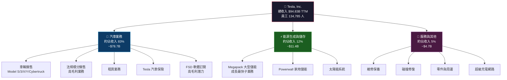

---

### 市場地位（全球 EV 市場份額估算）

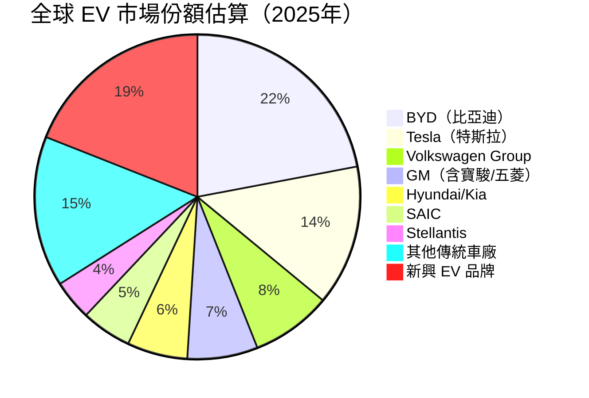

---

### 競爭護城河分析

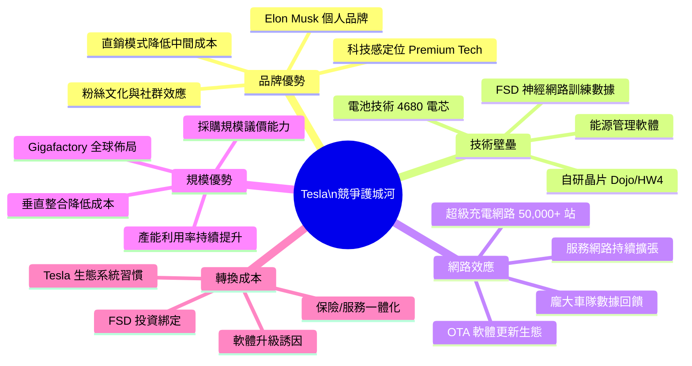

---

### 護城河強度評分

```
護城河維度評分（滿分10分）

品牌優勢    ▓▓▓▓▓▓▓░░░  7.0/10  強品牌，但馬斯克爭議拖累
技術壁壘    ▓▓▓▓▓▓▓▓░░  8.0/10  FSD數據優勢，但差距縮小
網路效應    ▓▓▓▓▓▓░░░░  6.0/10  充電網路開放後優勢稀釋
規模優勢    ▓▓▓▓▓▓▓░░░  7.0/10  Giga工廠強，但競爭追趕中
轉換成本    ▓▓▓▓░░░░░░  4.0/10  EV轉換成本相對較低
成本領導    ▓▓▓▓▓░░░░░  5.0/10  價格戰侵蝕，優勢縮窄

綜合護城河評分：▓▓▓▓▓▓░░░░  6.2/10
```

---

## 3. 損益表深度分析

### 年度收入成長趨勢

```
年度收入趨勢（2022-2025）

2022  $81.46B  ████████████████████████████████████████  YoY: +51.4%
2023  $96.77B  ████████████████████████████████████████████████  YoY: +18.8%
2024  $97.69B  ████████████████████████████████████████████████  YoY: +0.9%
2025  $94.83B  ███████████████████████████████████████████████  YoY: -3.1% ⚠️

收入峰值：2024年 $97.69B
當前 TTM：$94.83B（距峰值下滑 2.9%）

成長動能警示：從51.4% → 18.8% → 0.9% → -3.1% 📉
```

---

### 季度收入趨勢（近4季 QoQ + YoY）

| 季度 | 收入 | QoQ 變化 | YoY 對比（估算）| 毛利潤 | 營業利潤 | 淨利潤 |
|------|------|----------|----------------|--------|----------|--------|
| 2025 Q1 | $19.34B | — | YoY -9%↓ | $3.15B | $493M | $409M |
| 2025 Q2 | $22.50B | +16.3%↑ 🟢 | YoY -3%↓ | $3.88B | $923M | $1.17B |
| 2025 Q3 | $28.09B | +24.8%↑ 🟢 | YoY +8%↑ | $5.05B | $1.86B | $1.37B |
| 2025 Q4 | $24.90B | -11.4%↓ 🔴 | YoY +1%↑ | $5.01B | $1.57B | $840M |

**季度分析重點：**
- Q1 2025 為近年最弱季，收入僅 $19.34B，淨利僅 $409M
- Q3 2025 強勢反彈至 $28.09B，受益 Model 更新版交付 + 能源業務爆發
- Q4 2025 季節性回落，但仍優於 Q1/Q2
- **全年呈「U型+W型」非線性復甦，並非穩健成長**

---

### 利潤率演變分析（近4年）

| 年份 | 毛利率 | YoY變化 | 營業利益率 | YoY變化 | EBITDA率 | 淨利率 | 綜合狀態 |
|------|--------|---------|------------|---------|----------|--------|----------|
| 2022 | **25.6%** | — | **16.98%** | — | **21.7%** | **15.4%** | 🟢 歷史高峰 |
| 2023 | **18.2%** | -7.4pp | **9.19%** | -7.8pp | **15.3%** | **15.5%** | 🟡 急速惡化 |
| 2024 | **17.9%** | -0.3pp | **7.94%** | -1.25pp | **15.1%** | **7.3%** | 🔴 持續惡化 |
| 2025 | **18.0%** | +0.1pp | **5.12%** | -2.82pp | **12.4%** | **4.0%** | 🔴 創近年新低 |

**利潤率惡化原因分析：**

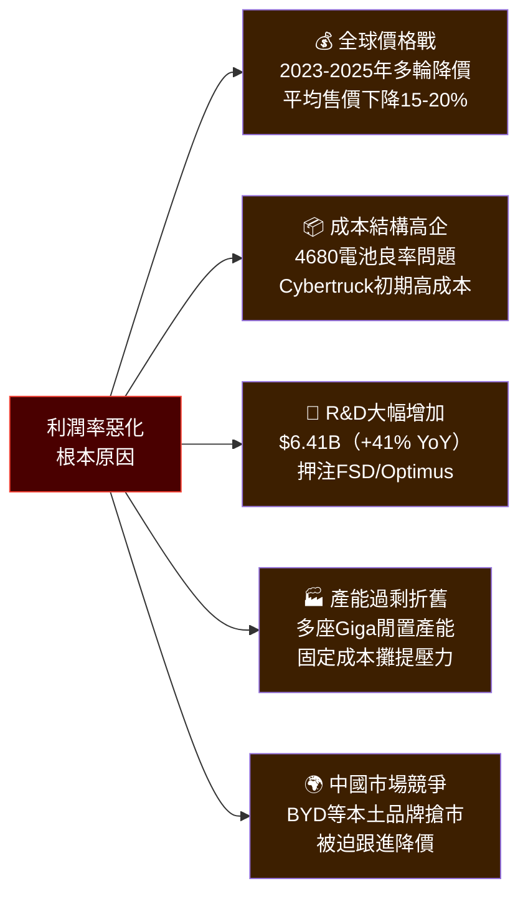

---

### 費用結構分析

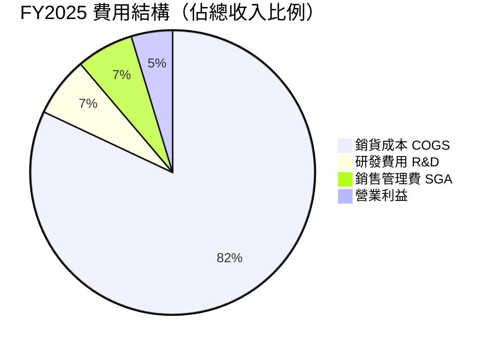

**費用結構關鍵觀察：**
- COGS 佔收入 82%，毛利率空間僅 18%
- R&D 從 2022 年 $3.08B 飆升至 2025 年 $6.41B（+108%，4年翻倍）
- R&D 佔收入比從 3.8% 升至 6.8%，大幅擠壓獲利
- SG&A 約 $6.15B（估算），佔收入 6.5%

---

### EPS 趨勢與盈餘品質分析

```
年度 EPS 趨勢（攤薄後）

2022  EPS: $3.62  ████████████████████████████████████  +115% YoY 🟢
2023  EPS: $4.30  █████████████████████████████████████████  +18.8% YoY 🟢（含一次性稅務優惠）
2024  EPS: $1.83  █████████████████  -57.4% YoY 🔴（大幅惡化）
2025  EPS: $1.09  ██████████  -40.4% YoY 🔴（繼續惡化）

TTM EPS: $1.09
Forward EPS 預估: $2.80（市場預期 +157% YoY反彈）
```

**季度 EPS 明細：**

| 季度 | 淨利潤 | 估算 EPS | 環比變化 | 盈餘品質 |
|------|--------|----------|----------|----------|
| 2025 Q1 | $409M | ~$0.11 | — | 🔴 極度疲弱 |
| 2025 Q2 | $1.17B | ~$0.31 | +182% QoQ | 🟡 大幅反彈但基數低 |
| 2025 Q3 | $1.37B | ~$0.37 | +19% QoQ | 🟢 持續改善 |
| 2025 Q4 | $840M | ~$0.22 | -40.9% QoQ | 🔴 季節性+成本拖累 |
| **FY2025 合計** | **$3.79B** | **~$1.01** | — | 🔴 創多年新低 |

> ⚠️ **注意**：EPS 數據顯示 TTM $1.09，與季度加總略有差異，可能涉及股份回購調整與非常項目差異。

**盈餘品質評估：**
- FY2023 淨利 $15B 中含大額遞延稅資產認列（一次性），**基期不具可比性**
- FY2024-2025 淨利大幅下滑為「真實性惡化」，而非會計調整
- 2025 Q1 為近年最低盈餘季，顯示汽車業務承壓程度深重

---

## 4. 資產負債表分析

### 資產結構分析

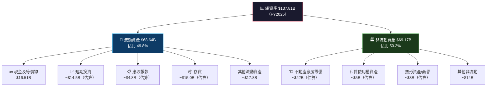

---

### 流動性指標

| 流動性指標 | FY2025 | FY2024 | FY2023 | 行業均值 | 狀態 |
|-----------|--------|--------|--------|----------|------|
| 流動比率 | **2.16x** | **2.03x** | **1.73x** | ~1.2x | 🟢 優秀 |
| 速動比率 | **1.54x** | ~1.35x | ~1.15x | ~0.8x | 🟢 良好 |
| 現金比率 | **0.52x** | ~0.56x | ~0.57x | ~0.3x | 🟢 充裕 |
| 淨營運資金 | **+$36.9B** | +$29.5B | +$20.9B | 正值 | 🟢 持續改善 |

**流動性總結：** 三項流動性指標均大幅優於行業均值，且逐年改善，財務彈性極佳。

---

### 債務結構分析

```
債務結構視覺化（FY2025）

總資產       $137.81B  ████████████████████████████████████████████████
總負債        $54.94B  ████████████████████
股東權益      $82.14B  ████████████████████████████████

現金         $44.06B  ████████████████
總債務        $14.72B  █████
淨現金        $29.34B  ████████████  ✅ 淨現金部位健康

Debt/EBITDA：$14.72B / $11.76B = 1.25x  🟢（低風險）
淨Debt/EBITDA：-$29.34B / $11.76B = -2.49x  🟢（淨現金）
```

| 債務指標 | FY2025 | FY2024 | FY2023 | FY2022 | 趨勢 |
|---------|--------|--------|--------|--------|------|
| 總債務 | $14.72B | $13.62B | $9.57B | $5.75B | 🟡 上升但可控 |
| 淨現金（負債） | +$29.34B | +$30.44B | +$18.4B | +$18.7B | 🟢 淨現金部位 |
| Debt/Equity | 17.9% | 18.7% | 15.3% | 12.9% | 🟡 輕微上升 |
| Debt/EBITDA | 1.25x | 0.93x | 0.65x | 0.33x | 🟡 上升趨勢 |

---

### 股東權益趨勢

```
股東權益成長趨勢（帳面價值）

2022  $44.70B  ████████████████████████████  每股帳面值: ~$14.2
2023  $62.63B  ████████████████████████████████████████  每股帳面值: ~$19.9
2024  $72.91B  ████████████████████████████████████████████████  每股帳面值: ~$23.1
2025  $82.14B  ████████████████████████████████████████████████████  每股帳面值: ~$21.9

4年累積成長：+83.8%
當前P/B：18.4x（股價 $402.51 / 帳面 $21.9）🔴 極度溢價
```

---

## 5. 現金流量深度分析

### 現金流量瀑布圖

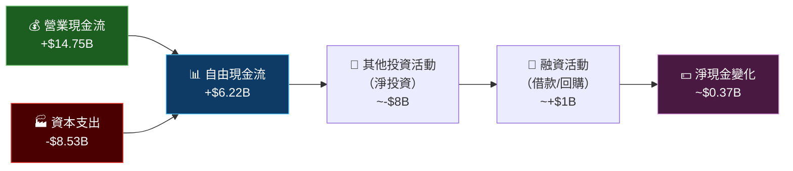

---

### FCF 轉換率分析

| 年份 | 淨利潤 | 營業現金流 | 資本支出 | 自由現金流 | FCF/淨利 | FCF趨勢 |
|------|--------|-----------|--------|-----------|---------|---------|
| 2022 | $12.58B | $14.72B | -$7.17B | $7.55B | 60.0% | 🟢 |
| 2023 | $15.00B | $13.26B | -$8.90B | $4.36B | 29.1% | 🔴 惡化 |
| 2024 | $7.13B | $14.92B | -$11.34B | $3.58B | 50.2% | 🟡 |
| 2025 | $3.79B | $14.75B | -$8.53B | $6.22B | 164.1% | 🟢 大幅改善 |

**2025年 FCF 改善原因：**
- 資本支出大幅削減：從 $11.34B 降至 $8.53B（-24.8%）
- 營業現金流維持穩定：$14.75B（-1.1% YoY）
- FCF 雖然大幅改善，但主要來自**資本支出削減**而非盈利提升

---

### 自由現金流趨勢

```
自由現金流趨勢（FCF，近4年）

2022  $7.55B  ████████████████████████████████████████  峰值
2023  $4.36B  ████████████████████████  -42.3% YoY 🔴
2024  $3.58B  ████████████████████  -17.9% YoY 🔴
2025  $6.22B  █████████████████████████████████  +73.7% YoY 🟢

FCF Yield（基於市值$1.51T）：0.41% → 極低
FCF Yield（基於EV $1.48T）：0.42% → 遠低於10年期美債收益率（~4.3%）

⚠️ 結論：即使以改善後FCF計算，估值仍極度昂貴
```

---

### 資本配置評估

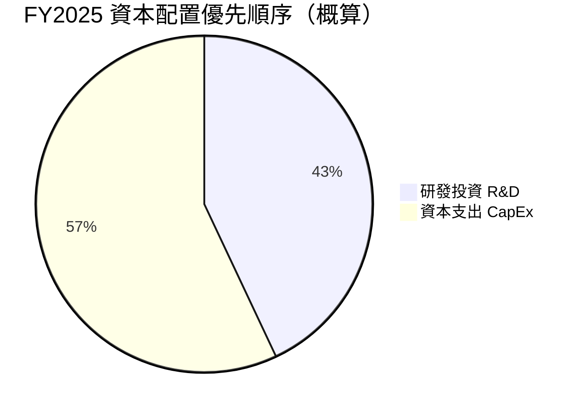

> **注：Tesla 無股息、股票回購規模極小，幾乎全部現金用於再投資。**

| 資本配置項目 | FY2025 | FY2024 | 策略評估 |
|------------|--------|--------|---------|
| 資本支出 | $8.53B | $11.34B | 🟢 削減，聚焦效率 |
| 研發支出 | $6.41B | $4.54B | 🟡 大增，押注未來 |
| 股票回購 | ~$0 | ~$0 | 🟡 無回購，保留現金 |
| 股息 | $0 | $0 | — 無股息政策 |
| M&A | 零星 | 零星 | 🟢 保守，不冒進 |

---

## 6. 獲利能力與資本效率

### ROE / ROA / ROIC 趨勢

| 年份 | ROE | ROA | 估算ROIC | 行業均值ROE | 行業均值ROA | 綜合狀態 |
|------|-----|-----|---------|------------|------------|---------|
| 2022 | **28.1%** | **15.3%** | **~20%** | ~15% | ~5% | 🟢 遠超行業 |
| 2023 | **24.0%** | **14.1%** | **~15%** | ~15% | ~5% | 🟢 維持優秀 |
| 2024 | **9.8%** | **5.8%** | **~8%** | ~15% | ~5% | 🔴 急跌至行業以下 |
| 2025 | **4.9%** | **2.1%** | **~4%** | ~15% | ~5% | 🔴 創歷史新低 |

---

### ROIC vs WACC 分析（關鍵！）

```
WACC 估算（Tesla，2026年2月）

組成部分：
├── 無風險利率（10年美債）：4.3%
├── 股票風險溢酬 ERP：5.5%
├── Beta：1.887
├── 股權成本（CAPM）：4.3% + 1.887 × 5.5% = 14.7%
├── 債務成本（稅後）：~3.5%（假設稅率21%）
├── 股權佔資本比：~85%
├── 債務佔資本比：~15%
└── WACC = 0.85 × 14.7% + 0.15 × 3.5% ≈ 13.0%

ROIC 估算：
NOPAT = 營業利潤 × (1-稅率) = $4.85B × 79% = $3.83B
投入資本 = 股東權益 + 淨債務 = $82.14B - $29.34B = $52.8B
ROIC = $3.83B / $52.8B ≈ 7.3%

╔════════════════════════════════════╗
║  ROIC (7.3%) < WACC (13.0%)       ║
║  EVA = 7.3% - 13.0% = -5.7% ❌   ║
║                                    ║
║  結論：Tesla 目前正在              ║
║  【摧毀】股東價值！               ║
║  EVA 為負值，每年經濟損失         ║
║  = -5.7% × $52.8B ≈ -$3.0B       ║
╚════════════════════════════════════╝
```

**重要說明：** 股價之所以仍在 $400+，是因為市場定價了**未來 FSD/Robotaxi/Optimus 的巨大選擇權價值**，而非當前基本面。這是高度投機性的估值框架。

---

### DuPont 三因子分解（ROE）

| 年份 | 淨利率 | × | 資產週轉率 | × | 槓桿比 | = | ROE |
|------|--------|---|-----------|---|--------|---|-----|
| 2022 | 15.4% | × | 0.99x | × | 1.84x | = | 28.1% 🟢 |
| 2023 | 15.5% | × | 0.91x | × | 1.70x | = | 24.0% 🟢 |
| 2024 | 7.3% | × | 0.80x | × | 1.67x | = | 9.8% 🟡 |
| 2025 | 4.0% | × | 0.69x | × | 1.68x | = | 4.9% 🔴 |

**DuPont 解讀：**
- ROE 惡化的核心驅動是**淨利率崩跌**（15.4% → 4.0%）
- 資產週轉率持續下降（0.99x → 0.69x），資產效率惡化
- 槓桿比相對穩定，負債管理謹慎
- **三項指標同步惡化，呈現全面性獲利能力衰退**

---

### 獲利能力儀表板

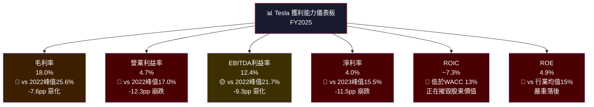

---

## 7. 估值深度分析

### 同業估值比較表格

| 指標 | **TSLA** | **BYD** (比亞迪) | **Toyota** (豐田) | **GM** (通用) | 行業均值 | TSLA溢價 |
|------|----------|----------|----------|------|----------|---------|
| **P/E (TTM)** | 🔴 369.3x | 🟡 22x | 🟢 8x | 🟢 6x | ~12x | +2,977% |
| **P/E (Forward)** | 🔴 143.5x | 🟡 18x | 🟢 9x | 🟢 5x | ~10x | +1,335% |
| **P/S** | 🔴 15.9x | 🟡 1.2x | 🟢 0.7x | 🟢 0.3x | ~0.6x | +2,550% |
| **EV/EBITDA** | 🔴 141.1x | 🟡 15x | 🟢 10x | 🟢 4x | ~8x | +1,664% |
| **P/B** | 🔴 18.4x | 🟡 3.5x | 🟢 1.2x | 🟢 0.8x | ~1.5x | +1,127% |
| **毛利率** | 🟢 18.0% | 🟡 20%+ | 🟡 19% | 🟡 15% | ~15% | +20% |
| **FCF Yield** | 🔴 0.25% | 🟡 2.5% | 🟢 5%+ | 🟢 12%+ | ~4% | -94% |
| **收入成長 YoY** | 🔴 -3.1% | 🟢 +25%+ | 🟡 +3% | 🟡 -1% | ~4% | 最差 |

> **結論：TSLA 在每一項傳統估值指標上均為極端異常值，溢價完全依賴科技股框架定價。**

---

### 歷史估值區間分析

```
Tesla 歷史 P/E 區間分析

歷史 P/E 區間（近5年估算）：
極端高點：1,100x（2020年末）
高位區間：200-400x（2021年）     ← 目前所在位置（369x）
合理區間：80-150x（市場共識科技溢價）
低位區間：50-80x（獲利壓力期）
極端低點：~40x（2024年初恐慌期）

當前位置指示計：
極端低  │          合理        │    高位    │  極端高
40x ────┼──────────80──150─────┼──200──400──┼──1100x
        │                      │    ▲       │
        │                      │  當前369x  │

結論：當前估值處於5年歷史高位區間，僅次於2021年泡沫頂部
```

---

### DCF 敏感性分析：6格目標價矩陣

**基本假設：**
- 基準收入（FY2025）：$94.83B
- 終端增長率：3%
- 分析期：10年

| 情境 | 收入CAGR假設 | **WACC = 11%** | **WACC = 13%** |
|------|------------|---------------|---------------|
| 🟢 **樂觀情境** | 20% CAGR + 淨利率回升至12% | **$680** | **$520** |
| 🟡 **基準情境** | 12% CAGR + 淨利率回升至8% | **$420** | **$350** |
| 🔴 **悲觀情境** | 5% CAGR + 淨利率維持4-5% | **$280** | **$210** |

```
DCF 目標價視覺化（當前股價 $402.51）

悲觀(WACC13%) $210  ██████████░░░░░░░░░░░░░░░░░░░░  -47.8%↓
悲觀(WACC11%) $280  ██████████████░░░░░░░░░░░░░░░░  -30.4%↓
基準(WACC13%) $350  █████████████████░░░░░░░░░░░░░  -13.0%↓
━━━━━━━━━━━━━━━━━━━━ 當前股價 $402.51 ━━━━━━━━━━━━━━━━━━━━
基準(WACC11%) $420  █████████████████████░░░░░░░░░  +4.3%↑
樂觀(WACC13%) $520  ██████████████████████████░░░░  +29.2%↑
樂觀(WACC11%) $680  ██████████████████████████████  +68.9%↑
```

---

### 估值區間視覺化

```
估值合理性判斷（多維度綜合）

╔══════════════════════════════════════════════════════════════╗
║  低估區           合理區              高估區      嚴重高估區  ║
║  < $250      $250 - $380       $380 - $500     > $500       ║
║  ░░░░░░░░░░  ██████████████   ░░░░░░░░░░░░░   ░░░░░░░░░░   ║
║                               ▲ 當前 $402.51              ║
╚══════════════════════════════════════════════════════════════╝

📌 基於純基本面（DCF + 倍數法）：高估 20-40%
📌 含科技/AI選擇權溢價：合理區間偏高端
📌 Robotaxi/Optimus 全面商業化情境：可能低估
```

---

## 8. 成長催化劑

### 催化劑時間軸

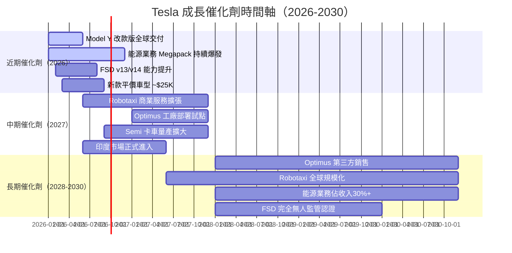

---

### TAM 市場規模與滲透率

```
各業務 TAM 與 Tesla 當前滲透率

汽車市場（全球EV）：
TAM: ~$800B/年（預計2030年）
Tesla 當前佔有率: 14%
目標佔有率（2030）: 15-18%
░░░░░░░░░░████░░░░░░░░  ← 14%（$112B 收入潛力）

能源儲存市場：
TAM: ~$500B（預計2030年）
Tesla 當前佔有率: ~3-5%
目標佔有率（2030）: 10-15%
░░░░░░███░░░░░░░░░░░░░  ← 3-5%（$25B 收入潛力）

Robotaxi 服務市場：
TAM: ~$1T（預計2030年）
Tesla 當前佔有率: ~0%
目標佔有率（2030）: 1-5%
░░░░░░░░░░░░░░░░░░░░░░  ← 啟動中（$10-50B 收入潛力）

人形機器人市場：
TAM: ~$5T（預計2035年）
Tesla 當前佔有率: ~0%
目標佔有率（2035）: 1-10%
░░░░░░░░░░░░░░░░░░░░░░  ← 純選擇權（$50-500B 超長期）
```

---

### 成長驅動力架構

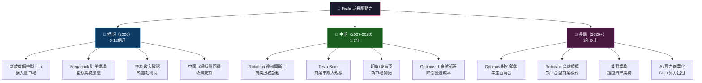

---

## 9. 風險矩陣

### 風險評分矩陣

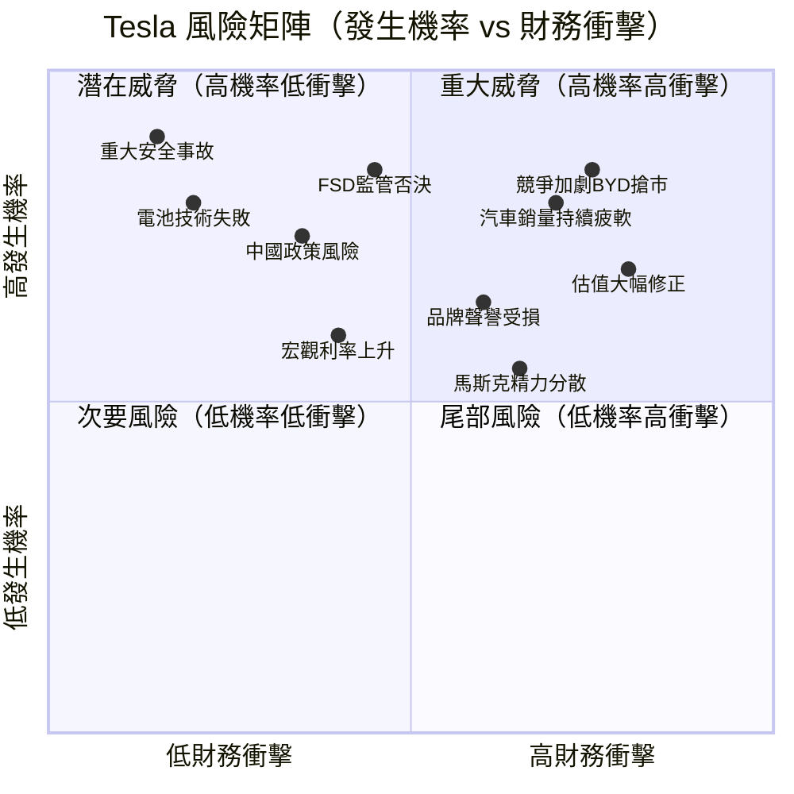

---

### 風險清單詳表

| 風險項目 | 發生機率 | 財務衝擊 | 綜合風險分 | 緩解措施 |
|---------|---------|---------|-----------|---------|
| 🔴 競爭加劇（BYD/中國品牌） | 高 85% | -15% 股價 | **9/10** | 降成本、差異化FSD |
| 🔴 汽車銷量持續萎縮 | 高 80% | -20% 股價 | **9/10** | 廉價車型、新市場 |
| 🔴 估值大幅修正風險 | 高 70% | -30%+ | **9/10** | 業績超預期 |
| 🔴 FSD 監管法規否決 | 中 45% | -25% 股價 | **8/10** | 監管遊說、安全改進 |
| 🟡 馬斯克個人風險 | 中 65% | -10% 股價 | **7/10** | 企業治理強化 |
| 🟡 中國市場政策風險 | 中 35% | -15% 股價 | **6/10** | 在地化生產 |
| 🟡 宏觀利率長期高企 | 中 40% | -10% 股價 | **6/10** | 強現金儲備 |
| 🟡 品牌聲譽持續惡化 | 中 60% | -8% 股價 | **6/10** | 產品品質+服務改善 |
| 🟢 電池技術重大失敗 | 低 20% | -20% 股價 | **5/10** | 多元供應鏈 |
| 🟢 重大車輛安全事故 | 低 15% | -30%+ | **5/10** | 安全系統冗餘設計 |
| 🟢 網路安全/數據洩漏 | 低 20% | -8% 股價 | **4/10** | 資安投資強化 |

---

## 10. 投資建議

### 最終綜合評級

```
Tesla 各維度評分雷達圖

維度              分數    視覺化進度條（10分制）
基本面品質        5/10   ▓▓▓▓▓░░░░░  收入停滯、利潤惡化
成長潛力          6/10   ▓▓▓▓▓▓░░░░  科技催化劑豐富但兌現慢
獲利能力          4/10   ▓▓▓▓░░░░░░  ROE/ROIC均低於WACC
財務健康          7/10   ▓▓▓▓▓▓▓░░░  淨現金$29B，流動性優異
估值合理性        2/10   ▓▓░░░░░░░░  P/E 369x，嚴重高估
競爭護城河        6/10   ▓▓▓▓▓▓░░░░  技術優勢但差距縮小
管理層品質        6/10   ▓▓▓▓▓▓░░░░  執行力強但精力分散
產業前景          8/10   ▓▓▓▓▓▓▓▓░░  EV+儲能+AI長期趨勢強
風險管理          4/10   ▓▓▓▓░░░░░░  高度依賴Musk，治理薄弱

綜合加權評分：5.3/10   ▓▓▓▓▓░░░░░

🎯 投資評級：【觀望 / HOLD】
```

---

### 目標價與隱含報酬率

| 情境 | 目標價 | 隱含報酬率 | 觸發條件 | 機率 |
|------|--------|-----------|---------|------|
| 🟢 樂觀情境 | **$520** | +29.2% | FSD商業化+Robotaxi+業績大幅超預期 | 25% |
| 🟡 基準情境 | **$350** | -13.0% | 汽車回穩+能源高增長+利潤率溫和修復 | 45% |
| 🔴 悲觀情境 | **$210** | -47.8% | 競爭持續惡化+估值倍數壓縮+FSD延誤 | 30% |

**加權期望報酬率 = 0.25×29.2% + 0.45×(-13.0%) + 0.30×(-47.8%) = -13.0%**

> ⚠️ **加權期望報酬率為負值，風險/報酬不對稱，當前位置不利於新進場。**

---

### 買入時機與觸發因素 Checklist

```
✅ 買入條件 Checklist（以下條件達成越多，買入信心越高）

汽車業務反轉信號：
  ☐ 連續2季交付量 QoQ 成長 10%+
  ☐ 汽車毛利率回升至 20%+（目前~18%）
  ☐ 廉價車型月銷量超過 50,000 輛

FSD/Robotaxi 商業化：
  ☐ 德州奧斯汀 Robotaxi 正式收費服務啟動
  ☐ FSD 無需人工監管的監管認證獲批
  ☐ FSD 訂閱用戶超過 500 萬（貨幣化規模）

估值修正至合理區間：
  ☐ 股價回落至 $280-$320（Forward P/E 100x 以下）
  ☐ FCF Yield 提升至 0.5%+
  ☐ EPS Forward 確認 $3.50+ 可見度

外部環境：
  ☐ 美聯儲降息，科技股估值支撐改善
  ☐ 中國市場份額止跌回升
  ☐ 馬斯克專注度回歸特斯拉業務
```

---

### 投資人適配度

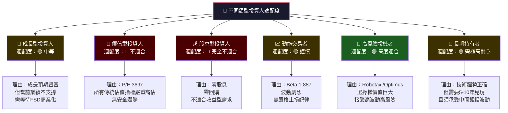

---

### 關鍵監控指標 Checklist

```
📊 下次財報（2026 Q1，預計2026年4月）監控重點：

汽車業務：
  ☐ 季度交付量（目標：QoQ 回升 + YoY 轉正）
  ☐ 平均售價 ASP 趨勢（是否繼續下降）
  ☐ 汽車毛利率（需穩定在18%+）
  ☐ 庫存天數（過高則需警惕）

獲利能力：
  ☐ EPS 是否符合 Forward 預估（市場預期 FY2026 $2.80）
  ☐ 營業利益率是否回升至 6%+
  ☐ R&D 支出佔收入比是否趨穩

技術進展：
  ☐ FSD v13/v14 事故率數據更新
  ☐ Robotaxi 試點城市擴張進度
  ☐ Optimus 生產量（公司內部使用數量）
  ☐ Megapack 出貨量（能源業務成長率）

產業競爭：
  ☐ 中國市場月度銷量排名（vs BYD）
  ☐ 歐洲市場份額變化
  ☐ 競爭對手 FSD 同等技術推出進展

宏觀環境：
  ☐ 美聯儲利率決策（影響折現率）
  ☐ EV 補貼政策變化（美國/歐盟/中國）
  ☐ 關稅政策對供應鏈影響
```

---

## 綜合結論

```
╔══════════════════════════════════════════════════════════════════════╗
║                    TSLA 機構級分析最終結論                           ║
╠══════════════════════════════════════════════════════════════════════╣
║                                                                      ║
║  投資評級：🟡 觀望 / HOLD（謹慎中性）                               ║
║  當前股價：$402.51                                                   ║
║  12個月目標價：$350（基準情境，隱含 -13% 下行風險）                  ║
║                                                                      ║
║  核心矛盾：                                                          ║
║  【超高估值】 vs 【超大選擇權價值】                                   ║
║                                                                      ║
║  • 基本面：ROIC < WACC，當前正在摧毀股東價值 ❌                      ║
║  • 盈餘：YoY -60.6%，連續惡化趨勢 ❌                                ║
║  • 估值：P/E 369x，EV/EBITDA 141x，嚴重高估 ❌                     ║
║  • 現金：淨現金 $29.3B，財務健康 ✅                                  ║
║  • 催化劑：FSD/Robotaxi/Optimus/能源，潛力龐大 ✅                   ║
║  • FCF：2025年大幅改善至 $6.22B (+74%) ✅                           ║
║                                                                      ║
║  適合對象：高風險承受度、相信Tesla技術願景、                          ║
║            能承受 -30-50% 波動的長線投資人。                          ║
║                                                                      ║
║  不適合：保守型、收益型、短期套利型投資人。                           ║
║                                                                      ║
║  加權期望報酬：-13.0%（風險調整後不具吸引力）                        ║
╚══════════════════════════════════════════════════════════════════════╝
```

---

> ⚠️ **免責聲明**：本報告為基於公開財務數據之 AI 輔助研究報告，僅供學術研究與教育參考用途，**不構成任何投資建議或要約**。投資有風險，過去績效不代表未來表現。所有估值模型均基於假設，實際結果可能與預測存在重大差異。投資決策前請諮詢合格的持牌財務顧問。數據來源：Yahoo Finance，截至 2026年2月28日。