# TSLA 基本面深度分析報告

> **報告日期**：2026-03-01 ｜ **語言**：繁體中文 ｜ **分析師**：CFA 機構級研究 ｜ **數據來源**：Yahoo Finance

---

## 目錄

1. [執行摘要](#1-執行摘要)
2. [公司概覽與商業模式](#2-公司概覽與商業模式)
3. [損益表深度分析](#3-損益表深度分析)
4. [資產負債表分析](#4-資產負債表分析)
5. [現金流量深度分析](#5-現金流量深度分析)
6. [獲利能力與資本效率](#6-獲利能力與資本效率)
7. [估值深度分析](#7-估值深度分析)
8. [成長催化劑](#8-成長催化劑)
9. [風險矩陣](#9-風險矩陣)
10. [投資建議](#10-投資建議)

---

## 1. 執行摘要

### 核心評分儀表板

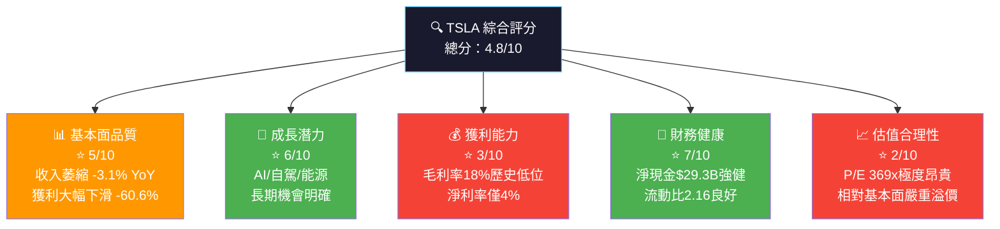

---

### 5大投資論點 × 3大核心風險

| 類型 | 項目 | 說明 | 評級 |
|------|------|------|------|
| 🟢 **投資論點1** | FSD/自動駕駛商業化 | Cybercab與RoboTaxi預計2026年量產，為全新千億美元市場 | 🟢 |
| 🟢 **投資論點2** | 能源儲存業務爆發 | Megapack/Powerwall高速成長，毛利率優於汽車業務 | 🟢 |
| 🟢 **投資論點3** | 強健資產負債表 | 淨現金$29.3B，無債務壓力，戰略靈活性高 | 🟢 |
| 🟢 **投資論點4** | AI算力垂直整合 | Dojo超算+自有AI晶片，訓練數據壁壘全球最強 | 🟢 |
| 🟡 **投資論點5** | 2026年新款車型週期 | 改款Model Y及更低價車型可能刺激交付量反彈 | 🟡 |
| 🔴 **風險1** | 估值泡沫化風險 | P/E 369x，Forward P/E 143x，任何負面消息均可引發急跌 | 🔴 |
| 🔴 **風險2** | 競爭壓力加劇 | 比亞迪全球出貨量已超越特斯拉，中國市場份額持續流失 | 🔴 |
| 🔴 **風險3** | 馬斯克管理精力分散 | 同時運營Tesla/SpaceX/xAI/X/DOGE，市場對專注度存疑 | 🔴 |

---

### 快速統計卡片：關鍵指標一覽

| 指標 | TSLA 當前值 | 行業均值 | 評級 |
|------|------------|---------|------|
| 股價 | $402.51 | — | — |
| 市值 | $1.51T | — | — |
| 本益比 (Trailing) | 369.3x | ~15x | 🔴 極度高估 |
| 本益比 (Forward) | 143.5x | ~12x | 🔴 極度高估 |
| P/S 比 | 15.93x | ~0.5x | 🔴 極度高估 |
| EV/EBITDA | 141.1x | ~8x | 🔴 極度高估 |
| 毛利率 | 18.0% | ~12-14% | 🟡 高於傳統車廠 |
| 營業利益率 | 4.7% | ~5-7% | 🟡 接近行業均值 |
| 淨利率 | 4.0% | ~3-5% | 🟡 尚可接受 |
| 收入成長 (YoY) | -3.1% | ~5-8% | 🔴 負成長 |
| 盈餘成長 (YoY) | -60.6% | +5% | 🔴 嚴重衰退 |
| ROE | 4.9% | ~15% | 🔴 遠低行業 |
| 流動比率 | 2.16x | ~1.2x | 🟢 優良 |
| 淨現金 | +$29.3B | 多為淨負債 | 🟢 強健 |
| FCF Yield | 0.25% | ~3-5% | 🔴 極低 |

---

### 🎯 投資結論

```
┌─────────────────────────────────────────────────────────┐
│                  📋 投資評級：觀望（HOLD/AVOID）            │
│                                                         │
│  目前股價：$402.51                                        │
│  目標價區間：                                             │
│    🐂 樂觀情境：$480（+19.3%）                            │
│    📊 基準情境：$310（-23.0%）                            │
│    🐻 悲觀情境：$180（-55.3%）                            │
│                                                         │
│  核心理由：基本面嚴重惡化（EPS -60.6% YoY），              │
│  而估值仍處於歷史極端水位，性價比極低。                      │
│  建議等待估值回歸或基本面改善信號。                          │
└─────────────────────────────────────────────────────────┘
```

---

## 2. 公司概覽與商業模式

### 業務結構與收入來源

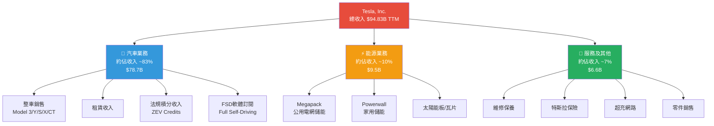

---

### 全球電動車市場份額估算

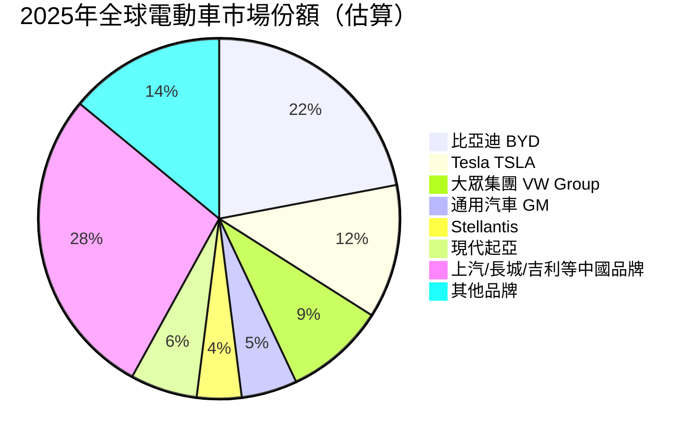

> ⚠️ **重要觀察**：Tesla在全球市場份額從2022年高峰的~19%下滑至約12%，而比亞迪持續攀升。中國市場競爭壓力是最關鍵的結構性威脅。

---

### 競爭護城河分析

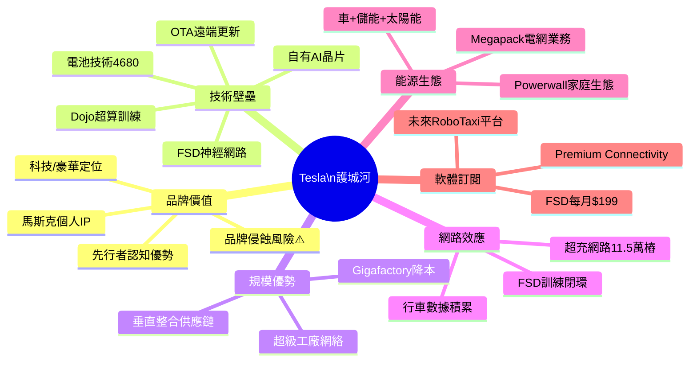

### 護城河強度評分

```
護城河維度評估（滿分10分）

軟體/AI技術   ██████████░  9/10  ★★★★★
超充網路     ████████░░░  8/10  ★★★★☆
品牌價值     ███████░░░░  7/10  ★★★★☆（下滑中）
規模製造     ██████░░░░░  6/10  ★★★☆☆
能源業務     ██████░░░░░  6/10  ★★★☆☆
成本領先     ████░░░░░░░  4/10  ★★☆☆☆（被比亞迪威脅）
定價能力     ████░░░░░░░  4/10  ★★☆☆☆（持續降價）
轉換成本     █████░░░░░░  5/10  ★★★☆☆

綜合護城河強度  ████████░░░░░░░  6/10
```

---

## 3. 損益表深度分析

### 年度收入成長趨勢（近4年）

```
年度收入趨勢（十億美元）

2022  $81.46B  ████████████████████████████████████████░  +51.4% YoY
2023  $96.77B  ████████████████████████████████████████████████  +18.8% YoY
2024  $97.69B  █████████████████████████████████████████████████  +0.95% YoY
2025  $94.83B  ███████████████████████████████████████████████   -2.93% YoY

單位：每 █ = $2B

⚠️ 成長軌跡明顯惡化：從2022年的+51%高速成長，到2025年出現-2.93%的負成長
```

| 年度 | 收入 | YoY 成長 | 評級 |
|------|------|---------|------|
| 2022 | $81.46B | +51.4% | 🟢 |
| 2023 | $96.77B | +18.8% | 🟢 |
| 2024 | $97.69B | +0.95% | 🟡 |
| 2025 | $94.83B | **-2.93%** | 🔴 |

---

### 季度收入趨勢（近4季）

| 季度 | 收入 | QoQ 成長 | YoY 成長（vs 2024） | 評級 |
|------|------|---------|------------------|------|
| 2025Q1 | $19.34B | — | -9.0% (vs 2024Q1 $21.30B) | 🔴 |
| 2025Q2 | $22.50B | +16.3% QoQ | -2.0% (vs 2024Q2 $22.96B) | 🟡 |
| 2025Q3 | $28.09B | +24.8% QoQ | +7.8% (vs 2024Q3 $26.06B) | 🟢 |
| 2025Q4 | $24.90B | -11.4% QoQ | -7.5% (vs 2024Q4 $26.88B) | 🔴 |

> 📌 **關鍵觀察**：季度收入呈現高度波動，Q3季節性強勁後Q4再度回落。全年累計收入 $94.83B 仍低於2024年 $97.69B。

---

### 利潤率演變（近4年）

| 年度 | 毛利率 | 營業利益率 | EBITDA率 | 淨利率 | 評級 |
|------|-------|-----------|---------|-------|------|
| 2022 | **25.6%** | **17.0%** | **21.7%** | **15.4%** | 🟢 歷史高峰 |
| 2023 | 18.3% | 9.2% | 15.3% | 15.5%* | 🟡 (*含一次性項目) |
| 2024 | 17.9% | 7.9% | 15.1% | 7.3% | 🟡 持續壓縮 |
| 2025 | **18.0%** | **4.7%** | **11.1%** | **4.0%** | 🔴 利潤率崩壞 |

> ⚠️ **利潤率惡化根因分析**：
> - **降價策略**：2023-2024年持續全球降價，毛利率從25.6%腰斬至18%
> - **R&D大幅增加**：2025年R&D支出 $6.41B，YoY增加 **+41.2%**（2024年$4.54B）
> - **產能利用率偏低**：Austin/Berlin工廠仍低於滿產能
> - **能源業務毛利率拉動**：能源業務毛利率約26%，但佔比仍小

---

### 費用結構分析（2025年，佔收入比）

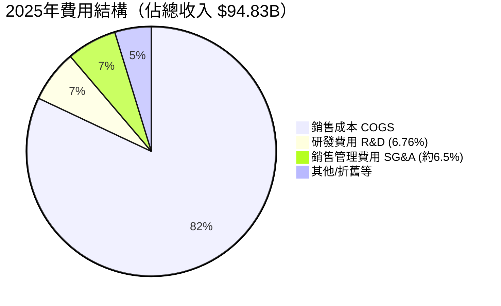

> - **COGS**：$94.83B × 82% ≈ $77.74B（毛利率18%）
> - **R&D**：$6.41B / $94.83B = **6.76%**（2022年為3.78%，研發投入比例大幅提升）
> - **R&D YoY增幅**：+$1.87B，+41.2%——主要投入AI/FSD/Dojo/Optimus

---

### EPS 趨勢與盈餘品質分析

#### 年度 EPS 趨勢

```
年度稀釋後EPS趨勢

2022  $3.62  ██████████████████████  強勁成長
2023  $4.30  ██████████████████████████  歷史高峰（含非常規項目）
2024  $1.85  ████████████  大幅下滑 -57.0% YoY
2025  $1.09  ███████  持續惡化 -41.1% YoY

EPS累計下滑：從$4.30高峰到$1.09，跌幅達 -74.7%
```

#### 季度 EPS 趨勢（2025年）

| 季度 | 淨利 | 隱含EPS（股份3.75B） | QoQ | 評級 |
|------|------|-------------------|-----|------|
| 2025Q1 | $409M | $0.109 | — | 🔴 |
| 2025Q2 | $1,170M | $0.312 | +186% QoQ | 🟢 |
| 2025Q3 | $1,370M | $0.365 | +17% QoQ | 🟢 |
| 2025Q4 | $840M | $0.224 | -38.6% QoQ | 🔴 |

> 📌 **盈餘品質分析**：Q4 2025淨利僅$840M，季度淨利率僅3.4%。由於Q1 2025僅$409M，全年盈餘高度集中在Q2/Q3，顯示獲利能力脆弱且不穩定。R&D費用暴增拖累盈利，但可視為「有益的投資」——若FSD/Optimus商業化成功，這些費用將轉化為未來獲利引擎。

> ⚠️ **EPS超預期/不及預期紀錄**：本報告數據中EPS預測對比數值不完整（N/A），無法精確計算分析師驚喜度。但根據市場知識，TSLA 2025年多季盈餘不及分析師預期。

---

## 4. 資產負債表分析

### 資產結構分解

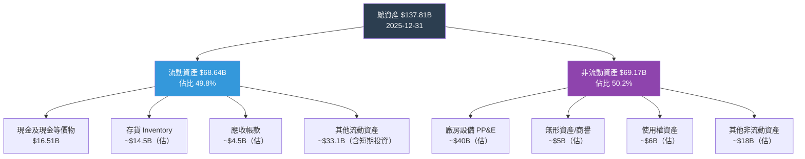

---

### 流動性指標

| 指標 | 2022 | 2023 | 2024 | 2025 | 行業均值 | 評級 |
|------|------|------|------|------|---------|------|
| 流動比率 | 1.53x | 1.73x | 2.02x | **2.16x** | ~1.1x | 🟢 |
| 速動比率 | ~1.1x | ~1.2x | ~1.4x | **1.54x** | ~0.8x | 🟢 |
| 現金比率 | — | — | — | **~0.52x** | ~0.3x | 🟢 |
| 淨現金 | — | $6.8B | $2.5B | **$29.3B** | 多為負 | 🟢 |

> 🟢 **流動性評估**：特斯拉財務健康度優異。$44.06B現金及短期投資，對比$14.72B總負債，淨現金高達$29.34B，提供強大戰略緩衝。

---

### 債務結構分析

```
債務結構（2025-12-31）

總債務        $14.72B  ██████░░░░░░░░░░░░░░  17.9% 債/資產比
股東權益      $82.14B  ████████████████████████████████████████
淨現金頭寸    $29.34B  🟢 淨現金（非淨負債）

Debt-to-EBITDA：$14.72B / $11.76B = 1.25x   ✅ 安全水位（<3x）
Debt-to-Equity：17.76%                       ✅ 低槓桿
利息覆蓋率：   $4.85B / ~$0.6B = 8.1x       ✅ 充裕

債務期限結構（估算）：
  短期（<1年）  ██████░░░░  ~$3B
  中期（1-5年） ████████░░  ~$8B
  長期（>5年）  ████░░░░░░  ~$4B
```

---

### 股東權益趨勢（帳面價值成長）

```
股東權益年度成長趨勢（十億美元）

2022  $44.70B  ████████████████████████████░░░░░░░░░
2023  $62.63B  █████████████████████████████████████████░░░░
2024  $72.91B  ██████████████████████████████████████████████████░
2025  $82.14B  ██████████████████████████████████████████████████████

每股帳面價值：$82.14B / 3.75B股 = $21.90/股
當前P/B：$402.51 / $21.90 = 18.38x   🔴 極度溢價

YoY成長：
2022→2023: +39.9%  🟢
2023→2024: +16.4%  🟢
2024→2025: +12.7%  🟡 成長放緩但持續正成長
```

---

## 5. 現金流量深度分析

### 現金流量瀑布圖

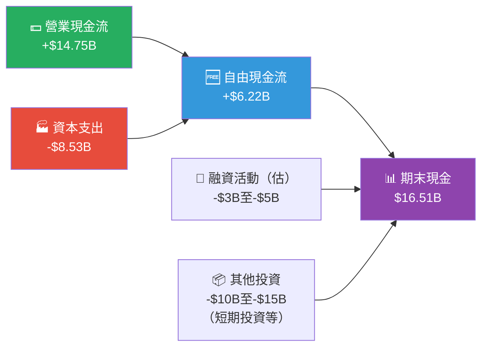

---

### FCF 轉換率趨勢

| 年度 | 淨利 | 自由現金流 | FCF/淨利 | 營業現金流 | 評級 |
|------|------|----------|---------|----------|------|
| 2022 | $12.58B | $7.55B | **60.0%** | $14.72B | 🟢 |
| 2023 | $15.00B | $4.36B | **29.1%** | $13.26B | 🟡 |
| 2024 | $7.13B | $3.58B | **50.2%** | $14.92B | 🟡 |
| 2025 | $3.79B | **$6.22B** | **164%** | $14.75B | 🟢* |

> *2025年FCF ($6.22B) 大幅高於淨利 ($3.79B)，原因：Capex大幅削減（$11.34B → $8.53B，-24.7%），非現金折舊攤提約$7B+。FCF轉換率164%顯示現金盈餘品質佳，但也反映資本支出縮減可能影響長期增長動能。

---

### 自由現金流趨勢（近4年）

```
自由現金流趨勢（十億美元）

2022  $7.55B   ███████████████████████████████████████
2023  $4.36B   ██████████████████████
2024  $3.58B   ██████████████████
2025  $6.22B   ███████████████████████████████

FCF Yield計算：
  $6.22B FCF / $1,510B 市值 = 0.41%
  （如採TTM FCF $3.73B / 市值 = 0.25%）
  
行業標準FCF Yield：3-5%
TSLA FCF Yield：0.25%~0.41%  ← 🔴 嚴重偏低
```

---

### 資本配置評估（2025年）

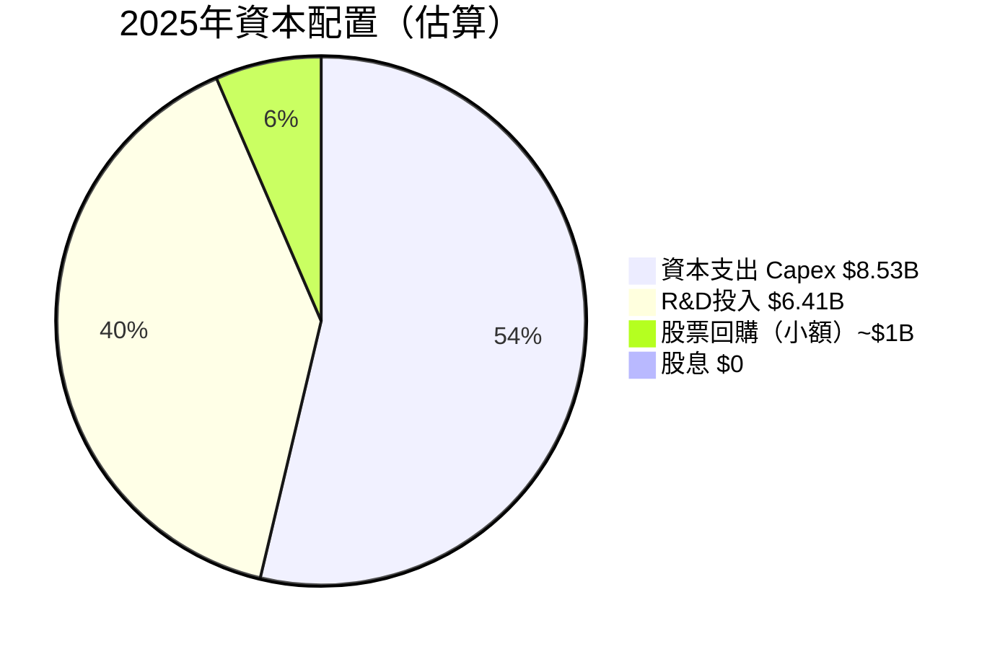

> - **無股息**：Tesla從未支付股息，不適合收益型投資人
> - **資本支出削減**：2024年$11.34B → 2025年$8.53B（-24.7%），反映謹慎策略
> - **R&D大幅增加**：+41.2% YoY，聚焦FSD/Optimus/Dojo
> - **無重大M&A**：持現策略，但$29.3B淨現金提供潛在收購彈藥

---

## 6. 獲利能力與資本效率

### ROE / ROA / ROIC 趨勢

| 年度 | ROE | ROA | ROIC（估） | 行業ROE均值 | 評級 |
|------|-----|-----|----------|-----------|------|
| 2022 | **28.1%** | **15.3%** | ~25% | ~15% | 🟢 |
| 2023 | **23.9%** | **14.1%** | ~20% | ~12% | 🟢 |
| 2024 | **9.8%** | **5.8%** | ~8% | ~10% | 🟡 |
| 2025 | **4.9%** | **2.1%** | ~4% | ~8% | 🔴 |

---

### ROIC vs WACC 分析（核心：是否創造股東價值？）

```
╔══════════════════════════════════════════════════════════╗
║              ROIC vs WACC 經濟價值分析                    ║
╠══════════════════════════════════════════════════════════╣
║                                                          ║
║  WACC 估算：                                              ║
║  ├─ 無風險利率（10Y美債）：4.5%                           ║
║  ├─ Beta：1.887                                          ║
║  ├─ 市場風險溢酬（ERP）：5.5%                             ║
║  ├─ 股權成本 = 4.5% + 1.887×5.5% = 14.88%               ║
║  ├─ 債務成本（稅後）：~3.5%                               ║
║  ├─ 權重（E=85%, D=15%）                                 ║
║  └─ WACC ≈ 14.88%×0.85 + 3.5%×0.15 ≈ 13.2%            ║
║                                                          ║
║  當前 ROIC（2025年估算）：~4.0%                           ║
║                                                          ║
║  EVA = ROIC - WACC = 4.0% - 13.2% = -9.2%              ║
║                                                          ║
║  ⚠️ 結論：TSLA 目前正在「摧毀」股東價值                    ║
║           EVA < 0，每投入$1資本，損失約$0.092             ║
║           這是2022年以來首次出現如此嚴重的負EVA            ║
║                                                          ║
║  ROIC趨勢：25% → 20% → 8% → 4%  （急遽惡化）            ║
╚══════════════════════════════════════════════════════════╝
```

> 📌 **重要說明**：若FSD/RoboTaxi/Optimus能夠成功商業化，ROIC可能在2027-2028年回升至WACC以上。目前是估值需要包含「期權價值」而非純基本面支撐的高溢價。

---

### DuPont 三因子分解（ROE = 淨利率 × 資產週轉率 × 財務槓桿）

| 年度 | 淨利率 | 資產週轉率 | 財務槓桿 | ROE |
|------|-------|----------|---------|-----|
| 2022 | 15.4% | 0.99x | 1.84x | **28.1%** 🟢 |
| 2023 | 15.5% | 0.91x | 1.70x | **23.9%** 🟢 |
| 2024 | 7.3% | 0.80x | 1.67x | **9.8%** 🟡 |
| 2025 | 4.0% | 0.69x | 1.68x | **4.9%** 🔴 |

> **ROE惡化主因診斷**：
> - 淨利率從15.4% → 4.0%（-73.5%），是ROE惡化的**主要驅動因素**
> - 資產週轉率從0.99x → 0.69x，顯示資產效率下降（投資了大量資產但收入未增）
> - 財務槓桿基本穩定，顯示Tesla維持保守的資本結構

---

### 獲利能力綜合儀表板

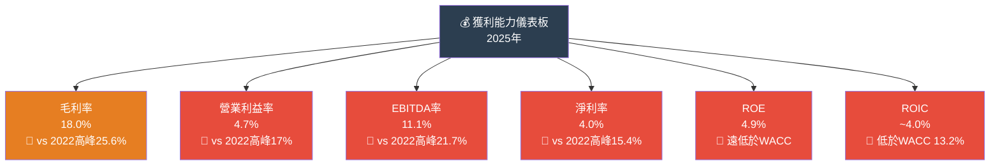

---

## 7. 估值深度分析

### 同業估值比較表格

| 指標 | **TSLA** | **BYD** (比亞迪) | **Toyota** (豐田) | **Rivian** | 評級 |
|------|---------|----------------|----------------|-----------|------|
| P/E (Trailing) | **369x** | ~22x | ~9x | 虧損 N/A | 🔴 極度高估 |
| P/E (Forward) | **143x** | ~18x | ~8x | N/A | 🔴 |
| P/S 比 | **15.9x** | ~1.0x | ~0.7x | ~3x | 🔴 |
| EV/EBITDA | **141x** | ~12x | ~10x | N/A | 🔴 |
| P/B 比 | **18.4x** | ~3.5x | ~1.1x | ~3x | 🔴 |
| 毛利率 | 18.0% | ~17% | ~18% | ~14% | 🟡 |
| 收入成長(YoY) | -3.1% | +29%+ | +5% | +40%+ | 🔴 |
| 市值 | $1.51T | ~$1.1T | ~$0.25T | ~$15B | — |
| FCF Yield | 0.25% | ~3% | ~5% | 負 | 🔴 |

> **結論**：Tesla的估值溢價是「科技公司倍數」疊加在「汽車公司基本面」上。這種估值邏輯需要FSD/RoboTaxi/Optimus在未來3-5年內產生實質收入，否則估值壓縮風險巨大。BYD在成長、估值、盈利各方面均更具吸引力。

---

### 歷史估值區間分析

```
TSLA 歷史P/E估值區間（過去5年）

極度高估區  >200x  ████████████████████████████████ ← 當前 369x 在此
歷史高位   100-200x  ████████████████████
合理溢價   50-100x   ████████████
歷史低位   25-50x    ████████
被低估區   <25x      ████

當前位置：P/E 369x ← 處於歷史極端高位
Forward P/E：143x ← 仍處歷史高位

─────────────────────────────────────────────
歷史估值錨點：
  歷史P/E 最高：~1,200x（2021年狂熱期）
  歷史P/E 平均：~150x（5年平均，剔除極值）
  歷史P/E 最低：~40x（2023年2月底部）
  當前 P/E：369x → 位於歷史70-75百分位
─────────────────────────────────────────────
```

---

### DCF 敏感性分析（目標價矩陣）

**基本假設：**
- 基準年FCF：$6.22B（2025A）
- 終端成長率：3%
- 分析期間：10年

| 情境 | FCF成長率（第1-5年）| FCF成長率（第6-10年）| 折現率(WACC) 12% | 折現率(WACC) 14% |
|------|------------------|------------------|-----------------|-----------------|
| 🐂 **樂觀**（FSD商業化成功） | 35% | 25% | **$520** | **$420** |
| 📊 **基準**（穩健回復） | 20% | 15% | **$330** | **$270** |
| 🐻 **悲觀**（競爭持續惡化）| 5% | 8% | **$195** | **$160** |

```
DCF目標價區間視覺化

悲觀區間   $160-$195  ██████░░░░░░░░░░░░░░  含義：相較當前$402下跌-51%至-61%
基準區間   $270-$330  █████████████░░░░░░░  含義：相較當前$402下跌-18%至-33%
樂觀區間   $420-$520  ████████████████████  含義：相較當前$402+4%至+29%

當前股價：$402.51
─────────────────────────────────────────────────────────
低估區（強買） | 合理區（持有） | 高估區（謹慎） | 極度高估（賣出）
   <$200       |  $200-$350    |  $350-$500   |    >$500
               
         ▲                   ▲ 當前 $402.51
                             (處於合理與高估之間的邊界)
```

---

## 8. 成長催化劑

### 催化劑時間軸

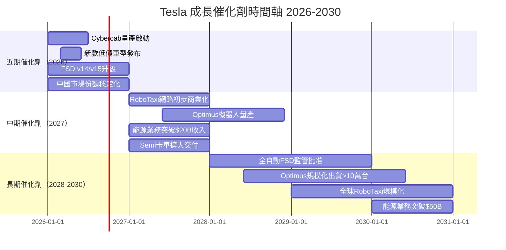

---

### TAM 市場規模估算

```
潛在市場規模（TAM）估算

汽車業務          █████████░░░░░░░░░░░░  $4T全球汽車市場
                  Tesla 2025：$94.83B，滲透率~2.4%

FSD/自動駕駛       ████████████████████  $8-10T（麥肯錫2030+估算）
（包含RoboTaxi）   Tesla目前：$2-3B/年（估），滲透率<1%

能源儲能           ██████░░░░░░░░░░░░░░  $1T+ 至2030年
                  Tesla 2025：~$9.5B，滲透率~1%

人形機器人         ██████████░░░░░░░░░░  $5-10T（高盛2035+估算）
（Optimus）       Tesla目前：0，市場處於萌芽期

AI/算力服務        ████████░░░░░░░░░░░░  $1T+ 雲端AI市場
                  Tesla：尚未商業化

核心論點：若Tesla能在FSD+RoboTaxi+Optimus三個方向
任一實現規模化，將支撐目前的高估值邏輯。
```

---

### 成長驅動力層次分析

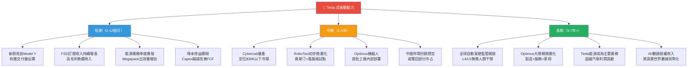

---

## 9. 風險矩陣

### 風險評估象限圖

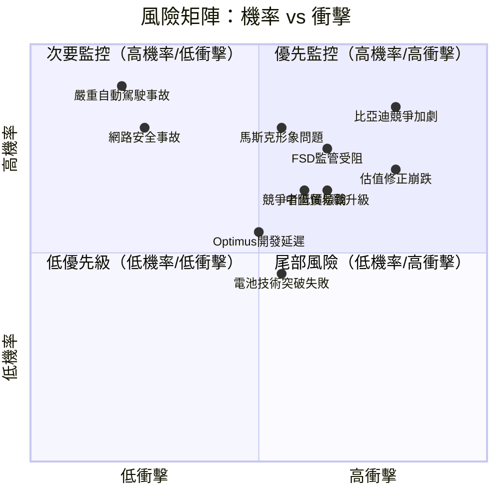

---

### 風險清單詳細表格

| 風險類別 | 具體風險 | 機率 | 衝擊 | 綜合評分 | 緩解措施 |
|---------|---------|------|------|---------|---------|
| 🔴 **估值** | P/E 369x崩潰式回歸均值 | 高 | 高 | 9/10 | 無有效緩解，純市場力量 |
| 🔴 **競爭** | BYD/中國品牌持續侵蝕全球市占 | 高 | 高 | 9/10 | 技術差異化、FSD壁壘 |
| 🔴 **執行** | FSD/RoboTaxi商業化大幅延遲 | 高 | 高 | 8/10 | 持續R&D投入 |
| 🔴 **人事** | 馬斯克注意力分散/離職風險 | 中 | 極高 | 8/10 | 管理層多元化 |
| 🟡 **監管** | 全球自動駕駛法規收緊 | 中 | 高 | 7/10 | 積極與監管溝通 |
| 🟡 **宏觀** | 利率維持高位壓縮成長股估值 | 中 | 高 | 7/10 | 自身強健資產負債表 |
| 🟡 **地緣** | 中美貿易戰升級、關稅 | 中 | 高 | 7/10 | 上海工廠本土化生產 |
| 🟡 **技術** | 電池/製造技術被競爭者追平 | 中 | 中 | 6/10 | 持續4680研發 |
| 🟡 **品牌** | 馬斯克政治言論損害品牌 | 高 | 中 | 6/10 | 無直接對策 |
| 🟢 **安全** | 重大自動駕駛安全事故 | 低 | 極高 | 5/10 | 嚴格測試、影子模式 |
| 🟢 **網安** | 車輛/工廠網路攻擊 | 低 | 高 | 4/10 | 資安投資 |

---

## 10. 投資建議

### 最終綜合評級（多維度雷達圖）

```
維度評分詳表（1-10分）

基本面品質    ████░░░░░░  4/10  收入負成長、盈餘大幅衰退
成長潛力     ██████░░░░  6/10  長期故事吸引但近期動能不足
獲利能力     ███░░░░░░░  3/10  利潤率全面惡化，ROIC<WACC
財務健康     ███████░░░  7/10  淨現金$29.3B，流動性充裕
估值合理性   ██░░░░░░░░  2/10  P/E 369x，幾乎所有指標極度高估
技術創新     ████████░░  8/10  FSD/Optimus/Dojo具開創性
市場地位     █████░░░░░  5/10  全球份額下滑，競爭加劇
管理品質     █████░░░░░  5/10  馬斯克天才但風險集中
風險控制     ████░░░░░░  4/10  高Beta 1.887，估值風險極大
資本效率     ███░░░░░░░  3/10  EVA負值，正在摧毀股東價值

═══════════════════════════════════════════
綜合加權評分   ████░░░░░░  4.7/10
═══════════════════════════════════════════
```

---

### 目標價及隱含報酬率

| 情境 | 目標價 | vs 當前 $402.51 | 時間窗口 | 主要假設 |
|------|--------|---------------|---------|---------|
| 🐂 **樂觀** | $480 | **+19.3%** | 12個月 | FSD訂閱激增+Cybercab量產順利 |
| 📊 **基準** | $310 | **-23.0%** | 12個月 | 緩慢基本面改善，估值小幅壓縮 |
| 🐻 **悲觀** | $180 | **-55.3%** | 12個月 | 估值向傳統車廠靠攏，競爭惡化 |
| 💡 **分析師共識** | $421.73 | **+4.8%** | 12個月 | 40位分析師均值 |

---

### 買入觸發因素 Checklist

```
【買入信號 — 當以下條件達成時考慮建倉/加倉】

必要條件（至少滿足2項方考慮入場）：
□ FSD真正完全自動化，獲得美國聯邦監管批准
□ Cybercab/RoboTaxi正式商業化並產生可量化收入
□ 毛利率回升至 >22%（顯示定價能力恢復）
□ 股價回落至 $250-$300 區間（Forward P/E降至60-80x）
□ 季度交付量重回50萬台以上（顯示市場需求回暖）
□ Optimus機器人開始外部銷售（打開新估值框架）
□ 中國市場份額企穩（連續2季市占不再下滑）

加分條件：
□ 馬斯克減少DOGE職務，全身心回歸Tesla
□ 分析師共識評級提升至 >50% Outperform
□ R&D投入開始轉化為可見收入（軟體收入>$5B/季）
```

---

### 投資人適配度

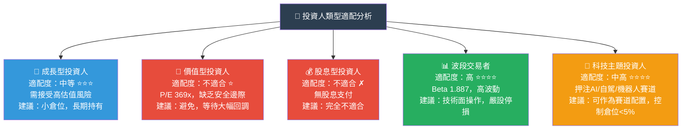

---

### 關鍵監控指標 Checklist（下次財報前後）

```
【定期監控清單】

📊 財報關鍵指標（每季追蹤）：
□ 季度汽車交付量（目標：>47萬台為達標，>55萬台為超預期）
□ 汽車毛利率（目標：>20%為改善信號，<17%為惡化警報）
□ FSD訂閱用戶數及ARPU（每用戶平均收入）
□ 能源業務收入及毛利率（目標：持續>25%毛利率）
□ R&D費用佔收入比（合理區間：5-8%）
□ 自由現金流轉換率（目標：FCF/淨利>80%）

🏭 產業數據（月度追蹤）：
□ 全球EV月銷量及Tesla市占率（特別是中國市場）
□ BYD/Rivian/GM EV交付量動態
□ 中美貿易政策及關稅變化
□ 美國/歐洲EV補貼政策

🤖 技術里程碑（持續追蹤）：
□ FSD監管進展（NHTSA、歐盟認證）
□ Cybercab量產時間表更新
□ Optimus原型機性能測試結果
□ Dojo超算算力里程碑

📈 市場情緒指標：
□ 分析師評級分佈變化（當前：Hold共識）
□ 機構持股比例變化（當前44.6%）
□ 馬斯克持股/增減持動態（當前11.2%）
□ 期權市場隱含波動率（TSLA IV vs SPY IV）
```

---

## 📊 最終總結

```
╔═══════════════════════════════════════════════════════════════╗
║                    TSLA 機構研究摘要                           ║
╠═══════════════════════════════════════════════════════════════╣
║                                                               ║
║  股票代號：TSLA         當前股價：$402.51                       ║
║  投資評級：⚖️ 觀望（Market Perform）                           ║
║  目標價格：$310（基準）/$480（樂觀）/$180（悲觀）               ║
║                                                               ║
║  核心論點摘要：                                                 ║
║  ✅ 技術護城河深厚（FSD/Dojo/Optimus），長期故事完整              ║
║  ✅ 財務健康度高（淨現金$29.3B，流動比2.16x）                   ║
║  ✅ 能源業務成為真正第二增長曲線                                 ║
║  ❌ 基本面嚴重惡化：收入-2.93%，EPS -60.6% YoY               ║
║  ❌ 估值處於極端高位：P/E 369x，EVA為負                        ║
║  ❌ 競爭格局惡化：全球市場份額持續流失給BYD                      ║
║  ❌ ROIC（~4%）遠低於WACC（~13.2%），正在摧毀股東價值           ║
║                                                               ║
║  投資哲學定位：                                                 ║
║  Tesla已從「汽車公司」轉型為「AI/能源/機器人期權」               ║
║  當前估值包含大量未實現的期權價值。                              ║
║  理性投資者應在更低估值入場，或等待基本面實質改善信號。            ║
║                                                               ║
║  綜合評分：4.7/10（基本面驅動視角）                             ║
║           7.5/10（科技/AI主題視角，5年以上持有）                ║
╚═══════════════════════════════════════════════════════════════╝
```

---

> ⚠️ **法律免責聲明**：本報告為AI輔助生成之研究分析，所有財務數據引用自提供之數據包（截至2026-03-01），僅供學術研究與資訊參考目的使用，**不構成任何形式之投資建議、買賣推薦或財務規劃建議**。投資人在做出任何投資決策前，應諮詢持牌財務顧問，並進行獨立盡職調查。過去的股價表現不代表未來績效。所有投資均有風險，包括可能損失全部本金。