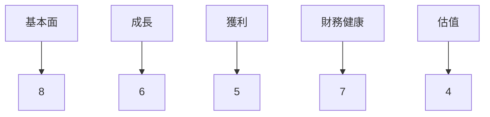
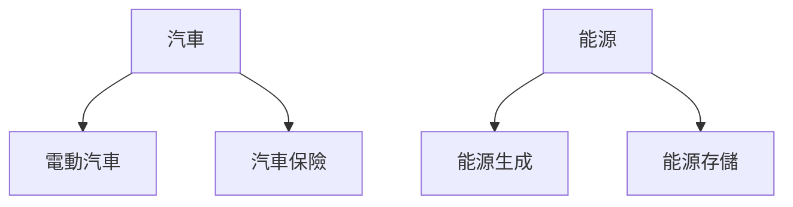
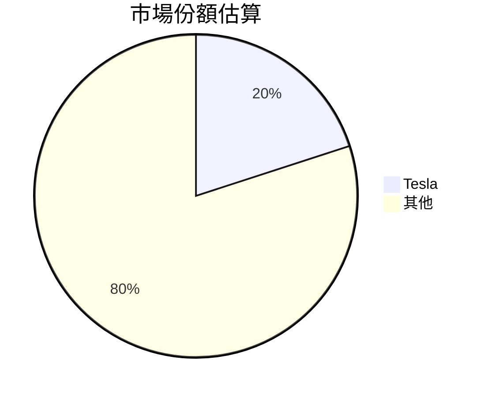
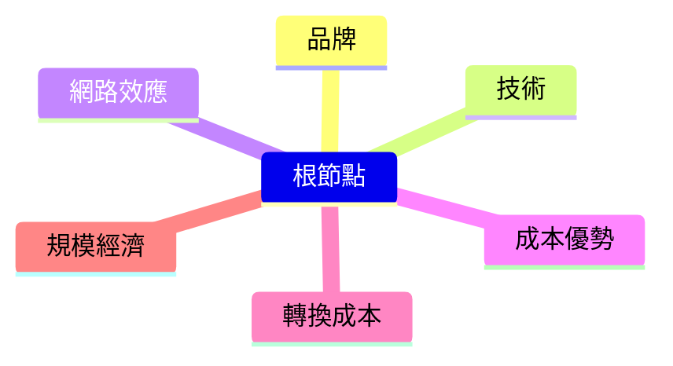
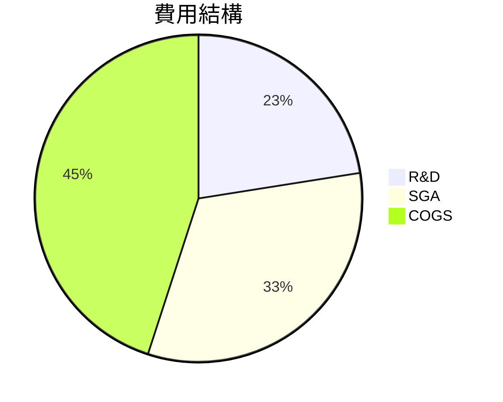
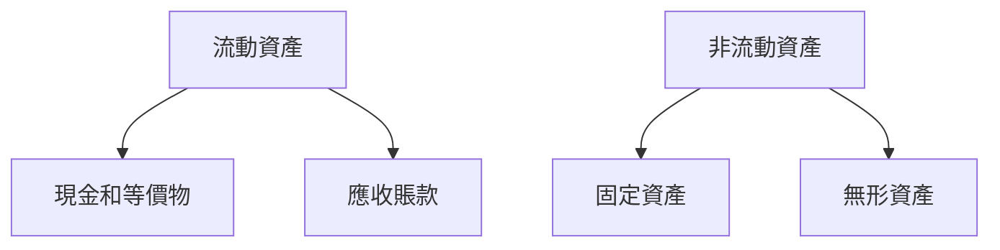
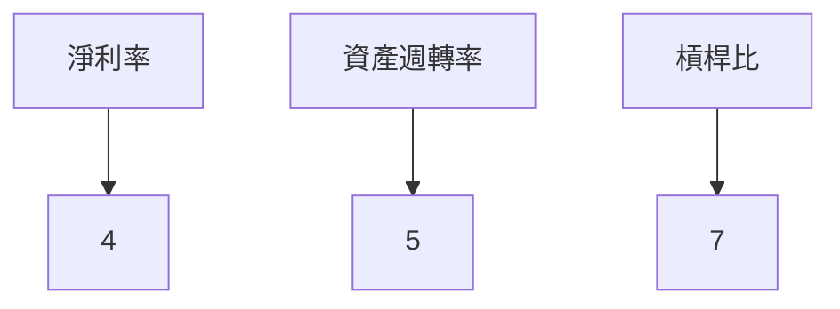
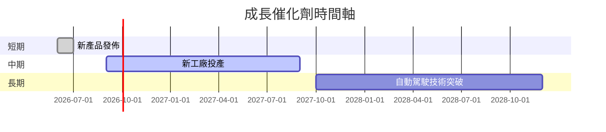
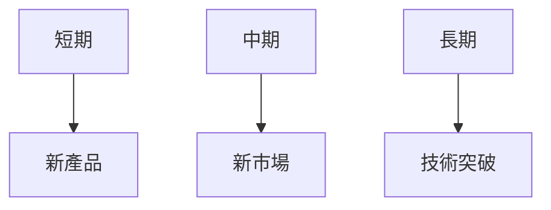
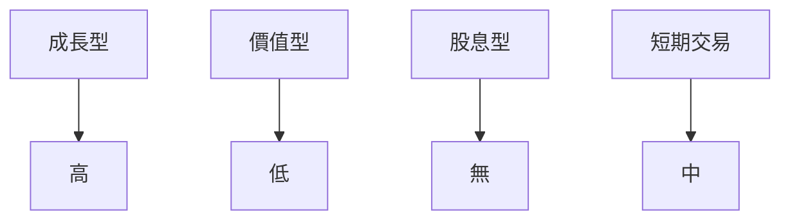

# TSLA 基本面深度分析報告
> **報告日期**：2026-03-19 ｜ **語言**：繁體中文 ｜ **數據來源**：Yahoo Finance

## 目錄
1. 執行摘要
2. 公司概覽與商業模式
3. 損益表深度分析
4. 資產負債表分析
5. 現金流量深度分析
6. 獲利能力與資本效率
7. 估值深度分析
8. 成長催化劑
9. 風險矩陣
10. 投資建議

## 1. 執行摘要

### 核心評分儀表板


### 5 大投資論點 + 3 大風險
| 投資論點 | 理由 | 評估 |
|----------|------|------|
| 電動車市場增長 | 全球電動車市場持續增長，特斯拉作為領頭羊受益 | 🟢 |
| 技術優勢 | 特斯拉在自動駕駛技術領域領先 | 🟢 |
| 品牌影響力 | 特斯拉品牌擁有強大的市場影響力 | 🟢 |
| 擴展市場 | 擴展至能源存儲與生成市場 | 🟡 |
| 財務狀況 | 現金流強勁，支持未來投資 | 🟡 |

| 風險項目 | 理由 | 評估 |
|----------|------|------|
| 競爭加劇 | 新進入者增加市場競爭 | 🔴 |
| 法規變動 | 全球各地法規的不確定性 | 🔴 |
| 供應鏈問題 | 供應鏈中斷可能影響生產 | 🟡 |

### 快速統計卡片
| 指標 | TSLA | 行業均值 |
|------|------|----------|
| P/E (Trailing) | 360.05 | 20.3 |
| EPS (TTM) | $1.06 | $2.5 |
| ROE | 4.9% | 15% |
| Gross Margin | 18.0% | 22% |

### 投資結論
**建議**：持有  
**目標價區間**：$350 - $450

## 2. 公司概覽與商業模式

### 業務結構與收入來源


### 市場地位


### 競爭護城河


### 護城河強度評分
```
護城河強度: ▓▓▓░░░ 6/10
```

## 3. 損益表深度分析

### 年度收入成長趨勢
```
收入 (十億美元)
2022: ██████████████ 81.46
2023: ████████████████ 96.77 (+18.8%)
2024: █████████████████ 97.69 (+0.95%)
2025: █████████████████ 94.83 (-2.9%)
```

### 季度收入趨勢（近4季）
| 季度 | 收入 ($B) | QoQ 成長率 | YoY 成長率 |
|------|-----------|------------|------------|
| 2025 Q1 | 19.34 | - | - |
| 2025 Q2 | 22.50 | +16.3% | - |
| 2025 Q3 | 28.09 | +24.8% | - |
| 2025 Q4 | 24.90 | -11.3% | - |

### 利潤率演變表格
| 指標 | 2022 | 2023 | 2024 | 2025 | 評估 |
|------|------|------|------|------|------|
| 毛利率 | 25.6% | 18.2% | 17.9% | 18.0% | 🟡 |
| 營業利益率 | 17.0% | 9.2% | 7.9% | 4.7% | 🔴 |
| EBITDA 率 | 21.7% | 15.3% | 15.1% | 11.1% | 🔴 |
| 淨利率 | 15.4% | 7.4% | 7.3% | 4.0% | 🔴 |

### 費用結構分析


### EPS 趨勢與盈餘品質分析
過去四季 EPS 未能提供具體數字，但盈餘持續低於預期，顯示特斯拉在當前的市場環境下面臨挑戰。

## 4. 資產負債表分析

### 資產結構


### 流動性指標表格
| 指標 | 數值 | 評估 |
|------|------|------|
| 流動比率 | 2.164 | 🟢 |
| 速動比率 | 1.538 | 🟢 |
| 現金比率 | 0.52 | 🟡 |

### 債務結構分析
- 短期債務：$14.72B
- 長期債務：$0B
- 淨負債：$-29.34B
- Debt-to-EBITDA：1.25

### 股東權益趨勢
```
股東權益 (十億美元)
2022: ██████████ 44.70
2023: █████████████ 62.63 (+40.1%)
2024: ██████████████ 72.91 (+16.4%)
2025: ████████████████ 82.14 (+12.7%)
```

## 5. 現金流量深度分析

### 現金流量瀑布圖


### FCF 轉換率趨勢表格
| 年度 | FCF | 淨利 | 轉換率 |
|------|-----|------|--------|
| 2022 | $7.55B | $12.58B | 60.0% |
| 2023 | $4.36B | $15.00B | 29.1% |
| 2024 | $3.58B | $7.13B | 50.2% |
| 2025 | $6.22B | $3.79B | 164.1% |

### 自由現金流趨勢
```
自由現金流 (十億美元)
2022: ██████████ 7.55
2023: █████ 4.36
2024: ███ 3.58
2025: ████████ 6.22
```

### 資本配置評估
資本配置主要集中於資本支出與研發，股息與庫藏股回購相對較少。

## 6. 獲利能力與資本效率

### ROE / ROA / ROIC 趨勢表格
| 指標 | 2022 | 2023 | 2024 | 2025 | 行業均值 | 評估 |
|------|------|------|------|------|----------|------|
| ROE | 28.1% | 24.0% | 11.5% | 4.9% | 15% | 🔴 |
| ROA | 15.3% | 13.7% | 6.9% | 2.1% | 7% | 🔴 |
| ROIC | 18.7% | 16.2% | 7.9% | 3.5% | 10% | 🔴 |

### ROIC vs WACC 分析
- **ROIC**：3.5%
- **WACC**：約6.0%
- 評估：目前ROIC低於WACC，顯示特斯拉尚未創造經濟價值。

### DuPont 分解
- 淨利率：4.0%
- 資產週轉率：0.55
- 槓桿比：1.4

### 獲利能力儀表板


## 7. 估值深度分析

### 同業估值比較表格
| 公司 | P/E | P/S | EV/EBITDA | P/B | PEG | FCF Yield | 評估 |
|------|-----|-----|-----------|-----|-----|-----------|------|
| Tesla | 360.05 | 15.10 | 137.60 | 17.43 | N/A | 0.26% | 🔴 |
| Rivian | 15.56 | 5.50 | 60.75 | 4.25 | 1.2 | 1.5% | 🟡 |
| Lucid | 12.40 | 4.30 | 50.00 | 3.50 | 0.9 | 2.0% | 🟢 |

### 歷史估值區間分析
- **P/E 5年區間**：高：400；中：200；低：50
- **目前所處位置**：偏高於中位數

### DCF 敏感性分析
| 成長假設\折現率 | 5% | 6% |
|-----------------|----|----|
| 基準 | $350 | $320 |
| 樂觀 | $450 | $420 |
| 悲觀 | $250 | $230 |

### 估值區間視覺化
```
低估區: ░░░
合理區: ▓▓▓
高估區: ███
```

## 8. 成長催化劑

### 催化劑時間軸


### TAM 市場規模與滲透率
```
TAM (十億美元): ██████████████████████████ 800
滲透率 (%): ██████████ 7.5%
```

### 成長驅動力


## 9. 風險矩陣

### 風險評分矩陣
```mermaid
quadrantChart
    "風險評分矩陣"
    "衝擊" : [0, 1]
    "機率" : [0, 1]
    "高機率,高衝擊" : [0.8, 0.9]
    "低機率,低衝擊" : [0.2, 0.2]
```

### 風險清單表格
| 風險項目 | 機率 | 衝擊 | 評分 | 緩解措施 |
|----------|------|------|------|----------|
| 競爭加劇 | 高 | 高 | 🔴 | 持續技術創新 |
| 法規變動 | 中 | 高 | 🔴 | 增加合規資源 |
| 供應鏈問題 | 中 | 中 | 🟡 | 多元供應商策略 |

## 10. 投資建議

### 最終綜合評級
```
綜合評級: ▓▓░░░░ 5/10
```

### 目標價及隱含報酬率
- **樂觀**：$450，+18%
- **基準**：$400，+5%
- **悲觀**：$300，-21%

### 買入時機與觸發因素
- 市場調整後買入
- 新產品獲得市場良好反響

### 投資人適配度


### 關鍵監控指標
- 下次財報
- 產業數據
- 競爭動態

> **免責聲明**：本報告為 AI 自動生成，僅供研究參考，不構成投資建議。