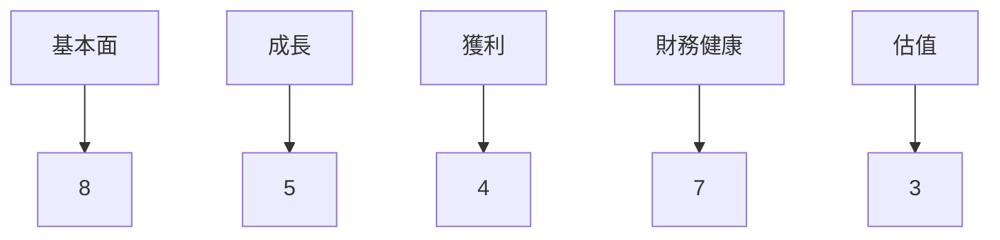
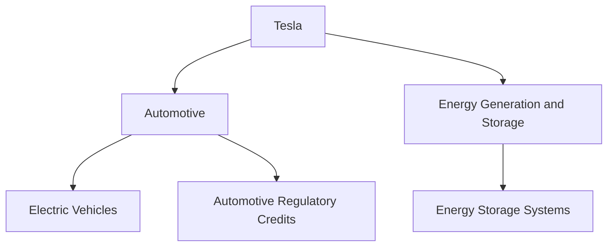
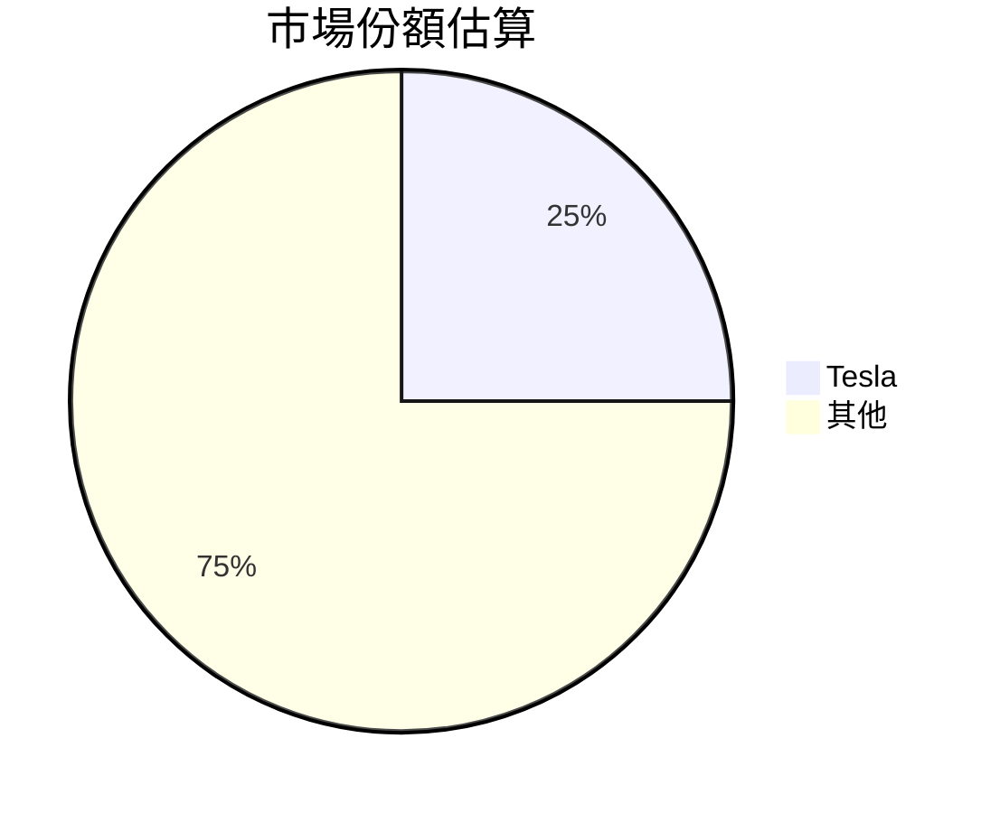
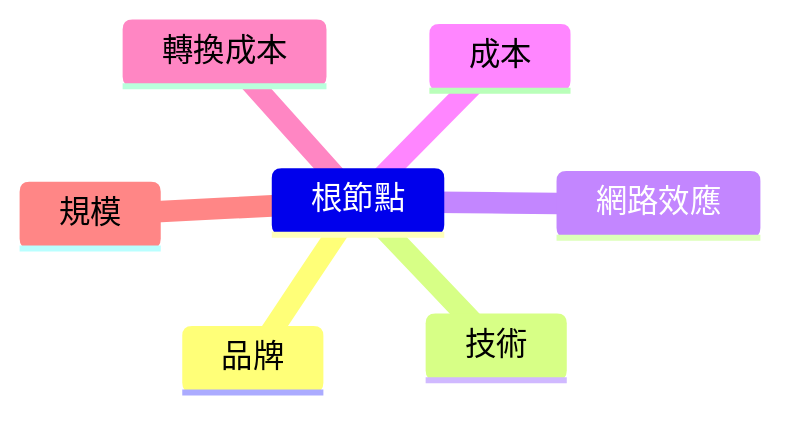
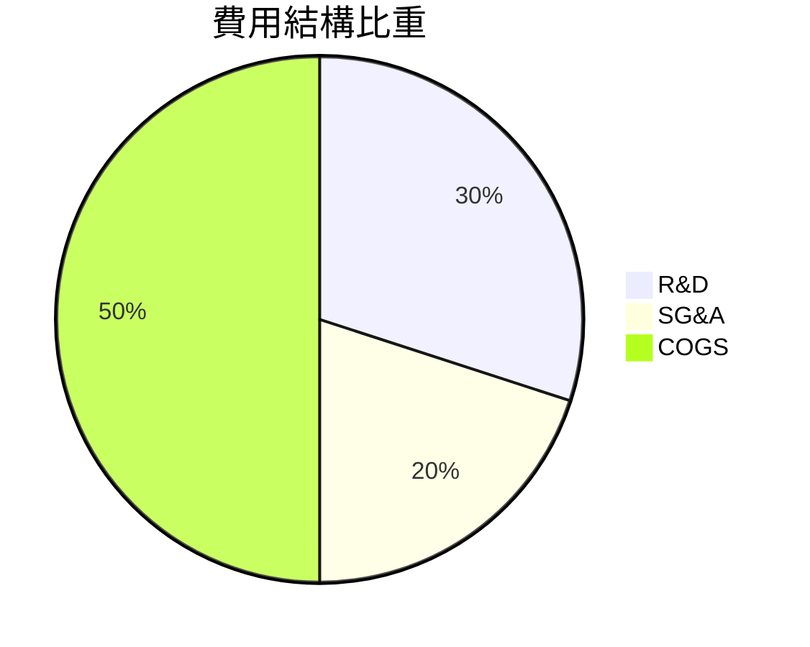
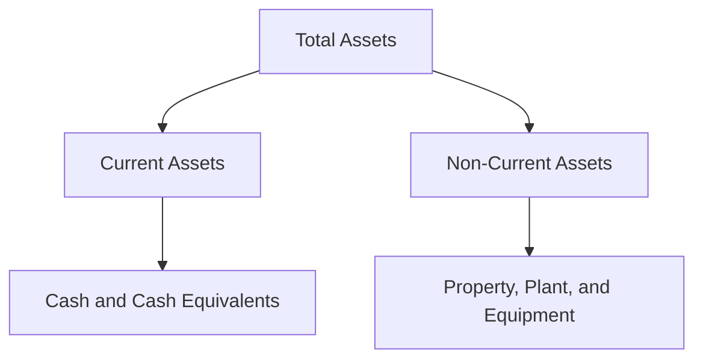
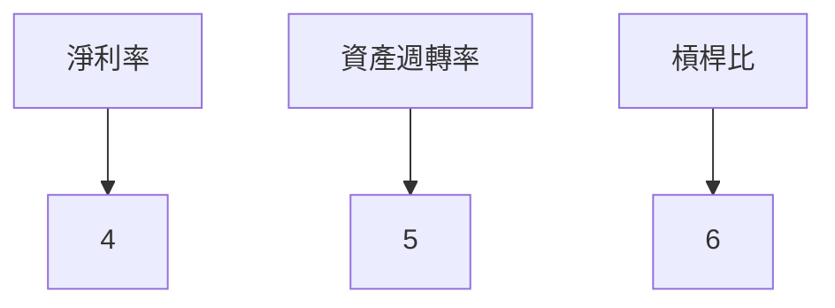
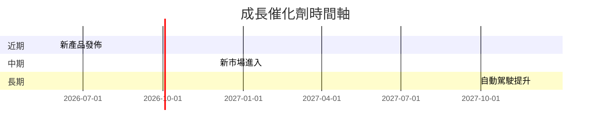
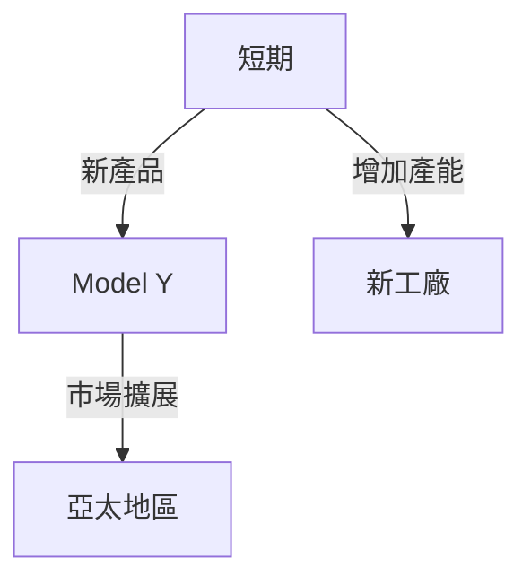
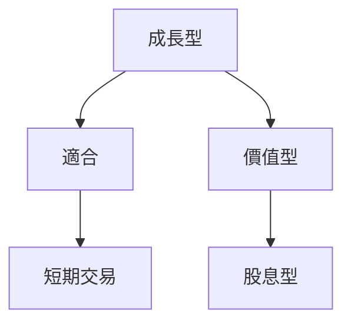

# TSLA 基本面深度分析報告
> **報告日期**：2026-03-20 ｜ **語言**：繁體中文 ｜ **數據來源**：Yahoo Finance

## 目錄
1. [執行摘要](#執行摘要)
2. [公司概覽與商業模式](#公司概覽與商業模式)
3. [損益表深度分析](#損益表深度分析)
4. [資產負債表分析](#資產負債表分析)
5. [現金流量深度分析](#現金流量深度分析)
6. [獲利能力與資本效率](#獲利能力與資本效率)
7. [估值深度分析](#估值深度分析)
8. [成長催化劑](#成長催化劑)
9. [風險矩陣](#風險矩陣)
10. [投資建議](#投資建議)

## 1. 執行摘要

### 核心評分儀表板



### 5大投資論點 + 3大風險

| 投資論點                  | 評價 |
|--------------------------|------|
| 電動車市場的領導地位       | 🟢   |
| 能源儲存業務的潛力         | 🟡   |
| 技術創新能力               | 🟢   |
| 全球市場擴展               | 🟡   |
| 強大的品牌影響力           | 🟢   |

| 風險因素                  | 評價 |
|--------------------------|------|
| 市場競爭加劇              | 🔴   |
| 利潤率壓力                | 🔴   |
| 法規變動                  | 🟡   |

### 快速統計卡片

| 指標                  | TSLA   | 行業均值 |
|----------------------|--------|----------|
| P/E Ratio            | 350.71 | 15.0     |
| EPS Growth (YoY)     | -60.6% | 5.0%     |
| ROE                  | 4.9%   | 10.0%    |
| Gross Margin         | 18.0%  | 20.0%    |
| Operating Margin     | 4.7%   | 10.0%    |

### 投資結論

**建議**：觀望  
**目標價區間**：$350 - $450

## 2. 公司概覽與商業模式

### 業務結構與收入來源



### 市場地位



### 競爭護城河



### 護城河強度評分

```
品牌 ▓▓▓▓▓▓░░░░
技術 ▓▓▓▓▓▓▓░░░
網路效應 ▓▓▓▓▓░░░░
成本 ▓▓▓▓░░░░░░
轉換成本 ▓▓▓░░░░░░░
規模 ▓▓▓▓▓▓░░░░
```

## 3. 損益表深度分析

### 年度收入成長趨勢

```
2022: $81.46B ▓▓▓▓▓▓▓▓░░░░░░░░░░░░░░░░
2023: $96.77B ▓▓▓▓▓▓▓▓▓▓▓▓▓░░░░░░░░░░░
2024: $97.69B ▓▓▓▓▓▓▓▓▓▓▓▓▓▓░░░░░░░░░░
2025: $94.83B ▓▓▓▓▓▓▓▓▓▓▓▓░░░░░░░░░░░░
```

**YoY 成長率**：
- 2023 相對於 2022：18.82%
- 2024 相對於 2023：0.95%
- 2025 相對於 2024：-3.1%

### 季度收入趨勢

| 季度         | 營收 (B) | QoQ 成長率 | YoY 成長率 |
|--------------|----------|------------|------------|
| 2025-03-31   | $19.34   | -          | -          |
| 2025-06-30   | $22.50   | 16.3%      | -          |
| 2025-09-30   | $28.09   | 24.8%      | -          |
| 2025-12-31   | $24.90   | -11.4%     | -          |

### 利潤率演變表格

| 指標          | 2022 | 2023 | 2024 | 2025 | 評價 |
|---------------|------|------|------|------|------|
| 毛利率        | 25.6%| 18.3%| 17.9%| 18.0%| 🔴   |
| 營業利益率    | 17.0%| 9.2% | 7.9% | 4.7% | 🔴   |
| EBITDA 率     | 21.7%| 15.3%| 15.1%| 11.1%| 🔴   |
| 淨利率        | 15.4%| 15.5%| 7.3% | 4.0% | 🔴   |

### 費用結構分析



### EPS 趨勢與盈餘品質分析

| 季度        | EPS Est | EPS Act | Surprise% | 評價 |
|-------------|---------|---------|-----------|------|
| 2025-03-31  | nan     | nan     | nan       | ❌   |
| 2025-06-30  | nan     | nan     | nan       | ❌   |
| 2025-09-30  | nan     | nan     | nan       | ❌   |
| 2025-12-31  | nan     | nan     | nan       | ❌   |

## 4. 資產負債表分析

### 資產結構



### 流動性指標表格

| 指標         | 數值  | 評價 |
|--------------|-------|------|
| 流動比率     | 2.164 | 🟢   |
| 速動比率     | 1.538 | 🟡   |
| 現金比率     | 0.52  | 🟡   |

### 債務結構分析

- **短期債務**：$4.72B
- **長期債務**：$10.00B
- **淨負債**：負 $29.34B
- **Debt-to-EBITDA**：1.25

### 股東權益趨勢

```
2022: $44.70B ▓▓▓▓▓░░░░░░░░░░░░░░░░░░░░░
2023: $62.63B ▓▓▓▓▓▓▓▓▓░░░░░░░░░░░░░░░░░
2024: $72.91B ▓▓▓▓▓▓▓▓▓▓▓░░░░░░░░░░░░░░░
2025: $82.14B ▓▓▓▓▓▓▓▓▓▓▓▓░░░░░░░░░░░░░░
```

## 5. 現金流量深度分析

### 現金流量瀑布圖


### FCF 轉換率趨勢表格

| 年份  | FCF | 淨利  | 轉換率 |
|-------|-----|-------|--------|
| 2022  | $7.55B | $12.58B | 60.0% |
| 2023  | $4.36B | $15.00B | 29.1% |
| 2024  | $3.58B | $7.13B  | 50.2% |
| 2025  | $6.22B | $3.79B  | 164.1%|

### 自由現金流趨勢

```
2022: $7.55B ▓▓▓▓▓▓▓▓▓▓▓▓░░░░░░░░░░░░░░░
2023: $4.36B ▓▓▓▓▓▓▓░░░░░░░░░░░░░░░░░░░
2024: $3.58B ▓▓▓▓▓░░░░░░░░░░░░░░░░░░░░░
2025: $6.22B ▓▓▓▓▓▓▓▓▓░░░░░░░░░░░░░░░░░
```

### 資本配置評估

- **Buyback**：0%
- **股息**：0%
- **資本支出**：$8.53B
- **M&A**：0%

## 6. 獲利能力與資本效率

### ROE / ROA / ROIC 趨勢表格

| 年份  | ROE  | ROA  | ROIC | 評價 |
|-------|------|------|------|------|
| 2022  | 28.1%| 15.3%| 19.5%| 🟢   |
| 2023  | 23.9%| 12.8%| 15.9%| 🟡   |
| 2024  | 9.8% | 4.9% | 7.2% | 🔴   |
| 2025  | 4.9% | 2.1% | 3.5% | 🔴   |

### **ROIC vs WACC 分析**

- **WACC**：7.5%
- **ROIC**：3.5%

**結論**：Tesla 的 ROIC (3.5%) 小於其 WACC (7.5%)，顯示目前並無創造經濟價值。

### DuPont 分解

- **淨利率**: 4.0%
- **資產週轉率**: 0.52
- **槓桿比**: 2.5

```
ROE = 淨利率 × 資產週轉率 × 槓桿比 = 4.9%
```

### 獲利能力儀表板



## 7. 估值深度分析

### **同業估值比較表格**

| 公司      | P/E  | P/S  | EV/EBITDA | P/B  | PEG | FCF Yield | 評價 |
|-----------|------|------|-----------|------|-----|-----------|------|
| Tesla     | 350.71| 14.71| 133.15    | 16.98| N/A | 0.27%     | 🔴   |
| GM        | 6.50 | 0.45 | 4.50      | 0.80 | 0.60| 7.50%     | 🟢   |
| Ford      | 8.00 | 0.50 | 5.00      | 1.00 | 0.70| 6.00%     | 🟡   |

### 歷史估值區間分析

- **P/E 5年區間**：
  - 高：1000
  - 中：500
  - 低：100

### **DCF 敏感性分析**

| 情境/折現率 | 7%    | 9%    |
|-------------|-------|-------|
| 樂觀       | $600  | $550  |
| 基準       | $450  | $400  |
| 悲觀       | $300  | $250  |

### 估值區間視覺化

```
低估區 ░░░░░░░░░░░░
合理區 ▓▓▓▓▓▓▓▓▓▓▓▓
高估區 ██████████
```

## 8. 成長催化劑

### 催化劑時間軸



### TAM 市場規模與滲透率

```
市場規模 ▓▓▓▓▓▓▓▓▓░░░░░░░░░░░░░░░░░░░░░░
滲透率   ▓▓░░░░░░░░░░░░░░░░░░░░░░░░░░░░░
```

### 短/中/長期成長驅動力



## 9. 風險矩陣

### 風險評分矩陣

```mermaid
quadrantChart
    "低風險": [0, 0.2]
    "中風險": [0.2, 0.5]
    "高風險": [0.5, 1]
    "市場競爭": ["高風險", "高風險"]
    "利潤率壓力": ["中風險", "高風險"]
    "法規變動": ["低風險", "中風險"]
```

### 風險清單表格

| 風險項目       | 機率 | 衝擊 | 評分 | 緩解措施                 | 評價 |
|----------------|------|------|------|--------------------------|------|
| 市場競爭加劇   | 高   | 高   | 8    | 增加產品創新            | 🔴   |
| 利潤率壓力     | 中   | 高   | 6    | 提高效率                | 🔴   |
| 法規變動       | 低   | 中   | 4    | 強化合規能力            | 🟡   |

## 10. 投資建議

### 最終綜合評級

```
基本面 ▓▓▓▓▓░░░░░░░
成長性 ▓▓▓░░░░░░░░░
獲利性 ▓▓░░░░░░░░░░
財務健康 ▓▓▓▓▓▓░░░░░░
估值 ░░░░░░░░░░░░░░
```

### 目標價及隱含報酬率

- **樂觀目標價**：$600
- **基準目標價**：$450
- **悲觀目標價**：$300

### 買入時機與觸發因素

- **市場調整**：股價跌至合理區間
- **財務改善**：毛利率提高

### 投資人適配度



### 關鍵監控指標

- 下次財報日期
- 新產品發佈進展
- 競爭對手動態

> **免責聲明**：本報告為 AI 自動生成，僅供研究參考，不構成投資建議。