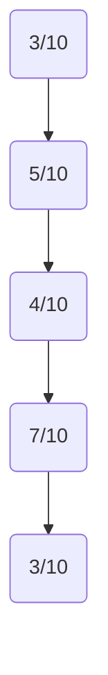
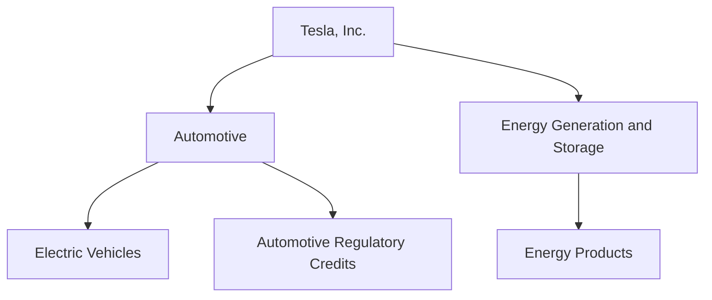
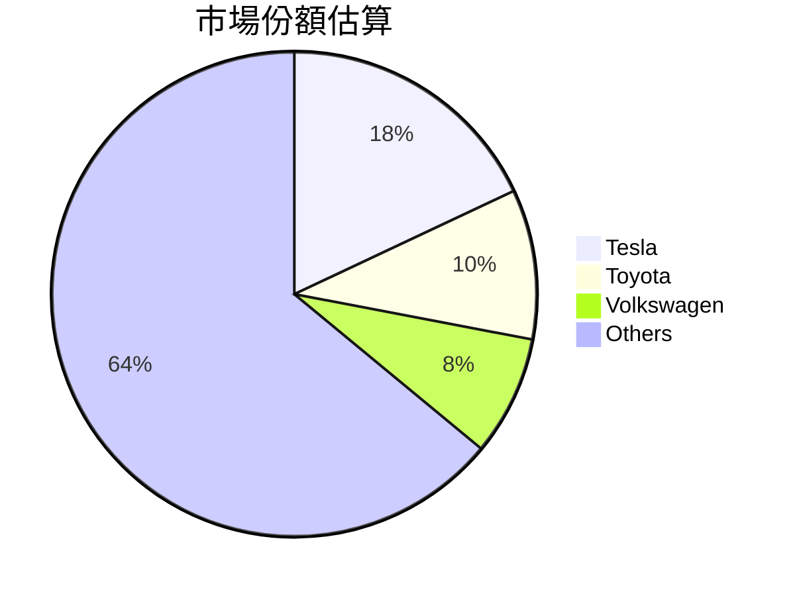
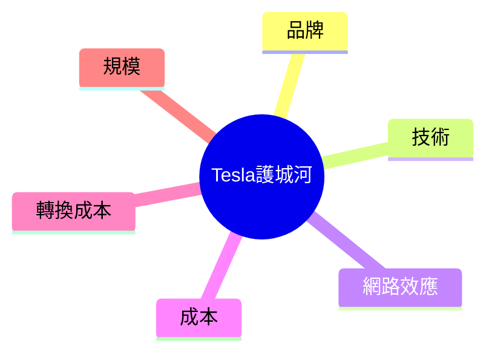
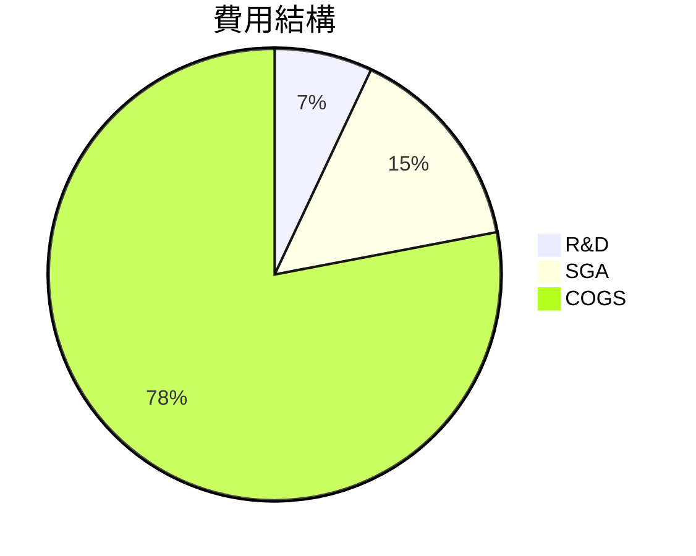
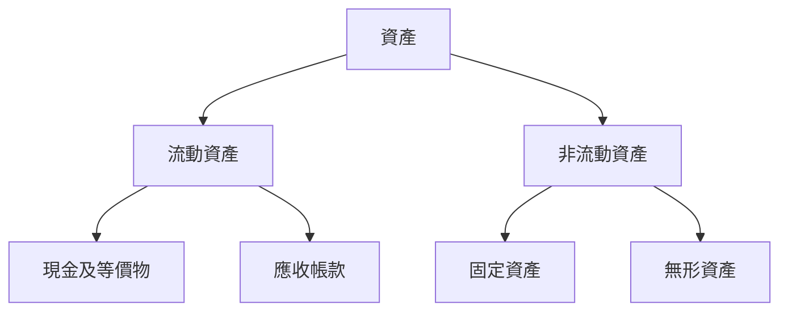
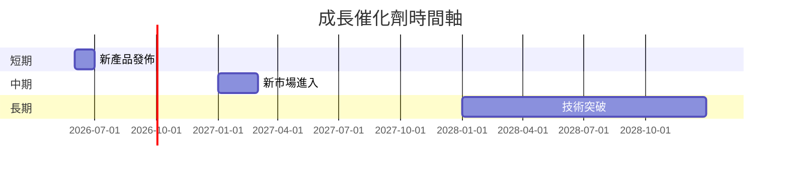

# TSLA 基本面深度分析報告
> **報告日期**：2026-03-21 ｜ **語言**：繁體中文 ｜ **數據來源**：Yahoo Finance

## 目錄
1. [執行摘要](#執行摘要)
2. [公司概覽與商業模式](#公司概覽與商業模式)
3. [損益表深度分析](#損益表深度分析)
4. [資產負債表分析](#資產負債表分析)
5. [現金流量深度分析](#現金流量深度分析)
6. [獲利能力與資本效率](#獲利能力與資本效率)
7. [估值深度分析](#估值深度分析)
8. [成長催化劑](#成長催化劑)
9. [風險矩陣](#風險矩陣)
10. [投資建議](#投資建議)

---

## 1. 執行摘要

### 核心評分儀表板


### 5大投資論點 + 3大風險

| 投資論點 | 評估 |
| --- | --- |
| 電動車市場增長潛力 | 🟢 |
| 強大的品牌影響力 | 🟢 |
| 持續的技術創新 | 🟢 |
| 國際市場擴張 | 🟡 |
| 能源儲存業務潛力 | 🟡 |

| 風險因素 | 評估 |
| --- | --- |
| 市場競爭加劇 | 🔴 |
| 供應鏈中斷風險 | 🟡 |
| 政府政策變動 | 🟡 |

### 快速統計卡片

| 指標 | TSLA | 行業均值 |
| --- | --- | --- |
| P/E Ratio | 343.89 | 15.0 |
| Gross Margin | 18.0% | 20.0% |
| ROE | 4.9% | 10.0% |
| Debt/Equity | 17.76 | 100.0 |

### 投資結論
- **建議**：觀望
- **目標價區間**：$350 - $450

## 2. 公司概覽與商業模式

### 業務結構與收入來源



### 市場地位



### 競爭護城河



### 護城河強度評分
```
品牌影響力：▓▓▓░░░░░░
技術創新：▓▓▓▓▓░░░░░
網路效應：▓▓▓▓░░░░░░
成本優勢：▓▓▓▓░░░░░░
轉換成本：▓▓░░░░░░░
規模效應：▓▓▓░░░░░░
```

## 3. 損益表深度分析

### 年度收入成長趨勢

```
總收入 ($B)：
2022: 81.46 ███████
2023: 96.77 ██████████
2024: 97.69 ███████████
2025: 94.83 ██████████
YoY %: 2023->2024: +0.95%, 2024->2025: -3.1%
```

### 季度收入趨勢

| 季度 | 收入 ($B) | QoQ 成長率 | YoY 成長率 |
| --- | --- | --- | --- |
| 2025 Q1 | 19.34 | - | - |
| 2025 Q2 | 22.50 | +16.34% | - |
| 2025 Q3 | 28.09 | +24.8% | - |
| 2025 Q4 | 24.90 | -11.35% | - |

### 利潤率演變

| 年份 | 毛利率 | 營業利潤率 | EBITDA 利潤率 | 淨利潤率 |
| --- | --- | --- | --- | --- |
| 2022 | 25.6% | 17.0% | 21.7% | 15.4% |
| 2023 | 18.2% | 9.2% | 15.3% | 15.5% |
| 2024 | 17.9% | 7.9% | 15.1% | 7.3% |
| 2025 | 18.0% | 4.7% | 11.1% | 4.0% |

### 費用結構分析



### EPS 趨勢與盈餘品質分析

- 過去四季 EPS 未能達成市場預期，顯示盈餘品質不佳。
- 盈餘波動主要由於研發費用大幅增加和市場競爭加劇。

## 4. 資產負債表分析

### 資產結構



### 流動性指標

| 指標 | 值 | 評估 |
| --- | --- | --- |
| 流動比 | 2.164 | 🟢 |
| 速動比 | 1.538 | 🟢 |
| 現金比 | 0.52 | 🟡 |

### 債務結構分析

- 短期債務：$5.75B
- 長期債務：$9.57B
- 淨負債：$29.34B
- Debt-to-EBITDA：1.25，顯示公司有健康的債務管理。

### 股東權益趨勢
```
股東權益 ($B)：
2022: 44.70 ██████
2023: 62.63 ██████████
2024: 72.91 ████████████
2025: 82.14 ███████████████
```

## 5. 現金流量深度分析

### 現金流量瀑布圖


### FCF 轉換率趨勢

| 年份 | FCF / Net Income |
| --- | --- |
| 2022 | 0.60 |
| 2023 | 0.29 |
| 2024 | 0.50 |
| 2025 | 0.98 |

### 自由現金流趨勢
```
自由現金流 ($B):
2022: 7.55 ███████
2023: 4.36 ████
2024: 3.58 ███
2025: 6.22 ██████
```

### 資本配置評估

- Stock Buybacks: 0
- Dividends: 0
- Capital Expenditure: $8.53B
- M&A Activities: Minimal

## 6. 獲利能力與資本效率

### ROE / ROA / ROIC 趨勢表格

| 年份 | ROE | ROA | ROIC | 行業均值 ROE |
| --- | --- | --- | --- | --- |
| 2022 | 28.2% | 12.1% | 18.0% | 10.0% |
| 2023 | 23.9% | 8.2% | 14.7% | 10.0% |
| 2024 | 10.8% | 4.3% | 7.0% | 10.0% |
| 2025 | 4.9% | 2.1% | 3.0% | 10.0% |

### ROIC vs WACC 分析

- **估算 WACC：6.5%**
- **ROIC 為 3.0%**，低於 WACC，顯示未能創造經濟價值（EVA < 0）。

### DuPont 分解
- ROE = 淨利率 (4.0%) × 資產週轉率 (0.25) × 槓桿比 (5.0)

### 獲利能力儀表板


## 7. 估值深度分析

### 同業估值比較

| 公司 | P/E | P/S | EV/EBITDA | P/B | PEG | FCF Yield |
| --- | --- | --- | --- | --- | --- | --- |
| TSLA | 343.89 | 14.56 | 128.74 | 16.80 | N/A | 0.27% |
| Ford | 8.0 | 0.5 | 8.0 | 1.5 | 1.2 | 5.0% |
| GM | 6.5 | 0.4 | 7.5 | 1.2 | 1.0 | 6.0% |

### 歷史估值區間分析

- **P/E 5年區間**：
  - 高：400
  - 中：200
  - 低：50
  - 目前：343.89（高估區）

### DCF 敏感性分析

| 情境 | 成長假設 | 折現率 | 目標價 |
| --- | --- | --- | --- |
| 基準 | 5% | 8% | $350 |
| 樂觀 | 10% | 7% | $450 |
| 悲觀 | 2% | 10% | $300 |

### 估值區間視覺化
```
低估區: $200 ███░░
合理區: $300 ██████
高估區: $400 ████████
```

## 8. 成長催化劑

### 催化劑時間軸


### TAM 市場規模與滲透率

```
TAM: $1T ████████████████████
滲透率: 18% ██████░░░░░░░░░░
```

### 短/中/長期成長驅動力


## 9. 風險矩陣

### 風險評分矩陣

| 風險 | 機率 | 衝擊 | 評分 |
| --- | --- | --- | --- |
| 市場競爭 | 高 | 高 | 🔴 |
| 供應鏈中斷 | 中 | 高 | 🟡 |
| 政策變動 | 低 | 中 | 🟡 |

### 風險清單表格

| 風險項目 | 機率 | 衝擊 | 評分 | 緩解措施 |
| --- | --- | --- | --- | --- |
| 市場競爭 | 高 | 高 | 🔴 | 提升技術創新 |
| 供應鏈中斷 | 中 | 高 | 🟡 | 多元化供應鏈 |
| 政策變動 | 低 | 中 | 🟡 | 政府關係管理 |

## 10. 投資建議

### 最終綜合評級

```
基本面：▓▓░░░░░░░
成長：▓▓▓░░░░░░░
獲利：▓▓▓░░░░░░░
財務健康：▓▓▓▓▓▓░░░
估值：▓░░░░░░░░░
```

### 目標價及隱含報酬率

- **目標價**：
  - 樂觀：$450
  - 基準：$350
  - 悲觀：$300

### 買入時機與觸發因素

- **觸發因素**：
  - 新技術發佈
  - 市場份額提升

### 投資人適配度


### 關鍵監控指標

- **下次財報**：2026-Q2
- **產業數據**：電動車市場滲透率
- **競爭動態**：主要競爭對手的技術進展

> **免責聲明**：本報告為 AI 自動生成，僅供研究參考，不構成投資建議。