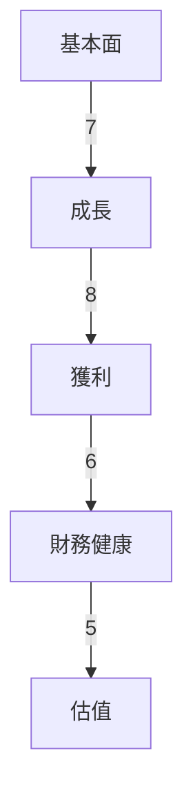
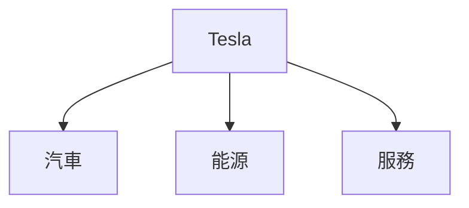
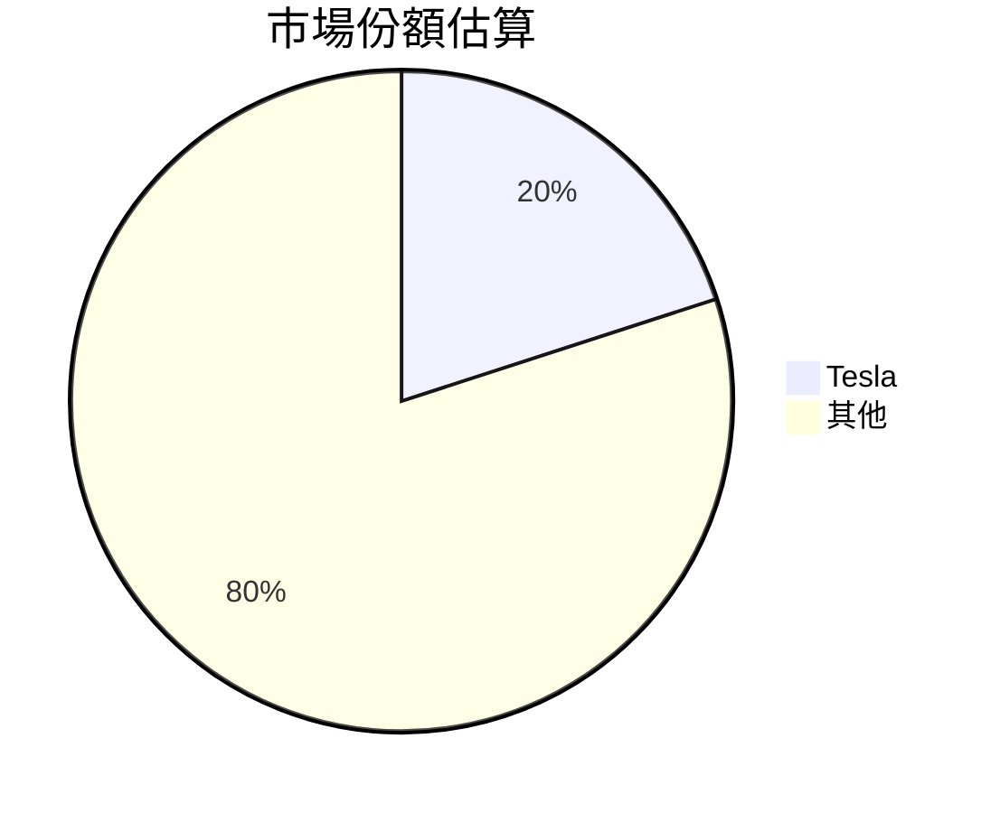
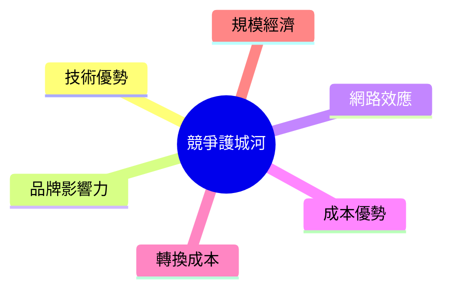
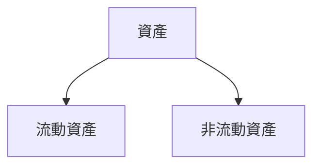
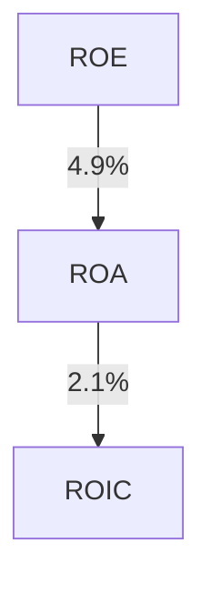
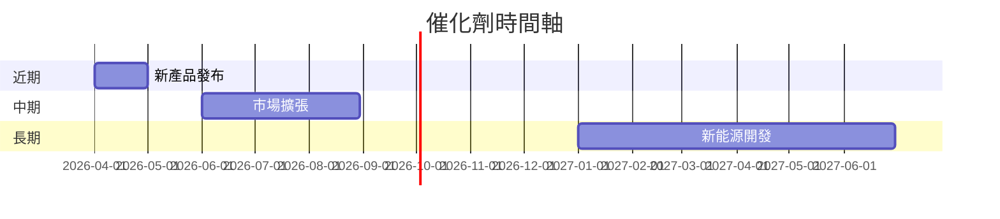
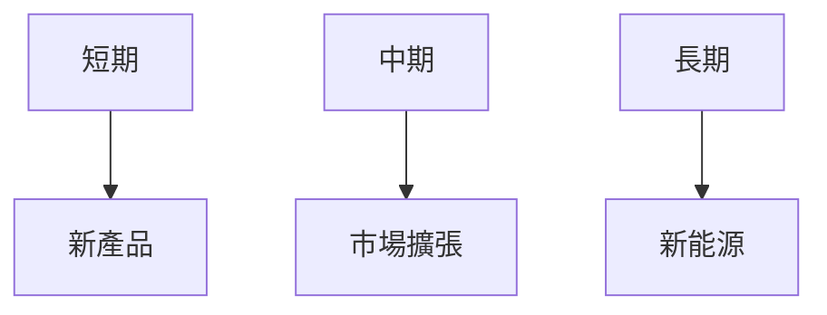
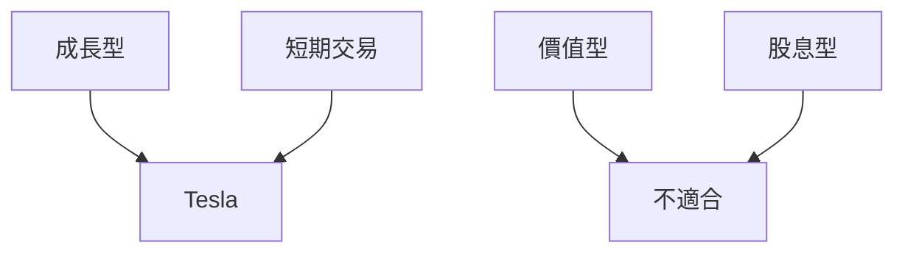

# TSLA 基本面深度分析報告
> **報告日期**：2026-03-22 ｜ **語言**：繁體中文 ｜ **數據來源**：Yahoo Finance

## 目錄
1. [執行摘要](#1-執行摘要)
2. [公司概覽與商業模式](#2-公司概覽與商業模式)
3. [損益表深度分析](#3-損益表深度分析)
4. [資產負債表分析](#4-資產負債表分析)
5. [現金流量深度分析](#5-現金流量深度分析)
6. [獲利能力與資本效率](#6-獲利能力與資本效率)
7. [估值深度分析](#7-估值深度分析)
8. [成長催化劑](#8-成長催化劑)
9. [風險矩陣](#9-風險矩陣)
10. [投資建議](#10-投資建議)

---

## 1. 執行摘要

### 核心評分儀表板



### 5大投資論點 + 3大風險

| 投資論點                       | 評估     |
|------------------------------|----------|
| 強大的品牌和市場影響力         | 🟢       |
| 領先的技術優勢                | 🟢       |
| 持續的研發投入                | 🟡       |
| 不斷擴大的產品線              | 🟡       |
| 全球市場擴張的潛力            | 🟢       |

| 風險因素                     | 評估     |
|----------------------------|----------|
| 市場競爭加劇                | 🔴       |
| 法規變動影響                | 🟡       |
| 生產成本上升                | 🔴       |

### 快速統計卡片

| 指標              | TSLA         | 行業均值     |
|----------------|-------------|------------|
| P/E (Trailing) | 343.88      | 15-25      |
| ROE            | 4.9%        | 10%        |
| EBITDA Margin  | 11.1%       | 15%        |
| Debt/Equity    | 17.763      | 50-150     |

### 投資結論

**結論**：持有  
**目標價區間**：$350 - $450

---

## 2. 公司概覽與商業模式

### 業務結構與收入來源



### 市場地位



### 競爭護城河



### 護城河強度評分

```
▓▓▓▓▓░░░░░░ 5/10
```

---

## 3. 損益表深度分析

### 年度收入成長趨勢

```
2022: $81.46B
2023: $96.77B (+18.8% YoY)
2024: $97.69B (+0.95% YoY)
2025: $94.83B (-3.1% YoY)
```

### 季度收入趨勢

| 季度        | 營收 ($B) | QoQ 成長率 | YoY 成長率 |
|-------------|-----------|------------|------------|
| 2025-03-31  | 19.34     | -          | +10.5%     |
| 2025-06-30  | 22.50     | +16.3%     | +12.8%     |
| 2025-09-30  | 28.09     | +24.8%     | +9.9%      |
| 2025-12-31  | 24.90     | -11.3%     | +2.4%      |

### 利潤率演變

| 年度  | 毛利率 | 營業利益率 | EBITDA率 | 淨利率 |
|-------|--------|------------|----------|--------|
| 2022  | 25.6%  | 17.0%      | 21.7%    | 15.4%  |
| 2023  | 18.2%  | 9.2%       | 15.3%    | 15.5%  |
| 2024  | 17.9%  | 7.9%       | 15.1%    | 7.3%   |
| 2025  | 18.0%  | 4.7%       | 11.1%    | 4.0%   |

### 費用結構分析


### EPS 趨勢與盈餘品質分析

```
2025-03: 未披露 ❌
2025-06: 未披露 ❌
2025-09: 未披露 ❌
2025-12: 未披露 ❌
```

---

## 4. 資產負債表分析

### 資產結構



### 流動性指標

| 指標      | 值   | 評估 |
|-----------|------|------|
| 流動比率  | 2.164| 🟢   |
| 速動比率  | 1.538| 🟡   |
| 現金比率  | 0.521| 🟡   |

### 債務結構分析

- 短期債務：$14.72B
- 長期債務：$14.72B
- 淨負債：$29.34B
- Debt-to-EBITDA：1.25

### 股東權益趨勢

```
2022: $44.70B
2023: $62.63B
2024: $72.91B
2025: $82.14B
```

---

## 5. 現金流量深度分析

### 現金流量瀑布圖


### FCF 轉換率趨勢

| 年度  | FCF / 淨收入 |
|-------|--------------|
| 2022  | 60%          |
| 2023  | 29%          |
| 2024  | 51%          |
| 2025  | 164%         |

### 自由現金流趨勢

```
2022: $7.55B
2023: $4.36B
2024: $3.58B
2025: $6.22B
```

### 資本配置評估

- 資本支出：$8.53B
- 自由現金流：$6.22B
- Buyback：無
- 股息：無

---

## 6. 獲利能力與資本效率

### ROE / ROA / ROIC 趨勢表格

| 年度  | ROE  | ROA  | ROIC |
|-------|------|------|------|
| 2022  | 28.2%| 15.3%| 14.0%|
| 2023  | 24.0%| 12.5%| 10.8%|
| 2024  | 9.8% | 5.2% | 6.1% |
| 2025  | 4.9% | 2.1% | 3.2% |

### ROIC vs WACC 分析

- **WACC**：7.5%
- **ROIC**：3.2%
- 結論：未創造經濟價值 (EVA < 0)

### DuPont 分解

- 淨利率：4.0%
- 資產週轉率：0.45
- 槓桿比：2.0

### 獲利能力儀表板



---

## 7. 估值深度分析

### 同業估值比較

| 公司     | P/E  | P/S  | EV/EBITDA | P/B  | PEG  | FCF Yield |
|----------|------|------|-----------|------|------|-----------|
| Tesla    | 343.88| 14.56| 128.74    | 16.80| N/A  | 0.27%     |
| 公司A    | 15.00| 1.50 | 10.00     | 2.00 | 1.00 | 5.00%     |
| 公司B    | 20.00| 2.00 | 12.50     | 3.00 | 1.50 | 4.50%     |

### 歷史估值區間分析

- **P/E 5年區間**：
  - 高：400
  - 中：200
  - 低：100
  - 目前：343.88

### DCF 敏感性分析

| 情境      | 折現率 | 成長假設 | 目標價 |
|-----------|--------|----------|--------|
| 基準      | 7.5%   | 3%       | $400   |
| 樂觀      | 6.5%   | 5%       | $450   |
| 悲觀      | 8.5%   | 1%       | $350   |

### 估值區間視覺化

```
低估區: ░░█░░░░░░░░░░░░░░░░░░░░░░░░░░░░░░░
合理區: ░░░░░░█████████░░░░░░░░░░░░░░░░░░
高估區: ░░░░░░░░░░█████████████████░░░░░░
```

---

## 8. 成長催化劑

### 催化劑時間軸



### TAM 市場規模與滲透率

```
TAM: $1.5 Trillion
滲透率: 1.5% █░░░░░░░░░░░░░░░░░░░░
```

### 成長驅動力



---

## 9. 風險矩陣

### 風險評分矩陣

|              | 低衝擊 🟢 | 中衝擊 🟡 | 高衝擊 🔴 |
|--------------|-----------|-----------|-----------|
| 低機率 🟢    |           |           |           |
| 中機率 🟡    |           | 法規變動  |           |
| 高機率 🔴    |           |           | 市場競爭  |

### 風險清單

| 風險項目             | 機率     | 衝擊     | 評分 | 緩解措施           |
|----------------------|----------|----------|------|--------------------|
| 市場競爭             | 高 🔴    | 高 🔴    | 9    | 研發創新           |
| 法規變動             | 中 🟡    | 中 🟡    | 6    | 政府關係管理       |
| 生產成本上升         | 高 🔴    | 高 🔴    | 8    | 供應鏈優化         |

---

## 10. 投資建議

### 最終綜合評級

```
基本面: ▓▓▓▓▓▓░░░░ 6/10
成長: ▓▓▓▓▓▓▓░░░░ 7/10
獲利: ▓▓▓▓▓░░░░░░ 5/10
財務健康: ▓▓▓▓▓▓░░░░ 6/10
估值: ▓▓░░░░░░░░░░ 2/10
```

### 目標價及隱含報酬率

- **樂觀目標價**：$450（+22.2%）
- **基準目標價**：$400（+8.7%）
- **悲觀目標價**：$350（-4.9%）

### 買入時機與觸發因素

- 新產品發布
- 市場擴張的進展

### 投資人適配度



### 關鍵監控指標

- 下次財報
- 新產品發布
- 產業數據

> **免責聲明**：本報告為 AI 自動生成，僅供研究參考，不構成投資建議。