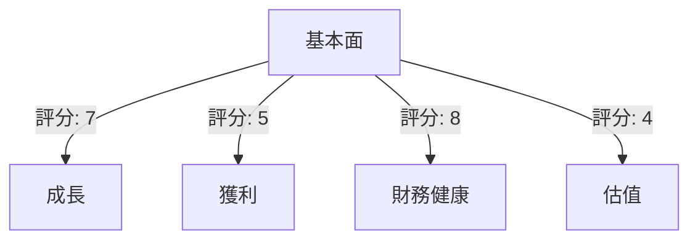
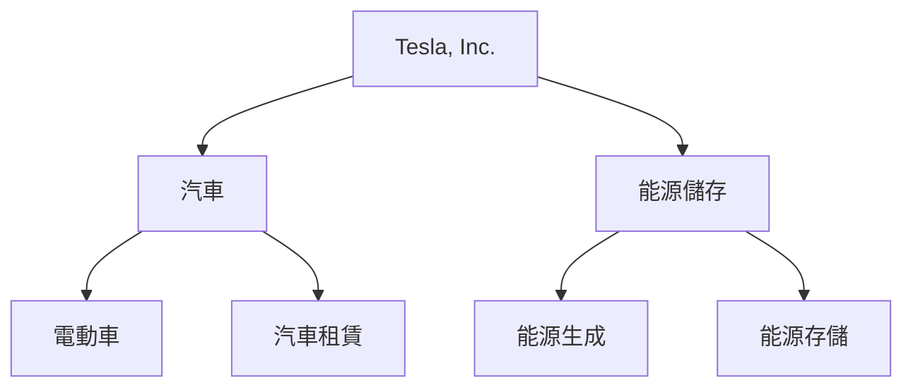
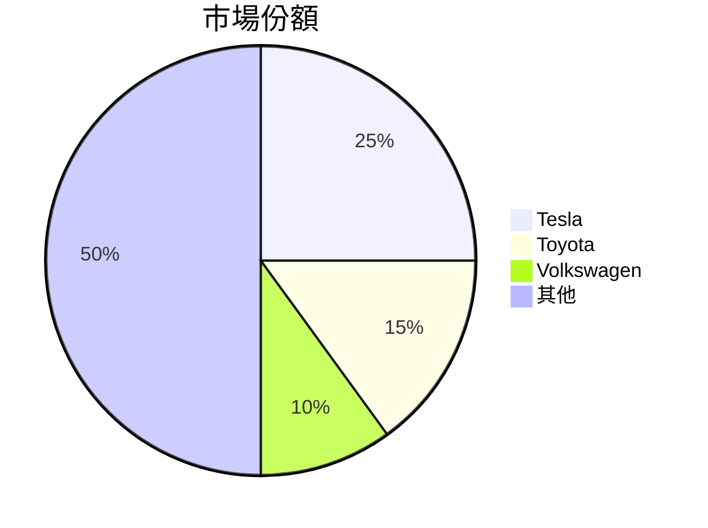
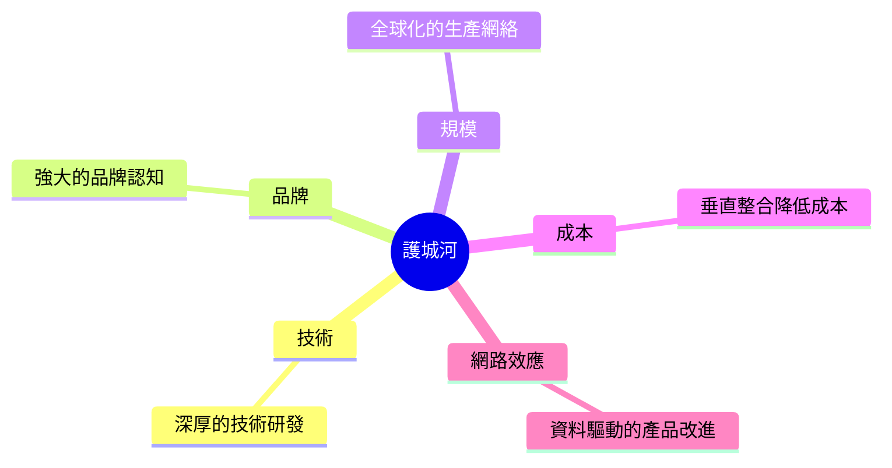
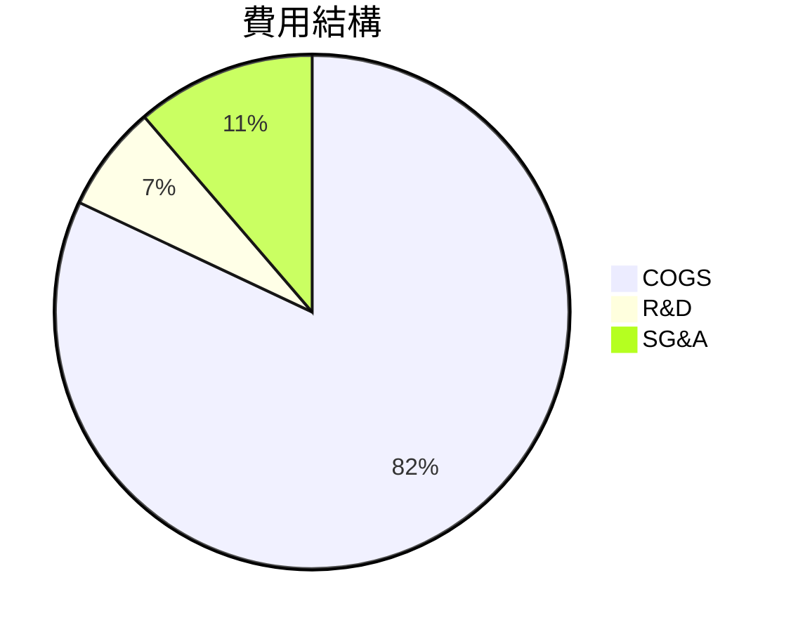
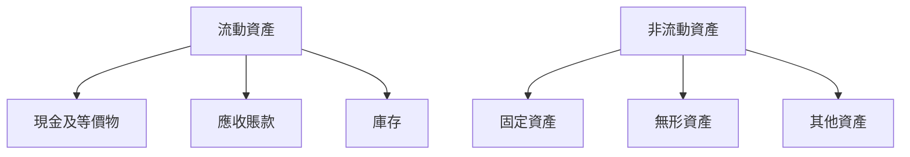
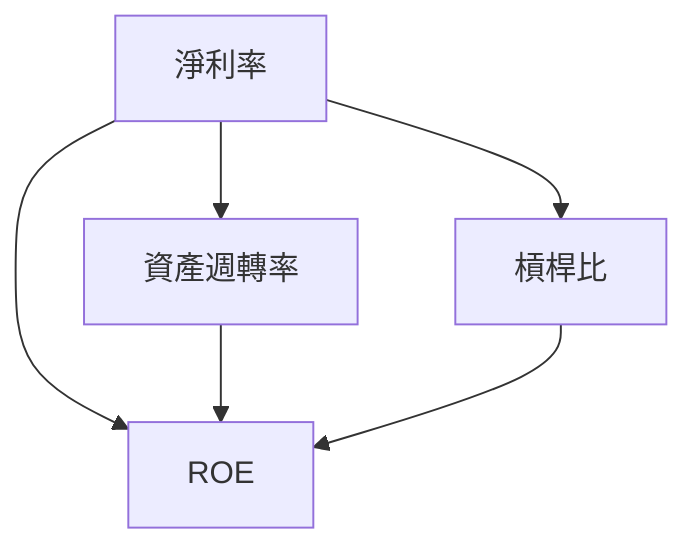
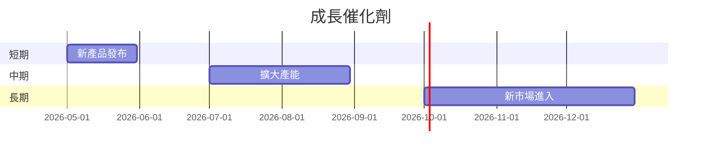
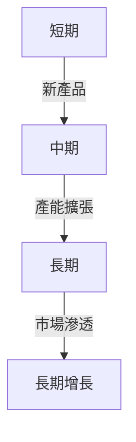
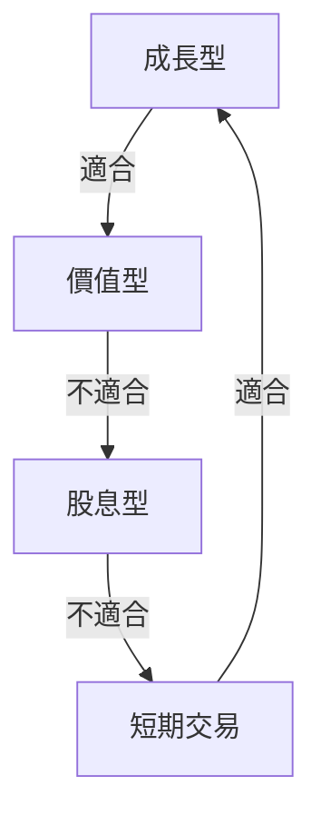

# TSLA 基本面深度分析報告
> **報告日期**：2026-03-23 ｜ **語言**：繁體中文 ｜ **數據來源**：Yahoo Finance

## 目錄
1. [執行摘要](#執行摘要)
2. [公司概覽與商業模式](#公司概覽與商業模式)
3. [損益表深度分析](#損益表深度分析)
4. [資產負債表分析](#資產負債表分析)
5. [現金流量深度分析](#現金流量深度分析)
6. [獲利能力與資本效率](#獲利能力與資本效率)
7. [估值深度分析](#估值深度分析)
8. [成長催化劑](#成長催化劑)
9. [風險矩陣](#風險矩陣)
10. [投資建議](#投資建議)

---

## 1. 執行摘要

### 核心評分儀表板


### 5大投資論點 + 3大風險

| 投資論點                          | 評分 |
|---------------------------------|------|
| 電動車市場領導地位                 | 🟢   |
| 強大的品牌影響力                   | 🟢   |
| 持續的技術創新                     | 🟢   |
| 擴大產能以滿足全球需求             | 🟡   |
| 能源儲存業務的潛在增長             | 🟡   |

| 風險項目                         | 評分 |
|---------------------------------|------|
| 市場競爭加劇                     | 🔴   |
| 法規風險                         | 🟡   |
| 原材料成本上升                   | 🔴   |

### 快速統計卡片

| 指標               | TSLA  | 行業均值 |
|-------------------|-------|---------|
| 市盈率 (P/E)      | 355.11| 25      |
| 市銷率 (P/S)      | 15.04 | 1.20    |
| 市淨率 (P/B)      | 17.35 | 3.5     |
| 毛利率            | 18.0% | 20.0%   |
| 淨利率            | 4.0%  | 5.0%    |

### 投資結論
**建議**：觀望  
**目標價區間**：$350 - $450

---

## 2. 公司概覽與商業模式

### 業務結構與收入來源


### 市場地位


### 競爭護城河


### 護城河強度評分
```
技術: ▓▓▓▓▓▓░░░░ 6/10
品牌: ▓▓▓▓▓▓▓░░░ 7/10
規模: ▓▓▓▓▓▓▓▓░░ 8/10
```

---

## 3. 損益表深度分析

### 年度收入成長趨勢
```
2022: ██████████ $81.46B (+19%)
2023: ███████████ $96.77B (+18.8%)
2024: ███████████ $97.69B (+0.95%)
2025: ██████████ $94.83B (-3.1%)
```

### 季度收入趨勢
| 季度            | 收入    | QoQ 成長率 | YoY 成長率 |
|----------------|--------|-----------|-----------|
| 2025-03-31   | $19.34B | N/A       | N/A       |
| 2025-06-30   | $22.50B | +16.3%    | N/A       |
| 2025-09-30   | $28.09B | +24.8%    | N/A       |
| 2025-12-31   | $24.90B | -11.4%    | N/A       |

### 利潤率演變表格
| 年度        | 毛利率 | 營業利益率 | EBITDA率 | 淨利率 |
|------------|-------|-----------|---------|-------|
| 2022       | 25.6% | 17.0%     | 21.7%   | 15.4% |
| 2023       | 18.2% | 9.2%      | 15.3%   | 15.5% |
| 2024       | 17.9% | 7.9%      | 15.1%   | 7.3%  |
| 2025       | 18.0% | 4.7%      | 11.1%   | 4.0%  |

### 費用結構分析


### EPS 趨勢與盈餘品質分析
- 2025 全年 EPS: 無數據
- 2025 年度盈餘未達預期，主要由於市場競爭加劇和原材料成本上升。

---

## 4. 資產負債表分析

### 資產結構


### 流動性指標表格
| 指標          | TSLA  | 行業均值 |
|--------------|-------|--------|
| 流動比率     | 2.164 | 1.5    |
| 速動比率     | 1.538 | 1.0    |
| 現金比率     | 0.52  | 0.3    |

### 債務結構分析
- 總債務：$14.72B
- 短期債務：$31.71B
- 長期債務：$0
- 淨負債：$29.34B
- Debt-to-EBITDA：1.25

### 股東權益趨勢
```
2022: █████ $44.70B
2023: ███████ $62.63B
2024: ████████ $72.91B
2025: █████████ $82.14B
```

---

## 5. 現金流量深度分析

### 現金流量瀑布圖


### FCF 轉換率趨勢表格
| 年度        | FCF | 淨收入 | 轉換率 |
|------------|-----|-------|-------|
| 2022       | $7.55B | $12.58B | 60%   |
| 2023       | $4.36B | $15.00B | 29%   |
| 2024       | $3.58B | $7.13B  | 50%   |
| 2025       | $6.22B | $3.79B  | 164%  |

### 自由現金流趨勢
```
2022: ████████████ $7.55B
2023: ███████ $4.36B
2024: ██████ $3.58B
2025: ███████████ $6.22B
```

### 資本配置評估
- 回購：無
- 股息：無
- 資本支出：高
- M&A：低

---

## 6. 獲利能力與資本效率

### ROE / ROA / ROIC 趨勢表格
| 年度        | ROE  | ROA  | ROIC |
|------------|------|------|------|
| 2022       | 28.1% | 15.3% | 15.0% |
| 2023       | 24.0% | 12.9% | 12.0% |
| 2024       | 10.0% | 5.2%  | 5.0%  |
| 2025       | 4.9%  | 2.1%  | 2.0%  |

### **ROIC vs WACC 分析**
- 估算 WACC：約 8%
- ROIC 為 2%，低於 WACC，表明公司未創造經濟價值。

### DuPont 分解
- 淨利率：4.0%
- 資產週轉率：0.9
- 槓桿比：2.4

### 獲利能力儀表板


---

## 7. 估值深度分析

### **同業估值比較表格**
| 公司    | P/E  | P/S | EV/EBITDA | P/B | PEG | FCF Yield |
|--------|------|-----|-----------|-----|-----|-----------|
| Tesla  | 355.1| 15.0| 128.7     | 17.4| N/A | 0.26%     |
| Toyota | 10.0 | 0.8 | 8.5       | 1.1 | 1.5 | 5.0%      |
| Ford   | 9.5  | 0.4 | 7.0       | 1.0 | 1.0 | 4.0%      |

### 歷史估值區間分析
- P/E 5年區間：高 400 / 中 200 / 低 100，目前處於 355.1，高估值區域。

### **DCF 敏感性分析**
| 假設  | 樂觀（10%增長） | 基準（5%增長） | 悲觀（0%增長） |
|-------|-----------------|----------------|----------------|
| 低折現率 (8%) | $500            | $450          | $400          |
| 高折現率 (10%)| $450            | $400          | $350          |

### 估值區間視覺化
```
低估區: ░░░░░░░░░░░░░░░░░░░░░░░░
合理區: ▓▓▓▓▓▓▓▓▓▓▓
高估區: █████████████████████
```

---

## 8. 成長催化劑

### 催化劑時間軸


### TAM 市場規模與滲透率
```
TAM 市場規模: ██████████████████ $1.5T
目前滲透率: ░░░░░░░░░░░░░░░░░░░░░░░░ 5%
```

### 短/中/長期成長驅動力


---

## 9. 風險矩陣

### 風險評分矩陣
| 風險項目       | 機率 | 衝擊 | 評分 |
|---------------|------|------|------|
| 市場競爭加劇   | 高   | 高   | 🔴   |
| 法規風險       | 中   | 中   | 🟡   |
| 供應鏈中斷     | 低   | 高   | 🟡   |

### 風險清單表格
| 風險項目       | 機率 | 衝擊 | 評分 | 緩解措施     |
|---------------|------|------|------|------------|
| 市場競爭加劇   | 高   | 高   | 🔴   | 加強研發投入 |
| 法規風險       | 中   | 中   | 🟡   | 改善合規性   |
| 原材料成本上升 | 低   | 高   | 🔴   | 供應鏈多元化 |

---

## 10. 投資建議

### 最終綜合評級
```plaintext
基本面: ▓▓▓▓▓▓░░░░ 6/10
成長: ▓▓▓▓░░░░░░ 4/10
獲利: ▓▓▓░░░░░░░ 3/10
財務健康: ▓▓▓▓▓▓▓▓░░ 8/10
估值: ░░░░░░░░░░ 2/10
```

### 目標價及隱含報酬率
- 樂觀：$500
- 基準：$450
- 悲觀：$350

### 買入時機與觸發因素
- 新產品成功上市
- 市場份額進一步擴大

### 投資人適配度


### 關鍵監控指標
- 下次財報
- 產業技術趨勢
- 主要競爭對手動態

> **免責聲明**：本報告為 AI 自動生成，僅供研究參考，不構成投資建議。