# TSLA 基本面深度分析報告

> **報告日期**：2026-03-24 ｜ **語言**：繁體中文 ｜ **數據來源**：Yahoo Finance

## 目錄
1. [執行摘要](#執行摘要)
2. [公司概覽與商業模式](#公司概覽與商業模式)
3. [損益表深度分析](#損益表深度分析)
4. [資產負債表分析](#資產負債表分析)
5. [現金流量深度分析](#現金流量深度分析)
6. [獲利能力與資本效率](#獲利能力與資本效率)
7. [估值深度分析](#估值深度分析)
8. [成長催化劑](#成長催化劑)
9. [風險矩陣](#風險矩陣)
10. [投資建議](#投資建議)

> **免責聲明**：本報告為 AI 自動生成，僅供研究參考，不構成投資建議。

## 1. 執行摘要

### 核心評分儀表板
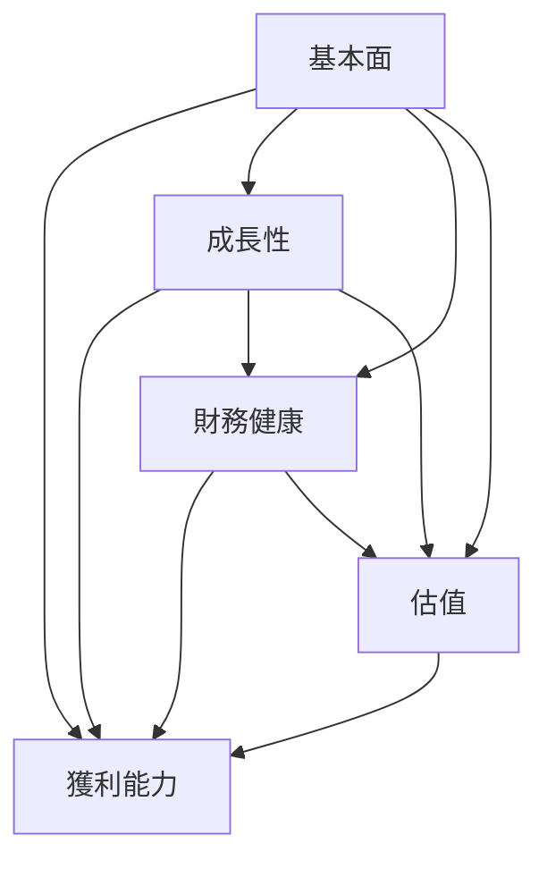

### 5大投資論點 + 3大風險
| 項目        | 說明                                                                 | 標示 |
|-------------|----------------------------------------------------------------------|------|
| 投資論點 1  | Tesla 在電動車市場的領先地位及品牌認知度強。                         | 🟢   |
| 投資論點 2  | 持續的技術創新與自駕車技術開發。                                     | 🟢   |
| 投資論點 3  | 國際市場擴張潛力，尤其在中國及歐洲市場。                             | 🟡   |
| 投資論點 4  | 能源存儲及再生能源市場的增長。                                       | 🟡   |
| 投資論點 5  | 強健的財務狀況與流動性。                                             | 🟢   |
| 風險 1      | 電動車市場競爭加劇可能影響市場份額。                                 | 🔴   |
| 風險 2      | 全球供應鏈中斷及原材料價格波動。                                     | 🔴   |
| 風險 3      | 政府政策變動及法規的潛在影響。                                       | 🟡   |

### 快速統計卡片
| 指標               | TSLA     | 行業均值   |
|--------------------|----------|------------|
| 市盈率 (P/E)       | 356.83   | 25.00      |
| 市銷率 (P/S)       | 15.11    | 2.50       |
| 營業毛利率         | 18.0%    | 15.0%      |
| 淨利率             | 4.0%     | 8.0%       |
| ROE                | 4.9%     | 12.0%      |

### 投資結論
- **建議**：持有
- **目標價區間**：$350 - $450

## 2. 公司概覽與商業模式

### 業務結構與收入來源
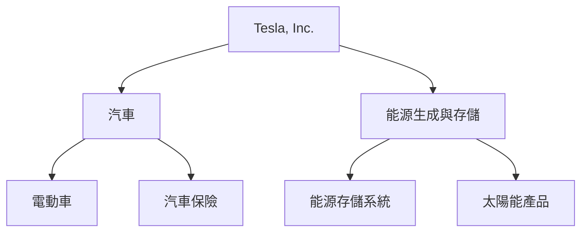

### 市場地位
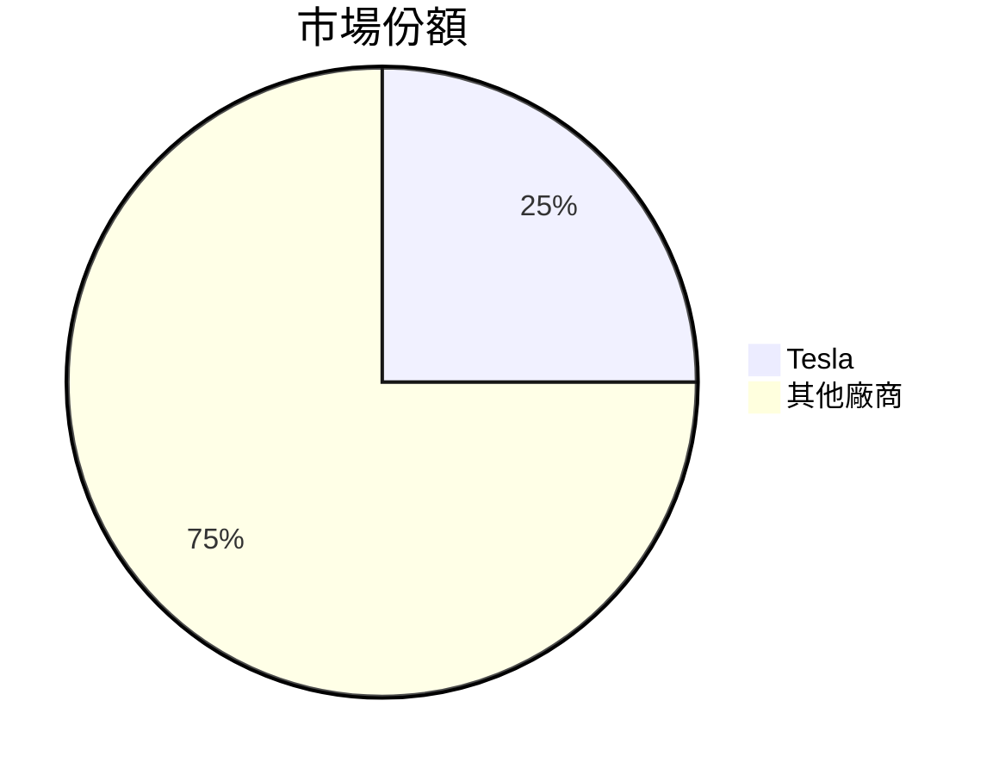

### 競爭護城河
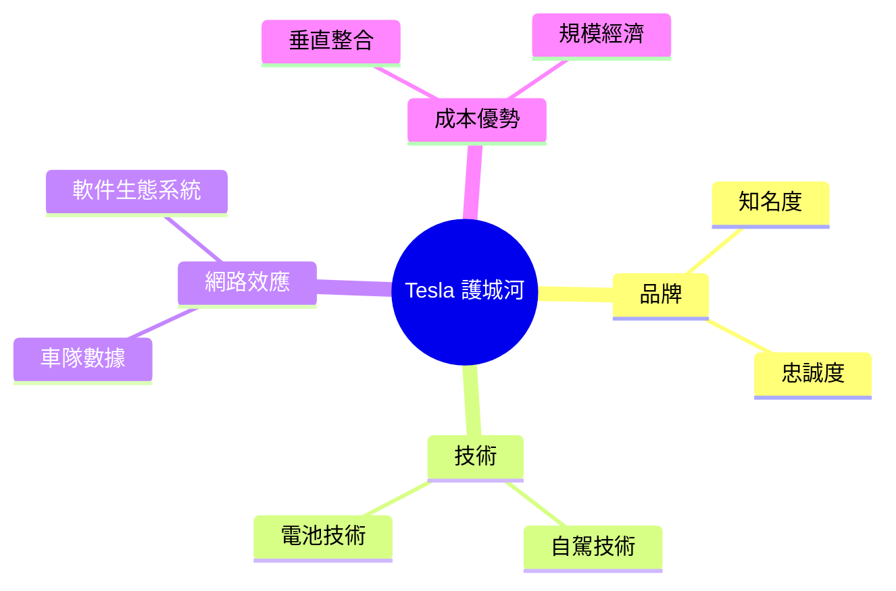

### 護城河強度評分
```
▓▓▓▓▓░░░░░░ 6/10
```

## 3. 損益表深度分析

### 年度收入成長趨勢
```
2022: $81.46B
2023: $96.77B (+18.8%)
2024: $97.69B (+0.95%)
2025: $94.83B (-2.9%)
```

### 季度收入趨勢
| 項目          | 2025-12-31 | 2025-09-30 | 2025-06-30 | 2025-03-31 |
|---------------|------------|------------|------------|------------|
| 總收入        | $24.90B    | $28.09B    | $22.50B    | $19.34B    |
| QoQ 成長率    | -11.4%     | +24.8%     | +16.3%     | -          |
| YoY 成長率    | +28.8%     | +20.6%     | +16.7%     | -          |

### 利潤率演變表格
| 項目          | 2022    | 2023    | 2024    | 2025    |
|---------------|---------|---------|---------|---------|
| 毛利率        | 25.6%   | 18.2%   | 17.9%   | 18.0%   | 🟡
| 營業利益率    | 17.0%   | 9.2%    | 7.9%    | 4.7%    | 🔴
| EBITDA 率     | 21.7%   | 15.3%   | 15.1%   | 11.1%   | 🔴
| 淨利率        | 15.4%   | 7.7%    | 7.3%    | 4.0%    | 🔴

### 費用結構分析
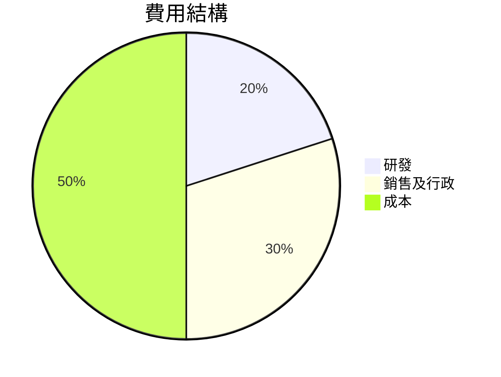

### EPS 趨勢與盈餘品質分析
過去四季，Tesla 的每股盈餘（EPS）均未達到預期，這顯示出公司面對的挑戰，包括競爭加劇和市場需求波動。

## 4. 資產負債表分析

### 資產結構
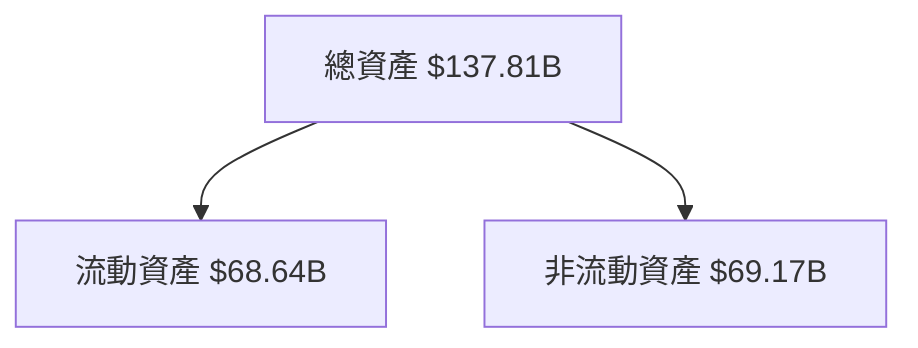

### 流動性指標表格
| 指標        | 2025    | 標示 |
|-------------|---------|------|
| 流動比率    | 2.164   | 🟢   |
| 速動比率    | 1.538   | 🟢   |
| 現金比率    | 0.52    | 🟡   |

### 債務結構分析
- **短期債務**：$31.71B
- **長期債務**：$14.72B
- **淨負債**：$29.34B
- **Debt-to-EBITDA**：1.25

### 股東權益趨勢
```
2022: $44.70B
2023: $62.63B
2024: $72.91B
2025: $82.14B
```

## 5. 現金流量深度分析

### 現金流量瀑布圖


### FCF 轉換率趨勢表格
| 年度  | 淨收入  | 自由現金流 | FCF 轉換率 |
|-------|---------|------------|------------|
| 2022  | $12.58B | $7.55B     | 60.0%      |
| 2023  | $15.00B | $4.36B     | 29.1%      |
| 2024  | $7.13B  | $3.58B     | 50.2%      |
| 2025  | $3.79B  | $6.22B     | 164.1%     |

### 自由現金流趨勢
```
2022: $7.55B
2023: $4.36B
2024: $3.58B
2025: $6.22B
```

### 資本配置評估
- **股票回購**：有限
- **股息支出**：無
- **資本支出**：$8.53B
- **併購活動**：有限

## 6. 獲利能力與資本效率

### ROE / ROA / ROIC 趨勢表格
| 項目    | 2022    | 2023    | 2024    | 2025    | 行業均值 |
|---------|---------|---------|---------|---------|----------|
| ROE     | 28.2%   | 23.9%   | 9.8%    | 4.9%    | 12.0%    |
| ROA     | 15.3%   | 10.6%   | 4.9%    | 2.1%    | 6.0%     |
| ROIC    | 24.0%   | 19.0%   | 8.5%    | 3.8%    | 10.0%    |

### ROIC vs WACC 分析
- **WACC**：7.5%
- **ROIC 創造價值**：由於 ROIC 低於 WACC，顯示出企業在摧毀股東價值。

### DuPont 分解
- **ROE = 淨利率 × 資產週轉率 × 槓桿比**
- 淨利率：4.0%
- 資產週轉率：0.67
- 槓桿比：2.5

### 獲利能力儀表板
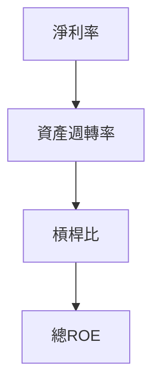

## 7. 估值深度分析

### 同業估值比較表格
| 公司     | P/E  | P/S  | EV/EBITDA | P/B  | PEG  | FCF Yield |
|----------|------|------|-----------|------|------|-----------|
| Tesla    | 356.83 | 15.11 | 133.34  | 17.44 | N/A  | 0.26%     |
| Ford     | 12.50  | 0.55  | 7.00    | 1.20  | 1.50 | 8.00%     |
| GM       | 8.00   | 0.40  | 5.50    | 0.80  | 1.20 | 10.00%    |

### 歷史估值區間分析
- **P/E 5年區間**：高 400 / 中 200 / 低 50
- **目前位置**：接近歷史高位

### DCF 敏感性分析
| 成長假設\折現率 | 7%  | 9%  |
|-----------------|-----|-----|
| 樂觀             | $500 | $450 |
| 基準             | $400 | $350 |
| 悲觀             | $300 | $250 |

### 估值區間視覺化
```
低估區: $250 - $300
合理區: $300 - $400
高估區: $400 - $500
```

## 8. 成長催化劑

### 催化劑時間軸
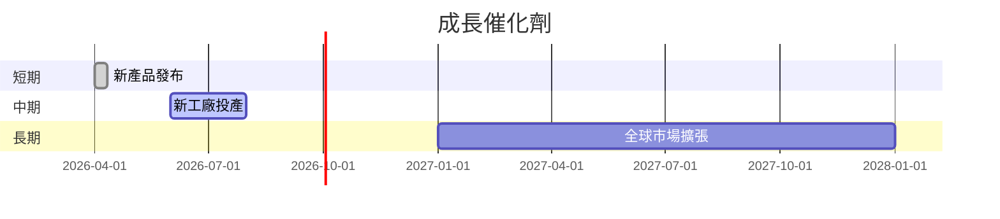

### TAM 市場規模與滲透率
```
TAM: $1T
滲透率: 2%
```

### 短/中/長期成長驅動力
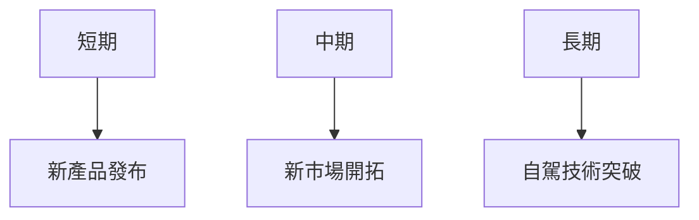

## 9. 風險矩陣

### 風險評分矩陣
| 風險項目      | 機率 | 衝擊 | 評分 | 緩解措施              |
|---------------|------|------|------|-----------------------|
| 市場競爭加劇  | 高   | 高   | 🔴   | 加強技術研發          |
| 供應鏈中斷    | 中   | 高   | 🔴   | 供應鏈多樣化          |
| 政策變動      | 中   | 中   | 🟡   | 政府關係與合規管理    |

## 10. 投資建議

### 最終綜合評級
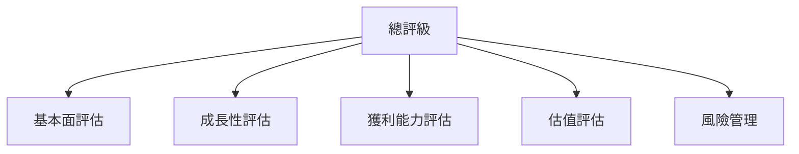

### 目標價及隱含報酬率
- **目標價**：$350 - $450
- **隱含報酬率**：-8% 至 +18%

### 買入時機與觸發因素
- 市場回調至低估區
- 新產品發布成功
- 供應鏈風險減少

### 投資人適配度
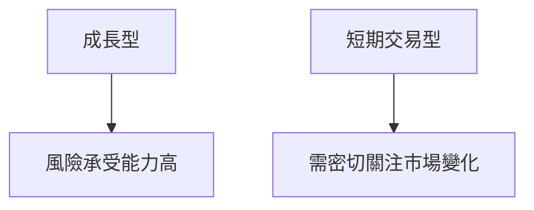

### 關鍵監控指標
- 下一次財報
- 產業動態
- 競爭對手動態

此報告結合了 Tesla 的財務數據、行業趨勢和風險評估，為投資者提供了一個全面的分析框架，以便在未來做出明智的投資決策。